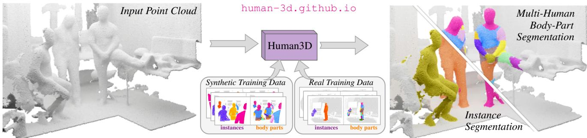
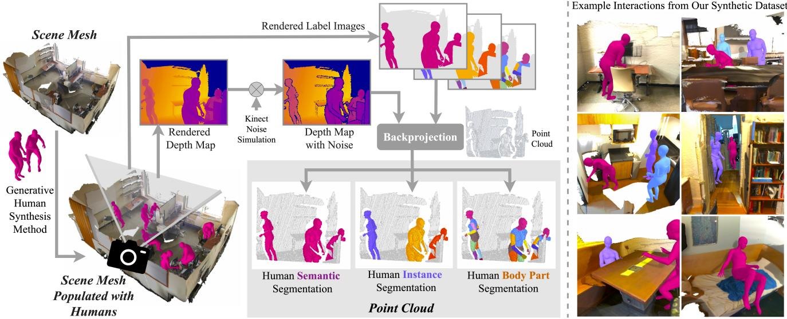
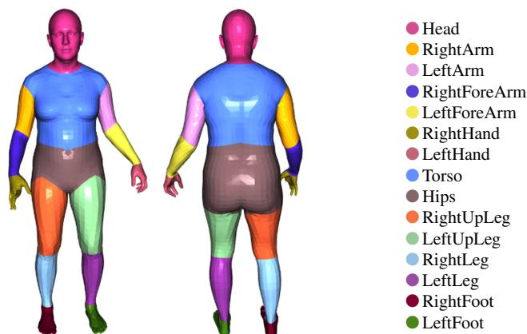
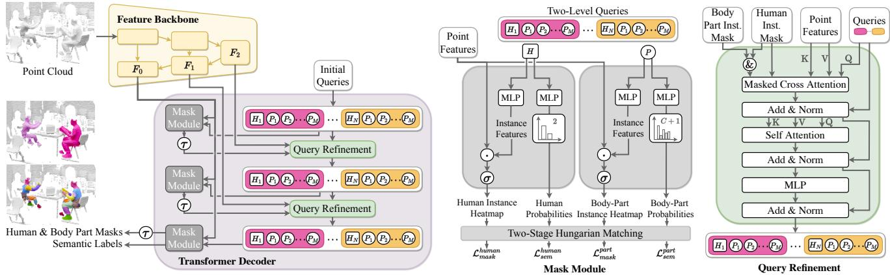
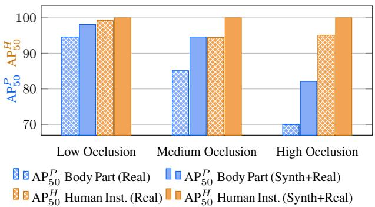
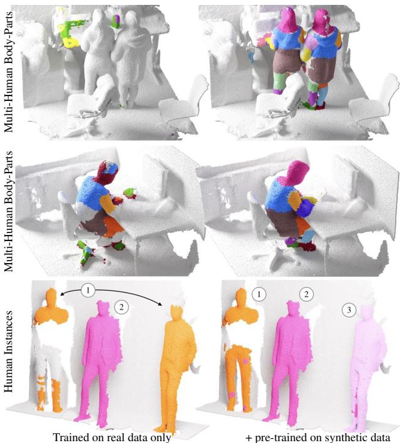
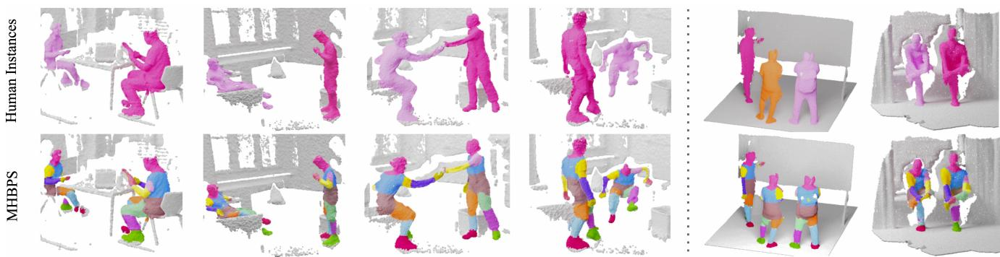

# 3D Segmentation of Humans in Point Clouds with Synthetic Data

Ayc¸a Takmaz∗1 Jonas Schult∗2 Irem Kaftan†1 Mertcan Akc¸ay†1 Bastian Leibe2 Robert Sumner1 Francis Engelmann1,3 Siyu Tang1 1ETH Zurich, Switzerland ¨ 2RWTH Aachen University, Germany 3ETH AI Center, Switzerland

  
Figure 1: We propose Human3D, the first end-to-end model for 3D multi-human body-part segmentation in point clouds. Motivated by the lack of diverse and accurately labeled 3D human datasets, we generate synthetic training data of virtual humans in realistic 3D indoor scenes and demonstrate its potential in combination with pseudo-labels on real data. Above, we show an in-the-wild example of our model that is trained on synthetic data and real Kinect depth data, and tested on a reconstructed point cloud scanned with an iPhone LiDAR sensor.

## Abstract

Segmenting humans in 3D indoor scenes has become increasingly important with the rise of human-centered robotics and AR/VR applications. To this end, we propose the task of joint 3D human semantic segmentation, instance segmentation and multi-human body-part segmentation. Few works have attempted to directly segment humans in cluttered 3D scenes, which is largely due to the lack of annotated training data of humans interacting with 3D scenes. We address this challenge and propose a framework for generating training data of synthetic humans interacting with real 3D scenes. Furthermore, we propose a novel transformer-based model, Human3D, which is the first end-to-end model for segmenting multiple human instances and their body-parts in a unified manner. The key advantage of our synthetic data generation framework is its ability to generate diverse and realistic human-scene interactions, with highly accurate ground truth. Our experiments show that pre-training on synthetic data improves performance on a wide variety of 3D human segmentation tasks. Finally, we demonstrate that Human3D outperforms even task-specific state-of-the-art 3D segmentation methods.

## 1 Introduction

In this work, we address the task of segmenting humans in point clouds. In particular, we focus on 3D semantic segmentation (humans vs. background), 3D instance segmentation (masking multiple humans) and 3D multi-human body-part segmentation (segmenting human instances together with their body parts) as shown in Fig. 1 (right).

As human-centered robotics and embodied AI are becoming more popular, there has been a growing interest in the development of methods for 2D human segmentation [11, 23, 25, 29, 81, 82, 87] and 3D human detection and segmentation [14, 36, 38, 64, 78]. While image-based methods have inherent limitations in their ability to reason in 3D, existing 3D methods mainly focus on simplified scenarios in which they only consider individual humans with pre-defined foreground segmentation masks and minimal occlusions. Real-life 3D scenarios, however, are typically cluttered, which can lead to strong occlusions when humans interact closely with each other and their environment.

3D segmentation of humans in point clouds (or depth maps) is a critical aspect of perceiving humans in various applications, such as AR/VR and robotics, in which depth sensors are commonly available and heavily used. For such applications, using point clouds has certain advantages. First, point clouds provide accurate scale and geometry, and are robust against illumination changes. Second, in the realm of human-related computer vision, point clouds are less biased towards visual appearance of humans. This can improve model fairness, and ensures better privacy when collecting data of real humans.

Although there have been significant advancements in 3D scene understanding methods that operate directly on point clouds and segment indoor objects [15, 56, 63, 68], these advancements have not yet translated to the task of 3D human segmentation due to a lack of annotated humans in popular 3D indoor training datasets [1, 8, 16]. These indoor datasets usually lack diverse scenarios involving interactions between humans and cluttered real-world indoor environments. While outdoor datasets [4, 6] provide labels for pedestrians, they are limited in terms of human poses, actions, and occlusion patterns, making them less practical for indoor applications where humans closely interact with their surroundings. More recently, new datasets (BEHAVE [5], RICH [34], EgoBody [84]) provide depth recordings of humans interacting with their surroundings and other people. They are labeled with pseudo-ground truth human body meshes [49, 58] via multi-view registration processes relying on image segmentation and manual cleaning. To facilitate the labeling process, these datasets are often limited in terms of scene complexity, the number of people and poses, as well as occlusion and truncation patterns. Nevertheless, while tedious to annotate, these datasets can serve as realistic pseudo-labels for training 3D human segmentation tasks.

The key issue of recording and labeling real humans in complex indoor scenes is the time-consuming annotation process and thus its limited scalability. A promising alternative is synthesizing virtual humans as training data. Synthetic training data contains perfect labels that are impossible to annotate manually, and the creators have full control over dataset variation and diversity. Compared to generating color images, where it is challenging to render photorealistic humans [77], generating depth scans of 3D humans in 3D scenes is significantly easier, as the domain gap between real and synthetic point clouds is much smaller.

In this work, we describe a framework for synthesizing virtual humans in realistic environments, and show that it is possible to create synthetic training data that helps to improve 3D human segmentation in-the-wild. In addition, we propose a novel transformer-based model, called Human3D, that performs a wide variety of 3D human segmentation tasks in a unified manner. Human3D is the first model that directly addresses 3D multi-human body-part segmentation in point clouds of realistic environments. Human3D relies on a novel mechanism using two-level queries to jointly segment human instance masks and their associated body parts. Our experiments consistently demonstrate that pre-training models with synthetic data and finetuning with real data yields significant improvements over models trained exclusively on real data. Furthermore, our Human3D model trained for multi-human body-part segmentation achieves superior performance compared to taskspecific state-of-the-art models for both 3D semantic and instance segmentation.

In summary, our contributions are as follows:

• Human3D, the first multi-human body-part segmentation model, that operates directly on real-world cluttered indoor 3D scenes.

• An approach for generating synthetic data of humans in 3D scenes and its use for synthesizing training data to improve 3D human segmentation.

• Manual annotation of 3D human instances on EgoBody [84] to evaluate human segmentation tasks.

• Extensive analysis showing the benefits of pre-training on synthetic data on multiple baselines and tasks.

## 2 Related work

Multi-human parsing (MHP). The goal of MHP is to segment multiple human instances along with their body parts. While well-explored in images [11, 23, 29, 81, 82, 87], it received less attention in point clouds. Several approaches [81, 82] are based on Mask R-CNN [29] which is one of the most effective methods for 2D instance segmentation. Yang et al. proposed RP R-CNN [81] which combines instance segmentation with semantics using a global semantics-enhanced feature pyramid network. While all of these methods require color images and cannot operate on purely geometric data such as point clouds, MHP and multihuman body-part segmentation in 3D are two very related tasks. As RP R-CNN [81] defines the state-of-the-art in MHP and is easily adaptable to our task, we consider RP R-CNN as a natural choice for a strong baseline.

Segmenting humans in depth scans. Several methods have been proposed for detecting humans [14, 78] and segmenting humans or body parts in depth scans [36,38,64,78]. Unlike ours, these methods often assume a given human segmentation mask, are limited to a single or few humans, and cannot handle strong occlusions. Instead, we focus on segmenting humans and body parts in real 3D scenes with multiple interacting people under strong occlusions.

3D semantic and instance segmentation. The goal of 3D semantic segmentation is to assign a semantic label to each point in a given 3D scene [1,2,15,21,22,24,32,33,35,40,44, 46, 48, 51, 59, 60, 66, 68, 73, 76, 79]. Instance segmentation further separates multiple objects within the same semantic class [13,19,20,26,31,37,41,43,63,71,74,80,83]. The field is largely driven by datasets [1, 8, 16] which ignore human labels, so these methods usually cannot segment humans. In this work, we train state-of-the-art methods KPConv [68], MinkowskiUNet [15], and Mask3D [63] on our proposed data, and compare them on different human segmentation tasks. Building on [15, 63], we propose the first end-to-end model for 3D multi-human body-part segmentation. In particular, the key idea of Human3D is to use two-level queries where the first level represents human masks and the second level represents their associated body parts.

  
Figure 2: Synthesizing training scenes. Left: Given a scene mesh from ScanNet [16], we populate it with synthetic humans based on PLACE [85]. We then render label maps and depth maps augmented with simulated Kinect noise [27]. Finally, the labels are backprojected to 3D using the synthesized depth maps to obtain highly accurate labels for human semantic, instance, and body-part segmentation. Right: Example interactions from our synthetic dataset featuring multiple humans, various occlusion levels and close contact with scene objects.

Synthetic data generation. Accurately annotating large amounts of data is tedious and occasionally not feasible, e.g. human body-part segmentation. This motivates an emerging trend towards synthesizing training data for various computer vision tasks [3, 18, 30, 47, 57, 61, 69, 70, 75, 77]. SURREAL [70] synthesizes 2D humans on top of real color images. However, the synthesized humans are not conditioned on the images, which results in unrealistic renderings. HSPACE [3] is a large-scale dataset of synthetic humans in synthetic indoor and outdoor environments, focusing on generating realistic color images. HUMANISE [75] is a language-conditioned human motion generator in 3D scenes and provides a dataset of synthetic, moving humans. Alternative methods [28,67,85,86] populate 3D scenes with synthetic humans. PLACE [85] synthesizes realistic 3D humans with natural poses conditioned on a given 3D scene. We extend PLACE to generate multiple 3D humans in Scan-Net [16] scenes and condition the human generation to interactions with specific scene objects (e.g., sofa, bed, chair).

## 3 Data Generation

In Sec. 3.1, we describe our framework for generating synthetic training data for human instance and body-part segmentation tasks. Then in Sec. 3.2, we describe our real data collection, processing and annotation pipelines.

## 3.1 Synthetic Training Data Generation

Fig. 2 illustrates our framework for generating synthetic training data. It populates real indoor scenes with synthetic humans and automatically generates labeled point clouds with perfect human and body-part labels that are otherwise difficult to obtain by manual labeling.

Populating 3D indoor scenes. We populate indoor 3D scenes from ScanNet [16], although our pipeline is suitable for other 3D indoor datasets as well [1, 8, 72]. To place synthetic humans in a given scene, we base our pipeline on PLACE [85], which is a generative human-scene interaction synthesis method. In order to obtain a large variety of human poses and close human-scene interactions, we modify [85] to perform instance segmentation-guided human placement. In our approach, we first identify object categories with which humans can naturally have close contact (e.g. chairs, tables), and use 3D object instance labels from ScanNet [16] to select these objects in the human-scene interaction synthesis process. We then sample potential interaction objects to generate up to 10 synthetic humans per scene, along with their SMPL-X [58] body parameters. The human synthesis approach is scene-aware as it encodes the nearby scene features. Our pipeline enables us to generate humans in various poses while taking human-scene proximity into account for close interactions. Further details about the human synthesis pipeline are in the sup. mat. Sec. 1.

Rendering. We render depth maps and label images from scene meshes we populate with humans. A virtual camera is placed at the scene center (arithmetic mean of the scene vertex coordinates), and its height is uniformly sampled from [1.4, 1.6]m to reflect the height of a potential handheld capture device (e.g. mobile phone, tablet). Camera viewing direction is always in parallel to the ground plane (xy-plane) and is rotated around the vertical axis by an amount uniformly sampled within [0 , 360 ). Rendered label images include annotations for semantics, instances, and multi-human body-parts (Fig. 2, top). We capture 40 frames per ScanNet scene, and re-sample the camera pose at each iteration. Further details about camera placement and sampling parameters are provided in the sup. mat. Sec. 1.2.

  
Figure 3: Body-parts. After merging smaller parts into larger ones (e.g. eyes into head), we obtain 15 body-part labels.

Simulating Kinect noise. We further refine the rendered depth maps by simulating Kinect noise using [27] to more closely mimic the depth data from a real Kinect sensor, as we use real Kinect data from EgoBody [84] for evaluation (Sec. 5.1). This allows us to combine real Kinect data (Sec. 3.2.1) and synthetic data for training. In preliminary studies, we found that simulating Kinect noise positively influences the segmentation quality. Please see sup. mat. Sec. 1.3 and Fig. 2 for further details and illustrations.

Labeled point clouds. The resulting depth maps and label images are back-projected into 3D space to obtain perfectly labeled partial point clouds. We use this pipeline to create a synthetic dataset for human semantic, instance, and multihuman body-part segmentation (MHBPS). For MHBPS, we map the faces of each SMPL-X [58] mesh to body-parts according to [53], then merge smaller parts into larger ones (e.g. eyes into head) and obtain 15 body-part classes. Resulting list of body parts is illustrated in Fig. 3. Please see the sup. mat. Sec. 1.5-1.6 and Tab. 1 for additional details.

## 3.2 Real Data Collection

## 3.2.1 Pseudo Training Labels on Real Data

Besides the synthetic data with perfect labels, we can also use real training data even though it requires expensive and time-consuming capturing processes and it produces less accurate, i.e. pseudo, labels. We use the recently released 3D human-scene interaction datasets EgoBody [84] and BEHAVE [5]. BEHAVE includes sequences of individual humans interacting with a single object in a mostly empty scene. EgoBody features social interactions between two humans captured in more cluttered static scenes. Both datasets provide multi-view depth recordings from several Kinect sensors, and carefully fitted SMPL [49] or SMPL-X [58] human body models. We obtain point clouds by back-projecting the Kinect depth to 3D and utilize the fitted body model parameters to obtain 3D human segmentation masks. We obtain body-part labels by selecting scene points within a fixed distance (5 cm) from the fitted body mesh, and assign each point to the closest body-part in the fitted body. Please refer to sup. mat. Sec. 2 for more details.

## 3.2.2 Manually Refined Evaluation Dataset

Pseudo-ground truth labels for human masks and body parts that were extracted using multi-view fitted body models from EgoBody (as described in Sec. 3.2.1) can be noisy in certain scenarios such as close-contact interactions with scene objects (e.g. sitting on a sofa), loose clothing (e.g. wide-legged jeans) or unusual poses (causing a mismatch between the fitted body mesh and real human point cloud). As we cannot rely on noisy pseudo-labels for the evaluation of our model, we created a manually refined evaluation set based on the EgoBody dataset for a rigorous evaluation.

Splits. The EgoBody [84] dataset contains 125 interaction sequences captured by multiple Kinect cameras. As the original train/validation/test split was created with an aim to separate first-person view subjects (the subject observed by the other subject wearing a head-mounted device) in each sequence, we created a new split such that none of the subjects overlap across splits. Our split consists of 73 training sequences, 11 validation sequences, as well as 38 test sequences, while 3 sequences were removed to ensure a non-overlapping distribution of subjects across splits.

Manual refinement. For each of the selected 38 test sequences, expert annotators have annotated 8 scenes (point clouds), resulting in a test set consisting of 304 point clouds featuring a large variety of human poses, action types and occlusion levels. The annotation process is performed using a 3D annotation tool [39]. The labeling process is initialized with the noisy pseudo-labels for human instances based on the existing multi-view fitted human meshes (Sec. 3.2.1). Then, the human instance masks are manually refined by the annotators. Body part label refinement is then guided by the resulting ground-truth human instance masks such that each point in the human mask is assigned to the closest body part in the original fitted body, and each point outside of the refined human mask is removed from the body part mask. Further details are in the sup. mat. Sec. 2.

## 4 Multi-Human Body-Part Segmentation

Our approach, Human3D, addresses the task of multihuman body-part segmentation (MHBPS) on 3D point clouds, i.e. it detects individual human instances and semantically partitions them into body-parts. Complex 3D indoor environments, diverse human-object interactions, and close distances between humans make this task challenging. Not only is it required to correctly segment the body-parts, but it is also needed to correctly associate the body-parts with human instances. This needs capturing well-localized geometric details and high-level semantic context.

  
Figure 4: Illustration of the Human3D model. Our model consists of a sparse convolutional feature backbone and a transformer decoder (left). The mask module jointly predicts human instance masks and body-part masks based on two-level queries (middle), which are iteratively refined based on multi-scale point features within the predicted human instance mask (right). represents human queries and represents body-part queries. applies a threshold of 0.5, is the sigmoid function and is the dot product operation.

Inspired by the success of Mask3D [63] for 3D instance segmentation, we propose a transformer-based model with two dedicated query types: one for humans and one for body-part instances. We call these two-level queries. This key technical contribution enables the structured differentiation between human-level queries and body-part-level queries (See Fig. 4). It is also essential to explicitly tie human masks together with their corresponding body-part masks during training such that body-part queries of one person are not supervised with ground truth masks of another person. Furthermore, we introduce a two-stage Hungarian matching mechanism, which guarantees that each ground truth human and body-part instance has a unique match with a predicted human instance and its associated body-parts. This matching explicitly enforces that human queries are tied to their respective body-part queries.

Overview. Our Human3D model is illustrated in Fig. 4. Our architecture consists of (1) a sparse convolutional feature backbone (∎◻) implemented as a MinkowskiUNet [15], (2) a query refinement step (∎◻) implemented as a masked transformer decoder (∎◻) [12] which iteratively refines human and body-part queries by cross-attending to the multiresolution hierarchy of the backbone decoder’s point features $\{ F _ { i } \} _ { i = 0 } ^ { 2 } .$ , and (3) a mask module (∎◻) which predicts heatmaps for human and body-part instances together with their associated semantic class label.

Human and Part Query Types. The key technical contribution of this model, compared to prior work [63], is the two-level query types where each level specializes on one downstream task: The first level represents the human queries $H _ { 1 } , . . . , H _ { N }$ (shown as in Fig. 4) which are trained to segment up to N human instances in a scene. The second level represents the body-part queries $\{ P _ { 1 } ^ { i } , . . . , P _ { M } ^ { i } \} _ { i = 1 } ^ { N }$ (shown as in Fig. 4). To each one of the N human queries, we associate M body-part queries. This explicit modelling of correspondences between M body-part queries and a single corresponding human query, results in two important properties: (1) We can directly extract the body-part segmentation for each human instance and (2) during query refinement (Fig. 4, ∎◻), we enable information flow between human instances and body-parts via selfattention among human and body-part queries. We therefore update human instance masks based on their predicted body-part masks, and vice versa. Further, we tie body-parts to their associated human instance, by restricting body-parts to only cross-attend to backbone point features which lie within the corresponding human mask (Fig. 4 , right).

Two-Stage Hungarian Matching. Human3D infers N human instances and N ⋅ M body-parts during a single feed forward pass of the model. As these predictions as well as the ground truth targets are unordered, we need to find optimal correspondences between these two sets in order to optimize the model. Typically, the Hungarian Algorithm [42] is deployed to find such optimal correspondences [7,12,63]. However, for MHBPS we cannot simply match human and body-parts independently. We additionally have to guarantee that both the predicted body-part masks and the human mask are mapped to target body-part masks and target human mask of the same human. We therefore introduce a two-stage Hungarian matching approach:

In the first stage, we define the assignment cost for a predicted human instance h and a target instance $\hat { h }$ as follows:

$$
\mathcal { C } _ { 1 } \big ( h , \hat { h } \big ) = \mathcal { L } _ { \mathrm { m a s k } } ^ { \mathrm { h u m a n } } ( h , \hat { h } ) + \mathcal { L } _ { \mathrm { s e m } } ^ { \mathrm { h u m a n } } ( h , \hat { h } )\tag{1}
$$

def two\_stage\_matching(h\_mask, h\_prob, p\_mask,   
2 p\_prob, h\_gt, p\_gt):   
3 # human-level: h\_mask, h\_prob and GT h\_gt   
4 # part-level: p\_mask, p\_prob and GT p\_gt   
5   
6 # 1-stage: human-level predictions <-> GT   
7 h\_indx, loss = Hungarian(h\_mask, h\_prob, h\_gt)   
8 L\_total = loss   
9   
10 # for each (pred, gt) matched human instance   
11 for (pred\_i, gt\_j) in h\_indx:   
12 mask = p\_mask[pred\_i]   
13 prob = p\_prob[pred\_i]   
14 gt = p\_gt[gt\_j]   
15   
16 # 2-stage: part-level predictions <-> GT   
17 \_, p\_loss = Hungarian(mask, prob, gt)   
18   
19 L\_total += p\_loss   
20 return L\_total  
Listing 1: Two-Stage Hungarian Matching Algorithm.

The cost for matching human masks is a weighted combination of the Dice loss [17] and binary cross-entropy ${ \mathcal { L } } _ { \mathrm { m a s k } } ^ { \mathrm { h u m a n } } = { \lambda } _ { \mathrm { B C E } } { \mathcal { L } } _ { \mathrm { B C E } } + { \lambda } _ { \mathrm { d i c e } } { \mathcal { L } } _ { \mathrm { d i c e } }$ while the semantic classificaton loss is defined as $\mathcal { L } _ { \mathrm { s e m } } ^ { \mathrm { h u m a n } } { = } \lambda _ { \mathrm { c l } } \mathcal { L } _ { \mathrm { C E _ { c l } } }$ . Using the Hungarian Algorithm [42], we find a globally optimal assignment between predicted and ground-truth human instances. Following [7], we represent this assignment by a permutation $\sigma \in { \mathfrak { S } } _ { N }$ which maps the target human instance $\hat { h } ^ { j }$ to the predicted human instance $h ^ { \sigma ( \breve { j } ) }$ . We then use this optimal assignment between human masks to match their corresponding body-parts p using the following cost matrix:

$$
\mathcal { C } _ { 2 } \big ( p ^ { \sigma ( j ) } , \hat { p } ^ { j } \big ) = \mathcal { L } _ { \mathrm { m a s k } } ^ { \mathrm { p a r t } } \big ( p ^ { \sigma ( j ) } , \hat { p } ^ { j } \big ) + \mathcal { L } _ { \mathrm { s e m } } ^ { \mathrm { p a r t } } \big ( p ^ { \sigma ( j ) } , \hat { p } ^ { j } \big )\tag{2}
$$

$\mathcal { L } _ { \mathrm { m a s k } } ^ { \mathrm { p a r t } }$ and $\mathcal { L } _ { \mathrm { s e m } } ^ { \mathrm { p a r t } }$ are analogously defined to their human instance counterparts $\mathcal { L } _ { \mathrm { m a s k } } ^ { \mathrm { h u m a n } }$ and $\mathcal { L } _ { \mathrm { { s e m } } } ^ { \mathrm { { h u m a n } } }$ . After establishing correspondences between human masks and their corresponding body-parts, we optimize all auxiliary predictions after each of the L query refinement steps:

$$
\begin{array} { r } { \mathcal { L } = \Sigma _ { l } ^ { L } \mathcal { L } _ { \mathrm { m a s k } } ^ { \mathrm { h u m a n } , l } + \mathcal { L } _ { \mathrm { s e m } } ^ { \mathrm { h u m a n } , l } + \mathcal { L } _ { \mathrm { m a s k } } ^ { \mathrm { p a r t } , l } + \mathcal { L } _ { \mathrm { s e m } } ^ { \mathrm { p a r t } , l } } \end{array}\tag{3}
$$

This loss enforces that human masks as well as their bodypart masks are matched to the same ground truth human.

We provide an outline of the Two-Stage Hungarian Matching algorithm in Listing 1.

Extracting body-part segmentations. Human3D represents body-parts as instances. We therefore now describe how we merge these body-part instances to obtain a semantic body-part segmentation for each human instance. First, we restrict body-parts to lie within their corresponding human instance masks, i.e. points of body-parts outside the human mask are set to background. Second, for each point in the human mask, we obtain the semantic body-part label of the body-part instance mask with the highest confidence. If the highest confidence is below 10%, we ignore the prediction and assign the point to background.

## 5 Experiments

In this section, we first compare our Human3D model with state-of-the-art segmentation methods for 3D point clouds and 2D images (Sec. 5.1). We then provide analysis experiments on occlusions, an ablation study of Human3D and demonstrate the benefits of pre-training with synthetic data (Sec. 5.2). Finally, we show qualitative results of our approach (Sec. 5.3). Additional analysis is provided in the supplementary material Sec. 4 and Sec. 5.

## 5.1. Comparing with State-of-the-Art Methods

Dataset and Test Annotations. We train on our synthetic data with perfect labels (Sec. 3.1), and on real data with pseudo labels (Sec. 3.2.1). For a rigorous evaluation, we further require accurate per-point ground truth labels since we cannot rely on the noisy pseudo-labels. As no such dataset exists, we contribute new annotations based on Ego-Body (please see Sec 3.2.2). We define a test split such that there is no overlap of human subjects with the training set. The labeling process is initialized with the noisy pseudo-labels based on the existing multi-view fitted human meshes [84]. Expert annotators then manually label the test scenes using an interactive point cloud labeling tool [39] to refine the noisy instance masks (illustrated in supplementary material Fig. 6-7). For body-part labels, pseudoground truth labels are refined using the manually corrected instance masks. The test set contains 304 point clouds and 608 humans with various poses, actions, and occlusions.

Tasks and Metrics. We evaluate our approach on three different 3D point cloud tasks: human/parts semantic segmentation, human instance segmentation and multi-human body-part segmentation (MHBPS). For human semantic segmentation and body-part semantic segmentation, we report the mean intersection-over-union (denoted as mIoUH and mIoUP). For instance segmentation, we use the average precision (AP). We denote human instance segmentation scores as $\mathbf { A } \mathbf { P } ^ { H }$ , and multi-human body-part segmentation scores (MHBPS) as $\mathbf { A } \mathbf { P } ^ { P }$ . For MHBPS, we additionally report the percentage of correctly parsed body parts (PCP) used by the 2D multi-human parsing community [45]. Metrics are evaluated at overlaps of 25%, 50%, and averaged over the range [0.5:0.95:0.05] as in ScanNet [16].

Human3D Training Details. For pre-training and finetuning, we train Human3D for 36 epochs each. We optimize the network with AdamW [50] and a one-cycle learning rate scheduler [65] with a maximal learning rate of $1 0 ^ { - 4 }$ and a batch size of 4 scenes. Data augmentation includes horizontal flipping, random rotations around the z-axis, elastic distortion [62], and random scaling by Uniform[0.9, 1.1]. Training (including pre-training and fine-tuning) with 2 cm voxels takes 5 days on a single NVIDIA RTX 3090 GPU.

Methods in Comparison. We compare with a wide range of prior-art methods adapted for 3D human segmentation. MinkowskiUNet [15] and KPConv [68] are voxelbased and point-based 3D semantic segmentation methods. Mask3D [63] is the state-of-the-art for 3D instance segmentation. We additionally compare with two 2D image baselines: The first one, proposed in [84], obtains human semantic masks from a pre-trained DeepLabv3 [9] applied to Kinect RGB images. Human instance masks come from a pre-trained Mask-RCNN [29]. The final 2D human instance masks are the intersection of the semantic and instance masks. Body-parts are not predicted. The second baseline, RP R-CNN [81], is a recent 2D multi-human part segmentation method. We finetune their checkpoint on our projected 2D EgoBody body-part labels. For both baselines, we backproject the 2D predictions into 3D for evaluation.

<table><tr><td rowspan="2">Instance segmentation model</td><td rowspan="2">Body-part segmentation model</td><td colspan="6">3D Multi-Human Body-Part Segmentation</td><td colspan="3">3D Instance Seg.</td><td colspan="2">3D Semantic Seg.</td></tr><tr><td> $\mathbf { A } \mathbf { P } ^ { P }$ </td><td> $\mathbf { A P } _ { 5 0 } ^ { P }$ </td><td> $\mathbf { A P } _ { 2 5 } ^ { P }$ </td><td> $\mathrm { P C P }$ </td><td> $\mathrm { P C P _ { 5 0 } }$ </td><td> $\mathrm { P C P _ { 2 5 } }$ </td><td> $\mathbf { A } \mathbf { P } ^ { H }$ </td><td> $\mathbf { A P } _ { 5 0 } ^ { H }$ </td><td> $\mathsf { A P } _ { 2 5 } ^ { H }$ </td><td> $\mathrm { m I o U } ^ { H }$ </td><td> $\overline { { { \bf \Pi } _ { \mathrm { m I o U } } { \cal P } } }$ </td></tr><tr><td>MinkUNet [15] (Human) + Cluster</td><td>MinkUNet [15] (Body Part)</td><td>8.9</td><td>34.8</td><td>82.5</td><td>8.1</td><td>30.6</td><td>58.5</td><td>68.2</td><td>83.6</td><td>89.4</td><td>92.2</td><td>50.8</td></tr><tr><td>MinkUNet [15] (Body Part) + Cluster</td><td>MinkUNet [15] (Body Part)</td><td>9.1</td><td>36.0</td><td>84.7</td><td>8.6</td><td>32.6</td><td>63.7</td><td>76.5</td><td>87.2</td><td>91.1</td><td>92.5</td><td>51.3</td></tr><tr><td>Mask3D [63] (Human)</td><td>MinkUNet [15] (Body Part)</td><td>5.9</td><td>29.9</td><td>90.9</td><td>9.2</td><td>33.9</td><td>65.4</td><td>95.6</td><td>98.7</td><td>99.7</td><td>97.6</td><td>53.3</td></tr><tr><td>Mask3D [63] (Human)</td><td>KPConv [68] (Body Part)</td><td>25.5</td><td>75.8</td><td>98.7</td><td>24.4</td><td>60.3</td><td>74.8</td><td>95.6</td><td>98.7</td><td>99.7</td><td>97.6</td><td>64.5</td></tr><tr><td>KPConv [68] (Human) + Cluster</td><td>KPConv [68] (Body Part)</td><td>28.2</td><td>74.7</td><td>96.3</td><td>22.9</td><td>58.4</td><td>73.1</td><td>89.7</td><td>95.3</td><td>97.0</td><td>96.7</td><td>63.6</td></tr><tr><td>KPConv [68] (Body Part) + Cluster</td><td>KPConv [68] (Body Part)</td><td>28.8</td><td>76.2</td><td>97.8</td><td>23.4</td><td>59.4</td><td>74.3</td><td>89.3</td><td>97.6</td><td>98.6</td><td>96.8</td><td>64.3</td></tr><tr><td colspan="2">Mask-RCNN+DeepLabv3 2D-3D (as in [84])</td><td>一</td><td>一</td><td></td><td>一</td><td></td><td>一</td><td>61.3</td><td>97.3</td><td>99.8</td><td>87.7</td><td>一</td></tr><tr><td colspan="2">RP R-CNN 2D-3D [81]</td><td>26.8</td><td>80.5</td><td>97.3</td><td>21.8</td><td>61.5</td><td>77.6</td><td>74.6</td><td>97.2</td><td>97.9</td><td>92.1</td><td>58.9</td></tr><tr><td colspan="2">Human3D (Ours)</td><td>35.8</td><td>93.2</td><td>99.1</td><td>32.6</td><td>73.5</td><td>84.0</td><td>99.1</td><td>100</td><td>100</td><td>98.3</td><td>69.9</td></tr></table>

Table 1: 3D Multi-Human Body-Part Segmentation on EgoBody test set. Metrics are average precision for body-parts $( \mathbf { A P } ^ { P } )$ and humans $( \mathsf { A P } ^ { H } ) .$ , correctly parsed semantic parts (PCP) and intersection-over-union on humans $( \mathrm { I o U } ^ { \overline { { H } } } )$ and parts $( \mathrm { I o U } ^ { P } )$ . Brackets indicate on which segmentation task the baselines are trained. 3D models are pre-trained on synthetic and fine-tuned on real EgoBody data.
<table><tr><td rowspan="2">Model</td><td colspan="2">Trained on EgoBody</td><td colspan="2">Pre-trained on Synthetic Fine-tuned on EgoBody</td></tr><tr><td> $\overline { { \mathsf { A P } ^ { H } } }$ </td><td> $\mathsf { A P } _ { 5 0 } ^ { H }$ </td><td> $\overline { { \mathsf { A P } ^ { H } } }$ </td><td> $\mathsf { A P } _ { 5 0 } ^ { H }$ </td></tr><tr><td>MinkUNet [15] (Human) + Cluster</td><td>64.9</td><td>79.6</td><td>68.2 (+3.3)</td><td>83.6 (+4.0)</td></tr><tr><td>MinkUNet [15] (Body Part) + Cluster</td><td>69.1</td><td>81.7</td><td>76.5 (+7.4)</td><td>87.2 (+5.5)</td></tr><tr><td>KPConv [68] (Human) + Cluster</td><td>85.4</td><td>92.2</td><td>89.7 (+4.3)</td><td>95.3 (+3.1)</td></tr><tr><td>KPConv [68] (Body Part) + Cluster</td><td>86.9</td><td>94.4</td><td>89.3 (+2.4)</td><td>97.6 (+3.2)</td></tr><tr><td>Mask3D [63]</td><td>89.4</td><td>95.4</td><td>95.6 (+6.2)</td><td>98.7 (+3.3)</td></tr><tr><td>Human3D (Ours)</td><td>90.5</td><td>95.2</td><td>99.1 (+8.6)</td><td>100 (+4.8)</td></tr></table>

Table 2: 3D Instance Segmentation Scores on EgoBody test. We observe that pre-training with synthetic data results in improvements by up t $) + 8 . 6 \mathrm { A P } ^ { H }$ . Further, Human3D outperforms task-specialized models (e.g. Mask3D) by at least $+ 3 . 5 \bar { \mathbf { A } } \bar { \mathbf { P } } ^ { H }$

<table><tr><td></td><td colspan="3">Trained on EgoBody</td><td colspan="3">Pre-trained on Synthetic Fine-tuned on  $E g o B o d y$ </td></tr><tr><td>Model</td><td>Scene Human</td><td></td><td>mIoUH</td><td></td><td>Scene Human</td><td>mIoUH</td></tr><tr><td>MinkUNet [15]</td><td>97.5</td><td>85.2</td><td>91.3</td><td>98.0</td><td>87.9</td><td>92.2 (+0.9)</td></tr><tr><td>KPConv [68]</td><td>98.9</td><td>93.4</td><td>96.1</td><td>99.1</td><td>94.4</td><td>96.7 (+0.6)</td></tr><tr><td>Mask3D [63]</td><td>98.4</td><td>90.9</td><td>94.7</td><td>99.3</td><td>95.9</td><td>97.6 (+2.9)</td></tr><tr><td>Human3D (Ours)</td><td>94.5</td><td>99.0</td><td>96.8</td><td>99.5</td><td>97.0</td><td>98.3 (+1.5)</td></tr></table>

Table 3: 3D Semantic Segmentation Scores on EgoBody test. We perform binary segmentation (scene vs. human). We report per-class (scene vs. human) IoU and mean IoU $( \mathrm { m I o U } ^ { H } )$ For Mask3D and Human3D, human instance masks are merged prior to computing the semantic segmentation scores. Synthetic data pre-training results in improvements of up to +2.9 mIoUH .

3D Multi-Human Body-Part Segmentation (MHBPS). Tab. 1 shows MHBPS scores of the baselines and our Human3D. The task is to detect individual human instance masks and partition them into body parts. Since there are no existing baseline models that directly predict MHBPS from point clouds, we construct strong baselines using existing 3D instance [63] and 3D semantic segmentation [15, 68] methods and solve two subtasks: Human instance masks are directly obtained from Mask3D [63] or by applying density-based clustering HDBSCAN [54, 55] on the predicted human segments (or body-part segments) from [15, 68]. MHBPS predictions are then obtained by combining human instance masks with semantic segmentation of body parts, i.e., predicted body-parts inside a human mask are assigned to that human instance. Body-parts outside of any human mask are discarded.

Human3D outperforms all tested combinations of baseline methods including 2D baselines projected to 3D. Remarkably, Human3D outperforms all prior task-specific methods on 3D instance segmentation (e.g. Mask3D), and 3D semantic segmentation (e.g. KPConv) by at least $+ 3 . 5 \mathsf { A P } ^ { H }$ and $+ 1 . 6 \mathrm { \bar { m } I o U } ^ { H }$ . Human3D also significantly improves over the state-of-the-art image baseline RP R-CNN [81] that relies on RGB information and is pre-trained on much larger image datasets. Notably, we achieve these scores with depth information only. This demonstrates the benefits of Human3D operating directly on point clouds.

3D Instance Segmentation. Results are shown in Tab. 2. The task is to predict a set of human instances as binary foreground/background masks over the entire 3D point cloud. As before, for the 3D semantic segmentation baselines KPConv [68] and MinkUNet [15], human instances are obtained by applying density-based clustering HDB-SCAN on the predicted human segments (or body-part segments) while Mask3D directly predicts human instance masks. Human3D largely outperforms all baselines tested, by at least $+ 3 . 5 \mathsf { A P } ^ { H }$ . Moreover, pre-training with synthetic data consistently improves all methods, and is particularly helpful for Human3D (+8. $6 \mathsf { A P } ^ { H } )$ which is key to improved human instance segmentation results.

  
Figure 5: Occlusion Analysis. mAP50 on EgoBody test on body-part segmentation ◻∎ and human instance segmentation ◻∎ for Human3D with and without pre-training on synthetic data. Pretraining on synthetic data is particularly helpful for highly occluded humans, e.g., part segmentation improves by +12.1 $\mathbf { A } \mathbf { \bar { P } } _ { 5 0 } ^ { P } .$

<table><tr><td colspan="3"></td><td colspan="2">3D Instance 3D Semantic Segmentation</td></tr><tr><td>Pre-Training Data</td><td>Fine-Tuning Data</td><td> $\mathbf { A } \mathbf { P } ^ { H }$ </td><td>APH0</td><td>Segmentation mIoUH</td></tr><tr><td>①-</td><td>Real (EgoBody)</td><td>89.4</td><td>95.4</td><td>94.7</td></tr><tr><td>② Real (BEHAVE)</td><td>Real (EgoBody)</td><td>92.0</td><td>96.8</td><td>96.8</td></tr><tr><td>③ Real (EgoBody)</td><td>Real (EgoBody)</td><td>91.8</td><td>96.9</td><td>95.8</td></tr><tr><td>④ Synthetic (ours)</td><td>Real (EgoBody)</td><td>95.6</td><td>98.7</td><td>97.6</td></tr></table>

Table 4: Training Settings Analysis. We compare pre-training on synthetic and real data for instance and semantic segmentation.

3D Semantic Segmentation. Tab. 3 shows binary (scene vs. human) segmentation results with and without pre-training on synthetic data. We adapt Mask3D [63] and Human3D by merging predicted human instance masks with confidence scores above 50% before computing semantic segmentation scores. We observe that Human3D significantly outperforms specialized semantic segmentation models [15,68] by at least +1.6 mIoUH. Intuitively, Human3D has the potential to leverage the body-part annotations as an additional supervision signal. Again, we find that pre-training with synthetic data enhances the performance of all models.

## 5.2. Analysis Experiments

Does synthetic data help with occlusions? Occlusions are a main challenge in cluttered indoor spaces. In Fig. 5, we analyze the influence of synthetic training data on occluded humans. One key advantage of synthetic data is that it can be tailored to specific edge cases that are rare in real data. Our synthetic data contains numerous people in real cluttered scenes and therefore numerous occlusions. To evaluate the effect of occlusions, we further split our test data into three groups of increasing levels of human occlusions: low (122 scenes), medium (104 scenes), high (78 scenes). Details are in the supplementary. Pretraining with synthetic data drastically improves body-part segmentation $( + 1 2 . 1 \mathrm { A P } _ { 5 0 } ^ { P } )$ and human instance segmentation (+4.9 $\mathsf { A P } _ { 5 0 } ^ { H } )$ performance for highly occluded humans.

  
Figure 6: Effect of Synthetic Data. Model trained only on real EgoBody data (left) and additionally pre-trained on synthetic data (right). Synthetic pre-training improves robustness for close interactions of humans (top) or human-scene interactions (middle), and improves generalization to multiple people (bottom).

Does synthetic data improve generalization? To keep labeling efforts within limits, EgoBody [84] does not contain humans that are too closely interacting with other humans or objects, and is limited to two humans per scene. A key question is whether synthetic data can help to generalize beyond these limitations of the real-world training scenes. Fig. 6 depicts these edge cases and shows improved performance when comparing our Human3D with and without pre-training on synthetic data. The pre-trained model is able to segment humans that are closely interacting (top), a person that is in close contact with a desk and thus heavily occluded (middle), and can successfully segment more than two people where the model trained on real data assigns the same instance label to two different people (bottom).

Pre-training on synthetic or real data? In a preliminary study (Tab. 4), we compare different settings for pretraining on 3D instance and semantic segmentation using [63]. We always fine-tune on the real EgoBody training set. The baseline ⃝1 does not include any pre-training. Model ⃝4 pre-trained on synthetic data provides the biggest boost over ⃝1 $( + 6 . 2 \mathsf { A P } ^ { H }$ , +2.9 mIoU). To verify that the improvement is not due to more training iterations or better weight initialization, we repeat the experiment and use EgoBody also for pre-training ⃝3 as well as another real dataset BEHAVE ⃝2 . We see that ⃝2 and ⃝3 perform comparably. Importantly, however, pre-training on synthetic data ⃝4 improves significantly over pre-training on EgoBody ⃝3 and BEHAVE ⃝2 , proving the importance of synthetic pre-training.

  
● Head ● RightArm ● LeftArm ● RightForeArm ● LeftForeArm ● RightHand ● LeftHand ● Torso ● Hips ● RightUpLeg ● LeftUpLeg ● RightLeg ● LeftLeg ● RightFoot ● LeftFoo

Figure 7: Human3D Qualitative Results. Human instance segmentation results (top) and multi-human body-part segmentation results (bottom) on point clouds from Kinect sensors from our EgoBody test set (left) and on out-of-domain point clouds from iPhone LiDAR scans (right). The rightmost example shows a failure case where the left and right legs are confused due to the person crossing their legs.
<table><tr><td rowspan="2">Two-stage Hungarian Matching</td><td rowspan="2">Restricted Cross-Attention</td><td colspan="4">Multi-Human Body-Part Seg.</td></tr><tr><td> $\mathbf { A } \mathbf { P } ^ { P }$ </td><td> $\mathbf { A P _ { 5 0 } ^ { \cal P } }$ </td><td>PCP</td><td>PCP50</td></tr><tr><td>✓(two-stage)</td><td>√</td><td>33.7</td><td>82.3</td><td>30.8</td><td>66.9</td></tr><tr><td>√(two-stage)</td><td>x</td><td>34.0</td><td>79.5</td><td>31.1</td><td>78.1</td></tr><tr><td>X (one-stage)</td><td>x</td><td>2.0</td><td>12.5</td><td>2.2</td><td>8.0</td></tr></table>

Table 5: Human3D Ablation Study. Hungarian matching and attention mechanisms. Models trained on EgoBody, no pre-training.

Human3D Ablation Study. In Tab. 5, we analyze design choices of Human3D, i.e., the masked attention module, and Hungarian matching. The study reveals that our newly proposed two-stage Hungarian matching is crucial for MHBPS. When using the existing single-stage Hungarian matching (as in [7, 63]), body-part queries and human queries of the same human can be falsely assigned to two different ground truth humans. Instead, our two-stage Hungarian matching guarantees consistent supervision such that human queries and the corresponding body-part queries are always supervised by a single ground truth human. The effect of restricting the cross-attention between body-part queries and point features to lie within the corresponding human mask is less significant but improves $\mathsf { A P } _ { 5 0 } ^ { P }$ scores.

## 5.3. Qualitative Results and Discussion

Fig. 7 shows qualitative results of Human3D for 3D instance segmentation and 3D multi-human body-part segmentation. Our model works on point clouds from Kinect depth sensors (left) and generalizes to out-of-domain point clouds as shown by the scans from the iPhone LiDAR sensor (right). Human3D is able to clearly segment closely interacting humans, under strong occlusions, and in close contact with scene objects such as sofas or chairs. This is also reflected in the scores reported in Tab. 1. The bodypart segmentation can fail when people cross their legs (i.e., left/right confusion). Additional qualitative results are provided in the supplementary material Sec. 5.

Limitations. Our unified Human3D shows considerable improvements over combinations of specialized state-ofthe-art 3D segmentation methods; however, several limitations remain. Our method focuses on segmenting humans and body parts, while other works [15, 63, 68] primarily focus on 3D scene segmentation. In this context, it would be interesting to explore a unified approach that jointly predicts segmentation for both humans and scenes. Similar to existing work for placing humans into 3D scenes [28,75,85], our pipeline generates humans with minimal clothing. To obtain more realistic training data, a promising avenue would be to integrate the generation of clothed humans [10, 52].

## 6 Conclusion

In this work, we have introduced Human3D, the first unified model for end-to-end 3D multi-human body-part segmentation, operating directly on point clouds. The key novelties of our transformer-based model are the two-level queries representing human and body-part instances, as well as the two-stage Hungarian matching for supervision. Using our synthetic training data generation framework, we have further shown that pre-training on synthetic training data can significantly improve 3D human segmentation performance on various tasks and models, especially in challenging conditions such as strong occlusion. We believe that Human3D is an important step towards holistic 3D scene understanding with human-scene interactions.

Acknowledgments. This project is funded by Innosuisse (48727.1 IP-ICT), ERC CoG grant DeeViSe (ERC-2017-CoG-773161), BMBF project 6GEM (16KISK036K), SNF Grant 200021 204840, and compute resources from RWTH Aachen (rwth1261). We sincerely thank Siwei Zhang for helping with the EgoBody dataset, Anne Marx and Theodora Kontogianni for providing guidance on the 3D annotation tool, and Istvan S ´ ar´ andi for helpful discus-´ sions. Francis Engelmann is a post-doctoral research fellow at the ETH AI Center.

## References

[1] Iro Armeni, Ozan Sener, Amir R. Zamir, Helen Jiang, Ioannis Brilakis, Martin Fischer, and Silvio Savarese. 3D Semantic Parsing of Large-Scale Indoor Spaces. In Conference on Computer Vision and Pattern Recognition (CVPR), 2016. 2, 3

[2] Matan Atzmon, Haggai Maron, and Yaron Lipman. Point Convolutional Neural Networks by Extension Operators. In ACM Transactions On Graphics (TOG), 2018. 2

[3] Eduard Gabriel Bazavan, Andrei Zanfir, Mihai Zanfir, William T. Freeman, Rahul Sukthankar, and Cristian Sminchisescu. HSPACE: Synthetic Parametric Humans Animated in Complex Environments. In Conference on Computer Vision and Pattern Recognition (CVPR), 2021. 3

[4] Jens Behley, Martin Garbade, Andres Milioto, Jan Quenzel, Sven Behnke, Cyrill Stachniss, and Jurgen Gall. SemanticKITTI: A Dataset for Semantic Scene Understanding of LiDAR Sequences. In International Conference on Computer Vision (ICCV), 2019. 2

[5] Bharat Lal Bhatnagar, Xianghui Xie, Ilya Petrov, Cristian Sminchisescu, Christian Theobalt, and Gerard Pons-Moll. BEHAVE: Dataset and Method for Tracking Human Object Interactions. In Conference on Computer Vision and Pattern Recognition (CVPR), 2022. 2, 4

[6] Holger Caesar, Varun Bankiti, Alex H. Lang, Sourabh Vora, Venice Erin Liong, Qiang Xu, Anush Krishnan, Yu Pan, Giancarlo Baldan, and Oscar Beijbom. nuScenes: A Multimodal Dataset for Autonomous Driving. In Conference on Computer Vision and Pattern Recognition (CVPR), 2020. 2

[7] Nicolas Carion, Francisco Massa, Gabriel Synnaeve, Nicolas Usunier, Alexander Kirillov, and Sergey Zagoruyko. Endto-End Object Detection with Transformers. In European Conference on Computer Vision (ECCV), 2020. 5, 6, 9

[8] Angel Chang, Angela Dai, Thomas Funkhouser, Maciej Halber, Matthias Nießner, Manolis Savva, Shuran Song, Andy Zeng, and Yinda Zhang. Matterport3D: Learning from RGB-D Data in Indoor Environments. In International Conference on 3D Vision (3DV), 2017. 2, 3

[9] Liang-Chieh Chen, George Papandreou, Iasonas Kokkinos, Kevin Murphy, and Alan L Yuille. DeepLab: Semantic Image Segmentation with Deep Convolutional Nets, Atrous Convolution, and Fully Connected CRFs. In Transactions on Pattern Analysis and Machine Intelligence (PAMI), 2017. 7

[10] Xu Chen, Tianjian Jiang, Jie Song, Jinlong Yang, Michael J. Black, Andreas Geiger, and Otmar Hilliges. gDNA: Towards Generative Detailed Neural Avatars. In Conference on Computer Vision and Pattern Recognition (CVPR), 2022. 9

[11] Xiaojia Chen, Xuanhan Wang, Lianli Gao, and Jingkuan Song. RepParser: End-to-End Multiple Human Parsing with Representative Parts. arXiv preprint arXiv:2208.12908, 2022. 1, 2

[12] Bowen Cheng, Ishan Misra, Alexander G Schwing, Alexander Kirillov, and Rohit Girdhar. Masked-attention Mask Transformer for Universal Image Segmentation. In Conference on Computer Vision and Pattern Recognition (CVPR), 2022. 5

[13] Julian Chibane, Francis Engelmann, Tuan Anh Tran, and Gerard Pons-Moll. Box2Mask: Weakly Supervised 3D Semantic Instance Segmentation using Bounding Boxes. In European Conference on Computer Vision (ECCV), 2022. 2

[14] Benjamin Choi, C¸ etin Meric¸li, Joydeep Biswas, and Manuela Veloso. Fast Human Detection for Indoor Mobile Robots Using Depth Images. In International Conference on Robotics and Automation (ICRA), 2013. 1, 2

[15] Christopher Choy, JunYoung Gwak, and Silvio Savarese. 4D Spatio-Temporal ConvNets: Minkowski Convolutional Neural Networks. In Conference on Computer Vision and Pattern Recognition (CVPR), 2019. 2, 5, 7, 8, 9

[16] Angela Dai, Angel X Chang, Manolis Savva, Maciej Halber, Thomas Funkhouser, and Matthias Nießner. ScanNet: Richly-Annotated 3D Reconstructions of Indoor Scenes. In Conference on Computer Vision and Pattern Recognition (CVPR), 2017. 2, 3, 6

[17] Ruoxi Deng, Chunhua Shen, Shengjun Liu, Huibing Wang, and Xinru Liu. Learning to Predict Crisp Boundaries. In European Conference on Computer Vision (ECCV), 2018. 6

[18] Alexey Dosovitskiy, German Ros, Felipe Codevilla, Antonio Lopez, and Vladlen Koltun. CARLA: An Open Urban Driving Simulator. In Conference on Robot Learning, 2017. 3

[19] Cathrin Elich, Francis Engelmann, Theodora Kontogianni, and Bastian Leibe. 3D-BEVIS: Birds-Eye-View Instance Segmentation. In German Conference on Pattern Recognition (GCPR), 2019. 2

[20] Francis Engelmann, Martin Bokeloh, Alireza Fathi, Bastian Leibe, and Matthias Nießner. 3D-MPA: Multi Proposal Aggregation for 3D Semantic Instance Segmentation. In Conference on Computer Vision and Pattern Recognition (CVPR), 2020. 2

[21] Francis Engelmann, Theodora Kontogianni, Alexander Hermans, and Bastian Leibe. Exploring Spatial Context for 3D Semantic Segmentation of Point Clouds. In International Conference on Computer Vision (ICCV) Workshops, 2017. 2

[22] Francis Engelmann, Theodora Kontogianni, Jonas Schult, and Bastian Leibe. Know What Your Neighbors Do: 3D Semantic Segmentation of Point Clouds. In European Conference on Computer Vision (ECCV) Workshops, 2018. 2

[23] Ke Gong, Xiaodan Liang, Yicheng Li, Yimin Chen, Ming Yang, and Liang Lin. Instance-level Human Parsing via Part Grouping Network. In European Conference on Computer Vision (ECCV), 2018. 1, 2

[24] Benjamin Graham, Martin Engelcke, and Laurens van der Maaten. 3D Semantic Segmentation with Submanifold Sparse Convolutional Networks. In Conference on Computer Vision and Pattern Recognition (CVPR), 2018. 2

[25] Rıza Alp Guler, Natalia Neverova, and Iasonas Kokkinos.¨ DensePose: Dense Human Pose Estimation in the Wild. In Conference on Computer Vision and Pattern Recognition (CVPR), 2018. 1

[26] Lei Han, Tian Zheng, Lan Xu, and Lu Fang. OccuSeg: Occupancy-aware 3D Instance Segmentation. In Conference on Computer Vision and Pattern Recognition (CVPR), 2020. 2

[27] Ankur Handa, Thomas Whelan, John McDonald, and Andrew J. Davison. A Benchmark for RGB-D Visual Odometry, 3D Reconstruction and SLAM. In International Conference on Robotics and Automation (ICRA), 2014. 3, 4

[28] Mohamed Hassan, Partha Ghosh, Joachim Tesch, Dimitrios Tzionas, and Michael J. Black. Populating 3D Scenes by Learning Human-Scene Interaction. In Conference on Computer Vision and Pattern Recognition (CVPR), 2021. 3, 9

[29] Kaiming He, Georgia Gkioxari, Piotr Dollar, and Ross B.´ Girshick. Mask R-CNN. In International Conference on Computer Vision (ICCV), 2017. 1, 2, 7

[30] David T. Hoffmann, Dimitrios Tzionas, Michael J. Black, and Siyu Tang. Learning to Train with Synthetic Humans. In German Conference on Pattern Recognition (GCPR), 2019. 3

[31] Ji Hou, Angela Dai, and Matthias Nießner. 3D-SIS: 3D Semantic Instance Segmentation of RGB-D Scans. In Conference on Computer Vision and Pattern Recognition (CVPR), 2019. 2

[32] Zeyu Hu, Xuyang Bai, Jiaxiang Shang, Runze Zhang, Jiayu Dong, Xin Wang, Guangyuan Sun, Hongbo Fu, and Chiew Lan Tai. VMNet: Voxel-Mesh Network for Geodesic-Aware 3D Semantic Segmentation. In International Conference on Computer Vision (ICCV), 2021. 2

[33] Binh-Son Hua, Minh-Khoi Tran, and Sai-Kit Yeung. Pointwise Convolutional Neural Network. In Conference on Computer Vision and Pattern Recognition (CVPR), 2018. 2

[34] Chun-Hao P. Huang, Hongwei Yi, Markus Hoschle, Matvey¨ Safroshkin, Tsvetelina Alexiadis, Senya Polikovsky, Daniel Scharstein, and Michael J. Black. Capturing and Inferring Dense Full-Body Human-Scene Contact. In Conference on Computer Vision and Pattern Recognition (CVPR), 2022. 2

[35] Jing Huang and Suya You. Point Cloud Labeling Using 3D Convolutional Neural Network. In International Conference on Pattern Recognition (ICPR), 2016. 2

[36] Andrew Hynes and Stephen Czarnuch. Human Part Segmentation in Depth Images with Annotated Part Positions. In Sensors, 2018. 1, 2

[37] Li Jiang, Hengshuang Zhao, Shaoshuai Shi, Shu Liu, Chi-Wing Fu, and Jiaya Jia. PointGroup: Dual-Set Point Grouping for 3D Instance Segmentation. In Conference on Computer Vision and Pattern Recognition (CVPR), 2020. 2

[38] Shaharyar Kamal, Ahmad Jalal, and Cesar Azurdia-Meza. Depth Maps-Based Human Segmentation and Action Recognition Using Full-Body Plus Body Color Cues via Recognizer Engine. In Journal of Electrical Engineering and Technology, 2019. 1, 2

[39] Theodora Kontogianni, Ekin C¸ elikkan, Siyu Tang, and Konrad Schindler. Interactive Object Segmentation in 3D Point Clouds. In International Conference on Robotics and Automation (ICRA), 2023. 4, 6

[40] Hema Koppula, Abhishek Anand, Thorsten Joachims, and Ashutosh Saxena. Semantic Labeling of 3D Point Clouds for Indoor Scenes. In Neural Information Processing Systems (NeurIPS), 2011. 2

[41] Lars Kreuzberg, Idil Esen Zulfikar, Sabarinath Mahadevan, Francis Engelmann, and Bastian Leibe. 4D-StOP: Panoptic Segmentation of 4D LiDAR using Spatio-temporal Object

Proposal Generation and Aggregation. European Conference on Computer Vision (ECCV), 2022. 2

[42] Harold W. Kuhn. The Hungarian Method for the Assignment Problem. Naval Research Logistics Quarterly, 2(1-2):83–97, 1955. 5, 6

[43] Jean Lahoud, Bernard Ghanem, Marc Pollefeys, and Martin R. Oswald. 3D Instance Segmentation via Multi-task Metric Learning. In Conference on Computer Vision and Pattern Recognition (CVPR), 2019. 2

[44] Loic Landrieu and Martin Simonovsky. Large-scale Point Cloud Semantic Segmentation with Superpoint Graphs. In Conference on Computer Vision and Pattern Recognition (CVPR), 2018. 2

[45] Jianshu Li, Jian Zhao, Yunchao Wei, Congyan Lang, Yidong Li, Terence Sim, Shuicheng Yan, and Jiashi Feng. Multiple-Human Parsing in the Wild. arXiv preprint arXiv:1705.07206, 2017. 6

[46] Yangyan Li, Rui Bu, Mingchao Sun, Wei Wu, Xinhan Di, and Baoquan Chen. PointCNN: Convolution on Xtransformed Points. In Neural Information Processing Systems (NeurIPS), 2018. 2

[47] Liqiang Lin, Yilin Liu, Yue Hu, Xingguang Yan, Ke Xie, and Hui Huang. Capturing, Reconstructing, and Simulating: the UrbanScene3D Dataset. In European Conference on Computer Vision (ECCV), 2022. 3

[48] Jonathan Long, Evan Shelhamer, and Trevor Darrell. Fully Convolutional Networks for Semantic Segmentation. In Conference on Computer Vision and Pattern Recognition (CVPR), 2015. 2

[49] Matthew Loper, Naureen Mahmood, Javier Romero, Gerard Pons-Moll, and Michael J. Black. SMPL: A Skinned Multi-Person Linear Model. In ACM Transactions On Graphics (TOG), 2015. 2, 4

[50] Ilya Loshchilov and Frank Hutter. Decoupled Weight Decay Regularization. In International Conference on Learning Representations (ICLR), 2019. 6

[51] Yan Lu and Christopher Rasmussen. Simplified Markov Random Fields for Efficient Semantic Labeling of 3D Point Clouds. In International Conference on Intelligent Robots and Systems (ICIRS), 2012. 2

[52] Qianli Ma, Jinlong Yang, Anurag Ranjan, Sergi Pujades, Gerard Pons-Moll, Siyu Tang, and Michael J. Black. Learning to Dress 3D People in Generative Clothing. In Conference on Computer Vision and Pattern Recognition (CVPR), 2020. 9

[53] Naureen Mahmood, Yehonal Azeroth, Sricharan Chiruvolu, and Denis Heid. Meshcapade Wiki. https://github. com/Meshcapade/wiki. Accessed: 2022-11-10. 4

[54] Leland McInnes and John Healy. Accelerated Hierarchical Density Based Clustering. In International Conference on Data Mining Workshops (ICDMW), 2017. 7

[55] Leland McInnes, John Healy, and Steve Astels. HDBSCAN: Hierarchical Density Based Clustering. The Journal ofOpen Source Software, 2017. 7

[56] Alexey Nekrasov, Jonas Schult, Or Litany, Bastian Leibe, and Francis Engelmann. Mix3D: Out-of-Context Data Augmentation for 3D Scenes. In International Conference on 3D Vision (3DV), 2021. 2

[57] Priyanka Patel, Chun-Hao P. Huang, Joachim Tesch, David T. Hoffmann, Shashank Tripathi, and Michael J. Black. AGORA: Avatars in Geography Optimized for Regression Analysis. In Conference on Computer Vision and Pattern Recognition (CVPR), 2021. 3

[58] Georgios Pavlakos, Vasileios Choutas, Nima Ghorbani, Timo Bolkart, Ahmed A. A. Osman, Dimitrios Tzionas, and Michael J. Black. Expressive Body Capture: 3D Hands, Face, and Body from a Single Image. In Conference on Computer Vision and Pattern Recognition (CVPR), 2019. 2, 3, 4

[59] Charles R. Qi, Hao Su, Kaichun Mo, and Leonidas J. Guibas. PointNet: Deep Learning on Point Sets for 3D Classification and Segmentation. In Conference on Computer Vision and Pattern Recognition (CVPR), 2017. 2

[60] Charles R. Qi, Li Yi, Hao Su, and Leonidas J. Guibas. Point-Net++: Deep Hierarchical Feature Learning on Point Sets in a Metric Space. In Neural Information Processing Systems (NeurIPS), 2017. 2

[61] Anurag Ranjan, David T. Hoffmann, Dimitrios Tzionas, Siyu Tang, Javier Romero, and Michael J. Black. Learning Multi-Human Optical Flow. In International Journal ofComputer Vision (IJCV), 2020. 3

[62] Olaf Ronneberger, Philipp Fischer, and Thomas Brox. U-Net: Convolutional Networks for Biomedical Image Segmentation. In International Conference on Medical Image Computing and Computer-Assisted Intervention, 2015. 6

[63] Jonas Schult, Francis Engelmann, Alexander Hermans, Or Litany, Siyu Tang, and Bastian Leibe. Mask3D for 3D Semantic Instance Segmentation. In International Conference on Robotics and Automation (ICRA), 2023. 2, 5, 7, 8, 9

[64] Jamie Shotton, Andrew Fitzgibbon, Mat Cook, Toby Sharp, Mark Finocchio, Richard Moore, Alex Kipman, and Andrew Blake. Real-time Human Pose Recognition in Parts from Single Depth Images. In Conference on Computer Vision and Pattern Recognition (CVPR), 2011. 1, 2

[65] Leslie N. Smith and Nicholay Topin. Super-Convergence: Very Fast Training of Neural Networks Using Large Learning Rates. In Artificial Intelligence and Machine Learning for Multi-Domain Operations Applications, 2019. 6

[66] Lyne P. Tchapmi, Christopher B. Choy, Iro Armeni, JunYoung Gwak, and Silvio Savarese. SEGCloud: Semantic Segmentation of 3D Point Clouds. In International Conference on 3D Vision (3DV), 2017. 2

[67] Purva Tendulkar, D´ıdac Sur´ıs, and Carl Vondrick. FLEX: Full-Body Grasping Without Full-Body Grasps. In Conference on Computer Vision and Pattern Recognition (CVPR), 2023. 3

[68] Hugues Thomas, Charles R. Qi, Jean-Emmanuel Deschaud, Beatriz Marcotegui, Franc¸ois Goulette, and Leonidas J. Guibas. KPConv: Flexible and Deformable Convolution for Point Clouds. In International Conference on Computer Vision (ICCV), 2019. 2, 7, 8, 9

[69] Denis Tome, Patrick Peluse, Lourdes Agapito, and Hernan Badino. xR-EgoPose: Egocentric 3D Human Pose from an HMD Camera. In Conference on Computer Vision and Pattern Recognition (CVPR), 2019. 3

[70] Gul Varol, Javier Romero, Xavier Martin, Naureen Mah-¨ mood, Michael J. Black, Ivan Laptev, and Cordelia Schmid.

Learning from Synthetic Humans. In Conference on Computer Vision and Pattern Recognition (CVPR), 2017. 3

[71] Thang Vu, Kookhoi Kim, Tung M. Luu, Xuan Thanh Nguyen, and Chang D. Yoo. SoftGroup for 3D Instance Segmentation on 3D Point Clouds. In Conference on Computer Vision and Pattern Recognition (CVPR), 2022. 2

[72] Johanna Wald, Armen Avetisyan, Nassir Navab, Federico Tombari, and Matthias Nießner. RIO: 3D Object Instance Re-Localization in Changing Indoor Environments. In International Conference on Computer Vision (ICCV), 2019. 3

[73] Tianyi Wang, Jian Li, and Xiangjing An. An Efficient Scene Semantic Labeling Approach for 3D Point Cloud. In IEEE International Conference on Intelligent Transportation Systems (ITSC), 2015. 2

[74] Weiyue Wang, Ronald Yu, Qiangui Huang, and Ulrich Neumann. SGPN: Similarity Group Proposal Network for 3D Point Cloud Instance Segmentation. In Conference on Computer Vision and Pattern Recognition (CVPR), 2018. 2

[75] Zan Wang, Yixin Chen, Tengyu Liu, Yixin Zhu, Wei Liang, and Siyuan Huang. HUMANISE: Language-conditioned Human Motion Generation in 3D Scenes. In Neural Information Processing Systems (NeurIPS), 2022. 3, 9

[76] Daniel Wolf, Johann Prankl, and Markus Vincze. Fast Semantic Segmentation of 3D Point Clouds using a Dense CRF with Learned Parameters. In International Conference on Robotics and Automation (ICRA), 2015. 2

[77] Erroll Wood, Tadas Baltrusaitis, Charlie Hewitt, Sebastianˇ Dziadzio, Matthew Johnson, Virginia Estellers, Thomas J. Cashman, and Jamie Shotton. Fake It Till You Make It: Face Analysis in the Wild Using Synthetic Data Alone. In International Conference on Computer Vision (ICCV), 2021. 2, 3

[78] Lu Xia, Chia-Chih Chen, and J. K. Aggarwal. Human Detection Using Depth Information by Kinect. In Conference on Computer Vision and Pattern Recognition (CVPR) Workshops, 2011. 1, 2

[79] Yifan Xu, Tianqi Fan, Mingye Xu, Long Zeng, and Yu Qiao. SpiderCNN: Deep Learning on Point Sets with Parameterized Convolutional Filters. In European Conference on Computer Vision (ECCV), 2018. 2

[80] Bo Yang, Jianan Wang, Ronald Clark, Qingyong Hu, Sen Wang, Andrew Markham, and Niki Trigoni. Learning Object Bounding Boxes for 3D Instance Segmentation on Point Clouds. In Neural Information Processing Systems (NeurIPS), 2019. 2

[81] Lu Yang, Qing Song, Zhihui Wang, Mengjie Hu, Chun Liu, Xueshi Xin, Wenhe Jia, and Songcen Xu. Renovating Parsing R-CNN for Accurate Multiple Human Parsing. In European Conference on Computer Vision (ECCV), 2020. 1, 2, 7

[82] Lu Yang, Qing Song, Zhihui Wang, and Ming Jiang. Parsing R-CNN for Instance-Level Human Analysis. In Conference on Computer Vision and Pattern Recognition (CVPR), 2019. 1, 2

[83] Yuanwen Yue, Sabarinath Mahadevan, Jonas Schult, Francis Engelmann, Bastian Leibe, Konrad Schindler, and

Theodora Kontogianni. AGILE3D: Attention Guided Interactive Multi-object 3D Segmentation. arXiv preprint arXiv:2306.00977, 2023. 2

[84] Siwei Zhang, Qianli Ma, Yan Zhang, Zhiyin Qian, Taein Kwon, Marc Pollefeys, Federica Bogo, and Siyu Tang. Ego-Body: Human Body Shape and Motion of Interacting People from Head-Mounted Devices. In European Conference on Computer Vision (ECCV), 2022. 2, 4, 6, 7, 8

[85] Siwei Zhang, Yan Zhang, Qianli Ma, Michael J. Black, and Siyu Tang. PLACE: Proximity Learning of Articulation and Contact in 3D Environments. In International Conference on

3D Vision (3DV), 2020. 3, 9

[86] Yan Zhang, Mohamed Hassan, Heiko Neumann, Michael J. Black, and Siyu Tang. Generating 3D People in Scenes without People. In Conference on Computer Vision and Pattern Recognition (CVPR), 2020. 3

[87] Jian Zhao, Jianshu Li, Yu Cheng, Terence Sim, Shuicheng Yan, and Jiashi Feng. Understanding Humans in Crowded Scenes: Deep Nested Adversarial Learning and A New Benchmark for Multi-Human Parsing. In ACM International Conference on Multimedia, 2018. 1, 2