# 3D-aware Image Generation using 2D Diffusion Models

Jianfeng Xiang\*1,2 Jiaolong Yang2 Binbin Huang∗3 Xin Tong2 1Tsinghua University 2Microsoft Research Asia 3ShanghaiTech University {t-jxiang,jiaoyan,xtong}@microsoft.com huangbb@shanghaitech.edu.cn

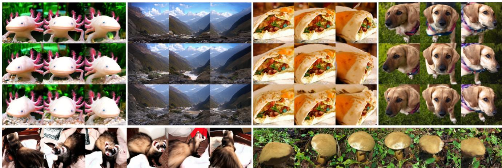  
Figure 1: Our diffusion-based 3D-aware image generation trained on ImageNet. The first three rows shows the diverse objects and scenes generated by our method. The bottom row shows two cases synthesized under a 360 camera trajectory. (More results at project page)

## Abstract

In this paper, we introduce a novel 3D-aware image generation method that leverages 2D diffusion models. We formulate the 3D-aware image generation task as multiview 2D image set generation, and further to a sequential unconditional–conditional multiview image generation process. This allows us to utilize 2D diffusion models to boost the generative modeling power ofthe method. Additionally, we incorporate depth information from monocular depth estimators to construct the training data for the conditional diffusion model using only still images.

We train our method on a large-scale unstructured 2D image dataset, i.e., ImageNet, which is not addressed by previous methods. It produces high-quality images that significantly outperform prior methods. Furthermore, our approach showcases its capability to generate instances with large view angles, even though the training images are diverse and unaligned, gathered from “in-the-wild” realworld environments.

## 1. Introduction

Learning to generate 3D contents has become an increasingly prominent task due to its numerous applications such as VR/AR, movie production, and art design. Recently, significant progress has been made in the field of 3D-aware image generation, with a variety of approaches being proposed [4, 5, 7, 10, 30, 32, 43, 44, 54]. The goal of 3D-aware image generation is to train image generation models that are capable of explicitly controlling 3D camera pose, typically by using only unstructured 2D image collections.

Most existing methods for 3D-aware image generation rely on Generative Adversarial Networks (GANs) [9] and utilize a Neural Radiance Field (NeRF) [25] or its variants as the 3D scene representation. While promising results have been demonstrated for object-level generation, extending these methods to large-scale, in-the-wild data that features significantly more complex variations in geometry and appearance remains a challenge.

Diffusion Models (DMs) [13, 48, 50], on the other hand, are increasingly gaining recognition for their exceptional generative modeling performance on billion-scale image datasets [33, 35, 37]. It has been shown that DMs have surpassed GANs as the state-of-the-art models for complex image generation tasks [8, 14, 15, 29]. However, applying DMs to 3D-aware image generation tasks is not straightforward. Unlike 3D-aware GANs, training DMs for 3D generation necessitates raw 3D assets for its nature of regressionbased learning [24, 27, 28, 45, 56].

To take advantage of the potent capability of DMs and the ample availability of 2D data, our core idea in this paper is to formulate 3D-aware generation as a multiview 2D image set generation task. Two critical issues must be addressed for this newly formulated task. The first is how to apply DMs for image set generation. Our solution to this is to cast set generation as a sequential unconditional– conditional generation process by factorizing the joint distribution of multiple views of an instance using the chain rule of probability. More specifically, we sample the initial view of an instance using an unconditional DM, followed by iteratively sampling other views with previous views as conditions via a conditional DM. This not only minimizes the model’s output to a single image per generation, but also grants it the ability to handle variable numbers of output views.

The second issue is the lack of multiview image data. Inspired by a few recent studies [3, 11], we append depth information to the image data through monocular depth estimation techniques and use depth to construct multiview data using only still images. However, we found that naively applying the data construction strategy of [11] can result in domain gaps between training and inference. To alleviate this, we recommend additional training data augmentation strategies that can improve the generation quality, particularly for the results under large view angles.

We tested our method on both a large-scale, multi-class dataset, i.e., ImageNet [6], and several smaller, singlecategory datasets that feature significant variations in geometry. The results show that our method outperformed state-of-the-art 3D-aware GANs on ImageNet by a wide margin, demonstrating the significantly enhanced generative modeling capability of our novel 3D-aware generation approach. It also performed favorably against prior art on other datasets, showing comparable texture quality but improved geometry. Moreover, we find that our model has the capability to generate scenes under large view angles (up to 360 degrees) from unaligned training data, which is a challenging task further demonstrating the efficacy of our new method.

The contributions of this work are summarized below:

• We present a novel 3D-aware image generation method that uses 2D diffusion models. The method is designed based on a new formulation for 3D-aware generation, i.e., sequential unconditional–conditional multiview image sampling.

• We undertake 3D-aware generation on a large-scale inthe-wild dataset (ImageNet), which is not addressed by previous 3D-aware generation models.

• We demonstrate the capability of our method for largeangle generation from unaligned data (up to 360 degrees).

## 2. Related Work

3D-aware image generation Previous 3D-aware image generation studies [4, 5, 7, 10, 30, 32, 43] have achieved this objective on some well-aligned image datasets of specific objects. Most of these works are based on GANs [9]. Some of them [5, 7, 43, 47, 54] generate 3D scene representations which are used to directly render the final output images. They typically leverage NeRF [25] or its variants as the 3D scene representation and train a scene generator with supervision on the rendered images from a jointly-trained discriminator. Others have combined 3D representation with 2D refinements [4, 10, 30, 32], performing two steps: generating a low-resolution volume to render 2D images or feature maps, and then refining the 2D images with a superresolution module. Another work [44] achieves this task without introducing intermediate 3D representations with depth-based matching. Very recently, two works concurrent to us [41, 46] expand 3D-aware generation task to large and diverse 2D image collections such as ImageNet [6], utilizing geometric priors from pretrained monocular depth prediction models. This work presents a novel 2D diffusion based 3D-aware generative model, which can be applied to diverse in-the-wild 2D images.

Diffusion models Diffusion models [48] come with a well-conceived theoretical formulation and U-net architecture, making them suitable for image modeling tasks [13, 50]. Improved diffusion-based methods [8, 14, 15, 29] demonstrated that DMs have surpassed GANs as the new state-of-the-art models for some image generation tasks. Additionally, diffusion models can be applied to conditional generation, leading to the flourishing of downstream imagedomain tasks such as image super-resolution [18, 38], inpainting [23, 35, 36], novel view synthesis [53], scene synthesis [3, 17], and 3D generation [1, 16, 24, 27, 28, 45, 56]. Our method utilizes 2D unconditional and conditional diffusion models with an iterative view sampling process to tackle 3D-aware generation.

Optimization-based 3D generation According to the theory of diffusion models, the U-nets are trained to the scorefunction (log derivative) of the image distribution under different noise levels [50]. This has led to the development of the Score Distillation Sampling (SDS) technique, which has been used to perform text-to-3D conversion using a text-conditioned diffusion model, with SDS serving as the multiview objective to optimize a NeRF-based 3D representation. Although recent works [20, 51] have explored this technique on different diffusion models and 3D representations, they are not generative models and are not suitable for random generation without text prompt.

Depth-assisted view synthesis Some previous works utilized depth information for view synthesis tasks including single-view view synthesis [11, 31] and perpetual view generation [3, 19, 21]. In contrast, this work deals with a different task, i.e., 3D-aware generative modeling of 2D image distributions. For our task, we propose a new formulation of sequential unconditional–conditional multiview image sampling, where the latter conditional generation subroutine shares a similar task with novel view synthesis.

## 3. Problem Formulation

## 3.1. Preliminaries

In this section, we provide a brief overview of the theory behind Diffusion Models and Conditional Diffusion Models [13, 50]. DMs are probabilistic generative models that are designed to recover images from a specified degradation process. To achieve this, two Markov chains are defined. The forward chain is a destruction process that progressively adds Gaussian noise to target images:

$$
q ( \mathbf { x } _ { t } | \mathbf { x } _ { t - 1 } ) = \mathcal { N } ( \mathbf { x } _ { t } ; \sqrt { 1 - \beta _ { t } } \mathbf { x } _ { t - 1 } , \beta _ { t } \mathbf { I } ) .\tag{1}
$$

This process results in the complete degradation of target images in the end, leaving behind only tractable Gaussian noise. The reverse chain is then employed to iteratively recover images from noise:

$$
p _ { \theta } ( \mathbf { x } _ { t - 1 } \vert \mathbf { x } _ { t } ) = \mathcal { N } ( \mathbf { x } _ { t - 1 } ; \mu _ { \theta } ( \mathbf { x } _ { t } , t ) ; \Sigma _ { \theta } ( \mathbf { x } _ { t } , t ) ) ,\tag{2}
$$

where the mean and variance functions are modeled as neural networks trained by minimizing the KL divergence between the joint distributions $q ( \mathbf { x } _ { 0 : T } ) , p _ { \theta } ( \mathbf { x } _ { 0 : T } )$ of these two chains. A simplified and reweighted version of this objective can be written as:

$$
\mathbb { E } _ { t \sim \mathcal { U } [ 1 , T ] , \mathbf { x } _ { 0 } \sim q ( \mathbf { x } _ { 0 } ) , \epsilon \sim \mathcal { N } ( \mathbf { 0 } , \mathbf { I } ) } \left[ \lVert \epsilon - \epsilon _ { \theta } ( \mathbf { x } _ { t } , t ) \rVert ^ { 2 } \right] .\tag{3}
$$

After training the denoising network $\epsilon _ { \theta } .$ samples can be generated from Gaussian noise through the reverse chain.

Similarly, the Conditional Diffusion Models are formulated by adding a condition c to all the distributions in the deduction with an objective involving c:

$$
\mathbb { E } _ { t \sim \mathcal { U } [ 1 , T ] , \mathbf { x } _ { 0 } , c \sim q ( \mathbf { x } _ { 0 } , c ) , \epsilon \sim \mathcal { N } ( \mathbf { 0 } , \mathbf { I } ) } \left[ \lVert \epsilon - \epsilon _ { \theta } ( \mathbf { x } _ { t } , t , c ) \rVert ^ { 2 } \right] .\tag{4}
$$

## 3.2. 3D Generation as Iterative View Sampling

Our assumption is that the distribution of 3D assets, denoted as $q _ { a } ( \mathbf { x } )$ , is equivalent to the joint distribution of its corresponding multiview images. Specifically, given camera sequence $\{ \pi _ { 0 } , \pi _ { 1 } , \cdot \cdot \cdot , \pi _ { N } \}$ , we have

$$
q _ { a } ( { \bf x } ) = q _ { i } ( \Gamma ( { \bf x } , \pi _ { 0 } ) , \Gamma ( { \bf x } , \pi _ { 1 } ) , \cdot \cdot \cdot , \Gamma ( { \bf x } , \pi _ { N } ) ) ,\tag{5}
$$

where $q _ { i }$ is the distribution of images observed from 3D assets, and $\Gamma ( \cdot , \cdot )$ is the 3D-2D rendering operator. This assumption is derived from the bijective correspondence between 3D assets and their multiview projections, given infinite number of views (in practice dozens to hundreds of views are usually adequate). The joint distribution can be factorized into a series of conditioned distributions:

$$
\begin{array} { r l } & { q _ { a } ( \mathbf { x } ) = q _ { i } ( \Gamma ( \mathbf { x } , \pi _ { 0 } ) ) \cdot } \\ & { \phantom { q _ { a } ( \Gamma ( \mathbf { x } , \pi _ { 1 } ) | \Gamma ( \mathbf { x } , \pi _ { 0 } )  | \Gamma ( \mathbf { x } , \pi _ { 0 } )  | \Gamma ( \mathbf { x } , \pi _ { N - 1 } )  | } } \\ & { \phantom { \frac { 1 } { 1 } } \cdot \cdot \cdot } \\ & { \phantom { \frac { 1 } { 1 } } q _ { i } ( \Gamma ( \mathbf { x } , \pi _ { N } ) | \Gamma ( \mathbf { x } , \pi _ { 0 } ) , \cdot \cdot \cdot , \Gamma ( \mathbf { x } , \pi _ { N - 1 } ) ) } \end{array} .\tag{6}
$$

It can be noticed that the conditional distributions exhibit an iterative arrangement. By sampling $\Gamma ( \mathbf { x } , \pi _ { n } )$ step by step with previous samples as conditions, the joint multiview images are generated, thus directly determining the 3D asset.

In practice, however, multiview images are also difficult to obtain. To use unstructured 2D image collections, we construct training data using depth-based image warping. First, we substitute the original condition images in Eq. $6 , \ i . e . , \ \{ \Gamma ( \mathbf { x } , \pi _ { k } ) , k \ = \ 1 , \ldots , n - 1 \}$ for $\Gamma ( \mathbf { x } , \pi _ { n } )$ as $\Pi ( \Gamma ( \mathbf { x } , \pmb { \pi } _ { k } ) , \pmb { \pi } _ { n } )$ , where $\Pi ( \cdot , \cdot )$ denotes the depth-based image warping operation that warps an image to a given target view using depth. As a result, Eq. 6 can be rewritten as

$$
\begin{array} { r } { q _ { a } ( \mathbf { x } ) \approx q _ { i } ( \Gamma ( \mathbf { x } , \pi _ { 0 } ) ) \cdot \phantom { x x x x x x x x x x x x x x x x x x x x x x x x x x x x x x x x x x x x x x x x x x x x x x x x x x x x x x x x } . } \\ { q _ { i } ( \Gamma ( \mathbf { x } , \pi _ { 1 } ) | \Pi ( \Gamma ( \mathbf { x } , \pi _ { 0 } ) , \pi _ { N } ) , \cdot \cdot \cdot ) \phantom { x x x x x x x x x x x x x x x x x x x x x x } . } \\ { \cdot \cdot \cdot \cdot } \\ { q _ { i } ( \Gamma ( \mathbf { x } , \pi _ { N } ) | \Pi ( \Gamma ( \mathbf { x } , \pi _ { 0 } ) , \pi _ { N } ) , \cdot \cdot \cdot ) \phantom { x x x x x x x x x x x x } } \end{array}\tag{7}
$$

Under this formulation, we further eliminate the requirement for actual multiview images $\Gamma ( \mathbf { x } , \pi _ { k } )$ by only warping $\Gamma ( \mathbf { x } , \pi _ { n } )$ itself back-and-forth. The details can be found in Sec. 4.1.

Note that unlike some previous 3D-aware GANs [4, 5, 7, 10, 32], we model generic objects and scenes without pose label or any canonical pose definition. We directly regard the image distribution $q _ { d }$ in the datasets as $q _ { i } ( \Gamma ( \mathbf { x } , \pi _ { 0 } ) )$ , i.e., the distribution of 3D assets’ first partial view. All other views $\pi _ { 1 } , \cdots , \pi _ { N }$ are considered to be relative to the first view. This way, we formulate 3Daware generation as an unconditional–conditional image generation task, where an unconditional model is trained for $q _ { i } ( \Gamma ( \mathbf { x } , \pi _ { 0 } ) )$ ) and a conditional model is trained for other terms $q _ { i } ( \Gamma ( \mathbf { x } , \pmb { \pi } _ { n } ) | \Pi ( \Gamma ( \mathbf { x } , \pmb { \pi } _ { 0 } ) , \pmb { \pi } _ { n } ) , \cdots )$

## 4. Approach

As per our problem formulation in Sec. 3.2, our first step is to prepare the data, which includes the construction of RGBD images and the implementation of the warping algorithm (Sec. 4.1). We then train an unconditional RGBD diffusion model and a conditional model, parameterizing the unconditional term (the first one) and conditional terms (the others) in Eq. 7, respectively (Sec. 4.2). After training, our method can generate diverse 3D-aware image samples with a broad camera pose range (Sec. 4.3). The inference framework of our method is depicted in Fig. 2.

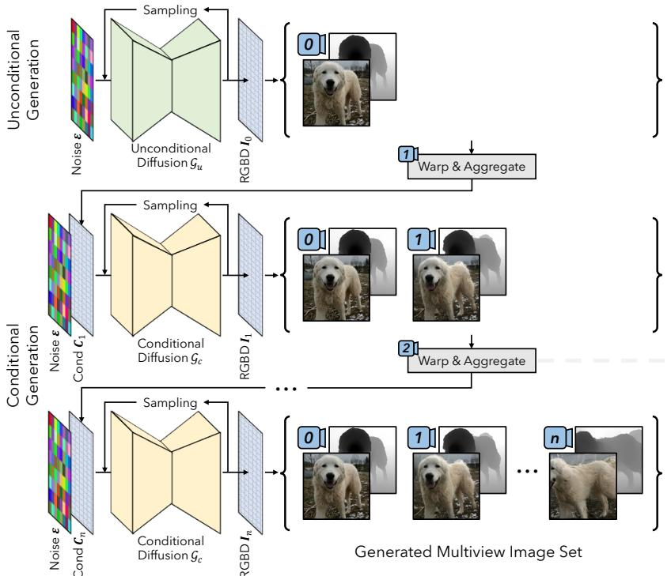

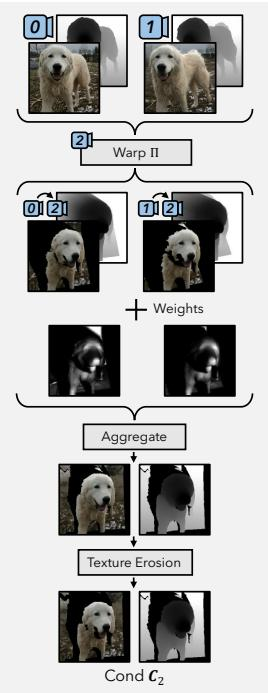  
Figure 2: The overall framework. Our method contains two diffusion models $\mathcal { G } _ { u }$ and $\mathcal { G } _ { c } . ~ \mathcal { G } _ { u }$ is an unconditional model for randomly generating the first view, and $\mathcal { G } _ { c }$ is a conditional generator for novel views. With aggregated conditioning, multiview images are obtained iteratively by refining and completing previously synthesized views. For fast free-view synthesis, one can run 3D fusion or image-based rendering to synthesize new target views.

## 4.1. Data Preparation

RGBD image construction To achieve RGBD warping, additional depth information is required for each image. We employ an off-the-shelf monocular depth estimator [34] to predict depth map as it generalizes well to the targeted datasets with diverse objects and scenes.

RGBD-warping operator The RGBD-warping operation Π is a geometry-aware process determining the relevant information of partial RGBD observations under novel viewpoints. It takes a source RGBD image $\mathbf { I } _ { s } = ( \mathbf { C } _ { s } , \mathbf { D } _ { s } )$ and a target camera $\pi _ { t }$ as input, and outputs the visible image contents under target view $\mathbf { I } _ { t } = ( \mathbf { C } _ { t } , \mathbf { D } _ { t } )$ and a visibility mask $\mathbf { M } _ { t } , i . e . , \Pi : ( \mathbf { I } _ { s } , \pmb { \pi } _ { t } )  ( \mathbf { I } _ { t } , \mathbf { M } _ { t } )$ . Our warping algorithm is implemented using a mesh-based representation and rasterizer. For an RGBD image, we construct a mesh by back-projecting the pixels to 3D vertices and defining edges for adjacent pixels on the image grid.

Training pair construction To model the conditional distributions in Eq. 7, data–condition pairs that comprise $\Gamma ( \mathbf { x } , \pi _ { n } )$ and $\Pi ( \Gamma ( \mathbf { x } , \pmb { \pi } _ { k } ) , \pmb { \pi } _ { n } )$ are required. Inspired by AdaMPI [11], we adopt a forward-backward warping strategy to construct the training pairs from only $\Gamma ( \mathbf { x } , \pi _ { n } )$ without the need for actual images of $\Gamma ( \mathbf { x } , \pi _ { k } )$ . Specifically, the target RGBD images are firstly warped to novel views and then warped back to the original target views. This strategy creates holes in the images which is caused by geometry occlusion. Despite its simplicity, conditions constructed using this strategy are equivalent to warp real images to the target views for Lambertian surfaces, or approximations of them for non-Lambertian regions:

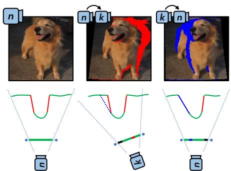  
Figure 3: Illustration of forward-backward warpping.

$$
\Pi ( \Gamma ( \mathbf { x } , \pmb { \pi } _ { k } ) , \pmb { \pi } _ { n } ) \approx \Pi ( \Pi ( \Gamma ( \mathbf { x } , \pmb { \pi } _ { n } ) , \pmb { \pi } _ { k } ) , \pmb { \pi } _ { n } ) .\tag{8}
$$

This is because the difference between $\Gamma ( \mathbf { x } , \pi _ { k } )$ and $\Pi ( \Gamma ( \mathbf { x } , \pmb { \pi } _ { n } ) , \pmb { \pi } _ { k } )$ , i.e., the holes for scene contents not visible at view $\pi _ { n }$ , will be invisible again when wrapped back to $\pi _ { n }$ , and therefore become irrelevant. See Fig. 3 for an illustration of our training pair construction based on this forward-backward warping strategy.

Original

## 4.2. Training

## 4.2.1 Unconditional RGBD generation

We first train an unconditional diffusion model $\mathcal { G } _ { u }$ to handle the distribution of all 2D RGBD images (the first term $q _ { i } ( \Gamma ( \mathbf { x } , \pi _ { 0 } ) )$ in Eq. 7). As mentioned, we directly regard the image distribution $q _ { d }$ in the datasets as q , i.e., the distribution of 3D assets’ partial observations, and train the diffusion model on the constructed RGBD images $\mathbf { I } \sim q _ { d } ( \mathbf { I } )$ to parameterize it.

We adopt the ADM network architecture from [8] with minor modifications to incorporate the depth channel. For datasets with class labels (e.g., ImageNet [6]), classifierfree guidance [15] is employed with a label dropping rate of 10%.

## 4.2.2 Conditional RGBD completion and refining

We then train a conditional RGBD diffusion model $\mathcal { G } _ { c }$ for sequential view generation (the remaining terms $q _ { i } ( \Gamma ( \mathbf { x } , \pmb { \pi } _ { n } ) | \Pi ( \Gamma ( \mathbf { x } , \pmb { \pi } _ { 0 } ) , \pmb { \pi } _ { n } ) , \cdots )$ in Eq. 7). The constructed data pairs $( { \bf I } , \Pi ( \Pi ( { \bf I } , \pi _ { k } ) , \pi _ { n } ) )$ using the forwardbackward warping strategy are used to $\mathcal { G } _ { c }$ . Instead of predefining the camera sequences $\{ \pi _ { n } \}$ for training, we randomly sample relative camera pose from Gaussian distribution, which can make the process more flexible meanwhile keeping the generalization ability.

Our conditional models are fine-tuned from their unconditional counterparts. Specifically, we concatenate the additional condition, i.e., a warped RGBD image with mask, with the original noisy image to form the new network input. The holes on the condition RGBD image are filled with Gaussian noise. Necessary modifications to the network structure are made to the first layer to increase the number of input channels. Zero initialization is used for the added network parameters. Classifier-free guidance is not applied to these conditions.

We apply several data augmentation strategies to the constructed conditions for training. We found such augmentations can improve the performance and stability of the inference process.

Blur augmentation The RGBD warping operation introduces image blur due to the low-pass filtering that occurs during interpolation and resampling in mesh rasterization. The forward-backward warping strategy involves two image warping steps, while only one is utilized during inference. To mitigate this gap, for the constructed conditions, we randomly replace the unmasked pixels in twice-warped images by pixels in the original images with a predefined probability and then apply Gaussian blur with random standard deviations (Fig. 4). This augmentation expands the training condition distribution to better reflect those encountered at inference time.

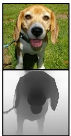  
Data

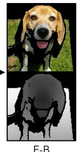  
F-B  
Warping

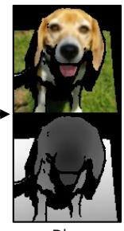  
Blur  
Augment

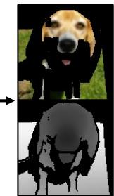  
Erosion  
Augment  
Figure 4: Illustration of our condition construction process.

Texture erosion augmentation The textures located close to depth discontinuities on the condition images have a negative impact on the image generation quality. This phenomenon can be attributed to two causes. Firstly, inthe-wild images contain complex view-dependent lighting effects, particularly near object boundaries (consider the Fresnel effect, rim light, subsurface scattering, etc.). These unique features serve as strong indicators of the edges of foreground objects, hindering the ability of the conditional model to generate appropriate geometry in novel views. Secondly, the estimated depth map is not perfect and may incur segmentation errors around object edges. To address this issue, we perform random erosion on the texture component of the constructed conditions while leaving the depth unchanged (Fig. 4). This augmentation eliminates the problematic textural information near edges and leads to superior generation quality.

## 4.3. Inference

With trained conditional and unconditional generative models, our 3D-aware iterative view sampling can be applied to obtain multiview images of a 3D asset:

$$
\begin{array} { r } { p _ { \theta } ( \mathbf { I } _ { 0 } , \mathbf { I } _ { 1 } , \cdot \cdot \cdot , \mathbf { I } _ { N } ) \approx p _ { \theta } ( \mathbf { I } _ { 0 } ) . \qquad } \\ { p _ { \theta } ( \mathbf { I } _ { 1 } | \Pi ( \mathbf { I } _ { 0 } , \boldsymbol { \pi } _ { 1 } ) ) \cdot \qquad } \\ { \cdot \cdot \cdot } \\ { p _ { \theta } ( \mathbf { I } _ { N } | \Pi ( \mathbf { I } _ { 0 } , \boldsymbol { \pi } _ { N } ) , \cdot \cdot \cdot ) } \end{array} .\tag{9}
$$

One can define a camera sequence that covers the desired views for multiview image synthesis. This camera sequence can be set arbitrarily to a large extent. Such flexibility is provided by random warping during the training stage. Following the given camera sequence, novel views are sampled one after the other iteratively, with all previously sampled images as conditions.

Condition aggregation There remains a question of how our trained conditional diffusion models can be conditioned by all previously sampled images. We have tested both stochastic conditioning [3, 53] and a new aggregated conditioning strategy, and found the latter to be more effective for our task. As illustrated in Fig. 2 (right), aggregated conditioning collects information from previous images by performing a weighted sum across all warped versions of them:

$$
\mathbf { C } _ { n } = \sum _ { i = 0 } ^ { n - 1 } \mathbf { W } _ { ( i , n ) } \Pi ( \mathbf { I } _ { i } , \pi _ { n } ) \bigg / \sum _ { i = 0 } ^ { n - 1 } \mathbf { W } _ { ( i , n ) } ,\tag{10}
$$

where $\mathbf { W } _ { ( i , n ) }$ is the weight map. The weight is calculated for each pixel following the lumigraph rendering principles [2]. More details of the weight map computation can be found in Appendix.

Fusion-based free-view synthesis In our original formulation, generating any novel view for an instance necessities running the diffusion model $\mathcal { G } _ { c } ,$ which is inefficient for video generation and interactive applications. Here, we present a simple and efficient free-view generation solution based on fusing a fixed set of pre-generated views. Specifically, we first define a set of views uniformly covering the desired viewing range and generate images using the trained diffusion models. For any novel view, we warp the pregenerated views to it and aggregate them using a strategy following our condition aggregation. This strategy not only improves the speed for video generation, but also well preserves the texture detail consistency among different views.

## 5. Experiments

Implementation details We train our method on four datasets: ImageNet [6], SDIP Dogs [26], SDIP Elephants [26] and LSUN Horses [55]. ImageNet is a largescale dataset containing 1.3M images from 1000 classes. The other three are single-category datasets containing 125K, 38K, and 163K images, respectively. Images in these datasets are unaligned and contain complex geometry, which makes the 3D-aware image generation task challenging. We predict the depth maps using the MiDaS [34] dpt beit large 512 model. When constructing training pairs with forward-backward warping, camera poses are sampled from Gaussian distributions with $\sigma = ( 0 . 3 , 0 . 1 5 )$ for the yaw and pitch angles. FOVs are fixed to 45◦.

Our experiments are primarily conducted on $1 2 8 ^ { 2 }$ image resolution, and we will also demonstrate $2 5 6 ^ { 2 }$ generation results using a diffusion-based super-resolution model. We use the same network architecture and training setting as ADM [8] for the training on ImageNet and use a smaller version with channel halved on the other three datasets for efficiency. All our models are trained on 8 NVIDIA Tesla V100 GPUs with 32GB memory. For ImageNet results, Classifier-free guidance weight of both unconditional and conditional networks is set to 3 for the shown samples and 0 for numerical evaluation.2

Inference speed Evaluated on a NVIDIA Tesla V100 GPU, generating the initial view using $\mathcal { G } _ { u }$ takes 20s with 1000-step DDPM sampler, while generating one new view using G takes 1s using 50-step DDIM sampler.

## 5.1. Visual Results

Figure 1, 5 and 6 present some sampled multiview images from our method. As shown, our method can generate 3D-aware multiview images with diverse content and large view angle. High-quality 3D-aware images can be generated from in-the-wild image collections.

## 5.2. Comparison to Prior Arts

We compare our method with previous 3D-aware GANs including pi-GAN [5], EpiGRAF [47] and EG3D [4].3 Since there is no pose label, the pose conditioning in Epi-GRAF and EG3D are removed. Class labels are fed to the generator and discriminator instead. Note that no depth map is used by these methods.

For quantitative evaluation, we measure the Frechet in-´ ception distance (FID) [12] and Inception Score (IS) [39] using 10K randomly generated samples and the whole real images set. Following past practice [5], camera poses are randomly sampled from Gaussian distributions with $\sigma =$ 0.3 and 0.15 for the yaw and pitch angles, respectively. The results are shown in Table 1. Some visual examples are presented in Fig. 5.

For the results on ImageNet, Table 1 shows that our results are significantly better than EpiGRAF and EG3D, while pi-GAN clearly underperformed. This large performance gain demonstrates the superior capability of our method for modeling diverse, large-scale image data. The visual examples also show the better quality of our results.

On other single-category datasets that have smaller scales, the quantitative results of the three methods are comparable: our method is slightly worse than EG3D and slightly better than EpiGRAF. However, their results often exhibit unrealistic 3D geometry. As can be observed from Fig. 5, both EG3D and EpiGRAF generated ‘planar’ geometries and hence failed to produce the realistic 3D shapes of the synthesized objects, leading to wrong visual parallax when viewed with different angles.

## 5.3. Large View Synthesis

In this section, we further test the modeling capability of our conditional diffusion model $\mathcal { G } _ { c } ,$ particularly under long camera trajectories for large view synthesis.

Performance w.r.t. view range We first test our image generation quality under different view ranges. We define

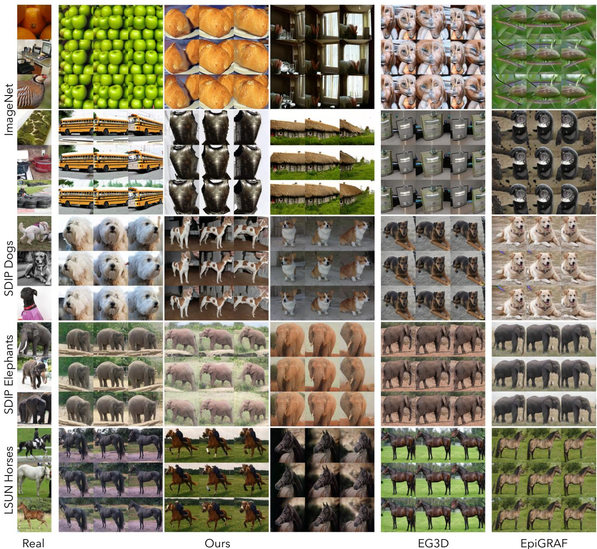  
Figure 5: Multiview generation on ImageNet, SDIP Dogs, SDIP Elephants and LSUN horses datasets at $1 2 8 ^ { 2 }$ resolution.

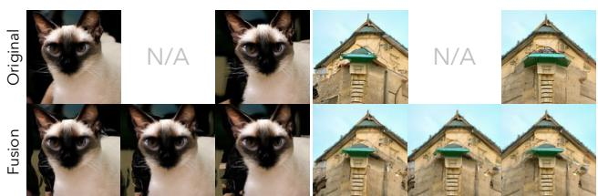  
Figure 6: Images generated by our method with and without the fusion strategy.

a long camera sequence $\left\{ \pi _ { n } \right\}$ which forms a sampling grid with 9 columns for yaw and 3 rows for pitch, respectively. The resultant 27 views have angles ranging ±0.6 for yaw $( i . e . , \sim 7 0 ^ { \circ }$ range) and ±0.15 for pitch $( i . e . , \sim 1 7 ^ { \circ }$ range), respectively. The numerical results in Table 2 show that the quality degrades moderately as the view range gets larger. The quality drop can be attributed to two reasons: domain drifting and data bias (see Appendix for discussions). Figure 7 shows all 27 views of two samples. The visual quality for large angles remains reasonable.

360◦ generation We conducted an evaluation of $3 6 0 ^ { \circ }$ generation on ImageNet and found that our approach demonstrates efficacy in certain scenarios, as shown in Fig. 1 and 8. Note that $3 6 0 ^ { \circ }$ generation of unbounded realworld scenes is a challenging task. One significant contributor to this challenge is the data bias problem, where rear views of objects are frequently underrepresented.

Our results  
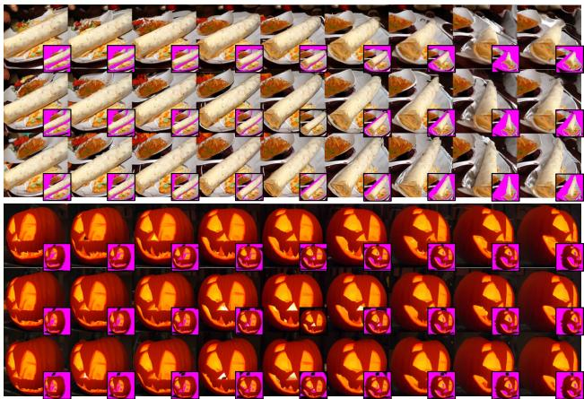  
Figure 7: Large view synthesis results. To highlight the contribution of the conditional generator $\mathcal { G } _ { c } ,$ we show a smaller figure with regions invisible in the first view marked pink.

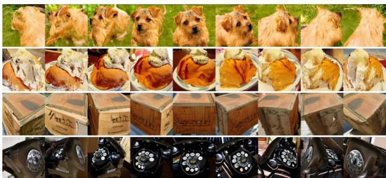  
Figure 8: Curated 360◦ generation results on ImageNet.

Table 1: Quantitative comparison of generation quality with FID and IS scores using 10K generated samples.
<table><tr><td colspan="3">ImageNet</td><td colspan="3">Dog Elephant Horse</td></tr><tr><td>Method</td><td>FID↓</td><td>IS↑</td><td>FID↓</td><td>FID↓</td><td>FID↓</td></tr><tr><td>pi-GAN [5]</td><td>138</td><td>6.82</td><td>115</td><td>71.0</td><td>92.6</td></tr><tr><td>EpiGRAF [47]</td><td>67.3</td><td>12.7</td><td>17.3</td><td>7.25</td><td>5.82</td></tr><tr><td>EG3D [4]</td><td>40.4</td><td>16.9</td><td>9.83</td><td>3.15</td><td>2.61</td></tr><tr><td>Ours</td><td>9.45</td><td>68.7</td><td>12.0</td><td>6.00</td><td>4.01</td></tr><tr><td>Ours-fusion</td><td>14.1</td><td>61.4</td><td>14.7</td><td>11.0</td><td>10.2</td></tr></table>

Table 2: Generation quality with various view ranges, measured with FID and IS scores of 10K generated samples.
<table><tr><td colspan="3">ImageNet</td><td rowspan="2">Dog</td><td colspan="3">Elephant Horse</td></tr><tr><td>(#views, yaw range)</td><td>FID↓</td><td>IS↑</td><td>FID↓</td><td>FID↓</td><td>FID↓</td></tr><tr><td>(  1, 0°) − Guonly</td><td>7.85</td><td>85.2</td><td>8.48</td><td></td><td>4.06</td><td>2.50</td></tr><tr><td>(9,17°)</td><td>8.90</td><td>74.9</td><td>11.5</td><td></td><td>6.22</td><td>3.52</td></tr><tr><td>(15, 35°)</td><td>9.82</td><td>71.0</td><td></td><td>13.0</td><td>7.95</td><td>4.85</td></tr><tr><td>(21, 50°)</td><td>11.2</td><td>66.1</td><td>14.9</td><td></td><td>10.1</td><td>6.75</td></tr><tr><td>(27, 70°)</td><td>13.0</td><td>60.3</td><td></td><td>17.0</td><td>12.8</td><td>9.41</td></tr></table>

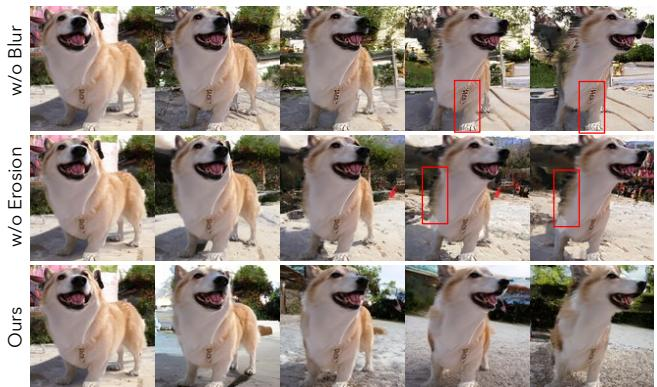  
Figure 9: Ablation study on our proposed data augmentation strategies. Noticeable artifacts are marked with box.

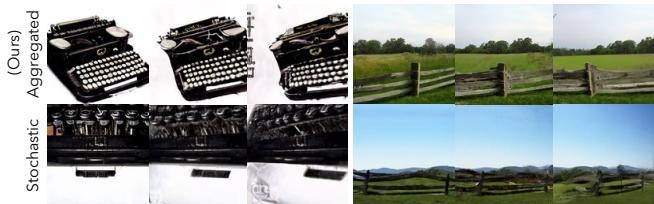  
Figure 10: Ablation study on our proposed aggregated conditioning and stochastic conditioning.

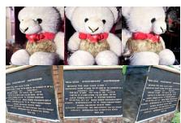

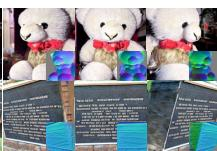  
NeuS recon

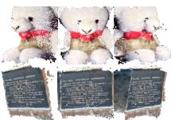  
COLMAP recon  
Figure 11: NeuS and COLMAP reconstruction results.

Table 3: Ablation study on the proposed condition augmentation strategies. The FID-2K metric on the SDIP Dog dataset are reported.
<table><tr><td>(#views, yaw range)</td><td>Ours</td><td>w/o erosion</td><td>w/o blur</td></tr><tr><td>(9,17°)</td><td>18.1</td><td>18.4</td><td>19.1</td></tr><tr><td>(15, 35°)</td><td>19.2</td><td>20.9</td><td>22.2</td></tr><tr><td>(27, 70°)</td><td>23.1</td><td>26.8</td><td>31.6</td></tr></table>

## 5.4. Ablation Study

Data augmentation strategies We train two conditional models on the SDIP Dog dataset without augmentation and compare the results both visually and quantitatively to verify their effectiveness. 27 views are synthesized for each generated instance following the evaluation in Sec. 5.3. Figure 9 shows that without blur augmentation, the generated images become excessively sharp after a short view sampling chain, which is also detrimental in terms of the FID metric (Table 3). Additionally, without texture erosion augmentation, unreliable information on the edges of the depth map can negatively impact the conditional view sampling process, resulting in poor large-view results. This decrease in quality is also evident in the FID metrics. With all of our proposed augmentations enabled, we achieve the best results both visually and quantitatively.

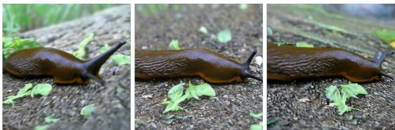  
Figure 12: 2562 generation result upsampled from 1282 using diffusion-based super-resolution model.

Multiview conditioning strategy We further compare the effectiveness of our aggregated conditioning strategy against stochastic conditioning [3, 53] in Fig. 10. For our task, stochastic conditioning is not suitable as it does not properly consider all previously-generated contents and will lead to inconsistency among different views.

Fusion-based free-view synthesis Table 1 shows the quantitative results of our efficient, fusion-based free-view synthesis solution. For this solution, we first generate 27 fixed views with $7 0 ^ { \circ }$ yaw range and 17◦ pitch range (Sec. 5.3) and use them to generate novel views. After generating these 27 views, it can run at 16 fps to generate arbitary novel views with our unoptimized mesh rendering implementation. Its FID score is still significantly lower than previous methods on ImageNet, but slightly higher compared to our original method. This is expected as the image-based fusion inevitably introduces blur and other distortions. Figure 6 compares the image samples generated by our method with and without the fusion strategy. Moreover, we conduct 3D reconstruction on the multi-view image samples with the fusion strategy using NeuS [52] and COLMAP [42]. As is shown in Figure 11, the accurate reconstruction results from both methods demonstrate the good multiview consistency of our method. The results with smoothly-changing views in our supplementary video are also generated with this fusion strategy. For the 360◦ renderings in the video, the results are obtained by fusing 15 views covering the upper hemisphere of camera viewpoints.

## 5.5. Higher-Resolution Generation

In theory, our method can be directly applied to train on higher-resolution images given sufficient computational resources. An efficient alternative is to apply image-space upsampling, which has been seen frequent use in previous 3D-aware GANs [4, 10, 32]. We have implemented a $2 5 6 ^ { 2 }$ DM conditioned on low-resolution images for image upsampling following Cascaded Diffusion [14]. This model is trained efficiently by fine-tuning a pretrained $1 2 8 ^ { 2 }$ unconditional model. Figure 12 shows one $2 5 6 ^ { 2 }$ sample from this model; more can be found in Appendix.

## 6. Conclusion

We have presented a novel method for 3D-aware image generative modelling. Our method is derived from a new formulation of this task: sequential unconditionalconditional generation of multiview images. We incorporate depth information to construct our training data using only still images, and train diffusion models for multiview image modeling. The training results on both large-scale multi-class dataset (i.e., ImageNet) and complex singlecategory datasets have collectively demonstrated the strong generative modelling power of our proposed method.

Limitations and future work Though our method has shown high-quality results and strong generative power, it still has several limitations. Firstly, the depth maps used for training are obtained by applying an existing monocular depth estimator [34]. The depth error and bias in the data will inevitably affect the quality of our generated results. How to alleviate such a negative impact or eliminate the requirement of depth (e.g., using multiview images) are left as our future work. Secondly, not all object can be generated under 360◦. We empirically found that this is more successful for object categories that are with more back-view images in the training dataset and main object well center-aligned. How to make $3 6 0 ^ { \circ }$ generation more robust is also our future direction. Finally, like most diffusion models, the image generation speed of our method is limited. However, we posit that these limitations can be gradually alleviated with the development of DM sampling accelaration [22, 40, 49].

## References

[1] Titas Anciukevicius, Zexiang Xu, Matthew Fisher, Paul Hen-ˇ derson, Hakan Bilen, Niloy J Mitra, and Paul Guerrero. Renderdiffusion: Image diffusion for 3d reconstruction, inpainting and generation. In Proceedings of the IEEE/CVF Conference on Computer Vision and Pattern Recognition, pages 12608–12618, 2023. 2

[2] Chris Buehler, Michael Bosse, Leonard McMillan, Steven Gortler, and Michael Cohen. Unstructured lumigraph rendering. In Annual Conference on Computer Graphics and Interactive Techniques, pages 425–432, 2001. 6

[3] Shengqu Cai, Eric Ryan Chan, Songyou Peng, Mohamad Shahbazi, Anton Obukhov, Luc Van Gool, and Gordon Wetzstein. Diffdreamer: Consistent single-view perpetual view generation with conditional diffusion models. arXiv preprint arXiv:2211.12131, 2022. 2, 3, 5, 9

[4] Eric R Chan, Connor Z Lin, Matthew A Chan, Koki Nagano, Boxiao Pan, Shalini De Mello, Orazio Gallo, Leonidas Guibas, Jonathan Tremblay, Sameh Khamis, et al. Efficient geometry-aware 3d generative adversarial networks. In IEEE/CVF International Conference on Computer Vision, 2022. 1, 2, 3, 6, 8, 9

[5] Eric R Chan, Marco Monteiro, Petr Kellnhofer, Jiajun Wu,

and Gordon Wetzstein. pi-gan: Periodic implicit generative adversarial networks for 3d-aware image synthesis. In IEEE/CVF Conference on Computer Vision and Pattern Recognition, pages 5799–5809, 2021. 1, 2, 3, 6, 8

[6] Jia Deng, Wei Dong, Richard Socher, Li-Jia Li, Kai Li, and Li Fei-Fei. Imagenet: A large-scale hierarchical image database. In 2009 IEEE Conference on Computer Vision and Pattern Recognition, pages 248–255, 2009. 2, 5, 6

[7] Yu Deng, Jiaolong Yang, Jianfeng Xiang, and Xin Tong. Gram: Generative radiance manifolds for 3d-aware image generation. In IEEE/CVF International Conference on Computer Vision, 2022. 1, 2, 3

[8] Prafulla Dhariwal and Alexander Nichol. Diffusion models beat gans on image synthesis. Advances in Neural Information Processing Systems, 34:8780–8794, 2021. 1, 2, 5, 6

[9] Ian Goodfellow, Jean Pouget-Abadie, Mehdi Mirza, Bing Xu, David Warde-Farley, Sherjil Ozair, Aaron Courville, and Yoshua Bengio. Generative adversarial nets. Advances in Neural Information Processing Systems, 27, 2014. 1, 2

[10] Jiatao Gu, Lingjie Liu, Peng Wang, and Christian Theobalt. Stylenerf: A style-based 3d-aware generator for highresolution image synthesis. In International Conference on Learning Representations, 2021. 1, 2, 3, 9

[11] Yuxuan Han, Ruicheng Wang, and Jiaolong Yang. Singleview view synthesis in the wild with learned adaptive multiplane images. In ACM SIGGRAPH 2022 Conference Proceedings, pages 1–8, 2022. 2, 3, 4

[12] Martin Heusel, Hubert Ramsauer, Thomas Unterthiner, Bernhard Nessler, and Sepp Hochreiter. Gans trained by a two time-scale update rule converge to a local nash equilibrium. In Advances in Neural Information Processing Systems, pages 6626–6637, 2017. 6

[13] Jonathan Ho, Ajay Jain, and Pieter Abbeel. Denoising diffusion probabilistic models. Advances in Neural Information Processing Systems, 33:6840–6851, 2020. 1, 2, 3

[14] Jonathan Ho, Chitwan Saharia, William Chan, David J Fleet, Mohammad Norouzi, and Tim Salimans. Cascaded diffusion models for high fidelity image generation. J. Mach. Learn. Res., 23(47):1–33, 2022. 1, 2, 9

[15] Jonathan Ho and Tim Salimans. Classifier-free diffusion guidance. arXiv preprint arXiv:2207.12598, 2022. 1, 2, 5

[16] Animesh Karnewar, Andrea Vedaldi, David Novotny, and Niloy J Mitra. Holodiffusion: Training a 3d diffusion model using 2d images. In Proceedings of the IEEE/CVF Conference on Computer Vision and Pattern Recognition, pages 18423–18433, 2023. 2

[17] Jiabao Lei, Jiapeng Tang, and Kui Jia. Generative scene synthesis via incremental view inpainting using rgbd diffusion models. arXiv preprint arXiv:2212.05993, 2022. 2

[18] Haoying Li, Yifan Yang, Meng Chang, Shiqi Chen, Huajun Feng, Zhihai Xu, Qi Li, and Yueting Chen. Srdiff: Single image super-resolution with diffusion probabilistic models. Neurocomputing, 479:47–59, 2022. 2

[19] Zhengqi Li, Qianqian Wang, Noah Snavely, and Angjoo Kanazawa. Infinitenature-zero: Learning perpetual view generation of natural scenes from single images. In ECCV, 2022. 3

[20] Chen-Hsuan Lin, Jun Gao, Luming Tang, Towaki Takikawa, Xiaohui Zeng, Xun Huang, Karsten Kreis, Sanja Fi-

dler, Ming-Yu Liu, and Tsung-Yi Lin. Magic3d: Highresolution text-to-3d content creation. arXiv preprint arXiv:2211.10440, 2022. 2

[21] Andrew Liu, Richard Tucker, Varun Jampani, Ameesh Makadia, Noah Snavely, and Angjoo Kanazawa. Infinite nature: Perpetual view generation of natural scenes from a single image. In Proceedings of the IEEE/CVF International Conference on Computer Vision, pages 14458–14467, 2021. 3

[22] Cheng Lu, Yuhao Zhou, Fan Bao, Jianfei Chen, Chongxuan Li, and Jun Zhu. Dpm-solver: A fast ode solver for diffusion probabilistic model sampling in around 10 steps. In Advances in Neural Information Processing Systems, 2022. 9

[23] Andreas Lugmayr, Martin Danelljan, Andres Romero, Fisher Yu, Radu Timofte, and Luc Van Gool. Repaint: Inpainting using denoising diffusion probabilistic models. In Proceedings of the IEEE/CVF Conference on Computer Vision and Pattern Recognition, pages 11461–11471, 2022. 2

[24] Shitong Luo and Wei Hu. Diffusion probabilistic models for 3d point cloud generation. In Proceedings ofthe IEEE/CVF Conference on Computer Vision and Pattern Recognition, pages 2837–2845, 2021. 1, 2

[25] Ben Mildenhall, Pratul P. Srinivasan, Matthew Tancik, Jonathan T. Barron, Ravi Ramamoorthi, and Ren Ng. Nerf: Representing scenes as neural radiance fields for view synthesis. In ECCV, 2020. 1, 2

[26] Ron Mokady, Omer Tov, Michal Yarom, Oran Lang, Inbar Mosseri, Tali Dekel, Daniel Cohen-Or, and Michal Irani. Self-distilled stylegan: Towards generation from internet photos. In ACM SIGGRAPH 2022 Conference Proceedings, pages 1–9, 2022. 6

[27] Norman Muller, Yawar Siddiqui, Lorenzo Porzi,¨ Samuel Rota Bulo, Peter Kontschieder, and Matthias\` Nießner. Diffrf: Rendering-guided 3d radiance field diffusion. arXiv preprint arXiv:2212.01206, 2022. 1, 2

[28] Alex Nichol, Heewoo Jun, Prafulla Dhariwal, Pamela Mishkin, and Mark Chen. Point-e: A system for generating 3d point clouds from complex prompts. arXiv preprint arXiv:2212.08751, 2022. 1, 2

[29] Alexander Quinn Nichol and Prafulla Dhariwal. Improved denoising diffusion probabilistic models. In International Conference on Machine Learning, pages 8162–8171. PMLR, 2021. 1, 2

[30] Michael Niemeyer and Andreas Geiger. Giraffe: Representing scenes as compositional generative neural feature fields. In IEEE/CVF Conference on Computer Vision and Pattern Recognition, pages 11453–11464, 2021. 1, 2

[31] Simon Niklaus, Long Mai, Jimei Yang, and Feng Liu. 3d ken burns effect from a single image. ACM Transactions on Graphics (ToG), 38(6):1–15, 2019. 3

[32] Roy Or-El, Xuan Luo, Mengyi Shan, Eli Shechtman, Jeong Joon Park, and Ira Kemelmacher-Shlizerman. Stylesdf: High-resolution 3d-consistent image and geometry generation. In IEEE/CVF International Conference on Computer Vision, 2022. 1, 2, 3, 9

[33] Aditya Ramesh, Prafulla Dhariwal, Alex Nichol, Casey Chu, and Mark Chen. Hierarchical text-conditional image generation with clip latents. arXiv preprint arXiv:2204.06125,

2022. 1

[34] Rene Ranftl, Katrin Lasinger, David Hafner, Konrad´ Schindler, and Vladlen Koltun. Towards robust monocular depth estimation: Mixing datasets for zero-shot cross-dataset transfer. IEEE transactions on pattern analysis and machine intelligence, 44(3):1623–1637, 2020. 4, 6, 9

[35] Robin Rombach, Andreas Blattmann, Dominik Lorenz, Patrick Esser, and Bjorn Ommer. High-resolution image¨ synthesis with latent diffusion models. In Proceedings of the IEEE/CVF Conference on Computer Vision and Pattern Recognition, pages 10684–10695, 2022. 1, 2

[36] Chitwan Saharia, William Chan, Huiwen Chang, Chris Lee, Jonathan Ho, Tim Salimans, David Fleet, and Mohammad Norouzi. Palette: Image-to-image diffusion models. In ACM SIGGRAPH 2022 Conference Proceedings, pages 1– 10, 2022. 2

[37] Chitwan Saharia, William Chan, Saurabh Saxena, Lala Li, Jay Whang, Emily Denton, Seyed Kamyar Seyed Ghasemipour, Burcu Karagol Ayan, S Sara Mahdavi, Rapha Gontijo Lopes, et al. Photorealistic text-to-image diffusion models with deep language understanding. arXiv preprint arXiv:2205.11487, 2022. 1

[38] Chitwan Saharia, Jonathan Ho, William Chan, Tim Salimans, David J Fleet, and Mohammad Norouzi. Image superresolution via iterative refinement. IEEE Transactions on Pattern Analysis and Machine Intelligence, 2022. 2

[39] Tim Salimans, Ian Goodfellow, Wojciech Zaremba, Vicki Cheung, Alec Radford, and Xi Chen. Improved techniques for training gans. Advances in neural information processing systems, 29, 2016. 6

[40] Tim Salimans and Jonathan Ho. Progressive distillation for fast sampling of diffusion models. In International Conference on Learning Representations, 2022. 9

[41] Kyle Sargent, Jing Yu Koh, Han Zhang, Huiwen Chang, Charles Herrmann, Pratul Srinivasan, Jiajun Wu, and Deqing Sun. Vq3d: Learning a 3d-aware generative model on imagenet. arXiv preprint arXiv:2302.06833, 2023. 2, 6

[42] Johannes Lutz Schonberger and Jan-Michael Frahm.¨ Structure-from-motion revisited. In Conference on Computer Vision and Pattern Recognition (CVPR), 2016. 9

[43] Katja Schwarz, Yiyi Liao, Michael Niemeyer, and Andreas Geiger. Graf: Generative radiance fields for 3d-aware image synthesis. In Advances in Neural Information Processing Systems, 2020. 1, 2

[44] Zifan Shi, Yujun Shen, Jiapeng Zhu, Dit-Yan Yeung, and Qifeng Chen. 3d-aware indoor scene synthesis with depth priors. In ECCV, 2022. 1, 2

[45] J Ryan Shue, Eric Ryan Chan, Ryan Po, Zachary Ankner, Jiajun Wu, and Gordon Wetzstein. 3d neural field generation using triplane diffusion. arXiv preprint arXiv:2211.16677, 2022. 1, 2

[46] Ivan Skorokhodov, Aliaksandr Siarohin, Yinghao Xu, Jian Ren, Hsin-Ying Lee, Peter Wonka, and Sergey Tulyakov. 3d generation on imagenet. In International Conference on Learning Representations, 2023. 2, 6

[47] Ivan Skorokhodov, Sergey Tulyakov, Yiqun Wang, and Peter Wonka. EpiGRAF: Rethinking training of 3d GANs. In Advances in Neural Information Processing Systems, 2022. 2, 6, 8

[48] Jascha Sohl-Dickstein, Eric Weiss, Niru Maheswaranathan, and Surya Ganguli. Deep unsupervised learning using nonequilibrium thermodynamics. In International Conference on Machine Learning, pages 2256–2265. PMLR, 2015. 1, 2

[49] Jiaming Song, Chenlin Meng, and Stefano Ermon. Denoising diffusion implicit models. arXiv preprint arXiv:2010.02502, 2020. 9

[50] Yang Song, Jascha Sohl-Dickstein, Diederik P Kingma, Abhishek Kumar, Stefano Ermon, and Ben Poole. Score-based generative modeling through stochastic differential equations. In International Conference on Learning Representations, 2021. 1, 2, 3

[51] Haochen Wang, Xiaodan Du, Jiahao Li, Raymond A Yeh, and Greg Shakhnarovich. Score jacobian chaining: Lifting pretrained 2d diffusion models for 3d generation. arXiv preprint arXiv:2212.00774, 2022. 2

[52] Peng Wang, Lingjie Liu, Yuan Liu, Christian Theobalt, Taku Komura, and Wenping Wang. Neus: Learning neural implicit surfaces by volume rendering for multi-view reconstruction. Advances in Neural Information Processing Systems, 2021. 9

[53] Daniel Watson, William Chan, Ricardo Martin-Brualla, Jonathan Ho, Andrea Tagliasacchi, and Mohammad Norouzi. Novel view synthesis with diffusion models. arXiv preprint arXiv:2210.04628, 2022. 2, 5, 9

[54] Jianfeng Xiang, Jiaolong Yang, Yu Deng, and Xin Tong. Gram-hd: 3d-consistent image generation at high resolution with generative radiance manifolds. arXiv preprint arXiv:2206.07255, 2022. 1, 2

[55] Fisher Yu, Ari Seff, Yinda Zhang, Shuran Song, Thomas Funkhouser, and Jianxiong Xiao. Lsun: Construction of a large-scale image dataset using deep learning with humans in the loop. arXiv preprint arXiv:1506.03365, 2015. 6

[56] Linqi Zhou, Yilun Du, and Jiajun Wu. 3d shape generation and completion through point-voxel diffusion. In Proceedings of the IEEE/CVF International Conference on Computer Vision, pages 5826–5835, 2021. 1, 2