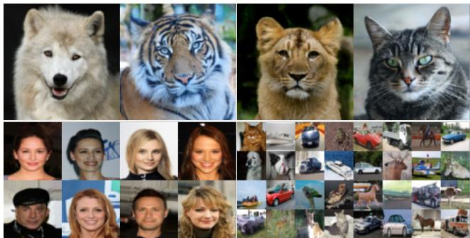
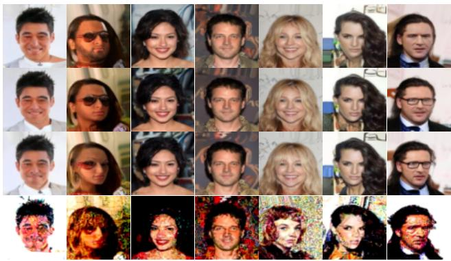
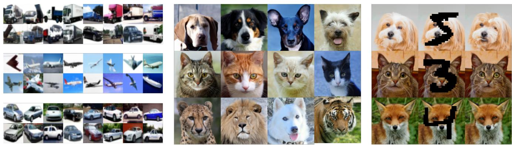

# A Complete Recipe for Diffusion Generative Models

Kushagra Pandey Dept. of Computer Science University of California, Irvine pandeyk1@uci.edu

Stephan Mandt Dept. of Computer Science University of California, Irvine mandt@uci.edu

## Abstract

Score-based Generative Models (SGMs) have demonstrated exceptional synthesis outcomes across various tasks. However, the current design landscape of the forward dif fusion process remains largely untapped and often relies on physical heuristics or simplifying assumptions. Utilizing insights from the development of scalable Bayesian posterior samplers, we present a complete recipe for formulating forward processes in SGMs, ensuring convergence to the desired target distribution. Our approach reveals that several existing SGMs can be seen as specific manifestations of our framework. Building upon this method, we introduce Phase Space Langevin Diffusion (PSLD), which relies on score-based modeling within an augmented space enriched by auxiliary variables akin to physical phase space. Empiri cal results exhibit the superior sample quality and improved speed-quality trade-offofPSLD compared to various competing approaches on established image synthesis benchmarks. Remarkably, PSLD achieves sample quality akin to state-ofthe-art SGMs (FID: 2.10for unconditional CIFAR-10 gener ation). Lastly, we demonstrate the applicability ofPSLD in conditional synthesis using pre-trained score networks, offering an appealing alternative as an SGM backboneforfuture advancements. Code and model checkpoints can be accessed at https://github.com/mandt-lab/PSLD.

## 1. Introduction

Score-based Generative Models [15, 50, 53, 56] are a class of explicit-likelihood based generative models that have recently demonstrated impressive performance on various synthesis benchmarks, such as image generation [7, 16, 39, 42, 43], video synthesis [17, 62] and 3D shape generation [32, 68]. SGMs employ a forward stochastic process to add noise to data incrementally, transforming the data-generating distribution to a tractable prior distribution that enables sampling. Subsequently, a learnable reverse process transforms the prior distribution back to the data distribution using a parametric estimator of the gradient field of the log probability density of the data (a.k.a score).

  
Figure 1: Unconditional PSLD generated samples. AFHQv2 128 x 128 (Top), CelebA-64 (Bottom Left, FID=2.01) and CIFAR-10 (Bottom Right, FID=2.10)

However, a principled framework for extending the current design space of diffusion processes is still missing. Although some studies have proposed augmenting the forward diffusion process with auxiliary variables [9] to improve sample quality, their design is primarily motivated by physical intuition and non-obvious how to generalize. Therefore, a principled framework is required to explore the space of possible diffusion processes better.

In this work, we propose a complete recipe for the design of diffusion processes, motivated by the design of stochastic gradient MCMC samplers [5, 33, 61]. Our recipe leads to a flexible parameterization of the forward diffusion process without requiring physical intuition. Moreover, under the proposed parameterization, the forward process is guaranteed to converge to a prior distribution of interest. We show that several existing SGMs can be cast under our diffusion process parameterization. Furthermore, using our proposed recipe, we introduce PSLD, a novel SGM which performs diffusion in the joint space of data and auxiliary variables. We demonstrate that PSLD generalizes Critically Damped Langevin Diffusion (CLD) [9] and outperforms existing baselines on several empirical settings on standard image synthesis benchmarks such as CIFAR-10 [25] and CelebA-64 [30]. More specifically, we make the following theoretical and empirical contributions:

1. A Complete Recipe for SGM Design: We propose a specific parameterization of the forward process, guaranteed to converge asymptotically to a desired stationary “prior” distribution. The proposed recipe is complete in the sense that it subsumes all possible Markovian stochastic processes which converge to this distribution. We show that several existing SGMs [9, 56] can be cast as specific instantiations of our recipe.

2. Phase Space Langevin Diffusion(PSLD): To exemplify the proposed diffusion parameterization concretely, we propose PSLD: a novel SGM which performs diffusion in the phase space by adding noise in both data and the momentum space.

3. Superior Sample Quality and Speed-Quality Tradeoffs: Using ablation experiments on standard image synthesis benchmarks like CIFAR-10 and CelebA-64, we demonstrate the benefits of adding stochastic noise in both the data and the momentum space on overall sample quality and the speed quality trade-offs associated with PSLD. Furthermore, using similar score network architectures, our proposed method outperforms existing diffusion baselines on both criteria across different sampler settings.

4. State-of-the-Art Sample Quality: We show that PSLD outperforms competing baselines and achieves competitive perceptual sample quality to other state-of-the-art methods. Our model achieves an FID [13] score of 2.10, an IS score [45] of 9.93 on unconditional CIFAR-10 and an FID score of 2.01 on CelebA-64.

5. Conditional synthesis: We show that pre-trained unconditional PSLD models can be used for conditional synthesis tasks like class-conditional generation and image inpainting during inference.

Overall, given the superior performance of PSLD on several tasks, we present an attractive alternative to existing SGM backbones for further development. We organize the rest of our work as follows: Section 2 presents some background on SGMs and our proposed recipe for SGM design. Section 3 presents the construction of our novel PSLD model. Section 4 presents our empirical findings. Lastly, Section 5 compares our proposed contributions to several existing works while we present some directions for future work in Section 6.

## 2. A Complete Recipe for SGM Design

## 2.1. Background

Consider the following forward process SDE for converting data $\mathbf { x } _ { t } \in \mathbb { R } ^ { d }$ to noise,

$$
d { \bf x } _ { t } = { \bf f } ( { \bf x } _ { t } , t ) d t + { \bf G } ( t ) d { \bf w } _ { t } , \quad t \in [ 0 , T ] ,
$$

with continuous time variable $t \in [ 0 , T ]$ , a standard Wiener process $\mathbf { w } _ { t } .$ , drift coefficient $\pmb { f } \colon \bar { \mathbb { R } } ^ { d } \times \bar { [ 0 , T ] }  \mathbb { R } ^ { d }$ , and diffusion coefficient $G \colon [ 0 , T ]   { \mathbb { R } } ^ { d \times d }$ . Given this forward process, the corresponding reverse-time diffusion process [1, 56] that generates data from noise is given by

$$
\begin{array} { r } { d \mathbf { x } _ { t } = \bar { f } ( \mathbf { x } _ { t } , t ) d t + G ( t ) d \bar { \mathbf { w } } _ { t } , } \end{array}\tag{1}
$$

$$
\begin{array} { r } { \bar { f } ( \mathbf { x } _ { t } , t ) = \left[ f ( \mathbf { x } _ { t } , t ) - G ( t ) G ( t ) ^ { \top } \nabla _ { \mathbf { x } _ { t } } \log p _ { t } ( \mathbf { x } _ { t } ) \right] . } \end{array}
$$

Given an estimate of the score $\nabla _ { \mathbf { x } _ { t } }$ log $p _ { t } ( \mathbf { x } _ { t } )$ of the marginal distribution over $\mathbf { x } _ { t }$ at time t, the reverse SDE can then be simulated to recover the original data samples from noise. In practice, the score is intractable to compute and is approximated using a parametric estimator $s _ { \theta } ( \mathbf { x } _ { t } , t )$ trained using denoising score matching [15, 53, 56, 60]:

$$
\underset { \pmb { \theta } } { \operatorname* { m i n } } \mathbb { E } _ { t } \mathbb { E } _ { p ( \mathbf { x } _ { 0 } ) } \mathbb { E } _ { p _ { t } ( \mathbf { x } _ { t } | \mathbf { x } _ { 0 } ) } \left[ \lambda ( t ) \lVert \mathbf { s } _ { \pmb { \theta } } ( \mathbf { x } _ { t } , t ) - \nabla _ { \mathbf { x } _ { t } } \log p _ { t } ( \mathbf { x } _ { t } | \mathbf { x } _ { 0 } ) \rVert _ { 2 } ^ { 2 } \right] .
$$

Above, the time t is usually sampled from a uniform distribution $\mathcal { U } ( 0 , T )$ . Given an appropriate choice of $f$ and $\pmb { G }$ the perturbation kernel $p ( \mathbf { x } _ { t } | \mathbf { x } _ { 0 } )$ can frequently be computed analytically $( \mathrm { e . g . }$ ., it is typically Gaussian). Consequently, samples $\mathbf { x } _ { t }$ can be generated in constant time, allowing for fast stochastic gradient updates. The choice of the weighting schedule $\lambda ( t )$ plays an essential role during training and can be selected to optimize for likelihood [52] or sample quality [56]. The forward SDE asymptotically converges to an equilibrium distribution (usually a standard isotropic Gaussian) which can be used as a prior to initialize the reverse SDE, which can then be simulated using numerical solvers.

## 2.2. A General Recipe for Constructing Stochastic Forward Processes

As has been shown in the MCMC literature [3, 5], it is often beneficial to extend the sampling space into an augmented space according to $\mathbf { z } = [ \mathbf { x } , \mathbf { \bar { m } } ] ^ { T } \in \mathbf { \bar { \mathbb { R } } } ^ { d _ { z } }$ , where $\mathbf { x } \in \mathbb { R } ^ { d _ { x } }$ is the original state space variable and $\mathbf { m } \in \mathbb { R } ^ { d _ { m } }$ corresponds to some additional auxiliary dimensions. Simulating the dynamics of the variable z may have desirable properties, such as faster mixing. Inspired by the naming conventions in statistical physics, we call x the position variable and m the momentum variable. Accordingly, we denote their joint space as augmented space (or phase space $i f \mathbf { x }$ and m have equal dimensions). Note that our notation also captures the scenario where m is absent (zero-dimensional). We now consider the following form of the stochastic process modeled using an Ito SDE:ˆ

$$
d \mathbf { z } = \pmb { f } ( \mathbf { z } ) d t + \sqrt { 2 \pmb { D } ( \mathbf { z } ) } d \mathbf { w } _ { t } ,\tag{2}
$$

with drift term $\pmb { f } ( \mathbf { z } ) \in \mathbb { R } ^ { d _ { z } }$ and diffusion coefficient $D ( \mathbf { z } ) \in$ $\mathbb { R } ^ { d _ { z } \times d _ { z } }$ . We assume a desired stationary state distribution $p _ { s } ( \mathbf { z } )$ specified as

$$
p _ { s } ( \mathbf { z } ) \propto \exp ( - H ( \mathbf { z } ) ) ,
$$

$$
H ( \mathbf { z } ) = H ( \mathbf { x } , \mathbf { m } ) = U ( \mathbf { x } ) + \frac { \mathbf { m } ^ { T } M ^ { - 1 } \mathbf { m } } { 2 } ,\tag{3}
$$

where H represents the Hamiltonian associated with $p _ { s } ( \mathbf { z } )$ The first term in $H ( \mathbf { z } )$ represents the potential energy $U ( \mathbf { x } )$ associated with the configuration x while the second term represents the kinetic energy associated with the auxiliary (or momentum) variables m and mass matrix $M I _ { d _ { m } }$ . In the context of Bayesian inference, [33] propose a framework to elucidate the design space of possible MCMC samplers that sample from $p _ { s } ( \mathbf { z } )$ . In this framework, the drift $\pmb { f } ( \mathbf { z } )$ can be parameterized as

$$
\pmb { f } ( \mathbf { z } ) = - ( D ( \mathbf { z } ) + \pmb { Q } ( \mathbf { z } ) ) \nabla H + \tau ( \mathbf { z } ) ,\tag{4}
$$

$$
\tau _ { i } ( \mathbf { z } ) = \sum _ { j = 1 } ^ { d } \frac { \partial } { \partial \mathbf { z } _ { j } } \left( D _ { i j } ( \mathbf { z } ) + Q _ { i j } ( \mathbf { z } ) \right) ,
$$

where $Q ( \mathbf { z } )$ represents a skew-symmetric curl matrix. Furthermore, the following result holds:

Theorem 2.1 (Yin et. al. [64]). For the dynamics defined in Eqn. $2 , i f f ( \mathbf { z } )$ is parameterized as in Eqn. 4 with $D ( \mathbf { z } )$ positive semidefinite and $Q ( \mathbf { z } )$ skew-symmetric, then the distribution $p _ { s } ( \mathbf { z } ) \propto \exp \left( - H ( \mathbf { z } ) \right)$ is a stationary distribution for the dynamics.

Theorem 2.1 implies that for a specific choice of matrices $D ( \mathbf { z } )$ and $Q ( \mathbf { z } )$ , the process defined in Eqn. 2 always asymptotically samples from the target distribution $p _ { s } ( \mathbf { z } )$ . Moreover, [33] showed in the context of MCMC that the parameterization defined in Eqn. 4 is complete as follows:

Theorem 2.2 (Ma et. al. [33]). Assume the stochastic process in Eqn. 2 converges to a unique stationary distribution $p _ { s } ( \mathbf { z } )$ . Then, under mild regularity assumptions, there exists a corresponding skew-symmetric matrix $Q ( \mathbf { z } )$ , such that $\pmb { f } ( \mathbf { z } )$ assumes the form of Eqn. 4.

We include the proofs for Theorems 2.1 and 2.2 in Appendix A.1 for completeness. These results provide a general recipe for designing forward processes in SGMs.

For the SGM to be a useful forward process, we need it to converge to a simple factorized distribution that serves as the initialization point of the backwards (generative) process. Consequently, we consider the following form of the stationary distribution $p _ { s } ( \mathbf { z } )$

$$
p _ { s } ( \mathbf { z } ) = \mathcal { N } ( \mathbf { x } ; \mathbf { 0 } _ { d _ { x } } , I _ { d _ { x } } ) \mathcal { N } ( \mathbf { 0 } _ { d _ { m } } , M I _ { d _ { m } } ) .\tag{5}
$$

This form results from setting $\begin{array} { r } { U ( \mathbf { x } ) ~ = ~ \frac { \mathbf { x } ^ { T } \mathbf { x } } { 2 } } \end{array}$ in Eqn. 3. Therefore, for a positive semidefinite matrix $D ( \mathbf { z } )$ and a skew-symmetric matrix $Q ( \mathbf { z } )$ , the most general class of forward processes which lead to an invariant distribution $p _ { s } ( \mathbf { z } )$ can be specified by substituting the form of $\nabla H ( \mathbf { z } )$ (corresponding to $p _ { s } ( \mathbf { z } )$ defined in Eqn. 5) in Eqn. 4. A similar characterization of forward processes has also been explored in a concurrent work by [48] in the context of likelihood estimation; see Section 5 for more details.

## 2.3. Additional constraints on $D ( \mathbf { z } )$ and $Q ( \mathbf { z } )$

Theorems 2.1 and 2.2 show that the proposed forward process parameterization is complete upon specifying the target distribution $p _ { s } ( \mathbf { z } )$ (such as Eqn. 5). However, we need additional requirements for the resulting generative model and the corresponding training objective to be tractable. Specifi cally, when using the denoting score matching objective [60], we require the perturbation kernel $p ( \mathbf { z } _ { t } | \mathbf { z } _ { 0 } )$ to be computable in closed form. In practice, this restricts our possible choices for $D ( \mathbf { z } )$ and $Q ( \mathbf { z } )$ to constant matrices (i.e., independent of the state variable z). Yet, even with this requirement, the framework provides a large design space of models. We provide several examples of existing SGMs that can be understood as special cases of our recipe in Appendix A.2. We stress that training paradigms other than denoting score matching (e.g., such as Sliced Score matching [55]) may enable a wider range of possible models with non-constant matrices D and $Q .$

## 3. Phase Space Langevin Diffusion

We next use the proposed recipe to construct a specific SGM with favorable properties.

## 3.1. Model Definition

We restrict the family of forward processes considered in this work by constraining $D ( \mathbf { z } )$ and $Q ( \mathbf { z } )$ as constant matrices, i.e., independent of state z. Moreover, we assume that x and m have the same dimension ${ \mathrm { d } } ,$ i.e. $\textbf { z } \in \mathbb { R } ^ { 2 d }$ Consequently, the drift $f ( \mathbf { z } )$ becomes affine in z and the perturbation kernel $p ( \mathbf { z } _ { t } | \mathbf { z } _ { 0 } )$ can be computed analytically [47]. Among the possible samplers, we choose a specific form involving d−dimensional position and momentum coordinates, ${ \mathbf z } _ { t } = [ { \mathbf x } _ { t } , { \mathbf m } _ { t } ] ^ { T }$ where $\mathbf { x } _ { t } \in \mathbb { R } ^ { d } , \mathbf { m } _ { t } \in \mathbb { R } ^ { d }$ . Our choice for $D ( \mathbf { z } )$ and $Q ( \mathbf { z } )$ is as follows:

$$
D : = \frac { \beta } { 2 } \left( \left( \begin{array} { c c } { { \Gamma } } & { { 0 } } \\ { { 0 } } & { { M \nu } } \end{array} \right) \otimes { \cal I } _ { d } \right) , ~ Q : = \frac { \beta } { 2 } \left( \left( \begin{array} { c c } { { 0 } } & { { - 1 } } \\ { { 1 } } & { { 0 } } \end{array} \right) \otimes { \cal I } _ { d } \right) .\tag{6}
$$

Above, Γ, M, ν and β are positive scalars. Along with these choices of D and $Q _ { \cdot }$ , we have ${ \boldsymbol { \tau } } ( \mathbf { z } ) = \mathbf { 0 }$ . The resulting forward process is given by:

$$
d \mathbf { z } _ { t } = f ( \mathbf { z } _ { t } ) d t + G ( t ) d \mathbf { w } _ { t } ,\tag{7}
$$

$$
\pmb { f } ( \mathbf { z } _ { t } ) = \left( \frac { \beta } { 2 } \left( \frac { - \Gamma } { - 1 } \quad \begin{array} { c c } { { M ^ { - 1 } } } \\ { { - 1 } } \end{array} \right) \otimes \pmb { I } _ { d } \right) \ \mathbf { z } _ { t } ,
$$

$$
\pmb { G } ( t ) = \sqrt { 2 D ( \mathbf { z } _ { t } ) } = \left( \begin{array} { c c } { \sqrt { \Gamma \beta } } & { 0 } \\ { 0 } & { \sqrt { M \nu \beta } } \end{array} \right) \otimes \pmb { I } _ { d } .
$$

We denote the form of the SDE in Eqn. 7 as the Phase Space Langevin Diffusion (PSLD). Note that PSLD generalizes Critically Damped Langevin Diffusion (CLD) proposed in [9], which can be obtained by setting $\Gamma = 0 , \bar { \nu } = M \nu$ , and $\begin{array} { r } { \bar { \beta } = \frac { \beta } { 2 } } \end{array}$ . Like CLD, the parameter $M ^ { - 1 }$ couples the data space state $\mathbf { x } _ { t }$ with the auxiliary state mt. The parameters $\beta _ { ; }$ , Γ, and ν control the amount of noise in the forward SDE. Without loss of generality, we use a time-independent $\beta .$ . However, unlike CLD or any physical system, PSLD adds stochastic noise in the data space in addition to the noise injected into the momentum component of phase space. While we are not aware of any physical system that displays such behavior, it is a valid stochastic process compatible with our framework. Our experiments reveal the strong benefits of having these two independent noise sources.

Furthermore, CLD [9] proposes setting $\bar { \nu } ^ { 2 } = 4 M$ , corresponding to critical damping in a physical system. Under critical damping, an ideal balance is achieved between the oscillatory Hamiltonian dynamics and the noise-injecting Ohrnstein-Uhlenbeck (OU) term, leading to faster convergence to equilibrium. We generalize this line of argument in Appendix B.1, where we derive $( \Gamma - \nu ) ^ { 2 } = 4 M ^ { - \mathbf { \breve { 1 } } }$ as the equivalent condition for critical damping in PSLD. Throughout this work, we choose Γ, $\nu ,$ and $\dot { M } ^ { - 1 }$ such that the critical damping condition in PSLD is satisfied.

## 3.2. PSLD Training

Since the drift coefficient in PSLD is affine, the perturbation kernel $p ( \mathbf { z } _ { t } | \mathbf { z } _ { 0 } )$ of PSLD can be computed analytically. We can then use DSM to learn the score function $s _ { \theta } ( \mathbf { z } _ { t } , t )$ . More specifically, following the derivation in [52], it can be shown that the Maximum-Likelihood (ML) based DSM objective for PSLD can be specified as (Proof in Appendix B.2.1)

$$
\displaystyle \operatorname* { m i n } _ { \pmb { \theta } } \mathbb { E } _ { t } \mathbb { E } _ { p ( \mathbf { z } _ { 0 } ) } \mathbb { E } _ { p _ { t } ( \mathbf { z } _ { t } | \mathbf { z } _ { 0 } ) } \Big [ \mathscr { L } _ { x } ( \pmb { \theta } , \mathbf { z } _ { t } , \mathbf { z } _ { 0 } ) + \mathscr { L } _ { m } ( \pmb { \theta } , \mathbf { z } _ { t } , \mathbf { z } _ { 0 } ) \Big ] ,\tag{8}
$$

$$
\begin{array} { r l } & { \mathcal { L } _ { x } = \Gamma \beta \| \mathbf { s } _ { \theta } ( \mathbf { z } _ { t } , t ) \vert _ { 0 : d } - \nabla _ { \mathbf { x } _ { t } } \log p _ { t } ( \mathbf { z } _ { t } | \mathbf { z } _ { 0 } ) \| _ { 2 } ^ { 2 } , } \\ & { \mathcal { L } _ { m } = M \nu \beta \| \mathbf { s } _ { \theta } ( \mathbf { z } _ { t } , t ) \vert _ { d : 2 d } - \nabla _ { \mathbf { m } _ { t } } \log p _ { t } ( \mathbf { z } _ { t } | \mathbf { z } _ { 0 } ) \| _ { 2 } ^ { 2 } , } \end{array}
$$

where $s _ { \theta } ( \mathbf { z } _ { t } , t ) \vert _ { 0 : d }$ and $s _ { \theta } ( \mathbf { z } _ { t } , t ) \vert _ { d : 2 d }$ represent the first and the last d components of the vector $s _ { \theta } ( \mathbf { z } _ { t } , t )$ respectively. In the above DSM objective, the perturbation kernel $p ( \mathbf { z } _ { t } \vert \mathbf { z } _ { 0 } ) = \mathcal { N } ( \mu _ { t } , \Sigma _ { t } )$ is a multivariate Gaussian while $p ( \mathbf { z } _ { 0 } ) \overset { , } { = } p ( \mathbf { x } _ { 0 } ) \ddot { \mathcal { N } } ( \mathbf { m } _ { 0 } ; 0 , M \gamma I _ { d } )$ , where $p ( \mathbf { x } _ { 0 } )$ is the data distribution. In this work, we reformulate the DSM objective in Eqn. 8 as follows (also see Appendix B.2.1):

$$
\underset { \pmb { \theta } } { \operatorname* { m i n } } \mathbb { E } _ { t } \mathbb { E } _ { p ( \mathbf { z } _ { 0 } ) } \mathbb { E } _ { p _ { t } ( \mathbf { z } _ { t } | \mathbf { z } _ { 0 } ) } \Big [ \lambda ( t ) \lVert \mathbf { s } _ { \theta } ( \mathbf { z } _ { t } , t ) - \nabla _ { \mathbf { z } _ { t } } \log p _ { t } ( \mathbf { z } _ { t } | \mathbf { z } _ { 0 } ) \rVert _ { 2 } ^ { 2 } \Big ] .
$$

Furthermore, due to its gradient variance reduction properties, we instead use the Hybrid Score Matching (HSM) objective [9] by marginalizing out the momentum variables m as $\begin{array} { r } { p ( \mathbf { z } _ { t } | \mathbf { x } _ { 0 } ) = \int p ( \mathbf { z } _ { t } | \mathbf { x } _ { 0 } , \mathbf { m } _ { 0 } ) p ( \mathbf { m } _ { 0 } ) d \mathbf { m } _ { 0 } } \end{array}$ . Since both distributions $p ( \mathbf { z } _ { t } | \mathbf { x } _ { 0 } , \mathbf { m } _ { 0 } )$ and $p ( \mathbf { m } _ { 0 } )$ are Gaussian, $p ( \mathbf { z } _ { t } | \mathbf { x } _ { 0 } )$ will also be a Gaussian.

Score Network Parameterization: Since the perturbation kernel $p ( \mathbf { z } _ { t } | \mathbf { x } _ { 0 } )$ in the HSM objective is also a multivariate Gaussian, we have $p ( \mathbf { z } _ { t } | \mathbf { x } _ { 0 } ) \sim \mathcal { N } ( \mu _ { t } , \Sigma _ { t } )$ ). Furthermore, let $\pmb { \Sigma } _ { t } = \pmb { L } _ { t } \pmb { L } _ { t } ^ { T }$ be the Cholesky factorization of the matrix $\Sigma _ { t }$ We have

$$
\nabla _ { \mathbf { z } _ { t } } \log p ( \mathbf { z } _ { t } | \mathbf { x } _ { 0 } ) = - \Sigma _ { t } ^ { - 1 } ( \mathbf { z } _ { t } - \pmb { \mu } _ { t } ) = - \pmb { L } _ { t } ^ { - T } \pmb { \epsilon } ,\tag{9}
$$

where $\mathbf { \delta } _ { \pmb { L } _ { t } ^ { - T } }$ is the transposed inverse of the $\scriptstyle { \mathbf { L } } _ { t }$ and $\epsilon \sim \mathcal { N } ( 0 _ { 2 \mathrm { d } } , \mathbf { I _ { 2 \mathrm { d } } } )$ . Therefore, we parameterize our score function estimator as ${ \pmb s } _ { \theta } ( z _ { t } , t ) = - \bar { \bf L } _ { t } ^ { - T } { \pmb \epsilon } _ { \theta } ( { \bf z } _ { t } , t )$ . Although alternative parameterizations of the score network $s _ { \theta } ( \mathbf { z } _ { t } , t )$ like mixed score can be possible [9, 20, 58], we do not explore such parameterizations in this work and leave further exploration to future work. We provide additional details on the score network parameterization in PSLD in Appendix B.2.2 and the analytical form of the perturbation kernel $p ( \mathbf { z } _ { t } | \mathbf { x } _ { 0 } )$ in Appendix B.3.

Final Training Objective: Using our score parameterization from Eqn. 9 with $\begin{array} { r } { \lambda ( t ) = \frac { 1 } { \lVert \boldsymbol { L } _ { t } ^ { - T } \rVert _ { 2 } ^ { 2 } } , } \end{array}$ , we get the following epsilon-prediction form of the HSM objective (See Appendix B.2.3 for a complete derivation):

$$
\operatorname* { m i n } _ { \theta } \mathbb { E } _ { t \sim \mathcal { U } ( 0 , T ) } \mathbb { E } _ { p ( \mathbf { x } _ { 0 } ) } \mathbb { E } _ { \epsilon \sim \mathcal { N } ( 0 , I _ { d } ) } \left[ \left\| \epsilon _ { \theta } ( \mu _ { t } + L _ { t } \epsilon , t ) - \epsilon \right\| _ { 2 } ^ { 2 } \right] .\tag{10}
$$

The epsilon-prediction objective has been shown to generate superior sample quality [9, 15, 56]. In this work, we optimize for sample quality and therefore use this objective for training all models. One key difference between the objective in Eqn. 10 and the HSM objective in CLD is that, unlike CLD, we predict the full 2d-dimensional ϵ due to the structure of our diffusion coefficient $G ( t )$ (see Appendix B.2 for more details). Therefore, for a non-zero Γ, the neural-net-based score predictor in PSLD has twice the number of output channels as in CLD. However, the increase in parameters due to this architectural update is negligible.

## 3.3. PSLD Sampling

Following the result from [56], the reverse process SDE corresponding to the forward process SDE defined in Eqn. 8 can be formulated as follows:

$$
d \bar { \bf z } _ { t } = \bar { \pmb f } ( \bar { \bf z } _ { t } ) d t + \pmb G ( T - t ) d \bar { \bf w } _ { t } ,\tag{11}
$$

$$
\bar { \pmb f } ( \bar { \mathbf { z } } _ { t } ) = \frac { \beta } { 2 } \left( \Gamma \bar { \mathbf { x } } _ { t } - M ^ { - 1 } \bar { \mathbf { m } } _ { t } + 2 \Gamma s _ { \theta } ( \bar { \mathbf { z } } _ { t } , T - t ) | _ { 0 : d } \right) ,
$$

$$
G ( T - t ) = \left( \begin{array} { c c } { { \sqrt { \Gamma \beta } } } & { { 0 } } \\ { { 0 } } & { { \sqrt { M \nu \beta } } } \end{array} \right) \otimes { \cal I } _ { d } ,
$$

<table><tr><td>Method</td><td>Size</td><td>NFE</td><td>FID@50k (↓)</td></tr><tr><td>Ours (Baseline)</td><td></td><td></td><td></td></tr><tr><td>CLD (w/o MS)</td><td>97M</td><td>1000</td><td>2.41</td></tr><tr><td>Ours (Proposed)</td><td></td><td></td><td></td></tr><tr><td>PSLD (Γ=0.02)</td><td>39M</td><td>1000</td><td>2.80</td></tr><tr><td>PSLD (Γ=0.01)</td><td>55M</td><td>1000</td><td>2.34</td></tr><tr><td>PSLD (Γ=0.02)</td><td>55M</td><td>1000</td><td>2.30</td></tr><tr><td>PSLD (Γ=0.01)</td><td>97M</td><td>1000</td><td>2.23</td></tr><tr><td>PSLD (Γ=0.02)</td><td>97M</td><td>1000</td><td>2.21</td></tr><tr><td>CLD (w/ MS) [9]</td><td>108M</td><td>1000</td><td>2.27</td></tr><tr><td>VPSDE (deep)† [56]</td><td>108M</td><td>1000</td><td>2.46</td></tr><tr><td>VESDE (deep)† [56]</td><td>108M</td><td>1000</td><td>2.43</td></tr><tr><td>DDPM [15]</td><td>35.7M</td><td>1000</td><td>3.17</td></tr><tr><td>iDDPM [36]</td><td></td><td>1000</td><td>2.90</td></tr><tr><td>DiffuseVAE [38]</td><td>35.7M</td><td>1000</td><td>2.80</td></tr><tr><td>NCSNv2 [54]</td><td></td><td></td><td>10.87</td></tr><tr><td>NCSN [53]</td><td></td><td>1000</td><td>25.32</td></tr><tr><td>VDM [21]</td><td></td><td>1000</td><td>7.41</td></tr></table>

Table 1: PSLD (SDE) sample quality comparisons for CIFAR-10. PSLD outperforms competing SDE baselines for a similar sampling budget. FID computed using 50k samples. MS: Mixed Score †: Results from [9].

where $\bar { \bf z } _ { t } = { \bf z } _ { T - t } , \bar { \bf x } _ { t } = { \bf x } _ { T - t } , \bar { \bf m } _ { t } = { \bf m } _ { T - t }$ . We can simulate this reverse process SDE using standard numerical SDE solvers like the Euler-Maruyama (EM) sampler [23]. As an alternative, [9] propose SSCS: a symmetric splittingbased integrator and show that SSCS exhibits a better speedsample quality tradeoff than EM. Consequently, we extend SSCS for PSLD by using the following splitting formulation:

$$
\begin{array} { c } { { \displaystyle \left( \vphantom { \displaystyle \frac { \bar { \kappa } _ { t } } { \bf \bar { x } } _ { t } } \right) = A + S , } } \\ { { \displaystyle \mathcal { A } = \frac { \beta } { 2 } \left( \begin{array} { c } { { \displaystyle - \bar { \bf x } _ { t } - { \cal M } ^ { - 1 } { \bf \bar { m } } _ { t } } } \\ { { \displaystyle ~ \bar { \bf x } _ { t } - \nu \bar { \bf m } _ { t } } } \end{array} \right) d t + G ( T - t ) d \bar { \bf w } _ { t } } , }  \\ { { \displaystyle \mathcal { S } = \beta \left( \begin{array} { c } { { \displaystyle \Gamma \bar { \bf x } _ { t } + \Gamma s _ { \theta } ( \bar { \bf z } _ { t } , T - t ) | _ { 0 : d } } } \\ { { \displaystyle \nu \bar { \bf m } _ { t } + M \nu s _ { \theta } ( \bar { \bf z } _ { t } , T - t ) | _ { d : 2 d } } } \end{array} \right) d t . } } \end{array}\tag{12}
$$

Indeed for $\Gamma = 0 ,$ the sampler in Eqn. 12 resembles the SSCS sampler proposed in [9]. It is worth noting that despite an updated formulation, the order of the SSCS sampler, as analyzed in [9], remains unchanged. We discuss the exact solution of the analytical part of the Modified-SSCS sampler in Eqn. 12 and other relevant details in Appendix B.4.2.

## 4. Experiments

Datasets: We run experiments on three datasets: CIFAR-10 [25], CelebA [30] at 64 x 64 resolution and the AFHQv2 [6] dataset at 128 x 128 resolution.

Baselines: We primarily compare PSLD with two popular SGM baselines: VP-SDE [56] and CLD [9] (a particular case of PSLD with $\Gamma = 0 )$ . For PSLD and CLD, unless specified otherwise, we operate in the critical damping regime with a fixed $M ^ { - 1 } = 4$ and therefore choose Γ and ν accordingly $( \nu = 2 \sqrt { M ^ { - 1 } } + \Gamma , \nu \geq 0 , \Gamma \geq 0 )$

<table><tr><td>Method</td><td>Size</td><td>NFE</td><td>FID@50k (↓)</td></tr><tr><td colspan="4">Ours (Baseline)</td></tr><tr><td>CLD (w/o MS)</td><td>97M</td><td>352</td><td>2.80</td></tr><tr><td colspan="4">Ours (Proposed)</td></tr><tr><td>PSLD (Γ=0.01)</td><td>55M</td><td>243</td><td>2.41</td></tr><tr><td>PSLD (Γ=0.02)</td><td>55M</td><td>232</td><td>2.40</td></tr><tr><td>PSLD (Γ=0.01)</td><td>97M</td><td>246</td><td>2.10</td></tr><tr><td>PSLD (Γ=0.02)</td><td>97M</td><td>231</td><td>2.31</td></tr><tr><td colspan="4">Ours (Proposed)</td></tr><tr><td>PSLD (Γ=0.01)</td><td>97M</td><td>159</td><td>2.13</td></tr><tr><td>PSLD (Γ=0.02)</td><td>97M</td><td>159</td><td>2.34</td></tr><tr><td>LSGM† [58]</td><td>100M</td><td>131</td><td>4.60</td></tr><tr><td>LSGM [58]</td><td>476M</td><td>138</td><td>2.10</td></tr><tr><td>VPSDE† [56]</td><td>108M</td><td>141</td><td>2.76</td></tr><tr><td>CLD (w/ MS) [9]</td><td>108M</td><td>147</td><td>2.71</td></tr><tr><td>CLD (w/ MS) [9]</td><td>108M</td><td>312</td><td>2.25</td></tr><tr><td>ScoreFlow (VP) [52]</td><td>108M</td><td></td><td>5.34</td></tr><tr><td>Flow Matching (w/ OT) [28]</td><td></td><td>142</td><td>6.35</td></tr><tr><td>DDIM (VPSDE)† [51]</td><td>108M</td><td>150</td><td>3.15</td></tr></table>

Table 2: PSLD (ODE) sample quality comparisons for CIFAR-10. PSLD outperforms most competing ODE baselines. FID computed using 50k samples. MS: Mixed Score. †: Results from [9].

Metrics: We use the FID [13] score for quantitatively assessing sample quality, while we use NFE (Number of Function Evaluations) to assess the sampling efficiency of all methods.

We provide full implementation details in Appendix C. The rest of our experimental section is organized as follows: Firstly, we compare the state-of-the-art performance of PSLD with popular SGM baselines on unconditional image generation. We show that PSLD outperforms competing baselines for similar compute budgets. Secondly, as an ablation experiment, we empirically and theoretically analyze the impact of the SDE parameters Γ and ν on downstream sample quality in PSLD. Furthermore, we analyze the speedquality trade-off in PSLD and show that PSLD yields better sample quality than competing baselines across four different sampler settings. Lastly, we show that pre-trained unconditional PSLD models can be used for downstream tasks like class-conditional image synthesis and image inpainting.

## 4.1. State-of-the-art Comparisons

Setup: We now compare the sample quality of our proposed method with existing popular SGM methods on the CIFAR-10 and CelebA-64 datasets for unconditional image synthesis. We use PSLD with $\Gamma \in \lbrace 0 . 0 1 , 0 . 0 2 \rbrace$ for CIFAR-10 and PSLD with $\Gamma = 0 . 0 0 5$ for CelebA-64 for state-of-the-art (SOTA) comparisons (See Section 4.2 for a theoretical and empirical justification of these choices). Moreover, we use the training objective in Eqn. 10 without any alternative score parameterizations (like mixed score[9, 58]) to train our models for SOTA comparisons.

<table><tr><td>Method</td><td>NFE</td><td>FID@50k</td></tr><tr><td>(Ours) PSLD (Γ = 0.005)</td><td>250</td><td>2.01</td></tr><tr><td>(Ours) PSLD (Γ = 0.005, ODE)</td><td>244</td><td>2.56</td></tr><tr><td>PNDM [29]</td><td>250</td><td>2.71</td></tr><tr><td>DDIM [51]</td><td>250</td><td>4.44</td></tr><tr><td>VPSDE [56]</td><td>1000</td><td>2.32</td></tr><tr><td>Gamma DDPM [35]</td><td>1000</td><td>2.92</td></tr><tr><td>DDPM [15]</td><td>1000</td><td>3.26</td></tr><tr><td>DiffuseVAE [38]</td><td>1000</td><td>3.97</td></tr><tr><td>VESDE [56]</td><td>2000</td><td>3.95</td></tr><tr><td>NCSN (w/ denoising) [53]</td><td></td><td>25.3</td></tr><tr><td>NCSNv2 (w/ denoising) [54]</td><td></td><td>10.23</td></tr></table>

Table 3: PSLD sample quality comparisons for CelebA-64. FID computed using 50k samples.

Unless specified otherwise, we perform sampling using the EM sampler with Uniform Striding (US) for CIFAR-10 and Quadratic Striding (QS) for CelebA-64 for the SDE setup and report FID scores on 50k samples (denoted as FID@50k). We include full details on our SDE and ODE solver setup for SOTA analysis in Appendix C.5. We report the FID scores for most competing methods for a maximum sampling budget of N=1000 while reporting model sizes whenever available for CIFAR-10 for fair comparisons.

Main Observations: Table 1 compares CIFAR-10 sample quality between different methods using stochastic sampling. Our proposed method with Γ = 0.02 and 39M parameters achieves an FID score of 2.80, outperforming the DDPM [15] baseline while performing comparably with Diffuse-VAE [38], for similar model sizes. It is worth noting that DiffuseVAE refines samples generated from a VAE [22] using a DDPM backbone and is complementary to our work. Furthermore, our larger PSLD model achieves an FID of 2.21, which is better than CLD [9] (with or without the Mixed Score (MS) parameterization) and (VP/VE)-SDE baselines for similar NFE budget and model sizes. For CelebA-64 (Table 3), PSLD outperforms the VP/VE-SDE baselines by a significant margin while requiring only 250 NFEs.

We next analyze ODE sample quality in PSLD. Table 2 compares CIFAR-10 sample quality between different methods using ODE-based samplers. PSLD with Γ = 0.01 achieves an FID score of 2.10 and outperforms most competing methods except LSGM [58]. Though the original LSGM model is more than four times the size of our SOTA model, PSLD performs comparably with LSGM. When scaled to a similar size, LSGM performs much worse than PSLD (FID: 4.60 for LSGM-100M vs. 2.10 for PSLD). We note that EDM [20] achieves an FID of 2.05 on unconditional CIFAR-10 generation (without data augmentation) by analyzing several design choices associated with diffusion models (like score network architectures, loss preconditioning, and sampler design). We did not explore this line of research but note that their approach complements our proposed method, and exploring some of these design choices in the context of PSLD can be an exciting future direction.

<table><tr><td colspan="3">CIFAR-10 (39M)</td><td colspan="2">CelebA-64 (66M)</td></tr><tr><td>Γ</td><td>FID@50k↓ (EM-QS)</td><td>FID@50k↓ (EM-US)</td><td>FID@10k↓ (EM-QS)</td><td>FID@10k↓ (EM-US)</td></tr><tr><td>0</td><td>3.64</td><td>3.60</td><td>4.59</td><td>4.60</td></tr><tr><td>0.005</td><td>3.42</td><td>3.34</td><td>4.17</td><td>4.37</td></tr><tr><td>0.01</td><td>3.15</td><td>2.94</td><td>4.22</td><td>4.34</td></tr><tr><td>0.02</td><td>3.26</td><td>2.80</td><td>4.43</td><td>4.52</td></tr><tr><td>0.25</td><td>4.99</td><td>9.48</td><td>93.99</td><td>95.13</td></tr></table>

Table 4: Impact of increasing Γ (with fixed $M ^ { - 1 } )$ on sample quality (NFE=1000). FID computed using 50k and 10k samples for the CIFAR-10 and CelebA-64 datasets, respectively. QS: Quadratic Striding, US: Uniform Striding.

Interestingly, PSLD with the ODE setup obtains a better FID score than the SDE setup (FID: 2.21 for SDE vs. 2.10 for ODE) while requiring around four times lesser NFEs. Moreover, when using a solver tolerance of $1 e ^ { - 4 }$ , PSLD achieves an FID score of 2.13, comparable to the best FID of 2.10 while reducing NFEs significantly. This tradeoff is worsefor other SGMs like CLD and VP-SDE (Table 2). We report additional SOTA results in Appendix D.3.

## 4.2. Impact of Γ and ν on PSLD Sample Quality

  
Figure 2: Impact of increasing $\Gamma = \{ 0 , 0 . 0 0 5 , 0 . 0 2 , 0 . 2 5 \}$ (Top to Bottom) on CelebA-64 sample quality. The best sample quality is achieved at $\Gamma \ : = \ : 0 . 0 0 5$ (Second Row) while increasing Γ to 0.25 results in loss of high-frequency image features.

Setup and Baselines: Since adding stochastic noise in both the data and the momentum space is one of the primary aspects of PSLD, we now analyze the impact of the choice of Γ and ν on downstream sample quality. For subsequent experimental results, we use our smaller ablation models (for PSLD and relevant baselines) for comparisons. Table 4 shows the impact of varying Γ on sample quality for the CIFAR-10 and CelebA-64 datasets. Our ablation CLD baseline (PSLD with $\Gamma = 0 , \nu = 4 )$ achieves an FID of 3.60 using the Euler-Maruyama (EM) sampler with Uniform striding (US) and 3.64 using the EM sampler with Quadratic striding (QS). Our results are comparable with the FID of 3.56 obtained by [9] for their CLD ablation model on CIFAR-10 without using the mixed-score parameterization. Our VP-SDE ablation baseline (not shown in Table 4) obtains an FID of 3.19 using EM-US (with 1000 NFEs).

Main Observations: We observe that setting Γ to a nonzero value within a specific range improves sample quality significantly over CLD. Specifically, our ablation CIFAR-10 model achieves FID scores of 2.94 and 2.80 for Γ = 0.01 and $\Gamma = 0 . 0 2$ respectively (with EM-US) and outperforms our VP-SDE and CLD baselines without using alternative scorenetwork parameterizations like mixed-score which is crucial for competitive performance of CLD [9]. We make a similar observation for the CelebA-64 dataset on which our model achieves the best FID of 4.17 using EM-QS and outperforms our CLD baseline (FID: 4.59). Interestingly, the sample quality worsens for both datasets on increasing Γ outside a range. For instance, for CIFAR-10, further increasing Γ from 0.02 to 0.04 (not shown in Table 4) resulted in an increase in FID from 2.80 to 2.95. Consequently, the sample quality for both datasets is the worst at $\Gamma = 4 . 2 5 , \nu = 0 . 2 5$ . We also note that EM-US works better than EM-QS for CIFAR-10 and vice-versa for CelebA-64.

Figure 2 further validates our findings qualitatively for the CelebA-64 dataset where for $\Gamma = 0 . 2 5$ , the score network can only recover high-level semantic structures (like gender and glasses, among others) but is unable to recover high-frequency details. Since the diffusion denoiser recovers most high-frequency information in the low-timestep regime, these observations suggest denoising issues near low-timestep indices. We next provide a formal justification for this observation.

Theoretical justification of adding stochasticity in the position space: Since PSLD involves adding stochasticity in both the data and the momentum space, during training, we need to predict the noise $\boldsymbol { \epsilon } _ { \theta } ^ { x } ( \mathbf { z } _ { t } , t )$ and $\boldsymbol { \epsilon } _ { \theta } ^ { m } ( \mathbf { z } _ { t } , t )$ in both the data and the momentum space respectively. Therefore, it is unclear why PSLD leads to better sample quality than CLD since predicting both noise components can lead to additional sources of errors during sampling.

However, in the context of the EM sampler, we find (see Appendix D.1) that setting a small non-zero Γ can significantly suppress prediction errors from $\boldsymbol { \epsilon } _ { \theta } ^ { x } ( \mathbf { z } _ { t } , t )$ at the expense of introducing negligible extra errors from $\boldsymbol { \epsilon } _ { \theta } ^ { m } ( { \bf z } _ { t } , t )$ Contrarily, using larger values of Γ results in scaling the prediction errors from $\boldsymbol { \epsilon } _ { \theta } ^ { x } ( \mathbf { z } _ { t } , t )$ by a significant factor, especially in the low-timestep regime, leading to worse sample quality with significant degradations in high-frequency sample details as observed in Figure 2.

<table><tr><td colspan="2"></td><td colspan="5">NFE (FID@10k ↓)</td></tr><tr><td>Sampler</td><td>Method</td><td>50</td><td>100</td><td>250</td><td>500</td><td>1000</td></tr><tr><td rowspan="3">EM-QS</td><td>CLD</td><td>25.01</td><td>8.91</td><td>5.97</td><td>5.61</td><td>5.7</td></tr><tr><td>VP-SDE (Ours) PSLD</td><td>17.72</td><td>7.45</td><td>5.59</td><td>5.51</td><td>5.51</td></tr><tr><td></td><td>19.94</td><td>7.33</td><td>5.26</td><td>5.20</td><td>5.28</td></tr><tr><td rowspan="3">EM-US</td><td>CLD VP-SDE</td><td>119.68 84.54</td><td>45.60</td><td>9.08</td><td>5.71</td><td>5.65</td></tr><tr><td>(Ours) PSLD</td><td>100.62</td><td>41.93 39.96</td><td>12.61</td><td>5.92</td><td>5.19</td></tr><tr><td></td><td></td><td></td><td>11.26</td><td>5.45</td><td>4.82</td></tr><tr><td>SSCS-QS</td><td>CLD (Ours) PSLD</td><td>21.31 16.12</td><td>8.37 7.16</td><td>5.82 5.36</td><td>5.75 5.35</td><td>5.69 5.27</td></tr><tr><td rowspan="2">SSCS-US</td><td>CLD</td><td>75.45</td><td>24.74</td><td>6.09</td><td>5.74</td><td></td></tr><tr><td>(Ours) PSLD</td><td>72.42</td><td>20.46</td><td>5.19</td><td>4.92</td><td>5.78 5.29</td></tr></table>

Table 5: PSLD exhibits better speed vs. sample quality tradeoffs over competing baseline SDEs (CLD and VP-SDE) on CIFAR-10 across four samplers configurations. The rightmost five columns indicate NFEs, with bold indicating the best result for that sampler. QS: Quadratic Striding, US: Uniform Striding. See Appendix D.2 for extended results.

Therefore, intuitively, Γ introduces a trade-off between error contributionfrom both noise predictors $\boldsymbol { \epsilon } _ { \theta } ^ { x } ( { \bf z } _ { t } , t )$ and $\boldsymbol { \epsilon } _ { \theta } ^ { m } ( \mathbf { z } _ { t } , t )$ with small values of Γ providing a favorable tradeoff which improve overall sample quality. As a general guideline, we find $\Gamma = 0 . 0 1$ to work well across datasets. Fig ure 1 shows some qualitative samples generated from PSLD trained on the AFHQv2 [6] dataset with $\Gamma = 0 . 0 1 , \nu = 4 . 0 1$

## 4.3. Sample Speed vs. Quality Tradeoffs for PSLD

Sampler Setup: Since the tradeoff between sample quality and the number of reverse sampling steps required is crucial for any SGM backbone, we now examine this tradeoff for PSLD for the CIFAR-10 dataset (See Appendix D.2 for extended results on the CelebA-64 dataset). We use our VP-SDE and PSLD with $\Gamma = 0$ (corresponding to CLD) ablation models as comparison baselines. Furthermore, we use combinations of the EM and SSCS samplers with Uniform (US) and Quadratic (QS) timestep striding as different sampler settings to benchmark the performance of all methods. It is worth noting that the SSCS sampler can only be used for augmented SGMs like CLD and PSLD. For ODE-based comparisons, we use the probability flow ODE setup with RK45 [10] solver (see Appendix C.5 for more details). Lastly, we measure sample quality using FID computed for 10k samples (denoted as FID@10k).

Main Observations: Table 5 shows a comparison between FID scores for our best performing PSLD models (corresponding to $\Gamma = 0 . 0 1$ and $\Gamma = 0 . 0 2 )$ and our VP-SDE and CLD baselines from Section 4.2 for the CIFAR-10 dataset across $N \in \{ 5 0 , 1 0 0 , 2 5 0 , 5 0 0 , 1 0 0 0 \}$ steps. We primarily observe that PSLD outperforms the VP-SDE and CLD baselines across all comparison points with the most significant differences at lower NFE (Network Function Evaluations)

<table><tr><td>Method</td><td> $\mathrm { l o g } _ { 1 0 } \mathrm { t o l }$ </td><td>FID@10k (↓)</td><td>Avg. NFE</td></tr><tr><td rowspan="5">CLD (Baseline)</td><td>-5</td><td>5.54</td><td>280</td></tr><tr><td>-4</td><td>5.62</td><td>196</td></tr><tr><td>-3</td><td>6.54</td><td>147</td></tr><tr><td>-2</td><td>9.98</td><td>86</td></tr><tr><td>-1</td><td>397.1</td><td>27</td></tr><tr><td rowspan="6">(Ours) PSLD (Γ = 0.02)</td><td>-5</td><td>4.79</td><td>228</td></tr><tr><td>-4</td><td>4.84</td><td>158</td></tr><tr><td>-3</td><td>5.09</td><td>111</td></tr><tr><td>-2</td><td>16.11</td><td>69</td></tr><tr><td>-1</td><td>418.77</td><td>27</td></tr><tr><td>-5</td><td>5.91</td><td>123</td></tr></table>

Table 6: PSLD exhibits better speed vs. sample quality tradeoffs over competing baselines on CIFAR-10 using a black-box ODE solver. $\log _ { 1 0 }$ tol indicates the ODE sampler (RK45) tolerance. Bold indicates best result for that column.

<table><tr><td>Method</td><td>FID (Train)</td><td>FID (Test)</td></tr><tr><td>CLD</td><td>1.01</td><td>7.10</td></tr><tr><td>(Ours) PSLD (Γ = 0.01)</td><td>0.85</td><td>6.93</td></tr></table>

Table 7: PSLD outperforms CLD on Image inpainting for the AFHQv2 dataset. FID (lower is better) is computed on the full train and test sets.

values. For instance, PSLD $( \Gamma = 0 . 0 2 )$ achieves the best FID of 16.12 at NFE=50 compared to 17.72 and 21.31 by VP-SDE and CLD, respectively. Moreover, for most sampler settings across methods, SSCS performs better in the low NFE regime $( N \leq 2 5 0 )$ , while EM performs better for a higher number of NFEs. A similar observation was made in [9]. Similarly, Quadratic striding works much better in the low NFE regime, while Uniform striding works better when using a higher number of NFEs (N > 500).

We next compare our best-performing ablation model (PSLD with Γ = 0.02) with our VP-SDE and CLD baselines using the probability flow ODE setup across multiple tolerance levels on the CIFAR-10 dataset. Table 6 compares FID scores (computed on 10k samples) for all methods. Like our SDE setup, PSLD (Γ=0.02) outperforms both baselines in sample quality for similar NFE budgets. Moreover, across the same solver tolerance level, PSLD requires fewer NFEs on average than its CLD counterpart while yielding better sample quality. Lastly, we found using black-box solvers to further improve sample quality compared to the SDE baseline at a tolerance level of 1e-5 for both our PSLD and CLD models for CIFAR-10 (FID@10k=4.97 for PSLD for ODE vs. FID@10k=4.84 for EM-QS (N=1000) with Γ = 0.02). This observation is consistent with the ODE comparison results presented in Section 4.1.

## 4.4. Conditional Generation with PSLD

Following prior work [7, 56], given some conditioning information y, an unconditional pre-trained score network

$s _ { \theta } ( \mathbf { u } _ { t } , t )$ can be used for sampling from the distribution $p ( \mathbf { z } _ { t } | \mathbf { y } )$ in PSLD. More specifically,

$$
\begin{array} { r } { \nabla _ { \mathbf { z } _ { t } } \log p ( \mathbf { z } _ { t } | \mathbf { y } ) = \nabla _ { \mathbf { z } _ { t } } \log p ( \mathbf { y } | \mathbf { z } _ { t } ) + \nabla _ { \mathbf { z } _ { t } } \log p ( \mathbf { z } _ { t } ) , } \\ { \approx \nabla _ { \mathbf { z } _ { t } } \log p ( \mathbf { y } | \mathbf { z } _ { t } ) + s _ { \theta } ( \mathbf { z } _ { t } , t ) . \qquad ( } \end{array}\tag{13}
$$

We can then use the estimate of $\nabla _ { \mathbf { z } _ { t } } \log p ( \mathbf { z } _ { t } | \mathbf { y } )$ in Eqn. 13 to sample from the following SDE for conditional generation:

$$
\begin{array} { r } { d \mathbf { z } _ { t } = \left[ \pmb { f } ( \mathbf { z } _ { t } ) - \pmb { G } ( t ) \pmb { G } ( t ) ^ { T } \nabla _ { \mathbf { z } _ { t } } \log p ( \mathbf { z } _ { t } | \mathbf { y } ) \right] d t + \pmb { G } ( t ) d \mathbf { w } _ { t } . } \end{array}\tag{14}
$$

Figure 3 illustrates class conditional samples for the CIFAR-10 and the AFHQv2 datasets obtained by training an additional time-dependent classifier $p ( \mathbf { y } \vert \mathbf { z } _ { t } )$ to compute $\nabla _ { \mathbf { z } _ { t } } \log p ( \mathbf { y } | \mathbf { z } _ { t } )$ , followed by sampling from the SDE in Eqn. 14 (full implementation details in Appendix D.4). Similarly, we can perform data imputation by setting the conditioning signal $\mathbf { y } = \bar { \mathbf { z } } _ { 0 }$ where $\bar { \bf z } _ { 0 }$ is the observed part of the input data $\mathbf { z } _ { 0 }$ (See Figure 3). For image inpainting, PSLD exhibits a better perceptual quality of inpainted samples over CLD on the AFHQv2 dataset (See Table 7). We include a complete derivation for inpainting and an analogous framework to [56] for solving inverse problems using PSLD with additional conditional synthesis results in Appendix D.4.

## 5. Related Work

Advances in Diffusion Models: Following the seminal work on diffusion (a.k.a score-based) models [15, 50, 53, 56], there has been much recent progress in advancing unconditional [7, 9, 18, 19, 36, 42, 46, 58] and conditional [4, 38, 42, 44, 56] diffusion models for a variety of downstream tasks like text-to-image synthesis [37, 40], image super-resolution [27, 44] and video generation [14, 17, 63, 65]. Our work is closely related to CLD [9], which is motivated by Langevin heat baths in statistical mechanics [26]. However, our method is not directly motivated by physical interpretation but rather directly constructed from our proposed drift parameterization. Another line of research in SGMs is to perform score-based modeling in the latent space [42, 49, 58] of a powerful autoencoder [12, 57]. Such approaches have been shown to improve the sampling time in SGMs. Therefore, since we propose a novel diffusion model backbone, most existing advances in diffusion models complement PSLD.

Sampler Design in Diffusion Models: Improving the speed-vs-quality tradeoff in SGMs is a fundamental area in diffusion model research [2, 24, 29, 51, 66, 67]. One popular approach to speed up diffusion model sampling is DDIM [51]. [66] show that DDIM can be cast as an exponential integrator and propose further improvements. [67] further leverage these improvements to propose a generalized-DDIM (gDDIM) method for CLD. It is worth noting that gDDIM parameterization requires predicting the score w.r.t both the data and the auxiliary variables and is directly compatible with PSLD. Another line of research involves training to speed up diffusion sampling. GENIE [8] proposes to utilize higher-order Taylor methods during training to speed up DDIM sampling. Alternatively, distillation-based approaches distill a teacher into a student diffusion model progressively [34, 46] or otherwise [31]. Therefore, exploring some of these directions in the context of PSLD would be interesting.

  
Figure 3: (Left) Class-conditional results on CIFAR-10: Truck, Airplane, and Automobile from Top to Bottom (two rows each). (Middle) Class conditional results on AFHQv2: Dogs, Cats and Others from Top to Bottom (one row each). (Right) Inpainting results on AFHQv2. The columns represent the original, corrupted, and imputed samples, respectively, from left to right.

Auxiliary Diffusion Models: In a concurrent work, [48] define an ELBO for multivariate diffusion models (MDM) and introduce a similar recipe as ours to design new diffusion processes. While [48] optimize for likelihood estimates, we primarily focus on sample quality in this work. Both works illustrate a different perspective on the advantages of constructing a generic recipe for designing diffusion processes and, therefore, complementary. Another recent work, Flexible Diffusion [11], exploits the geometry of the data manifold to parameterize the forward process. The proposed framework is complete under linear drift. However, our proposed parameterization makes no such assumptions.

## 6. Conclusion

We presented a recipe for constructing forward process parameterization for diffusion processes that guarantees convergence to a prespecified stationary distribution, such as a Gaussian. We use the proposed recipe to construct a novel diffusion process: Phase Space Langevin Diffusion(PSLD) which achieves excellent sample quality with better speedvs-quality tradeoffs compared to existing baselines like the VP-SDE and CLD on standard image-synthesis benchmarks. We left the exploration of potentially performance-improving design choices such as alternative score network parameterizations and loss weighting [20] as directions for future work.

While this work only explores stochastic samplers with a single auxiliary ”momentum” variable m (of the same dimension as x), exploring other design choices of D(z) and Q(z) [48], which lead to higher-order stochastic samplers (like the Nose-Hoover Thermostat) could also be an interest-´ ing research direction. Furthermore, our current choices of D(z) and Q(z) are limited to constant matrices due to relying on denoising score matching. Therefore, the proposed parameterization offers a complementary framework for designing diffusion generative models trained using alternative score-matching techniques.

Lastly, our proposed recipe is only complete under the assumption that both x and m are required to converge to prescribed marginals p(x) and p(m). Without this requirement on m, the design space of samplers is potentially larger (as has been pointed out in the Bayesian MCMC literature) and may, e.g., include microcanonical samplers [41, 59]. However, the requirements of generative diffusion models are more strict and demand that the forward process’s asymptotic joint distribution over x and m has a simple form that enables sampling in constant time. In contrast, Bayesian MCMC only requires the x-marginal to converge to the prescribed posterior. We still think that relaxing the requirements on tractability enables potentially promising new samplers for future exploration.

Acknowledgements We thank Gavin Kerrigan, Uros Seljak, and Rajesh Ranganath for insightful discussions. KP acknowledges support from the HPI Research Center in Machine Learning and Data Science at UC Irvine. SM acknowledges support from the National Science Foundation (NSF) under an NSF CAREER Award, award numbers 2003237 and 2007719, by the Department of Energy under grant DE-SC0022331, the IARPA WRIVA program, and by gifts from Qualcomm and Disney.

## References

[1] Brian D.O. Anderson. Reverse-time diffusion equation models. Stochastic Processes and their Applications, 12(3):313– 326, 1982. 2

[2] Fan Bao, Chongxuan Li, Jun Zhu, and Bo Zhang. Analytic-DPM: an analytic estimate of the optimal reverse variance in diffusion probabilistic models. In International Conference on Learning Representations, 2022. 8

[3] Steve Brooks, Andrew Gelman, Galin Jones, and Xiao-Li Meng, editors. Handbook of Markov Chain Monte Carlo. Chapman and Hall/CRC, may 2011. 2

[4] Nanxin Chen, Yu Zhang, Heiga Zen, Ron J Weiss, Mohammad Norouzi, and William Chan. Wavegrad: Estimating gradients for waveform generation. In International Conference on Learning Representations. 8

[5] Tianqi Chen, Emily Fox, and Carlos Guestrin. Stochastic gradient hamiltonian monte carlo. In International conference on machine learning, pages 1683–1691. PMLR, 2014. 1, 2

[6] Yunjey Choi, Youngjung Uh, Jaejun Yoo, and Jung-Woo Ha. Stargan v2: Diverse image synthesis for multiple domains. In Proceedings of the IEEE/CVF conference on computer vision and pattern recognition, pages 8188–8197, 2020. 5, 7

[7] Prafulla Dhariwal and Alexander Nichol. Diffusion models beat gans on image synthesis. Advances in Neural Information Processing Systems, 34:8780–8794, 2021. 1, 8

[8] Tim Dockhorn, Arash Vahdat, and Karsten Kreis. Genie: Higher-order denoising diffusion solvers. In Advances in Neural Information Processing Systems. 9

[9] Tim Dockhorn, Arash Vahdat, and Karsten Kreis. Scorebased generative modeling with critically-damped langevin diffusion. In International Conference on Learning Representations. 1, 2, 4, 5, 6, 7, 8

[10] J.R. Dormand and P.J. Prince. A family of embedded rungekutta formulae. Journal of Computational and Applied Mathematics, 6(1):19–26, 1980. 7

[11] Weitao Du, Tao Yang, He Zhang, and Yuanqi Du. A flexible diffusion model, 2022. 9

[12] Patrick Esser, Robin Rombach, and Bjorn Ommer. Taming transformers for high-resolution image synthesis. In Proceedings of the IEEE/CVF conference on computer vision and pattern recognition, pages 12873–12883, 2021. 8

[13] Martin Heusel, Hubert Ramsauer, Thomas Unterthiner, Bernhard Nessler, and Sepp Hochreiter. Gans trained by a two time-scale update rule converge to a local nash equilibrium. Advances in neural information processing systems, 30, 2017. 2, 5

[14] Jonathan Ho, William Chan, Chitwan Saharia, Jay Whang, Ruiqi Gao, Alexey Gritsenko, Diederik P Kingma, Ben Poole, Mohammad Norouzi, David J Fleet, et al. Imagen video: High definition video generation with diffusion models. arXiv preprint arXiv:2210.02303, 2022. 8

[15] Jonathan Ho, Ajay Jain, and Pieter Abbeel. Denoising diffusion probabilistic models. Advances in Neural Information Processing Systems, 33:6840–6851, 2020. 1, 2, 4, 5, 6, 8

[16] Jonathan Ho, Chitwan Saharia, William Chan, David J Fleet, Mohammad Norouzi, and Tim Salimans. Cascaded diffusion models for high fidelity image generation. J. Mach. Learn. Res., 23(47):1–33, 2022. 1

[17] Jonathan Ho, Tim Salimans, Alexey A Gritsenko, William

Chan, Mohammad Norouzi, and David J Fleet. Video diffusion models. In Advances in Neural Information Processing Systems. 1, 8

[18] Bowen Jing, Gabriele Corso, Renato Berlinghieri, and Tommi Jaakkola. Subspace diffusion generative models. In Computer Vision–ECCV 2022: 17th European Conference, Tel Aviv, Israel, October 23–27, 2022, Proceedings, Part XXIII, pages 274–289. Springer, 2022. 8

[19] Alexia Jolicoeur-Martineau, Remi Pich´ e-Taillefer, Ioannis´ Mitliagkas, and Remi Tachet des Combes. Adversarial score matching and improved sampling for image generation. In International Conference on Learning Representations, 2021. 8

[20] Tero Karras, Miika Aittala, Timo Aila, and Samuli Laine. Elucidating the design space of diffusion-based generative models. In Advances in Neural Information Processing Systems. 4, 6, 9

[21] Diederik Kingma, Tim Salimans, Ben Poole, and Jonathan Ho. Variational diffusion models. Advances in neural information processing systems, 34:21696–21707, 2021. 5

[22] Diederik P Kingma and Max Welling. Auto-encoding varia tional bayes. arXiv preprint arXiv:1312.6114, 2013. 6

[23] Peter E. Kloeden and Eckhard Platen. Numerical Solution of Stochastic Differential Equations. Springer Berlin Heidelberg, 1992. 5

[24] Zhifeng Kong and Wei Ping. On fast sampling of diffusion probabilistic models. In ICML Workshop on Invertible Neural Networks, Normalizing Flows, and Explicit Likelihood Models. 8

[25] Alex Krizhevsky. Learning multiple layers of features from tiny images. pages 32–33, 2009. 1, 5

[26] B. Leimkuhler. Molecular dynamics : with deterministic and stochastic numerical methods / Ben Leimkuhler, Charles Matthews. Interdisciplinary applied mathematics, 39. Springer, Cham, 2015. 8

[27] Haoying Li, Yifan Yang, Meng Chang, Shiqi Chen, Huajun Feng, Zhihai Xu, Qi Li, and Yueting Chen. Srdiff: Single image super-resolution with diffusion probabilistic models. Neurocomputing, 479:47–59, 2022. 8

[28] Yaron Lipman, Ricky T. Q. Chen, Heli Ben-Hamu, Maximilian Nickel, and Matthew Le. Flow matching for generative modeling. In International Conference on Learning Representations, 2023. 5

[29] Luping Liu, Yi Ren, Zhijie Lin, and Zhou Zhao. Pseudo numerical methods for diffusion models on manifolds. In International Conference on Learning Representations. 6, 8

[30] Ziwei Liu, Ping Luo, Xiaogang Wang, and Xiaoou Tang. Deep learning face attributes in the wild. In Proceedings of International Conference on Computer Vision (ICCV), December 2015. 1, 5

[31] Eric Luhman and Troy Luhman. Knowledge distillation in iterative generative models for improved sampling speed. arXiv preprint arXiv:2101.02388, 2021. 9

[32] Shitong Luo and Wei Hu. Diffusion probabilistic models for 3d point cloud generation. In Proceedings ofthe IEEE/CVF Conference on Computer Vision and Pattern Recognition, pages 2837–2845, 2021. 1

[33] Yi-An Ma, Tianqi Chen, and Emily Fox. A complete recipe for stochastic gradient mcmc. Advances in neural information

processing systems, 28, 2015. 1, 3

[34] Chenlin Meng, Ruiqi Gao, Diederik P Kingma, Stefano Ermon, Jonathan Ho, and Tim Salimans. On distillation of guided diffusion models. In NeurIPS 2022 Workshop on Score-Based Methods. 9

[35] Eliya Nachmani, Robin San Roman, and Lior Wolf. Non gaussian denoising diffusion models. arXiv preprint arXiv:2106.07582, 2021. 6

[36] Alexander Quinn Nichol and Prafulla Dhariwal. Improved denoising diffusion probabilistic models. In International Conference on Machine Learning, pages 8162–8171. PMLR, 2021. 5, 8

[37] Alexander Quinn Nichol, Prafulla Dhariwal, Aditya Ramesh, Pranav Shyam, Pamela Mishkin, Bob Mcgrew, Ilya Sutskever, and Mark Chen. Glide: Towards photorealistic image generation and editing with text-guided diffusion models. In International Conference on Machine Learning, pages 16784– 16804. PMLR, 2022. 8

[38] Kushagra Pandey, Avideep Mukherjee, Piyush Rai, and Abhishek Kumar. Diffusevae: Efficient, controllable and highfidelity generation from low-dimensional latents. Transactions on Machine Learning Research. 5, 6, 8

[39] Aditya Ramesh, Prafulla Dhariwal, Alex Nichol, Casey Chu, and Mark Chen. Hierarchical text-conditional image generation with clip latents, 2022. 1

[40] Aditya Ramesh, Prafulla Dhariwal, Alex Nichol, Casey Chu, and Mark Chen. Hierarchical text-conditional image generation with clip latents. arXiv preprint arXiv:2204.06125, 2022. 8

[41] Jakob Robnik and Uros Seljak. Microcanonical langevinˇ monte carlo. arXiv preprint arXiv:2303.18221, 2023. 9

[42] Robin Rombach, Andreas Blattmann, Dominik Lorenz, Patrick Esser, and Bjorn Ommer. High-resolution image¨ synthesis with latent diffusion models. In Proceedings of the IEEE/CVF Conference on Computer Vision and Pattern Recognition, pages 10684–10695, 2022. 1, 8

[43] Chitwan Saharia, William Chan, Saurabh Saxena, Lala Li, Jay Whang, Emily Denton, Seyed Kamyar Seyed Ghasemipour, Raphael Gontijo-Lopes, Burcu Karagol Ayan, Tim Salimans, et al. Photorealistic text-to-image diffusion models with deep language understanding. In Advances in Neural Information Processing Systems. 1

[44] Chitwan Saharia, Jonathan Ho, William Chan, Tim Salimans, David J Fleet, and Mohammad Norouzi. Image superresolution via iterative refinement. IEEE Transactions on Pattern Analysis and Machine Intelligence, 2022. 8

[45] Tim Salimans, Ian Goodfellow, Wojciech Zaremba, Vicki Cheung, Alec Radford, and Xi Chen. Improved techniques for training gans. Advances in neural information processing systems, 29, 2016. 2

[46] Tim Salimans and Jonathan Ho. Progressive distillation for fast sampling of diffusion models. In International Conference on Learning Representations. 8, 9

[47] Simo Sarkk¨ a and Arno Solin.¨ Applied stochastic differential equations, volume 10. Cambridge University Press, 2019. 3

[48] Raghav Singhal, Mark Goldstein, and Rajesh Ranganath. Where to diffuse, how to diffuse, and how to get back: Automated learning for multivariate diffusions. In The Eleventh International Conference on Learning Representations, 2023.

3, 9

[49] Abhishek Sinha, Jiaming Song, Chenlin Meng, and Stefano Ermon. D2c: Diffusion-decoding models for few-shot conditional generation. Advances in Neural Information Processing Systems, 34:12533–12548, 2021. 8

[50] Jascha Sohl-Dickstein, Eric Weiss, Niru Maheswaranathan, and Surya Ganguli. Deep unsupervised learning using nonequilibrium thermodynamics. In International Conference on Machine Learning, pages 2256–2265. PMLR, 2015. 1, 8

[51] Jiaming Song, Chenlin Meng, and Stefano Ermon. Denoising diffusion implicit models. In International Conference on Learning Representations. 5, 6, 8

[52] Yang Song, Conor Durkan, Iain Murray, and Stefano Ermon. Maximum likelihood training of score-based diffusion models. In A. Beygelzimer, Y. Dauphin, P. Liang, and J. Wortman Vaughan, editors, Advances in Neural Information Processing Systems, 2021. 2, 4, 5

[53] Yang Song and Stefano Ermon. Generative modeling by estimating gradients of the data distribution. Advances in neural information processing systems, 32, 2019. 1, 2, 5, 6, 8

[54] Yang Song and Stefano Ermon. Improved techniques for training score-based generative models. Advances in neural information processing systems, 33:12438–12448, 2020. 5, 6

[55] Yang Song, Sahaj Garg, Jiaxin Shi, and Stefano Ermon. Sliced score matching: A scalable approach to density and score estimation. In Uncertainty in Artificial Intelligence, pages 574–584. PMLR, 2020. 3

[56] Yang Song, Jascha Sohl-Dickstein, Diederik P Kingma, Ab hishek Kumar, Stefano Ermon, and Ben Poole. Score-based generative modeling through stochastic differential equations. In International Conference on Learning Representations. 1, 2, 4, 5, 6, 8

[57] Arash Vahdat and Jan Kautz. Nvae: A deep hierarchical variational autoencoder. Advances in neural information processing systems, 33:19667–19679, 2020. 8

[58] Arash Vahdat, Karsten Kreis, and Jan Kautz. Score-based generative modeling in latent space. Advances in Neural Information Processing Systems, 34:11287–11302, 2021. 4, 5, 6, 8

[59] Greg Ver Steeg and Aram Galstyan. Hamiltonian dynamics with non-newtonian momentum for rapid sampling. Advances in Neural Information Processing Systems, 34:11012–11025, 2021. 9

[60] Pascal Vincent. A connection between score matching and denoising autoencoders. Neural Computation, 23(7):1661– 1674, 2011. 2, 3

[61] Max Welling and Yee Whye Teh. Bayesian learning via stochastic gradient langevin dynamics. In Proceedings ofthe 28th International Conference on International Conference on Machine Learning, ICML’11, page 681–688, Madison, WI, USA, 2011. Omnipress. 1

[62] Ruihan Yang, Prakhar Srivastava, and Stephan Mandt. Diffusion probabilistic modeling for video generation, 2022. 1

[63] Ruihan Yang, Prakhar Srivastava, and Stephan Mandt. Diffusion probabilistic modeling for video generation. arXiv preprint arXiv:2203.09481, 2022. 8

[64] L Yin and P Ao. Existence and construction of dynamical potential in nonequilibrium processes without detailed

balance. Journal of Physics A: Mathematical and General, 39(27):8593, jun 2006. 3

[65] Jiahui Yu, Yuanzhong Xu, Jing Yu Koh, Thang Luong, Gunjan Baid, Zirui Wang, Vijay Vasudevan, Alexander Ku, Yinfei Yang, Burcu Karagol Ayan, et al. Scaling autoregressive models for content-rich text-to-image generation. Transactions on Machine Learning Research. 8

[66] Qinsheng Zhang and Yongxin Chen. Fast sampling of diffusion models with exponential integrator. In The Eleventh International Conference on Learning Representations, 2023. 8

[67] Qinsheng Zhang, Molei Tao, and Yongxin Chen. gddim: Generalized denoising diffusion implicit models. arXiv preprint arXiv:2206.05564, 2022. 8

[68] Linqi Zhou, Yilun Du, and Jiajun Wu. 3d shape generation and completion through point-voxel diffusion. In Proceedings of the IEEE/CVF International Conference on Computer Vision, pages 5826–5835, 2021. 1