# A Dynamic Dual-Processing Object Detection Framework Inspired by the Brain’s Recognition Mechanism

Minying Zhang\*† Tianpeng Bu\* Lulu Hu

Alibaba Group

Hangzhou, Zhejiang, China

{minying.zmy, tianpeng.btp, chudu.hll} @alibaba-inc.com

## Abstract

There are two main approaches to object detection: CNN-based and Transformer-based. The former views object detection as a dense local matching problem, while the latter sees it as a sparse global retrieval problem. Research in neuroscience has shown that the recognition decision in the brain is based on two processes, namelyfamiliarity and recollection. Based on this biological support, we propose an efficient and effective dual-processing object detection framework. It integrates CNN- and Transformer-based detectors into a comprehensive object detection system consisting of a shared backbone, an efficient dual-stream encoder, and a dynamic dual-decoder. To better integrate local and global features, we design a search space for the CNN-Transformer dual-stream encoder tofind the optimalfusion solution. To enable better coordination between the CNN- and Transformer-based decoders, we provide the dual-decoder with a selective mask. This mask dynamically chooses the more advantageous decoder for each position in the image based on high-level representation. As demonstrated by extensive experiments, our approach showsflexibility and effectiveness in prompting the mAP ofthe various source detectors by 3.0∼3.7 without increasing FLOPs.

## 1. Introduction

Object detection is a fundamental and challenging research problem in the field of computer vision. The task is to predict a bounding box and a category label for each object in an image. In early times, CNN-based method has made significant progresses in this field, which utilizes convolution to attain both low- and high-level local pattern information from the input image, and performs classification on all candidate grids paved on the image [33, 22, 39, 5, 9, 17]. Recently, Transformer-based detector is proposed as an alternative solution to this problem. It employs a Transformer-based encoder and decoder to build attention-based global representation and reason about relationships between objects and the global image context via a set of queries [3, 46, 24, 43, 41, 28, 19, 45]. Overall, CNN- and Transformer-based detectors can be structured into a backbone-encoder-decoder architecture. This architecture includes a backbone that extracts rich and general shallow features, an encoder that generates task-relevant high-level representations, and a decoder that predicts the results. Studies in [35, 44] show that visual perception process in human brain is also hierarchical and conclude that the ventral visual stream (VVS) of the human brain can be abstracted by a backbone-encoder-decoder structure, which provides biologically-plausible explanation to the structure of current deep learning based object detectors, as shown in Figure 2(c).

There is increasing evidence that brain’s recognition is, in fact, on the basis of the dual-process detection theory which has already a far-reaching influence in the field of psychology and cognitive neuroscience [44]. It claims that brain’s recognition reflects the joint contribution of two separable retrieval processes, namely familiarity and recollection. Neuroscientists find that familiarity is associated with distinct visual cortex area whose biological mechanism inspires the CNN architecture [34] and recollection is typically ascribed to the hippocampus which has close relationship to the Transformer [42]. These findings indicate that in the field of deep learning based object detectors, the function and working mechanism of CNN- and Transformerbased detectors are both bio-inspired and have close relation to familiarity and recollection processes. But each single process can not fully reflect how human brain delivering object detection tasks and may easily reach its limit as shown in Figure 1. Some recent works attempt to improve the performances of detectors with CNN-Transformer hybrid methods [7, 43, 6, 8, 37], by introducing the key properties of one to the other. However they only consider either familiarity-like CNN-based encoding-decoding pipeline or

Transformer more confident

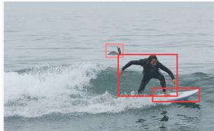  
(a) CNN-based detector results

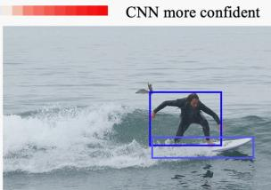  
(b) Transformer-based detector results

  
(c) Selective Mask

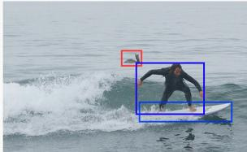  
(d) Our method results  
Figure 1: Our proposed method can dynamically combine the advantages of CNN- and Transformer-based detectors with a selective mask to achieve better performance. The bird’s shape and pose carry rich local-patterns, but the bird is uncommonly seen in the sea, thus lack of context information, while the half of surfboard is submerged in the sea, thus missing local features, but it carries adequate contextual information, such as the pose of the person and the wave of the sea. Thus, the former can be better localized by the CNN-based detector and the latter is easier for Transformer-based detector.

recollection-like Transformer-based pipeline, which can not reflect the dual-process mechanism concurrently.

Inspired by the dual-process recognition mechanism in human brain and take full advantages of CNN- and Transformer-based detectors simultaneously, in this paper, we propose a Dynamic Dual-Processing framework, DDP in short, which simulates the familiarity and recollection processes of the brain, as shown in Figure 2(d). It consists of a shared backbone, an efficient dual-stream encoder and a dynamic dual-decoder. Although it is easy to think of using two independent CNN- and Transformer-based encodingdecoding branches, a simple ensemble of these two detectors is costly and yields marginal improvements. To realize an effective and efficient combination of them, there are two critical issues that need to be addressed: 1) how the information interacts and integrates between CNN and Transformer streams in encoder; 2) how two decoders cooperate and aggregate the predictions in order to achieve the optimal performance. To solve the first question, our dual-stream encoder(DSE) preserves both CNN and Transformer encoding streams and allows intermediate feature interactions along each stream, which is unlike previous hybrid single-stream encoders. Instead of manually designing feature interaction strategies, we use neural network architecture search method to find the optimal depth and feature fusion strategies. To solve the second question, contrary to simply assembling the predictions of two independent decoders, we provide a dynamic dual-decoder(DDD) equipped with a binary selective mask. This mask dynamically chooses the more advantageous decoder for each position in the image based on high-level representation, as shown in Figure 1(c). The learning of this mask can be seen as the competition of CNN- and Transformer-based decoders in predicting the target at the corresponding position. Thus, it avoids the redundant computation and enable each decoder concentrate on its own powerful side and avoid weakness, as shown in Figure 1(d). We show that the proposed framework achieves promising performance in terms of accuracy and model complexity on the COCO datasets [23]. Extensive experiments validate the effectiveness of the cooperation of CNN and Transformer in both encoder and decoder.

## 2. Related Works

Human Vision System. Extensive studies on neuroscience have focused on constructing the conceptual model for human vision systems. As shown in Figure 2(c), a dualprocess encoding-decoding structure is demonstrated [44, 35]. The visual stimulus is first processed in the initial stage of visual system(backbone), where simple features are extracted [18]. And these early-stage features flow into an encoder, which represents more complex information, such as object form, contextual associations and context-dependent representations [15, 1]. In decoder, familiarity and recollection processes play key rules in making the inference for object recognition and forming long-term memories of visual objects and their contexts [12, 29].

CNN- and Transformer based Encoders. The mechanisms of processing higher level features between CNNand Transformer-based encoders are distinct. Some CNNbased encoders such as FPN [21], PAFPN [25] and biFPN [38] construct semantic-riched feature pyramids by fusing local context from multi-scale features, and others, e.g., Dilated-encoder [5] and Trident Network [20], obtain boosted high-level features by employing dilated convolutions to increase the receptive field of the encoders. In contrast, Transformer-based encoders in [3, 46, 28] strengthen the features by applying self-attention to capture longrange dependency among each pixel on the feature map. Nevertheless, neither of CNN- and Transformer-based encoders learns from the dual-stream encoder of human vision system, which interactively produces local and nonlocal higher level features in parallel.

CNN- and Transformer based Decoders. We can categorize CNN-based decoder into one- and two- stage detectors. For the decoder of one-stage detectors, the object category and position can be directly determined with reference to the anchor point [22, 26], grid centers [32, 39] or object centers/corners [9, 17]. On the other hand, two-stage detectors make prediction w.r.t region proposals [11, 33] or learnable embeddings [36]. On the contrary, the Transformer based decoder [3] straightforwardly reasons objects in the image by modeling the cross-attention between learnable queries and a set of keys from encoder’s feature maps, which is inherently one-stage. Certain works also associate queries with spatial positions to accelerate the crossattention modeling, e.g. in [46, 24, 28, 41]. However, both CNN- and Transformer-based decoders are static and single-mode, which is incapable of simulating the dynamic dual-processing recognition in human vision system.

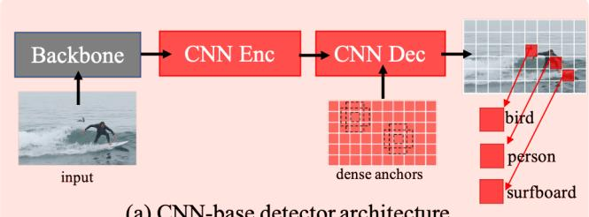  
(a) CNN-base detector architecture

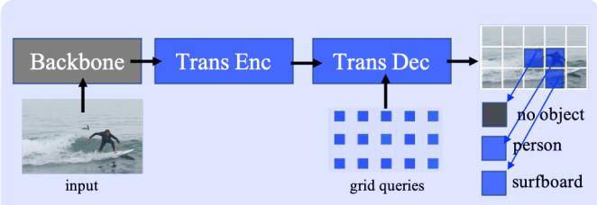  
(b) Transformer-base detector architecture

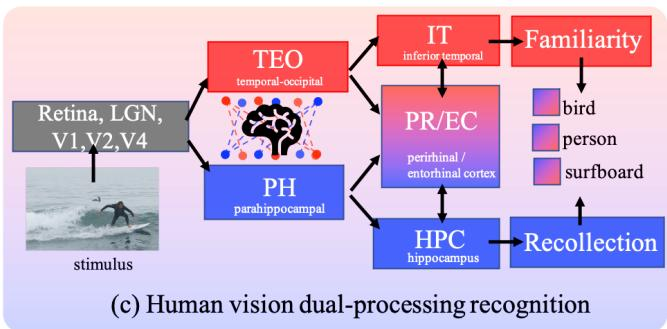

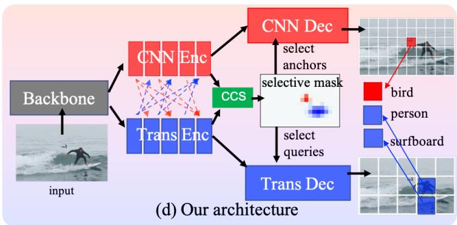  
Figure 2: Illustration of deep learning based object detectors, human vision system, and proposed framework. Either CNN based(a) or Transformer-based detectors(b) is a single-mode detection system. By contrast, our proposed framework(d) is a dual-process framework inspired by human vision system.

CNN- and Transformer-combined Detectors. To further improve the performance, recent works are dedicated to introducing Transformer elements to CNN-based detectors. For example, [30] incorporates self-attention into traditional CNN-based object detection framework as a postprocess module, re-rescoring the confidence of each prediction. In [27, 14], they improve capability of CNNbased encoder by fusing global context produced by attention mechanism into FPN. Furthermore, [7, 6, 37] apply Transformer-like modules on the decoder in CNNbased detectors. Another line of works aim at improving Transformer based detectors by learning from CNNbased detector design paradigms. Specifically, Efficient DETR [43] introduces a RPN into DETR framework, empowering dense-to-sparse query selection mechanism. Dynamic DETR [8] replaces Transformer-based encoder by a convolution-based dynamic encoder and brings RoIPool operation in the process of cross-attention in order to generate region features. But above mentioned methods only consider to bridge CNN-based or Transformer-based detectors based on existing single-mode framework, none of them is feasible to represent dual-processing mechanism.

## 3. Human Vision System to Neural Detectors

Hint1: Dual CNN- and Transformer-like Recognition Pathways with a shared backbone. It is shown in Figure 2(c) that after passing through a shared Retina, LGN, V1, V2 and V4, the visual stimulus is processed by a dual-process recognition model [44]. TEO-IT and PH-HPC are associated with familiarity and recollection respectively. The above finding indicates that to mimic the dual-process recognition model, CNN(familiarity) and Transformer(recollection) based modules should co-exist in both encoder and decoder of an object detector and they can share a same backbone.

Hint2: Interaction between CNN and Transformer Pathways When Encoding Visual Information. Within the encoder of above dual-process model, researchers also found bi-directional interactions between TEO and PH [40], which enable to create contextual-bind representations and attentive-linked representations for TEO-IT and PH-HPC pathways. However, the interaction mechanism is so complex that is not fully exploited. These studies indicate that bi-directional connections between CNN and Transformer processing pathways enable visual system to obtain enhanced features by fusing contextual and attention features. To enable this unknown feature fusion process, we use neural network search to find a satisfied architecture.

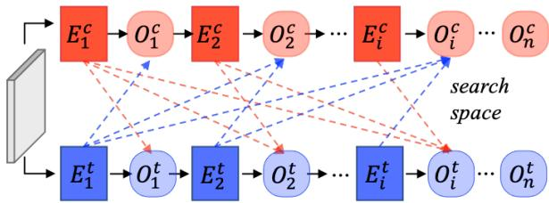  
(a) Search space of DSE

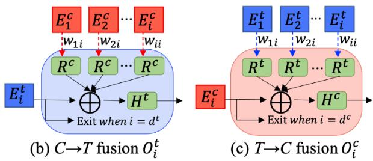  
Figure 3: The formation of Dual-Stream Encoder with bidirectional connections. (b) and (c) provide a zoom-in look of feature fusion node $O ^ { t }$ and $O ^ { c }$ respectively.

Hint3: CNN and Transformer Decoders Working Collaborately. As mentioned above, familiarity and recollection are responsible for fast matching-based recognition and slow retrieval-based recognition [44]. Their collaboration is controlled by PR/EC module [2]. The above process implies that there should be a mechanism that adaptively decides to use either CNN or Transformer decoder when detecting different objects, which is a selective mask in our dynamic dual decoder design.

## 4. Dynamic Dual-Processing Framework

Motivated by the inspirations from Section 3 we propose a general brain-like dynamic dual-processing framework(DDP) by effectively unifying traditional CNN and Transformer based detectors. In accordance with Hint1, the new pipeline is consisted of three components, i.e., shared backbone, dual-stream encoder(DSE) and dynamic dualdecoder(DDD), as shown in Figure 2(d).

## 4.1. Dual-Stream Encoder

As mentioned in Hint2, we first unify the CNN- and Transformer-based encoders in a dual-stream way to simulate the local and global visual processing pathways, as shown in Figure 3(a). $E _ { 1 } ^ { c } \sim E _ { n } ^ { c }$ and $E _ { 1 } ^ { t } \sim E _ { n } ^ { t }$ are annotations from [38] and [3], representing a series of repeated blocks for CNN- and Transformer-encoder. For simplicity, we denote n is the maximum number of blocks for both CNN- and Transformer-based encoders in DSE, but in practice, the maximum length of CNN- and Transformer-based encoder blocks can be different. It should be noticed that $E ^ { c }$ and $E ^ { t }$ account for general CNN- and Transformer-based encoding blocks, which can represent the common operations such as bottom-up [21] and top-down [25] for CNNencoder or self-attention [3], deformable self-attention [46] for Transformer-encoder, etc. In addition, along each individual pathway, we set up a chain of intermediate nodes $O _ { 1 } ^ { c } \sim O _ { n } ^ { c }$ and $O _ { 1 } ^ { t } \sim O _ { n } ^ { t }$ , where the local features from CNN-encoder and the global self-attention features from Transformer-encoder will be combined and enhanced. Besides, each node should also determine whether to stop the feature encoding process and directly output encoded features to the decoder if they are semantically rich enough.

To find the optimal feature fusion strategy with affordable computation complexity, a neural network search method is applied. Thus, we customized our DSE as a searchable direct-acyclic supernet, which is similar to [10], The search space contains feature flow edges and encoder depth. In specific, as shown in Figure 3(b), the output of i-th node $O _ { i } ^ { t }$ of Transformer-stream can be represented by

$$
O _ { i } ^ { t } = H ^ { t } ( \mathrm { A d d } ( E _ { i } ^ { t } , w _ { 1 i } ^ { c } R ^ { c } ( E _ { 1 } ^ { c } ) , . . . , w _ { i i } ^ { c } R ^ { c } ( E _ { i } ^ { c } ) ) )\tag{1}
$$

where we refer [31] for the overall feature fusion operations. $H ^ { t }$ is the feature fusing transformation for the Transformerbased stream, which is a linear function. $R ^ { c }$ stands for a convolution layer that performs channel projection with a flatten operation, and the edges such as $w _ { i i } ^ { c } \in \{ 0 , 1 \}$ , are architecture parameters of the supernet. And if $w _ { i i } ^ { c } = 1$ feature from j-th block of CNN-based encoder will be selected to fuse with i-th block of transformer-based encoder otherwise not. As for the CNN-based stream, as shown in Figure 3(c), we also have

$$
O _ { i } ^ { c } = H ^ { c } ( \mathrm { A d d } ( E _ { i } ^ { c } , w _ { 1 i } ^ { t } R ^ { t } ( E _ { 1 } ^ { t } ) , . . . , w _ { i i } ^ { t } R ^ { t } ( E _ { i } ^ { t } ) ) )\tag{2}
$$

but with minor difference, where $H ^ { c }$ is a convolution layer and $R ^ { t }$ is composed of a reshape operation and a channel projection matrix to allow element-wise add among features from different sources.

Different from [10], the depth of each stream in DSE is also searchable, where the depth can be a discrete number $d ^ { c }$ or $d ^ { t }$ varied in range $( 1 , n )$ . For instance, once an active encoder depth $d ^ { t }$ for Transformer stream is specified, the output of $E _ { d ^ { t } } ^ { t }$ in the Transformer-steam will be directly output to the decoder, and the remaining encoder blocks and fusing nodes along the path will not be activated, which is the same for the CNN-based stream. Overall, by combining feature fusing nodes and number of encoder blocks, we have the total search space capacity of $O ( n ^ { 2 } 2 ^ { n ^ { 2 } } )$ ).

## 4.2. Dynamic Dual-Decoder

As shown in Figure 2(d), the DDD is composed of CNN- and Transformer-based decoders and a dynamic selective mask, which together simulate the switchable familiarity and recollection modes in visual processing system. The green box(CCS) stands for the Concat-Conv-GumbelSoftmax operation, which is used to generate the mask. As shown in Figure 4, this mask is projected to the coordinate spaces of anchors and queries, and then imposed on them, where 1 activates the anchor in CNN-decoder and 0 activates the query in transformer-decoder at a corresponding position. it is noteworthy that queries in original DETR model do not contain any spatial prior while in later works such as Deformable DETR [46], Anchor DETR [41] and DAB-DETR [24], the queries are given spatial information. Thus, in our statement, we embrace the 4D box-like query in DAB-DETR for Transformer-based decoder.

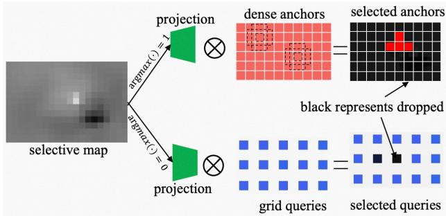  
Figure 4: Working mechanism of the selective mask in Dynamic Dual Decoder. Only part of regions of anchors or queries will be activated complementarily based on the argmax of sampled value from parameterized Gumbelsoftmax distribution.

Based on above description, we define $D ^ { c }$ and $D ^ { t }$ as CNN- and Transformer-decoder correspondingly and set the centers of anchors of the CNN-decoder as A and queries as $Q .$ . We define a binary mask m, therefore, the prediction $r ( y , x )$ produced by our dual-decoder at a position $( y , x )$ on the mask can be expressed as follows:

$$
r ( y , x ) = { \left\{ \begin{array} { l l } { D ^ { c } ( A ( y _ { a } , x _ { a } ) ) { \mathrm { ~ i f ~ } } m ( y , x ) = 1 } \\ { D ^ { t } ( Q ( y _ { q } , x _ { q } ) ) { \mathrm { ~ i f ~ } } m ( y , x ) = 0 } \end{array} \right. }\tag{3}
$$

where $( y _ { a } , x _ { a } )$ and $( y _ { q } , x _ { q } )$ are projected positions of $( y , x )$ for spatial alignment.

However, learning such binary mask in neural network is challenging because of its non-differentiability. To tackle this issue, we refer the Gumbel-softmax reparameterization trick [16], in which they reparameterize a non-differential stochastic node that samples from a categorical distribution by a learned neural networks, acting on random noise from Gumbel base distribution. For more details about Gumbelsoftmax reparameterization trick, please refer [16]. In our case, we take the output of selective mask m to reparameterize the an i.i.d Gumbel Distribution $G _ { i } \sim G u m b e l ( 0 , 1 )$ which results,

$$
\widetilde { m } _ { i } = \frac { \exp ( ( \log { m _ { i } } + G _ { i } ) / \tau ) } { \sum _ { j = 0 } ^ { 1 } \exp ( ( \log { m _ { j } } + G _ { j } ) / \tau ) } , \mathrm { f o r } i = 0 , 1\tag{4}
$$

where, $m _ { 1 } = 1 - m _ { 0 }$ , and $\tau > 0$ is a temperature parameter that determines the sharpness of the softmax. Therefore, we get the approximation of selective mask $\widetilde { m }$ . In the forward pass, we use the argmax of me to perform binary selection of anchor or query, and in the backward pass, use the softmax to enable gradient descent based training. The details of training procedure will be explained in the next section.

## 5. Muti-stage Learning of DDP

In previous sections, we have demonstrated how the human vision-friendly detector is constructed by following the guidelines of human vision system. However training such a compound system is not straightforward and for this reason a three-step training strategy is proposed.

## 5.1. Stand-alone Pre-training

In our formulation, if we only consider the two independent processing pathways without feature interaction in DSE and the selective mask in DDD, the whole framework is annealed to a structure of two parallel CNN- and Transformer-based detectors with a shared backbone. We define the complete detector as N with parameters $\theta _ { b } , \theta _ { e } , \theta _ { d }$ for backbone, encoder and decoder respectively. Therefore, as a starting point, we first jointly train this naive combination without search space and dynamic selective mask to optimize these parameters until convergence. In this step, both CNN and Transformer detector work separately as individual detectors. For a batch of input images I, the overall training procedure can be represented by

$$
\mathop { m i n } _ { \theta _ { b } , \theta _ { e } , \theta _ { d } } L ( N _ { \theta _ { b } , \theta _ { e } , \theta _ { d } } ( I ) , _ { J } t ( I ) )\tag{5}
$$

where $L$ is the loss function of object detection, and $g t ( I )$ is the ground truth labels of these images.

## 5.2. Searching for the DSE

For the search of fusing strategies and the depth of DSE, we refer [13], utilizing SPOS method to perform the NAS task. In this method, the parameterized supernet is trained and then searched for the optimal subnet. In the training phase, all possible subnets are independently and uniformly sampled from the search space, and the parameters in each sampled subnet are updated during each iteration. In our case, for the each iteration of DSE supernet training, we first get the active encoder depth for CNN- and Transformer-stream $d ^ { c }$ and $d ^ { t }$ , which are randomly chosen from set $D = \{ 1 , 2 , . . . , n \}$ Under the chosen depth, the fusing strategies $w _ { j i } ^ { c }$ for all $i \in ( 1 , d ^ { c } ) , j \le i$ and $\boldsymbol { w } _ { j i } ^ { t }$ for all $i \in ( 1 , d ^ { t } ) , j \leq \dot { \iota } ,$ are i.i.d. drawn from $B e r n ( 0 . 5 )$ . For each concrete $w _ { j i } ^ { c } , w _ { j i } ^ { t } , d ^ { c }$ and $d ^ { t }$ , can get a specific DSE structure. Therefore, for each batch of image I, similar to

Equation 5, the training can be represented by,

$$
\begin{array} { r l } & { d = \{ d ^ { t } , d ^ { c } \} , \mathrm { w h e r e } d ^ { t } , d ^ { c } \sim D } \\ & { w = \{ w _ { j i } ^ { t } , w _ { j i } ^ { c } \} , \mathrm { w h e r e } w _ { j i } ^ { t } , w _ { j i } ^ { c } \sim B e r n ( 0 . 5 ) } \\ & { \quad \quad \quad \quad \quad \quad \quad \quad \quad \quad \quad \quad \quad \quad \quad \quad \quad \quad \quad \quad \quad \quad \quad \quad } \\ & { \theta _ { b } , \theta _ { e | w , d } , \theta _ { d } } \end{array}\tag{6}
$$

where we denote the parameter of DSE given a specific sampled structure as $\theta _ { e | w , d }$ . Besides, before training of the supernet, we will load the pretrained weights from previous step in Section 5.1 After training of the supernet, we can effectively explore the performance of all possible substructures and find the optimal DSE for given complexity constraints by choosing the one with the best performance on validation set, which results,

$$
\begin{array} { r l } & { w ^ { * } , d ^ { * } = \underset { w \sim B e r n ( 0 . 5 ) , d \sim D } { a r g m a x } ~ \mathrm { m A P } _ { \mathrm { v a l } } ( N _ { \theta _ { e } | w , d } ( I ) , g t ( I ) ) } \\ & { } \\ & { \mathrm { s . t } c o m p l e x ( w ^ { * } , d ^ { * } ) < = C _ { m a x } } \end{array}\tag{7}
$$

where we simplify the notation of w and d in this equation and the $w ^ { * }$ and $d ^ { * }$ represent the optimal fusing strategy and encoder depth of searched DSE, which also satisfy the complexity constraint $C _ { m a x } .$ . Also referring [13], the evolution search algorithm with FLOPs constraints is also used to find $w ^ { * }$ and $d ^ { * }$

## 5.3. Selective mask Learning and Joint-training

After previous training steps in Section 5.1 and 5.2, we can obtain an acceptable dual-detector system with a searched DSE and a dual-decoder without the dynamic selective mask in DDD. As explained in Section 4.2, the dynamic selective mask do not localize and classify objects in the images, but predict which decoder performs better for a given position in the image. In another words, we can not train this module with the localization loss and object category classification loss in traditional object detection task, but rather incorporate the selective mask into the calculation of the mean-average precision(mAP), and directly maximize mAP.

In more detail, we define the detection result $r ^ { c } ( y _ { a } , x _ { a } )$ given anchor $A ( y _ { a } , x _ { a } )$ for CNN-decoder, $r ^ { t } ( y _ { q } , x _ { q } )$ given $Q ( y _ { q } , x _ { q } )$ for Transformer-decoder and predicted selective mask ${ \widetilde { m } } ( y , x )$ from Gumbel-softmax in Equation 4 at the position $( y , x )$ . Therefore, the result at $( y , x )$ produced by the dynamic dual-decoder is,

$$
r ( y , x ) = r ^ { c } ( y _ { a } , x _ { a } ) * \widetilde { m } ( y , x ) + r ^ { t } ( y _ { q } , x _ { q } ) * ( 1 - \widetilde { m } ( y , x ) )
$$

where this equation is the one-line form of Equation 3.

(8)

The mAP on one image can be expressed with this result and ground truth objects ,

$$
m A P = \sum _ { j = 1 } ^ { N } \sum _ { x , y } { \frac { t p ( g _ { j } , r ( y , x ) ) } { t p ( g _ { j } , r ( y , x ) ) + f p ( g _ { j } , r ( y , x ) ) } }\tag{9}
$$

where N is the number of GT objects in an image, $g _ { j }$ being the j-th GT in the image, and tp, f p represent the rules that determine whether a prediction $r ( y , x )$ is a true positive or false positive sample. Therefore, the loss function for training given a batch of image I can be write as

$$
L _ { \theta _ { m } } = 1 - \sum _ { I } m A P\tag{10}
$$

in which $\theta _ { m }$ is the parameter of the submodule(CCS) to generate the selective mask. In above training procedure, we take the pre-trained weights of the backbone, the searched DSE and DDD from the last step and freeze the parameters of them.

With a learned selective mask, we effectively compensate the weakness of one detector with the strength of the other and we believe that by jointly training the detection task of dual-decoder and selective mask, anchor/query selection mechanism enables CNN and transformed based decoder to concentrate more on their own strength, which results better overall performance. Thus, at last we append a finetuning stage, which jointly trains the whole network with detection and mAP loss.

## 6. Experiments

## 6.1. Dataset and Implementation Details

Dataset. Our experiments are conducted on the MS COCO benchmark [23] that contains COCO train2017 split (∼ 118k images) and evaluated with val2017 (5k images). We adopt the mean-average precision as the metric for evaluating the performance following previous researches.

Implementation Details. In our experiment, we construct two versions of models, denoded as DDP and DDP+. For the first one, we choose the YOLOF and DAB-DETR as the components of DSE and DDD with a shared ResNet-50, and for the second model, we use SparseRCNN and DN-DETR as source models and ResNet-101 as the backbone. We also search for different architectures for DDP and DDP+ under different complexity constraints. For the search of DSE, for DDP, the maximum depth of YOLOF’s Dilated Encoder and DAB-DETR’s encoder are both 6, but for DDP+, since the depth of FPN used in SparseRCNN is fixed as 1, thus, only the depth of DN-DETR’encoder is searchable, which is set as 6. The learning rate in the searching phase is set as $1 / 1 0$ of the original learning rate, and both supernets are trained for 10 epochs. The evolution search algorithm setting is the same as in SPOS [13]. The searched network is further finetuned by 5 epoch with the same learning rate as searching. We train the CCS module for 10 epochs with $1 / 1 0$ of the original learning rate. At last, the whole network is jointly trained for 5 epochs with 1/15 of the original learning rate.

<table><tr><td>Model</td><td>Model type</td><td>Backbone</td><td>AP</td><td> $\mathrm { A P } _ { 5 0 }$ </td><td> $\mathsf { A P } _ { 7 5 }$ </td><td> $\mathsf { A P } _ { \mathsf { S } }$ </td><td> $\mathsf { A P _ { M } }$ </td><td> $\mathrm { \mathbf { A P _ { L } } }$ </td><td>FLOPs</td></tr><tr><td>YOLOF* [5]</td><td>C</td><td>ResNet-50</td><td>37.7</td><td>56.9</td><td>40.6</td><td>19.1</td><td>42.5</td><td>53.2</td><td>86G</td></tr><tr><td>FCOS [39]</td><td>C</td><td>ResNet-50</td><td>38.5</td><td>57.7</td><td>41.0</td><td>21.9</td><td>42.8</td><td>48.6</td><td>177G</td></tr><tr><td>Faster RCNN-FPN [33]</td><td>C</td><td>ResNet-50</td><td>40.2</td><td>61.0</td><td>43.8</td><td>24.2</td><td>43.5</td><td>52.0</td><td>180G</td></tr><tr><td>Sparse-RCNN [36]</td><td>C</td><td>ResNet-50</td><td>42.8</td><td>61.2</td><td>45.7</td><td>26.7</td><td>44.6</td><td>57.6</td><td>129G</td></tr><tr><td>DETR [3]</td><td>T</td><td>ResNet-50</td><td>42.0</td><td>62.4</td><td>44.2</td><td>20.5</td><td>45.8</td><td>61.1</td><td>86G</td></tr><tr><td>Conditional DETR [28]</td><td>T</td><td>ResNet-50</td><td>40.9</td><td>61.8</td><td>43.3</td><td>20.8</td><td>44.6</td><td>59.2</td><td>90G</td></tr><tr><td>Anchor DETR [41]</td><td>T</td><td>ResNet-50</td><td>42.1</td><td>62.4</td><td>45.0</td><td>21.9</td><td>46.2</td><td>60.3</td><td></td></tr><tr><td>DAB-DETR* [24]</td><td>T</td><td>ResNet-50</td><td>42.2</td><td>63.1</td><td>44.7</td><td>21.5</td><td>45.7</td><td>60.3</td><td>94G</td></tr><tr><td>DN-DETR [19]</td><td>T</td><td>ResNet-50</td><td>44.1</td><td>64.4</td><td>46.7</td><td>22.9</td><td>48.0</td><td>63.4</td><td>94G</td></tr><tr><td>ATSS-Dyhead [7]</td><td>C+T</td><td>ResNet-50</td><td>42.6</td><td>60.1</td><td>46.4</td><td></td><td>-</td><td></td><td></td></tr><tr><td>RetinaNet-BVR [6]</td><td>C+T</td><td>ResNet-50</td><td>38.5</td><td>59.1</td><td>40.9</td><td></td><td></td><td></td><td></td></tr><tr><td>TSP-FCOS [37]</td><td>C+T</td><td>ResNet-50</td><td>43.1</td><td>62.3</td><td>47.0</td><td>26.6</td><td>46.8</td><td>55.9</td><td>189G</td></tr><tr><td>TSP-RCNN [37]</td><td>C+T</td><td>ResNet-50</td><td>43.8</td><td>63.3</td><td>48.3</td><td>28.6</td><td>46.9</td><td>55.7</td><td>188G</td></tr><tr><td>Efficient DETR [38]</td><td>C+T</td><td>ResNet-50</td><td>44.2</td><td>62.2</td><td>48.0</td><td>28.4</td><td>47.5</td><td>56.6</td><td>159G</td></tr><tr><td>DDP(94G)</td><td>C+T</td><td>ResNet-50</td><td>45.2</td><td>66.3</td><td>48.5</td><td>25.9</td><td>48.6</td><td>64.1</td><td>94G</td></tr><tr><td>DDP(120G)</td><td>C+T</td><td>ResNet-50</td><td>46.8</td><td>67.5</td><td>50.3</td><td>28.9</td><td>50.2</td><td>64.9</td><td>120G</td></tr><tr><td>YOLOF [5]</td><td>C</td><td>ResNet-101</td><td>39.8</td><td>59.4</td><td>42.9</td><td>20.5</td><td>44.5</td><td>54.9</td><td>151G</td></tr><tr><td>FCOS [39]</td><td>C</td><td>ResNet-101</td><td>40.8</td><td>60.0</td><td>44.0</td><td>24.2</td><td>44.3</td><td>52.4</td><td>243G</td></tr><tr><td>Faster RCNN-FPN [33]</td><td>C</td><td>ResNet-101</td><td>42.0</td><td>62.5</td><td>45.9</td><td>25.2</td><td>45.6</td><td>54.6</td><td>246G</td></tr><tr><td>Sparse R-CNN* [36]</td><td>C</td><td>ResNet-101</td><td>44.1</td><td>62.1</td><td>47.2</td><td>26.1</td><td>46.3</td><td>59.7</td><td>206G</td></tr><tr><td>Deformable DETR [46]</td><td>T</td><td>ResNet-50</td><td>43.8</td><td>62.6</td><td>47.7</td><td>26.4</td><td>47.1</td><td>58.0</td><td>173G</td></tr><tr><td>DETR [3]</td><td>T</td><td>ResNet-101</td><td>43.5</td><td>63.8</td><td>46.4</td><td>21.9</td><td>48.0</td><td>61.8</td><td>152G</td></tr><tr><td>Conditional DETR [28]</td><td>T</td><td>ResNet-101</td><td>42.8</td><td>63.7</td><td>46.0</td><td>21.7</td><td>46.6</td><td>60.9</td><td>156G</td></tr><tr><td>Anchor DETR [41]</td><td>T</td><td>ResNet-101</td><td>43.5</td><td>64.3</td><td>46.6</td><td>23.2</td><td>47.7</td><td>61.4</td><td></td></tr><tr><td>DAB-DETR [24]</td><td>T</td><td>ResNet-101</td><td>43.5</td><td>63.9</td><td>46.6</td><td>23.6</td><td>47.3</td><td>61.5</td><td>174G</td></tr><tr><td>DN-DETR* [19]</td><td>T</td><td>ResNet-101</td><td>45.2</td><td>65.5</td><td>48.3</td><td>24.1</td><td>49.1</td><td>65.1</td><td>174G</td></tr><tr><td>RetinaNet-BVR [6]</td><td>C+T</td><td>ResNeXt-101</td><td>46.5</td><td>66.3</td><td>50.6</td><td></td><td></td><td></td><td></td></tr><tr><td>TSP-FCOS [37]</td><td>C+T</td><td>ResNet-101</td><td>44.4</td><td>63.8</td><td>48.2</td><td>27.7</td><td>48.6</td><td>57.3</td><td>255G</td></tr><tr><td>TSP-RCNN [37]</td><td>C+T</td><td>ResNet-101</td><td>44.8</td><td>63.8</td><td>49.2</td><td>29.0</td><td>47.9</td><td>57.1</td><td>254G</td></tr><tr><td>Efficient DETR [38]</td><td>C+T</td><td>ResNet-101</td><td>45.2</td><td>63.7</td><td>48.8</td><td>28.8</td><td>49.1</td><td>59.0</td><td>239G</td></tr><tr><td>Dynamic DETR [8]</td><td>C+T</td><td>ResNeXt-101-DCN</td><td>49.3</td><td>68.4</td><td>53.6</td><td>30.3</td><td>51.6</td><td>62.5</td><td></td></tr><tr><td>DDP+(173G)</td><td>C+T</td><td>ResNet-101</td><td>48.9</td><td>68.0</td><td>53.1</td><td>31.4</td><td>51.5</td><td>66.8</td><td>173G</td></tr><tr><td>DDP+(221G)</td><td>C+T</td><td>ResNet-101</td><td>51.3</td><td>69.5</td><td>55.4</td><td>34.4</td><td>55.1</td><td>68.8</td><td>221G</td></tr></table>

Table 1: Evaluation results on COCO 2017 validation set. \* represents the source CNN- and Transformer-based detectors on which we build our dual-stream encoder and dyanmic dual-decoder. C, T and C+T in model type column mean CNN- and Transformer-based detectors and combined detectors respectively.

<table><tr><td>Model</td><td>FLOPs</td><td>Params</td><td>FPS</td><td>mAP</td></tr><tr><td>DAB-DETR-R50</td><td>94G</td><td>44M</td><td>21</td><td>42.2</td></tr><tr><td>YOLOF-R50</td><td>86G</td><td>44M</td><td>39</td><td>37.7</td></tr><tr><td>DN-DETR-R101</td><td>174G</td><td>63M</td><td>17</td><td>45.2</td></tr><tr><td>SparseRCNN-R101</td><td>206G</td><td>125M</td><td>19</td><td>44.1</td></tr><tr><td>DDP(94G)</td><td>94G</td><td>51M</td><td>27</td><td>45.2</td></tr><tr><td>DDP(80G)</td><td>80G</td><td>42M</td><td>41</td><td>43.4</td></tr></table>

Table 2: Model complexity, FPS and mAP comparison. The mAP and FPS are measured on COCO val2017 with batch size 1 on V100 GPU.

## 6.2. Main Results

Comparison with Source Models. Table 1 shows our main results on COCO 2017 validation set compared with other methods. In the table, with a ResNet-50 as the backbone, our DDP(94G) and DDP(120G) achieve mAP of 45.2 and 46.8, outperforming their source models, i.e., YOLOF and DAB-DETR by a large margin. This is also valid for DDP+ with higher complexity, which is based on SparseR-CNN and DN-DETR. It is noteworthy that DDP(94G) and DDP(173G) improve the mAP of +3 and +3.7 compared with the DAB-DETR-R50 and DN-DETR-R101 without increasing the model complexity. In addition, we investigate the model complexity and latency compared with source models in Table 2. In specific, DDP(80G) is a searched lightweight model obtaining 43.4 mAP with 41 FPS on

<table><tr><td>Model</td><td>mAP</td><td>Model</td><td>mAP</td></tr><tr><td>DINO-SwinL HTC++-SwinL</td><td>63.2 58.0</td><td>DyHead-SwinL DDP-SwinL(Ours)</td><td>58.4 64.8</td></tr></table>

Table 3: Comparison of SOTA method on COCO val2017.

V100, which is faster and more accurate than YOLOF-R50 and DAB-DETR-R50. Above results show that our method is a general and efficient framework, which can be used to boost the performance of single-mode object detectors without sacrificing model efficiency.

Comparison with Other Methods. From Table 1, we can see that our method achieves better performance than concurrent works that focus on improving detectors by combining CNN and Transformers corresponding to model type C + T in the table. For example, DDP(120G) and DDP+(221G) obtain 2.6 and 6.1 mAP improvement over EfficientDETR-R50 and EfficientDETR-R101 with 39G and 18G fewer FLOPs. It is common believed that as the complexity of a model increases, the performance benefit gradually decreases or even plateaus. For example, DAB-DETR-101 only surpasses DAB-DETR-R50 1.3 with 80G more FLOPs. This may be due to the limitations of a single model architecture. However, an intriguing observation of our method is that from DDP(94G), DDP(120G), DDP(173G) to DDP(221G), our model obtains performance gain of 1.6, 2.1 and 2.4 with increase of 26G, 53G and 48G FLOPs respectively. With our method, even when the computational complexity of the model reaches a certain scale, additional FLOPs can still bring significant performance improvements. Thus, by integrating more advanced detectors (DINO [45] and HTC++ [4]) and using a stronger backbone SwinL, our framework gets mAP of 64.8, achieving promising performance as shown in Table 3.

## 6.3. Ablation Studies

In this section, we analyze the impacts of our proposed Dual-Stream Encoder and Dynamic Dual-Decoder. If not otherwise noted, we use encoders and decoders of YOLOF and DAB-DETR and ResNet-50 as the backbone throughout the analysis.

Analysis of NAS-based DSE Module. To explore the impact of DSE module, we consider a static dual decoder without selective mask and observe the mAP of CNN- and Transformer-based detector separately. As presented in Table 4, the accuracy of DSE-w/o fusion represents the precision of the first training stage in Section 5.1. The APCNN and $A P _ { \mathrm { T r a n s } }$ for DSE-w/o fusion are 39.2 and 42.0 show that sharing the same backbone for CNN- and Transformerbased encoder and decoder does not hurt the performance. Especially, the mAP for CNN-stream is even 1.5 higher than the YOLOF reported in Table 1, because we align the training strategy of CNN-branch with the Transformer-branch.

<table><tr><td>Model</td><td>APCNN</td><td> $\mathsf { A P } _ { \mathrm { T r a n s } }$ </td><td>FLOPs</td></tr><tr><td>DSE-w/o fusion</td><td>39.2</td><td>42.0</td><td>106G</td></tr><tr><td>DSE-interleaved</td><td>39.8</td><td>42.5</td><td>115G</td></tr><tr><td>DSE-random1</td><td>37.6</td><td>38.6</td><td>94G</td></tr><tr><td>DSE-random2</td><td>38.7</td><td>39.9</td><td>120G</td></tr><tr><td>DSE-searched1</td><td>41.3</td><td>43.4</td><td>94G</td></tr><tr><td>DSE-searched2</td><td>42.1</td><td>44.0</td><td>120G</td></tr></table>

Table 4: Evaluation results on COCO 2017 validation set for ablation study of NAS-based DSE. DSE-interleaved means fusing features of CNN-stream and Transformerstream interchangeably, and DSE-random presents a random sampled architecture.

<table><tr><td>Model</td><td>AP</td></tr><tr><td>DDD-w/o mask CNN-dec</td><td>41.3</td></tr><tr><td>DDD-w/o mask Trans-dec</td><td>43.4</td></tr><tr><td>DDD-w/o mask merge</td><td>43.8</td></tr><tr><td>DDD-with mask</td><td>44.7</td></tr><tr><td>DDD-with mask + joint-training</td><td>45.2</td></tr></table>

Table 5: Evaluation results on COCO 2017 validation set. DDD-w/o mask merge represents directly merging the results from CNN- and Transformer-decoders and doing NMS.

Compared with DSE-w/o fusion, DSE-search1 achieves +2.1 and +1.4 improvements for CNN- and Transformer streams respectively with 12G FLOPs saving. However, we find that a simple feature interaction mechanism, such as interleaved fusion or a random sampled architecture either brings marginal improvement or even hurts the performance. With our one-shot based search method, we can effortlessly obtain a series of DSEs with different FLOPs. Thus, we can obtain a stronger DSE-search2 under 120G FLOPs with even higher accuracy 42.1 and 44.0.

Analysis of Dynamic Dual-Decoder. We mainly study the impact of selective mask in dynamic Dual-Decoder. The experiment is carried out with previously discussed DSEsearch1 module, obtaining the mAP of 41.3 and 43.4 for single CNN-decoder and Transformer-decoder correspondingly, as shown from the first two rows of Table 5. And there is a successive improvement +1.3 and +1.8 compared with the accuracy from the Transformer-decoder, by adding the selective mask and iterative joint-training approach. Hence, we can conclude that the mask makes the strength of CNN and Transformer decoder complementary, and iterative joint training further pushes CNN and Transformer decoder to concentrate more on their advantages.

Based on above analysis, we visualize the selective mask in Figure 5. These masks show the dynamic inference property of our DDD module. We find that the predicted mask shows an interesting pattern. From this figure, we can see that when recognizing objects with rich texture, obvious color or fixed shapes, the mask tends to choose CNN decoder and when the object is camouflaged or inflated over the entire image, it trusts more on the Transformer decoder. This behavior is surprisingly brain-like and shows a strong evidence for Hint3 as discussed in Section 3.

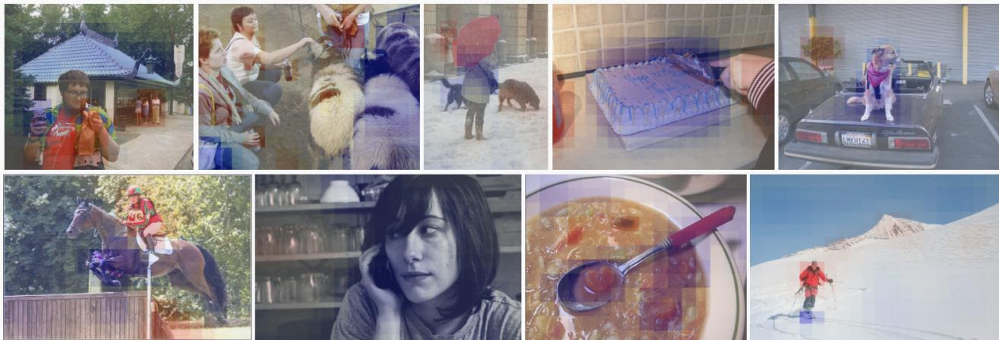  
Figure 5: The visualization of selective masks. The color in blue represents that Transformer-decoder is selected to predict the objects in these regions and anchors of CNN-decoder at these positions are suppressed. And the red means the Transformer decoder is inhibited and the CNN-decoder is used. The lighter blue or red color indicates that CNN- and Transformer-decode achieve comparable performance for those objects, and the selective mask does not show obvious preference in these areas.

## 7. Conclusion

This paper presents a dynamic dual-process object detection framework that combines CNN- and Transformerbased detectors in a cooperative manner, which consists of three parts: a shared backbone, an efficient dual-stream encoder, and a dynamic dual-decoder. Each part of the integration between the two mainstream detectors has been elaborately designed, taking into account both biological plausibility and cost efficiency. Experimental results demonstrate that our method is flexible, effective, and capable of stably improving the accuracy of the source model, breaking through the performance bottleneck of a single-type detector. We hope that our work will inspire further exploration into next-generation object detection frameworks.

## References

[1] Elissa M Aminoff, Kestutis Kveraga, and Moshe Bar. The role of the parahippocampal cortex in cognition. Trends in cognitive sciences, 17(8):379–390, 2013. 2

[2] Malcolm W Brown and John P Aggleton. Recognition memory: what are the roles of the perirhinal cortex and hippocampus? Nature Reviews Neuroscience, 2(1):51–61, 2001. 4

[3] Nicolas Carion, Francisco Massa, Gabriel Synnaeve, Nicolas Usunier, Alexander Kirillov, and Sergey Zagoruyko. End-to-

end object detection with transformers. In Computer Vision– ECCV 2020: 16th European Conference, Glasgow, UK, August 23–28, 2020, Proceedings, Part I 16, pages 213–229. Springer, 2020. 1, 2, 3, 4, 7

[4] Kai Chen, Jiangmiao Pang, Jiaqi Wang, Yu Xiong, Xiaoxiao Li, Shuyang Sun, Wansen Feng, Ziwei Liu, Jianping Shi, Wanli Ouyang, et al. Hybrid task cascade for instance segmentation. In Proceedings of the IEEE/CVF conference on computer vision and pattern recognition, pages 4974–4983, 2019. 8

[5] Qiang Chen, Yingming Wang, Tong Yang, Xiangyu Zhang, Jian Cheng, and Jian Sun. You only look one-level feature. In Proceedings of the IEEE/CVF conference on computer vision and pattern recognition, pages 13039–13048, 2021. 1, 2, 7

[6] Cheng Chi, Fangyun Wei, and Han Hu. Relationnet++: Bridging visual representations for object detection via transformer decoder. Advances in Neural Information Processing Systems, 33:13564–13574, 2020. 1, 3, 7

[7] Xiyang Dai, Yinpeng Chen, Bin Xiao, Dongdong Chen, Mengchen Liu, Lu Yuan, and Lei Zhang. Dynamic head: Unifying object detection heads with attentions. In Proceedings of the IEEE/CVF conference on computer vision and pattern recognition, pages 7373–7382, 2021. 1, 3, 7

[8] Xiyang Dai, Yinpeng Chen, Jianwei Yang, Pengchuan Zhang, Lu Yuan, and Lei Zhang. Dynamic detr: End-toend object detection with dynamic attention. In Proceedings ofthe IEEE/CVF International Conference on Computer Vision, pages 2988–2997, 2021. 1, 3, 7

[9] Kaiwen Duan, Song Bai, Lingxi Xie, Honggang Qi, Qingming Huang, and Qi Tian. Centernet: Keypoint triplets for object detection. In Proceedings of the IEEE/CVF international conference on computer vision, pages 6569–6578, 2019. 1, 2

[10] Yuan Gao, Haoping Bai, Zequn Jie, Jiayi Ma, Kui Jia, and Wei Liu. Mtl-nas: Task-agnostic neural architecture search

towards general-purpose multi-task learning. In Proceedings of the IEEE/CVF Conference on computer vision and pattern recognition, pages 11543–11552, 2020. 4

[11] Ross Girshick. Fast r-cnn. In Proceedings ofthe IEEE international conference on computer vision, pages 1440–1448, 2015. 3

[12] Charles G Gross. How inferior temporal cortex became a visual area. Cerebral cortex, 4(5):455–469, 1994. 2

[13] Zichao Guo, Xiangyu Zhang, Haoyuan Mu, Wen Heng, Zechun Liu, Yichen Wei, and Jian Sun. Single path oneshot neural architecture search with uniform sampling. In Computer Vision–ECCV 2020: 16th European Conference, Glasgow, UK, August 23–28, 2020, Proceedings, Part XVI 16, pages 544–560. Springer, 2020. 5, 6

[14] Miao Hu, Yali Li, Lu Fang, and Shengjin Wang. A2-fpn: Attention aggregation based feature pyramid network for instance segmentation. In Proceedings of the IEEE/CVF conference on computer vision and pattern recognition, pages 15343–15352, 2021. 3

[15] Eiichi Iwai and Mortimer Mishkin. Further evidence on the locus of the visual area in the temporal lobe of the monkey. Experimental neurology, 25(4):585–594, 1969. 2

[16] Eric Jang, Shixiang Gu, and Ben Poole. Categorical reparameterization with gumbel-softmax. arXiv preprint arXiv:1611.01144, 2016. 5

[17] Hei Law and Jia Deng. Cornernet: Detecting objects as paired keypoints. In Proceedings of the European conference on computer vision (ECCV), pages 734–750, 2018. 1, 2

[18] Tai Sing Lee. Computations in the early visual cortex. Journal ofPhysiology-Paris, 97(2-3):121–139, 2003. 2

[19] Feng Li, Hao Zhang, Shilong Liu, Jian Guo, Lionel M Ni, and Lei Zhang. Dn-detr: Accelerate detr training by introducing query denoising. In Proceedings of the IEEE/CVF Conference on Computer Vision and Pattern Recognition, pages 13619–13627, 2022. 1, 7

[20] Yanghao Li, Yuntao Chen, Naiyan Wang, and Zhaoxiang Zhang. Scale-aware trident networks for object detection. In Proceedings of the IEEE/CVF international conference on computer vision, pages 6054–6063, 2019. 2

[21] Tsung-Yi Lin, Piotr Dollar, Ross Girshick, Kaiming He,´ Bharath Hariharan, and Serge Belongie. Feature pyramid networks for object detection. In Proceedings of the IEEE conference on computer vision and pattern recognition, pages 2117–2125, 2017. 2, 4

[22] Tsung-Yi Lin, Priya Goyal, Ross Girshick, Kaiming He, and Piotr Dollar. Focal loss for dense object detection. In´ Proceedings of the IEEE international conference on computer vision, pages 2980–2988, 2017. 1, 2

[23] Tsung-Yi Lin, Michael Maire, Serge Belongie, James Hays, Pietro Perona, Deva Ramanan, Piotr Dollar, and C Lawrence´ Zitnick. Microsoft coco: Common objects in context. In Computer Vision–ECCV 2014: 13th European Conference, Zurich, Switzerland, September 6-12, 2014, Proceedings, Part V 13, pages 740–755. Springer, 2014. 2, 6

[24] Shilong Liu, Feng Li, Hao Zhang, Xiao Yang, Xianbiao Qi, Hang Su, Jun Zhu, and Lei Zhang. Dab-detr: Dynamic

anchor boxes are better queries for detr. arXiv preprint arXiv:2201.12329, 2022. 1, 3, 5, 7

[25] Shu Liu, Lu Qi, Haifang Qin, Jianping Shi, and Jiaya Jia. Path aggregation network for instance segmentation. In Proceedings ofthe IEEE conference on computer vision andpattern recognition, pages 8759–8768, 2018. 2, 4

[26] Wei Liu, Dragomir Anguelov, Dumitru Erhan, Christian Szegedy, Scott Reed, Cheng-Yang Fu, and Alexander C Berg. Ssd: Single shot multibox detector. In Computer Vision–ECCV 2016: 14th European Conference, Amsterdam, The Netherlands, October 11–14, 2016, Proceedings, Part I 14, pages 21–37. Springer, 2016. 2

[27] Mingyuan Mao, Renrui Zhang, Honghui Zheng, Teli Ma, Yan Peng, Errui Ding, Baochang Zhang, Shumin Han, et al. Dual-stream network for visual recognition. Advances in Neural Information Processing Systems, 34:25346–25358, 2021. 3

[28] Depu Meng, Xiaokang Chen, Zejia Fan, Gang Zeng, Houqiang Li, Yuhui Yuan, Lei Sun, and Jingdong Wang. Conditional detr for fast training convergence. In Proceedings of the IEEE/CVF International Conference on Computer Vision, pages 3651–3660, 2021. 1, 2, 3, 7

[29] May-Britt Moser and Edvard I Moser. Functional differentiation in the hippocampus. Hippocampus, 8(6):608–619, 1998. 2

[30] Lourenc¸o V Pato, Renato Negrinho, and Pedro MQ Aguiar. Seeing without looking: Contextual rescoring of object detections for ap maximization. In Proceedings of the IEEE/CVF Conference on Computer Vision and Pattern Recognition, pages 14610–14618, 2020. 3

[31] Zhiliang Peng, Wei Huang, Shanzhi Gu, Lingxi Xie, Yaowei Wang, Jianbin Jiao, and Qixiang Ye. Conformer: Local features coupling global representations for visual recognition. In Proceedings ofthe IEEE/CVF international conference on computer vision, pages 367–376, 2021. 4

[32] Joseph Redmon, Santosh Divvala, Ross Girshick, and Ali Farhadi. You only look once: Unified, real-time object detection. In Proceedings of the IEEE conference on computer vision and pattern recognition, pages 779–788, 2016. 2

[33] Shaoqing Ren, Kaiming He, Ross Girshick, and Jian Sun. Faster r-cnn: Towards real-time object detection with region proposal networks. Advances in neural information processing systems, 28, 2015. 1, 3, 7

[34] Katja Seeliger, Matthias Fritsche, Umut Guc¸l¨ u, Sanne¨ Schoenmakers, J-M Schoffelen, Sander E Bosch, and MAJ Van Gerven. Convolutional neural network-based encoding and decoding of visual object recognition in space and time. NeuroImage, 180:253–266, 2018. 1

[35] Siamak K Sorooshyari, Huanjie Sheng, and H Vincent Poor. Object recognition at higher regions of the ventral visual stream via dynamic inference. Frontiers in Computational Neuroscience, 14:46, 2020. 1, 2

[36] Peize Sun, Rufeng Zhang, Yi Jiang, Tao Kong, Chenfeng Xu, Wei Zhan, Masayoshi Tomizuka, Lei Li, Zehuan Yuan, Changhu Wang, et al. Sparse r-cnn: End-to-end object detection with learnable proposals. In Proceedings of the IEEE/CVF conference on computer vision and pattern recognition, pages 14454–14463, 2021. 3, 7

[37] Zhiqing Sun, Shengcao Cao, Yiming Yang, and Kris M Kitani. Rethinking transformer-based set prediction for object detection. In Proceedings of the IEEE/CVF international conference on computer vision, pages 3611–3620, 2021. 1, 3, 7

[38] Mingxing Tan, Ruoming Pang, and Quoc V Le. Efficientdet: Scalable and efficient object detection. In Proceedings of the IEEE/CVF conference on computer vision and pattern recognition, pages 10781–10790, 2020. 2, 4, 7

[39] Zhi Tian, Chunhua Shen, Hao Chen, and Tong He. Fcos: A simple and strong anchor-free object detector. IEEE Transactions on Pattern Analysis and Machine Intelligence, 44(4):1922–1933, 2020. 1, 2, 7

[40] David C Van Essen and Jack L Gallant. Neural mechanisms of form and motion processing in the primate visual system. Neuron, 13(1):1–10, 1994. 3

[41] Yingming Wang, Xiangyu Zhang, Tong Yang, and Jian Sun. Anchor detr: Query design for transformer-based detector. In Proceedings of the AAAI conference on artificial intelligence, volume 36, pages 2567–2575, 2022. 1, 3, 5, 7

[42] James CR Whittington, Joseph Warren, and Timothy EJ Behrens. Relating transformers to models and neural representations of the hippocampal formation. arXiv preprint arXiv:2112.04035, 2021. 1

[43] Zhuyu Yao, Jiangbo Ai, Boxun Li, and Chi Zhang. Efficient detr: improving end-to-end object detector with dense prior. arXiv preprint arXiv:2104.01318, 2021. 1, 3

[44] Andrew P Yonelinas, Mariam Aly, Wei-Chun Wang, and Joshua D Koen. Recollection and familiarity: examining controversial assumptions and new directions. Hippocampus, 20(11):1178–1194, Nov. 2010. 1, 2, 3, 4

[45] Hao Zhang, Feng Li, Shilong Liu, Lei Zhang, Hang Su, Jun Zhu, Lionel M. Ni, and Heung-Yeung Shum. Dino: Detr with improved denoising anchor boxes for end-to-end object detection, 2022. 1, 8

[46] Xizhou Zhu, Weijie Su, Lewei Lu, Bin Li, Xiaogang Wang, and Jifeng Dai. Deformable detr: Deformable transformers for end-to-end object detection. arXiv preprint arXiv:2010.04159, 2020. 1, 2, 3, 4, 5, 7