# A-STAR: Test-time Attention Segregation and Retention for Text-to-image Synthesis

Aishwarya Agarwal, Srikrishna Karanam, K J Joseph, Apoorv Saxena, Koustava Goswami and Balaji Vasan Srinivasan Adobe Research, Bengaluru India

{aishagar,skaranam,josephkj,apoorvs,koustavag,balsrini}@adobe.com

Prompt: A frog and a crown

Prompt: A pod of dolphins leaping ou of the water in an ocean with a ship on the background  
Prompt: A grizzly bear catching a salmon in a crystal clear river surrounded by a forest  
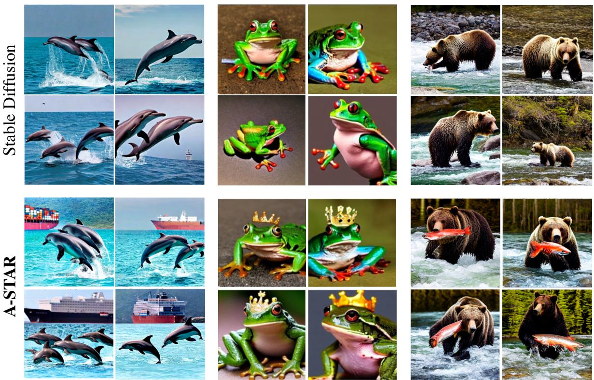  
Figure 1: Despite their remarkable ability to generate plausible images from text descriptions, diffusion models fail to be faithful to multiple concepts in the input text. We identify the issues causing this pitfall, and propose a training-free method to fix them. We propose two new loss functions, attention segregation loss and attention retention loss, that only require test time optimization to drive the diffusion process and produce substantially improved generation results. We can note from these results that our method captures all key concepts in the input prompt as opposed to baseline Stable Diffusion [21].

## Abstract

While recent developments in text-to-image generative models have led to a suite of high-performing methods capable of producing creative imagery from free-form text, there are several limitations. By analyzing the crossattention representations of these models, we notice two key issues. First, for text prompts that contain multiple concepts, there is a significant amount of pixel-space overlap (i.e., same spatial regions) among pairs of different con-

Prompt: a bear and a turtle

cepts. This eventually leads to the model being unable to distinguish between the two concepts and one ofthem being ignored in the final generation. Next, while these models attempt to capture all such concepts during the beginning of denoising (e.g., first few steps) as evidenced by crossattention maps, this knowledge is not retained by the end of denoising (e.g., last few steps). Such loss of knowledge eventually leads to inaccurate generation outputs.

To address these issues, our key innovations include two test-time attention-based loss functions that substantially improve the performance ofpretrained baseline textto-image diffusion models. First, our attention segregation loss reduces the cross-attention overlap between attention maps of different concepts in the text prompt, thereby reducing the confusion/conflict among various concepts and the eventual capture ofall concepts in the generated output. Next, our attention retention loss explicitly forces text-toimage diffusion models to retain cross-attention information for all concepts across all denoising time steps, thereby leading to reduced information loss and the preservation of all concepts in the generated output. We conduct extensive experiments with the proposed lossfunctions on a variety of text prompts and demonstrate they lead to generated images that are significantly semantically closer to the input text when compared to baseline text-to-image diffusion models.

## 1. Introduction

The last few years has seen a dramatic rise in the capabilities of text-to-image generative models to produce creative image outputs conditioned on free-form text inputs. While the recent class of pixel [20, 23] and latent [21] diffusion models have shown unprecedented image generation results, they have some key limitations. First, as noted in prior work [3, 27, 2], these models do not always produce a semantically accurate image output, consistent with the text prompt. As a consequence, there are numerous cases where not all subjects of the input text prompt are reflected in the model’s generated output. For instance, see Figure 1 where Stable Diffusion [21] omits ship in the first column, crown in the second column, and salmon in the third column.

To understand the reasons for these issues, we compute and analyze the cross-attention maps produced by these models during each denoising time step. Specifically, as noted in prior work [5], the interaction between the input text and the generated pixels can be captured in attention maps that explicitly use both text features and the spatial image features at the current time step. For instance, see Figure 2 that shows per-subject-token cross-attention maps, where one can note high activations eventually lead to expected outputs. By analyzing these maps, we posit we can both understand why models such as Stable Diffusion fail (as in Figure 1) as well as propose ways to address the is-

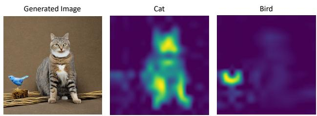  
Prompt: cat and bird  
Average attention maps across all timestamps

Figure 2: Cross-attention maps for cat and bird.  
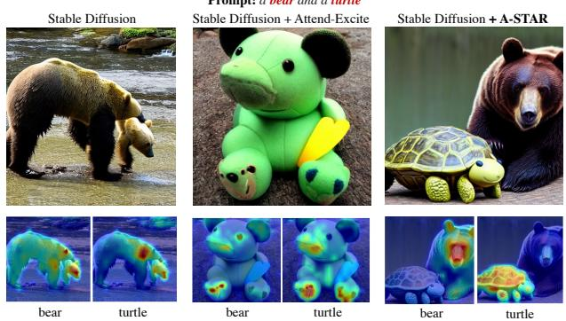  
Figure 3: Our proposed method reduces the overlap between various concepts’ attention maps, leading to reduced confusion/conflicts and improved generation results when compared to baseline models. In this example, one can note much less overlap in the high-response regions for bear and turtle with our method when compared to baselines.

sues.

Based on our observations of these cross-attention maps, we notice two key issues with existing models such as Stable Diffusion [21] that lead to incorrect generation outputs. First, in cases that involve multiple subjects in the text prompt, we notice the presence of a significant amount of overlap between each subject’s cross-attention map. Let us consider the example in Figure 3. We compute the average (across all denoising steps) cross-attention maps for bear and turtle and notice there is significant overlap in the regions that correspond to high activations. We conjecture that because both bear and turtle are highly activated in the same pixel regions, the final generated image is unable to distinguish between the two subjects and is able to pick only one of the two. Note that even exciting the regions as done in Attend-Excite [2] does not help to alleviate this issue. We call this issue with existing models as attention overlap.

Our next observation is related to an issue we call attention decay of text-to-image diffusion models. Let us consider the result in Figure 4 where we show the crossattention maps for dog, beach, and umbrella across multiple denoising time steps for the Stable Diffusion model [21]. One can note that in the beginning of the diffusion

Prompt: a dog is on the beach with an umbrella

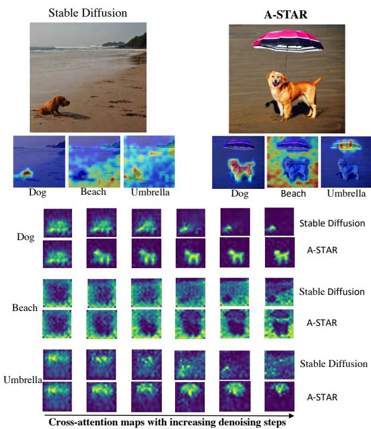  
Figure 4: Our proposed method ensures information retention for all concepts across all denoising steps, leading to improved generation. In this example, one can note pixel activations for dog, beach, and umbrella are retained across all steps with our method when compared to the baseline.

process (e.g., steps 1-3), cross-attention maps for all three concepts were highly activated but this was not retained by the time we reach the end of all the diffusion steps. In the end (see last column in the figure), one can note the pixel regions that were initially highly activated for these concepts are now either very sparsely activated or not activated at all. This suggests while the Stable Diffusion model is trying to capture all concepts in the input prompt during the early stages of diffusion, it is not able to retain this knowledge. This non-retention of information by the end of the diffusion process leads to the model missing out various parts of the text input in the generated output. For instance, in Figure 4, one can note umbrella is very sparsely activated at the end (even though this was not the case in step 1), leading the Stable Diffusion’s [21] generated output missing it. Please note that both these issues of attention overlap and decay are prevalent in many cases and we illustrate the same in supplementary material due to space constraints.

To address the aforementioned issues, we propose two new loss functions that only require inference-time optimization and no retraining of the base text-to-image diffusion models. First, our attention segregation loss tackles the attention overlap issue noted above by explicitly minimizing the overlap of high-response regions in the crossattention maps of all concept pairs. Our key insight here is by explicitly segregating the pixel regions that are highly activated for a pair of concepts, we ensure the model captures knowledge about both concepts, thereby generating both in the final output at the end of the denoising process. Next, our attention retention loss tackles the attention decay issue above by explicitly ensuring information retention across denoising time steps. We realize this by computing a mask for each concept’s cross-attention map from the previous time step and ensuring the highly activated regions in the current time step’s attention map is consistent with this mask. Our key insight here is by retaining highly-activated pixel regions for each subject across the entire denoising process, we explicitly equip the text-to-image model with the ability to retain all relevant knowledge by the end of denoising, thereby leading to improved generations. We show some results with our proposed losses in Figures 3 and 4. In Figure 3, our method reduces the overlap between the bear and turtle attention maps, leading to improved generation when compared to baseline Stable Diffusion. Note that our method gives better results when compared to Attend-Excite [2] since this technique only ensures all attention maps are activated but does not explicitly account for any overlap issues that we have identified. Next, in Figure 4, as can be seen from the progression of the attention maps, our method is able to retain high-response regions across the denoising steps, resulting in the final generation capturing all three concepts as opposed to baseline Stable Diffusion.

To summarize, our key contributions are below:

• We identify two key issues with existing text-to-image diffusion models, attention overlap and attention decay, that lead to semantically inaccurate generations like in Figure 1.

• We propose two new loss functions called attention segregation loss and attention retention loss to explicitly address the above issues. These losses can be directly used during the test-time denoising process without requiring any model retraining.

• The attention segregation loss minimizes the overlap between every concept pair’s cross-attention maps whereas the attention retention loss ensures information for each concept is retained across all the denoising steps, leading to substantially improved generations when compared to baseline diffusion models without these losses. We conduct extensive qualitative and quantitative evaluations to establish our method’s impact when compared to several baseline models.

## 2. Related Work

Before the emergence of large-scale diffusion models for conditional image synthesis, much effort was expended in using generative adversarial networks [8, 34, 35, 17, 9] and variational autoencoders [7] for either conditional or unconditional image synthesis. With text-conditioned image synthesis having many practical applications, there was also much recent work in adapting generative adversarial networks for this task [24, 29, 31, 33, 36]. However, with the dramatic recent success of diffusion models [16, 21, 23, 20], there have been a large number of efforts in very quick time to improve them. In addition to methods such as classifierfree guidance [6], there were also numerous efforts in the broad area of prompt engineering [14, 27, 28, 4] to adapt prompts so that the generated image satisfied certain desired properties. Other recent efforts also seek to customize these diffusion models [30, 12, 32, 1, 15] to user inputs.

However, as discussed in Section 1, existing text-toimage diffusion models are not able to capture all concepts in the input prompt, leading to semantically undesirable outputs. There have been some recent efforts to address this issue. In Liu et al. [13], the authors proposed a composition of diffusion models to generate the final output. However, this method often fails to generate realistic compositions and is limited to specific object properties. In Chefer et al. [2], the authors proposed to manipulate cross-attention maps by maximizing the activations of the most neglected concepts in the generated outputs. While this does take a step towards addressing the issue above, it fails in several cases (see Figure 3 and 7) because attention maximization does not necessarily ensure all concepts are captured. As we discussed in Section 1, overlap between two concepts’ cross-attention maps and the non-retention of high activations over time are two critical issues that impact the final generations. We address these issues with new test-time loss functions that explicitly reduce attention overlap and ensure high-activation knowledge retention across denoising steps, leading to improvements over not only base models like Stable Diffusion [21] but also add-ons like Chefer et al. [2].

## 3. Approach

## 3.1. Latent Diffusion Models and Cross Attention

We start with a brief review of latent diffusion models (LDMs) and the associated cross-attention computation mechanism. LDMs comprise an encoder-decoder pair and a separately trained denoising diffusion probabilistic model (DDPM). In Rombach et al. [21], the encoder-decoder pair is a standard variational autoencoder where an image ${ \textbf { I } } \in$ $\mathcal { R } ^ { W \times H \times 3 }$ is encoded to a latent code $\mathbf { z } = \mathbf { E } ( \mathbf { I } ) \in \mathcal { R } ^ { I }$ h×w×c of much smaller spatial resolution (when compared to I) using the encoder E. A decoder D is trained to reconstruct the image $I \approx \mathbf { D } ( \mathbf { z } )$ . The DDPM operates on the learned latent representations of the autoencoder (regularized using standard KL-type losses [10, 25]) in a series of denoising steps. In each step t, given the current latent code $\mathbf { z } _ { t } ,$ the DDPM is trained to produce a denoised verison $\mathbf { z } _ { t - 1 }$ . This process can be conditioned using external conditioning factors, and this typically is the output of a text encoder L (e.g., CLIP [18], T5 [19]). Given the input text prompt $p \mathrm { ^ { \circ } s }$ encoding $\mathbf { L } ( \boldsymbol { p } )$ using the text encoder $\mathbf { L } ,$ the DDPM $\epsilon _ { \Theta } ,$ parametrized by Θ, is trained to optimize the following loss:

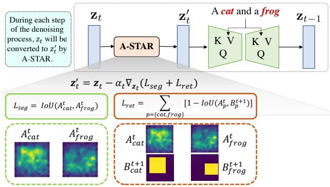  
Figure 5: A visual illustration of the proposed A-STAR algorithm. See Eq. 2 for $L _ { \mathrm { s e g } }$ and Eq. 3 for $L _ { \mathrm { r e t } }$

$$
\mathbb { E } _ { \mathbf { z } \sim \mathbf { E } ( \mathbf { I } ) , p , \epsilon \sim \mathcal { N } ( 0 , 1 ) , t } [ \| \epsilon - \epsilon _ { \Theta } ( \mathbf { z } _ { t } , \mathbf { L } ( p ) , t ) \| ]\tag{1}
$$

Once the models (both autoencoder and DDPM) are trained, generating an image involves getting the text encoding of the input prompt $\mathbf { L } ( \boldsymbol { p } )$ , sampling a latent code $\mathbf { z } _ { T } \sim$ $\mathcal { N } ( 0 , 1 )$ , running $T$ denoising steps using $\epsilon _ { \Theta }$ to obtain $\mathbf { z } _ { 0 }$ and finally decoding using D to get $\mathbf { I } ^ { ' } = \mathbf { D } ( \mathbf { z } _ { 0 } )$

In practice [21], the $\epsilon _ { \Theta }$ model is implemented using the UNet architecture [22] with both self- and cross-attention layers. The cross-attention layers is where explicit text infusion happens using cross-attention [26] between projections of both $\mathbf { L } ( p )$ and $\mathbf { z } _ { t } .$ As shown in prior work [2, 5], this results in a set of cross-attention maps $\mathbf { A } _ { t } \in \mathbb { R } ^ { r \times r \times N } \left( r = 1 6 \right.$ from Hertz et al. [5]) at each denoising step t for each of N tokens (tokenized using L’s tokenizer) in the input prompt $p .$ From Figure 2, the cross attention map of cat and bird is indeed attending to the corresponding spatial location.

## 3.2. A-STAR: Attention Segregation and Retention

As noted in Section 1, we identify two key issues, attention overlap and attention decay, with existing models that result in semantically incorrect generations. Here, we first discuss our intuition that leads to these issues and then describe our proposed solutions to alleviate them. Let us consider the prompt a cat and a dog. Using this

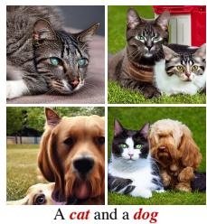  
Figure 6: Stable Diffusion results with varying seeds.

input, we generate images using base Stable Diffusion [21] with varying seeds. In more than 80% of the seeds, we notice either cat or dog were missing (see Fig 6).

For a very small number of seeds, we notice both cat and dog showing up in the final result (see bottom-right in $\mathrm { F i g } 6 )$ . This suggests that while the DDPM model has all the semantic information it needs, the path it takes to the final denoising result affects the generated image (and based on this analysis and results in Figure 1, in most cases it ends up taking an undesirable path). To understand why, we look at the cross-attention maps that led to results in Figures 3 and 4.

In Figure 3, we notice at a particular step in the denoising process, there is significant overlap in the highly-activated pixel regions for both bear and turtle (i.e., high activations in same local image regions). Put another way, this is like saying the DDPM is considering putting both bear and turtle in the same local regions in the final generated image, leading to a clear case of confusion. As can be seen from the result (column 1), this is indeed the case, with only bear (no turtle) in the final generation. We call this issue attention overlap. In Figure 4, we notice that the DDPM has information on all concepts during the beginning of the denoising process, it is unable to retain this knowledge as denoising proceeds. See the cross-attention maps from Stable Diffusion in column 1, where one can note dog, beach, and umbrella all have high activations at step T but this is lost by the time DDPM reaches $t = 0$ (only dog and beach have high activations whereas umbrella is lost). Consequently, the image decoded with $\mathbf { z } _ { 0 }$ does not have all the concepts (see base Stable Diffusion result where only dog and beach show up). We call this issue attention decay. Our intuition and the results in Figures 3 and 4 suggests if we are able to correct the issues above with these intermediate representations, we will be able to guide the DDPM denoising process in the right direction that eventually gives a $\mathbf { z } _ { 0 }$ that can be decoded into a semantically-expected generation. This is where our contributions lie with two new test-time (no model retraining) loss functions we discuss next. We visually summarize our proposed method in Figure 5.

## 3.3. Attention Segregation Loss

As discussed above, one key issue with existing work [21] is the overlap (in highly activated regions) between cross-attention maps of various concepts, resulting in confusion that leads to the model to skip several of them in the final generation. Recall the results in Figure 1 where baseline Stable Diffusion [21] misses out the ship in the first example, the crown in the second example, and the salmon in the third example. Our key insight to address this issue is simple: eliminate this source of model confusion by reducing this attention overlap as much as possible. By doing so, we explicitly force the DDPM denoising process to have separate, highly activated regions for each concept. This eventually leads to a $\mathbf { z } _ { 0 }$ that is representative of all concepts that can be decoded to the desirable image. We realize this idea with our attention segregation loss. This loss operates on a pair of cross-attention maps, one for each concept, at each time step t. In cases where there are more than two concepts, we aggregate this loss over all possible pairs from the set of concepts C. For instance, in the second example of Figure 1, we consider the frog-crown pair for this purpose. Given ${ \bf A } _ { t } ^ { m }$ and $\mathbf { A } _ { t } ^ { n }$ to be a pair of cross-attention maps for concepts m, $n \in { \mathcal { C } }$ at the time step t, our proposed attention segregation loss is defined as:

$$
\mathcal { L } _ { \mathrm { s e g } } = \sum _ { { m , n \in \mathcal { C } } \atop \forall m > n } \left[ \frac { \sum _ { i j } \operatorname* { m i n } ( [ \mathbf { A } _ { t } ^ { m } ] _ { i j } , [ \mathbf { A } _ { t } ^ { n } ] _ { i j } ) } { \sum _ { i j } ( [ \mathbf { A } _ { t } ^ { m } ] _ { i j } + [ \mathbf { A } _ { t } ^ { n } ] _ { i j } ) } \right]\tag{2}
$$

where $[ \mathbf { A } _ { t } ^ { m } ] _ { i j }$ is the pixel value at the $( i , j )$ location. At its core, the attention segregation loss seeks to segregate/separate the high-response regions for ${ \bf A } _ { t } ^ { m }$ and $\mathbf { A } _ { t } ^ { n }$ by calculating and reducing their intersection-over-union (IoU) value. By aggregating over all pairs, this ensures all concepts have such separated regions. Some results with and without this loss are in Figure 2, where one can note improved separation between the bear and turtle attention maps which then leads to a more desirable output image.

## 3.4. Attention Retention Loss

The next contribution of our paper addresses the issue of attention decay discussed in Sections 1 and 3.2. As discussed previously in Figure 4, the base Stable Diffusion model has information about all key concepts in the beginning of the denoising process but is not able to retain it by the time we reach $t = 0$ . Our key insight to address this issue is to explicitly force the model to retain the information throughout the denoising process by means of consistency constraints. By doing so, we explicitly ensure the DDPM denoising process will produce a $\mathbf { z } _ { 0 }$ that has information about all concepts and can be decoded to the desired image.

We realize the idea above with our proposed attention retention loss. Given the attention map ${ \bf A } _ { t } ^ { m }$ of concept m $\in { \mathcal { C } }$ at timestep t, we determine the pixel regions with high activations and binarize the result to obtain its binary mask $\mathbf { B } _ { t } ^ { m }$ Given we seek the retention of information from time step t to $t - 1$ , we use $\mathbf { B } _ { t } ^ { m }$ as a proxy for ground truth and ensure high response regions in the next time step’s attention map ${ \bf A } _ { t - \cdot } ^ { m }$ are consistent with $\mathbf { B } _ { t } ^ { m }$ . This can be formalized as a simple IoU maximization objective between ${ \bf A } _ { t - 1 } ^ { m }$ and $\mathbf { B } _ { t } ^ { m }$ We repeat this for all the concepts and aggregate the resulting loss, giving us our proposed attention retention loss:

$$
\mathcal { L } _ { \mathrm { r e t } } = \sum _ { m \in \mathcal { C } } \left[ 1 - \frac { \sum _ { i j } \operatorname* { m i n } ( [ \mathbf { A } _ { t - 1 } ^ { m } ] _ { i j } , [ \mathbf { B } _ { t } ^ { m } ] _ { i j } ) } { \sum _ { i j } ( [ \mathbf { A } _ { t - 1 } ^ { m } ] _ { i j } + [ \mathbf { B } _ { t } ^ { m } ] _ { i j } ) } \right]\tag{3}
$$

A bird and a red chair

A yellow bowl and a turtle

A cat and a frog  
A bear and a turtle  
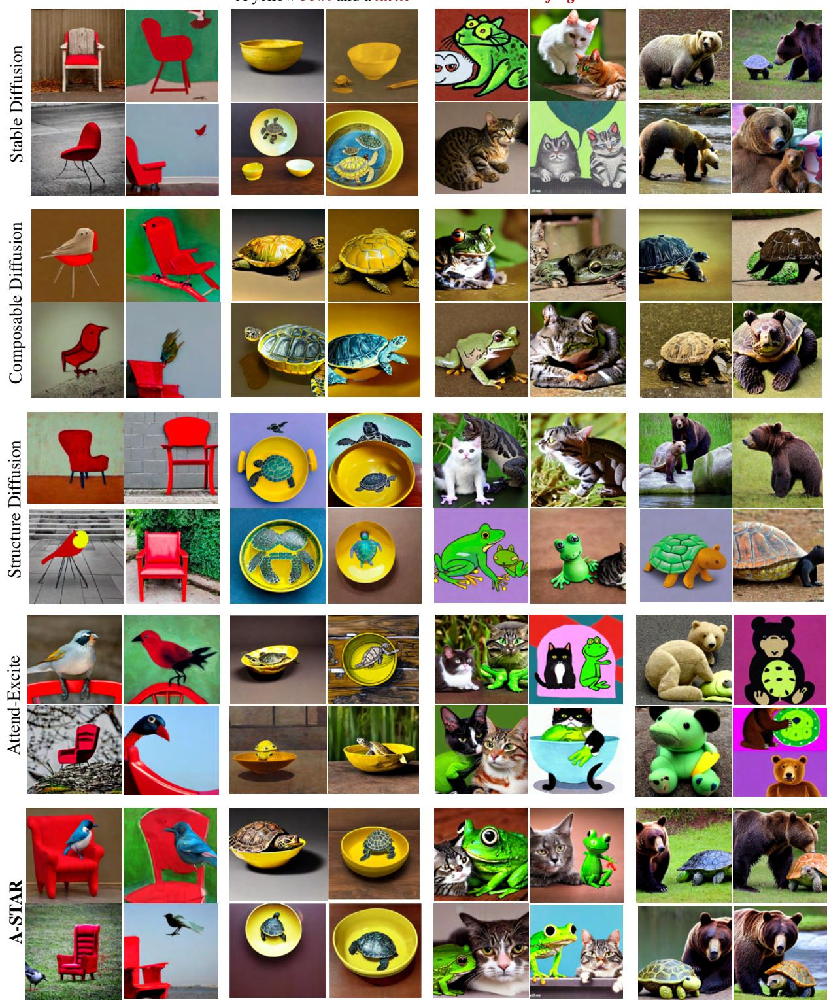  
Figure 7: Comparison of A-STAR with recent state-of-the-art methods. For each prompt, we generate four images.

where as before $[ { \bf A } _ { t - 1 } ^ { m } ] _ { i j }$ is the pixel value at the $( i , j )$ location. By seeking to maximize the IoU between $\mathbf { A } _ { t - 1 } ^ { m }$ and $\mathbf { B } _ { t } ^ { m }$ , we force the DDPM process to retain information from previous time steps, thereby alleviating the attention decay issue. Note that the binary mask $\mathbf { B } _ { t } ^ { m }$ in Equation 3 is updated at each time step. We show some results before and after this loss in the A-STAR row in Figure 4 where one can note substantially improved information retention (e.g., highly activated umbrella with our method vs. Stable Diffusion). Since we retain information for all concepts, the DDPM gives a $\mathbf { z } _ { 0 }$ that captures all of dog, beach, and umbrella in the final output when compared to the baseline.

A monkey with banana and a red brick wall in background  
A white horse and a green bird  
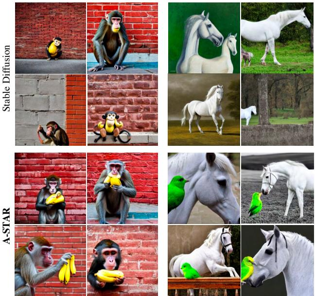  
Figure 8: More comparisons with Stable Diffusion.

## 3.5. Optimizing LDMs with A-STAR

Our overall loss function (see also Figure 5) includes both attention separation and attention retention loss as:

$$
\mathcal { L } = \mathcal { L } _ { \mathrm { s e g } } + \mathcal { L } _ { \mathrm { r e t } }\tag{4}
$$

We now only need to direct the latent code at the current time step zt in the right direction as measured by this overall loss (see the intuition for our proposed losses again in Section 3.2). We realize this with a latent update: $\begin{array} { r } { \mathbf { z } _ { t } ^ { \prime } = \mathbf { z } _ { t } - \boldsymbol { \alpha } _ { t } \cdot \nabla _ { \mathbf { z } _ { t } } \mathcal { L } } \end{array}$ , where $\alpha _ { t }$ is the step size of the gradient update. This updated $ { \mathbf { z } } _ { t } ^ { \prime }$ is then used in the next denoising step to obtain $\mathbf { z } _ { t - 1 }$ , which is then again updated in a similar fashion (and the process repeats until the last step).

## 4. Results

Given the unavailability of standard benchmarks to evaluate text-to-image models, we use a mix of commonly used prompts for qualitative evaluation and the protocol in prior work [2] for a quantitative evaluation. In particular, this involves constructing prompts with two subjects in the following fashion: [animalA-animalB], [animal-color], and [colorA; objectA-colorB; objectB]. We do evaluate on much more complex prompts as well (see Figures 1 and 8).

Qualitative Results. We first begin by discussing our generation outputs. In Figure 7, we compare A-STAR’s results with other recent competing methods like Composable Diffusion [13], Structure Diffusion [3] and Attend-Excite [2], and one can note A-STAR clearly outperforms these techniques. For instance, in the first column, all of Stable Diffusion [21], Composable Diffusion [13], and Structure Diffusion [3] are not able to capture the two concepts of bird and red chair whereas A-STAR is able to, showing the importance of having two well segregated and activated attention regions that are retained across denoising steps. Further, as can be seen from the Attend-Excite [2] results, the chair is either not fully visible (first two images) or is conflated into the bird (bottom-right), suggesting that simply maximizing patches in attention maps will not ensure the holistic properties of all concepts are captured. Similar observations can be made from results in the other three columns as well. We also observe significant qualitative improvements with A-STAR in the binding of attributes to these concepts. For instance, while competing methods do incorrect binding (e.g., many baseline generations have red attribute transferred to bird as well in column 1, the yellow attribute transferred to turtle as well in column 2), our method is able to resolve this correctly (e.g., only red chairs and yellow bowls in our results).

Next, in Figure 8, we compare our results with baseline Stable Diffusion [21] on more complex prompts. In the first column, while the baseline is either missing one of the three concepts (e.g., banana in many cases) or mixing them up (e.g., monkey in banana appearance), A-STAR captures all of them

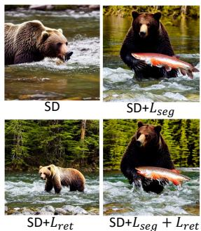  
Prompt: A grizzly bear catching a salmon in a crystal clear river surrounded by a forest  
Figure 10: Ablation results.

as desired. Similarly, A-STAR generates both the white horse and the green bird as desired. We end this section with some qualitative ablation results that demonstrate the impact of our losses. In Figure 10, we show the result of incrementally adding our losses to base Stable Diffusion [21]. When we add $\mathcal { L } _ { s e g } ,$ the salmon shows up since it was previously omitted due to cross-attention overlap between salmon and bear. When we add $\mathcal { L } _ { \mathit { r e t } }$ , the forest shows up since its information was present in the first few timesteps and hence retained with $\mathcal { L } _ { \mathit { r e t } }$ . Finally, we achieve both these aspects as expected with $\mathcal { L } _ { s e g }$ and $\mathcal { L } _ { \boldsymbol { r e t } }$

Quantitative Results. We follow existing protocol [2] and quantify performance with CLIP [18] distances. We first generate 64 images with randomly selected seeds and compute the average image-text cosine similarity using CLIP for each prompt. Here, as in prior work [2], we use both full prompt similarity (i.e., cosine similarity between full prompt and generated image) and minimum object similarity (i.e., minimum of the two similarities between generated image and each of the two subject prompts) and report results in Figure 9. A-STAR outperforms the baselines across both metrics across all the three categories. In particular, it outperforms Attend-Excite [2] by 2.9% and 1.4% across all three subsets for full prompt similarity and minimum object similarity respectively (the corresponding improvements over Stable Diffusion [21] are 7.1% and 10.8%).

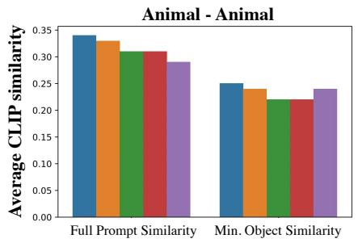

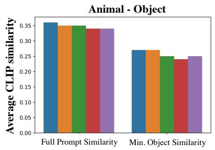

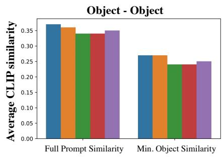  
A-STAR Attend-Excite StableDiffusion StructureDiffusion ComposableDiffusion

Figure 9: Average CLIP image-text similarities between the text prompts and the images generated by each method
<table><tr><td>Method</td><td>Animal - Animal</td><td>Animal - Object</td><td>Object - Object</td></tr><tr><td>Stable [21]</td><td>0.76 (-7.9%)</td><td>0.78 (-7.7%)</td><td>0.77 (-6.5%)</td></tr><tr><td>Composable [13]</td><td>0.69 (-18.9%)</td><td>0.77 (-9.1%)</td><td>0.76 (-7.9%)</td></tr><tr><td>Structure [3]</td><td>0.76 (-7.9%)</td><td>0.78 (-7.7%)</td><td>0.76 (-7.9%)</td></tr><tr><td>Attend-Excite [2]</td><td>0.80 (-2.5%)</td><td>0.82 (-2.4%)</td><td>0.81 (-1.2%)</td></tr><tr><td>A-STAR</td><td>0.82</td><td>0.84</td><td>0.82</td></tr></table>

Table 1: Text-text similarities between the text prompts and BLIP-generated captions over the generated images.

<table><tr><td>Method</td><td>Animal - Animal</td><td>Animal - Object</td><td>Object - Object</td></tr><tr><td>Stable [21]</td><td>0.76</td><td>0.78</td><td>0.77</td></tr><tr><td>Stable +  $\mathcal { L } _ { \mathit { r e t } }$ </td><td>0.78 (+2.5%)</td><td>0.83 (+6.4%)</td><td>0.79 (+2.6%)</td></tr><tr><td>Stable +  $\mathcal { L } _ { s e g }$ </td><td>0.79 (+4.0%)</td><td>0.82 (+5.1%)</td><td>0.80 (+3.9%)</td></tr><tr><td>Stable +  $\cdot \mathcal { L } _ { r e t } + \mathcal { L } _ { s e g }$ </td><td>0.82 (+7.9%)</td><td>0.84 (+7.7%)</td><td>0.82 (+6.5%)</td></tr></table>

Table 2: Ablation results for text-text similarities.

We also compute text-text similarities by captioning the generated images with BLIP [11] and comparing them with the input prompt. See Table 1 where much higher similarities with A-STAR is indicative of the semantic correctness of the generated results with our method. In the supplementary material document, we provide additional text-text similarity results with other standard metrics as well. Finally, we also quantify the impact of each of our losses in Table 2 where we compute text-text similarities as above. While each loss individually improves baseline [21] performance, the full model achieves the highest improvement, indicating the losses’ complementarity. A graph similar to Figure 9 for this ablation experiment can be found in the supplementary material.

<table><tr><td>Method</td><td>Animal - Animal</td><td>Animal - Object</td><td>Object - Object</td></tr><tr><td>Stable [21]</td><td>2.2%</td><td>6.7%</td><td>3.0%</td></tr><tr><td>Attend-Excite [2]</td><td>3.0%</td><td>14.1%</td><td>13.3%</td></tr><tr><td>A-STAR</td><td>94.8%</td><td>79.2%</td><td>83.7%</td></tr></table>

Table 3: Results from a user survey with 26 respondents.

User study. Finally, we conduct a user study with the generated images where we ask survey respondents to select which set of images (among sets from three different methods, see Table 3) best represents the input text semantically. We randomly sample five prompts for each of the animalanimal, animal-object, and object-object categories in Table 3 and generate four different images for each prompt using each of Stable Diffusion [21], Attend-Excite [2], and A-STAR. From Table 3, our method’s results are preferred by a majority of the survey respondents, thus providing additional evidence for the impact of our proposed losses on the semantic faithfulness of the images generated by A-STAR. Supplementary material has more details.

## 5. Additional Results and Discussion

In Figure 11, we show additional results. In Figure 11(a), we show more results with a diverse set of prompts where A-STAR outperforms baseline Stable Diffusion (e.g., baseline misses out on the bottle in the second row and lotus in the third row). In Figure 11(b), we show an example with five concepts, where one can note the baseline misses out on the bowl and the cat. In Figure 11(c), we show the improvements over Stable Diffusion is consistent with higher versions of the baseline checkpoint (e.g., we show improvements over the v2.1 version here). In Figure 11(d), we show results with the same object performing a variety of actions. Note that while A-STAR ensures presence of both cat and ball, the quality of relations between them is limited by the base model’s capability. In Figure 11(e), we show an ablation for the number of steps for which to run A-STAR optimization, where we can note using it for only a few steps (e.g., first five) leads to the model missing out on key concepts. In Figure 11(f), we show the extra compute time (over baseline Stable Diffusion) needed by A-STAR and compare it to Attend-Excite [2]. Finally, in Figure 11(g), we provide additional quantitative results to go with the ones in Tables 1 and 2 where we use the Jaccard similarity to show A-STAR outperforms Attend-Excite [2] despite its competitive performance.

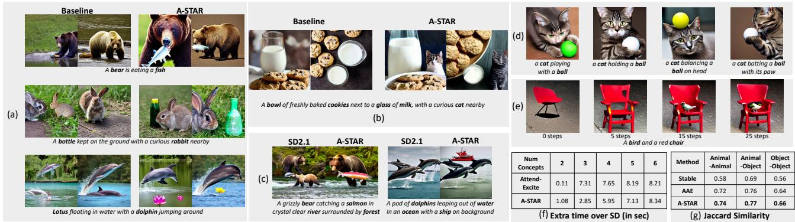  
Figure 11: (a) and (b) Additional results comparing A-STAR’s performance with baseline Stable Diffusion on a variety of prompts and concept types. (c) Comparing A-STAR’s performance with the baseline when using a different version of Stable Diffusion checkpoint. (d) Demonstrating A-STAR’s performance with a variety of action/relation types. (e) Impact of the proposed losses when applied to only a fraction of the denoising timesteps. (f) Additional compute time needed over baseline Stable Diffusion for A-STAR and Attend-and-Excite [2]. (g) Additional results comparing A-STAR with Attend-and-Excite [2] using the Jaccard similarity metric.

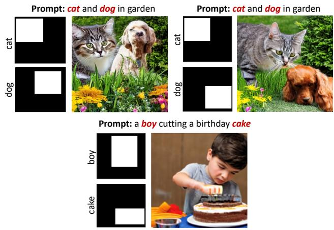  
Figure 12: Example results to show an application of our attention retention loss.

Other applications: An interesting application of our proposed attention retention loss is the ability to generate layout-constrained images. Instead of the automatically computed ground-truth masks as discussed in Section 1.2 above, these masks can be supplied directly by the user.

More specifically, the users can delineate where they want certain concepts to show up in the final generation by means of binary layout maps. For instance, in the first example (top left) in Figure 12, a user may specify the cat to show up at the top-left region in the image and the dog to show up in the middle-right region in the image. Given masks reflecting this layout constraint, we can apply our attention retention loss with these masks and generate images constrained by these inputs. One can note in the results that this indeed is the case, with the cat being generated in top-left image region and the dog being generated in the middle-right region in the first example. Similar observations can be made from the other two examples.

## 6. Summary

In this work, we notice that several baseline diffusion models are not faithful in capturing all the concepts from an input prompt in the generated image, and identify two key issues that contributes to this behavior. First, in many cases, there is significant pixel overlap among concepts in their intermediate attention maps that leads to model confusion, and second, these models are not able to retain knowledge (in attention maps) across all denoising timesteps. We propose two loss functions, attention segregation and attention retention, that fixes these issues directly at inference time, without any retraining. We conduct extensive qualitative experiments with a variety of prompts and demonstrate that the images are substantially more semantically faithful to the input prompts, when compared to many recently proposed models. Further, we also quantify our improvements with protocols from the literature as well as a user survey, which clearly brings out the efficacy of A-STAR.

## References

[1] Tim Brooks, Aleksander Holynski, and Alexei A Efros. Instructpix2pix: Learning to follow image editing instructions. arXiv preprint arXiv:2211.09800, 2022. 4

[2] Hila Chefer, Yuval Alaluf, Yael Vinker, Lior Wolf, and Daniel Cohen-Or. Attend-and-excite: Attention-based semantic guidance for text-to-image diffusion models. arXiv preprint arXiv:2301.13826, 2023. 2, 3, 4, 7, 8, 9

[3] Weixi Feng, Xuehai He, Tsu-Jui Fu, Varun Jampani, Arjun Akula, Pradyumna Narayana, Sugato Basu, Xin Eric Wang, and William Yang Wang. Training-free structured diffusion guidance for compositional text-to-image synthesis. arXiv preprint arXiv:2212.05032, 2022. 2, 7, 8

[4] Yaru Hao, Zewen Chi, Li Dong, and Furu Wei. Optimizing prompts for text-to-image generation. arXiv preprint arXiv:2212.09611, 2022. 4

[5] Amir Hertz, Ron Mokady, Jay Tenenbaum, Kfir Aberman, Yael Pritch, and Daniel Cohen-Or. Prompt-to-prompt image editing with cross attention control. arXiv preprint arXiv:2208.01626, 2022. 2, 4

[6] Jonathan Ho and Tim Salimans. Classifier-free diffusion guidance. arXiv preprint arXiv:2207.12598, 2022. 4

[7] Huaibo Huang, Ran He, Zhenan Sun, Tieniu Tan, et al. Introvae: Introspective variational autoencoders for photographic image synthesis. Advances in neural information processing systems, 31, 2018. 4

[8] Phillip Isola, Jun-Yan Zhu, Tinghui Zhou, and Alexei A Efros. Image-to-image translation with conditional adversarial networks. In Proceedings of the IEEE conference on computer vision and pattern recognition, pages 1125–1134, 2017. 4

[9] Tero Karras, Samuli Laine, and Timo Aila. A style-based generator architecture for generative adversarial networks. In Proceedings ofthe IEEE/CVF conference on computer vision and pattern recognition, pages 4401–4410, 2019. 4

[10] Diederik P Kingma and Max Welling. Auto-encoding variational bayes. arXiv preprint arXiv:1312.6114, 2013. 4

[11] Junnan Li, Dongxu Li, Caiming Xiong, and Steven Hoi. Blip: Bootstrapping language-image pre-training for unified vision-language understanding and generation. In International Conference on Machine Learning, pages 12888– 12900. PMLR, 2022. 8

[12] Yuheng Li, Haotian Liu, Qingyang Wu, Fangzhou Mu, Jianwei Yang, Jianfeng Gao, Chunyuan Li, and Yong Jae Lee. Gligen: Open-set grounded text-to-image generation. arXiv preprint arXiv:2301.07093, 2023. 4

[13] Nan Liu, Shuang Li, Yilun Du, Antonio Torralba, and Joshua B Tenenbaum. Compositional visual generation with composable diffusion models. In Computer Vision–ECCV 2022: 17th European Conference, Tel Aviv, Israel, October 23–27, 2022, Proceedings, Part XVII, pages 423–439. Springer, 2022. 4, 7, 8

[14] Vivian Liu and Lydia B Chilton. Design guidelines for prompt engineering text-to-image generative models. In Proceedings of the 2022 CHI Conference on Human Factors in Computing Systems, pages 1–23, 2022. 4

[15] Ron Mokady, Amir Hertz, Kfir Aberman, Yael Pritch, and Daniel Cohen-Or. Null-text inversion for editing real images using guided diffusion models. arXiv preprint arXiv:2211.09794, 2022. 4

[16] Alex Nichol, Prafulla Dhariwal, Aditya Ramesh, Pranav Shyam, Pamela Mishkin, Bob McGrew, Ilya Sutskever, and Mark Chen. Glide: Towards photorealistic image generation and editing with text-guided diffusion models. arXiv preprint arXiv:2112.10741, 2021. 4

[17] Taesung Park, Ming-Yu Liu, Ting-Chun Wang, and Jun-Yan Zhu. Semantic image synthesis with spatially-adaptive normalization. In Proceedings of the IEEE/CVF conference on computer vision and pattern recognition, pages 2337–2346, 2019. 4

[18] Alec Radford, Jong Wook Kim, Chris Hallacy, Aditya Ramesh, Gabriel Goh, Sandhini Agarwal, Girish Sastry, Amanda Askell, Pamela Mishkin, Jack Clark, et al. Learning transferable visual models from natural language supervision. In International conference on machine learning, pages 8748–8763. PMLR, 2021. 4, 7

[19] Colin Raffel, Noam Shazeer, Adam Roberts, Katherine Lee, Sharan Narang, Michael Matena, Yanqi Zhou, Wei Li, and Peter J Liu. Exploring the limits of transfer learning with a unified text-to-text transformer. The Journal of Machine Learning Research, 21(1):5485–5551, 2020. 4

[20] Aditya Ramesh, Prafulla Dhariwal, Alex Nichol, Casey Chu, and Mark Chen. Hierarchical text-conditional image generation with clip latents. arXiv preprint arXiv:2204.06125, 2022. 2, 4

[21] Robin Rombach, Andreas Blattmann, Dominik Lorenz, Patrick Esser, and Bjorn Ommer. High-resolution image¨ synthesis with latent diffusion models. In Proceedings of the IEEE/CVF Conference on Computer Vision and Pattern Recognition, pages 10684–10695, 2022. 1, 2, 3, 4, 5, 7, 8

[22] Olaf Ronneberger, Philipp Fischer, and Thomas Brox. Unet: Convolutional networks for biomedical image segmentation. In Medical Image Computing and Computer-Assisted Intervention–MICCAI 2015: 18th International Conference, Munich, Germany, October 5-9, 2015, Proceedings, Part III 18, pages 234–241. Springer, 2015. 4

[23] Chitwan Saharia, William Chan, Saurabh Saxena, Lala Li, Jay Whang, Emily Denton, Seyed Kamyar Seyed Ghasemipour, Burcu Karagol Ayan, S Sara Mahdavi, Rapha Gontijo Lopes, et al. Photorealistic text-to-image diffusion models with deep language understanding. arXiv preprint arXiv:2205.11487, 2022. 2, 4

[24] Ming Tao, Hao Tang, Fei Wu, Xiao-Yuan Jing, Bing-Kun Bao, and Changsheng Xu. Df-gan: A simple and effective baseline for text-to-image synthesis. In Proceedings of the IEEE/CVF Conference on Computer Vision and Pattern Recognition, pages 16515–16525, 2022. 4

[25] Aaron Van Den Oord, Oriol Vinyals, et al. Neural discrete representation learning. Advances in neural information processing systems, 30, 2017. 4

[26] Ashish Vaswani, Noam Shazeer, Niki Parmar, Jakob Uszkoreit, Llion Jones, Aidan N Gomez, Łukasz Kaiser, and Illia Polosukhin. Attention is all you need. Advances in neural information processing systems, 30, 2017. 4

[27] Zijie J Wang, Evan Montoya, David Munechika, Haoyang Yang, Benjamin Hoover, and Duen Horng Chau. Diffusiondb: A large-scale prompt gallery dataset for text-toimage generative models. arXiv preprint arXiv:2210.14896, 2022. 2, 4

[28] Sam Witteveen and Martin Andrews. Investigating prompt engineering in diffusion models. arXiv preprint arXiv:2211.15462, 2022. 4

[29] Tao Xu, Pengchuan Zhang, Qiuyuan Huang, Han Zhang, Zhe Gan, Xiaolei Huang, and Xiaodong He. Attngan: Finegrained text to image generation with attentional generative adversarial networks. In Proceedings ofthe IEEE conference on computer vision and pattern recognition, pages 1316– 1324, 2018. 4

[30] Zhengyuan Yang, Jianfeng Wang, Zhe Gan, Linjie Li, Kevin Lin, Chenfei Wu, Nan Duan, Zicheng Liu, Ce Liu, Michael Zeng, et al. Reco: Region-controlled text-to-image generation. arXiv preprint arXiv:2211.15518, 2022. 4

[31] Hui Ye, Xiulong Yang, Martin Takac, Rajshekhar Sunderraman, and Shihao Ji. Improving text-to-image synthesis using contrastive learning. arXiv preprint arXiv:2107.02423, 2021. 4

[32] Yu Zeng, Zhe Lin, Jianming Zhang, Qing Liu, John Collomosse, Jason Kuen, and Vishal M Patel. Scenecomposer: Any-level semantic image synthesis. arXiv preprint arXiv:2211.11742, 2022. 4

[33] Han Zhang, Jing Yu Koh, Jason Baldridge, Honglak Lee, and Yinfei Yang. Cross-modal contrastive learning for text-toimage generation. In Proceedings of the IEEE/CVF conference on computer vision and pattern recognition, pages 833–842, 2021. 4

[34] Jun-Yan Zhu, Taesung Park, Phillip Isola, and Alexei A Efros. Unpaired image-to-image translation using cycleconsistent adversarial networks. In Proceedings ofthe IEEE international conference on computer vision, pages 2223– 2232, 2017. 4

[35] Jun-Yan Zhu, Richard Zhang, Deepak Pathak, Trevor Darrell, Alexei A Efros, Oliver Wang, and Eli Shechtman. Toward multimodal image-to-image translation. Advances in neural information processing systems, 30, 2017. 4

[36] Minfeng Zhu, Pingbo Pan, Wei Chen, and Yi Yang. Dm-gan: Dynamic memory generative adversarial networks for textto-image synthesis. In Proceedings of the IEEE/CVF conference on computer vision and pattern recognition, pages 5802–5810, 2019. 4