# ACTIVE: Towards Highly Transferable 3D Physical Camouflage for Universal and Robust Vehicle Evasion

Naufal Suryanto1,‡, Yongsu Kim1,2,‡, Harashta Tatimma Larasati1, Hyoeun Kang1,2, Thi-Thu-Huong Le1 Yoonyoung Hong1, Hunmin Yang3, Se-Yoon Oh3, Howon Kim1,2,∗

1Pusan National University, South Korea; 2SmartM2M, South Korea; 3Agency for Defense Development (ADD), South Korea https://islab-ai.github.io/active-iccv2023

## Abstract

Adversarial camouflage has garnered attention for its ability to attack object detectorsfrom any viewpoint by covering the entire object’s surface. However, universality and robustness in existing methods often fall short as the transferability aspect is often overlooked, thus restricting their application only to a specific target with limited performance. To address these challenges, we present Adversarial Camouflagefor Transferable and Intensive Vehicle Evasion (ACTIVE), a state-of-the-art physical camouflage attack framework designed to generate universal and robust adversarial camouflage capable ofconcealing any 3D vehicle from detectors. Ourframework incorporates innovative techniques to enhance universality and robustness, including a refined texture rendering that enables common texture application to different vehicles without being constrained to a specific texture map, a novel stealth loss that renders the vehicle undetectable, and a smooth and camouflage loss to enhance the naturalness of the adversarial camouflage. Our extensive experiments on 15 different models show that ACTIVE consistently outperforms existing works on various public detectors, including the latest YOLOv7. Notably, our universality evaluations reveal promising transferability to other vehicle classes, tasks (segmentation models), and the real world, notjust other vehicles.

## 1. Introduction

Deep neural networks (DNNs) have achieved tremendous outcomes in a wide range of research fields, especially in computer vision, such as facial recognition and self-driving cars [8, 34, 7]. Despite their remarkable performance, DNNs, including object detection models, are vulnerable to adversarial attacks [2]. Generally, adversarial attacks can be classified into digital attacks and physical attacks [36]. Digital attacks are primarily carried out by adding small perturbations to pixels of input images. However, digital attacks have limitations in real-world scenarios because they have to manipulate the digital systems that may be configured with security schemes. To alleviate these limitations, physical attacks have been proposed that modify the object in the physical space rather than in the digital.

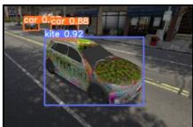  
(a) FCA

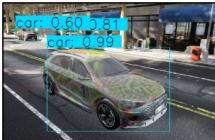  
(b) FCA on UE4

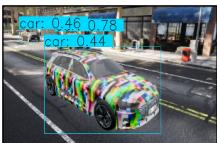  
(c) DTA

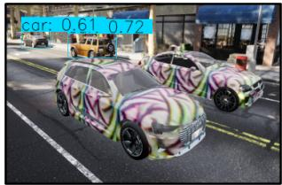

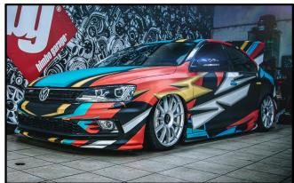  
(d) ACTIVE (Ours)  
(e) Car Graffiti  
Figure 1: Current state-of-the-art adversarial camouflage, Full-coverage Camouflage Attack (FCA) [35]; (a) is undetected as car in their original result, but (b) is normally detected when fully transferred to Unreal Engine 4 (UE4). (c) The result of the Differentiable Transformation Attack (DTA) [30], with stronger result than FCA, but limited to unnatural mosaic pattern. (d) The result of ACTIVE, which has better attack performance (i.e., not detected as a car at all), is universal (i.e., implementable to other car), and has a natural pattern comparable to (e) a real-world graffiti.

Nonetheless, physical attacks are more challenging due to the inherently complex physical constraints (camera pose, lighting, occlusion, etc.). Therefore, most physical attack methods exclude the perturbation constraint (i.e., the result can be suspicious). There are mainly two types of methods in physical attacks: adversarial patch and adversarial camouflage. The former [6, 32] is the method of physical attack by attaching a small, localized patch to an object. It only covers the planar part of the object’s surface and can fail to attack the detector depending on the viewing angles.

Adversarial camouflage methods [45, 41, 39, 35, 30] have been proposed to overcome the limitations of the adversarial patch. This approach covers the whole surface of the object by manipulating the texture of the object, which leads to better attack performance regardless of the viewing angles. Most of these methods use vehicles as the target objects due to their crucial role in real-world applications, such as surveillance systems and autonomous driving.

Due to the non-planarity of 3D vehicles, it is more challenging to generate optimal adversarial camouflage than in its 2D counterpart. Since the general 3D rendering is nondifferentiable, early research [45, 41] employed a black-box approach to generating adversarial camouflage, inevitably yielding a lower attack performance than the white-box one. More recent research (e.g., DAS [39], FCA [35], and DTA [30]) utilize a neural renderer to acquire the advantage of the white-box approach, which offers differentiability. In particular, DTA proposes its own neural renderer capable of expressing various physical and realistic characteristics. Additionally, it employs its so-called Repeated Texture Projection function to apply the same attack texture to other vehicle types, thus improving universality. However, DTA relies on a simple texture projection, which may result in an inaccurate texture for non-planar shapes. For improving the accuracy and robustness of adversarial camouflage methods, it would be essential to bring forth a more sophisticated texture mapping approach.

In this paper, we propose Adversarial Camouflage for Transferable and Intensive Vehicle Evasion (ACTIVE), a state-of-the-art adversarial camouflage framework that greatly enhances robustness, universality, and naturalness compared to previous methods, as shown in Fig. 1. Our contributions can be summarized as follows:

• We utilize Triplanar Mapping, a sophisticated texture mapping approach available through the neural renderer, to generate adversarial textures with improved robustness and universality. To the best of our knowledge, the use of this method in generating adversarial camouflage has never been found in literature.

• We employ Stealth Loss, our novel attack loss function that minimizes the detection score from all valid classes, resulting in the target vehicle being not only misclassified but also undetectable.

• We improve the naturalness of the adversarial camouflage by utilizing larger texture resolutions than previous works [45, 41, 30] and applying a smooth loss. Furthermore, we introduce a Camouflage Loss that can enhance the camouflage of the vehicle against the background.

• Our extensive experiments demonstrate that ACTIVE consistently outperforms previous works, exhibiting improved universality from multiple perspectives: instance-agnostic (available on various vehicle types), class-agnostic (even across different classes such as truck and bus), model-agnostic (performing on various vehicle detectors), task-agnostic (performing on segmentation models), and domain-agnostic (performing in real-world scenarios).

## 2. Related Works

The Expectation over Transformation (EoT) [4] has emerged as a leading approach in generating robust adversarial examples under various transformations, including variations in viewing distance, angle, and lighting conditions. Consequently, many adversarial camouflage methods [45, 41, 39, 35, 30] incorporate EoT-based algorithms to enhance their attack robustness in the physical scenarios.

Regarding the texture rendering process, differentiability is crucial to enable white-box attacks to obtain optimal adversarial camouflage, whereas non-differentiability of general texture rendering led to the initial proposal of the blackbox approach. Zhang et al. [45] proposed CAMOU, utilizing the clone network that imitates the texture rendering and detection process, while Wu et al. [41] suggested finding optimal adversarial texture based on genetic algorithm.

Huang et al. [16] proposed the Universal Physical Camouflage Attack (UPC) as an alternative method for crafting universal adversarial camouflage, which differs from existing black-box approaches. To make UPC effective for nonrigid or non-planar objects, they introduced a set of transformations that can mimic deformable properties. However, subsequent studies [39, 35, 30] have found that the transferability of UPC is limited when it comes to various viewing angles, other models, and different environments due to its inherent limitations of the patch-based method.

More recent research used a neural renderer, which provides a differentiable texture rendering, to improve attack performance. Wang et al. [39] proposed the Dual Attention Suppression (DAS) attack, which suppresses both model and human attention. Meanwhile, Wang et al. [35] proposed the Full-coverage Camouflage Attack (FCA), which is more robust under complex views.

However, Suryanto et al. [30] pointed out that the DAS and FCA used a legacy renderer, which could not reflect various real-world characteristics and complex scenes, such as shadows and light reflections. They proposed the Differentiable Transformation Attack (DTA) that uses their own neural renderer, which provides rendering similar to a photo-realistic renderer. Despite its success, DTA also comes with several limitations. Notably, the method relies on a simple texture projection, which can lead to inaccurate texture mapping. Furthermore, the generated camouflage features a colorful mosaic pattern, which appears unnatural to human observers. Tab. 1 compares how well existing approaches stack up against the suggested method under various criteria. As shown, our proposal satisfies and achieves all good values under each condition setting compared to prior methods.

Table 1: Comparison of proposed and existing physical camouflage attack methods.
<table><tr><td rowspan=1 colspan=1>Attack</td><td rowspan=1 colspan=1>3D</td><td rowspan=1 colspan=1>WB</td><td rowspan=1 colspan=1>FC</td><td rowspan=1 colspan=1>(1)U</td><td rowspan=1 colspan=1>(2)A</td><td rowspan=1 colspan=1>(3)N</td><td rowspan=1 colspan=1>(4)D</td><td rowspan=1 colspan=1>(5)P</td></tr><tr><td rowspan=1 colspan=1>AP [6]</td><td rowspan=1 colspan=1>X</td><td rowspan=1 colspan=1>√</td><td rowspan=1 colspan=1>X</td><td rowspan=1 colspan=1>**</td><td rowspan=1 colspan=1>**</td><td rowspan=1 colspan=1>-</td><td rowspan=1 colspan=1>**</td><td rowspan=1 colspan=1>-</td></tr><tr><td rowspan=1 colspan=1>UPC [16]</td><td rowspan=1 colspan=1>X</td><td rowspan=1 colspan=1>√</td><td rowspan=1 colspan=1>X</td><td rowspan=1 colspan=1>**</td><td rowspan=1 colspan=1>*★</td><td rowspan=1 colspan=1>**</td><td rowspan=1 colspan=1>**</td><td rowspan=1 colspan=1>★</td></tr><tr><td rowspan=1 colspan=1>CM [45]</td><td rowspan=1 colspan=1>√</td><td rowspan=1 colspan=1>X</td><td rowspan=1 colspan=1>√</td><td rowspan=1 colspan=1>★</td><td rowspan=1 colspan=1>**</td><td rowspan=1 colspan=1>-</td><td rowspan=1 colspan=1>-</td><td rowspan=1 colspan=1>**</td></tr><tr><td rowspan=1 colspan=1>ER [41]</td><td rowspan=1 colspan=1>√</td><td rowspan=1 colspan=1>X</td><td rowspan=1 colspan=1>√</td><td rowspan=1 colspan=1>★</td><td rowspan=1 colspan=1>**</td><td rowspan=1 colspan=1>-</td><td rowspan=1 colspan=1>-</td><td rowspan=1 colspan=1>**</td></tr><tr><td rowspan=1 colspan=1>DAS [39]</td><td rowspan=1 colspan=1>√</td><td rowspan=1 colspan=1>√</td><td rowspan=1 colspan=1>X</td><td rowspan=1 colspan=1>-</td><td rowspan=1 colspan=1>★</td><td rowspan=1 colspan=1>**</td><td rowspan=1 colspan=1>-</td><td rowspan=1 colspan=1>★</td></tr><tr><td rowspan=1 colspan=1>FCA [35]</td><td rowspan=1 colspan=1>√</td><td rowspan=1 colspan=1>√</td><td rowspan=1 colspan=1>√</td><td rowspan=1 colspan=1>-</td><td rowspan=1 colspan=1>★</td><td rowspan=1 colspan=1>★</td><td rowspan=1 colspan=1>-</td><td rowspan=1 colspan=1>★</td></tr><tr><td rowspan=1 colspan=1>DTA [30]</td><td rowspan=1 colspan=1>√</td><td rowspan=1 colspan=1>√</td><td rowspan=1 colspan=1>√</td><td rowspan=1 colspan=1>★</td><td rowspan=1 colspan=1>**</td><td rowspan=1 colspan=1>-</td><td rowspan=1 colspan=1>★</td><td rowspan=1 colspan=1>**</td></tr><tr><td rowspan=1 colspan=1>Ours</td><td rowspan=1 colspan=1>√</td><td rowspan=1 colspan=1>√</td><td rowspan=1 colspan=1>√</td><td rowspan=1 colspan=1>**</td><td rowspan=1 colspan=1>*★</td><td rowspan=1 colspan=1>**</td><td rowspan=1 colspan=1>**</td><td rowspan=1 colspan=1>**</td></tr></table>

Notes:  
3D | White Box (WB) | Full Covering (FC) e Box (WB) |Full Covering (FC)

(1) Universality (U): ⋆ Might be universal, but only optimized on a single instance   
⋆⋆ Universal, the adversarial is optimized on multiple instances on the same category   
(2) Applicability (A): ⋆ Require exact position to place the adversarial |   
⋆⋆ Can be placed anywhere which satisfies on the target object   
(3) Naturalness (N): ⋆ Consider naturalness such as using smooth texture |   
⋆⋆ Have a more constrained setting   
(4) Digital Transformation (D): ⋆ Affine transformation only |   
⋆⋆ Both affine transformation and brightness, contrast   
(5) Physical Transformation (P): ⋆ Camera position only |   
⋆⋆ Both camera position and physical phenomena

## 3. Methodology

## 3.1. Problem Definition

Assume f is a neural renderer that generates optimal adversarial camouflage through white-box attacks based on differentiable rendering. f learns texture rendering by solving Eq. 1,

$$
f ( x _ { r e f } , \eta ) = x _ { r e n }\tag{1}
$$

where $x _ { r e f }$ refers to the reference image, which includes the target vehicle, η is the texture variable, and $x _ { r e n }$ is the rendered image with η. Previously, existing works have utilized neural renderer to generate adversarial camouflage by minimizing the loss function as shown in Eq. 2,

$$
\underset { \eta _ { a d v } } { \arg \operatorname* { m i n } } L ( h ( f ( x _ { r e f } , \eta _ { a d v } ) ) , y )\tag{2}
$$

where h is the hypothesis function for the vehicle detector, y is the corresponding detection label output, and $L ( h ( x ) , y )$ is the loss function that represents the confidence score of h regarding class y. Thus, solving Eq. 2 involves generating $\eta _ { a d v }$ to attack h by minimizing its confidence score.

We have noticed that there are rooms for improvement in at least two aspects. First, most of the neural renderers employed in existing adversarial camouflage methods use object-dependent texture mapping, such as UV mapping. Therefore, if the vehicle type changes, the previously generated $\eta _ { a d v }$ cannot be used. Second, most existing methods only minimize the target class confidence score for y. While this may cause misclassification as a different class than y, the object detection itself may remain. Meanwhile, our proposal employs a method that applies an advanced and object-independent texture mapping approach (i.e., triplanar mapping), which later proves to solve the universality issues. Furthermore, to address both limitations, we introduce Eq. 3,

$$
\underset { \eta _ { a d v } } { \arg \operatorname* { m i n } } \mathbb { E } _ { v \in V , y \in Y } L ( h ( f ( x _ { v } , \eta _ { a d v } ) ) , y )\tag{3}
$$

where V denotes the available vehicle types while Y signifies the available classes of the detector. Solving Eq. 3 aims to: (1) improve universality by generating an attack pattern that is applicable to various vehicles simultaneously, and (2) enhance robustness by minimizing confidence scores for all valid classes to avoid detection as objects themselves.

## 3.2. ACTIVE Framework

To generate universal and robust adversarial camouflage, we propose the ACTIVE framework, which employs an object-independent texture mapping with a neural renderer and a new attack loss function to cause the vehicle undetectable. The overall framework is as illustrated in Fig. 2.

Triplanar Mapping (TPM). We introduce the use of triplanar mapping [24], a texture mapping technique that applies textures to objects by projecting them from three directions using their surface coordinate and surface normal that can be extracted from the depth image. We find this method particularly beneficial for generating objectindependent adversarial textures since it does not rely on object-specific texture maps. Thus, we can optimize a common adversarial camouflage for multiple vehicles, making our attack instance-agnostic. Further, we introduce the Neural Texture Renderer (NTR), our improvement of DTN method by Suryanto et al. [30], which works well with our triplanar mapping while effectively preserving various physical characteristics. To our knowledge, we are the first to refine triplanar-mapped texture as the input to the neural renderer for enabling adversarial texture optimization across 3D instances. Our NTR enhances the efficiency of DTN by removing unnecessary elements of DTN, which the detail can be found in the Supplementary Material.

Stealth Loss. We propose stealth loss, a novel attack loss function for improving robustness. It considers two representative scores used in object detection models: the class confidence score and the objectness score. First, we minimize the objectness score, which determines the presence of an object in the detector, such as in YOLO families. Moreover, instead of minimizing the maximum confidence score for a specific class, we minimize the maximum confidence score across all classes, making our attack classagnostic. This approach does not only mislead the model to misclassification, but also considers the possibility of the box being empty of objects. The attack loss $L _ { a t k }$ is written as Eq. 4,

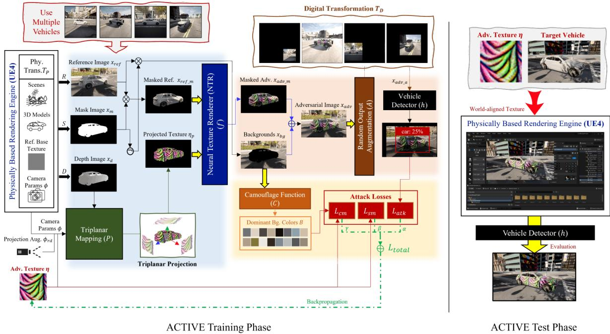  
Figure 2: ACTIVE framework for generating universal and robust adversarial camouflage.

$$
h _ { d } ( x ) = \left\{ { \begin{array} { l l } { h _ { c } ( x ) \times h _ { o } ( x ) , } & { { \mathrm { i f ~ } } I o U ( h _ { b } ( x ) , g t ) > t } \\ { 0 , } & { { \mathrm { o t h e r w i s e } } } \end{array} } \right.
$$

$$
L _ { a t k } ( x ) = f _ { l o g } ( \operatorname* { m a x } ( h _ { d } ( x ) ) )\tag{4}
$$

where x is an input image of a vehicle detector h, $h _ { c } ( x )$ is the confidence score of h for $x , \ h _ { o } ( x )$ is the objectness score of h for $x , \ h _ { b } ( x )$ is the detection result of h for x in the form of the bounding box, $I o U ( h _ { b } ( x ) , g t )$ is the Intersection over Union (IoU) between the bounding box $h _ { b } ( x )$ and the ground-truth, gt, and t is a custom IoU threshold. We define $h _ { d } ( x )$ as a detection score, which is the product of the confidence score and the objectness score. $f _ { l o g } ( n ) ~ = ~ - l o g ( 1 - n )$ is a log loss when the ground truth is zero. Then, minimizing $L _ { a t k }$ has the effect of minimizing both the confidence and objectness scores. Note that we only assign a value to the detection score for valid boxes with IoU greater than t, otherwise set it as zero. Thereby, the valid detection performance of the object detection model can be effectively lowered because the loss is applied only to the box that detects the object closely, and otherwise is excluded.

Random Output Augmentation (ROA). We propose an ROA module to enhance the texture robustness by various digital transformations [4]. Specifically, the module takes the output of the NTR, i.e., the adversarial example, and further augments it by applying random transformations such as scaling, translation, brightness, and contrast. While the NTR already provides robustness against various physical transformations, ROA allows for attaining an additional level of robustness with digital transformations to simulate changes happening in the real world to a certain extent, which to the best of our knowledge, have not been considered in most adversarial camouflage methods.

Smooth Loss. We utilize a smooth loss (i.e., Total Variation (TV) loss [22]) to improve the smoothness of the generated camouflage, which we define as $L _ { s m }$ in Eq. 5,

$$
L _ { s m } ( \eta ) = \frac { 1 } { N _ { s m } } \sum _ { i , j } f _ { l o g } ( | \eta _ { i , j } - \eta _ { i + 1 , j } | ) + f _ { l o g } ( | \eta _ { i , j } - \eta _ { i , j + 1 } | )\tag{5}
$$

where $\eta _ { i , j }$ is a pixel in a texture, η, at coordinate (i, j) and $N _ { s m } = ( \operatorname { \bar { H } } - 1 ) { \cdot } ( W - 1 )$ is a scale factor with texture image height, H, and texture image width, W. We slightly modify the loss for scale adjustment and normalization compared to the original TV loss. That is, $L _ { s m }$ is low when the values of adjacent pixels are close to each other. Thus, minimizing $L _ { s m }$ improve the smoothness of the adversarial camouflage.

Camouflage Loss. We propose a camouflage loss to improve camouflage for human vision as well as computer vision. There are several ways to computationally measure camouflage effectiveness, the most common method being to measure the target-background similarity [33]. We use a method to extract the most dominant background colors and force the object texture color to be similar. First, we employ a camouflage function based on K-means clustering to extract the most dominant colors from all background images [43, 17, 42]. Next, we utilize Non-Printability Score (NPS) loss [28] to regulate the object texture color set. While it was originally proposed to craft a color set that is comprised mostly of colors reproducible by the printer, we replace the printable color set used in the original NPS loss with the most dominant background color set. The camouflage loss, $L _ { c m }$ , can be expressed as Eq. 6,

$$
L _ { c m } ( \eta , B ) = \frac { 1 } { N _ { c m } } \sum _ { i , j } f _ { l o g } ( \operatorname* { m i n } _ { b \in B } | b - \eta _ { i , j } | )\tag{6}
$$

where $N _ { c m } = H \cdot W$ is a scale factor of camouflage loss, and B is the most dominant background color set. We can acquire the adversarial camouflage, which has a similar color to the background, by minimizing $L _ { c m }$ . Finally, our total loss, $L _ { t o t a l }$ , is constructed as Eq. 7,

$$
L _ { t o t a l } = \alpha L _ { a t k } + \beta L _ { s m } + \gamma L _ { c m }\tag{7}
$$

where $\alpha , \beta ,$ , and $\gamma$ are the weights to control the contribution of each loss function. The full pipeline of the ACTIVE framework for generating adversarial camouflage by minimizing $L _ { t o t a l }$ is illustrated in Fig. 2 and Alg. 1.

Algorithm 1 ACTIVE adversarial camouflage generation   
Input: Physical transformation set $T _ { P }$ , Digital trans  
formation set $T _ { D } ,$ , Rendering function R, Segmentation   
function S, Depth function D, Triplanar mapping $P ,$   
NTR $f ,$ ROA module A,   
Output: Adversarial camouflage η   
(1) Export $x _ { r e f } , x _ { m } , x _ { d } , x _ { r e f . m } ,$ and $x _ { b g }$ from the ren  
dering engine   
$x _ { r e f }  R ( T _ { P } ) , x _ { m }  S ( T _ { P } ) , x _ { d }  D ( T _ { P } )$   
$x _ { r e f . m } \gets x _ { r e f } \times x _ { m } , x _ { b g } \gets x _ { r e f } \times \neg { x _ { m } }$   
(2) Export B by Camouflage function C   
$B  C ( x _ { b g } )$   
(3) Generate adversarial camouflage η   
Initialize η with random values   
for number of training iterations do   
Select the minibatch sample from $x _ { r e f . m } , x _ { m } , x _ { b g }$   
Derive $\phi , \phi _ { r d }$ corresponding to each $x _ { r e f - m }$ from $T _ { P }$   
$\eta _ { p } \gets P ( \eta , x _ { d } , \phi + \phi _ { r d } )$   
$x _ { a d v \_ m } \gets f ( x _ { r e f \_ m } , \eta _ { p } )$   
$x _ { a d v } \gets x _ { a d v \_ m } + x _ { b g }$   
$x _ { a d v \_ a } \gets A ( x _ { a d v } , T _ { D } )$   
Calculate $L _ { a t k } ( x _ { a d v _ { - } a } ) , L _ { s m } ( \eta ) , L _ { c m } ( \eta , B ) \mathrm { b y } \mathrm { E q . } 4 ,$   
5, 6   
Set $L _ { t o t a l }$ by Eq. 7   
Update η for minimizing $L _ { t o t a l }$ via backpropagation   
end for

## 4. Experiments

We perform comprehensive experiments to investigate the performance of our proposed method on multiple aspects, including robustness and universality. Each experiment and its comparison with previous works are designed with specific criteria. However, due to limited space, we only present the essential information and leave the detail to the Supplementary Materials.

## 4.1. Implementation Details

Environment and Datasets. We implement our attacking framework using TensorFlow 2 [1] and utilize CARLA [11] on Unreal Engine 4 (UE4) [12] as a physically-based simulator for training and evaluation, following [30]. We synthesize our own dataset for training and evaluation with various photo-realistic settings. We select five types of cars on CARLA for attack texture generation and robustness evaluation, and another different five for universality evaluation, where they are excluded from texture optimization. For NTR model training, a total of 50,625 and 150,000 photo-realistic images are used for training and testing, respectively. Regarding attack pattern generation, another 15,000 images for reference are employed. As for attack evaluation, we render the generated attack pattern on multiple cars using world-aligned texture in Unreal Engine to produce a repeated pattern while ignoring the texture UV Map, with 14,400 images for a single texture evaluation.

NTR. We build an NTR with four encoder-decoder layers using DenseNet architecture [15] (following [30]) and train using 20 epochs. Our experiment verifies that the network trained with only nine selected colors are able to generalize 50 random colors on the test, achieving 0.985 SSIM (comparable to 0.986 SSIM in the original DTN setting), but with 82% less data. Details in Supplementary Material.

Attack Parameters. Our attack texture is optimized using Adam [19] with 30 epochs. For ROA, we use 0.25 random brightness, [0.75, 1.5] random contrast, and [0.25, 1.0] random scale. For projection augmentation on triplanar mapping, we use [−0.5, 0.5] random shift and [−0.25, 0.25] random scale. For loss hyperparameters, we use $\alpha = 1 . 0$ with IoU threshold $t = 0 . 5 , \beta = 0 . 2 5$ , and $\gamma = 0 . 2 5$ as default. Also, we set the base texture resolution to 64 × 64.

## 4.2. Robustness Evaluations

From Digital to Physical Simulation. First, we perform a comparative experiment to investigate the effectiveness of existing rendering methods, including ours, by evaluating the performance of attack textures in the original pipeline compared to physical simulation (UE4). For a fair comparison with prior works, we follow DAS [39] and FCA [35] by selecting the same simulated town and Audi E-Tron car in CARLA, then optimizing the textures targeting YOLOv3 [25]. In detail, DAS and FCA utilize Neural Mesh Renderer (NMR) [18] to optimize the 3D car texture and attach it to the simulated town as background, while DTA [30] utilizes Repeated Texture Projection (RTP) and DTN to simply project repeated texture and render it to the reference image. Meanwhile, ours utilizes TPM and NTR for more accurate repeated texture mapping and rendering.

Table 2: Digital-to-physical simulation comparison. Values are Average Precision@0.5 (%) of car in YOLOv3.
<table><tr><td rowspan=1 colspan=1>Methods</td><td rowspan=1 colspan=1>Orig. Rendering</td><td rowspan=1 colspan=1>Adv. Exm.</td><td rowspan=1 colspan=1>Phy. Sim.</td></tr><tr><td rowspan=1 colspan=1>Normal</td><td rowspan=1 colspan=1>UE4</td><td rowspan=1 colspan=1></td><td rowspan=1 colspan=1>99.57</td></tr><tr><td rowspan=1 colspan=1>DAS [39]</td><td rowspan=1 colspan=1>+ NMR</td><td rowspan=1 colspan=1>88.55</td><td rowspan=1 colspan=1>96.09</td></tr><tr><td rowspan=1 colspan=1>FCA [35]</td><td rowspan=1 colspan=1>+ NMR</td><td rowspan=1 colspan=1>52.05</td><td rowspan=1 colspan=1>92.28</td></tr><tr><td rowspan=1 colspan=1>DTA [30]</td><td rowspan=1 colspan=1>+ RTP &amp; DTN</td><td rowspan=1 colspan=1>16.91</td><td rowspan=1 colspan=1>41.95</td></tr><tr><td rowspan=1 colspan=1>Ours</td><td rowspan=1 colspan=1>+ TPM &amp; NTR</td><td rowspan=1 colspan=1>1.28</td><td rowspan=1 colspan=1>7.29</td></tr></table>

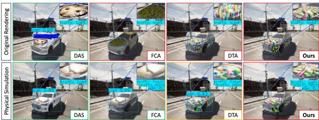  
Figure 3: Rendering comparison of white-box 3D adv. camouflage methods: Adv. example from original pipeline vs. Fully transferred to physical simulation (UE4). Zoom in.

As shown in Tab. 2 and Fig. 3, adversarial example produced by our optimization pipeline results in a very high attack performance compared to related works, even after fully transferred to physical simulation. DAS exhibits poor performance due to its partial texture coverage which is aligned with [35, 30]. FCA can successfully evade the detection in the original pipeline but is fully detected in the physical simulation with a high score. We observe DAS and FCA textures are mostly obscured by light reflections, which cannot be represented by their rendering method. DTA, which considers physical transformations but inaccurate texture mapping, causes misdetection in the original pipeline but is still detected in the physical simulation with a low score. In contrast, ours can successfully evade detection almost perfectly, thanks to our accurate texture mapping.

Attack Comparison on Physically-Based Simulation. We run a more extensive attack comparison by using diverse camera poses and evaluated models. Specifically, we follow FCA to evaluate all methods on SSD [21], Faster R-CNN (FrRCNN) [26], and Mask R-CNN (MkRCNN) [14] as the black-box model while keeping YOLOv3 as the target.

The attack comparison results are depicted in Tab. 3, from which we can infer that our method consistently has the best attack performance on all models, both on a singlestage and two-stage detector. Note that we include a random and naive camouflage pattern to show the model’s robustness against arbitrary textures. Again, we can see that DAS and FCA, whose limitation prevents them from considering physical parameters during optimization, yield much lower performance. Also, while CAMOU [45] and ER [41] consider physical parameters from the simulator during optimization, such black-box attacks do not guarantee an optimum result. On the other hand, DTA [30] yields much better results since it accounts for both physical parameters and white-box attacks. Nevertheless, it consistently under performs compared to ours.

Table 3: Attack comparison on physically-based simulation. Values are Average Precision@0.5 (%) of car.
<table><tr><td rowspan=2 colspan=1>Methods</td><td rowspan=1 colspan=1>Single-Stage Detector</td><td rowspan=1 colspan=1>Two-Stage Detector</td></tr><tr><td rowspan=1 colspan=1>YOLOv3    SSD</td><td rowspan=1 colspan=1>FrRCNN  MkRCNN</td></tr><tr><td rowspan=1 colspan=1>Normal</td><td rowspan=1 colspan=1>90.67     92.20</td><td rowspan=1 colspan=1>87.84     94.30</td></tr><tr><td rowspan=1 colspan=1>Random</td><td rowspan=1 colspan=1>70.01     79.01</td><td rowspan=1 colspan=1>74.41      69.09</td></tr><tr><td rowspan=1 colspan=1>Naive Cam.</td><td rowspan=1 colspan=1>60.26     59.48</td><td rowspan=1 colspan=1>58.71      67.21</td></tr><tr><td rowspan=1 colspan=1>DAS [39]</td><td rowspan=1 colspan=1>88.53     84.28</td><td rowspan=1 colspan=1>84.31      88.48</td></tr><tr><td rowspan=1 colspan=1>FCA [35]</td><td rowspan=1 colspan=1>76.92     76.35</td><td rowspan=1 colspan=1>74.09     80.27</td></tr><tr><td rowspan=1 colspan=1>CAMOU [45]</td><td rowspan=1 colspan=1>59.20     68.02</td><td rowspan=1 colspan=1>67.84     62.31</td></tr><tr><td rowspan=1 colspan=1>ER [41]</td><td rowspan=1 colspan=1>58.02     70.77</td><td rowspan=1 colspan=1>62.45     61.30</td></tr><tr><td rowspan=1 colspan=1>DTA [30]</td><td rowspan=1 colspan=1>33.33     47.80</td><td rowspan=1 colspan=1>47.44     49.85</td></tr><tr><td rowspan=1 colspan=1>Ours</td><td rowspan=1 colspan=1>19.52     33.56</td><td rowspan=1 colspan=1>41.70     45.08</td></tr></table>

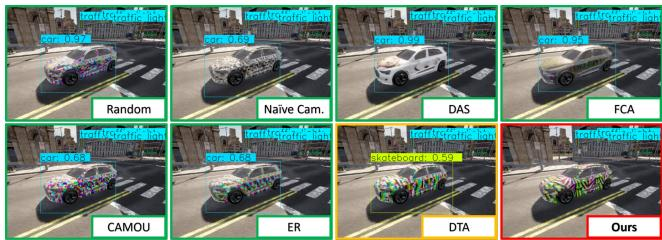  
Figure 4: Attack comparison samples. Zoom for detail.

We also provide the model prediction sample of the compared methods in Fig. 4, showing the model can still correctly predict Random, DAS, and FCA textured cars with high detection scores. FCA failure illustrates the importance of considering physical parameters, as the car’s metallic material may cause light reflections that can hide the texture. Naive, CAMOU, and ER decrease the detection score, but still insufficiently to result in misclassification. Alternatively, DTA texture does misclassify the object, but nowhere near our method, which renders the car undetected.

Fig. 5 shows the summarized performance of each camera pose; values are car AP@0.5, averaged from all evaluated models. It visualizes how our method invariably outperforms previous works on all viewing conditions. As implied, our method is relatively stable under various distances compared to other methods. Additionally, we observe that varied camera pitches have a greater impact on attack performance than other poses.

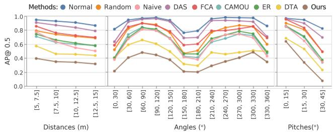  
Figure 5: Attack comparison on different camera poses. Values are AP@0.5 of the car averaged from all models.

Table 4: Universality evaluation where target objects, models, and scenes differ from the training. AP@0.5 (%) of car.
<table><tr><td rowspan="2">Methods</td><td>Single-Stage</td><td></td><td>Two-Stage</td><td>Transformer</td></tr><tr><td>YLv3 YLv7</td><td>DRCN SRCN</td><td>DDTR</td><td>PVT</td></tr><tr><td>Normal</td><td>85.98 92.54</td><td>83.20</td><td>82.55 83.83</td><td>88.59</td></tr><tr><td>Random</td><td>66.93 85.65</td><td>69.59</td><td>70.43 47.77</td><td>78.42</td></tr><tr><td>Naive Cam.</td><td>60.73 69.62</td><td>55.68</td><td>64.08 49.91</td><td>67.45</td></tr><tr><td>UPC [16]</td><td>83.48 90.00</td><td>80.58</td><td>78.36 73.64</td><td>86.61</td></tr><tr><td>CAMOU [45]</td><td>60.19 82.67</td><td>63.78</td><td>62.93 33.33</td><td>68.77</td></tr><tr><td>ER [41]</td><td>58.90 82.18</td><td>62.06</td><td>62.54</td><td>37.34 73.96</td></tr><tr><td>DTA [30]</td><td>32.24 59.39</td><td>45.72</td><td>43.68</td><td>19.43 56.05</td></tr><tr><td>Ours</td><td>22.55 41.55</td><td>30.38</td><td>42.00</td><td>14.69 51.54</td></tr></table>

## 4.3. Universality Evaluations

Transferability Comparison on Different Settings. For this experiment, we use various brand-new models, including YOLOv7 (YLv7) [34], Dynamic R-CNN (DRCN) [44], Sparse R-CNN (SRCN) [29], Deformable DETR (DDTR) [46], and Pyramid Vision Transformer (PVT) [40] to evaluate transferability over diverse modern architectures. All models are considered black-box except for YOLOv3 [25], used for texture generation in the previous section. The results of car AP@0.5 are presented in Tab. 4, showing that our method has the best performance on all models. It is interesting to see that YOLOv7 is so robust that Random, UPC [16], CAMOU, and ER can only slightly reduce the car AP@0.5. Nevertheless, even in the black-box setting, our method can significantly reduce the YOLOv7 performance. More surprisingly, our attack method is robust even in the case of the Transformer-based vision models, although they are generally known to be more resilient to adversarial attacks than CNNs and have low transferability from CNNs [23, 5, 3]. Considering most studies claiming their robustness only conduct digital attack experiments, it is a discovery that transformer-based model can be vulnerable to physical attacks such as our adversarial camouflage. This indicates our method is also model-agnostic.

Fig. 6 displays the sample prediction results of YOLOv7 on evaluated methods. The model can correctly predict naive camouflage, UPC, CAMOU, and ER textured cars, but with consistently higher detection scores compared to previous evaluations. One of the DTA-textured cars results in misclassification, but the other is still detected correctly with a fairly low detection score. It is different from ours, which consistently makes the cars undetected, further verifying the universality of our method as instance-agnostic.

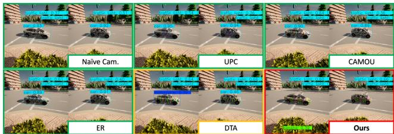  
Figure 6: Transferability to different settings. Zoom in.

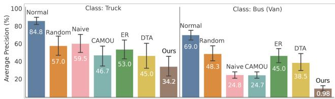  
Figure 7: Transferability to different class (Truck and Bus).

Transferability Comparison on Different Class. We evaluate the textures when applied to different classes (i.e., truck and bus), use all evaluated models in the last experiment, and group the result in Fig. 7. As shown, our method constantly outperforms others, demonstrating that ACTIVE is class-agnostic, thanks to our stealth loss that considers all instead of specific class labels during optimization.

Transferability Comparison on Different Task. We further evaluate all methods’ universality by testing the generated texture on a publicly available pretrained segmentation model: MaX-DeepLab-L [37] and Axial-DeepLab [38] with SWideRNet [9] Backbone. We test on both Cityscape [10] and COCO [20] pretrained models, and exclude highpitch cameras because the Cityscape dataset only uses lowpitch data. Furthermore, we only evaluate the pixel accuracy (%) of the car label to show how the texture can downgrade the prediction of the target object. Again, the experiment result in Tab. 5 shows that our method significantly outperforms the previous works. Additionally, Fig. 8 visualizes the sample of how our method makes the car invisible from the segmentation model (either predicted as road or ignored), while other methods correctly predict as car, which also confirms our method produces task-agnostic texture.

Transferability to Real World. Following [30], we conduct a real-world evaluation by constructing two 1:10- scaled Tesla Model 3s with a 3D printer and wrapping the texture onto the body of the car: one for a normal and another for our camouflaged car targeting YOLOv3. Fig. 9 shows the normal car model is well detected, whereas the adversarial camouflaged car model is not detected as a car at all. Furthermore, we also evaluate practical real-time object detectors widely used in the real world to show that our method transfers to the real-world (i.e., domain-agnostic): MobileNetV2 (MbNetv2) [27], EfficientDet-D2 (EfDetD2) [31], YOLOX-L (YLX-L) [13], YOLOv7 (YLv7) [34], and also the target model, YOLOv3 (YLv3), shown in Tab. 6.

Table 5: Universality evaluation on a different task (i.e., Segmentation Model). Values are pixel accuracy (%) of car.
<table><tr><td rowspan="2">Methods</td><td colspan="2">Cityscape Pretrained</td><td>COCO Pretrained</td></tr><tr><td>MaX-DL-L</td><td>Axl-DL-SW</td><td>MaX-DL-L</td></tr><tr><td>Normal</td><td>90.70</td><td>92.76</td><td>89.77</td></tr><tr><td>Random</td><td>78.20</td><td>88.24</td><td>81.68</td></tr><tr><td>Naive Cam.</td><td>50.23</td><td>74.78</td><td>64.11</td></tr><tr><td>UPC [16]</td><td>74.70</td><td>83.66</td><td>75.85</td></tr><tr><td>CAMOU [45]</td><td>62.12</td><td>71.66</td><td>64.18</td></tr><tr><td>ER [41]</td><td>71.55</td><td>85.70</td><td>71.17</td></tr><tr><td>DTA [30]</td><td>31.53</td><td>55.68</td><td>32.85</td></tr><tr><td>Ours</td><td>17.45</td><td>32.04</td><td>23.46</td></tr></table>

Labels:RoadSidewalkBuildingPoleVegetationTerrainSkyCarIgnore  
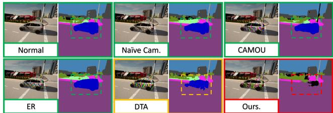  
Figure 8: Transferability to segmentation model. Zoom in.

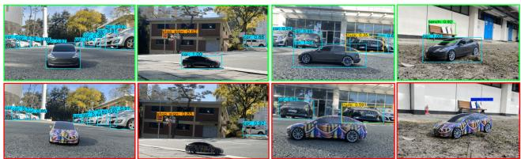  
Figure 9: Real-world evaluation using two scaled cars. The upper row is the normal car model, while the bottom row is the adversarial camouflaged car model. Zoom for detail.

Table 6: AP@0.5 (%) of target car in real-world evaluation.
<table><tr><td rowspan="2">Methods</td><td colspan="5">Real-time Object Detector</td></tr><tr><td>YLv3</td><td>MbNetv2</td><td>EfDetD2</td><td>YLX-L</td><td>YLv7</td></tr><tr><td>Normal</td><td>90.83</td><td>80.83</td><td>96.25</td><td>96.25</td><td>95.00</td></tr><tr><td>Ours</td><td>8.75</td><td>26.27</td><td>26.25</td><td>40.41</td><td>48.75</td></tr></table>

## 4.4. Ablation Study

Impact of Proposal on Performance and Naturalness. We evaluated our proposed components, including modules and losses, using ablation studies with default parameters. We used DTA [30] as a baseline since our approach has a similar pipeline. The results in Table 7 demonstrate that each of our proposed components plays a crucial role in enhancing the attack performance. Specifically, utilizing both

Table 7: Ablation study for each proposed module and loss.
<table><tr><td rowspan="2">Proposed Losses (YLv3 - Car AP@.5)</td><td colspan="5">Proposed Modules (Normal Car: 93.01)</td></tr><tr><td>Raw</td><td>w/TPM</td><td>w/ROA</td><td>Full</td><td>Avg. (Std.)</td></tr><tr><td>Latk (DTA [30])</td><td>60.48</td><td>48.21</td><td>48.43</td><td>24.66</td><td>45±15</td></tr><tr><td>Latk (Stealth Loss)</td><td>60.13</td><td>43.70</td><td>38.85</td><td>22.48</td><td>41±15</td></tr><tr><td> $L _ { a t k } + L _ { s m }$ </td><td>58.90</td><td>43.36</td><td>36.00</td><td>20.21</td><td>39±16</td></tr><tr><td> $L _ { a t k } + L _ { c m }$ </td><td>56.17</td><td>42.04</td><td>38.66</td><td>24.34</td><td>40±13</td></tr><tr><td> ${ L _ { a t k } + L _ { s m } + L _ { c m } }$ </td><td>57.81</td><td>50.87</td><td>40.70</td><td>28.22</td><td>44±13</td></tr><tr><td>Avg. (Std.)</td><td>59±2</td><td>46±4</td><td>41±5</td><td>24±3</td><td></td></tr></table>

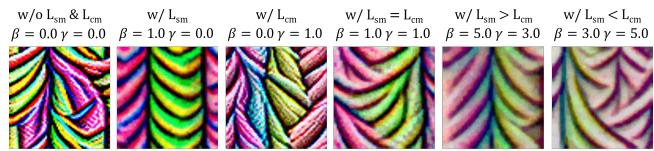  
Figure 10: Visual textures comparison with different losses.

TPM and ROA modules significantly impacts performance enhancement, with an average improvement of 35%.

Although our proposed losses have a lesser impact on performance, they play an important role in texture naturalness, leading to trade-offs between the two. As illustrated in Fig. 10, omitting $L _ { s m }$ outputs a rough texture, whereas excluding $L _ { c m }$ makes it more colorful and bright. Employing the stealth loss with only smooth loss yields the best performance, downgrading the car AP@0.5 to 20.21%. More details are available in Supplementary Materials.

## 5. Discussions

Societal Implications. Adversarial camouflage poses harmful repercussions for self-driving cars since there exists a highly feasible attack scenario, e.g., legally painting cars with adversarial texture [45, 30]. Enhancements in robustness and universality by ACTIVE can amplify the danger as existing public detectors are still highly vulnerable, signifying the importance of research in model robustness.

Limitation. Even though ACTIVE produces a more natural pattern similar to graffiti, the texture is still abstract.

## 6. Conclusion

We have presented ACTIVE, a physical camouflage attack framework for 3D objects for enhanced universality and robustness. Verified in our comprehensive evaluations, ACTIVE surpasses the performance of existing works —and notably, demonstrates its capability as a model, instance, class, task, and domain-agnostic framework.

Acknowledgments. This work was supported by the Agency For Defense Development Grant Funded by the Korean Government (UE221150WD), and by the MSIT (Ministry of Science and ICT), Korea, under the Convergence security core talent training business (Pusan National University) support program (IITP-2023-2022-0-01201) supervised by the IITP (Institute for Information & Communications Technology Planning & Evaluation).

## References

[1] Mart´ın Abadi, Ashish Agarwal, Paul Barham, Eugene Brevdo, Zhifeng Chen, Craig Citro, Greg S. Corrado, Andy Davis, Jeffrey Dean, Matthieu Devin, Sanjay Ghemawat, Ian Goodfellow, Andrew Harp, Geoffrey Irving, Michael Isard, Yangqing Jia, Rafal Jozefowicz, Lukasz Kaiser, Manjunath Kudlur, Josh Levenberg, Dandelion Mane, Rajat Monga,´ Sherry Moore, Derek Murray, Chris Olah, Mike Schuster, Jonathon Shlens, Benoit Steiner, Ilya Sutskever, Kunal Talwar, Paul Tucker, Vincent Vanhoucke, Vijay Vasudevan, Fernanda Viegas, Oriol Vinyals, Pete Warden, Martin Watten-´ berg, Martin Wicke, Yuan Yu, and Xiaoqiang Zheng. Tensor-Flow: Large-scale machine learning on heterogeneous systems, 2015. Software available from tensorflow.org. 5

[2] Naveed Akhtar and Ajmal Mian. Threat of adversarial attacks on deep learning in computer vision: A survey. IEEE Access, 6:14410–14430, 2018. 1

[3] Ahmed Aldahdooh, Wassim Hamidouche, and Olivier Deforges. Reveal of vision transformers robustness against adversarial attacks. arXiv preprint arXiv:2106.03734, 2021. 7

[4] Anish Athalye, Logan Engstrom, Andrew Ilyas, and Kevin Kwok. Synthesizing robust adversarial examples. In International conference on machine learning, pages 284–293. PMLR, 2018. 2, 4

[5] Philipp Benz, Soomin Ham, Chaoning Zhang, Adil Karjauv, and In So Kweon. Adversarial robustness comparison of vision transformer and mlp-mixer to cnns. arXiv preprint arXiv:2110.02797, 2021. 7

[6] Tom B. Brown, Dandelion Mane, Aurko Roy, Mart ´ ´ın Abadi, and Justin Gilmer. Adversarial patch. CoRR, abs/1712.09665, 2017. 1, 3

[7] Nicolas Carion, Francisco Massa, Gabriel Synnaeve, Nicolas Usunier, Alexander Kirillov, and Sergey Zagoruyko. End-toend object detection with transformers. In European conference on computer vision, pages 213–229. Springer, 2020. 1

[8] Junyi Chai, Hao Zeng, Anming Li, and Eric W.T. Ngai. Deep learning in computer vision: A critical review of emerging techniques and application scenarios. Machine Learning with Applications, 6:100134, 2021. 1

[9] Liang-Chieh Chen, Huiyu Wang, and Siyuan Qiao. Scaling wide residual networks for panoptic segmentation. arXiv:2011.11675, 2020. 7

[10] Marius Cordts, Mohamed Omran, Sebastian Ramos, Timo Rehfeld, Markus Enzweiler, Rodrigo Benenson, Uwe Franke, Stefan Roth, and Bernt Schiele. The cityscapes dataset for semantic urban scene understanding. In Proc. of the IEEE Conference on Computer Vision and Pattern Recognition (CVPR), 2016. 7

[11] Alexey Dosovitskiy, German Ros, Felipe Codevilla, Antonio Lopez, and Vladlen Koltun. CARLA: An open urban driving simulator. In Proceedings of the 1st Annual Conference on Robot Learning, pages 1–16, 2017. 5

[12] Epic Games. Unreal engine. 5

[13] Zheng Ge, Songtao Liu, Feng Wang, Zeming Li, and Jian Sun. Yolox: Exceeding yolo series in 2021. arXiv preprint arXiv:2107.08430, 2021. 8

[14] Kaiming He, Georgia Gkioxari, Piotr Dollar, and Ross Gir-´ shick. Mask r-cnn. In Proceedings ofthe IEEE international conference on computer vision, pages 2961–2969, 2017. 6

[15] Gao Huang, Zhuang Liu, Laurens Van Der Maaten, and Kilian Q Weinberger. Densely connected convolutional networks. In Proceedings of the IEEE conference on computer vision and pattern recognition, pages 4700–4708, 2017. 5

[16] Lifeng Huang, Chengying Gao, Yuyin Zhou, Changqing Zou, Cihang Xie, Alan L. Yuille, and Ning Liu. UPC: learning universal physical camouflage attacks on object detectors. In CVPR, volume abs/1909.04326, 2019. 2, 3, 7, 8

[17] Qi Jia, Ziqiang Lin, Jianghua Hu, Jun Liu, Liyan Zhu, and Junyu Liu. Design and evaluation of facial camouflage pattern. In Proceedings of the 2019 International Conference on Artificial Intelligence and Computer Science, AICS 2019, page 818–821, New York, NY, USA, 2019. Association for Computing Machinery. 5

[18] Hiroharu Kato, Yoshitaka Ushiku, and Tatsuya Harada. Neural 3d mesh renderer. In Proceedings ofthe IEEE conference on computer vision and pattern recognition, pages 3907– 3916, 2018. 6

[19] Diederik P Kingma and Jimmy Ba. Adam: A method for stochastic optimization. arXiv preprint arXiv:1412.6980, 2014. 5

[20] Tsung-Yi Lin, Michael Maire, Serge J. Belongie, Lubomir D. Bourdev, Ross B. Girshick, James Hays, Pietro Perona, Deva Ramanan, Piotr Dollar, and C. Lawrence Zitnick. Microsoft´ COCO: common objects in context. CoRR, abs/1405.0312, 2014. 7

[21] Wei Liu, Dragomir Anguelov, Dumitru Erhan, Christian Szegedy, Scott Reed, Cheng-Yang Fu, and Alexander C Berg. Ssd: Single shot multibox detector. In European conference on computer vision, pages 21–37. Springer, 2016. 6

[22] Aravindh Mahendran and Andrea Vedaldi. Understanding deep image representations by inverting them. In CVPR, pages 5188–5196. IEEE Computer Society, 2015. 4

[23] Kaleel Mahmood, Rigel Mahmood, and Marten Van Dijk. On the robustness of vision transformers to adversarial examples. In Proceedings ofthe IEEE/CVF International Conference on Computer Vision, pages 7838–7847, 2021. 7

[24] Kris Nicholson and Ashish Naicker. Gpu based algorithms for terrain texturing. 2008. 3

[25] Joseph Redmon and Ali Farhadi. Yolov3: An incremental improvement. arXiv preprint arXiv:1804.02767, 2018. 6, 7

[26] Shaoqing Ren, Kaiming He, Ross Girshick, and Jian Sun. Faster r-cnn: Towards real-time object detection with region proposal networks. Advances in neural information processing systems, 28, 2015. 6

[27] Mark Sandler, Andrew Howard, Menglong Zhu, Andrey Zhmoginov, and Liang-Chieh Chen. Mobilenetv2: Inverted residuals and linear bottlenecks. In Proceedings of the IEEE conference on computer vision and pattern recognition, pages 4510–4520, 2018. 8

[28] Mahmood Sharif, Sruti Bhagavatula, Lujo Bauer, and Michael K. Reiter. Accessorize to a crime: Real and stealthy attacks on state-of-the-art face recognition. In Proceedings of

the 2016 ACM SIGSAC Conference on Computer and Communications Security, CCS ’16, page 1528–1540, New York, NY, USA, 2016. Association for Computing Machinery. 5

[29] Peize Sun, Rufeng Zhang, Yi Jiang, Tao Kong, Chenfeng Xu, Wei Zhan, Masayoshi Tomizuka, Lei Li, Zehuan Yuan, Changhu Wang, et al. Sparse r-cnn: End-to-end object detection with learnable proposals. In Proceedings of the IEEE/CVF conference on computer vision and pattern recognition, pages 14454–14463, 2021. 7

[30] Naufal Suryanto, Yongsu Kim, Hyoeun Kang, Harashta Tatimma Larasati, Youngyeo Yun, Thi-Thu-Huong Le, Hunmin Yang, Se-Yoon Oh, and Howon Kim. Dta: Physical camouflage attacks using differentiable transformation network. In Proceedings of the IEEE/CVF Conference on Computer Vision and Pattern Recognition (CVPR), pages 15305–15314, June 2022. 1, 2, 3, 5, 6, 7, 8

[31] Mingxing Tan, Ruoming Pang, and Quoc V Le. Efficientdet: Scalable and efficient object detection. In Proceedings of the IEEE/CVF conference on computer vision and pattern recognition, pages 10781–10790, 2020. 8

[32] Simen Thys, Wiebe Van Ranst, and Toon Goedeme. Fool-´ ing automated surveillance cameras: adversarial patches to attack person detection. CoRR, abs/1904.08653, 2019. 1

[33] Alexander Toet and Maarten A. Hogervorst. Review of camouflage assessment techniques. In Karin U. Stein and Ric Schleijpen, editors, Target and Background Signatures VI, volume 11536, page 1153604. International Society for Optics and Photonics, SPIE, 2020. 4

[34] Chien-Yao Wang, Alexey Bochkovskiy, and Hong-Yuan Mark Liao. Yolov7: Trainable bag-of-freebies sets new state-of-the-art for real-time object detectors. arXiv preprint arXiv:2207.02696, 2022. 1, 7, 8

[35] Donghua Wang, Tingsong Jiang, Jialiang Sun, Weien Zhou, Zhiqiang Gong, Xiaoya Zhang, Wen Yao, and Xiaoqian Chen. Fca: Learning a 3d full-coverage vehicle camouflage for multi-view physical adversarial attack. In Proceedings of the AAAI Conference on Artificial Intelligence, volume 36, pages 2414–2422, 2022. 1, 2, 3, 5, 6

[36] Donghua Wang, Wen Yao, Tingsong Jiang, Guijiang Tang, and Xiaoqian Chen. A survey on physical adversarial attack in computer vision, 2022. 1

[37] Huiyu Wang, Yukun Zhu, Hartwig Adam, Alan Yuille, and Liang-Chieh Chen. Max-deeplab: End-to-end panoptic segmentation with mask transformers. In Proceedings of the IEEE/CVF conference on computer vision and pattern recognition, pages 5463–5474, 2021. 7

[38] Huiyu Wang, Yukun Zhu, Bradley Green, Hartwig Adam, Alan Yuille, and Liang-Chieh Chen. Axial-deeplab: Standalone axial-attention for panoptic segmentation. In European Conference on Computer Vision, pages 108–126. Springer, 2020. 7

[39] Jiakai Wang, Aishan Liu, Zixin Yin, Shunchang Liu, Shiyu Tang, and Xianglong Liu. Dual attention suppression attack: Generate adversarial camouflage in physical world. In 2021 IEEE/CVF Conference on Computer Vision and Pattern Recognition (CVPR), pages 8561–8570, 2021. 2, 3, 5, 6

[40] Wenhai Wang, Enze Xie, Xiang Li, Deng-Ping Fan, Kaitao Song, Ding Liang, Tong Lu, Ping Luo, and Ling Shao. Pyramid vision transformer: A versatile backbone for dense prediction without convolutions. In Proceedings of the IEEE/CVF International Conference on Computer Vision, pages 568–578, 2021. 7

[41] Tong Wu, Xuefei Ning, Wenshuo Li, Ranran Huang, Huazhong Yang, and Yu Wang. Physical adversarial attack on vehicle detector in the carla simulator. CoRR, abs/2007.16118, 2020. 2, 3, 6, 7, 8

[42] Houdi Xiao, Zhipeng Qu, Mingyun Lv, Yi Jiang, Chuanzhi Wang, and Ruiru Qin. Fast self-adaptive digital camouflage design method based on deep learning. Applied Sciences, 10(15), 2020. 5

[43] Heng Fu Yang and Jian Ping Yin. An adaptive digital camouflage scheme using visual perception and k-mean clustering. In Research in Materials and Manufacturing Technologies, volume 834 of Advanced Materials Research, pages 1091– 1094. Trans Tech Publications Ltd, 1 2014. 5

[44] Hongkai Zhang, Hong Chang, Bingpeng Ma, Naiyan Wang, and Xilin Chen. Dynamic r-cnn: Towards high quality object detection via dynamic training. In European conference on computer vision, pages 260–275. Springer, 2020. 7

[45] Yang Zhang, Hassan Foroosh, Philip David, and Boqing Gong. Camou: Learning physical vehicle camouflages to adversarially attack detectors in the wild. In International Conference on Learning Representations, 2018. 2, 3, 6, 7, 8

[46] Xizhou Zhu, Weijie Su, Lewei Lu, Bin Li, Xiaogang Wang, and Jifeng Dai. Deformable {detr}: Deformable transformers for end-to-end object detection. In International Conference on Learning Representations, 2021. 7