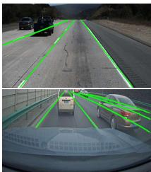
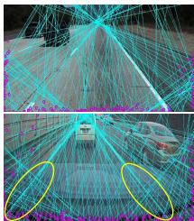
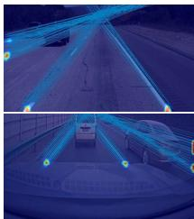
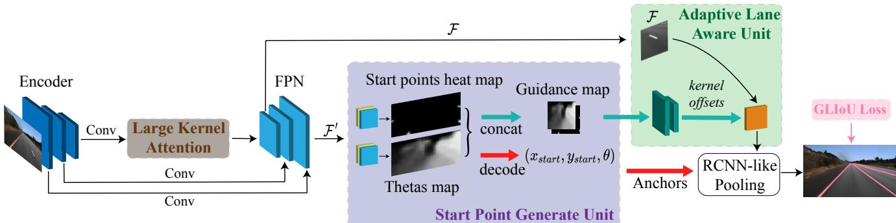
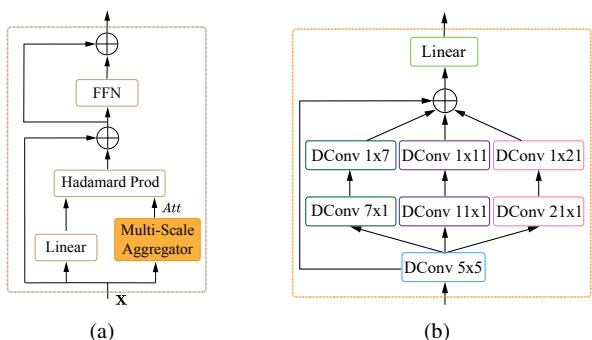
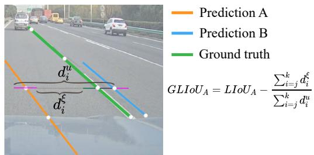
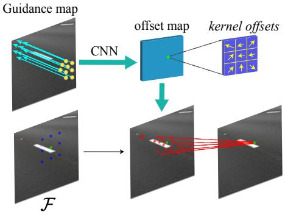
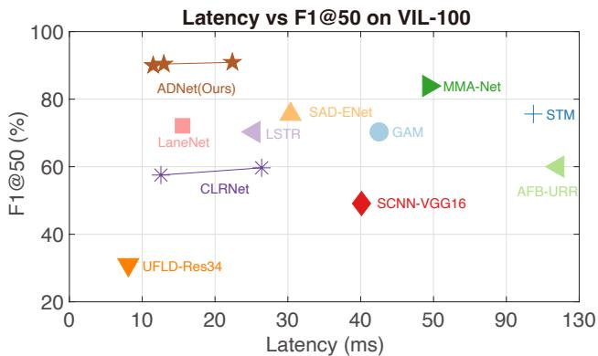
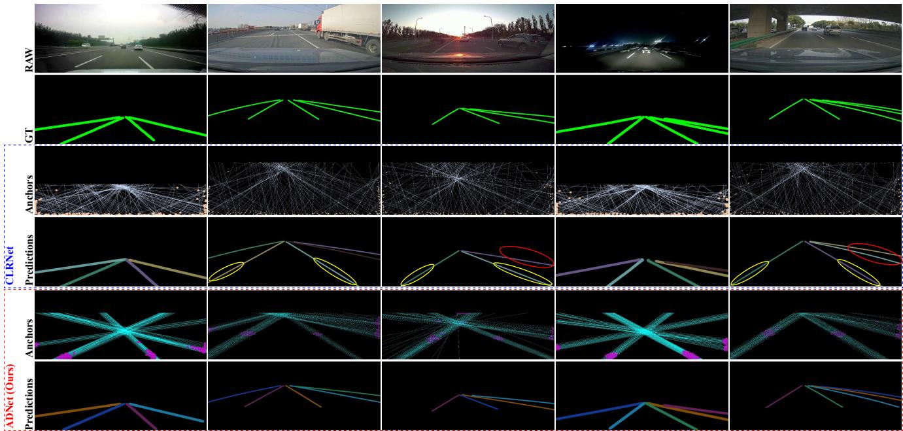

# ADNet: Lane Shape Prediction via Anchor Decomposition

Lingyu Xiao †, Xiang Li ‡, Sen Yang †, Wankou Yang †\*

† School of Automation, Southeast University, China ‡ IMPlus@PCALab, VCIP, CS, Nankai University, China

lyhsiao@seu.edu.cn, xiang.li.implus@njust.edu.cn, {yangsenius, wkyang}@seu.edu.cn

## Abstract

In this paper, we revisit the limitations of anchor-based lane detection methods, which have predominantly focused onfixed anchors that stemfrom the edges ofthe image, disregarding their versatility and quality. To overcome the inflexibility of anchors, we decompose them into learning the heat map of starting points and their associated directions. This decomposition removes the limitations on the starting point of anchors, making our algorithm adaptable to different lane types in various datasets. To enhance the quality of anchors, we introduce the Large Kernel Attention (LKA) for Feature Pyramid Network (FPN). This significantly increases the receptive field, which is crucial in capturing the sufficient context as lane lines typically run throughout the entire image. We have named our proposed system the Anchor Decomposition Network (ADNet). Additionally, we propose the General Lane IoU (GLIoU) loss, which significantly improves the performance of ADNet in complex scenarios. Experimental results on three widely used lane detection benchmarks, VIL-100, CU-Lane, and TuSimple, demonstrate that our approach outperforms the state-of-the-art methods on VIL-100 and exhibits competitive accuracy on CULane and TuSimple. Code and models will be released on https://github.com/ Sephirex-X/ADNet.

## 1. Introduction

Recently, the utilisation of artificial intelligence technology for the field of autonomous driving has drawn large attention from academia and industry. As a crucial part of autonomous driving system, Advance Driver Assistance System (ADAS) requires vehicles to respond timely and accurately to changes in the environment. Lane line is a vital part of the vehicle sensing the environment, as the ADAS needs the shape of lane lines to keep the vehicle on track.

  
(a) Annotations

  
(b) Traditional

  
(c) Ours  
Figure 1: Illustration of different dynamic anchor proposal methods. (a) illustrates two common lane prediction scenarios. In the first row, the lane lines originate from the edges of the image, while in the second row, the lane lines can emanate from any location within the image. (b) proposes anchor dispersedly [49], resulting in low anchor quality. This anchor proposal method is adequate on first row scenarios but oversimplistic on the second (emphasised by yellow oval). The points and lines represent start points and anchors respectively. (c) we propose anchor concentratively, possible start points are shown on activation map, anchors can merge from the whole image, which ensures anchor quality and flexibility.

With the advancement of CNN, recent studies on lane shape detection have made great progress on either accuracy [35, 40, 49] or real-time performance [31, 32, 24]. Anchor-based methods have shown superior accuracy and efficiency compared to other methods on popular benchmarks such as [29, 2, 37]. However there are still challenges to the wide application of anchor-based methods.

The first issue is the flexibility of anchors. Previous anchor-based methods [35, 21, 49, 31] have posited that lane lines can only originate from the three edges of an image (left, bottom, right). While this assumption leverages prior information of lane lines to achieve favourable accuracy and speed, it is oversimplistic as lane lines do not always start from the three edges due to the obstructions such as vehicles in adjacent lanes or a vehicle’s front hood (shown on Figure 1(a)).

Another problem is the low quality of anchors. Anchorbased methods [21, 35] usually employ an approach of fixed anchors, while recent method [49] adopt a dynamic approach with dispersed anchor prediction. This dispersed prediction (shown on Figure 1(b)) is possibly unreliable when the camera resolution is varying, particularly in cases where lane lines do not start from the edges. Additionally, the inherent physical characteristics of lane lines, such as their slenderness and continuity, presenting significant challenges in capturing their geometric features. However, most existing approaches are limited in small kernel sizes which present an obstacle to accurately capture the whole feature descriptors of lane lines.

In this paper, to address these problems, we introduce Anchor Decomposition Network (ADNet). Specifically, to make anchors flexible, we propose Start Point Generate Unit (SPGU) which decomposes them into predicting the position of the start points and its associated direction on a global scale by the probability map (heat map). To enhance anchors’ quality, we realise the crucial role of large receptive in capturing slender and continue lane lines. Therefore we introduce a Large Kernel Attention (LKA) module and integrate it with the Feature Pyramid Network (FPN). Since we predict anchors in a concentrative way (shown in Figure 1(c)), the location is invariant to the density of validated pixels and thus the anchors’ quality and flexibility can be mutually guaranteed.

We conduct extensive experiments on three lane detection benchmarks: VIL-100 [47], CULane [29] and TuSimple [37]. Comparing along with state-of-art methods, our approach shows excellent performance on all datasets. In particular, on VIL-100 dataset where segmentation-based methods always perform superior to the anchor/keypointbased counterparts, our framework outperforms all existing state-of-art methods, making the anchor-based method a more generalised pipeline. The main contributions of this paper are summarised as :

• We emphasise the importance of anchor flexibility for the anchor-based approaches by explicitly decomposed learning of the heat map of starting points and their associated directions. The decomposition makes our algorithm adaptable to different lane types in more scenarios.

• To our best knowledge, we are the first to investigate the effectiveness of Large Kernel mechanism on lane detection task to guarantee the anchor quality, as the lane lines usually cover the entire image which often require significantly large context to be accurately captured.

• We rethink the limitations of LIoU loss and propose our own General Line IoU (GLIoU) loss tailor for anchor-based lane detection method on complex scenarios. Furthermore, we utilise the explicit physical modelling by anchor decomposition to guide the learning of kernel offsets in the proposed Adaptive Lane Aware Unit (ALAU).

• Experiments on main benchmarks show excellent trade-offs on performance and speed compared with SOTA methods, outperforming all recent methods on VIL-100 dataset.

## 2. Related Work

## 2.1. Segmentation-based methods

In segmentation-based methods, the task of identifying lane lines has been converted to a per-pixel prediction task. [29] first introduces a spatial mechanism passing messages between pixels row-wise and column-wise that fails to perform in real time. [48] further proposes a recurrent aggregator fully utilised lane shape priors to obtain better performance. On [1], additional affinity fields are predicted simultaneously with the binary segmentation map, which is used in the decoder to cluster lane pixels. Segmentationbased method can achieve high accuracy when lane lines are visible, but it’s unstable in complex traffic scenarios and inefficient.

## 2.2. Anchor-based methods

Anchor-based & detection-based methods define lane lines in a similar way. They divide an image into slices or cells, and then convert the lane detection task into either offsets’ regression on each slice or a row-wise classification task. [31] first predicts lane lines via a simple linear layer using row-wise classification. [21] improves the representation of lane lines by converting cell representation into anchor representation, and identifying lane shape through regression of the offsets on every slice between anchors and ground truth. [35] further enhances this formulation by adding anchor-based pooling and a lane attention mechanism to it. [32] proposes a hybrid anchor system to improve the performance of UFLD. [24] proposes a conditional convolution and RIM migration to solve the instancelevel discrimination problem on lane detection. [49] develops ROIGather to fuse lane context from different layers and, for the first time, changes the anchor-based formulation into an anchor-free manner, achieving state-of-the-art performance on multiple benchmarks.

Anchor-based and detection-based methods heavily rely on the position of anchors. On one hand, this can bring higher accuracy since anchors contain prior information on lane lines. On the other hand, these inherent properties lead to some shortcomings, such as the starting point of the anchor may not always be located on the three edges of the image, limiting its application.

  
Figure 2: Overview of our ADNet. Lane context first extracted by the encoder and enhanced by FPN embedded with Large Kernel Attention (LKA), which plants after FPN’s lateral layer to reduce computation cost. Then, low-level context ${ \mathcal { F } } ^ { \prime }$ is delivered into Start Point Generate Unit (SPGU) to generate start point guided anchors and guidance map, while high-level context $\mathcal { F }$ is further aggregated through Adaptive Lane Aware Unit (ALAU) with the help of the auxiliary guidance map. After pooling, we optimise lane lines via General Lane IoU loss.

## 2.3. Keypoint-based methods

Keypoint-based methods treat lane lines’ prediction as a key point estimation task. Usually, the algorithm will first predict all the possible key points that most likely belong to lane lines, and follow up with a post-process of assigning different points to different lanes. [19] predicts key points on lane lines and distinguishes each instance by embedding features of predicted points. [33] predicts local key points in a bottom-up manner and refiners key points’ location via its offsets between adjacent points. [40] clusters points via offsets between key points and start points, and a modified deformable convolution network [4] to extract holistic lane features. Lane instances are predicted by keypoint-based methods via low-efficient post-processing of key points from the heat map, moreover, the accuracy of the algorithm highly relies on the resolution of the input image, together with time-consuming post-processing, making keypoint-based methods hard to strike a balance between latency and accuracy.

## 3. Approach

The overall structure is illustrated in Figure 2. Our algorithm contains four parts: Start Point Generate Unit (SPGU), Adaptive Lane Aware Unit (ALAU), General Lane IoU loss and Large Kernel Attention (LKA).

## 3.1. Start point generate unit

Motivation. On lane shape detection tasks, predefined anchors have direct affection toward the anchor-based & detection-based method [35, 21]. Literature like [49, 3] perform in an anchor-free manner but they work under the assumption that lane line rays from three edges of the image, therefore, limiting its application.

Structure. The ultimate goal is to form an anchor by predicting the start point location and theta given downsampled feature map $\dot { \mathcal { F } ^ { \prime } } \in \mathbb { R } ^ { H _ { f } ^ { \prime } \times W _ { f } ^ { \prime } }$ , which can be formulated as $p ( x _ { s t a r t } , y _ { s t a r t } , \theta | \mathcal { F } ^ { \prime } )$ . Like most of the Keypoint-based detection framework [20, 50, 8, 44], we aim to predict the start point for each lane on the image by estimating the possibility of a start point on a certain region of the downsampled heat map. Additionally, we observe that the theta of the anchor is closely associated with the start point in terms of spatial relation [39], according to the Bayes’ theorem, its location and shape can be decomposed as:

$$
p ( x _ { s t a r t } , y _ { s t a r t } , \theta | \mathcal { F } ^ { \prime } ) = p ( x _ { s t a r t } , y _ { s t a r t } | \mathcal { F } ^ { \prime } ) p ( \theta | x _ { s t a r t } , y _ { s t a r t } , \mathcal { F } ^ { \prime } ) .\tag{1}
$$

During the training phase, we generate a supervision heat map by adding a non-normalised Gaussian kernel to each ground truth start points:

$$
\begin{array} { r } { H _ { g t } ^ { p t s } ( x , y ) = e x p ( - \frac { ( x - x _ { g t } ^ { s t a r t } ) ^ { 2 } + ( y - y _ { g t } ^ { s t a r t } ) ^ { 2 } } { 2 \sigma ^ { 2 } } ) , \ H _ { g t } \in \mathbb { R } ^ { H _ { f } ^ { \prime } \times W _ { f } ^ { \prime } } , } \end{array}\tag{2}
$$

$x , y$ is the coordinate of pixels on $H _ { g t } ^ { p t s } ; ~ x _ { g t } ^ { s t a r t } , y _ { g t } ^ { s t a r t }$ is ground truth start point’s coordinate; σ is a hyperparameter. Then supervision for theta map $H _ { g t } ^ { \theta } ( x , y )$ can be formulated as:

$$
H _ { g t } ^ { \theta } ( x , y ) = i n d e x ( H _ { g t } ^ { p t s } ( x , y ) > t _ { \theta } ) \cdot \theta ( x _ { g t } ^ { s t a r t } , y _ { g t } ^ { s t a r t } ) .\tag{3}
$$

We can interpret this as follows: if the probability of start points in a particular region is greater than $t _ { \theta } .$ , we consider that region to share the same $\theta$ as the ground truth start point. Unlike a strict assumption of one-point-one-theta, our approach expands the potential occurrence area of proposal anchors, providing a wealth of high-quality anchors for regression. This allows neural networks to determine the best fit under different conditions, without needing to add an additional loss to compensate for the offset between points on the heat map and the original image due to downsampling [40].

  
Figure 3: Illustration of LKA. LKA can be seen as the combination of (a) attention mechanism and (b) Multi-Scale $\mathrm { A g \mathrm { - } }$ gregator (MSA) .

We modified [23] to meet the imbalance between start point regions and the non-start point regions:

$$
\begin{array} { r } { \mathcal { L } _ { h m } = \frac { - 1 } { H _ { f } ^ { \prime } \times W _ { f } ^ { \prime } } \sum _ { x y } \left\{ { ( 1 - H _ { p r e d } ^ { p t s } ) ^ { \alpha } l o g ( H _ { g t } ^ { p t s } ) } \begin{array} { l l } { H _ { g t } ^ { p t s } = 1 } \\ { ( 1 - H _ { g t } ^ { p t s } ) ^ { \beta } ( H _ { p r e d } ^ { p t s } ) ^ { \alpha } l o g ( 1 - H _ { p r e d } ^ { p t s } ) } & { o t h e r w i s e } \end{array} \right. , } \end{array}\tag{4}
$$

$\alpha$ and $\beta$ are hyperparameters of focal loss. Similarly, we modified L1 loss for theta map over the whole feature map:

$$
\mathcal { L } _ { \theta } = \frac { 1 } { H _ { f } ^ { \prime } \times W _ { f } ^ { \prime } } \sum _ { x y } | H _ { p r e d } ^ { \theta } - H _ { g t } ^ { \theta } | .\tag{5}
$$

It is noteworthy that the calculation of theta map loss in the non-start point region is unnecessary due to the uncertainty of their theta values.

## 3.2. Large kernel attention

Motivation. In recent literature [6, 7], it has been observed that the performance of ConvNet is restricted when the kernel size exceeds $7 \times 7 .$ , thereby limiting the potential benefits of mixed Transformer architecture for downstream tasks that require a large receptive field. Building on the work of [15, 11], we devise a Large Kernel Attention (LKA) module integrated with Feature Pyramid Network (FPN) specifically for lane detection.

Design. In Figure 2, it can be seen that our LKA module is placed after the lateral layer of FPN to minimise computation cost. Unlike generating a similarity score Att between the query and value outputs, we employ Multi-Scale Aggregator (MSA) to quantify the correlation among input tokens. The mathematical expression of our approach depicted in Figure 3 can be represented as follows:

$$
A t t = \mathbf { W } _ { 1 } ( \sum _ { i = 0 } ^ { 3 } M u l t i C h _ { i } ( D C o n v _ { 5 \times 5 } ( \mathbf { X } ) ) ) ,\tag{6}
$$

$$
{ \bf Z } _ { 1 } = A t t \odot ( { \bf W } _ { 2 } { \bf X } ) + { \bf X } ,\tag{7}
$$

$$
{ \bf Z } = F F N ( { \bf Z } _ { 1 } ) + { \bf Z } _ { 1 } .\tag{8}
$$

  
Figure 4: Illustration of GLIoU. A special scenario that LIoU fails to address properly. We have extended each point on the slice to form lane segments with a certain width $e ,$ and it is evident that the L1 distance between the two segments is significantly larger than what can be captured by LIoU $( L I o U _ { A } = - 0 . 5 , L I o U _ { B } = 0 . 5 ,$ , distance $L _ { 1 } ^ { A } = 6 e$ distance $L _ { 1 } ^ { B } = e )$

In Figure 3(b), the four feed-forward paths are denoted as $M u l t i C h _ { i }$ and are distinguished by different colours, where $M u l t i C h _ { 0 }$ corresponds to an identical forward path. Instead of using a $7 \times 7$ depth-wise convolution, strip-like convolutions are more effective in identifying lane lines while reducing computation cost. The linear layer is represented by $\mathbf { W } _ { i }$ . As suggested in [15], we use Hadamard product (denoted as ⊙ in Eq. (7)) instead of matrix product to leverage the advantages of large kernels in MSA.

## 3.3. General Lane IoU loss

Motivation. Recently, LIoU [49] loss has been proposed to address the problem that the lane shape information on the anchor-based method is considered to be independent for each point when applying L1 loss. Although LIoU loss incorporates information on lane shape into a normalized metric that is invariant to scale, it may not be suitable for infrequent scenarios. Figure 4 depicts a typical scenario that exposes the limitations of LIoU. As shown in Figure $^ { 4 , }$ the LIoU values for Prediction A-Gt and Prediction B-Gt are -0.5 and 0.5, respectively, whereas the L1 distance gap between the two is significantly larger than what LIoU can capture $( d i s t a n c e L _ { 1 } ^ { A } = 6 e $ , distance $L _ { 1 } ^ { B } = e )$ . In other words, Prediction A is substantially worse than Prediction B according to the L1 distance metric, yet LIoU fails to account for this relationship.

Design. To overcome this limitation, we propose General Lane IoU (GLIoU), which can be considered as a generalisation of LIoU, where an additional penalty term is incorporated to highlight the spatial relationship between two lanes that do not overlap. Similar to LIoU, we begin by extending each point to form lane segments with a certain width e and computing the intersection over union ratio as usual. Then, we calculate the L1 distance between each pair of extended segments to obtain a gap distance $d _ { i } ^ { \xi }$

$$
\begin{array} { r } { d _ { i } ^ { \xi } = R e L U ( d _ { i } ^ { u } - 4 e ) . } \end{array}\tag{9}
$$

Using LIoU subtract the ratio of gap distance to the union, which is illustrated as follows:

$$
G L I o U = \frac { \sum _ { i = j } ^ { k } d _ { i } ^ { o } - R e L U ( d _ { i } ^ { u } - 4 e ) } { \sum _ { i = j } ^ { k } d _ { i } ^ { u } } ,\tag{10}
$$

where j represents the index of the first validated point. On Eq. (9) and Eq. (10), $d _ { i } ^ { u }$ and $d _ { i } ^ { o }$ is defined as introduced in [49]. If the prediction overlaps with the ground truth, GLIoU degenerates into LIoU. However, if the prediction does not overlap with the ground truth, we introduce an extra penalty term $\frac { \sum _ { i = j } ^ { k } d _ { i } ^ { \xi } } { \sum _ { i = j } ^ { k } d _ { i } ^ { u } }$ to more accurately capture the L1 distance while still considering the lane as a unified entity.

The GLIoU loss can be defined as:

$$
\mathcal { L } _ { G L I o U } = 1 - G L I o U .\tag{11}
$$

The domain of GLIoU is $( - 2 , 1 ] .$ , when the predicted lane perfectly matches the ground truth, GLIoU equals 1. Although the lower bound of GLIoU is -2, which may seem asymmetric, it is a more appropriate choice for predicting lane shapes since, in most cases, the prediction and ground truth do not perfectly align. Rather than emphasising the overlapped section, the GLIoU loss focuses on improving the poorly overlapped section.

## 3.4. Adaptive lane aware unit

Motivation. The use of traditional convolution networks for lane detection may not be optimal, as they operate on a fixed grid that does not align well with the irregular shape of lane lines. Although the Deformable Convolution Network (DCN) [4] has found extensive application in object detection, its potential for lane detection has not been fully explored [40]. Directly applying DCN to lane detection is challenging, as it is not feasible to learn kernel offsets from high-context lane features. Instead, we observe that start points and their associated thetas can be regarded as an effective guidance to predict kernel offsets due to their explicit physical modelling.

Structure. Once we have obtained the start points coordinates and theta values that are spatially related using SPGU, we encode the thetas heat map and start points heat map with dense lane information, which can be represented as $\boldsymbol { \Theta } _ { x y } = \{ \theta _ { 1 } , \theta _ { 2 } , . . . , \theta _ { N } \}$ and $P _ { x y } = \{ p _ { 1 } , p _ { 2 } , . . . , p _ { N } \}$ respectively, as shown in Figure 5. For instance, we can abstract the task of predicting a set of kernel offsets on one activation unit (green dot) as follows:

$$
\Delta K _ { x y } = \phi ( \vec { v } \cdot p t s ) = \phi ( x , y , \theta ) ,\tag{12}
$$

$$
{ \cal S } = \{ ( - 1 , - 1 ) , ( 0 , - 1 ) , . . . , ( 0 , 1 ) , ( 1 , 1 ) \} ,\tag{13}
$$

$$
\Delta K _ { x y } = \{ \Delta k _ { x y } ^ { i } | i = 1 , . . . , | S | \} .\tag{14}
$$

Let S denote the grid defined by the receptive field size and dilation, and let pts denote the position of the activation unit, with coordinates x and y. Let ⃗v be a unit vector parallel to the spatially nearest anchor, with θ denoting the anchor’s theta value. Let $\Delta K _ { x y }$ be the kernel offsets on pts, where ks is the kernel size and ϕ is a non-linear function. Since the theta value in non-start point regions is uncertain and the anchors’ direction is mutually related, SPGU will automatically learn the theta value that has the highest probability for the region, ensuring the existence of the function $f _ { v } : \Theta _ { x y } \to \vec { v } .$ . Since the start point and its theta value are spatially related, the function can be further expressed as $f _ { v } : ( \Theta _ { x y } , P _ { x y } ) \to \vec { v } .$ . Therefore, Eq. (12) can be rephrased as:

  
Figure 5: Illustration of ALAU. We utilise the SPGUgenerated guidance map to predict kernel offsets and embed them with deformable convolution to gather lane context. In the following image, the green dot represents the activation unit, the yellow arrow indicates the offset learned from the guidance map, and the red dot denotes the sampling location $( 9 \times 2 \times 1 = 1 8$ on each image) in a single $3 \times 3$ kernel level. The deformable group is set to 2.

$$
\Delta K _ { x y } = \phi ( f _ { v } ( \Theta _ { x y } , P _ { x y } ) ) .\tag{15}
$$

We can simply use convolutional neural network to fit these functions. Following [4] we integrated kernel offsets with deformable convolution to adaptively extract context of activation unit, which can be expressed as:

$$
\hat { \mathcal { F } } ( p t s ) = \sum _ { p t s _ { x y } ^ { i } \in S } w ( p t s _ { x y } ^ { i } ) \cdot \mathcal { F } ( p t s + p t s _ { x y } ^ { i } + \Delta k _ { x y } ^ { i } ) ,\tag{16}
$$

where $w ( p t s _ { x y } ^ { i } )$ is the weights of convolution. In Figure 5, the green dot, blue dots, yellow arrows, and red dots correspond to pts, $p t s + p t s _ { x y } ^ { i } , \Delta k _ { x y } ^ { i }$ , and $\begin{array} { r } { p t s + p t s _ { x y } ^ { i } + \Delta k _ { x y } ^ { i } , } \end{array}$ respectively.

## 3.5. Model training detail

Label assignment. Since the algorithm works in an anchor-free style, assigning a positive label in a predefined anchor manner is not feasible. We follow [49] to assign labels dynamically [10].

Loss function. The overall loss function can be written as:

$$
\mathcal { L } = w _ { r e g } \mathcal { L } _ { G L I o U } + w _ { c l s } \mathcal { L } _ { c l s } + w _ { h m } \mathcal { L } _ { h m } + w _ { \theta } \mathcal { L } _ { \theta } .\tag{17}
$$

The loss function comprises four components: $\mathcal { L } _ { G L I o U }$ is the General Lane IoU loss (Eq. (11)) between proposals and ground truths; $\mathcal { L } _ { c l s }$ is focal loss [23] between proposals and ground truths; $\mathcal { L } _ { h m }$ is modified focal loss (Eq. (4)) between start points heat map and ground truth; $\mathcal { L } _ { \theta }$ is modified L1 loss (Eq. (5)) between thetas heat map and ground truth. The total loss is obtained by taking the weighted sum of each component.

## 4. Experiments

## 4.1. Datasets and evaluation metric

In this paper, we use three popular benchmarks: VIL-100, CULane and Tusimple.

VIL-100 [47] is a recently released video instance lane detection dataset, that contains 10,000 frames. There are 10 scenarios in collection including multi-weather, multitraffic scenes, day and night. The resolution of the image varies from 640 × 368 to 1920 × 1080 and lanes may locate in 8 different places, which challenges the algorithm.

CULane [29] contains 88,880 images for training. The main scene is urban traffic, which also includes various scenery, such as daytime, night, crowded, fog, etc., making it a very challenging dataset. All annotated images are $1 6 4 0 \times 5 9 0$ pixels in size.

TuSimple [37] consists of simple scenes where lane lines are easily identifiable. Each annotated image has a size of $1 2 8 0 \times 7 2 0$ pixels, and contains a maximum of five lane lines.

Evaluation metric. There are two main evaluation metrics widely used in lane detection: F1 and Accuracy. F1 is defined as $\begin{array} { r } { F 1 = \frac { 2 \times P r e c i s i o n \times R e c a l l } { P r e c i s i o n + R e c a l l } } \end{array}$ . To evaluate IoU, lanes are extended with a width of 30 pixels [29], and predictions with IoU greater than a threshold are considered as true positive (TP). Accuracy (Acc) is defined as $\begin{array} { r } { A c c = \frac { \sum _ { c l i p } C _ { c l i p } } { \sum _ { c l i p } S _ { c l i p } } } \end{array}$ , where $C _ { c l i p }$ is the number of points within 20 pixels of ground truth per image, denoted as correct points; $S _ { c l i p }$ is the total number of points within an image. A prediction is considered correct if it has more than 85% of points noted as correct points. False Positive Rate (FPR) and False Negative Rate (FNR) are defined as $\begin{array} { r } { F P R = { \frac { F _ { p r e d } } { N _ { p r e d } } } } \end{array}$ and $\begin{array} { r } { F N = \frac { M _ { p r e d } } { N _ { g t } } } \end{array}$ , respectively.

## 4.2. Implementation details

We employ Resnet [14] pre-trained on ImageNet [5] as the backbone.

For the TuSimple dataset, we utilise Adam [18] optimiser with an initial learning rate of 2e-5 per batch, and train for 150 epochs using the CosineLR [26] learning rate decay strategy. The number of anchors is set to 100, and the hyperparameters for the supervision of the heat map are set to $\sigma = 2$ and $t _ { \theta } = 0 . 2$ , respectively. The weights for the loss function in Eq. (17) are set to $w _ { r e g } = w _ { c l s } = w _ { h m } =$ 10, and $w _ { \theta } = 1$

  
Figure 6: Latency vs F1@50 of other methods on VIL-100 lane detection benchmark. Our method outperforms all existing methods and maintains a promising inference speed.

For the CULane dataset, we use AdamW [27] optimiser and train for 15 epochs with 300 anchors. The loss function’s weights are $w _ { r e g } = w _ { c l s } = 6 , w _ { h m } = 2 ,$ and $w _ { \theta } = 3 \ /$ while the hyperparameters for the heat map are $\sigma = 4$ and $t _ { \theta } = 0 . 5$

We use the same training settings for VIL-100 as TuSimple, except the training epoch is 80.

During training and inference, we resize input images for all datasets to 800 × 320. The extend radius e in GLIoU is set to 15. For FPS test on Table 1 and Table 2, we set the batch size to 1 and forward model for 2000 times. All experiments are conducted on a single RTX3090.

## 4.3. Performance on benchmarks

VIL-100. Our approach achieves state-of-the-art results on the recently released VIL-100 lane detection dataset. In Table 2, we compare our results with the previous state-ofthe-art method MMA-Net [47], and show that our method has increased F1@50 from 83.90 to 90.90. We have also achieved a lane accuracy of 94.27 with ResNet101 and 94.38 with ResNet34, which is much better than MMA-Net. Our results have also compared with the anchor-free stateof-the-art method CLRNet, which performs very well on multiple benchmarks such as CULane and LLAMAS [2]. However, on VIL-100, CLRNet fails to maintain its edge. To provide a fair comparison with CLRNet, we have relocated our start points into three edges of the image, and our smallest model has outperformed CLRNet in multiple indicators.

CULane. The performance of ADNet is compared with other state-of-the-art methods on CULane and the results are presented in Table 1. Compared to the previous fixed anchor method, for example, LaneATT [35], our method achieves a convincing F1 score of 78.94 with ResNet34, outperforming LaneATT with ResNet122 by 1.92%. Our approach also surpasses subsequent anchor-free techniques, such as SGNet [34], by 1.67%. Additionally, our method achieves state-of-the-art performance among segmentationbased and parameter-based methods, but is ranked second after CLRNet [49] on Anchor & Detection-based methods.

Table 1: Comparison with state-of-art methods on CULane test set. ‘R18’ stands for ResNet18, the rest can be analogised.
<table><tr><td>Method</td><td>F1@50↑</td><td>FPS↑</td><td>Normal ↑</td><td>Crowded ↑</td><td>Dazzle ↑</td><td>Shadow ↑</td><td>No Line ↑</td><td>Arrow ↑</td><td>Curve ↑</td><td>Cross↓</td><td>Night↑</td></tr><tr><td>Segmentation Based</td><td></td><td></td><td></td><td></td><td></td><td></td><td></td><td></td><td></td><td></td><td></td></tr><tr><td>SCNN-VGG16 [29]</td><td>71.60</td><td>25</td><td>90.60</td><td>69.70</td><td>58.50</td><td>66.90</td><td>43.40</td><td>84.10</td><td>64.40</td><td>1990</td><td>66.10</td></tr><tr><td>RESA-R50 [48]</td><td>75.30</td><td>65</td><td>92.10</td><td>73.10</td><td>69.20</td><td>72.80</td><td>47.70</td><td>88.30</td><td>70.30</td><td>1503</td><td>69.90</td></tr><tr><td>SAD-ENet [16]</td><td>70.80</td><td>33</td><td>90.10</td><td>68.80</td><td>60.20</td><td>65.90</td><td>41.60</td><td>84.00</td><td>65.70</td><td>1998</td><td>66.00</td></tr><tr><td>LaneAF-DLA34 [1]</td><td>77.41</td><td>28</td><td>91.80</td><td>75.61</td><td>71.78</td><td>79.12</td><td>51.38</td><td>86.88</td><td>72.70</td><td>1360</td><td>73.03</td></tr><tr><td>AtrousFormer-R34 [43]</td><td>78.08</td><td></td><td>92.83</td><td>75.96</td><td>69.48</td><td>77.86</td><td>50.15</td><td>88.66</td><td>71.14</td><td>1054</td><td>73.74</td></tr><tr><td>Keypoint Based</td><td></td><td></td><td></td><td></td><td></td><td></td><td></td><td></td><td></td><td></td><td></td></tr><tr><td>PINet-Hourglass [19]</td><td>74.40</td><td>27</td><td>90.30</td><td>72.30</td><td>66.30</td><td>68.40</td><td>49.80</td><td>83.70</td><td>65.20</td><td>1427</td><td>67.70</td></tr><tr><td>FOLOLane-ERFNet [33]</td><td>78.80</td><td>-</td><td>92.70</td><td>77.80</td><td>75.20</td><td>79.30</td><td>52.10</td><td>89.00</td><td>69.40</td><td>1569</td><td>74.50</td></tr><tr><td>GANet-R34 [40]</td><td>79.39</td><td>69</td><td>93.73</td><td>77.92</td><td>71.64</td><td>79.49</td><td>52.63</td><td>90.37</td><td>76.32</td><td>1368</td><td>73.67</td></tr><tr><td>Parameter Based</td><td></td><td></td><td></td><td></td><td></td><td></td><td></td><td></td><td></td><td></td><td></td></tr><tr><td>BézierLaneNet-R34 [9]</td><td>75.57</td><td>78</td><td>91.59</td><td>73.20</td><td>69.20</td><td>76.74</td><td>48.05</td><td>87.16</td><td>62.45</td><td>888</td><td>69.90</td></tr><tr><td>Laneformer-R50 [12]</td><td>77.06</td><td></td><td>91.77</td><td>75.41</td><td>70.17</td><td>75.75</td><td>48.73</td><td>87.65</td><td>66.33</td><td>19</td><td>71.04</td></tr><tr><td>Anchor &amp; Detection Based</td><td></td><td></td><td></td><td></td><td></td><td></td><td></td><td></td><td></td><td></td><td></td></tr><tr><td>FastDraw-R50 [30]</td><td></td><td></td><td>85.90</td><td>63.60</td><td>57.00</td><td>69.90</td><td>40.60</td><td>79.40</td><td>65.20</td><td>7013</td><td>57.80</td></tr><tr><td>UFLDv2-R34 [32]</td><td>76.00</td><td>114</td><td>92.50</td><td>74.80</td><td>65.50</td><td>75.50</td><td>49.20</td><td>88.80</td><td>70.10</td><td>1910</td><td>70.80</td></tr><tr><td>CurveLanes-L [42]</td><td>74.80</td><td></td><td>90.70</td><td>72.30</td><td>67.70</td><td>70.10</td><td>49.40</td><td>85.80</td><td>68.40</td><td>1746</td><td>68.90</td></tr><tr><td>LaneATT-R122 [35]</td><td>77.02</td><td>38</td><td>91.74</td><td>76.16</td><td>69.47</td><td>76.31</td><td>50.46</td><td>86.29</td><td>64.05</td><td>1264</td><td>70.81</td></tr><tr><td>SGNet-R34 [34]</td><td>77.27</td><td>1</td><td>92.07</td><td>75.41</td><td>67.75</td><td>74.31</td><td>50.90</td><td>87.97</td><td>69.65</td><td>1373</td><td>72.69</td></tr><tr><td>CondLane-R34 [24]</td><td>78.74</td><td>70</td><td>93.38</td><td>77.14</td><td>71.17</td><td>79.93</td><td>51.85</td><td>89.89</td><td>73.88</td><td>1387</td><td>73.92</td></tr><tr><td>CLRNet-R34 [49]</td><td>79.73</td><td>63</td><td>93.49</td><td>78.06</td><td>74.57</td><td>79.92</td><td>54.01</td><td>90.59</td><td>72.77</td><td>1216</td><td>75.02</td></tr><tr><td>ADNet-R18 (Ours)</td><td>77.56</td><td>87</td><td>91.92</td><td>75.81</td><td>69.39</td><td>76.21</td><td>51.75</td><td>87.71</td><td>68.84</td><td>1133</td><td>72.33</td></tr><tr><td>ADNet-R34 (Ours)</td><td>78.94</td><td>77</td><td>92.90</td><td>77.45</td><td>71.71</td><td>79.11</td><td>52.89</td><td>89.90</td><td>70.64</td><td>1499</td><td>74.78</td></tr></table>

Table 2: Comparison with state-of-art methods on VIL-100 test set. Our proposed ADNet are flexible in modelling the locations of start points (they can be anywhere in the images). For more comparisons, we also provide a “ADNet∗” version where the start points are extended to the three edges likewise in CLRNet, showing inferior performance.
<table><tr><td>Methods</td><td>F1@50↑</td><td>Acc ↑</td><td>FP↓</td><td>FN↓</td><td>FPS↑</td></tr><tr><td>VOS Methods</td><td></td><td></td><td></td><td></td><td></td></tr><tr><td>GAM [17]</td><td>70.30</td><td>85.50</td><td>24.1</td><td>21.2</td><td>24</td></tr><tr><td>RVOS [38]</td><td>51.90</td><td>90.90</td><td>61.0</td><td>11.9</td><td>=</td></tr><tr><td>STM [28]</td><td>75.60</td><td>90.20</td><td>22.8</td><td>12.9</td><td>10</td></tr><tr><td>AFB-URR [22]</td><td>60.00</td><td>84.60</td><td>25.5</td><td>22.2</td><td>9</td></tr><tr><td>TVOS [46]</td><td>24.00</td><td>46.10</td><td>58.2</td><td>62.1</td><td>36</td></tr><tr><td>MMA-Net [47] Lane Detection</td><td>83.90</td><td>91.00</td><td>11.1</td><td>10.5</td><td>20</td></tr><tr><td>Methods</td><td></td><td></td><td></td><td></td><td></td></tr><tr><td>LaneNet [41]</td><td>72.10</td><td>85.80</td><td>12.2</td><td>20.7</td><td>64</td></tr><tr><td>SCNN-VGG16 [29]</td><td>49.10</td><td>90.70</td><td>12.8</td><td>11.0</td><td>25</td></tr><tr><td>SAD-ENet [16]</td><td>75.50</td><td>88.60</td><td>17.0</td><td>15.2</td><td>33</td></tr><tr><td>UFLD-R34 [31]</td><td>31.00</td><td>85.20</td><td>11.5</td><td>21.5</td><td>124</td></tr><tr><td>LSTR [25]</td><td>70.30</td><td>88.40</td><td>16.3</td><td>14.8</td><td>40</td></tr><tr><td>CLRNet-R18 [49]</td><td>57.27</td><td>88.99</td><td>6.9</td><td>13.5</td><td>80</td></tr><tr><td>CLRNet-R101 [49]</td><td>59.41</td><td>88.65</td><td>2.1</td><td>12.5</td><td>38</td></tr><tr><td>ADNet-R18* (Ours)</td><td>65.05</td><td>94.25</td><td>5.0</td><td>5.0</td><td></td></tr><tr><td>ADNet-R34* (Ours)</td><td>64.97</td><td>94.37</td><td>4.5</td><td>4.9</td><td>-</td></tr><tr><td>ADNet-R18 (Ours)</td><td>89.97</td><td>94.23</td><td>5.0</td><td>5.1</td><td>一 87</td></tr><tr><td>ADNet-R34 (Ours)</td><td>90.39</td><td>94.38</td><td>4.4</td><td>4.9</td><td>77</td></tr><tr><td></td><td></td><td></td><td></td><td></td><td></td></tr><tr><td>ADNet-R101 (Ours)</td><td>90.90</td><td>94.27</td><td>4.7</td><td>5.0</td><td>45</td></tr></table>

TuSimple. The comparison results on TuSimple are presented in Table 3. Due to the limited scenario of TuSimple, the differences between each method are minimal. As can be observed from the table, our method performs better than most of the compared methods.

Table 3: Comparison with state-of-art methods on TuSimple test set.
<table><tr><td>Methods</td><td>F1@50↑</td><td>Acc ↑</td><td>FP↓</td><td>FN↓</td></tr><tr><td>SCNN [29]</td><td>95.97</td><td>96.53</td><td>6.17</td><td>1.80</td></tr><tr><td>RESA-R50 [48]</td><td>96.93</td><td>96.82</td><td>3.63</td><td>2.48</td></tr><tr><td>PolyLaneNet [36]</td><td>90.62</td><td>93.36</td><td>9.42</td><td>9.33</td></tr><tr><td>E2E-ERFNet [45]</td><td>96.25</td><td>96.02</td><td>3.21</td><td>4.28</td></tr><tr><td>UFLD-R34 [31]</td><td>88.02</td><td>95.86</td><td>18.91</td><td>3.75</td></tr><tr><td>UFLDv2-R34 [32]</td><td>96.22</td><td>95.56</td><td>3.18</td><td>4.37</td></tr><tr><td>SGNet-R34 [34]</td><td></td><td>95.87</td><td></td><td></td></tr><tr><td>LaneATT-R34 [35]</td><td>96.77</td><td>95.63</td><td>3.53</td><td>2.92</td></tr><tr><td>CondLaneNet-R101 [24]</td><td>97.24</td><td>96.54</td><td>2.01</td><td>3.50</td></tr><tr><td>FOLOLane-ERFNet [33]</td><td>96.59</td><td>96.92</td><td>4.47</td><td>2.28</td></tr><tr><td>ADNet-R18 (Ours)</td><td>96.90</td><td>96.23</td><td>2.91</td><td>3.29</td></tr><tr><td>ADNet-R34 (Ours)</td><td>97.31</td><td>96.60</td><td>2.83</td><td>2.53</td></tr></table>

## 4.4. Ablation studies

Overall. We conduct overall ablation study using ResNet18 as the backbone in CULane. The baseline model extracts features from the backbone and FPN, pooling lane features according to the strategy in [13], identical to AD-Net, and regressing lane lines using LIoU loss with predefined anchors from [21]. We gradually add SPGU, ALAU, and GLIoU to the baseline, and finally embed LKA with FPN. The overall ablation study results in Table 4 show that GLIoU has the least effect, while SPGU has the greatest effect. The remaining strategies has effects that ranged from big to small, namely ALAU and LKA. Adding SPGU significantly increases the F1@50 score from 72.17 to 76.47, strongly supporting our assumption.

  
Figure 7: Visualisation results on VIL-100 compare with CLRNet. We visualised every anchors before predictions, yellow oval is applied to highlight the anchor flexibility issue discussed on Section 1. It is evident that our anchors exhibit highe quality compared to CLRNet, which consequently leads to better performance, highlighted by red oval.

Table 4: Overall ablation study of ADNet-R18 on CULane.
<table><tr><td>Baseline</td><td>+SPGU</td><td>+ALAU</td><td>+GLIoU</td><td>+LKA</td><td>F1@50</td></tr><tr><td>V</td><td></td><td></td><td></td><td></td><td>72.17</td></tr><tr><td></td><td>√</td><td></td><td></td><td></td><td>76.47 (+4.30)</td></tr><tr><td></td><td>√</td><td>√</td><td></td><td></td><td>76.91 (+4.74)</td></tr><tr><td></td><td>√</td><td>√</td><td>√</td><td></td><td>77.15 (+4.98)</td></tr><tr><td></td><td>√</td><td>√</td><td>√</td><td>√</td><td>77.56 (+5.39)</td></tr></table>

Effectiveness of guidance map. In ALAU, kernel offsets are obtained from the guidance map as discussed in Section 3.4. This allows us to promote $f _ { v } : \Theta _ { x y } \to \vec { v }$ to $f _ { v } : ( \Theta _ { x y } , P _ { x y } ) \to \vec { v } ,$ as the starting point and its theta value are spatially related. Our experiments on CULane and VIL-100, as shown in Table 5, confirm this conclusion. Without guidance map represents that we obtain kernel offsets simply from thetas map. The result indicates that when guidance map is added, improvement can be observed on both benchmarks.

Necessity of GLIoU loss. In our overall ablation study, only a 0.24% improvement is brought by GLIoU loss compared to LIoU loss, which is explainable. The scenario we describe in Section 3.3 rarely occurs since on CULane lane lines always ray from three edges of the image. Further experiments on CULane (shown in Table 5) demonstrate that switching the backbone from ResNet18 to ResNet34 with GLIoU loss only brings a 0.18% increment, similar to the phenomenon in Table 4. However, when we conduct the same experiments on VIL-100, both ResNet18 and ResNet34 get a huge boost on F1@50.

Ablation study of LKA. We validate the effectiveness

Table 5: Ablation study on different components. “w/o” under Guidance map represents obtaining kernel offsets from thetas map; “baseline” under Attention follows [15].
<table><tr><td rowspan=1 colspan=6>Back- GuidanceDataset                      Loss  Attention    F1@50bone    map</td></tr><tr><td rowspan=6 colspan=2>R34R34CULaneR34</td><td rowspan=1 colspan=1>w/o</td><td rowspan=1 colspan=1>GLIoU</td><td rowspan=1 colspan=1>baseline</td><td rowspan=1 colspan=1>78.53</td></tr><tr><td rowspan=1 colspan=1>R34</td><td rowspan=1 colspan=1>W</td><td rowspan=1 colspan=1>GLIoU</td><td rowspan=1 colspan=1>baseline</td><td rowspan=1 colspan=1>78.66 (+0.13)</td></tr><tr><td rowspan=2 colspan=1>R34</td><td rowspan=1 colspan=1>W</td><td rowspan=1 colspan=1>LIoU</td><td rowspan=1 colspan=1>baseline</td><td rowspan=1 colspan=1>78.48</td></tr><tr><td rowspan=1 colspan=1>W</td><td rowspan=1 colspan=1>GLIoU</td><td rowspan=1 colspan=1>baseline</td><td rowspan=1 colspan=1>78.66 (+0.18)</td></tr><tr><td rowspan=1 colspan=1>R34</td><td rowspan=1 colspan=1>W</td><td rowspan=1 colspan=1>GLIoU</td><td rowspan=1 colspan=1>baseline</td><td rowspan=1 colspan=1>78.66</td></tr><tr><td rowspan=1 colspan=1>R34</td><td rowspan=1 colspan=1>W</td><td rowspan=1 colspan=1>GLIoU</td><td rowspan=1 colspan=1>LKA</td><td rowspan=1 colspan=1>78.94 (+0.28)</td></tr><tr><td rowspan=1 colspan=1></td><td rowspan=1 colspan=1>R34</td><td rowspan=1 colspan=1>w/o</td><td rowspan=1 colspan=1>GLIoU</td><td rowspan=1 colspan=1>baseline</td><td rowspan=1 colspan=1>87.83</td></tr><tr><td rowspan=1 colspan=1></td><td rowspan=1 colspan=1>R34</td><td rowspan=1 colspan=1>W</td><td rowspan=1 colspan=1>GLIoU</td><td rowspan=1 colspan=1>baseline</td><td rowspan=1 colspan=1>89.22 (+1.39)</td></tr><tr><td rowspan=1 colspan=1></td><td rowspan=1 colspan=1>R34</td><td rowspan=1 colspan=1>W</td><td rowspan=1 colspan=1>LIoU</td><td rowspan=1 colspan=1>LKA</td><td rowspan=1 colspan=1>90.17</td></tr><tr><td rowspan=2 colspan=1>VIL-100</td><td rowspan=1 colspan=1>R34</td><td rowspan=1 colspan=1>W</td><td rowspan=1 colspan=1>GLIoU</td><td rowspan=1 colspan=1>LKA</td><td rowspan=1 colspan=1>90.39 (+0.22)</td></tr><tr><td rowspan=1 colspan=1>R18</td><td rowspan=1 colspan=1>W</td><td rowspan=1 colspan=1>LIoU</td><td rowspan=1 colspan=1>baseline</td><td rowspan=1 colspan=1>83.44</td></tr><tr><td rowspan=1 colspan=1></td><td rowspan=1 colspan=1>R18</td><td rowspan=1 colspan=1>W</td><td rowspan=1 colspan=1>GLIoU</td><td rowspan=1 colspan=1>baseline</td><td rowspan=1 colspan=1>88.65 (+5.21)</td></tr><tr><td rowspan=1 colspan=1></td><td rowspan=1 colspan=1>R34</td><td rowspan=1 colspan=1>W</td><td rowspan=1 colspan=1>GLIoU</td><td rowspan=1 colspan=2>baseline     89.22</td></tr><tr><td rowspan=1 colspan=1></td><td rowspan=1 colspan=2>R34     W</td><td rowspan=1 colspan=1>GLIoU</td><td rowspan=1 colspan=2>LKA   90.39 (+1.17)</td></tr></table>

of our LKA by conducting experiments with different backbones and datasets. Results in Table 5 and Table 4 indicate that our LKA not only improves upon plain FPN, but also outperforms the baseline attention module on both VIL-100 and CULane.

## 5. Conclusion

In this paper, we propose ADNet for lane shape prediction, incorporating SPGU to predict start points and ALAU to aggregate context near lane lines. We introduce GLIoU loss to address limitations of LIoU loss and modify the small kernel attention module into LKA. Our algorithm outperforms current state-of-the-art methods on VIL-100 and achieves nearest state-of-the-art on CULane and TuSimple.

## Acknowledgement

This work was supported by the National Natural Science Foundation of China under No.62276061 and 62006041.

## References

[1] Hala Abualsaud, Sean Liu, David B Lu, Kenny Situ, Akshay Rangesh, and Mohan M Trivedi. Laneaf: Robust multi-lane detection with affinity fields. IEEE Robotics and Automation Letters, 6(4):7477–7484, 2021. 2, 7

[2] Karsten Behrendt and Ryan Soussan. Unsupervised labeled lane markers using maps. In Proceedings of the IEEE International Conference on Computer Vision, 2019. 1, 6

[3] Gong Cheng, Liming Cai, Chunbo Lang, Xiwen Yao, Jinyong Chen, Lei Guo, and Junwei Han. Spnet: Siameseprototype network for few-shot remote sensing image scene classification. IEEE Transactions on Geoscience and Remote Sensing, 60:1–11, 2021. 3

[4] Jifeng Dai, Haozhi Qi, Yuwen Xiong, Yi Li, Guodong Zhang, Han Hu, and Yichen Wei. Deformable convolutional networks. In Proceedings of the IEEE international conference on computer vision, pages 764–773, 2017. 3, 5

[5] Jia Deng, Wei Dong, Richard Socher, Li-Jia Li, Kai Li, and Li Fei-Fei. Imagenet: A large-scale hierarchical image database. In 2009 IEEE conference on computer vision and pattern recognition, pages 248–255. Ieee, 2009. 6

[6] Xiaohan Ding, Xiangyu Zhang, Jungong Han, and Guiguang Ding. Scaling up your kernels to 31x31: Revisiting large kernel design in cnns. In Proceedings ofthe IEEE/CVF Conference on Computer Vision and Pattern Recognition, pages 11963–11975, 2022. 4

[7] Xiaohan Ding, Xiangyu Zhang, Ningning Ma, Jungong Han, Guiguang Ding, and Jian Sun. Repvgg: Making vgg-style convnets great again. In Proceedings of the IEEE/CVF conference on computer vision and pattern recognition, pages 13733–13742, 2021. 4

[8] Kaiwen Duan, Song Bai, Lingxi Xie, Honggang Qi, Qingming Huang, and Qi Tian. Centernet: Keypoint triplets for object detection. In Proceedings of the IEEE/CVF international conference on computer vision, pages 6569–6578, 2019. 3

[9] Zhengyang Feng, Shaohua Guo, Xin Tan, Ke Xu, Min Wang, and Lizhuang Ma. Rethinking efficient lane detection via curve modeling. In Proceedings of the IEEE/CVF Conference on Computer Vision and Pattern Recognition, pages 17062–17070, 2022. 7

[10] Zheng Ge, Songtao Liu, Feng Wang, Zeming Li, and Jian Sun. Yolox: Exceeding yolo series in 2021. arXiv preprint arXiv:2107.08430, 2021. 5

[11] Meng-Hao Guo, Cheng-Ze Lu, Qibin Hou, Zhengning Liu, Ming-Ming Cheng, and Shi-Min Hu. Segnext: Rethinking convolutional attention design for semantic segmentation. arXiv preprint arXiv:2209.08575, 2022. 4

[12] Jianhua Han, Xiajun Deng, Xinyue Cai, Zhen Yang, Hang Xu, Chunjing Xu, and Xiaodan Liang. Laneformer: Objectaware row-column transformers for lane detection. In Pro-

ceedings of the AAAI Conference on Artificial Intelligence, volume 36, pages 799–807, 2022. 7

[13] Kaiming He, Georgia Gkioxari, Piotr Dollar, and Ross Gir-´ shick. Mask r-cnn. In Proceedings of the IEEE international conference on computer vision, pages 2961–2969, 2017. 7

[14] Kaiming He, Xiangyu Zhang, Shaoqing Ren, and Jian Sun. Deep residual learning for image recognition. In Proceedings of the IEEE conference on computer vision and pattern recognition, pages 770–778, 2016. 6

[15] Qibin Hou, Cheng-Ze Lu, Ming-Ming Cheng, and Jiashi Feng. Conv2former: A simple transformer-style convnet for visual recognition. arXiv preprint arXiv:2211.11943, 2022. 4, 8

[16] Yuenan Hou, Zheng Ma, Chunxiao Liu, and Chen Change Loy. Learning lightweight lane detection cnns by self attention distillation. In Proceedings of the IEEE/CVF international conference on computer vision, pages 1013–1021, 2019. 7

[17] Joakim Johnander, Martin Danelljan, Emil Brissman, Fahad Shahbaz Khan, and Michael Felsberg. A generative appearance model for end-to-end video object segmentation. In Proceedings ofthe IEEE/CVF conference on computer vision and pattern recognition, pages 8953–8962, 2019. 7

[18] Diederik P Kingma and Jimmy Ba. Adam: A method for stochastic optimization. arXiv preprint arXiv:1412.6980, 2014. 6

[19] Yeongmin Ko, Younkwan Lee, Shoaib Azam, Farzeen Munir, Moongu Jeon, and Witold Pedrycz. Key points estimation and point instance segmentation approach for lane detection. IEEE Transactions on Intelligent Transportation Systems, 23(7):8949–8958, 2021. 3, 7

[20] Hei Law and Jia Deng. Cornernet: Detecting objects as paired keypoints. In Proceedings of the European conference on computer vision (ECCV), pages 734–750, 2018. 3

[21] Xiang Li, Jun Li, Xiaolin Hu, and Jian Yang. Line-cnn: End-to-end traffic line detection with line proposal unit. IEEE Transactions on Intelligent Transportation Systems, 21(1):248–258, 2019. 1, 2, 3, 7

[22] Yongqing Liang, Xin Li, Navid Jafari, and Jim Chen. Video object segmentation with adaptive feature bank and uncertain-region refinement. Advances in Neural Information Processing Systems, 33:3430–3441, 2020. 7

[23] Tsung-Yi Lin, Priya Goyal, Ross Girshick, Kaiming He, and Piotr Dollar. Focal loss for dense object detection. In´ Proceedings of the IEEE international conference on computer vision, pages 2980–2988, 2017. 4, 6

[24] Lizhe Liu, Xiaohao Chen, Siyu Zhu, and Ping Tan. Condlanenet: a top-to-down lane detection framework based on conditional convolution. In Proceedings of the IEEE/CVF international conference on computer vision, pages 3773– 3782, 2021. 1, 2, 7

[25] Ruijin Liu, Zejian Yuan, Tie Liu, and Zhiliang Xiong. Endto-end lane shape prediction with transformers. In Proceedings of the IEEE/CVF winter conference on applications of computer vision, pages 3694–3702, 2021. 7

[26] Ilya Loshchilov and Frank Hutter. Sgdr: Stochastic gradient descent with warm restarts. arXiv preprint arXiv:1608.03983, 2016. 6

[27] Ilya Loshchilov and Frank Hutter. Decoupled weight decay regularization. arXiv preprint arXiv:1711.05101, 2017. 6

[28] Seoung Wug Oh, Joon-Young Lee, Ning Xu, and Seon Joo Kim. Video object segmentation using space-time memory networks. In Proceedings of the IEEE/CVF International Conference on Computer Vision, pages 9226–9235, 2019. 7

[29] Xingang Pan, Jianping Shi, Ping Luo, Xiaogang Wang, and Xiaoou Tang. Spatial as deep: Spatial cnn for traffic scene understanding. In Proceedings of the AAAI Conference on Artificial Intelligence, volume 32, 2018. 1, 2, 6, 7

[30] Jonah Philion. Fastdraw: Addressing the long tail of lane detection by adapting a sequential prediction network. In Proceedings of the IEEE/CVF Conference on Computer Vision and Pattern Recognition, pages 11582–11591, 2019. 7

[31] Zequn Qin, Huanyu Wang, and Xi Li. Ultra fast structureaware deep lane detection. In Computer Vision–ECCV 2020: 16th European Conference, Glasgow, UK, August 23–28, 2020, Proceedings, Part XXIV 16, pages 276–291. Springer, 2020. 1, 2, 7

[32] Zequn Qin, Pengyi Zhang, and Xi Li. Ultra fast deep lane detection with hybrid anchor driven ordinal classification. IEEE Transactions on Pattern Analysis and Machine Intelligence, 2022. 1, 2, 7

[33] Zhan Qu, Huan Jin, Yang Zhou, Zhen Yang, and Wei Zhang. Focus on local: Detecting lane marker from bottom up via key point. In Proceedings of the IEEE/CVF Conference on Computer Vision and Pattern Recognition, pages 14122– 14130, 2021. 3, 7

[34] Jinming Su, Chao Chen, Ke Zhang, Junfeng Luo, Xiaoming Wei, and Xiaolin Wei. Structure guided lane detection. arXiv preprint arXiv:2105.05403, 2021. 7

[35] Lucas Tabelini, Rodrigo Berriel, Thiago M Paixao, Claudine Badue, Alberto F De Souza, and Thiago Oliveira-Santos. Keep your eyes on the lane: Real-time attention-guided lane detection. In Proceedings of the IEEE/CVF conference on computer vision and pattern recognition, pages 294–302, 2021. 1, 2, 3, 6, 7

[36] Lucas Tabelini, Rodrigo Berriel, Thiago M Paixao, Claudine Badue, Alberto F De Souza, and Thiago Oliveira-Santos. Polylanenet: Lane estimation via deep polynomial regression. In 2020 25th International Conference on Pattern Recognition (ICPR), pages 6150–6156. IEEE, 2021. 7

[37] TuSimple. Tusimple lane detection benchmark(2017). https://github.com/TuSimple/ tusimple-benchmark. 1, 2, 6

[38] Carles Ventura, Miriam Bellver, Andreu Girbau, Amaia Salvador, Ferran Marques, and Xavier Giro-i Nieto. Rvos: Endto-end recurrent network for video object segmentation. In Proceedings of the IEEE/CVF conference on computer vision and pattern recognition, pages 5277–5286, 2019. 7

[39] Jiaqi Wang, Kai Chen, Shuo Yang, Chen Change Loy, and Dahua Lin. Region proposal by guided anchoring. In Proceedings of the IEEE/CVF Conference on Computer Vision and Pattern Recognition, pages 2965–2974, 2019. 3

[40] Jinsheng Wang, Yinchao Ma, Shaofei Huang, Tianrui Hui, Fei Wang, Chen Qian, and Tianzhu Zhang. A keypoint-based global association network for lane detection. In Proceed-

ings of the IEEE/CVF Conference on Computer Vision and Pattern Recognition, pages 1392–1401, 2022. 1, 3, 4, 5, 7

[41] Ze Wang, Weiqiang Ren, and Qiang Qiu. Lanenet: Realtime lane detection networks for autonomous driving. arXiv preprint arXiv:1807.01726, 2018. 7

[42] Hang Xu, Shaoju Wang, Xinyue Cai, Wei Zhang, Xiaodan Liang, and Zhenguo Li. Curvelane-nas: Unifying lanesensitive architecture search and adaptive point blending. In Computer Vision–ECCV 2020: 16th European Conference, Glasgow, UK, August 23–28, 2020, Proceedings, Part XV 16, pages 689–704. Springer, 2020. 7

[43] Jiaxing Yang, Lihe Zhang, and Huchuan Lu. Lane detection with versatile atrousformer and local semantic guidance. Pattern Recognition, 133:109053, 2023. 7

[44] Ze Yang, Shaohui Liu, Han Hu, Liwei Wang, and Stephen Lin. Reppoints: Point set representation for object detection. In Proceedings of the IEEE/CVF international conference on computer vision, pages 9657–9666, 2019. 3

[45] Seungwoo Yoo, Hee Seok Lee, Heesoo Myeong, Sungrack Yun, Hyoungwoo Park, Janghoon Cho, and Duck Hoon Kim. End-to-end lane marker detection via row-wise classification. In Proceedings of the IEEE/CVF Conference on Computer Vision and Pattern Recognition Workshops, pages 1006–1007, 2020. 7

[46] Yizhuo Zhang, Zhirong Wu, Houwen Peng, and Stephen Lin. A transductive approach for video object segmentation. In Proceedings of the IEEE/CVF Conference on Computer Vision and Pattern Recognition, pages 6949–6958, 2020. 7

[47] Yujun Zhang, Lei Zhu, Wei Feng, Huazhu Fu, Mingqian Wang, Qingxia Li, Cheng Li, and Song Wang. Vil-100: A new dataset and a baseline model for video instance lane detection. In Proceedings ofthe IEEE/CVF International Conference on Computer Vision, pages 15681–15690, 2021. 2, 6, 7

[48] Tu Zheng, Hao Fang, Yi Zhang, Wenjian Tang, Zheng Yang, Haifeng Liu, and Deng Cai. Resa: Recurrent feature-shift aggregator for lane detection. In Proceedings of the AAAI Conference on Artificial Intelligence, volume 35, pages 3547– 3554, 2021. 2, 7

[49] Tu Zheng, Yifei Huang, Yang Liu, Wenjian Tang, Zheng Yang, Deng Cai, and Xiaofei He. Clrnet: Cross layer refinement network for lane detection. In Proceedings of the IEEE/CVF conference on computer vision and pattern recognition, pages 898–907, 2022. 1, 2, 3, 4, 5, 7

[50] Xingyi Zhou, Jiacheng Zhuo, and Philipp Krahenbuhl. Bottom-up object detection by grouping extreme and center points. In Proceedings ofthe IEEE/CVF conference on computer vision and pattern recognition, pages 850–859, 2019. 3