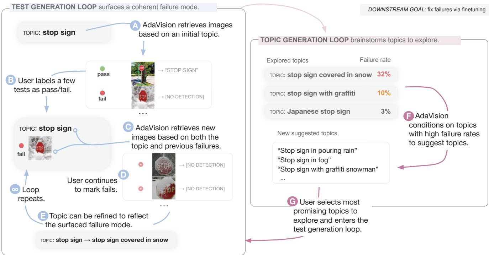
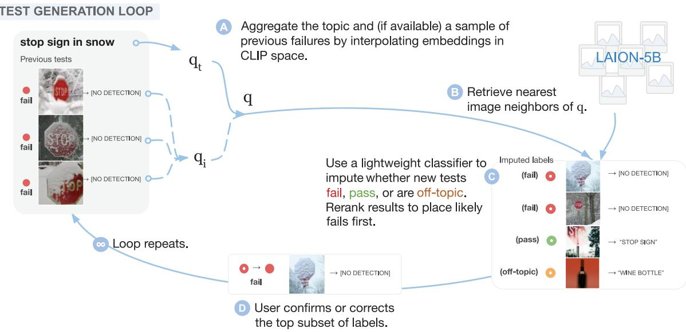
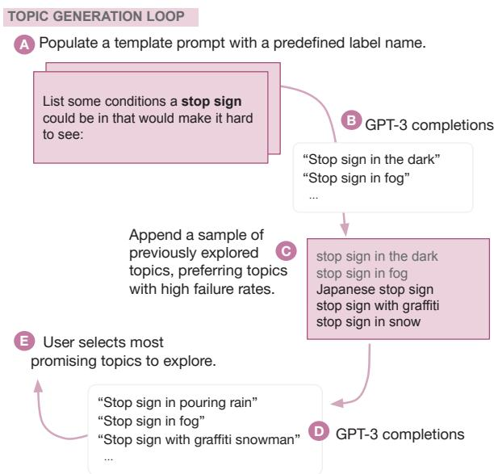
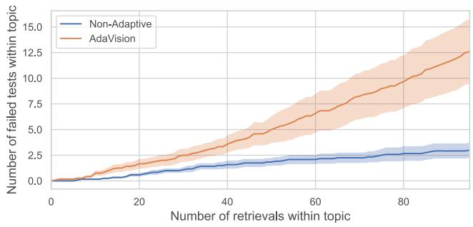
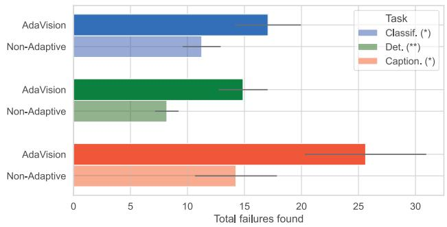
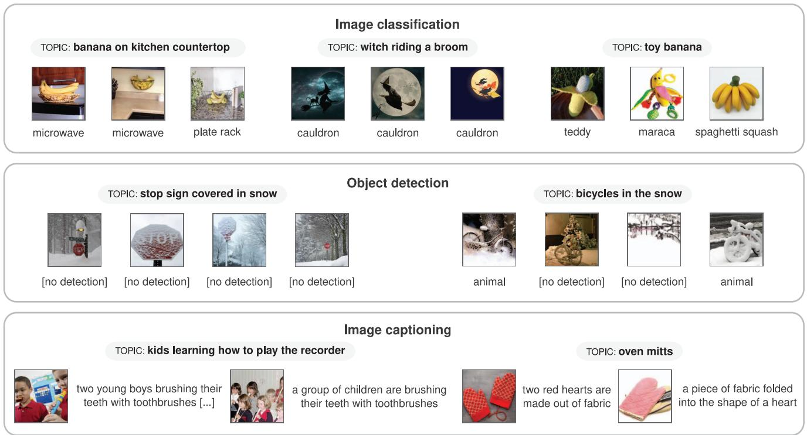

This ICCV paper is the Open Access version, provided by the Computer Vision Foundation. Except for this watermark, it is identical to the accepted version; the final published version of the proceedings is available on IEEE Xplore.

# Adaptive Testing of Computer Vision Models

Irena Gao Stanford University\* irena@cs.stanford.edu

Gabriel Ilharco University of Washington gamaga@cs.washington.edu

Scott Lundberg and Marco Tulio Ribeiro Microsoft Research {marcotcr, scott.lundberg}@microsoft.com

## Abstract

Vision models often fail systematically on groups of data that share common semantic characteristics (e.g., rare objects or unusual scenes), but identifying these failure modes is a challenge. We introduce ADAV1- sIoN, an interactive process for testing vision models which helps users identify and fix coherent failure modes. Given a natural language description of a coherent group, ADAVISION retrieves relevant images from LAION-5B with CLIP. The user then labels a small amount of data for model correctness, which is used in successive retrieval rounds to hill-climb towards high-error regions, refining the group definition. Once a group is saturated, ADAVISION uses GPT-3 to suggest new group descriptions for the user to explore. We demonstrate the usefulness and generality of ADAV1- sioN in user studies, where users ind major bugs in state-of-the-art classification, object detection, and image captioning models. These user-discovered groups have failure rates 2-3x higher than those surfaced by automatic error clustering methods. Finally, finetuning on examples found with ADAVISION fixes the discovered bugs when evaluated on unseen examples, without degrading in-distribution accuracy, and while also improving performance on out-of-distribution datasets.

## 1. Introduction

Even when vision models attain high average performance, they still fail unexpectedly on subsets of images. When low-performing subsets are semantically coherent (i.e. unified by a human-understandable concept), their identification helps developers understand how to intervene on the model (e.g. by targeted data collection) and decide if models are safe and fair to deploy [12, 25]. For example, segmentation models for autonomous driving fail in unusual weather. Because we have identified this, we know to deploy such systems with caution and design interventions that simulate diverse weather conditions [37, 47]. Identifying coherent failure modes helps developers make such deployment decisions and design interventions.

However, discovering coherent error groups is difficult in practice, since most evaluation sets lack the necessary visual or semantic annotations to group errors. Prior work clusters evaluation set errors in different representation spaces [8, 12, 17, 36, 43], but these methods often produce incoherent groups, such that it is hard for humans to assess their impact or fix them. These methods are also limited by the coverage of small evaluation sets, which underestimate out-of-distribution vulnerabilities [26, 30, 33], and become less useful as models approach near-perfect accuracy on benchmarks. An alternative approach for discovering failures is open-ended human-in-the-loop testing [13, 32, 33], which leverages interaction with users to generate challenging data to test models on coherent topics. While successful in NLP, there are no established frameworks for open-ended testing in vision.

In this work, we present Adaptive Testing for Vision Models (ADAVIsION), a process and tool for human-in-the-loop testing of computer vision models. As illustrated in Figure 1 (left), a user first proposes a coherent group of images to evaluate using natural language (e.g. stop sign). This description is used to retrieve images from a large unlabeled dataset (LAION-5B) using CLIP embeddings [27]. After users label a small number of the returned images for model correctness (pass / fail), the tool adapts to retrieve images similar to the discovered failures (Figure 1C). ADAVIsIoN reduces the manual labor required for human-inthe-loop testing by automatically hill-climbing towards high-error regions, while having a human-in-the-loop ensures groups are coherent and meaningful for the downstream application. ADAVIsION also leverages a large language model (GPT-3 [5]) to adaptively help users generate descriptions for challenging groups to explore, as previously proposed by [32] and illustrated in Figure 1 (right). After testing, users finetune their models on discovered groups to fx the bugs, and they can test again to verify improvement.

  
Figure 1: ADAVIsION is a human-in-the-loop tool for surfacing coherent groups of failures, which are indexed via natural language topics. In the test generation loop (left), ADAVIsiON generates challenging tests for a topic, hill-climbing on previous failures. In the topic generation loop (right), ADAVIsIoN generates new topics to explore, hill-climbing on previously difficult topics. Users steer testing by labeling a small number of images in the test generation loop and selecting which topics to explore from the topic generation loop

We demonstrate the usefulness of ADAVISION in user studies, where users found a variety of bugs in state-of-the-art classification, object detection, and image captioning models. ADAVISION groups had failure rates 2-3x higher than those found by DoMINo, an automatic error clustering baseline [12]. Further, users found close to 2x as many failures with ADAVIsiON, when compared to a strong non-adaptive baseline using the same CLIP backend. Finally, we show that finetuning a large classification model on failures found with ADAVIsiON improves performance on held-out examples of such groups and on out-of-distribution datasets, without degrading in-distribution performance: finetuning an ImageNet-pretrained ViT-H/14 model [6, 10] on user study data fixes the discovered groups (boosting accuracy from 72.6% to 91.2%) without reducing overall accuracy on ImageNet, while also improving the accuracy of labeled classes (78.0% to 84.0%) on five out-of-distribution (OOD) ImageNet evaluation sets.

## 2. Related Work

Automatic group discovery. To help humans find low-performing coherent groups, one line of prior work clusters errors in validation data, labeling each cluster with a caption [8, 12, 17, 36, 43]. A desirable property for these clusters is coherency: groups and captions that are semantically meaningful to humans aid decisions about safe deployment and intervention (e.g. collecting more data to fix the bugs). Further, clusters should generalize: since each cluster is meant to represent a bug in the model, collecting more data matching the caption should result in a high failure rate. Prior work finds that automatic methods which cluster validation set errors can fail this second criterion: clusters can spuriously overfit to a few mispredicted examples [18]. Overfitting is particularly likely on small or mostly-saturated evaluation sets. In contrast, ADAVIsIoN leverages a human in the loop to iteratively test models, encouraging descriptions which are coherent, generalizable, and relevant for the users' task.

Testing machine learning models. Human-aided testing of models is an established practice in Natural Language Processing [3, 13, 20, 32, 33]. This area applies insights from software engineering by having users create test cases with templates [33], via crowdsourcing [13, 20], or with help from a language model [32]. Tests are organized into coherent groups and used to evaluate a target model. This style of testing, which leverages human steering to probe inputs beyond traditional training / validation splits, has successfully unearthed coherent bugs in state-of-the-art NLP models, even as models saturate static benchmarks [13, 20, 32, 33].

In contrast, testing in computer vision has not moved far from static evaluation sets, with testing limited to pre-defined suites of data augmentations [11, 37, 48], static out-of-distribution test sets [2, 15, 16, 31, 39], training specific counterfactual image generators [1, 7, 19], or using 3D simulation engines [4, 22]. All of these methods either restrict tests to a static set of images, or along pre-specified axes of change (e.g. blur augmentations), and many introduce synthetic artifacts. In contrast, ADAVIsION enables dynamically testing models along unrestricted axes by allowing users to specify tests using natural language. Moreover, ADAVIsION can pull images from 5 billion total candidates, orders of magnitude larger than typical evaluation datasets.

Our work shares motivations with prior work that compares models via dynamically selected test sets [23, 38, 42, 45] and with concurrent work by Wiles et al. [43], who also leverage foundation models for openended model testing of computer vision models. Like other automatic methods, their approach involves clustering evaluation set errors, captioning these clusters, and then generating additional tests per cluster using a text-to-image generative model [34]. ADAVIsION differs in that it is human-in-the-loop; as in prior work, we find that a small amount of human supervision, which steers the testing process towards meaningful failures for the downstream application, is effective at identifying coherent bugs [32] and avoids the pitfalls of automatic group discovery from evaluation sets (our discovered bugs have failure rates orders of magnitude higher than Wiles et al. [43]).

## 3. Methodology

We aim to test vision models across a broad set of tasks, including classification, object detection, image captioning. Given a model m, we define a test as an image x and the expected behavior of m on x [32, 33]. For example, in object recognition, we expect that m(x) outputs one of the objects present in x, while in captioning, we expect $m ( x )$ to output a factually correct description for x. A test fails if m(x) doesn't match these expectations.

A coherent group, or topic [32], contains tests whose images are united by a human-understandable concept [12, 43]) and by a shared expectation [33]. ADAVIsion's goal is to help users discover topics with high failure rates, henceforth called bugs [32, 43]. Assuming a distribution of images given topics $P ( X | T )$ , a bug is $t \in T$ such that failure rates are greatly enriched over the baseline failure rate:

$$
\mathbb { E } _ { x \sim \mathbf { P } ( \mathbf { X } \mid \mathbf { t } ) } \left[ \operatorname { t e s t } ( x ) { \mathrm { ~ f a i l s } } \right] \gg \mathbb { E } _ { x \sim \mathbf { P } ( \mathbf { X } ) } \left[ \operatorname { t e s t } ( x ) { \mathrm { ~ f a i l s } } \right]
$$

For a given topic, users start with a textual topic description (e.g. stop sign in Figure 1 left), and then engage in the test generation loop (Section 3.1), where ADAVIsION generates test suggestions relevant to the topic. At each iteration, ADAVIsION adaptively refines the topic based on user feedback on topic images, steering towards model failures. While users can explore whatever topics they choose (e.g. based on the task labels, application scenarios, or existing topics from prior testing sessions), ADAVIsION also includes a topic generation loop (Figure 1 right; Section 3.2) where a large language model suggests topics that might have high failure rate, based on existing topics and templates. At the end of the process, users accumulate a collection of topics and can then intervene on identified bugs, e.g. by finetuning on the failed tests to improve performance on fresh tests $x \sim P ( X | t )$ from the topic (Section 4.4).

## 3.1. Test generation loop

In the test generation loop, users explore a candidate topic t. At each iteration, users get test suggestions and provide feedback by labeling tests, changing the topic name, or both. This feedback adaptively refines the definition of t, such that the next round of suggestions is more likely to contain failures (Figure 1 left).

Initial test retrieval. Given a topic string q, ADAVIsION retrieves a warm-up round of tests (Figure 1A) by using the text embedding $q _ { t }$ (embedded with CLIP ViT-L/14 [27]) to fetch nearest image neighbors from LAION-5B [35], a 5-billion image-text dataset.1 We note that LAION-5B can be replaced by or supplemented with any large unlabeled dataset, or even with an image generator.

Adaptive test suggestions. We run the target model on the warm-up images, obtaining (x, m(x)) tuples. Users then label a small number of these tests as passed, failed, or off-topic. A test is off-topic if it is a retrieval error (e.g. not a stop sign in Figure 2C), or if the test is not realistic for the downstream application. When labeling, users prioritize labeling failures. We incorporate these labeled tests in subsequent rounds of retrieval, where we suggest tests based both on the textual description (stop sign) and visual similarity to previous failures. To do so (Figure 2A, B), we sample up to 3 in-topic images (prioritizing failures), combine their embeddings into a single embedding qi using a random convex combination of weights, and generate a new retrieval query by spherically interpolating each qi with the topic name embedding qt, as done in [29].2 We automatically filter retrievals to prevent duplicate tests. We provide more technical details in Appendix A.1.

  
Figure 2: In the test generation loop, ADAVisioN populates a topic with image tests, hill-climbing on previous failures through embedding interpolations. To minimize user labeling effort, ADAVIsION also uses lightweight classifiers to automatically sort and label returned tests. We provide additional technical details on these steps in Appendix A.1.

By incorporating images into retrieval, ADAVIsION adaptively helps users refine the topic to a coherent group of failures. Each round can be seen as hillclimbing towards a coherent, high-error region, based on user labels. We evaluate the effectiveness of this strategy in Section 4.1, where we observe that it significantly improves retrieval from LAION-5B.

Automatically labeling tests. In order to minimize user labeling effort, we train lightweight topic-specific classifiers to re-rank retrieved results according to predicted pass, fail, or off-topic labels (Figure 2C). For each topic, we take user pass/fail labels and train a Support Vector Classifier (SVC) on concatenated CLIP embeddings of each test's input (image) and output (e.g. predicted label). If off-topic labels are provided we train a second SVC model to predict whether a test is in-topic or off-topic. The predictions of these two models are used to rerank the retrievals such that likely failures are shown first (sorted by the distance to the decision boundary), and tests predicted as off-topic are shown last. The user also sees a binary prediction of pass / fail (Figure 2C), so they can skip tests predicted as “pass" once the lightweight models seem accurate enough. These models take less than a second to train and run, and thus we retrain them after every round of user feedback.

## 3.2. Topic generation loop

In the topic generation loop (Figure 1 right), users collaborate with ADAVIsION to generate candidate topics to explore. While labeling examples in the test generation loop is easy for humans, generating new topics is challenging, even when users are tasked with testing m for a single concrete label (e.g. stop sign). Thus, we offload this creative task to a large language model (GPT-3, text-davinci-002), inspired by successes in related NLP tasks [32].

As illustrated in Figure 3, we start by using a collection of prompt templates, such as "List some conditions a {LABEL} could be in that would make it hard to see" and “List some unusual varieties of {LABEL}", replacing {LABEL} at testing time with predefined label names or existing user topics (e.g. stop sign). We combine completions of this prompt with existing user topics (prioritizing topics with high failure rates) into a new few-shot prompt, such that GPT-3 is "primed" to return high-failure topic names [32]. The resulting topic name suggestions are presented to the user, who chooses to explore topics they deem interesting and important. These suggestions only need high recall (not precision), as users can disregard irrelevant suggestions.

  
Figure 3: In the topic generation loop, ADAVIsION leverages GPT-3 to generate topics for users to explore. These suggestions condition on previously explored topics with high failure rates.

## 4. Evaluation

To evaluate ADAVIsION, we first quantify the value of adaptive test suggestions (i.e. retrieving tests using interpolated topics and images, Section 3.1) for finding failures. Then, we verify that ADAVISION helps users find coherent bugs in state-of-the-art vision models across a diverse set of tasks in a set of user studies (Section 4.2). These also demonstrate that ADAVIsioN is more effective than a non-adaptive version relying on an interactive CLIP search. In a separate experiment, we compare ADAVISION and DoMINO, an automatic slice discovery method (Section 4.3). Finally, we use finetuning to patch the discovered bugs (Section 4.4), improving performance in these topics.

  
Figure 4: Average number of failures accumulated within a topic over the course of 100 retrievals, comparing ADAVI-SION with a non-adaptive baseline. ADAVISION is significantly more effective at finding failed tests, because it is able to quickly surface more failures once a few are found. Standard error is over 12 topics.

## 4.1. Value of adaptive test suggestions

We ran a controlled experiment to understand the value of the test generation loop's adaptivity for finding failures. We compared the number of failures found within a topic when using adaptive test suggestions, compared to retrieving based on topic name alone. To do so, we fixed a set of broad topics from two tasks (classification and object detection) and labeled the top 100 retrievals found by each strategy.3 For classification, we created six broad topics with the template a photo of a {y}with the labels {banana, broom candle, lemon, sandal, wine bottle}.4 For object detection, we use the template a photo of a {y} on the road with labels {cyclist, motorcycle, car, stop sign, person, animal}.

Figure 4 shows the number of failures found by ADAVISION compared to NONADAPTIVE over time, averaged across topics. Once a small number of failures have been found, ADAVIsION is able to quickly surface more failures, outperforming retrieval that only uses the topic string. Even though these broad initial topics result in low baseline failure rates, ADAVIsION surfaces coherent groups of failures within the broad topic by hill-climbing on previous failures.

## 4.2. User study

We ran user studies to evaluate whether ADAVIsION enables users to find bugs in top vision models. Users are able to find coherent bugs with ADAVIsION in state-of-the-art models, even though these models have very high in-distribution accuracy. We also show that

ADAVISION's adaptivity, i.e. its hill-climbing on previous failures (both test and topic), helps users find nearly 2x as many failures than without adaptivity.

Tasks and models. To highlight the flexibility of ADAVisiON, we had users test models across three vision tasks (classification, object detection, and image captioning). We targeted models and categories with high benchmark or commercial performance, where failures are not easy to find, and we instructed users to use stringent definitions for model failure. For classification, users tested ViT-H/14 on two ImageNet categories banana and broom (chosen for their high top-1 accuracy of 90%), and were instructed that a prediction that includes any object in the image is counted as a valid prediction. For object detection, users tested Google Cloud Vision API's Object Detection on two categories relevant for autonomous driving: bicycle and stop sign (average precision 0.7-0.8 on OpenImages).5 Users were instructed to only mark as failures tests where the model does not detect any bicycles or stop signs present. For image captioning, users tested Alibaba's official checkpoint of OFA-Huge finetuned on COCO Captions [41], which is state-of-the-art on the benchmark, and were asked to explore scenes a visually impaired user might encounter when inside a kitchen or an elementary school. Users were instructed to consider as failures only object and action recognition errors which would egregiously mislead a visually impaired user.

Participants and setup. We recruited 40 participants from academia and industry (with IRB approval) who had taken at least a graduate-level course in machine learning, computer vision, or natural language processing. We assigned 16 users to the classification task, 16 to the detection task, and 8 users to the image captioning task.

In these studies, we also aimed to ablate the importance of ADAVIsION's adaptivity over its benefits as an interactive search interface with model scoring To do so, we asked each user to complete two rounds of testing. In the ADAVIsION round, users had full access to ADAVIsION as described in Section 3, while in NoNADAPTIVE round we disabled topic suggestions, automatic test labeling, and adaptive test suggestions (i.e. suggestions are always retrievals based solely on the topic name). Users had a limited amount of time for each round (15 to 20 minutes), and were instructed to try to find as many failure-prone topics (bugs) for a specific category as possible, switching topics whenever they found 8-10 failures within a topic (more details in Appendix B). Users tested different categories between rounds (to minimize learning between rounds), and category assignments and round orderings were randomized.

  
Figure 5: User study results comparing ADAVISION to NoN-ADAPTIVE (baseline). Error bars are standard errors over users. Results significant with $p < 0 . 0 5 \ ( ^ { * } )$ or $p < 0 . 0 0 5$ (\*\*), with more details in Appendix B.

Results. We present the number of failures found (averaged across users) in Figure 5. Users were able to find a variety of bugs with ADAVisiON, even in strong models with strict definitions of failure. Further, ADAVIsION's adaptivity helped users find close to twice as many failing tests than NoNADAPTIVE, with moderate to large (standardized) effect sizes in classification $( d ~ = ~ 0 . 5 8 8 , p ~ < ~ 0 . 0 5 )$ , object detection $( d = 0 . 8 8 2 , p < 0 . 0 0 5 )$ , and image captioning (d = $0 . 9 6 7 , p < 0 . 0 5 )$ . Using ADAVIsION helped users identify more diverse bugs than the baseline: while 12/40 users found 2 or more bugs with ADAVIsION, only 1/40 could match this level of diversity in the baseline round.

Qualitatively, users found bugs related to spurious correlations, difficult examples, and missing world knowledge (we share samples in Figure 6). For example, users discovered that ViT-H/14 strongly correlates kitchen countertops with the label microwave and witch hats with the label cauldron, leading to failure on images where these correlations do not hold (e.g. microwaves are absent). Users found that Cloud Vision misses detections when stop signs and bicycles are partially obscured by snow, and users also discovered object and action recognition errors in OFA-Huge, such as with oven mitts and musical instruments held near the mouth.

We surveyed users on whether ADAVIsION was instrumental in finding these bugs. 84.6% of users marked said they “could not have found these bugs using existing error analysis tools [they] have access to." We also asked users to rate the cognitive difficulty of finding bugs in each round, on a scale of 1 to 5. The average perceived difficulty with ADAVIsION was

  
Figure 6: Sample of bugs found by users in studies. In each case, the model prediction (shown to the right of the corresponding input image) is incorrect. These bugs span spurious correlations (e.g. ViT-H/14 associating a kitchen counter top with a microwave), difficult examples (e.g. Cloud Vision API failing to detect stop signs partially obscured by snow), and missing world knowledge (e.g. OFA-Huge misidentifying oven mitts).

3.05 ± 1.07, in contrast with 4.10 ± 0.91 for NONADAP-TIVE. In a paired t-test, this gap was significant with p < 0.001, reflecting that users felt testing was easier with ADAVISION than without.

## 4.3. Comparison with automatic slice discovery

DoMINo [12] is a state-of-the-art slice discovery method that clusters validation set errors and describes them with automatically generated captions. We compare these to ADAVisION topics on unseen data, noting that if a topic or caption t genuinely describes a bug, drawing new samples from x ∼ P(X|t) should yield a high failure rate.

Setup. We compare bugs found in ImageNet classification models with respect to six categories: {banana, broom, candle, lemon, sandal, wine bottle}. Specifically, tests failed if they were false negatives: for class y, the model fails if the image x contains object y, but the model instead predicts an object that is not in the image. We target the ViT-H/14 model from Section 4.2 [10], and a ResNet-50 [14].

For each category, DoMIno clusters ImageNet validation examples using an error-aware Gaussian mixture model in CLIP's latent space, and then describes each cluster with a caption.6 We use two variants, DoMINO (BERT) and DoMINO (OFA), which differ in how they caption clusters (template filling with BERT [9] or captioning with OFA [40]). Appendix C contains more details.

We used ADAVIsION topics from a user session in the user studies for overlapping categories, and had an author run additional sessions (i.e. use ADAVIsION for 20 minutes) for the 2 remaining categories. While DoMiNo targets each model individually, we only target ViT-H/14, and directly transfer the discovered topics to ResNet-50.

Both methods propose five topics per category (we took the top-5 with most failures for ADAVIsiON), for a total of 30 topics each (listed in Appendix C). To evaluate the failure rate of a topic on new data that matches the topic description, we retrieve nearest neighbors from LAION-5B using the topic name, and label the first 50 in-topic retrievals (skipping over images that do not fit the topic description). We exclude tests ADAVIsION users encountered during testing to avoid counting tests already reviewed in ADAVIsION's favor.

Results. We present average failure rates across coherent topics proposed by each method in Table 1. We also present two baselines: the failure rate of a generic topic description per category (a photo of {y}), and the failure rate on the original ImageNet validation data (noting that ImageNet has a looser definition of failure, enforcing prediction on an arbitrary object on images with multiple objects). ADAVIsION topics yield much higher failure rates, while DomINo shows rates close to baselines. Interestingly, ADAVIsION topics generated while testing ViT-H/14 transfer well to ResNet-50.

Further, while all ADAVIsION topics are unsurprisingly coherent (as they are human-verified), we find that 61.6% and 33.3% of topics from DoMINO (BERT) and DoMINo (OFA) respectively are nonsensical (e.g. a photo of setup by banana, a photo of skiing at sandal or fail to refer to the target category at all (e.g. three oranges and an apple on a white background When the target is "lemon"). These topics are excluded from Table 1 and listed in Appendix C.

We believe these results illustrate some inherent difficulties of automatic slice discovery methods. Validation error clusters may not be semantically tied together, especially when models saturate in-distribution benchmarks (ViT-H/14 and ResNet-50 are stronger than models used in prior evaluation of automatic slice discovery [12, 17]). Current slice captioning methods may also over-index into incorrect details or miss broader patterns between images. Because of the human-in-the-loop, ADAVIsION enables users to form more coherent hypotheses about model failures. Further, cluster captions can describe a group of failures without including the cause of the model failure [18] (e.g. “a woman sitting on a chair holding a broom" is coherent, but ViT-H/14 has a failure rate of only 10% on additional data matching this description). In contrast, users of ADAVIsION iteratively form hypotheses about model vulnerabilities: after selecting a topic, users observe model behavior on additional data from the topic, leading them to refine the topic definition This iterative process helps users identify topics which consistently capture model failures.

## 4.4. Fixing bugs via finetuning

We evaluate whether users can fix bugs discovered with ADAVIsION, by finetuning on failed tests. We finetune ViT-H/14 on the 30 ADAVISION topics for categories {banana, broom, candle, lemon, sandal, wine bottle} from Section 4.3, taking a sample of 20 tests per topic for a total of 600 images. As a baseline that just trains on images from a different distribution, we finetune ViT-H/14 on an equal-size set of images retrieved from LAION-5B using generic topics in the form an image of {y}. We evaluate the finetuned models on held-out examples from ADAVIsION topics, on the original domain (ImageNet [6]), and on five outof-distribution datasets: ImageNet V2 [31], ImageNet-A [16], ImageNet-Sketch [39], ImageNet-R [15], and ObjectNet [2]. Additional details are in Appendix D.

<table><tr><td>Model</td><td>Method</td><td>Avg failure rate</td></tr><tr><td rowspan="5">ViT-H/14</td><td>a photo of {y}</td><td>1.33</td></tr><tr><td>ImageNet</td><td>11.47</td></tr><tr><td>DOMINO (BERT)</td><td>8.6</td></tr><tr><td>DOMINO (OFA)</td><td>7.33</td></tr><tr><td>ADAVISION</td><td>28.47</td></tr><tr><td rowspan="5">ResNet50</td><td>a photo of {y}</td><td>15.7</td></tr><tr><td>ImageNet</td><td>23.67</td></tr><tr><td>DOMINO (BERT)</td><td>20.44</td></tr><tr><td>DOMINO (OFA)</td><td>25.45</td></tr><tr><td>ADAVISION</td><td>56.93</td></tr></table>

Table 1: Average failure rates across topics proposed by ADAVISION and two variants of DoMINO, an automatic slice discovery method. ADAVIsION finds bugs that are 3x more difficult for models, while automatic methods propose groups that are close to baseline failure rates.

Finetuning improves performance on discovered bugs. We use 50 held-out examples drawn from each topic we attempted to fix (treatment topics) to verify if the bugs were patched. As shown in Table 2, finetuning substantially increases performance on the held-out data from the treatment topics (by 18.6 percentage points), making the accuracy on treatment topics surpass average accuracy on ImageNet. These performance gains also hold on in-topic images sourced from outside of the LAION-5B distribution: for each treatment topic, we collected 50 images from a Google Image Search, deduplicated against both the finetuning set and the LAION-5B evaluation set. Finetuning on ADAVIsION images from a testing session using LAION-5B also improves performance on in-topic images from Google by 13.9 percentage points.

Finetuning maintains in-distribution accuracy and improves OOD accuracy. To ensure performance gains are not due to the introduction of new shortcuts, we check performance on the original indistribution data (ImageNet). Finetuning on the treatment topics does not reduce overall ImageNet accuracy (Table 2). Additionally, finetuning with ADAVISION improves overall average performance on the treatment classes across out-of-distribution evaluation sets (from 78% to 84%). To check for shortcuts at a more finegrained level, we evaluate performance on 19 semantically contrasting control topics with different labels. For example, one treatment topic involved images of lemons next to tea, which the model often predicted as consomme. We added consomme as a control topic to check that the model does improve performance on lemons at the expense of the “consomme" concept. Similarly, for topics banana on kitchen countertop andwitch riding a broom in Figure 6, we add the control topics microwave in kitchen and witch with cauldron; see Appendix D for a list. Performance on the control topics does not decrease after finetuning. Our results indicate users can fix specific bugs discovered with ADAVISION in ViT-H/14 without degrading performance elsewhere.

<table><tr><td></td><td colspan="3">ADAVISION Topics</td><td>ImageNet</td><td colspan="2">Avg across OOD Eval Sets</td></tr><tr><td>Model</td><td>Treatment Topics LAION-5B</td><td>Google</td><td>Control Topics</td><td>Overall</td><td>Treatment Classes</td><td>Overall</td></tr><tr><td>Before finetuning</td><td>72.6</td><td>76.7</td><td>91.3</td><td>88.4</td><td>78.0</td><td>77.7</td></tr><tr><td>Finetuning with an image of {y}</td><td>82.5 (0.9)</td><td>82.9 (0.6)</td><td>90.8 (0.3)</td><td>88.5 (0.0)</td><td>82.1 (0.6)</td><td>78.0 (0.1)</td></tr><tr><td>Finetuning with ADAVISION tests</td><td>91.2 (0.5)</td><td>90.6 (0.6)</td><td>91.9 (0.2)</td><td>88.4 (0.0)</td><td>84.0 (0.2)</td><td>78.2 (0.0)</td></tr></table>

Table 2: Accuracies on ADAVIsION topics, ImageNet [6], and five OOD ImageNet evaluation sets [2, 15, 16, 31, 39] before and after finetuning on images accumulated from testing with ADAVIsION. Compared to a baseline of finetuning on the same number of images pulled generically using the topic an image of {y}from LAION-5B, ADAVIsION improves accuracy on held-out data from topics in the finetuning set (left two columns), regardless of whether images are sourced from LAION-5B or Google Images. ADAVIsION also improves accuracy on OOD evaluation sets (right two columns). Finetuning maintains overall performance on ImageNet (center) and held-out control topics (third column).

## 5. Limitations

Retrieval limitations. While LAION-5B has good coverage for everyday scenes, it may not be appropriate to specialized domains such as biomedical or satellite imagery, and CLIP's representation power is also likely to deteriorate on these domains [27]. Even for everyday scenes, the quality of CLIP's text-based retrieval degrades as the complexity of the topic name increases, particularly when several asymmetric relations are introduced [24, 46]. Further work to improve image-text models like CLIP could reduce off-topic retrievals during testing, improving users' testing speed.

Experiment limitations. We show that finetuning a state-of-the-art classification model on ADAVISION bugs fixes them without degrading performance elsewhere. While it is particularly encouraging that we could improve performance on labels that had very high accuracy to begin with, this experiment was done with a limited set of labels and with only one round of testing. Multiple rounds of testing / finetuning could be more beneficial [32]. Models smaller than ViT-H/14 may also be more prone to catastrophic forgetting [28]. To preserve in-distribution performance when fixing bugs for these models, robust finetuning techniques like weight averaging [44] or adding in-distribution data to the finetuning set may be necessary.

Fixing non-classification bugs. Classification tests contain the expected label implicitly in pass/fail annotations, and thus are easy to turn into finetuning data. However, the same is not true for detection or captioning tests, since we do not collect correct bounding boxes or captions during testing (only pass/fail annotations). Fixing such bugs would require an additional step of labeling failing tests prior to finetuning, or using loss functions that explicitly allow for negative labels [21].

## 6. Conclusion

We presented ADAVIsION, a human-in-the-loop process for testing vision models that mimics the life-cycle of traditional software development [32]. By leveraging human feedback for models on vision tasks, ADAVIsion helps users to identify and improve coherent vulnerabilities in models, beyond what is currently captured in-distribution evaluation sets. Our experiments indicate the adaptive nature of ADAVIsION improves the discovery of bugs, and that finetuning on bugs discovered with ADAVisION boosts performance on the discovered failure modes. ADAVisION is open-sourced at https://github.com/i-gao/adavision.

## Acknowledgements

We're grateful to Adarsh Jeewajee, Alexander Hoyle, Bhargavi Paranjape, Dhruba Ghosh, Mitchell Wortsman, Pang Wei Koh, Sarah Pratt, Shikhar Murty, Shiori Sagawa, and Tongshuang Wu for giving feedback at various stages of this paper.

## References

[1] Guha Balakrishnan, Yuanjun Xiong, Wei Xia, and Pietro Perona. Towards causal benchmarking of biasin face analysis algorithms. In Deep Learning-Based Face Analytics, pages 327–359. Springer, 2021. 3

[2] Andrei Barbu, David Mayo, Julian Alverio, William Luo, Christopher Wang, Dan Gutfreund, Josh Tenenbaum, and Boris Katz. Objectnet: A large-scale bias-controlled dataset for pushing the limits of object recognition models. In H. Wallach, H. Larochelle, A. Beygelzimer, F. d'Alché-Buc, E. Fox, and R. Garnett, editors, Advances in Neural Information Processing Systems, volume 32. Curran Associates, Inc., 2019. 3, 8, 9

[3] Shaily Bhatt, Rahul Jain, Sandipan Dandapat, and Sunayana Sitaram. A case study of efficacy and challenges in practical human-in-loop evaluation of nlp systems using checklist. In Proceedings of the Workshop on Human Evaluation of NLP Systems (HumEval), pages 120–130, 2021. 3

[4] Daniel Bogdoll, Stefani Guneshka, and J Marius Zöllner. One ontology to rule them all: Corner case scenarios for autonomous driving. arXiv preprint arXiv:2209.00342, 2022. 3

[5] Tom Brown, Benjamin Mann, Nick Ryder, Melanie Subbiah, Jared D Kaplan, Prafulla Dhariwal, Arvind Neelakantan, Pranav Shyam, Girish Sastry, Amanda Askell, Sandhini Agarwal, Ariel Herbert-Voss, Gretchen Krueger, Tom Henighan, Rewon Child, Aditya Ramesh, Daniel Ziegler, Jeffrey Wu, Clemens Winter, Chris Hesse, Mark Chen, Eric Sigler, Mateusz Litwin, Scott Gray, Benjamin Chess, Jack Clark, Christopher Berner, Sam McCandlish, Alec Radford, Ilya Sutskever, and Dario Amodei. Language models are few-shot learners. In H. Larochelle, M. Ranzato, R. Hadsell, M. F. Balcan, and H. Lin, editors, Advances in Neural Information Processing Systems, volume 33, pages 1877–1901. Curran Associates, Inc., 2020. 2

[6] Jia Deng, Wei Dong, Richard Socher, Li-Jia Li, Kai Li, and Li Fei-Fei. Imagenet: A largescale hierarchical image database. In Conference on Computer Vision and Pattern Recognition (CVPR), 2009. https://ieeexplore.ieee.org/ abstract/document/5206848. 2, 8, 9

[7] Emily Denton, Ben Hutchinson, Margaret Mitchell, Timnit Gebru, and Andrew Zaldivar. Image counterfactual sensitivity analysis for detecting unintended bias. arXiv preprint arXiv:1906.06439, 2019. 3

[8] Greg d'Eon, Jason d’Eon, James R Wright, and Kevin Leyton-Brown. The spotlight: A general method for discovering systematic errors in deep learning models. In 2022 ACM Conference on Fairness, Accountability, and Transparency, pages 1962–1981, 2022. 1, 2

[9] Jacob Devlin, Ming-Wei Chang, Kenton Lee, and Kristina Toutanova. BERT: Pre-training of deep bidirectional transformers for language understanding. In Proceedings of the 2019 Conference of the North Amer-

ican Chapter of the Association for Computational Linguistics: Human Language Technologies, Volume 1 (Long and Short Papers), pages 4171–4186, Minneapolis, Minnesota, June 2019. Association for Computational Linguistics. 7

[10] Alexey Dosovitskiy, Lucas Beyer, Alexander Kolesnikov, Dirk Weissenborn, Xiaohua Zhai, Thomas Unterthiner, Mostafa Dehghani, Matthias Minderer, Georg Heigold, Sylvain Gelly, et al. An image is worth 16x16 words: Transformers for image recognition at scale. arXiv preprint arXiv:2010.11929, 2020. 2, 7

[11] Xin Du, Benedicte Legastelois, Bhargavi Ganesh, Ajitha Rajan, Hana Chockler, Vaishak Belle, Stuart Anderson, and Subramanian Ramamoorthy. Vision checklist: Towards testable error analysis of image models to help system designers interrogate model capabilities. arXiv preprint arXiv:2201.11674, 2022. 3

[12] Sabri Eyuboglu, Maya Varma, Khaled Saab, Jean-Benoit Delbrouck, Christopher Lee-Messer, Jared Dunnmon, James Zou, and Christopher Ré. Domino: Discovering systematic errors with cross-modal embeddings. arXiv preprint arXiv:2203.14960, 2022. 1, 2, 3, 7,8

[13] Deep Ganguli, Liane Lovitt, Jackson Kernion, Amanda Askell, Yuntao Bai, Saurav Kadavath, Ben Mann, Ethan Perez, Nicholas Schiefer, Kamal Ndousse, et al. Red teaming language models to reduce harms: Methods, scaling behaviors, and lessons learned. arXiv preprint arXiv:2209.07858, 2022. 1, 3

[14] Kaiming He, Xiangyu Zhang, Shaoqing Ren, and Jian Sun. Deep residual learning for image recognition. In Proceedings of the IEEE conference on computer vision and pattern recognition, pages 770–778, 2016. 7

[15] Dan Hendrycks, Steven Basart, Norman Mu, Saurav Kadavath, Frank Wang, Evan Dorundo, Rahul Desai, Tyler Zhu, Samyak Parajuli, Mike Guo, Dawn Song, Jacob Steinhardt, and Justin Gilmer. The many faces of robustness: A critical analysis of out-of-distribution generalization. ICCV, 2021. 3, 8, 9

[16] Dan Hendrycks, Kevin Zhao, Steven Basart, Jacob Steinhardt, and Dawn Song. Natural adversarial examples. CVPR, 2021. 3, 8, 9

[17] Saachi Jain, Hannah Lawrence, Ankur Moitra, and Aleksander Madry. Distilling model failures as directions in latent space. arXiv preprint arXiv:2206.14754, 2022. 1, 2, 8

[18] Nari Johnson, Ángel Alexander Cabrera, Gregory Plumb, and Ameet Talwalkar. Where does my model underperform? a human evaluation of slice discovery algorithms. arXiv preprint arXiv:2306.08167, 2023. 3, 8

[19] Saeed Khorram and Li Fuxin. Cycle-consistent counterfactuals by latent transformations. In Proceedings of the IEEE/CVF Conference on Computer Vision and Pattern Recognition, pages 10203–10212, 2022. 3

[20] Douwe Kiela, Max Bartolo, Yixin Nie, Divyansh Kaushik, Atticus Geiger, Zhengxuan Wu, Bertie Vid-

gen, Grusha Prasad, Amanpreet Singh, Pratik Ringshia, et al. Dynabench: Rethinking benchmarking in nlp. arXiv preprint arXiv:2104.14337, 2021. 3

[21] Youngdong Kim, Junho Yim, Juseung Yun, and Junmo Kim. Nlnl: Negative learning for noisy labels. In Proceedings of the IEEE/CVF International Conference on Computer Vision, pages 101–110, 2019. 9

[22] Guillaume Leclerc, Hadi Salman, Andrew Ilyas, Sai Vemprala, Logan Engstrom, Vibhav Vineet, Kai Xiao, Pengchuan Zhang, Shibani Santurkar, Greg Yang, et al. 3db: A framework for debugging computer vision models. arXiv preprint arXiv:2106.03805, 2021. 3

[23] Kede Ma, Zhengfang Duanmu, Zhou Wang, Qingbo Wu, Wentao Liu, Hongwei Yong, Hongliang Li, and Lei Zhang. Group maximum differentiation competition: Model comparison with few samples. IEEE Transactions on pattern analysis and machine intelligence, 42(4):851–864, 2018. 3

[24] Zixian Ma, Jerry Hong, Mustafa Omer Gul, Mona Gandhi, Irena Gao, and Ranjay Krishna. Crepe: Can vision-language foundation models reason compositionally? arXiv preprint arXiv:2212.07796, 2022. 9

[25] Margaret Mitchell, Simone Wu, Andrew Zaldivar, Parker Barnes, Lucy Vasserman, Ben Hutchinson, Elena Spitzer, Inioluwa Deborah Raji, and Timnit Gebru. Model cards for model reporting. In Proceedings of the conference on fairness, accountability, and transparency, pages 220–229, 2019. 1

[26] Kayur Patel, James Fogarty, James A Landay, and Beverly Harrison. Investigating statistical machine learning as a tool for software development. In Proceedings of the SIGCHI Conference on Human Factors in Computing Systems, pages 667–676. ACM, 2008. 1

[27] Alec Radford, Jong Wook Kim, Chris Hallacy, Aditya Ramesh, Gabriel Goh, Sandhini Agarwal, Girish Sastry, Amanda Askell, Pamela Mishkin, Jack Clark, et al. Learning transferable visual models from natural language supervision. In International Conference on Machine Learning, pages 8748–8763. PMLR, 2021. 1, 3, 9

[28] Vinay Venkatesh Ramasesh, Aitor Lewkowycz, and Ethan Dyer. Effect of scale on catastrophic forgetting in neural networks. In International Conference on Learning Representations, 2021. 9

[29] Aditya Ramesh, Prafulla Dhariwal, Alex Nichol, Casey Chu, and Mark Chen. Hierarchical text-conditional image generation with clip latents. arXiv preprint arXiv:2204.06125, 2022. 4

[30] Benjamin Recht, Rebecca Roelofs, Ludwig Schmidt, and Vaishaal Shankar. Do imagenet classifiers generalize to imagenet? In International Conference on Machine Learning, pages 5389–5400, 2019. 1

[31] Benjamin Recht, Rebecca Roelofs, Ludwig Schmidt, and Vaishaal Shankar. Do imagenet classifiers generalize to imagenet? In International Conference on

Machine Learning, pages 5389–5400. PMLR, 2019. 3, 8, 9

[32] Marco Tulio Ribeiro and Scott Lundberg. Adaptive testing and debugging of nlp models. In Proceedings of the 60th Annual Meeting of the Association for Computational Linguistics (Volume 1: Long Papers), pages 3253–3267, 2022. 1, 2, 3, 5, 9

[33] Marco Tulio Ribeiro, Tongshuang Wu, Carlos Guestrin, and Sameer Singh. Beyond accuracy: Behavioral testing of nlp models with checklist. In Association for Computational Linguistics (ACL), 2020. 1, 3

[34] Chitwan Saharia, William Chan, Saurabh Saxena, Lala Li, Jay Whang, Emily Denton, Seyed Kamyar Seyed Ghasemipour, Burcu Karagol Ayan, S Sara Mahdavi, Rapha Gontijo Lopes, et al. Photorealistic text-to-image diffusion models with deep language understanding. arXiv preprint arXiv:2205.11487, 2022. 3

[35] Christoph Schuhmann, Romain Beaumont, Richard Vencu, Cade Gordon, Ross Wightman, Mehdi Cherti, Theo Coombes, Aarush Katta, Clayton Mullis, Mitchell Wortsman, et al. Laion-5b: An open largescale dataset for training next generation image-text models. arXiv preprint arXiv:2210.08402, 2022. 3

[36] Nimit Sohoni, Jared Dunnmon, Geoffrey Angus, Albert Gu, and Christopher Ré. No subclass left behind: Fine-grained robustness in coarse-grained classification problems. Advances in Neural Information Processing Systems, 33:19339–19352, 2020. 1, 2

[37] Yuchi Tian, Kexin Pei, Suman Jana, and Baishakhi Ray. Deeptest: Automated testing of deep-neuralnetwork-driven autonomous cars. In Proceedings of the 40th international conference on software engineering, pages 303–314, 2018. 1, 3

[38] Haotao Wang, Tianlong Chen, Zhangyang Wang, and Kede Ma. I am going mad: Maximum discrepancy competition for comparing classifiers adaptively. arXiv preprint arXiv:2002.10648, 2020. 3

[39] Haohan Wang, Songwei Ge, Zachary Lipton, and Eric P Xing. Learning robust global representations by penalizing local predictive power. In Advances in Neural Information Processing Systems, pages 10506– 10518, 2019. 3, 8, 9

[40] Peng Wang, An Yang, Rui Men, Junyang Lin, Shuai Bai, Zhikang Li, Jianxin Ma, Chang Zhou, Jingren Zhou, and Hongxia Yang. Ofa: Unifying architectures, tasks, and modalities through a simple sequence-tosequence learning framework. CoRR, abs/2202.03052, 2022.7

[41] Peng Wang, An Yang, Rui Men, Junyang Lin, Shuai Bai, Zhikang Li, Jianxin Ma, Chang Zhou, Jingren Zhou, and Hongxia Yang. Unifying architectures, tasks, and modalities through a simple sequence-to-sequence learning framework. arXiv preprint arXiv:2202.03052, 2022. 6

[42] Zhou Wang and Eero P Simoncelli. Maximum differentiation (mad) competition: A methodology for com-

paring computational models of perceptual quantities. Journal of Vision, 8(12):8–8, 2008. 3

[43] Olivia Wiles, Isabela Albuquerque, and Sven Gowal. Discovering bugs in vision models using off-the-shelf image generation and captioning. arXiv preprint arXiv:2208.08831, 2022. 1, 2, 3

[44] Mitchell Wortsman, Gabriel Ilharco, Jong Wook Kim, Mike Li, Simon Kornblith, Rebecca Roelofs, Raphael Gontijo Lopes, Hannaneh Hajishirzi, Ali Farhadi, Hongseok Namkoong, et al. Robust finetuning of zero-shot models. In Proceedings of the IEEE/CVF Conference on Computer Vision and Pattern Recognition, pages 7959–7971, 2022. 9

[45] Jiebin Yan, Yu Zhong, Yuming Fang, Zhangyang Wang, and Kede Ma. Exposing semantic segmentation failures via maximum discrepancy competition. International Journal of Computer Vision, 129:1768–1786, 2021.3

[46] Mert Yuksekgonul, Federico Bianchi, Pratyusha Kalluri, Dan Jurafsky, and James Zou. When and why vision-language models behave like bag-of-words models, and what to do about it? arXiv preprint arXiv:2210.01936, 2022. 9

[47] Oliver Zendel, Katrin Honauer, Markus Murschitz, Daniel Steininger, and Gustavo Fernandez Dominguez. Wilddash-creating hazard-aware benchmarks. In Proceedings of the European Conference on Computer Vision (ECCV), pages 402–416, 2018. 1

[48] Mengshi Zhang, Yuqun Zhang, Lingming Zhang, Cong Liu, and Sarfraz Khurshid. Deeproad: Ganbased metamorphic testing and input validation framework for autonomous driving systems. In 2018 33rd IEEE/ACM International Conference on Automated Software Engineering (ASE), pages 132–142. IEEE, 2018.3