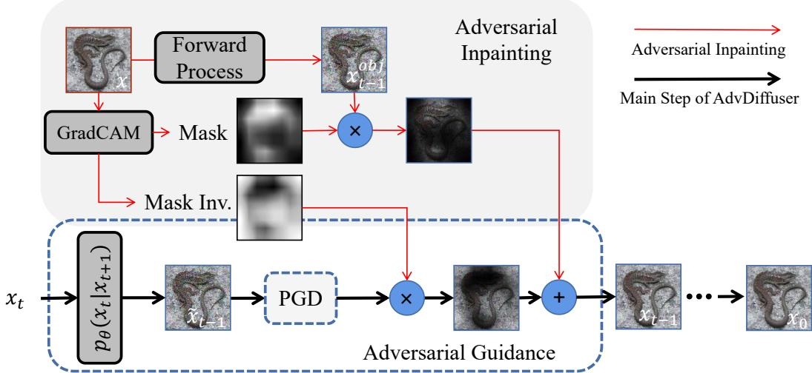
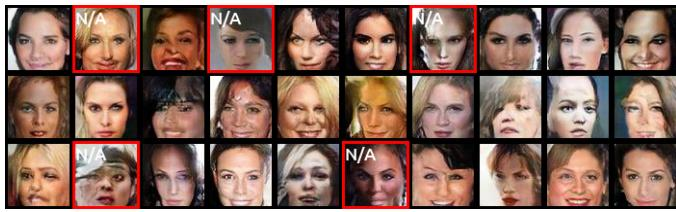
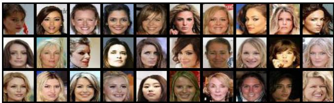
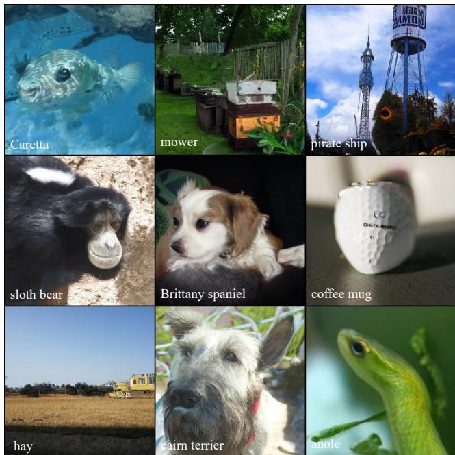
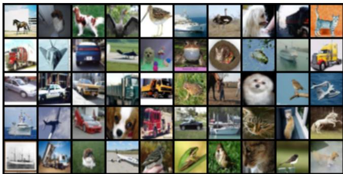
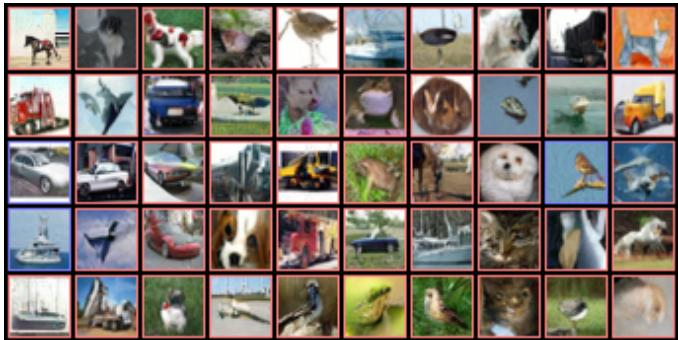
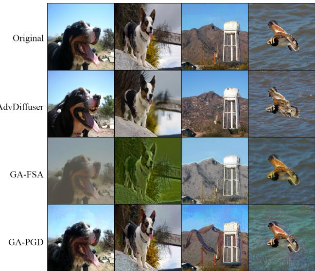
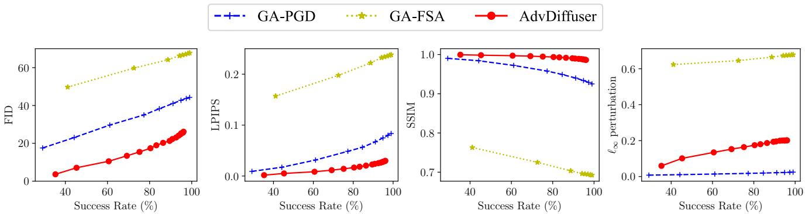
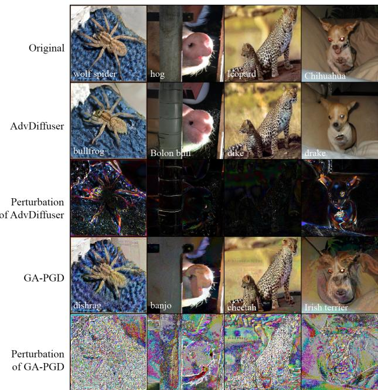

# AdvDiffuser: Natural Adversarial Example Synthesis with Diffusion Models

Xinquan Chen\* a,b, Xitong Gao\* a, Juanjuan Zhaoa, Kejiang Yea, Cheng-Zhong Xuc

a Shenzhen Institute of Advanced Technology, Chinese Academy of Sciences, China.

b University of Chinese Academy of Sciences, China.

c State Key Lab of IOTSC, University of Macau, Macau S.A.R., China.

xq.chen,xt.gao,jj.zhao,kj.ye @siat.ac.cn czxu@um.edu.mo

## Abstract

Previous work on adversarial examples typically involves a fixed norm perturbation budget, which fails to capture the way humans perceive perturbations. Recent work has shifted towards natural unrestricted adversarial examples (UAEs) that breaks $\ell _ { p }$ perturbation bounds but nonetheless remain semantically plausible. Current methods use GAN or VAE to generate UAEs by perturbing latent codes. However, this leads to loss of high-level information, resulting in low-quality and unnatural UAEs. In light of this, we propose AdvDiffuser, a new methodfor synthesizing natural UAEs using diffusion models. It can generate UAEsfrom scratch or conditionally based on reference images. To generate natural UAEs, we perturb predicted images to steer their latent code towards the adversarial sample space ofa particular classifier. We also propose adversarial inpainting based on class activation mapping to retain the salient regions ofthe image while perturbing less important areas. On CIFAR-10, CelebA and ImageNet, we demonstrate that it can defeat the most robust models on the RobustBench leaderboard with near 100% success rates. Furthermore, The synthesized UAEs are not only more natural but also stronger compared to the current state-of-the-art attacks. Specifically, compared with GA-attack, the UAEs generated with AdvDiffuser exhibit 6 smaller LPIPS perturbations, 2 3 smaller FID scores and 0.28 higher in SSIM metrics, making them perceptually stealthier. Finally, adversarial training with AdvDiffuserfurther improves the model robustness against attacks with unseen threat models.1

## 1. Introduction

Deep neural networks (DNNs) have achieved unprecedented success in various visual recognition tasks. Despite their remarkable success, DNNs are susceptible to adversarial examples [23], i.e. DNN predictions can be fooled by adding a tiny and difficult to perceive perturbation to a natural image. Furthermore, deep models face greater threats in real-world scenarios from unrestricted adversarial examples (UAEs) [2]. UAEs can make extensive changes to images without significantly affecting human perception of their meanings and faithfulness, and have thus emerged as a prominent direction in the study of adversarial attacks over the past few years.

Gradient-based unrestricted adversarial attacks perturbs original images within predefined perturbation bounds. Geometry-aware attacks [20] uses proxy models to minimize the $\ell _ { p }$ budget required, and it won the 1st place in a CVPR Competition on unrestricted adversarial attacks [4]. On the other hand, perceptual attacks [19, 51] optimize perturbations using bounds on perceptual distances, such as LPIPS [49] and structural similarity [42]. Others consider image recolorization [36, 37]. However, selecting proxy models and distance metrics require subjective prior knowledge to generate adversarial examples that appear realistic.

Generative models such as generative adversarial networks (GANs) have the ability to learn and sample from the data distribution effectively. This is why [38, 50] use them to generate adversarial examples. These approaches search for perturbations in the latent space that can cause the targeted model to misclassify the images after decoding, in order to find adversarial examples. Nevertheless, perturbing latent codes alters the high-level semantics of generated images in a way that is perceptually salient to humans [17]. Such perturbations can introduce ambiguity in certain image attributes, and visibly distort the original concept, resulting in UAEs that are often semantically vague and of poor quality. These UAEs could thus be perceptually very different from the original examples.

In order to address these issues, we propose AdvDiffuser, a novel generative unrestricted adversarial attack based on diffusion models [13]. Diffusion models draw inspiration from non-equilibrium thermodynamics, which define a

Markov process of noise-adding image diffusion steps, and then learns to reverse the diffusion process to generate data samples from noisy images. This enables trained diffusion models to sample the data distribution with high fidelity and diversity. In Section 3.1, we utilize and modify the backward denoising process of pre-trained diffusion models, and inject small adversarial perturbations that can attack the defending model successfully. Diffusion models are trained with a denoising objective, and therefore, they can effectively remove conspicuous adversarial noise while retaining the ability to attack, resulting in naturally appearing UAEs. To achieve more realistic outcomes, we introduce adversarial inpainting, which leverages masks derived from gradient-based class activation mapping (GradCAM) [35]. It tunes the denoising strength of each pixel based on object saliency, ensuring that regions containing important objects undergo smaller modifications. As AdvDiffuser perturbs images at the pixel level, it produces perceptual perturbations that are considerably smaller when compared to those generated by GAN-based methods. The final UAEs produced by our method are therefore more natural and imperceptible than those synthesized by either gradient- or GAN-based approaches. In addition to its image-conditioned attacks, AdvDiffuser offers another advantage over other unrestricted adversarial attacks as it has the ability to craft an infinite number of synthetic yet natural adversarial examples. This can potentially provide more comprehensive robustness training and evaluation for future defense techniques.

## We summarize our contribution as follows:

• To the best of our knowledge, our work is the first to investigate natural adversarial example synthesis with diffusion models. Along with its image-conditioned attack ability, and it is also the first that can generate an infinite number of synthetic yet natural adversarial examples.

• We propose adversarial inpainting to introduce CAMbased sample conditioning, resulting in diverse and high-quality outputs while preserving the semantics of the reference images.

• AdvDiffuser can successfully deceive the top-ranked robust models in RobustBench [6] with high success rates (close to 100%). The generated examples closely resemble the original distribution. Our perturbations are both more effective and less perceptible, with better LPIPS, FID and SSIM distance metrics than the current state-of-the-art unrestricted adversarial attacks.

## 2. Preliminaries & Related Work

## 2.1. Adversarial Examples

A successful adversarial attack [39] occurs when an attacker adds a small but potentially imperceptible perturbation to the original image, in order to mislead the targeted model into giving incorrect outputs. Since the discovery of adversarial examples, such attacks raised major security concerns [40, 31] in computer vision and machine learning communities. On the other hand, these techniques have also been utilized to improve transfer learning [41], deep learning interpretability [32], safeguarding privacy [27, 26], federated learning [45], among other applications. Formally, let us assume a defending classifier $f \colon { \mathcal { I } } \to \mathbb { R } ^ { K }$ , which takes an input image x from a test dataset ${ \mathcal { D } } _ { \mathrm { t e s t } } \subset { \mathcal { T } } \triangleq \mathbb { R } ^ { C \times H \times W }$ and evaluates the correct classification result y = argmax $f ( \mathbf { x } ) \in { \mathcal { C } }$ for x, then the attacker searches for the adversarial example xˆ that satisfies:

$$
\operatorname { a r g m a x } f ( { \hat { \mathbf { x } } } ) \neq y \quad { \mathrm { a n d } } \quad \operatorname { d i s t } ( \mathbf { x } , { \hat { \mathbf { x } } } ) \leq \delta .\tag{1}
$$

Here, the condition argmax $f ( \hat { \mathbf { x } } ) \neq y$ indicates a successful deception of the classifier f by the adversarial example xˆ, and dist $( { \bf x } , \hat { \bf x } ) \le \delta$ places a bound on a distance metric, dis $\mathbf { \Gamma } ( \mathbf { x } , \hat { \mathbf { x } } )$ , which measures the distance between the original image x and the adversarial xˆ.

In traditional $\ell _ { p } .$ -bounded attacks, we let dist $( { \bf x } , \hat { \bf x } ) =$ $\| \mathbf { x } - { \hat { \mathbf { x } } } \| _ { p }$ to bound xˆ within a small -ball of $\ell _ { p }$ -distance away from the original image x. Many algorithms have been proposed to find such adversarial examples, such as the fast gradient-sign method (FGSM) [9], projected gradient descent (PGD) [23], Carlini-Wagner attack [3], and other more effective variants [47, 48].

## 2.2. Unrestricted Adversarial Examples

Since the $\ell _ { p } .$ -norm distance is inadequate to capture how human perceive perturbation accurately, recent years have seen an upsurge of interest in unrestricted adversarial examples (UAEs). UAEs are images that satisfy the distribution, which humans can correctly categorize but wrongly classify by the classifier.

First line of approaches exploits prescribed image transformations which appear natural to search for UAEs. Xiao et al. [44] generate adversarial examples with spatial warping transformations. By switching to the LAB color space, Ali et al. [37] optimizes in the AB channel for adversarial examples while keeping the luminance component constant, varying the range of the perturbation in different regions.

The idea of training generative models to generate adver sarial attacks has been proposed by many papers [1, 43, 15]. This approach, however, typically suffers from limited attack success rates, An alternative approach is suggested in [46, 38, 15, 50], which leverages generative models pretrained on natural images to produce adversarial examples by perturbing the latent representation. This technique may produce lowered visual quality UAEs, which may not faithfully match the original data distribution.

The gradient-based unrestricted attacks [19, 20] searches for UAEs with distance metrics other than the traditional $\ell _ { p } .$

norm. This approach results in stronger adversarial perturbation that are still difficult to perceive by humans. Laidlaw et al. [19] performs projected gradient descent (PGD) [23] with LPIPS [49], which adopts deep features as a perceptual metric. Geometry-aware attacks [20] further use validation models to find the smallest perturbation bound for $\ell _ { p }$ attacks. However, selecting proxy models and distance metrics require subjective prior knowledge to generate adversarial examples that appear realistic.

## 2.3. Diffusion Models

For the first time, Ho et al. [13] demonstrate that diffusion models can generate images of higher quality and diversity than GANs. Their approach defines a Markov chain comprising $T$ forward diffusion steps, $\mathbf { x } _ { 1 : T }$ , from an original image $\mathbf { x } _ { 0 } .$ . Each step $t \in [ 1 : T ]$ produces a latent variable $\mathbf { x } _ { t }$ which gradually introduce Gaussian noise to an original image $\mathbf { x } _ { \mathrm { 0 } }$ with a predefined monotonically increasing variance schedule $\beta _ { 1 : T }$ . More specifically, start with a sample image from the training data set, $\mathbf { x } _ { 0 } \in \mathcal { D } _ { \operatorname { t r a i n } }$ , and we can sample the latent variable $\mathbf { x } _ { t }$ using the following forward process for $t \in [ 1 : T ]$

$$
q ( \mathbf { x } _ { t } \mid \mathbf { x } _ { t - 1 } ) = { \mathcal { N } } { \bigl ( } { \sqrt { 1 - \beta _ { t } } } \mathbf { x } _ { t - 1 } , \beta _ { t } \mathbf { I } { \bigr ) } .\tag{2}
$$

As $T \to \infty$ , x resembles an isotropic Gaussian distribution. Satisfying the Markov property, we can evaluate $x _ { t }$ directly from $x _ { 0 }$ with the following closed form equation, where $\begin{array} { r } { \overline { { \alpha } } _ { t } = \prod _ { i = 1 } ^ { t } \alpha _ { i } } \end{array}$ and $\alpha _ { t } = 1 - \beta _ { t }$

$$
\begin{array} { r } { q ( \mathbf { x } _ { t } | \mathbf { x } _ { 0 } ) = \mathcal { N } \big ( \sqrt { \overline { { \alpha } } _ { t } } \mathbf { x } _ { 0 } , ( 1 - \overline { { \alpha } } _ { t } ) \mathbf { I } \big ) , } \end{array}\tag{3}
$$

Subsequently, diffusion models learn the reverse process for any step t, which predicts $\mathbf { x } _ { t - 1 }$ by removing Gaussian noise from a given latent variable $\mathbf { x } _ { t } .$

$$
\mathbf { x } _ { t - 1 } \sim \mathcal { N } \bigg ( \frac { 1 } { \sqrt { \alpha _ { t } } } \Big ( \mathbf { x } _ { t } - \frac { 1 - \alpha _ { t } } { \sqrt { 1 - \overline { { \alpha } } _ { t } } } \epsilon _ { \theta } ( \mathbf { x } _ { t } , t , y ) \Big ) , \overline { { \beta } } _ { t } \mathbf { I } \bigg ) ,\tag{4}
$$

with $\begin{array} { r l r } { \overline { { \beta } } _ { t } } & { { } = } & { \frac { 1 - \overline { { \alpha } } _ { t - 1 } } { 1 - \overline { { \alpha } } _ { t } } \beta _ { t } . } \end{array}$ Additionally, $\epsilon _ { \pmb { \theta } }$ denotes the diffusion model with parameters ✓, and a conditional model can further accept a target label y as input. These parameters can be trained to minimize the variational lower bound $\mathbb { E } _ { q ( \mathbf { x } _ { 0 : T } ) } \log ( q ( \mathbf { x } _ { 1 : T } \mid \mathbf { x } _ { 0 } ) / p _ { \theta } ( \mathbf { x } _ { 0 : T } ) )$ which in turn optimizes the sample negative log-likelihood $- \mathbb { E } _ { q ( \mathbf { x } _ { 0 } ) } \log p _ { \pmb { \theta } } ( \mathbf { x } _ { 0 } )$

Building on top of this, Improved DDPM [24] learns the variance schedule to enhance sample quality and increase sampling efficiency. Dhariwal et al. [7] enhance it further with classifier guidance, to generate class-conditioned examples. This leverages the gradient of softmax cross-entropy loss of a classifier to guide image synthesis. Inspired by this idea, Liu et al. [21] extend it to image- and text-based guidance, while Choi et al. [5] use reference images as guidance to further enable image translation, editing and inpainting applications. Ho et al. [14] propose to train conditional diffusion models, eliminating the need to use classifiers.

Diffusion models have numerous applications in various domains. For example, Dall-E [28] and stable diffusion [30] produce professional artistic paintings with user-specified text prompts. DiffPure [25] uses diffusion models to purify adversarial adversarial examples to make downstream vision models more robust. Furthermore, there are numerous techniques that apply diffusion models to natural language processing, signal processing, and time-series data modeling.

## 3. Method

Figure 1 provides a high-level overview of the AdvDiffuser algorithm. The algorithm initiates by computing the Grad-CAM [35] of the image under attack, utilizing the defending model and the ground-truth label to form a mask of the salient object. Afterward, it iteratively uses a pretrained diffusion model, to denoise the latent image $\mathbf { x } _ { t - 1 }$ Subsequently, an $\ell _ { 2 }$ -bounded PGD attack is performed on the image. Following this, AdvDiffuser then interpolates between the resulting attack image and a noised original im age, using the precomputed mask. By repeating the T-step denoising process, it thus forms a process to add adversarial perturbations while removing unnatural components from the injected noise. As a result, we can generate adversarial examples that are semantically close to the originals, yet containing shape-based adversarial perturbations exhibiting detailed diversity.

## 3.1. Adversarial Guidance

We introduce adversarial guidance, to generate natural adversarial examples using diffusion models. This involves iteratively solving the following optimization problem:

$$
\begin{array} { r l } & { \hat { \mathbf { x } } _ { t - 1 } = \operatorname { a r g m a x } _ { \mathbf { x } } \mathrm { L } ( f ( \mathbf { x } ) , y ) , \mathrm { w h e r e } } \\ & { \quad \mathrm { d i s t } ( \mathbf { x } , \tilde { \mathbf { x } } _ { t - 1 } ) \leq \varepsilon _ { t } , \mathrm { a n d } } \\ & { \quad \tilde { \mathbf { x } } _ { t - 1 } \sim p _ { \theta } ( \mathbf { x } _ { t - 1 } | \hat { \mathbf { x } } _ { t } ) . } \end{array}\tag{5}
$$

At each step, the process initiates by denoising the previously perturbed latent variable $\tilde { \mathbf { x } } _ { t - 1 }$ , and subsequently introducing adversarial perturbation that fools the defending classifier $f .$ . It thus forms a saddle-point solution which attempts to minimize the negative log-likelihood log $p _ { \pmb { \theta } } ( \hat { \mathbf { x } } _ { t } )$ with the diffusion model, while simultaneously increasing the adversarial loss $\mathsf { L } ( f ( \mathbf { x } ) , y )$ of the defending classifier $f ,$ where y = argmax $f ( \mathbf { x } )$ is the predicted label.

To optimize (5), we adopt the projected gradient descent (PGD) [23] attack to find an approximate solution $\mathbf { z } _ { I }$ for a reference image $\mathbf { z } _ { 0 } .$ , by iterating $i \in [ 0 : I - 1 ]$ ]:

$$
\begin{array} { r } { \mathbf { z } _ { i + 1 } = \mathcal { P } _ { \mathbf { z } _ { 0 } , \varepsilon } \big ( \mathbf { z } _ { i } + \mathrm { s i g n } \big ( \nabla _ { \mathbf { z } _ { i } } \mathsf { L } \big ( f ( \mathbf { z } _ { i } , y ) \big ) \big ) \big ) , } \end{array}\tag{6}
$$

  
Figure 1: An overview of the AdvDiffuser algorithm for generating unrestricted adversarial examples.

and $\mathcal { P } _ { \hat { \mathbf { x } } _ { t } , \varepsilon } ( \mathbf { z } )$ represents the projection of z into "-ball of $\ell _ { 2 } \cdot$ -distance. We further use the normalized softmax crossentropy (SCE) loss [47] as the maximization objective function L, instead of the conventional SCE loss, as it is shown to be more effective at generating successful attacks than alternative surrogate losses. We let ${ \bf z } _ { I } = \mathrm { P G D } ( { \bf z } _ { 0 } , f , \varepsilon , I )$ denote the above process, where ${ \mathbf z } _ { 0 } , \hat { \mathbf x } _ { t } , \varepsilon$ can be assigned $\tilde { \mathbf { x } } _ { t - 1 } , \mathbf { z } _ { I } , \varepsilon _ { t }$ respectively to solve (6).

Finally, let $\varepsilon _ { t } ~ = ~ \sigma \beta _ { t }$ , where $\sigma ~ \in ~ [ 0 , 1 ]$ adjusts the strength of the adversarial guidance. This means that the adversarial perturbation injected by (6) is always smaller than the noise scale used by the diffusion model, and decreasing w.r.t. the variance schedule to ensure naturalness of the synthesized samples.

## 3.2. Adversarial Inpainting

In the previous section, we outline how AdvDiffuser is capable of synthesizing adversarial examples from scratch using (5). Here, we continue by introducing adversarial inpainting. This technique allows for the creation of natural looking adversarial examples based on reference images. The process ensures that the generated image closely resembles the reference image, while also manipulating aspects such as background textures, shapes, or objects, which the defending classifier may view as containing irrelevant features. The goal is to produce an image that can successfully deceive the defending classifier while preferably preserving the salient object in the original image.

The process starts with identifying salient regions in the reference image $\mathbf { x } _ { \mathrm { 0 } }$ of ground-truth label $y$ with gradientweighted class activation mapping (Grad-CAM) [35]. Grad-CAM helps to localize class-specific regions of the corresponding object of $y$ based on the defending classifier $f .$ The localization is then further normalized into [0, 1] to become

a mask for the salient object:

$$
\begin{array} { r } { \mathbf { m } = \mathrm { G r a d C A M } ( f , \mathbf { x } _ { 0 } , y ) . } \end{array}\tag{7}
$$

Inspired by the inpainting technique [22], in each denoising step t, we evaluate the following

$$
\begin{array} { r l } & { \mathbf { x } _ { t - 1 } = \mathbf { m } \odot \mathbf { x } _ { t - 1 } ^ { \mathrm { o b j } } + ( \mathbf { 1 } - \mathbf { m } ) \odot \hat { \mathbf { x } } _ { t - 1 } , \mathrm { w h e r e } } \\ & { \mathbf { x } _ { t - 1 } ^ { \mathrm { o b j } } \sim \mathcal { N } \big ( \sqrt { \overline { { \alpha _ { t } } } } \mathbf { x } _ { 0 } , ( 1 - \overline { { \alpha } } _ { t } ) \mathbf { I } \big ) , } \\ & { \hat { \mathbf { x } } _ { t - 1 } = \mathrm { P G D } ( \tilde { \mathbf { x } } _ { t - 1 } , f , \sigma \beta _ { t - 1 } , I ) , } \\ & { \tilde { \mathbf { x } } _ { t - 1 } \sim p _ { \theta } ( \mathbf { x } _ { t - 1 } | \mathbf { x } _ { t } ) , } \end{array}\tag{8}
$$

and recall that $\tilde { \mathbf { x } } _ { t - 1 }$ can be sampled using (4) on $\mathbf { x } _ { t }$

## 3.3. The AdvDiffuser Algorithm

We provide a complete algorithmic overview of AdvDiffuser in Algorithm 1. The algorithm accepts a diffusion model $\epsilon _ { \pmb { \theta } } .$ , an attacked classifier $f ,$ an optional reference image x, a ground-truth label $y ,$ adversarial guidance scale $\sigma ,$ adversarial iterations $I ,$ and a noise schedule $\beta _ { 1 : T }$ as input. If a reference image is specified, it evaluates the salient object mask m. For each diffusion step $t ,$ the algorithm iteratively denoises the latent variable $\hat { \mathbf { x } } _ { t }$ using a conditional diffuser for the target $y .$ After that, it injects a small adversarial perturbation and constructs $\mathbf { z } _ { I }$ with a PGD attack. It then preserves the salient object by an interpolation between the noised image ${ \bf x } _ { t - 1 } ^ { \mathrm { o b j } }$ and $\mathbf { z } _ { I }$ using the mask m. Eventually, it produces the natural adversarial example $\hat { \mathbf { x } } _ { 0 }$ after completing all the steps.

## 4. Experimental Results

This section begins by describing the experimental setting, comparison methodology, and the evaluation metrics. We then provide quantitative and qualitative comparisons against the current SOTAs on the stealthiness of introduced perturbations and the degree of realism of synthesized examples. Finally, we provide ablation and sensitivity analyses for its functioning components and hyperparameters.

Algorithm 1 The overall algorithm of AdvDiffuser.   
1: function ADVDIFFUSER(diffusion model $\epsilon _ { \theta } ,$ , attacked   
classifier $f ,$ optional reference image $\mathbf { x } ,$ ground-truth la  
bel $y ,$ adversarial guidance scale $\sigma ,$ adversarial iterations   
$I ,$ noise schedule $\beta _ { 1 : T } )$   
2: $\hat { \mathbf { x } } _ { T } \sim { \mathcal { N } } ( \mathbf { 0 } , \mathbf { I } ) ;$ m $ { \bf 0 }$   
3: if x exists then   
4: $\mathbf { m } \gets \mathrm { G r a d C A M } ( \mathbf { x } , f , y )$   
5: end if   
6: for $t \in [ T , T - 1 , \dots , 1 ]$ do   
7: $\begin{array} { r } { \mathbf { z } _ { 0 } \gets \frac { 1 } { \sqrt { \alpha _ { t } } } \Big ( \hat { \mathbf { x } } _ { t } - \frac { 1 - \alpha _ { t } } { \sqrt { 1 - \overline { { \alpha } } _ { t } } } \epsilon _ { \pmb { \theta } } \big ( \hat { \mathbf { x } } _ { t } , t , y \big ) \Big ) } \end{array}$   
8: for $i \in [ 0 , \dot { 1 } , \dots , I - 1 ]$ do   
9: if arg max $f ( \mathbf { z } _ { i } ) \neq y$ then   
10: break   
11: end if   
12: $\mathbf { z } _ { i + 1 }  \mathcal { P } _ { \mathbf { z } _ { 0 } , \sigma \beta _ { t } } ( \mathbf { z } _ { i } + \mathrm { s i g n } ( \nabla _ { \mathbf { z } _ { i } } \mathsf { L } ( f ( \mathbf { z } _ { i } , y ) ) ) )$   
13: end for   
14: $\mathbf { x } _ { t - 1 } ^ { \mathrm { o b j } } \sim \mathcal { N } ( \sqrt { \overline { { \alpha } } _ { t - 1 } } \mathbf { x } , ( 1 - \overline { { \alpha } } _ { t - 1 } ) \mathbf { I } )$   
15: $\hat { \mathbf { x } } _ { t - 1 } \gets \mathbf { m } \odot \mathbf { x } _ { t - 1 } ^ { \mathrm { o b j } } + ( \mathbf { 1 } - \mathbf { m } ) \odot \mathbf { z } _ { I }$   
16: end for   
17: return $\hat { \mathbf { x } } _ { 0 }$   
18: end function

## 4.1. Experimental settings

Dataset and models. For diffusion models that can generate synthetic examples, we adopt pre-trained conditional DDPM models with classifier-free guidance from OpenAI for ImageNet2 and our reproduction for CIFAR-10 and CelebA. We adopt the white-box assumption for all UAE attack algorithms, which allows them to directly evaluate gradient information using the defending model.

Hyperparameters. We let the number of diffusion steps $T ~ = ~ 1 0 0$ and $T ~ = ~ 4 0 0$ respectively for CIFAR-10 and ImageNet datasets. For adversarial guidance scale, we chose $\sigma = 0 . 1$ for CIFAR-10 and $\sigma = 0 . 4$ 4 for ImageNet. We also let the adversarial attack iterations I = 1 and 25 respectively for the two datasets. For additional experimental settings, please refer to the Appendix.

## 4.2. Synthetic Adversarial Examples from Scratch

We begin by comparing AdvDiffuser against AC-GAN [38] on their respective abilities to generate adversarial examples from scratch. To conduct this comparison, we use the same robust gender classifier, as trained adversarially in [38]. It has a natural accuracy of 97.3% and a robust accuracy of 76.5% under the $\ell _ { \infty } = 8 / 2 5 5$ PGD-50 attack. As shown in Table 1, AdvDiffuser outperforms AC-GAN in terms of success rate, FID [12] score, and speed of sample generation. Figure 2 shows randomly sampled UAEs with the respective methods. As evinced by the comparison, it further shows that AdvDiffuser can generate cohesive face images, whereas AC-GAN may fail to produce images with realistic face features. We further provide samples of adversarial examples synthesized from scratch for ImageNet models, as shown in Figure 3. Please refer to Appendix A for the detailed configurations of the experiment.

Table 1: Comparsion between CelebA UAEs generated from scratch with AdvDiffuser and AC-GAN.
<table><tr><td>Metrics</td><td>AC-GAN</td><td>AdvDiffuser</td></tr><tr><td>Attack success rate (%)</td><td>91.1</td><td>99.1</td></tr><tr><td>Speed (seconds/image)</td><td>23.6</td><td>12.8</td></tr><tr><td>Fréchet inception distance (FID)</td><td>15.6</td><td>8.4</td></tr></table>

## 4.3. Unrestricted Adversarial Examples

For image-dependent UAE synthesis, we compare AdvDiffuser with the current SOTA, Geometry-aware (GA) attacks [20], the $1 ^ { \mathrm { t h } }$ place winner of the 2021 CVPR competition [4]. and it comprises and naturally subsumes two sub-attacks, the GA-PGD which uses the PGD attack [23], and GA-FSA with feature space attack (FSA) [46]. For black-box transferability, the GA attack uses validation models to determine optimal perturbation budgets. In the case of white-box attacks, such validation models are not necessary, and we use the same perturbation budget increments.

## 4.3.1 CIFAR-10

We use a normally trained WideResNet-28-10 model (Standard) as baseline for CIFAR-10, and incorporated the top three most robust models in $\ell _ { 2 }$ perturbations from the Robust-Bench leaderboard [6]. These models are two WideResNet-70-16 models from [29]. In the former model (Rebuffi et al. A), external data was employed for its training, while the latter (Rebuffi et al. B) used images generated by DDPMs trained on existing training data. Additionally, we include a WideResNet-70-16 model by Gowal et al. [10]. As shown in Figure 4, our attack method can generate an adversarial sample similar to the original image but with diverse features. Table 2 provides the attack success rates on the respective models. In Appendix D we further compare the attack methods under DiffPure, a defense mechanism which leverages diffusion models to purify adversarial perturbations.

## 4.3.2 ImageNet

For the attacked network on the ImageNet test set, we use models produced by [34]: a WideResNet-50-2 (Salmon et al. A) and a ResNet-50 (Salmon et al. B), the current most robust convolutional neural networks on the RobustBench leaderboard [6], and a ResNet-50 trained with standard PGD adversarial training (Engstrom et al.) [8]. As a baseline, we also use a normally trained WideResNet-28-10 (Standard). We use an identical subset of the ImageNet test set as GAattack [20]. This subset contains 1000 randomly selected images. GA-attack variants are generally effective against defenses. However, as depicted in Figure 5, they transform the overall color of the image to an extent, causing significant color shifts. On the other hand, the perturbations created by GA-PGD are easily noticeable in areas with low information (e.g. the background sky). In contrast, our UAEs are more realistic. AdvDiffuser not only enjoys higher success rates than the two GA variants, but they are more difficult to identify and have higher SSIM, lower LPIPS and FID scores, as shown in Table 3. Figure 6 depicts the FID, average $\ell _ { \infty } ,$ LPIPS, and SSIM distance metrics w.r.t. attack success rates as we vary the strength of each attack. This figure shows that AdvDiffuser consistently outperforms the competition since it results in minor changes across all metrics, except for the $\ell _ { \infty }$ distance metric. We expect the $\ell _ { \infty }$ distance as its not the goal of our optimization, and Figure 5 shows that $\ell _ { \infty }$ bounded attacks produce noticeable artefacts. In addition, it is not pertinent to the perceptual metrics that we consider.

  
(a) AC-GAN.

  
(b) AdvDiffuser.

Figure 2: Adversarial examples generated from scratch (not cherry-picked) by AC-GAN (a) and AdvDiffuser (b) on CelebA. The defending model is an adversarially-trained robust gender classifier. Images generated are females faces and the classifier predict as male. Red-bordered images denote the model fails to generate cohesive faces.  
  
Figure 3: Adversarial examples generated from scratch (not cherry-picked) using AdvDiffuser for Engstrom et al. [8]. We include the predicted labels by the model.

Table 2: Attack success rates (%) on CIFAR-10. For reference, we provide the best known robust accuracy of these models with an $\ell _ { 2 }$ perturbation bound of 0.5.
<table><tr><td>Model</td><td> $\ell _ { 2 } = 0 . 5$ </td><td>AdvDiffuser</td><td>GA-PGD</td></tr><tr><td>Standard [6]</td><td>0.00</td><td>0.27</td><td>1.39</td></tr><tr><td>Rebuffi et al. A [29]</td><td>82.32</td><td>9.81</td><td>83.01</td></tr><tr><td>Gowal et al. [11]</td><td>80.53</td><td>11.10</td><td>80.73</td></tr><tr><td>Rebuffi et al. B [29]</td><td>80.42</td><td>11.77</td><td>80.15</td></tr></table>

Finally, we amplify and show the perturbations added by the respective attacks in Figure 7. Our findings show that the perturbations are consistent with “shape-specific” changes that are in line with the natural image distribution. We also demonstrate that our UAEs can maintain the original semantic content of the image even under significant perturbations. This observation validates the idea that incorporating the backward denoising process and adversarial guidance generates perturbations that adhere more closely to the clean image distribution. In contrast, we observe that GA-PGD creates UAEs with high-frequency noise that has a visible “texture” bias and thus may appear less natural.

## 4.4. Robustness against Unseen Threat Models

Rebuffi et al. [29] demonstrate that diffusion models as a data-augmentation technique can improve adversarial training. Inspired by their discovery, we explore the potential for AdvDiffuser to dynamically generate adversarial examples for the model to perform adversarial training. Yet unlike existing adversarial training techniques that consider $\ell _ { p }$ robustness, we do not train our model with explicit assumptions on the threat model. We seek to evaluate the effectiveness of the different approaches using various threat models. These include the conventional $\ell _ { \infty }$ and $\ell _ { 2 }$ attacks,

  
(a) Original Images.

  
(b) Unrestricted Adversarial Examples produced by AdvDiffuser.  
Figure 4: Comparing the original images (a) from CIFAR-10, with their respective unrestricted adversarial examples (b) produced with AdvDiffuser. Images with a red / blue border indicate successful / failed attacks.

Table 3: Comparing attacks on ImageNet defending models. For reference, we provide their respective best known robustness within $\ell _ { \infty } = 4 / 2 5 5$ from [6].
<table><tr><td>Attacker</td><td>Accuracy</td><td>LPIPS</td><td>SSIM</td><td>FID</td></tr><tr><td colspan="5">Standard [6]</td></tr><tr><td> $\ell _ { \infty } = 4 / 2 5 5$ </td><td>0.0</td><td></td><td></td><td></td></tr><tr><td>AdvDiffuser</td><td>0.0</td><td>0.03</td><td>0.99</td><td>20.9</td></tr><tr><td>GA-PGD</td><td>0.0</td><td>0.27</td><td>0.73</td><td>38.8</td></tr><tr><td>GA-FSA</td><td>0.0</td><td>0.30</td><td>0.66</td><td>63.7</td></tr><tr><td colspan="5">Salman et al. A [34]</td></tr><tr><td> $\ell _ { \infty } = 4 / 2 5 5$ </td><td>38.1</td><td></td><td></td><td></td></tr><tr><td>AdvDiffuser</td><td>0.5</td><td>0.05</td><td>0.97</td><td>26.7</td></tr><tr><td>GA-PGD</td><td>2.5</td><td>0.24</td><td>0.80</td><td>49.5</td></tr><tr><td>GA-FSA</td><td>5.5</td><td>0.34</td><td>0.60</td><td>69.4</td></tr><tr><td colspan="5">Salman et al. B [34]</td></tr><tr><td> $\ell _ { \infty } = 4 / 2 5 5$ </td><td>34.9</td><td></td><td></td><td></td></tr><tr><td>AdvDiffuser</td><td>0.2</td><td>0.05</td><td>0.97</td><td>27.2</td></tr><tr><td>GA-PGD</td><td>5.6</td><td>0.24</td><td>0.80</td><td>48.9</td></tr><tr><td>GA-FSA</td><td>4.0</td><td>0.34</td><td>0.59</td><td>67.3</td></tr><tr><td colspan="5">Engstrom et al. [8]</td></tr><tr><td> $\ell _ { \infty } = 4 / 2 5 5$ </td><td>29.2</td><td></td><td></td><td></td></tr><tr><td>AdvDiffuser</td><td>0.6</td><td>0.05</td><td>0.98</td><td>25.9</td></tr><tr><td>GA-PGD</td><td>1.0</td><td>0.34</td><td>0.59</td><td>49.2</td></tr><tr><td>GA-FSA</td><td>4.6</td><td>0.24</td><td>0.79</td><td>66.9</td></tr></table>

JPEG corruption [16], ReColorAdv [18], Lagrangian perceptual attack (LPA) [19], and spatially-transformed adversaria attack (StAdv) [44]. We carry out a series of experiments on CIFAR-10 in Table 4. Note that models trained with traditional $\ell _ { 2 }$ bounds are not robust against attacks with unseen threat models. In stark contrast, all of our defenses gain certain degree of robustness against all threat models.

  
Figure 5: Unrestricted adversarial examples generated by the different attack methods for ImageNet. The defender is Salman et al. A [34].

## 5. Addtional Results

Finally, we provide additional results in the Appendix. Appendix A provides detailed experimental configurations. In Appendix B, we examine hyperparameters and components introduced in AdvDiffuser through sensitivity and ablation analyses. Appendix D presents our results for Diff-Pure [25] defenses, which use diffusion models to remove adversarial perturbations from images. Lastly, in Appendix E, we provide additional UAE examples for ImageNet.

## 6. Conclusion

Using the diffusion model, we introduce a novel technique, AdvDiffuser, for synthesizing an unlimited number of natural adversarial examples. By steering the latent variable during the denoising process with adversarial guidance, we can enable diffusion models to generate natural yet powerful adversarial examples. Our experimental results show that existing robust models are unable to defend against these attacks. Moreover, our UAEs outperform prior works while being more natural and less undetectable. They exhibit smaller perceptual distance while enjoying higher success rates. In contrast to $\ell _ { p }$ adversarial training, Adversarial training with AdvDiffuser shows that models can acquire robustness against threat models unseen during training. We hope that our work will inspire and bring more attention to the topic of attacks involving unrestricted adversarial examples,

  
(a) Attack success rates vs. FID. (b) Attack success rates vs. LPIPS. (c) Attack success rates vs. SSIM. (d) Attack success rates vs. $\ell _ { \infty }$

Figure 6: Comparing traditional and perceptual distance metrics and the SSIM metric w.r.t. attack success rates, as we vary the strengths of each attack. The defending model is Engstrom et al. [8] trained on ImageNet. AdvDiffuser consistently shows better perceptual distances than the competing algorithms for successful attacks.  
  
Figure 7: Visualization of adversarial perturbations generated by different attacks. The attacked model is Salman et al. A [34]. We include the predicted labels by the model.

Table 4: Accuracies (%) under attacks of $\ell _ { p }$ and unseen threat models on adversarially trained CIFAR-10 models. The baseline architecture achieves a 94.7% accuracy on clean test set with clean training. Here, “UAE”, “SAE” and “Mixed” are all adversarially trained with AdvDiffuser. “UAE” uses image-conditioned UAEs, “SAE” generates adversarial examples from scratch, and finally “Mixed” uses both to train the robust model. As “Engstrom et al.” [8] is trained with $\ell _ { 2 }$ adversarial training, it performs well on $\ell _ { \infty }$ and $\ell _ { 2 }$ adversarial perturbations but poorly on novel threat models.

<table><tr><td>Models</td><td>UAE SAE</td><td>Mixed</td><td>Engstrom et al.</td></tr><tr><td>Clean</td><td>81.8 61.2</td><td>67.0</td><td>90.2</td></tr><tr><td> $\ell _ { \infty } = 8 / 2 5 5$   $\ell _ { 2 } = 1$ </td><td>8.0 22.8 7.8 25.4</td><td>12.3 13.6</td><td>33.4 38.6</td></tr><tr><td>JPEG</td><td>3.0 17.6</td><td>8.6</td><td>6.4</td></tr><tr><td>ReColorAdv</td><td>39.0 34.4</td><td>35.0</td><td>38.0</td></tr><tr><td>LPA</td><td>35.6 30.2</td><td>30.6</td><td>0.0</td></tr><tr><td>StAdv</td><td>1.5 6.8</td><td>2.4</td><td>0.4</td></tr></table>

as well as the defenses against them.

## Acknowledgments

This work is supported in part by National Natural Science Foundation of China (No. 92267105) Guangdong Basic and Applied Basic Research Foundation (No. 2020B1515130004), Guangdong Special Support Plan (No. 2021TQ06X990), and Basic Research Program of Shenzhen (Nos. JCYJ20190812160003719, JCYJ20200109115418592, JCYJ20220531100804009).

## References

[1] Shumeet Baluja and Ian Fischer. Adversarial transformation networks: Learning to generate adversarial examples. arXiv:1703.09387, 2017. 2

[2] Tom B Brown, Nicholas Carlini, Chiyuan Zhang, Catherine Olsson, Paul Christiano, and Ian Goodfellow. Unrestricted adversarial examples, 2018. 1

[3] N. Carlini and D. Wagner. Towards evaluating the robustness of neural networks. In 2017 IEEE Symposium on Security and Privacy (S&P), pages 39–57, 2017. 2, 12

[4] Yuefeng Chen, Xiaofeng Mao, Yuan He, Hui Xue, Chao Li, Yinpeng Dong, Qi-An Fu, Xiao Yang, Wenzhao Xiang, Tianyu Pang, et al. Unrestricted adversarial attacks on ImageNet competition. abs/2110.09903, 2021. 1, 5

[5] Jooyoung Choi, Sungwon Kim, Yonghyun Jeong, Youngjune Gwon, and Sungroh Yoon. ILVR: Conditioning method for denoising diffusion probabilistic models. In 2021 IEEE/CVF International Conference on Computer Vision (ICCV), pages 14347–14356, 2021. 3

[6] Francesco Croce, Maksym Andriushchenko, Vikash Sehwag, Edoardo Debenedetti, Nicolas Flammarion, Mung Chiang, Prateek Mittal, and Matthias Hein. RobustBench: a standardized adversarial robustness benchmark. In Thirty-fifth Conference on Neural Information Processing Systems Datasets and Benchmarks Track (Round 2), 2021. 2, 5, 6, 7

[7] Prafulla Dhariwal and Alexander Nichol. Diffusion models beat GANs on image synthesis. In M. Ranzato, A. Beygelzimer, Y. Dauphin, P.S. Liang, and J. Wortman Vaughan, editors, Advances in Neural Information Processing Systems, volume 34, pages 8780–8794. Curran Associates, Inc., 2021. 3, 12

[8] Logan Engstrom, Andrew Ilyas, Hadi Salman, Shibani Santurkar, and Dimitris Tsipras. Robustness (Python library), 2019. 6, 7, 8, 13, 14

[9] Ian Goodfellow, Jonathon Shlens, and Christian Szegedy. Explaining and harnessing adversarial examples. In International Conference on Learning Representations, 2015. 2

[10] Sven Gowal, Chongli Qin, Jonathan Uesato, Timothy Mann, and Pushmeet Kohli. Uncovering the limits of adversarial training against norm-bounded adversarial examples. arXiv:2010.03593, 2020. 5

[11] Sven Gowal, Sylvestre-Alvise Rebuffi, Olivia Wiles, Florian Stimberg, Dan Andrei Calian, and Timothy A Mann. Improving robustness using generated data. In M. Ranzato, A. Beygelzimer, Y. Dauphin, P.S. Liang,

and J. Wortman Vaughan, editors, Advances in Neural Information Processing Systems, volume 34, pages 4218–4233. Curran Associates, Inc., 2021. 6

[12] Martin Heusel, Hubert Ramsauer, Thomas Unterthiner, Bernhard Nessler, and Sepp Hochreiter. GANs trained by a two time-scale update rule converge to a local Nash equilibrium. Advances in neural information processing systems, 30, 2017. 5

[13] Jonathan Ho, Ajay Jain, and Pieter Abbeel. Denoising diffusion probabilistic models. In H. Larochelle, M. Ranzato, R. Hadsell, M.F. Balcan, and H. Lin, editors, Advances in Neural Information Processing Systems, volume 33, pages 6840–6851. Curran Associates, Inc., 2020. 1, 3

[14] Jonathan Ho and Tim Salimans. Classifier-free diffusion guidance. In NeurIPS 2021 Workshop on Deep Generative Models and Downstream Applications, 2021. 3, 12

[15] Surgan Jandial, Puneet Mangla, Sakshi Varshney, and Vineeth Balasubramanian. AdvGAN++: Harnessing latent layers for adversary generation. In Proceedings of the IEEE/CVF International Conference on Computer Vision Workshops, 2019. 2

[16] Daniel Kang, Yi Sun, Dan Hendrycks, Tom Brown, and Jacob Steinhardt. Testing robustness against unforeseen adversaries. arXiv:1908.08016, 2019. 7

[17] Tero Karras, Samuli Laine, and Timo Aila. A stylebased generator architecture for generative adversarial networks. In 2019 IEEE/CVF Conference on Computer Vision and Pattern Recognition (CVPR), pages 4396– 4405, 2019. 1

[18] Cassidy Laidlaw and Soheil Feizi. Functional adversarial attacks. In NeurIPS, 2019. 7

[19] C Laidlaw, S Singla, and S Feizi. Perceptual adversarial robustness: Defense against unseen threat models. In International Conference on Learning Representations (ICLR), 2021. 1, 2, 3, 7

[20] Fangcheng Liu, Chao Zhang, and Hongyang Zhang. Towards transferable unrestricted adversarial examples with minimum changes. In First IEEE Conference on Secure and Trustworthy Machine Learning, 2023. 1, 2, 3, 5, 6, 12

[21] Xihui Liu, Dong Huk Park, Samaneh Azadi, Gong Zhang, Arman Chopikyan, Yuxiao Hu, Humphrey Shi, Anna Rohrbach, and Trevor Darrell. More control for free! Image synthesis with semantic diffusion guidance. In 2023 IEEE/CVF Winter Conference on Applications of Computer Vision (WACV), pages 289–299, 2023. 3

[22] Andreas Lugmayr, Martin Danelljan, Andres Romero, Fisher Yu, Radu Timofte, and Luc Van Gool. Re-Paint: Inpainting using denoising diffusion probabilis-

tic models. In Proceedings of the IEEE/CVF Conference on Computer Vision and Pattern Recognition, pages 11461–11471, 2022. 4

[23] Aleksander Madry, Aleksandar Makelov, Ludwig Schmidt, Dimitris Tsipras, and Adrian Vladu. Towards deep learning models resistant to adversarial attacks. In International Conference on Learning Representations, 2018. 1, 2, 3, 5

[24] Alexander Quinn Nichol and Prafulla Dhariwal. Improved denoising diffusion probabilistic models. In Marina Meila and Tong Zhang, editors, Proceedings of the 38th International Conference on Machine Learning, volume 139 of Proceedings of Machine Learning Research, pages 8162–8171. PMLR, 18–24 Jul 2021. 3, 12

[25] Weili Nie, Brandon Guo, Yujia Huang, Chaowei Xiao, Arash Vahdat, and Animashree Anandkumar. Diffusion models for adversarial purification. In Proceedings of the 39th International Conference on Machine Learning, volume 162 of Proceedings ofMachine Learning Research, pages 16805–16827. PMLR, 17–23 Jul 2022. 3, 7, 13

[26] Tianrui Qin, Xitong Gao, Juanjuan Zhao, Kejiang Ye, and Cheng-Zhong Xu. APBench: A unified benchmark for availability poisoning attacks and defenses. arXiv preprint arXiv:2308.03258, 2023. 2

[27] Tianrui Qin, Xitong Gao, Juanjuan Zhao, Kejiang Ye, and Cheng-Zhong Xu. Learning the unlearnable: Adversarial augmentations suppress unlearnable example attacks. arXiv preprint arXiv:2303.15127, 2023. 2

[28] Aditya Ramesh, Prafulla Dhariwal, Alex Nichol, Casey Chu, and Mark Chen. Hierarchical text-conditional image generation with CLIP latents. arXiv preprint arXiv:2204.06125, 2022. 3

[29] Sylvestre-Alvise Rebuffi, Sven Gowal, Dan A Calian, Florian Stimberg, Olivia Wiles, and Timothy Mann. Fixing data augmentation to improve adversarial robustness, 2021. 5, 6

[30] Robin Rombach, Andreas Blattmann, Dominik Lorenz, Patrick Esser, and Bjorn Ommer. High-resolution im-¨ age synthesis with latent diffusion models. In 2022 IEEE/CVF Conference on Computer Vision and Pattern Recognition (CVPR), pages 10674–10685, 2022. 3

[31] Ishai Rosenberg, Asaf Shabtai, Yuval Elovici, and Lior Rokach. Adversarial machine learning attacks and defense methods in the cyber security domain. ACM Computing Surveys (CSUR), 54(5):1–36, 2021. 2

[32] Andrew Ross and Finale Doshi-Velez. Improving the adversarial robustness and interpretability of deep neural networks by regularizing their input gradients. In

Proceedings ofthe AAAI Conference on Artificial Intelligence, volume 32, 2018. 2

[33] Olga Russakovsky, Jia Deng, Hao Su, Jonathan Krause, Sanjeev Satheesh, Sean Ma, Zhiheng Huang, Andrej Karpathy, Aditya Khosla, Michael Bernstein, Alexander C. Berg, and Li Fei-Fei. ImageNet large scale visual recognition challenge. International Journal of Computer Vision (IJCV), 115(3):211–252, 2015. 14

[34] Hadi Salman, Andrew Ilyas, Logan Engstrom, Ashish Kapoor, and Aleksander Madry. Do adversarially robust ImageNet models transfer better? In H. Larochelle, M. Ranzato, R. Hadsell, M.F. Balcan, and H. Lin, editors, Advances in Neural Information Processing Systems, volume 33, pages 3533–3545. Curran Associates, Inc., 2020. 5, 7, 8

[35] Ramprasaath R. Selvaraju, Michael Cogswell, Abhishek Das, Ramakrishna Vedantam, Devi Parikh, and Dhruv Batra. Grad-CAM: Visual explanations from deep networks via gradient-based localization. In Proceedings ofthe IEEE International Conference on Computer Vision (ICCV), Oct 2017. 2, 3, 4

[36] Ali Shahin Shamsabadi, Changjae Oh, and Andrea Cavallaro. Semantically adversarial learnable filters. IEEE Transactions on Image Processing, 30:8075– 8087, 2021. 1

[37] A. Shahin Shamsabadi, R. Sanchez-Matilla, and A. Cavallaro. ColorFool: Semantic adversarial colorization. In 2020 IEEE/CVF Conference on Computer Vision and Pattern Recognition (CVPR), pages 1148– 1157, Los Alamitos, CA, USA, jun 2020. IEEE Computer Society. 1, 2

[38] Yang Song, Rui Shu, Nate Kushman, and Stefano Ermon. Constructing unrestricted adversarial examples with generative models. In S. Bengio, H. Wallach, H. Larochelle, K. Grauman, N. Cesa-Bianchi, and R. Garnett, editors, Advances in Neural Information Processing Systems, volume 31. Curran Associates, Inc., 2018. 1, 2, 5

[39] Christian Szegedy, Wojciech Zaremba, Ilya Sutskever, Joan Bruna, Dumitru Erhan, Ian Goodfellow, and Rob Fergus. Intriguing properties of neural networks. In International Conference on Learning Representations, 2014. 2

[40] Florian Tramer, Pascal Dupr\` e, Gili Rusak, Giancarlo´ Pellegrino, and Dan Boneh. AdVersarial: Perceptual Ad blocking meets adversarial machine learning. In Proceedings of the 2019 ACM SIGSAC Conference on Computer and Communications Security, pages 2005– 2021, 2019. 2

[41] Francisco Utrera, Evan Kravitz, N. Benjamin Erichson, Rajiv Khanna, and Michael W. Mahoney.

Adversarially-trained deep nets transfer better: Illustration on image classification. In International Conference on Learning Representations, 2021. 2

[42] Zhou Wang. Image quality assessment: from error visibility to structural similarity. IEEE transactions on image processing, 13(4):600–612, 2004. 1

[43] Chaowei Xiao, Bo Li, Jun-Yan Zhu, Warren He, Mingyan Liu, and Dawn Song. Generating adversarial examples with adversarial networks. In Proceedings ofthe 27th International Joint Conference on Artificial Intelligence, pages 3905–3911, 2018. 2

[44] Chaowei Xiao, Jun-Yan Zhu, Bo Li, Warren He, Mingyan Liu, and Dawn Song. Spatially transformed adversarial examples. In International Conference on Learning Representations. 2, 7

[45] Chencheng Xu, Zhiwei Hong, Minlie Huang, and Tao Jiang. Acceleration of federated learning with alleviated forgetting in local training. In International Conference on Learning Representations, 2022. 2

[46] Qiuling Xu, Guanhong Tao, Siyuan Cheng, and Xiangyu Zhang. Towards feature space adversarial attack by style perturbation. 35(12):10523–10531, 2021. 2, 5

[47] Yunrui Yu, Xitong Gao, and Cheng-Zhong Xu. LAFEAT: Piercing through adversarial defenses with latent features. In Proceedings ofthe IEEE/CVF Conference on Computer Vision and Pattern Recognition, pages 5735–5745, 2021. 2, 4, 12

[48] Yunrui Yu, Xitong Gao, and Cheng zhong Xu. MORA: Improving ensemble robustness evaluation with model reweighing attack. In Alice H. Oh, Alekh Agarwal, Danielle Belgrave, and Kyunghyun Cho, editors, Advances in Neural Information Processing Systems, 2022. 2

[49] Richard Zhang, Phillip Isola, Alexei A. Efros, Eli Shechtman, and Oliver Wang. The unreasonable ef fectiveness of deep features as a perceptual metric. In Proceedings of the IEEE Conference on Computer Vision and Pattern Recognition (CVPR), June 2018. 1, 3

[50] Zhengli Zhao, Dheeru Dua, and Sameer Singh. Generating natural adversarial examples. In International Conference on Learning Representations, 2018. 1, 2

[51] Zhengyu Zhao, Zhuoran Liu, and Martha Larson. Towards large yet imperceptible adversarial image perturbations with perceptual color distance. In Proceedings ofthe IEEE/CVF Conference on Computer Vision and Pattern Recognition (CVPR), June 2020. 1