# Advancing Example Exploitation Can Alleviate Critical Challenges in Adversarial Training

Yao Ge1 Yun Li1 \* Keji Han1 Junyi Zhu2 Xianzhong Long1 1 School of Computer Science, Nanjing University of Posts and Telecommunications† 2 College of Arts & Sciences, Boston University

## Abstract

Deep neural networks have achieved remarkable results across various tasks. However, they are susceptible to adversarial examples, which are generated by adding adversarial perturbations to original data. Adversarial training (AT) is the most effective defense mechanism against adversarial examples and has received significant attention. Recent studies highlight the importance of example exploitation, where the model’s learning intensity is altered for specific examples to extend classic AT approaches. However, the analysis methodologies employed by these studies are varied and contradictory, which may lead to confusion in future research. To address this issue, we provide a comprehensive summary of representative strategies focusing on exploiting examples within a unified framework. Furthermore, we investigate the role of examples in AT and find that examples which contribute primarily to accuracy or robustness are distinct. Based on this finding, we propose a novel example-exploitation idea that can further improve the performance of advanced AT methods. This new idea suggests that critical challenges in AT, such as the accuracy-robustness trade-off, robust overfitting, and catastrophic overfitting, can be alleviated simultaneouslyfrom an example-exploitation perspective. The code can be found in https://github.com/geyao1995/advancingexample-exploitation-in-adversarial-training.

## 1. Introduction

Adversarial examples, generated by adding adversarial perturbations to original data, can easily deceive today’s deep learning models [1]. Among numerous methods to mitigate this vulnerability, adversarial training (AT) is the most effective which takes adversarial examples into the training process [2, 3, 4, 5]. However, AT is not without limitations and confronts critical challenges, including: (1) the trade-off between accuracy (classification success rate for original samples) and robustness (classification success rate for examples after adding adversarial perturbations), where improving one metric comes at the expense of the other [3]; (2) the phenomenon of robust overfitting (RO), which is characterized by a gradual decline in robustness during the later stage of training [6]; and (3) the occurrence of catastrophic overfitting (CO), which leads to a sudden drop in robustness after a particular epoch of training [7]. To alleviate these challenges, numerous research efforts have explored diverse perspectives, such as modifying model components [8, 9], refining weight optimization policies [10, 11], and generating supplementary training data [12, 13]. In addition, example exploitation has emerged as a promising perspective that has gained sustained attention. It emphasizes the unequal contribution of examples to the model during AT and is less computationally demanding compared to other perspectives [14, 15, 16, 17, 18]. Moreover, it holds great potential to uncover the essence of adversarial examples.

To enhance AT, example-exploitation methods typically aim to promote or discourage the learning of specific example features by the model. To prevent the model from overfitting erroneous features, SAT dynamically adjusts the one-hot label of each example in each training epoch [14]. MART prioritizes the impact of misclassified examples on model robustness by incorporating a misclassificationaware term into its objective function [15]. FAT assigns each example a different attack iteration to search for friendly adversarial examples that can improve model accuracy [16]. GAIRAT reweights the loss function for each example based on its geometry value, which approximates the distance from the example to the class boundary [17]. The recent work TEAT integrates the temporal ensembling approach to prevent excessive memorization of noisy adversarial examples [18]. Although these works offer various strategies for exploiting examples, their underlying insights are different and sometimes conflicting. For instance, MART focuses on examples that FAT aims to avoid. To eliminate confusion caused by these discrepancies in future studies, a systematic summary of example-exploitation methods is necessary to advance this field.

In this paper, we propose an unified framework to summarize the exploiting strategies used in representative works by dividing examples into two crucial parts: accuracycrucial (A-C) and robustness-crucial (R-C). Our investigation shows that A-C and R-C examples significantly contribute to accuracy and robustness, respectively, and the insights of existing example-exploitation research can be interpreted as treating A-C and R-C examples differently. We also demonstrate that there is further potential for advancement in the topic of example-exploitation AT by investigating the roles of A-C and R-C examples. To improve the efficacy of A-C and R-C examples, we propose a novel example treatment that emphasizes the importance of both A-C examples for accuracy and R-C examples for robustness. By applying this treatment in AT, we achieve simultaneous alleviation of the previously mentioned critical challenges from the perspective of example exploitation, which has not been achieved by any prior work. Specifically, our contributions are summarized as follows:

• We perform a systematic analysis of example-exploitation methods in adversarial training and identify the examples that have a greater impact on improving either accuracy or robustness.

• We propose a novel treatment idea for exploiting examples in adversarial training, which fully leverages the potential of accuracy-crucial examples to improve accuracy and robustness-crucial examples to enhance robustness.

• Through simply applying our treatment to adversarial training, we demonstrate, for the first time, the possibility of simultaneously alleviating three critical challenges: the accuracy-robustness trade-off, robust overfitting, and catastrophic overfitting, solely from the example-exploitation perspective.

## 2. Related work

To confer adversarial robustness on the model, Adversarial Training (AT) calculates the perturbation for each original example to generate the adversarial counterpart and considers them as training examples. Over samples $( { \pmb x } , y ) \in D : ( { \pmb X } , { \mathcal { Y } } )$ , let $f ( \pmb { x } ; \pmb { \theta } )$ denotes the classification function of the model $f$ with parameters θ, which maps input example x to the output logits for classes in . The adversarial perturbation $\pmb { \delta }$ satisfies $\| \delta \| _ { p } \le \varepsilon$ for a small $\varepsilon > 0$ to keep it imperceptible (we focus on the $p = \infty$ in this paper). According to [2], training a robust classification model can be formalized as the following min-max optimization problem:

$$
\operatorname* { m i n } _ { \pmb { \theta } } \mathbb { E } _ { ( \pmb { x } , \pmb { y } ) \sim D } \left[ \operatorname* { m a x } _ { \| \pmb { \delta } \| _ { \infty } \leq \varepsilon } L ( f ( \pmb { x } + \pmb { \delta } ; \pmb { \theta } ) , \pmb { y } ) \right] ,\tag{1}
$$

where L can be set as Cross-Entropy (CE) loss, which is commonly used in classification tasks. The inner maximization is approximated by generating adversarial perturbation δ through the attack in the training process. One popular method to generate $\pmb { \delta }$ is Projected Gradient Descent (PGD) [2], which performs a fixed number of gradient ascent iterations using a small step-size a:

$$
\delta _ { k + 1 } = \mathrm { C l i p } ( a \cdot \mathrm { s i g n } ( \nabla _ { \pmb { x } + \delta _ { k } } L ( f ( \pmb { x } + \delta _ { k } ; \pmb { \theta } ) , y ) ) ,\tag{2}
$$

where Clip keeps $\boldsymbol { x } + \boldsymbol { \delta }$ stay in the ε-ball centered at x. AT exhibits the trade-off phenomenon between accuracy and robustness. For balancing the them, TRADES [3] uses Kullback-Leibler divergence (KL) loss to implement $L$ in Equation (2). The overall loss of TRADES is

$$
\mathrm { C E } ( f ( \mathbf { \boldsymbol { x } } , \pmb { \theta } ) , \boldsymbol { y } ) + \lambda \cdot \mathrm { K L } ( f ( \mathbf { \boldsymbol { x } } , \pmb { \theta } ) \| f ( \mathbf { \boldsymbol { x } } ^ { \prime } , \pmb { \theta } ) ) ,\tag{3}
$$

where $\mathbf { x } ^ { \prime }$ is the adversarial example $\pm \delta$ and λ is the regularization weight. Generally, a larger λ may increase robustness but decrease accuracy [3].

In contrast to the multi-step AT method presented above, single-step adversarial training remains an area of interest as it can reduce the computational costs associated with multi-step iterations during the training phase. One iteration of gradient ascent with respect to the original examples x is performed to generate δ [19]:

$$
\pmb { \delta } = \varepsilon \cdot \mathrm { s i g n } \big ( \nabla _ { \pmb { x } } L ( f ( \pmb { x } ; \pmb { \theta } ) , y ) \big ) .\tag{4}
$$

While many methods, such as SAT [14], MART [15], FAT [16], GAIRAT [17], and TEAT [18], have demonstrated the effectiveness of example-exploitation in multistep AT, there has been no work done to extend this perspective to single-step AT. In this paper, we show that single-step AT can also benefit from example-exploitation, as we improve two single-step methods: FastAT [7] and GradAlign [20]. The appendix provides additional details on both representative example-exploitation AT methods and advanced single-step AT methods.

## 3. Roles of different examples

In this section, we introduce a new metric called ”robustness confidence” that can identify examples crucial to accuracy or robustness. We then use this metric to analyze representative adversarial training (AT) methods. The demonstrative experiments in this section are based on CIFAR10 [21] dataset and PreAct ResNet-18 [22] model.

## 3.1. Robustness confidence of each example

To identify the role of example $\mathbf { \Delta } _ { \mathbf { \mathcal { X } } _ { i } }$ in training, we define the robustness confidence $c _ { i }$ . At $t _ { \mathrm { t h } }$ training epoch, $c _ { i }$ can be denoted as $c _ { i } ^ { t } ;$

$$
\begin{array} { r } { c _ { i } ^ { t } = \boldsymbol \alpha \cdot \boldsymbol c _ { i } ^ { t - 1 } + ( 1 - \boldsymbol \alpha ) \cdot \boldsymbol p _ { y } ( x _ { i } ^ { \prime } ) , } \end{array}\tag{5}
$$

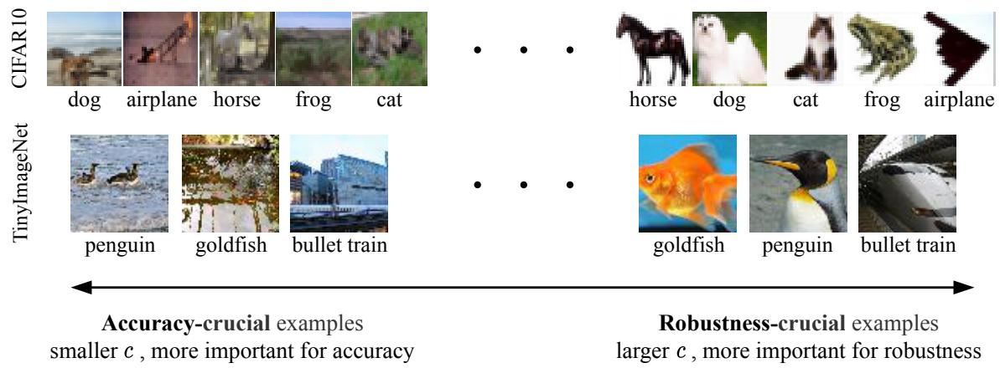

Examples sorted by their robustness confidence :

Figure 1: Identification for A-C and R-C examples in two datasets. More examples are shown in the appendix.  
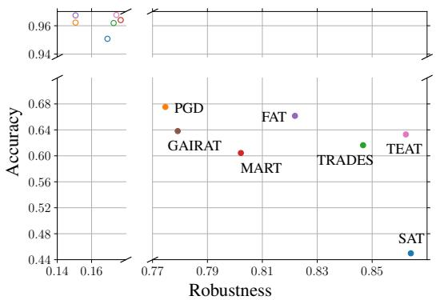  
(a) Test results of different AT methods

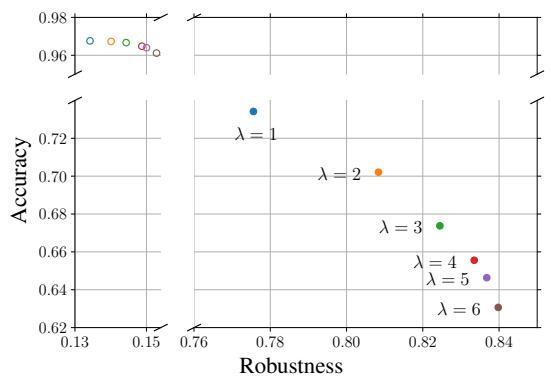  
(b) Test results of TRADES with different λ  
Figure 2: In two panels, the solid points correspond to the accuracy on the A-C examples subset and the robustness on the R-C examples subset. And the hollow points correspond to the accuracy on the R-C examples subset and the robustness on the A-C examples subset. The axes are broken for zooming in on details.

where $c _ { i } ^ { t } \in [ 0 , 1 ] .$ , α is the momentum factor and ${ p } _ { y } ( { \pmb x } _ { i } ^ { \prime } )$ is the predicted classification probability for true class y. At first epoch, $c _ { i } ^ { 1 }$ is initialized as ${ p } _ { y } ( { \pmb x } _ { i } ^ { \prime } )$ The accumulation of ${ p } _ { y } ( { \pmb x } _ { i } ^ { \prime } )$ in Equation (5) is achieved through temporal ensembling operation technique, which is also adopted in other works [23, 14, 18]. However, robustness confidence $c _ { i }$ serves a distinct purpose: it quantifies the model’s ability to correctly classify adversarial examples $\pmb { x } _ { i } ^ { \prime }$ generated from $\mathbf { \Delta } _ { \mathbf { \mathcal { X } } _ { i } }$ throughout the training process. A value of $c _ { i }$ closer to 1 implies that the model can more easily fit the adversarial features around x , whereas a value closer to 0 indicates that the model struggles to learn valid features from ${ \pmb x } i ^ { \prime }$ , as ${ p } _ { y } ( { \pmb x } _ { i } ^ { \prime } )$ remains small in every epoch.

## 3.2. Accuracy/Robustness-crucial examples

Based on proposed robustness confidence c, we define two types of examples: accuracy-crucial (A-C) and robustness-crucial (R-C). An A-C example is characterized by having a small robustness confidence, while an R-C example has a large robustness confidence. To illustrate the concept of A-C and R-C examples, we present a diagram in Figure 1. Additionally, we evaluate the performance of different adversarial training (AT) methods on subsets of A-C and R-C examples (i.e., 30% of the test examples with the smallest and largest c values, respectively) in Figure 2a. Since TRADES method can disentangle the accuracy and robustness of the model, we also vary λ in Equation (3) to investigate the changes of model performance on A-C and R-C examples, as shown in Figure 2b.

In Figure 2, we can observe the following: 1) The hollow points predominantly appear in the upper left corner, indicating that AT methods typically yield low robustness on A-C examples and high accuracy on R-C examples. 2) Compared to the hollow points, the solid points display noticeable variability in the lower right region, suggesting that the performance differences among these AT methods mainly stem from their accuracy on A-C examples and robustness on R-C examples. 3) The results of the TRADES method provide a more intuitive rule: improving robustness on R-C examples can lead to a decrease in accuracy on A-C examples, and vice versa. These findings offer a novel insight into AT: To strengthen the effectiveness of adversarial training, it is important to emphasize accuracy on A-C examples and robustness on R-C examples.

Table 1: Different treatments of some adversatial training methods and corresponding test results. The symbol +/ means the method tends to enhance/reduce the accuracy (Acc) or robustness (Rob) learning on A-C or R-C examples. The symbol / means the performance increases/decreases on A-C or R-C examples in test set (compared with TRADES). The symbol ✓/✗ means the method relieves/worsens the robust overfitting (RO). The treatments of each AT method are analyzed in detail in the appendix.
<table><tr><td rowspan="3"></td><td colspan="4">Treatments on training set</td><td colspan="7">Results on test set</td></tr><tr><td colspan="2">A-C examples</td><td colspan="2">R-C examples</td><td colspan="2">A-C examples</td><td colspan="2">R-C examples</td><td colspan="2">All examples</td><td rowspan="2">RO</td></tr><tr><td>Acc Rob</td><td></td><td>Acc</td><td>Rob</td><td>Acc</td><td>Rob</td><td>Acc Rob</td><td>Acc</td><td></td><td>Rob</td></tr><tr><td>SAT [14]</td><td>一</td><td></td><td></td><td></td><td>↓</td><td>↓</td><td></td><td>↑</td><td>V</td><td>←</td><td>L</td></tr><tr><td>MART [15]</td><td></td><td>十</td><td></td><td></td><td>↓</td><td>↑</td><td></td><td>↓</td><td>V</td><td>个</td><td>X</td></tr><tr><td>FAT [16]</td><td></td><td>一</td><td></td><td>一</td><td>↑</td><td>↑</td><td></td><td>↓</td><td>←</td><td>→</td><td>¬</td></tr><tr><td>GAIRAT [17]</td><td>十</td><td>十</td><td></td><td></td><td>↑</td><td>↑</td><td>↓</td><td>↓</td><td>→</td><td>←</td><td>X</td></tr><tr><td>TEAT [18]</td><td></td><td></td><td></td><td></td><td>↑</td><td></td><td></td><td>↑</td><td>←</td><td>←</td><td>L</td></tr><tr><td>Ours</td><td></td><td></td><td></td><td>+</td><td>↑</td><td></td><td></td><td>↑</td><td>←</td><td>←</td><td></td></tr></table>

The above conclusion motivate us to investigate how the insights derived from example-exploitation AT methods interact with the A-C and R-C examples. To ensure a viable comparison, we explore the correlation of robustness confidence (c) with other metrics studied in AT [17, 24, 25, 26] and find positive/negative correlations with them (see appendix for details). Thus, we can use c to uniformly analyze the treatments of examples in various AT methods. Table 1 summarizes different treatments and corresponding test results for some multi-step AT methods from four viewpoints: accuracy learning on A-C examples, accuracy learning on R-C examples, robustness learning on A-C examples and robustness learning on R-C examples. The table shows that some treatments have opposing strategies to others, such as MART and GAIRAT enhancing robustness learning on A-C examples while FAT and TEAT reducing this learning. Hence, it is imperative to conduct additional research on A-C/R-C examples to identify the optimal treatment that confers maximal benefits to AT.

## 4. Further exploitation on examples

In this section, we investigate the effect of A-C and R-C examples on the accuracy and robustness in AT by design-

ing comparative experiments. We propose a new treatment of examples that addresses how to handle A-C/R-C parts, and provide a simple implementation for its application.

## 4.1. Effect of A-C and R-C examples

As example-exploitation AT methods treat accuracycrucial (A-C) and robustness-crucial (R-C) examples differently, it is important to investigate how these two types of examples impact model performance. For this purpose, we utilize TRADES to disentangle the accuracy and robustness. The loss function of TRADES can be rewritten as

$$
\lambda _ { a c c } \cdot \mathrm { C E } \left( f ( \mathbf { \boldsymbol { x } } , \pmb { \theta } ) , \pmb { y } \right) + \lambda _ { r o b } \cdot \mathrm { K L } \left( f ( \mathbf { \boldsymbol { x } } , \pmb { \theta } ) \| f ( \mathbf { \boldsymbol { x } } ^ { \prime } , \pmb { \theta } ) \right)\tag{6}
$$

where the weights for CE and KL in Equation (6) are denoted by $\lambda _ { a c c }$ and $\lambda _ { r o b } ,$ , respectively. Since CE and KL are responsible for accuracy and robustness learning, increasing (decreasing) $\lambda _ { a c c } / \lambda _ { r o b }$ means we want the model to learn more (less) features to achieve a higher (lower) accuracy/robustness [27, 3]. Therefore, we can adjust them to investigate the influence on model performance when treating A-C/R-C examples differently.

We use $\mathcal { S } _ { A C }$ and $\cal { S } _ { R C }$ to denote two subsets consisting of 30% training examples with the smallest and largest $c _ { i } ^ { 4        \overline { { 9 } } }$ (just before the $5 0 _ { \mathrm { t h } }$ epoch, where the first learning rate decay occurs), respectively. For $\lambda _ { a c c } / \lambda _ { r o b }$ , we only change them for $S _ { A C } / S _ { R C }$ and keep them at default values for the remaining 70% examples (default $\lambda _ { a c c } / \lambda _ { r o b }$ is 1/6 in TRADES). The main observations from the experiments, shown in Figure 3, are as follows:

1. As shown in Figure 3a, enhancing the accuracy learning on A-C examples $\begin{array} { r l } { ( \lambda _ { a c c } \colon } & { { } 1  1 . 5 ) } \end{array}$ significantly improves the test accuracy but causes severe robust overfitting (the dashed orange line shows a noticeable downward tendency). Conversely, reducing the accuracy learning $( \lambda _ { a c c } )$ 1 0.5) relieves the robust overfitting but brings a large drop in accuracy. This observation is linked to the discovery that in order to improve accuracy, the model needs to memorize A-C examples [28, 29, 30], which will come at the cost of reduced robustness [18]. Therefore, modifying the accuracy learning on A-C examples to enhance the model’s accuracy or robustness may not be appropriate for AT.

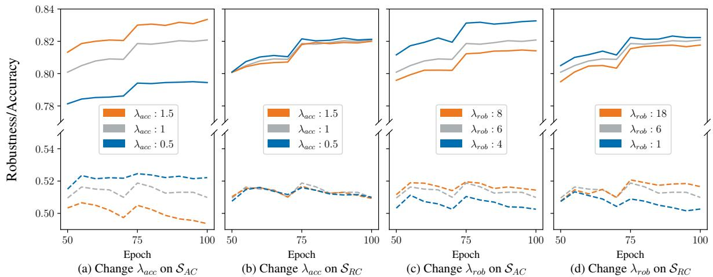  
Figure 3: Test accuracy (solid line) and robustness (dashed line) of models when change $\lambda _ { a c c } / \lambda _ { r o b }$ on $S _ { A C } / S _ { R C }$ in training after the first learning rate decay occurs $( 5 0 _ { \mathrm { t h } }$ epoch). $\mathrm { \ A t \ 7 5 _ { t h } }$ epoch, the second learning rate decay occurs. The $\lambda _ { a c c }$ is 1 and the $\lambda _ { r o b }$ is 6 if not specified. We vary $\lambda _ { r o b }$ by a larger degree in panel (d) to obtain the change between curves comparable to that in panel (c).

2. As shown in Figure 3b, changing $\lambda _ { a c c }$ for R-C examples has less impact on test performance. This is due to the fact that the model has already generalized R-C examples well in the early stage of training [31]. Therefore, changing the accuracy learning on R-C examples to improve the model accuracy or robustness may have a negligible effect on AT. 3. By comparing the results presented in Figure 3c and 3d, it becomes evident that the trade-off between accuracy and robustness is influenced differently depending on whether we decrease or increase the robustness learning on A-C or R-C examples. Specifically, when the robustness learning is reduced (represented by the blue lines), decreasing $\lambda _ { r o b }$ on A-C examples (as shown in Figure 3c) results in more accuracy improvements with fewer sacrifices in robustness compared to decreasing $\lambda _ { r o b }$ on R-C examples (as shown in Figure 3d). On the other hand, when enhancing the robustness learning (represented by the orange lines), increasing $\lambda _ { r o b }$ on R-C examples (as shown in Figure 3d) leads to more improvements in robustness with less loss in accuracy compared to increasing $\lambda _ { r o b }$ on A-C examples (as shown in Figure 3c). These results highlight the distinct impact of A-C and R-C examples on adversarial training, and indicate that the most effective approach for enhancing the accuracyrobustness trade-off is to reduce (or enhance) the robustness learning on A-C (or R-C) examples.

## 4.2. Reasonableness of new treatment

Based on our observations, we propose an appropriate treatment for examples in AT: reduce the robustness learning on A-C examples and enhance the robustness learning on R-C examples. We found that R-C examples have salient features while A-C examples have misleading features, as illustrated in Figure 1. The R-C examples on the right are easily identifiable as true classes, while the A-C examples on the left are challenging even for humans to recognize the inner objects. Moreover, when comparing A-C and R-C examples within a single class (see appendix), we observed that the R-C examples share strong visual similarities, while the A-C examples exhibit diverse visual characteristics. Several works have demonstrated that to defend against adversarial examples, AT should learn more salient features aligned with human perception [27, 32, 33, 34], which supports our proposed treatment of emphasizing robustness learning on R-C examples.

## 4.3. Application of new treatment

Applying our treatment is easy and flexible. Here we introduce a straightforward way to integrate the treatment into AT. Specifically, we can replace a fixed hyper-parameter of existing methods with an adaptive one to adjust the degree of robustness learning for each example.

Taking multi-step TRADES method for instance, the hyper-parameter λ in its loss (Equation (3)) is fixed for all examples. Using a larger fixed λ will lead to higher robustness but lower accuracy of the model [3]. Guided by our treatment of examples, replacing the fixed λ, we assign a different $\lambda _ { i }$ to each training example $\mathbf { \Delta } _ { \mathbf { \mathcal { X } } _ { i } }$ by linear interpolation according to the position of $\mathbf { \Delta } _ { \mathbf { \mathcal { X } } _ { i } }$ in the ranking result of all examples using robustness confidence c. At the $t _ { \mathrm { t h } }$ epoch, $\lambda _ { i }$ can be expressed as

Algorithm 1: Implementation for the proposed treatment in AT   
Require: Training dataset D, model f with parameters θ, attacker A (from TRADES or FastAT), batch size m, number of epochs   
T, initial warm-up epochs $T _ { s } ( T _ { s } > 2 ) , ( \lambda _ { \operatorname* { m i n } } , \lambda _ { \operatorname* { m a x } } )$ for multi-step AT, $( a _ { \mathrm { m i n } } , a _ { \mathrm { m a x } } )$ for single-step AT   
$/ /$ \*\*\*\*\*\* For multi-step AT \*\*\*\*\*\* $/ /$ \*\*\*\*\*\* For single-step AT \*\*\*\*\*\*   
for t = 1 to T do for t = 1 to T do   
if t $\geq T _ { s }$ then Calculate $c _ { i } ^ { t }$ in Equation (5); $\mathbf { i f } t \geq T _ { s }$ then Calculate $c _ { i } ^ { t }$ in Equation $( 5 ) ;$   
for mini-batch $\{ ( x _ { 1 } , y _ { 1 } ) , \dotsc , ( x _ { m } , y _ { m } ) \} \subset \mathcal { D }$ do for mini-batch $\{ ( x _ { 1 } , y _ { 1 } ) , \dotsc , ( x _ { m } , y _ { m } ) \} \subset \mathcal { D }$ do   
for i = 1 to m (in parallel) do for $i = 1$ to m (in parallel) do   
i $\mathit { i t } < T _ { s }$ then $\lambda _ { i } = \lambda _ { \operatorname* { m i n } }$ else Calculate $\lambda _ { i }$ if $t < T _ { s }$ then $a _ { i } = a _ { \operatorname* { m i n } }$ else Calculate $a _ { i }$   
in Equation (7); in Equation (9);   
$\pmb { \delta } _ { i } = \mathrm { \bar { A } } ( \pmb { x } _ { i } ) ; \pmb { x } _ { i } ^ { \prime } = \pmb { x } _ { i } + \pmb { \delta } _ { i } ;$ $\pmb { \delta } _ { i } = \mathrm { { A } } ( \pmb { x } _ { i } , a _ { i } ) ; \pmb { x } _ { i } ^ { \prime } = \pmb { x } _ { i } + \pmb { \delta } _ { i } ;$   
end end   
Optimize θ in Equation (8) using $\lambda _ { i } ;$ Optimize θ in Equation (11);   
end end   
end end

$$
\lambda _ { i } = \lambda _ { \operatorname* { m i n } } + \frac { \lambda _ { \operatorname* { m a x } } - \lambda _ { \operatorname* { m i n } } } { M - 1 } \cdot \left( \mathrm { a r g s o r t } _ { { \pmb x } _ { i } } ( c ^ { t } ) - 1 \right)\tag{7}
$$

where M is the number of training examples, $\lambda _ { \mathrm { m i n } }$ and $\lambda _ { \mathrm { m a x } }$ define the range of different $\lambda _ { i } ,$ , and argsort determines the rank index of $c _ { i } ^ { t }$ in all $c ^ { t }$ in ascending order. $\lambda _ { \operatorname* { m i n } }$ is the value for the $\mathrm { A } { - } \mathbf { C }$ example with the smallest c at every epoch, and $\lambda _ { \mathrm { m a x } }$ is the value for the R-C example with the largest c. The loss function of such updated TRADES is

$$
\begin{array} { r } { \mathrm { C E } \left( f ( \mathbf { x } _ { i } , \pmb { \theta } ) , \pmb { y } _ { i } \right) + \lambda _ { i } \cdot \mathrm { K L } \left( f ( \pmb { x } _ { i } , \pmb { \theta } ) \| f ( \pmb { x } _ { i } ^ { \prime } , \pmb { \theta } ) \right) . } \end{array}\tag{8}
$$

For single-step AT, considering FastAT method as a case, we use adaptive step-size $a _ { i }$ instead the fixed one for each example $\mathbf { \Delta } _ { \mathbf { \mathcal { X } } _ { i } }$ to generate adversarial perturbation $\delta _ { i }$ in training process:

$$
a _ { i } = a _ { \operatorname* { m i n } } + \frac { a _ { \operatorname* { m a x } } - a _ { \operatorname* { m i n } } } { M - 1 } \cdot \left( \mathrm { a r g s o r t } _ { { \pmb x } _ { i } } ( c ^ { t } ) - 1 \right) ;\tag{9}
$$

$$
\delta _ { i } = a _ { i } \cdot \mathrm { s i g n } \bigl ( \nabla _ { \pmb { x } _ { i } } \mathrm { C E } ( f ( \pmb { x } _ { i } ; \pmb { \theta } ) , y _ { i } ) \bigr ) .\tag{10}
$$

Comparing Equation (9) with Equation (7), we can find $a _ { i }$ is calculated in the same way as $\lambda _ { i }$ and the range of $a _ { i }$ is also determined by two hyper-parameters $a _ { \mathrm { m i n } }$ and $a _ { \mathrm { m a x } }$ The loss function of such updated FastAT is

$$
\mathrm { C E } \left( f ( \pmb { x } _ { i } + \pmb { \delta } _ { i } , \pmb { \theta } ) , \pmb { y } _ { i } \right) .\tag{11}
$$

As presented above, we can implement our treatment in AT by simply assigning large/small $\lambda _ { i }$ and $a _ { i }$ to $\mathrm { R - C / A - }$ C examples. The extra computational costs (memory and time) are negligible. Algorithm 1 outlines the training procedures for both implementations.

## 5. Advantages of new treatment

In this section, we apply our treatment to more AT methods and evaluate their performance. Our experimental results corroborate the effectiveness of the proposed treatment in alleviating three critical challenges in AT: the tradeoff between accuracy and robustness, robustness overfitting, and catastrophic overfitting.

Settings of experiments We conduct experiments on three datasets: CIFAR10, CIFAR100 [21], and TinyImageNet [35]. The models used include PreAct ResNet [22] (for CIFAR10 and CIFAR100) and Wide ResNet [36] (for TinyImageNet). All models are trained for 100 epochs on a single NVIDIA 3090 GPU. To evaluate the robustness, we adopt $\ell _ { \infty }$ -norm PGD [2] and Auto [37] methods to generate adversarial examples. For PGD attack, we use PGDn to represent PGD attack with n iterations. We perform Auto attack using open-source toolboxes with default settings [37]. We conduct three independent trials with different random seeds and report the means. As the standard deviations are small and have no impact on the results, we omit them from the table to save space. The appendix includes more detailed hyper-parameters as well as additional experimental results and ablation studies.

## 5.1. Improvement on accuracy-robustness trade-off

As mentioned in Section 4.1, our treatment can improve the trade-off between accuracy and robustness. To confirm this benefit, we update two examples-exploitation AT methods, the classic TRADES [3] and state-of-the-art TEAT [18], based on the approach proposed in Section 4.3, and compare them with their original versions. The trade-off curves for these methods are shown in Figure 4, where we observe that, in comparison with original method, the updated method achieves improved robustness without sacrificing accuracy, and vice versa. These results validate our conclusion that the proposed treatment effectively exploits A-C examples with outlying features to improve accuracy and R-C examples with salient features to improve robustness.

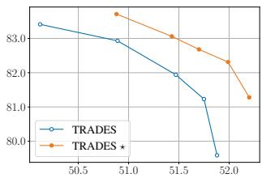

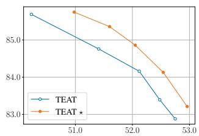  
(a) On CIFAR10 testset

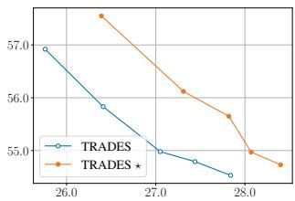

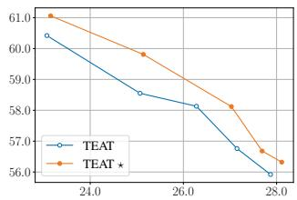  
(b) On CIFAR100 testset  
Figure 4: The trade-off comparison between original and updated (denoted with ⋆) methods. The robustness is evaluated by PGD-20 attack. We vary the $\lambda / \lambda _ { \operatorname* { m i n } } , \lambda _ { \operatorname* { m a x } }$ in these methods for better accuracy or robustness. The x-/y-axis indicates the robustness/accuracy.

## 5.2. Inspiration for relieving robustness overfitting

To relieve the issue of robustness overfitting (RO), which is characterized by a slow decline in robustness that typically occurs in the later stage (after the first learning decay happens) of multi-step AT, TEAT hinders the model from excessively memorizing difficult examples. However, we discover that enhancing robust learning for easy R-C examples, can also relieve RO. As depicted in Figure 5, increasing $\lambda _ { \mathrm { m a x } }$ to enhance the robustness learning of R-C examples further relieves robustness degradation in the late training stages. By combining these ideas, we can more intuitively interpret the RO phenomenon: The model expects to learn robustness from R-C examples with salient features, but the memorization effect [28, 18] may lead the model to focus on A-C examples in the later training stage, whose features are inconsistent with those of R-C examples, causing a decline in robustness. As a result, maintaining robustness learning on R-C examples should be prioritized to relieve RO.

## 5.3. Effective for preventing catastrophic overfitting

Catastrophic overfitting (CO) is a major challenge in single-step adversarial training, where robustness rapidly degrades after a certain training epoch. Current solutions

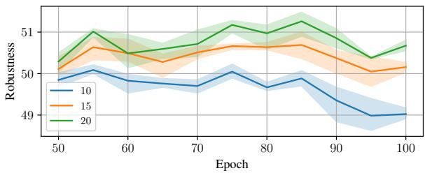  
(a) On CIFAR10 testset

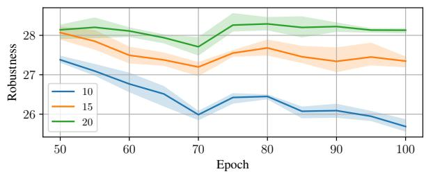  
(b) On CIFAR100 testset  
Figure 5: Comparison of robust overfitting after the first learning decay happens $\mathrm { ( 5 0 _ { t h } }$ epoch) with different parameters. The test curves are evaluated by PGD-20 attack. The $\lambda _ { \mathrm { m i n } }$ is fixed to 1 and $\lambda _ { \mathrm { m a x } }$ is chosen from 10, 15, 20.

Table 2: Test performance (%) of original and updated (denoted with ⋆) single-step AT methods. The test checkpoint of FastAT is selected before CO happens with the best robustness. We set a to 10 for original methods following their default settings [7, 20]. For the updated methods, we adjust $a _ { \mathrm { m i n } } , a _ { \mathrm { m a x } }$ to make one of accuracy and robustness similar to the original method to provide a more obvious comparison.

<table><tr><td rowspan="2">Dataset</td><td rowspan="2">Method</td><td rowspan="2">Accuracy</td><td colspan="2">Robustness</td></tr><tr><td>PGD-50</td><td>Auto</td></tr><tr><td rowspan="4">CIFAR10</td><td>FastAT</td><td>76.13</td><td>41.30</td><td>38.94</td></tr><tr><td>FastAT ★</td><td>89.22</td><td>38.98</td><td>37.27</td></tr><tr><td>GradAlign</td><td>75.96</td><td>42.28</td><td>38.41</td></tr><tr><td>GradAlign *</td><td>76.50</td><td>44.29</td><td>40.58</td></tr><tr><td rowspan="4">CIFAR100</td><td>FastAT</td><td>48.47</td><td>20.25</td><td>16.93</td></tr><tr><td>FastAT *</td><td>61.29</td><td>17.79</td><td>16.75</td></tr><tr><td>GradAlign</td><td>48.65</td><td>20.26</td><td>17.03</td></tr><tr><td>GradAlign *</td><td>49.78</td><td>20.69</td><td>17.38</td></tr><tr><td rowspan="4">TinyImageNet</td><td>FastAT</td><td>34.72</td><td>13.53</td><td>9.64</td></tr><tr><td>FastAT *</td><td>61.03</td><td>13.18</td><td>11.92</td></tr><tr><td>GradAlign</td><td>35.54</td><td>14.74</td><td></td></tr><tr><td>GradAlign *</td><td>53.36</td><td>15.83</td><td>11.28 12.61</td></tr></table>

to this problem often require non-trivial modifications to the training process, which come with additional computational burden [20, 25, 11]. However, from the perspective of example exploitation, we find that CO can be prevented almost cost-free. To this end, we update two single-step AT methods, FastAT [7] and GradAlign [20], according to the approach outlined in Section 4.3.

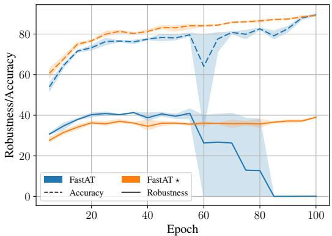  
(a) On CIFAR10 testset

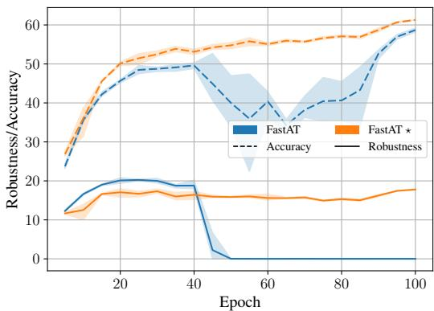  
(b) On CIFAR100 testset  
Figure 6: Comparison of test curves of FastAT method before and after (denoted with ⋆) the update. The robustness curves are evaluated by PGD-50 attack.

FastAT is a classic method whose proposed random initialization technique has been adopted in subsequent singlestep works. However, it still cannot prevent CO definitively. Our treatment can effectively prevent catastrophic overfitting (CO) in FastAT method with 100 training epochs. The results are presented in Figure 6, where the test curves of FastAT before and after the update are compared. It can be observed that FastAT suffers from CO, causing a rapid degradation of robustness to 0% on both CIFAR10 and CI-FAR100 datasets. However, after applying our treatment based on example exploitation, FastAT exhibits stable robustness and a significant improvement in accuracy. Specifically, considering the detailed results in Table 2, we observe that the updated FastAT method sacrifices up to 2.46% of its robustness in exchange for the ability to prevent CO. Furthermore, our treatment yields a significant improvement in accuracy, of at least 12.82%, owing to the enhanced contribution of A-C examples. The GradAlign method aims to prevent CO by maximizing the gradient alignment inside the perturbation set. The results in Table 2 demonstrate that our treatment can further enhance its performance in terms of both accuracy and robustness. Our successful application of the treatment to FastAT and GradAlign methods highlights the potential of example-exploitation as a promising approach for preventing CO and enhancing the performance of single-step AT.

## 6. Discussion of proposed application

When considering the application of existing treatments in different example-exploitation methods, we acknowledge that the treatment we designed in Section 4.3 is the simplest. There is potential to apply our treatment in a more advanced way. For instance, the weight assignment function could be changed from a linear to a more advanced non-linear function, such as sigmoid or tanh [17]. Additionally, the adjustment of robustness learning on different examples, which is implemented by controlling the λ parameter for the KL loss in our application, can also be accomplished by varying the attack strength of generated adversarial examples during training [16]. Furthermore, it is feasible to emphasize the contribution of A-C and R-C examples to AT by adding a new regularization term to the loss [15].

The primary contribution in this paper is a treatment for examples that is better suited for adversarial training. Our proposed application approach serves as a validation of the effectiveness of this treatment. Although more advanced application approaches may potentially yield better performance, we did not extensively study them. This is because, for future works seeking to benefit from the exploitation of examples, the application approach may vary depending on the specific use case, but the guiding insight we provide will remain constant.

## 7. Conclusions

This paper focuses on example-exploitation adversarial training and investigates the unequal contribution of examples to the accuracy and robustness of the model. We identify two types of examples, namely accuracy-crucial and robustness-crucial, which have different roles in adversarial training. We conduct a systematic analysis of the different treatments in various methods and propose a novel treatment that guides both multi-step and single-step AT. Specifically, our treatment reduces robustness learning on accuracy-crucial examples and enhances it on robustnesscrucial examples. The experimental results demonstrate that using this treatment in adversarial training can effectively alleviate critical challenges in AT, including the accuracy-robustness trade-off, robust overfitting, and catastrophic overfitting.

## References

[1] Christian Szegedy, Wojciech Zaremba, Ilya Sutskever, Joan Bruna, Dumitru Erhan, Ian J. Goodfellow, and Rob Fergus. Intriguing properties of neural networks. In International Conference on Learning Representations (ICLR), 2014. 1

[2] Aleksander Madry, Aleksandar Makelov, Ludwig Schmidt, Dimitris Tsipras, and Adrian Vladu. Towards deep learning models resistant to adversarial attacks. In International Conference on Learning Representations (ICLR), 2018. 1, 2, 6

[3] Hongyang Zhang, Yaodong Yu, Jiantao Jiao, Eric P. Xing, Laurent El Ghaoui, and Michael I. Jordan. Theoretically principled trade-off between robustness and accuracy. In International Conference on Machine Learning (ICML), 2019. 1, 2, 4, 5, 6

[4] Kui Ren, Tianhang Zheng, Zhan Qin, and Xue Liu. Adversarial attacks and defenses in deep learning. Engineering, 6(3):346–360, 2020. 1

[5] Tao Bai, Jinqi Luo, Jun Zhao, Bihan Wen, and Qian Wang. Recent advances in adversarial training for adversarial robustness. In International Joint Conference on Artificial Intelligence (IJCAI), 2021. 1

[6] Leslie Rice, Eric Wong, and J. Zico Kolter. Overfitting in adversarially robust deep learning. In International Conference on Machine Learning (ICML), 2020. 1

[7] Eric Wong, Leslie Rice, and J. Zico Kolter. Fast is better than free: Revisiting adversarial training. In International Conference on Learning Representations (ICLR), 2020. 1, 2, 7, 8

[8] Cihang Xie, Yuxin Wu, Laurens van der Maaten, Alan L. Yuille, and Kaiming He. Feature denoising for improving adversarial robustness. In IEEE Conference on Computer Vision and Pattern Recognition (CVPR), 2019. 1

[9] Cihang Xie, Mingxing Tan, Boqing Gong, Jiang Wang, Alan L. Yuille, and Quoc V. Le. Adversarial examples improve image recognition. In IEEE Conference on Computer Vision and Pattern Recognition (CVPR), 2020. 1

[10] Tianlong Chen, Zhenyu Zhang, Sijia Liu, Shiyu Chang, and Zhangyang Wang. Robust overfitting may be mitigated by properly learned smoothening. In International Conference on Learning Representations (ICLR), 2021. 1

[11] Tao Li, Yingwen Wu, Sizhe Chen, Kun Fang, and Xiaolin Huang. Subspace adversarial training. In IEEE Conference on Computer Vision and Pattern Recognition (CVPR), 2022. 1, 7

[12] Yair Carmon, Aditi Raghunathan, Ludwig Schmidt, John C. Duchi, and Percy Liang. Unlabeled data improves adversarial robustness. In Advances in neural information processing systems (NeurIPS), 2019. 1

[13] Sven Gowal, Sylvestre-Alvise Rebuffi, Olivia Wiles, Florian Stimberg, Dan Andrei Calian, and Timothy A. Mann. Improving robustness using generated data. In Advances in neural information processing systems (NeurIPS), 2021. 1

[14] Lang Huang, Chao Zhang, and Hongyang Zhang. Selfadaptive training: beyond empirical risk minimization. In Advances in Neural Information Processing Systems (NeurIPS), 2020. 1, 2, 3, 4

[15] Yisen Wang, Difan Zou, Jinfeng Yi, James Bailey, Xingjun Ma, and Quanquan Gu. Improving adversarial robustness requires revisiting misclassified examples. In International Conference on Learning Representations (ICLR), 2020. 1, 2, 4, 8

[16] Jingfeng Zhang, Xilie Xu, Bo Han, Gang Niu, Lizhen Cui, Masashi Sugiyama, and Mohan S. Kankanhalli. Attacks which do not kill training make adversarial learning stronger. In International Conference on Machine Learning (ICML), 2020. 1, 2, 4, 8

[17] Jingfeng Zhang, Jianing Zhu, Gang Niu, Bo Han, Masashi Sugiyama, and Mohan Kankanhalli. Geometry-aware instance-reweighted adversarial training. In International Conference on Learning Representations (ICLR), 2021. 1, 2, 4, 8

[18] Yinpeng Dong, Ke Xu, Xiao Yang, Tianyu Pang, Zhijie Deng, Hang Su, and Jun Zhu. Exploring memorization in adversarial training. In International Conference on Learning Representations (ICLR), 2022. 1, 2, 3, 4, 5, 6, 7

[19] Ian J. Goodfellow, Jonathon Shlens, and Christian Szegedy. Explaining and harnessing adversarial examples. In International Conference on Learning Representations (ICLR), 2015. 2

[20] Maksym Andriushchenko and Nicolas Flammarion. Understanding and improving fast adversarial training. In Advances in Neural Information Processing Systems (NeurIPS), 2020. 2, 7, 8

[21] Alex Krizhevsky, Geoffrey Hinton, et al. Learning multiple layers of features from tiny images (https://www.cs.toronto.edu/ kriz/cifar.html). 2009. 2, 6

[22] Kaiming He, Xiangyu Zhang, Shaoqing Ren, and Jian Sun. Identity mappings in deep residual networks. In European Conference on Computer Vision (ECCV), 2016. 2, 6

[23] Samuli Laine and Timo Aila. Temporal ensembling for semisupervised learning. In International Conference on Learning Representations (ICLR), 2017. 3

[24] Chengyu Dong, Liyuan Liu, and Jingbo Shang. Data quality matters for adversarial training: An empirical study. arXiv preprint, arXiv:2102.07437, 2021. 4

[25] Hoki Kim, Woojin Lee, and Jaewook Lee. Understanding catastrophic overfitting in single-step adversarial training. In Conference on Artificial Intelligence (AAAI), 2021. 4, 7

[26] Zhichao Huang, Yanbo Fan, Chen Liu, Weizhong Zhang, Yong Zhang, Mathieu Salzmann, Sabine Susstrunk, and Jue¨ Wang. Fast adversarial training with adaptive step size. arXiv preprint, arXiv:2206.02417, 2022. 4

[27] Andrew Ilyas, Shibani Santurkar, Dimitris Tsipras, Logan Engstrom, Brandon Tran, and Aleksander Madry. Adversarial examples are not bugs, they are features. In Advances in

Neural Information Processing Systems (NeurIPS), 2019. 4, 5

[28] Devansh Arpit, Stanislaw Jastrzebski, Nicolas Ballas, David Krueger, Emmanuel Bengio, Maxinder S. Kanwal, Tegan Maharaj, Asja Fischer, Aaron C. Courville, Yoshua Bengio, and Simon Lacoste-Julien. A closer look at memorization in deep networks. In International Conference on Machine Learning (ICML), 2017. 5, 7

[29] Vitaly Feldman and Chiyuan Zhang. What neural networks memorize and why: Discovering the long tail via influence estimation. In Advances in Neural Information Processing Systems (NeurIPS), 2020. 5

[30] Yangdi Lu, Yang Bo, and Wenbo He. Confidence adaptive regularization for deep learning with noisy labels. arXiv preprint, arXiv:2108.08212, 2021. 5

[31] Mariya Toneva, Alessandro Sordoni, Remi Tachet des Combes, Adam Trischler, Yoshua Bengio, and Geoffrey J. Gordon. An empirical study of example forgetting during deep neural network learning. In International Conference on Learning Representations (ICLR), 2019. 5

[32] Shibani Santurkar, Andrew Ilyas, Dimitris Tsipras, Logan Engstrom, Brandon Tran, and Aleksander Madry. Image synthesis with a single (robust) classifier. In Advances in Neural Information Processing Systems (NeurIPS), 2019. 5

[33] Logan Engstrom, Andrew Ilyas, Shibani Santurkar, Dimitris Tsipras, Brandon Tran, and Aleksander Madry. Adversarial robustness as a prior for learned representations. arXiv preprint, arXiv:1906.00945, 2019. 5

[34] Dimitris Tsipras, Shibani Santurkar, Logan Engstrom, Alexander Turner, and Aleksander Madry. Robustness may be at odds with accuracy. In International Conference on Learning Representations (ICLR), 2019. 5

[35] Ya Le and Xuan Yang. Tiny imagenet visual recognition challenge. CS 231N, 7(7):3, 2015. 6

[36] Sergey Zagoruyko and Nikos Komodakis. Wide residual networks. In Proceedings of the British Machine Vision Conference (BMVC), 2016. 6

[37] Francesco Croce and Matthias Hein. Reliable evaluation of adversarial robustness with an ensemble of diverse parameter-free attacks. In International Conference on Machine Learning (ICML), 2020. 6