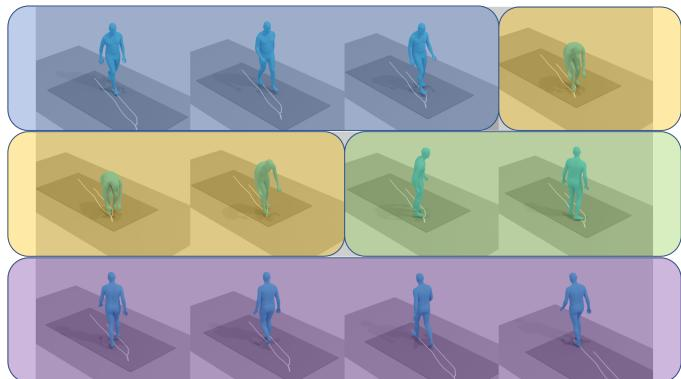
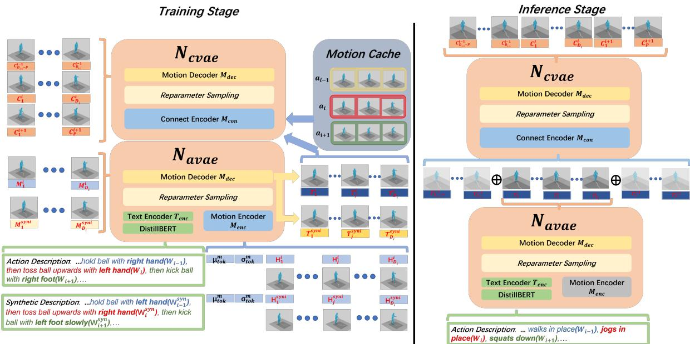
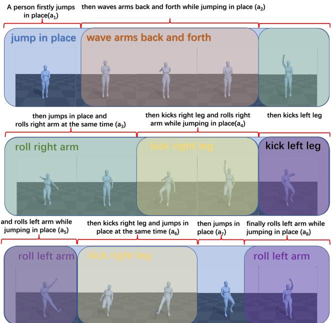
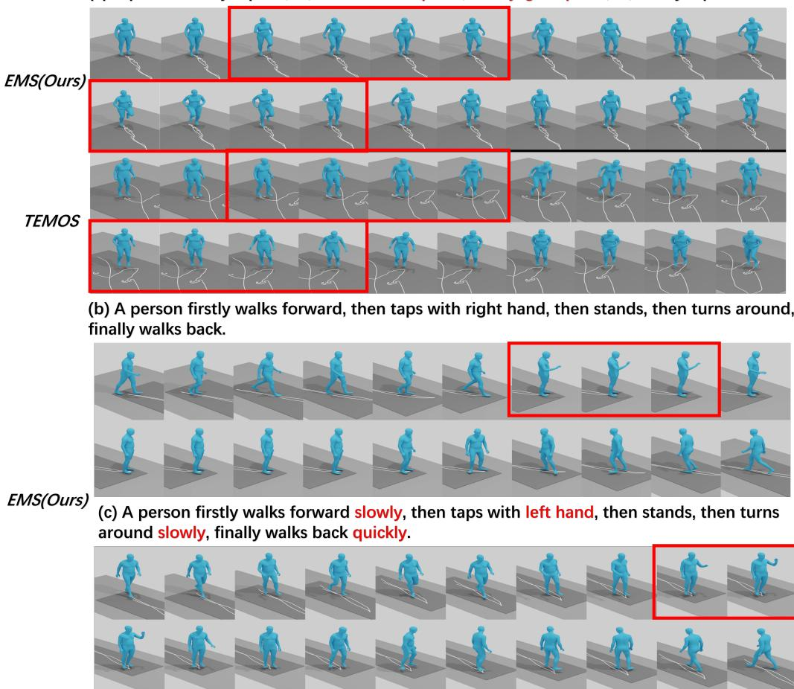

# Breaking The Limits of Text-conditioned 3D Motion Synthesis with Elaborative Descriptions

Yijun Qian1,2, Jack Urbanek1, Alexander G. Hauptmann2, Jungdam Won3\* META AI1, Carnegie Mellon University2, Seoul National University3

yijunq@meta.com,jju@meta.com,alex@cs.cmu.edu,jungdam@imo.snu.ac.kr

## Abstract

Given its wide applications, there is increasing focus on generating 3D human motions from textual descriptions. Differingfrom the majority ofprevious works, which regard actions as single entities and can only generate short sequences for simple motions, we propose EMS, an elaborative motion synthesis model conditioned on detailed natural language descriptions. It generates natural and smooth motion sequencesfor long and complicated actions byfactorizing them into groups of atomic actions. Meanwhile, it understands atomic-action level attributes (e.g., motion direction, speed, and body parts) and enables users to generate sequences of unseen complex actions from unique sequences of known atomic actions with independent attribute settings and timings applied. We evaluate our method on the KIT Motion-Language and BABEL benchmarks, where it outperforms all previous state-of-the-art with noticeable margins.

## 1. Introduction

Generating 3D human motions has been widely used in many areas, such as in film and game industries to animate characters in the scene or in sports and medical applications to analyze and explain the movement of players and patients, respectively. Many of these tasks have resorted to motion data, which require laborious manual work by animators or high recording costs. Furthermore, existing tools often are not user-friendly and require extensive training in advance of using the tools. Recently, attention to generating 3D human motions conditioned on natural language descriptions (i.e., text-to-motion) has grown in the vision and graphics community as an alternative method that can provide high-quality and flexible results from one of the most intuitive and comfortable interfaces for people, which is a textual description. The task, however, is challenging, given the diversity of language descriptions and complexity of 3D human motion synthesis. Many recent works have attempted to make progress in this space. The earliest works [13, 28] focus on generating motions conditioned on a single action label (i.e., a word); however, action labels contain limited semantic representations and can’t guide detailed motion generation as a result. The following works [23, 10, 2] naturally go further by encoding longer natural language descriptions as text input. The most recent works [17, 29, 39, 6] either focus on improving the generalization of extracted semantic representations or improving the generation quality of the motion synthesis module. To the best of our knowledge, all of them try to generate a single latent vector to describe the whole textual input then forward it to a decoder for motion synthesis. If regarding generated motions as a ”visualized” language, previous works are similar to seq-to-seq methods designed for sentence-to-sentence translation. It works well when the natural language input contains limited semantic information which can be fully covered by a single sentence. However, such methods would have difficulties to model all the semantic representations and inherited dependencies when the input information increases to a paragraph or article level. Furthermore, the GPU memory size will limit the maximum length of the input sequence, making the methods unable to tackle the full paragraph or article as a single entity. A natural idea may come up as directly factorizing the input paragraph into sentences and then applying a seqto-seq method autoregressively to translate the factorized sentences one by one. However, given the successful experience in [8, 46], such simple concatenation won’t work well because it doesn’t capture the contextual information thoroughly where the same sentence may have different semantic meanings depending on its contexts. This also applies to text-conditioned motion synthesis. For example, the same ”stand up” action could be visually different when its previous action is either ”sit down” or ”squat down”.

  
Action-level Description: [“A person lifts things up.", 12 sec] Atomic action-level Description: [[“A person firstly walks forward, then lifts things up, then turns around, finally walks back” ], [3 sec, 3 sec, 2 sec, 4 sec]]  
Figure 1. The majority of previous works are conditioned on the ambiguous action-level description, which prevents them from generating motion sequences with detailed controls (e.g., they can’t explicitly generate motions of lifting things up in place or at another location). On the other hand, our model conditioned on the atomic action-level description can easily generate motion sequences with detailed controls.

Inspired by this, we propose EMS, an Elaborative Motion Synthesis model conditioned on detailed natural language descriptions. EMS aims to generate natural and smooth 3D motion sequences of complicated actions by factorizing them into components of atomic actions. As is shown in Figure 2, EMS is a two-stage generation model where a sequence of atomic actions (i.e., unique behaviors) are first generated by the atomic action generation subnet $N _ { a v a e }$ then they are refined and connected by the connection sub-net $N _ { c v a e }$ In our implementation, both of the sub-nets are transformer-based variational auto-encoders (VAE). However, our framework does not rely on specific ”sentence-level” translation backbones, so we can also use the recently released diffusion module [39] or graph GAN[1] as our backbone. Although our model is especially designed for generating complicated long motion sequences, when compared with previous state-of-the-art on KIT-ML benchmark, our model still outperforms in all existing metrics with noticeable margins. When it comes to the more challenging BABEL benchmark, our method is on average 36 percent better than the previous SOTA.

In a nutshell, our contributions are four-fold:

• We propose EMS, a two-stage text-conditioned elaborative motion synthesis model which generates smooth and natural 3D motion sequences for complicated actions given detailed natural language descriptions. Users can generate sequences of unseen complex actions from unique sequences of known atomic actions with independent attribute settings and timings applied.

• We propose Natural Loss for the text-to-motion task, an objective function especially designed to judge if the generated motions look natural by calculating the difference between prior and posterior distributions.

• We built a synthetic (i.e., augmented) dataset containing contrastive atomic action samples, which enable the model to understand atomic-action level attributes.

• We demonstrate that our model outperforms all previous SOTA in various metrics with noticeable margins on the two existing benchmarks.

## 2. Related Works

In this section, we will briefly review previous literature on motion synthesis and text-conditioned motion generation. Although there are many other text-conditioned generation tasks, like image generation [16, 15] and video generation [7, 14], as they focus on generating different modalities, often with much larger datasets, we won’t discuss them here.

Human Motion Synthesis Human motion synthesis requires the model to generate human motions either conditioned on specific types of modalities or from unconstrained distributions. Thus, there are two main categories of motion synthesis, 1) conditioned synthesis and 2) unconditioned synthesis. The first types of methods aim to generate motion sequences based on a specific kind of modality like music [19, 21, 22], speech [11, 5, 3], and text [23, 25, 1, 2] etc. The latter ones [26, 35, 37, 44, 48] directly generate motions from an unconstrained distribution, which allows the model to generate numerous samples but users basically can’t intervene the generation process. Lately there are three mainstream methods, VAEs[13, 28], GANs[1, 25], and Diffusions[39]. Our EMS model should be recognized as one of the text-conditioned motion generation methods. But it mainly focuses on providing a new perspective on synthesizing motion sequences of complicated actions.

Text-conditioned Motion Generation Thanks to the great success of large language models [8, 9, 40] in recent years, it’s now possible to extract robust semantic representations directly from natural language descriptions. The leading pipelines of current text-conditioned motion generation methods all focus on mapping the extracted semantic representations and motion features to the same distribution in a shared latent space, then implementing a decoder that translates latent variables to 3-dimensional motions. For example, some methods [31, 47] use 2D body motions with fixed root joints, which makes the generated motion incomplete for many applications since they are unable to model the global trajectory. Another method [1] applies 2D pose estimation on captioned video datasets and projects the joints to 3D axis with manual data cleaning. However, due to the heavy occlusion of lower bodies, they can only model the upper body motions. Most recent works [24, 43, 12, 20, 29, 23, 25, 1, 10, 14, 17] directly use 3D motion capture datasets [30, 32] with textual descriptions. The majority of them[24, 12, 29, 23, 25, 1, 10, 14, 17, 12, 39, 49] are trying to combine different language extractors and motion synthesis backbones. They still treat the motions and descriptions as single entities. As discussed before, this leads the model to easily overfit and also prevents the model from generating motion sequences for long and complex actions.

There exist previous studies that are similar to ours [43, 20], where they propose a multi-act action generator. However, firstly they only use action tags (words) as input, which contains very limited semantic representations. For example, when generating a ”kick” action, they can neither control the avatar using left feet or right feet to kick the ball nor generate a fast kick or slowly kick. Secondly, they simply assemble the atomic action sequences and don’t make full use of both textual and motion contextual information. E.g. TEACH [4] does not incorporate any motion context and only includes the action label of the preceding action for text context, our model significantly broadens this context scope. Lastly, we propose a unique natural loss to eliminate the discontinuity during connection stages.

There also has been an attempt to build a system that is most similar to what we aim for [45]. The system is basically developed for pre-visualization of movies, where it can generate 3D human motions of multiple characters interacting with each other given movie scripts. Although impressive motions with details were generated from a simple interface that can easily be controlled by users, the system can only handle limited scenarios, motion generation for a scenario often takes several hours due to computationally expensive stochastic optimization, and the input script needs to be converted as a form of a directed acyclic graph called an event graph. Note that the system was developed before recent breakthroughs in modeling language and motion by deep learning. We ultimately aim to generate similar high-quality results relying on recent breakthroughs while overcoming existing shortcomings. The method we present in this paper will be a stepping stone in that direction.

## 3. Methods

## 3.1. Task Definition

Given a textual description of motion, our task (text-tomotion) is to generate a full-body motion in 3D that corresponds to the input description semantically. More specifically, we are interested in a setting where the input description is long enough to include a variety of human behaviors (e.g., a very long sentence or a sequence of sentences), and it could also include detailed modifiers for the behaviors.

Clearly defined, the model takes in natural language descriptions $W _ { 1 : m } = \{ W _ { 1 } , W _ { 2 } , . . . , W _ { m } \}$ of the complicated action $\mathcal { A } _ { 1 : m } = \{ a _ { 1 } , a _ { 2 } , . . . , a _ { m } \}$ , duration of each atomic action $\mathcal { D } _ { 1 : m } = \{ D _ { 1 } , D _ { 2 } , . . . , D _ { m } \}$ then generates 3D motion sequences $M _ { 1 : F } = \{ M _ { 1 } , M _ { 2 } , . . . , M _ { F } \}$ during the inference stage, where each $W _ { i }$ represents part of the input sentence describing an atomic action $a _ { i }$ existing in the full action. Each $D _ { i }$ represents the duration of the $i ^ { t h }$ atomic action, F represents the total frames of generated full action sequence, where $\begin{array} { r } { F = \sum _ { i = 1 } ^ { m } D _ { i } . } \end{array}$ , and m represents the number of atomic action components of the full action A. During the training stage, the model will also require ground truth 3D motion sequences $H ~ = ~ \{ H _ { 1 : D _ { 1 } } ^ { 1 } , H _ { 1 : D _ { 2 } } ^ { 2 } , . . . , H _ { 1 : D _ { m } } ^ { m } \}$ where each $H _ { 1 : D _ { i } } ^ { i }$ represents the ground truth motions of the $i ^ { t h }$ atomic action. Each motion is represented as a sequence of poses $H _ { 1 : D _ { i } } ^ { i } = \{ H _ { 1 } ^ { i } , H _ { 2 } ^ { i } , . . . , H _ { D _ { i } } ^ { i } \}$ where $H _ { j } ^ { i }$ is the $j ^ { t h }$ pose (i.e., joint angles and the root joint position) of an articulated human body.

Prompt Engineering for Textual Description. Differing from previous methods [43, 20], which directly use the action label (e.g., ’kick’, ’walk’) as the textual description of an atomic action, we do prompt engineering to preserve the semantic information in natural language descriptions. We add prompt heads, “The person firstly xxx” to the very first atomic action component, “finally, xxx” to the last atomic action, and “then xxx” to the others. Meanwhile, we noticed that the temporal stamps of atomic actions contain overlap in the original annotation of BABEL [32]. In other words, multiple atomic actions may happen simultaneously during some temporal stages. If only using atomic action labels as the textual description, the model may get multiple training samples whose ground truth motions are the same, but their descriptions differ from each other. It may also encounter samples whose textual descriptions are the same, but their ground truth motions are different (e.g., the motion of ”kicks while throwing” would be different from ”kicks”) Thus, as is shown in Figure 3, if multiple atomic actions happen simultaneously, we fill them into the prompt ”{Action 1}, {Action 2},..., and {Action n-1} while {Action n}.”

Motion Representation. We followed TEMOS [29] to encode the global root trajectory of the body and joint rotations in 6D representation format [50] and forward them to SMPL[10] to get the motion representation.

## 3.2. Model Structure

As is shown in Figure 2, the EMS model employs a transformer [41] based multimodal VAE. To be specific, the model contains two sub-nets $N _ { a v a e }$ and $N _ { c v a e } . \ N _ { a v a e }$ focuses on generating the motion sequence of a single atomic action. It is a multimodal-conditioned VAE that conditions on both ground truth motions and natural language descrip tions during the training stage, and only conditions on the natural language descriptions during the inference stage. On the other hand, $N _ { c v a e }$ is a motion-conditioned VAE de-

  
Figure 2. Model Overview: For easier understanding, we skip the input of duration $D _ { i }$ and related positional encoding modules. The model contains two sub-nets $N _ { a v a e }$ and $N _ { c v a e } .$ , where $N _ { a v a e }$ generates motions of single atomic action and $N _ { c v a e }$ refines and connects the generated motions of atomic actions. The two subnets share the same Motion Decoder $\mathcal { M } _ { d e c }$ during the training. In the figure, we show the training and inference procedures of the target atomic action $a _ { i } .$ , whose natural description is $W _ { i }$ , ground truth motion is $H _ { 1 : D _ { i } } ^ { i }$ , duration is $D _ { i }$ (not shown in the figure), synthetic description is $\boldsymbol { W } _ { i } ^ { s y n }$ , and synthetic ground truth motion is $H _ { 1 : D _ { i } } ^ { i s y n }$ . We bold the description to show the difference between $W _ { i }$ and $\boldsymbol { W } _ { i } ^ { s y n }$ . During the training stage, the model takes in both natural language descriptions, durations, and ground truth motion sequences. During the inference stage, the Motion Encoder $\mathcal { M } _ { e n c }$ is deactivated, and the model can generate motions only from natural language descriptions and durations.

$$
N _ { c v a e } .
$$

  
Figure 3. Illustration of temporal segmenting and prompt engineering. The translucent rounded rectangles with different colors represent the original annotations. The texts above brackets are modified descriptions $W _ { i }$ after segmenting and prompt engineering of atomic action $a _ { i }$

signed to connect and refine the generated motions from

Note that the model and training framework we propose is flexible rather than being specific to certain methods, where the encoders and decoders can be easily replaced by other kinds of motion synthesis and semantic representation extraction methods $( \mathrm { e . g . }$ , GAN[1], Diffusion[39], Bert[8], Distilled Bert[36], or GPT3[9]). We will then introduce the detailed structures and settings of the encoders and decoders of the two sub-nets in later paragraphs. For implementation efficiency, all our encoders and decoders are transformerbased without extra specifications.

Atomic Action Generation Net $N _ { a v a e }$ contains a text encoder $\mathcal { T } _ { e n c } ,$ an atomic motion encoder ${ \mathcal { M } } _ { e n c } ,$ , and a motion decoder $\mathcal { M } _ { d e c }$ . For the text encoder, after extracting word embeddings from a pre-trained language model [36], the text encoder $\mathcal { T } _ { e n c }$ will encode the embeddings to a shared multimodal sphere as learnable distribution tokens $( \mu ^ { t }$ , and $\sigma ^ { t } )$ . For the motion encoder, we followed the steps in [29] to reorganize the motion sequence and also encode them to the shared multimodal sphere as learnable distribution tokens $( \mu ^ { m }$ , and $\sigma ^ { m } )$ . The distribution tokens are then treated as the $\mu$ and $\sigma$ of a Gaussian Distribution. With the reparameterization trick [18], we sample text latent vector $Z ^ { \bar { t } }$ from $\mathcal { N } ( \mu ^ { t } , \sigma ^ { t } )$ and motion latent vector $Z ^ { m }$ from $\mathcal { N } ( \mu ^ { m } , \sigma ^ { m } )$ . As mentioned before, the latent vectors of two different modalities share the same latent space dimensionality d. Both of them will be forwarded to the motion decoder $\mathcal { M } _ { d e c }$ independently with the duration of the atomic action to generate motion sequence $M _ { 1 : D _ { i } } ^ { i }$ and $T _ { 1 : D _ { i } } ^ { i }$

$$
M _ { 1 : D _ { i } } ^ { i } = \mathcal { M } _ { d e c } ( Z ^ { m } , D _ { i } )\tag{1}
$$

$$
T _ { 1 : D _ { i } } ^ { i } = \mathcal { M } _ { d e c } ( Z ^ { t } , D _ { i } )\tag{2}
$$

In the following sections, we will introduce how these generated motion sequences are used for connection and optimization. During the training stage, the module is optimized by a KL loss function to extract the same Gaussian distributions from the two input modalities and regulated by a reconstruction loss to generate motions similar to the ground truth independently.

Atomic Action Connection Net $N _ { c v a e }$ contains a multimotion encoder $\mathcal { M } _ { c o n }$ , and shares the motion decoder $\mathcal { M } _ { d e c }$ in $N _ { a v a e }$ Similar to $\mathcal { M } _ { e n c } , \mathcal { M } _ { c o n }$ also takes in reorganized motion sequences and encodes them to the shared multimodal sphere as learnable distribution tokens $\mu ^ { c }$ and $\sigma ^ { c } .$ . The difference lies in that the input motions are not ground truth training samples but the concatenation of generated motions $T _ { D _ { i - 1 } - P ; D _ { i - 1 } } ^ { i - 1 } , T _ { 1 : D _ { i } } ^ { i }$ , and $T _ { 1 : P } ^ { i + 1 }$ where P represents the temporal window the model used for connection and refinement. Similarly, the motion decoder $\mathcal { M } _ { d e c }$ will generate the connection motions $C _ { D _ { i - 1 } - P : D _ { i - 1 } } ^ { i - 1 } ,$ $C _ { 1 : D _ { i } } ^ { i }$ , and $C _ { 1 : P } ^ { i + 1 }$ with the duration $2 P + D _ { i }$ . We explored the influence brought by different contextual window settings, and the details will be introduced in section 5. In our implementation, the duration of each atomic action is applied in creating masks and generating positional encoding in the form of sinusoidal functions. It’s time-consuming to generate motion features of the previous and next atomic action at every iteration. Directly using the ground truth motions seems an efficient option; however, it will cause a serious mismatch between the training and inference stage since the ground truth motions are inaccessible during the inference stage. On the other hand, for the first several epochs, the model is far from converged and won’t generate realistic sequences. Thus, we build a motion cache to store the generated motions and update it according to a heuristic rule at every iteration. More specifically, the cache will be initialized with the ground truth motions. Then in each iteration, if the generated motions are similar to the ground truth samples (above a threshold Θ) and more similar than the current cached ones (we ignore this requirement if the cached sample is ground truth), the cached samples will be replaced by the newly generated ones.

## 3.3. Synthetic Data Generation

For each atomic action sample, if it contains body part name in the description, we mirror the sequence to get a synthetic sample of a similar motion with different body parts. For example, for the action ”kicks the ball with left foot”, through mirroring, we could have a synthetic sample of ”kicks the ball with right foot”. Meanwhile, to enable the model to understand motion speed, we will randomly accelerate or slow down the motion sample and add adverbs like ”fast”, ”quickly”, and ”slowly” in the description to generate extra samples. The ratio of acceleration or slowing down is randomly selected from 0.3 to 3. The synthetic text descriptions $W _ { i } ^ { s { \bar { y } } n }$ and motion sequences $H ^ { i , s y n }$ are also forwarded to $N _ { a v a e }$ just like $W _ { i }$ and $H ^ { i }$ to get the output of distribution tokens, latent vectors, and generated motion sequences. In other words, these synthetically created samples will be used not only in the contrastive learning task but also in the main generation task.

## 3.4. Training EMS

Our model is trained on atomic action samples. Thus, during the training stage, we randomly sample a batch of atomic actions at a time. These atomic actions don’t need to be the components of the same full action. For each atomic action $a _ { i } ,$ , the model consumes in the textual description of itself $W _ { i }$ , its previous action $W _ { i - 1 }$ , next action $W _ { i + 1 }$ , and synthetic sample $W _ { i } ^ { s y n }$ . For the motion input, it requires the ground truth motion sequence of itself $H _ { 1 : D _ { i } } ^ { i }$ its synthetic sample $H _ { 1 : D _ { i } } ^ { i , s y n }$ , parts of previous atomic action $H _ { D _ { i - 1 } - P : D _ { i } } ^ { i - 1 }$ and next atomic action $H _ { 1 : P } ^ { i + 1 }$ . If the atomic action is the first or last component of the full action, the first or last P frames will be used as a part of previous or next atomic action, and the rest frames are preserved. Our loss function L for a training sample consists 4 terms:

$$
L = \lambda _ { r e c } L _ { r e c } + \lambda _ { e m b } L _ { e m b } + \lambda _ { n a t } L _ { n a t } + \lambda _ { c o n } L _ { c o n }\tag{3}
$$

where the terms correspond to reconstruction, embedding, naturalness, and contrastive, respectively, and $\lambda _ { * }$ is its corresponding weight. The details of the terms are as follows:

Reconstruction Loss The reconstruction loss $L _ { r e c }$ enforces the model to generate motions that are similar to the corresponding ground truth motions conditioned on different modalities (i.e., ground truth motions, natural language descriptions, and generated motions):

$$
\begin{array} { r } { L _ { r e c } = l _ { 1 } ( H _ { 1 : D _ { i } } ^ { i } , T _ { 1 : D _ { i } } ^ { i } ) + l _ { 1 } ( H _ { 1 : D _ { i } } ^ { i } , M _ { 1 : D _ { i } } ^ { i } ) + } \\ { l _ { 1 } ( H _ { 1 : D _ { i } } ^ { i , s y n } , T _ { 1 : D _ { i } } ^ { i , s y n } ) + l _ { 1 } ( H _ { 1 : D _ { i } } ^ { i , s y n } , T _ { 1 : D _ { i } } ^ { i , s y n } ) + } \\ { l _ { 1 } ( C _ { D _ { i - 1 } - P : D _ { i - 1 } } ^ { i - 1 } : C _ { 1 : D _ { i } } ^ { i } : C _ { 1 : P } ^ { i + 1 } , H _ { D _ { i - 1 } - P : M } ^ { i - 1 } : H _ { 1 : D _ { i } } ^ { i } : H _ { 1 : P } ^ { i + 1 } ) } \end{array}\tag{4}
$$

where $l _ { 1 }$ represents the smooth L1 loss. Note that the first two terms indirectly encourage the two distinctive embeddings, one generated from the atomic motion encoder $N _ { a v a e }$ and the other generated from the text encoder $T _ { e n c } ,$ to be the same. The third term generated from $\tau _ { e n c }$ but conditioned on the synthetic description, and the fourth term generated from $\mathcal { M } _ { e n c }$ but conditioned on the synthetic motions. Similar to the first and second terms, they are also regulated to be the same. The last term will update the connection motion encoder $N _ { c v a e }$ so that it generates motions that are similar to the corresponding ground truth motions as well.

Embedding Loss Our embedding loss regularizes the reparameterized distributions

$$
\begin{array} { r } { L _ { K L } = K L ( \mathcal { N } ( \mu ^ { c } , \phi ^ { c } ) | | \mathcal { N } ( 0 , I ) ) + } \\ { K L ( \mathcal { N } ( \mu ^ { t } , \phi ^ { t } ) | | \mathcal { N } ( 0 , I ) ) + K L ( \mathcal { N } ( \mu ^ { m } , \phi ^ { m } ) | | \mathcal { N } ( 0 , I ) ) + } \\ { K L ( \mathcal { N } ( \mu ^ { t } , \phi ^ { t } ) | | \mathcal { N } ( \mu ^ { m } , \phi ^ { m } ) ) } \end{array}\tag{5}
$$

where the first three terms enforce all three encoders to generate embedding that is similar to Gaussian distributions, and the last term directly encourages the motion and text embeddings to be the same.

Natural Loss Unlike previous methods generating the output motion all at once, we propose a two-stage approach where atomic actions are first generated, and then connected and refined in the later stage. We notice that the reconstruction loss is not enough to make the combined motions smooth enough. This is mainly because the original atomic actions are generated separately, and the number of possible combinations by those atomic actions grows exponentially as the length of the input description increases. As a result, the publicly available training datasets we use in this paper might not have enough combinations of those atomic actions. This problem has not yet been visited in other relevant work [4, 20, 12] because they aim for generating motions given short input descriptions. To mitigate this problem, we introduce an additional loss $L _ { n a t }$ to judge whether the generated motions look natural based on an existing motion prior Hu-MoR [35], which is a conditional VAE model with a learnable posterior learned in an unsupervised manner from a motion dataset. More specifically, we pretrain transformerbased prior $\mathcal { M } _ { p r i o r }$ and posterior $\mathcal { M } _ { p o s t }$ encoders, which encode $C _ { 1 : D _ { i } } ^ { i } , \{ C _ { D _ { i - 1 } - P : D _ { i - 1 } } ^ { i - 1 } ; C _ { 1 : D _ { i } } ^ { i } ; C _ { 1 : P } ^ { i + 1 } \}$ to the shared multimodal sphere as distribution tokens $( \mu ^ { p r i o r } , \sigma ^ { p r i o r } )$ $( \mu ^ { p o s t } , \sigma ^ { p o s t } )$ ), respectively. Intuitively speaking, the model learns a distribution of plausible transitions from an atomic action $C _ { 1 : D _ { i } } ^ { i }$ to an atomic action with connections to adjacent actions $\{ C _ { D _ { i - 1 } - P : D _ { i - 1 } } ^ { i - 1 } ; C _ { 1 : D _ { i } } ^ { i } ; C _ { 1 : P } ^ { i + 1 } \}$ Our natural loss $L _ { n a t }$ measures whether the generated motions are within this distribution, and it is computed as follows:

$$
L _ { n a t } = l _ { 1 } ( C _ { g e n } , \mathcal { M } _ { H D } ( \epsilon ( \mu _ { i } ^ { p r i o r } , \sigma _ { i } ^ { p r i o r } ) ) )\tag{6}
$$

$$
C _ { g e n } = C _ { D _ { i - 1 } - P ; D _ { i - 1 } } ^ { i - 1 } : C _ { 1 : D _ { i } } ^ { i } : C _ { 1 : P } ^ { i + 1 }
$$

$$
\mu _ { i } ^ { p r i o r } , \sigma _ { i } ^ { p r i o r } = \mathcal { M } _ { p r i o r } ( C _ { 1 : D _ { i } } ^ { i } )\tag{7}
$$

(8)

where ϵ represents the reparameterization function [18], and $\mathcal { M } _ { H D }$ represents the motion prior decoder.

Contrastive Loss As explained before, we use contrastive learning to enable the model further understand fine-grained semantics and inherited dependencies. From the forward passes, we get the generated motions from the original descriptions and synthetic descriptions. The contrastive losses will force them to be different from each other after processing an MLP $N _ { m l p }$ . According to the experience in [34], the implemented MLP will project features to another domain which reduces the negative influence on the main generation task.

$$
L _ { c o n } = \frac { L _ { m c o n } + L _ { t c o n } } { 2 }\tag{9}
$$

$$
\begin{array} { r } { L _ { m c o n } = \phi ( N _ { m l p } ( \mathcal { M } _ { e n c } ( M _ { 1 : D _ { i } } ^ { i } ) ) ) \cdot \phi ( N _ { m l p } ( \mathcal { M } _ { e n c } ( M _ { 1 : D _ { i } } ^ { i , s y n } ) ) ) } \\ { L _ { t c o n } = \phi ( N _ { m l p } ( \mathcal { T } _ { e n c } ( W _ { i } ) ) ) \cdot \phi ( N _ { m l p } ( \mathcal { T } _ { e n c } ( W _ { i } ^ { s y n } ) ) ) } \end{array}\tag{10}
$$

where $\phi$ is a normalization function.

Once the training procedure is finished, the model will be sequentially given the atomic components of the complicated actions, for which the textual description $W _ { i }$ and the duration $D _ { i }$ of each atomic action are only required at test time.

## 4. Experiments

## 4.1. Datasets

In this work, we train and evaluate our method on two open-source benchmarks, KIT Motion-Language (KIT-ML) and BABEL.

KIT-ML KIT-ML[30] is built based on two motion capture (MoCap) datasets (KIT Whole-Body Human Motion Database [27] and CMU Graphics Lab Motion Capture Database) using the Master Motor Map (MMM) framework [38] and provides full action-level natural descriptions.

BABEL Similar to KIT-ML, the BABEL dataset [32] is also built based on the larger motion capture dataset collection AMASS and provides frame-level atomic action annotations. In contrast to KIT-ML, for each action sample, it provides a group of descriptions and labels. Each refers to a component atomic action with the start and end temporal locations of the full sequence. Meanwhile, BABEL contains more samples and covers more types of complicated actions. BABEL consistently has at least twice as many verb words as KIT-ML.

<table><tr><td>Method</td><td>APE root↓</td><td>APE traj.↓</td><td>APE local↓</td><td>APE global↓</td><td>AVE root↓</td><td>AVE traj.↓</td><td>AVE local↓</td><td>AVE global↓</td></tr><tr><td>TEMOS[29]</td><td>0.963</td><td>0.955</td><td>0.104</td><td>0.976</td><td>0.445</td><td>0.445</td><td>0.005</td><td>0.448</td></tr><tr><td>Ours(full)</td><td>0.797</td><td>0.785</td><td>0.094</td><td>0.811</td><td>0.417</td><td>0.406</td><td>0.004</td><td>0.423</td></tr><tr><td>Ours</td><td>0.571</td><td>0.553</td><td>0.088</td><td>0.592</td><td>0.282</td><td>0.280</td><td>0.003</td><td>0.301</td></tr></table>

Table 1. Comparing ours against previous SOTAs on KIT-ML

<table><tr><td>Method</td><td>APE root↓</td><td>APE traj.↓</td><td>APE local↓</td><td>APE global↓</td><td>AVE root↓</td><td>AVE traj.↓</td><td>AVE local↓</td><td>AVE global↓</td></tr><tr><td>TEMOS[29]</td><td>0.766</td><td>0.731</td><td>0.172</td><td>0.825</td><td>0.269</td><td>0.262</td><td>0.016</td><td>0.274</td></tr><tr><td>TEACH[4]</td><td>0.674</td><td>0.654</td><td>0.159</td><td>0.717</td><td>0.222</td><td>0.220</td><td>0.014</td><td>0.234</td></tr><tr><td>Ours</td><td>0.434</td><td>0.423</td><td>0.116</td><td>0.495</td><td>0.173</td><td>0.168</td><td>0.011</td><td>0.181</td></tr></table>

Table 2. Comparing ours against previous SOTAs on BABEL dataset

<table><tr><td>Method</td><td> $\overline { { \mathrm { F I D } _ { t r a i n } \downarrow } }$ </td><td> $\overline { { \mathrm { F I D } _ { t e s t \downarrow } } }$ </td><td>Acc.top1↑</td><td>Acc.top5↑</td></tr><tr><td>ACTOR[28]</td><td>1.48</td><td>1.53</td><td>0.50</td><td>0.75</td></tr><tr><td>MACVAE[20]</td><td>0.74</td><td>0.97</td><td>0.64</td><td>0.86</td></tr><tr><td>Ours</td><td>0.61</td><td>0.94</td><td>0.69</td><td>0.87</td></tr></table>

Table 3. Comparing ours against previous SOTAs on BABEL under another settings of metrics

## 4.2. Evaluation Metrics

We find there are two main streams of evaluation metrics for text-conditioned motion synthesis. The first lines of works [29, 2, 10] directly compare the generated motions with ground truth ones for evaluation. They mainly report Average Position Error(APE) and Average Variance Error(AVE). APE is the L2 distances between generated motions and ground truth ones. AVE, on the other hand, measures the difference in variations. It’s the L2 distances between variances of generated and ground truth motions. The root joint error only calculates the three coordinates (X,Y and Z) of the root joint. The global traj. errors only use the first two (X and Y) coordinates of the root joint. Mean local and mean global are calculated by averaging the joint errors under the local coordinate and global coordinate. APE and AVE are the only metrics reported by our baseline TEMOS[29], so we mainly followed it to make fair comparison on the KIT-ML dataset.

Another line of works [20] use indirect metrics to evaluate the quality of generated motions. Specifically, they use frechet inception distance (FID), and action recognition accuracy (Acc). $F I D _ { t r a i n }$ and $F I D _ { t e s t }$ represent distribution divergence from generated samples to training and test set. And Acc measures how likely the generated motions will be classified to the action label by the pre-trained action recognition model.

## 4.3. Implementation Details

For all transformer-based encoders and decoders of $N _ { a v a e }$ and $N _ { c v a e } .$ we set the hidden embedding degree as 256 which enables the motion embeddings and semantic representations to be easily projected to a shared sphere. Each encoder contains 6 layers and the number of heads in multi-head attention is set as 6. We preserve the dropout layers and the dropout rate is 0.1. For intermediate FFNs, the dimensionality is set as 1024. The model is optimized by AdamW [42] with an initial learning rate of $1 e ^ { - 4 }$ . We set weight parameters to balance the loss functions. Explicitly, $\lambda _ { r e c } = 1 , \lambda _ { e m b } = 1 e ^ { - 5 } , \lambda _ { n a t } = 1$ , and $\lambda _ { c o n } = 1 e ^ { - 3 }$ Our model is trained on eight V100 GPUs with a batch size of 64 for 1000 epochs.

## 4.4. Results

As is shown in Table 1, we evaluate our method with two different settings of input on KIT-ML. The second line (Ours(full)) refers to the model that consumes the input descriptions all at once like what TEMOS did while the third line (Ours) refers to the model that uses the factorized descriptions. The factorized descriptions coming from BA-BEL’s annotation, since it also covers the samples of KIT Whole-Body Human Motion Database and CMU Graphics Lab Motion Capture Database (the MoCap datasets KIT-ML is built on). When taking in the full action description (Ours(full)), we find our model still outperforms all previous SOTAs with noticeable margins. We assume the major improvements are brought by the implementation of natural loss and contrastive learning with the augmented synthetic data. When enabling the model to take factorized descriptions, our method gains significant improvement, where it almost doubles the performance against previous SOTA, TEMOS, on all eight metrics, which shows the superiority of the idea of factorizing actions into components of atomic actions.

Since our method is mainly designed to generate complicated actions, we also evaluate it on the recently released BABEL dataset [32]. Table 2 reports the reconstruction errors, when compared against previous works [29, 4], our method consistently outperforms in all eight metrics. On average, our method is 42 percent better than TEMOS [29] and 36 percent better than TEACH[4]. Table 3 shows FID and top1/5 classification accuracy. In this case, our method still achieves the best performance on all four metrics. However, the performance gap between ours and previous works is not that large when compared to the results shown in Table 2. We suppose that it’s because we follow the settings of [20] where a subset of actions that don’t cover enough complicated actions are evaluated. On the other hand, the upper-bound performance of the action classifier and motion encoder is not that high, which may also bring hidden bias to the evaluation results.

  
Figure 4. Qualitative comparison against previous SOTA [29]. In (a), our model correctly generates the walk motion and jog motions. The baseline TEMOS, however, just generates a still-standing motion floating in the air. In (b) and (c), our model correctly controls the motion speeds and body parts by giving detailed natural language descriptions. (Highlighted in rectangles)

We also compare the methods on samples whose duration is longer than 20 seconds. As is shown in the last two lines of Table 4, our method is, on average, 2 to 3 times better than TEMOS. This verifies the superiority of our method on generating long and complicated actions.

## 5. Ablations

## 5.1. Usage of contextual information

In this section, we will explore how the usage of contextual information affects final performance. Our model applies text contextual information in $N _ { a v a e }$ where it takes natural language descriptions of the target atomic action itself and its previous and next atomic actions. It also applies motion contextual information in $N _ { c v a e }$ where it refines and connects the atomic actions with the generated motions of its previous and next atomic action. To find out their independent contribution to the final performance, we trained a motion-context model whose $N _ { a v a e }$ only conditions on the text description of the target atomic action to generate $T _ { 1 : D _ { i } } ^ { i }$ . We also trained a text-context model that preserves the original settings of $N _ { a v a e }$ , but without $N _ { c v a e }$ , and directly concatenates the generated motions of atomic actions through a simple average smoothing.

As is shown in Table 4, using text contextual information brings on average 14 percent improvements, and using motion contextual information brings much more significant 34 percent improvements. Meanwhile, we noticed that the performance of the text-context model is even worse than the TEMOS baseline in Table 2 with concatenated actionlevel descriptions. This is similar to the conclusion in natural language translation works [46]. We also explored the influence brought by using different temporal window sizes P in $N _ { c v a e }$ We find extending from temporal size 1 to 3 brings noticeable margins, however, the model gets comparable performance with P=3 and P=5. We think this optimal number is dataset-specific. Thus, replacing it with a soft temporal pooling operation [33] may be the optimal solution, which we will leave for future work.

<table><tr><td>Method</td><td>APE root↓</td><td>APE traj.↓</td><td>APE local↓</td><td>APE global↓</td><td>AVE root↓</td><td>AVE traj.↓</td><td>AVE local↓</td><td>AVE global↓</td></tr><tr><td>text-context</td><td>0.778</td><td>0.749</td><td>0.189</td><td>0.789</td><td>0.232</td><td>0.227</td><td>0.015</td><td>0.241</td></tr><tr><td>motion-context</td><td>0.502</td><td>0.495</td><td>0.142</td><td>0.575</td><td>0.196</td><td>0.195</td><td>0.014</td><td>0.209</td></tr><tr><td> $f u l l _ { P = 1 }$ </td><td>0.479</td><td>0.462</td><td>0.126</td><td>0.502</td><td>0.185</td><td>0.178</td><td>0.013</td><td>0.191</td></tr><tr><td> $f u l l _ { P = 5 }$ </td><td>0.453</td><td>0.437</td><td>0.118</td><td>0.483</td><td>0.177</td><td>0.172</td><td>0.012</td><td>0.182</td></tr><tr><td> $f u l l _ { P = 3 }$ </td><td>0.434</td><td>0.423</td><td>0.116</td><td>0.495</td><td>0.173</td><td>0.168</td><td>0.011</td><td>0.181</td></tr><tr><td> $f u l l _ { P = 3 } , \times s y n$ </td><td>0.496</td><td>0.483</td><td>0.137</td><td>0.527</td><td>0.192</td><td>0.191</td><td>0.012</td><td>0.204</td></tr><tr><td> $f u l l _ { P = 3 } , \times L _ { n a t }$ </td><td>0.526</td><td>0.519</td><td>0.146</td><td>0.538</td><td>0.206</td><td>0.198</td><td>0.013</td><td>0.214</td></tr><tr><td> $\mathrm { T E M O S } [ 2 9 ] , D > 2 0$ </td><td>1.612</td><td>1.591</td><td>0.213</td><td>1.635</td><td>1.075</td><td>1.074</td><td>0.021</td><td>1.085</td></tr><tr><td> $\mathrm { O u r s } , D > 2 0$ </td><td>0.572</td><td>0.538</td><td>0.141</td><td>0.591</td><td>0.428</td><td>0.424</td><td>0.018</td><td>0.485</td></tr></table>

Table 4. Ablation study results: Here we report the performance of our method with different settings to show the improvements brought by each module or loss function.

## 5.2. Usage of synthetic samples

The use of synthetic samples not only enables the model to explicitly learn atomic-action level attributes but also functions as data augmentation, which improves the motion generation quality. As is shown in Table 4, the use of synthetic data improves on average 11 percent performance.

## 5.3. Implementation of Natural Loss

As mentioned in the previous section, we explicitly implement a natural loss to judge if the generated motions look natural or not. To explore the improvement brought by this loss function, we trained the same model without using the natural loss function. As is shown in Table 4, the implementation of natural loss brings an average of 16 percent improvements.

## 5.4. Qualitative Comparison

In generation tasks, the metrics often do not fully correspond to the quality of generation. We thus visualized several samples to demonstrate the superiority of our method. Figure 4(a) demonstrates that our method generates semantically correct and natural-looking motions whereas the generated motions by TEMOS are far from acceptable. In Figure 4(b,c), our method can correctly control the body part and motion speed of generated motion sequences by giving explicit natural language inputs.

## 6. Limitations

Although we have enabled the model to generate sequences of unseen complex actions from unique sequences of known atomic actions with independent attribute settings and timings applied, the biggest limitation of our model is that it still requires the atomic actions are ever learned. We find many atomic actions only appear in the validation set and our model can’t generate solid motions for them. One natural solution is to integrate our model with zero-shot learning methods [34]. We assume it a meaningful direction for future works.

Although the training set contains fairly enough ”turn around” samples, we find our method still won’t perform that well on generating “turn around” motions. In many cases, it’s just rotating the figure around the z-axis, which is different from what people will naturally do in the real world. “Turn around” seems a simple motion at the first glance. However, we find it contains lots of details, which makes its generation pretty challenging. We also notice that the problem widely exists in almost all recent works[29, 4, 20], which may require a more powerful motion synthesis and language backbone.

Finally, we find that controlling motion speed sometimes deteriorates the generation quality. We assume it because we use simple speed-tuning operations to generate the synthetic samples based on ground truth motions. Such operations may bring discontinuity or unnatural motions, which deteriorates the generation quality. We assume applying computer graphics methods may solve this problem and we also leave this for future work.

## 7. Conclusion

We propose EMS, a two-stage text-conditioned elaborative motion synthesis model. A detailed discussion of limitations and future work is in the appendix. It enables the users to generate natural sequences of complex actions from natural language descriptions of known atomic actions with independent attribute settings and timings applied. Our method outperforms previous SOTAs on two benchmarks.

## 8. Acknowledgments

Jungdam Won was partially supported by the New Faculty Startup Fund from Seoul National University, ICT(Institute of Computer Technology) at Seoul National University, and the MSIT (Ministry of Science and ICT), Korea, under the ITRC (Information Technology Research Center) support program (IITP-2023-2020-0-01460) supervised by the IITP(Institute for Information & Communications Technology Planning & Evaluation).

## References

[1] Hyemin Ahn, Timothy Ha, Yunho Choi, Hwiyeon Yoo, and Songhwai Oh. Text2action: Generative adversarial synthesis from language to action. 2018 IEEE International Conference on Robotics and Automation (ICRA), pages 1–5, 2017.

[2] Chaitanya Ahuja and Louis-Philippe Morency. Language2pose: Natural language grounded pose forecasting. 2019 International Conference on 3D Vision (3DV), pages 719–728, 2019.

[3] Tenglong Ao, Qingzhe Gao, Yuke Lou, Baoquan Chen, and Libin Liu. Rhythmic gesticulator. ACM Transactions on Graphics (TOG), 41:1 – 19, 2022.

[4] Nikos Athanasiou, Mathis Petrovich, Michael J. Black, and Gul Varol. Teach: Temporal action composition for 3d hu-¨ mans. 2022 International Conference on 3D Vision (3DV), pages 414–423, 2022.

[5] Uttaran Bhattacharya, Elizabeth Childs, Nicholas Rewkowski, and Dinesh Manocha. Speech2affectivegestures: Synthesizing co-speech gestures with generative adversarial affective expression learning. Proceedings of the 29th ACM International Conference on Multimedia, 2021.

[6] Xiaoyu Bie, Wen Guo, Simon Leglaive, Lauren Girin, Francesc Moreno-Noguer, and Xavier Alameda-Pineda. Hitdvae: Human motion generation via hierarchical transformer dynamical vae. arXiv preprint arXiv:2204.01565, 2022.

[7] Mengyu Chu, You Xie, Jonas Mayer, Laura Leal-Taix’e, and Nils Thuerey. Learning temporal coherence via selfsupervision for gan-based video generation. ACM Transactions on Graphics (TOG), 39:75:1 – 75:13, 2020.

[8] Jacob Devlin, Ming-Wei Chang, Kenton Lee, and Kristina Toutanova. Bert: Pre-training of deep bidirectional transformers for language understanding. ArXiv, abs/1810.04805, 2019.

[9] L. Floridi and Massimo Chiriatti. Gpt-3: Its nature, scope, limits, and consequences. Minds and Machines, 30:681–694, 2020.

[10] Anindita Ghosh, Noshaba Cheema, Cennet Oguz, Christian Theobalt, and P. Slusallek. Synthesis of compositional animations from textual descriptions. 2021 IEEE/CVF International Conference on Computer Vision (ICCV), pages 1376– 1386, 2021.

[11] Shiry Ginosar, Amir Bar, Gefen Kohavi, Caroline Chan, Andrew Owens, and Jitendra Malik. Learning individual styles of conversational gesture. 2019 IEEE/CVF Conference on Computer Vision and Pattern Recognition (CVPR), pages 3492–3501, 2019.

[12] Chuan Guo, Shihao Zou, Xinxin Zuo, Sen Wang, Wei Ji, Xingyu Li, and Li Cheng. Generating diverse and natural 3d human motions from text. In Proceedings of the IEEE/CVF Conference on Computer Vision and Pattern Recognition, pages 5152–5161, 2022.

[13] Chuan Guo, Xinxin Zuo, Sen Wang, Shihao Zou, Qingyao Sun, Annan Deng, Minglun Gong, and Li Cheng. Action2motion: Conditioned generation of 3d human motions. Proceedings of the 28th ACM International Conference on Multimedia, 2020.

[14] Jonathan Ho, Tim Salimans, Alexey Gritsenko, William Chan, Mohammad Norouzi, and David J. Fleet. Video diffusion models. ArXiv, abs/2204.03458, 2022.

[15] Tero Karras, Miika Aittala, Janne Hellsten, Samuli Laine, Jaakko Lehtinen, and Timo Aila. Training generative adversarial networks with limited data. ArXiv, abs/2006.06676, 2020.

[16] Tero Karras, Samuli Laine, Miika Aittala, Janne Hellsten, Jaakko Lehtinen, and Timo Aila. Analyzing and improving the image quality of stylegan. 2020 IEEE/CVF Conference on Computer Vision and Pattern Recognition (CVPR), pages 8107–8116, 2019.

[17] Jihoon Kim, Jiseob Kim, and Sungjoon Choi. Flame: Freeform language-based motion synthesis & editing. arXiv preprint arXiv:2209.00349, 2022.

[18] Diederik P. Kingma and Max Welling. Auto-encoding variational bayes. CoRR, abs/1312.6114, 2013.

[19] Hsin-Ying Lee, Xiaodong Yang, Ming-Yu Liu, Ting-Chun Wang, Yu-Ding Lu, Ming-Hsuan Yang, and Jan Kautz. Dancing to music. In Neural Information Processing Systems, 2019.

[20] Taeryung Lee, Gyeongsik Moon, and Kyoung Mu Lee. Multiact: Long-term 3d human motion generation from multiple action labels. arXiv preprint arXiv:2212.05897, 2022.

[21] Jiaman Li, Yihang Yin, Hang Chu, Yi Zhou, Tingwu Wang, Sanja Fidler, and Hao Li. Learning to generate diverse dance motions with transformer. ArXiv, abs/2008.08171, 2020.

[22] Ruilong Li, Sha Yang, David A. Ross, and Angjoo Kanazawa. Ai choreographer: Music conditioned 3d dance generation with aist++. 2021 IEEE/CVF International Conference on Computer Vision (ICCV), pages 13381–13392, 2021.

[23] Angela S. Lin, Lemeng Wu, Rodolfo Corona, Kevin W. H. Tai, Qixing Huang, and Raymond J. Mooney. Generating animated videos of human activities from natural language descriptions. 2018.

[24] Junfan Lin, Jianlong Chang, Lingbo Liu, Guanbin Li, Liang Lin, Qi Tian, and Chang-wen Chen. Ohmg: Zero-shot open-vocabulary human motion generation. arXiv preprint arXiv:2210.15929, 2022.

[25] Xiaoyu Lin and Mohamed R. Amer. Human motion modeling using dvgans. ArXiv, abs/1804.10652, 2018.

[26] Hung Yu Ling, Fabio Zinno, George Cheng, and Michiel van de Panne. Character controllers using motion vaes. ACM Trans. Graph., 39(4), 2020.

[27] Christian Mandery, Omer Terlemez, Martin Do, Nikolaus¨ Vahrenkamp, and Tamim Asfour. The kit whole-body human motion database. 2015 International Conference on Advanced Robotics (ICAR), pages 329–336, 2015.

[28] Mathis Petrovich, Michael J. Black, and Gul Varol. Action-¨ conditioned 3d human motion synthesis with transformer vae. 2021 IEEE/CVF International Conference on Computer Vision (ICCV), pages 10965–10975, 2021.

[29] Mathis Petrovich, Michael J Black, and Gul Varol. Temos:¨ Generating diverse human motions from textual descriptions. In Computer Vision–ECCV 2022: 17th European Conference, Tel Aviv, Israel, October 23–27, 2022, Proceedings, Part XXII, pages 480–497. Springer, 2022.

[30] Matthias Plappert, Christian Mandery, and Tamim Asfour. The kit motion-language dataset. Big data, 4 4:236–252, 2016.

[31] Matthias Plappert, Christian Mandery, and Tamim Asfour. Learning a bidirectional mapping between human wholebody motion and natural language using deep recurrent neural networks. Robotics Auton. Syst., 109:13–26, 2017.

[32] Abhinanda R. Punnakkal, Arjun Chandrasekaran, Nikos Athanasiou, Alejandra Quiros-Ramirez, Michael J. Black Max Planck Institute for Intelligent Systems, and Universitat¨ Konstanz. Babel: Bodies, action and behavior with english labels. 2021 IEEE/CVF Conference on Computer Vision and Pattern Recognition (CVPR), pages 722–731, 2021.

[33] Yijun Qian, Guoliang Kang, Lijun Yu, Wenhe Liu, and Alexander G. Hauptmann. Trm: Temporal relocation module for video recognition. In Proceedings of the IEEE/CVF Winter Conference on Applications ofComputer Vision (WACV) Workshops, pages 151–160, January 2022.

[34] Yijun Qian, Lijun Yu, Wenhe Liu, and Alexander G. Hauptmann. Rethinking zero-shot action recognition: Learning from latent atomic actions. In European Conference on Computer Vision, 2022.

[35] Davis Rempe, Tolga Birdal, Aaron Hertzmann, Jimei Yang, Srinath Sridhar, and Leonidas J. Guibas. Humor: 3d human motion model for robust pose estimation. 2021 IEEE/CVF International Conference on Computer Vision (ICCV), pages 11468–11479, 2021.

[36] Victor Sanh, Lysandre Debut, Julien Chaumond, and Thomas Wolf. Distilbert, a distilled version of bert: smaller, faster, cheaper and lighter. ArXiv, abs/1910.01108, 2019.

[37] Sebastian Starke, Sebastian Starke, Ian Mason, Taku Komura, Zhaoming Xie, Hung Yu Ling, Michiel van de Panne, Yiwei Zhao, and Fabio Zinno. Deepphase: periodic autoencoders for learning motion phase manifolds. ACM Trans. Graph., 41:136:1–136:13, 2022.

[38] Omer Terlemez, Stefan Ulbrich, Christian Mandery, Mar-¨ tin Do, Nikolaus Vahrenkamp, and Tamim Asfour. Master motor map (mmm) — framework and toolkit for capturing, representing, and reproducing human motion on humanoid robots. 2014 IEEE-RAS International Conference on Humanoid Robots, pages 894–901, 2014.

[39] Guy Tevet, Sigal Raab, Brian Gordon, Yonatan Shafir, Daniel Cohen-Or, and Amit H Bermano. Human motion diffusion model. arXiv preprint arXiv:2209.14916, 2022.

[40] Hugo Touvron, Thibaut Lavril, Gautier Izacard, Xavier Martinet, Marie-Anne Lachaux, Timothee Lacroix, Bap-´ tiste Roziere, Naman Goyal, Eric Hambro, Faisal Azhar,\` Aur’elien Rodriguez, Armand Joulin, Edouard Grave, and Guillaume Lample. Llama: Open and efficient foundation language models. ArXiv, abs/2302.13971, 2023.

[41] Ashish Vaswani, Noam M. Shazeer, Niki Parmar, Jakob Uszkoreit, Llion Jones, Aidan N. Gomez, Lukasz Kaiser, and Illia Polosukhin. Attention is all you need. ArXiv, abs/1706.03762, 2017.

[42] Max Vladymyrov and Miguel A. Carreira-Perpi ´ n˜an. Fast ´ training of nonlinear embedding algorithms. In International Conference on Machine Learning, 2012.

[43] Weiqiang Wang, Xuefei Zhe, Huan Chen, Di Kang, Tingguang Li, Ruizhi Chen, and Linchao Bao. Neural marionette: A transformer-based multi-action human motion synthesis system. arXiv preprint arXiv:2209.13204, 2022.

[44] Jungdam Won, Deepak Edakkattil Gopinath, and Jessica K. Hodgins. Physics-based character controllers using conditional vaes. ACM Transactions on Graphics (TOG), 41:1 – 12, 2022.

[45] Jungdam Won, Kyungho Lee, Carol O’Sullivan, Jessica K Hodgins, and Jehee Lee. Generating and ranking diverse multi-character interactions. ACM Transactions on Graphics (TOG), 33(6):1–12, 2014.

[46] Haoran Xu, Benjamin Van Durme, and Kenton Murray. Bert, mbert, or bibert? a study on contextualized embeddings for neural machine translation. ArXiv, abs/2109.04588, 2021.

[47] Tatsuro Yamada, Hiroyuki Matsunaga, and Tetsuya Ogata. Paired recurrent autoencoders for bidirectional translation between robot actions and linguistic descriptions. IEEE Robotics and Automation Letters, 3:3441–3448, 2018.

[48] Heyuan Yao, Zhenhua Song, Bao Xin Chen, and Libin Liu. Controlvae: Model-based learning of generative controllers for physics-based characters. ACM Trans. Graph., 41:183:1– 183:16, 2022.

[49] Mingyuan Zhang, Zhongang Cai, Liang Pan, Fangzhou Hong, Xinying Guo, Lei Yang, and Ziwei Liu. Motiondiffuse: Text-driven human motion generation with diffusion model. arXiv preprint arXiv:2208.15001, 2022.

[50] Yi Zhou, Connelly Barnes, Jingwan Lu, Jimei Yang, and Hao Li. On the continuity of rotation representations in neural networks. 2019 IEEE/CVF Conference on Computer Vision and Pattern Recognition (CVPR), pages 5738–5746, 2018.