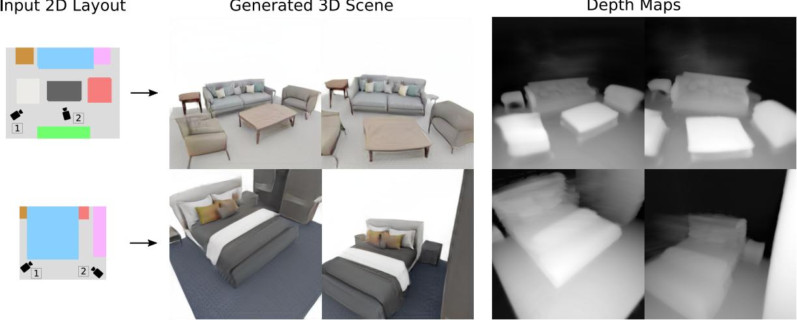
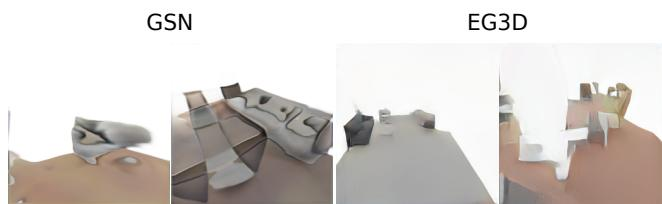
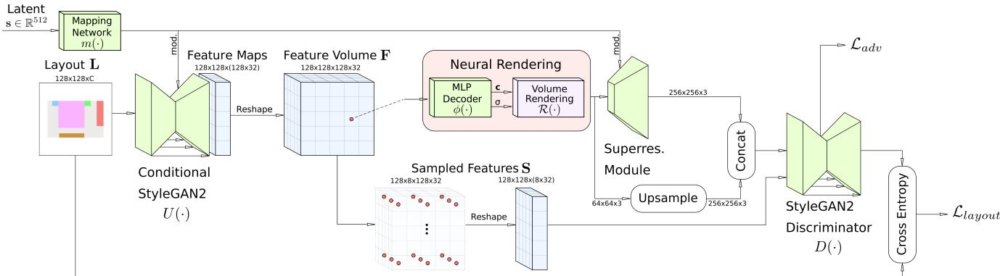
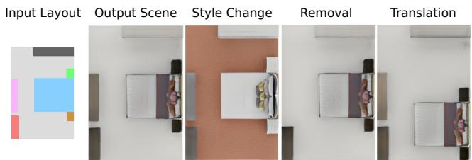
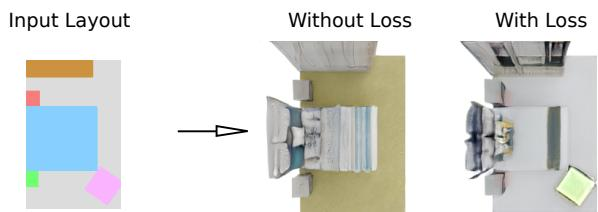
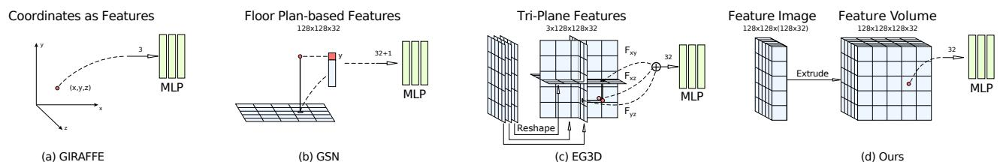
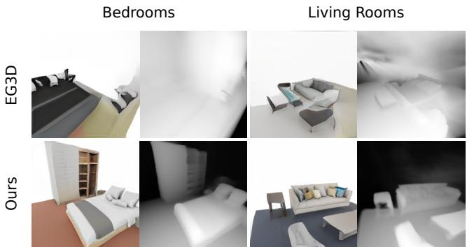
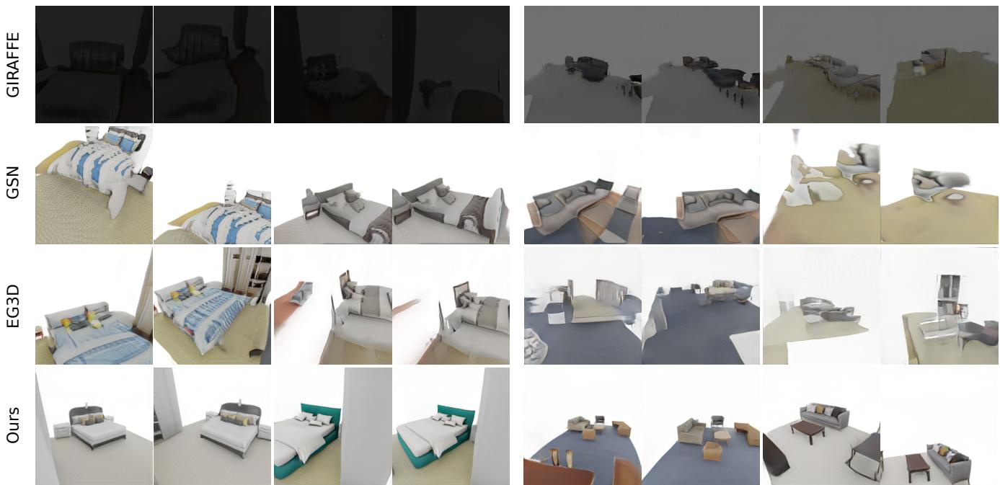
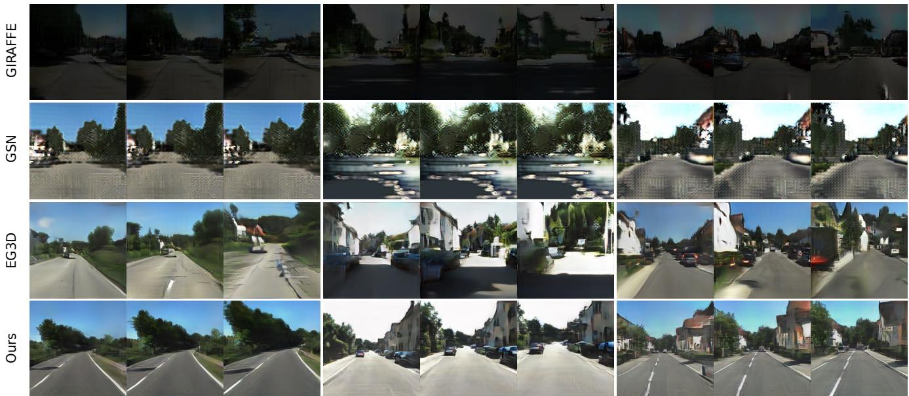
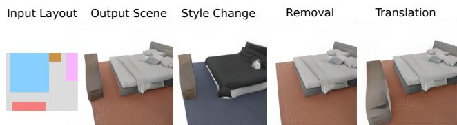

Input 2D Layout

# CC3D: Layout-Conditioned Generation of Compositional 3D Scenes

Sherwin Bahmani⇤1 Jeong Joon Park⇤2 Despoina Paschalidou2 Xingguang Yan4 Gordon Wetzstein2 Leonidas Guibas2 Andrea Tagliasacchi1,3,4

1University of Toronto 2Stanford University 3Google Research 4Simon Fraser University

Generated 3D Scene

  
Figure 1. Compositional 3D Scene Generation – We introduce CC3D, a 3D compositional GAN capable of synthesizing view-consistent renderings of multi-object scenes conditioned on a semantic layout, describing the scene structure. Video results can be viewed on our website: https://sherwinbahmani.github.io/cc3d.

## Abstract

In this work, we introduce CC3D, a conditional generative model that synthesizes complex 3D scenes conditioned on 2D semantic scene layouts, trained using single-view images. Differentfrom most existing 3D GANs that limit their applicability to aligned single objects, we focus on generating complex scenes with multiple objects, by modeling the compositional nature of 3D scenes. By devising a 2D layoutbased approach for 3D synthesis and implementing a new 3D field representation with a stronger geometric inductive bias, we have created a 3D GAN that is both efficient and of high quality, while allowing for a more controllable generation process. Our evaluations on synthetic 3D-FRONT and real-world KITTI-360 datasets demonstrate that our model generates scenes of improved visual and geometric quality in comparison to previous works.

## 1. Introduction

Recently, we have witnessed impressive progress in 3D generative technologies, including generative adversarial networks (GANs) [20] that have emerged as a powerful tool for automatically creating realistic 3D content. Despite their impressive capabilities, existing 3D GAN-based approaches have two major limitations. First, they typically generate the entire scene from a single latent code, ignoring the compositional nature of multi-object scenes, thus struggling to synthesize scenes with multiple objects, as shown in Fig. 2. Second, their generation process remains largely uncontrollable, making it non-trivial to enable user control. While some works [6, 31] allow conditioning the generation of input images via GAN inversion, this optimization process can be time-consuming and prone to local minima.

In this work, we introduce a Compositional and Conditional 3D generative model (CC3D), that generates plausible 3D-consistent scenes with multiple objects, while also enabling more control over the scene generation process by conditioning on semantic instance layout images, indicating the scene structure (see Fig. 1). Our approach rhymes with the 2D image-to-image translation works [24, 16] that conditionally generate images from user inputs: CC3D generates 3D scenes from 2D user inputs (i.e. scene layouts).

To train CC3D we use a set of single-view images and topdown semantic layout images, such as 2D labelled bounding boxes of objects in a scene (e.g. Fig. 1). Our generator network takes a 2D semantic image as input that defines the scene layout and outputs a 3D scene, whose top-down view matches the input layout in terms of object locations.

  
Figure 2. Failure cases – of non-compositional 3D GANs on multiobject scenes. We show examples of generated scenes synthesized with [15, 7], which do not explicitly model the compositional nature of multi-object living rooms. Note their lack of visual qualities.

The key component of our approach is a 2D-to-3D translation scheme that efficiently converts the 2D layout image into a 3D neural field. Our generator network is based on a modified StyleGAN2 [28] architecture that processes the input 2D layout image into a 2D feature map. The output 2D feature map is then reshaped into a 3D feature volume that defines a neural field which can be rendered from arbitrary camera views. Similar to existing 3D-aware generative models [48, 39, 7], we train the generator to produce realistic renderings of the neural fields from all sampled viewpoints. In addition, we enforce a semantic consistency loss that ensures the top-down view of the 3D scene matches the semantic 2D layout input.

We evaluate CC3D on the 3D-FRONT [17] bedroom and living room scenes and the KITTI-360 dataset [29] that contains more challenging outdoor real-world scenes. Our evaluations demonstrate that existing 3D generative models, such as EG3D [7] and GSN [15], produce low-quality 3D scenes, as illustrated in Fig. 2. In comparison, the compositional generation process and the new intermediate 3D feature representation of CC3D significantly improve the fidelity of the synthesized 3D scenes on both datasets, opening the door for realistic multi-object scene generations.

## 2. Related Work

2D Image Synthesis. GANs [20] have been extensively utilized to generate photorealistic images [27, 28, 26, 5, 47], perform image-to-image translation [24, 64, 11], and image editing [56, 49, 32]. Recently, compositional approaches [23, 1] have also been explored in the context of image generation. Similar to our work, GANformer2 [1] also divides the generation process into two steps: planning and execution. In our work, we guide the 3D generation process using semantic layouts and demonstrate that CC3D can render multi-view consistent images of multi-object scenes.

3D Object Generation. To scale 2D GANs to 3D domain, many recent works explored combining image generators with 3D representations. These models are supervised only with unstructured image collections along with a pre-defined camera distribution. While earlier works [36, 37, 48, 8, 38] provided limited visual fidelity and geometric accuracy, recently, several works tried to address these limitations. The majority of these approaches [63, 13, 21, 40, 7, 61, 51, 18] use a style-based generator [28] to synthesize a neural field which can be used for volume rendering [33]. Although these approaches can produce high quality images for singleobject scenes, they fail to scale to complex scenes with multiple objects. In this work, we also employ a style-based generator in combination with volume rendering but as our model explicitly models the compositional nature of 3D scenes, it can successfully generate plausible indoor and outdoor 3D scenes.

Multi-Object Generation. Our work is closely related to recent approaches that model scenes using 3D-aware image generators [39, 62]. Among the first, GIRAFFE [39] proposed to represent scenes using multiple locally defined NeRFs. However, while [39] can be efficiently applied on scenes containing only a few objects with limited texture variation, such as the CLEVR [25] dataset, it fails to generalize to more complex scenes. To improve the visual quality of [39], GIRAFFE-HD [62] employed a style-based generator. Even though this allows their model to composit multiple objects of the same class, e.g., cars, into a single scene at inference time, learning compositional scene generation from multi-object scenes of different classes remains an open problem.

Large-Scale Scene Generation. Plan2Scene [54] focuses on the task of converting a floorplan accompanied by a sparse set of images into a textured mesh for the entire scene. Although their representation is compositional by construction, [54] is not generative and requires multi-view supervision. Closely related to our work, another line of research [15, 3] aims at generating large-scale scenes using locally conditioned neural fields. Unlike previous approaches that sample camera poses from a sphere targeted towards the origin, constraining them to SO(3), GSN [15] considers scene generation conditioned on a freely moving camera defined in SE(3). Although this setup permits generating scenes from arbitrary viewpoints, it makes training significantly harder, as datasets are not aligned and the range of possible camera poses drastically increases. GAUDI [3] further improves the quality by disentangling camera poses from geometry and appearance. Unlike GAUDI [3] that assumes multi-view input images with known camera poses, our model can be trained using unstructured set of images.

Indoor Scene Generation. Recently, several works [55, 46, 57, 41, 58] proposed to pose the scene generation task as an object layout prediction problem. For example, ATISS [41] uses an autoregressive transformer to generate synthetic indoor environments as an unordered set of objects. LEGO-Net [58] learns to iteratively refine random object placements to generate realistic furniture arrangements. These works represent a scene layout as a set of 3D labeled bounding boxes, which can be replaced with textured meshes from a dataset of assets. In contrast, we rely on a GAN to learn a mapping between a 2D compositional scene layout to a 3D scene, without having to rely on object retrieval to produce 3D objects. We see our work as an orthogonal work to [55, 46, 57, 41] as they can be used to generate scene layouts, which in turn can be used as our conditioning.

  
Figure 3. Architecture – Our method takes a floorplan projection of the semantic scene layout and a noise vector as inputs. We use a conditional StyleGAN2 backbone to generate a 2D feature field based on the given layout and reshape the channels into a 3D feature volume. This feature volume is queried using trilinear interpolation and subsequently decoded into color and density using a small MLP. We use a superresolution module to upsample volume rendered images to target resolution and use a standard StyleGAN2 discriminator. In order to ensure semantic consistency between the layout and the rendering, we sample equidistant coordinates from the feature volume and process the sampled features with a semantic segmentation decoder added to the discriminator. We train our model on a combination of an adversarial loss and cross entropy loss.

Concurrent Works. Several concurrent works explored extending 3D GANs to more complex scenarios. 3DGP [50] tackles non-aligned datasets by incorporating depth estimation and a novel camera parameterization, but their model focuses only on single objects. SceneDreamer [10] generates unbounded landscapes from 2D image collections and semantic labels. However, their model is supervised with a ground truth height field, whereas we learn the density field only from 2D image collections. InfiniCity [30] synthesizes large-scale 3D city environments but requires expensive annotations such as CAD models. Similar to ours, pix2pix3D [12] generates 3D objects given a 2D semantic map, but it only focuses on single-object scenes. In concurrent work, DisCoScene [60] investigates compositional scene generation with layout priors using single-view image collections. Their approach follows [39] and generates each object and the background independently. Unlike our work, DisCoScene conditions the scene generation on 3D layout priors, as opposed to 2D layouts, and assumes that the per-object attributes (i.e. size, pose) are sampled from a pre-defined prior distribution. Instead, we do not assume this type of supervision. Moreover, unlike [60], we explore rendering from freely moving cameras as opposed to cameras on a sphere.

## 3. Method

The training of CC3D takes a set of single-view 2D RGB images and a set of top-down semantic layouts. We do not assume the two image sets to be in 1:1 correspondence; Fig. 3 illustrates the overall architecture of our method.

Training. We randomly choose 2D semantic layout images and sample style codes. The layout images and style codes are passed to the generator network, which outputs 2D fea tures. The 2D feature map is then reshaped into a 3D feature volume, which can be rendered via volume rendering with a small MLP network and a 2D upsampling network. The realism of the rendered images is scored by the discriminator network against the set of RGB images, and the system is trained with the standard adversarial loss, along with the semantic consistency loss from the top-down views.

Inference. We provide a semantic layout image and a style code to the generator to obtain a 3D neural radiance field that can be rendered from an arbitrary camera. Our method allows more control over the generation process compared to the most advanced unconditional GANs [7, 40, 18], as users can specify the layouts with various styles and edit them.

## 3.1. Neural Field Generator

Our generator network ${ \cal G } ( \mathbf { L } , \mathbf { s } )$ takes as input a 2D layout image L and a style code $\mathbf { s } \in \dot { \mathbb { R } } ^ { 5 1 2 }$ , sampled from a unit Gaussian distribution, and generates a 3D neural feature field $\mathbf { F } \in \mathbb { R } ^ { N \times N \times N \times C }$ , where N and $C$ correspond to the spatial resolution and channel size. In our experiments, we set N = 128 and $C = 3 2$

Layout Conditioning. The input to our generator is a 2D layout conditioning image $\mathbf { L } \in \mathbb { R } ^ { N \times N \times L }$ that contains information about the scene structure, with L being a datasetdependent feature dimension. In contrast to concurrent work [60] that uses 3D bounding boxes as conditioning, we choose to guide our generation with 2D semantic layouts images; this allows users to generate layouts via simple 2D editing instead. The feature channels of an input layout are composed of the one-hot encoding of semantic classes and additional information such as bounding boxes’ local coordinates, which is detailed in the supplementary. As illustrated in Fig. 4, conditioning the generation on a 2D semantic layout can allow us to conveniently control the structure and the style of a scene.

  
Figure 4. Controllable scene generation – We conduct 2D experiments where we only train on top-down renderings. We observe that our model is able to follow a conditional layout while providing flexibility in varying the latent code or positioning of the objects.

Layout-Conditioned 3D Generation. As detailed in what follows, our conditional generator ${ \cal G } ( \mathbf { L } , \mathbf { s } )$ is composed of a U-Net backbone $U ( \cdot )$ that generates a 2D feature image, followed by the extrusion operator E that reshapes a 2D feature map into a 3D feature grid as

$$
\displaystyle { G ( \mathbf { L } , \mathbf { s } ) = E \circ U ( \mathbf { L } , m ( \mathbf { s } ) ) } .\tag{1}
$$

Backbone. The network U is a “StyleGAN-like" U-Net architecture composed of encoder and decoder networks, and $m ( \cdot )$ is a mapping network that conditions generation via FiLM [43]. We use skip connections to concatenate the encoder features to the intermediate features of the corresponding decoding layer; please refer to the supplementary for additional details. At the last layer, we have a single convolutional layer that increases the number of channels to a multiple of the height dimension of our target 3D feature volume.

Extrusion. Finally, we convert the U-Net’s 2D output in a 3D feature grid with the extrusion operator E. To achieve this, it suffices to reshape the channel dimension of the 2D output $( N \times C )$ into $N \times C .$ , giving height dimension to the 2D feature map. In contrast to voxel-based approaches, we compute a 3D feature grid only at the last layer while keeping our intermediate features in 2D, using computationally efficient 2D convolutions only.

We rationalize the generator’s design choices in Sec. 3.5.

  
Figure 5. Layout consistency loss – We often observe objects from the input layout missing in output renderings. We show that using the layout consistency loss helps reduce such cases.

## 3.2. Rendering and Upsampling

Given the generated feature volume ${ \cal G } ( \mathbf { L } , \mathbf { s } )$ , we can query continuous neural field value at any query 3D point p by passing its tri-linear interpolated feature $\lambda ( \mathbf { p } )$ to a small MLP $\phi ( \cdot )$ , consisting of a single hidden layer of 64 hidden dimension and softplus activation. The outputs of the MLP $\phi ( \cdot )$ are a scalar density and a 32-dimensional feature, where the first three channels are interpreted as RGB. We do not model view-dependent effects following [7]. We integrate radiance by volume rendering $\mathcal { R } ( . )$ and generate the image

$$
\mathcal { T } _ { \gamma } ^ { \mathrm { l o w - r e s } } = \mathcal { R } ( G ( \mathbf { L } , \mathbf { s } ) , \phi ( \lambda ( \mathbf { p } ) ) , \gamma )\tag{2}
$$

from a camera viewpoint $\gamma .$ . We use 48 points along the ray sampled with stratified sampling and another 48 points obtained with importance sampling [35]. We set the volume rendering resolution to $6 4 ^ { 2 }$ which provides a reasonable trade-off between computational costs and (postupsampling) multi-view consistency.

Upsampling. Volume rendering at our target image resolution of $2 5 6 ^ { 2 }$ is computationally expensive, so we use the popular 2D super-resolution module (i.e. dual discrimination) of EG3D [7], which is known to encourage multi-view consistent renderings. The upsampled image

$$
\mathcal { T } _ { \gamma } = u p s a m p l e ( \mathcal { T } _ { \gamma } ^ { \mathrm { l o w - r e s } } , \mathbf { s } )\tag{3}
$$

is a function of the volume rendered image $\mathcal { T } _ { \gamma } ^ { v }$ and the style code s, as we use the StyleGAN2 network for upsampling.

## 3.3. Discriminator Architecture

Our generator is trained with an adversarial loss that involves co-training a discriminator $D ( \cdot )$ , which takes real and fake images and predicts their labels. Our discriminator architecture follows that of StyleGAN2 [28] and takes input as the concatenation of two $2 5 6 ^ { 2 }$ images following the dual-discrimination scheme [7].

Enforcing Layout Consistency. While layout conditioning provides compositional guidance to the generator, we observe that some objects from the input layout are occasionally missing from the final rendering, as shown in Fig. 5. To address this, we introduce a semantic layout consistency loss during training that encourages that the generated scene features rendered from the top-down view are consistent with the input layouts.

  
Figure 6. Conceptual Analysis – We visually illustrate the difference between the proposed 3D neural field architecture (d), to that used in GIRAFFE [39], GSN [15], and EG3D [7]. Our extrusion operator is computationally much cheaper than those of GIRAFFE or GSN, and compared to EG3D, it better preserves the geometry of the output space: features that are close in ${ \bf { \dot { \mathbb { R } } } } ^ { 3 }$ (i.e. volume) have a higher likelihood to be close in $\mathbb { R } ^ { 2 }$ (i.e. image/generator space); given the limited receptive field of 2D convolutions, this results in higher-quality generation.

Specifically, let us define the xz-plane as the floorplan and the y-axis the up vector. We want to create a 2D image S on the xz-plane that summarizes the generated feature F from the top-down view. For each pixel in S we sample k number of equidistant points along the height (y) axis. Then, we perturb the sampled points with a small Gaussian noise and extract features from those points with tri-linear interpolation. The resulting image S has dimension N $N \times ( k \times C )$ , which is passed to a segmentation U-Net that predicts a semantic label for each pixel. Here, we reuse the discriminator $D ( \cdot )$ and attach a decoder network to convert it to a U-Net structure. Besides the adversarial process, the discriminator additionally takes S and outputs semantic segmentation, which is then compared against the input label map L via $\mathcal { L } _ { l a y o u t } ,$ a standard cross entropy loss.

## 3.4. Training

We build on top of recent 3D GAN techniques to train our generator by encouraging the neural field renderings from sampled camera viewpoints via adversarial losses. Specifi cally, we sample style code s and camera pose  from a prior distribution $p ( \gamma )$ and render through the generated neural fields to obtain a fake image $\mathcal { T } _ { \gamma } ( \mathbf { L } , \mathbf { s } )$ . The discriminator takes as input the fake/real images, and outputs the predicted labels. The two networks are trained via the standard minmax optimization [20].

Training Objectives. Our overall training objective comprises the adversarial training loss with R1 regularization loss [34] and our proposed layout consistency loss of Sec. 3.3, which are weighted equally:

$$
\mathcal { L } = \mathcal { L } _ { a d v } + \mathcal { L } _ { R 1 } + \mathcal { L } _ { l a y o u t } ,\tag{4}
$$

which we minimize by updating the weights of generator $G ( \cdot )$ , U-Net backbone $U ( \cdot )$ , MLP network $\phi ( \cdot )$ , and the extended U-Net discriminator $D ( \cdot )$

## 3.5. Conceptual Analysis

As our architecture applies discriminators on the output of the generator, we ought to design a generator architecture that strikes an appropriate balance between computational requirements and 3D geometric inductive bias, both are generally correlated with the visual quality of generated results; see Fig. 6 for an overview.

Computational requirements. While neural implicit repre sentations have greatly advanced 3D generative modeling, classical coordinate-based implicit representations (Fig. 6a) require the use of large multi-layer perceptrons (MLPs). This incurs in high computational complexity, as every input point evaluates the entire MLP, as well as high memory requirements, as gradients are back-propagated through all pixels.

As such, several implicit-explicit hybrid representations have been proposed to pre-load the computational overhead to the generation of explicit features by storing them on regular grids [19, 44, 53]. Neural field values of query points are obtained by linear feature interpolations, followed by processing with smaller MLPs. Applying these ideas to generative modeling, one can generate 3D features using 3D CNNs as in [61]; however, 3D convolutions quickly become prohibitively expensive due to the curse of dimensionality.

Recently, GSN [15] suggests adopting planar grids to achieve efficient generation via the use of 2D floor-plan features (Fig. 6b). They define the neural field via an MLP that takes the concatenation of the floor-plan projected features and height coordinates. Since the height-wise information needs to be “generated” by the MLP based on the projected 2D features, the heavy lifting is still done by the MLP network, which leads to (prohibitively) large MLP size [15].

Conversely, we first generate a 2D feature map, using a 2D U-Net architecture and then extrude them into 3D volumetric features (Fig. 6d), thereby pre-computing the height-wise features. Our 2D-to-3D extrusion strategy enables us to leverage 2D CNNs, and a much smaller MLP to interpret the voxel features.

Geometric inductive bias. Similar to our approach, triplane representations [42, 7] (Fig. 6c) encode 3D information of all axes, allowing a dramatic reduction of the MLP size. However, these features are jointly generated from a standard 2D CNN and reshaped into three separate planes, leading to the processing of the three planes with very different

Euclidean positions via local convolutions. Moreover, as the scale of the scenes increases, the 2D plane features become less descriptive since completely different objects in the scene share the same plane-projected features.

In contrast, our 2D-to-3D extrusion strategy leverages efficient 2D operations to output 2D feature images, whose individual pixels encode vertical scene information in the height dimension. Applying local convolutions on the feature image allows associating geometrically neighboring features, resulting in higher quality results, as empirically validated in our experimental evaluation.

## 4. Experiments

In this section, we provide extensive evaluations of our model on multi-object datasets and compare the results with the most relevant baselines. Additional results as well as implementation details are provided in the supplementary.

Dataset: 3D-FRONT. We conduct experiments on 3D-FRONT [17] bedrooms and living rooms, following the same pre-processing steps as [41]. To define a camera pose distribution, we consider sampling cameras not inside or too close to the objects to encourage that the majority of the scene’s content can be captured. To this end, we perform distance transform on the object bounding boxes of the layouts and sample camera locations with sufficiently high distance values with constant heights. The orientation is set toward a dominant object in the scene, i.e., beds for bedrooms and the largest object in the scene for living rooms. We filter out the scenes where we cannot sample at least 40 unique camera poses, resulting in a total of 5515 bedrooms and 2613 living rooms. For each scene we render images using BlenderProc [14] at 2562 resolution. To generate the conditioning inputs, we render a top-down view of each scene with bounding boxes, where each box is colored based on its semantic class and its local coordinates.

Dataset: KITTI. To demonstrate the generation capabilities of our model in more challenging real-world scenarios, we also evaluate our model on KITTI-360 [29]. To render our training images, we use the ground-truth camera poses and intrinsic matrices. Since KITTI scenes are unbounded (i.e. there are no specific boundaries), for a single scene we extract several "sub-scenes” of size 50m 10m 50m and use them instead for training. Furthermore, we discard scenes where the car is turning either left of right. This results in 37691 scenes in total. To render the semantic masks, used to condition the generation, we render top-down views of the scene with bounding boxes, where boxes are colored based on their semantic class.

Metrics. We report the Fréchet Inception Distance (FID) [22] and Kernel Inception Distance (KID) [4] to mea sure the realism of the rendered images with respect to the ground truth image distributions. We use 50000 images for 3D-FRONT and the maximum 37691 images for KITTI-360.

  
Figure 7. Visualization of depth maps – extracted from the density fields. Our method is able to generate sharp depth maps in comparison to EG3D, which produces unrecognizable results.

Baselines. We compare our model with several state-of-theart methods for 3D-aware image synthesis: GIRAFFE [39], GSN [15] and EG3D [7]. From our evaluation, we omit GIRAFFE-HD [62] as it can only generate single-object scenes and GAUDI [3], as the authors have not released any code to train their model.

Quantitative Results. In Tab. 1, we provide quantitative evaluations in comparison to the baselines. CC3D demonstrates significant improvements across all metrics and achieves state-of-the-art performance on the scene synthesis task both in indoor and outdoor scenes. In comparison to GIRAFFE and GSN, we see that CC3D demonstrates significant improvements with several times smaller FIDs and KIDs, validating that our method better scales to scenes with multiple objects. Although EG3D shows the most competitive results in comparison to CC3D, our synthesized images are more plausible for both benchmarks.

Qualitative Results. In Fig. 8 and Fig. 9, we provide qualitative results for 3D-FRONT and KITTI-360 respectively. As also validated quantitatively in Tab. 1, our model produces high quality and view-consistent images from different camera poses. In comparison to previous approaches, CC3D synthesizes scene compositions which are more realistic due to our scene layout conditioning. While EG3D shows promising texture quality, the lack of compositionality leads to low-quality underlying scene structures, evidenced by the depth map visualization results (see Fig. 7). Notably, all previous methods produce unrealistic scenes for the case of living rooms, unlike CC3D which produces coherent scenes. For the case of [39], we observe that it fails to produce plausible scenes i.e. most generated scenes are almost completely dark, as also noted in [60, 40]. Additional results are provided in the supplementary materials.

Living Rooms

Bedrooms  
  
Figure 8. Qualitative comparison on 3D-FRONT bedrooms and living rooms – We show two random viewpoints for each scene. We compare our model with GSN [15], GIRAFFE [38], EG3D [7] and observe that GIRAFFE and GSN fail to output realistic renderings. Although EG3D produces reasonable texture with limited scene compositionality, our method synthesizes more compelling texture and scene structure. Best viewed digitally.

Table 1. Quantitative evaluation using FID and KID for all methods at $2 5 6 ^ { 2 }$ pixel resolution on 3D-FRONT bedrooms, 3D-FRONT living rooms, and KITTI-360.
<table><tr><td rowspan="2">Method</td><td rowspan="2">Representation</td><td colspan="2">Bedrooms</td><td colspan="2">Living Rooms</td><td colspan="2">KITTI-360</td></tr><tr><td>FID (↓)</td><td>KID (↓)</td><td>FID (↓)</td><td>KID (↓)</td><td>FID (↓)</td><td>KID (↓)</td></tr><tr><td>GIRAFFE</td><td>Pure MLP</td><td>141.5</td><td>127.3</td><td>155.7</td><td>157.5</td><td>189.0</td><td>238.3</td></tr><tr><td>GSN</td><td>2D Floor Plan</td><td>73.6</td><td>43.8</td><td>175.4</td><td>164.9</td><td>256.7</td><td>323.0</td></tr><tr><td>EG3D</td><td>Tri-plane</td><td>49.0</td><td>35.7</td><td>90.9</td><td>84.3</td><td>78.2</td><td>82.2</td></tr><tr><td>Ours</td><td>2D-3D Extrusion</td><td>28.5</td><td>21.3</td><td>40.3</td><td>34.5</td><td>65.6</td><td>70.5</td></tr></table>

## 4.1. Empirical Analysis

Layout Conditioning Improves Scene Quality. Conditioning the generation process with a semantic layout provides compositional guidance to the model. We observe that training an unconditional version of our model leads to a noticeable loss in visual quality as shown in the worse metric scores in Tab. 2. It also aligns with the fact that our conditional method significantly outperforms the existing unconditional GANs, which highlights the importance of providing input conditioning for compositional scene generation.

3D Field Representations. In Sec. 3.5, we described how the existing representations for modeling neural fields have trouble modeling large, multi-object scenes. Instead, our

2D-to-3D extrusion method is efficient for using only 2D convolutions and has a strong geometrical inductive bias. Hence, to validate our design choice, we substitute 3D field representation with GSN’s “floorplan" and EG3D’s tri-plane representations and observe worse performances than ours (Tab. 2), as expected.

Layout Consistency Loss. As part of our preliminary 2D experiments, we observed that objects are sometimes missing from the output rendering, in particular when there are too many or small objects. Adding our layout consistency loss (Sec. 3.3) during training, addresses this issue, as shown in Fig. 5. However, we note that the missing object phenomenon still occurs, especially in living room scenes that contain a lot of objects. We will discuss this phenomenon in the supplementary. Furthermore, we show that using the layout consistency loss improves visual quality (Tab. 2).

  
Figure 9. Qualitative comparison on KITTI-360 – We compare our model with GSN [15], GIRAFFE [38], EG3D [7]. Although KITTI scenes are more complex, our model can robustly synthesize realistic and diverse outdoor scenes. Best viewed digitally.

Table 2. Quantitative ablation studies on 3D-FRONT bedrooms. We measure the realism of generated 3D scenes without using 2D layout conditioning (i.e., unconditional version of our model) or using the layout consistency loss described in Sec. 3.3. Moreover, we swap out our 3D extrusion representation with the “floorplan" and tri-plane schemes, proving the advantage of our method.
<table><tr><td>Method</td><td>FID (↓)</td><td>KID (↓)</td></tr><tr><td>Ours</td><td>28.5</td><td>21.3</td></tr><tr><td>w/o Layout Conditioning</td><td>38.3</td><td>29.6</td></tr><tr><td>w/o Layout Consistency Loss</td><td>34.2</td><td>25.3</td></tr><tr><td>w/ GSN&#x27;s Floorplan Representation</td><td>45.1</td><td>33.1</td></tr><tr><td>w/ EG3D&#x27;s Tri-plane Representation</td><td>38.9</td><td>27.7</td></tr></table>

Controllable Generations. We showcase that our model enables controlling the 3D scene generation process and supports various editing operations. In Fig. 10, we provide examples of changing the style of the objects, removing objects from the scene and changing the position of an object in the scene.

## 5. Discussion

Limitations. Even with the semantic consistency loss of Sec. 3.3, there are still missing objects in the generated scenes, especially for large living room scenes with many objects. We believe that tightly enforcing the generator to closely follow the conditioning is a challenging but important problem that needs to be explored by our community.

  
Figure 10. Controllable generation of 3D scenes. Note the change of style, and removal and movement of the tv stand.

Similar to previous 3D-aware GANs, our approach suffers from view-inconsistencies caused by 2D upsampling, which is mostly visible in rendered camera trajectories. One solution could be to leverage patch-based training to discard the 2D super-resolution module as in [51, 52].

The ability to change disentangled latent codes for each object could enable more controlled scene editing, similar to GIRAFFE [39]. Furthermore, we observe that the global style code and the input layouts are not completely disentangled, i.e., layout changes often lead to appearance changes. Moreover, we rely on a manually-defined camera distribution for each dataset. Finally, extending our method to dynamic scenes [2, 59] could enable spatio-temporal control of complex scene generation. We leave addressing the above concerns as future work.

Conclusions. In this work, we present a conditional 3D GAN, dubbed CC3D, that can compositionally synthesize complex 3D scenes, supervised only from unstructured image collections and scene layouts. We show that our 2Dconditioned 3D generation technique, along with our novel

3D field representation, enables high-quality generation of multi-object scenes. With CC3D, we can set the layouts of realistic 3D scenes that can be rendered from arbitrary camera trajectories, opening up a research direction towards controllable and scalable 3D generative technologies.

## 6. Acknowledgements

We thank Ahan Shabanov and Yiyi Liao for helping with the 3D-FRONT and KITTI-360 dataset preprocessing. This work was supported by the Natural Sciences and Engineering Research Council of Canada (NSERC) Discovery Grant and Compute Canada / Digital Research Alliance of Canada. Furthermore, it was supported in part by ARL grant W911NF-21-2-0104, a Vannevar Bush Faculty Fellowship, a gift from the Adobe Corporation, a PECASE by the ARO, NSF award 1839974, Stanford HAI, and a Samsung GRO. Despoina Paschalidou was supported by the Swiss National Science Foundation under grant number P500PT\_206946.

## References

[1] Dor Arad Hudson and Larry Zitnick. Compositional transformers for scene generation. Advances in Neural Information Processing Systems (NeurIPS), 2021. 2

[2] Sherwin Bahmani, Jeong Joon Park, Despoina Paschalidou, Hao Tang, Gordon Wetzstein, Leonidas Guibas, Luc Van Gool, and Radu Timofte. 3d-aware video generation. Transactions on Machine Learning Research (TMLR), 2023. 8

[3] Miguel Angel Bautista, Pengsheng Guo, Samira Abnar, Walter Talbott, Alexander Toshev, Zhuoyuan Chen, Laurent Dinh, Shuangfei Zhai, Hanlin Goh, Daniel Ulbricht, et al. Gaudi: A neural architect for immersive 3d scene generation. Advances in Neural Information Processing Systems (NeurIPS), 2022. 2, 6

[4] Mikołaj Binkowski, Danica J Sutherland, Michael Arbel, and´ Arthur Gretton. Demystifying mmd gans. Proc. of the International Conf. on Learning Representations (ICLR), 2018. 6

[5] Andrew Brock, Jeff Donahue, and Karen Simonyan. Large scale gan training for high fidelity natural image synthesis. Proc. of the International Conf. on Learning Representations (ICLR), 2019. 2

[6] Shengqu Cai, Anton Obukhov, Dengxin Dai, and Luc Van Gool. Pix2nerf: Unsupervised conditional p-gan for single image to neural radiance fields translation. In Proc. IEEE Conf. on Computer Vision and Pattern Recognition (CVPR), 2022. 1

[7] Eric R Chan, Connor Z Lin, Matthew A Chan, Koki Nagano, Boxiao Pan, Shalini De Mello, Orazio Gallo, Leonidas Guibas, Jonathan Tremblay, Sameh Khamis, Tero Karras, and Gordon Wetzstein. Efficient geometry-aware 3d generative adversarial networks. In Proc. IEEE Conf. on Computer Vision and Pattern Recognition (CVPR), 2022. 2, 3, 4, 5, 6, 7, 8, 12, 15

[8] Eric R Chan, Marco Monteiro, Petr Kellnhofer, Jiajun Wu, and Gordon Wetzstein. Pi-gan: Periodic implicit generative adversarial networks for 3d-aware image synthesis. In Proc. IEEE Conf. on Computer Vision and Pattern Recognition (CVPR), 2021. 2

[9] Liang-Chieh Chen, George Papandreou, Florian Schroff, and Hartwig Adam. Rethinking atrous convolution for semantic image segmentation. arXiv preprint arXiv:1706.05587, 2017. 12

[10] Zhaoxi Chen, Guangcong Wang, and Ziwei Liu. Scenedreamer: Unbounded 3d scene generation from 2d image collections. arXiv preprint arXiv:2302.01330, 2023. 3

[11] Yunjey Choi, Minje Choi, Munyoung Kim, Jung-Woo Ha, Sunghun Kim, and Jaegul Choo. Stargan: Unified generative adversarial networks for multi-domain image-to-image translation. In Proc. IEEE Conf. on Computer Vision and Pattern Recognition (CVPR), 2018. 2

[12] Kangle Deng, Gengshan Yang, Deva Ramanan, and Jun-Yan Zhu. 3d-aware conditional image synthesis. Proc. IEEE Conf. on Computer Vision and Pattern Recognition (CVPR), 2023. 3

[13] Yu Deng, Jiaolong Yang, Jianfeng Xiang, and Xin Tong. Gram: Generative radiance manifolds for 3d-aware image generation. In Proc. IEEE Conf. on Computer Vision and Pattern Recognition (CVPR), 2022. 2

[14] Maximilian Denninger, Martin Sundermeyer, Dominik Winkelbauer, Dmitry Olefir, Tomas Hodan, Youssef Zidan, Mohamad Elbadrawy, Markus Knauer, Harinandan Katam, and Ahsan Lodhi. Blenderproc: Reducing the reality gap with photorealistic rendering. In Proc. Robotics: Science and Systems (RSS), 2020. 6

[15] Terrance DeVries, Miguel Angel Bautista, Nitish Srivastava, Graham W Taylor, and Joshua M Susskind. Unconstrained scene generation with locally conditioned radiance fields. In Proc. of the IEEE International Conf. on Computer Vision (ICCV), 2021. 2, 5, 6, 7, 8, 12, 13

[16] Dave Epstein, Taesung Park, Richard Zhang, Eli Shechtman, and Alexei A Efros. Blobgan: Spatially disentangled scene representations. In Computer Vision–ECCV 2022: 17th European Conference, Tel Aviv, Israel, October 23–27, 2022, Proceedings, Part XV, pages 616–635. Springer, 2022. 1

[17] Huan Fu, Bowen Cai, Lin Gao, Ling-Xiao Zhang, Jiaming Wang, Cao Li, Qixun Zeng, Chengyue Sun, Rongfei Jia, Binqiang Zhao, et al. 3d-front: 3d furnished rooms with layouts and semantics. In Proc. of the IEEE International Conf. on Computer Vision (ICCV), 2021. 2, 6

[18] Jun Gao, Tianchang Shen, Zian Wang, Wenzheng Chen, Kangxue Yin, Daiqing Li, Or Litany, Zan Gojcic, and Sanja Fidler. Get3d: A generative model of high quality 3d textured shapes learned from images. In Advances In Neural Information Processing Systems, 2022. 2, 3

[19] Stephan J Garbin, Marek Kowalski, Matthew Johnson, Jamie Shotton, and Julien Valentin. Fastnerf: High-fidelity neural rendering at 200fps. In Proc. IEEE Conf. on Computer Vision and Pattern Recognition (CVPR), 2021. 5

[20] Ian Goodfellow, Jean Pouget-Abadie, Mehdi Mirza, Bing Xu, David Warde-Farley, Sherjil Ozair, Aaron Courville, and

Yoshua Bengio. Generative adversarial nets. Advances in Neural Information Processing Systems (NIPS), 2014. 1, 2, 5

[21] Jiatao Gu, Lingjie Liu, Peng Wang, and Christian Theobalt. Stylenerf: A style-based 3d-aware generator for highresolution image synthesis. In Proc. of the International Conf. on Learning Representations (ICLR), 2022. 2

[22] Martin Heusel, Hubert Ramsauer, Thomas Unterthiner, Bernhard Nessler, and Sepp Hochreiter. Gans trained by a two time-scale update rule converge to a local nash equilibrium. Advances in Neural Information Processing Systems (NIPS), 2017. 6

[23] Drew A Hudson and Larry Zitnick. Generative adversarial transformers. In Proc. ofthe International Conf. on Machine learning (ICML), 2021. 2

[24] Phillip Isola, Jun-Yan Zhu, Tinghui Zhou, and Alexei A Efros. Image-to-image translation with conditional adversarial networks. In Proc. IEEE Conf. on Computer Vision and Pattern Recognition (CVPR), 2017. 1, 2

[25] Justin Johnson, Bharath Hariharan, Laurens Van Der Maaten, Li Fei-Fei, C Lawrence Zitnick, and Ross Girshick. Clevr: A diagnostic dataset for compositional language and elementary visual reasoning. In Proc. IEEE Conf. on Computer Vision and Pattern Recognition (CVPR), 2017. 2

[26] Tero Karras, Miika Aittala, Samuli Laine, Erik Härkönen, Janne Hellsten, Jaakko Lehtinen, and Timo Aila. Alias-free generative adversarial networks. Advances in Neural Information Processing Systems (NeurIPS), 2021. 2

[27] Tero Karras, Samuli Laine, and Timo Aila. A style-based generator architecture for generative adversarial networks. In Proc. IEEE Conf. on Computer Vision and Pattern Recognition (CVPR), 2019. 2

[28] Tero Karras, Samuli Laine, Miika Aittala, Janne Hellsten, Jaakko Lehtinen, and Timo Aila. Analyzing and improving the image quality of stylegan. In Proc. IEEE Conf. on Computer Vision and Pattern Recognition (CVPR), 2020. 2, 4

[29] Yiyi Liao, Jun Xie, and Andreas Geiger. Kitti-360: A novel dataset and benchmarks for urban scene understanding in 2d and 3d. IEEE Trans. on Pattern Analysis and Machine Intelligence (PAMI), 2022. 2, 6

[30] Chieh Hubert Lin, Hsin-Ying Lee, Willi Menapace, Menglei Chai, Aliaksandr Siarohin, Ming-Hsuan Yang, and Sergey Tulyakov. Infinicity: Infinite-scale city synthesis. arXiv preprint arXiv:2301.09637, 2023. 3

[31] Connor Z Lin, David B Lindell, Eric R Chan, and Gordon Wetzstein. 3d gan inversion for controllable portrait image animation. arXiv preprint arXiv:2203.13441, 2022. 1

[32] Huan Ling, Karsten Kreis, Daiqing Li, Seung Wook Kim, Antonio Torralba, and Sanja Fidler. Editgan: High-precision semantic image editing. Advances in Neural Information Processing Systems (NeurIPS), 2021. 2

[33] Nelson Max. Optical models for direct volume rendering. IEEE Trans. on Visualization and Computer Graphics (VCG), 1995. 2

[34] Lars Mescheder, Andreas Geiger, and Sebastian Nowozin. Which training methods for gans do actually converge? In Proc. of the International Conf. on Machine learning (ICML), 2018. 5, 12

[35] Ben Mildenhall, Pratul P Srinivasan, Matthew Tancik, Jonathan T Barron, Ravi Ramamoorthi, and Ren Ng. Nerf: Representing scenes as neural radiance fields for view synthesis. In Proc. ofthe European Conf. on Computer Vision (ECCV), 2020. 4

[36] Thu Nguyen-Phuoc, Chuan Li, Lucas Theis, Christian Richardt, and Yong-Liang Yang. Hologan: Unsupervised learning of 3d representations from natural images. In Proc. ofthe IEEE International Conf. on Computer Vision (ICCV), 2019. 2

[37] Thu H Nguyen-Phuoc, Christian Richardt, Long Mai, Yongliang Yang, and Niloy Mitra. Blockgan: Learning 3d object-aware scene representations from unlabelled im ages. Advances in Neural Information Processing Systems (NeurIPS), 2020. 2

[38] Michael Niemeyer and Andreas Geiger. Campari: Cameraaware decomposed generative neural radiance fields. In Proc. ofthe International Conf. on 3D Vision (3DV), 2021. 2, 7, 8

[39] Michael Niemeyer and Andreas Geiger. Giraffe: Representing scenes as compositional generative neural feature fields. In Proc. IEEE Conf. on Computer Vision and Pattern Recognition (CVPR), 2021. 2, 3, 5, 6, 8, 12

[40] Roy Or-El, Xuan Luo, Mengyi Shan, Eli Shechtman, Jeong Joon Park, and Ira Kemelmacher-Shlizerman. Stylesdf: High-resolution 3d-consistent image and geometry generation. In Proc. IEEE Conf. on Computer Vision and Pattern Recognition (CVPR), 2022. 2, 3, 6

[41] Despoina Paschalidou, Amlan Kar, Maria Shugrina, Karsten Kreis, Andreas Geiger, and Sanja Fidler. Atiss: Autoregressive transformers for indoor scene synthesis. Advances in Neural Information Processing Systems (NeurIPS), 2021. 2, 3, 6

[42] Songyou Peng, Michael Niemeyer, Lars Mescheder, Marc Pollefeys, and Andreas Geiger. Convolutional occupancy networks. In Proc. ofthe European Conf. on Computer Vision (ECCV), 2020. 5

[43] Ethan Perez, Florian Strub, Harm De Vries, Vincent Dumoulin, and Aaron Courville. Film: Visual reasoning with a general conditioning layer. In Proceedings of the AAAI Conference on Artificial Intelligence, volume 32, 2018. 4

[44] Christian Reiser, Songyou Peng, Yiyi Liao, and Andreas Geiger. Kilonerf: Speeding up neural radiance fields with thousands of tiny mlps. In Proc. IEEE Conf. on Computer Vision and Pattern Recognition (CVPR), 2021. 5

[45] Shaoqing Ren, Kaiming He, Ross Girshick, and Jian Sun. Faster r-cnn: Towards real-time object detection with region proposal networks. Advances in Neural Information Processing Systems (NeurIPS), 2015. 12

[46] Daniel Ritchie, Kai Wang, and Yu-an Lin. Fast and flexible indoor scene synthesis via deep convolutional generative models. In Proc. IEEE Conf. on Computer Vision and Pattern Recognition (CVPR), 2019. 2, 3

[47] Axel Sauer, Katja Schwarz, and Andreas Geiger. Stylegan-xl: Scaling stylegan to large diverse datasets. In ACM Trans. on Graphics, 2022. 2

[48] Katja Schwarz, Yiyi Liao, Michael Niemeyer, and Andreas Geiger. Graf: Generative radiance fields for 3d-aware image

synthesis. In Advances in Neural Information Processing Systems (NeurIPS), 2020. 2

[49] Yujun Shen, Jinjin Gu, Xiaoou Tang, and Bolei Zhou. Interpreting the latent space of gans for semantic face editing. In Proc. IEEE Conf. on Computer Vision and Pattern Recognition (CVPR), 2020. 2

[50] Ivan Skorokhodov, Aliaksandr Siarohin, Yinghao Xu, Jian Ren, Hsin-Ying Lee, Peter Wonka, and Sergey Tulyakov. 3d generation on imagenet. Proc. ofthe International Conf. on Learning Representations (ICLR), 2023. 3

[51] Ivan Skorokhodov, Sergey Tulyakov, Yiqun Wang, and Peter Wonka. Epigraf: Rethinking training of 3d gans. Advances in Neural Information Processing Systems (NeurIPS), 2022. 2, 8

[52] Minjung Son, Jeong Joon Park, Leonidas Guibas, and Gordon Wetzstein. Singraf: Learning a 3d generative radiance field for a single scene. arXiv preprint arXiv:2211.17260, 2022. 8

[53] Towaki Takikawa, Joey Litalien, Kangxue Yin, Karsten Kreis, Charles Loop, Derek Nowrouzezahrai, Alec Jacobson, Morgan McGuire, and Sanja Fidler. Neural geometric level of detail: Real-time rendering with implicit 3D shapes. 2021. 5

[54] Madhawa Vidanapathirana, Qirui Wu, Yasutaka Furukawa, Angel X Chang, and Manolis Savva. Plan2scene: Converting floorplans to 3d scenes. In Proc. IEEE Conf. on Computer Vision and Pattern Recognition (CVPR), 2021. 2

[55] Kai Wang, Manolis Savva, Angel X Chang, and Daniel Ritchie. Deep convolutional priors for indoor scene synthesis. ACM Trans. on Graphics, 2018. 2, 3

[56] Ting-Chun Wang, Ming-Yu Liu, Jun-Yan Zhu, Andrew Tao, Jan Kautz, and Bryan Catanzaro. High-resolution image synthesis and semantic manipulation with conditional gans. In Proc. IEEE Conf. on Computer Vision and Pattern Recognition (CVPR), 2018. 2

[57] Xinpeng Wang, Chandan Yeshwanth, and Matthias Nießner. Sceneformer: Indoor scene generation with transformers. In Proc. of the International Conf. on 3D Vision (3DV), 2021. 2, 3

[58] Qiuhong Anna Wei, Sijie Ding, Jeong Joon Park, Rahul Sajnani, Adrien Poulenard, Srinath Sridhar, and Leonidas Guibas. Lego-net: Learning regular rearrangements of objects in rooms. arXiv preprint arXiv:2301.09629, 2023. 2, 3

[59] Eric Zhongcong Xu, Jianfeng Zhang, Jun Hao Liew, Wenqing Zhang, Song Bai, Jiashi Feng, and Mike Zheng Shou. Pv3d: A 3d generative model for portrait video generation. Proc. of the International Conf. on Learning Representations (ICLR), 2023. 8

[60] Yinghao Xu, Menglei Chai, Zifan Shi, Sida Peng, Ivan Skorokhodov, Aliaksandr Siarohin, Ceyuan Yang, Yujun Shen, Hsin-Ying Lee, Bolei Zhou, et al. Discoscene: Spatially disentangled generative radiance fields for controllable 3d-aware scene synthesis. arXiv preprint arXiv:2212.11984, 2022. 3, 4, 6

[61] Yinghao Xu, Sida Peng, Ceyuan Yang, Yujun Shen, and Bolei Zhou. 3d-aware image synthesis via learning structural and textural representations. In Proc. IEEE Conf. on Computer Vision and Pattern Recognition (CVPR), 2022. 2, 5

[62] Yang Xue, Yuheng Li, Krishna Kumar Singh, and Yong Jae Lee. Giraffe hd: A high-resolution 3d-aware generative model. In Proc. IEEE Conf. on Computer Vision and Pattern Recognition (CVPR), 2022. 2, 6

[63] Peng Zhou, Lingxi Xie, Bingbing Ni, and Qi Tian. Cips-3d: A 3d-aware generator of gans based on conditionally-independent pixel synthesis. arXiv preprint arXiv:2110.09788, 2021. 2

[64] Jun-Yan Zhu, Taesung Park, Phillip Isola, and Alexei A Efros. Unpaired image-to-image translation using cycle-consistent adversarial networks. In Proc. ofthe IEEE International Conf. on Computer Vision (ICCV), 2017. 2