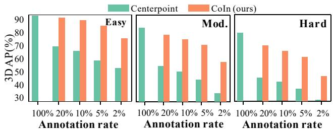
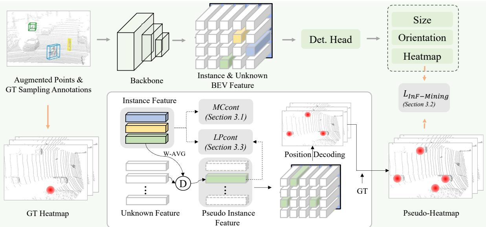
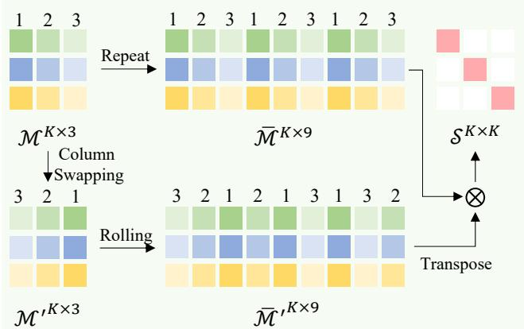
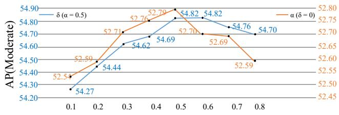

# CoIn: Contrastive Instance Feature Mining for Outdoor 3D Object Detection with Very Limited Annotations

Qiming Xia1 Jinhao Deng1 Chenglu Wen1\* Hai Wu1 Shaoshuai Shi2 Xin Li3 Cheng Wang1 1Xiamen University 2Max-Planck Institute 3Texas A&M University

## Abstract

Recently, 3D object detection with sparse annotations has received great attention. However, current detectors usually perform poorly under very limited annotations. To address this problem, we propose a novel Contrastive Instance feature mining method, named CoIn. To better identify indistinguishable features learned through limited supervision, we design a Multi-Class contrastive learning module (MCcont) to enhance feature discrimination. Meanwhile, we propose afeature-level pseudo-label mining framework consisting ofan instancefeature mining module (InF-Mining) and a Labeled-to-Pseudo contrastive learning module (LPcont). These two modules exploit latent instances in feature space to supervise the training of detectors with limited annotations. Extensive experiments with KITTI dataset, Waymo open dataset, and nuScenes dataset show that under limited annotations, our method greatly improves the performance of baseline detectors: Center-Point, Voxel-RCNN, and CasA. Combining CoIn with an iterative training strategy, we propose a CoIn++ pipeline, which requires only 2% annotations in the KITTI dataset to achieve performance comparable to the fully supervised methods. The code is available at https://github. com/xmuqimingxia/CoIn.

## 1. Introduction

Recently, 3D object detection, which is becoming increasingly important in a variety of vision applications, including autonomous driving, indoor robots, and virtual reality, has received much attention [32, 4, 11, 45, 38, 37, 21, 16, 35, 1]. Popular detectors rely heavily on a large number of high-quality instance-level 3D annotations. However, annotating 3D bounding boxes is time-consuming and labor-intensive, and, therefore, is prohibitive for large-scale datasets.

The development of effective 3D object detectors using only limited annotations has recently received increasing attention [17, 14, 27, 20, 42]. However, when annotations are limited, two main challenges hinder the effectiveness of 3D object detection.

  
Figure 1. Comparison of performance with different annotation rates under the KITTI-3D-Car. Green and orange represent CenterPoint[39] and our proposed CoIn, respectively.

(1) Indistinguishable Features. With limited annotations, it is often difficult for a model that has insufficient training supervision to differentiate foreground points from background points. Consequently, extracted features of different objects are often not well clustered (see supplementary materials). We designate such kinds of features as indistinguishable features. This issue is a critical bottleneck toward more accurate detection. In 2D vision, contrastive learning-based methods [10, 8] have proven effective in enhancing discriminability against indistinguishable features. However, rather than multi-class object classification tasks in common 3D detection problems, contrastive learning is studied mainly for binary classification tasks.

(2) Lacking reliable initial pseudo labels. To deal with limited annotations, recent sparsely-/semi-supervised 3D detectors usually adopt instance-level pseudo-label mining methods to mine unlabeled latent instances [14, 29]. These strategies rely on the assumption that initial detectors already generate relatively reliable detections that are used as preliminary pseudo-labels. However, often this is not possible if the annotation is very limited. In such a scenario, initial detectors are often unreliable and in insufficient quantity to produce reasonable pseudo-labels. Fig. 1 shows some examples where SOTA detectors, such as CenterPoint [39] hardly provide reliable preliminary pseudo-labels when annotations are very limited (e.g., 2%).

Recent studies on 3D object detection with limited annotations adopt three general strategies: weaklysupervised, semi-supervised, and sparsely-supervised approaches. Weakly-supervised strategies [20, 17] adopt noninstance-level annotations (e.g., WS3D[17] adopts pointannotation as supervision signal). However, to achieve desirable performance, a certain number of full annotations are still required in these methods. Semi-supervised methods [27, 42] select only a part of the scenes for full annotations. Sparsely-supervised methods [14] annotate only some instances in each scene (e.g., [14] annotates one instance per scene and reduces the annotation workload to about 20%). Although these approaches significantly reduce annotation workload, applying them to a large training dataset is still labor-intensive. Furthermore, the semi/sparsely-supervised methods require a reliable initial detector to generate pseudo labels. However, if annotations are very limited, initially generated pseudo-labels usually suffer from significant noise. Such low-quality pseudolabels make it very difficult to support subsequent processes. We focus here on developing detectors that have further reduced dependence on annotations.

Specifically, our proposed method consists of a Multi-Class contrastive learning module (MCcont), an Instance Feature Mining module (InF-Mining), and a Labeled-to-Pseudo contrastive learning module (LPcont). MCcont simultaneously interacts with features from multiple categories. Features of the same category constitute a positive sample space; those of the remaining categories constitute a negative sample space thereby helping reduce intraclass distance and increase inter-class distance in the feature space, and improve the discrimination of features for 3D detection. The InF-Mining module mines feature-level pseudo-labels by exploiting the similarity of features of the same category. We decode the spatial position of the 3D object from the location of the feature-level pseudo-label. By applying the contrastive learning strategy, LPcont selects labeled instance features as positive samples and limits the redundancy of pseudo-positive samples.

We verified this design through extensive experiments on the well-known KITTI dataset [7] with 2% annotations. In the moderate level car class, our proposed CoIn significantly improves the baseline detectors CenterPoint [39], Voxel-RCNN [5], and CasA [31] by 23.27%, 13.5%, and 17.95%, respectively. Besides, when combining CoIn with iterative training, our model requires only 2% annotations to achieve similar detection accuracy with those fully supervised methods.

In summary, our contributions are three-fold:

• We propose a Multi- Class contrastive learning module (MCcont), which enhances the discriminability of features by contrasting the instance features across multiple categories, thereby improving detection perfor-

mance.

• We design an end-to-end feature-level pseudo-label mining framework through two new modules: InF-Mining and LPcont. Without requiring repeated manual iterations, InF-Mining directly mines unlabeled supervised signals, and LPcont guarantees the correctness of pseudo-positive signals.

• Extensive experiments demonstrated the superiority of CoIn, which effectively improves the performance of baseline detectors. Moreover, by using only very limited annotation, CoIn can be effectively combined with self-training-based methods to achieve similar performance to those fully supervised methods.

## 2. Related Work

## 2.1. Fully-supervised 3D detectors

Fully-supervised 3D detectors are categorized into three types: (1) Single-stage methods [46, 12, 39, 9, 43, 44] , which directly generate detection results without a refining operation; (2) Two-stage methods [23, 24, 22, 5, 38, 32], which add a refinement stage to improve the accuracy of predicted bounding boxes; and (3) Multi-stage methods [31, 3], which iteratively regress bounding boxes to further refine proposals by cascading multiple refinement stages. With addition of refinement stages, detectors usually achieve better performance; whereas, benefiting from the simpler framework structures, single-stage detectors often show faster reasoning speed.

Although existing 3D detection methods have become increasingly mature, they deeply rely on the availability of a large number of precise annotations, which are often prohibitive to obtain. For practical tasks, it is desirable to develop a 3D detector that requires only very few annotations.

## 2.2. Weakly/semi/sparsely-supervised 3D detectors

Recently, 3D detectors with limited annotations have attracted much attention. To train the proposal generation in first stage, weakly-supervised methods, such as [18], adopted click-annotation instead of bounding box annotation. However, with click-annotation, it is difficult to refine the proposal due to a lack of geometric information. Also, for proposal refinement, click-annotation requires second stage to add a certain number of precise bounding box annotations. For training to mine instance-level pseudolabels, semi-supervised methods [27, 42, 40] randomly annotate part of the scenes with precise annotations. Sparselysupervised methods, such as [14], annotate just some objects per scene and then use subsequent mining and filtering modules to obtain instance-level pseudo-labels. In general, pseudo-label-mining methods have been shown to achieve better performance because the supervisory signals are constantly updated iteratively during training.

  
Figure 2. The overview of proposed CoIn, which consists of a Multi-Class contrastive learning module (MCcont), a Instance Feature mining module (InF-mining), and a Labeled-to-Pseudo contrastive learning module (LPcont). For clarity, we illustrate single object per class in this figure. We note that, there are multiple labeled objects after Ground Truth Sampling (GT Sampling).

However, pseudo-label-mining methods require that the initial detector can work reasonably well. This assumption does not hold when only extremely limited annotations are available. Because insufficient supervision from these annotations can not support reliable initial pseudo labels. In this work, we aim to improve the performance of the initial detector so that reliable pseudo-labels can be generated for subsequent training.

## 2.3. Contrastive learning in 2D object detection

Contrastive learning is a common pre-training technique that learns global feature representations from sample pairs. It has been explored for 2D object detection. DenseCL [30] designed the pixel-level contrast similarity loss to introduce contrast learning into the object detection task. Self-EMD [15] used Earth Mover’s Distance (EMD) as the spatial similarity between two image representations, which facilitated the object detection task. To learn consistent representation on both image-level and patch-level, Detco [34] and PatchReID [6] designed both global and local contrastive learning, respectively. Meanwhile, InsLoc [36] and CoDo [41] constructed data pairs for contrastive learning by pasting foreground images onto background images.

Contrastive learning methods depend on abundant negative sample space [10]. However, under very limited annotations, existing methods can not directly generate sufficient negative samples. In contrast, we propose a multi-class contrastive learning module constructing sufficient negative sample space from limited feature instance representations.

## 3. Method

We propose CoIn, a general method for 3D object detection with extremely limited annotations (2%). To ensure optimal performance, CoIn aims to provide strong supervised signals for the training process of sparsely supervised detectors.

As illustrated in Fig. 2, we adopt CenterPoint [39] as our basic framework. The CoIn contains three key parts: (1) A Multi-Class contrastive learning module (MCcont), which enhances the discriminative power of features; (2) An instance feature mining module (InF-Mining), which uses the similarity between the instance features of the same category to mine feature-level pseudo labels; (3) A Labeled-to-Pseudo contrastive learning module (LPcont), which refers to the labeled positive instance features to supervise mined pseudo-instance features.

## 3.1. Multi-Class Contrastive Learning

Recently, center point-based pipelines have shown promising detection performance with full object annotations. However, these methods generally perform poorly under very limited annotations. The main reason is that a large number of foreground points are identified as background points. Consequently, learned indistinguishable features degrade the detection performance. By constructing contrastive learning in pairs, conventional methods enhance the features’ distinguishability. Nevertheless, under limited annotations, the sample space of contrastive learning in pairs is also extremely limited, thereby greatly constrains the effect of contrastive learning [10]. To use the limited sample space efficiently, we develop a Multi-Class contrastive learning (MCcont) module to enhance the discrimination of features. Unlike traditional contrastive learning, which involves only information interaction in pairs, MCcont, taking advantage of the information of all categories, improves the use of limited sample space.

To introduce contrastive learning into 3D object detection, we first define the contrastive optimization goal. Specifically, we denote ${ \mathcal { F } } \quad = \quad$ $\{ f ( i , j ) \mid i = 1 , . . . , h , j = 1 , . . , w \}$ as the $\textit { h } \times \textit { w }$ BEV (Bird’s-Eye-View) feature of the backbone output. Following CenterPoint [39], $\mathit { Y } _ { k } ~ = ~ [ 0 , 1 ] ^ { w \times h }$ represents the heatmap of the category $k , k ~ = ~ 1 , . . . , K$ . According to the properties of a heatmap, the position where the heat value is equal to 1 represents the center of the object. Based on this point, we define the instance feature set as: ${ \mathcal { T } } _ { k } \ = \ \{ f ( i , j ) \mid Y _ { k } ( i , j ) = 1 \} ; \ n _ { k } \ = \ \lvert { \mathcal { T } } _ { k } \mid$ indicates the number of labeled instances of category k. The contrastive optimization goal is improving the similarity of instance features in $\mathcal { T } _ { k }$ and encouraging the discrimination between $\mathcal { T } _ { k }$ and $\{ \mathcal { T } _ { i } | i = 1 , . . . , K , i \neq k \}$

Inspired by MOCO [10], we also consider multi-class contrastive learning as a dictionary look-up task. First, to enable contrastive learning in a parallel manner across multiple categories, we designed a reference matrix $\mathcal { M } ^ { K \times N }$ and a query matrix, $\mathcal { M } ^ { ' \tilde { K } \times N }$ . Each row of M corresponds to same category and different elements in this row are samples of different instances in this category. It is worth noting that different categories have a different number of instances. Thus, to facilitate the subsequent matrix operations, the maximum value, N, among these $n _ { k }$ is used as the predetermined dimension (number of instances). $\mathcal { M } ^ { ' }$ is obtained by performing column swapping on M. Elements from the same row of M and $\mathcal { M } ^ { ' }$ , which are different instances from the same category, form positive sample pairs. Elements from different rows form negative sample pairs. The main idea of MCcont is as follows: Calculating the similarity between M and $\mathcal { M } ^ { ' T }$ by matrix multiplication, we obtain the similarity matrix $\boldsymbol { \mathcal { S } } \in \left[ 0 , 1 \right] ^ { K \times K }$ . The diagonal of the similarity matrix records the similarity between positive samples. The other positions are the similarity between positive and negative samples. Regarding the similarity matrix, the overall objective of the multi-class contrastive loss is to maximize the similarity of the diagonal and minimize the similarity of other positions.

However, directly using M and $\mathcal { M } ^ { ' }$ for contrastive learning allows each positive sample to be paired with only one positive sample and $K - 1$ negative samples. As illustrated in Fig. 3, to enrich the sample space, we employed a ’rolling’ operation that cyclically shifts each column of matrix $\mathcal { M } ^ { ' }$ and then stacked them to acquire a new query matrix $\bar { \mathcal { M } } ^ { \prime K \times N ^ { 2 } }$ . To facilitate matrix multiplication between two matrices, we simply use the original reference matrix and repeat $N - 1$ times in the row direction to obtain the new matrix $\bar { \mathcal { M } } ^ { K \times N ^ { 2 } }$ . With this, each positive sample can pair with $N - 1$ positive samples and $( K - 1 ) * N$ negative samples. Note that the number of instances in 3D scenarios is limited. Hence, the dimension of this matrix will not be excessively large.

  
Figure 3. Illustration of similarity matrix computing processing. Let $K = N = 3$ to understand the meaning of matrix.

Formally, the MCcont loss function is as follows:

$$
\mathcal { L } _ { M C c o n t } = - \frac { 1 } { K } \sum _ { i = 1 } ^ { K } l o g \frac { e x p ( \frac { d ( \bar { M } ( i , : ) , \bar { { \mathcal { N } } ^ { ' } } ( : , i ) ) } { N ^ { 2 } } / \tau ) } { \sum _ { j \ne i } e x p ( \frac { d ( \bar { M } ( i , : ) , \bar { { \mathcal { N } } ^ { ' } } ( : , j ) ) } { N ^ { 2 } } / \tau ) } .\tag{1}
$$

where τ is a temperature scaling parameter [33]. The function $d ( \cdot , \cdot )$ denotes an element-wise product and sum. MCcont causes instance features of the same category to be more similar and those of different categories are more distinguishable, thereby enhancing feature discrimination.

## 3.2. Instance Feature Mining

With the assistant of MCcont, we obtain the discriminative features $\breve { \mathscr F } = \left\{ \breve { f } ( i , j ) \vert i = 1 , . . . , h , j = 1 , . . . , w \right\}$ . It is apparent that objects of the same category have strong similarities in feature space. Additionally, the use of feature similarity has been validated in the 2D domain[13]. Motivated by this, we exploit the similarity between reference instance features and unlabeled instance features to mine stronger supervised signals.

To obtain more representative reference instance features, we adopt a weighted average operation to obtain a meta-instance feature for each category, calculated as follows:

$$
E _ { k } = \frac { \sum _ { i , j } \breve { f } ( i , j ) \cdot Y _ { k } ( i , j ) } { \sum _ { i , j } Y _ { k } ( i , j ) } , k = 1 , . . . , K .\tag{2}
$$

where Y is the heatmap [39], K is the number of categories. The unknown features are denoted as $\mathcal { U } _ { k } ( i , j ) =$ $\left\{ \breve { f } ( i , j ) \mid Y _ { k } ( i , j ) = 0 \right\}$ . Inspired by [28], We consider both Euclidean distance and cosine similarity as two metrics to calculate the similarity $\boldsymbol { s ^ { \prime } } _ { k }$ between the feature of a known instance and an unknown feature as follows:

$$
\begin{array} { r } { \mathcal { S } ^ { ' } _ { k } ( i , j ) = m i n ( D _ { 1 } ( E _ { k } , \mathcal { U } _ { k } ( i , j ) ) , D _ { 2 } ( E _ { k } , \mathcal { U } _ { k } ( i , j ) ) ) . } \end{array}\tag{3}
$$

Where, $D _ { 1 } = 1 - m i n ( L _ { 2 } , 1 ) , D _ { 2 } = ( c o s s i m + 1 ) / 2 )$ And, $\mathcal { S } ^ { ' } \in [ 0 , 1 ]$ , where 0 indicates dissimilarity. The min function returns the least similar values between two metrics. If even the least similar values are still considered similar, then we treat them as similar. According to the similarity $\boldsymbol { \mathcal { S } } _ { \mathrm { ~ \boldsymbol { ~ k ~ } ~ } } ^ { \prime }$ and heatmap $Y$ , we mine the pseudo-heatmap $\hat { Y }$ as follows:

$$
\hat { Y } _ { k } ( i , j ) = \left\{ \begin{array} { l l } { \eta \ast \boldsymbol { S } ^ { ' } _ { k } ( i , j ) } & { \mathrm { ~ i f ~ } Y _ { k } ( i , j ) = 0 , \boldsymbol { S } ^ { ' } _ { k } ( i , j ) \geq T } \\ { Y _ { k } } & { o t h e r w i s e } \end{array} \right. .\tag{4}
$$

where scale factor $\eta$ is empirically set to 0.7 according to [33]. The similarity threshold, $T ,$ is a hyper-parameter. In Sec.4.4, we will perform an ablation study to properly select the hyper-parameters. The pseudo heatmap replaces the original heatmap as the supervised signal for the detector training. Following [39], the classification loss of InF-Mining as follows:

$$
{ \mathcal { L } } _ { I n F - M i n i n g } = { \mathcal { L } } _ { H e a t m a p } ( { \bar { Y } } , { \hat { Y } } ) .\tag{5}
$$

where $\bar { Y }$ is the predicted heatmaps and $\mathcal { L } _ { H e a t m a p }$ is the heatmap prediction loss function in CenterPoint [39].

## 3.3. Labeled-to-Pseudo Contrastive Learning

By mining pseudo-heatmaps, the InF-Mining module provides stronger supervised signals. However, errors inevitably raise in pseudo-heatmaps. The cross entropy used in $\mathcal { L } _ { H e a t m a p }$ exacerbates this problem [13]. To address this problem, we propose a Labeled-to-Pseudo contrastive learning module (LPcont), which refers to the labeled positive instance features to supervise the prediction of pseudopositive signals.

For category k, we obtain labeled positive instance feature set, $\mathcal { T } _ { k } .$ , and pseudo-positive instance feature set, $\mathcal { O } _ { k }$ ${ \mathcal { T } } _ { k } = \left\{ { \check { f } } ( i , j ) \mid Y _ { k } ( i , j ) = 1 \right\}$ , subsets are represented as $\big \{ { I } _ { k } ^ { 1 } , { I } _ { k } ^ { 2 } , . . . , { I } _ { k } ^ { n _ { k } } \big \} . \quad { \mathcal O } _ { k } ~ = ~ \Big \{ \breve { f } ( i , j ) | t o p . m _ { k } ( \bar { Y } _ { k } ( i , j ) ) \Big \} ;$ subsets are represented as $\big \{ O _ { k } ^ { \mathrm { i } } , O _ { k } ^ { 2 } , . . . , O _ { k } ^ { m _ { k } } \big \}$ . The top ${ { m } } _ { k }$ function returns the $m _ { k }$ largest elements from $\bar { Y } _ { k }$ . To increase the discrimination power of the meta-instance feature $E _ { k }$ , we also consider narrowing the feature space distance between the meta-instance and labeled instance. We group pseudo-positive instance features and meta-instance features together as follows:

$$
\hat { \mathcal { T } } _ { k } = \left\{ \hat { I } _ { k } ^ { 1 } , \hat { I } _ { k } ^ { 2 } , . . . , \hat { I } _ { k } ^ { m _ { k } } , \hat { I } _ { k } ^ { m _ { k } + 1 } \right\} , \hat { I } _ { k } ^ { m _ { k } + 1 } = { E } _ { k }\tag{6}
$$

The specific objective function of LPcont is as follows:

$$
\begin{array} { r } { \mathcal { L } _ { L P c o n t } = - \frac { 1 } { n _ { k } \times ( m _ { k } + 1 ) \times K } } \\ { \displaystyle { \sum _ { n = 1 } ^ { n _ { k } } \sum _ { k = 1 } ^ { K } \sum _ { m = 1 } ^ { m _ { k } + 1 } l o g \frac { e x p ( \check { I } _ { k } ^ { n } \cdot \hat { I } _ { k } ^ { m } / \tau ) } { \sum _ { i \neq k } e x p ( \check { I } _ { k } ^ { n } \cdot \hat { I } _ { i } ^ { m } / \tau ) } } . } \end{array}\tag{7}
$$

where $\tau$ is a temperature scaling parameter [33]. LPcont maximizes the similarity between $\breve { I } _ { k }$ and $\hat { I } _ { k }$ and minimizes the similarity between $\breve { I } _ { k }$ and $\left\{ \hat { I } _ { i } , i \neq k \right\}$ . We use labeled instance features as references to enhance the competitiveness of correct predictions in pseudo-positive prediction. Thanks to the similarity constraint, false predictions in the pseudo-positive instance features are filtered, thereby correcting false predictions in the predicted heatmap.

## 3.4. Training Losses

Our proposed CoIn framework is trained with MCcont loss $\mathcal { L } _ { M C c o n t } .$ , InF-Mining loss $\mathcal { L } _ { I n F - M i n i n g } ,$ LPcont loss $\mathcal { L } _ { L P c o n t : }$ , and regression loss $\mathcal { L } _ { \boldsymbol { r } \boldsymbol { e } \boldsymbol { g } }$ . The total loss is:

$$
\mathcal { L } _ { t o t a l } = \alpha \mathcal { L } _ { M C c o n t } + \beta \mathcal { L } _ { I n F - M i n i n g } + \gamma \mathcal { L } _ { L P c o n t } + \delta \mathcal { L } _ { r e g }\tag{8}
$$

where $\beta , \delta$ are empirically set to 1 according to [26], α, γ are the hyper-parameters that balance the mining tasks with detection tasks. We will conduct the ablation study to select hyper-parameters properly. We keep the same regression loss as CenterPoint [39].

## 3.5. CoIn++ and Extension to Other Detectors

CoIn++. Recently, self-training based pseudo-label mining methods [14] have made great progress. However, they heavily depends on the quality of initial pseudo labels. Under limited annotations, it’s difficult for the baseline detector generate reliable pseudo labels (See Fig.1). Since our method can provide better initial pseudo labels, the performance of our CoIn can be boosted further by the selftraining framework. Specifically, we propose a CoIn-based instance-level pseudo-label mining method, CoIn++ (design details are given in supplementary materials). The experimental results of CoIn++ demonstrate that our CoIn can be effectively combined with instance-level pseudo-label mining methods (See Table 2).

Extension to other detectors. Our CoIn can be extended to other 3D detectors. To extend CoIn on single-stage 3D detectors, we simply set their detection heads to Center-Head [26]. However, for two-stage and multi-stage detectors, directly using the predicted RoIs obtained from CoIn makes it difficult to improve their performance. Even if RoIs that are correct predicted are mined in the first stage, in subsequent stages, the predicted RoIs lack the labeled supervised signal to refine; therefore, these accurate predictions are eliminated. To overcome this problem, we generate pseudo RoI labels based on the predicted RoIs’ score.

<table><tr><td rowspan="2">Annotation Rate</td><td rowspan="2">Method(PV-RCNN-based)</td><td colspan="2">Self-trainnig</td><td colspan="3">Car-3D</td><td colspan="3">Pedestrian-3D</td><td colspan="3">Cyclist-3D</td></tr><tr><td>Yes</td><td>No</td><td>Easy</td><td>Mod.</td><td>Hard</td><td>Easy</td><td>Mod.</td><td>Hard</td><td>Easy</td><td>Mod.</td><td>Hard</td></tr><tr><td rowspan="6">1%</td><td>Only self-training</td><td>√</td><td rowspan="6"></td><td>88.4</td><td>75.2</td><td>69.5</td><td>32.7</td><td>29.2</td><td>26.7</td><td>51.4</td><td>30.7</td><td>28.7</td></tr><tr><td>3DIoUMatch [27]</td><td>√</td><td>89.0</td><td>76.0</td><td>70.8</td><td>37.0</td><td>31.7</td><td>29.1</td><td>60.4</td><td>36.4</td><td>34.3</td></tr><tr><td>DetMatch [19]</td><td>√</td><td></td><td>77.5</td><td></td><td></td><td>57.3</td><td></td><td></td><td>42.3</td><td></td></tr><tr><td>SS3D [14]</td><td>√</td><td>96.2</td><td>88.1</td><td>86.9</td><td>61.7</td><td>58.7</td><td>54.5</td><td>85.6</td><td>62.8</td><td>58.4</td></tr><tr><td>CoIn</td><td></td><td>94.8</td><td>84.9</td><td>71.0</td><td>53.0</td><td>52.4</td><td>49.8</td><td>74.7</td><td>55.9</td><td>52.1</td></tr><tr><td>CoIn++</td><td>√</td><td>98.4</td><td>90.4</td><td>86.9</td><td>62.0</td><td>59.1</td><td>55.1</td><td>85.2</td><td>63.2</td><td>59.3</td></tr><tr><td rowspan="6">2%</td><td>Only self-training</td><td>√</td><td rowspan="6"></td><td>92.9</td><td>76.8</td><td>72.3</td><td>49.7</td><td>46.0</td><td>44.5</td><td>68.9</td><td>47.2</td><td>44.8</td></tr><tr><td>3DIoUMatch [27]</td><td>√</td><td></td><td>78.7</td><td></td><td></td><td>48.2</td><td></td><td></td><td>56.2</td><td></td></tr><tr><td>DetMatch [19]</td><td>√</td><td></td><td>78.2</td><td></td><td></td><td>54.1</td><td></td><td></td><td>64.7</td><td></td></tr><tr><td>SS3D [14]</td><td>√</td><td>98.28</td><td>89.2</td><td>88.3</td><td>67.5</td><td>62.3</td><td>61.0</td><td>90.1</td><td>72.2</td><td>68.3</td></tr><tr><td>CoIn</td><td></td><td>96.3</td><td>86.7</td><td>74.4</td><td>59.6</td><td>57.4</td><td>55.2</td><td>80.5</td><td>66.7</td><td>64.3</td></tr><tr><td>CoIn++</td><td>√</td><td>99.3</td><td>92.7</td><td>88.8</td><td>68.2</td><td>62.5</td><td>60.8</td><td>89.7</td><td>73.0</td><td>70.6</td></tr></table>

Table 1. Comparison with state-of-the-art semi/sparsely methods on KITTI val split. All methods are based on PV-RCNN. We report the results of 3D detection with 40 recall positions, respectively.

The excellent performance of this strategy can be attributed to the successful mining of unlabeled supervised signals by CoIn in the first stage, and the mined results can still achieve positive results in the refinement stage. In subsequent experiments, we introduce CoIn’s performance on multiple detectors: a single-stage detector CenterPoint [39], a twostage detector Voxel-RCNN [5], and a multi-stage detector CasA [31].

## 4. Experiments

## 4.1. KITTI Datasets and Evaluation Metrics

Recently, the KITTI 3D object detection dataset [7] has been used wildly by weakly/semi-supervised and fully supervised 3D object detectors. Following recent works [5, 31, 14], we divided the KITTI training set (7,481 scenes) into a train split (3,712 scenes) and a val split (3,769 scenes). For evaluation, we generated an extremely limited annotation split (denoted as the limited split). Specifically, we randomly select 10% of the scenes from the train split and kept only one object annotation in each selected scene. Compared with the original train split, the limited split requires only 2% of the object annotations. To ensure a fair comparison, we followed the primary official evaluation metric: 3D Average Precision (AP) under forty recall thresholds (R40).

## 4.2. Implementation Details

Our CoIn is trained from scratch in an end-to-end manner. For the KITTI dataset, we trained CoIn with a batch size of 32 and a learning rate of 0.003 for eighty epochs on 4 RTX 3090 GPUs. We set the similarity threshold, T, at 0.9 (For greater details, see Table 7). For the weights of the four losses, we set α, β, γ, δ at 0.5, 1, 0.5, 1, respectively. Following state-of-the-art methods [31, 5, 22, 39, 44], we adopted a series of data augmentation methods to improve detection robustness. Specifically, we first applied random flipping, global scaling, and global rotation to the input point clouds. Then, to increase the diversity of training scenes, we performed a ground truth sampling [23].

## 4.3. Main Results

Comparison with state-of-the-art methods. We conducted experiments to compare our approach with stateof-the-art semi/sparsely-supervised methods. All methods adopted PV-RCNN [22] as the baseline detector and evaluated their performance using 1% and 2% annotations with IoU thresholds of 0.5, 0.25, and 0.25. To obtain the 1% annotation, 2% annotation was halved. The 3D detection performance of different methods is presented in Table 1. For the most important 3D detection benchmark, car class, our method outperforms previous state-of-the-art methods. Specifically, at the 2% annotation rate, our method achieves an increase in AP on easy, moderate, and hard difficulty levels of 1.1%, 3.5%, and 0.5% respectively. For 1% annotations, our method surpasses SS3D [14] on easy and moderate levels of 2.2%, and 2.3% respectively. For the detection of pedestrian and cyclist, our CoIn++ achieves better or comparable results to the state-of-the-art methods.

It is worth noting that, different from the evaluation in Table 1, fully supervised methods typically use higher IoU thresholds of 0.7, 0.5, 0.5 for the three object classes. To validate the effectiveness of our method under 2% annotations, we also evaluated our method on multiple fully supervised baseline detectors.

Verification on fully-supervised methods. First, as baselines, we chose three popular detectors: Center-Point [39], Voxel-RCNN [5], and CasA [31], which are based on single-stage, two-stage, and multi-stage detection frameworks, respectively. Then we trained the three detectors directly on the limited split (2% annotations) of the KITTI dataset. The results are reported in Table 2. Due to the significant noise caused by indistinguishable features and missing sufficient instance-level supervision, the performance of the three baseline detectors trained on limited split decreases dramatically. By adding our InF-Mining, MCcont, and LPcont to the three baseline detectors, our CoIn pipeline improves the baselines on Car-3D-Mod AP(R40) by 23.27%, 13.5%, and 17.95% respectively. This improvement is attributed to our modules learning discriminative features and generating high-quality feature-level pseudo labels. Furthermore, we integrated our CoIn into an iterative self-training framework [14] to obtain CoIn++, thereby achieving on-par performance with fullysupervised methods (See table 2). This achievement is due to our module providing strong and high-quality supervision signals for iterative self-training, resulting in a significant performance boost.

<table><tr><td rowspan="2">Annotation Rate</td><td rowspan="2">Stage</td><td rowspan="2">Method</td><td colspan="3">Car-3D AP(R40)</td><td colspan="3">Car-BEV AP(R40)</td></tr><tr><td>Easy</td><td>Mod</td><td>Hard</td><td>Easy</td><td>Mod</td><td>Hard</td></tr><tr><td>100%</td><td rowspan="6"></td><td>1.CenterPoint* [39]</td><td>89.07</td><td>80.50</td><td>76.49</td><td>92.98</td><td>89.01</td><td>87.50</td></tr><tr><td>2%</td><td>2.CenterPoint [39]</td><td>49.69</td><td>31.55</td><td>25.91</td><td>56.78</td><td>42.50</td><td>34.14</td></tr><tr><td>2% Single-stage 2%</td><td>3.CoIn(Our CenterPoint-based)</td><td>72.03</td><td>54.82</td><td>43.77</td><td>87.20</td><td>73.54</td><td>72.03</td></tr><tr><td></td><td>4. CoIn++(Our CenterPoint-based)</td><td>88.51</td><td>75.23</td><td>64.83</td><td>95.79</td><td>88.10</td><td>77.39</td></tr><tr><td></td><td>Improvement (3-2)</td><td>+22.34</td><td>+23.27</td><td>+17.86</td><td>+30.42</td><td>+31.04</td><td>+37.89</td></tr><tr><td></td><td>Improvement (4-1)</td><td>-0.56</td><td>-5.27</td><td>-11.66</td><td>+2.81</td><td>-0.91</td><td>-10.11</td></tr><tr><td rowspan="6">100% 2% 2% 2%</td><td rowspan="6">Two-stage</td><td>1.Voxel-RCNN [5]</td><td>92.38</td><td>85.29</td><td>82.86</td><td>95.52</td><td>91.25</td><td>88.99</td></tr><tr><td>2.Voxel-RCNN [5]</td><td>70.52</td><td>54.97</td><td>44.82</td><td>83.67</td><td>71.14</td><td>57.71</td></tr><tr><td>3.CoIn(Our Voxel-RCNN-based)</td><td>84.56</td><td>68.47</td><td>58.02</td><td>92.31</td><td>81.01</td><td>70.24</td></tr><tr><td>4. CoIn++(Our Voxel-RCNN-based)</td><td>92.01</td><td>79.59</td><td>71.58</td><td>96.12</td><td>88.87</td><td>82.57</td></tr><tr><td>Improvement (3-2)</td><td>+14.04</td><td>+13.5</td><td>+13.2</td><td>+8.64</td><td>+9.87</td><td>+12.53</td></tr><tr><td>Improvement (4-1)</td><td>-0.37</td><td>-5.7</td><td>-11.28</td><td>+0.6</td><td>-2.38</td><td>-6.42</td></tr><tr><td>2%</td><td rowspan="6"></td><td>1.CasA [31]</td><td>93.08</td><td>86.33</td><td>81.86</td><td>93.93</td><td>90.20</td><td>87.72</td></tr><tr><td></td><td>2.CasA [31]</td><td>74.18</td><td>57.37</td><td>45.05</td><td>85.90</td><td>73.21</td><td>57.23</td></tr><tr><td>2% Multi-stage</td><td>3.CoIn(Our CasA-based)</td><td>89.17</td><td>75.32</td><td>62.98</td><td>95.99</td><td>85.02</td><td>72.47</td></tr><tr><td>2%</td><td>4. CoIn++( Our CasA-based)</td><td>93.08</td><td>82.80</td><td>74.67</td><td>96.82</td><td>91.31</td><td>84.00</td></tr><tr><td></td><td>Improvement (3-2)</td><td>+14.99</td><td>+17.95</td><td>+17.93</td><td>+10.09</td><td>+11.81</td><td>+15.24</td></tr><tr><td></td><td>Improvement (4-1)</td><td>0</td><td>-3.53</td><td>-7.19</td><td>+2.89</td><td>+1.11</td><td>-3.72</td></tr></table>

Table 2. Verification on different detectors with full annotations (100%) and extremely limited annotations (2%) on KITTI val split. Th 3D object detection benchmark is evaluated by mean average precision with R40, under IoU thresholds 0.7. \* denotes the results obtained by referring to its open source code. ++ indicates the addition of instance-level pseudo-label mining method.

Under IoU thresholds of 0.7, SOTA sparsely/semisupervised methods [14, 27] require 20% or more annotations to approach the performance of fully supervised detectors. In contrast, CoIn++ achieves this using only 2% annotations.

Evaluation on Waymo open dataset and nuScenes dataset. To verify the wide applicability of our design, we conducted experiments on the large-scale Waymo dataset [25] and nuScenes dataset [2]. We followed the sparsely annotated generation method in [14] and kept only a single object annotation in each frame during training. The results with the Waymo validation set see table 3. Our method outperforms the baseline by 16.10%/16.05% in the AP/APH LEVEL 1 metric. The LEVEL 2 results (See Table 3) show that our method brings significant improvement even for objects with fewer than five points. As shown in Table 4, CoIn significantly improves the performance of most categories on the nuScenes dataset. The outstanding results with Waymo and nuScenes further verify the generalization ability of our method on different datasets.

## 4.4. Ablation Study

Effectiveness of MCcont, InF-Mining, and LPcont. The effects of different components of CoIn are listed in Table 5, where the first row shows the performance of basic CenterPoint [39] and the last row shows the results of CoIn. We added different components on CenterPoint to form three models, for which the results are shown in the second and the third rows. Benefiting from the indistinguishable features that have been distinguished by multiclass contrastive learning, our proposed MCcont improves the baseline performance (See the second row of Table 5). This benefits from that the indistinguishable features have been distinguished by multi-class contrastive learning. Our InF-Mining module contributes most to performance and outperforms the baseline CenterPoint [39] by 17.91% on moderate. This highlighted performance shows that featurelevel pseudo-labels successfully capture latent unlabeled supervised signals. Based on the InF-Mining module, by combining MCcont and LPcont modules, our CoIn further improves the performance by guaranteeing the correctness of mined feature-level pseudo-labels.

Comparison with different annotation rates. To demonstrate the superiority of our method under different annotation rates, we compared our method with CenterPoint [39] under 10%, 5%, and 2% annotations. The 10% and 5% annotation rates are generated by randomly selecting 50% and 25% scenes from the train split and labeling only a single object for each selected scene. As a comparison reference, we also presented the results of fully supervised (100% annotation rate) CenterPoint [39]. The results on the KITTI dataset are shown in Table 6. It is seen that, due to the lack of supervision signals, the performance of the CenterPoint drops significantly on all annotation rates. Specifically, under annotation rates of 10%, 5%, and 2%, the AP of Moderate Car decreased by 32.07%, 38.2%, and 46.30%, respectively. By applying our CoIn design, the performance of CenterPoint is improved by 24.16%, 26.00%, and 23.27%, respectively.

<table><tr><td rowspan="2">Data</td><td rowspan="2">Method</td><td colspan="2">VEHICLE</td><td colspan="2">PEDESTRIAN</td><td colspan="2">CYCLIST</td></tr><tr><td>LEVEL_1</td><td>LEVEL_2</td><td>LEVEL_1</td><td>LEVEL_2</td><td>LEVEL_1</td><td>LEVEL_2</td></tr><tr><td rowspan="3">Sparsely-supervised</td><td></td><td>AP/APH</td><td>AP/APH</td><td>AP/APH</td><td>AP/APH</td><td>AP/APH</td><td>AP/APH</td></tr><tr><td>CentePoint</td><td>32.15/31.55</td><td>27.97/27.45</td><td>25.66/21.65</td><td>22.00/18.56</td><td>59.25/57.84</td><td>57.22/55.86</td></tr><tr><td>CoIn</td><td>48.25/47.60</td><td>41.82/41.25</td><td>28.25/24.28</td><td>23.79/20.45</td><td>63.99/62.60</td><td>61.71/60.37</td></tr><tr><td></td><td>Improvements</td><td>+16.10/+16.05</td><td>+13.85/+13.80</td><td>+2.59/+2.63</td><td>+1.79/+1.89</td><td>+4.74/+4.76</td><td>+4.49/+4.51</td></tr></table>

Table 3. Comparison on the Waymo open dataset for vehicle detection, pedestrian detection, and cyclist detection.

<table><tr><td>Data</td><td>Method</td><td>mAP</td><td>NDS</td><td>Car</td><td>Truck</td><td>C.V.</td><td>Bus</td><td>Trailer</td><td>Barrier</td><td>Motor.</td><td>Bike</td><td>Ped.</td><td>T.C.</td></tr><tr><td></td><td>CenterPoint</td><td>8.09</td><td>25.77</td><td>24.62</td><td>2.84</td><td>0</td><td>15.66</td><td>0.0</td><td>4.07</td><td>3.33</td><td>0.29</td><td>25.11</td><td>4.96</td></tr><tr><td rowspan="2">Sparsely-supervised</td><td>CoIn</td><td>12.47</td><td>33.79</td><td>38.70</td><td>6.85</td><td>0.0</td><td>20.67</td><td>7.81</td><td>11.51</td><td>2.85</td><td>3.36</td><td>34.85</td><td>8.5</td></tr><tr><td>Improvement</td><td>4.38</td><td>8.02</td><td>14.08</td><td>4.01</td><td>0.0</td><td>5.01</td><td>7.81</td><td>7.44</td><td></td><td>3.07</td><td>9.74</td><td>3.54</td></tr><tr><td></td><td></td><td></td><td></td><td></td><td></td><td></td><td></td><td></td><td></td><td></td><td></td><td></td><td></td></tr></table>

Table 4. The multi-class results on the nuScenes val set. ‘C.V.’, ‘Ped.’, and ‘T.C.’ are short for construction vehicle, pedestrian, and traffic cone, respectively.

<table><tr><td rowspan="2">MCcont</td><td rowspan="2">InF-Mining</td><td rowspan="2">LPcont</td><td colspan="3">Car-3D Benchmark</td></tr><tr><td>Easy</td><td>Mod.</td><td>Hard</td></tr><tr><td></td><td></td><td></td><td>49.69</td><td>31.55</td><td>25.91</td></tr><tr><td>√</td><td></td><td></td><td>53.21</td><td>34.37</td><td>29.61</td></tr><tr><td></td><td>√</td><td></td><td>65.19</td><td>49.46</td><td>37.74</td></tr><tr><td>√</td><td>√</td><td>√</td><td>72.03</td><td>54.82</td><td>43.77</td></tr></table>

Table 5. Effects of the different components of CoIn. We report the mAP with R40, under IoU threshold 0.7.

<table><tr><td rowspan="2">Annotation Rate</td><td rowspan="2">Method</td><td colspan="3">Car-3D AP(R40)</td></tr><tr><td>Easy</td><td>Mod</td><td>Hard</td></tr><tr><td>100%</td><td>CenterPoint [39]</td><td>89.07</td><td>80.50</td><td>76.49</td></tr><tr><td rowspan="3">10%</td><td>CenterPoint [39]</td><td>62.62</td><td>47.64</td><td>39.59</td></tr><tr><td>CoIn</td><td>85.95</td><td>71.80</td><td>62.64</td></tr><tr><td>Improvements</td><td>+23.33</td><td>+24.16</td><td>+23.05</td></tr><tr><td rowspan="3">5%</td><td>CenterPoint [39]</td><td>55.42</td><td>41.48</td><td>34.56</td></tr><tr><td>CoIn</td><td>81.64</td><td>67.48</td><td>58.32</td></tr><tr><td>Improvements</td><td>+26.22</td><td>+26.00</td><td>+23.76</td></tr><tr><td rowspan="3">2%</td><td>CenterPoint [39]</td><td>49.69</td><td>31.55</td><td>25.91</td></tr><tr><td>CoIn</td><td>72.03</td><td>54.82</td><td>43.77</td></tr><tr><td>Improvements</td><td>+22.34</td><td>+23.27</td><td>+17.86</td></tr></table>

Table 6. Comparison with different annotation rates (10%, 5%, 2%) on KITTI val split.

<table><tr><td>Similarity Threshold T</td><td>0.99</td><td>0.9 0.8</td><td></td><td>0.7 0.6</td></tr><tr><td>mAP (%)</td><td>38.0</td><td>54.8 54.5</td><td>54.0</td><td>53.9</td></tr></table>

Table 7. The mAP of 3D-Car-Mod. benchmark with different similarity threshold with R40, under IoU threshold 0.7.

Similarity threshold. We compared the performance of the 3D-Car-Mod AP with different similarity thresholds. To mine the more reliable pseudo-label, we select relatively large thresholds. However, when T is too large (e.g., 0.99), it’s difficult for the module to mine feature-level pseudolabels, leading to low detection performance, as shown in

Table 7. When T is relatively small (e.g., 0.6), the mAP drops considerably due to the introduction of more noisy labels. Finally, we select the similarity threshold, $T = 0 . 9$ Weight selection of MCcont and LPcont. The weights α and δ determine the contribution of MCcont and LPcont on the framework. We conducted experiments to find the most appropriate weights. Specially, we fix the δ as 0 and tune α. Then, we fix α and tune δ. As shown in Fig. 4, the optimal results are achieved when α = 0.5 and δ = 0.5.

  
(a) Influence of α (for Mccont) and δ (for LPcount)  
Figure 4. Weights Selection for MCcont and LPcont.

## 5. Conclusion

This paper presented a novel feature-level pseudo-label mining method, CoIn, for 3D object detection with very limited annotations. To enhance the discrimination of indistinguishable features, CoIn introduces contrast learning into sparsely supervised 3D object detection. CoIn uses the similarity between instance features to mine the supervision information of unlabeled instances. Experimental results on the KITTI 3D/BEV detection benchmark and the Waymo Open dataset showed that CoIn improves the performance of baseline detectors with limited annotations (2%). After effectively combining with a self-training strategy, our CoIn++ achieves on-par performance with fully-supervised detectors.

Acknowledgement. This work was supported in part by the National Key R&D Program of China under Grant 2021YFF0704600, the Fundamental Research Funds for the Central Universities (No. 20720220064).

## References

[1] Xuyang Bai, Zeyu Hu, Xinge Zhu, Qingqiu Huang, Yilun Chen, Hongbo Fu, and Chiew-Lan Tai. Transfusion: Robust lidar-camera fusion for 3d object detection with transformers. In Proceedings of the IEEE conference on Computer Vision and Pattern Recognition (CVPR), 2022. 1

[2] Holger Caesar, Varun Bankiti, Alex H. Lang, Sourabh Vora, Venice Erin Liong, Qiang Xu, Anush Krishnan, Yu Pan, Giancarlo Baldan, and Oscar Beijbom. nuscenes: A multimodal dataset for autonomous driving. In Proceedings of the IEEE conference on Computer Vision and Pattern Recognition (CVPR), 2020. 7

[3] Qi Cai, Yingwei Pan, Ting Yao, and Tao Mei. 3d cascade rcnn: High quality object detection in point clouds. IEEE Transactions on Image Processing, 31:5706–5719, 2022. 2

[4] Yukang Chen, Yanwei Li, X. Zhang, Jian Sun, and Jiaya Jia. Focal sparse convolutional networks for 3d object detection. In Proceedings of the IEEE conference on Computer Vision and Pattern Recognition (CVPR), 2022. 1

[5] Jiajun Deng, Shaoshuai Shi, Peiwei Li, Wen gang Zhou, Yanyong Zhang, and Houqiang Li. Voxel r-cnn: Towards high performance voxel-based 3d object detection. In Proceedings of the AAAI Conference on Artificial Intelligence, 2021. 2, 6, 7

[6] Jian Ding, Enze Xie, Hang Xu, Chenhan Jiang, Zhenguo Li, Ping Luo, and Gui-Song Xia. Unsupervised pretraining for object detection by patch reidentification. arXiv preprint arXiv:2103.04814, 2021. 3

[7] Andreas Geiger, Philip Lenz, and Raquel Urtasun. Are we ready for autonomous driving? the kitti vision benchmark suite. In Proceedings of the IEEE conference on Computer Vision and Pattern Recognition (CVPR), pages 3354–3361, 2012. 2, 6

[8] Raia Hadsell, Sumit Chopra, and Yann LeCun. Dimensionality reduction by learning an invariant mapping. In IEEE Computer Society Conference on Computer Vision and Pattern Recognition (CVPR), volume 2, pages 1735–1742. IEEE, 2006. 1

[9] Chenhang He, Hui Zeng, Jianqiang Huang, Xian-Sheng Hua, and Lei Zhang. Structure aware single-stage 3d object detection from point cloud. In Proceedings of the IEEE conference on Computer Vision and Pattern Recognition (CVPR), pages 11873–11882, 2020. 2

[10] Kaiming He, Haoqi Fan, Yuxin Wu, Saining Xie, and Ross Girshick. Momentum contrast for unsupervised visual representation learning. In Proceedings ofthe IEEE conference on Computer Vision and Pattern Recognition (CVPR), pages 9729–9738, 2020. 1, 3, 4

[11] Jordan S. K. Hu, Tianshu Kuai, and Steven L. Waslander. Point density-aware voxels for lidar 3d object detection. In Proceedings ofthe IEEE conference on Computer Vision and Pattern Recognition (CVPR), 2022. 1

[12] Alex H Lang, Sourabh Vora, Holger Caesar, Lubing Zhou, Jiong Yang, and Oscar Beijbom. Pointpillars: Fast encoders for object detection from point clouds. In Proceedings of the IEEE conference on Computer Vision and Pattern Recognition (CVPR), pages 12697–12705, 2019. 2

[13] Hanjun Li, Xingjia Pan, Ke Yan, Fan Tang, and Wei-Shi Zheng. Siod: Single instance annotated per category per image for object detection. In Proceedings ofthe IEEE conference on Computer Vision and Pattern Recognition (CVPR), pages 14197–14206, 2022. 4, 5

[14] Chuandong Liu, Chenqiang Gao, Fangcen Liu, Jiang Liu, Deyu Meng, and Xinbo Gao. Ss3d: Sparsely-supervised 3d object detection from point cloud. In Proceedings of the IEEE conference on Computer Vision and Pattern Recognition (CVPR), pages 8428–8437, 2022. 1, 2, 5, 6, 7

[15] Songtao Liu, Zeming Li, and Jian Sun. Self-emd: Selfsupervised object detection without imagenet. arXiv preprint arXiv:2011.13677, 2020. 3

[16] Jiageng Mao, Minzhe Niu, Haoyue Bai, Xiaodan Liang, Hang Xu, and Chunjing Xu. Pyramid r-cnn: Towards better performance and adaptability for 3d object detection. In Proceedings of the IEEE International Conference on Computer Vision (ICCV), 2021. 1

[17] Qinghao Meng, Wenguan Wang, Tianfei Zhou, Jianbing Shen, Luc Van Gool, and Dengxin Dai. Weakly supervised 3d object detection from lidar point cloud. In Proceedings of the European Conference on Computer Vision (ECCV), pages 515–531, 2020. 1, 2

[18] Qinghao Meng, Wenguan Wang, Tianfei Zhou, Jianbing Shen, Yunde Jia, and Luc Van Gool. Towards a weakly supervised framework for 3d point cloud object detection and annotation. IEEE Transactions on Pattern Analysis and Machine Intelligence, 44(8):4454–4468, 2022. 2

[19] Jinhyung Park, Chenfeng Xu, Yiyang Zhou, Masayoshi Tomizuka, and Wei Zhan. Detmatch: Two teachers are better than one for joint 2d and 3d semi-supervised object detection. In Proceedings of the European Conference on Computer Vision (ECCV), pages 370–389, 2022. 6

[20] Zengyi Qin, Jinglu Wang, and Yan Lu. Weakly supervised 3d object detection from point clouds. In Proceedings ofthe 28th ACM International Conference on Multimedia, pages 4144–4152, 2020. 1, 2

[21] Hualian Sheng, Sijia Cai, Yuan Liu, Bing Deng, Jianqiang Huang, Xiansheng Hua, and Min-Jian Zhao. Improving 3d object detection with channel-wise transformer. In Proceedings of the IEEE International Conference on Computer Vision (ICCV), 2021. 1

[22] Shaoshuai Shi, Chaoxu Guo, Li Jiang, Zhe Wang, Jianping Shi, Xiaogang Wang, and Hongsheng Li. Pv-rcnn: Pointvoxel feature set abstraction for 3d object detection. In Proceedings of the IEEE conference on Computer Vision and Pattern Recognition (CVPR), pages 10526 – 10535, 2020. 2, 6

[23] Shaoshuai Shi, Xiaogang Wang, and Hongsheng Li. Pointrcnn: 3d object proposal generation and detection from point cloud. In Proceedings of the IEEE conference on Computer Vision and Pattern Recognition (CVPR), pages 770– 779, 2019. 2, 6

[24] Shaoshuai Shi, Zhe Wang, Jianping Shi, Xiaogang Wang, and Hongsheng Li. From points to parts: 3d object detection from point cloud with part-aware and part-aggregation network. IEEE Transactions on Pattern Analysis and Machine Intelligence (TPAMI), 43:2647–2664, 2021. 2

[25] Pei Sun, Henrik Kretzschmar, Xerxes Dotiwalla, and al. et. Scalability in perception for autonomous driving: Waymo open dataset. In Proceedings of the IEEE conference on Computer Vision and Pattern Recognition (CVPR), pages 2443 – 2451, 2020. 7

[26] OD Team et al. Openpcdet: An open-source toolbox for 3d object detection from point clouds, 2020. 5

[27] He Wang, Yezhen Cong, Or Litany, Yue Gao, and Leonidas J. Guibas. 3dioumatch: Leveraging iou prediction for semisupervised 3d object detection. Proceedings of the IEEE conference on Computer Vision and Pattern Recognition (CVPR), pages 14610–14619, 2021. 1, 2, 6, 7

[28] Jian Wang, Feng Zhou, Shilei Wen, Xiao Liu, and Yuanqing Lin. Deep metric learning with angular loss. In Proceedings of the IEEE International Conference on Computer Vision (ICCV), pages 2612–2620, 2017. 5

[29] Tiancai Wang, Tong Yang, Jiale Cao, and Xiangyu Zhang. Co-mining: Self-supervised learning for sparsely annotated object detection. In Proceedings of the AAAI Conference on Artificial Intelligence, volume 35, pages 2800–2808, 2021. 1

[30] Xinlong Wang, Rufeng Zhang, Chunhua Shen, Tao Kong, and Lei Li. Dense contrastive learning for self-supervised visual pre-training. In Proceedings of the IEEE conference on Computer Vision and Pattern Recognition (CVPR), pages 3024–3033, 2021. 3

[31] Hai Wu, Jinhao Deng, Chenglu Wen, Xin Li, and Cheng Wang. Casa: A cascade attention network for 3d object detection from lidar point clouds. IEEE Transactions on Geoscience and Remote Sensing, 2022. 2, 6, 7

[32] Xiaopei Wu, Liang Peng, Honghui Yang, Liang Xie, Chenx Huang, Chengqi Deng, Haifeng Liu, and Deng Cai. Sparse fuse dense: Towards high quality 3d detection with depth completion. In Proceedings ofthe IEEE conference on Computer Vision and Pattern Recognition (CVPR), 2022. 1, 2

[33] Zhirong Wu, Yuanjun Xiong, Stella X Yu, and Dahua Lin. Unsupervised feature learning via non-parametric instance discrimination. In Proceedings of the IEEE conference on Computer Vision and Pattern Recognition (CVPR), pages 3733–3742, 2018. 4, 5

[34] Enze Xie, Jian Ding, Wenhai Wang, Xiaohang Zhan, Hang Xu, Peize Sun, Zhenguo Li, and Ping Luo. Detco: Unsupervised contrastive learning for object detection. In Proceedings of the IEEE conference on Computer Vision and Pattern Recognition (CVPR), pages 8392–8401, 2021. 3

[35] Qiangeng Xu, Yiqi Zhong, and Ulrich Neumann. Behind the curtain: Learning occluded shapes for 3d object detection. In Proceedings of the AAAI Conference on Artificial Intelligence, 2022. 1

[36] Ceyuan Yang, Zhirong Wu, Bolei Zhou, and Stephen Lin. Instance localization for self-supervised detection pretraining. In Proceedings of the IEEE conference on Computer Vision and Pattern Recognition (CVPR), pages 3987–3996, 2021. 3

[37] Zetong Yang, Yanan Sun, Shu Liu, and Jiaya Jia. 3dssd: Point-based 3d single stage object detector. In Proceedings ofthe IEEE conference on Computer Vision and Pattern Recognition (CVPR), pages 11040–11048, 2020. 1

[38] Zetong Yang, Yanan Sun, Shu Liu, Xiaoyong Shen, and Jiaya Jia. Std: Sparse-to-dense 3d object detector for point

cloud. In Proceedings ofthe IEEE International Conference on Computer Vision (ICCV), pages 1951–1960, 2019. 1, 2

[39] Tianwei Yin, Xingyi Zhou, and Philipp Krahenb¨ uhl. Center-¨ based 3d object detection and tracking. In Proceedings ofthe IEEE conference on Computer Vision and Pattern Recognition (CVPR), 2021. 1, 2, 3, 4, 5, 6, 7, 8

[40] Zehan Zhang, Yang Ji, Wei Cui, Yulong Wang, Hao Li, Xian Zhao, Duo Li, Sanli Tang, Ming Yang, Wenming Tan, et al. Atf-3d: Semi-supervised 3d object detection with adaptive thresholds filtering based on confidence and distance. IEEE Robotics and Automation Letters, 7(4):10573–10580, 2022. 2

[41] Bing Zhao, Jun Li, and Hong Zhu. Codo: Contrastive learning with downstream background invariance for detection. In Proceedings of the IEEE conference on Computer Vision and Pattern Recognition (CVPR), pages 4196–4201, 2022. 3

[42] Na Zhao, Tat-Seng Chua, and Gim Hee Lee. Sess: Selfensembling semi-supervised 3d object detection. In Proceedings of the IEEE conference on Computer Vision and Pattern Recognition (CVPR), 2020. 1, 2

[43] Wu Zheng, Weiliang Tang, Sijin Chen, Li Jiang, and Chi-Wing Fu. Cia-ssd: Confident iou-aware single-stage object detector from point cloud. Proceedings of the AAAI Conference on Artificial Intelligence, 2020. 2

[44] Wu Zheng, Weiliang Tang, Li Jiang, and Chi-Wing Fu. Sessd: Self-ensembling single-stage object detector from point cloud. In Proceedings of the IEEE conference on Computer Vision and Pattern Recognition (CVPR), pages 14494– 14503, 2021. 2, 6

[45] Dingfu Zhou, Jin Fang, Xibin Song, Chenye Guan, Junbo Yin, Yuchao Dai, and Ruigang Yang. Iou loss for 2d/3d object detection. 3DV, pages 85–94, 2019. 1

[46] Yin Zhou and Oncel Tuzel. Voxelnet: End-to-end learning for point cloud based 3d object detection. In Proceedings of the IEEE conference on Computer Vision and Pattern Recognition (CVPR), pages 4490–4499, 2018. 2