# Computation and Data Efficient Backdoor Attacks

Yutong Wu1, Xingshuo Han1, Han Qiu2,3,\*, Tianwei Zhang1

1Nanyang Technological University, 2Tsinghua University, 3Zhongguancun Laboratory

{yutong002, xingshuo001}@e.edu.ntu.sg, qiuhan@tsinghua.edu.cn, tianwei.zhang@ntu.edu.sg

## Abstract

Backdoor attacks against deep neural network (DNN) models have been widely studied. Various attack techniques have been proposed for different domains and paradigms, e.g., image, point cloud, natural language processing, transfer learning, etc. The most widely-used way to embed a backdoor into a DNN model is to poison the training data. They usually randomly select samples from the benign training set for poisoning, without considering the distinct contribution of each sample to the backdoor effectiveness, making the attack less optimal.

A recent work [40] proposed to use the forgetting score to measure the importance of each poisoned sample and then filter out redundant data for effective backdoor training. However, this method is empirically designed without theoretical proofing. It is also very time-consuming as it needs to go through several training stages for data selection. To address such limitations, we propose a novel confidence-based scoring methodology, which can efficiently measure the contribution of each poisoning sample based on the distance posteriors. We further introduce a greedy search algorithm to find the most informative samples for backdoor injection more promptly. Experimental evaluations on both 2D image and 3D point cloud classification tasks show that our approach can achieve comparable performance or even surpass the forgetting score-based searching method while requiring only several extra epochs’ computation of a standard training process. Our code can be found at https://github.com/WU-YU-TONG/ computational\_efficient\_backdoor

## 1. Introduction

The diversity of security threats [1, 23] to deep neural networks (DNNs) hinder their commercialization processes in many computer vision (CV) tasks. One of the most severe and wide-known threats is the backdoor attack [23].

The adversary can inject a stealthy backdoor into the target model corresponding to a unique trigger during training [43, 28, 25, 17, 5, 10, 13]. During inference, the compromised model performs well on the benign samples but can misbehave over the malicious samples with the trigger.

The most common approach to achieve backdoor attacks is data poisoning, where the adversary compromises certain training samples to embed the backdoor. A critical criterion for a successful backdoor attack is the ratio of poisoning samples. From the adversarial perspective, we hope to poison as few samples as possible while maintaining the same attack success rate (ASR) for two reasons: (1) a smaller poisoning ratio can enhance the attack feasibility. The adversary only needs to compromise a small portion of training data, so the attack requirement is relaxed. (2) The backdoor attack with fewer poisoned samples will be more stealthy. Numerous works proposed backdoor detection solutions via investigating the training samples [7, 15, 29, 35, 38, 34, 18]. A smaller poisoning ratio will significantly increase the detection difficulty and reduce the defense effectiveness.

A majority of backdoor attacks randomly select a fixed ratio of training samples for poisoning, and the ratio is heuristically determined [12, 16, 21, 41, 24]. This strategy is less optimal as it ignores the distinction of different samples in terms of contributions to the backdoor. To overcome this limitation, a recent work [40] proposed a new method, forgetting score, to optimize the process of poisoning sample selection. It uses the frequency of forgetting events per sample during model training as the score to represent the importance of each sample to the backdoor injection. Then, samples with higher scores are filtered out via a filteringand-updating strategy (FUS) in N full training circles. Forgetting score can effectively reduce the poisoning ratio by 25-50% compared with the random selection strategy while achieving a similar ASR. It also confirms the diverse impacts of different samples on the attack performance.

Forgetting score can achieve data efficiency but at the cost of computation inefficiency. Specifically, it empirically counts the number of times each sample is forgotten during training to locate the critical samples that contribute more to poisoning. Calculation of the forgetting scores requires multiple full training circles $( N ~ = ~ 1 0$ for ImageNet-10 in [40]) to reduce the number of poisoning samples, which introduces significant efforts and is impractical for attacking large-scale datasets. As such, an intriguing question arises: is it possible to achieve both data efficiency and computation efficiency in backdoor poisoning, i.e., effortlessly and precisely identifying the critical poisoning samples?

In this paper, we propose a novel attack methodology to confirm the above question. Our contributions are two-fold. First, we propose the representation distance (RD) score, a new trigger-agnostic and structure-free metric to identify the poisoning samples that are more crucial to the success of backdoor attacks. Specifically, our goal is to locate those poisoning samples that have a larger distance to the target class since they will contribute more to reshaping the decision boundary formation during training (backdoor embedding). By adopting this RD score, we can filter out the poisoning samples that are insensitive to the backdoor infection to reduce the poisoning ratio. Second, the RD score can be used at a very early stage of model training (i.e. only a few epochs after training starts) with a greedy search scheme to select the poisoning samples. This significantly reduces the computation compared to the forgetting score.

We perform extensive experiments on five state-of-theart models and 4 common datasets in the 2D image and 3D point cloud classification tasks. Evaluations show that our solution can effectively reduce the amount of samples to poison for a successful backdoor attack. Most importantly, compared to the forgetting score-based method, our solution can figure out the important poisoned sample using the scoring models that only requires several epochs of training, which is a tiny cost in comparison to the forgetting scorebased method. As the latter needs to go through the whole training processes to achieve the same goal.

## 2. Background

## 2.1. Backdoor Attacks

Backdoor attacks on DNNs can be performed via different methods including poisoning training data [12], modifying off-the-shelf model’s structures [36], flipping bits at the deployment stage [3], etc. Among these methods, poisoning training data is the most widely-used way, which is also our focus in this paper. Formally, consider a model $f$ and its training dataset $\mathcal { D } = \{ ( x , y ) \}$ for supervised training, where $y$ is the label of the data x. The adversary samples a small proportion of $\mathcal { X }$ to poison\*. He injects a carefullydesigned trigger $( m , t )$ to the input $x ,$ where m is a mask and t is a trigger. The poisoned input $x ^ { \prime }$ follows:

$$
\begin{array} { r } { x ^ { \prime } = x \oplus t = x \odot ( 1 - m ) + t \odot m , } \end{array}\tag{1}
$$

where $\odot$ is the element-wise multiplication. The adversary also changes the original label $y _ { i }$ to a predetermined target label $y _ { t }$ . The model trained on this poisoned dataset will get injected with the backdoor. During the inference, the infected model will give normal prediction results on clean data, while predicting the target label $y _ { t }$ on the malicious data with the trigger manipulated by the backdoor function B with high probability. Researchers have designed backdoor attacks against different domains and tasks, e.g., image classification [12], 3D point cloud classification [21, 41]. Recent backdoor approaches focus on the stealthiness requirement with visually or semantically hidden triggers [20, 26].

## 2.2. Poisoning Sample Selection Strategies

Little attention has been paid to the research of poisoning sample selection in backdoor attacks. The common strategy to poison a given dataset is to randomly select and tamper with a certain ratio of training instances for model training and backdoor embedding. This is based on a naive assumption that all samples play equally important roles in the attack process. However, more recent works have proved that not all samples are naturally equal for standard model training [30], robust training [42], and backdoor attacks [40, 44].

Particularly, an empirical method is proposed in [40] to record each sample’s forgetting event and measure its importance to the backdoor attack. A forgetting event is defined as the scenario when a sample transitions from being correctly classified to misclassified during training. A poisoned sample also goes through such transitions several times when the model is being trained on the poisoned dataset. Thus, the number of forgetting events per sample is counted as the forgetting score and used as an important measurement in the injecting process. The forgetting score of an arbitrary poisoned data point $( x ^ { \prime } , t )$ is defined as:

$$
\mathcal F ( x ^ { \prime } , t ) = \sum _ { i = 1 } ^ { M - 1 } \mathbb { I } ( f _ { \mathrm { B } } ( x ^ { \prime } ; \theta _ { i } ) = t \wedge f _ { \mathrm { B } } ( x ^ { \prime } ; \theta _ { i + 1 } ) \neq t )\tag{2}
$$

where $\mathbb { I } ( A )$ is the indicator function (outputting 1 if A is true and 0 otherwise); $\theta _ { i }$ is the parameter of the infected model $f _ { \mathrm { B } } ( \cdot )$ in the i-th epoch. According to Eq. 2, the forgetting score is a rough estimation, which may result in a coarse-grained ranking of the poisoning candidate. Besides, the numbers of the forgetting events can be influenced by the randomness in the training process, so this method requires multiple times of the full model training procedure to get stable results, which can be very computation-expensive and even impractical.

Notably, our approach only focuses on the poisoning sample selection stage and does not require the modifications of other stages in backdoor embedding. So it can be well applied to various backdoor techniques and trigger designs. Some other works [44, 14] proposed to optimize the trigger designs to advance the backdoor attacks for different purposes, e.g., achieving higher ASR or lower poisoning budget. They need to design specific triggers which are different from our scenario. So we do not consider these works in the paper. It is interesting to integrate our sample selection scheme with trigger optimization in future work.

## 2.3. Threat Model

We follow the standard threat model in poisoning-based backdoor attacks [12, 16, 2, 13, 6, 27]. The adversary provides a poisoned dataset to the victim. The victim then trains a model from this compromised dataset, which will be potentially infected with the backdoor. During inference, the adversary crafts malicious samples by injecting a trigger into any clean sample. Such samples will mislead the infected model to give wrong predictions desired by the adversary. It is also expected that the infected model still behaves normally over clean samples.

We consider the white-box and black-box settings to demonstrate the data poison generalization, following the settings in [40]. For white-box, the adversary knows the model details including the architecture, training algorithms and hyper-parameters, etc. For black-box, the adversary is totally agnostic to the victim’s training procedure. For each case, the adversary can only tamper with the datasets, but cannot interfere with the training process.

## 3. Methodology

## 3.1. Overview

Given a benign training set $\boldsymbol { \mathcal { D } } = ( x , y )$ , our goal is to select a subset ${ \mathcal P } ,$ , and compromise it to get a poisoned set $\mathcal { P } ^ { \prime } = \{ ( x ^ { \prime } , y ^ { \prime } ) | ( x , y ) \in \mathcal { P } \}$ Here, $( x , y )$ denotes a benign input and its ground-truth label, $\boldsymbol { x } ^ { \prime } = \boldsymbol { x } \oplus \boldsymbol { t }$ is the poisoned sample with the pre-defined trigger t, and ${ \bf y } ^ { \prime }$ is the adversary’s desired wrong label. The poisoned subset $\mathcal { P } ^ { \prime }$ is subsequently blended with the rest of the benign data from $\mathcal { D }$ to form the poisoned training set. Then, the victim follows the conventional training procedure to obtain a model $f _ { \mathrm { B } } ( \cdot )$ , which actually optimizes the following objective, and potentially gets the backdoor embedded:

$$
\begin{array} { r } { \displaystyle \theta = \arg \operatorname* { m i n } _ { \theta } \frac { 1 } { | \mathcal { P } ^ { \prime } | } \sum _ { ( x ^ { \prime } , y ^ { \prime } ) \in \mathcal { P } ^ { \prime } } L ( f _ { \mathrm { B } } ( x ^ { \prime } ; \theta ) , y ^ { \prime } ) } \\ { \displaystyle + \frac { 1 } { | \mathcal { D } \backslash \mathcal { P } | } \sum _ { ( x , y ) \in \mathcal { D } \backslash \mathcal { P } } \big ( f _ { \mathrm { B } } ( x ; \theta ) , y \big ) } \end{array}\tag{3}
$$

Clearly, poisoning a larger subset can lead to higher backdoor effectiveness. To achieve the attack feasibility and stealthiness, the adversary’s goal in this paper is to minimize $| | \mathcal { P } | |$ while still keeping the attack success rate (ASR) at a relatively high level. Similar as [40], we aim to propose a new scoring mechanism to evaluate the impact of each poisoned sample on the infected model. This enables us to select the most critical samples with high scores to make the poisoning process more efficient.

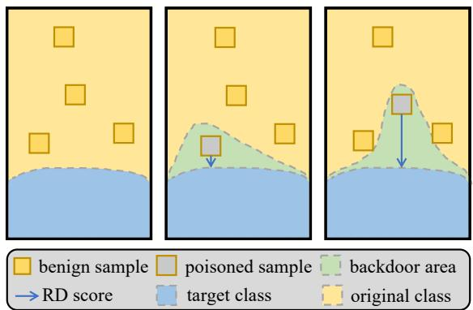  
Figure 1. Intuitive explanation of our insight. The left figure shows a clean model without any backdoor. In the middle figure, a sample closer to the decision boundary will have less impact on the backdoor when it is poisoned. In the right figure, a sample farther away from the decision boundary can cause a more significant change to the model when it is selected for poisoning.

Our approach is inspired by [30], which finds data samples with high contributions to the formation of the decision boundary in the early training stage. We hypothesize that it is also possible to discover crucial poisoned samples without performing the entire training process. Intuitively, the poisoned samples which tend to contribute more to the backdoor have a larger distance to the target class, as they may result in a more intensive reshaping of the decision boundary. This feature makes them have a more significant impact on the model than others. Fig. 1 shows an intuitive explanation of our insight. A poisoned sample farther away from the decision boundary will cause a bigger “backdoor area”, which confirms its significant impact on the backdoor. Our goal is to find such samples as the poisoning targets. Since the model in the early training stage can have relatively high accuracy, we assume it can extract benign features and project them to different classes, which helps us identify critical poisoning candidates.

Fig. 2 shows the workflow of our proposed methodology. It consists of two innovative components. (1) We introduce a new Representational Distance (RD) score, which can quantify the contribution of each sample to the backdoor learning process by only training the model for a very few epochs (§ 3.2). This is much more efficient than the forgetting score in [40]. (2) We design a greedy search algorithm to select the optimal set of samples for poisoning based on their RD scores (§ 3.3). With the selected set ${ \mathcal P } _ { : }$ we can follow the conventional steps to construct the poisoning set $\mathcal { P } ^ { \prime }$ , merge it with the rest of the samples, and train the backdoored model.

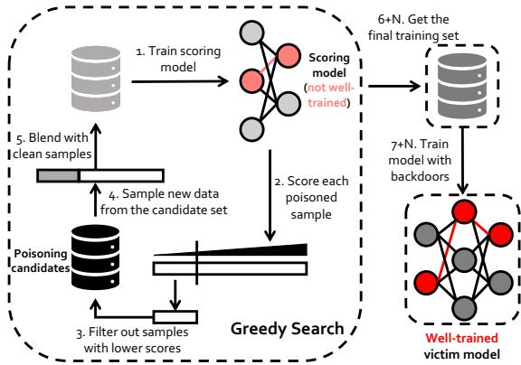  
Figure 2. Workflow of our methodology.

## 3.2. RD Score

During training, the model parameters θ are updated iteratively. Without loss of generality, we consider the basic gradient descent algorithm as follows:

$$
\theta _ { i + 1 } = \theta _ { i } - \eta \sum _ { ( x , y ) \in \mathcal { D } } \nabla _ { \theta } l ( f ( x ; \theta _ { i } ) , y )\tag{4}
$$

So the update of the parameters θ between two iterations is $\sum \nabla _ { \boldsymbol { \theta } } l ( f ( x ; \boldsymbol { \theta } _ { i } ) , \boldsymbol { y } )$ A contributive sample x tends to influence θ more, so the corresponding gradient $| | \nabla _ { \theta } l ( f ( x ; \theta _ { i } ) , y ) | |$ has a relatively higher value. So we can use the following objective to find the most effective samples to form ${ \mathcal { P } } ^ { \prime }$

$$
\mathcal { P } _ { o p t } ^ { \prime } = \arg \operatorname* { m a x } _ { \mathcal { P } ^ { \prime } } \sum _ { x ^ { \prime } \in \mathcal { P } ^ { \prime } } | | \nabla _ { \theta } l ( f _ { \mathrm { B } } ( x ^ { \prime } ; \theta ) , y ^ { \prime } ) | |\tag{5}
$$

The gradient in Eq. 5 can be written as the sum of each coordinate’s gradient in the posterior given by the model $f _ { \mathrm { B } } ,$ according to the chain rule:

$$
\begin{array} { r l r } & { } & { \nabla _ { \theta } l ( f _ { \mathrm { { B } } } ( x ^ { \prime } ; \theta ) , y ^ { \prime } ) = } \\ & { } & { \displaystyle \sum _ { k = 1 } ^ { K } \nabla _ { f _ { \mathrm { { B } } } ^ { k } ( x ^ { \prime } ; \theta ) } l ( f _ { \mathrm { { B } } } ( x ^ { \prime } ; \theta ) , y ^ { \prime } ) ^ { T } \nabla _ { \theta } f _ { \mathrm { { B } } } ^ { k } ( x ^ { \prime } ; \theta ) } \end{array}\tag{6}
$$

where $f _ { \mathrm { B } } ^ { k } ( x ^ { \prime } ; \theta )$ stands for the k-th logit of the output. We use the cross-entropy as the loss function as it is a popular choice for classification tasks. We observe it can be extended to other tasks with different forms of loss functions, as experimentally shown in § 4.2. We also have:

$$
\nabla _ { f _ { \mathrm { B } } ^ { k } ( x ^ { \prime } ; \theta ) } l ( f _ { \mathrm { B } } ( x ^ { \prime } ; \theta ) , y ^ { \prime } ) = f _ { \mathrm { B } } ^ { k } ( x ^ { \prime } ; \theta ) - y ^ { \prime }\tag{7}
$$

where t is the one-hot vector corresponding to the target class. Therefore Eq. 5 can be written as:

$$
\mathcal { P } _ { o p t } ^ { \prime } = \arg \operatorname* { m a x } _ { \mathcal { P } ^ { \prime } } \sum _ { x ^ { \prime } \in \mathcal { P } ^ { \prime } } | | ( f _ { \mathrm { B } } ^ { k } ( x ^ { \prime } ; \theta ) - y ^ { \prime } ) ^ { T } \nabla _ { \theta } f _ { \mathrm { B } } ^ { k } ( x ^ { \prime } ; \theta ) | |\tag{8}
$$

We introduce the Representation Distance (RD) score to approximate Eq. 8 based on the analysis in § 3.1. It evaluates the distance between the model prediction and the target class at the representation level. It is defined as the $l _ { 2 }$ norm between the posteriors of the poisoned sample and the onehot vector of its target classes:

$$
\mathrm { R D } ( x ^ { \prime } ) = | | f _ { \mathrm { B } } ( x ^ { \prime } ; \theta ) - y ^ { \prime } | | _ { 2 }\tag{9}
$$

where $( x ^ { \prime } , y ^ { \prime } )$ is the poisoned data point and $y ^ { \prime }$ is the onehot vector corresponding to the target label. The RD score shares almost the same monotonicity as other loss functions for classification, e.g, cross-entropy, making it applicable to different tasks as the selection criterion.

## 3.3. Searching Strategy

Given a candidate set ${ \mathcal P } ,$ we can compute its average RD score to measure its poisoning effectiveness. Specifically, we first convert $\mathcal { P }$ into the poisoned set ${ \mathcal { P } } ^ { \prime }$ by injecting the trigger to each sample and tampering with its label. Then, we merge $\mathcal { P } ^ { \prime }$ and $\mathcal { D } \backslash \mathcal { P }$ to train a backdoored model $f _ { \mathrm { B } } .$ Note that we only need to train a very few epochs, which are enough to give accurate RD scores. Finally, we compute the RD score of each $x ^ { \prime }$ from $\mathcal { P } ^ { \prime }$ according to Eq. 9, and then the average score of all samples. A set $\mathcal { P }$ with the highest score should be selected for poisoning.

However, it requires us to consider all the possible combinations of samples from D. The search space is $\binom { | | \mathcal { D } | | } { | | \mathcal { P } ^ { \prime } | | }$ , which is too large to perform in practice with large datasets. We exploit a greedy search strategy to solve this problem. Our observation is that the RD scores of poisoned samples are very likely to maintain their order from one combination to another. Inspired by FUS in [40], we exploit a similar strategy to search for the samples. Specifically, we initialize a candidate set ${ \mathcal { P } } ^ { \prime }$ by randomly selecting and poisoning samples from D. Then, we calculate the RD score of each sample $x ^ { \prime }$ from ${ \mathcal { P } } ^ { \prime }$ , based on which the samples are sorted. The samples with lower scores below a specified ratio α are filtered out and replaced by the same amount of new samples randomly chosen from D. This process is repeated until it reaches the maximum number of iterations N. α(·) decays with the iteration growing. Algorithm. 1 shows the greedy search algorithm based on the RD scores.

## 4. Experiments

## 4.1. Configurations

Dataset and triggers. We mainly evaluate our method with two classical tasks, i.e., 2D image classification and 3D point cloud classification. Fig. 3 shows examples of some clean and poisoned samples. We use the following datasets:

• CIFAR-10 [19]: this dataset consists of colorful images with the size of $3 2 \times 3 2$ . It has 60,000 images belonging to 10 categories of different objects. To poison the image data, we inject a $5 \times 5$ square yellow patch located at the right bottom of the clean sample and change the corresponding label to the target label.

Algorithm 1: Greedy Search   
input : clean dataset ${ \overline { { \mathcal { D } } } } ,$ poison ratio r, trigger   
pattern t, filter ratio α(·), iteration round N   
output: efficient poison dataset $\mathcal { P } _ { o p t } ^ { \prime }$   
1 initialize $\mathcal { P } ^ { \prime }$ by randomly poisoning $r \cdot | | \mathcal { D } | |$   
samples from D   
2 for i := 1 to $N$ do   
3 scores ←RDSCOREON(P′)   
4 SORTBYSCORES(scores, $\mathcal { P } ^ { \prime } )$   
5 Filter $\alpha ( i ) \cdot | | \mathcal { P } ^ { \prime } | |$ samples out from ${ \mathcal { P } } ^ { \prime }$   
6 Poison $\alpha ( i ) \cdot | | \mathcal { P } ^ { \prime } | |$ samples to get new ${ \mathcal { P } } ^ { \prime }$   
7 end   
8 return $\mathcal { P } ^ { \prime }$ as $\mathcal { P } _ { o p t } ^ { \prime }$

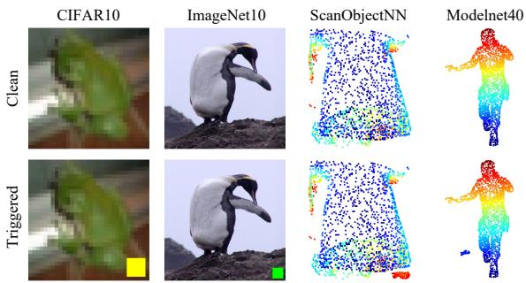  
Figure 3. Example of the clean and poisoned samples.

• ImageNet-10 [8]: this dataset is the subset of ImageNet, which consists of 1,431,167 images in total. It contains 13,000 images of the size 224 × 224 belonging to 10 classes. We use a 32 × 32 blue patch located at the right bottom of each image as the trigger.

• ModelNet40 [39]: this dataset contains 12,311 3D models manually crafted using CAD tools. These 3D models belong to 40 classes, including airplanes, bathtubs, etc. To poison the dataset, we put a small model of an airplane inside each original model for poisoning and making their centers of gravity coincide. Then we obtain 3,000 3D points to form the point cloud for each sample by randomly sampling on the surface of the models.

• ScanObject [37]: this dataset has more than 15,000 objects from 15 categories. Each sample comes from realworld indoor objects and contains 2,048 3D points. To add the trigger, we randomly replace 200 points of the poisoned samples with the 3D points of a bag.

Model architectures. For image classification tasks, we follow [40] to choose two SOTA models, i.e. ResNet18 and VGG16. We train the models at a learning rate of 0.05 for 30 epochs and set the batch size as 128 and 64 for CIFAR-10 and ImageNet-10, respectively.

For the 3D point cloud tasks, we choose three different architectures, PointNet [31], PointNet++ [32], and PointCNN [22]. These models are trained at a learning rate of 0.01 for 50 epochs with a batch size of 128. Specially, we use 2,048 points for each dataset when training PointCNN to reduce the training time.

Baseline attack implementations. We select two baselines for comparison. (1) Random sample selection: we randomly select samples from classes other than the target one. The number of samples being selected follows the poison ratio, i.e., $| | \mathcal { P } | | = r \cdot | | \mathcal { D } | |$ . (2) Forgetting score [40]: we first train the scoring model in the setting of the ordinary training process and record the forgetting event for each poisoning sample. The number of forgetting events happening on the samples is regarded as the forgetting score. This implementation is the same as in [23]. For our method, we train the scoring models for a few epochs. The models are subsequently used to calculate the RD score for each sample by Eq. 9. As the scoring budget shown in Table. 1

<table><tr><td>Task</td><td>Method</td><td>Scoring Budget (Total Epochs)</td></tr><tr><td>CIFAR-10 and ImageNet-10</td><td>RD Score Forgetting Score [40]</td><td>60 (6 epochs per iteration) 300 (30 epochs per iteration)</td></tr><tr><td>ModelNet40</td><td>RD Score Forgetting Score [40]</td><td>100 (10 epochs per iteration) 500 (50 epochs per iteration)</td></tr><tr><td>ScanObject</td><td>RD Score Forgetting Score [40]</td><td>100 (10 epochs per iteration) 750 (75 epochs per iteration)</td></tr></table>

Table 1. searching budget.

All the above methods can be integrated with existing poisoning methods. We follow the attacks in [11, 40] to alter both the data and labels on training data. We choose the class with the label ‘0’ as the target class of the backdoor, i.e., ‘airplane’ in CIFAR-10 and ModelNet40, ‘bag in ScanObject, and ‘Penguin’ in ImageNet-10. All experiments are run on two GeForce RTX 3090 GPUs.

Metric. We mainly use the attack success rate (ASR) to evaluate the efficiency of our method calculated as follows:

$$
A S R = { \frac { \sum _ { ( x ^ { \prime } , y ^ { \prime } ) \in { \mathcal { P } } ^ { \prime } } { \mathbb { I } } ( f _ { \mathrm { { B } } } ( x ^ { \prime } ) = y ^ { \prime } ) } { | | { \mathcal { P } } ^ { \prime } | | } }\tag{10}
$$

where $\mathcal { D } _ { t } ^ { \prime }$ is the validation set of the backdoor. Besides, we examine the performance of infected models over clean samples to measure their functionality-preserving requirement.

## 4.2. Main Results

We discuss the effectiveness of our method and compare it with other baselines.

Attack effectiveness on 2D image tasks. Fig. 4 and 5 show the performance of random selection, forgetting score, and our method on CIFAR-10 and ImageNet-10 datasets, respectively. From the two figures, we have the following observations. (1) Our method has comparable performance to the forgetting score when the poison ratio is relatively high. (2) Our method has higher ASR when the poisoning ratio is very low. We hypothesize that this is due to the coarse-grained nature of the forgetting score, as the numbers of the “forgetting events” can only be integers. This makes the forgetting score method unable to tell the subtle differences among its candidates. (3) Both the score-based selection strategies enjoy smaller variances than random selection, making the backdoor more reliable.

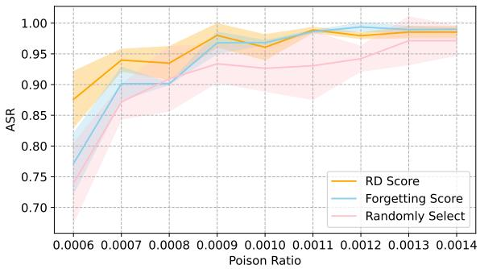  
Figure 4. ASR of the three methods on CIFAR-10. We repeat the experiments three times for both score-based selection strategies and ten times for random selection. We set α to 0.3 and N to 10. The training epoch of the models for RD score is 6 while that for forgetting score is 50.

Attack effectiveness on 3D point cloud tasks. We test the performance of our method on two different architectures and datasets, as shown in Fig. 6. We have the following observations. (1) Our method can achieve a similar ASR as the forgetting score on ModelNet40 but at nearly half of the poisoning ratio. (2) Both the RD and forgetting score methods are not as effective on ScanObject. This is because the ASR of the backdoor injected by data poisoning is highly related to the performances of the model: Fig. 7 discloses the positive correlation between the ASR and prediction accuracy of all tasks. The ASR reflects the ability of a model to correctly extract features from the data. As the model with a relatively low ASR tends to notice fewer features, it prunes to neglect the features of the trigger within the poisoned samples, which, thereby, degrades the quality of the injected backdoor.

Conclusion. To sum up, we can draw two conclusions. First, the RD score can achieve higher ASR than the random selection and forgetting score methods on various tasks and models. Second, it retains its effectiveness for models using other loss functions. For instance, PointNet [31] is trained by optimizing a two-term loss function.

## 4.3. Ablation Study

We investigate how the hyper-parameters in our method can influence the attack performance. Particularly, we look into three hyper-parameters: the filtering ratio α, the number of iterations N, and the number of training epochs for the scoring model. All the experiments are conducted on ResNet18 trained on CIFAR-10 if not exclusively mentioned.

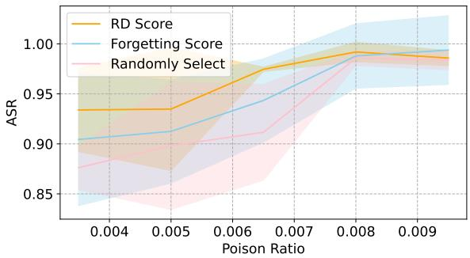  
Figure 5. ASR of the three methods on ImageNet-10. We repeat the experiments three times for both score-based selection strategies and five times for random selection. We set α to 0.3 and N to 10. The training epoch of the models for RD score is 6 while that for forgetting score is 30.

The filtering ratio α. We vary the value of α in the greedy search algorithm to investigate its influence. Although the effect of α on the average ASR is not quite clear, we argue that it should still be set to a moderate value. As shown in Fig. 8, the variances tend to be smaller when α is around 0.2 to 0.4 in most cases. This is because α influences the final P from two aspects. The first aspect is that it represents the ratio of the randomly chosen samples in P, so when α is too big, most of the poisoned samples in P are randomly picked, which has negative impacts on the ASR. The second aspect is that a big α enables the algorithm to go through more samples in D, making it more likely to find effective samples to poison. The trade-off discloses the reason why our method seems to perform better when the filter ratio α is around 0.3-0.4.

Number of iterations N. We examine the influence of the number of iterations by changing N in the greedy search algorithm. According to Fig. 9, we can conclude that (1) the overall ASR is generally lower when N is small; (2) the variations dwindle when using more iterations. Both of the observations are aligned with our intuition, as a small number of iterations can introduce more randomness to the final results, resulting in lower ASR. In contrast, a larger N enables us to check more candidate samples and evaluate them more thoroughly, which helps to stabilize the ASR and reduce the variances.

Number of training epochs for the scoring model. To support our hypothesis in § 3.2, we examine the influence of the number of training epochs for the scoring model, as shown in Fig. 10. In comparison with the forgetting score, we can draw two main conclusions. (1) the RD score performs better in the early stage of the training process while being gradually enervated as the training epoch grows. We think this is because in the late stage of the training process, poisoned samples with a large impact on the model are almost fitted, resulting in smaller RD scores, as the RD score is the estimation of the gradient with the sample in the poisoned set $\mathcal { P }$ according to the analysis in § 3.2. This explains the observed results that the ASRs are even lower than the random selection when the training epoch of the scoring model is higher than 15. (2) The forgetting score is almost ineffective in the early training stage. Given that the forgetting score is calculated by counting the times that an arbitrary sample is originally assigned to the target label in the last epoch and changes its label in this epoch, the maximum forgetting score with m training epochs for the scoring model is $m / 2$ . When m is too small, the forgetting scores fall in a narrow interval, making the rank of the poison candidates more indistinguishable and easier to be disturbed by the randomness during the training process.

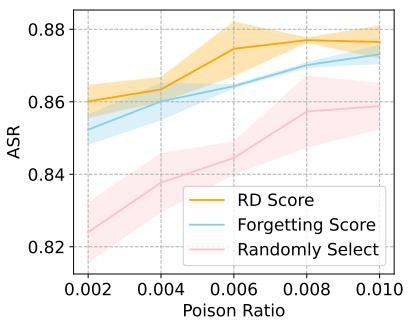  
(a) ModelNet40 & PointNet

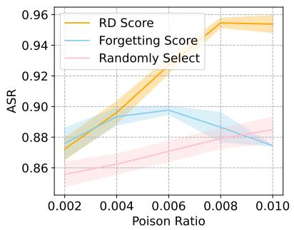  
(b) ModelNet40 & PointNet++

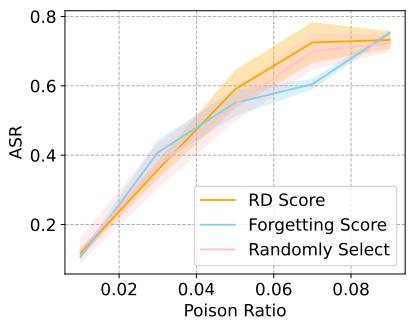  
(c) ScanObject & PointNet++  
Figure 6. ASR of the three methods on 3D point cloud classification tasks. We repeat the experiments three times for the scoring-based methods and 5 times for random selection. We reduce the iteration time N to 7 when conducting the greedy search on both of the scoring methods. For ScanObject, we set the training epoch to 75 and the learning rate to 0.01.

Table 2. ASR (%) under the black-box setting for hyper-parameters in the training process. The experiments are conducted on ResNet18 models with the CIFAR-10 dataset. We train the scoring model for 6 epochs and set the iteration number and the filter ratio to 10 respectively. Other parameters in Adam keep aligned with its PyTorch implementation. For the backdoored model, we fix its training settings to use SGD as the optimizer, 0.05 as the learning rate, and 128 as the batch size.
<table><tr><td>batch size</td><td>optimizer</td><td>LR</td><td>0.007</td><td>0.008</td><td>0.009</td><td>0.010</td><td>0.011</td></tr><tr><td>64</td><td>SGD</td><td>0.01</td><td>93.52 (2.13)</td><td>93.53 (3.18)</td><td>95.41 (2.85)</td><td>96.89 (2.70)</td><td>97.33 (2.22)</td></tr><tr><td>64</td><td>Adam</td><td>0.01</td><td>91.13 (6.12)</td><td>92.70 (5.60)</td><td>95.25 (2.85)</td><td>96.07 (2.70)</td><td>96.43 (2.12)</td></tr><tr><td>64</td><td>Adam</td><td>0.05</td><td>92.12 (8.95)</td><td>94.22 (1.03)</td><td>95.59 (2.39)</td><td>95.59 (2.66)</td><td>97.71 (0.98)</td></tr><tr><td>128</td><td>SGD</td><td>0.01</td><td>93.54 (3.33)</td><td>93.67 (2.97)</td><td>95.17 (1.90)</td><td>96.41 (5.88)</td><td>98.25 (1.09)</td></tr><tr><td>128</td><td>SGD</td><td>0.05</td><td>93.98 (1.78)</td><td>93.49 (2.70)</td><td>98.01 (1.90)</td><td>96.07 (2.04)</td><td>98.89 (0.45)</td></tr><tr><td>128</td><td>Adam</td><td>0.01</td><td>93.52 (2.13)</td><td>93.53 (3.18)</td><td>95.67 (2.99)</td><td>96.36 (3.76)</td><td>97.78 (0.62)</td></tr><tr><td>128</td><td>Adam</td><td>0.05</td><td>95.32 (1.26)</td><td>95.60 (6.42)</td><td>97.51 (0.15)</td><td>94.35 (2.33)</td><td>99.15 (0.38)</td></tr><tr><td colspan="3">Random Choosing</td><td>85.72 (2.76)</td><td>87.16 (5.28)</td><td>90.94 (3.03)</td><td>91.38 (3.74)</td><td>92.65 (5.50)</td></tr></table>

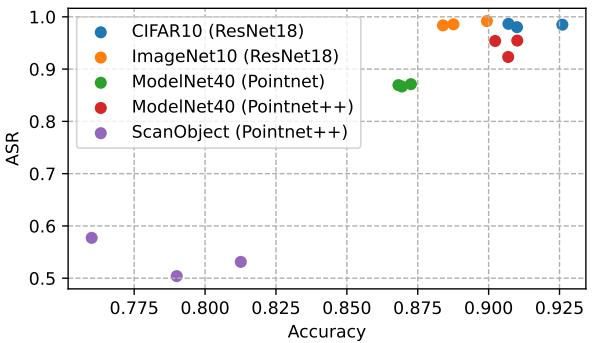  
Figure 7. ASR and prediction accuracy on various models and tasks. All the ASRs are obtained using RD scores at the highest poison ratio we use in the experiments, i.e., 0.0017 for CIFAR-10, 0.0095 for ImageNet-10, 0.01 for ModelNet40, and 0.09 for ScanObject. At the above ratios, the ASR of the backdoors becomes stable.

## 4.4. Black-box Evaluation

We investigate the performance of our method in the black-box setting to show the high transferability of the RD score. Specifically, we examine the ASR under the circumstances that the scoring models have different training configurations from the backdoored models, e.g., model architecture, batch size, optimizer, etc.

According to Table 2, the RD score retains its effectiveness when the model hyper-parameters are different. However, these hyper-parameters can indeed influence the ASRs slightly. When the batch size optimizer and learning rate of the scoring model are all different from that of the model for backdoor injection, the ASR is the lowest. This is aligned with our intuition: since the RD score is based on the gradients in the training process, the way that the model parameters are updated can enlarge the divergences between the scoring model and the backdoored model, leading to an inaccurate evaluation of the score.

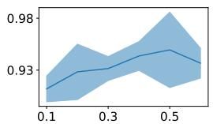  
alpha, poison ratio=0.0007

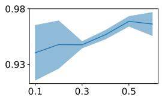  
alpha, poison ratio=0.0008

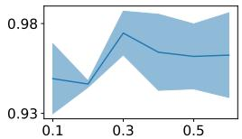  
alpha, poison ratio=0.0009

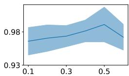  
alpha, poison ratio=0.001

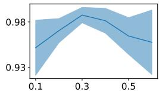  
alpha, poison ratio=0.0011

Figure 8. ASR of the RD score in different poison ratios when α in greedy search changes. We repeat each experiment three times. In all the experiments, we set N to 10 and the training epoch of the scoring model to 6  
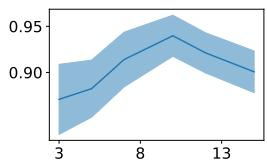  
N, poison ratio=0.0007

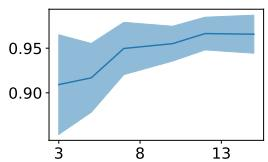  
N, poison ratio=0.0008

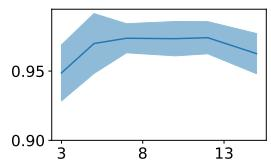  
N, poison ratio=0.0009

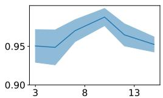  
N, poison ratio=0.001

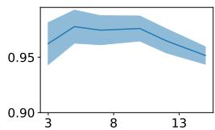  
N, poison ratio=0.0011

Figure 9. ASR of the RD score in different poison ratios when the iteration time N in greedy search changes. We repeat each experiment three times. In all the experiments, we set the training epoch of the scoring model to 6  
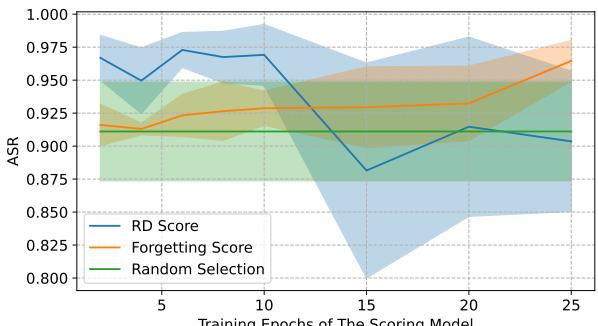  
Training Epochs of The Scoring Model  
Figure 10. The influence of the training epoch of the scoring models on both methods. All the experiments are conducted using a 0.001 poison ratio on CIFAR-10, ResNet18.

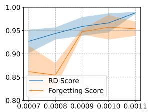

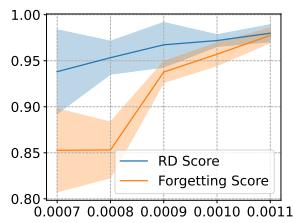  
(a) MobileNet  
(b) VGG16  
Figure 11. ASRs of the forgetting score and our RD score. We use ResNet18 as the victim model and change the architecture of the scoring model to MobileNet and VGG16.

Additionally, we use different model architectures to test the transferability of our approach among different models. From 11, our observation is that in comparison with the forgetting score, our method is more transferable when using a different architecture of the scoring model from the target model, especially with a relatively low poisoning ratio.

We can thereby draw our conclusions: (1) our method does not rely on the knowledge of the training details while retaining its effectiveness in selecting the important poisoning samples from the training set. (2) Our approach has more transferability than the forgetting score.

## 5. Conclusion and Future Work

In this paper, we propose a novel score to measure the contribution of poisoned samples to the backdoor learning process by evaluating the L2 norm of the given poisoned samples to the target class. By filtering out the samples with lower scores, our method achieves much better backdoor ASR than the random selection strategy. We conduct extensive experiments on a variety of datasets and model architectures to show the generality and transferability of our method in comparison with prior works.

For future works, we claim that although the RD score is of high ability to be adjusted to different tasks, its effectiveness in some scenarios has not been thoroughly investigated. In the future, we hope to pivot our research interests in two directions. First, for high-level tasks like object detection [33], the scoring mechanisms are supposed to handle the following unique challenges: (1) multi-tasks, e.g., object localization and classification, how to reduce the poison budget by taking these aspects simultaneously is a critical issue; (2) multi-instance, e.g., one sample may include several objects, how to measure the importance of a given poisoned sample makes the problem more complicated when designing the scoring methods. Secondly, there are few works focusing on the poisoning efficiency of non-classification tasks like natural language generation [9]. The searching method necessitates satisfying diverse loss functions. Therefore, it may be challenging to adjust similar approaches to select the important poison samples.

## Acknowledgement

This work was supported in part by Singapore Ministry of Education (MOE) AcRF Tier 2 MOE-T2EP20121- 0006, the Natural Science Foundation of China under Grant

No. 62106127 and Nanyang Technological University (NTU)-DESAY SV Research Program under Grant 2018- 0980.

## References

[1] Naveed Akhtar and Ajmal Mian. Threat of adversarial attacks on deep learning in computer vision: A survey. Ieee Access, 6:14410–14430, 2018. 1

[2] Eugene Bagdasaryan, Andreas Veit, Yiqing Hua, Deborah Estrin, and Vitaly Shmatikov. How to backdoor federated learning. In International Conference on Artificial Intelligence and Statistics, pages 2938–2948. PMLR, 2020. 3

[3] Huili Chen, Cheng Fu, Jishen Zhao, and Farinaz Koushanfar. Proflip: Targeted trojan attack with progressive bit flips. In Proceedings of the IEEE/CVF International Conference on Computer Vision, pages 7718–7727, 2021. 2

[4] Kangjie Chen, Xiaoxuan Lou, Guowen Xu, Jiwei Li, and Tianwei Zhang. Clean-image backdoor: Attacking multilabel models with poisoned labels only. In International Conference on Learning Representations. 2

[5] Kangjie Chen, Xiaoxuan Lou, Guowen Xu, Jiwei Li, and Tianwei Zhang. Clean-image backdoor: Attacking multilabel models with poisoned labels only. In The Eleventh International Conference on Learning Representations, 2023. 1

[6] Kangjie Chen, Yuxian Meng, Xiaofei Sun, Shangwei Guo, Tianwei Zhang, Jiwei Li, and Chun Fan. Badpre: Taskagnostic backdoor attacks to pre-trained nlp foundation models. arXiv preprint arXiv:2110.02467, 2021. 3

[7] Edward Chou, Florian Tramer, and Giancarlo Pellegrino. Sentinet: Detecting localized universal attacks against deep learning systems. In 2020 IEEE Security and Privacy Workshops (SPW), pages 48–54. IEEE, 2020. 1

[8] Jia Deng, Wei Dong, Richard Socher, Li-Jia Li, Kai Li, and Li Fei-Fei. Imagenet: A large-scale hierarchical image database. In 2009 IEEE Conference on Computer Vision and Pattern Recognition, pages 248–255, 2009. 5

[9] Jacob Devlin, Ming-Wei Chang, Kenton Lee, and Kristina Toutanova. Bert: Pre-training of deep bidirectional transformers for language understanding. arXiv preprint arXiv:1810.04805, 2018. 8

[10] Leilei Gan, Jiwei Li, Tianwei Zhang, Xiaoya Li, Yuxian Meng, Fei Wu, Yi Yang, Shangwei Guo, and Chun Fan. Triggerless backdoor attack for nlp tasks with clean labels. arXiv preprint arXiv:2111.07970, 2021. 1

[11] Tianyu Gu, Brendan Dolan-Gavitt, and Siddharth Garg. Badnets: Identifying vulnerabilities in the machine learning model supply chain. arXiv preprint arXiv:1708.06733, 2017. 5

[12] Tianyu Gu, Kang Liu, Brendan Dolan-Gavitt, and Siddharth Garg. Badnets: Evaluating backdooring attacks on deep neural networks. IEEE Access, 7:47230–47244, 2019. 1, 2, 3

[13] Xingshuo Han, Guowen Xu, Yuan Zhou, Xuehuan Yang, Jiwei Li, and Tianwei Zhang. Physical backdoor attacks to lane detection systems in autonomous driving. In Proceedings of the 30th ACM International Conference on Multimedia, pages 2957–2968, 2022. 1, 3

[14] Jonathan Hayase and Sewoong Oh. Few-shot backdoor attacks via neural tangent kernels. arXiv preprint arXiv:2210.05929, 2022. 2

[15] Shanjiaoyang Huang, Weiqi Peng, Zhiwei Jia, and Zhuowen Tu. One-pixel signature: Characterizing cnn models for backdoor detection. In Computer Vision–ECCV 2020: 16th European Conference, Glasgow, UK, August 23–28, 2020, Proceedings, Part XXVII 16, pages 326–341. Springer, 2020. 1

[16] Jinyuan Jia, Yupei Liu, and Neil Zhenqiang Gong. Badencoder: Backdoor attacks to pre-trained encoders in selfsupervised learning. In 2022 IEEE Symposium on Security and Privacy (SP), pages 2043–2059. IEEE, 2022. 1, 3

[17] Wenbo Jiang, Hongwei Li, Guowen Xu, and Tianwei Zhang. Color backdoor: A robust poisoning attack in color space. In Proceedings of the IEEE/CVF Conference on Computer Vision and Pattern Recognition (CVPR), pages 8133–8142, June 2023. 1

[18] Kaidi Jin, Tianwei Zhang, Chao Shen, Yufei Chen, Ming Fan, Chenhao Lin, and Ting Liu. Can we mitigate backdoor attack using adversarial detection methods? IEEE Transactions on Dependable and Secure Computing, 2022. 1

[19] Alex Krizhevsky, Geoffrey Hinton, et al. Learning multiple layers of features from tiny images. 2009. 4

[20] Shaofeng Li, Minhui Xue, Benjamin Zhao, Haojin Zhu, and Xinpeng Zhang. Invisible backdoor attacks on deep neural networks via steganography and regularization. IEEE Transactions on Dependable and Secure Computing, 2020. 2

[21] Xinke Li, Zhirui Chen, Yue Zhao, Zekun Tong, Yabang Zhao, Andrew Lim, and Joey Tianyi Zhou. Pointba: Towards backdoor attacks in 3d point cloud. In Proceedings ofthe IEEE/CVF International Conference on Computer Vision, pages 16492–16501, 2021. 1, 2

[22] Yangyan Li, Rui Bu, Mingchao Sun, Wei Wu, Xinhan Di, and Baoquan Chen. Pointcnn: Convolution on x-transformed points. Advances in neural information processing systems, 31, 2018. 5

[23] Yiming Li, Yong Jiang, Zhifeng Li, and Shu-Tao Xia. Backdoor learning: A survey. IEEE Transactions on Neural Networks and Learning Systems, 2022. 1, 5

[24] Yanzhou Li, Shangqing Liu, Kangjie Chen, Xiaofei Xie, Tianwei Zhang, and Yang Liu. Multi-target backdoor attacks for code pre-trained models. arXiv preprint arXiv:2306.08350, 2023. 1

[25] Yiming Li, Haoxiang Zhong, Xingjun Ma, Yong Jiang, and Shu-Tao Xia. Few-shot backdoor attacks on visual object tracking. In International Conference on Learning Representations, 2022. 1

[26] Junyu Lin, Lei Xu, Yingqi Liu, and Xiangyu Zhang. Composite backdoor attack for deep neural network by mixing existing benign features. In Proceedings of the 2020 ACM SIGSAC Conference on Computer and Communications Security, 2020. 2

[27] Junyu Lin, Lei Xu, Yingqi Liu, and Xiangyu Zhang. Composite backdoor attack for deep neural network by mixing existing benign features. In Proceedings of the 2020 ACM SIGSAC Conference on Computer and Communications Security, pages 113–131, 2020. 3

[28] Yunfei Liu, Xingjun Ma, James Bailey, and Feng Lu. Reflection backdoor: A natural backdoor attack on deep neural networks. In European Conference on Computer Vision, pages 182–199. Springer, 2020. 1

[29] Andrea Paudice, Luis Munoz-Gonz˜ alez, Andras Gyorgy, and´ Emil C Lupu. Detection of adversarial training examples in poisoning attacks through anomaly detection. arXiv preprint arXiv:1802.03041, 2018. 1

[30] Mansheej Paul, Surya Ganguli, and Gintare Karolina Dziugaite. Deep learning on a data diet: Finding important examples early in training. Advances in Neural Information Processing Systems, 34:20596–20607, 2021. 2, 3

[31] Charles R Qi, Hao Su, Kaichun Mo, and Leonidas J Guibas. Pointnet: Deep learning on point sets for 3d classification and segmentation. In Proceedings of the IEEE conference on computer vision and pattern recognition, pages 652–660, 2017. 5, 6

[32] Charles Ruizhongtai Qi, Li Yi, Hao Su, and Leonidas J Guibas. Pointnet++: Deep hierarchical feature learning on point sets in a metric space. Advances in neural information processing systems, 30, 2017. 5

[33] Joseph Redmon, Santosh Divvala, Ross Girshick, and Ali Farhadi. You only look once: Unified, real-time object detection. In Proceedings of the IEEE conference on computer vision and pattern recognition, pages 779–788, 2016. 8

[34] Xiaofei Sun, Xiaoya Li, Yuxian Meng, Xiang Ao, Lingjuan Lyu, Jiwei Li, and Tianwei Zhang. Defending against backdoor attacks in natural language generation. In Proceedings ofthe AAAI Conference on Artificial Intelligence, volume 37, pages 5257–5265, 2023. 1

[35] Di Tang, XiaoFeng Wang, Haixu Tang, and Kehuan Zhang. Demon in the variant: Statistical analysis of dnns for robust backdoor contamination detection. In USENIX Security Symposium, pages 1541–1558, 2021. 1

[36] Ruixiang Tang, Mengnan Du, Ninghao Liu, Fan Yang, and Xia Hu. An embarrassingly simple approach for trojan attack in deep neural networks. In Proceedings of the 26th ACM SIGKDD International Conference on Knowledge Discovery & Data Mining, pages 218–228, 2020. 2

[37] Mikaela Angelina Uy, Quang-Hieu Pham, Binh-Son Hua, Thanh Nguyen, and Sai-Kit Yeung. Revisiting point cloud classification: A new benchmark dataset and classification model on real-world data. In Proceedings of the IEEE/CVF international conference on computer vision, pages 1588– 1597, 2019. 5

[38] Ren Wang, Gaoyuan Zhang, Sijia Liu, Pin-Yu Chen, Jinjun Xiong, and Meng Wang. Practical detection of trojan neural networks: Data-limited and data-free cases. In Computer Vision–ECCV 2020: 16th European Conference, Glasgow, UK, August 23–28, 2020, Proceedings, Part XXIII 16, pages 222–238. Springer, 2020. 1

[39] Zhirong Wu, Shuran Song, Aditya Khosla, Fisher Yu, Linguang Zhang, Xiaoou Tang, and Jianxiong Xiao. 3d shapenets: A deep representation for volumetric shapes. In Proceedings ofthe IEEE conference on computer vision and pattern recognition, pages 1912–1920, 2015. 5

[40] Pengfei Xia, Ziqiang Li, Wei Zhang, and Bin Li. Dataefficient backdoor attacks. In Proceedings of the 31st In-

ternational Joint Conference on Artificial Intelligence, 2022. 1, 2, 3, 4, 5

[41] Zhen Xiang, David J Miller, Siheng Chen, Xi Li, and George Kesidis. A backdoor attack against 3d point cloud classifiers. In Proceedings of the IEEE/CVF International Conference on Computer Vision, pages 7597–7607, 2021. 1, 2

[42] Yu Yang, Tian Yu Liu, and Baharan Mirzasoleiman. Not all poisons are created equal: Robust training against data poisoning. In International Conference on Machine Learning, pages 25154–25165. PMLR, 2022. 2

[43] Yuanshun Yao, Huiying Li, Haitao Zheng, and Ben Y Zhao. Latent backdoor attacks on deep neural networks. In Proceedings of the 2019 ACM SIGSAC Conference on Computer and Communications Security, pages 2041–2055, 2019. 1

[44] Yi Zeng, Minzhou Pan, Hoang Anh Just, Lingjuan Lyu, Meikang Qiu, and Ruoxi Jia. Narcissus: A practical clean-label backdoor attack with limited information. arXiv preprint arXiv:2204.05255, 2022. 2

[45] Shihao Zhao, Xingjun Ma, Xiang Zheng, James Bailey, Jingjing Chen, and Yu-Gang Jiang. Clean-label backdoor attacks on video recognition models. In Proceedings of the IEEE/CVF Conference on Computer Vision and Pattern Recognition, pages 14443–14452, 2020. 2