# Computationally-Efficient Neural Image Compression with Shallow Decoders

Yibo Yang Stephan Mandt Department of Computer Science University of California, Irvine

{yibo.yang, mandt}@uci.edu

## Abstract

Neural image compression methods have seen increasingly strong performance in recent years. However, they suffer orders ofmagnitude higher computational complexity compared to traditional codecs, which hinders their real-world deployment. This paper takes a step forward in closing this gap in decoding complexity by adopting shallow or even linear decoding transforms. To compensate for the resulting drop in compression performance, we exploit the often asymmetrical computation budget between encoding and decoding, by adopting more powerful encoder networks and iterative encoding. We theoretically formalize the intuition behind, and our experimental results establish a newfrontier in the trade-offbetween rate-distortion and decoding complexity for neural image compression. Specifically, we achieve rate-distortion performance competitive with the established mean-scale hyperprior architecture of Minnen et al. (2018) at less than 50K decoding FLOPs/pixel, reducing the baseline’s overall decoding complexity by 80%, or over 90% for the synthesis transform alone. Our code can be found at https: //github.com/mandt-lab/shallow-ntc.

## 1. Introduction

Deep-learning-based methods for data compression [51] have achieved increasingly strong performance on visual data compression, increasingly exceeding classical codecs in rate-distortion performance. However, their enormous computational complexity compared to classical codecs, especially required for decoding, is a roadblock towards their wider adoption [34, 37]. In this work, inspired by the parallel between nonlinear transform coding and traditional transform coding [17], we replace deep convolutional decoders with extremely lightweight and shallow (and even linear) decoding transforms, and establish the R-D (rate-distortion) performance of neural image compression when operating at the lower limit of decoding complexity.

More concretely, our contributions are as follows:

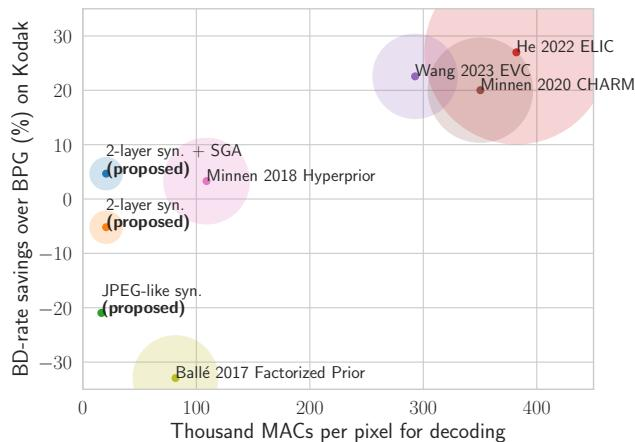  
Figure 1. R-D performance on Kodak v.s. decoding computation complexity as measured in KMACs (thousand multiply-accumulate operations) per pixel. The circle radius corresponds to the parameter count of the synthesis transform in each method (see Table. 1)

• We offer new insight into the image manifold parameterized by learned synthesis transforms in nonlinear transform coding. Our results suggest that the learned manifold is relatively flat and preserves linear combinations in the latent space, in contrast to its highly nonlinear counterpart in generative modeling [11].

• Inspired by the parallel between neural image compression and traditional transform coding, we study the effect of linear synthesis transform within a hyperprior architecture. We show that, perhaps surprisingly, a JPEG-like synthesis can perform similarly to a deep linear CNN, and we shed light on the role of nonlinearity in the perceptual quality of neural image compression.

• We give a theoretical analysis of the R-D cost of neural lossy compression in an asymptotic setting, which quantifies the performance implications of varying the complexity of encoding and decoding procedures.

• We equip our JPEG-like synthesis with powerful encoding methods, and augment it with a single hidden layer. This simple approach yields a new state-of-theart result in the trade-off between R-D performance and decoding complexity for nonlinear transform coding, in the regime of sub-50K FLOPs per pixel believed to be dominated by classical codecs.

## 2. Background and notation

## 2.1. Neural image compression

Most existing neural lossy compression approaches are based on the paradigm of nonlinear transform coding (NTC) [6]. The idea is similar to traditional transform coding [23], and the goal is to learn a pair of analysis (encoding) transform $f$ and synthesis (decoding) transform g, such that an encoded representation of the data achieves good R-D (rate-distortion) performance. Let the input image be $\mathbf { x } \in \mathbb { R } ^ { H \times W \times 3 }$ . The analysis transform computes a continuous latent representation $\mathbf { z } : = f ( \mathbf { x } )$ , which is then quantized to $\hat { \mathbf { z } } = \left\lfloor \mathbf { z } \right\rceil$ and transmitted to the receiver under an entropy model $P ( \hat { \mathbf { z } } )$ ; the final reconstruction is then computed by the synthesis transform as $\hat { \mathbf { x } } : = g ( \hat { \mathbf { z } } )$ . The hard quantization is typically replaced by uniform noise to enable end-to-end training [3]. We refer to [51] for the technical details.

Instead of orthogonal linear transforms in traditional transform coding, the analysis and synthesis transforms in NTC are typically CNNs (convolutional neural networks) [43, 3] or variants with residual connections or attention mechanisms [13, 25]. The (convolutional) latent coefficients $\mathbf { z } \in \mathbb { R } ^ { h , w , C }$ form a 3D tensor with C channels and a spatial extent $( h , w )$ smaller than the input image. We denote the “downsampling” factor by $s ,$ such that $h = H / s$ and $w = W / s ;$ this is also the “upsampling” factor of the synthesis transform.

To improve the bitrate of NTC, a hyperprior [5] is commonly used to parameterize the entropy model $P ( \hat { \mathbf { z } } )$ via another set of latent coefficients h and an associated pair of transforms $\left( f _ { h } , g _ { h } \right)$ The hyper analysis $f _ { h }$ computes $\mathbf { h } = f _ { h } ( \hat { \mathbf { z } } )$ at encoding time, and the hyper synthesis $g _ { h }$ predicts the (conditional) entropy model $P ( \hat { \mathbf { z } } | \hat { \mathbf { h } } )$ based on the quantized $\hat { \mathbf { h } } \ = \ \lfloor \mathbf { h } \rceil$ . We adopt the Mean-scale Hyperprior from Minnen et al. [35] as our base architecture, which is widely used as a basis for other NTC methods [28, 13, 36, 25]. In this architecture, the various transforms are parameteried by CNNs, with GDN activation [3] for the analysis and synthesis transforms and ReLU activation for the hyper transforms. Furthermore, the synthesis (g) takes over 80% of the overall decoding complexity (see Table 1), and is the focus of this work.

## 2.2. Iterative inference

Given an image x to be encoded, instead of computing its discrete representation by rounding the analysis output, i.e., $\hat { \mathbf { z } } = \lfloor f ( \mathbf { x } ) \rceil$ , Yang et al. [49] cast the encoding problem as that of variational inference, and propose to infer the discrete representation that optimizes the per-data R-D cost. Their proposed method, SGA (Stochastic Gumbel Annealing), essentially solves a discrete optimization problem by constructing a categorical variational distribution $q ( \mathbf { z } | \mathbf { x } )$ and optimizing w.r.t. its parameters by gradient descent, while annealing it to become deterministic so as to close the quantization gap [49]. In this work, we will adopt their proposed standalone procedure and opt to run SGA at test time, essentially treating it as a black-box powerful encoding procedure for a given NTC architecture.

## 3. Methodology

We begin with new empirical insight into the qualitative similarity between the synthesis transforms in NTC and traditional transform coding [17] (Sec. 3.1). This motivates us to adopt simpler synthesis transforms, such as JPEG-like block-wise linear transforms, which are computationally much more efficient than deep neural networks (Sec. 3.2). We then analyze the resulting effect on R-D performance and mitigate the performance drop using powerful encoding methods from the neural compression toolbox (Sec. 3.3).

## 3.1. The case for a shallow decoder

Although the transforms in NTC are generally black-box deep CNNs, Duan et al. [17] showed that they in fact bear strong qualitative resemblance to the orthogonal transforms in traditional transform coding. They showed that the learned synthesis transform in various NTC architectures satisfy a certain separability property, i.e., a latent tensor can be decomposed spatially or across channels, then decoded separately, and finally combined in the pixel space to produce a reasonable reconstruction. Moreover, decoding “standard basis” tensors in the latent space produces image patterns resembling the basis functions of orthogonal transforms.1

Here, we obtain new insights into the behavior of the learned synthesis transform in NTC. We show that the manifold of image reconstructions is approximately flat, in the sense that straight paths in the latent space are mapped to approximately straight paths $( \mathrm { i . e . }$ , naive linear interpolations) in the pixel space. Additionally, the learned synthesis transform exhibits an approximate “mixup” [52] behavior despite the lack of such explicit regularization during training.

Suppose we are given an arbitrary pair of images $( \bar { \mathbf { x } } ^ { ( 0 ) } , \mathbf { x } ^ { ( 1 ) } )$ , and we obtain their latent coefficients $( \bar { \mathbf z } ^ { ( 0 ) } , \bar { \mathbf z } ^ { ( 1 ) } )$ using the analysis transform (we ignore the effect of quantization as in Duan et al. [17]). Let $\gamma : [ 0 , 1 ] \to \mathcal { Z }$ be the straight path in the latent space defined by the two latent tensors, i.e., $\gamma ( t ) : = ( 1 - t ) \mathbf { \bar { z } } ^ { ( 0 ) } + t \mathbf { z } ^ { ( 1 ) }$ . Using the synthesis transform g, we can then map the curve in the latent space to one in the space of reconstructed images, defined by $\hat { \gamma } ( t ) : = g ( \gamma ( t ) )$ . We denote the two end-points of the curve by $\hat { \mathbf { x } } ^ { ( 0 ) } : = g ( \mathbf { z } ^ { ( 0 ) } ) = \hat { \gamma } ( 0 )$ and $\hat { \mathbf { x } } ^ { ( 1 ) } : \overset { \cdot } { = } g ( \mathbf { z } ^ { ( 1 ) } ) = \hat { \gamma } ( 1 )$ Instead of traversing the image manifold parameterized by $^ { g , }$ we could also travel between the two end-points in a straight path, which we define by $\hat { \mathbf { x } } ^ { ( t ) } : = ( 1 - t ) \bar { \hat { \mathbf { x } } } ^ { ( 0 ) } + t \hat { \mathbf { x } } ^ { ( 1 ) }$ and is given by a simple linear interpolation in the pixel space. The idea is illustrated in Figure 2.

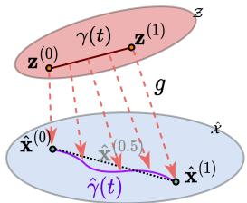  
Figure 2. Conceptual illustration of the image manifold parameterized by $\hat { \gamma } ( t )$ (purple curve), obtained by decoding a straight path $\gamma ( t )$ in the latent space. We show it does not significantly deviate from a straight path (dashed line) connecting its two end points.

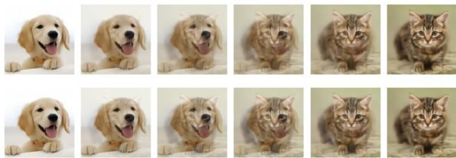  
Figure 3. Visualizing the 1-D manifold of image reconstructions $\{ \hat { \gamma } ( t ) | t \in [ 0 , 1 ] \}$ (top row) and the linear interpolation between its two end points, $\{ ( 1 \bar { \mathbf { x } } ^ { } - t ) \hat { \mathbf { x } } ^ { ( 0 ) } + t \hat { \mathbf { x } } ^ { ( 1 ) } | t \in [ 0 , \hat { 1 ] } \}$ (bottom row).

Fig. 3 visualizes an example of the resulting curve of images ${ \hat { \gamma } } ( t )$ (top row), compared to the interpolating straight path $\hat { \mathbf { x } } ^ { ( t ) }$ (bottom row), as t goes from 0 to 1. The results appear very similar, suggesting the latent coefficients largely carry local and mostly low-level information about the image signal. As a rough measure of the “distance” between the two trajectories, Fig. 4a computes the MSE between ${ \hat { \gamma } } ( t )$ and $\hat { \mathbf { x } } ^ { ( t ) }$ at corresponding time steps, for pairs of random image crops from COCO [30]. The results (solid lines) indicate that the two curves do not align perfectly. However, since the parameterization of any curve is not unique, we get a better sense of the behavior of the manifold curve ${ \hat { \gamma } } ( t )$ by considering its length $L ( \hat { \gamma } )$ in relation to the length of the interpolating straight path $\lVert \hat { \mathbf { x } } ^ { ( 0 ) } - \hat { \mathbf { x } } ^ { ( 1 ) } \rVert$ . We compute the two lengths (the curve length can be computed using the Jacobian of $^ { g ; }$ see Appendix Sec. 7.4.1), and plot them for random image pairs in Fig. 4b. The resulting curve lengths fall very closely to the straight path lengths regardless of the absolute length of the curves, indicating that the curves globally follow nearly straight paths. Note that if $g$ was linear (affine), then ${ \hat { \gamma } } ( t )$ and $\hat { \mathbf { x } } ^ { ( t ) }$ would perfectly overlap .

Additionally, inspired by mixup regularization [52], we examine how well the synthesized curve ${ \hat { \gamma } } ( t )$ can reconstruct the linear interpolation of the two ground truth images, defined by $\mathbf { x } ^ { ( t ) } : = ( 1 - t ) \mathbf { x } ^ { ( 0 ) } + t \mathbf { x } ^ { ( 1 ) }$ . Fig. 4a plots the reconstruction error for the same random image pairs in dashed lines, and shows that the synthesized curve ${ \hat { \gamma } } ( t )$ generally offers consistent reconstruction quality along the entire trajectory. Note that if $g$ was linear (affine), then this reconstruction error would vary linearly across t.

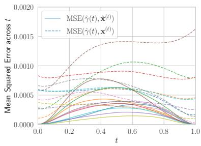  
(a)

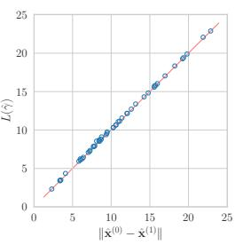  
(b)  
Figure 4. The effect of traversing the synthesis manifold, with end points defined by random image pairs. (a): Mean-squared error distance between the decoded curve γˆ(t) and straight paths in the image space (reconstructions $\hat { \mathbf { x } } ^ { ( t ) }$ and originals $\mathbf { \bar { x } } ^ { ( t ) } )$ . (b): The length of the curve $\hat { \gamma }$ v.s. that of the interpolating straight path $\hat { \mathbf { x } } ^ { ( t ) }$ The image pixel values are scaled to $[ - 0 . 5 , 0 . 5 ]$

The above observations form a stark contrast to the typical behavior of the decoder network in generative modeling, where different images tend to be separated by regions of low density under the model, and the decoder function varies rapidly when crossing such boundaries [12], e.g., across a linear interpolation of images in pixel space.

We obtained these results with a Mean-scale Hyperprior model [35] trained with $\lambda = 0 . 0 1$ , and we observe similar behavior at other bit-rates (with the curves $\hat { \gamma }$ becoming even “straighter” at higher bit-rates) and in various NTC architectures [4, 35, 36] (see Appendix Sec. 7.4 for more examples). Our empirical observations corroborate the earlier findings [17], and raise the question: Given the many similarities, can we replace the deep convolutional synthesis in NTC with a linear (affine) function? Our motivation is mainly computational: a linear synthesis can offer drastic computation savings over deep neural networks. This is not always the case for an arbitrary linear (affine) function from the latent to image space, so we restrict ourselves to efficient convolutional architectures. As we show empirically in Sec. 4.3, a single JPEG-like transform with a large enough kernel size can emulate a more general cascade of transposed convolutions, while being much more computationally efficient. Compared to fixed and orthogonal transforms in traditional transform coding, learning a linear synthesis from data allows us to still benefit from end-to-end optimization. Further, in Sec. 4.2, we show that strategically incorporating a small amount of nonlinearity can significantly improve the R-D performance without much increase in computation complexity.

## 3.2. Shallow decoder design

JPEG-like synthesis At its core, JPEG works by dividing an input image into $8 \times 8$ blocks and applying block-wise transform coding. This can be implemented efficiently in hardware and is a key factor in $\mathbf { J P E G } ^ { \prime } \mathbf { s }$ enduring popularity. By analogy to JPEG, we interpret the $h \times w \times C$ latent tensor in NTC as coefficients corresponding to a linear synthesis transform. In the most basic form (and similarly to JPEG), the output reconstructions are computed in $s \times s$ blocks; the $( i , j )$ )th block reconstruction is computed by taking a linear combination of “basis images” $\mathbf { \bar { K } } _ { c } \in \mathbb { R } ^ { s \times s \times C _ { o u t } } , \bar { c } =$ $1 , . . . , C$ , weighted by the (quantized) coefficients in $\mathbf { z } _ { i , j } \in$ $\mathbb { R } ^ { C }$

$$
\hat { B } _ { i , j } = \sum _ { c = 1 } ^ { C } \mathbf { z } _ { i , j , c } \mathbf { K } _ { c } .\tag{1}
$$

Note that we recover the per-channel discrete cosine transform of JPEG by setting $s = 8 , C = 6 4 , C _ { o u t } = 1$ , and $\{ \mathbf { K } _ { c } , c = 1 , . . . , 6 4 \}$ to be the bases of the $8 \times 8$ discrete cosine transform. Eq 1 can be implemented efficiently via a transposed convolution on z, using K as the kernel weights and s as the stride. In terms of MACs, the computation complexity of the JPEG-like synthesis then equals

$$
M ( \mathbf { J } \mathbf { P E G - l i k e } ) = C \times h \times w \times s ^ { 2 } \times C _ { o u t } ,\tag{2}
$$

where $C _ { o u t } = 3$ for a color image.2 Note that for a given latent tensor and “upsampling” rate s, Eq. 2 gives the minimum achievable MACs by any non-degenerate synthesis transform based on (transposed) convolutions. As we see in Sec. 4.2, although the minimal JPEG-like synthesis drastically reduces the decoding complexity, it can introduce severe blocking artifacts since the blocks are reconstructed independently. We therefore allow overlapping basis functions with spatial extent $k \times k$ , where $k \geq s$ and $k - s$ is the number of overlapping pixels; we compute each $k \times k$ blocks as in Eq. 1, then form the reconstructed image by taking the sum of the (overlapping) blocks. This corresponds to simply increasing the kernel size from $\displaystyle ( s , s ) \operatorname { t o } \left( k , k \right)$ in the corresponding transposed convolution, and increases the $s ^ { 2 }$ factor in Eq. 2 to $k ^ { 2 }$

Two-layer nonlinear synthesis Despite its computational advantage, the JPEG-like synthesis can be overly restrictive. Indeed, nonlinear transform coding benefits from the ability of the synthesis transform to adapt to the shape of the data manifold [6]. We therefore introduce a small degree of nonlinearity in the JPEG-like transform. Many possibilities exist, and we found that introducing a single hidden layer with nonlinearity to work well. Concretely, we use two layers of transposed convolutions $( \mathrm { c o n v \_ 1 , c o n v \_ 2 } )$ with strides $( s _ { 1 } , s _ { 2 } )$ , kernel sizes $( k _ { 1 } , k _ { 2 } )$ , and output channels $( N , C _ { o u t } )$ respectively. At lower bit-rates, we found it more parameter- and compute-efficient to also allow a residual connection from z to the hidden activation using another transposed convolution conv\_res (see a diagram and more details in Appendix Sec. 7.1). Thus, given a latent tensor $\textbf { z } \in \mathbb { R } ^ { h , \overline { { w } } , C }$ the output is $g ( \mathbf { z } ) \ =$ $\mathtt { c o n v \_ 2 } ( \xi ( \mathtt { c o n v \_ 1 } ( \mathbf { z } ) ) + \mathtt { c o n v \_ r e s } ( \mathbf { z } ) )$ , where $\xi$ is a nonlinear activation.

The MAC count in this architecture is then approximately

$$
\begin{array} { r l } & { M \mathrm { ( 2 \mathrm { - } l a y e r ) } = C \times h \times w \times k _ { 1 } ^ { 2 } \times 2 N } \\ & { ~ + N \times h s _ { 1 } \times w s _ { 1 } \times k _ { 2 } ^ { 2 } \times C _ { o u t } . } \end{array}\tag{3}
$$

To keep this decoding complexity low, we use large convolution kernels $( k _ { 1 } = 1 3 )$ with aggressive upsampling $( s _ { 1 } = 8 )$ in the first layer, in the spirit of a JPEG-like synthesis, followed by a lightweight output layer with a smaller upsampling factor $( s _ { 2 } = 2 )$ and kernel size $( k _ { 2 } = 5 )$ . We use the simplified (inverse) GDN activation [28] for ξ as it gave the best R-D performance with minor computational overhead. We discuss these and other architectural choices in Sec. 4.4.

## 3.3. Formalizing the role of the encoder in lossy compression performance

We theoretically analyze the rate-distortion performance of neural compression in an idealized, asymptotic setting. Our novel decomposition of the R-D objective pinpoints the performance loss caused by restricting to a simpler $( \mathrm { e . g . }$ , linear) decoding transform, and suggests reducing the inference gap as a simple and theoretically principled remedy.

Consider a general neural lossy compressor operating as follows. Let $\mathcal { Z }$ be a latent space, $p ( \mathbf { z } )$ a prior distribution over $\mathcal { Z }$ known to both the sender and receiver, and $g : { \mathcal { Z } } $ $\hat { \mathcal X }$ the synthesis transform belonging to a family of functions ${ \mathcal { G } } .$ Given a data point x, the sender computes an inference distribution $q ( \mathbf { z } | \mathbf { x } )$ ; this can be the output of an encoder network, or a more sophisticated procedure such as iterative optimization with SGA [49]. We assume relative entropy coding [16, 44] is applied with minimal overhead, so that the sender can send a sample of $\mathbf { z } \sim q ( \mathbf { z } | \mathbf { x } )$ with an average bit-rate not much higher than $K L ( q ( \mathbf { z } | \mathbf { x } ) \| p ( \mathbf { z } ) )$ . Given a neural compression method, which can be identified with the tuple $( q ( \mathbf { z } | \mathbf { x } ) , g , p ( \mathbf { z } ) )$ , its R-D cost on data distributed according to $P _ { \mathbf { X } }$ thus has the form of a negative ELBO [19]

$$
\begin{array} { r l r } {  { \mathcal { L } ( q ( \mathbf { z } | \mathbf { x } ) , g , p ( \mathbf { z } ) ) : = } } & { ( 4 ) } \\ & { \lambda \mathbb { E } _ { \mathbf { x } \sim P _ { \mathbf { X } } , \mathbf { z } \sim q ( \mathbf { z } | \mathbf { x } ) } [ \rho ( \mathbf { x } , g ( \mathbf { z } ) ) ] + \mathbb { E } _ { \mathbf { x } \sim P _ { \mathbf { X } } } [ K L ( q ( \mathbf { z } | \mathbf { x } ) \| p ( \mathbf { z } ) ) ] , } & \end{array}
$$

where $\lambda \geq 0$ controls the R-D tradeoff, and $\rho : \mathcal { X } \times \hat { \mathcal { X } } $ $[ 0 , \infty )$ is the distortion function (commonly the MSE). Note that the encoding distribution $q ( \mathbf { z } | \mathbf { x } )$ appears in both the rate and distortion terms above. We show that the compression cost admits the following alternative decomposition, where the effects of $p ( \mathbf { z } ) , g$ , and $q ( \mathbf { z } | \mathbf { x } )$ can be isolated:

(5)

$$
\begin{array} { r l } & { \mathcal { L } ( q ( \mathbf { z } | \mathbf { x } ) , g , p ( \mathbf { z } ) ) : = } \\ & { \ = \underbrace { \mathcal { F } ( \mathcal { G } ) } _ { \mathrm { i r r e d u c i b l e } } + \underbrace { \left( \mathbb { E } _ { \mathbf { x } \sim P _ { \mathbf { x } } } [ - \log \Gamma _ { g , p ( \mathbf { z } ) } ( \mathbf { x } ) ] - \mathcal { F } ( \mathcal { G } ) \right) } _ { \mathrm { m o d e l i n g ~ g a p ~ } } } \\ & { + \underbrace { \mathbb { E } _ { x \sim P _ { X } } [ K L ( q ( \mathbf { z } | \mathbf { x } ) \| p ( \mathbf { z } | \mathbf { x } ) ] } _ { \mathrm { i n f e r e n c e ~ g a p ~ } } . } \end{array}\tag{6}
$$

The derivation and definition of various quantities are given in Sec. 7.2, and mirror a similar decomposition in lossless compression [53]; here we give a high-level explanation of the three terms. The first term represents the fundamentally irreducible cost of compression; this depends only on the intrinsic compressibility of the data $P _ { \mathbf { X } }$ [50] and the transform family G. The second term represents the excess cost of compression given our particular choice of decoding architecture, i.e., the prior $p ( \mathbf { z } )$ and transform g, compared to the optimum achievable (the first term); we thus call it the modeling gap. Note that for each choice of $( g , p ( \mathbf { z } ) )$ ), the optimal inference distribution has an explicit formula, which allows us to write the R-D cost under optimal inference in the form of a negative log partition function (the − log Γ term). Finally, we consider possibility of suboptimal inference and isolate its effect in the third term, representing the overhead caused by a sub-optimal encoding/inference method q(z|x) for a given model $( g , p ( \mathbf { z } ) )$ ); we call it the inference gap.

Although the above result assumes an asymptotic setting, it still gives us insight about the performance of neural compression algorithms as we vary the decoder complexity. When we use a simpler synthesis transform architecture, we place restrictions on our transform family G, thus causing the first (irreducible) part of compression cost to increase. The modeling gap may or may not increase as a result,3 but we can always lower the overall compression cost by reducing the inference gap, without affecting the decoding computational complexity.

In this work, we explore two orthogonal approaches for reducing the inference gap, which can be further decomposed into an (1) approximation gap and (2) amortization gap [15]. For a given decoding architecture, we therefore propose to (1) use a more powerful analysis transform, e.g., from a recent SOTA method such as ELIC [25], and (2) perform iterative encoding using SGA [49] at compression time.

## 4. Experiments

## 4.1. Data and training

We train all of our models on random 256 × 256 image crops from the COCO 2017 [30] dataset. We follow the standard training procedures as in [4, 35] and optimize for MSE as the distortion metric. We verified that our base Meanscale Hyperprior model matches the reported performance in the original paper [35].

## 4.2. Comparison with existing methods

We compare our proposed methods with standard neural compression methods [4, 35, 36] and state-of-the-art methods [25, 47] targeting computational efficiency. We obtain the baseline results from the CompressAI library [7], or trace the results from papers when they are not available. For our shallow synthesis transforms, we use $k = 1 8$ in the JPEGlike synthesis, and $N = 1 2 , k _ { 1 } = 1 3 , k _ { 2 } = 5$ in the 2-layer synthesis; we ablate on these choices in Sec. 4.3 and 4.4.

Table 1 summarizes the computational complexity of various methods, ordered by decreasing overall decoding complexity. We use the keras-flops package 4 to measure the FLOPs on 512 × 768 images, and report the results in KMACs (thousand multiply-accumulates) per pixel. Note that the Factorized Prior architecture [4] lacks the hyperprior, while CHARM [36] and ELIC [25] use autoregressive computation in the hyperior. Our proposed models borrow the same hyperprior from Mean-Scale Hyperprior [35].

While most existing methods use analysis and synthesis transforms with symmetric computational complexity, our proposed methods adopt the relatively more expensive analysis transform from ELIC [25] (column “f”), and drastically reduces the complexity of the synthesis transform (column $^ { \ast } g ^ { \prime \prime } )$ – over 50 times smaller than ELIC, and 17 smaller than Mean-scale Hyperprior.5 As a result, the hyper synthesis transform (the same as in Mean-scale Hyperprior) accounts for a great majority of our overall decoding complexity.

In Fig. 5a, we plot the R-D performance of various methods on the Kodak [29] benchmark, with quality measured in PSNR. We also compute the BD [9] rate savings (%) relative to BPG [8], and summarize the average BD rate savings v.s. the total decoding complexity in Table 1 and Fig. 1. As can be seen, our model with ELIC analysis transform and JPEGlike synthesis transform (green) comfortably outperforms the Factorized Prior architecture [4]; the latter employs a more expensive CNN synthesis transform but a less powerful entropy model. However, our JPEG-like synthesis still significantly lags behind BPG and the Mean-scale Hyperprior. By adopting the two-layer synthesis (orange), the overall decoding complexity increases marginally (since the major ity of complexity comes from the hyper decoder), while the R-D performance improves significantly, to within $\leq 6 \%$ bit-rate of BPG. Finally, performing iterative encoding with SGA (blue) gives a further boost in R-D performance, outperforming the Mean-scale Hyperprior (and BPG) without incurring any additional decoding complexity.

<table><tr><td rowspan="2">Method</td><td colspan="6">Computational complexity (KMAC)</td><td rowspan="2">Syn. param count (Mil.)</td><td rowspan="2">BD rate savings (%) ↑</td></tr><tr><td>f</td><td> $f _ { h }$ </td><td>enc. tot.</td><td>g</td><td> $g _ { h }$ </td><td>dec. tot.</td></tr><tr><td>He 2022 ELIC [25]</td><td>255.42</td><td>6.73</td><td>262.15</td><td>255.42</td><td>126.57</td><td>381.99</td><td>7.34</td><td>26.98</td></tr><tr><td>Minnen 2020 CHARM [36]</td><td>93.79</td><td>5.90</td><td>99.70</td><td>93.79</td><td>256.51</td><td>350.30</td><td>4.18</td><td>20.02</td></tr><tr><td>Wang 2023 EVC [47]</td><td>263.25</td><td>1.86</td><td>265.11</td><td>257.94</td><td>34.82</td><td>292.76</td><td>3.38</td><td>22.56</td></tr><tr><td>Minnen 2018 Hyperprior [35]</td><td>93.79</td><td>6.73</td><td>100.52</td><td>93.79</td><td>15.18</td><td>108.97</td><td>3.43</td><td>3.30</td></tr><tr><td>Ballé 2017 Factorized Prior [4]</td><td>81.63</td><td>0.00</td><td>81.63</td><td>81.63</td><td>0.00</td><td>81.63</td><td>3.39</td><td>-32.93</td></tr><tr><td>2-layer syn. + SGA (proposed)</td><td>255.42</td><td>6.73</td><td> ${ \sim } 1 0 ^ { 5 }$ </td><td>5.34</td><td>15.18</td><td>20.52</td><td>1.30</td><td>4.67</td></tr><tr><td>2-layer syn. (proposed)</td><td>255.42</td><td>6.73</td><td>262.15</td><td>5.34</td><td>15.18</td><td>20.52</td><td>1.30</td><td>-5.19</td></tr><tr><td>JPEG-like syn. (proposed)</td><td>255.42</td><td>6.73</td><td>262.15</td><td>1.22</td><td>15.18</td><td>16.39</td><td>0.31</td><td>-20.95</td></tr></table>

Table 1. Computational complexity of various neural compression methods, v.s. average BD rate savings relative to BPG [8] on Kodak. Complexity is measured in KMACs (thousand multiply–accumulate operations) per pixel, and does not include entropy coding. $f , f _ { h } , g , g _ { h }$ stand for analysis, hyper analysis, synthesis, and hyper synthesis transforms. We also report the parameter count of synthesis transforms (g) in the second-to-last column, and a rough estimate of the overall encoding complexity of SGA-based encoding (\~105 KMACs/pixel).

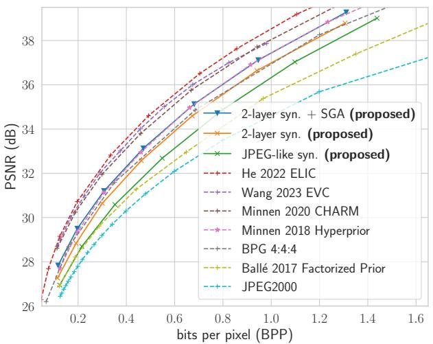  
(a) R-D performance on Kodak; quality measured in PSNR (the higher the better).

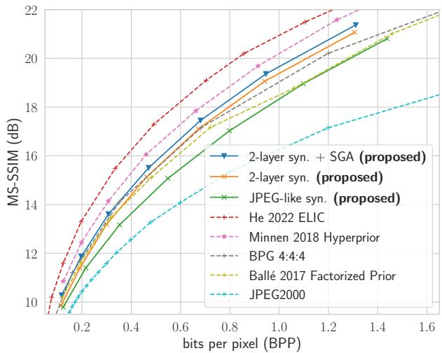  
(b) R-D performance on Kodak; quality measured in MS-SSIM dB (the higher the better).  
Figure 5. Comparison of the R-D performance of the proposed methods with existing neural image compression methods. All the models were optimized for MSE distortion.

Additionally, we examine the R-D performance using the more perceptually relevant MS-SSIM metric [48]. Following standard practice, we display it in dB $\mathrm { a s - 1 0 \log _ { 1 0 } ( 1 - }$ MS-SSIM). The results are shown in Fig. 5b. We observe largely the same phenomenon as before under PSNR, except that the existing methods based on CNN decoders achieve relatively much stronger performance compared to traditional codecs such as BPG and JPEG 2000. Our proposed method with a two-layer synthesis and iterative encoding (blue) still outperforms BPG, but no longer outperforms the Mean-scale Hyperprior (pink). Indeed, as we see in Fig. 6, the reconstructions of the proposed shallow synthesis transforms can exhibit artifacts similar to classical codecs (e.g., BPG) at low bit-rates, such as blocking or ringing, but to a lesser degree with the nonlinear two-layer synthesis (second panel) than the JPEG-like synthesis (third panel).

In Sec. 7.4.3 of the Appendix, we report additional R-D results evaluated on Tecnick [2] and the CLIC validation set [1], as well as under the perceptual distortion LPIPS [54]. Overall, we find that our proposed two-layer synthesis with SGA encoding matches the Hyperprior performance when evaluated on PSNR, but under-performs by 8% ∼ 12% (in BD-rate) when evaluated on either MS-SSIM or LPIPS.

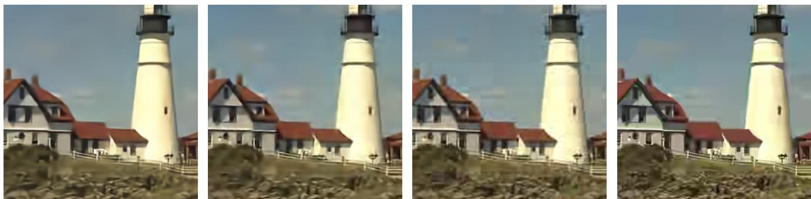  
Figure 6. Visualizing the different kinds of distortion artifacts at comparable low bit-rates between various methods. Left to right: Mean-scal Hyperprior [35], two-layer synthesis (proposed), JPEG-like synthesis (proposed), and BPG [8]. See Sec. 4.2 for relevant discussion.

## 4.3. JPEG-like synthesis

In this section, we study the JPEG-like synthesis in isolation. We start with the Mean-scale Hyperprior architecture, and replace its CNN synthesis with a single transposed convolution with varying kernel sizes. Additionally, instead of replacing the CNN synthesis entirely, we also consider a linear version of it (“linear CNN synthesis”) where we remove all the nonlinear activation functions. This results in a composition of four transposed convolution layers, which in general cannot be expressed by a single transposed convolution; however, note that this is still a linear (afffine) map from the latent space to image space.

Fig. 7 illustrates the distortion artifacts of the JPEG-like synthesis and linear CNN synthesis at comparable bit-rates, and reveals the following: (i). Using the smallest nondegenerate kernel size (k = s = 16) results in severe blocking artifacts, e.g., as seen in the 16 × 16 cloud patches in the sky, similarly to JPEG. (ii). Increasing k by a small amount (16 → 18) already helps smooth out the blocking, but further increase gives diminishing returns. (iii). At k = 32, the reconstruction of JPEG-like synthesis no longer shows obvious blocking artifacts, but shows ringing artifacts near object boundaries instead; the reconstruction by the linear CNN synthesis gives visually very similar results.

Indeed, Fig. 8 confirms that increasing k quantitatively improves the R-D performance of the JPEG-like synthesis, with k = 26 approaching the R-D performance of the linear CNN synthesis (within 1% aggregate bit-rate) while requiring 94% less FLOPs. We conclude that for image compression, a single transposed convolution with large enough kernel size is largely able to emulate a deep but linear CNN, and the additional nonlinearity is necessary for achieving spatially smooth reconstructions in nonlinear transform coding.

## 4.4. Ablation studies

The analysis transform. We ablate on the choice of anal ysis transform for our proposed two-layer synthesis architecture. Replacing the analysis transform of ELIC [25] with that of Mean-scale Hyperprior results in over 6% worse bitrate (with BPG as the anchor). This gap can be reduced to \~5% by increasing the number of base channels in the CNN analysis, although with diminishing returns and becomes suboptimal compared to switching to the ELIC analysis transform. See Appendix Sec. 7.4.2 for details.

Two-layer synthesis architecture Due to resource constraints, we were not able to conduct an exhaustive architecture search, and instead set the hyperparameters manually.

Fig. 9 presents ablation results on the main architectural elements of the proposed two-layer synthesis. We found that the residual connection slightly improves the R-D performance at low bit-rates, compared to a simple two-layer architecture with comparable FLOPs (using 2N = 24 hidden channels). We also found the use of (inverse) GDN activation [3] and increased kernel size in the output layer (k ) to be beneficial, which only cost a minor (less than 5%) increase in FLOPs . The number of channels (N) and kernel size (k ) in the hidden layer are more critical in the trade-off between decoding FLOPs and R-D performance, and we leave a more detailed architecture search to future work.

## 5. Related works

Computationally Efficient Neural Compression To reduce the high decoding complexity in neural compression, Johnston et al. [28] proposed to prune out filters in convolutional decoders with group-Lasso regularization [22]. Rippel and Bourdev [39] developed one of the earliest lossy neural image codecs with comparable running time to classical codecs, based on a multi-scale autoencoder architecture inspired by wavelet transforms such as JPEG 2000. Recent works propose computationally efficient neural compression architectures based on residual blocks [13, 25], more lightweight entropy model [26, 25], network distillation [47], and accelerating learned entropy coding [31]. We note there is also related effort on improving the compression performance of traditional codecs with learned components while maintaining high computational efficiency [18, 27].

  
Figure 7. Comparing the distortion artifacts at low bit-rate for different kernel sizes (k = 16, 18, 32, from left to right) in our JPEG-like synthesis, as well as a linear CNN synthesis (rightmost panel). The JPEG-like blocking artifacts are reduced as k increases; see Sec. 4.3.

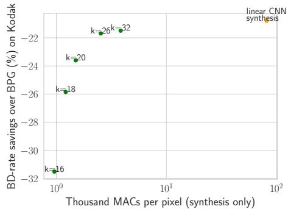  
Figure 8. Effect of increasing kernel size (k) on the performance of JPEG-like synthesis. See Sec. 4.3 for details.

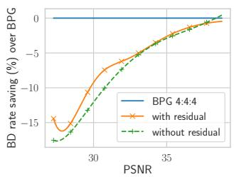  
(a) Residual connection.

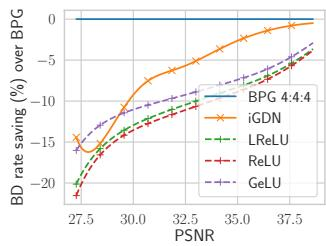  
(b) Nonlinear activation.

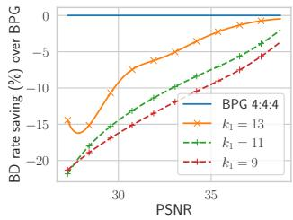  
(c) Hidden layer kernel size.

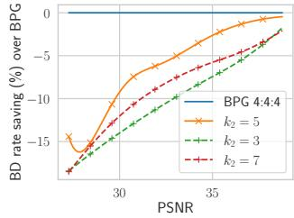  
(d) Output layer kernel size.  
Figure 9. Ablation on various architectural choices of the proposed two-layer synthesis transform. BD-rate savings are evaluated on Kodak (the higher the better). See Sec. 4.4 for a discussion.

Test-time / encoding optimization in compression The idea of improving compression performance with a powerful, content-adaptive encoding procedure is well-established in data compression. Indeed, vector quantization [21] can be seen as implementing the most basic and general form of an optimization-based encoding procedure, and can be shown to be asymptotically optimal in rate-distortion performance [14]. The encoders in commonly used traditional codecs such as H.264 [41] and HEVC [42] are also equipped with an exhaustive search procedure to select the optimal block partitioning and coding modes for each image frame. More recently, the idea of iterative and optimization-based encoding is becoming increasingly prominent in nonlinear transform coding [10, 49, 46], as well as computer vision in the form of implicit neural representations [38, 33]. It is therefore interesting to see whether ideas from vector quantization and implicit neural representations may prove fruitful for further reducing the decoding complexity in NTC.

Manifold learning A distantly related line of work is in metric learning with deep generative models, where the idea is to learn a latent representation of the data such that distance in the latent space preserves the similarity in the data space. Chen et al. [12] proposes the use of the Riemannian distance metric induced by a decoding transform of a latent variable to measure similarity in the data space. Further, they proposed to learn “flat manifolds” with VAEs [11], whose decoder essentially preserves the Euclidean distance between points in the latent space and the decoded points in the data space. Their method is based on regularizing the Jacobian of the VAE decoder to become constant, essentially resulting in a linear (affine) decoder with similar behavior to what we observed in learned synthesis transforms in Section 3.1.

## 6. Discussion

In this work, took a step towards closing the enormous gap between the decoding complexity of neural and traditional image compression methods. The main idea is to exploit the often asymmetrical computation budget of encoding and decoding: by pairing a lightweight decoder with a powerful encoder, we can obtain high R-D performance while enjoying low decoding complexity. We formalize this intuition theoretically, and show that the encoding procedure affects the R-D cost of lossy compression via an inference gap, and more powerful encoders improve R-D performance by reducing this gap. In our implementation, we adopt shal low decoding transforms inspired by classical codecs such as JPEG and JPEG 2000, while employing more sophisticated encoding methods including iterative inference. Empirically, we show that by pairing a powerful encoder with a shallow decoding transform, the resulting method achieves R-D performance competitive with BPG and the base Mean-scale Hyperprior architecture [35], while reducing the complexity of the synthesis transform by over an order of magnitude. We are optimistic that the synthesis complexity can be further reduced by going beyond the transposed convolutions used in this work, e.g., via sub-pixel convolution [40] or (transposed) depthwise convolution.

The success of nonlinear transform coding [6] over traditional transform coding can be mostly attributed to (1) data adaptive transforms and (2) expressive deep entropy models. We focused on improving the R-D-Compute efficiency of the synthesis transform, given that it accounts for the vast majority of decoding complexity in existing approaches, and left the hyperprior [35] unchanged. As a result, entropy decoding (via the hyper-synthesis transform) now takes up a majority (50 % - 80%) of the overall decoding computation in our method. Interestingly, we note that related work in learning flat manifolds has shown the necessity of an expressive prior [11], and recent work in video compression [32] also features a simplified transform in the data space and a more expressive and computationally expensive entropy model. Given recent advances in computationally efficient entropy models [25, 26, 31], we are optimistic that the en tropy decoder in our approach can be significantly improved in rate-distortion-complexity, and leave this important direction to future work.

A limitation of our shallow synthesis is its worse performance on perceptual distortion compared to deeper architectures. Our study focused on the MSE distortion as in traditional transform coding; in this setting, it is known that an orthogonal linear transform gives optimal R-D performance for Gaussian-distributed data [21]. However, the distribution of natural images is far from Gaussian, and com pression methods are increasingly evaluated on perceptual metrics such as MS-SSIM [48] – both factors motivating the use of nonlinear transforms. We believe insights from traditional signal processing and deep generative modeling may inspire more efficient nonlinear transforms with high perceptual quality, or an efficient pipeline based on a cheap MSE-optimized reconstruction followed by generative artifact removal/denoising for better perceptual quality.

## Acknowledgements

Yibo Yang acknowledges support from the HPI Research Center in Machine Learning and Data Science at UC Irvine. Stephan Mandt acknowledges support by the National Science Foundation (NSF) under an NSF CAREER Award IIS-2047418 and IIS-2007719. Stephan Mandt thanks Qualcomm for unrestricted research gifts.

## References

[1] Challenge on learned image coding, 2018. http://clic.compression.cc/2018/challenge/. 6

[2] N. Asuni and A. Giachetti. TESTIMAGES: A large-scale archive for testing visual devices and basic image processing algorithms (SAMPLING 1200 RGB set). In STAG: Smart Tools and Apps for Graphics, 2014. 6, 18

[3] J. Ballé, V. Laparra, and E. P. Simoncelli. End-to-end optimization of nonlinear transform codes for perceptual quality. In Picture Coding Symposium, 2016. 2, 7

[4] J. Ballé, V. Laparra, and E. P. Simoncelli. End-to-end Opti mized Image Compression. In International Conference on Learning Representations, 2017. 3, 5, 6

[5] Johannes Ballé, David Minnen, Saurabh Singh, Sung Jin Hwang, and Nick Johnston. Variational Image Compression with a Scale Hyperprior. International Conference on Learning Representations, 2018. 2, 15, 16

[6] J. Ballé, P. A. Chou, D. Minnen, S. Singh, N. Johnston, E. Agustsson, S. J. Hwang, and G. Toderici. Nonlinear transform coding. IEEE Trans. on Special Topics in Signal Processing, 15, 2021. 2, 4, 9

[7] Jean Bégaint, Fabien Racapé, Simon Feltman, and Akshay Pushparaja. Compressai: a pytorch library and evaluation platform for end-to-end compression research. arXiv preprint arXiv:2011.03029, 2020. 5

[8] Fabrice Bellard. BPG specification, 2014. (accessed Oct 3, 2022). 5, 6, 7

[9] Gisle Bjontegaard. Calculation of average psnr differences between rd-curves. VCEG-M33, 2001. 5

[10] Joaquim Campos, Simon Meierhans, Abdelaziz Djelouah, and Christopher Schroers. Content adaptive optimization for neural image compression. In Proceedings ofthe IEEE Conference on Computer Vision and Pattern Recognition Workshops, 2019. 8

[11] Nutan Chen, Alexej Klushyn, Francesco Ferroni, Justin Bayer, and Patrick Van Der Smagt. Learning flat latent manifolds with vaes. arXiv preprint arXiv:2002.04881, 2020. 1, 8, 9

[12] Nutan Chen, Alexej Klushyn, Richard Kurle, Xueyan Jiang, Justin Bayer, and Patrick Smagt. Metrics for deep generative models. In International Conference on Artificial Intelligence and Statistics, pages 1540–1550. PMLR, 2018. 3, 8, 15

[13] Zhengxue Cheng, Heming Sun, Masaru Takeuchi, and Jiro Katto. Learned image compression with discretized gaussian mixture likelihoods and attention modules. arXiv preprint arXiv:2001.01568, 2020. 2, 7, 12

[14] Thomas M Cover. Elements of information theory. John Wiley & Sons, 1999. 8

[15] Chris Cremer, Xuechen Li, and David Duvenaud. Inference suboptimality in variational autoencoders. In International Conference on Machine Learning, pages 1078–1086, 2018. 5

[16] P. Cuff. Communication requirements for generating correlated random variables. In 2008 IEEE International Symposium on Information Theory, pages 1393–1397, 2008. 4, 12

[17] Zhihao Duan, Ming Lu, Zhan Ma, and Fengqing Zhu. Open ing the black box of learned image coders. In 2022 Picture Coding Symposium (PCS), pages 73–77. IEEE, 2022. 1, 2, 3

[18] Lyndon R Duong, Bohan Li, Cheng Chen, and Jingning Han. Multi-rate adaptive transform coding for video compression. In ICASSP 2023-2023 IEEE International Conference on Acoustics, Speech and Signal Processing (ICASSP), pages 1–5. IEEE, 2023. 8

[19] G. Flamich, M. Havasi, and J. M. Hernández-Lobato. Compressing Images by Encoding Their Latent Representations with Relative Entropy Coding, 2020. Advances in Neural Information Processing Systems 34. 4, 12

[20] Brendan J Frey. Bayesian networksfor pattern classification, data compression, and channel coding. Citeseer, 1998. 14

[21] Allen Gersho and Robert M Gray. Vector quantization and signal compression, volume 159. Springer Science & Business Media, 2012. 8, 9

[22] Ariel Gordon, Elad Eban, Ofir Nachum, Bo Chen, Hao Wu, Tien-Ju Yang, and Edward Choi. Morphnet: Fast & simple resource-constrained structure learning of deep networks. In Proceedings ofthe IEEE conference on computer vision and pattern recognition, pages 1586–1595, 2018. 7

[23] Vivek K Goyal, Jun Zhuang, and M Veiterli. Transform coding with backward adaptive updates. IEEE Transactions on Information Theory, 46(4):1623–1633, 2000. 2

[24] Robert M Gray. Entropy and information theory. Springer Science & Business Media, 2011. 12

[25] Dailan He, Ziming Yang, Weikun Peng, Rui Ma, Hongwei Qin, and Yan Wang. Elic: Efficient learned image compression with unevenly grouped space-channel contextual adaptive coding. In Proceedings of the IEEE/CVF Conference on Computer Vision and Pattern Recognition, pages 5718–5727, 2022. 2, 5, 6, 7, 9, 12, 15, 16, 17

[26] Dailan He, Yaoyan Zheng, Baocheng Sun, Yan Wang, and Hongwei Qin. Checkerboard context model for efficient learned image compression. In Proceedings of the IEEE/CVF Conference on Computer Vision and Pattern Recognition, pages 14771–14780, 2021. 7, 9

[27] Berivan Isik, Onur G Guleryuz, Danhang Tang, Jonathan Taylor, and Philip A Chou. Sandwiched video compression: Efficiently extending the reach of standard codecs with neural wrappers. arXiv preprint arXiv:2303.11473, 2023. 8

[28] Nick Johnston, Elad Eban, Ariel Gordon, and Johannes Ballé. Computationally efficient neural image compression. arXiv preprint arXiv:1912.08771, 2019. 2, 4, 7, 15, 17

[29] Kodak. PhotoCD PCD0992, 1993. 5

[30] Tsung-Yi Lin, Michael Maire, Serge Belongie, James Hays, Pietro Perona, Deva Ramanan, Piotr Dollár, and C Lawrence Zitnick. Microsoft coco: Common objects in context. In European conference on computer vision, pages 740–755. Springer, 2014. 3, 5, 15, 16

[31] Anji Liu, Stephan Mandt, and Guy Van den Broeck. Lossless compression with probabilistic circuits. In International Conference on Learning Representations, 2022. 7, 9

[32] Fabian Mentzer, George Toderici, David Minnen, Sung-Jin Hwang, Sergi Caelles, Mario Lucic, and Eirikur Agustsson. Vct: A video compression transformer. arXiv preprint arXiv:2206.07307, 2022. 9

[33] Ben Mildenhall, Pratul P Srinivasan, Matthew Tancik, Jonathan T Barron, Ravi Ramamoorthi, and Ren Ng. Nerf: Representing scenes as neural radiance fields for view synthesis. Communications of the ACM, 65(1):99–106, 2021. 8

[34] David Minnen. Current Frontiers In Neural Image Compression: The Rate-Distortion-Computation Trade-Off And Optimizing For Subjective Visual Quality, 2021. 1

[35] D. Minnen, J. Ballé, and G. D. Toderici. Joint Autoregressive and Hierarchical Priors for Learned Image Compression. In Advances in Neural Information Processing Systems 31. 2018. 2, 3, 5, 6, 7, 9, 15, 16, 17

[36] D. Minnen and S. Singh. Channel-wise autoregressive entropy models for learned image compression. In IEEE International Conference on Image Processing (ICIP), 2020. 2, 3, 5, 6, 12, 15, 16

[37] Debargha Mukherjee. Challenges in incorporating ML in a mainstream nextgen video codec. CLIC Workshop and Challenge on Learned Image Compression, 2022. 1

[38] Jeong Joon Park, Peter Florence, Julian Straub, Richard Newcombe, and Steven Lovegrove. Deepsdf: Learning continuous signed distance functions for shape representation. In Proceedings of the IEEE/CVF conference on computer vision and pattern recognition, pages 165–174, 2019. 8

[39] O. Rippel and L. Bourdev. Real-time adaptive image compression. In Proceedings of the 34th International Conference on Machine Learning, 2017. 7

[40] Wenzhe Shi, Jose Caballero, Ferenc Huszár, Johannes Totz, Andrew P Aitken, Rob Bishop, Daniel Rueckert, and Zehan Wang. Real-time single image and video super-resolution using an efficient sub-pixel convolutional neural network. In Proceedings of the IEEE conference on computer vision and pattern recognition, pages 1874–1883, 2016. 9

[41] Gary J Sullivan, Pankaj N Topiwala, and Ajay Luthra. The h. 264/avc advanced video coding standard: Overview and introduction to the fidelity range extensions. Applications of Digital Image Processing XXVII, 5558:454–474, 2004. 8

[42] Vivienne Sze, Madhukar Budagavi, and Gary J Sullivan. High efficiency video coding (hevc). In Integrated circuit and systems, algorithms and architectures, volume 39, page 40. Springer, 2014. 8

[43] L. Theis, W. Shi, A. Cunningham, and F. Huszár. Lossy Image Compression with Compressive Autoencoders. In International Conference on Learning Representations, 2017. 2

[44] Lucas Theis and Noureldin Yosri. Algorithms for the communication of samples. 2021. 4, 12

[45] James Townsend, Tom Bird, and David Barber. Practical lossless compression with latent variables using bits back coding. arXiv preprint arXiv:1901.04866, 2019. 14

[46] Ties van Rozendaal, Iris A. M. Huijben, and Taco S. Cohen. Overfitting for fun and profit: Instance-adaptive data compression, 2021. 8

[47] Guo-Hua Wang, Jiahao Li, Bin Li, and Yan Lu. Evc: Towards real-time neural image compression with mask decay. In International Conference on Learning Representations, 2023. 5, 6, 7

[48] Z. Wang, E. P. Simoncelli, and A. C. Bovik. Multiscale structural similarity for image quality assessment. In The Thrity-Seventh Asilomar Conference on Signals, Systems Computers, 2003, volume 2, pages 1398–1402 Vol.2, 2003. 6, 9

[49] Yibo Yang, Robert Bamler, and Stephan Mandt. Improving inference for neural image compression. In Neural Information Processing Systems (NeurIPS), 2020, 2020. 2, 4, 5, 8, 15

[50] Yibo Yang and Stephan Mandt. Towards empirical sandwich bounds on the rate-distortion function. In International Conference on Learnning Representations, 2022. 5, 13, 14

[51] Yibo Yang, Stephan Mandt, and Lucas Theis. An introduction to neural data compression. Foundations and Trends in Computer Graphics and Vision, 2023. 1, 2

[52] Hongyi Zhang, Moustapha Cisse, Yann N Dauphin, and David Lopez-Paz. mixup: Beyond empirical risk minimization. arXiv preprint arXiv:1710.09412, 2017. 2, 3

[53] Mingtian Zhang, Peter Hayes, and David Barber. Generalization gap in amortized inference. arXiv preprint arXiv:2205.11640, 2022. 5, 14

[54] R. Zhang, P. Isola, A. A. Efros, E. Shechtman, and O. Wang. The Unreasonable Effectiveness of Deep Features as a Perceptual Metric. In 2018 IEEE/CVF Conference on Computer Vision and Pattern Recognition, pages 586–595, 2018. 6, 18