# Conditional 360-degree Image Synthesis for Immersive Indoor Scene Decoration

Ka Chun Shum1, Hong-Wing Pang1, Binh-Son Hua2,3, Duc Thanh Nguyen4, and Sai-Kit Yeung1

1Hong Kong University of Science and Technology 2Trinity College Dublin 3VinAI Research, Vietnam 4Deakin University

## Abstract

In this paper, we address the problem of conditional scene decoration for 360◦images. Our method takes a 360◦background photograph ofan indoor scene and generates decorated images of the same scene in the panorama view. To do this, we develop a 360-aware object layout generator that learns latent object vectors in the 360◦view to enable a variety of furniture arrangements for an input 360◦background image. We use this object layout to condition a generative adversarial network to synthesize images of an input scene. To further reinforce the generation capability ofour model, we develop a simple yet effective scene emp tier that removes the generatedfurniture and produces an emptied scenefor our model to learn a cyclic constraint. We train the model on the Structure3D dataset and show that our model can generate diverse decorations with controllable object layout. Our method achieves state-of-the-art performance on the Structure3D dataset and generalizes well to the Zillow indoor scene dataset. Our user study confirms the immersive experiences provided by the realistic image quality andfurniture layout in our generation results. Our implementation is available at https://github.com/ kcshum/neural\_360\_decoration.git.

## 1. Introduction

Panoramas (360◦images) enable immersive user experiences and have been applied intensively to various virtual reality (VR) applications [1, 4, 44]. However, automated generation of indoor scenes in the 360◦view for architectural and interior design remains understudied due to many challenges. First, the generation process must conform the common distortions in the 360◦view. Second, generated content must be controllable.

Common generative models, e.g., StyleGAN [22, 23] can generate photorealistic images. However, these methods are unconditional generation techniques, i.e., an output image is generated from a random code sampled in a latent space without interpreted meaning, thus limiting content controllability. Existing conditional image synthesis techniques, e.g., image-to-image translation [18, 65, 54, 50], on the other hand, do not have explicit support for scene representations and thus have limited capability for scene manipulation.

In this work, we focus on conditional image synthesis of 360◦indoor scenes. We are inspired by the neural scene decoration (NSD) in [38], aiming to generate a decorated scene image from a given background image and user-defined fur niture arrangement. However, the NSD method in [38] has several limitations. First, it requires an object layout modeling furniture arrangement from users, making the generation process not fully automatic. Second, its object layout, represented by rectangles, is not applicable in the 360◦view using equirectangular projection [47]. Third, there is no mechanism to control different attributes of the generated furniture, limiting the diversity of the generated content.

We instead take a different approach for scene representation and propose a conditional image synthesis method for automatic scene decoration in the 360◦setting. We first develop a 360-aware object layout generator that learns a set of object vectors representing the furniture arrangement of a 360◦scene. We use this layout as the latent representation in a generative adversarial network to condition the generated content. To support the training of the layout and generative adversarial network, we devise a scene emptier that performs a dual task, i.e., making a decorated scene empty. In summary, we make the following contributions in our work.

• A 360-aware object layout generator that automatically learns an object arrangement from a 360◦background image. Generated layouts condition the scene decoration in the 360◦viewer;

• A novel framework that synthesizes diverse and controllable scene decorations in the 360◦setting;

• A scene emptier for reinforcement of the conditioning ability and generation ability in the training;

• Extensive experiments and user studies on benchmark datasets including the Structured3D [63] and Zillow Indoor dataset [9] to validate our method and to provide immersive experiences to users.

## 2. Related work

Neural image synthesis. Existing neural image synthesis techniques can be grouped in two main directions: image-to-image translation and generative adversarial neural networks (GANs). Image-to-image translation methods [18, 65, 54, 50] aim at translating images from one domain to another. Among these, CycleGAN [64] with a cycle-consistency loss is well-known for its robustness yet effectiveness due to not requiring image pairs in both domains for training. Recent methods such as SPADE [39] and OASIS [45] translate semantic maps into realistic images. We do not use semantic maps in our work because semantic annotation of 360◦images is a costly task; drawing object silhouettes in a semantic map is also complex for novice users. Another difficulty for automatic decoration of 360◦images is the difference in the object arrangement between the input and output image, making the translation challenging to pixel-level image translation methods.

Recent developments in GANs have sparked great interest in image synthesis, e.g., the family of StyleGAN [22, 23, 19, 21]. These models have demonstrated groundbreaking results in generating human faces [22] and on some in-the-wild datasets [5]. They can also be conditioned on layouts for image synthesis [29, 56]. Several methods improve the quality of generated images using various cues such as layout reconfiguration [49], object context [13], and locality [32]. Some methods conditionally enhance the object layouts through layout-to-semantic prediction [51], layoutto-graph reasoning [15], automatic layout positioning [60], and layout completion [42].

For indoor scene image synthesis, ArchiGAN [6] and HouseGAN [37] generate apartment rooms and furniture layouts. BachGAN [31] hallucinates a background from an object layout. NSD [38] conditions an image generator on both a background image and an object layout defined by users. Our method is perhaps the most related to [38] in the problem setting, but we address a more challenging problem where the object layout is learned automatically, eliminating the need for user input while enabling controllability in the generated content.

360-degree image synthesis. Several methods employ generators that produce smaller spatially-aware patches, which can be assembled together into a high-resolution, seamless output image. For example, COCO-GAN [34] synthesizes a cylindrical set of patches to be assembled into a 360◦panorama. InfinityGAN [35] generates in-between patches between two fixed patches via the latent code inversion procedure in [7]. Several works show that a panorama can be synthesized from various conditional information, such as from a single perspective image [2], multiple perspective images [48] or aerial views [55].

Indoor scene modeling. Traditional indoor scene modeling methods reason the 3D space, with analysis on structural and functional aspects of the space, for furniture arrangement. Early attempts include creating a physical model of a scene for object insertion [25, 11, 26, 24], optimizing the spatial arrangement of furniture [12, 57] with additional consideration of object relations and room attributes [14, 30], and spatial constraints such as relation graph prior [52, 17, 37] and con volution prior [53]. Recently, Ritchie et al. [43] used neural networks to predict the category, location, orientation, and dimension of objects in a top-down view. Zhang et al. [62] optimized a GAN-based architecture that models object position and orientation, where the discriminator takes both rendered images and 3D shapes into account. Compared with existing scene unfurnishing [59] and scene furnishing nethods [58, 61, 33], our method is image-based and thus does not require the use of 3D models.

## 3. Proposed Method

We propose a conditional model for automatic scene decoration for 360◦images. Given a 360◦background image X that captures an empty scene, our model generates a 360◦image Yˆ of the scene in X, but with furniture. We use the equirectangular format to represent 360◦images, where each pixel’s x and y coordinate are mapped to the azimuth and polar angle in a spherical coordinate system, respectively. Our model has three sub-modules: (1) a conditional layout generator, (2) a conditional scene decorator (a GAN architecture), and (3) a scene emptier. The layout generator, trained in an unsupervised manner, disentangles possible objects to be generated in X into an object layout L that uses a set of latent vectors to represent objects in the 360◦setting. The decorator generates Yˆ by conditioning on the background image X and the predicted object layout L. The scene emptier clears up the decorated image Yˆ to revert it to the input background image. The scene emptier is used in training of our model to reinforce its conditioning and generation ability via a cycle loss. We illustrate our method in Figure 1 and describe its sub-modules in the corresponding sub-sections.

## 3.1. Conditional 360-aware object layout generator

Our aim is to estimate and represent a possible furniture arrangement from the given background image X in the 360◦setting. Our layout generator is a conditional image encoder followed by a multi-layer perceptron (MLP) to map the background image X into a proper set of object vectors in the 360◦view. Moreover, rather than representing the set of objects in a 2D plane [10], our layout generator considers distortions and left-right boundary discontinuity artifacts in the omnidirectional view. Mathematically, we let each object vector composed by an ellipse location $\alpha , \beta \in \mathbb { R }$ , an ellipse size $s \in \mathbb { R }$ , an ellipse rotation $\gamma \in \mathbb { R } .$ , an ellipse eccentricity $e \in [ 0 , 1 )$ , and a feature vector $f \in \mathbb { R } ^ { d _ { f } }$ . The layout generator can be defined by a function that maps $\overset { \cdot } { X } \in \mathbb { R } ^ { \tilde { W } \times H \times 3 } \mapsto \{ ( \alpha _ { i } , \beta _ { i } , s _ { i } , \gamma _ { i } , \overset { \cdot } { e _ { i } } , f _ { i } ) \} _ { i = 1 } ^ { n } \in \mathbb { R } ^ { n \times ( 5 + \hat { d } _ { f } ) }$ where n is the number of object ellipses to generate, W and H are respectively the width and height of the image X.

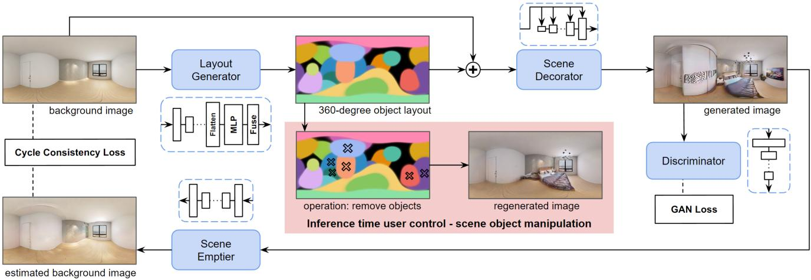  
Figure 1. Overview of our method. Input is a $3 6 0 ^ { \circ }$ background image of an empty scene. The input is fed to a layout generator to produce a set of object vectors to form a 360◦object layout. The object layout and input background image are integrated to condition a GAN architecture (our decorator and discriminator) to generate a decorated image of the same scene. During training, the output decorated image is fed to a scene emptier to render back the background image of the empty scene. This estimated background is compared with the input background for a cyclic constraint. At inference time, users can manipulate the object vectors to produce different object layouts to generate diverse images.

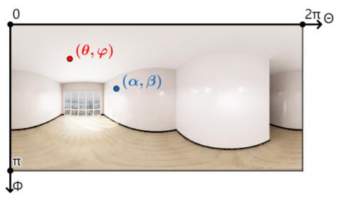  
(a)

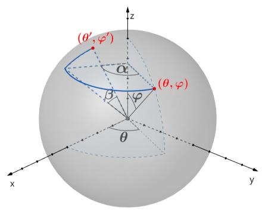  
(b)

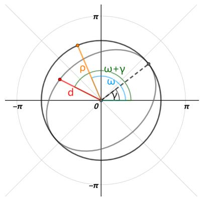  
(c)  
Figure 2. Visualization of calculating the distance d from a pixel point (θ, ϕ) to an ellipse object center (α, β). A panorama image (a) is modeled in the spherical coordinate system (b) and then rotated to align with the image origin to (α, β) in (b). In (c), the rotated image is projected to the polar coordinate system to effectively model an ellipse given ellipse rotation γ and eccentricity e.

To make the object vectors adaptive to a GAN architecture, we reshape them into an object layout $\boldsymbol { L } \in \mathbb { R } ^ { W \times H \times d }$ in the same spatial dimension with X. Intuitively, we assume that a pixel closer to an object ellipse should convey more information about that ellipse. This can be modeled by measuring the distance d from each pixel $( \theta , \phi ) \in \{ ( 0 , 2 \pi ] , [ 0 , \pi ] \}$ to every ellipse center $( \alpha , \beta )$ , where the tuple $( \theta , \phi )$ is the sphere coordinate of a pixel in a 360◦image. Calculating the distance d requires geometric manipulations. An option is to use geodesic distance on a sphere and model the object as a circle instead of an ellipse. However, we found this results in collapsed object size during training possibly due to difficulty in modeling of irregular-shaped objects.

Instead, we propose the following distance calculation, which is visualized in Fig. 2. We summarize the main steps in calculating d as follows. First, we align the sphere image center with the ellipse location $( \alpha , \beta )$ by rotating the sphere with the right-hand rule to obtain a rotated coordinate $( \theta ^ { \prime } , \phi ^ { \prime } )$

Next, we project the sphere image specified by $( \theta ^ { \prime } , \phi ^ { \prime } )$ to 2D polar coordinate system $( \rho , \omega )$ . Finally, we count the effect of ellipse rotation γ by adding it to polar coordinate ω and shrink the shape of the ellipse with ellipse eccentricity e to get the final distance $d .$ We refer the readers to our supplementary material for detailed equations.

After calculating distance $d ,$ we fuse the features f based on the inverse of d and ellipse size s to make a feature opacity $o = \mathrm { s i g m o i d } ( s - d )$ for each ellipse. The feature vector at a location $( \theta , \phi )$ in the object layout L is computed using alpha-compositing [10, 41]:

$$
L ( \theta , \phi ) = \sum _ { i } ^ { n } \{ f _ { i } o _ { i } \prod _ { k = i + 1 } ^ { n } ( 1 - o _ { k } ) \} .\tag{1}
$$

## 3.2. Conditional scene decorator

We adopt the generator $G$ and the discriminator D from StyleGAN2 [23] for our conditional scene decorator. The input of the decorator includes the background image X with the object layout L. Like [40], we split $\mathbf { \bar { \boldsymbol { L } } } \in \mathbb { R } ^ { W \times \mathbf { \bar { H } } \times d _ { f } }$ into $L _ { u } \in \mathbf { \bar { \mathbb { R } } } ^ { W \times \mathbf { \bar { H } } \times d _ { u } }$ and $L _ { y } \in \mathbb { R } ^ { W \times \mathbf { \bar { H } } \times d _ { y } }$ where $d _ { f } = d _ { u } +$ $d _ { y } , L _ { u }$ and $L _ { y }$ capture the structure and style information of the input scene, respectively. These maps are input for the generator G where $L _ { u }$ is considered for convolution operations and $L _ { y }$ is considered for spatial modulation [40].

To further strengthen the conditioning ability on X and preserve its high-frequency information, we concatenate $L _ { u }$ and X and pass the concatenated result to $G$ pyramidally. The output of G is a synthetically decorated image $\hat { Y }$ , which is then classified (as real vs. fake) by the discriminator $D$

## 3.3. Scene emptier

Ideally, removing decorated objects from the image $\hat { Y }$ should result in the background X. We apply this duality to reinforce the generation quality of our model. Specifically, we create a scene emptier E that transforms a decorated image of a scene into an empty version of that scene. The emptier is implemented as an encoder-decoder architecture (see our supplementary material). We pretrain E together with an unmodified version of the discriminator from Style-GAN2 [23], denoted as $D _ { e m p }$ , using the following losses:

$$
\mathcal { L } _ { G _ { e m p } } = \mathbb { E } _ { Y } [ 1 - D _ { e m p } ( E ( Y ) ) ] ,\tag{2}
$$

$$
\mathcal { L } _ { D _ { e m p } } = \mathbb { E } _ { X } [ 1 - D _ { e m p } ( X ) ] + \mathbb { E } _ { Y } [ D _ { e m p } ( E ( Y ) ) ] ,\tag{3}
$$

$$
\mathcal { L } _ { r e c o n } = \| \boldsymbol { X } - \boldsymbol { E } ( \boldsymbol { Y } ) \| _ { 2 } ^ { 2 } ,\tag{4}
$$

$$
\mathcal { L } _ { e m p } = \mathcal { L } _ { G _ { e m p } } + \mathcal { L } _ { D _ { e m p } } + \mathcal { L } _ { r e c o n } ,\tag{5}
$$

where $Y$ and $X$ represent a ground-truth decorated image and an empty image from training data.

Given the decorated image $\hat { Y } ,$ the produced background $E ( \hat { Y } )$ from the pretrained scene emptier is used to form a cycle consistency loss between $E ( { \hat { Y } } )$ and X to train the scene decorator. We note that the scene emptier and the cyclic constraint are necessary for the conditioning ability and generation ability of our model. This is because scene decoration is a weakly-constrained problem as there could be multiple solutions given a single background. Therefore, directly comparing the generated content $\mathcal { \bar { Y } }$ with its groundtruth $Y$ via pairwise losses (MSE, perceptual loss) would hinder the diversity of the synthesis since there is only one ground-truth decoration per input image. The scene emptier, with cycle-consistency loss, can relax the hardness of the pairwise losses while enforcing the background consistency.

We emphasize that the selections of the architecture for $E$ and $D _ { e m p }$ are not of significance as the decorated-toempty translation task is dual with, but less challenging than the empty-to-decorated translation task, which rigorously requires reasonable object arrangements. This observation allows us to choose a simpler design for the emptier. As shown in experimental results, a simple emptier already suffices to strengthen the entire scene decoration process.

We opt for pretraining the scene emptier before training the scene decorator as it leads to improved generation quality with the cycle consistency loss being a critic. This is explained by that with pretraining, the emptier is trained only with ground-truth decorated images and so it implicitly boosts the decorator to generate ground-truth-like results to fit the cycle consistency loss. In contrast, when the emptier is jointly trained with the scene decorator from scratch, the emptier can learn to empty low-quality decorated images synthesized in early iterations, and eventually tolerates such low-quality images in the learning process, degrading the overall performance of the entire pipeline.

## 3.4. Horizontal circular padding

A typical property of a panorama image is that the left and right boundaries loop around. However, convolutional layers in a neural network are weak in capturing information across the left-right boundaries of panorama images. Like [46], we overcome this issue by applying circular padding. Precisely, for all the convolutional layers in our networks $( L , G , D )$ , we circularly pad pixels from the left to the right boundary and vice versa prior to performing convolutions, while regular padding is applied to the top and bottom boundaries.

## 3.5. Training objectives

Given the pretrained emptier $E ,$ we train our entire model by a loss $\mathcal { L } _ { t o t a l }$

$$
\mathcal { L } _ { t o t a l } = \lambda _ { G A N } ( \mathcal { L } _ { G } + \mathcal { L } _ { D } ) + \lambda _ { c y c l e } \mathcal { L } _ { c y c l e } ,\tag{6}
$$

which includes GAN losses $( \mathcal { L } _ { G } , \mathcal { L } _ { D } )$ and a cycle loss $\mathcal { L } _ { \mathit { c y c l e } }$ that leverages the emptier E to impose a cyclic constraint on the background image $X ; \lambda _ { G A N }$ and $\lambda _ { c y c l e }$ are the coefficients of the corresponding losses, respectively.

The losses $\mathcal { L } _ { G }$ and $\mathcal { L } _ { D }$ are defined as:

$$
\mathcal { L } _ { G } = \mathbb { E } _ { \hat { Y } } [ 1 - D ( \hat { Y } ) ] ,\tag{7}
$$

$$
\mathcal { L } _ { D } = \mathbb { E } _ { \hat { Y } } [ D ( \hat { Y } ) ] + \mathbb { E } _ { Y } [ 1 - D ( Y ) ] ,\tag{8}
$$

where Y is a decorated image from the ground truth.

The cycle loss $\mathcal { L } _ { \mathit { c y c l e } }$ constrains the consistency of the background image X and the empty version $E ( { \hat { Y } } )$ made by the emptier E via a reconstruction loss:

$$
\mathcal { L } _ { c y c l e } = \| X - E ( \hat { Y } ) \| _ { 2 } ^ { 2 } .\tag{9}
$$

## 4. Experiments

## 4.1. Dataset

We trained and evaluated our method on the Structured3D dataset [63]. To the best of our knowledge, it is the only dataset that contains a significant amount of paired unfurnished and furnished 360◦images. The Structured3D dataset provides 21,835 360◦image pairs rendered from distinct rooms in 3,500 indoor scenes. We trained our method and report its performance only on the bedroom subset and living room subset of the Structured3D dataset since only these two sets contain a sufficient number of images for training. We split the bedroom subset into 3,318 training and 350 test images, and the livingroom subset into 1,900 training and 237 test images. We also tested our model on the test set of the Zillow Indoor Dataset (ZInD) [9], which consists of 4,359 undecorated 360◦images.

To increase the scale of the training data (for the bedroom subset), we applied panoramic-specific data augmentation. Particularly, except for random horizontal flipping, we implemented random horizontal circular translation on panorama images. Since the content crossing the left-right boundaries of a panorama image is connected, we circularly padded a random number of columns of pixels at the left to the right boundary to construct more panorama images.

## 4.2. Baselines

Our primary goal is to synthesize a decorated 360◦image given an unfurnished 360◦image and to provide a certain level of object control. This task could be partially tackled by conditional image-to-image (I2I) translation methods as they translate images to a target domain although they do not provide controllability over the generated objects. Therefore, we compare our method with well-known and state-of-theart I2I works including Pix2PixHD [54] that uses a one-toone paired reconstruction loss to model domain translation, StarGANv2 [8] that learns a one-to-many image translation model, and StyleD [27] that learns to implicitly categorize images in the target image domain and provide translation control towards categorized image domain.

For conditional layout-based generation methods, we compare our work with the methods by Pang et al. [38] and

He et al. [13] which achieve state-of-the-art performance in conditional image synthesis for scene decoration. As these methods additionally require ground-truth object labels and bounding boxes (not used in our model), to adapt them to our task, following [38], we generate object layouts by extracting object bounding boxes from semantic and instance maps from the ground-truth of the Structured3D dataset.

## 4.3. Implementation details

We present implementation details of our layout generator, decorator, and emptier in the supplementary material. We set the number of object ellipses n to 20 and the feature dimension $d _ { f }$ to 1024. The emptier and the entire model are trained using the Adam optimizer [28] with a learning rate of 0.01. We set $\lambda _ { G A N } = 1$ and $\lambda _ { c y c l e } = 5$ . The model was trained on equirectangular images. However, since several baselines require square images for training, we reshaped rectangular images into square images in both training and testing. Particularly, we experimented with our methods and other baselines in Sec. 4.4 under 512 × 512 resolution and ablation study in Sec. 4.5 under 256 × 256 resolution.

## 4.4. Results

Quantitative results. We quantitatively evaluate our method and compare it with other baselines using the Frechet Inception Distance (FID) [16] and Kernel Inception Distance (KID) [3] metrics. FID and KID assess the generation quality of a method by measuring the similarity (in feature space) between images generated by that method and those from the ground-truth. We use $\mathrm { K I D } \times 1 0 ^ { 3 }$ in all experiments.

As reported in Table 1, our method outperforms all the baselines on both FID and KID scores. The conditional layout-based methods generally perform better than I2I methods except for the Pix2PixHD [54]. We speculate the reason is that layout-based methods receive extra hints from explicit object layout to better model object distribution. Meanwhile, I2I methods commonly have difficulty in object understanding, except for the Pix2PixHD [54] that uses a one-to-one paired loss (to ground truth decorated images).

Qualitative results. We qualitatively compare our method with the baselines in Figure 3. As shown in the results, our method generates photo-realistic images in the 360◦viewer with plausible furniture arrangements. Background details in input images are well maintained. More importantly, while I2I baselines show difficulty in generating objects in the 360◦setting, our model can create decent results with proper object distribution without using any explicit object labels. Compared with other layout-based generation results, our results also have fewer visual artifacts and more realistic object texture.

Controllability. To illustrate the controllability of our method over the generated content, we manipulate object vectors generated by the layout generator. In particular, as our layout generator is trained in an unsupervised manner, we can only obtain the semantics of object vectors in a synthesized image after the image is generated. Through matching object ellipses via their locations and shapes with generated objects, we then select ellipses in the layout for object manipulation. We observe from our results that, operations such as minimizing the object ellipse size s or moving the ellipse location (α, β) result in the removal or translation of corresponding objects. Since the training of the model is conducted without explicit object labels, multiple object ellipses may contribute to a single object of a bigger size. Note that some object ellipses may not be strictly bound to any generated objects. We hypothesize that the generated object layout recommends possible furniture arrangements for the decorator to consider. The decorator may ignore some arrangements to produce a more plausible output. We illustrate the controllability of our method in Figure 4, which shows the diversity of generated images by manipulating the learned object layout.

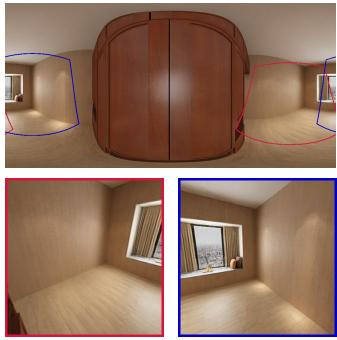

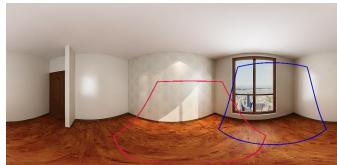

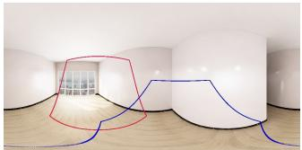

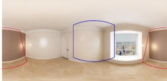

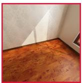

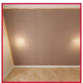

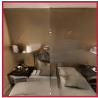

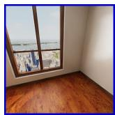

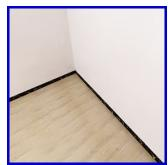

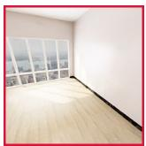

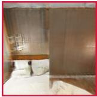

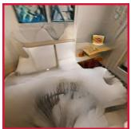

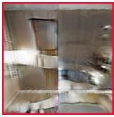

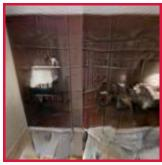  
(a) Input

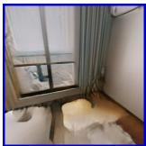

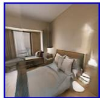

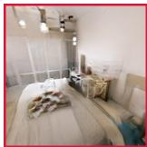

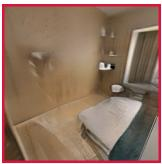

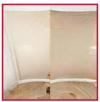

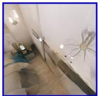

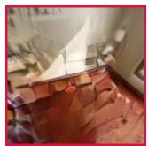

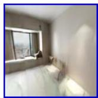

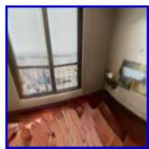  
(b) Pix2PixHD

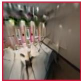

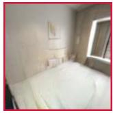

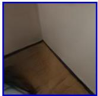

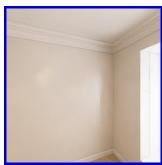

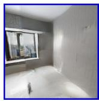  
(c) StarGANv2

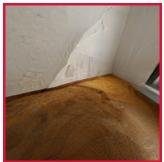

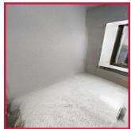

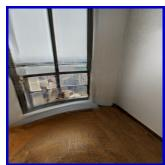

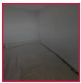

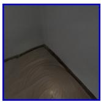  
(d) StyleD

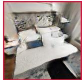

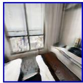

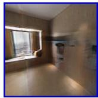

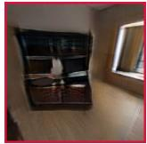

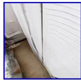

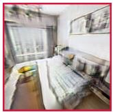  
(e) Pang et al. [38] (with object layout)

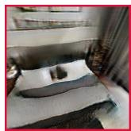

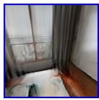

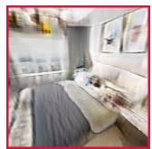

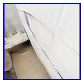

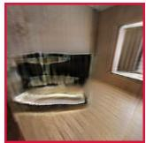

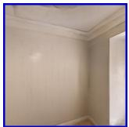  
(f) He et al. [13] (with object layout)

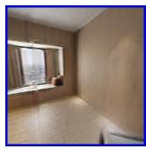

  
(g) Ours

  
Figure 3. Visualization of the generated 360◦images. Compared to ours, Pang et al. [38] and He et al. [13] require an additional explicit object layout as input. More results are in the supplementary material.

<table><tr><td></td><td colspan="2">bedroom</td><td colspan="2">living room</td></tr><tr><td>Method</td><td>FID↓</td><td>KID↓</td><td>FID↓</td><td>KID↓</td></tr><tr><td>Pix2PixHD [54]</td><td>73.33</td><td>20.56</td><td>83.64</td><td>14.20</td></tr><tr><td>StarGANv2 [8]</td><td>81.04</td><td>36.87</td><td>99.03</td><td>47.46</td></tr><tr><td>StyleD [27]</td><td>96.41</td><td>78.54</td><td>104.79</td><td>65.31</td></tr><tr><td>He et al. [13]</td><td>68.97</td><td>24.22</td><td>113.58</td><td>54.80</td></tr><tr><td>Pang et al. [38]</td><td>71.83</td><td>26.64</td><td>99.31</td><td>41.28</td></tr><tr><td>Ours</td><td>64.55</td><td>11.61</td><td>76.81</td><td>6.30</td></tr></table>

Table 1. Quantitative results. Note that He et al. [13] and Pang et al. [38] require explicit object layout for training and inference. Lower FID/KID scores indicate higher image generation quality.

Generalization to real-world images. We validate the generalization ability of our method on real-world scenes from the ZInD. As shown in Figure 5, our model generates plausible decorated images given real-world undecorated 360◦images. Fine objects can also be generated to fit different bedroom structures.

To quantitatively evaluate the generalization quality, we run our model and all the I2I baselines on the ZInD. We do not include the layout-based methods in this experiment due to lack of ground-truth object labels. We evaluate all the methods using FID and KID scores on both the ZInD and the decorated split of the Structured3D dataset. The reported results in Table 2 show the superior generalization ability of our method over all the I2I baselines on real-world data.

Emptier results. As mentioned, our emptier adopts a simple architect but produces sufficient emptying results for our pipeline to reinforce the generation ability. For reference, we qualitatively show the results of our emptier in Figure 6.

  
(a) Remove wardrobe and remove TV

  
(b) Shift lamp layout left (move to the camera top right) and remove bed

  
(c) Remove TV and shift bed rightward (new bed at the opposite wall)

Figure 4. Perform removal and translation manipulation on the object layout to control the generation of objects. (a), (b), and (c) show different sets of controls over different generated images. For each set of controls, the top left is the original image before manipulation, the top right is its object layout and the type of manipulation on specific object ellipses, bottom left and right are the generated image and object layout after the manipulation.

## 4.5. Ablation studies

Effectiveness of the conditional layout generator. Recall that the layout generator creates a group of object vectors from an input image. These vectors are fused into an ellipselike 360◦object layout for further generation. To validate the layout generator, we disable it in our pipeline and simply pass the input image to the scene decorator. Furthermore, to validate the 360◦setting for the object layout, we do not apply the 360◦conversion in Eq. (1) but rather fuse all raw pixels into a naive 2D layout (like in BlobGAN [10]). We report the results of this experiment in Table 3, which clearly shows the effectiveness of our layout design.

<table><tr><td></td><td>vs. Structured3D</td><td>vs. ZInD</td></tr><tr><td>Method</td><td>FID↓ KID↓</td><td>FID↓ KID↓</td></tr><tr><td>Pix2PixHD [54]</td><td>114.70 71.94</td><td>93.29 75.30</td></tr><tr><td>StarGANv2 [8]</td><td>93.56 49.47</td><td>73.73 58.80</td></tr><tr><td>StyleD [27]</td><td>102.02 70.36</td><td>59.43 45.78</td></tr><tr><td>Ours</td><td>88.86 47.29</td><td>51.56 33.74</td></tr></table>

Table 2. Quantitative evaluation on real-world images from the ZInD and the decorated split of the Structured3D dataset.

(a) Input  
  
(b) Generated

Figure 5. Generation results of our method on real-world scenes. Input images are from the 360◦bedrooms of the ZInD [9]. More results are in the supplementary material.
<table><tr><td>Method</td><td>FID ↓</td><td>KID↓</td></tr><tr><td>w/o layout generator</td><td>99.64</td><td>72.33</td></tr><tr><td>Traditional 2D layout [10]</td><td>75.27</td><td>25.57</td></tr><tr><td>Ours (full pipeline)</td><td>69.17</td><td>19.54</td></tr></table>

Table 3. Effectiveness of our proposed 360◦object layout.

Effectiveness of the pretrained emptier and cycle loss. We show the effectiveness of the pretrained emptier and cycle loss in our pipeline in Table 4. Specifically, in this experiment, we disable the emptier and remove the cycle loss from the total loss. We also consider replacing the cycle consistency loss with a pairwise loss. We also validate the necessity of pretraining of the emptier. Table 4 verifies the improvement gained by the pretraining and the cycle loss.

(a) Input  

  
(b) Emptier Output

(c) Ground-truth  
Figure 6. Qualitative results of our emptier. Inputs are the groundtruth furnished 360◦images from the Structured3D dataset.
<table><tr><td>Emptier</td><td>Consistency loss</td><td>FID ↓</td><td>KID↓</td></tr><tr><td>w/o emptier</td><td>N/A</td><td>91.28</td><td>34.40</td></tr><tr><td>w/o emptier</td><td>pairwise loss</td><td>73.40</td><td>23.77</td></tr><tr><td>w/o pretraining</td><td>cycle loss</td><td>76.74</td><td>23.67</td></tr><tr><td>pretraining</td><td>cycle loss</td><td>69.17</td><td>19.54</td></tr></table>

Table 4. Effectiveness of our proposed scene emptier.

<table><tr><td>Method</td><td>FID↓</td><td>KID*↓</td></tr><tr><td>w/o pano. data augmentation</td><td>72.16</td><td>25.37</td></tr><tr><td>with pano. data augmentation</td><td>69.17</td><td>19.54</td></tr></table>

Table 5. Effectiveness of the panoramic-specific data augmentation.

Effectiveness of the panoramic-specific data augmentation. The improvements of our panoramic-specific data augmentation are shown in Table 5, which validates the benefits brought by the increased data richness.

Backbone selection. We adopt StyleGAN2 [23] for our decorator due to its robustness proven in various tasks and datasets. Our method is not limited to a specific backbone. To prove this, we experiment with our pipeline on different backbones and report the results in Table 6.

<table><tr><td>Backbone</td><td>FID↓</td><td>KID*↓</td></tr><tr><td>LightweightGAN [36]</td><td>84.29</td><td>35.93</td></tr><tr><td>StyleGAN2-ADA [20]</td><td>69.32</td><td>21.09</td></tr><tr><td>StyleGAN2 [23] (in our pipeline)</td><td>69.17</td><td>19.54</td></tr></table>

Table 6. Ablation study of backbone selection.

  
Figure 7. User study results. We show the average rankings and the percentage of the participants selecting the methods as ranking 1st. The symbol S and Z refer to the Structured3D and ZInD. PR and OA refer to photo-realism and object arrangement.

## 4.6. User study

We conducted a user study on the generation quality of our method and other baselines. We presented generated 360◦images in perspective views to participants. Since ob jects are often generated at the middle and bottom of output images, we randomly rendered two perspective views with the camera facing toward these areas. We took generation results on both the Structured3D and ZInD, then asked participants to rank the results in regard to image photo-realism and quality of furniture arrangement among our work and other baselines. For the Structured3D dataset, we evaluate Pix2PixHD [54], Pang et al. [38], and He et al. [13]. For the ZInD, benchmark Pix2PixHD [54], StarGANv2 [8], and StyleD [27]. Figure 7 shows the results of the user study with 35 participants. It is clearly seen that our generated images are preferred by the participants for both the datasets and in terms of photo-realism and furniture arrangement.

## 5. Conclusion

We propose a conditional image generative model to solve the task of automatic neural scene decoration in the 360◦viewer. Our method offers immersive experiences of indoor scenes while enabling the controllability of generated content. We show that our method can generate realistic 360◦images with diverse furniture layouts on the synthetic Structured3D dataset and generalize well to the real-world Zillow indoor dataset. As 360◦images provide better context for scene understanding, an interesting research direction is to incorporate structural and semantic scene understanding into layout and image generation to improve furniture arrangement and object controllability. Our method also shares the limitations of generative models, i.e., the generation quality largely depends on the scale of the training dataset, which we aim to improve in our future work.

## Acknowledgement

The work described in this paper was partially supported by a grant from the Research Grants Council of the Hong Kong Special Administrative Region, China (Project No. 16202323) and an internal grant from HKUST (R9429).

## References

[1] Tanja Aitamurto, Shuo Zhou, Sukolsak Sakshuwong, Jorge Saldivar, Yasamin Sadeghi, and Amy Tran. Sense of presence, attitude change, perspective-taking and usability in firstperson split-sphere 360° video. pages 1–12, 04 2018. 1

[2] Naofumi Akimoto, Yuhi Matsuo, and Yoshimitsu Aoki. Diverse plausible 360-degree image outpainting for efficient 3dcg background creation. In Proceedings of the IEEE/CVF Conference on Computer Vision and Pattern Recognition (CVPR), 2022. 2

[3] Mikołaj Binkowski, Dougal J Sutherland, Michael Arbel, and´ Arthur Gretton. Demystifying MMD GANs. In Proceedings of the International Conference on Learning Representations, 2018. 5

[4] Eleonora Brivio, Silvia Serino, Erica Negro Cousa, Andrea Zini, Giuseppe Riva, and Gianluca De Leo. Virtual reality and 360 panorama technology: a media comparison to study changes in sense of presence, anxiety, and positive emotions. Virtual Reality, 25(2):303–311, 2021. 1

[5] Andrew Brock, Jeff Donahue, and Karen Simonyan. Large scale GAN training for high fidelity natural image synthesis. In Proceedings of the International Conference on Learning Representations, 2019. 2

[6] S Chaillou. ArchiGAN: a generative stack for apartment building design, 2019. 2

[7] Yen-Chi Cheng, Chieh Hubert Lin, Hsin-Ying Lee, Jian Ren, Sergey Tulyakov, and Ming-Hsuan Yang. Inout: Diverse image outpainting via gan inversion. In Proceedings of the IEEE/CVF Conference on Computer Vision and Pattern Recognition, pages 11431–11440, 2022. 2

[8] Yunjey Choi, Youngjung Uh, Jaejun Yoo, and Jung-Woo Ha. Stargan v2: Diverse image synthesis for multiple domains. In Proceedings of the IEEE/CVF conference on computer vision and pattern recognition, pages 8188–8197, 2020. 5, 7, 8, 9

[9] Steve Cruz, Will Hutchcroft, Yuguang Li, Naji Khosravan, Ivaylo Boyadzhiev, and Sing Bing Kang. Zillow indoor dataset: Annotated floor plans with 360º panoramas and 3d room layouts. In Proceedings of the IEEE/CVF Conference on Computer Vision and Pattern Recognition (CVPR), pages 2133–2143, June 2021. 2, 5, 8

[10] Dave Epstein, Taesung Park, Richard Zhang, Eli Shechtman, and Alexei A Efros. Blobgan: Spatially disentangled scene representations. arXiv preprint arXiv:2205.02837, 7, 2022. 2, 4, 8

[11] Matthew Fisher, Daniel Ritchie, Manolis Savva, Thomas A. Funkhouser, and Pat Hanrahan. Example-based synthesis of 3d object arrangements. ACM Transactions on Graphics, 31(6):1–11, 2012. 2

[12] Tobias Germer and Martin Schwarz. Procedural arrangement of furniture for real-time walkthroughs. Computer Graphics Forum, 28(8):2068–2078, 2009. 2

[13] Sen He, Wentong Liao, Michael Yang, Yongxin Yang, Yi-Zhe Song, Bodo Rosenhahn, and Tao Xiang. Context-aware layout to image generation with enhanced object appearance. In CVPR, 2021. 2, 5, 6, 7, 9

[14] Paul Henderson, Kartic Subr, and Vittorio Ferrari. Automatic generation of constrained furniture layouts. arXiv preprint arXiv:1711.10939, 2017. 2

[15] Roei Herzig, Amir Bar, Huijuan Xu, Gal Chechik, Trevor Darrell, and Amir Globerson. Learning canonical representations for scene graph to image generation. In Computer Vision–ECCV 2020: 16th European Conference, Glasgow, UK, August 23–28, 2020, Proceedings, Part XXVI 16, pages 210–227. Springer, 2020. 2

[16] Martin Heusel, Hubert Ramsauer, Thomas Unterthiner, Bernhard Nessler, and Sepp Hochreiter. GANs trained by a two time-scale update rule converge to a local nash equilibrium. In Proceedings of the Advances in Neural Information Processing Systems, 2017. 5

[17] Ruizhen Hu, Zeyu Huang, Yuhan Tang, Oliver van Kaick, Hao Zhang, and Hui Huang. Graph2Plan: Learning floorplan generation from layout graphs. ACM Transactions on Graphics, 39(4):118–128, 2020. 2

[18] Phillip Isola, Jun-Yan Zhu, Tinghui Zhou, and Alexei A Efros. Image-to-image translation with conditional adversarial networks. In Proceedings of the IEEE Conference on Computer Vision and Pattern Recognition, 2017. 1, 2

[19] Tero Karras, Miika Aittala, Janne Hellsten, Samuli Laine, Jaakko Lehtinen, and Timo Aila. Training generative adversarial networks with limited data. In Proceedings of the Advances in Neural Information Processing Systems, 2020. 2

[20] Tero Karras, Miika Aittala, Janne Hellsten, Samuli Laine, Jaakko Lehtinen, and Timo Aila. Training generative adversarial networks with limited data. Advances in Neural Information Processing Systems, 33:12104–12114, 2020. 9

[21] Tero Karras, Miika Aittala, Samuli Laine, Erik Hark¨ onen,¨ Janne Hellsten, Jaakko Lehtinen, and Timo Aila. Aliasfree generative adversarial networks. arXiv preprint arXiv:2106.12423, 2021. 2

[22] Tero Karras, Samuli Laine, and Timo Aila. A style-based generator architecture for generative adversarial networks. In Proceedings of the IEEE Conference on Computer Vision and Pattern Recognition, 2019. 1, 2

[23] Tero Karras, Samuli Laine, Miika Aittala, Janne Hellsten, Jaakko Lehtinen, and Timo Aila. Analyzing and improving the image quality of StyleGAN. In Proceedings of the IEEE Conference on Computer Vision and Pattern Recognition, 2020. 1, 2, 4, 8, 9

[24] Kevin Karsch. Inverse Rendering Techniques for Physically Grounded Image Editing. PhD thesis, University of Illinois at Urbana-Champaign, 2015. 2

[25] Kevin Karsch, Varsha Hedau, David Forsyth, and Derek Hoiem. Rendering synthetic objects into legacy photographs. ACM Transactions on Graphics, 30(6):1–14, 2011. 2

[26] Kevin Karsch, Kalyan Sunkavalli, Sunil Hadap, Nathan Carr, Hailin Jin, Rafael Fonte, Michael Sittig, and David Forsyth. Automatic scene inference for 3D object compositing. ACM Transactions on Graphics, 33(3):1–15, 2014. 2

[27] Kunhee Kim, Sanghun Park, Eunyeong Jeon, Taehun Kim, and Daijin Kim. A style-aware discriminator for controllable image translation. In Proceedings of the IEEE/CVF Conference on Computer Vision and Pattern Recognition, pages 18239–18248, 2022. 5, 7, 8, 9

[28] Diederik P Kingma and Jimmy Ba. Adam: A method for stochastic optimization. arXiv preprint arXiv:1412.6980, 2014. 5

[29] Jianan Li, Jimei Yang, Aaron Hertzmann, Jianming Zhang, and Tingfa Xu. LayoutGAN: Generating graphic layouts with wireframe discriminators. In Proceedings of the International Conference on Learning Representations, 2019. 2

[30] Manyi Li, Akshay Gadi Patil, Kai Xu, Siddhartha Chaudhuri, Owais Khan, Ariel Shamir, Changhe Tu, Baoquan Chen, Daniel Cohen-Or, and Hao (Richard) Zhang. GRAINS: generative recursive autoencoders for indoor scenes. ACM Transactions on Graphics, 38(2):1–16, 2019. 2

[31] Yandong Li, Yu Cheng, Zhe Gan, Licheng Yu, Liqiang Wang, and Jingjing Liu. BachGAN: High-resolution image synthesis from salient object layout. In Proceedings of the IEEE Conference on Computer Vision and Pattern Recognition, 2020. 2

[32] Zejian Li, Jingyu Wu, Immanuel Koh, Yongchuan Tang, and Lingyun Sun. Image synthesis from layout with locality aware mask adaption. In ICCV, 2021. 2

[33] Yuan Liang, Lubin Fan, Peiran Ren, Xuansong Xie, and Xian-Sheng Hua. Decorin: An automatic method for planebased decorating. IEEE Transactions on Visualization and Computer Graphics, 2021. 2

[34] Chieh Hubert Lin, Chia-Che Chang, Yu-Sheng Chen, Da-Cheng Juan, Wei Wei, and Hwann-Tzong Chen. Coco gan: Generation by parts via conditional coordinating. In Proceedings of the IEEE/CVF international conference on computer vision, pages 4512–4521, 2019. 2

[35] Chieh Hubert Lin, Hsin-Ying Lee, Yen-Chi Cheng, Sergey Tulyakov, and Ming-Hsuan Yang. Infinitygan: Towards infinite-pixel image synthesis. In ICLR. OpenReview.net, 2022. 2

[36] Bingchen Liu, Yizhe Zhu, Kunpeng Song, and Ahmed Elgammal. Towards faster and stabilized gan training for high-fidelity few-shot image synthesis. In International Conference on Learning Representations, 2021. 9

[37] Nelson Nauata, Kai-Hung Chang, Chin-Yi Cheng, Greg Mori, and Yasutaka Furukawa. House-GAN: Relational generative adversarial networks for graph-constrained house layout generation. In Proceedings of the European Conference on Computer Vision, 2020. 2

[38] Hong-Wing Pang, Yingshu Chen, Phuoc-Hieu Le, Binh-Son Hua, Duc Thanh Nguyen, and Sai-Kit Yeung. Neural scene decoration from a single photograph. In ECCV, 2022. 1, 2, 5, 6, 7, 9

[39] Taesung Park, Ming-Yu Liu, Ting-Chun Wang, and Jun-Yan Zhu. Semantic image synthesis with spatially-adaptive normalization. In Proceedings of the IEEE Conference on Computer Vision and Pattern Recognition, 2019. 2

[40] Taesung Park, Ming-Yu Liu, Ting-Chun Wang, and Jun-Yan Zhu. Semantic image synthesis with spatially-adaptive nor malization. In Proceedings of the IEEE/CVF conference on computer vision and pattern recognition, pages 2337–2346, 2019. 4

[41] Thomas Porter and Tom Duff. Compositing digital images. In Proceedings of the 11th annual conference on Computer graphics and interactive techniques, pages 253–259, 1984. 4

[42] Xiaotian Qiao, Quanlong Zheng, Ying Cao, and Rynson WH Lau. Tell me where i am: Object-level scene context prediction. In Proceedings of the IEEE/CVF Conference on Computer Vision and Pattern Recognition, pages 2633–2641, 2019. 2

[43] Daniel Ritchie, Kai Wang, and Yu-an Lin. Fast and flexible indoor scene synthesis via deep convolutional generative models. In Proceedings of the IEEE Conference on Computer Vision and Pattern Recognition, 2019. 2

[44] Kenneth A Ritter and Terrence L Chambers. Threedimensional modeled environments versus 360 degree panoramas for mobile virtual reality training. Virtual Reality, 26(2):571–581, 2022. 1

[45] Edgar Schonfeld, Vadim Sushko, Dan Zhang, Juergen Gall,¨ Bernt Schiele, and Anna Khoreva. You only need adversarial supervision for semantic image synthesis. In International Conference on Learning Representations, 2021. 2

[46] Stefan Schubert, Peer Neubert, Johannes Poschmann, and¨ Peter Protzel. Circular convolutional neural networks for panoramic images and laser data. In 2019 IEEE Intelligent Vehicles Symposium (IV), pages 653–660. IEEE, 2019. 4

[47] John P Snyder. Flattening the earth: two thousand years of map projections. University of Chicago Press, 1997. 1

[48] Julius Surya Sumantri and In Kyu Park. 360 panorama synthesis from a sparse set of images with unknown field of view. In Proceedings of the IEEE/CVF Winter Conference on Applications of Computer Vision, pages 2386–2395, 2020. 2

[49] Wei Sun and Tianfu Wu. Image synthesis from reconfigurable layout and style. In ICCV, 2019. 2

[50] Hao Tang, Dan Xu, Nicu Sebe, Yanzhi Wang, Jason J Corso, and Yan Yan. Multi-channel attention selection GAN with cascaded semantic guidance for cross-view image translation. In Proceedings of the IEEE Conference on Computer Vision and Pattern Recognition, 2019. 1, 2

[51] Bo Wang, Tao Wu, Minfeng Zhu, and Peng Du. Interactive image synthesis with panoptic layout generation. In Proceedings of the IEEE/CVF Conference on Computer Vision and Pattern Recognition, pages 7783–7792, 2022. 2

[52] Kai Wang, Yu-An Lin, Ben Weissmann, Manolis Savva, Angel X Chang, and Daniel Ritchie. Planit: Planning and instantiating indoor scenes with relation graph and spatial prior networks. ACM Transactions on Graphics, 38(4):1–15, 2019.

[53] Kai Wang, Manolis Savva, Angel X Chang, and Daniel Ritchie. Deep convolutional priors for indoor scene synthesis. ACM Transactions on Graphics, 37(4):1–14, 2018. 2

[54] Ting-Chun Wang, Ming-Yu Liu, Jun-Yan Zhu, Andrew Tao, Jan Kautz, and Bryan Catanzaro. High-resolution image synthesis and semantic manipulation with conditional GANs. In Proceedings of the IEEE Conference on Computer Vision and Pattern Recognition, 2018. 1, 2, 5, 7, 8, 9

[55] Songsong Wu, Hao Tang, Xiao-Yuan Jing, Haifeng Zhao, Jianjun Qian, Nicu Sebe, and Yan Yan. Cross-view panorama image synthesis. IEEE Transactions on Multimedia, 2022. 2

[56] Ceyuan Yang, Yujun Shen, and Bolei Zhou. Semantic hierarchy emerges in deep generative representations for scene synthesis. International Journal of Computer Vision, 129(5):1451–1466, 2020. 2

[57] Lap Fai Yu, Sai Kit Yeung, Chi Keung Tang, Demetri Terzopoulos, Tony F Chan, and Stanley J Osher. Make it home: automatic optimization of furniture arrangement. ACM Transactions on Graphics, 30(4):1–11, 2011. 2

[58] Lap-Fai Yu, Sai-Kit Yeung, and Demetri Terzopoulos. The clutterpalette: An interactive tool for detailing indoor scenes. IEEE Transactions on Visualization and Computer Graphics, 2015. 2

[59] Edward Zhang, Michael F. Cohen, and Brian Curless. Emp tying, refurnishing, and relighting indoor spaces. ACM Transactions on Graphics, 35(6):1–14, 2016. 2

[60] Lingzhi Zhang, Tarmily Wen, Jie Min, Jiancong Wang, David Han, and Jianbo Shi. Learning object placement by inpainting for compositional data augmentation. In Computer Vision–ECCV 2020: 16th European Conference, Glasgow, UK, August 23–28, 2020, Proceedings, Part XIII 16, pages 566–581. Springer, 2020. 2

[61] Shao-Kui Zhang, Yi-Xiao Li, Yu He, Yong-Liang Yang, and Song-Hai Zhang. Mageadd: Real-time interaction simulation for scene synthesis. In ACM International Conference on Multimedia, 2021. 2

[62] Zaiwei Zhang, Zhenpei Yang, Chongyang Ma, Linjie Luo, Alexander Huth, Etienne Vouga, and Qixing Huang. Deep generative modeling for scene synthesis via hybrid represen tations. ACM Transactions on Graphics, 39(2):1–21, 2020. 2

[63] Jia Zheng, Junfei Zhang, Jing Li, Rui Tang, Shenghua Gao, and Zihan Zhou. Structured3D: A large photo-realistic dataset for structured 3D modeling. In Proceedings of the European Conference on Computer Vision, 2020. 2, 5

[64] Jun-Yan Zhu, Taesung Park, Phillip Isola, and Alexei A Efros. Unpaired image-to-image translation using cycleconsistent adversarial networks. In Proceedings of the IEEE International Conference on Computer Vision, 2017. 2

[65] Jun-Yan Zhu, Richard Zhang, Deepak Pathak, Trevor Darrell, Alexei A Efros, Oliver Wang, and Eli Shechtman. Toward multimodal image-to-image translation. In Proceedings of the Advances in Neural Information Processing Systems, 2017. 1, 2