# Controllable Visual-Tactile Synthesis

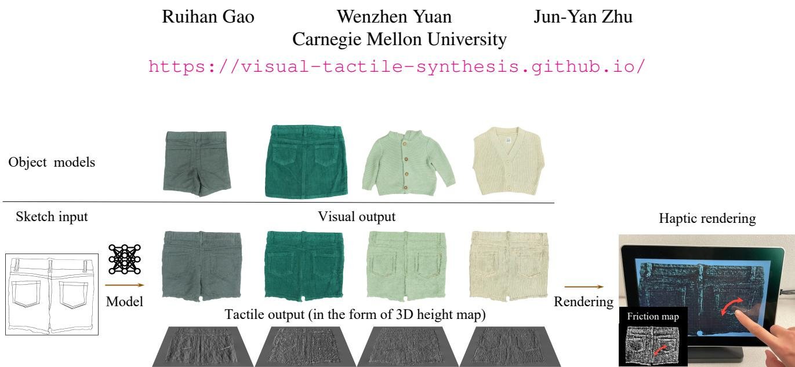  
Figure 1: Our method synthesizes visual and tactile outputs from an input sketch and renders the object on a haptic device (e.g., TanvasTouch screen [15]). Our system allows users to see the visual pattern andfeel the material texture at their fingertips simultaneously. Please see our data capture and user interaction demos on our project page.

## Abstract

Deep generative models have various content creation applications such as graphic design, e-commerce, and virtual try-on. However, current works mainly focus on synthesizing realistic visual outputs, often ignoring other sensory modalities, such as touch, which limits physical interaction with users. In this work, we leverage deep generative models to create a multi-sensory experience where users can touch and see the synthesized object when sliding theirfingers on a haptic surface. The main challenges lie in the significant scale discrepancy between vision and touch sensing and the lack of explicit mapping from touch sensing data to a haptic rendering device. To bridge this gap, we collect highresolution tactile data with a GelSight sensor and create a new visuotactile clothing dataset. We then develop a conditional generative model that synthesizes both visual and tactile outputsfrom a single sketch. We evaluate our method regarding image quality and tactile rendering accuracy. Finally, we introduce a pipeline to render high-quality visual and tactile outputs on an electroadhesion-based haptic device for an immersive experience, allowing for challenging materials and editable sketch inputs.

## 1. Introduction

The past few years have witnessed significant progress in content creation powered by deep generative models [30, 59] and neural rendering techniques [45, 71]. Recent works can synthesize realistic images with various user controls, such as user sketches [28], text prompts [55], and semantic maps [51]. However, most works focus on synthesizing visual outputs, ignoring other sensory outputs such as touch.

In real life, humans use vision and touch to explore objects. When shopping for clothing, we look at them to perceive their shape and appearance and touch them to anticipate the experience of wearing them. A single touch can reveal the material’s roughness, hardness, and local geome try. Multimodal perceptual inputs enable humans to obtain a more comprehensive understanding of the target objects, enhancing user experiences, such as online shopping and quick prototyping. Moreover, it opens up new possibilities for content creation, such as touchable VR and movies.

In this work, we aim to expand the capability of content creation. We introduce a new problem setting, controllable visual-tactile synthesis, for synthesizing high-resolution im ages and haptic feedback outputs from user inputs of a sketch or text. Our goal is to provide a more immersive experience for humans when exploring objects in a virtual environment.

Visual-tactile synthesis is challenging for two reasons. First, existing generative models struggle to model visual and tactile outputs jointly due to the dramatic differences in perception scale: vision provides a global sense of our surroundings, while touch offers only a narrow scale of local details. Second, there do not exist data-driven end-to-end systems that can effectively render the captured tactile data on a haptic display, as existing haptic rendering systems heavily rely on manually-designed haptic patterns [5, 3, 33, 61].

To address the challenges, we introduce a haptic material modeling system based on surface texture and topography. We first collect the high-resolution surface geometry of target objects with a high-resolution tactile sensor Gel-Sight [84, 75] as our training data. To generate visual-tactile outputs that can render materials based on user inputs, we propose a new conditional adversarial learning method that can learn from multimodal data at different scales. Different from previous works [28, 76], our model learns from dense supervision from visual images and sparse supervision from a set of sampled local tactile patches. During inference, we generate dense visual and tactile outputs from a new sketch design. We then render our models’ visual and tactile output with a TanvasTouch haptic screen [15]. The TanvasTouch device displays the visual output on a regular visual screen and uses electroadhesion techniques [68] to render the force feedback of different textures according to a friction map. Humans can feel the textures as a changing friction force distribution when sliding their fingers on the screen [7].

We collect a spatially aligned visual-tactile dataset named TouchClothing that contains 20 pieces of clothing, including pants and shirts, with diverse materials and shapes. We evaluate our model regarding image quality and perceptual realism with both automatic metrics and user study. Experimental results show that our method can successfully integrate the global structure provided by the sketch and the local fine-grained texture determined by the cloth material, as shown in Figure 1. Furthermore, we demonstrate sketchand text-based editing applications enabled by our system to generate new clothing designs for humans to see andfeel. Our code and data are available on our website 1.

## 2. Related Work

Vision and touch. Multimodal perception and learning using vision and touch inputs have been shown effective for several computer vision and robotics applications, such as estimating material proprieties [86, 88, 85, 87], object grasping and manipulation [38, 11, 10, 79, 72, 89, 42], object recognition [40, 70], future frame prediction [81], and representation learning for downstream tasks [31, 35, 81].

While most existing works focus on improving recognition and learning systems, we aim to synthesize visual-tactile outputs for content creation and VR applications. Several recent works learn to predict tactile outputs given visual inputs [39, 9, 8, 12]. Rather than predicting one modality from the other, we aim to simultaneously synthesize outputs in both modalities from user sketches and text descriptions.

Haptic rendering of textures. Haptic rendering refers to generating physical signals that simulate the feeling of touch and delivering it to humans, typically involving modeling software and rendering hardware. Rendering high-resolution material textures remains a challenge, despite extensive studies on the topic [6, 16]. One branch of works [58, 17, 18] use kinesthetic haptic devices to render single-point temporal signals. Users feel a vibrating force signal when holding a pen-like stylus and sliding on a plane surface. The lack of spatial resolution during the rendering limited the feeling of reality for haptic rendering. Prior works also propose to render textures on electroadhesion-based devices [66, 82, 48, 4], but they are limited to rendering homogeneous textures or coarse object shapes. In contrast, we propose to use the TanvasTouch device [15] to render detailed local geometry and material texture of garment objects. This device creates a programmable spatially distributed friction force using electroadhesion, allowing users to feel the texture by sliding their fingers across the touch screen. Using the new device boosts the user’s feeling of reality regarding the textures and local geometries.

Deep generative models. Prior works [32, 22, 74, 19, 26, 69, 59] have enabled various content creation applications such as text-to-image synthesis [63, 55, 56, 83], virtual tryon [24, 36, 1], and style transfer [92, 62, 41]. Most existing works focus on generating single-modal visual output like images, videos [25], and 3D data [49]. Several unconditional GANs synthesize outputs in two domains, such as images and semantic labels [2, 91, 37, 73], or RGBD data [77, 47]. While the above works sample multimodal outputs from latent vectors, they are not controllable. In contrast, our method allows us to control multimodal synthesis according to the user inputs.

Image-to-image translation. Various methods have adopted conditional generative models [22] to translate an image from one domain to another [28, 92, 27, 46, 62, 44, 14]. They are widely used in cross-modal prediction tasks such as sketch-to-photo [28, 64] and label-toimage [76, 51, 93]. In contrast, given user input, our model learns to synthesize outputs in two modalities at different spatial scales. Our method also differs from previous works as we learn to synthesize dense tactile outputs from only sparse supervision.

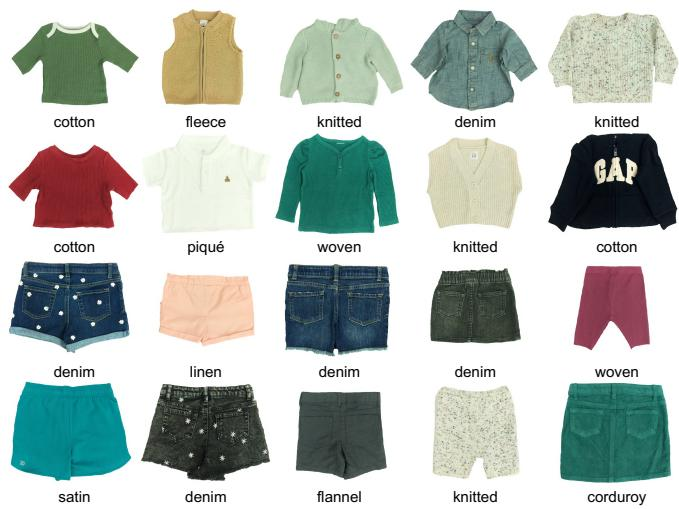  
Figure 2: Objects in the TouchClothing dataset. Our dataset consists of 20 pieces of clothes with different shapes (shirts, jackets, shorts, pants, etc.) and various fabrics (denim, corduroy, linen, fleece, etc.). Please zoom in to see more details.

## 3. Data Acquisition and Hardware

To develop our multimodal synthesis method, we construct a new spatially aligned visual-tactile dataset, TouchClothing, which consists of captured data of 20 pieces of garments as shown in Figure 2. They cover various fabrics commonly seen in the market, such as denim, corduroy, linen, fleece, and woven fabric. This dataset could be useful for online shopping and fashion design applications. For each garment, we obtain a single 1,280 × 960 visual image capturing the entire object and ∼200 tactile patches (32 × 32 pixels) sparsely sampled from the object surface. We track the 3D coordinates of the sensor’s contact area and project them on 2D visual images for spatial alignment. Finally, we extract the contour as the input sketch for each visual image. Please find our dataset on the website. Below we detail our collection process.

Visual-tactile data collection setup. Figure 3 shows our setup to collect aligned visual-tactile data, where each garment object is fixed on a planar stage with tapes. We capture a top-down view with a Pi RGB Camera mounted on the top aluminum bar and record hundreds of tactile patches by manually pressing a GelSight sensor [84, 75] at different locations of the object in a grid pattern. Our setup enables us to capture diverse patches from each object, including the flat sewing pattern with homogeneous texture, local geometry changes such as pocket edges, and randomly distributed features like flower-shaped decoration.

GelSight tactile sensor. The GelSight sensor [84, 75] is a vision-based tactile sensor that uses photometric stereo to measure contact geometry at a high spatial resolution of several tens of micrometers. In this paper, we use the Gel-

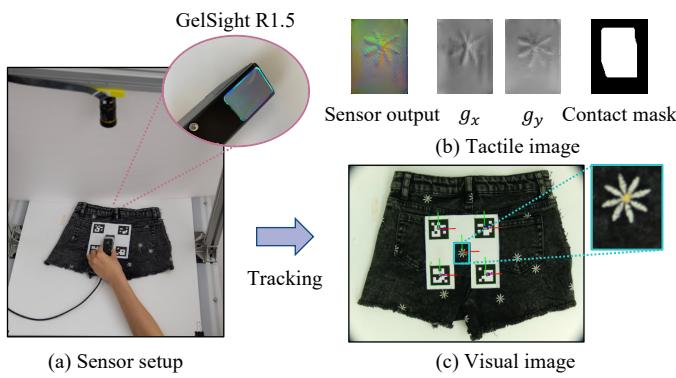  
Figure 3: Visual-tactile data acquisition setup. (a) Our setup includes a PiCamera RGB camera, a GelSight R1.5 high-resolution tactile sensor, and Aruco markers to track the relative pose of the sensor. (b) We show the captured tactile data, including the raw sensor output, the derived surface gradients in x and y directions gx and gy, and the computed contact mask. (c) We locate the bounding box in the visual image corresponding to the tactile data.

Sight R1.5, modified from Wang et al. [75]. It has a sensing area of 32mm × 24mm (H × W) and a pixel resolution of 320×240, equivalent to 100 micrometers per pixel. The sensor outputs an RGB image, which can be converted to the surface gradients and used to reconstruct a 3D height map.

Visual-tactile correspondence. To calculate the relative position of the GelSight sensor with respect to the camera, we attach four Aruco markers to the GelSight and run RANSAC [20] to track its 3D pose. This allows us to project the 3D coordinates of the contact area onto the 2D visual image and to determine the corresponding bounding box for each tactile patch. Example data are shown in Figure 4.

Tactile data pre-processing and contact mask. Each tactile image represents a single touch of the GelSight sensor on the garment, where only a small portion of the sensing area is in contact. We observed noticeable artifacts when training the model with raw data. Instead, we mask out the non-contact region and improve the model using only the contact area for training. Specifically, we downsample the tactile image from 320×240 to 104×78 (about 300 micrometers per pixel) to match the visual images’ resolution and then create a contact mask for each tactile patch by thresholding the height map. We heuristically determine the threshold to be the 75th percentile of the height map values and apply dilation to avoid false negative detections. We sample 32×32 patches based on the contact mask as the final tactile data. We capture roughly 200 patches per clothing, covering 1/6 of the image area.

Sketch image. We follow the procedure described in pix2pix [28] to obtain sketches from visual images. We first extract coarse contours using the DexiNed network [53] and then manually remove small edges to obtain thin contours.

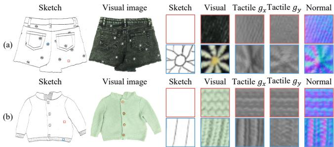  
Figure 4: Data examples from our TouchClothing dataset. For each object, we show the input sketch, the visual image, and two tactile patches. For each tactile patch, we show their corresponding sketch crop, visual crop, and the captured tactile data, including surface gradients in the x and y directions $( g _ { x } , g _ { y } )$ and surface normal maps. The color-coded bounding boxes in the sketch mark the position of each tactile patch and instantiate the significant scale difference between the visual and tactile data, which makes our conditional synthesis task difficult.

TanvasTouch for haptic rendering. TanvasTouch [15] is a haptic screen that renders a distributed friction map for finger contact. It models the air gap between the screen surface and the human finger as a capacitor. When a human finger slides across it, the varying voltage underneath the screen induces a small current in the finger, which is perceived as a changing friction force. The device takes a grayscale friction map as input to modulate the voltage distribution across the screen. The screen displays visual images and renders haptic signals simultaneously, creating a coupled visual-haptic output.

## 4. Method

Visual-tactile synthesis is challenging due to the large discrepancy between the receptive field of vision and touch. While a camera captures global features of an object, such as color and shape, a touch sensor captures local information within a small patch, such as edges and material texture. Existing conditional generative models are not directly applicable as they assume all inputs to be relatively the same scale.

To address this challenge, we propose a new multimodal conditional GAN that learns from global visual supervision and sparse local tactile supervision. As shown in Figure 5, our model synthesizes spatially aligned visual-tactile output given a single sketch. We formulate the task in Section 4.1 and introduce our learning objective in Section 4.2. We describe the network design in Section 4.3 and discuss how to render the visual and tactile outputs on the TanvasTouch haptic device in Section 4.4.

## 4.1. Visual-Tactile Synthesis

We train one model for each object and formulate the visual-tactile synthesis task as a conditional form of singleimage generative modeling [50, 67, 65], which has demonstrated flexible editing ability even though the model is trained on a single image. Specifically, given a single sketch x of size $H \times W$ , where H and W are the image height and width, we aim to learn a function that maps the input sketch x to two spatially aligned outputs, an RGB visual image yI and a tactile output yT.

The sketch x is a contour map that outlines the object and captures its coarse-scale edge and patterns. For example, in Figure 4 (a), the sketch of a pair of shorts illustrates the overall shape of the shorts, the location of pockets and waistbands, and local decorative patterns. In practice, we follow Isola et al. [28] to extract a sketch using DexiNed [53] and edge thinning. Figure 4 shows examples of the sketch, visual, and tactile images for a pair of shorts and a sweater.

The visual image $y _ { I }$ is an RGB image captured by the camera. The tactile output $y _ { T } ~ = ~ ( g _ { x } , g _ { y } )$ is a 2-channel image representing the gradients of the surface in x and y directions. They can be used to reconstruct the surface normal n using the following equation

$$
\mathbf { n } = \frac { ( g _ { x } , g _ { y } , - 1 ) } { \sqrt { g _ { x } ^ { 2 } + g _ { y } ^ { 2 } + 1 } }\tag{1}
$$

and then converted into a height map by Poisson integra tion [84]. For training, we obtain the patchwise ground-truth surface gradients $( g _ { x } , g _ { y } )$ from the GelSight sensor and empirically find using the gradients as the conditional GAN’s output modality works better than using a normal map or height map.

The generated visual and tactile outputs can be used for applications such as fashion design and haptic rendering. In this work, we render a garment on the TanvasTouch screen, allowing people to simultaneously see andfeel it.

## 4.2. Learning Objective

We have two main challenges in this learning task. First, we must learn from dense vision images and sparse tactile supervision while accounting for scale differences. Second, we have limited training data, as we need to learn a synthesis network on a single high-resolution example. To address these challenges, we introduce the following learning objective.

Visual synthesis loss. To synthesize a realistic visual im age $y _ { I }$ conditional on a user sketch x, we optimize the visual generator $G _ { I }$ and visual discriminator $D _ { I }$ to match the conditional distribution of real sketch-image pairs. We optimize the following minimax objective [28, 46]:

$$
\begin{array} { r l } & { V ( G _ { I } , D _ { I } , x , y _ { I } ) = \mathbb { E } _ { x , y _ { I } } [ \log D _ { I } ( x , y _ { I } ) ] } \\ & { ~ + \mathbb { E } _ { x } [ \log ( 1 - D _ { I } ( x , G _ { I } ( x ) ) ) ] . } \end{array}\tag{2}
$$

Unfortunately, the above adversarial loss introduces training instability due to our single-image training setting. To accommodate the limited dataset size, we use a vision-aided discriminator $D _ { \mathrm { c l i p } }$ [34] that consists of a frozen CLIP feature extractor [54] and a small trainable MLP head. The vision-aided loss can reduce overfitting issues for small scale datasets and synthesize visual images that better match human perception. Our adversarial loss includes:

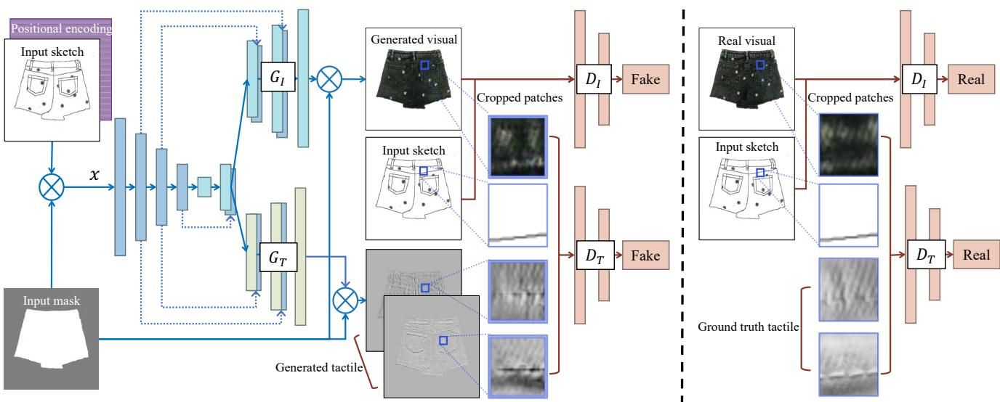  
Figure 5: Overview. Generators: Given a user sketch, its foreground mask, and positional encoding of the pixel coordinates, we feed them into a two-branch generator. The two branches share the encoder and the first four layers of the decoders and then split to synthesize visual and tactile results, respectively. Discriminators: We feed the entire visual image to our visual discriminator $D _ { I }$ and patches to our tactile discriminator $D _ { T } , D _ { I }$ is conditional on the sketch, and $D _ { T }$ is conditional on both sketch crops and visual crops.

$$
\begin{array} { r } { \mathcal { L } _ { \mathtt { c G A N } } = V ( G _ { I } , D _ { I } , x , y _ { I } ) + V ( G _ { I } , D _ { \mathtt { c l i p } } , x , y _ { I } ) . } \end{array}\tag{3}
$$

To further stabilize GANs training, we incorporate a reconstruction-based loss. Here we use a combination of pixel-wise L1 distance and CNN feature-based perceptual loss (LPIPS) [90], as they encourage sharper images [28] and higher perceptual similarity to the ground truth.

$$
\begin{array} { r } { \mathcal { L } _ { \mathrm { r e c } } ( G _ { I } , x , y _ { I } ) = \mathbb { E } _ { x , y _ { I } } [ \mathcal { L } _ { \mathrm { L P I P S } } ( y _ { I } , G _ { I } ( x ) ) ] } \\ { + \lambda _ { 1 } \mathbb { E } _ { x , y _ { I } } [ \| y _ { I } - G _ { I } ( x ) \| _ { 1 } ] , } \end{array}\tag{4}
$$

where $\lambda _ { 1 }$ balances the perceptual loss and L1 loss. The final objective function for visual output can be written as follows:

$$
\begin{array} { r } { \mathscr { L } _ { I } = \mathscr { L } _ { \mathrm { c G A N } } + \mathscr { L } _ { \mathrm { r e c } } . } \end{array}\tag{5}
$$

Tactile synthesis loss. Unfortunately, we cannot simply use the above loss function to optimize tactile output, as we no longer have access to the full-size tactile ground truth data. Additionally, the vision-aided loss does not apply to tactile data and small patches, as the vision-aided discriminator $D _ { \mathrm { c l i p } }$ is pretrained on large-scale natural image collections.

Instead, we learn a full-size tactile generator $G _ { T }$ with supervision from hundreds of tactile patches. Here we denote corresponding (sketch, image, tactile) patches as $( x ^ { p } , y _ { I } ^ { p } , y _ { T } ^ { p } )$ at sampled location $p .$ While the generator

$G _ { T }$ synthesizes the full-size tactile output at once, our patch-level discriminator $D _ { T }$ learns to classify whether each patch pair is real or fake, with the following objective:

$$
\begin{array} { r l } & { V ( G _ { T } , D _ { T } , x , y _ { I } , y _ { T } ) = \mathbb { E } _ { x , y _ { I } , y _ { T } , p } [ \log D _ { T } ( x ^ { p } , y _ { I } ^ { p } , y _ { T } ^ { p } ) ] } \\ & { + \mathbb { E } _ { x , p } [ \log ( 1 - D _ { T } ( x ^ { p } , G _ { I } ^ { p } ( x ) , G _ { T } ^ { p } ( x ) ) ) ] , } \end{array}\tag{6}
$$

where $G _ { I } ^ { p } ( x )$ and $G _ { T } ^ { p } ( x )$ denote cropped patches of synthesized visual and tactile outputs. To reduce training memory and complexity, we do not backpropagate the gradients to $G _ { I }$

Besides the standard non-saturating GAN objective, we use the feature matching objective [76] based on the discriminator’s features as the discriminator adapts to the tactile domain better, compared to a pre-trained CLIP model. In addition, we also add a patch-level reconstruction loss. Our final loss for the tactile synthesis branch can be written as follows:

$$
\mathcal { L } _ { T } = \lambda _ { \mathrm { G A N } } V ( G _ { T } , D _ { T } , x , y _ { I } , y _ { T } ) + \lambda _ { \mathrm { r e c } } \mathcal { L } _ { \mathrm { r e c } } ( G _ { T } , x ^ { p } , y _ { T } ^ { p } ) .\tag{7}
$$

Patch sampling. We sample two types of patches. We sample patches with paired ground truth tactile data, for which we can use both reconstruction loss and adversarial loss. However, we only have 200 patches for training. To further increase training patches, we also randomly sample patches without paired ground truth. We only try to mini mize the second term $\log ( 1 - D _ { T } ( x ^ { p } , G _ { I } ^ { p } ( x ) , G _ { T } ^ { p } ( x ) ) )$ of the tactile adversarial loss (Eqn. 6) as it is only dependent on synthesized patches.

Full objective. Our final objective function is

$$
G _ { I } ^ { * } , G _ { T } ^ { * } = \arg \operatorname* { m i n } _ { G _ { I } , G _ { T } } \operatorname* { m a x } _ { D _ { I } , D _ { T } , D _ { \mathrm { c l i p } } } ( \mathcal { L } _ { I } + \mathcal { L } _ { T } ) .\tag{8}
$$

The weights are chosen using a grid search so that the losses have comparable scales, and the final values are $\lambda _ { 1 } = 1 0 0$ $\lambda _ { \mathrm { G A N } } = 5 , \lambda _ { \mathrm { r e c } } = 1 0$ . The grid search is done only once for a randomly selected object, and the same parameters are used for all objects in the dataset.

In Section 5, we carefully evaluate the role of the adversarial loss and image reconstruction loss regarding the performance of our final model.

## 4.3. Training Details

Below we describe our generator and discriminator’s network architectures and other training details.

Network architectures. We use a U-Net [60] as the backbone of our generator, which splits into two branches, $G _ { I }$ and $G _ { T }$ , from an intermediate layer of the decoder. This way, the visual and tactile outputs share the same encoding for global structure while maintaining modality-specific details at each pixel location. For discriminators, we use multi-scale PatchGAN [28, 76] for both visual discriminator $D _ { I }$ and tactile discriminator $D _ { T }$ , since multi-scale PatchGAN has been shown to improve the fine details of results.

Positional encoding and object masks. Since sketches often contain large homogeneous texture areas, we use Si nusoidal Positional Encoding (SPE) [80] to encode the pixel coordinates and concatenate the positional encoding and the sketch at the network input. We also extract the object mask and use it to remove the background from the input and output. Thus the final input to the network is a masked version of the concatenated sketch and positional encoding features. Please refer to our arxiv version 2 for supplementary material and more training details.

## 4.4. Haptic Rendering

After synthesizing the visual and tactile output, we render them on the TanvasTouch haptic screen using the following rendering pipeline so that users can see andfeel the object simultaneously. Specifically, we display the visual image directly on the screen and convert the two-channel tactile output $( g _ { x } , g _ { y } )$ into a grayscale friction map required by TanvasTouch. As shown by Manuel et al. [43] and Fiesen et al. [21], humans are sensitive to contours and high-frequency intensity change for surface haptic interpretation. Inspired by this, we first compute the squared magnitude of the gradient $z = g _ { x } ^ { 2 } + g _ { y } ^ { 2 } , z \in [ 0 , 1 ]$ , then apply non-linear mapping function $z ^ { \prime } \stackrel { \smile } { = } \log _ { 1 0 } ( 9 \times z + 1 ) , z ^ { \prime } \in [ 0 , 1 ]$ for contrast enhancement, and finally resize it to the TanvasTouch screen size as the final friction map. We empirically find this helpful to enhance textures’ feeling with electroadhesive force.

## 5. Experiment

Below we present our main results. Please check out our website for data capture and user interaction videos.

Evaluation metrics. We evaluate our method on the similarity between the synthesized output and the real data of the TouchClothing dataset. For both visual and tactile output, we report the LPIPS metric [90] for perceptual realism as prior works [90, 29] have shown that the LPIPS metric better matches human perception, compared to PSNR and SSIM [78]. We also use Single Image Frechet Inception´ Distance (SIFID) [65] for texture similarity, as extensively used in prior works [65, 52]. Since the dataset only contains one visual image per object, we evaluate LPIPS on seen sketches for visual reconstruction and SIFID on unseen sketches for texture consistency in generalization. In addition to automatic metrics, we perform a human preference study.

Baselines. To our knowledge, this paper is the first to study visual-tactile synthesis conditioned on a sketch input. Thus we consider image-to-image translation as a similar task and compare our method with several conditional GANs, including pix2pix [28], pix2pixHD [76] and GauGAN [51]. Pix2pix is one of the most commonly used image translation networks, pix2pixHD uses a coarse-to-fine generator and a multi-scale discriminator to handle high-resolution image synthesis, and GauGAN adopts spatially-adaptive denormalization layers. Both pix2pixHD and GauGAN are trained using a perceptual loss, a conditional GAN loss, and a GAN-based feature matching loss.

For baselines, we add two channels for tactile output $g _ { x }$ and $g _ { y }$ , increasing the number of output channels from 3 to 5. The visual and tactile outputs are fed into two discriminators, both conditioned on the sketch input. Since only patch data are available as tactile ground truth, we crop the corresponding region of the sketch and visual images into patches and train the network using sketch-visual-tactile patch triplets. We perform the same amount of augmentation as our method. We follow the default parameters in the original works. During inference, we feed in the entire sketch image to obtain the full-scale visual and tactile outputs, as the fully convolutional network generalizes to inputs of different sizes.

Quantitative comparisons. As shown in Table 1, our method outperforms all baselines by a large margin in all metrics. Our method reduces visual LPIPS by more than 50% and tactile LPIPS by about 30%. Our results depict more realistic and faithful textures, as demonstrated by $5 \times$ and $2 \times$ lower SIFID for visual and tactile output, respectively. This shows the advantage of our method for both visual and tactile synthesis. We notice that pix2pix works better than pix2pixHD and GauGAN regarding most metrics. This may be because all baselines require paired datasets, and in our case, paired data are low-resolution (32×32), which does not fit the application of pix2pixHD and GauGAN.

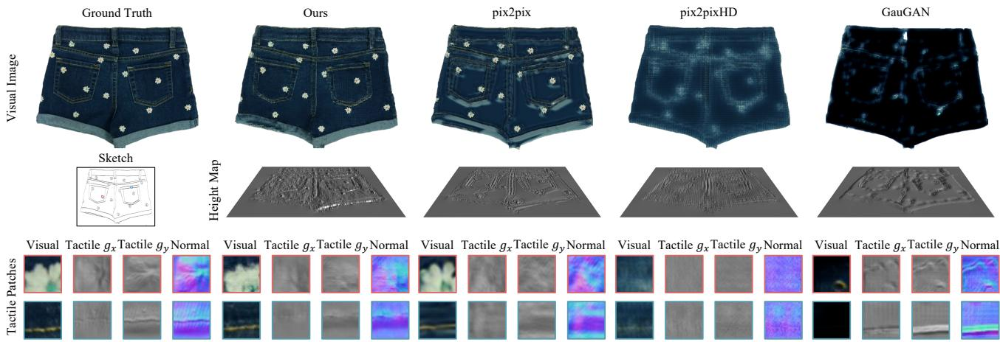  
Figure 6: Qualitative comparisons with baselines. We compare our method with the pix2pix [28], pix2pixHD [76], and GauGAN [51]. For each method, we show the visual output (top) and the rendering of their height maps (middle). We also present two zoom-in patches in color-coded bounding boxes (bottom), paired with the visual crop, tactile surface gradients, and the normal map.

<table><tr><td rowspan="2">Method</td><td colspan="2">Visual</td><td colspan="2">Tactile</td></tr><tr><td>LPIPS↓</td><td>SIFID↓</td><td>LPIPS↓</td><td>SIFID↓</td></tr><tr><td>Ours</td><td>0.070</td><td>0.029</td><td>0.676</td><td>0.104</td></tr><tr><td>Pix2pix [28]</td><td>0.173</td><td>0.115</td><td>1.028</td><td>0.247</td></tr><tr><td>Pix2pixHD [76]</td><td>0.161</td><td>0.289</td><td>0.753</td><td>0.458</td></tr><tr><td>GauGAN [51]</td><td>0.189</td><td>0.252</td><td>1.034</td><td>0.286</td></tr></table>

Table 1: Baseline comparisons. Our method outperforms all baselines regarding both perceptual realism measured by LPIPS [90] and texture consistency measured by SIFID [65].

<table><tr><td rowspan="2">Method</td><td colspan="2">Visual</td><td colspan="2">Tactile</td></tr><tr><td>LPIPS↓</td><td>SIFID↓</td><td>LPIPS↓</td><td>SIFID↓</td></tr><tr><td>Ours</td><td>0.070</td><td>0.029</td><td>0.676</td><td>0.104</td></tr><tr><td>Ours w/o  $\mathcal { L } _ { \mathrm { c G A N } }$ </td><td>0.113</td><td>0.115</td><td>0.687</td><td>0.107</td></tr><tr><td>Ours w/o  ${ \mathcal { L } } _ { \mathrm { r e c } }$ </td><td>0.084</td><td>0.079</td><td>1.035</td><td>0.260</td></tr></table>

Table 2: Ablation study of loss components. We compare our full method with two variants: Ours w/o $\mathcal { L } _ { \mathrm { c G A N } }$ (w/o conditional GAN losses) and $\mathcal { L } _ { \mathrm { r e c } }$ (w/o image reconstruction loss). Our full method outperforms these variants regarding multiple metrics.

Qualitative comparisons. Figure 6 provides an example of qualitative comparisons with baselines. For each method, the first row shows the full-scale visual output; the second row shows the reconstructed 3D height map; the third row shows some sampled patches in visual, grayscale $g _ { x } , g _ { y }$ , and derived surface normal formats. Our method can successfully capture the prominent geometric features, such as pockets and flower-pattern decorations, and the local geometry de tails of the material textures. In contrast, baselines can only capture some prominent geometric features but miss local texture details and generate color artifacts. Please refer to our arxiv version for more visual results.

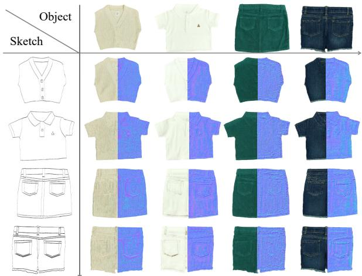  
Figure 7: Sketch and material swapping. Our model can synthesize vision and touch images for both known and unseen sketches. For each output, we show visual output on the left half and a normal map of tactile output on the right half.

Generation using unseen sketch images. Our visualtactile synthesis model trained on a single sketch image can be generalized to new sketch inputs, allowing users to edit and customize their sketches for fast design and prototyping. Since we train one model per object, we show the testing results using sketches of unseen objects in Figure 7. Each row corresponds to one testing sketch, and each column represents a model trained on one object. We visualize results by showing the visual image on the left and the normal map on the right. The visual and tactile outputs are well aligned and maintain fine-scale material texture details for each model. Our method can adapt to the global geometry information, including the edges and pockets of new sketch inputs.

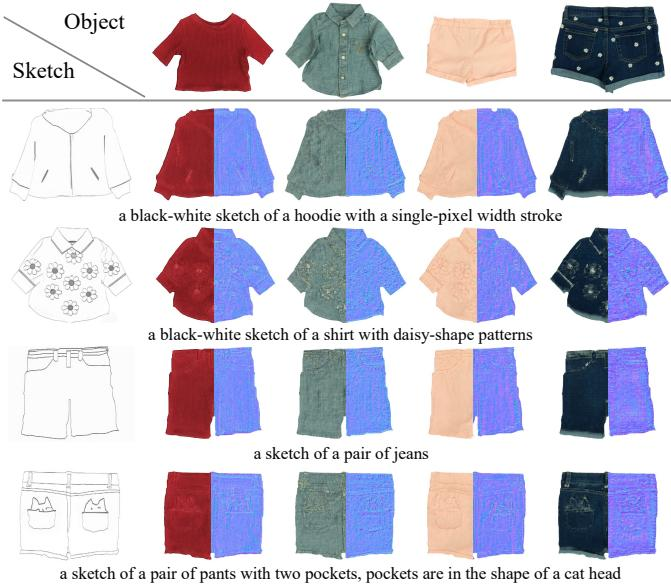  
Figure 8: Text-conditioned visual-tactile synthesis. We use DALL·E2 [55], a text-to-image model, to modify the original sketch designs via text-based image inpainting. We then synthesize both visual (left) and tactile (right) outputs using edited sketches. The text prompts are included below each image.

Text-based visual-tactile synthesis. We also extend our method to synthesizing visual-tactile outputs given both sketches and text prompts. We use DALL·E2 [55] to cre ate variations of an original sketch and then feed the edited sketches to our conditional generative models. Figure 8 shows examples of text-based synthesis with text prompts. Even when trained on a single sketch, our model can reasonably generalize to unseen sketches with varying strokes and shapes while capturing the visual and tactile features of the original material.

Ablation studies. We run ablations on each loss component to inspect their effects on the training objective. Table 2 shows that removing either adversarial loss or reconstruction loss for visual and tactile synthesis together increases LPIPS errors and SIFID metric. Qualitatively, we observe overly smooth images after removing adversarial loss and checkerboard artifacts after removing reconstruction loss.

Human perceptual study for visual images. We perform a human perceptual study using Amazon Mechanical Turk (AMTurk). We do a paired test with the question - “Which image do you think is more realistic?”. Each user has five practice rounds followed by 30 test rounds to evaluate our method against pix2pix, pix2pixHD, GauGAN, Ours w/o $\mathcal { L } _ { \mathrm { c G A N } }$ , and Ours w/o $\mathcal { L } _ { \mathrm { r e c } }$ . All samples are randomly selected and permuted, and we collect 1,500 responses. As shown in Figure 9a, our method is preferred over all baselines, even compared to Ours w/o $\mathcal { L } _ { \mathrm { c G A N } }$ and Ours w/o $\mathcal { L } _ { \mathrm { r e c } } .$ , which shows the importance of each loss term.

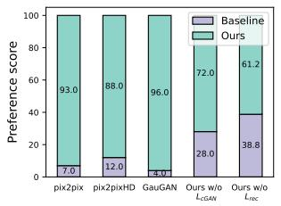  
(a) Bar plot for visual user study.

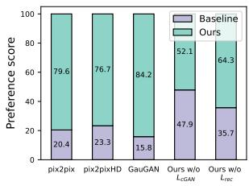  
(b) Bar plot for haptic user study.  
Figure 9: Human perceptual study. For each paired comparison, our method is preferred (≥ 50%) over the baseline for both visual and haptic output.

Human perceptual study for haptic rendering. We also conduct in-person psychophysical experiments to evaluate the perceived fidelity of the generated haptic output, following conventions in prior works [23, 13]. Figure 10 shows the setup and our website video shows an example of user interaction.

In each round, the participant is presented with a real garment on the table and two rendering outputs side by side on the TanvasTouch screen. The two renderings have the same ground-truth visuals but different haptic outputs. One is generated by our method, and the other is generated by one of the baselines (pix2pix, pix2pixHD, and GauGAN).

The participants are asked to slide their index finger of the dominant hand on the TanvasTouch screen to explore the full area of rendered clothes and slide on the real clothes, freely switching back and forth with any force and velocity as desired. We ask them “Which rendering do you feel better matches the real object material?” and they select a preferred one within one minute.

Before each experiment, the participants are asked to complete a training session, which includes a brief introduction to the TanvasTouch device and a quick demo to render homogeneous textures provided by TanvasIntro App, an official demo designed by Tanvas Inc ®. These steps can help familiarize the participants with how the device works and what type of rendering feedback they would expect.

We sample one garment object from the TouchClothing dataset for a warm-up and leave the rest of the unseen objects for testing, following Richardson et al. [57]. The warm-up and testing follow the same protocol described above, except that the warm-up session is not timed so the participants have enough time to explore the device. To prevent user fatigue, we randomly select 5 out of 19 unseen objects for each testing session and report the averaged results. Each experiment lasts approximately 60 minutes.

Twenty people, 13 male and 7 female, with an average of 24.1 years (SD: 2.1), participated in the experiments. Our study has obtained approval from the Institutional Review Board (IRB) with ID STUDY2022 00000263. All participants have provided informed consent and received compensation at 15 USD per hour.

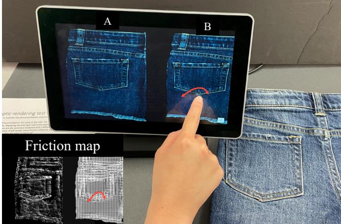  
Figure 10: Experiment setup for the user study. We perform an A/B test comparing the haptic output of our method and one of the baselines. The lower left corner shows the rendered haptic signal (friction map). The real garment is put on one side for reference.

Figure 9b shows the quantitative results. Participants strongly favor our method over all other baselines (chance is 50%). 76.7% of the participants prefer our method to pix2pixHD; compared with pix2pix and GauGAN, our method has a larger advantage, winning 79.6% and 84.2% of the participants, respectively. It is harder for users to distinguish the ablated models, but our method still beats Ours w/o $\mathcal { L } _ { \mathrm { c G A N } }$ and Ours w/o ${ \mathcal { L } } _ { \mathrm { r e c } } ,$ , by 52.1% and 64.3% respectively. The user study results are consistent with the quantitative evaluation using various metrics shown in Table 1.

Post-experiment interviews also reveal that materials with strong textures, such as denim and cotton pique, feel more realistic than fluffy materials, such as fleece and velvet. Users also consider the result realistic when there are noticeable differences at pocket edges, perceptible uniform texture in flat regions, and different feels in visually distinct areas (collars, flower decorations, buttons, etc.).

It is understandable, considering that TanvasTouch excels at rendering rigid and macroscale textures (∼5-10 mm) via friction modulation but struggles to render the softness and microscale dynamics (∼0.5-1 mm) of the material.

## 6. Discussion and Limitations

In this work, we presented a new method for automatically synthesizing visual and tactile images according to user inputs such as sketch and text. We used a high-resolution tactile sensor GelSight to capture the high-fidelity local geometry of objects. We then proposed a new conditional GAN model to generate visual and tactile output given a single sketch image. Finally, we introduced a pipeline to render visual and tactile outputs on the TanvasTouch touchscreen.

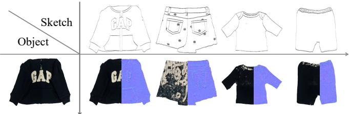  
Figure 11: Failure cases. Our method struggles when the training object and testing sketch exhibit vastly different patterns. For example, given a hoodie with large letter patterns, our model reconstructs the training object (1st column) but fails to fill in the color within the flower pattern (2nd column) or to generate uniform texture around the neckline (3rd column) or the waistband (4th column).

Our visual-tactile synthesis method can be used for different materials and objects, providing users with more immersive experience when exploring virtual objects.

Limitations. First, as shown in Figure 11, distinctive patterns, such as enclosed letters, remain challenging. Our model fails to generalize those distinctive patterns to other user sketches. Second, as touch is an active perception, rendering performance relies on specific hardware capacity. In this work, the surface haptic device excels at friction rendering, particularly suitable for flat clothes with fine textures. Nevertheless, it is challenging to render soft objects like sponges or 3D objects with substantial surface normal changes, such as an apple, on the same device.

Finally, since tactile data are collected during static touch and the rendering device mainly focuses on friction force, we can render roughness well but have limited capacity to render softness.

Societal impacts. Controllable visual-tactile synthesis for haptic rendering is a new research problem that has yet to be explored extensively. We take the first step to address the modeling challenge and deploy our model to the latest hardware. Ultimately, we hope our work will facilitate multimodal synthesis with generative models in applications such as online shopping, virtual reality, telepresence, and teleoperation.

Acknowledgment. We thank Sheng-Yu Wang, Kangle Deng, Muyang Li, Aniruddha Mahapatra, and Daohan Lu for proofreading the draft. We are also grateful to Sheng-Yu Wang, Nupur Kumari, Gaurav Parmar, George Cazenavette, and Arpit Agrawal for their helpful comments and discussion. Additionally, we thank Yichen Li, Xiaofeng Guo, and Fujun Ruan for their help with the hardware setup. Ruihan Gao is supported by A\*STAR National Science Scholarship (Ph.D.). The project is supported in part by a Google Research grant.

## References

[1] Badour Albahar, Jingwan Lu, Jimei Yang, Zhixin Shu, Eli Shechtman, and Jia-Bin Huang. Pose with style: Detailpreserving pose-guided image synthesis with conditional stylegan. ACM Transactions on Graphics (TOG), 40(6):1–11, 2021. 2

[2] Samaneh Azadi, Michael Tschannen, Eric Tzeng, Sylvain Gelly, Trevor Darrell, and Mario Lucic. Semantic bottleneck scene generation. arXiv preprint arXiv:1911.11357, 2019. 2

[3] Elham Beheshti, Katya Borgos-Rodriguez, and Anne Marie Piper. Supporting parent-child collaborative learning through haptic feedback displays. In ACM International Conference on Interaction Design and Children (IDC), 2019. 2

[4] Amit Bhardwaj, Hojun Cha, and Seungmoon Choi. Datadriven haptic modeling of normal interactions on viscoelastic deformable objects using a random forest. IEEE Robotics and Automation Letters (RA-L), 4(2):1379–1386, 2019. 2

[5] Jeremy Birnholtz, Darren Gergle, Noah Liebman, and Sarah Sinclair. Feeling aware: Investigating the use of a mobile variable-friction tactile display for awareness information. In International Conference on Human-Computer Interaction with Mobile Devices and Services (MobileHCI), 2015. 2

[6] Ser´ ena Bochereau, Stephen Sinclair, and Vincent Hayward.´ Perceptual constancy in the reproduction of virtual tactile textures with surface displays. ACM Transactions on Applied Perception (TAP), 15(2), 2018. 2

[7] David Arthur Burns, Roberta L Klatzky, Michael A Peshkin, and J Edward Colgate. Spatial perception of textures depends on length-scale. In IEEE World Haptics Conference (WHC), 2021. 2

[8] Shaoyu Cai, Lu Zhao, Yuki Ban, Takuji Narumi, Yue Liu, and Kening Zhu. Gan-based image-to-friction generation for tactile simulation of fabric material. Computers & Graphics, 102:460–473, 2022. 2

[9] Shaoyu Cai, Kening Zhu, Yuki Ban, and Takuji Narumi. Visual-tactile cross-modal data generation using residuefusion gan with feature-matching and perceptual losses. IEEE Robotics and Automation Letters (RA-L), 6(4):7525–7532, 2021. 2

[10] Roberto Calandra, Andrew Owens, Dinesh Jayaraman, Justin Lin, Wenzhen Yuan, Jitendra Malik, Edward H Adelson, and Sergey Levine. More than a feeling: Learning to grasp and regrasp using vision and touch. IEEE Robotics and Automation Letters (RA-L), 3(4):3300–3307, 2018. 2

[11] Roberto Calandra, Andrew Owens, Manu Upadhyaya, Wenzhen Yuan, Justin Lin, Edward H Adelson, and Sergey Levine. The feeling of success: Does touch sensing help predict grasp outcomes? Conference on Robot Learning (CoRL), 2017. 2

[12] Guanqun Cao, Jiaqi Jiang, Ningtao Mao, Danushka Bollegala, Min Li, and Shan Luo. Vis2hap: Vision-based haptic rendering by cross-modal generation. IEEE International Conference on Robotics and Automation (ICRA), 2023. 2

[13] Afonso Castic¸o and Paulo Cardoso. Usability tests for texture comparison in an electroadhesion-based haptic device. Multimodal Technologies and Interaction, 6(12):108, 2022. 8

[14] Jooyoung Choi, Sungwon Kim, Yonghyun Jeong, Youngjune Gwon, and Sungroh Yoon. Ilvr: Conditioning method for de-

noising diffusion probabilistic models. In IEEE International Conference on Computer Vision (ICCV), 2021. 2

[15] J. Edward Colgate and Michael Peshkin. Tanvas - surface haptic technology and products. https://tanvas.co/, 2022. 1, 2, 4

[16] Heather Culbertson and Katherine J Kuchenbecker. Importance of matching physical friction, hardness, and texture in creating realistic haptic virtual surfaces. IEEE Transactions on Haptics (ToH), 10(1), 2016. 2

[17] Heather Culbertson, Joseph M Romano, Pablo Castillo, Max Mintz, and Katherine J Kuchenbecker. Refined methods for creating realistic haptic virtual textures from tool-mediated contact acceleration data. In IEEE Haptics Symposium (HAP-TICS), 2012. 2

[18] Heather Culbertson, Juliette Unwin, Benjamin E Goodman, and Katherine J Kuchenbecker. Generating haptic texture models from unconstrained tool-surface interactions. In IEEE World Haptics Conference (WHC), 2013. 2

[19] Laurent Dinh, Jascha Sohl-Dickstein, and Samy Bengio. Density estimation using real nvp. arXiv preprint arXiv:1605.08803, 2016. 2

[20] M. Fischler and R. Bolles. Random sample consensus: A paradigm for model fitting with applications to image analysis and automated cartography. Communications of the ACM, 24(6):381–395, 1981. 3

[21] Rebecca Fenton Friesen, Roberta L Klatzky, Michael A Peshkin, and J Edward Colgate. Building a navigable fine texture design space. IEEE Transactions on Haptics (ToH), 14(4), 2021. 6

[22] Ian Goodfellow, Jean Pouget-Abadie, Mehdi Mirza, Bing Xu, David Warde-Farley, Sherjil Ozair, Aaron Courville, and Yoshua Bengio. Generative adversarial nets. Conference on Neural Information Processing Systems (NeurIPS), 2014. 2

[23] Roman V Grigorii, Roberta L Klatzky, and J Edward Colgate. Data-driven playback of natural tactile texture via broadband friction modulation. IEEE Transactions on Haptics (ToH), 15(2):429–440, 2021. 8

[24] Xintong Han, Zuxuan Wu, Zhe Wu, Ruichi Yu, and Larry S Davis. Viton: An image-based virtual try-on network. In IEEE Conference on Computer Vision and Pattern Recognition (CVPR), 2018. 2

[25] Jonathan Ho, William Chan, Chitwan Saharia, Jay Whang, Ruiqi Gao, Alexey Gritsenko, Diederik P Kingma, Ben Poole, Mohammad Norouzi, David J Fleet, et al. Imagen video: High definition video generation with diffusion models. arXiv preprint arXiv:2210.02303, 2022. 2

[26] Jonathan Ho, Ajay Jain, and Pieter Abbeel. Denoising diffusion probabilistic models. In Conference on Neural Information Processing Systems (NeurIPS), 2020. 2

[27] Xun Huang, Arun Mallya, Ting-Chun Wang, and Ming-Yu Liu. Multimodal conditional image synthesis with productof-experts gans. European Conference on Computer Vision (ECCV), 2021. 2

[28] Phillip Isola, Jun-Yan Zhu, Tinghui Zhou, and Alexei A Efros. Image-to-image translation with conditional adversarial networks. In IEEE Conference on Computer Vision and Pattern Recognition (CVPR), 2017. 1, 2, 3, 4, 5, 6, 7

[29] Justin Johnson, Alexandre Alahi, and Li Fei-Fei. Perceptual losses for real-time style transfer and super-resolution. In European Conference on Computer Vision (ECCV), 2016. 6

[30] Tero Karras, Samuli Laine, and Timo Aila. A style-based generator architecture for generative adversarial networks. In IEEE Conference on Computer Vision and Pattern Recognition (CVPR), 2019. 1

[31] Justin Kerr, Huang Huang, Albert Wilcox, Ryan Hoque, Jeffrey Ichnowski, Roberto Calandra, and Ken Goldberg. Learning self-supervised representations from vision and touch for active sliding perception of deformable surfaces. arXiv preprint arXiv:2209.13042, 2022. 2

[32] Diederik P Kingma and Jimmy Ba. Adam: A method for stochastic optimization. In International Conference on Learning Representations (ICLR), 2015. 2

[33] Roberta L Klatzky, Amukta Nayak, Isobel Stephen, Dean Dijour, and Hong Z Tan. Detection and identification of pattern information on an electrostatic friction display. IEEE Transactions on Haptics (ToH), 12(4):665–670, 2019. 2

[34] Nupur Kumari, Richard Zhang, Eli Shechtman, and Jun-Yan Zhu. Ensembling off-the-shelf models for gan training. In IEEE Conference on Computer Vision and Pattern Recogni tion (CVPR), 2022. 5

[35] Michelle A Lee, Yuke Zhu, Krishnan Srinivasan, Parth Shah, Silvio Savarese, Li Fei-Fei, Animesh Garg, and Jeannette Bohg. Making sense of vision and touch: Self-supervised learning of multimodal representations for contact-rich tasks. In IEEE International Conference on Robotics and Automation (ICRA), 2019. 2

[36] Kathleen M Lewis, Srivatsan Varadharajan, and Ira Kemelmacher-Shlizerman. Tryongan: Body-aware try-on via layered interpolation. ACM Transactions on Graphics (TOG), 40(4):1–10, 2021. 2

[37] Daiqing Li, Junlin Yang, Karsten Kreis, Antonio Torralba, and Sanja Fidler. Semantic segmentation with generative models: Semi-supervised learning and strong out-of-domain generalization. In IEEE Conference on Computer Vision and Pattern Recognition (CVPR), 2021. 2

[38] Rui Li, Robert Platt, Wenzhen Yuan, Andreas ten Pas, Nathan Roscup, Mandayam A Srinivasan, and Edward Adelson. Localization and manipulation of small parts using gelsight tactile sensing. In IEEE/RSJ International Conference on Intelligent Robots and Systems (IROS), 2014. 2

[39] Yunzhu Li, Jun-Yan Zhu, Russ Tedrake, and Antonio Torralba. Connecting touch and vision via cross-modal prediction. In IEEE Conference on Computer Vision and Pattern Recognition (CVPR), 2019. 2

[40] Justin Lin, Roberto Calandra, and Sergey Levine. Learning to identify object instances by touch: Tactile recognition via multimodal matching. In IEEE International Conference on Robotics and Automation (ICRA), 2019. 2

[41] Ming-Yu Liu, Thomas Breuel, and Jan Kautz. Unsupervised image-to-image translation networks. Conference on Neural Information Processing Systems (NeurIPS), 2017. 2

[42] Yiyue Luo, Yunzhu Li, Pratyusha Sharma, Wan Shou, Kui Wu, Michael Foshey, Beichen Li, Tomas Palacios, Antonio Tor-´ ralba, and Wojciech Matusik. Learning human–environment

interactions using conformal tactile textiles. Nature Electronics, 4(3):193–201, 2021. 2

[43] Steven G Manuel, Roberta L Klatzky, Michael A Peshkin, and James Edward Colgate. Coincidence avoidance principle in surface haptic interpretation. Proceedings ofthe National Academy ofSciences, 112(8), 2015. 6

[44] Chenlin Meng, Yutong He, Yang Song, Jiaming Song, Jiajun Wu, Jun-Yan Zhu, and Stefano Ermon. Sdedit: Guided image synthesis and editing with stochastic differential equations. In International Conference on Learning Representations (ICLR), 2022. 2

[45] Ben Mildenhall, Pratul P Srinivasan, Matthew Tancik, Jonathan T Barron, Ravi Ramamoorthi, and Ren Ng. Nerf: Representing scenes as neural radiance fields for view syn thesis. In European Conference on Computer Vision (ECCV), 2020. 1

[46] Mehdi Mirza and Simon Osindero. Conditional generative adversarial nets. arXiv preprint arXiv:1411.1784, 2014. 2, 4

[47] Atsuhiro Noguchi and Tatsuya Harada. Rgbd-gan: Unsupervised 3d representation learning from natural image datasets via rgbd image synthesis. International Conference on Learning Representations (ICLR), 2020. 2

[48] Reza Haghighi Osgouei, Sunghwan Shin, Jin Ryong Kim, and Seungmoon Choi. An inverse neural network model for data-driven texture rendering on electrovibration display. In IEEE Haptics Symposium (HAPTICS), pages 270–277. IEEE, 2018. 2

[49] Jeong Joon Park, Peter Florence, Julian Straub, Richard Newcombe, and Steven Lovegrove. Deepsdf: Learning continuous signed distance functions for shape representation. In IEEE Conference on Computer Vision and Pattern Recognition (CVPR), 2019. 2

[50] Taesung Park, Alexei A Efros, Richard Zhang, and Jun-Yan Zhu. Contrastive learning for unpaired image-to-image translation. In European Conference on Computer Vision (ECCV), 2020. 4

[51] Taesung Park, Ming-Yu Liu, Ting-Chun Wang, and Jun-Yan Zhu. Semantic image synthesis with spatially-adaptive normalization. In IEEE Conference on Computer Vision and Pattern Recognition (CVPR), 2019. 1, 2, 6, 7

[52] Taesung Park, Jun-Yan Zhu, Oliver Wang, Jingwan Lu, Eli Shechtman, Alexei Efros, and Richard Zhang. Swapping autoencoder for deep image manipulation. Conference on Neural Information Processing Systems (NeurIPS), 33:7198– 7211, 2020. 6

[53] Xavier Soria Poma, Edgar Riba, and Angel Sappa. Dense extreme inception network: Towards a robust cnn model for edge detection. In IEEE/CVF Winter Conference on Applications ofComputer Vision (WACV), 2020. 3, 4

[54] Alec Radford, Jong Wook Kim, Chris Hallacy, Aditya Ramesh, Gabriel Goh, Sandhini Agarwal, Girish Sastry, Amanda Askell, Pamela Mishkin, Jack Clark, et al. Learning transferable visual models from natural language supervision. In International Conference on Machine Learning (ICML), 2021. 5

[55] Aditya Ramesh, Prafulla Dhariwal, Alex Nichol, Casey Chu, and Mark Chen. Hierarchical text-conditional image genera-

tion with clip latents. arXiv preprint arXiv:2204.06125, 2022. 1, 2, 8

[56] Aditya Ramesh, Mikhail Pavlov, Gabriel Goh, Scott Gray, Chelsea Voss, Alec Radford, Mark Chen, and Ilya Sutskever. Zero-shot text-to-image generation. In International Conference on Machine Learning (ICML), 2021. 2

[57] Benjamin A Richardson, Yasemin Vardar, Christian Wallraven, and Katherine J Kuchenbecker. Learning to feel textures: Predicting perceptual similarities from unconstrained finger-surface interactions. IEEE Transactions on Haptics (ToH), 2022. 8

[58] Joseph M Romano and Katherine J Kuchenbecker. Creating realistic virtual textures from contact acceleration data. IEEE Transactions on Haptics (ToH), 5(2):109–119, 2011. 2

[59] Robin Rombach, Andreas Blattmann, Dominik Lorenz, Patrick Esser, and Bjorn Ommer. High-resolution image¨ synthesis with latent diffusion models. In IEEE Conference on Computer Vision and Pattern Recognition (CVPR), 2022. 1, 2

[60] Olaf Ronneberger, Philipp Fischer, and Thomas Brox. U-net: Convolutional networks for biomedical image segmentation. In International Conference on Medical image computing and computer-assisted intervention (MICCCAI), 2015. 6

[61] Bushra Sadia, Ayberk Sadic, Mehmet Ayyildiz, and Cagatay Basdogan. Exploration strategies for tactile graphics displayed by electrovibration on a touchscreen. International Journal ofHuman-Computer Studies, 160:102760, 2022. 2

[62] Chitwan Saharia, William Chan, Huiwen Chang, Chris Lee, Jonathan Ho, Tim Salimans, David Fleet, and Mohammad Norouzi. Palette: Image-to-image diffusion models. In ACM SIGGRAPH, 2022. 2

[63] Chitwan Saharia, William Chan, Saurabh Saxena, Lala Li, Jay Whang, Emily Denton, Seyed Kamyar Seyed Ghasemipour, Burcu Karagol Ayan, S Sara Mahdavi, Rapha Gontijo Lopes, et al. Photorealistic text-to-image diffusion models with deep language understanding. Conference on Neural Information Processing Systems (NeurIPS), 2022. 2

[64] Patsorn Sangkloy, Jingwan Lu, Chen Fang, Fisher Yu, and James Hays. Scribbler: Controlling deep image synthesis with sketch and color. In IEEE Conference on Computer Vision and Pattern Recognition (CVPR), 2017. 2

[65] Tamar Rott Shaham, Tali Dekel, and Tomer Michaeli. Singan: Learning a generative model from a single natural image. In IEEE International Conference on Computer Vision (ICCV), 2019. 4, 6, 7

[66] Sunghwan Shin, Reza Haghighi Osgouei, Ki-Duk Kim, and Seungmoon Choi. Data-driven modeling of isotropic haptic textures using frequency-decomposed neural networks. In IEEE World Haptics Conference (WHC), 2015. 2

[67] Assaf Shocher, Shai Bagon, Phillip Isola, and Michal Irani. Ingan: Capturing and retargeting the” dna” of a natural image. In IEEE International Conference on Computer Vision (ICCV), 2019. 4

[68] Craig Shultz, Michael Peshkin, and J Edward Colgate. The application of tactile, audible, and ultrasonic forces to human fingertips using broadband electroadhesion. IEEE Transactions on Haptics (ToH), 11(2):279–290, 2018. 2

[69] Yang Song, Jascha Sohl-Dickstein, Diederik P Kingma, Abhishek Kumar, Stefano Ermon, and Ben Poole. Score-based generative modeling through stochastic differential equations. International Conference on Learning Representations (ICLR), 2021. 2

[70] Subramanian Sundaram, Petr Kellnhofer, Yunzhu Li, Jun-Yan Zhu, Antonio Torralba, and Wojciech Matusik. Learning the signatures of the human grasp using a scalable tactile glove. Nature, 569(7758):698–702, 2019. 2

[71] A. Tewari, O. Fried, J. Thies, V. Sitzmann, S. Lombardi, K. Sunkavalli, R. Martin-Brualla, T. Simon, J. Saragih, M. Nießner, R. Pandey, S. Fanello, G. Wetzstein, J.-Y. Zhu, C. Theobalt, M. Agrawala, E. Shechtman, D. B Goldman, and M. Zollhofer. State of the Art on Neural Rendering.¨ CoRR, 2020. 1

[72] Stephen Tian, Frederik Ebert, Dinesh Jayaraman, Mayur Mudigonda, Chelsea Finn, Roberto Calandra, and Sergey Levine. Manipulation by feel: Touch-based control with deep predictive models. In IEEE International Conference on Robotics and Automation (ICRA), 2019. 2

[73] Nontawat Tritrong, Pitchaporn Rewatbowornwong, and Supasorn Suwajanakorn. Repurposing gans for one-shot semantic part segmentation. In IEEE Conference on Computer Vision and Pattern Recognition (CVPR), 2021. 2

[74] Aaron Van den Oord, Nal Kalchbrenner, Lasse Espeholt, Oriol Vinyals, Alex Graves, et al. Conditional image generation with pixelcnn decoders. Conference on Neural Information Processing Systems (NeurIPS), 29, 2016. 2

[75] Shaoxiong Wang, Yu She, Branden Romero, and Edward Adelson. Gelsight wedge: Measuring high-resolution 3d contact geometry with a compact robot finger. In IEEE International Conference on Robotics and Automation (ICRA), 2021. 2, 3

[76] Ting-Chun Wang, Ming-Yu Liu, Jun-Yan Zhu, Andrew Tao, Jan Kautz, and Bryan Catanzaro. High-resolution image synthesis and semantic manipulation with conditional gans. In IEEE Conference on Computer Vision and Pattern Recognition (CVPR), 2018. 2, 5, 6, 7

[77] Xiaolong Wang and Abhinav Gupta. Generative image modeling using style and structure adversarial networks. In European Conference on Computer Vision (ECCV), 2016. 2

[78] Zhou Wang, Alan C Bovik, Hamid R Sheikh, and Eero P Simoncelli. Image quality assessment: from error visibility to structural similarity. IEEE Transactions on Image Processing (TIP), 13(4):600–612, 2004. 6

[79] Youngsun Wi, Pete Florence, Andy Zeng, and Nima Fazeli. Virdo: Visio-tactile implicit representations of deformable objects. IEEE International Conference on Robotics and Automation (ICRA), 2022. 2

[80] Rui Xu, Xintao Wang, Kai Chen, Bolei Zhou, and Chen Change Loy. Positional encoding as spatial inductive bias in gans. In IEEE Conference on Computer Vision and Pattern Recognition (CVPR), 2021. 6

[81] Fengyu Yang, Chenyang Ma, Jiacheng Zhang, Jing Zhu, Wenzhen Yuan, and Andrew Owens. Touch and go: Learning from human-collected vision and touch. Conference on Neural Information Processing Systems (NeurIPS), 2022. 2

[82] Sunghoon Yim, Seokhee Jeon, and Seungmoon Choi. Datadriven haptic modeling and rendering of viscoelastic and frictional responses of deformable objects. IEEE Transactions on Haptics (ToH), 9(4):548–559, 2016. 2

[83] Jiahui Yu, Yuanzhong Xu, Jing Yu Koh, Thang Luong, Gunjan Baid, Zirui Wang, Vijay Vasudevan, Alexander Ku, Yinfei Yang, Burcu Karagol Ayan, et al. Scaling autoregressive models for content-rich text-to-image generation. Transactions on Machine Learning Research (TMLR), 2022. 2

[84] Wenzhen Yuan, Siyuan Dong, and Edward H Adelson. Gelsight: High-resolution robot tactile sensors for estimating geometry and force. Sensors, 2017. 2, 3, 4

[85] Wenzhen Yuan, Rui Li, Mandayam A Srinivasan, and Edward H Adelson. Measurement of shear and slip with a gelsight tactile sensor. In IEEE International Conference on Robotics and Automation (ICRA), 2015. 2

[86] Wenzhen Yuan, Mandayam A Srinivasan, and Edward H Adelson. Estimating object hardness with a gelsight touch sensor. In IEEE/RSJ International Conference on Intelligent Robots and Systems (IROS), 2016. 2

[87] Wenzhen Yuan, Shaoxiong Wang, Siyuan Dong, and Edward Adelson. Connecting look and feel: Associating the visual and tactile properties of physical materials. In IEEE Conference on Computer Vision and Pattern Recognition (CVPR), 2017. 2

[88] Wenzhen Yuan, Chenzhuo Zhu, Andrew Owens, Mandayam A Srinivasan, and Edward H Adelson. Shapeindependent hardness estimation using deep learning and a gelsight tactile sensor. In IEEE International Conference on Robotics and Automation (ICRA), 2017. 2

[89] Qiang Zhang, Yunzhu Li, Yiyue Luo, Wan Shou, Michael Foshey, Junchi Yan, Joshua B Tenenbaum, Wojciech Matusik, and Antonio Torralba. Dynamic modeling of hand-object interactions via tactile sensing. In IEEE/RSJ International Conference on Intelligent Robots and Systems (IROS), 2021. 2

[90] Richard Zhang, Phillip Isola, Alexei A Efros, Eli Shechtman, and Oliver Wang. The unreasonable effectiveness of deep features as a perceptual metric. In IEEE Conference on Computer Vision and Pattern Recognition (CVPR), 2018. 5, 6, 7

[91] Yuxuan Zhang, Huan Ling, Jun Gao, Kangxue Yin, Jean-Francois Lafleche, Adela Barriuso, Antonio Torralba, and Sanja Fidler. Datasetgan: Efficient labeled data factory with minimal human effort. In IEEE Conference on Computer Vision and Pattern Recognition (CVPR), 2021. 2

[92] Jun-Yan Zhu, Taesung Park, Phillip Isola, and Alexei A Efros. Unpaired image-to-image translation using cycle-consistent adversarial networks. In IEEE Conference on Computer Vi sion and Pattern Recognition (CVPR), 2017. 2

[93] Peihao Zhu, Rameen Abdal, Yipeng Qin, and Peter Wonka. Sean: Image synthesis with semantic region-adaptive normalization. In IEEE Conference on Computer Vision and Pattern Recognition (CVPR), 2020. 2