# Cross-modal Latent Space Alignment for Image to Avatar Translation

Manuel Ladron de Guevara Carnegie Mellon University rldg.manuel@gmail.com

Yannick Hold-Geoffroy Adobe Research holdgeof@adobe.com

Jose Echevarria Adobe Research

Cameron Smith Adobe Research casmith@adobe.com

Yijun Li Adobe Research yijli@adobe.com

Daichi Ito Adobe Research dito@adobe.com

## Abstract

We present a novel method for automatic vectorized avatar generation from a single portrait image. Most existing approaches that create avatars rely on image-to-image translation methods, which present some limitations when applied to 3D rendering, animation, or video. Instead, we leverage modality-specific autoencoders trained on largescale unpaired portraits and parametric avatars, and then learn a mapping between both modalities via an alignment module trained on a significantly smaller amount of data. The resulting cross-modal latent space preserves facial identity, producing more visually appealing and higher fidelity avatars than previous methods, as supported by our quantitative and qualitative evaluations. Moreover, our method’s virtue of being resolution-independent makes it highly versatile and applicable in a wide range of settings.

## 1. Introduction

An avatar can be defined as a digital representation or virtual character by which people represent themselves and other beings in a virtual platform or community [4]. Such a representation has been ubiquitous in our daily life, from personal use on social media to marketing strategies by companies [23]. Given an image and a style, the task is to generate a new representation that successfully conveys a given style and content while preserving the person’s identity as much as possible.

Nowadays, avatars are typically created in two ways. First, it can be created by skilled artists. To streamline the avatar creation, many artists use predefined facial presets from a library and combine them part by part to obtain the final avatar (e.g., the “manual” results from [33]). This scheme is commonly used for messaging and video games avatars. However, it can be a tedious process that frequently alters the subject’s identity due to the limited predefined assets. In contrast, automatic image generation has been employed as a time-efficient and large-scale alternative for this task. Those methods typically focus on caricature generation [3, 29, 7, 17, 11, 35]. While such methods could translate real photography to an avatar or caricature, they all operate in image space, which poses some limitations when used in virtual environments or for animations.

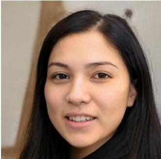

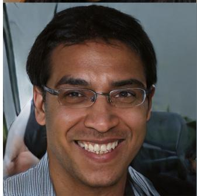

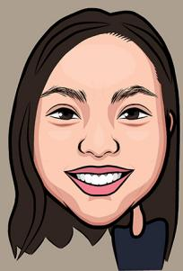

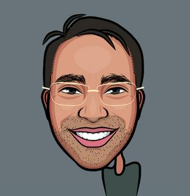

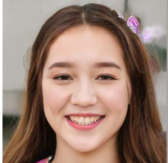  
(a) Input

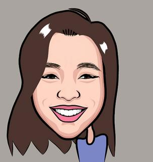  
(b) Generated avatar  
Figure 1. Examples images from a test set (a), parametric avatars generated by our method (b).

Parametric vector graphics propose a solution that overcomes the drawbacks of static images to some extent. In particular, Wolf et al. [33] propose a tied output synthesis network to infer parameters from generated image avatars, but their method works with very simple datasets like face emoji [31], which avoids the matter of stylization. Hu et al. [9] and Shi et al. [27, 28] focus on 3D photorealisticlooking avatars. However, these works do not focus on capturing a specific style, nor producing 2D parametric avatars.

In this paper, we propose an alternative to image-based avatars that enables animations and video compositing without losing quality or resolution. To do so, we utilize a parametric representation to depict avatars; that is, we employ a set of parameters that define each facial attribute. To train such an approach in a supervised way requires a dataset of paired portraits and their respective avatars, which is prohibitively expensive to obtain. To address this, we present a weakly-supervised novel cross-modal alignment framework that translates rich representations from the portrait domain to the parametric avatar domain. To alleviate the lack of paired data, we first learn modality-specific latent spaces from large-scale unpaired data. Once such latent spaces are learned, we match their latent representations by a cross-modal module trained on a small amount of paired data, which preserves the facial identity from the portrait and the style of the parametric avatar. As a result, our framework is able to translate identity features in image space to parametric space, and at the same time, apply style features from the original vector-based parametric space.

The goal of this work is to propose a proficient approach for converting individual images into parametric avatar representations that accurately preserve the individual’s identity. In summary, our contributions are two-fold:

• A flexible parametric representation that encodes facial attributes, enabling the representation of a wide range of human appearances.

• A novel cross-modal framework that, when provided an input image, generates higher quality avatars with better preservation of the individual’s identity than previous methods.

## 2. Related Work

Handcrafted priors. Early caricature and avatar methods were procedural algorithms where hand-designed rules produced an exaggerated representation of a portrait, either by displacing the facial vertices by a constant factor from the average face [2], exaggerating the size of the facial components [24], using facial feature nodes [20], or using an interactive feature grid for caricaturization [8]. The use of key anthropomorphic measurements was proposed by Varshney et al. [32], and later Le et al. [16] use exaggerated anthropometric rations between facial components to manipulate a given image. These methods present some limitations in style variation and identity preservation, mainly due to their predesigned rules. This led to an early work using K-Nearest Neighbors [19] where a shape exaggeration module is trained on a small paired dataset of facial keypoints on both original and caricature images.

Learned priors. Many recent methods leverage deep learning algorithms that aim at an end-to-end image to avatar generation [3, 17, 29, 7, 11, 35]. Most approaches use a common image-to-image framework, in which both input and output exist in image space. Within this framework, CycleGAN [36], StarGAN and StarGAN v2 [5, 6], UNIT [21], MUNIT [10] or U-GAT-IT [15] are common strategies to achieve a desired stylized output. However, these approaches do not explicitly disentangle facial identity from caricature style, nor explicitly model face exaggerations. To address this, some approaches use warping modules. Dense fields are used in [34] to control exaggerated facial shapes without changing the input style into a caricature. Gong et al. [7] use flow estimation and differentiable warping to generate cartoons. Other work uses point-based deviations to achieve similar results [29, 17].

Generative imaging. More recent techniques leverage newer models such as StyleGAN [12, 13] to explicitly preserve identity [35] in an unsupervised manner. Toonify [26] creates caricatures by swapping layers of two StyleGANs trained on real images and caricatures. Jang et al. [11] extend this idea by introducing shape exaggeration blocks.

Weak supervision. A recent line of work based on fewshot and transfer learning is used for caricature generation by Li et al. [18], where they achieve successful face translations by adapting a pretrained GAN via the use of weight regularization-based losses. Ojha et al. [25] improve on this work by using a pretrained StyleGAN and introducing cross-domain correspondence losses.

Parametric methods. There exist very few methods in the literature that try to resolve a cross-modal image-toparametric avatar translation. Tied Output Synthesis (TOS), introduced by Wolf et al. [33], learns a mapping from a portrait to both a vector in parameter space and the corresponding image generated by this vector, handling the issue of domain adaptation. While this approach can generate emojis, the generated avatars lack identity preservation due to their renderer. Moreover, their method was tested on a simple face emoji dataset [31], and might need to be adapted to generate more complex avatars. Shi et al. [27] introduce a face-to-parameter style-transfer based method to create 3D realistic avatars. This method, however, is based on a linear PCA that requires a slow optimization step. In a followup [28], the same authors sidestep the optimization using face segmentation and recognition. However, they produce 3D realistic-looking models which convey their own artistic style, probably unamenable to new styles.

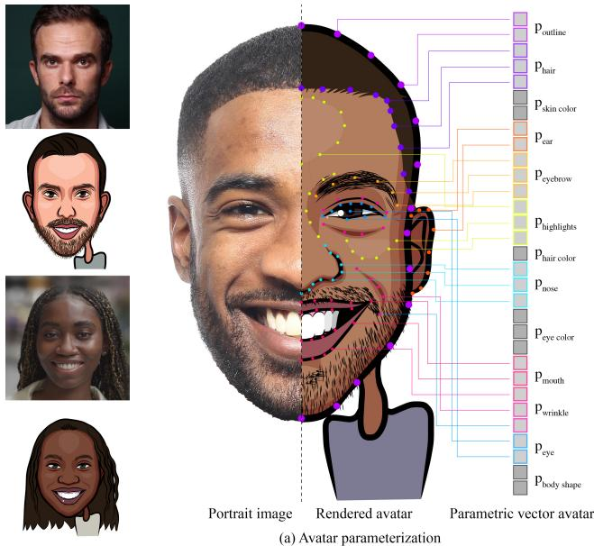  
Figure 2. Avatar Parameterization (right) and training samples (left). We encode the avatar as a vector of 629 parameters, which include point coordinates (represented as dots in the avatar above) which define spline curves, color, and line-weights of facial features. This vector is rendered by a non-differentiable vector graphics engine.

Our parametric method borrows ideas from the few-shot and domain adaptation fields. Unlike previous works, we focus on a 2D avatar representation that is easily transferable to 3D, and perform latent space translation, avoiding bottlenecks such as differentiable renderers. Moreover, to overcome the lack of paired data, we adopt ideas from domain adaptation methods, that is, we first leverage larger amounts of unpaired data to learn “expert” models, to then perform a cross-modal translation under the guidance of such models with weakly-supervised data.

## 3. Data

In the following, we describe our parametric system to encode facial features and our dataset.

Parametric System. Our avatar representation is characterized by its flexibility and high level of expressiveness, enabling it to accurately depict the vast diversity of facial features across different regions of the world. Our parametric system is specifically designed to capture the defining characteristics of any face using a minimal number of parameters. Each avatar is parameterized by a 629- dimensional vector $\bar { y } ~ \in ~ \mathbb { R } ^ { 6 2 9 }$ , which defines x, y coordinates, color, and line weights for all facial features, including lips, teeth, chin, eyes, and skin color, among others. A detailed breakdown of these parameters can be found in the supplementary material. The resulting avatar vector is grouped by parameters of facial components such that $\bar { y } : = \{ \bar { y } _ { e y e s } , \bar { y } _ { n o s e } , \bar { y } _ { m o u t h } , \ldots \}$ , as shown in Fig. 2.

The parameters described in our work can be rendered at any resolution without any loss of quality or clarity. This is achieved by utilizing a vector graphics engine that creates images using mathematical equations to generate lines, curves, and shapes, instead of pixels. Our work also demonstrates the potential for using these parameters in animated graphics and 3D environments. However, we acknowledge that these applications are beyond the scope of our current work and are discussed further in the supplemental material.

Dataset. We asked 393 volunteers of various ages and ethnicities to provide us with selfies. Subsequently, an adept artist was tasked with crafting avatars of the participants through our parametric vector engine that accurately portrayed their identities. This results in 393 pairs of real captured portraits and their corresponding avatar parameters as determined by the artist.

Due to the limited number of paired samples, developing a reliable avatar translation method directly on this dataset is presently infeasible. To address this challenge, we augment the number of paired samples using both synthetic faces generated by StyleGAN and automatic augmentations, such as warping, on real portraits. Specifics regarding these augmentations are provided in the supplementary material. With these augmentations, our dataset comprises a total of 9970 paired samples.

## 4. Method

Our goal is to learn a cross-modality mapping between a real image and a vector of parameters that define an avatar version of the input image in a given style. Typically, paired data in the form of image portrait and avatar parameters (X, Y¯ ) is limited due to their prohibitive time and cost to obtain, and directly training this mapping leads to overfitting issues. Moreover, to successfully learn such a mapping, we need to overcome some challenges surrounding multimodal approaches, such as domain shift or alignment between domains [1]. To address both problems, we first leverage larger amounts of unpaired data to learn rich modality-specific latent spaces, and then use a small amount of paired data to learn a mapping $F : S \longrightarrow \tau$ over lowerdimensional latent spaces, which helps to preserve the identity of an image x and the style of a vector of parameters y¯.

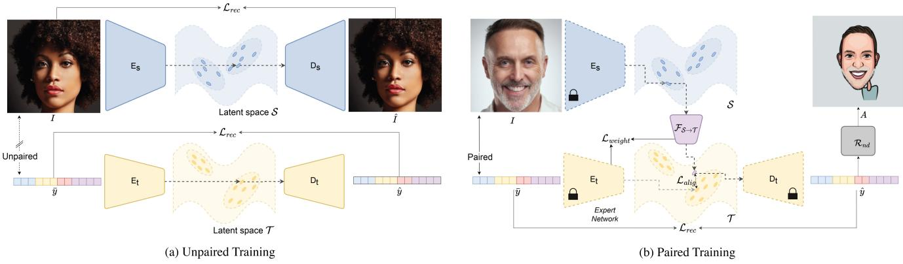  
Figure 3. Model overview. (a) Unpaired training stage: we train modality-specific networks to learn rich latent spaces. (b) Paired training stage: we introduce our cross-modal alignment module to translate between different latent spaces to transfer key facial features to a parametric domain.

By design, we disentangle hair and accessory parameters from the rest of the face parameters. Inspired by [9], we allow the model to focus solely on facial structures. A separate pipeline that leverages pretrained face attributes automatically retrieves the best hair and accessory parameters.

## 4.1. Unpaired Modality-Specific Representations

Let $\{ x _ { i } \} _ { i = 1 } ^ { N }$ be the set of training images where $x \in \mathcal { X }$ are images in the domain of portrait photos and $\{ \bar { y } _ { i } \} _ { j = 1 } ^ { M }$ the set of training avatar vectors where $\bar { y } \in \mathcal { V }$ is a vector of parameters that define an avatar. We want to find rich lower-dimensional representations of each modality. For this, we learn encoder-decoder networks per modality such that a portrait encoder $E _ { s } : \mathcal { X } \in \mathbb { R } ^ { 3 \times h \times w } \longrightarrow \mathcal { S } \in \mathbb { R } ^ { u }$ and a vector encoder $E _ { t } : \mathcal { V } \in \mathbb { R } ^ { v } \longrightarrow \mathcal { T } \in \mathbb { R } ^ { u }$ take their respective input modalities, and output latent vectors with the same dimensionality $\mathbb { R } ^ { u }$ . Both, the portrait decoder $D _ { s } : { \mathcal { S } } \longrightarrow { \mathcal { X } }$ and the vector decoder $D _ { t } : \mathcal { T } \longrightarrow \mathcal { y }$ are tasked to reconstruct the original, and both encoder-decoder functions satisfy:

$$
\arg \operatorname* { m i n } _ { E , D } \mathbb { E } [ \mathcal { L } _ { r e c } ( x , D \circ E ( x ) ]\tag{1}
$$

For image modality, the reconstruction loss becomes

$$
\begin{array} { r } { \mathcal { L } _ { r e c } = | x - D \circ E ( x ) | + \lambda _ { p } \mathcal { L } _ { p e r c } , } \end{array}\tag{2}
$$

$$
\mathcal { L } _ { p e r c } = \frac { 1 } { K i j } \sum _ { k } ^ { K } \sum _ { i j } | | V _ { i j } ^ { k } - W _ { i j } ^ { k } | | _ { 2 } ^ { 2 }\tag{3}
$$

where $i , j$ index the spatial dimensions of the feature maps $V$ and $W$ , and K the extracted layers from VGG19 trained on ImageNet [30]. For parameter vector modality, the reconstruction loss is simply $\mathcal { L } _ { r e c } = ( x - D \circ E ( x ) ) ^ { 2 }$ . Both encoder-decoder networks are trained independently in parallel. After training, we discard the image decoder $D _ { s }$ . The image encoder is modeled by a convolutional neural network, and the image decoder uses transpose convolutions to generate an image from a latent vector. The parameter vector encoder-decoder network is defined by multilayer perceptrons with non-linearity activation functions. Refer to the supplementary material for details about the networks.

## 4.2. Cross-Modal Alignment

After learning rich latent spaces from our large-scale data, the goal is to find a mapping between them. The cross-modal network $F : S \longrightarrow T$ takes in a feature latent vector $z _ { s } ~ = ~ E _ { s } ( x )$ and outputs a new latent vector $z _ { m } = F ( E _ { s } ( x ) )$ in the translated space, where $S , T \in \mathbb { R } ^ { u }$ We model $F$ as a multilayer perceptron with one hidden layer and non-linearity activation functions. We train F on a weakly paired dataset in the form $\{ x _ { i } , \bar { y } _ { i } \} _ { i = 1 } ^ { N }$ , where $x _ { i } , { \bar { y _ { i } } }$ is the i-th tuple of paired image and parameter vector, respectively. We fix the weights of $E _ { s }$ and $D _ { t } ,$ perform a forward pass through these networks, and use a reconstruction loss $\mathcal { L } _ { r e c } = ( \hat { y } - \bar { y } ) ^ { 2 }$ , where $\hat { y } = D _ { t } ( F ( E _ { s } ( x ) ) )$ While training, $F$ is learning an intermediate latent space M that wants to be as close to $T$ as possible. This translation, however, requires further regularization terms to enforce a closer alignment between such latent spaces.

Cross-Modal Alignment Loss. To enforce an explicit alignment between the new translated space M and the vector parameter latent space T, we can use the encoder $E _ { t }$ to extract the learned latent representation $z _ { t } = E _ { t } ( \bar { y } )$ of the input parameter vector ${ \bar { y } } ,$ and align the translated vector $z _ { m }$ to $z _ { t } .$ . Our new cross-modal alignment loss becomes:

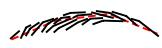  
(a)

$$
\mathcal { L } _ { c m } = \lambda _ { 1 } \left( z _ { m } - z _ { t } \right) ^ { 2 } + \lambda _ { 2 } \left( 1 - \frac { z _ { m } \cdot z _ { t } } { | | z _ { m } | | | | z _ { t } | | } \right)\tag{4}
$$

Weight Alignment Loss. The mapping network $F$ tries to project vectors into the same latent space as the target encoder $E _ { t } ,$ a network that has been previously pretrained on larger amounts of data, enough to learn rich representations of the inputs. Drawing inspiration from few-shot settings [18], the goal of this loss is to impose a strong regularization over the weights of the mapping network by taking guidance from the weights of $E _ { t }$ . To address the difference in network shape between $E _ { t }$ and $F .$ , this loss is enforced only in the last layer $F ,$ , which shares the same dimensionality. In simple terms, $E _ { t }$ is treated as the expert network, and since the last layer of $F$ is responsible for projecting a hidden vector into the same latent space as $E _ { t }$ , we want $F$ to imitate $E _ { t }$ as closely as possible. Our weight alignment loss is as follows:

$$
\mathcal { L } _ { w } = | | \theta _ { f } - \theta _ { t } | | _ { 2 } ^ { 2 }\tag{5}
$$

where $\theta _ { f }$ and $\theta _ { t }$ represent the weights of the last layer of the mapping network $F$ and the parameter vector encoder $E _ { t }$ . The final loss becomes:

$$
\mathcal { L } = \lambda _ { r } \mathcal { L } _ { r e c } + \lambda _ { c } \mathcal { L } _ { c m } + \lambda _ { w } \mathcal { L } _ { w }\tag{6}
$$

## 4.3. Hair Pipeline

Hair and accessories are variable components of faces and avatars that can be easily changed or adjusted. As such, we model this aspect independently from the rest of the face [9]. Some of these parameters are categorical, making them unsuitable for regression losses. The diversity of accessories and hairstyles also yields a distribution with properties that differs significantly from facial features, posing problems unifying the training with facial parameters. To predict hair and accessory attributes, we rely on a pretrained attribute regressor [14]. This function $\mathcal { H } ( I )  \hat { a }$ uses a ResNet50 backbone to estimate attributes such as age and hairstyle from input images. Refer to the supplementary material for more details.

We precompute aˆ vectors of a database of images and avatar parameters pairs. Let $x _ { j }$ be a query of an unseen portrait image at inference time. To find hair and accessory parameters, we compute $\hat { a } _ { j } = \mathcal { H } ( x _ { j } )$ and use nearest neighbors to find the closest attribute vector from our database. We then merge the hair and accessory parameters of the best match with the facial parameters $\hat { y } _ { j }$ generated by our crossmodal pipeline, as shown in Figure 5. Our hair database has a total of 470 different hairstyles to query from.

Figure 4. Our method supports vector graphics formed by (a) cubic Bezier curves, for contours and outlines, (b) polygons, for highlights and shadows, and (c) custom composites, for eyebrows and hair, with colored strokes and fills.  
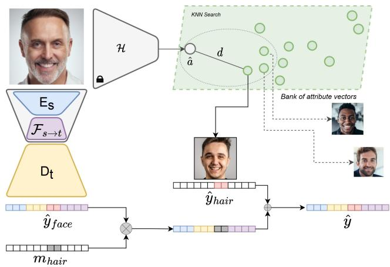  
Figure 5. Inference including hair retrieval pipeline. We use a pretrained attribute predictor H to pre-compute attribute vectors a of our faces from our hair bank. We use the K-nearest neighbors algorithm to retrieve the closest vector to a query vector aˆ from a bank of a vectors. d indicates smallest distance in the KNN search.

## 4.4. Rendering Engine

The rendering engine is responsible for translating avatar parameters into a corresponding pixel representation. In our implementation, we use Python, and the PIL library as our primary drawing library. Our vector representation is limited to a set of primitives, including cubic Bezier curves for outlines and contours, polygons for color fill ing, highlights and shadows, and composites to create eyebrows and hair, as shown in Figure 4. The renderer works by adding layers, ordered according to facial features. For instance, the facial structure is drawn before the eyes, just as an artist would draw a face. Each face attribute is encoded as a vector of point coordinates in the x and y directions, lineweights (widths and lengths), and RGB parameters. For instance, the nose of an avatar is represented by a set of coordinate points, start and end radius, and color values: $\bar { y } _ { n o s e } : = \{ ( x , y ) ^ { N } , r _ { s } , r _ { e } , R , G , B \}$ . Our engine then fits curves through the input $x , y$ coordinates and applies lineweights and colors. In order to achieve a natural stroke effect, we taper the end points of the lines.

## 4.5. Implementation Details

Unpaired Training. We first train our image and parameter vector autoencoders independently and in parallel until convergence. For our image autoencoder, we use FFHQ dataset [12] and our face dataset for a total of 90000 aligned 256x256 resolution faces. Our parameter vector autoencoder is trained on 100000 vector avatars. Note that the two autoencoders are not related; as explained in Sec. 4.1, we trained them on an unpaired dataset. We apply several random augmentations on images, including Gaussian blur, rotation, horizontal flips, and grayscale images. We use Adam optimizer with $\beta _ { 1 } = 0 . 5$ and $\beta _ { 2 } = 0 . 9 9$ , an initial learning rate of 0.0002, batch size of 24 and we set $\lambda _ { p }$ (Equation (2)) to 0.1. We set the latent spaces to be $\mathcal { S } , \mathcal { T } \in \mathbb { R } ^ { 5 1 2 }$ . All experiments using our method were trained on a single Tesla V100 GPU.

Paired Training. In this stage, we freeze the weights of $E _ { s } , E _ { t }$ , and $D _ { t }$ , and only update the weights of the mapping network F. We use the same optimizer configuration as before, but increase the batch size to 48. We use a learning rate scheduler on loss plateau with patience 1 and factor 0.5. We set lambdas in Equation (6) as follows: $\lambda _ { r } = 1 , \lambda _ { c } = 1 , \lambda _ { w } = 1 0$ . In total, we have 9970 pairs of portraits and avatar parameters, and 3995 pairs of portraits and avatar images.

## 5. Experiments

In this section, we provide a quantitative and qualitative evaluation of our method, and compare it to several state-ofthe-art methods. We train previous methods on our paired dataset from scratch using their official implementations, and use the default parameters. All methods are trained using a 256x256 image resolution. We then provide ablation studies to evaluate the performance of different components of our method, such as the impact of losses, amount of data, and face encoders. To ensure a fair comparison, we train the paired stage of our model with the same amount of data that we train previous methods (3995 image-avatar pairs) when evaluating against previous methods (Figure 6, Table 1, and Table 2).

## 5.1. Comparison to State-of-the-art Methods

We evaluate our method against generic image-to-image translation methods, a GAN adaptation method, and a recent caricature method. Following [11], we choose U-GAT-IT [15] and StarGAN-v2 [6] among image-to-image translation methods as they provide visually good results and generate fewer artifacts than older methods. We also compare our method to MSGAN-pix2pix [22], as it is designed specifically for paired datasets. We choose a GAN adaptation method [25] because our paired dataset is based on a few thousand examples, and these methods generally prevent StyleGAN-2 [13] from overfitting. Lastly, we compare our method against a recent network specifically designed to work on caricature generation, StyleCariGAN [11]. This method requires 2 pre-trained StyleGANs, one trained on real faces and the other one on caricatures or avatars. Before training this model, we train a StyleGAN-2 model on our avatar dataset. At inference, [25, 11] require GANinversion to project an input image to a latent code before translating to the avatar domain.

Table 1. Quantitative evaluation on a held-out dataset. All models are trained on the same dataset containing 3955 avatars.
<table><tr><td>Method</td><td> $\mathcal { L } _ { 1 } \downarrow$ </td><td> $\mathcal { L } _ { l p i p s } \downarrow$ </td></tr><tr><td>U-GAT-IT [15]</td><td>0.3164</td><td>0.2803</td></tr><tr><td>GAN-Adapt. [25]</td><td>0.2558</td><td>0.3622</td></tr><tr><td>StarGAN-v2 [6]</td><td>0.2111</td><td>0.2135</td></tr><tr><td>MSGAN-pix2pix [22]</td><td>0.2059</td><td>0.3747</td></tr><tr><td>StyleCariGAN [11]</td><td>0.2441</td><td>0.3530</td></tr><tr><td>Ours</td><td>0.1864</td><td>0.1895</td></tr></table>

In Figure 6, we present a qualitative evaluation of the performance of several state-of-the-art methods. U-GAT-IT exhibits a lack of consistency in preserving correct facial structure, often resulting in squashed or deformed avatars. This observation is further supported by the results presented in Table 2. Nevertheless, U-GAT-IT generally performs well in maintaining identity, even when changing the facial structure. StarGAN-v2, on the other hand, produces stylistically pleasing outputs with consistently wellstructured faces, but struggles with preserving identity. The GAN Adaptation method maintains identity to a large extent, but the quality is compromised with some coloring artifacts. StyleCariGAN generates good quality avatars, but it lacks consistency in preserving identity. Results for MSGAN-pix2pix are available in the supplemental.

In general, our proposed method shows superior performance in terms of both quality and identity preservation. As demonstrated in Figure 6, our method consistently maintains identity across various demographic factors, such as age, gender and ethnicity. Our parametric approach circumvents common issues that are often encountered in generative pixel-based methods, such as lack of structural consistency and generation of artifacts.

To further substantiate our claims, we report evaluation metrics in Table 1. Specifically, we compare the performance of our model against previous methods using pixel loss (L1) and perceptual loss (LPIPS) metrics to quantify the difference between the generated output and a ground truth avatar in a held-out dataset consisting of 30 avatars. Our method outperforms previous methods in terms of both pixel and perceptual losses. It is worth noting that

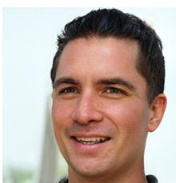

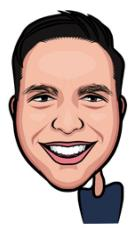

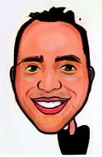

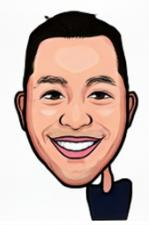

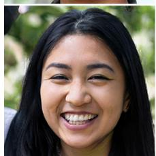

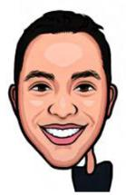

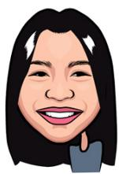

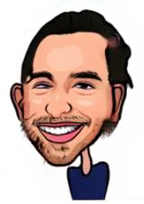

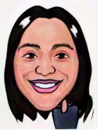

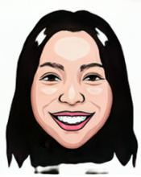

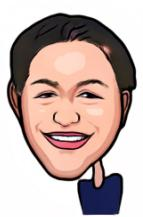

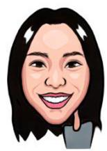

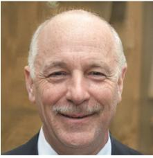

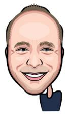

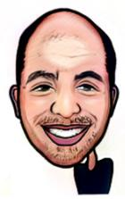

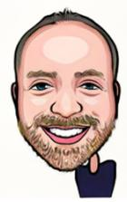

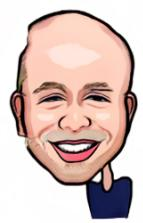

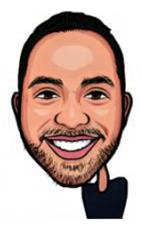

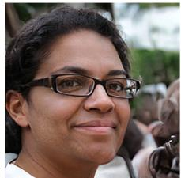

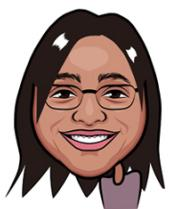

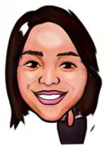

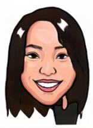

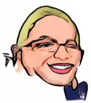

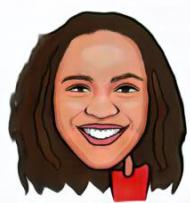

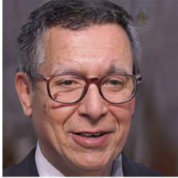

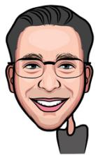

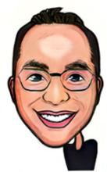

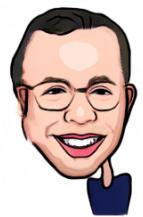

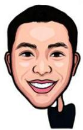

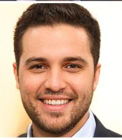  
(a) Input

  
(b) Ours

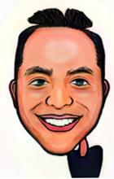  
(c) GAN-Adapt.

  
(d) StyleCariGAN

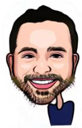  
(e) U-GAT-IT

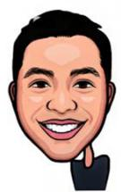  
(f) StarGANv2

Figure 6. Comparison with state-of-the-art methods for avatar generation and image-to-image translation. All the methods are trained on the same dataset with the same amount of data. Our method is able to preserve identity with higher accuracy and more consistently than previous methods.

StyleGAN2-based methods generally achieve better scores than other approaches.

## 5.2. User Study

We conduct a perceptual study to evaluate identity preservation and avatar quality. We compare our method against the same previous methods: GAN Adaptation [25],

Table 2. Quantitative evaluation on user preference. This table shows a 2-way comparison between our method and previous methods.
<table><tr><td>Method</td><td>Identity</td><td>Quality</td></tr><tr><td>Ours vs. U-GAT-IT [15]</td><td>78.76%</td><td>99.1%</td></tr><tr><td>Ours vs. GAN-Adapt. [25]</td><td>74.63%</td><td>85.8%</td></tr><tr><td>Ours vs. StarGAN-v2 [6]</td><td>73.46%</td><td>74.30%</td></tr><tr><td>Ours vs. MSGAN-pix2pix [22]</td><td>81.70%</td><td>88.50%</td></tr><tr><td>Ours vs. StyleCariGAN [11]</td><td>72.83%</td><td>87.6%</td></tr></table>

U-GAT-IT [15], StarGAN-v2 [6], MSGAN-pix2pix [22], and StyleCariGAN [11]. We structure the study with 2- way questions, where each question compares our method against another method chosen randomly. The evaluation of identity preservation is conducted by presenting users with a portrait photograph and asking them to select the avatar that best preserves the identity of the person in the photograph. The avatars are presented side by side, and their location is randomized in each question. In the second part of the study, we evaluated avatar quality. To ensure an unbiased assessment, participants were instructed to disregard factors related to image quality, such as resolution, and to focus solely on the quality of the avatar itself, i.e., how well the avatar maintains the overall facial structure, facial attribute proportions, relative distances between facial features, or consistency of colors as they pertained to facial features.

We asked 113 users, and each one is asked 15 identity questions and 5 quality questions. In total, we collect 2260 responses. As shown in Table 2, our method is preferred over previous methods in all tasks. Overall, 81.17% of users select our method across all tasks, with 75.28% showing preference for our method on identity preservation and 87.06% for avatar quality.

When evaluating our method on avatar quality, the strongest competitor is the StyleGAN2-based method, StarGAN-v2, selected by 25.7% of users. StyleCariGAN, MSGAN, and GAN-Adaptation obtain similar preference percentages, 12.4%, 11.5% and 14.2% respectively. U-GAT-IT is chosen by less than 1% of users. We hypothesize that this is due to the face deformations shown in Figure 6.

## 5.3. Ablation Study

Effect of Proposed Loss Functions. In this ablation study, we examine the performance of our mapping function F under various objectives, and keep the other networks fixed. Our reconstruction loss, and cross-modal alignment loss compare the predicted latent code produced by the image encoder and mapping network, represented as $z _ { m } = F ( E _ { s } ( x ) )$ , with the output of a pretrained parameter encoder, denoted as $E _ { t }$ and referred to as the expert net-

<table><tr><td></td><td></td><td></td><td></td></tr><tr><td></td><td></td><td></td><td></td></tr><tr><td></td><td></td><td></td><td></td></tr></table>

(a) Input  
(b) w/o alignment  
(c) $\mathrm { w } / \mathrm { o } \mathrm { L } _ { \mathrm { c m } }$  
(d) with all  
Figure 7. Model variations without proposed losses. Readers are encouraged to zoom in to observe how details affect identity preservation. (b) uses only $L _ { r e c }$ between generated and ground truth parameters. (c) only uses weight alignment loss. (d) uses all proposed losses.

Table 3. Quantitative evaluation on the effect of each loss function.
<table><tr><td>Method</td><td> $\mathcal { L } _ { 1 } \downarrow$ </td><td> $\mathcal { L } _ { l p i p s } \downarrow$ </td></tr><tr><td>Ours w/o alig</td><td>0.1856</td><td>0.1876</td></tr><tr><td>Ours w/o mse alig</td><td>0.1841</td><td>0.1864</td></tr><tr><td>Ours w/o csim alig</td><td>0.1834</td><td>0.1869</td></tr><tr><td>Ours w/o weight alig</td><td>0.1833</td><td>0.1852</td></tr><tr><td>Ours</td><td>0.1832</td><td>0.1835</td></tr></table>

work, given by $z _ { t } = E _ { t } ( \bar { y } )$

The weight regularization term is designed to impose constraints on the weights of the last layer of the mapping function F. This is based on the hypothesis that the weights in the final layer of F should closely resemble those in the final layer of $E _ { t } ,$ , as both networks are designed to be a 2- layer MLP and aim to project vectors into the same latent space.

Figure 7 shows the effect of the proposed losses during cross-modal training. When optimizing with a parameter reconstruction loss $\mathcal { L } _ { r e c }$ without using any alignment loss (column b), the model preserves overall identity but fails to capture smaller details that enhance identity preservation such as the relative position of facial features or a correct size (see the mouth size in the middle row). Similar results are observed when training without Equation (4) (column c). However, using all proposed losses results in better positioning and sizing of key facial features like eyes and mouth (see distance between eyes and nose in the example shown in the upper row). A detailed analysis of the effect of the different loss functions is provided in the supplementary material.

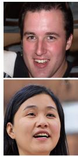  
(a)Inpu

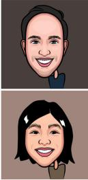  
(b)OursL

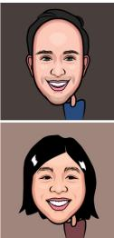  
(c)OursM

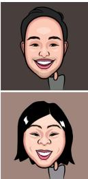  
(d)OursS

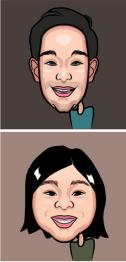  
(e)OursXS  
Figure 8. Effect of paired dataset size. (b) Our model trained on 9970 paired images. (c) Our model trained on 3995 pairs. (d) Our model trained on 1000 image-avatar parameter pairs. (e) Our model trained on 500 samples.

Effect of Paired Data Size. The impact of the size of paired data on our model is examined in this section. As obtaining paired data is an expensive process, we investigate the effect of reducing the amount of paired data in the training of our mapping network F. We compare the performance of our model trained on different sizes of paired data: OursL, trained on 9970 pairs Figure 8 (b), OursM, trained on 3395 pairs Figure 8 (c), OursS, trained on 1000 pairs Figure 8 (d), and OursXS, trained on 500 pairs Figure 8 (e). While models L and M are capable of preserving identity, using fewer than 3000 image-avatar pairs leads to degradation in both identity preservation and avatar quality, specifically in maintaining facial structure and relative positioning of facial features.

## 6. Conclusion

We propose a method that generates parametric avatars directly from a single portrait image. Our framework, which utilizes a cross-modal mapping between two previously trained latent spaces, has allowed us to capture the vast diversity of human appearance and preserve identity in the generated avatars. Through our alignment losses, we have successfully guided the translation process and demonstrated that our approach outperforms previous methods both qualitatively and quantitatively. One key advantage of our approach is the use of parametric avatars, which obviate the resolution constraints often encountered in image-based approaches. This also facilitates an easily transferable solution that is readily compatible with animation or 3D software applications. Our contributions offer a step forward in the development of avatar representation, which have the potential to impact a wide range of fields, from gaming to virtual reality.

Limitations and Future Work. Our method generates a diverse set of avatars, but limitations still exist. The use of a hair and accessory databank limits matching for complex hairstyles and accessories, such as hats. Additionally, our parametric avatars are restricted to front-view only. Future work includes integrating hair and accessories within the generative pipeline and allowing for pose variance.

## References

[1] Tadas Baltrusaitis, Chaitanya Ahuja, and Louis-Philippeˇ Morency. Multimodal machine learning: A survey and taxonomy. IEEE transactions on pattern analysis and machine intelligence, 41(2):423–443, 2018. 3

[2] Susan E Brennan. Caricature generator: The dynamic exaggeration of faces by computer. Leonardo, 18(3):170–178, 1985. 2

[3] Kaidi Cao, Jing Liao, and Lu Yuan. Carigans: Unpaired photo-to-caricature translation. arXiv preprint arXiv:1811.00222, 2018. 2

[4] Edward Castronova. Theory of the avatar. Available at SSRN 385103, 2003. 1

[5] Yunjey Choi, Minje Choi, Munyoung Kim, Jung-Woo Ha, Sunghun Kim, and Jaegul Choo. Stargan: Unified generative adversarial networks for multi-domain image-to-image translation. In Proceedings of the IEEE conference on computer vision and pattern recognition, pages 8789–8797, 2018. 2

[6] Yunjey Choi, Youngjung Uh, Jaejun Yoo, and Jung-Woo Ha. Stargan v2: Diverse image synthesis for multiple domains. In Proceedings of the IEEE/CVF conference on computer vision and pattern recognition, pages 8188–8197, 2020. 2, 6, 8

[7] Julia Gong, Yannick Hold-Geoffroy, and Jingwan Lu. Autotoon: Automatic geometric warping for face cartoon generation. In Proceedings ofthe IEEE/CVF Winter Conference on Applications ofComputer Vision, pages 360–369, 2020. 2

[8] Bruce Gooch, Erik Reinhard, and Amy Gooch. Human facial illustrations: Creation and psychophysical evaluation. ACM Transactions on Graphics (TOG), 23(1):27–44, 2004. 2

[9] Liwen Hu, Shunsuke Saito, Lingyu Wei, Koki Nagano, Jaewoo Seo, Jens Fursund, Iman Sadeghi, Carrie Sun, Yen-Chun Chen, and Hao Li. Avatar digitization from a single image for real-time rendering. ACM Transactions on Graphics (ToG), 36(6):1–14, 2017. 2, 4, 5

[10] Xun Huang, Ming-Yu Liu, Serge Belongie, and Jan Kautz. Multimodal unsupervised image-to-image translation. In Proceedings of the European conference on computer vision (ECCV), pages 172–189, 2018. 2

[11] Wonjong Jang, Gwangjin Ju, Yucheol Jung, Jiaolong Yang, Xin Tong, and Seungyong Lee. Stylecarigan: caricature generation via stylegan feature map modulation. ACM Transactions on Graphics (TOG), 40(4):1–16, 2021. 2, 6, 8

[12] Tero Karras, Samuli Laine, and Timo Aila. A style-based generator architecture for generative adversarial networks. In Proceedings of the IEEE/CVF Conference on Computer Vision and Pattern Recognition (CVPR), June 2019. 2, 6

[13] Tero Karras, Samuli Laine, Miika Aittala, Janne Hellsten, Jaakko Lehtinen, and Timo Aila. Analyzing and improving the image quality of stylegan. In Proceedings of the IEEE/CVF conference on computer vision and pattern recognition, pages 8110–8119, 2020. 2, 6

[14] Siavash Khodadadeh, Shabnam Ghadar, Saeid Motiian, Wei-An Lin, Ladislau Bol¨ oni, and Ratheesh Kalarot. Latent to¨ latent: A learned mapper for identity preserving editing of multiple face attributes in stylegan-generated images. In Proceedings of the IEEE/CVF Winter Conference on Applications ofComputer Vision, pages 3184–3192, 2022. 5

[15] Junho Kim, Minjae Kim, Hyeonwoo Kang, and Kwanghee Lee. U-gat-it: Unsupervised generative attentional networks with adaptive layer-instance normalization for image-toimage translation. arXiv preprint arXiv:1907.10830, 2019. 2, 6, 8

[16] Nguyen Kim Hai Le, Yong Peng Why, and Golam Ashraf. Shape stylized face caricatures. In International Conference on Multimedia Modeling, pages 536–547. Springer, 2011. 2

[17] Wenbin Li, Wei Xiong, Haofu Liao, Jing Huo, Yang Gao, and Jiebo Luo. Carigan: Caricature generation through weakly paired adversarial learning. Neural Networks, 132:66–74, 2020. 2

[18] Yijun Li, Richard Zhang, Jingwan Lu, and Eli Shechtman. Few-shot image generation with elastic weight consolidation. arXiv preprint arXiv:2012.02780, 2020. 2, 5

[19] Lin Liang, Hong Chen, Ying-Qing Xu, and Heung-Yeung Shum. Example-based caricature generation with exaggeration. In 10th Pacific Conference on Computer Graphics and Applications, 2002. Proceedings., pages 386–393. IEEE, 2002. 2

[20] Pei-Ying Chiang Wen-Hung Liao and Tsai-Yen Li. Automatic caricature generation by analyzing facial features. In Proceeding of 2004 Asia Conference on Computer Vision (ACCV2004), Korea, volume 2, 2004. 2

[21] Ming-Yu Liu, Thomas Breuel, and Jan Kautz. Unsupervised image-to-image translation networks. Advances in neural information processing systems, 30, 2017. 2

[22] Qi Mao, Hsin-Ying Lee, Hung-Yu Tseng, Siwei Ma, and Ming-Hsuan Yang. Mode seeking generative adversarial networks for diverse image synthesis. In Proceedings of the IEEE/CVF conference on computer vision and pattern recognition, pages 1429–1437, 2019. 6, 8

[23] Fred Miao, Irina V Kozlenkova, Haizhong Wang, Tao Xie, and Robert W Palmatier. An emerging theory of avatar marketing. Journal ofMarketing, 86(1):67–90, 2022. 1

[24] Zhenyao Mo, John P Lewis, and Ulrich Neumann. Improved automatic caricature by feature normalization and exaggeration. In ACM SIGGRAPH 2004 Sketches, page 57. 2004. 2

[25] Utkarsh Ojha, Yijun Li, Jingwan Lu, Alexei A. Efros, Yong Jae Lee, Eli Shechtman, and Richard Zhang. Few-shot image generation via cross-domain correspondence. In Proceedings of the IEEE/CVF Conference on Computer Vision and Pattern Recognition (CVPR), pages 10743–10752, June 2021. 2, 6, 7, 8

[26] Justin NM Pinkney and Doron Adler. Resolution dependent gan interpolation for controllable image synthesis between domains. arXiv preprint arXiv:2010.05334, 2020. 2

[27] Tianyang Shi, Yi Yuan, Changjie Fan, Zhengxia Zou, Zhenwei Shi, and Yong Liu. Face-to-parameter translation for game character auto-creation. In Proceedings of the IEEE/CVF International Conference on Computer Vision, pages 161–170, 2019. 2, 3

[28] Tianyang Shi, Zhengxia Zuo, Yi Yuan, and Changjie Fan. Fast and robust face-to-parameter translation for game character auto-creation. In Proceedings of the AAAI Conference on Artificial Intelligence, volume 34, pages 1733–1740, 2020. 2, 3

[29] Yichun Shi, Debayan Deb, and Anil K Jain. Warpgan: Automatic caricature generation. In Proceedings of the IEEE/CVF Conference on Computer Vision and Pattern Recognition, pages 10762–10771, 2019. 2

[30] Karen Simonyan and Andrew Zisserman. Very deep convolutional networks for large-scale image recognition. arXiv preprint arXiv:1409.1556, 2014. 4

[31] Yaniv Taigman, Adam Polyak, and Lior Wolf. Unsupervised cross-domain image generation. arXiv preprint arXiv:1611.02200, 2016. 2, 3

[32] Lav Varshney. Face metamorphosis and face caricature: A user’s guide. School of Electrical and Computer Engineering, Cornell University, 2004. 2

[33] Lior Wolf, Yaniv Taigman, and Adam Polyak. Unsupervised creation of parameterized avatars. In Proceedings of the IEEE International Conference on Computer Vision, pages 1530–1538, 2017. 1, 2

[34] Ruizheng Wu, Xin Tao, Xiaodong Gu, Xiaoyong Shen, and Jiaya Jia. Attribute-driven spontaneous motion in unpaired image translation. In Proceedings of the IEEE/CVF International Conference on Computer Vision, pages 5923–5932, 2019. 2

[35] Lan Yan, Wenbo Zheng, Chao Gou, and Fei-Yue Wang. Ipgan: Identity-preservation generative adversarial network for unsupervised photo-to-caricature translation. Knowledge-Based Systems, 241:108223, 2022. 2

[36] Jun-Yan Zhu, Taesung Park, Phillip Isola, and Alexei A Efros. Unpaired image-to-image translation using cycleconsistent adversarial networks. In Computer Vision (ICCV), 2017 IEEE International Conference on, 2017. 2