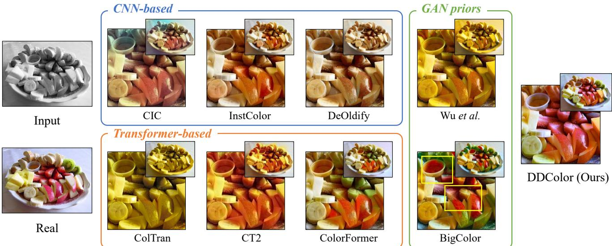
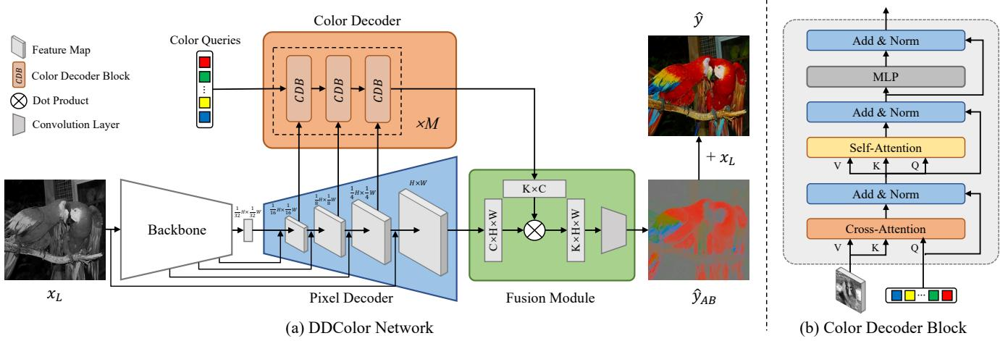
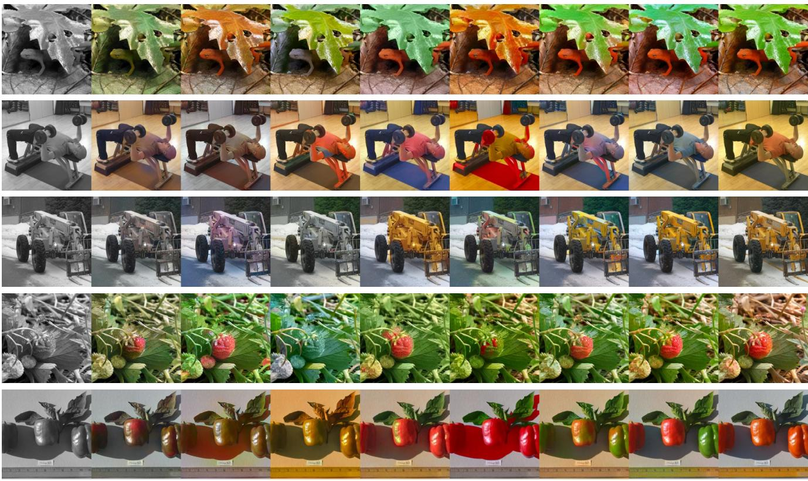
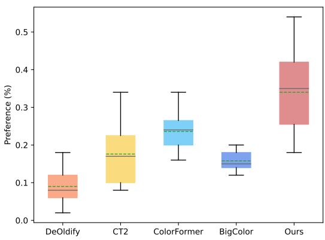
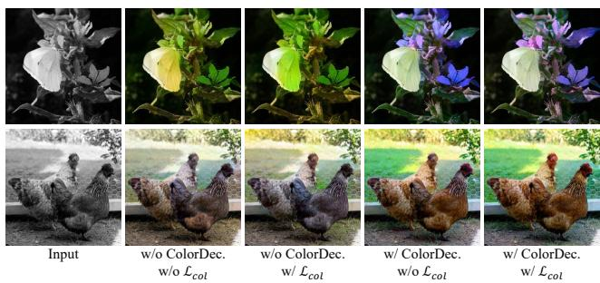
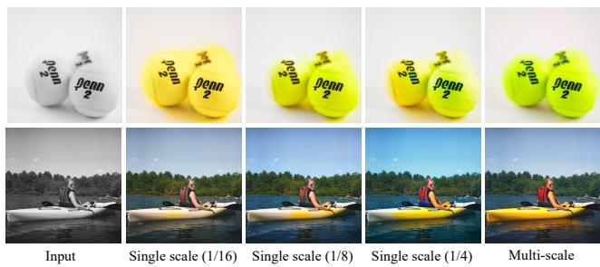
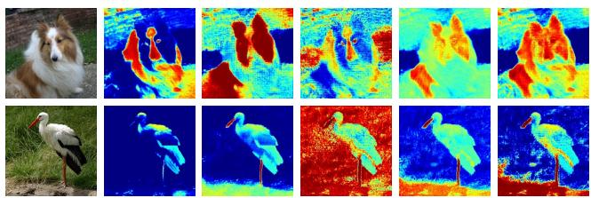
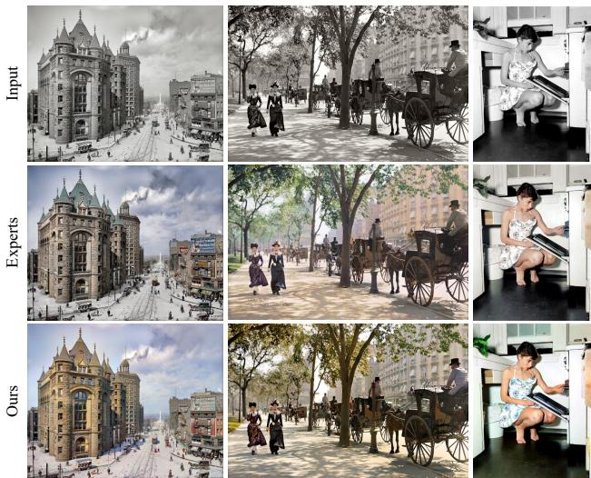
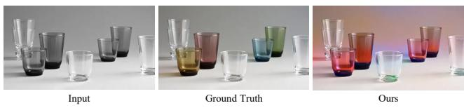

# DDColor: Towards Photo-Realistic Image Colorization via Dual Decoders

Xiaoyang Kang Tao Yang Wenqi Ouyang Peiran Ren Lingzhi Li Xuansong Xie DAMO Academy, Alibaba Group

{kangxiaoyang.kxy,baiguan.yt,wenqi.oywq,peiran.rpr,llz273714,xingtong.xxs}@alibaba-inc.com

  
Figure 1: Visual comparison. We present a novel colorization method DDColor, which is capable of producing more natural and vivid colorization in complex scenes containing multiple objects with diverse contexts, compared to existing methods.

## Abstract

Image colorization is a challenging problem due to multi-modal uncertainty and high ill-posedness. Directly training a deep neural network usually leads to incorrect semantic colors and low color richness. While transformerbased methods can deliver better results, they often rely on manually designed priors, suffer from poor generalization ability, and introduce color bleeding effects. To address these issues, we propose DDColor, an end-to-end method with dual decodersfor image colorization. Our approach includes a pixel decoder and a query-based color decoder. The former restores the spatial resolution of the image, while the latter utilizes rich visual features to refine color queries, thus avoiding hand-crafted priors. Our two decoders work together to establish correlations between color and multi-scale semantic representations via crossattention, significantly alleviating the color bleeding effect. Additionally, a simple yet effective colorfulness loss is introduced to enhance the color richness. Extensive experiments demonstrate that DDColor achieves superior performance to existing state-of-the-art works both quantitatively

and qualitatively. The codes and models are publicly available at https://github.com/piddnad/DDColor.

## 1. Introduction

Image colorization is a classic computer vision task and has great potential in many real-world applications, such as legacy photo restoration [41], video remastering [21] and art creation [35], etc. Given a grayscale image, colorization aims to recover its two missing color channels, which is highly ill-posed and usually suffers from multi-modal uncertainty, e.g., an object may have multiple plausible colors. Traditional colorization methods address this problem mainly based on user guidance such as reference images [44, 22, 14, 27, 9] and color graffiti [25, 48, 35, 32]. Although great progress has been made, it remains a challenging research problem.

With the rise of deep learning, automatic colorization has drawn a lot of attention, targeting at producing appropriate colors from complex image semantics (e.g., shape, texture, and context). Some early methods [8, 10, 49, 39, 1] attempt to predict per-pixel color distributions using convolutional neural networks (CNNs). Unfortunately, these CNN-based methods often yield incorrect or unsaturated colorization results due to the lack of a comprehensive understanding of image semantics (Figure 1 CIC [49], InstColor [39] and DeOldify [1]). In order to embrace semantic information, some methods [46, 13] resort to generative adversarial networks (GANs) and utilize their rich representations as generative priors for colorization. However, due to the limited representation space of GAN prior, they fail to handle images with complex structures and semantics, resulting in inappropriate colorization results or unpleasant artifacts (Figure 1 Wu et al. [46] and BigColor [13]).

With the tremendous success in natural language processing (NLP), Transformer [42] has been extended to many computer vision tasks. Recently, some works [24, 45, 47] introduce the non-local attention mechanism of transformer to image colorization. Though achieving promising results, these methods either train several independent subnets, leading to accumulated error (Figure 1 ColTran [24]), or perform color attention operations on single-scale image feature maps, causing visible color bleeding when tackling complex image contexts (Figure 1 CT2 [45] and Color-Former [47]). In addition, these methods often rely on handcrafted dataset-level empirical distribution priors, such as color masks in [45] and semantic-color mappings in [47], which are cumbersome and difficult to generalize.

In this paper, we propose an novel colorization method, namely DDColor, targeting at achieving semantically reasonable and visually vivid colorization. Our approach utilizes an encoder-decoder structure where the encoder extracts image features and the dual decoders restore spatial resolution. Unlike previous methods that optimize color likelihood resorting to an extra network or manually calculated priors, our method uses a query-based transformer as color decoder to learn semantic-aware color queries in an end-to-end way. By using multi-scale image features to learn color queries, our method alleviates color bleeding and improves the colorization of complex contexts and small objects significantly (see Figure 1). Over and above this, we present a new colorfulness loss to improve the color richness of generated results.

We validate the performance of our model on public benchmarks ImageNet [36] and conduct ablations to demonstrate the advantages of our framework. The visualization results and evaluation metrics show that our work achieves significant improvements to previous state-of-theart methods in terms of semantic consistency, color richness, etc. Furthermore, we test our model on two additional datasets (COCO-Stuff [4], and ADE20k [53]) without finetuning and achieve best performance among all baselines, demonstrating its generalization ability.

Our key contributions are summarized as follow:

• We propose an end-to-end network with dual decoders for automatic image colorization, which ensures vivid and semantically consistent results.

• Our method includes a novel color decoder that learns color queries from visual features without relying on hand-crafted priors. Additionally, our pixel decoder provides multi-scale semantic representations to guide the optimization of color queries, which effectively reduces the color bleeding effect.

• Comprehensive experiments demonstrate that our method achieves state-of-the-art performance and exhibits good generalization compared to the baselines.

## 2. Related Work

Automatic colorization. The emergence of large-scale datasets and the development of DNNs make it possible to colorize grayscale images in a data-driven manner. Cheng et al. [8] propose the first DNN-based image colorization method. Zhang et al. [49] learn the color distribution of each pixel and train the network with a rebalanced multinomial cross-entropy, allowing rare colors to appear. MDN [10] uses a variational autoencoder (VAE) to get diverse colorized results. InstColor [39] believes that a clear figureground separation helps to improve performance of colorization, thus adopts a detection model to provide the detection box as prior. Later works [51, 50] extend to take segmentation mask as pixel-level object semantics to guide colorization. Recently, some works [46, 13] attempt to restore vivid color by taking advantage of the rich and diverse color priors of pre-trained GANs.

Vision transformer for colorization. Since successfully introduced Transformer [42] to vision recognition, Vision Transformer (ViT) [11] has developed rapidly in many downstream vision tasks [6, 54, 52, 7]. In the field of col orization, ColTran [24] first uses a transformer to build a probability model, and samples color from the learning distribution to conditionally generate a low-resolution coarse colorization, before upsampling it into a high-resolution image of fine color. CT2 [45] considers colorization as a classification task, and feeds image patch and color tokens together into a ViT-based network including a luminanceselecting module with pre-calculated probability distribution of dataset. ColorFormer [47] proposes a transformer network with hybrid self-attention, and refines image features by a memory network with pre-built semantic-color priors. In this work, we introduce a color decoder that enables end-to-end learning of color queries from multi-scale visual features, eliminating the need for hand-crafted priors. Query-based transformer in computer vision. Recently, many researchers have been using query-based transformer for various tasks due to its ability to leverage attention mechanisms to capture global correlations. DETR [6] is the first to introduce transformers to object detection, using queries to locate and represent candidate objects. Following DETR, MaskFormer [7] and QueryInst [12] respectively introduce query-based transformers to semantic and instance segmentation, showing its great potential to vision tasks. Transtrack [40] applies queries across the frames to improve multi-object tracking. In this work, we apply query-based transformer for image colorization for the first time.

  
Figure 2: (a) Method overview. Our proposed model, DDColor, colorizes a grayscale image $x _ { L }$ in an end-to-end fashion. We first extract its features using a backbone network, which are then input to the pixel decoder to restore the spatial structure of the image. Concurrently, the color decoder performs color queries on visual features of different scales, learning semanticaware color representations. The fusion module combines the outputs of both decoders to produce a color channel output $\hat { y } _ { A B }$ . Finally, we concatenate ${ \hat { y } } A B$ and $x _ { L }$ along the channel dimension to obtain the final colorization result yˆ. (b) Structure of color decoder block. Taking image features and color queries as inputs, the color decoder block establishes the correlation between semantic and color representation by performing cross-attention, self-attention and feed forward operations.

## 3. Method

## 3.1. Overview

Given a grayscale input image $x _ { L } \in \mathbb { R } ^ { H \times W \times 1 }$ , our colorization network predicts the two missing color channels $\hat { y } _ { A B } ~ \in ~ \mathbb { R } ^ { H \times W \times 2 }$ , where the L, AB channels represent the luminance and chrominance in CIELAB color space, respectively. The network adopts an encoder-decoder framework, as shown in Figure 2 (a).

We utilize a backbone network as the encoder to extract high-level semantic information from grayscale images. The backbone network is designed to extract image semantic embedding, which is crucial for colorization. In this work, we choose ConvNeXt [29], which is the cuttingedge model for image classification. Taken $x _ { L }$ as input, the backbone network outputs 4 intermediate feature maps with resolutions of $\begin{array} { r } { \frac { H } { 4 } \times \frac { W } { 4 } , \frac { \cdot } { 8 } \times \frac { W } { 8 } , \frac { H } { 1 6 } \times \frac { W } { 1 6 } } \end{array}$ and ${ \frac { H } { 3 2 } } \times { \frac { W } { 3 2 } }$ . The first three feature maps are fed to pixel decoder through shortcut connections, while the last is treated as input to the pixel decoder. As for the backbone network structure, there are several options, such as ResNet[17], Swin-Transformer[28], etc., as long as the network is capable of producing a hierarchical representation.

The decoder section of our framework consists of a pixel decoder and a color decoder. The pixel decoder uses a series of stacked upsampling layers to restore the spatial resolution of the image features. Each upsampling layer has a shortcut connection with the corresponding stage of the encoder. The color decoder gradually refines semantic-aware color queries by leveraging multiple image features at different scales. Finally, the image and color features produced by the two decoders are fused to generate the color output.

In the following, we provide detailed descriptions of these modules as well as the losses used for colorization.

## 3.2. Dual Decoders

## 3.2.1 Pixel Decoder

The pixel decoder is composed of four stages that gradually expand the image resolution. Each stage includes an upsampling layer and a shortcut layer. Specifically, unlike previous methods that use deconvolution [34] or interpolation [30], we employ PixelShuffle [37] as the upsampling layer. This layer rearranges low-resolution feature maps with the shape of $\textstyle { \bigl ( } { \frac { h } { p } } , { \frac { w } { p } } , c { \bar { p } } ^ { 2 } { \bigr ) }$ into high-resolution ones with the shape of $( h , w , c )$ . The shortcut layer uses a convolution to integrate features from the corresponding stages of the encoder through shortcut connections.

Our method captures a complete image feature pyramid through a step-by-step upsampling process, which is beyond the capability of some transformer-based approaches [24, 45]. These multi-scale features are further utilized as input to the color decoder to guide the optimization of color queries. The final output of the pixel decoder is the image embedding $E _ { i } ~ \in ~ \mathbb { R } ^ { \tilde { C } \times H \times W }$ , which has the same spatial resolution as the input image.

## 3.2.2 Color Decoder

Many existing colorization methods rely on additional priors to achieve vivid results. For example, some methods [46, 13] utilize generative prior from pretrained GANs, while others use empirical distribution statistics [45] or prebuilt semantic-color pairs [47] of training sets. However, these approaches require extensive pre-construction efforts and may have limited applicability in various scenarios. To reduce reliance on manually designed priors, we propose a novel query-based color decoder.

Color decoder block. The color decoder is composed of a stack of blocks, with each block receiving visual features and color queries as input. The color decoder block (CDB) is designed based on a modified transformer decoder, as depicted in Figure 2 (b).

To learn a set of adaptive color queries based on visual semantic information, we create learnable color embedding memories to store the sequence of color representations: $\mathcal { Z } _ { 0 } = [ \mathcal { Z } _ { 0 } ^ { 1 } , \mathcal { Z } _ { 0 } ^ { 2 } , \ldots , \mathcal { Z } _ { 0 } ^ { K } ] \overset { \cdot } { \in } \mathbb { R } ^ { K \times C }$ . These color embeddings are initialized to zero during the training phase and used as color queries in the first CDB. We first establish the correlation between semantic representation and color embedding through the cross-attention layer:

$$
\mathcal { Z } _ { l } ^ { \prime } = s o f t m a x ( Q _ { l } K _ { l } ^ { T } ) V _ { l } + \mathcal { Z } _ { l - 1 } ,\tag{1}
$$

where l is the layer index, $\mathcal { Z } _ { l } ~ \in ~ \mathbb { R } ^ { K \times C }$ refers to K $C -$ dimensional color embeddings at the $l ^ { t h }$ layer. $Q _ { l } \ =$ $f _ { Q } \mathopen { } \mathclose \bgroup \left( \mathcal { Z } _ { l - 1 } \aftergroup \egroup \right) \in \mathbb { R } ^ { K \times C }$ , and $K _ { l } , \mathbf { \bar { \it V } } _ { l } \in \mathbb { R } ^ { H _ { l } \times W _ { l } \times \dot { C } }$ are the image features under the transformations $f _ { K } ( \cdot )$ and $f _ { V } ( \cdot )$ , respectively. $H _ { l }$ and $W _ { l }$ are the spatial resolutions of image features, and $f _ { Q } , f _ { K }$ and $f _ { V }$ are linear transformations.

With the aforementioned cross-attention operation, the color embedding representation is enriched by the image features. We then utilize standard transformer layers to transform the color embedding, as follows:

$$
\mathcal { Z } _ { l } ^ { \prime \prime } = M S A ( L N ( \mathcal { Z } _ { l } ^ { \prime } ) ) + \mathcal { Z } _ { l } ^ { \prime } ,
$$

$$
\mathcal { Z } _ { l } ^ { \prime \prime \prime } = M L P ( L N ( \mathcal { Z } _ { l } ^ { \prime \prime } ) ) + \mathcal { Z } _ { l } ^ { \prime \prime } ,\tag{2}
$$

$$
\mathcal { Z } _ { l } = L N ( \mathcal { Z } _ { l } ^ { \prime \prime \prime } ) ,\tag{3}
$$

(4)

where $M S A ( \cdot )$ indicates the multi-head self-attention[42], $M L P ( \cdot )$ denotes the feed forward network, and $L N ( \cdot )$ is the layer normalization[3]. It is worth mentioning that cross-attention is operated before self-attention in the proposed CDB. This is because the color queries are zeroinitialized and semantically independent before the first self-attention layer is applied.

Extending to multi-scale. Previous transformer-based colorization methods often performed color attention on single-scale image feature maps and failed to adequately capture low-level semantic cues, potentially leading to color bleeding when dealing with complex contexts. In contrast, multi-scale features have been widely explored in many computer vision tasks such as object detection [26] and instance segmentation [16]. These features can boost the performance of colorization as well(see ablations in Sec 4.3).

To balance computational complexity and representation capacity, we select image features of three different scales. Specifically, we use the intermediate visual features generated by the pixel decoder with downsample rates of $1 / 1 6 ,$ $1 / 8 ,$ , and $1 / 4$ in the color decoder. We group blocks with 3 CDBs per group, and in each group, the multi-scale features are fed to CDBs in a sequence. We repeat the group for M times in a round-robin fashion. In total, the color decoder consists of 3M CDBs. We can formulate the color decoder as follows:

$$
E _ { c } = C o l o r D e c o d e r ( \mathcal { Z } _ { 0 } , \mathcal { F } _ { 1 } , \mathcal { F } _ { 2 } , \mathcal { F } _ { 3 } ) ,\tag{5}
$$

where $\mathcal { F } _ { 1 } , \mathcal { F } _ { 2 }$ and $\mathcal { F } _ { 3 }$ are visual features at three different scales.

The use of multi-scale features in the color decoders can model the relationship between color queries and visual embeddings, making the color embedding $E _ { c } \in \mathbb { R } ^ { K \times C }$ more sensitive to semantic information, further enabling more accurate identification of semantic boundaries and less color bleeding.

## 3.3. Fusion Module

The fusion module is a lightweight module that combines the outputs of the pixel decoder and the color decoder to generate a color result. As shown in Figure 2, the inputs to the fusion module are the per-pixel image embedding $E _ { i } \in \mathbb { R } ^ { C \times H \times W }$ from the pixel decoder, where $C$ is the embedding dimension, and the semantic-aware color embedding $\bar { E } _ { c } \in \mathbb { R } ^ { K \times C }$ from the color decoder, where K is the number of color queries.

The fusion module aggregates these two embeddings to form an enhanced feature $\breve { \mathcal { F } } \in \mathbb { R } ^ { K \times H \times W }$ using a simple dot product. $\mathrm { ~ A ~ 1 ~ } \times \mathrm { ~ 1 ~ }$ convolution layer is then applied to generate the final output $\hat { y } _ { A B } \in \mathbb { R } ^ { 2 \times H \times W }$ , which represents the AB color channel:

$$
\begin{array} { r } { \hat { \mathcal { F } } = E _ { c } \cdot E _ { i } , } \end{array}\tag{6}
$$

$$
\hat { y } _ { A B } = C o n v ( \hat { \mathcal { F } } ) .\tag{7}
$$

Finally, the colorization result $\hat { y }$ is obtained by concatenating the output $\hat { y } _ { A B }$ with the grayscale input $x _ { L }$

<table><tr><td rowspan="2">Method</td><td rowspan="2">#Params.</td><td colspan="4">ImageNet (val5k)</td><td colspan="4">ImageNet (val50k)</td><td colspan="4">COCO-Stuff</td><td colspan="4">ADE20K*</td></tr><tr><td>FID↓</td><td>CF↑</td><td>∆CF↓</td><td>PSNR↑</td><td>FID↓</td><td>CF↑</td><td>∆CF↓</td><td>PSNR↑</td><td>FID↓</td><td>CF↑</td><td>∆CF↓</td><td>PSNR↑</td><td>FID↓</td><td>CF↑</td><td>∆CF↓</td><td>PSNR↑</td></tr><tr><td>CIC[49]</td><td>32.2M</td><td>8.72</td><td>31.60</td><td>6.61</td><td>22.64</td><td></td><td>19.17 43.92</td><td>4.83</td><td>20.86</td><td>27.88</td><td>33.84</td><td>4.40</td><td>22.73</td><td>15.31 31.92</td><td></td><td>3.12</td><td>23.14</td></tr><tr><td>InstColor[39]</td><td>69.4M</td><td>8.06</td><td>24.87</td><td>13.34</td><td>23.28</td><td>7.36</td><td>27.05</td><td>12.04</td><td>22.91</td><td>13.09</td><td>27.45</td><td>10.79</td><td>23.38</td><td>15.44 23.54</td><td></td><td>11.50</td><td>24.27</td></tr><tr><td>DeOldify[1]</td><td>63.6M</td><td>6.59</td><td>21.29</td><td>16.92</td><td>24.11</td><td>3.87</td><td>22.83</td><td>16.26</td><td>22.97</td><td>13.86</td><td>24.99</td><td>13.25</td><td>24.19</td><td>12.41 17.98</td><td></td><td>17.06</td><td>24.40</td></tr><tr><td>Wu et al. [46]</td><td>310.9M</td><td>5.95</td><td>32.98</td><td>5.23</td><td>21.68</td><td>3.62</td><td>35.13</td><td>3.96</td><td>21.81</td><td></td><td></td><td></td><td></td><td>13.27</td><td>27.57</td><td>7.47</td><td>22.03</td></tr><tr><td>ColTran [24]</td><td>74.0M</td><td>6.44</td><td>34.50</td><td>3.71</td><td>20.95</td><td>6.14</td><td>35.50</td><td>3.59</td><td>22.30</td><td>14.9436.27</td><td></td><td>1.97</td><td>21.72</td><td>12.03</td><td>34.58</td><td>0.46</td><td>21.86</td></tr><tr><td>CT2 [45]</td><td>463.0M</td><td>5.51</td><td>38.48</td><td>0.27</td><td>23.50</td><td>4.95</td><td>39.96</td><td>0.87</td><td>22.93</td><td></td><td></td><td></td><td></td><td>11.42</td><td>35.95</td><td>0.91</td><td>23.90</td></tr><tr><td>BigColor [13]</td><td>105.2M</td><td>5.36</td><td>39.74</td><td>1.53</td><td>21.24</td><td>1.24</td><td>40.01</td><td>0.92</td><td>21.24</td><td></td><td></td><td></td><td></td><td>11.23</td><td>35.85</td><td>0.81</td><td>21.33</td></tr><tr><td>ColorFormer [47]</td><td>44.8M</td><td>4.91</td><td>38.00</td><td>0.21</td><td>23.10</td><td>1.71</td><td>39.76</td><td>0.67</td><td>23.00</td><td>8.68</td><td>36.34</td><td>1.90</td><td>23.91</td><td>8.83</td><td>32.27</td><td>2.77</td><td>23.97</td></tr><tr><td>DDColor-tiny</td><td>55.0M</td><td>4.38</td><td>37.66</td><td>0.55</td><td>23.54</td><td>1.23</td><td>37.72</td><td>1.37</td><td>23.63</td><td>7.24</td><td>38.48</td><td>0.24</td><td>23.45</td><td>10.03</td><td>35.27</td><td>0.23</td><td>24.39</td></tr><tr><td>DDColor-large</td><td>227.9M</td><td>3.92</td><td>38.26</td><td>0.05</td><td>23.85</td><td>0.96</td><td>38.65</td><td>0.44</td><td>23.74</td><td>5.18</td><td>38.48</td><td>0.24</td><td>22.85</td><td>8.21</td><td>34.80</td><td>0.24</td><td>24.13</td></tr></table>

Table 1: Quantitative comparison of different methods on benchmark datasets. $\uparrow ( \downarrow )$ indicates higher (lower) is better. - means the results are unavailable. Particularly, the results on ADE20K dataset are reported by running their official codes.

## 3.4. Objectives

During the training phase, the following four losses are adopted:

Pixel loss. The pixel loss $\mathcal { L } _ { p i x }$ is the L1 distance between the colorized image $\hat { y }$ and the ground truth image y, which provides pixel-level supervision and encourages the generator to produce outputs that are similar to the real image.

Perceptual loss. To ensure that the generated image yˆ is semantically reasonable, we use a perceptual loss $\mathcal { L } _ { p e r }$ to minimize the semantic difference between it and the real image y. This is accomplished using a pre-trained VGG16 [38] to extract features from both images.

Adversarial loss. A PatchGAN[23] discriminator is added to tell apart predicted results and real images, pushing the generator to generate indistinguishable images. Let $\mathcal { L } _ { a d v }$ denote the adversarial loss.

Colorfulness loss. We introduce a new colorfulness loss $\mathcal { L } _ { c o l }$ , inspired by the colorfulness score[15]. This loss encourages the model to generate more colorful and visually pleasing images. It formulates as follow:

$$
\mathcal { L } _ { c o l } = 1 - [ \sigma _ { r g y b } ( \hat { y } ) + 0 . 3 \cdot \mu _ { r g y b } ( \hat { y } ) ] / 1 0 0 ,\tag{8}
$$

where $\sigma _ { r g y b } ( \cdot )$ and $\mu _ { r g y b } ( \cdot )$ denote the standard deviation and mean value, respectively, of the pixel cloud in the color plane, as described in [15].

The full objective for the generator is formed as follow:

$$
\mathcal { L } _ { \theta } = \lambda _ { p i x } \mathcal { L } _ { p i x } + \lambda _ { p e r } \mathcal { L } _ { p e r } + \lambda _ { a d v } \mathcal { L } _ { a d v } + \lambda _ { c o l } \mathcal { L } _ { c o l } ,\tag{9}
$$

where $\lambda _ { p i x } , \lambda _ { p e r } , \lambda _ { a d v }$ and $\lambda _ { c o l }$ are balancing weights of different terms.

## 4. Experiments

## 4.1. Experimental Setting

Datasets. We conduct experiments on three datasets.

ImageNet [36] has been widely used by most existing colorization methods. It consists of 1.3M (50,000) images for training (testing). It is worthy to note that some works [2, 24, 45] only use the first 5,000 images for validation.

COCO-Stuff [4] contains a wide variety of natural images. We test on the 5,000 images of the original validation set without fine-tuning.

ADE20K [53] is composed of scene-centric images with large diversity. We test on the 2,000 images of validation set without fine-tuning.

Evaluation metrics. Following the experimental protocol of existing colorization methods, we mainly use Frechet in-´ ception distance (FID) [19] and colorfulness score (CF) [15] to evaluate the performance of our method, where FID measures the distribution similarity between generated images and ground truth images and CF reflects the vividness of generated images. We also provide Peak Signal-to-Noise Ratio (PSNR) [20] for reference, although it is a widely held view that the pixel-level metrics may not well reflect the actual colorization performance [5, 18, 33, 43, 50, 39, 46, 47]. Implementation details. We train our network with AdamW [31] optimizer and set $\beta _ { 1 } ~ = ~ 0 . 9 , ~ \beta _ { 2 } ~ = ~ 0 . 9 9 ,$ weight decay = 0.01. The learning rate is initialized to $1 e ^ { - \bar { 4 } }$ . For the loss terms, we set $\lambda _ { p i x } = 0 . 1 , \lambda _ { p e r } = 5 . 0 $ $\lambda _ { a d v } = 1 . 0$ and $\lambda _ { c o l } = 0 . 5$ . We use ConvNeXt-L as the backbone network. For the pixel decoder, the feature dimensions after four upsampling stages are 512, 512, 256, and 256, respectively. For the color decoder, we set M = 3, K = 100. The whole network is trained in an end-to-end selfsupervised fashion for 400,000 iterations with batch size of 16 and the learning rate is decayed by 0.5 at 80,000 iterations and every 40,000 iterations thereafter. We adopt color augmentation[13] to real color images during training. The training images are resized into 256 × 256 resolution. All experiments are conducted on 4 Tesla V100 GPUs.

## 4.2. Comparison with State-of-the-Art Methods

Quantitative comparison. We benchmark our method against previous methods on three datasets and report quan-

  
Input DeOldify Wu et al. ColTran CT2 BigColor ColorFormer Ours Ground Truth

Figure 3: Visual comparison of competing methods on automatic image colorization. Test images are from the ImageNet validation set. One can see that our method generates more natural and vivid colors than SOTAs. Zoom in for best view.

titative results in Table 1. For all previous methods, we conducted tests using their official codes and weights. On the ImageNet dataset, our method achieves the lowest FID, indicating that our method can produce high-quality and highfidelity colorization results. In particular, when the model size is comparable, our method still outperforms previous state-of-the-arts, e.g., ColorFormer [47]. Our method also achieves the lowest FID on the COCO-Stuff and ADE20K datasets, which demonstrates the generalization ability of our method. The colorfulness score can reflect the vividness of the image. It can be seen that some methods [49, 45, 13] report higher scores than ours. However, high colorfulness score does not always mean good visual quality (see the 6th column of Figure 3). Therefore, we further calculate ∆CF to report the colorfulness score difference between the generated image and the ground truth image. Our method achieves the lowest ∆CF on all datasets, indicating that our method achieves more natural and realistic colorization.

Qualitative comparison. We visualize the image colorization results in Figure 3. Note that ground truth images are for reference only, and the evaluation criteria should not be color similarity due to the multi-modal uncertainty of the problem. It is observable that our results are more natural, more vivid, and suffer less from the color bleeding compared with other competitors. As we can see, De-Oldify [1] tends to produce dull and unsaturated images. ColTran [24] accumulates errors because the three subnets are trained independently, leading to noticeable unnatural colorization results, such as lizards (row 1) and vegetables (row 5). Wu et al. [46] and BigColor [13], both based on the GAN prior, produce unpleasant red artifacts on shadows (row 2 and 5) and vehicles (row 3). CT2 [45] and Color-Former [47] occasionally produce incorrect colorization results especially in scenarios with complex image semantics (the person in row 2). Additionally, visible color bleeding effects can also be observed in the results (the vehicle in row 3, the strawberry in row 4 and vegetables in row 5). Instead, our approach generates semantically reasonable and visually pleasing colorization results for complex scenes such as lizards and leaves (row 1) or the person in the gym (row 2), and successfully maintains the consistent tone and captures the details of salient object in a picture such as vehicles (row 3) and strawberries (row 4). Interestingly, it also produces a variety of colors for objects, such as chili peppers (row 5). We attribute this to colorfulness loss, which encourages the model to produce more vivid results and better align with human aesthetics. More results can be found in the supplementary material.

<table><tr><td>ColorDec.</td><td> $\mathcal { L } _ { c o l }$ </td><td>FID↓</td><td>CF↑</td><td>∆CF↓</td></tr><tr><td>X</td><td>X</td><td>6.04</td><td>33.07</td><td>5.14</td></tr><tr><td>×</td><td>√</td><td>5.93</td><td>36.14</td><td>2.07</td></tr><tr><td>√</td><td>X</td><td>4.01</td><td>35.69</td><td>2.52</td></tr><tr><td>√</td><td>√</td><td>3.92</td><td>38.26</td><td>0.05</td></tr></table>

(a) Color Decoder and Colorfulness Loss.

<table><tr><td>Feature Scales</td><td>FID↓</td><td>CF↑</td><td>∆CF↓</td></tr><tr><td>single scale (1/16)</td><td>5.09</td><td>37.22</td><td>0.99</td></tr><tr><td>single scale (1/8)</td><td>4.49</td><td>37.58</td><td>0.63</td></tr><tr><td>single scale (1/4)</td><td>4.44</td><td>37.74</td><td>0.47</td></tr><tr><td>multi-scale (3 scales)</td><td>3.92</td><td>38.26</td><td>0.05</td></tr></table>

(b) Different Feature Scales.

<table><tr><td>Decoder Architecture</td><td>FID↓</td><td>CF↑</td><td>∆CF↓</td></tr><tr><td>self-attn. + self-attn.</td><td>8.74</td><td>51.98</td><td>13.77</td></tr><tr><td>cross-attn. + cross-attn.</td><td>4.55</td><td>39.93</td><td>1.72</td></tr><tr><td>self-attn. + cross-attn.</td><td>3.98</td><td>37.70</td><td>0.51</td></tr><tr><td>cross-attn. + self-attn.</td><td>3.92</td><td>38.26</td><td>0.05</td></tr></table>

(c) Color Decoder Architecture.  
Table 2: Ablation studies. All the experiment are conducted using ImageNet (val5k) validation set.

  
Figure 4: Boxplot of user study. The dashed green line and the solid gray line inside the bars are the mean and the median preference percentage, respectively.

User study. We conduct a user study to investigate the subjective preference of human observers for each colorization method. Specifically, we compare our method with DeOldify[1], BigColor[13], CT2[45] and ColorFormer[47]. We randomly select 50 input images from the ImageNet validation set together with the coloring results displayed to 20 subjects. Subjects select the best colorized image from the randomly shuffle results of different methods. As shown in Figure 4, our method is preferred by a wider range of users than the state-of-the-art methods.

## 4.3. Ablation Study

Color decoder and colorfulness loss. We construct a variant of our model that excludes color decoder, i.e., the entire network structure contains only the backbone and the pixel decoder. We then train both our full model and its variant twice, with and without colorfulness loss. As shown in Table 2a and Figure 5, the proposed color decoder plays an important role in the final colorization result because of the adaptive color queries learned from diverse semantic features. Compared with baselines, the method with color decoder can achieve more natural and semantically reasonable colorization on diverse objects (such as butterflies and flowers in row 1, roosters and lawns in row 2). It can also be seen that the introducing colorfulness loss helps improve the colorfulness of the final result.

Figure 5: Visual results of ablation on modules.  
  
Figure 6: Visual results of ablation on feature scales.

Multi-scale vs. single scale. To evaluate the effect of features scale, we conduct 3 variants that use single scale features. The results in Figure 6 show that the 3 variants tend to produce visible color bleeding, inaccurate colorization results at the edges of objects (such as tennis in row 1), and semantically inconsistent colors for objects with different scales (such as people and kayak in row 2). With multiscale features, our full model captures more accurate identification feature of semantic boundaries and produces more natural and accurate colorization results.

Color decoder architecture. The color decoder architecture is designed for the purpose of using visual semantic information for learning color embeddings. We conduct ablation studies to validate the importance of each key component by modifying their arrangement. As shown in Table 2c, we can see that both cross-attention layer and selfattention layer are essential for robust image colorization. This is because using merely the self-attention layer or the cross-attention layer lead to poor colorization results. Additionally, the sequence of self-attention and cross-attention layers also matters.

  
Figure 7: Visualization of learned color queries. The left column is the colorized image by our method, and columns on the right are the visualization of color queries. Red (blue) represents high (low) activation values.

<table><tr><td># of queries</td><td>FID↓</td><td>CF↑</td><td>∆CF↓</td></tr><tr><td>20</td><td>4.02</td><td>37.86</td><td>0.35</td></tr><tr><td>50</td><td>3.96</td><td>38.00</td><td>0.21</td></tr><tr><td>100</td><td>3.92</td><td>38.26</td><td>0.05</td></tr><tr><td>200</td><td>3.96</td><td>37.71</td><td>0.50</td></tr><tr><td>500</td><td>3.93</td><td>37.88</td><td>0.33</td></tr></table>

Table 3: Ablation on the number of color queries. The model with 100 queries performs best on ImageNet dataset.

Number of color queries. We vary the number of color queries to evaluate its effect. As shown in Table 3, the performance reaches to the peak at 100 queries, and no longer improves when the number of queries continues to increase. Our final model employs 100 queries, as this setting achieves optimal performance without excessive redundancy. Several previous approaches [49, 45] consider colorization as a classification problem and quantify the AB color space into 313 categories. In our approach, the learned color queries are adequate to represent color embeddings in the color space with much fewer categories. Interestingly, even with only 20 queries, our method outperforms the previous classification-based methods [49, 45] on FID.

## 4.4. Visualizing the Color Queries

We visualize the learned color queries to reveal how it works. See Figure 7. Visualization results are obtained by sigmoiding the dot product of the single color query and the image feature map. It can be observed that each query specializes in certain feature regions, thus capturing semantically relevant color clues. Taken the first row as an example, the first query attends on the forehead, nose and body of the dog, which may captures the white color embedding. The second and third queries focus on the fur of the dog and grass background regions, which may capture brown and green color embedding, respectively.

Figure 8: Colorizing legacy photographs. From top to bottom are respectively the input, the manually colorized results by human experts and our results.  
  
Figure 9: Failure Cases. Our method may still produce visual artifacts when coloring transparent/translucent objects.

## 4.5. Results on Real-world Black-and-white Photos

We collect some real historical black-and-white photos to demonstrate the capability of our method in real-world scenarios. Figure 8 shows the results of our method, as well as the manual colorization results by human experts12, indicating the practicability of our approach.

## 4.6. Limitation

As shown in Figure 9, there are still failure cases when dealing with images with transparent/translucent objects. Further improvement may require extra semantic supervision to help the network better understand such complex scenarios. Also, like most automatic colorization methods, our approach lacks user controls or guidance over the colors produced. Incorporating more user inputs such as text prompts, color graffiti in the colorization process will be a future work.

## 5. Conclusion

In this work, we propose an end-to-end method, called DDColor, for image colorization. The main contribution of DDColor lies in the design of two decoders: the color decoder, which learns semantic-aware color queries by utilizing query-based transformers, and the pixel decoder, which produces multi-scale visual features to optimize the color queries. Our approach surpasses previous methods in both performance and the ability to generate realistic and semantically consistent colorization.

## References

[1] Jason Antic. jantic/deoldify: A deep learning based project for colorizing and restoring old images (and video!). https://github.com/jantic/DeOldify, 2019. 2, 5, 6, 7

[2] Lynton Ardizzone, Carsten Luth, Jakob Kruse, Carsten¨ Rother, and Ullrich Kothe. Guided image generation¨ with conditional invertible neural networks. arXiv preprint arXiv:1907.02392, 2019. 5

[3] Jimmy Lei Ba, Jamie Ryan Kiros, and Geoffrey E Hinton. Layer normalization. arXiv preprint arXiv:1607.06450, 2016. 4

[4] Holger Caesar, Jasper Uijlings, and Vittorio Ferrari. Cocostuff: Thing and stuff classes in context. In Proceedings of the IEEE conference on computer vision and pattern recognition, pages 1209–1218, 2018. 2, 5

[5] Yun Cao, Zhiming Zhou, Weinan Zhang, and Yong Yu. Unsupervised diverse colorization via generative adversarial networks. In Joint European conference on machine learning and knowledge discovery in databases, pages 151–166. Springer, 2017. 5

[6] Nicolas Carion, Francisco Massa, Gabriel Synnaeve, Nicolas Usunier, Alexander Kirillov, and Sergey Zagoruyko. End-toend object detection with transformers. In European conference on computer vision, pages 213–229. Springer, 2020. 2

[7] Bowen Cheng, Alex Schwing, and Alexander Kirillov. Perpixel classification is not all you need for semantic segmentation. Advances in Neural Information Processing Systems, 34:17864–17875, 2021. 2, 3

[8] Zezhou Cheng, Qingxiong Yang, and Bin Sheng. Deep colorization. In Proceedings of the IEEE international conference on computer vision, pages 415–423, 2015. 2

[9] Alex Yong-Sang Chia, Shaojie Zhuo, Raj Kumar Gupta, Yu-Wing Tai, Siu-Yeung Cho, Ping Tan, and Stephen Lin. Semantic colorization with internet images. ACM Transactions on Graphics (TOG), 30(6):1–8, 2011. 1

[10] Aditya Deshpande, Jiajun Lu, Mao-Chuang Yeh, Min Jin Chong, and David Forsyth. Learning diverse image colorization. In Proceedings of the IEEE Conference on Computer Vision and Pattern Recognition, pages 6837–6845, 2017. 2

[11] Alexey Dosovitskiy, Lucas Beyer, Alexander Kolesnikov, Dirk Weissenborn, Xiaohua Zhai, Thomas Unterthiner,

Mostafa Dehghani, Matthias Minderer, Georg Heigold, Sylvain Gelly, et al. An image is worth 16x16 words: Transformers for image recognition at scale. arXiv preprint arXiv:2010.11929, 2020. 2

[12] Yuxin Fang, Shusheng Yang, Xinggang Wang, Yu Li, Chen Fang, Ying Shan, Bin Feng, and Wenyu Liu. Instances as queries. In Proceedings ofthe IEEE/CVF international conference on computer vision, pages 6910–6919, 2021. 3

[13] Kim Geonung, Kang Kyoungkook, Kim Seongtae, Lee Hwayoon, Kim Sehoon, Kim Jonghyun, Baek Seung-Hwan, and Cho Sunghyun. Bigcolor: Colorization using a generative color prior for natural images. In European Conference on Computer Vision (ECCV), 2022. 2, 4, 5, 6, 7

[14] Raj Kumar Gupta, Alex Yong-Sang Chia, Deepu Rajan, Ee Sin Ng, and Huang Zhiyong. Image colorization using similar images. In Proceedings of the 20th ACM international conference on Multimedia, pages 369–378, 2012. 1

[15] David Hasler and Sabine E Suesstrunk. Measuring colorfulness in natural images. In Human vision and electronic imaging VIII, volume 5007, pages 87–95. SPIE, 2003. 5

[16] Kaiming He, Georgia Gkioxari, Piotr Dollar, and Ross Gir-´ shick. Mask r-cnn. In Proceedings of the IEEE international conference on computer vision, pages 2961–2969, 2017. 4

[17] Kaiming He, Xiangyu Zhang, Shaoqing Ren, and Jian Sun. Deep residual learning for image recognition. In Proceedings of the IEEE conference on computer vision and pattern recognition, pages 770–778, 2016. 3

[18] Mingming He, Dongdong Chen, Jing Liao, Pedro V Sander, and Lu Yuan. Deep exemplar-based colorization. ACM Transactions on Graphics (TOG), 37(4):1–16, 2018. 5

[19] Martin Heusel, Hubert Ramsauer, Thomas Unterthiner, Bernhard Nessler, and Sepp Hochreiter. Gans trained by a two time-scale update rule converge to a local nash equilibrium. Advances in neural information processing systems, 30, 2017. 5

[20] Quan Huynh-Thu and Mohammed Ghanbari. Scope of validity of psnr in image/video quality assessment. Electronics letters, 44(13):800–801, 2008. 5

[21] Satoshi Iizuka and Edgar Simo-Serra. Deepremaster: temporal source-reference attention networks for comprehensive video enhancement. ACM Transactions on Graphics (TOG), 38(6):1–13, 2019. 1

[22] Revital Ironi, Daniel Cohen-Or, and Dani Lischinski. Colorization by example. Rendering techniques, 29:201–210, 2005. 1

[23] Phillip Isola, Jun-Yan Zhu, Tinghui Zhou, and Alexei A Efros. Image-to-image translation with conditional adversarial networks. In Proceedings of the IEEE conference on computer vision and pattern recognition, pages 1125–1134, 2017. 5

[24] Manoj Kumar, Dirk Weissenborn, and Nal Kalchbrenner. Colorization transformer. In International Conference on Learning Representations, 2021. 2, 4, 5, 6

[25] Anat Levin, Dani Lischinski, and Yair Weiss. Colorization using optimization. In ACM SIGGRAPH 2004 Papers, pages 689–694. 2004. 1

[26] Wei Liu, Dragomir Anguelov, Dumitru Erhan, Christian Szegedy, Scott Reed, Cheng-Yang Fu, and Alexander C Berg. Ssd: Single shot multibox detector. In European conference on computer vision, pages 21–37. Springer, 2016. 4

[27] Xiaopei Liu, Liang Wan, Yingge Qu, Tien-Tsin Wong, Stephen Lin, Chi-Sing Leung, and Pheng-Ann Heng. Intrinsic colorization. In ACM SIGGRAPH Asia 2008 papers, pages 1–9. 2008. 1

[28] Ze Liu, Yutong Lin, Yue Cao, Han Hu, Yixuan Wei, Zheng Zhang, Stephen Lin, and Baining Guo. Swin transformer: Hierarchical vision transformer using shifted windows. In Proceedings of the IEEE/CVF International Conference on Computer Vision, pages 10012–10022, 2021. 3

[29] Zhuang Liu, Hanzi Mao, Chao-Yuan Wu, Christoph Feichtenhofer, Trevor Darrell, and Saining Xie. A convnet for the 2020s. In Proceedings ofthe IEEE/CVF Conference on Computer Vision and Pattern Recognition, pages 11976–11986, 2022. 3

[30] Jonathan Long, Evan Shelhamer, and Trevor Darrell. Fully convolutional networks for semantic segmentation. In Proceedings ofthe IEEE conference on computer vision andpattern recognition, pages 3431–3440, 2015. 3

[31] Ilya Loshchilov and Frank Hutter. Decoupled weight decay regularization. arXiv preprint arXiv:1711.05101, 2017. 5

[32] Qing Luan, Fang Wen, Daniel Cohen-Or, Lin Liang, Ying-Qing Xu, and Heung-Yeung Shum. Natural image colorization. In Proceedings ofthe 18th Eurographics conference on Rendering Techniques, pages 309–320, 2007. 1

[33] Safa Messaoud, David Forsyth, and Alexander G Schwing. Structural consistency and controllability for diverse colorization. In Proceedings of the European Conference on Computer Vision (ECCV), pages 596–612, 2018. 5

[34] Hyeonwoo Noh, Seunghoon Hong, and Bohyung Han. Learning deconvolution network for semantic segmentation. In Proceedings of the IEEE international conference on computer vision, pages 1520–1528, 2015. 3

[35] Yingge Qu, Tien-Tsin Wong, and Pheng-Ann Heng. Manga colorization. ACM Transactions on Graphics (TOG), 25(3):1214–1220, 2006. 1

[36] Olga Russakovsky, Jia Deng, Hao Su, Jonathan Krause, Sanjeev Satheesh, Sean Ma, Zhiheng Huang, Andrej Karpathy, Aditya Khosla, Michael Bernstein, et al. Imagenet large scale visual recognition challenge. International journal of computer vision, 115(3):211–252, 2015. 2, 5

[37] Wenzhe Shi, Jose Caballero, Ferenc Huszar, Johannes Totz,´ Andrew P Aitken, Rob Bishop, Daniel Rueckert, and Zehan Wang. Real-time single image and video super-resolution using an efficient sub-pixel convolutional neural network. In Proceedings of the IEEE conference on computer vision and pattern recognition, pages 1874–1883, 2016. 3

[38] Karen Simonyan and Andrew Zisserman. Very deep convolutional networks for large-scale image recognition. arXiv preprint arXiv:1409.1556, 2014. 5

[39] Jheng-Wei Su, Hung-Kuo Chu, and Jia-Bin Huang. Instanceaware image colorization. In Proceedings of the IEEE/CVF Conference on Computer Vision and Pattern Recognition, pages 7968–7977, 2020. 2, 5

[40] Peize Sun, Jinkun Cao, Yi Jiang, Rufeng Zhang, Enze Xie, Zehuan Yuan, Changhu Wang, and Ping Luo. Transtrack: Multiple object tracking with transformer. arXiv preprint arXiv:2012.15460, 2020. 3

[41] Sotirios A Tsaftaris, Francesca Casadio, Jean-Louis Andral, and Aggelos K Katsaggelos. A novel visualization tool for art history and conservation: Automated colorization of black and white archival photographs of works of art. Studies in conservation, 59(3):125–135, 2014. 1

[42] Ashish Vaswani, Noam Shazeer, Niki Parmar, Jakob Uszkoreit, Llion Jones, Aidan N Gomez, Łukasz Kaiser, and Illia Polosukhin. Attention is all you need. Advances in neural information processing systems, 30, 2017. 2, 4

[43] Patricia Vitoria, Lara Raad, and Coloma Ballester. Chromagan: Adversarial picture colorization with semantic class distribution. In Proceedings ofthe IEEE/CVF Winter Conference on Applications ofComputer Vision, pages 2445–2454, 2020. 5

[44] Tomihisa Welsh, Michael Ashikhmin, and Klaus Mueller. Transferring color to greyscale images. In Proceedings of the 29th annual conference on Computer graphics and interactive techniques, pages 277–280, 2002. 1

[45] Shuchen Weng, Jimeng Sun, Yu Li, Si Li, and Boxin Shi. Ct2: Colorization transformer via color tokens. In European Conference on Computer Vision (ECCV), 2022. 2, 4, 5, 6, 7, 8

[46] Yanze Wu, Xintao Wang, Yu Li, Honglun Zhang, Xun Zhao, and Ying Shan. Towards vivid and diverse image colorization with generative color prior. In Proceedings ofthe IEEE/CVF International Conference on Computer Vision, 2021. 2, 4, 5, 6

[47] Ji Xiaozhong, Boyuan Jiang, Luo Donghao, Tao Guangpin, Chu Wenqing, Xie Zhifeng, Wang Chengjie, and Tai Ying. Colorformer: Image colorization via color memory assisted hybrid-attention transformer. In European Conference on Computer Vision (ECCV), 2022. 2, 4, 5, 6, 7

[48] Liron Yatziv and Guillermo Sapiro. Fast image and video colorization using chrominance blending. IEEE transactions on image processing, 15(5):1120–1129, 2006. 1

[49] Richard Zhang, Phillip Isola, and Alexei A Efros. Colorful image colorization. In European conference on computer vision, pages 649–666. Springer, 2016. 2, 5, 6, 8

[50] Jiaojiao Zhao, Jungong Han, Ling Shao, and Cees GM Snoek. Pixelated semantic colorization. International Journal ofComputer Vision, 128(4):818–834, 2020. 2, 5

[51] Jiaojiao Zhao, Li Liu, Cees GM Snoek, Jungong Han, and Ling Shao. Pixel-level semantics guided image colorization. arXiv preprint arXiv:1808.01597, 2018. 2

[52] Sixiao Zheng, Jiachen Lu, Hengshuang Zhao, Xiatian Zhu, Zekun Luo, Yabiao Wang, Yanwei Fu, Jianfeng Feng, Tao Xiang, Philip HS Torr, et al. Rethinking semantic segmentation from a sequence-to-sequence perspective with transformers. In Proceedings of the IEEE/CVF conference on computer vision and pattern recognition, pages 6881–6890, 2021. 2

[53] Bolei Zhou, Hang Zhao, Xavier Puig, Sanja Fidler, Adela Barriuso, and Antonio Torralba. Scene parsing through

ade20k dataset. In Proceedings of the IEEE conference on computer vision and pattern recognition, pages 633–641, 2017. 2, 5

[54] Xizhou Zhu, Weijie Su, Lewei Lu, Bin Li, Xiaogang Wang, and Jifeng Dai. Deformable detr: Deformable transformers for end-to-end object detection. arXiv preprint arXiv:2010.04159, 2020. 2