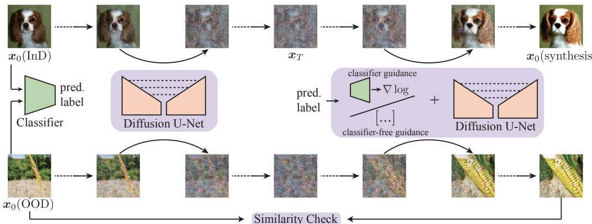
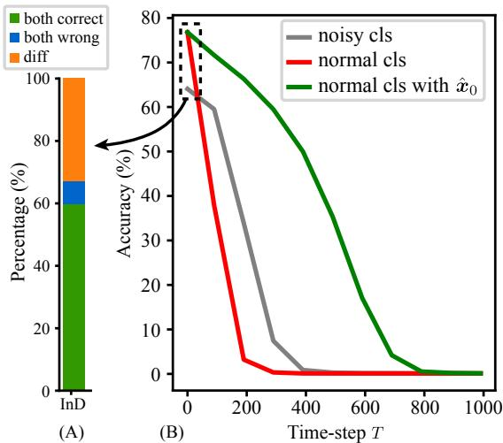
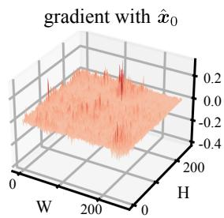
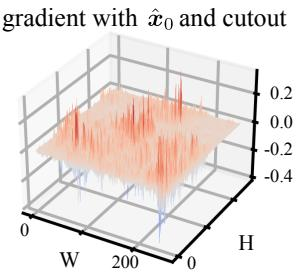
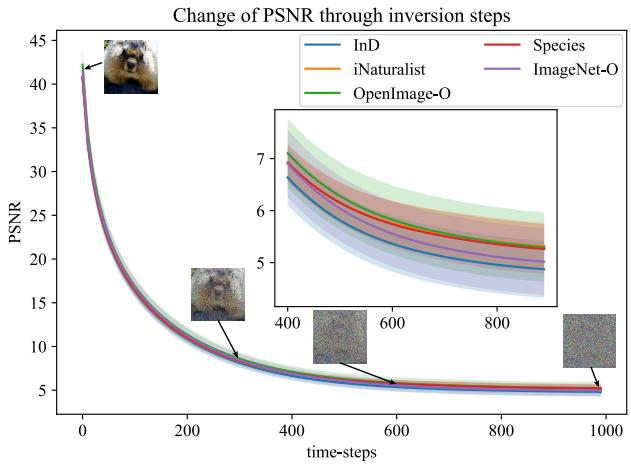
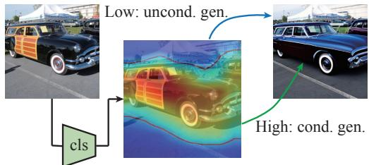
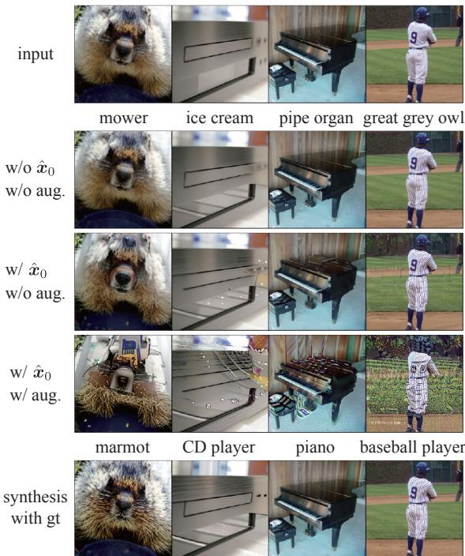
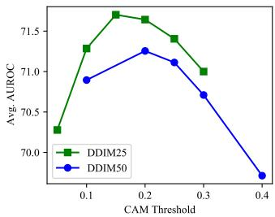
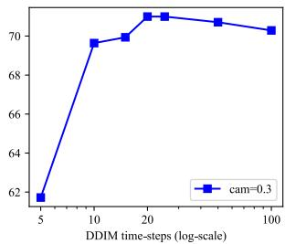

# DIFFGUARD: Semantic Mismatch-Guided Out-of-Distribution Detection using Pre-trained Diffusion Models

Ruiyuan Gao† Chenchen Zhao† Lanqing Hong‡ Qiang Xu† †The Chinese University of Hong Kong ‡Huawei Noah’s Ark Lab {rygao, cczhao, qxu}@cse.cuhk.edu.hk honglanqing@huawei.com

## Abstract

Given a classifier, the inherent property of semantic Outof-Distribution (OOD) samples is that their contents differ from all legal classes in terms ofsemantics, namely semantic mismatch. There is a recent work that directly applies it to OOD detection, which employs a conditional Generative Adversarial Network (cGAN) to enlarge semantic mismatch in the image space. While achieving remarkable OOD detection performance on small datasets, it is not applicable to IMAGENET-scale datasets due to the difficulty in training cGANs with both input images and labels as conditions.

As diffusion models are much easier to train and amenable to various conditions compared to cGANs, in this work, we propose to directly use pre-trained diffusion models for semantic mismatch-guided OOD detection, named DIFFGUARD. Specifically, given an OOD input image and the predicted label from the classifier, we try to enlarge the semantic difference between the reconstructed OOD image under these conditions and the original input image. We also present several test-time techniques to further strengthen such differences. Experimental results show that DIFFGUARD is effective on both CIFAR-10 and hard cases of the large-scale IMAGENET, and it can be easily combined with existing OOD detection techniques to achieve state-of-the-art OOD detection results.

## 1. Introduction

The effectiveness of deep learning models is largely contingent on the independent and identically distributed (i.i.d.) data assumption, i.e., test sets follow the same distribution as training samples [22]. However, in real-world scenarios, this assumption often does not hold true [6]. Consequently, the task of out-of-distribution (OOD) detection is essential for practical applications, so that OOD samples can be rejected or taken special care of without harming the system’s performance [12].

For image classifiers, a primary objective of OOD detection is to identify samples having semantic shifts, whose contents differ from all legal classes in the training dataset [50]. To differentiate such OOD samples and in-distribution (InD) ones, some existing solutions utilize information from the classifier itself, such as internal features [44], logits [11], or both [46]. While simple, these solutions inevitably face a trade-off between the InD classification accuracy and the over-confidence of the trained classifier for OOD detection [32], especially on hard OOD inputs. Some other methods propose using an auxiliary module for OOD detection based on either reconstruction quality [3] or data density [34]. The auxiliary module does not affect the training process of the classifier, but these methods tend to have a low OOD detection capability.

To the best of our knowledge, MoodCat [51] is the only attempt that directly models the semantic mismatch of OOD samples for detection. Specifically, it employs a conditional Generative Adversarial Network (cGAN) to synthesize an image conditioned on the classifier’s output label together with the input image. For InD samples with correct labels, the synthesis procedure tries to reconstruct the original input; while for OOD samples with semantically different labels, ideally the synthesis result is dramatically different from the input image, thereby enabling OOD detection. While inspiring, due to the difficulty in cGAN training with potentially conflicting conditions, MoodCat is not applicable to IMAGENET-scale datasets.

Recently, diffusion models have surpassed GANs in terms of both training stability and generation quality. Moreover, they are amenable to various conditions during generation, including both label conditions [42, 16] and image-wise conditions through DDIM inversion [40]. With the above benefits, we propose a new semantic mismatchguided OOD detection framework based on diffusion models, called DIFFGUARD. Similar to [51], DIFFGUARD takes both the input image and the classifier’s output label as conditions for image synthesis and detects OODs by measuring the similarity between the input image and its conditional synthesis result.

However, it is non-trivial to apply diffusion models for semantic mismatch identification. A critical problem with label guidance in diffusion models is the lack of consideration for the classifier-under-protection. This issue arises in both types of guidance in diffusion models, namely classifier guidance1 [42] and classifier-free guidance [16]. If the guidance cannot match the semantics of the classifier’s output, the synthesis result may fail to highlight the semantic mismatch of OODs. To address this problem, we propose several techniques that effectively utilize information from the classifier-under-protection. Additionally, we propose several test-time enhancement techniques to balance the guidance between the input image and the label condition during generation, without even fine-tuning the diffusion model.

We evaluate the effectiveness of the proposed framework on the standard benchmark, OpenOOD [49]. Given CIFAR-10 or IMAGENET as the InD dataset, DIFFGUARD outperforms or is on par with existing OOD detection solutions, and it can be easily combined with them to achieve state-ofthe-art (SOTA) performance. We summarize the contributions of this paper as follows:

• We propose a diffusion-based framework for detecting OODs, which directly models the semantic mismatch of OOD samples, and it is applicable to IMAGENET-scale datasets;

• We propose several test-time techniques to improve the effectiveness of conditioning in OOD detection. Our framework can work with any pre-trained diffusion models without the need for fine-tuning, and can provide plug-and-play OOD detection capability for any classifier;

• Experimental results show that our framework achieves SOTA performance on CIFAR-10 and demonstrates strong differentiation ability on hard OOD samples of IMAGENET.

The rest of the paper is organized as follows. Section 2 introduces related OOD detection methods and diffusion models. Section 3 presents our framework and details the proposed solution. Experimental results are presented in Section 4. We also provide discussion on limitations and future works in Section 5. Finally, we conclude this paper in Section 6.

## 2. Related Work

This section begins by surveying existing OOD detection methods. Especially, we demonstrate diffusion models for OOD detection, and talk about the differences between our method and other reconstruction-based ones.

OOD Detection Methods. In general, OOD detection methods can be categorized as classification-based or generation-based.

Classification-based methods utilize the output from the classifier-under-protection to differentiate between OODs and InDs. For methods that do not modify the classifier, ODIN [25], ViM [46], MLS [11], and KNN [44] are typical ones. They extract and utilize information in the feature space (e.g., KNN), the logits space (e.g., MLS, ODIN), or both (e.g., ViM). Other methods modify the classifier by proposing new losses [17] or data augmentation techniques [43, 30], or using self-supervised training [37, 45].

Generation-based methods typically have a wider range of applications than classification-based ones because they have no restriction on classifiers. Most generation-based methods focus on either reconstruction quality based on inputs [3, 36] or likelihood/data-density estimated from the generative model [1, 39]. Their basic assumption is that generative models trained with InD data may fail to make high-quality reconstructions [3] or project OODs to lowdensity areas of the latent space [34]. However, this assumption may not hold true [31, 20]. In contrast, conditional synthesis does not rely on such an assumption. it differentiates OODs by constructing semantic mismatch (e.g., [51] uses cGAN). Since semantic mismatch is the most significant property of OODs, this kind outperforms reconstruction-based ones.

Our method leverages conditional image synthesis, which shares the same benefits as [51]. However, our method outperforms cGAN in terms of model training. DIFFGUARD is compatible with any normally trained diffusion models, which eliminates the need for additional training process.

Diffusion Models. Following a forward transformation from the image distribution to the Gaussian noise distribution, diffusion models [15] are generative models trained to learn the reverse denoising process. The process can be either a Markov [15] or a non-Markov process [40]. The recently proposed Latent Diffusion Model (LDM) [35] is a special kind. LDM conducts the diffusion process in a latent space to make the model more efficient.

Diffusion Models for OOD Detection. Previously, researchers primarily utilize the reconstruction ability of diffusion models for detecting OOD and novelty instances. They achieve this by measuring the discrepancy between the input image and its reconstructed counterpart. For example, [30] trains a binary classifier with training data generated from the diffusion models to differentiate OODs. [27] conducts noise augmentations to input images and then compares the differences between the denoised images and the inputs for OOD detection. Similarly, [8] also uses diffusion models in a reconstruction-based manner, establishing a range of noise levels for the addition and removal of noise.

  
Figure 1. An overview of the DIFFGUARD framework with diffusion models. We first use DDIM inversion to get the latent embedding $( { \pmb x } _ { T } )$ of the input $( \pmb { x } _ { 0 }$ left). Then, we apply conditional image synthesis towards the label predicted by the classifier-under-protection. Finally, we differentiate OODs based on the similarity between the input and the synthesis. Both classifier guidance and classifier-free guidance can be applied to this framework.

Although reconstruction is one of the functions of diffusion models, a more significant advantage of diffusion models is their flexibility to handle different conditions. Our paper employs diffusion models in detecting OODs with semantic mismatch. By utilizing both input images and semantic labels as conditions for generation, diffusion models highlight the semantic mismatch on OODs, thus facilitating the differentiation of OODs from InDs.

## 3. Method

In this section, we first demonstrate some preliminaries about diffusion models. Then, we present our DIFFGUARD, which uses diffusion models for OOD detection.

## 3.1. Preliminaries

Our method is based on three significant techniques: classifier-guidance [42], classifier-free guidance [16], and DDIM inversion [40]. The first two pertain to label conditioning methods in diffusion, whereas the last one is associated with image conditioning. We provide a concise overview of these techniques.

Conditional Diffusion Models. As a member of generative models, diffusion models generate images $\mathbf { \Gamma } ( \pmb { x } _ { 0 } )$ through a multi-step denoising (reverse) process starting from Gaussian noise (xT). This process was first formulated as a Markov process by Ho et al. [15] with the following forward (diffusion) process:

$$
\begin{array} { r } { q ( \pmb { x } _ { 1 : T } | \pmb { x } _ { 0 } ) : = \prod _ { t = 1 } ^ { T } q ( \pmb { x } _ { t } | \pmb { x } _ { t - 1 } ) } \end{array}\tag{1}
$$

where

$$
q ( \pmb { x } _ { t } | \pmb { x } _ { t - 1 } ) : = \mathcal { N } \left( \sqrt { \frac { \alpha _ { t } } { \alpha _ { t - 1 } } } \pmb { x } _ { t - 1 } , ( 1 - \frac { \alpha _ { t } } { \alpha _ { t - 1 } } ) \pmb { I } \right)\tag{2}
$$

and the decreasing sequence $\alpha _ { 1 : T } \in ( 0 , 1 ] ^ { T }$ is the transition coefficient. After refactoring the process to be non-Markov,

Song et al. [40] proposed a skip-step sampling strategy to speedup the generation, as in Eq. (3), where $t \in [ 1 , . . . , T ]$ $\epsilon _ { t } \sim \mathcal { N } ( \mathbf { 0 } , I )$ is the standard Gaussian noise independent of ${ \mathbf { } } x _ { t } ,$ and $\epsilon _ { \theta } ^ { ( t ) }$ is the estimated noise by the model θ at timestep t. The sampling process can be performed on any sub-sequence $t \in \tau \subset [ 1 , . . . , T ]$

$$
\begin{array} { r l r } {  { \pmb { x } _ { t - 1 } = \sqrt { \alpha _ { t - 1 } } \bigg ( \frac { \pmb { x } _ { t } - \sqrt { 1 - \alpha _ { t } } \epsilon _ { \theta } ^ { ( t ) } ( \pmb { x } _ { t } ) } { \sqrt { \alpha _ { t } } } \bigg ) } } \\ & { } & { + \sqrt { 1 - \alpha _ { t - 1 } - \sigma _ { t } ^ { 2 } } \cdot \epsilon _ { \theta } ^ { ( t ) } ( \pmb { x } _ { t } ) + \sigma _ { t } \epsilon _ { t } } \end{array}\tag{3}
$$

Under this formulation, there are two ways to apply the label semantic condition y to the generation process: classifier guidance and classifier-free guidance. For classifier guidance [42, 4], the condition-guided noise prediction $\hat { \epsilon } ( \pmb { x } _ { t } )$ is given by (we omit θ and t in $\epsilon ( \cdot ) )$ :

$$
\widehat { \epsilon } ( \pmb { x } _ { t } ) : = \epsilon ( \pmb { x } _ { t } ) + s \sqrt { 1 - \alpha _ { t } } \cdot \nabla _ { \pmb { x } _ { t } } \log p _ { \phi } ( \pmb { y } | \pmb { x } _ { t } ) ,\tag{4}
$$

where log $p _ { \phi }$ is given by a classifier trained on noisy data $\mathbf { \Delta } \mathbf { x } _ { t } .$ , and s is to adjust the guidance scale $( i . e .$ , strength of the guidance). For classifier-free guidance [16, 33], a conditional diffusion model $\bar { \epsilon } _ { \theta } ^ { ( t ) } ( \boldsymbol x _ { t } , \boldsymbol y )$ is trained. The training objective is the same as vanilla diffusion models, but ϵ changes to ϵ˜ during inference as follows (we omit θ and t):

$$
\tilde { \epsilon } ( x _ { t } , y ) : = \bar { \epsilon } ( x _ { t } , \emptyset ) + \omega [ \bar { \epsilon } ( x _ { t } , y ) - \bar { \epsilon } ( x _ { t } , \emptyset ) ] ,\tag{5}
$$

where $\omega$ is to adjust the guidance scale. Both classifier guidance and classifier-free guidance are qualified for conditional generation.

The Inversion Problem of Diffusion Models. For generative models, applying the input image as a condition for synthesis can be done by solving the inversion problem [47]. By applying score matching [41] to the formulated SDE, the diffusion process can be converted into an

Ordinary Differential Equation (ODE) [42], which provides a deterministic transformation between an image and its latent. This is also applied to the inference process of DDIM (where $\sigma = 0$ in Eq. (3)). Thus, the diffusion process from an image $\mathbf { \Gamma } ( \pmb { x } _ { 0 } )$ to its latent $( { \pmb x } _ { T } )$ is given by:

$$
\begin{array} { r l } & { \pmb { x } _ { t + 1 } = \sqrt { \alpha _ { t + 1 } } \bigg ( \frac { \pmb { x } _ { t } - \sqrt { 1 - \alpha _ { t } } \epsilon \big ( \pmb { x } _ { t } \big ) } { \sqrt { \alpha _ { t } } } \bigg ) } \\ & { \qquad + \sqrt { 1 - \alpha _ { t + 1 } } \epsilon \big ( \pmb { x } _ { t } \big ) , \mathrm { w h e r e } t \in [ 0 , . . . , T - 1 ] . } \end{array}\tag{6}
$$

Such a latent can be used to reconstruct the input through the denoising process.

## 3.2. Diffusion Models for OOD Detection

We show an overview of the proposed framework in Fig. 1. Given a classifier-under-protection, we utilize its prediction of the input and synthesize a new image conditioned on both the predicted label and the input. Intuitively, if the predicted label does not match the input (i.e., OOD), dissimilarity will be evident between the synthesis and the input, and vice versa. Then, we can assess whether an input image is OOD by evaluating the similarity between the input and its corresponding synthesis.

For the two conditions, the label condition tends to change the content to reflect its semantics while the input image condition tends to keep the synthesis as original. Therefore, the main challenge of our method is to apply and balance the two conditions. To handle the input image as a condition, diffusion models’ inversion ability (e.g., DDIM [40]) serves as an advantage in faithfully restoring the contents. For the label condition, since there are two fundamentally different methods in diffusion, namely classifier guidance and classifier-free guidance, we propose different techniques for them to better differentiate OODs. We demonstrate the proposed methods respectively in the following of this section.

## 3.2.1 Diffusion with Classifier Guidance

In classifier-guided diffusion models, the classifier trained on noisy data is the key to conditional generation, as shown in Eq. (4). However, directly using a classifier trained on such data for OOD detection is problematic. With a different training process, the classifier may predict differently from the classifier-under-protection, even on clean samples. As shown in Fig. 2 (A), when using a ResNet50 as the classifier-under-protection, differences in prediction exist in nearly 35% of the image samples.

The problem above hinders us from using a noisy classifier for guidance. In this section, we replace the noisy classifier $\phi$ with the exact classifier-under-protection $\phi _ { n }$ . Then, we propose two techniques for better utilization of the classifier for OOD detection.

  
Figure 2. Different behavior between a noisy classifier and a normal ResNet50 classifier on IMAGENET validation. (A) Conflicting predictions: nearly 35% of the predictions are different; (B) The accuracy degradation throughout the diffusion process.

  
Figure 3. Gradient visualizations of classifier-guided diffusion with (right) and without (left) cutout at $t = 6 0 0$ . We use a normal ResNet50 classifier from IMAGENET.

Tech #1: Clean Grad: using the gradient from a normal classifier. At the right-hand side of Eq. (3), the first term can be interpreted as an estimation of ${ \pmb x } _ { 0 } ,$ i.e., $\begin{array} { r } { \hat { \pmb { x } } _ { 0 } = \frac { \pmb { x } _ { t } - \sqrt { 1 - \alpha _ { t } } \epsilon _ { \theta } ^ { ( t ) } ( \pmb { x } _ { t } ) } { \sqrt { \alpha _ { t } } } } \end{array}$ . In this case, we can use $\scriptstyle { \hat { \mathbf { x } } } _ { 0 }$ as a substitute of $\mathbf { \Delta } _ { \mathbf { \mathcal { X } } _ { t } }$ . Calculation of the gradient on $\mathbf { \Delta } _ { \mathbf { \mathcal { X } } _ { t } }$ in Eq. (4) can be transformed into that on $\hat { \mathbf { x } } _ { 0 } .$ , shown as follows:

$$
\nabla _ { \pmb { x } _ { t } } \log p _ { \phi } ( y | \pmb { x } _ { t } ) : = \nabla _ { \pmb { x } _ { t } } \log p _ { \phi _ { n } } ( y | \hat { \pmb { x } } _ { 0 } ( \pmb { x } _ { t } ) ) .\tag{7}
$$

With such an $\scriptstyle { \hat { \mathbf { x } } } _ { 0 }$ as input, the classifier can provide a correct gradient of log-probability for a wide range of $t ,$ thus offering more accurate generation directions and leading to better semantic guidance.

To understand the operation, we plot the changes in classification accuracy with different time-steps t, shown in Fig. 2 (B). The classification accuracy reflects the prediction quality of log ${ \mathrm { . } } p ,$ and thus the quality of ∇ log p. With the noisy $\mathbf { \Delta } _ { \mathbf { \mathcal { X } } _ { t } }$ as input, the accuracy of the normal classifier degrades more dramatically than the noisy classifier. However, with $\scriptstyle { \hat { \mathbf { x } } } _ { 0 }$ as input, the classification accuracy of the normal classifier reduces much slower than the other two cases.

Besides, we propose that data augmentation is important to successfully applying a normal classifier. Using $\hat { \pmb x } _ { 0 } .$ , the gradient of a normal classifier is relatively small and flat, as shown in Fig. 3 left. Since gradient is the only term representing the direction of semantics in Eq. (4), it is hard for a flat gradient to effectively change the semantics of the image during synthesis. To solve this problem, we propose to use data augmentations $( i . e . ,$ , random cutout) as follows:

$$
\begin{array} { r } { \nabla _ { \pmb { x } _ { t } } \log p _ { \phi } ( \pmb { y } | \pmb { x } _ { t } ) : = \nabla _ { \pmb { x } _ { t } } \log p _ { \phi _ { n } } ( \pmb { y } | \coth ( \hat { \pmb { x } } _ { 0 } ( \pmb { x } _ { t } ) ) ) . } \end{array}\tag{8}
$$

On the one hand, the gradient with augmentations is sharper and with higher amplitude (shown in Fig. 3 right), which is better for effective semantic changes on the image than that without augmentations. On the other hand, gradients corresponding to different augmentations can be accumulated to form more comprehensive guidance. To better interpret the effect, we provide a qualitative ablation study in Sec. 4.4.

Tech #2: Adaptive Early-Stop (AES) of the diffusion process. From Fig. 2 (B), we notice that both classifiers experience a sharp accuracy drop with increasing t. This reminds us that there exists a $t _ { s t o p }$ such that the classifier cannot provide meaningful semantic guidance when $t > t _ { s t o p }$ Therefore, it is necessary to apply early-stop when performing image inversion.

Instead of setting a fixed step to stop, we propose to adaptively stop the inversion process according to the quality of the diffused image. Specifically, we use distance metrics (e.g., Peak Signal-to-Noise Ratio (PSNR) and DISTS [5]) to measure the pixel-level difference between the diffused image and the corresponding image input. If the quality degradation exceeds a given threshold, we stop the diffusion and start the synthesis (denoising) process. Empirically, such a threshold is located around $t = 6 0 0 = 3 / 5 T$ , as evidenced from Fig. 2 (B).

The principle of using the adaptive manner of early-stop lies in the trade-off between consistency and controllability. The early-stop technique is adopted in several literatures [23, 26], as image inversion through DDIM occasionally fails to guarantee a coherent reconstruction. Specifically, fewer inversion/generation steps lead to better consistency but lower controllability, and vice versa [29]. For example, LPIPS is used in [23] as a measure to balance image editing strength and generation quality.

For OOD detection tasks, we observe that InD and OOD samples have different patterns of quality degradation through the inversion process, especially reflected by PSNR and DISTS. Fig. 4 shows such a phenomenon. The empirical fact that InD data has faster quality degradation rates than OOD data acts as a good property to monitor the diffusion process. As a result, we can set a proper threshold with different purposes for InD and OOD samples. The threshold generally corresponds to fewer diffusion steps on InD samples, ensuring faithful reconstruction. Simultaneously, it also leads to greater steps on OOD samples, ensuring better controllability towards label conditions, and thus more significant differences compared with the inputs.

  
Figure 4. PSNR changes throughout the diffusion process. The data is collected from the IMAGENET validation set and 4 OOD datasets, with a ResNet50 classifier.

  
Figure 5. Illustration of the classifier-free guidance with CAM. CAM helps to utilize information given by the classifier-underprotection. For areas with high activation, we conduct labelguided generation; for areas with low activation, we drop the label guidance and perform the original DDIM-based reconstruction.

## 3.2.2 Diffusion with Classifier-Free Guidance

Classifier-free guidance [16] relies on a trained conditional diffusion model. Benefiting from the conditional training process, it is not necessary to further apply an external classifier. In addition, the attention-based condition injection results in better coherence between the synthesis and the given label condition [33]. However, we find that the guidance scale (ω in Eq. (5)) of the condition is a doubleedged sword. For semantic mismatch, we rely on the differences between the syntheses given consistent and inconsistent conditions. A small guidance scale cannot provide semantic changes large enough to drive the OOD samples towards the inconsistent predictions, while a large guidance scale drastically changes both InD and OOD samples, also increasing the difficulty in differentiation. Therefore, it is critical to reach a trade-off with this single parameter.

Tech #3: Distinct Semantic Guidance (DSG). To solve the issue stated above, we apply the Class Activation Map (CAM [38]) of the classifier-under-protection to impose restrictions on the generation process. Specifically, we apply classifier-free guidance to high-activation areas while applying the vanilla unconditional generation to other areas, with the procedure shown in Fig. 5.

While using masks to guide the generation process differently has been a common practice in image editing [33, 14], CAM in DSG associates the label guidance with the classifier-under-protection, which provides crucial information to construct and highlight semantic mismatch.

According to the CAM, high-activation areas are crucial to prediction, thus having a direct correlation with the predicted label, and vice versa. For InD samples, applying the guidance to high-activation areas effectively limits its scope of effect, thus mitigating unwanted distortions; for OOD cases, guidance on these areas leads to high inconsistency, as they are forced to embed target semantics that they do not originally have. As a result, we can easily differentiate OOD cases by similarity measurements.

## 4. Experiments

## 4.1. Experimental Setups

Benchmarks and Datasets. We evaluate DIFFGUARD following a widely adopted semantic OOD detection benchmark, OpenOOD [49]. OpenOOD unifies technical details in evaluation (e.g., image pre-processing procedures and classifiers) and proposes a set of evaluation protocols for OOD detection methods. For each InD dataset, it categorizes OODs into different types (i.e., near-OOD and far-OOD) for detailed analyses.

In this paper, we employ CIFAR-10 [21] and IMA-GENET [22] as InD samples, respectively. CIFAR-10 is mostly adopted for evaluation, though being small in scale. We choose near-OODs (i.e. CIFAR-100 [21] and TINYIMAGENET [24]). For large-scale evaluation, we set IMAGENET as InD. OODs are also selected from the near-OODs in OpenOOD: Species [11], iNaturalist [18], ImageNet-O [13], and OpenImage-O [46].

Metrics. Following OpenOOD, we adopt the Area Under Receiver Operating Characteristic curve (AUROC) as the main metric for evaluation. AUROC reflects the overall detection capability of a detector. Besides, we consider FPR@95, which evaluates the False Positive Rate (FPR) at 95% True Positive Rate (TPR). The widely used 95% TPR effectively reflects the performance in practice.

Baselines. For comparison, we consider two types of baselines. For classification-based methods, we involve recently proposed well-performing methods, including EBO [28], KNN [44], MLS [11] and ViM [46]. EBO uses energy-based functions based on the output from the classifier. KNN performs OOD detection by calculating the non-parametric nearest-neighbor distance. MLS identifies the value of the maximum logit scores (without softmax). ViM proposes to combine logits with features for OOD detection. All of them are strong baselines according to OpenOOD. For generation-based methods, we consider a recent method, DiffNB [27], which utilizes the denoising ability of diffusion and performs reconstruction within the neighborhood. Following OpenOOD, all the classificationbased baselines work on both CIFAR-10 and IMAGENET. For DiffNB, we use the official implementation and only compare with it on CIFAR-10.

<table><tr><td rowspan="2">Method</td><td colspan="2">CIFAR-100</td><td colspan="2">TINYIMAGENET</td><td colspan="2">average</td></tr><tr><td>↑</td><td>↓</td><td>AUROC FPR@95AUROC FPR @95A ↑</td><td>↓</td><td>AUROC FPR@95 ↑</td><td>↓</td></tr><tr><td>EBO [28]</td><td>86.19</td><td>51.32</td><td>88.61</td><td>44.89</td><td>87.41</td><td>48.11</td></tr><tr><td>KNN [44]</td><td>89.62</td><td>52.19</td><td>91.48</td><td>46.18</td><td>90.55</td><td>49.19</td></tr><tr><td>MLS[11]</td><td>86.14</td><td>52.04</td><td>88.53</td><td>45.38</td><td>87.34</td><td>48.71</td></tr><tr><td>ViM[46]</td><td>87.16</td><td>56.81</td><td>88.85</td><td>52.89</td><td>88.01</td><td>54.85</td></tr><tr><td>MC-Dropout[7]</td><td>86.74</td><td>61.49</td><td>88.32</td><td>58.44</td><td>87.53</td><td>59.97</td></tr><tr><td>Deep Ens.[9]</td><td>89.97</td><td>54.61</td><td>91.31</td><td>51.23</td><td>90.64</td><td>52.92</td></tr><tr><td>ConfidNet*[2]</td><td>85.92</td><td>72.37</td><td>87.16</td><td>69.75</td><td>86.54</td><td>71.06</td></tr><tr><td>DiffNB [27]</td><td>89.79</td><td>53.23</td><td>91.77</td><td>45.88</td><td>90.78</td><td>49.56</td></tr><tr><td>Ours</td><td>89.88</td><td>52.67</td><td>91.88</td><td>45.48</td><td>90.88</td><td>49.08</td></tr><tr><td>Ours+EBO</td><td>89.93</td><td>50.77</td><td>91.95</td><td>43.58</td><td>90.94</td><td>47.18</td></tr><tr><td>OurS+Deep Ens.</td><td>90.40</td><td>52.51</td><td>91.98</td><td>45.04</td><td>91.19</td><td>48.78</td></tr><tr><td>Ours(Oracle)</td><td>98.34</td><td>7.94</td><td>98.52</td><td>7.11</td><td>98.43</td><td>7.53</td></tr></table>

Table 1. The OOD detection performance with CIFAR-10 as InD. The diffusion model uses classifier-free guidance. All the values are in percentages. ↑ / ↓ indicates that a higher/lower value is better. The best results are in bold, and the second best results are in underlined italic. (Oracle) indicates we use an Oracle InD classifier. ∗ use VGG16 classifier.

Diffusion Models. To evaluate the OOD detection ability of DIFFGUARD, we consider different types of diffusion models. Specifically, on CIFAR-10, we use the same pretrained model as DiffNB, which is a conditional DDPM [15] with classifier-free guidance. On IMAGENET, we use the unconditional Guided Diffusion Model (GDM) [4] and apply classifier guidance. GDM is an advanced version of DDPM [15] with optimizations on the architecture and the model training process. Besides, we also adopt the Latent Diffusion Model (LDM) [35] as an example of classifierfree guidance. As stated in Sec. 2. LDM is a prevailing diffusion model in text-guided image generation [52] due to its efficient architecture.

Classifiers-under-protection. We directly apply the off-the-shelf settings of classifiers-under-protection established by OpenOOD. Specifically, we use ResNet18 [10] trained on CIFAR-10 and ResNet50 [10] trained on IMA-GENET. The pre-trained weights for both can be found in OpenOOD’s GitHub2.

<table><tr><td rowspan="2">Method</td><td colspan="2">Species</td><td colspan="2">iNaturalist</td><td colspan="2">OpenImage-O</td><td colspan="2">ImageNet-O</td><td colspan="2">Average</td></tr><tr><td>AUROC↑FPR@95↓</td><td></td><td>AUROC↑FPR@95↓</td><td></td><td>AUROC↑FPR@95↓</td><td></td><td>AUROC↑FPR@95↓</td><td></td><td>AUROC↑FPR@95↓</td><td></td></tr><tr><td>EBO [28]</td><td>72.04</td><td>82.33</td><td>90.61</td><td>53.83</td><td>89.15</td><td>57.10</td><td>41.91</td><td>100.00</td><td>73.43</td><td>73.31</td></tr><tr><td>KNN [44]</td><td>76.38</td><td>76.19</td><td>85.12</td><td>68.41</td><td>86.45</td><td>57.56</td><td>75.37</td><td>84.65</td><td>80.83</td><td>71.70</td></tr><tr><td>ViM [46]</td><td>70.68</td><td>83.94</td><td>88.40</td><td>67.85</td><td>89.63</td><td>57.56</td><td>70.88</td><td>85.30</td><td>79.90</td><td>73.66</td></tr><tr><td>MLS [11]</td><td>72.89</td><td>80.87</td><td>91.15</td><td>50.80</td><td>89.26</td><td>57.11</td><td>40.85</td><td>100.00</td><td>73.54</td><td>72.20</td></tr><tr><td>Ours(GDM)</td><td>73.19±0.18</td><td>83.68±0.22</td><td>85.81±0.16</td><td>71.23±0.54</td><td>82.32±0.30</td><td>74.80±0.38</td><td>65.23±0.19</td><td>87.74±0.20</td><td>76.64±0.13</td><td>79.36±0.12</td></tr><tr><td>Ours(LDM)</td><td>65.87</td><td>91.70</td><td>75.64</td><td>79.06</td><td>73.92</td><td>81.19</td><td>68.57</td><td>84.35</td><td>71.00</td><td>84.08</td></tr><tr><td>Ours(GDM)+KNN</td><td>77.81+1.43</td><td>71.04-5.15</td><td>90.19+5.07</td><td>48.79-19.62</td><td>87.80+1.35</td><td>52.80-4.76</td><td>75.68+0.31</td><td>80.85-3.80</td><td>82.87+2.04</td><td>63.37-8.33</td></tr><tr><td>Ours(GDM)+ViM</td><td>74.48+3.80</td><td>72.26-11.68</td><td>92.50+4.10</td><td>39.09-28.76</td><td>91.11+1.48</td><td>45.02-12.54</td><td>72.42+1.54</td><td>82.30-3.00</td><td>82.63+2.73</td><td>59.67-14.00</td></tr><tr><td>Ours(LDM)+viM</td><td>71.08+0.40</td><td>82.20-1.74</td><td>89.39+0.99</td><td>61.01-6.84</td><td>89.65+0.02</td><td>55.83-1.73</td><td>74.85+3.97</td><td>81.95-3.35</td><td>81.24+1.35</td><td>70.25-3.41</td></tr><tr><td>Ours(GDM)+MLs</td><td>75.95+3.06</td><td>70.31-10.56</td><td>93.03+1.88</td><td>30.74-20.06</td><td>90.74+1.48</td><td>40.61-16.50</td><td>65.72+24.87</td><td>87.05-12.95</td><td>81.36+7.82</td><td>57.18-15.02</td></tr><tr><td>Ours(LDM)+MLs</td><td>73.69+0.80</td><td> $7 5 . 9 1 _ { - 4 . 9 6 }$ </td><td>91.55+0.40</td><td>43.56-7.24</td><td>89.61+0.35</td><td>50.61-6.50</td><td>69.33+28.48</td><td>84.00-16.00</td><td>81.05+7.51</td><td>63.52-8.68</td></tr></table>

Table 2. The OOD detection performance with IMAGENET as InD. GDM uses classifier guidance, while LDM uses classifier-free guidance. All the values are in percentages. $\uparrow / \downarrow$ indicates that a higher/lower value is better. The best results are in bold. We highlight the comparisons with colors when combining DIFFGUARD with other baselines. For AUROC with Ours(GDM), we present the average and standard deviation over four runs. There is no randomness in LDM.

Similarity Metric. For simplicity, we use generic similarity metrics across different diffusion models and different OODs. Specifically, we choose $\ell _ { 1 }$ distance on logits between input image and its synthetic counterpart for CIFAR-10 benchmark, as in [27]; choose DISTS distance [19] for IMAGENET benchmark (except Table 4).

Note that all diffusion models are pre-trained only with InD data. We do not fine-tune them. For more implementation details, please refer to the supplementary material.

## 4.2. Results on CIFAR-10

Table 1 shows the results on CIFAR-10. DIFFGUARD outperforms or at least is on par with other methods on these two near-OOD datasets. In terms of AUROC, DIFFGUARD performs better than all other baselines. DIFFGUARD inherits the merit of image space differentiation in generationbased methods, which makes it better than classificationbased ones. By highlighting the semantic mismatch, it further outperforms the generation-based DiffNB even with the same diffusion model. In terms of FPR@95, DIFF-GUARD also outperforms DiffNB. Although classificationbased methods perform slightly better than ours, we show that DIFFGUARD can work with them to establish new SO-TAs. Specifically, the combined method only trusts samples with high detection confidence by the baselines, while resorting to DIFFGUARD for hard cases. As an example, DIFFGUARD + Deep Ensemble performs best on AUROC and DIFFGUARD + EBO performs best on FPR@95 in the near-OOD benchmark for CIFAR-10.

Note that the semantic mismatch utilized by DIFF-GUARD comes from the predicted label and the input image. Wrong prediction from the classifier on InDs may affect the performance of the framework. To avoid such negative effects, we establish a hypothetical oracle classifier, as shown in the last row of Table 1. Specifically, this oracle classifier outputs the ground-truth labels for InDs and random labels for OODs. We notice both results get improved by a large margin. Especially, DIFFGUARD can reach a 95% TPR with very low FPRs. In practice, such a phenomenon reminds us of a common property in OOD detection [51, 46]: the performance (of DIFFGUARD) can improve with the increasing accuracy of the classifier.

## 4.3. Results on IMAGENET

Table 2 shows the results on the IMAGENET benchmark. IMAGENET is hard for OOD detection due to both its large scale and difficulty in semantic differentiation. We investi gate the ability of DIFFGUARD in differentiating hard OOD cases. For example, on Species, none of the baselines perform well, while using GDM with DIFFGUARD outperforms all baselines in terms of both AUROC and FPR@95. On ImageNet-O, many baseline methods tend to assign higher scores to OODs rather than InDs, as indicated by AUROC < 50%, which shows they fail to detect OODs. However, DIFFGUARD can still keep its performance and achieve the best FPR@95 with LDM.

We further validate the performance of DIFFGUARD on hard samples by combining it with some classificationbased methods. We use the same method as that on CIFAR-10 (stated in Sec. 4.2). The performance improvements are shown in the last 5 rows of Table 2. Especially, DIFF-GUARD saves the worst-case performance of baselines. For example on ImageNet-O, DIFFGUARD brings considerable improvement to MLS. Besides, for average performance, DIFFGUARD helps to reach SOTA on this benchmark.

Another comparison shown in Table 2 is between GDM and LDM in DIFFGUARD. We notice that GDM performs better in general when used both alone and with other baselines, while LDM stays at a close level and sometimes has a lower FPR@95. As long as the diffusion model can synthesize high-quality images, DIFFGUARD can use it to detect OODs. Beyond OOD detection performance, the choice of diffusion models can be made according to other properties. For example, GDM has a simpler architecture [4], while LDM uses fewer DDIM timesteps (as evidenced in Sec. 4.4), and thus is faster in inference. For different techniques proposed for both classifier guidance and classifierfree guidance, we provide ablation studies to analyze their effectiveness in Sec. 4.4.

## 4.4. Ablation Study

In this section, we provide some in-depth analyses regarding the effectiveness of each technique proposed for DIFFGUARD. For more qualitative analyses such as failure cases, please refer to the supplementary material.

<table><tr><td>Method</td><td colspan="4">Species iNaturalist OpenImage-O ImageNet-O|A</td><td>Average</td></tr><tr><td>w/o æ0, w/o aug</td><td>66.45</td><td>64.80</td><td>48.80</td><td>42.30</td><td>55.59</td></tr><tr><td>only w/ aug</td><td>71.16</td><td>85.77</td><td>74.17</td><td>56.06</td><td>71.79</td></tr><tr><td>only w/ 0</td><td>71.95</td><td>84.11</td><td>80.72</td><td>63.82</td><td>75.15</td></tr><tr><td>Ours</td><td>73.19</td><td>85.81</td><td>82.32</td><td>65.23</td><td>76.64</td></tr></table>

Table 3. Ablation for Clean Grad on GDM with ImageNet as InD. We show AUROC with different OODs. The related settings are the same as in Table 2.

Comparisons of Clean Grad. We ablate the usage of either $\scriptstyle { \hat { x } } _ { 0 }$ or data augmentation in the proposed Clean Grad on classifier guidance, and show how AUROC changes in Table 3. As can be seen, both techniques bring significant improvements. The best results are achieved by combining them together. Besides, we qualitatively validate their effectiveness, as shown in Fig. 6. For simplicity, we only show InD samples and use false-label guidance to show the effects on OODs. First, we identify the difficulty in manipulating noisy semantics with a normal classifier. Without $\scriptstyle { \hat { \mathbf { x } } } _ { 0 }$ or cutout, the diffusion model fails to make visually perceptible modifications. Then, by adding either $\scriptstyle { \hat { \mathbf { x } } } _ { 0 }$ or cutout, we can identify differences to some extent. Finally, after applying both $\scriptstyle { \hat { x } } _ { 0 }$ and data augmentations, the generation results manage to reflect the given label. As a comparison, the model can guarantee faithful reconstruction and negligible distortion when synthesizing with ground-truth labels (last row in Fig. 6). Such results show the effectiveness of our techniques in benefiting similarity measurements, and thus OOD detection.

Early-stop Metrics in AES. As shown in Fig. 4, earlystop contributes to the differentiation ability of DIFF-GUARD. In Table 4, we show the effect of different earlystop metrics and how AUROC varies with their thresholds. We note that different metrics perform differently on different OODs. Specifically, PSNR performs better on Species, while DISTS performs better on the others. In practice, we can combine them together to reach better average-case performance (as shown in the last row of Table 4).

  
Figure 6. Ablation study to show the effectiveness of using $\scriptstyle { \hat { x } } _ { 0 }$ and data augmentations. The images are from the IMAGENET validation set. There is a clear difference between the ground-truthguided syntheses and the false-label-guided ones.

<table><tr><td>PSNR DISTS</td><td></td><td>Species iNaturalist OpenImage-O ImageNet-O</td><td></td><td></td><td>Avg.</td></tr><tr><td>5.89</td><td>-</td><td>63.05</td><td>63.64</td><td>62.86</td><td>50.54</td><td>60.02</td></tr><tr><td>6.39</td><td></td><td>72.29</td><td>72.2</td><td>68.18</td><td>52.28</td><td>66.23</td></tr><tr><td>-</td><td>0.39</td><td>61.20</td><td>75.43</td><td>75.32</td><td>67.73</td><td>69.92</td></tr><tr><td></td><td>0.37</td><td>61.24</td><td>76.49</td><td>75.33</td><td>67.42</td><td>69.83</td></tr><tr><td>6.39</td><td>0.37</td><td>69.91</td><td>81.06</td><td>77.43</td><td>60.66</td><td>72.27</td></tr></table>

Table 4. Ablation on early-stop metrics (PSNR and DISTS) for GDM (classifier guidance). We report the best AUROC calculated with DISTS, GMSD [48] and $\ell _ { 2 }$ distance for each OODs from the IMAGENET benchmark. The best results are in bold. We choose underlined thresholds at $t = 3 / 5 T$ , as stated in Sec. 3.2.1

In practice, it could be easy to choose a proper threshold for each distance. As stated in Sec. 3.2.1, the intuition of early-stop is to ensure meaningful semantic guidance by the classifier. Therefore, one can choose an initial threshold according to the change of the classification accuracy as shown in Fig. 2. Here, we pick the values at $t = 3 / 5 T$ and vary slightly to show the effectiveness, shown in Table 4.

CAM Cut-point in DSG. In Sec. 3.2.2, we propose to use CAM to identify semantic-intensive regions, where the cut-point of the CAM is a hyperparameter. Typically, the cut-point can be set around 0.2 for various image synthesis settings. To investigate the impact of the CAM cutpoint, we use LDM with both DDIM-25 (i.e., DDIM with 25 timesteps) and DDIM-50 for image synthesis and calculate the average AUROC. As shown in Fig. 7 left, the optimal cut-point keeps around 0.2 regardless of the changes of timesteps for image synthesis. A larger cut-point implies a smaller area for conditional generation. Setting a too-small area for conditional generation is insufficient for highlighting semantic mismatch, while applying label guidance globally to all pixels of the image is also unsatisfactory. Empirically, balancing the conditional and unconditional generation at CAM ≈ 0.2 achieves the best performance.

  
Figure 7. AUROC varies with the CAM cut-point (left) and the number of DDIM steps (right) for LDM (classifier-free guidance)

Different Diffusion Timesteps. Since the generation process of diffusion models includes multi-step iterations, the number of timesteps is the key to the trade-off between quality and speed. For all diffusion-model-based methods including DIFFGUARD, the trade-off still exists even with the DDIM sampler [40]. To analyze such a trade-off, we test the average AUROC of LDM with different timesteps ranging from 5 to 100. As shown in Fig. 7 right, the AU-ROC has a non-monotonic correlation with the number of time-steps, and the optimal AUROC is achieved by DDIM-25 empirically. Although more timesteps generally lead to better synthesis quality, in our case, the timesteps also affect the impact of label guidance. More guidance steps lead to more significant semantic changes towards the label, potentially leading to more severe distortions. This could explain why fewer steps may perform better for OOD detection. In addition, it is beneficial to have fewer time-steps for faster inference in practice.

## 5. Limitations and Future Work

Our method uses a diffusion model for inference, which inherently has a low inference speed due to its iterative nature. Using NVIDIA V100 32GB, GDM (60 steps) and LDM (25 steps) achieve speeds of 0.05 and 0.53 images/s/GPU respectively. Given that DIFFGUARD relies on diffusion models for both noise addition and denoising, future optimizations should focus on speed improvement in both processes.

## 6. Conclusion

In this paper, we investigate the utilization of pre-trained diffusion models for detecting OOD samples through semantic mismatch. A novel OOD detection framework named DIFFGUARD is proposed, which is compatible with all diffusion models with either classifier guidance or classifier-free guidance. By guiding the generation process of diffusion models with semantic mismatch, DIFFGUARD accentuates the disparities between InDs and OODs, thus enabling better differentiation. Moreover, we propose several techniques to enhance different types of diffusion models for OOD detection. Experimental results show that DIF-FGUARD performs well on both CIFAR-10 and hard cases from the IMAGENET benchmark, without the need for finetuning pre-trained diffusion models.

Acknowledgment. This work was supported in part by the General Research Fund of the Hong Kong Research Grants Council (RGC) under Grant No. 14203521, and in part by the Innovation and Technology Fund under Grant No. MRP/022/20X. We gratefully acknowledge the support of MindSpore, CANN (Compute Architecture for Neural Networks) and Ascend AI Processor used for this research.

## References

[1] Hyunsun Choi, Eric Jang, and Alexander A Alemi. WAIC, but why? Generative ensembles for robust anomaly detection. arXiv preprint arXiv:1810.01392, 2018.

[2] Charles Corbiere, Nicolas Thome, Avner Bar-Hen, Matthieu\` Cord, and Patrick Perez. Addressing failure prediction by´ learning model confidence. In Advances in Neural Information Processing Systems (NeurIPS), volume 32, 2019.

[3] Taylor Denouden, Rick Salay, Krzysztof Czarnecki, Vahdat Abdelzad, Buu Phan, and Sachin Vernekar. Improving reconstruction autoencoder out-of-distribution detection with Mahalanobis distance. arXiv preprint arXiv:1812.02765, 2018.

[4] Prafulla Dhariwal and Alexander Quinn Nichol. Diffusion models beat GANs on image synthesis. In Advances in Neural Information Processing Systems (NeurIPS), volume 34, pages 8780–8794, 2021.

[5] Keyan Ding, Kede Ma, Shiqi Wang, and Eero P. Simoncelli. Image quality assessment: Unifying structure and texture similarity. CoRR, abs/2004.07728, 2020.

[6] Nick Drummond and Rob Shearer. The open world assumption. In eSI Workshop: The Closed World ofDatabases meets the Open World of the Semantic Web, volume 15, page 1, 2006.

[7] Yarin Gal and Zoubin Ghahramani. Dropout as a bayesian approximation: Representing model uncertainty in deep learning. In Proceedings of The 33rd International Conference on Machine Learning. PMLR, 2016.

[8] Mark S Graham, Walter HL Pinaya, Petru-Daniel Tudosiu, Parashkev Nachev, Sebastien Ourselin, and Jorge Cardoso. Denoising diffusion models for out-of-distribution detection.

In Proceedings of the IEEE/CVF Conference on Computer Vision and Pattern Recognition, pages 2947–2956, 2023.

[9] Chuan Guo, Geoff Pleiss, Yu Sun, and Kilian Q. Weinberger. On calibration of modern neural networks. In Proceedings of The 34th International Conference on Machine Learning, 2017.

[10] Kaiming He, Xiangyu Zhang, Shaoqing Ren, and Jian Sun. Deep residual learning for image recognition. In Proceedings of the IEEE/CVF Conference on Computer Vision and Pattern Recognition (CVPR), pages 770–778, 2016.

[11] Dan Hendrycks, Steven Basart, Mantas Mazeika, Andy Zou, Joseph Kwon, Mohammadreza Mostajabi, Jacob Steinhardt, and Dawn Song. Scaling out-of-distribution detection for real-world settings. In International Conference on Machine Learning (ICML), volume 162, pages 8759–8773. PMLR, 2022.

[12] Dan Hendrycks and Kevin Gimpel. A baseline for detecting misclassified and out-of-distribution examples in neural networks. In International Conference on Learning Representations (ICLR), 2017.

[13] Dan Hendrycks, Kevin Zhao, Steven Basart, Jacob Steinhardt, and Dawn Song. Natural adversarial examples. In Proceedings of the IEEE/CVF Conference on Computer Vision and Pattern Recognition (CVPR), pages 15262–15271, 2021.

[14] Amir Hertz, Ron Mokady, Jay Tenenbaum, Kfir Aberman, Yael Pritch, and Daniel Cohen-Or. Prompt-to-prompt image editing with cross attention control. arXiv preprint arXiv:2208.01626, 2022.

[15] Jonathan Ho, Ajay Jain, and Pieter Abbeel. Denoising diffusion probabilistic models. In Advances in Neural Information Processing Systems (NeurIPS), volume 33, pages 6840– 6851, 2020.

[16] Jonathan Ho and Tim Salimans. Classifier-free diffusion guidance. In NeurIPS 2021 Workshop on Deep Generative Models and Downstream Applications, 2021.

[17] Yen-Chang Hsu, Yilin Shen, Hongxia Jin, and Zsolt Kira. Generalized ODIN: Detecting out-of-distribution image without learning from out-of-distribution data. In Proceedings of the IEEE/CVF Conference on Computer Vision and Pattern Recognition (CVPR), pages 10951–10960, 2020.

[18] Rui Huang and Yixuan Li. MOS: Towards scaling out-ofdistribution detection for large semantic space. In Proceedings of the IEEE/CVF Conference on Computer Vision and Pattern Recognition (CVPR), pages 8710–8719, 2021.

[19] Sergey Kastryulin, Jamil Zakirov, Denis Prokopenko, and Dmitry V. Dylov. Pytorch image quality: Metrics for image quality assessment, 2022.

[20] Polina Kirichenko, Pavel Izmailov, and Andrew G Wilson. Why normalizing flows fail to detect out-of-distribution data. In Advances in Neural Information Processing Systems (NeurIPS), volume 33, pages 20578–20589, 2020.

[21] Alex Krizhevsky, Geoffrey Hinton, et al. Learning multiple layers of features from tiny images. 2009.

[22] Alex Krizhevsky, Ilya Sutskever, and Geoffrey E Hinton. ImageNet classification with deep convolutional neural networks. Communications ofthe ACM, 60(6):84–90, 2017.

[23] Mingi Kwon, Jaeseok Jeong, and Youngjung Uh. Diffusion models already have a semantic latent space. In International Conference on Learning Representations (ICLR), 2023.

[24] Ya Le and Xuan Yang. Tiny ImageNet visual recognition challenge. CS 231N, 7(7):3, 2015.

[25] Shiyu Liang, Yixuan Li, and R. Srikant. Enhancing the reliability of out-of-distribution image detection in neural networks. In International Conference on Learning Representations (ICLR), 2018.

[26] Jun Hao Liew, Hanshu Yan, Daquan Zhou, and Jiashi Feng. MagicMix: Semantic mixing with diffusion models. arXiv preprint arXiv:2210.16056, 2022.

[27] Luping Liu, Yi Ren, Xize Cheng, and Zhou Zhao. Outof-distribution detection with diffusion-based neighborhood, 2023.

[28] Weitang Liu, Xiaoyun Wang, John Owens, and Yixuan Li. Energy-based out-of-distribution detection. In Advances in Neural Information Processing Systems (NeurIPS), volume 33, pages 21464–21475, 2020.

[29] Chenlin Meng, Yutong He, Yang Song, Jiaming Song, Jiajun Wu, Jun-Yan Zhu, and Stefano Ermon. SDEdit: Guided image synthesis and editing with stochastic differential equations. In International Conference on Learning Representations (ICLR), 2022.

[30] Hossein Mirzaei, Mohammadreza Salehi, Sajjad Shahabi, Efstratios Gavves, Cees G. M. Snoek, Mohammad Sabokrou, and Mohammad Hossein Rohban. Fake it until you make it: Towards accurate near-distribution novelty detection. In International Conference on Learning Representations (ICLR), 2023.

[31] Eric Nalisnick, Akihiro Matsukawa, Yee Whye Teh, Dilan Gorur, and Balaji Lakshminarayanan. Do deep generative models know what they don’t know? In International Conference on Learning Representations (ICLR), 2019.

[32] Anh Nguyen, Jason Yosinski, and Jeff Clune. Deep neural networks are easily fooled: High confidence predictions for unrecognizable images. In Proceedings of the IEEE/CVF Conference on Computer Vision and Pattern Recognition (CVPR), pages 427–436, 2015.

[33] Alexander Quinn Nichol, Prafulla Dhariwal, Aditya Ramesh, Pranav Shyam, Pamela Mishkin, Bob Mcgrew, Ilya Sutskever, and Mark Chen. GLIDE: Towards photorealistic image generation and editing with text-guided diffusion models. In International Conference on Machine Learning (ICML), volume 162, pages 16784–16804. PMLR, 2022.

[34] Stanislav Pidhorskyi, Ranya Almohsen, and Gianfranco Doretto. Generative probabilistic novelty detection with adversarial autoencoders. In Advances in Neural Information Processing Systems (NeurIPS), volume 31, 2018.

[35] Robin Rombach, Andreas Blattmann, Dominik Lorenz, Patrick Esser, and Bjorn Ommer. High-resolution image¨ synthesis with latent diffusion models. In Proceedings of the IEEE/CVF Conference on Computer Vision and Pattern Recognition (CVPR), pages 10684–10695, 2022.

[36] Thomas Schlegl, Philipp Seebock, Sebastian M Waldstein,¨ Ursula Schmidt-Erfurth, and Georg Langs. Unsupervised anomaly detection with generative adversarial networks to

guide marker discovery. In Proceedings of the International Conference on Information Processing in Medical Imaging (IPMI), pages 146–157. Springer, 2017.

[37] Vikash Sehwag, Mung Chiang, and Prateek Mittal. SSD: A unified framework for self-supervised outlier detection. In International Conference on Learning Representations (ICLR), 2021.

[38] Ramprasaath R Selvaraju, Michael Cogswell, Abhishek Das, Ramakrishna Vedantam, Devi Parikh, and Dhruv Batra. Grad-CAM: Visual explanations from deep networks via gradient-based localization. In IEEE/CVF International Conference on Computer Vision (ICCV), pages 618–626, 2017.

[39] Joan Serra, David\` Alvarez, Vicenc¸ G´ omez, Olga Slizovskaia,´ Jose F. N ´ u´nez, and Jordi Luque. Input complexity and˜ out-of-distribution detection with likelihood-based generative models. In International Conference on Learning Representations (ICLR), 2020.

[40] Jiaming Song, Chenlin Meng, and Stefano Ermon. Denoising diffusion implicit models. In International Conference on Learning Representations (ICLR), 2021.

[41] Yang Song and Stefano Ermon. Generative modeling by estimating gradients of the data distribution. In Advances in Neural Information Processing Systems (NeurIPS), volume 32, 2019.

[42] Yang Song, Jascha Sohl-Dickstein, Diederik P Kingma, Abhishek Kumar, Stefano Ermon, and Ben Poole. Score-based generative modeling through stochastic differential equations. In International Conference on Learning Representations (ICLR), 2021.

[43] Kumar Sricharan and Ashok Srivastava. Building robust classifiers through generation of confident out of distribution examples. arXiv preprint arXiv:1812.00239, 2018.

[44] Yiyou Sun, Yifei Ming, Xiaojin Zhu, and Yixuan Li. Outof-distribution detection with deep nearest neighbors. In International Conference on Machine Learning (ICML), pages 20827–20840. PMLR, 2022.

[45] Jihoon Tack, Sangwoo Mo, Jongheon Jeong, and Jinwoo Shin. CSI: Novelty detection via contrastive learning on distributionally shifted instances. In Advances in Neural Information Processing Systems (NeurIPS), volume 33, pages 11839–11852, 2020.

[46] Haoqi Wang, Zhizhong Li, Litong Feng, and Wayne Zhang. ViM: Out-of-distribution with virtual-logit matching. In Proceedings of the IEEE/CVF Conference on Computer Vision and Pattern Recognition (CVPR), pages 4921–4930, 2022.

[47] Weihao Xia, Yulun Zhang, Yujiu Yang, Jing-Hao Xue, Bolei Zhou, and Ming-Hsuan Yang. GAN inversion: A survey. IEEE Transactions on Pattern Analysis and Machine Intelligence (PAMI), 2022.

[48] Wufeng Xue, Lei Zhang, Xuanqin Mou, and Alan C Bovik. Gradient magnitude similarity deviation: A highly efficient perceptual image quality index. IEEE transactions on image processing, 2013.

[49] Jingkang Yang, Pengyun Wang, Dejian Zou, Zitang Zhou, Kunyuan Ding, Wenxuan Peng, Haoqi Wang, Guangyao Chen, Bo Li, Yiyou Sun, Xuefeng Du, Kaiyang Zhou,

Wayne Zhang, Dan Hendrycks, Yixuan Li, and Ziwei Liu. OpenOOD: Benchmarking generalized out-of-distribution detection. In Thirty-sixth Conference on Neural Information Processing Systems Datasets and Benchmarks Track, 2022.

[50] Jingkang Yang, Kaiyang Zhou, Yixuan Li, and Ziwei Liu. Generalized out-of-distribution detection: A survey. arXiv preprint arXiv:2110.11334, 2021.

[51] Yijun Yang, Ruiyuan Gao, and Qiang Xu. Out-ofdistribution detection with semantic mismatch under masking. In European Conference on Computer Vision (ECCV), pages 373–390. Springer, 2022.

[52] Lvmin Zhang and Maneesh Agrawala. Adding conditional control to text-to-image diffusion models. arXiv preprint arXiv:2302.05543, 2023.