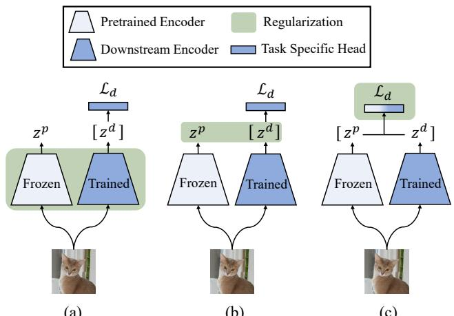
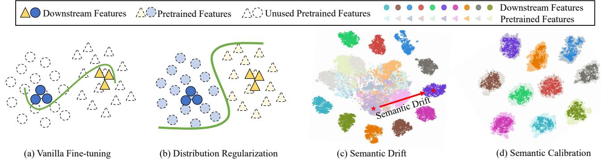
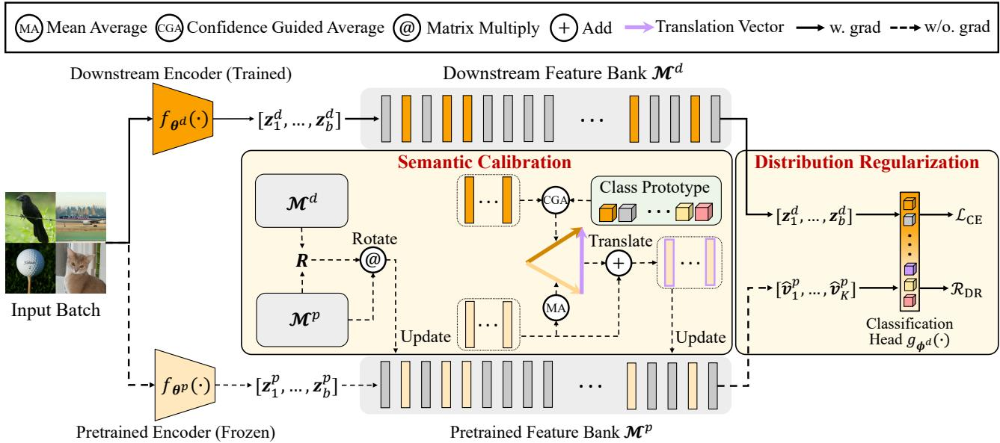
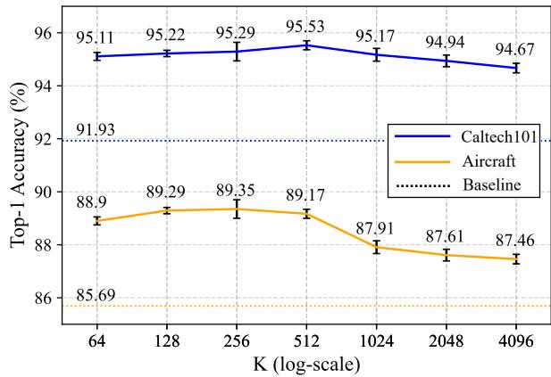

# DR-Tune: Improving Fine-tuning of Pretrained Visual Models by Distribution Regularization with Semantic Calibration

Nan Zhou1,2 Jiaxin Chen2 Di Huang1,2,3\*

1State Key Laboratory of Software Development Environment, Beihang University, Beijing, China 2School of Computer Science and Engineering, Beihang University, Beijing, China 3Hangzhou Innovation Institute, Beihang University, Hangzhou, China {zhounan0431,jiaxinchen,dhuang}@buaa.edu.cn

## Abstract

The visual models pretrained on large-scale benchmarks encode general knowledge and prove effective in building more powerful representations for downstream tasks. Most existing approachesfollow thefine-tuning paradigm, either by initializing or regularizing the downstream model based on the pretrained one. Theformerfails to retain the knowledge in the successivefine-tuning phase, thereby prone to be over-fitting, and the latter imposes strong constraints to the weights or feature maps of the downstream model without considering semantic drift, often incurring insufficient optimization. To deal with these issues, we propose a novel fine-tuning framework, namely distribution regularization with semantic calibration (DR-Tune). It employs distribution regularization by enforcing the downstream task head to decrease its classification error on the pretrained feature distribution, which prevents it from over-fitting while enabling sufficient training of downstream encoders. Furthermore, to alleviate the interference by semantic drift, we develop the semantic calibration (SC) module to align the global shape and class centers of the pretrained and downstream feature distributions. Extensive experiments on widely used image classification datasets show that DR-Tune consistently improves the performance when combing with various backbones under different pretraining strategies. Code is available at: https://github.com/ weeknan/DR-Tune.

## 1. Introduction

Nowadays, it has become a prevailing paradigm to pretrain deep models for common use on large-scale datasets and fine-tune them in multiple diverse downstream tasks in the community of computer vision [20, 7]. Due to the data and semantic relevance between pretraining and downstream tasks, the pretrained model implicitly encodes useful prior knowledge, and compared with the ones by training from scratch, it substantially promotes the accuracy of the downstream task and accelerates its training convergence in a variety of applications [21, 45], e.g. image classification, object detection, and semantic segmentation. In particular, when labeled data are quite limited in the downstream task, the issue of over-fitting can be effectively alleviated by using the pretrained model as a training prior.

  
(a)  
(b)  
(c)  
Figure 1. Comparison of distinct regularization-based approaches. (a) (or (b)) performs regularization by reducing the ad-hoc discrepancy between the weights (or the intermediate feature maps) of the downstream encoder and the pretrained one. In contrast, DR-Tune (c) performs regularization on the task-specific head by minimizing the classification error with the pretrained feature distribution.

To facilitate training downstream models with the pretrained ones, many efforts have recently been made. One of the typical ways is to directly take the pretrained model for initialization and fine-tune [24, 58] its weights by elaborately designing task-specific learning objectives [10, 35, 17, 65, 64]. Nevertheless, these methods neglect retaining the pretrained prior in the fine-tuning phase and tend to incur the “catastrophic forgetting” problem [40, 6, 16], making the learned model prone to over-fit.

  
Figure 2. Illustration on the motivation of DR-Tune. (a) Vanilla fine-tuning only uses downstream features for training, which is prone to be over-fitting. (b) Distribution Regularization employs the pretrained feature distribution to constrain the task head, enforcing it to learn a smooth classification boundary. (c) t-SNE [51] visualization on the features extracted by the pretrained/downstream encoders on CIFAR10 [33], showing the semantic drift issue. (d) Semantic Calibration clearly alleviates this semantic drift

In contrast, another alternative focuses on utilizing the prior knowledge encoded in the pretrained model to regularize the training of downstream models [56, 16]. By introducing extra regularization terms based on a pretrained model either on the weights [56] (see Fig. 1 (a)) or the intermediate feature maps [30, 36] (see Fig. 1 (b)), these methods prevent the downstream model from over-fitting and significantly boost the overall performance; however, they often impose explicit ad-hoc constraints by reducing the discrepancy between the weights or the sample-wise feature maps generated by the pretrained and downstream models, without considering the semantic drift of the pretrained features. As a consequence, they are inclined to suffer from the non-negligible bias caused by the pretrained model, deteriorating the final result which may be even worse than vanilla fine-tuning in specific scenarios as claimed in [10], and leave much room for improvement.

To address the issues above, this paper proposes a novel regularization-based framework for fine-tuning, namely distribution regularization (DR) with semantic calibration (DR-Tune). As Fig. 1 (c) illustrates, different from the existing methods, DR-Tune conducts distribution regularization on the downstream classification head, instead of the encoder. The basic idea behind is to minimize the classification error of the downstream task head according to the pretrained feature distribution in addition to the normally used downstream feature distribution. Unfortunately, the discrepancy between the dynamically updated downstream model and the frozen pretrained model incurs semantic drift between the two distributions as shown in Fig. 2 (c), which hinders the task head from learning correct classification boundaries. To alleviate this drift, we develop the semantic calibration (SC) module to align the pretrained and downstream feature distributions via a holistic rotation matrix as well as a group of class-level translation vectors, which are efficiently estimated by establishing two memory banks. The rotation matrix performs global distancepreserving alignment, while the translation vectors offer the alignment of class center pairs, significantly removing the semantic drift as depicted in Fig. 2 (d).

Intuitively, the proposed DR-Tune framework has two underlying advantages: 1) DR does not impose explicit constraints neither on the weights nor on the intermediate feature maps, largely facilitating optimizing the downstream encoder towards the downstream task; 2) SC greatly reduces the semantic drift and the classification bias is thus alleviated when employing the pretrained feature distribution as regularization, leading to improved fine-tuning results; and 3) as in Fig. 2 (b), by leveraging the extra support from the pretrained feature distribution and the downstream features, the task head benefits generating smoother classification boundaries, restricting the over-fitting risk.

The main contributions are summarized as follows:

1) We propose a novel fine-tuning framework (DR-Tune), which handles over-fitting by regularizing the taskspecific head with the pretrained feature distribution.

2) We design the SC module to address the semantic drift between the pretrained and downstream feature distributions, effectively decreasing the bias introduced by the regularization from the pretrained models.

3) We conduct extensive evaluation on popular classification datasets and demonstrate that DR-Tune consistently improves the performance as combined with various network structures under different pretraining schemes.

## 2. Related Work

## 2.1. General Model Fine-tuning

Most existing fine-tuning methods focus on downstream tasks by elaborately designing task-specific learning objectives. SCL [17], Bi-tuning [65] and Core-tuning [64] incorporate the supervised contrastive loss [29] with the standard cross-entropy (CE) loss, achieving superior performance on classification tasks. M&M [62] improves semantic segmentation by utilizing limited pixel-wise annotations in the downstream dataset in conjunction with the triplet loss. Besides, BSS [10] observes that small eigenvalues incur degradation compared to vanilla fine-tuning, and thus penalizes on the eigenvalues of the learned representation. RIFLE [35] performs fine-tuning by periodically re-initializing the fully connected layers. In general, the methods above neglect retaining the pretrained prior in the fine-tuning phase and tend to over-fit on the downstream task.

In addition, several studies also attempt to apply various adapters [46, 47, 63, 5, 37] or prompts [27, 42, 28, 1] to decrease the computational and storage cost during finetuning. Despite their efficiency, these methods sacrifice the performance in accuracy.

## 2.2. Regularization for Model Fine-tuning

Regularization is a prevailing way to make use of the pretrained prior knowledge for fine-tuning. Li et al. [56] apply the $\bar { \ell } ^ { 2 } { \cdot } \mathrm { n o r m }$ penalty between the parameters of the pretrained and downstream models, which outperforms the standard weight decay. Yim et al. [57] introduce the knowledge distillation [23, 48] and adopt the distance between the flow of the solution procedure matrix of the pretrained and downstream models as the regularizer. AT [30] and DELTA [36] exploit the attention mechanism and regularize the discrepancy between the intermediate feature maps. [16] assembles multiple distance-based metrics for regularization, which is optimized by the projected gradient descent method. Co-Tuning [59] explores the semantic information of the pretrained dataset and uses the pretrained labels to regularize the fine-tuning process. These methods handle overfitting by imposing explicit ad-hoc constraints to reduce the discrepancy between the weights or sample-wise feature maps of the pretrained and downstream models, but they do not take into account the semantic drift of the pretrained features, thus leaving room for improvement.

Compared to existing solutions as described in Sec. 2.1 and Sec. 2.2, we prevent the downstream model from overfitting by introducing distribution regularization (DR) on the task head. DR leverages the pretrained feature distribution to enforce the task head learning smooth classification boundaries without imposing explicit constraints on backbones, thus facilitating optimizing the downstream encoder. In addition, we observe the semantic drift between the pretrained and downstream feature distributions, and mitigate it by developing a novel semantic calibration (SC) module, which substantially improves the final performance.

## 3. Approach

## 3.1. Preliminaries

Suppose a pretrained model $g _ { \phi ^ { p } } \cdot f _ { \theta ^ { p } } ( \cdot )$ , where $f _ { \theta ^ { p } }$ and $g _ { \phi ^ { p } }$ denote the encoder and the pretraining task head parameterized by $\pmb { \theta } ^ { p }$ and $\phi ^ { p }$ , respectively. Given a set of training data $D = \{ ( \boldsymbol { x } _ { i } ^ { d } , y _ { i } ) \} _ { i = 1 } ^ { N }$ for the downstream task, we aim to learn a downstream model $g _ { \phi ^ { d } } \cdot f _ { \theta ^ { d } } ( \cdot )$ by fine-tuning the pretrained model $g _ { \phi ^ { p } } \cdot f _ { \theta ^ { p } } ( \cdot )$ , where $\pmb { x } _ { i } ^ { d }$ refers to the i-th image with the class label $y _ { i } , \theta ^ { d }$ and $\dot { \phi ^ { d } }$ are the parameters to be learned for the downstream encoder $f _ { \pmb { \theta } ^ { d } }$ and the downstream task head $g _ { \phi ^ { d } }$ , respectively.

To learn $\pmb { \theta } ^ { d }$ and $\phi ^ { d }$ , vanilla fine-tuning firstly applies the pretrained parameter $\pmb { \theta } ^ { p }$ to initialize $\pmb { \theta } ^ { d }$ as $\pmb { \theta } ^ { d } ( 0 ) : = \pmb { \theta } ^ { p } . \pmb { \phi } ^ { d }$ is randomly initialized, which is thereafter jointly learned with $\pmb { \theta } ^ { d }$ by optimizing the following objective:

$$
( \pmb { \theta } _ { * } ^ { d } , \pmb { \phi } _ { * } ^ { d } ) = \arg \operatorname* { m i n } _ { \pmb { \theta } ^ { d } , \pmb { \phi } ^ { d } } \mathcal { L } \left( g _ { \pmb { \phi } ^ { d } } \cdot f _ { \pmb { \theta } ^ { d } } ; \pmb { D } \right) ,\tag{1}
$$

where $\mathcal { L } ( \cdot )$ is the task-specific loss. The fine-tuned model $g _ { \phi _ { * } ^ { d } } \cdot f _ { \theta _ { * } ^ { d } }$ is used for inference in the downstream task.

Nevertheless, the vanilla fine-tuning strategy is prone to be over-fitting on the downstream data, especially when the training size $N$ is small. To overcome this shortcoming, the regularization-based fine-tuning strategy is employed by introducing a regularization term $\mathcal { R } ( \cdot )$ on $\pmb { \theta } ^ { d }$ according to $\pmb { \theta } ^ { p }$ and optimizing the following objective:

$$
( \pmb { \theta } _ { * } ^ { d } , \pmb { \phi } _ { * } ^ { d } ) = \arg \operatorname* { m i n } _ { \pmb { \theta } ^ { d } , \pmb { \phi } ^ { d } } \mathcal { L } \left( g _ { \pmb { \phi } ^ { d } } \cdot f _ { \pmb { \theta } ^ { d } } ; \pmb { D } \right) + \mathcal { R } \left( \pmb { \theta } ^ { d } ; \pmb { \theta } ^ { p } \right)\tag{2}
$$

Most of existing fine-tuning methods perform regularization in an ad-hoc manner such as the weight-based ones formulated as $\mathcal { R } = \| \pmb { \theta } ^ { d } - \pmb { \theta } ^ { p } \|$ as well as the feature-based ones written as $\begin{array} { r } { \mathcal { R } \ = \ \sum _ { i = 1 } ^ { N } \| F M ( \pmb { x } _ { i } ^ { d } | f _ { \pmb { \theta } ^ { d } } ) - F M ( \pmb { x } _ { i } ^ { d } | f _ { \pmb { \theta } ^ { p } } ) \| } \end{array}$ where $F M ( \pmb { x } _ { i } ^ { d } | f _ { \pmb { \theta } ^ { d } } )$ indicates the feature map of $\pmb { x } _ { i } ^ { d }$ extracted from the intermediate layer of $f _ { \pmb { \theta } ^ { d } }$ . The former imposes strong constraints on $\theta ^ { \dot { d } } .$ , and the later forces the downstream feature $F M ( \pmb { x } _ { i } ^ { d } )$ to be the same as the pretrained one for each training sample $\pmb { x } _ { i } ^ { d } .$ , both of which impede $\pmb { \theta } ^ { d }$ from being sufficiently optimized towards the downstream task.

## 3.2. Framework Overview

To address the issues above, we propose a novel finetuning framework, namely distribution regularization with semantic calibration (DR-Tune).

As illustrated in Fig. 3, given training set $\begin{array} { r l } { \pmb { D } } & { { } = } \end{array}$ $\{ ( \pmb { x } _ { i } ^ { d } , y _ { i } ) \}$ , we extract the downstream representations $\{ z _ { i } ^ { d } | z _ { i } ^ { d } ~ = ~ f _ { \theta ^ { d } } ( \mathbf { { x } } _ { i } ^ { d } ) \}$ and the pretrained representations $\{ z _ { i } ^ { p } | z _ { i } ^ { p } = f _ { \pmb { \theta } ^ { p } } ( \pmb { x } _ { i } ^ { d } ) \}$ by the encoders $f _ { \pmb { \theta } ^ { d } }$ and $f _ { \theta ^ { p } }$ , respectively.

The basic idea of DR-Tune is employing an implicit distribution regularization (DR) $\mathcal { R } _ { \mathrm { D R } } ( \{ ( z _ { i } ^ { p } , y _ { i } ) \} | g _ { \phi ^ { d } } )$ on the downstream model, i.e. the task head $g _ { \phi ^ { d } }$ is enforced to correctly classify the pretrained representations $\{ z _ { i } ^ { p } \}$ , besides the downstream ones $\{ z _ { i } ^ { d } \}$

  
Figure 3. Illustration of the DR-Tune framework. DR-Tune has two branches, including a frozen pretrained encoder $f _ { \theta ^ { p } }$ and a trained downstream encoder $f _ { \theta ^ { d } }$ . For input images, we obtain two sets of features extracted by $f _ { \theta ^ { p } }$ and $f _ { \theta ^ { d } }$ respectively and then we store them in their individual feature banks $\mathbf { \mathcal { M } } ^ { p }$ and $\pmb { \mathcal { M } } ^ { d }$ . Semantic Calibration is further applied to $\mathbf { \mathcal { M } } ^ { p }$ to alleviate the semantic drift. Finally, we combine the calibrated pretrained features with the downstream ones to optimize the classification head $( i . e$ . Distribution Regularization).

However, as shown in Fig. 2 (c), there exists semantic drift between the pretrained feature distribution and the downstream one. Therefore, directly using $\{ z _ { i } ^ { p } \}$ for regularization incurs non-negligible bias, thus degrading the performance of the fine-tuned downstream model. To solve this problem, DR-Tune introduces a semantic calibration (SC) module to alleviate the distribution drift. Concretely, as displayed in Fig. 3, DR-Tune employs two queues to build a downstream feature bank $\boldsymbol { \mathcal { M } } ^ { d }$ as well as a pretrained feature bank $\mathbf { \mathcal { M } } ^ { p }$ , which are dynamically updated according to the features $\{ z _ { i } ^ { d } \}$ and $\{ z _ { i } ^ { p } \}$ in the mini-batch, respectively. $\boldsymbol { \mathcal { M } } ^ { d }$ and $\mathbf { \mathcal { M } } ^ { p }$ efficiently represent the downstream and pretrained feature distribution, based on which the calibration parameters including a global rotation matrix R and a group of class-level translations $\{ \delta _ { c } \}$ are estimated, where $\delta _ { c }$ is the translation vector for the c-th class. During training, the calibrated pretrained features $\{ \hat { z } _ { i } ^ { p } | \hat { z } _ { i } ^ { p } = { \pmb R } \cdot { z } _ { i } ^ { p } + \delta _ { y _ { i } } \}$ are used to form the final distribution regularization as $\mathcal { R } _ { \mathrm { D R } } ( \{ ( \hat { z } _ { i } ^ { p } , y _ { i } ) \} | g _ { \phi ^ { d } } )$ . In the testing phase, we skip the SC module as well as the feature banks, and only use the downstream encoder $f _ { \pmb { \theta } ^ { d } }$ and the head $g _ { \phi ^ { d } }$ for inference.

The details about the DR term and the SC module are described in Sec. 3.3 and Sec. 3.4, respectively.

## 3.3. Fine-tuning with Distribution Regularization

In this section, we elaborate the formulation of DR, i.e. $\mathcal { R } _ { \mathrm { D R } } ( \{ ( z _ { i } ^ { p } , y _ { i } ) \} | g _ { \phi ^ { d } } )$

Formally, suppose the training set D is drawn from the data distribution $\chi ^ { d }$ , the feature distributions of $\{ f _ { \pmb { \theta } ^ { d } } ( \pmb { x } _ { i } ^ { d } ) \}$ and $\{ f _ { \theta ^ { p } } ( \pmb { x } _ { i } ^ { d } ) \}$ are formulated as $\mathcal { Z } ^ { d } = P _ { \mathbf { \Phi } ^ { \sim } \mathcal { X } ^ { d } } ( f _ { \theta ^ { d } } ( \mathbf { \bar { x } } ) )$ and $\mathcal { Z } ^ { p } = P _ { \pmb { x } \sim \mathcal { X } ^ { d } } ( f _ { \pmb { \theta } ^ { p } } ( \pmb { x } ) )$ , respectively. It is worth noting that both $\mathcal { Z } ^ { p }$ and ${ \mathcal { Z } } ^ { d }$ are derived from the same distribution $\chi ^ { d }$ , but by distinct encoders $f _ { \theta ^ { p } }$ and $f _ { \pmb { \theta } ^ { d } }$

Usually, the downstream task-specific learning objective $\mathcal { L }$ can be briefly written as below:

$$
\mathcal { L } = - \log P r _ { x _ { i } ^ { d } \sim \mathcal { X } ^ { d } } \left( \{ ( z _ { i } ^ { d } , y _ { i } ) \} | f _ { \theta ^ { d } } ; g _ { \phi ^ { d } } \right) ,\tag{3}
$$

where $z _ { i } ^ { d } = f _ { \pmb { \theta } ^ { d } } ( \pmb { x } _ { i } ^ { d } )$ and $P r _ { \mathbf { x } _ { i } ^ { d } \sim \mathcal { X } ^ { d } } \left( \{ ( z _ { i } ^ { d } , y _ { i } ) \} | f _ { \theta ^ { d } } ; g _ { \phi ^ { d } } \right)$ is the joint probability of the training feature set $\{ ( z _ { i } ^ { d } , y _ { i } ) \}$ conditioned on $f _ { \pmb { \theta } ^ { d } }$ and $g _ { \phi ^ { d } }$

As aforementioned, $\mathcal { R } _ { \mathrm { D R } }$ aims to regularize the task head $g _ { \phi ^ { d } }$ by enforcing it to classify the pretrained representations $\{ z _ { i } ^ { p } \}$ . To this end, we adopt the following formulation of $\mathcal { R } _ { \mathrm { D R } }$

$$
\mathcal { R } _ { \mathrm { D R } } = - \log P r _ { z _ { i } ^ { p } \sim \mathcal { Z } ^ { p } } \left( \{ ( z _ { i } ^ { p } , y _ { i } ) \} | g _ { \phi ^ { d } } \right) ,\tag{4}
$$

where $y _ { i }$ is the category of $ { \boldsymbol { z } } _ { i } ^ { p }$ . From Eq. (4), it can be observed that $g _ { \phi ^ { d } }$ is optimized to maximize the joint probability of $\{ ( z _ { i } ^ { p } , \dot { y } _ { i } ) \}$ when minimizing $\mathcal { R } _ { \mathrm { D R } }$ , thus forcing $g _ { \phi ^ { d } }$ to correctly classify $\{ z _ { i } ^ { p } \}$

This kind of regularization has the following advantages compared to existing ad-hoc regularizers: 1) $\mathcal { R } _ { \mathrm { D R } }$ does not impose any explicit constraints neither on the downstream weights $\theta ^ { \dot { d } }$ nor on the intermediate downstream features, thus bypassing the interference of improper constraints on fine-tuning $f _ { \pmb { \theta } ^ { d } } , \ 2 )$ As shown in Fig. 2 (b), instead of using the ad-hoc sample-wise regularization, $\mathcal { R } _ { \mathrm { D R } }$ leverages the pretrained feature distribution $\mathcal { Z } ^ { p }$ for regularization, which explores holistic information to prevent the downstream task head $g _ { \phi ^ { d } }$ from over-fitting. In the meantime, when combining $\mathcal { R } _ { \mathrm { D R } }$ in Eq. (4) with the task-specific loss L in Eq. (3), as $g _ { \phi ^ { d } }$ becomes more generalizable, $f _ { \pmb { \theta } ^ { d } }$ is improved correspondingly. Please refer to the supplementary material for more analysis.

To specify the form of $\mathcal { R } _ { \mathrm { D R } }$ , we clarify the joint probability in Eq. (4). By assuming the independent sampling of $( z _ { i } ^ { p } , y _ { i } )$ , Eq. (4) is rewritten as $\mathcal { R } _ { \mathrm { D R } } \ = $ $- \sum z _ { i } ^ { p } { \sim } \mathcal { Z } ^ { p }$ log $P r \left( ( z _ { i } ^ { p } , y _ { i } ) | g _ { \phi ^ { d } } \right)$ For the classification task with $C$ classes, the parameters of $g _ { \phi ^ { d } }$ can be decomposed as $\phi ^ { d } = [ \phi _ { 1 } ^ { d } , \phi _ { 2 } ^ { d } , \dot { \bf \Omega } ^ { . } \cdot { } ~ , \phi _ { C } ^ { d } ]$ , where $\dot { \phi } _ { c } ^ { d }$ corresponds to the ones for the c-th class prototype. Similar to the CE loss, given a pretrained sample $( z _ { i } ^ { p } , y _ { i } )$ , the conditional probability $P r \left( ( z _ { i } ^ { p } , y _ { i } ) | g _ { \phi ^ { d } } \right)$ turns to be

$$
P r \left( ( z _ { i } ^ { p } , y _ { i } ) | g _ { \phi ^ { d } } \right) = \frac { \exp ( \phi _ { y _ { i } } \cdot z _ { i } ^ { p } ) } { \sum _ { c = 1 } ^ { C } \exp ( \phi _ { c } \cdot z _ { i } ^ { p } ) } .
$$

Ideally, all pretrained representations $\{ z _ { i } ^ { p } \}$ of the training set should involve in computation of RDR; however it is extremely inefficient to train $g _ { \phi ^ { d } }$ by using all of them in each iteration. An alternative way is to extract a mini-batch, but it only captures local information of the distribution. Inspired by [53, 20, 52], we make a trade-off by employing a feature bank to approximate the distribution $\mathcal { Z } ^ { p }$ . Specifically, we maintain a queue $\mathbfcal { M } ^ { p } = \{ \pmb { v } _ { k } ^ { p } \} _ { k = 1 } ^ { K }$ with a fixed size K by enqueuing the newest features (i.e. the features from a mini-batch), and dequeuing the oldest ones.

Based on $P r \left( ( z _ { i } ^ { p } , y _ { i } ) | g _ { \phi ^ { d } } \right)$ and $\mathcal { M } ^ { p } , \mathcal { R } _ { \mathrm { D R } }$ is finally formulated as below:

$$
\mathcal { R } _ { \mathrm { { D R } } } = - \frac { 1 } { K } \sum _ { k = 1 } ^ { K } \log \frac { \exp ( \phi _ { y _ { k } } \cdot \pmb { v } _ { k } ^ { p } ) } { \sum _ { c = 1 } ^ { C } \exp ( \phi _ { c } \cdot \pmb { v } _ { k } ^ { p } ) } .\tag{5}
$$

As to the task-specific loss for fine-tuning, we adopt the commonly used CE loss:

$$
\mathcal { L } : = \mathcal { L } _ { \mathrm { C E } } = - \frac { 1 } { B } \sum _ { i = 1 } ^ { B } \log \frac { \exp ( \phi _ { y _ { i } } \cdot f _ { \theta ^ { d } } ( \pmb { x } _ { i } ^ { d } ) ) } { \sum _ { c = 1 } ^ { C } \exp ( \phi _ { c } \cdot f _ { \theta ^ { d } } ( \pmb { x } _ { i } ^ { d } ) ) } ,\tag{6}
$$

where $\{ ( \pmb { x } _ { i } ^ { d } , y _ { i } ) \}$ is the mini-batch for computational efficiency, and B is the mini-batch size.

## 3.4. Semantic Calibration

Since the downstream model is dynamically updated during fine-tuning while the pretrained model is kept frozen, the discrepancy between these two models tends to incur a semantic drift between the pretrained feature distribution $\mathcal { Z } ^ { p }$ and the downstream one ${ \mathcal { Z } } ^ { d }$ as illustrated in Fig. 2 (c).

Ignoring this drift and forcing $g _ { \phi ^ { d } }$ to classify features from disparate distributions by jointly optimizing $\mathcal { R } _ { \mathrm { D R } }$ in Eq. (5) and $\mathcal { L } _ { C E }$ in Eq. (6) degrades the performance.

To alleviate the semantic drift, we attempt to estimate a transformation to calibrate $\mathcal { Z } ^ { p } \mathrm { \ w . r . t . } \mathcal { Z } ^ { d }$ . To overcome the dilemma in balancing the efficiency and accuracy, we maintain a downstream feature bank $\dot { \pmb { \mathscr { M } } } ^ { d } = \{ \pmb { v } _ { k } ^ { d } \} _ { k = 1 } ^ { K }$ with size $K .$ , similar to the pretrained one $\mathcal { M } ^ { p } = \{ v _ { k } ^ { p } \} _ { k = 1 } ^ { K }$ constructed in the previous section. It is worth noting that $\pmb { v } _ { k } ^ { d }$ and $\boldsymbol { v } _ { k } ^ { p }$ are two distinct representations for the same image $\scriptstyle { \mathbf { { \mathit { x } } } } _ { k }$

In practice, the semantic drift between ${ \mathcal { Z } } ^ { d }$ and $\mathcal { Z } ^ { p }$ is extremely complicated, and is hard to estimate. In our work, we simplify it by assuming that the drift is mainly caused by a misalignment of global rotation and a set of local ones of the class centers. Accordingly, we calculate a rotation matrix R and the class-level translations $\{ \delta _ { c } \} _ { c = 1 } ^ { C }$

In regards of R, we estimate it by solving the following optimization problem:

$$
\begin{array} { r } { \pmb { R } = \operatorname * { a r g m i n } _ { \pmb { R } ^ { \prime } \cdot \pmb { R } ^ { \prime T } = \pmb { I } _ { d } } \displaystyle \sum _ { k = 1 } ^ { K } \parallel \pmb { R } ^ { \prime } \cdot \pmb { v } _ { k } ^ { p } - \pmb { v } _ { k } ^ { d } \parallel ^ { 2 } , } \end{array}\tag{7}
$$

where $\mathbf { \delta } _ { I _ { d } }$ is a d-dimensional identity matrix.

Eq. (7) can be solved by applying SVD on the covariance matrix between $\mathbf { \mathcal { M } } ^ { p }$ and $\boldsymbol { \mathcal { M } } ^ { d } \left[ 4 9 \right]$

As for the class-level translations $\{ \delta _ { c } \} _ { c = 1 } ^ { C }$ , we observe that the inter-class distribution of $\mathcal { Z } ^ { p }$ is less discriminative due to the lack of supervision in the downstream task. In contrast, ${ \mathcal { Z } } ^ { d }$ is more competent at distinguishing different classes. Therefore, we maintain $\mathcal { Z } ^ { p }$ and use the translation transformation to adjust the inter-class distribution of $\mathcal { Z } ^ { p }$ to be consistent with ${ \mathcal { Z } } ^ { d }$ . More visualization is given in the supplementary material.

With the motivation above, we first estimate the c-th class center for $\mathcal { Z } ^ { p }$ based on $\mathbf { \mathcal { M } } ^ { p }$ as below

$$
\pmb { \mu } _ { c } ^ { p } = \frac { 1 } { N _ { c } } \sum _ { k = 1 } ^ { K } \mathbb { I } \left[ \pmb { y } _ { k } ^ { p } = c \right] \cdot \pmb { R } \cdot \pmb { v } _ { k } ^ { p } .\tag{8}
$$

In Eq. $( 8 ) , N _ { c }$ is the number of pretrained features from the c-th class, and $\mathbb { I } [ y _ { k } \ : = \ : c ]$ is the indicator function, which equals to 1 if $y _ { k } = c$ and 0 otherwise.

As for the downstream features, we compute the class center based on $\boldsymbol { \mathcal { M } } ^ { d }$ in a more elaborative way as follows

$$
\pmb { \mu } _ { c } ^ { d } = \sum _ { k = 1 } ^ { K } \alpha _ { k } \cdot \mathbb { I } \left[ \pmb { y } _ { k } ^ { d } = c \right] \cdot \pmb { v } _ { k } ^ { d } ,\tag{9}
$$

where the weight

$$
\alpha _ { k } = \frac { \exp ( \phi _ { y _ { k } ^ { d } } \cdot \pmb { v } _ { k } ^ { d } ) } { \sum _ { j = 1 } ^ { K } \mathbb { I } \left[ y _ { j } ^ { d } = y _ { k } ^ { d } \right] \cdot \exp ( \phi _ { y _ { j } ^ { d } } \cdot \pmb { v } _ { j } ^ { d } ) } ,\tag{10}
$$

represents the confidence of $\pmb { v } _ { k } ^ { d }$ that it is correctly classified to its label by the head $g _ { \phi ^ { d } }$ . Since an outlier feature is usu-

<table><tr><td>Method</td><td>ImageNet20</td><td>CIFAR10</td><td>CIFAR100</td><td>DTD</td><td>Caltech101</td><td>Cars</td><td>Pets</td><td>Flowers</td><td>Aircraft</td><td> $\operatorname { A v g } .$ </td></tr><tr><td>CE-tuning</td><td>88.28</td><td>94.70</td><td>80.27</td><td>71.68</td><td>91.87</td><td>88.61</td><td>89.05</td><td>98.49</td><td>86.87</td><td>87.76</td></tr><tr><td>L2SP [56]</td><td>88.49</td><td>95.14</td><td>81.43</td><td>72.18</td><td>91.98</td><td>89.00</td><td>89.43</td><td>98.66</td><td>86.55</td><td>88.10</td></tr><tr><td>DELTA [36]</td><td>88.35</td><td>94.76</td><td>80.39</td><td>72.23</td><td>92.19</td><td>88.73</td><td>89.54</td><td>98.65</td><td>87.05</td><td>87.99</td></tr><tr><td>M&amp;M [62]</td><td>88.53</td><td>95.02</td><td>80.58</td><td>72.43</td><td>92.91</td><td>88.90</td><td>89.60</td><td>98.57</td><td>87.45</td><td>88.22</td></tr><tr><td>BSS [10]</td><td>88.34</td><td>94.84</td><td>80.40</td><td>72.22</td><td>91.95</td><td>88.50</td><td>89.50</td><td>98.57</td><td>87.18</td><td>87.94</td></tr><tr><td>RIFLE [35]</td><td>89.06</td><td>94.71</td><td>80.36</td><td>72.45</td><td>91.94</td><td>89.72</td><td>90.05</td><td>98.70</td><td>87.60</td><td>88.29</td></tr><tr><td>SCL [17]</td><td>89.29</td><td>95.33</td><td>81.49</td><td>72.73</td><td>92.84</td><td>89.37</td><td>89.71</td><td>98.65</td><td>87.44</td><td>88.54</td></tr><tr><td>Bi-tuning [65]</td><td>89.06</td><td>95.12</td><td>81.42</td><td>73.53</td><td>92.83</td><td>89.41</td><td>89.90</td><td>98.57</td><td>87.39</td><td>88.58</td></tr><tr><td>Core-tuning [64]</td><td>92.73</td><td>97.31</td><td>84.13</td><td>75.37</td><td>93.46</td><td>90.17</td><td>92.36</td><td>99.18</td><td>89.48</td><td>90.47</td></tr><tr><td>SSF*[37]</td><td>94.72</td><td>95.87</td><td>79.57</td><td>75.39</td><td>90.40</td><td>62.22</td><td>84.89</td><td>92.15</td><td>62.38</td><td>81.95</td></tr><tr><td>DR-Tune (Ours)</td><td>96.03</td><td>98.03</td><td>85.47</td><td>76.65</td><td>95.77</td><td>90.60</td><td>90.57</td><td>99.27</td><td>89.80</td><td>91.35</td></tr></table>

Table 1. Comparison of the top-1 accuracy (%) by using various fine-tuning methods based on the self-supervised pretrained model, i.e. ResNet-50 pretrained by MoCo-v2 on ImageNet. ‘\*’ indicates that the method is re-implemented. The best results are in bold.

<table><tr><td>Method</td><td>CIFAR100^†</td><td>Caltech101†</td><td> $\mathrm { D T D } ^ { \dagger }$ </td><td>Flowers†</td><td> $\mathrm { P e t s } ^ { \dagger }$ </td><td>SVHN</td><td>Sun397</td><td> $\operatorname { A v g } .$ </td></tr><tr><td>Linear probing</td><td>63.4</td><td>85.0</td><td>63.2</td><td>97.0</td><td>86.3</td><td>36.6</td><td>51.0</td><td>68.93</td></tr><tr><td>Adapter [25]</td><td>74.1</td><td>86.1</td><td>63.2</td><td>97.7</td><td>87.0</td><td>34.6</td><td>50.8</td><td>70.50</td></tr><tr><td>Bias [60]</td><td>72.8</td><td>87.0</td><td>59.2</td><td>97.5</td><td>85.3</td><td>59.9</td><td>51.4</td><td>73.30</td></tr><tr><td>VPT [27]</td><td>78.8</td><td>90.8</td><td>65.8</td><td>98.0</td><td>88.3</td><td>78.1</td><td>49.6</td><td>78.49</td></tr><tr><td>SSF [37]</td><td>69.0</td><td>92.6</td><td>75.1</td><td>99.4</td><td>91.8</td><td>90.2</td><td>52.9</td><td>81.57</td></tr><tr><td>Core-tuning* [64]</td><td>66.3</td><td>89.7</td><td>70.9</td><td>99.0</td><td>92.3</td><td>76.4</td><td>52.5</td><td>78.16</td></tr><tr><td>DR-Tune (Ours)</td><td>81.1</td><td>92.8</td><td>71.4</td><td>99.3</td><td>92.4</td><td>92.0</td><td>54.5</td><td>83.36</td></tr></table>

Table 2. Comparison of the top-1 accuracy (%) by using various fine-tuning methods based on the supervised pretrained model, i.e. ViT-B pretrained on ImageNet. ‘\*’ indicates that the method is re-implemented and ‘†’ refers to the training/test split setting as in [61]. The best results are in bold.

ally hard to classify, its corresponding weight $\alpha _ { k }$ turns to be small, and the effect of outliers on computing the class center is suppressed, resulting in a more precise estimation.

Based on $\{ \mu _ { c } ^ { p } \} _ { c = 1 } ^ { C }$ and $\{ \mu _ { c } ^ { d } \} _ { c = 1 } ^ { C }$ , the class-level translation vector for the c-th class is estimated as below:

$$
\pmb { \delta } _ { c } = \pmb { \mu } _ { c } ^ { d } - \pmb { \mu } _ { c } ^ { p } , \quad c = 1 , \cdots , C .\tag{11}
$$

According to the estimated rotation matrix R and the class-level translation vector $\{ \delta _ { c } \} _ { c = 1 } ^ { C }$ , the SC module of $\mathbf { \mathcal { M } } ^ { p }$ w.r.t. $\boldsymbol { \mathcal { M } } ^ { d }$ is performed in the following:

$$
\hat { \pmb { v } } _ { k } ^ { p } = \pmb { R } \cdot \pmb { v } _ { k } ^ { p } + \pmb { \delta } _ { y _ { k } ^ { p } } , \quad k = 1 , \cdots , K .\tag{12}
$$

## 3.5. Optimization

According to the SC module in Eq. (12) and Eq. (5), the final DR is refined as

$$
\mathcal { R } _ { \mathrm { { D R } } } = - \frac { 1 } { K } \sum _ { k = 1 } ^ { K } \log \frac { \exp ( \phi _ { y _ { k } } \cdot \hat { \pmb { v } } _ { k } ^ { p } ) } { \sum _ { c = 1 } ^ { C } \exp ( \phi _ { c } \cdot \hat { \pmb { v } } _ { k } ^ { p } ) } .\tag{13}
$$

The overall objective of DR-Tune is formulated as

$$
\operatorname* { m i n } _ { \theta ^ { d } , \phi ^ { d } } \mathcal { L } _ { \mathrm { C E } } + \lambda \cdot \mathcal { R } _ { \mathrm { D R } } ,\tag{14}
$$

where $\mathcal { L } _ { \mathrm { C E } }$ is from Eq. (6). λ is a hyper-parameter balancing the effect of $\mathcal { L } _ { \mathrm { C E } }$ and $\mathcal { R } _ { \mathrm { D R } }$ , which is set to $\frac { K } { B }$

## 4. Experimental Results

In this section, we evaluate the performance of DR-Tune by using distinct pretrained models on widely used datasets, compared with the state-of-the-art counterparts.

## 4.1. Datasets

We evaluate DR-Tune on widely used datasets, including ImageNet20 [12, 26], CIFAR10 & 100 [33], DTD [11], Caltech101 [15], Stanford Cars [32], Oxford Pets [44] & Flowers [43], Aircraft [39], SVHN [41] and Sun397 [54]. Please refer to the supplementary material for more details.

## 4.2. Details

By following [14, 64], we use ResNet-50 [22] pretrained by MoCo-v2 [8] and ViT-B [13] pretrained in a supervised manner on ImageNet [12] as the backbone in main experiments. Different pretrained strategies and backbones are also evaluated in Sec 4.4. The size (i.e. K) of the memory banks is set as 2,048 by default.

In most of our experiments, we train for 100 epochs by using the SGD optimizer [3] with a cosine decay scheduler, where the weight decay and momentum are fixed as $1 \times 1 0 ^ { - 4 }$ and 0.9, respectively. We use the linear decay scheduler on ImageNet20 [26] and the AdamW [38] optimizer to train the ViT [13] backbone. Since the minibatch is augmented before the classification head, we set the learning rate of the classification head $1 + { \frac { K } { B } }$ times that of the backbone. Similar to [31, 7, 64], we utilize random cropping and horizontal flipping for data augmentation with an image size of $2 2 4 \times 2 2 4$ during training, and center cropping during test.

<table><tr><td rowspan="2">Pretraining Strategy</td><td colspan="2">Caltech101</td><td colspan="2">ImageNet20</td></tr><tr><td>CE-tuning</td><td>Ours</td><td>CE-tuning</td><td>Ours</td></tr><tr><td>MoCo-v1 [20]</td><td>91.18</td><td>91.94</td><td>86.89</td><td>94.83</td></tr><tr><td>PCL [34]</td><td>93.48</td><td>94.90</td><td>83.91</td><td>95.80</td></tr><tr><td>InfoMin [50]</td><td>93.38</td><td>95.10</td><td>86.52</td><td>96.53</td></tr><tr><td>HCSC [18]</td><td>93.89</td><td>95.73</td><td>84.10</td><td>96.21</td></tr><tr><td>SwAV [4]</td><td>92.79</td><td>93.94</td><td>94.62</td><td>95.34</td></tr><tr><td>SimSiam [9]</td><td>82.28</td><td>90.33</td><td>91.33</td><td>94.82</td></tr></table>

Table 3. Top-1 accuracy (%) of DR-Tune by combining with different pretraining strategies based on ResNet-50, compared to the baseline CE-tuning.

## 4.3. Comparison with the State-of-the-art

In the literature, there are mainly two settings for comparison of different methods, i.e. the one based on the selfsupervisedpretrained model as in [64] and another based on the supervised pretrained model as in [61]. As for the selfsupervised setting, we compare our method with the following state-of-the-arts: 1) the baseline method denoted as CE-tuning, which simply uses the pretrained model for initialization and is successively trained on downstream data by the standard CE loss; 2) the regularization-based methods including L2SP [56] and DELTA [36]; 3) other fully fine-tuning methods including M&M [62], BSS [10], RI-FLE [35], Bi-tuning [65], SCL [17] and Core-tuning [64]. As to the supervised setting, the representative parameter efficient methods, including the baseline Linear probing, Adapter [25], Bias [60], VPT [27] and SSF [37], are selected. It is worth noting that the datasets as well as the training/test split used in these two settings are NOT the same; therefore we separately report their results for fair comparison as in Table 1 and Table 2, respectively.

Under the self-supervised pretraining setting, as summarized in Table 1, vanilla fine-tuning (i.e. CE-tuning) performs the worst, indicating the necessity of exploring the pretrained model in downstream tasks, instead of simply using it for initialization. By launching DR on the task head and reducing the semantic drift, DR-Tune largely outperforms the regularization-based methods L2SP and DELTA, promoting their top-1 accuracies averaged by 3.25% and 3.36%, respectively. The other counterparts such as Bi-tuning and Core-tuning focus on designing loss functions to boost the learning of downstream models without the pretrained model for training, thus prone to over-fit. In contrast, DR-Tune applies the pretrained features to facilitate the task head learning smooth classification boundaries and achieves better performance on most datasets. For instance, the accuracy of DR-Tune exceeds the second best Core-tuning by 3.30%/1.34%/2.31% on ImageNet20/CIFAR100/Caltech101 respectively, and is 0.88% higher than Core-tuning on average over all datasets. Under the supervised pretraining setting, as Table 2 shows, our method consistently boosts the averaged top-1 accuracy, promoting the second best method SSF by 1.78%.

<table><tr><td rowspan="2">Backbone</td><td colspan="2">Caltech101</td><td colspan="2">DTD</td></tr><tr><td>CE-tuning</td><td>Ours</td><td>CE-tuning</td><td>Ours</td></tr><tr><td>R-50</td><td>93.38</td><td>95.10</td><td>68.62</td><td>77.97</td></tr><tr><td>R-101</td><td>94.23</td><td>95.64</td><td>70.00</td><td>78.41</td></tr><tr><td>R-152</td><td>94.48</td><td>96.19</td><td>70.16</td><td>71.44</td></tr><tr><td>RX-101</td><td>94.71</td><td>96.39</td><td>72.18</td><td>76.70</td></tr><tr><td>RX-152</td><td>94.85</td><td>96.44</td><td>72.45</td><td>78.51</td></tr><tr><td>ViT-B</td><td>94.35</td><td>96.03</td><td>73.72</td><td>78.02</td></tr><tr><td>ViT-L</td><td>95.64</td><td>97.57</td><td>73.94</td><td>78.83</td></tr></table>

Table 4. Top-1 accuracy (%) of DR-Tune by combining with distinct backbones, compared to the baseline CE-tuning.

Core-tuning and SSF are the most competitive counterparts only under the self-supervised and supervised setting, respectively, and we further re-implement them and evaluate their performance by using the alternative setting, denoted as SSF∗ and Core-tuning∗. As displayed, they fail to retain high performance when using different pretrained models, while our method yields decent results in both the settings, clearly showing its generalizability.

## 4.4. Generalizability

We further evaluate the generalizability of DR-Tune by combining it with distinct pretraining strategies, backbones as well as the scales of the downstream data.

In regards of different pretraining strategies, except for MoCo-v2 used in Table 1, we integrate DR-Tune with the pretrained models based on the ResNet-50 backbone by: 1) the contrastive self-supervised methods including MoCo-v1 [20], PCL [34], InfoMin [50] and HCSC [18]; 2) the clustering based self-supervised method SwAV [4]; and 3) the prediction based self-supervised method SimSiam [9]. As shown in Table 3, DR-Tune consistently delivers significant improvement on Caltech101 and ImageNet20 compared to CE-tuning, in regardless of the pretraining strategy used.

With respect to distinct backbones, we adopt the widely used residual networks including ResNet(R)-50/-101/-152 and ResNeXt(RX)-101/-152 [55] pretrained by InfoMin [50], as well as the vision transformers including ViT-Base (ViT-B)/-Large (ViT-L) [13] pretrained by MAE [19]. As shown in Table 4, DR-Tune obtains gains compared to CEtuning with distinct backbones. The results on ViT further demonstrate that DR-Tune applies to the Masked Image Modeling pretraining strategy [2].

<table><tr><td>Method</td><td colspan="4">Sampling Ratios on ImageNet20</td></tr><tr><td></td><td>10%</td><td>25%</td><td>50%</td><td>100%</td></tr><tr><td>CE-tuning</td><td>58.37±0.63 71.10±0.28</td><td></td><td>80.79±0.80 75.86±0.7483.19±0.27</td><td>88.28</td></tr><tr><td>Bi-tuning [65]</td><td> $6 0 . 5 0 { \pm } 1 . 1 1 $   $7 8 . 6 4 \pm 0 . 5 8$ </td><td></td><td>84.48±0.34 89.09±0.40</td><td>89.06 92.73</td></tr><tr><td>Core-tuning [64]</td><td></td><td>92.81±0.11</td><td> $9 3 . 7 1 { \pm } 0 . 1 9$ </td><td>94.70</td></tr><tr><td>SSF* [37]</td><td> $9 0 . 1 7 { \pm } 0 . 1 6$ </td><td></td><td></td><td></td></tr><tr><td>DR-Tune</td><td> $\mathbf { 9 2 . 7 3 { \scriptstyle \pm 0 . 1 7 } }$ </td><td></td><td>94.16±0.20 95.21±0.07 96.03</td><td></td></tr></table>

Table 5. Comparison of the top-1 accuracy (%) using varying data scales for fine-tuning. ‘\*’ indicates our implementation.

As for varying data scales in fine-tuning, we establish training subsets on ImageNet20 by using three sampling ratios, i.e. 10%, 25% and 50%. For each setting, we repeat the experiments for three times with distinct random seeds, and report the mean and standard deviation of the top-1 accuracy. As shown in Table 5, our method substantially outperforms the compared methods. Especially, when the amount of data is extremely limited (i.e. 10%), the performance of most counterparts sharply drops, observing that the top-1 accuracies of CE-tuning, Bi-tuning, Core-tuning and SSF decrease by 29.9%, 28.6%, 14.1% and 4.53% respectively, compared to the ones using 100% of the training data. By contrast, DR-Tune performs robustly, with only a 3.3% drop in accuracy.

## 4.5. Ablation Studies

Effect of main components. We investigate the influences of DR and SC in DR-Tune on the Caltech101, Cars and Pets datasets. All the results are obtained based on ResNet-50 pretrained by MoCo-v2 on ImageNet. As displayed in Table 6, both DR and SC contribute to the overall performance. For fine-grained Cars and Flowers, the feature distributions generated by the pretrained model and the downstream one exhibit a severe semantic drift, due to their large discrepancy on the semantic granularity. DR alone fails to deal with this drift, thus incurring degradation in performance. SC remarkably boosts the overall performance by mitigating this semantic drift. Please refer to the supplementary material for more analysis.

Effect of different transformations in SC. The proposed SC module performs feature transformation by a global rotation (GR) and a group of class-level translations (CLT) refined by the confidence guided average (CGA). We therefore evaluate their effects on Caltech101, Cars and Pets. As demonstrated in Table 7, both GR and CLT clearly promote the performance. By suppressing the weights of suspicious outlier features, CGA facilitates computing the centers more precisely, further improving the accuracy, especially on the fine-grained Cars and Pets datasets, of which the centers are more sensitive to hard samples due to small inter-class discrepancies.

Effect of hyper-parameter. The DR-Tune framework is hyper-parameter-friendly, and the only hyper-parameter is the size of the feature banks K. Since the learning rate varies as K changes (see details in Sec. 4.2) in our setting, we fix it as 0.01 to eliminate its interference. As shown in Fig. 4, DR-Tune outperforms the baseline by vanilla finetuning and performs steadily with different K values, even when K is set at a small one (e.g. 64).

<table><tr><td>CE</td><td>DR</td><td>SC</td><td>Caltech101</td><td>Cars</td><td>Pets</td></tr><tr><td>√</td><td></td><td></td><td>91.93</td><td>88.45</td><td>88.36</td></tr><tr><td>√</td><td>√</td><td></td><td>94.39</td><td>89.03</td><td>89.37</td></tr><tr><td>√</td><td>√</td><td>√</td><td>95.73</td><td>90.60</td><td>90.57</td></tr></table>

Table 6. Ablation studies on the main components. CE: Cross Entropy; DR: Distribution Regularization; and SC: Semantic Calibration.

<table><tr><td>GR</td><td>CLT</td><td>CGA</td><td>Caltech101</td><td>Cars</td><td>Pets</td></tr><tr><td rowspan="3">√</td><td></td><td></td><td>94.39</td><td>89.03</td><td>89.37</td></tr><tr><td></td><td></td><td>95.59</td><td>90.25</td><td>89.62</td></tr><tr><td>√</td><td></td><td>95.11</td><td>89.96</td><td>89.69</td></tr><tr><td></td><td>√</td><td>√</td><td>95.17</td><td>90.29</td><td>90.24</td></tr><tr><td>√</td><td>√</td><td>√</td><td>95.73</td><td>90.60</td><td>90.57</td></tr></table>

Table 7. Ablation studies for different operations in SC. GR: Global Rotation; CLT: Class-Level Translation; and CGA: Confidence Guided Average.

  
Figure 4. Ablation results on Caltech101 and Aircraft w.r.t. K.

## 5. Conclusion and Limitation

In this paper, we propose a novel framework, namely distribution regularization with semantic calibration (DR-Tune), for fine-tuning pretrained visual models on downstream tasks. DR-Tune employs DR on the classification head by leveraging the pretrained feature distribution, and develops an SC module to alleviate the semantic drift of the pretrained features relative to the downstream ones. Extensive comparison results as well as ablation studies on widely used datasets clearly show the effectiveness and generalizability of the proposed method.

Despite its merits, DR-Tune has some limitations: 1) It suffers from a high training latency, due to computation of rotations by SVD in SC, which can be further improved by more efficient solutions. 2) SC aligns the downstream and pretrained features by a global feature after average pooling for classification, ignoring spatial misalignment, which is crucial to spatio-sensitive tasks, e.g. object detection and semantic segmentation, leaving room for gains.

## Acknowledgment

This work is partly supported by the National Key R&D Program of China (2021ZD0110503), the National Natural Science Foundation of China (62022011 and 62202034), the Research Program of State Key Laboratory of Software Development Environment, and the Fundamental Research Funds for the Central Universities.

## References

[1] Hyojin Bahng, Ali Jahanian, Swami Sankaranarayanan, and Phillip Isola. Exploring visual prompts for adapting largescale models. arXiv preprint arXiv:2203.17274. 3

[2] Hangbo Bao, Li Dong, Songhao Piao, and Furu Wei. Beit: bert pre-training of image transformers. In ICLR, 2021. 7

[3] Léon Bottou. Large-scale machine learning with stochastic gradient descent. In COMPSTAT, pages 177–186. 2010. 6

[4] Mathilde Caron, Ishan Misra, Julien Mairal, Priya Goyal, Piotr Bojanowski, and Armand Joulin. Unsupervised learning of visual features by contrasting cluster assignments. In NeurIPS, 2020. 7

[5] Hao Chen, Ran Tao, Han Zhang, Yidong Wang, Wei Ye, Jindong Wang, Guosheng Hu, and Marios Savvides. Convadapter: exploring parameter efficient transfer learning for convnets. arXiv preprint arXiv:2208.07463, 2022. 3

[6] Sanyuan Chen, Yutai Hou, Yiming Cui, Wanxiang Che, Ting Liu, and Xiangzhan Yu. Recall and learn: fine-tuning deep pretrained language models with less forgetting. In EMNLP, pages 7870–7881, 2020. 2

[7] Ting Chen, Simon Kornblith, Mohammad Norouzi, and Geoffrey Hinton. A simple framework for contrastive learning of visual representations. In ICML, 2020. 1, 7

[8] Xinlei Chen, Haoqi Fan, Ross Girshick, and Kaiming He. Improved baselines with momentum contrastive learning. arXiv preprint arXiv:2003.04297, 2020. 6

[9] Xinlei Chen and Kaiming He. Exploring simple siamese representation learning. In CVPR, 2021. 7

[10] Xinyang Chen, Sinan Wang, Bo Fu, Mingsheng Long, and Jianmin Wang. Catastrophic forgetting meets negative transfer: batch spectral shrinkage for safe transfer learning. In NeurIPS, 2019. 1, 2, 3, 6, 7

[11] Mircea Cimpoi, Subhransu Maji, Iasonas Kokkinos, Sammy Mohamed, and Andrea Vedaldi. Describing textures in the wild. In CVPR, 2014. 6

[12] Jia Deng, Wei Dong, Richard Socher, Li-Jia Li, Kai Li, and Li Fei-Fei. Imagenet: A large-scale hierarchical image database. In CVPR, 2009. 6

[13] Alexey Dosovitskiy, Lucas Beyer, Alexander Kolesnikov, Dirk Weissenborn, Xiaohua Zhai, Thomas Unterthiner, Mostafa Dehghani, Matthias Minderer, Georg Heigold, Sylvain Gelly, et al. An image is worth 16x16 words: transformers for image recognition at scale. In ICLR, 2020. 6, 7

[14] Linus Ericsson, Henry Gouk, and Timothy M Hospedales. How well do self-supervised models transfer? In CVPR, 2021. 6

[15] Li Fei-Fei, Rob Fergus, and Pietro Perona. Learning generative visual models from few training examples: an incremental bayesian approach tested on 101 object categories. In CVPR Workshop, 2004. 6

[16] Henry Gouk, Timothy Hospedales, et al. Distance-based regularisation of deep networks for fine-tuning. In ICLR, 2020. 2, 3

[17] Beliz Gunel, Jingfei Du, Alexis Conneau, and Veselin Stoyanov. Supervised contrastive learning for pre-trained language model fine-tuning. In ICLR, 2020. 1, 2, 6, 7

[18] Yuanfan Guo, Minghao Xu, Jiawen Li, Bingbing Ni, Xuanyu Zhu, Zhenbang Sun, and Yi Xu. Hcsc: hierarchical contrastive selective coding. In CVPR, 2022. 7

[19] Kaiming He, Xinlei Chen, Saining Xie, Yanghao Li, Piotr Dollár, and Ross Girshick. Masked autoencoders are scalable vision learners. In CVPR, 2022. 7

[20] Kaiming He, Haoqi Fan, Yuxin Wu, Saining Xie, and Ross Girshick. Momentum contrast for unsupervised visual representation learning. In CVPR, 2020. 1, 5, 7

[21] Kaiming He, Ross Girshick, and Piotr Dollár. Rethinking imagenet pre-training. In ICCV, 2019. 1

[22] Kaiming He, Xiangyu Zhang, Shaoqing Ren, and Jian Sun. Deep residual learning for image recognition. In CVPR, 2016. 6

[23] Geoffrey Hinton, Oriol Vinyals, Jeff Dean, et al. Distilling the knowledge in a neural network. arXiv preprint arXiv:1503.02531, 2015. 3

[24] Geoffrey E Hinton and Ruslan R Salakhutdinov. Reducing the dimensionality of data with neural networks. Science, 313:504–507, 2006. 1

[25] Neil Houlsby, Andrei Giurgiu, Stanislaw Jastrzebski, Bruna Morrone, Quentin De Laroussilhe, Andrea Gesmundo, Mona Attariyan, and Sylvain Gelly. Parameter-efficient transfer learning for nlp. In ICML, 2019. 6, 7

[26] Jeremy Howard. The imagenette and imagewoof datasets. https://github.com/fastai/imagenette, 2019. 6

[27] Menglin Jia, Luming Tang, Bor-Chun Chen, Claire Cardie, Serge Belongie, Bharath Hariharan, and Ser-Nam Lim. Visual prompt tuning. In ECCV, 2022. 3, 6, 7

[28] Chen Ju, Tengda Han, Kunhao Zheng, Ya Zhang, and Weidi Xie. Prompting visual-language models for efficient video understanding. In ECCV, 2022. 3

[29] Prannay Khosla, Piotr Teterwak, Chen Wang, Aaron Sarna, Yonglong Tian, Phillip Isola, Aaron Maschinot, Ce Liu, and Dilip Krishnan. Supervised contrastive learning. In NeurIPS, 2020. 3

[30] Nikos Komodakis and Sergey Zagoruyko. Paying more attention to attention: improving the performance of convolutional neural networks via attention transfer. In ICLR, 2017. 2, 3

[31] Simon Kornblith, Jonathon Shlens, and Quoc V Le. Do better imagenet models transfer better? In CVPR, 2019. 7

[32] Jonathan Krause, Jia Deng, Michael Stark, and Li Fei-Fei. Collecting a large-scale dataset of fine-grained cars. 2013. 6

[33] Alex Krizhevsky et al. Learning multiple layers of features from tiny images. Tech Report, University of Toronto, 2009. 2, 6

[34] Junnan Li, Pan Zhou, Caiming Xiong, and Steven Hoi. Prototypical contrastive learning of unsupervised representations. In ICLR, 2020. 7

[35] Xingjian Li, Haoyi Xiong, Haozhe An, Cheng-Zhong Xu, and Dejing Dou. Rifle: backpropagation in depth for deep transfer learning through re-initializing the fully-connected layer. In ICML, 2020. 1, 3, 6, 7

[36] Xingjian Li, Haoyi Xiong, Hanchao Wang, Yuxuan Rao, Liping Liu, and Jun Huan. Delta: deep learning transfer using feature map with attention for convolutional networks. In ICLR, 2018. 2, 3, 6, 7

[37] Dongze Lian, Zhou Daquan, Jiashi Feng, and Xinchao Wang. Scaling & shifting your features: A new baseline for efficient model tuning. In NeurIPS, 2022. 3, 6, 7, 8

[38] Ilya Loshchilov and Frank Hutter. Decoupled weight decay regularization. In ICLR, 2018. 6

[39] Subhransu Maji, Esa Rahtu, Juho Kannala, Matthew Blaschko, and Andrea Vedaldi. Fine-grained visual classification of aircraft. arXiv preprint arXiv:1306.5151, 2013. 6

[40] Michael McCloskey and Neal J Cohen. Catastrophic interference in connectionist networks: The sequential learning problem. In PLM, volume 24, pages 109–165. 1989. 2

[41] Yuval Netzer, Tao Wang, Adam Coates, Alessandro Bissacco, Bo Wu, and Andrew Y Ng. Reading digits in natural images with unsupervised feature learning. 2011. 6

[42] Xing Nie, Bolin Ni, Jianlong Chang, Gaomeng Meng, Chunlei Huo, Zhaoxiang Zhang, Shiming Xiang, Qi Tian, and Chunhong Pan. Pro-tuning: unified prompt tuning for vision tasks. arXiv preprint arXiv:2207.14381, 2022. 3

[43] Maria-Elena Nilsback and Andrew Zisserman. Automated flower classification over a large number of classes. In ICVGIP, 2008. 6

[44] Omkar M Parkhi, Andrea Vedaldi, Andrew Zisserman, and CV Jawahar. Cats and dogs. In CVPR, 2012. 6

[45] Maithra Raghu, Zhang Chiyuan, Jon Kleinberg, and Samy Bengio. Transfusion: understanding transfer learning for medical imaging. In NeurIPS, 2019. 1

[46] Sylvestre-Alvise Rebuffi, Hakan Bilen, and Andrea Vedaldi. Learning multiple visual domains with residual adapters. In NeurIPS, 2017. 3

[47] Sylvestre-Alvise Rebuffi, Hakan Bilen, and Andrea Vedaldi. Efficient parametrization of multi-domain deep neural networks. In CVPR, 2018. 3

[48] Adriana Romero, Nicolas Ballas, Samira Ebrahimi Kahou, Antoine Chassang, Carlo Gatta, and Yoshua Bengio. Fitnets: hints for thin deep nets. In ICLR, 2015. 3

[49] Olga Sorkine-Hornung and Michael Rabinovich. Leastsquares rigid motion using svd. Computing, 1:1–5, 2017. 5

[50] Yonglong Tian, Chen Sun, Ben Poole, Dilip Krishnan, Cordelia Schmid, and Phillip Isola. What makes for good views for contrastive learning? In NeurIPS, 2020. 7

[51] Laurens Van der Maaten and Geoffrey Hinton. Visualizing data using t-sne. JMLR, 9(11), 2008. 2

[52] Xun Wang, Haozhi Zhang, Weilin Huang, and Matthew R Scott. Cross-batch memory for embedding learning. In CVPR, 2020. 5

[53] Zhirong Wu, Yuanjun Xiong, Stella X Yu, and Dahua Lin. Unsupervised feature learning via non-parametric instance discrimination. In CVPR, 2018. 5

[54] Jianxiong Xiao, James Hays, Krista A Ehinger, Aude Oliva, and Antonio Torralba. Sun database: Large-scale scene recognition from abbey to zoo. In CVPR, 2010. 6

[55] Saining Xie, Ross Girshick, Piotr Dollár, Zhuowen Tu, and Kaiming He. Aggregated residual transformations for deep neural networks. In CVPR, 2017. 7

[56] Li Xuhong, Yves Grandvalet, and Franck Davoine. Explicit inductive bias for transfer learning with convolutional networks. In ICML, 2018. 2, 3, 6, 7

[57] Junho Yim, Donggyu Joo, Jihoon Bae, and Junmo Kim. A gift from knowledge distillation: fast optimization, network minimization and transfer learning. In CVPR, 2017. 3

[58] Jason Yosinski, Jeff Clune, Yoshua Bengio, and Hod Lipson. How transferable are features in deep neural networks? In NeurIPS, 2014. 1

[59] Kaichao You, Zhi Kou, Mingsheng Long, and Jianmin Wang. Co-tuning for transfer learning. In NeurIPS, 2020. 3

[60] Elad Ben Zaken, Yoav Goldberg, and Shauli Ravfogel. Bitfit: simple parameter-efficient fine-tuning for transformer-based masked language-models. In ACL, 2022. 6, 7

[61] Xiaohua Zhai, Joan Puigcerver, Alexander Kolesnikov, Pierre Ruyssen, Carlos Riquelme, Mario Lucic, Josip Djolonga, Andre Susano Pinto, Maxim Neumann, Alexey Dosovitskiy, et al. A large-scale study of representation learning with the visual task adaptation benchmark. arXiv preprint arXiv:1910.04867, 2019. 6, 7

[62] Xiaohang Zhan, Ziwei Liu, Ping Luo, Xiaoou Tang, and Chen Loy. Mix-and-match tuning for self-supervised semantic segmentation. In AAAI, 2018. 3, 6, 7

[63] Jeffrey O Zhang, Alexander Sax, Amir Zamir, Leonidas Guibas, and Jitendra Malik. Side-tuning: a baseline for network adaptation via additive side networks. In ECCV, 2020. 3

[64] Yifan Zhang, Bryan Hooi, Dapeng Hu, Jian Liang, and Jiashi Feng. Unleashing the power of contrastive self-supervised visual models via contrast-regularized fine-tuning. In NeurIPS, 2021. 1, 2, 6, 7, 8

[65] Jincheng Zhong, Ximei Wang, Zhi Kou, Jianmin Wang, and Mingsheng Long. Bi-tuning of pre-trained representations. arXiv preprint arXiv:2011.06182, 2020. 1, 2, 6, 7, 8