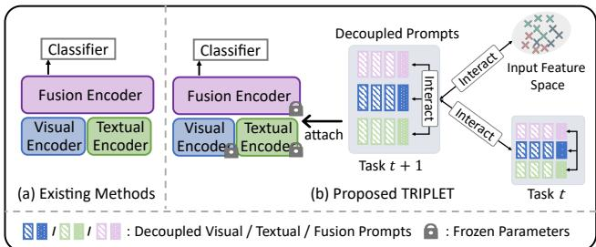
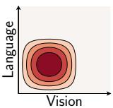
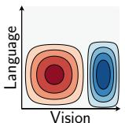
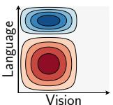
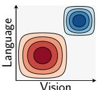
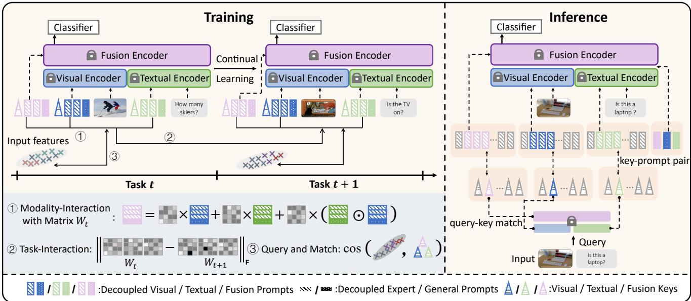
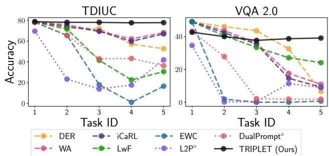
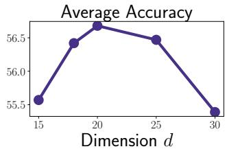
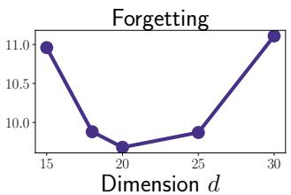
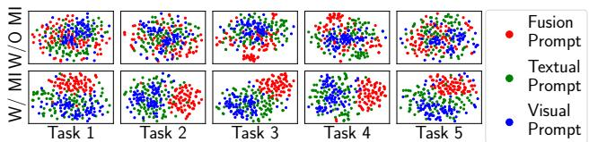

# Decouple Before Interact: Multi-Modal Prompt Learning for Continual Visual Question Answering

Zi Qian1,2, Xin Wang1\*, Xuguang Duan1, Pengda Qin2, Yuhong Li2, Wenwu Zhu1\* 1Department of Computer Science and Technology, BNRist, Tsinghua University 2Alibaba Group

qianz9729@gmail.com, xin wang@tsinghua.edu.cn, duan xg@outlook.com pengda.qpd@alibaba-inc.com, daniel.lyh@alibaba-inc.com, wwzhu@tsinghua.edu.cn

## Abstract

In the real world, a desirable Visual Question Answering model is expected to provide correct answers to new questions and images in a continual setting (recognized as CL-VQA). However, existing works formulate CL-VQA from a vision-only or language-only perspective, and straightforwardly apply the uni-modal continual learning (CL) strategies to this multi-modal task, which is improper and suboptimal. On the one hand, such a partial formulation may result in limited evaluations. On the other hand, neglecting the interactions between modalities will lead to poor performance. To tackle these challenging issues, we propose a comprehensiveformulationfor CL-VQA from the perspective ofmulti-modal vision-languagefusion. Based on ourformulation, wefurtherpropose MulTi-Modal PRompt LearnIng with DecouPLing bEfore InTeraction (TRIPLET), a novel approach that builds on a pre-trained vision-language model and consists of decoupled prompts and prompt interaction strategies to capture the complex interactions between modalities. In particular, decoupled prompts contain learnable parameters that are decoupled w.r.t different aspects, and the prompt interaction strategies are in charge of modeling interactions between inputs and prompts. Additionally, we build two CL-VQA benchmarks for a more comprehensive evaluation. Extensive experiments demonstrate that our TRIPLET outperforms state-ofthe-art methods in both uni-modal and multi-modal continual settings for CL-VQA.

## 1. Introduction

Visual Question Answering (VQA) [2, 11, 35, 25] aims to train a machine learning model capable of answering questions given visual images as accurately as possible.

  
Figure 1: Comparison between (a) existing CL-VQA methods [43, 28] and (b) our proposed TRIPLET model. Existing methods train all the parameters similar to typical uni-modal CL-methods, while our TRIPLET model trains parameters in prompts and classifiers, as well as explicitly model the rich and complex modality-wise interactions.

In real-world dynamic environments [22], an ideal VQA model is expected to generate answers for new questions, new images, as well as new question-image simultaneously, which is recognized as CL-VQA [19], i.e., learn a sequence of VQA tasks with a single model without suffering from catastrophic forgetting [27] on previously observed data.

Existing works [19, 28] formulate CL-VQA as a visiononly or language-only continual learning setting, and straightforwardly apply the uni-model continual learning (CL) methods to this multi-modal task. However, modeling CL-VQA from such a uni-model view is suboptimal, posing two challenging issues. First, the existing partial formulation does not take the multi-modal nature of CL-VQA into account, which leads to a limited view and improper evaluations. Second, by straightforwardly employing the uni-model CL methods, existing CL-VQA methods may neglect the rich and complex interactions between modalities, which leads to deteriorating performance.

To tackle the two challenging issues, we first propose a comprehensive formulation for CL-VQA explicitly covering both multi-modal and uni-modal perspectives, so that more extensive evaluations can be conducted in terms of input distributions. Specifically, we carefully design three scenarios according to different input distributions, i.e., Continual Vision Scenario, Continual Language Scenario, and Continual Vision-Language Scenario, depending on incremental visual images, textual questions, and both.

Secondly, based on our CL-VQA formulation with three scenarios, we propose MulTi-Modal PRompt LearnIng with DecouPLing bEfore InTeraction (TRIPLET), a multimodal prompt learning-based continual model for CL-VQA. TRIPLET employs the widely adopted pre-trained vision-language models with state-of-the-art VQA performance as initialization, and consists of decoupled prompts and prompt interaction strategies. To be specific, decoupled prompts contain a set of learnable parameters decoupled in three aspects, i.e., modality aspect, layer aspect, and complementary aspect, which are attached to transformer layers. Then the prompt interaction strategies are designed to model the interactions between the input and prompts, modality-wise prompts, as well as task-wise prompts. Fig. 1 illustrate a comparison between existing CL-VQA methods and our proposed TRIPLET model.

In addition, we build two CL-VQA benchmarks on two datasets (i.e., TDIUC [14] and VQA2.0 [9]), carrying out extensive experiments on three scenarios. Our TRIPLET model is able to consistently outperform baselines and SO-TAs1 significantly across various settings. Besides, we conduct ablation studies to validate the effectiveness of different components in TRIPLET, demonstrating TRIPLET’s superiority. In summary, our contributions are as follows:

• We propose a comprehensive formulation for CL-VQA with multi-modal continual setting, enabling the continual evaluations of various approaches in three scenarios based on different input distributions.

• We propose TRIPLET, a novel CL-VQA model containing decoupled prompts and prompt interaction strategies, which is able to accurately generate answers in three continual scenarios without rehearsal buffer. To the best of our knowledge, TRIPLET is the first multi-modal prompt learning-based continual model for CL-VQA.

• We build up two CL-VQA benchmarks (i.e., CL-VQA2.0 and CL-TDIUC) for empirical evaluations of CL-VQA including multi-modal continual setting. Our proposed TRIPLET model achieves significant improvement over state-of-the-art approaches in all three scenarios for both two benchmarks. Extensive ablation studies further demonstrate the effectiveness of different components in TRIPLET.

## 2. Related Works

Visual Question Answering Visual Question Answering (VQA) aims to answer related questions given an image, which requires multi-modal reasoning ability. Existing VQA methods [2, 11, 35, 25] and datasets [9, 14, 13, 18] are usually designed for a stable environment, while the VQA system being able to cope with dynamic environment (CL-VQA) is rarely studied. In this paper, we focus on the CL-VQA problem and propose the effective TRIPLET method.

Continual Learning Methods There exist numerous continual learning methods which could be categorized into three categories: (1) Regularization-based methods [22, 17, 41, 1] try to reduce catastrophic forgetting by regularizing import parameters for previous tasks. (2) Rehearsal-based methods [30, 31, 3, 40, 4, 33, 8, 39] use a buffer to store representative samples or pseudo samples for previous task to avoid catastrophic forgetting. In particular, [19] generates pseudo scene graphs for replay to mitigate forgetting for CL-VQA. However, scene graphs are not easily available in real-world applications, making it less applicable. (3) Architecture-based methods [15, 45, 24, 21, 42, 32, 40] associate different parameters for different tasks to mitigate forgetting. Recent works [36, 38, 37, 7, 29] adopt prompt tuning technique, trying to assign each task with learnable parameters. However, these methods are designed for uni-modal continual learning, failing to take multi-modal fusion and reasoning characteristic of CL-VQA into account. In particular, S-Prompts [36] is suited for CL image classification and not directly applicable to CL-VQA. S-iPrompts in [36] handles only uni-modal inputs, while SliPrompts in [36], based on CLIP, calculates scores between all possible labels and images, which is unsuitable for openended CL-VQA involving lengthy textual question inputs and thousands of answers in CL-VQA settings.

Continual Learning Benchmarks for VQA There exists a few continual learning benchmarks for VQA. [10, 19, 28] construct CL-VQA benchmarks from the uni-modal perspective. [43] builds CL-CrossVQA from the multi-domain perspective and formulates each domain as a distribution, while fails to characterize different distribution types and corresponding real scenarios. In this paper, we provide a comprehensive formulation from the multi-modal perspective for CL-VQA, and build two benchmarks with three scenarios, respectively.

## 3. Task Formulation

Continual Learning (CL) aims to capture the everchanging world and update models on a continuum of sequential coming data and tasks2 [38], where the data from previous task is not available during training [46]. In this paper, we focus on continual learning for the Visual Question Answering (VQA) task that is to answer questions based on a given image, which is usually formulated as a multi-label classification task involving thousands of classes [2, 11, 35, 25]. As time passed, new images, new questions, and even new answers would appear, and we have to update the VQA model accordingly. Following [19, 28], we namely define this problem as CL-VQA. Besides, we consider the more challenging CL-VQA setting where the task identity is unknown for each sample during inference, $i . e .$ , we do not know which task the samples belong to during test time.

  
(a)

  
(b)

  
(c)

  
(d)  
Figure 2: Graphical explanations of: (a) the red part denotes the ideal data distribution of task 1 task t, (b) Continual Vision Scenario, (c) Continual Language Scenario, and (d) Continual Vision Language Scenario. The blue part represents the distributions of the task $t + 1$

We denote the sequential tasks of CL-VQA as $\boldsymbol { D } =$ $\{ D _ { 1 } , D _ { 2 } , . . . , D _ { T } \}$ , where $D _ { t } = \{ ( \mathbf { x } _ { i } ^ { t } , \mathbf { y } _ { i } ^ { t } ) \} _ { i = 1 } ^ { n _ { t } }$ is the available data at t-th training task with $n _ { t }$ instances. Unlike most of the classical CL tasks where the input data x is uni-modal [46], the $\mathrm { \Delta V Q A }$ input data $\pmb { x } = ( \pmb { v } , \pmb { q } )$ , containing a visual scene v and a question ${ \mathbf { } } q ,$ is a multi-modal data. Thus, the input distribution $\mathrm { P r } ( \pmb { x } ) = \mathrm { P r } ( \pmb { v } , \pmb { q } )$ depends on the marginal distribution $\operatorname* { P r } ( v )$ and $\operatorname* { P r } ( \pmb q )$ , and the interaction between the two modalities. However, most of previous CL-VQA works [19, 28] only focus on partial settings (i.e. only $\operatorname* { P r } ( v )$ and $\operatorname* { P r } ( q ) )$ from uni-modal perspective, therefore not providing all-inclusive evaluations for continual methods.

In this paper, we consider continual learning scenarios systematically, explicitly from the uni-modal distribution as well as their joint-distribution, formulating CL-VQA in a more comprehensive way. Namely, we design three scenarios in CL-VQA:

• Continual Vision Scenario (ConVS) considers the changes of vision distribution $\operatorname* { P r } ( v )$ , while keeps $\mathrm { P r } ( \pmb q | \pmb v )$ unchanged. ConVS addresses the scenarios when new visual scenes occur while the possible questions remain the same.

• Continual Language Scenario (ConLS) considers the changes of question distribution $\operatorname* { P r } ( \pmb q )$ , while keeps $\operatorname* { P r } ( v | q )$ unchanged. ConLS addresses the scenarios when new questions arise on current available visual scene.

• Continual Vision-Language Scenario (ConVLS) considers the changes both vision and questions $\Pr ( v , q )$ ConVLS addresses the free-form changes of both modalities and their interactions, i.e., new visual scene appear, new questions arise, and $\operatorname* { P r } ( v | q )$ or $\operatorname* { P r } ( q | \mathbf { \boldsymbol { v } } )$ would also change.

We further provide a graphical explanation of these scenarios in Fig. 2. A desirable CL-VQA method is supposed to perform well across all the aforementioned scenarios.

## 4. The Proposed Methods

To address the aforementioned three scenarios, it is important that we model both vision and language modalities and their interaction at the same time. In this paper, we follow the general Prompt Learning framework [12] and propose the novel MulTi-Modal PRompt LearnIng with DecouPLing bEfore InTeraction (TRIPLET) method to address the exemplar-free continual VQA problem.

## 4.1. Preliminary

Transformer-Based VQA Model A modern transformer based VQA model usually contains three encoders, namely visual encoder, textual encoder, and fusion encoder [6, 20, 34]. Formally, the answer of a question q given an image v can be written as follows:

$$
\hat { y } ( \pmb { v } , \pmb { q } ) = \mathcal { F } \Big ( \mathrm { F T } \big ( \big [ \mathrm { V T } ( \pmb { v } ) ; \mathrm { T T } ( \pmb { q } ) \big ] \big ) [ 0 ] \Big ) ,\tag{1}
$$

where VT and TT are the pretrained visual transformer encoder and textual transformer encoder that encodes v and ${ \mathbf { } } q ,$ respectively. $\mathrm { F T } ( \cdots ) [ 0 ]$ fuses the multimodel features together, and output the first fused feature into a classifier $\mathcal F ( \cdot )$ to predict an answer a. Our proposed TRIPLET is built upon this structure.

Prompt Learning Given an input sequence data $\scriptstyle { \mathbf { 2 } } \implies$ $[ { \pmb x } _ { 1 } , \cdots , { \pmb x } _ { n _ { x } } ]$ and a transformer encoder T, prompt learning aims to find several “call-words” $P = [ P _ { 0 } , P _ { 1 } , \cdots , P _ { n _ { p } } ]$ that when $P$ is attached with x, the output feature would meet certain requirements. In the following, we use the notation $\mathbf { T } ( [ P ; \pmb { x } ] )$ to denote that we add prompts to x.

## 4.2. TRIPLET: Decouple Before Interact

Our proposed method, TRIPLET is illustrated in Fig. 3. Built upon transformer-based VQA models, our goal is to design a set of proper prompts and interaction strategies that could solve CL-VQA problem. We will first introduce our Prompt Decoupling Design separately in Sec. 4.2.1, and then combine them to train together with our Prompt Interaction Strategies in Sec. 4.2.2, finally, overall training and inference are introduced in Sec. 4.2.3.

## 4.2.1 Prompt Decoupling

Multi-Modal Decoupling Unlike those uni-modal prompts proposed by previous work [37, 38], in this paper, we disentangle prompts into multi-modal format to fully address the modality-related knowledge from both the pre-trained vision-language model and training data.

  
Figure 3: The TRIPLET framework. Left: during training, the pre-trained encoders are frozen, and parameters in classifier, decoupled prompts, task-specific keys and interaction matrix are learnable. At task $t + 1$ , we train the decoupled prompts (including three aspects, i.e., modality-wise, layer-wise and complementary). We further apply three interaction strategies (within the light blue colored rectangle) to model modality-wise prompt interaction, task-wise prompt interaction, and interaction between input features and prompt keys. Right: during inference, we first calculate multi-modal representations with the query function, which are used to match the most similar multi-modal keys. Then decoupled E-Prompts paired with matched keys, together with decoupled G-Prompts, are appended to the inputs (or features) for answer generation.

Basically, Eq. (1) would be modified with:

$$
\begin{array} { r } { \hat { y } ( v , q ) = \mathscr { F } \Big ( \mathbb { F T } \big ( \big [ P ^ { ( f ) } ; \mathbb { V T } \big ( [ P ^ { ( v ) } ; v ] \big ) ; \mathbb { T } \big ( [ P ^ { ( q ) } , q ] \big ) \big ] \big ) [ 0 ] \Big ) , } \end{array}\tag{2}
$$

where $P ^ { ( v ) } , P ^ { ( q ) } , P ^ { ( f ) }$ are the vision, question, and fusion prompt, respectively.

Selective Deep Decoupling We then disentangle prompts in a layer-wise format, and attaching it to selective layers. Rather than keeping attaching prompts to all the selected multi-head attention (MHA) layers [37], in this paper, we add prompts to some MHA layers in a replacing schema, which is more memory-efficient. Given a transformer T containing K layers, $\operatorname { T } ( [ P ; \pmb { x } ] ) = ( \mathtt { L } _ { K } \circ \mathtt { L } _ { K - 1 } \cdot \cdot \cdot \circ$ $\mathbb { L } _ { 0 } ) ( [ P ; \pmb { x } ] )$ could be decomposed layer-by-layer:

$$
\begin{array} { r } { \bar { \pmb { h } } _ { k } ^ { P } = \alpha _ { k } \cdot \pmb { h } _ { k } ^ { P } + ( 1 - \alpha _ { k } ) \cdot P _ { k } , } \\ { [ \pmb { h } _ { k + 1 } ^ { \mathrm { c L S } } ; \pmb { h } _ { k + 1 } ^ { P } ; \pmb { h } _ { k + 1 } ^ { x } ] = \mathtt { L } _ { k } ( [ \pmb { h } _ { k } ^ { \mathrm { c L S } } ; \bar { \pmb { h } } _ { k } ^ { P } ; \pmb { h } _ { k } ^ { x } ] ) , \quad } \end{array}\tag{3}
$$

where $[ { h } _ { 0 } ^ { \mathrm { c L S } } ; \bar { { h } } _ { 0 } ^ { P } ; { h } _ { 0 } ^ { x } ] = [ \mathrm { C L S } , { P } _ { 0 } , { x } ]$ are the raw inputs, and the output of $\mathtt { L } _ { K }$ is regarded as model output. Moreover, $\alpha _ { k } \in \{ 0 , 1 \}$ is a predefined switch that controls whether using the output prompt feature $h _ { k } ^ { P }$ or the k-th layer-specific prompt $P _ { k }$ as input.

Complementary Decoupling Following the complementary design principle [37], each prompt is further split into two parts: a General Prompt (G-Prompt) to extract taskinvariant knowledge, and an Expert Prompt (E-Prompt) to extract task-specific knowledge. For example, the visual prompt $P ^ { ( v ) } \stackrel { \cdot } { = } \{ G ^ { ( v ) } ; \{ E ^ { ( v ) } \bar { \} } \}$ is composed of G-prompt $G ^ { ( v ) }$ shared for all tasks and E-prompt $E _ { t } ^ { ( v ) }$ specialized for the t-th task . When the t-th task comes, we train the prompt $P _ { t } ^ { ( \mathfrak { m } ) } = \{ G ^ { ( \mathfrak { m } ) } ; E _ { t } ^ { ( \mathfrak { m } ) } \}$ where ${ \mathfrak { m } } = v , q , f .$

In our implementation, we combine all the three aforementioned decoupling designs. That is, we have three sets of prompts for three modalities, where each set of prompts contains layer-wise deep-prompts and each layer-wise deep prompt contains a G-prompt and a set of E-prompts. In summary, all the learnable prompts include:

$$
\begin{array} { r l } & { P ^ { ( \mathfrak { m } ) } = \bigg \{ G _ { k } ^ { ( \mathfrak { m } ) } \in \mathbb { R } ^ { L _ { G } \times D } \bigg \} \bigcup \bigg \{ E _ { t , k } ^ { ( \mathfrak { m } ) } \in \mathbb { R } ^ { L _ { E } \times D } \bigg \} , } \\ & { \qquad \mathfrak { m } = v , q , f , } \end{array}\tag{4}
$$

with subscripts t for tasks, k for the k-th MHA layers, $L _ { G }$ $/ L _ { E }$ for G / E-Prompt’s length, D for embedding dimension.

## 4.2.2 Prompt Interaction

With the proposed decoupled prompts, then we need interaction strategies to train them all together. We first have Query-and-Match Strategy to match between input features and related task-specific prompts. We further introduce Modality-Interaction Strategy and Task-Interaction Strategy to promote interactions between prompts. The former one would encourage mutual propagation between different modalities of prompts, thus strength the model performance [16]. And the latter one would make prompts less affected by sequential tasks, thus reduces catastrophic forgetting.

Query-and-Match Strategy As our decoupled prompts include task-specific prompts, we need accurate taskspecific keys to link input features to these prompts. We extend the “Query-and-Match” strategy in [37, 38]’s scope to the multi-modal domain to train the corresponding taskspecific key ${ \pmb u } _ { t } ^ { ( \mathrm { m } ) }$ via a query matching loss $\mathcal { L } _ { q m } .$ , making ${ \pmb u } _ { t } ^ { ( \mathrm { m } ) }$ closer to samples from the task t than others. Firstly, given (v, q), the queries are obtained using the frozen transformers (see Eq. (1)) as

$$
\begin{array} { r l } & { \pmb { h } ^ { ( v ) } = \mathrm { V T } ( \pmb { v } ) , \quad \pmb { h } ^ { ( q ) } = \mathrm { T T } ( \pmb { q } ) , \quad \pmb { h } ^ { ( f ) } = \mathrm { F T } ( [ \pmb { h } ^ { ( v ) } , \pmb { h } ^ { ( q ) } ] ) , } \\ & { \pmb { \mathbb { Q } } ^ { ( v ) } = \pmb { h } ^ { ( v ) } [ 0 ] , \quad \pmb { \mathbb { Q } } ^ { ( q ) } = \pmb { h } ^ { ( q ) } [ 0 ] , \quad \pmb { \mathbb { Q } } ^ { ( f ) } = \pmb { h } ^ { ( f ) } [ 0 ] , } \end{array}
$$

where $h [ 0 ]$ means selecting the first element from the vector, $i . e .$ , selecting $h ^ { \mathrm { C L S } }$ as shown in Eq. (3). Using cosine similarity $\gamma ,$ the query matching loss $\mathcal { L } _ { q m }$ is:

$$
\mathcal { L } _ { q m } ( D _ { t } ) = - \sum _ { ( v , q ) \in D _ { t } } \sum _ { \mathfrak { m } \in \{ v , q , f \} } \gamma \Bigl ( \pmb { u } _ { t } ^ { ( \mathfrak { m } ) } , \mathbb { Q } ^ { ( \mathfrak { m } ) } \Bigr ) .\tag{5}
$$

Modality-Interaction Strategy We present the Prompt Modality-Interaction that acts as a bridge between different modalities of prompts. We introduce the following interaction mapping:

$$
\hat { P } _ { t , k } ^ { ( f ) } = W _ { t , k } ^ { ( v ) } \otimes P _ { k , t } ^ { ( v ) } + W _ { t , k } ^ { ( q ) } \otimes P _ { t , k } ^ { ( q ) } + W _ { t , k } ^ { ( v , q ) } \otimes \left( P _ { t , k } ^ { ( v ) } \odot P _ { t , k } ^ { ( q ) } \right) .\tag{6}
$$

where is the element-wise multiplication, is the matrix multiplication, and $W ^ { ( \cdot ) }$ are the learnable interaction matrixes. In this paper, we constrain the rank of these interaction matrixes with $\pmb { W } = \pmb { U } \otimes \pmb { V } ^ { \top }$ , where $U , V \in \mathbb { R } ^ { D \times d }$ are two low-rank matrixes. We use the following $\mathcal { L } _ { m o d }$ to address this modality-interaction:

$$
\mathcal { L } _ { m o d } ( D _ { t } ) = - \sum _ { k } \gamma \left( \hat { P } _ { t , k } ^ { ( f ) } , P _ { t , k } ^ { ( f ) } \right) .\tag{7}
$$

Task-Interaction Strategy As our prompt learningbased method is built upon the frozen pre-trained model, the representations for different tasks share the same semantic space. Therefore, prompts share the invariant semantic space between different tasks to align with pretrained model, which leads to invariant prompt modalitiesinteraction structure between different tasks. To this end, we introduce the task-interaction constraint $\mathcal { L } _ { t a s k }$ to regulate the invariant structure as follows:

$$
\mathcal { L } _ { t a s k } ( D _ { t } ) = \sum _ { \mathfrak { m } , t , k } \left( \left. \mathbf { W } _ { t , k } ^ { \left( \mathfrak { m } \right) } - \left. \mathbf { W } _ { t , k } ^ { \left( \mathfrak { m } \right) } \right. _ { t - 1 } \right. _ { F } ^ { 2 } \right) ,\tag{8}
$$

where $\| \cdot \| _ { F }$ denotes the Frobenius norm, and $\langle W _ { k } ^ { ( \mathtt { m } ) } \rangle _ { t - 1 }$ is the cached copy of ${ W } _ { k } ^ { ( \mathtt { m } ) }$ when training task (t  1).

## 4.2.3 Training and Inference

Training When a new task t comes, we instantiate $\mathcal { F }$ as a classifier $g _ { t }$ (a fully connected layer), and allocate the task-specific querying keys $( \boldsymbol { u } _ { t } ^ { ( v ) } , \boldsymbol { u } _ { t } ^ { ( q ) } , \boldsymbol { u } _ { t } ^ { ( f ) } )$ and prompts $( E _ { t } ^ { ( v ) } , E _ { t } ^ { ( q ) } , \bar { E _ { t } ^ { ( f ) } } )$ . Then, the decoupled prompts, interaction matrix, classifier, querying keys as jointly trained with:

$$
\begin{array} { r l } & { \mathcal { L } ( D _ { t } ) = \displaystyle \sum _ { ( v , q , y ) \in D _ { t } } \ell _ { \mathrm { C E } } ( \hat { y } _ { t } ( v , q ) , y ) } \\ & { \quad \quad \quad + \lambda _ { 1 } \mathcal { L } _ { q m } ( D _ { t } ) + \lambda _ { 2 } \mathcal { L } _ { m o d } ( D _ { t } ) + \lambda _ { 3 } \mathcal { L } _ { t a s k } ( D _ { t } ) , } \end{array}\tag{9}
$$

where $\hat { y } ( \pmb { v } , \pmb { q } )$ is the network prediction (see Eq. (2)), y is the target answer, $\ell _ { \mathrm { C E } } ( \hat { y } , y )$ is the cross entropy loss, and $\lambda _ { ( \cdot ) }$ are the hyperparameters.

Inference During inference, given an input sample (v, q), we choose the best matched task index arg $\begin{array} { r } { \operatorname* { m a x } _ { t ^ { ( \mathtt { m } ) } } \gamma \big ( \pmb { u } _ { t ^ { ( \mathtt { m } ) } } ^ { ( \mathtt { m } ) } , \mathsf { Q } ^ { ( \mathtt { m } ) } \big ) } \end{array}$ . Then the corresponding prompts $P _ { t ^ { ( \mathtt { m } ) } , } ^ { ( \mathtt { m } ) }$ are selected, and fed into the corresponding transformer. Finally, the corresponding classifiers $g _ { t ^ { ( \cdot ) } }$ are selected to predict an answer.

The full picture of TRIPLET at training and inference is described in the Appendix.

## 5. Experiments

We evaluate our proposed TRIPLET on the three aforementioned scenarios on two well-known VQA datasets, $i . e .$ , TDIUC [14] and VQA2.0 [9]. We carefully compare TRIPLET with state-of-the-art (SOTA) methods of different categories under the same experiment settings. Moreover, we conduct extensive ablation studies to provide a better understanding of our proposed TRIPLET method.

## 5.1. Evaluation Benchmarks

Given the two commonly adopted VQA datasets, TDIUC [14] and VQA2.0 [9], we build continual learning benchmarks (denoted as CL-TDIUC and CL-VQA2.0) by dividing their images and questions into several disjoint hyper-categories, and then construct the benchmarks according to scenarios. For the Continual Vision Scenario (ConVS) and Continual Language Scenario (ConLS) scenarios, we split datasets according to the hyper-categories on images and questions, respectively [23, 5]. For the Continual Vision-Language Scenario (ConVLS), we collect questions of different types from each hyper-category of images to form 5 tasks, such that both image hyper-category and question type are different between tasks.

To note, we follow the original train-validation split while building these two benchmarks to avoid data breach when we use pre-trained vision-language models3. Detailed analysis for the data splits is provided in the appendix.

Table 1: Results for the CL-VQA2.0 and CL-TDIUC built upon ALBEF [20]. Bold: best exemplar-free CL-VQA results, Underline: second best exemplar-free CL-VQA results, †: best rehearsal-based CL-VQA results, ‡: rehearsal-based results which outperform the best exemplar-free results, Upper-bound: supervised fine-tuning on the i.i.d. data of each task, : enhanced methods as discussed in Sec. 5.2, A: average accuracy, F: forgetting.
<table><tr><td rowspan="3">Method</td><td rowspan="3">Buffer Size</td><td colspan="6">CL-VQA2.0</td><td colspan="6">CL-TDIUC</td></tr><tr><td colspan="2">ConLS</td><td colspan="2">ConVS</td><td colspan="2">ConVLS</td><td colspan="2">ConLS</td><td colspan="2">ConVS</td><td colspan="2">ConVLS</td></tr><tr><td>A(↑)</td><td>F(↓)</td><td>A(↑)</td><td>F(↓)</td><td>A(↑)</td><td>F(↓)</td><td>A(↑)</td><td>F(↓)</td><td>A(↑)</td><td>F(↓)</td><td>A(↑)</td><td>F(↓)</td></tr><tr><td>DER [40] WA[44]</td><td rowspan="3">2000</td><td>48.56 50.09</td><td>19.37 18.04</td><td>51.15 54.74</td><td>6.48 2.57</td><td>56.43 55.28</td><td>5.52 6.74</td><td>62.83</td><td>8.93 6.98</td><td>74.43 75.47</td><td>6.98 4.88</td><td>70.74 75.00</td><td>14.70 8.18</td></tr><tr><td>iCaRL [30, 26]</td><td>48.71</td><td>19.55</td><td>53.76</td><td>1.12</td><td>54.96</td><td>7.08</td><td>66.02 63.56</td><td>8.71</td><td>74.53</td><td>6.37</td><td>73.49</td><td>10.26</td></tr><tr><td>DER [40]</td><td>53.39</td><td></td><td></td><td></td><td></td><td></td><td></td><td></td><td></td><td></td><td>71.63</td><td>13.42</td></tr><tr><td>WA [44]</td><td rowspan="3">5000</td><td>53.91†</td><td>13.35† 13.51</td><td>52.34 55.89†</td><td>4.61 1.95</td><td>58.78† 58.75</td><td>3.86 3.96</td><td>63.71 69.23†</td><td>7.95 4.49†</td><td>75.18 75.84†</td><td>6.96 4.39†</td><td>77.51†</td><td>4.68</td></tr><tr><td>iCaRL [30, 26]</td><td>53.42</td><td>14.09</td><td>54.72</td><td>0.59†</td><td>58.58</td><td>4.06</td><td>67.94</td><td>5.46</td><td>75.78</td><td>4.75</td><td>74.98</td><td>7.41</td></tr><tr><td>LwF [22]</td><td></td><td></td><td></td><td></td><td></td><td></td><td></td><td></td><td></td><td></td><td></td><td></td></tr><tr><td rowspan="6">EWC [17] L2P° [38] DualPrompt [37]</td><td rowspan="6">0</td><td>37.49</td><td>26.08</td><td>54.90</td><td>2.80</td><td>36.87</td><td>24.03</td><td>39.25</td><td>30.50</td><td>72.19</td><td>5.50</td><td>73.71</td><td>8.11</td></tr><tr><td>37.21</td><td>34.13</td><td>54.54</td><td>3.69</td><td>33.78</td><td>27.22</td><td>14.61</td><td>66.37</td><td>71.27</td><td>8.26</td><td>73.65</td><td>8.28</td></tr><tr><td>41.38</td><td>25.80</td><td>41.55</td><td>3.86</td><td>32.43</td><td>27.25</td><td>33.95</td><td>29.21</td><td>75.51</td><td>0.60</td><td>69.18</td><td>15.65</td></tr><tr><td>44.26</td><td>24.16</td><td>53.56</td><td>1.68</td><td>41.30</td><td>21.37</td><td>44.50</td><td>14.70</td><td>77.38</td><td>3.93</td><td>81.36</td><td>2.31</td></tr><tr><td>45.50</td><td>8.00</td><td>44.18</td><td>0.78</td><td>46.36</td><td>8.65</td><td>59.70</td><td>7.32</td><td>69.89</td><td>4.35</td><td>72.77</td><td>2.25</td></tr><tr><td>56.76</td><td>9.66</td><td>59.41</td><td>0.12</td><td>60.53</td><td>4.08</td><td>70.80</td><td>1.64</td><td>80.47</td><td>0.15</td><td>83.06</td><td>0.54</td></tr><tr><td>Upper-bound</td><td></td><td>64.53</td><td></td><td>59.62</td><td></td><td>64.08</td><td></td><td>74.60</td><td></td><td>80.57</td><td></td><td>83.33</td><td></td></tr></table>

## 5.2. Experimental Details

Backbones We select two public pre-trained models as our backbones, namely ALBEF [20] and FLAVA [34]. These two models differ in fusion encoder, where ALBEF uses cross-attention between two modalities, while FLAVA uses self-attention.

We mainly analyze results on ALBEF in the main paper and provide additional results on FLAVA in the appendix.

Evaluation Metrics Following the common evaluation protocols [38, 37], we use two metrics, namely Average accuracy (higher is better) and Forgetting (lower is better). We use $S _ { t , \tau }$ to represent the accuracy on the τ -th task after training the model on the t-th task. Then, Average accuracy is defined as $\begin{array} { r } { \sum _ { t \leq T } \sum _ { \tau \leq t } \alpha _ { t , \tau } S _ { t , \tau } } \end{array}$ τ where $\alpha _ { t , \tau }$ is a weighted factor to balance the number of testing instances in different tasks, Forgetting is defined as $\begin{array} { r } { \frac { 1 } { T - 1 } \sum _ { \tau < T } \operatorname* { m a x } _ { t \geq \tau } ( S _ { t , \tau } - S _ { T , \tau } ) } \end{array}$

Comparing Methods Based on [28] and our preliminary experiments, vanilla VQA models fail to tackle CL-VQA tasks, we thus focus on those SOTA continual learning approaches from different categories. We compare our TRIPLET with non-prompting rehearsal-based methods: DER [40], WA [44], iCaRL [30]; regularization-based methods: LwF [22], EWC [17]; and the newly proposed prompt-based methods L2P [38], DualPrompt [37] and S-

Prompts [36]. Upper-bound is the supervised fine-tuning on the i.i.d. data of each task.

To compare fairly, we use the same backbone for all these approaches, and we train with the backbone for non-prompting methods while freezing the backbone for prompt-based methods. All these approaches and our TRIPLET use the same classifier head. For rehearsal-based methods iCaRL [30], DER [40] and WA [44], we further test two sizes of replay buffer, i.e., 2000 and 5000, which show high performance in [46]. For non-prompting methods, we use the representation of “CLS” token for classification. For prompt-based methods L2P [38], DualPrompt [37] and S-Prompts [36]4, we symmetrically add textual keyprompt pairs to enhance model performance, which we denoted as L2P⋄, DualPrompt⋄ and S-Prompts⋄. Experimental results for original structures of L2P and DualPrompt are in the appendix.

Training Details For those non-prompting methods, we follow the original paper [20, 34] to set up the optimizer. For those prompt-based methods, we follow Dual-Prompt [37] to set up the optimizer as adamW with cosine scheduler and $4 e ^ { - 4 }$ start learning rate. For all approaches, we set the training batch size to 16 for CL-VQA2.0 and 64 for CL-TDIUC. For L2P⋄ [38], we use the same hyperparameters as [37] does. For DualPrompt⋄ [37], we add deepprompts to the [0-2] MHA layers for G-prompts and [2-5] MHA layers for E-prompts, and set $L _ { G } = 5 , L _ { E } = 2 0$ (See Eq. (4)). For TRIPLET, we keep the same hyperparameter with DualPrompt⋄’s for Multi-Modal Prompt. After hyperparameter searching, we set $d = 2 0 , \lambda _ { 1 } = 0 . 1 , \lambda _ { 2 } =$

  
Figure 4: Tracking the accuracy of the first task on Continual Language Scenario (ConLS).

$0 . 2 , \lambda _ { 3 } = 0 . 0 5$ for all benchmarks with ALBEF, and set $d = 1 0 , \lambda _ { 1 } = 0 . 1 , \lambda _ { 2 } = 0 . 1 , \lambda _ { 3 } = 0 . 0 5$ for FLAVA.

Overheads For each task, our proposed TRIPLET method trains a set of additional key-prompt pairs, as well as an interaction constraint matrix, which leads to the 0.55% and 0.44% extra memory cost based on ALBEF [20] and FLAVA [34], respectively. Other SOTA prompt learningbased methods $\mathrm { L } 2 \mathrm { P } ^ { \circ }$ and DualPrompt⋄ take 0.47% and 0.31% extra memory based on ALBEF, and 0.41% and 0.27% based on FLAVA, respectively. We also compare our methods with DualPrompt⋄ with the same 0.55% extra memory on ALBEF as shown in Sec. 5.4.

## 5.3. Main Results

We summarize the main results in Tbl. 1 for the continual scenarios on CL-VQA 2.0 and CL-TDIUC.

Overall Performance The results indicate that the proposed TRIPLET significantly outperforms baseline methods across various settings, including those models using extra buffer and the two recently proposed prompt-based methods $\mathrm { L } 2 \mathrm { P } ^ { \diamond }$ and DualPrompt⋄, considering average accuracy and forgetting. We also find baseline methods’ performances differ across various scenarios, demonstrating the importance of our proposed comprehensive formulation. Methods generally achieve higher average accuracy in CL-TDIUC than CL-VQA2.0, which is consistent with the i.i.d. accuracy in original splits [9, 14]. However, there is no obvious partial order relationship for the forgetting metric on the two splits, as forgetting is also related to the task-wise differences inside each scenario.

We also trace the first task’s accuracy during different training stages (denoted as task ID) in Fig. 4, in ConLS settings. We could find that our method shows the best overall performance. Besides, as we formulate CL-VQA w.r.t. inputs, there exists some answer overlap between tasks, which would help the model recall previous knowledge and result in the accuracy ascent for all methods after the final task.

Findings Moreover, we observe some interesting findings for pre-trained vision-language model-based continual learning. In Continual Language Scenarios, rehearsal-based methods (DER, WA, and iCaRL) achieve much higher performance than exemplar-free methods (EWC and LwF). However, in Continual Vision Scenarios, they achieve comparable results, and this observation is consistent with the results in [28]. A possible explanation is that with pretrained knowledge, Continual Language Scenarios, where tasks have significant different answer distributions from each other, is more difficult than Continual Vision Scenarios, where tasks have similar answer distributions. Another phenomenon is that the larger size of the buffer offers little help for performance. This is because VQA datasets usually contain high-dimensional and long-tailed answer labels, and it is difficult to select representative replay examples with the existing strategies.

Table 2: Ablation study for position of prompts on ConLS VQA2.0. E means E-Prompts and G means G-Prompts, the numbers in [ ] means layers to attach prompts.
<table><tr><td>Prompt Position</td><td>Avg. Acc (↑)</td><td>Forgetting (↓)</td></tr><tr><td>E: [2,3,4], G: [0,1,2]</td><td>55.75</td><td>10.72</td></tr><tr><td>E: [2,3,4,5], G: [0,1,2]</td><td>56.32</td><td>10.37</td></tr><tr><td>E: [0,1,2,3,4,5], G: [0,1,2,3,4,5]</td><td>54.59</td><td>12.32</td></tr></table>

Table 3: Ablation Study of Modality (M) Interaction Strategy and Task (T) Interaction Strategy for three scenarios on two benchmarks. Bold: best results.
<table><tr><td rowspan="2">Scenario</td><td rowspan="2">M&amp;T Interaction</td><td colspan="2">CL-TDIUC</td><td colspan="2">CL-VQA2.0</td></tr><tr><td>Avg. Acc (↑)</td><td>FGT (↓)</td><td> $\operatorname { A v g } .$  Acc (↑)</td><td>FGT (↓)</td></tr><tr><td rowspan="2">ConLS</td><td>x</td><td>70.26</td><td>2.05</td><td>56.32</td><td>10.37</td></tr><tr><td>√</td><td>70.80</td><td>1.64</td><td>56.76</td><td>9.66</td></tr><tr><td rowspan="2">ConVS</td><td>x</td><td>80.27</td><td>0.40</td><td>59.27</td><td>1.02</td></tr><tr><td>√</td><td>80.47</td><td>0.15</td><td>59.41</td><td>0.12</td></tr><tr><td rowspan="2">ConVLS</td><td>x</td><td>82.94</td><td>0.59</td><td>60.05</td><td>4.43</td></tr><tr><td>√</td><td>83.06</td><td>0.54</td><td>60.53</td><td>4.08</td></tr></table>

## 5.4. Ablation Study

We conduct first four ablation studies based on the AL-BEF backbone for a more in-depth understanding of the proposed TRIPLET method.

The Effectiveness of Selective Deep Decoupling We learn from [37]’s empirical results that the prompts work better in the first six layers. In ALBEF, the visual encoder has 12 layers, and fusion and textual encoders have 6 layers. Thus, we conduct an ablation study on the ConLS CL-VQA2.0 to search best layers. As shown in Tbl. 2, we find the best performance to add E-Prompt from layers 2 to 5 and G-Prompt from layers 0 to 2. The highest performance in the second row demonstrates the effectiveness of Selective Deep Decoupling.

The Effectiveness of Prompt Interactions As shown in Tbl. 3, our performance stably improves with prompt interaction strategies in all scenarios. We also conduct additional experiments for different components of prompt modality and task interaction strategies in Tbl. 4. Improved performance between the first two rows shows that mutual propagation between different modalities helps the alignment of decoupled prompts in modality aspect. The results in the last three rows show that it is important to keep the invariant prompt modality-interaction structure between different tasks for both G and E-prompts in selective deep layers.

  
Figure 5: Exploration of Dimension d in Sec. 4.2.2.

Table 4: Ablation Study for Exploration of Modalitywise and Task-wise Prompt Interactions. MI: Modality-Interaction, TI on G/E-Prompt: Task-Interaction (See Eq. (8)) for G/E-Prompt.
<table><tr><td>MI</td><td>TI on G-Prompt</td><td>TI on E-Prompt|</td><td>Avg. Acc (↑)</td><td>Forgetting (↓)</td></tr><tr><td>√</td><td></td><td></td><td>56.32</td><td>10.37</td></tr><tr><td>√</td><td>√</td><td></td><td>56.63 56.30</td><td>9.87 10.02</td></tr><tr><td>√</td><td></td><td>√</td><td>56.53</td><td>9.80</td></tr><tr><td>√</td><td>√</td><td>√</td><td>56.76</td><td>9.66</td></tr><tr><td></td><td></td><td></td><td></td><td></td></tr></table>

  
Figure 6: Visualization of decoupled prompts w/o and w/ Modality-Interaction(MI) by t-SNE.

Exploration of Modality-Interaction Matrix We explore the dimension d on ConVS CL-VQA2.0 to explore the best hyperparameter for the proposed Modality-Interaction Strategy (See Sec. 4.2.2) as shown in Fig. 5. With the increasing dimension d, the performance first increases and then decreases with the peak performance at dimension $d = 2 0$ . Interestingly, the best dimension d remains stable across different scenarios. Compared with dimension $d ,$ another two hyperparameters $\lambda _ { 2 }$ and $\lambda _ { 3 }$ have less influence on the model performance. We set $\lambda _ { 2 } = 0 . 2$ and $\lambda _ { 3 } = 0 . 0 5$ across different scenarios. As shown in Figure $^ { 6 , }$ we also visualize decoupled prompts for 5 tasks after the final training stage, w/o and w/ Modality-Interaction(MI) by t-SNE, further verifying that prompts within different modalities become more clustered. The above two ablation studies demonstrate the effectiveness of explicitly modeling the complex multi-modal interactions.

Exploration of Extra Memory We set $L _ { G } / L _ { E } = 2 0 / 3 5$ for visual and textual prompts in DualPrompt⋄ [37] to make a fair comparison with TRIPLET in extra memory. We choose to conduct experiments on ConVLS TDIUC when DualPrompt⋄ achieves its best time (See Tbl. 1). From

Table 5: Results for exploration for extra memory.
<table><tr><td>Method</td><td>Extra Memory</td><td>Avg. Acc (↑)</td><td>FGT (↓)</td></tr><tr><td>DualPrompt [37]</td><td>0.31%</td><td>81.36</td><td>2.31</td></tr><tr><td>DualPrompt [37]</td><td>0.55%</td><td>80.41</td><td>3.68</td></tr><tr><td>Ours</td><td>0.55%</td><td>83.06</td><td>0.54</td></tr></table>

Table 6: Results for Continual Language Scenario built upon FLAVA [34]. For details about the meaning of the fonts and notations, see Tbl. 1.
<table><tr><td rowspan="2">Method</td><td rowspan="2">Buffer Size</td><td colspan="2">Average Acc</td></tr><tr><td>CL-VQA2.0</td><td>CL-TDIUC</td></tr><tr><td>DER [40]</td><td rowspan="3">5000</td><td>41.66†</td><td>44.91</td></tr><tr><td>WA [44]</td><td>33.02</td><td>66.27</td></tr><tr><td>iCaRL  $[ 3 0 , 2 6 ]$ </td><td>34.14</td><td>64.59</td></tr><tr><td>L2P [38]</td><td rowspan="3">0</td><td>36.98</td><td>27.21</td></tr><tr><td>DualPrompt [37]</td><td>23.65</td><td>25.99</td></tr><tr><td>Ours</td><td>44.00</td><td>64.86</td></tr><tr><td>Upper-bound</td><td></td><td>64.14</td><td>75.08</td></tr></table>

Tbl. 5, we find DualPrompt⋄ performs worse with more extra memory, as the previous chosen hyperparameters have the best performance reported in [37].

Exploration of Different Backbones In order to explore the impact of different backbones and demonstrate the stability of our proposed TRIPLET method, we conduct extensive experiments based on FLAVA [34]. We select the baselines with the top performance across different settings, namely WA, iCaRL, and DER with 5000 buffer size and DualPrompt⋄. We also select $\mathrm { L } 2 \mathrm { P } ^ { \diamond }$ as it belongs to the prompt learning-based category as ours. As shown in Tbl. 6, our method consistently outperforms exemplar-free baselines, and achieves comparable results with rehearsal-based baselines. Generally, ALBEF-based results are higher than FLAVA-based results, which may be partially due to different fusion structures, thus being consistent with [43].

## 6. Conclusions

In this paper, we are the first to propose a comprehensive formulation for CL-VQA to conduct extensive multimodal continual evaluations. Based on our formulation, we further propose TRIPLET, the first multimodal prompt learningbased continual model for CL-VQA, which achieves stateof-the-art results across various settings in the experiments.

## 7. Acknowledgment

This work was supported in part by the National Key Research and Development Program of China No. 2020AAA0106300, National Natural Science Foundation of China (No. 62222209, 62250008, 62102222), Beijing National Research Center for Information Science and Technology Grant No. BNR2023RC01003, BNR2023TD03006, and Beijing Key Lab of Networked Multimedia.

## References

[1] Rahaf Aljundi, Francesca Babiloni, Mohamed Elhoseiny, Marcus Rohrbach, and Tinne Tuytelaars. Memory aware synapses: Learning what (not) to forget. In Proceedings of the European conference on computer vision (ECCV), pages 139–154, 2018. 2

[2] Peter Anderson, Xiaodong He, Chris Buehler, Damien Teney, Mark Johnson, Stephen Gould, and Lei Zhang. Bottom-up and top-down attention for image captioning and visual question answering. In Proceedings of the IEEE conference on computer vision and pattern recognition, pages 6077–6086, 2018. 1, 2, 3

[3] Pietro Buzzega, Matteo Boschini, Angelo Porrello, Davide Abati, and Simone Calderara. Dark experience for general continual learning: a strong, simple baseline. Advances in neural information processing systems, 33:15920–15930, 2020. 2

[4] Hyuntak Cha, Jaeho Lee, and Jinwoo Shin. Co2l: Contrastive continual learning. In Proceedings of the IEEE/CVF International conference on computer vision, pages 9516– 9525, 2021. 2

[5] Riccardo Del Chiaro, Bartłomiej Twardowski, Andrew Bagdanov, and Joost Van De Weijer. Ratt: Recurrent attention to transient tasks for continual image captioning. Advances in Neural Information Processing Systems, 33:16736–16748, 2020. 5

[6] Zi-Yi Dou, Yichong Xu, Zhe Gan, Jianfeng Wang, Shuohang Wang, Lijuan Wang, Chenguang Zhu, Pengchuan Zhang, Lu Yuan, Nanyun Peng, et al. An empirical study of training end-to-end vision-and-language transformers. In Proceedings of the IEEE/CVF Conference on Computer Vision and Pattern Recognition, pages 18166–18176, 2022. 3

[7] Arthur Douillard, Alexandre Rame, Guillaume Couairon,´ and Matthieu Cord. Dytox: Transformers for continual learning with dynamic token expansion. In Proceedings of the IEEE/CVF Conference on Computer Vision and Pattern Recognition, pages 9285–9295, 2022. 2

[8] Yizhao Gao, Nanyi Fei, Haoyu Lu, Zhiwu Lu, Hao Jiang, Yijie Li, and Zhao Cao. Bmu-moco: Bidirectional momentum update for continual video-language modeling. In Advances in Neural Information Processing Systems, 2022. 2

[9] Yash Goyal, Tejas Khot, Douglas Summers-Stay, Dhruv Batra, and Devi Parikh. Making the v in vqa matter: Elevating the role of image understanding in visual question answering. In Proceedings of the IEEE conference on computer vision and pattern recognition, pages 6904–6913, 2017. 2, 5, 7

[10] Claudio Greco, Barbara Plank, Raquel Fernandez, and Raf-´ faella Bernardi. Psycholinguistics meets continual learning: Measuring catastrophic forgetting in visual question answering. arXiv preprint arXiv:1906.04229, 2019. 2

[11] Ronghang Hu, Jacob Andreas, Marcus Rohrbach, Trevor Darrell, and Kate Saenko. Learning to reason: End-to-end module networks for visual question answering. In Proceedings of the IEEE international conference on computer vision, pages 804–813, 2017. 1, 2, 3

[12] Menglin Jia, Luming Tang, Bor-Chun Chen, Claire Cardie, Serge Belongie, Bharath Hariharan, and Ser-Nam Lim. Visual prompt tuning. In Computer Vision–ECCV 2022: 17th European Conference, Tel Aviv, Israel, October 23–27, 2022, Proceedings, Part XXXIII, pages 709–727. Springer, 2022. 3

[13] Justin Johnson, Bharath Hariharan, Laurens Van Der Maaten, Li Fei-Fei, C Lawrence Zitnick, and Ross Girshick. Clevr: A diagnostic dataset for compositional language and elementary visual reasoning. In Proceedings of the IEEE conference on computer vision and pattern recognition, pages 2901–2910, 2017. 2

[14] Kushal Kafle and Christopher Kanan. An analysis of visual question answering algorithms. In Proceedings of the IEEE international conference on computer vision, pages 1965– 1973, 2017. 2, 5, 7

[15] Zixuan Ke, Bing Liu, and Xingchang Huang. Continual learning of a mixed sequence of similar and dissimilar tasks. Advances in neural information processing systems, 33:18493–18504, 2020. 2

[16] Muhammad Uzair Khattak, Hanoona Rasheed, Muhammad Maaz, Salman Khan, and Fahad Shahbaz Khan. Maple: Multi-modal prompt learning. arXiv preprint arXiv:2210.03117, 2022. 5

[17] James Kirkpatrick, Razvan Pascanu, Neil Rabinowitz, Joel Veness, Guillaume Desjardins, Andrei A Rusu, Kieran Milan, John Quan, Tiago Ramalho, Agnieszka Grabska-Barwinska, et al. Overcoming catastrophic forgetting in neural networks. Proceedings of the national academy of sciences, 114(13):3521–3526, 2017. 2, 6

[18] Ranjay Krishna, Yuke Zhu, Oliver Groth, Justin Johnson, Kenji Hata, Joshua Kravitz, Stephanie Chen, Yannis Kalantidis, Li-Jia Li, David A Shamma, et al. Visual genome: Connecting language and vision using crowdsourced dense image annotations. Internationaljournal ofcomputer vision, 123:32–73, 2017. 2, 6

[19] Stan Weixian Lei, Difei Gao, Jay Zhangjie Wu, Yuxuan Wang, Wei Liu, Mengmi Zhang, and Mike Zheng Shou. Symbolic replay: Scene graph as prompt for continual learning on vqa task. arXiv preprint arXiv:2208.12037, 2022. 1, 2, 3

[20] Junnan Li, Ramprasaath Selvaraju, Akhilesh Gotmare, Shafiq Joty, Caiming Xiong, and Steven Chu Hong Hoi. Align before fuse: Vision and language representation learning with momentum distillation. Advances in neural information processing systems, 34:9694–9705, 2021. 3, 6, 7

[21] Xilai Li, Yingbo Zhou, Tianfu Wu, Richard Socher, and Caiming Xiong. Learn to grow: A continual structure learning framework for overcoming catastrophic forgetting. In International Conference on Machine Learning, pages 3925– 3934. PMLR, 2019. 2

[22] Zhizhong Li and Derek Hoiem. Learning without forgetting. IEEE transactions on pattern analysis and machine intelligence, 40(12):2935–2947, 2017. 1, 2, 6

[23] Tsung-Yi Lin, Michael Maire, Serge Belongie, James Hays, Pietro Perona, Deva Ramanan, Piotr Dollar, and C Lawrence´ Zitnick. Microsoft coco: Common objects in context. In Computer Vision–ECCV 2014: 13th European Conference,

Zurich, Switzerland, September 6-12, 2014, Proceedings, Part V 13, pages 740–755. Springer, 2014. 5, 6

[24] Noel Loo, Siddharth Swaroop, and Richard E Turner. Generalized variational continual learning. arXiv preprint arXiv:2011.12328, 2020. 2

[25] Jiasen Lu, Jianwei Yang, Dhruv Batra, and Devi Parikh. Hierarchical question-image co-attention for visual question answering. Advances in neural information processing systems, 29, 2016. 1, 2, 3

[26] Francesco Marra, Cristiano Saltori, Giulia Boato, and Luisa Verdoliva. Incremental learning for the detection and classification of gan-generated images. In 2019 IEEE international workshop on information forensics and security (WIFS), pages 1–6. IEEE, 2019. 6, 8

[27] Michael McCloskey and Neal J Cohen. Catastrophic interference in connectionist networks: The sequential learning problem. In Psychology of learning and motivation, volume 24, pages 109–165. Elsevier, 1989. 1

[28] Mavina Nikandrou, Lu Yu, Alessandro Suglia, Ioannis Konstas, and Verena Rieser. Task formulation matters when learning continually: A case study in visual question answering. arXiv preprint arXiv:2210.00044, 2022. 1, 2, 3, 6, 7

[29] Chengwei Qin and Shafiq Joty. Lfpt5: A unified framework for lifelong few-shot language learning based on prompt tuning of t5. arXiv preprint arXiv:2110.07298, 2021. 2

[30] Sylvestre-Alvise Rebuffi, Alexander Kolesnikov, Georg Sperl, and Christoph H Lampert. icarl: Incremental classifier and representation learning. In Proceedings of the IEEE conference on Computer Vision and Pattern Recognition, pages 2001–2010, 2017. 2, 6, 8

[31] David Rolnick, Arun Ahuja, Jonathan Schwarz, Timothy Lillicrap, and Gregory Wayne. Experience replay for continual learning. Advances in Neural Information Processing Systems, 32, 2019. 2

[32] Andrei A Rusu, Neil C Rabinowitz, Guillaume Desjardins, Hubert Soyer, James Kirkpatrick, Koray Kavukcuoglu, Razvan Pascanu, and Raia Hadsell. Progressive neural networks. arXiv preprint arXiv:1606.04671, 2016. 2

[33] Hanul Shin, Jung Kwon Lee, Jaehong Kim, and Jiwon Kim. Continual learning with deep generative replay. Advances in neural information processing systems, 30, 2017. 2

[34] Amanpreet Singh, Ronghang Hu, Vedanuj Goswami, Guillaume Couairon, Wojciech Galuba, Marcus Rohrbach, and Douwe Kiela. Flava: A foundational language and vision alignment model. In Proceedings of the IEEE/CVF Conference on Computer Vision and Pattern Recognition, pages 15638–15650, 2022. 3, 6, 7, 8

[35] Damien Teney, Lingqiao Liu, and Anton van Den Hengel. Graph-structured representations for visual question answering. In Proceedings of the IEEE conference on computer vision and pattern recognition, pages 1–9, 2017. 1, 2, 3

[36] Yabin Wang, Zhiwu Huang, and Xiaopeng Hong. Sprompts learning with pre-trained transformers: An occam’s razor for domain incremental learning. arXiv preprint arXiv:2207.12819, 2022. 2, 6

[37] Zifeng Wang, Zizhao Zhang, Sayna Ebrahimi, Ruoxi Sun, Han Zhang, Chen-Yu Lee, Xiaoqi Ren, Guolong Su, Vin-

cent Perot, Jennifer Dy, et al. Dualprompt: Complementary prompting for rehearsal-free continual learning. arXiv preprint arXiv:2204.04799, 2022. 2, 3, 4, 5, 6, 7, 8

[38] Zifeng Wang, Zizhao Zhang, Chen-Yu Lee, Han Zhang, Ruoxi Sun, Xiaoqi Ren, Guolong Su, Vincent Perot, Jennifer Dy, and Tomas Pfister. Learning to prompt for continual learning. In Proceedings of the IEEE/CVF Conference on Computer Vision and Pattern Recognition, pages 139–149, 2022. 2, 3, 5, 6, 8

[39] Shipeng Yan, Lanqing Hong, Hang Xu, Jianhua Han, Tinne Tuytelaars, Zhenguo Li, and Xuming He. Generative negative text replay for continual vision-language pretraining. In Computer Vision–ECCV 2022: 17th European Conference, Tel Aviv, Israel, October 23–27, 2022, Proceedings, Part XXXVI, pages 22–38. Springer, 2022. 2

[40] Shipeng Yan, Jiangwei Xie, and Xuming He. Der: Dynamically expandable representation for class incremental learning. In Proceedings of the IEEE/CVF Conference on Computer Vision and Pattern Recognition, pages 3014–3023, 2021. 2, 6, 8

[41] Yang Yang, Da-Wei Zhou, De-Chuan Zhan, Hui Xiong, Yuan Jiang, and Jian Yang. Cost-effective incremental deep model: Matching model capacity with the least sampling. IEEE Transactions on Knowledge and Data Engineering, 2021. 2

[42] Jaehong Yoon, Eunho Yang, Jeongtae Lee, and Sung Ju Hwang. Lifelong learning with dynamically expandable networks. arXiv preprint arXiv:1708.01547, 2017. 2

[43] Yao Zhang, Haokun Chen, Ahmed Frikha, Yezi Yang, Denis Krompass, Gengyuan Zhang, Jindong Gu, and Volker Tresp. Cl-crossvqa: A continual learning benchmark for cross-domain visual question answering. arXiv preprint arXiv:2211.10567, 2022. 1, 2, 8

[44] Bowen Zhao, Xi Xiao, Guojun Gan, Bin Zhang, and Shu-Tao Xia. Maintaining discrimination and fairness in class incremental learning. In Proceedings of the IEEE/CVF conference on computer vision and pattern recognition, pages 13208–13217, 2020. 6, 8

[45] Tingting Zhao, Zifeng Wang, Aria Masoomi, and Jennifer Dy. Deep bayesian unsupervised lifelong learning. Neural Networks, 149:95–106, 2022. 2

[46] Da-Wei Zhou, Qi-Wei Wang, Zhi-Hong Qi, Han-Jia Ye, De-Chuan Zhan, and Ziwei Liu. Deep class-incremental learning: A survey. arXiv preprint arXiv:2302.03648, 2023. 2, 3, 6