# Deep geometry-aware camera self-calibration from video

Annika Hagemann1,2, Moritz Knorr1, Christoph Stiller2

1Bosch Research, Germany 2Karlsruhe Institute of Technology

{annika.hagemann, moritzmichael.knorr}@de.bosch.com, stiller@kit.edu

## Abstract

Accurate intrinsic calibration is essential for camerabased 3D perception, yet, it typically requires targets of well-known geometry. Here, we propose a camera selfcalibration approach that infers camera intrinsics during application, from monocular videos in the wild. We propose to explicitly model projection functions and multiview geometry, while leveraging the capabilities of deep neural networks for feature extraction and matching. To achieve this, we build upon recent research on integrating bundle adjustment into deep learning models, and introduce a self-calibrating bundle adjustment layer. The selfcalibrating bundle adjustment layer optimizes camera intrinsics through classical Gauß-Newton steps and can be adapted to different camera models without re-training. As a specific realization, we implemented this layer within the deep visual SLAM system DROID-SLAM, and show that the resulting model, DroidCalib, yields state-of-the-art calibration accuracy across multiple public datasets. Our results suggest that the model generalizes to unseen environments and different camera models, including significant lens distortion. Thereby, the approach enables performing 3D perception tasks without prior knowledge about the camera. Code is available at https://github.com/ boschresearch/droidcalib.

## 1. Introduction

Inferring 3D structure and camera motion from a sequence of images typically requires knowledge about the camera. Specifically, the camera’s mapping of 3D points to the 2D image, characterized by the intrinsic camera parameters, must be known (Fig. 1). Intrinsic camera parameters are commonly obtained in a calibration process in which well-known calibration targets are moved in front of the camera [53, 46]. As the 3D structure of these calibration targets is precisely known, images of the target give 3D-2D correspondences that can be used to infer intrinsic camera parameters. However, this is a time-consuming process and does not allow for continuous re-calibration.

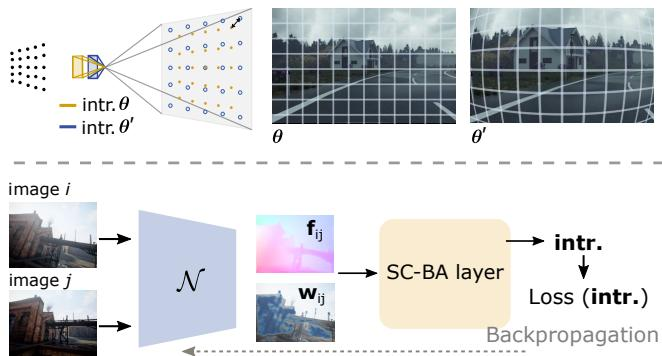  
Figure 1. The proposed self-calibration infers the intrinsic camera parameters θ that define a camera’s projection function (top) without relying on calibration targets. A deep neural network N predicts weighted correspondences (flow $\mathbf { f } _ { i j }$ , confidence weights $\mathbf { w } _ { i j } )$ , while the self-calibrating bundle adjustment (SC-BA) layer estimates the intrinsics through differentiable Gauß Newton steps (bottom).

Camera self-calibration aims at inferring camera intrinsics based on arbitrary images or image sequences, without the need for a calibration target [14]. Yet, achieving accuracy and robustness comparable to target-based calibration remains challenging. Single-image self-calibration approaches (e.g. [52, 51, 22, 19]) have proven effective for image undistortion and for cases in which only a single image is available, however, they have to rely on known or learned properties of the environment (e.g. the existence of straight lines) which limits their ability to generalize, and they are typically limited to a subset of the intrinsics.

Multi-view approaches, on the other hand, use a sequence of images and exploit the consistency of the scene structure over time to estimate camera intrinsics (e.g. [24, 33, 25]). The most common approach is to use a classical Structure-from-Motion (SfM) pipeline, and to refine intrinsics jointly with camera motion and 3D structure [33]. While classical SfM pipelines generalize well to unseen environments, they typically rely on handcrafted features and thus do not leverage the capabilities of learned features which have proven effective across a variety of 3D computer vision tasks [43, 40, 48, 32]. Deep learning approaches, on the other hand, replace the SfM pipeline by a deep learning pipeline and either implement the intrinsics as learned parameters of the model [9, 47, 8], or they regress the intrinsics from input sequences at inference time [9, 5]. While learning the intrinsics can achieve comparatively accurate results, it requires training a model specifically for every camera [9, 47, 8]. Regressing the intrinsics, on the other hand, can potentially generalize to different cameras, but the accuracy of existing models was shown to be limited [9] and generalization to different cameras will require a balanced training dataset that contains sequences taken by a large variety of cameras.

We argue that camera self-calibration should leverage the capabilities of deep neural networks, but to enable generalization across cameras, we propose to complement the learned part with explicit modeling of projection functions and multi-view geometry. Thereby, the model does not have to learn the underlying multi-view geometry from scratch, and it is not tied to one specific projection model, such as pinhole or fisheye model. To achieve this, we build upon recent research on integrating bundle adjustment into deep learning models [39, 42, 44], and introduce a self-calibrating bundle adjustment layer to optimize camera intrinsics classically within an end-to-end deep learning model (Fig. 1). After introducing the general idea, we propose to integrate this layer within the deep visual SLAM system DROID-SLAM [44], resulting in a system that infers camera intrinsics from monocular video during application. Our contributions are the following:

1. We propose an intrinsic camera self-calibration approach that leverages deep learning while explicitly modeling projections and multi-view geometry.

2. To this end, we introduce a differentiable selfcalibrating bundle adjustment (SC-BA) layer that enables estimating camera intrinsics within a deep learning model.

3. We integrate the SC-BA layer into the DROID-SLAM [44] architecture, giving a system that infers camera intrinsics from monocular video, and show that it yields consistently higher calibration accuracy than baseline methods on three public datasets.

## 2. Related Work

Classical self-calibration from video Classical approaches to intrinsic camera self-calibration rely on geometric multi-view constraints to estimate camera parameters from a sequence of images. The first approach to camera self-calibration used the Kruppa equations to estimate pinhole intrinsics based on three views [24] and the idea has been adapted and improved in various works which are summarized in [14]. More recent works typically make use of a Structure-from-Motion (SfM) pipeline [45, 33], where camera intrinsics can be refined jointly with 3D structure and poses during bundle adjustment (Fig. 2). However, although the SfM-based approach is widely used in practice, there are few works investigating the accuracy of intrinsics estimation explicitly. Similarly, intrinsics can be estimated in a classical visual SLAM system [6, 18], however, most works assume prior target-based calibration and refine, if at all, extrinsic parameters [38, 15, 16, 27, 4]. Finally, a variety of works proposed to make use of additional constraints, such as pre-built 3D maps [20], planes [41] or special types of motion [13] for intrinsic camera calibration. This can lead to better conditioned optimization problems, but reduces the ability to generalize to arbitrary environments.

Deep learning for self-calibration Deep learning approaches to camera self-calibration can be divided into single-image approaches and video-based approaches. Single-image approaches include models for image undistortion [52, 51], but also models that regress focal length, radial distortion and horizon line [19, 2, 22, 54]. However, by construction, these approaches have to rely on assumptions about the content of the image (e.g. the existence of straight lines [51]) which limits their ability to generalize. Furthermore, single image approaches are typically limited to subsets of parameters, and have to make assumptions on others (e.g. fixing the principal point at the image center [22]).

Video-based approaches were initially developed to enable depth estimation [9, 5], or the training of NeRFs [17] based on videos with unknown cameras. Existing models simultaneously regress pixel-wise depth, camera motion and intrinsics (Fig. 2) and are trained in a self-supervised manner [9, 5, 17, 8]. However, despite enabling depth estimation from videos in the wild, the accuracy of predicted intrinsics was shown to be comparatively low [9]. As an alternative, it was proposed to implement the intrinsics as model parameters that are learned during training, rather than predicted at inference time (Fig. 2) [9, 8, 47]. It has been shown that the intrinsics of the training data can indeed be learned [9, 8, 47], yet, it requires a training for every individual camera.

Combining deep learning with classical bundle adjustment Several recent works have proposed to combine deep learning with classical bundle adjustment. Classical keypoint extraction and matching has been replaced by deep-learning-based approaches [7, 31, 29], improving the robustness and accuracy of SfM. Furthermore, learned feature maps have been used to refine keypoints for SfM [21]. BA-Net [39] first proposed to bring a differentiable variant of the classical bundle adjustment into a deep learning pipeline. Focusing on camera poses only, end-to-end training was achieved by formulating the Gauß- Newton steps in a differentiable way so that backpropagation could be performed through the bundle adjustment layer. DeepSFM [50], DeepV2D [42], DRO [11] built upon this idea in different variations, extending the optimization to pose and depth [50], proposing to optimize a geometric reprojection error rather than a photometric error [42], and proposing a recurrent architecture [11]. DROID-SLAM [44] extended this line of research to devise a deep visual SLAM system that infers camera poses and depth of an incoming video. Yet, all of the approaches focus on pose or depth estimation, assuming known intrinsics. We go one step further and expand this line of research to the problem of camera self-calibration.

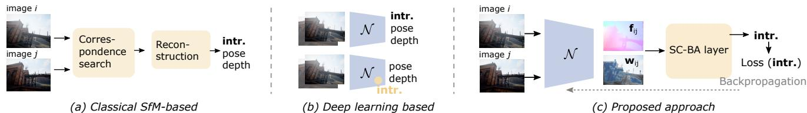  
Figure 2. Different approaches to intrinsic camera self-calibration from video, including classical SfM (e.g. COLMAP [33]), pure deep learning based approaches (e.g. [9, 8]), and the proposed model. For simplicity, only a single pair of images $( \mathbf { I } _ { i } , \mathbf { I } _ { j } )$ is shown, although the reconstruction in (a) and the SC-BA layer in (c) includes all image pairs of a given sequence.

## 3. Method

The self-calibration approach introduced in the following infers a camera’s intrinsics θ from monocular video, by exploiting the consistency of the scene structure over time. In the following, we first describe the general idea behind the approach and introduce its main component, the self-calibrating bundle adjustment (SC-BA) layer. In Sec. 3.3, a specific realization of the approach within DROID-SLAM [44] is described.

## 3.1. Projection

We write a camera’s mapping from 3D to 2D as a function π : $\mathbb { R } ^ { 3 } \to \mathbb { R } ^ { 2 } , { \bf x } \mapsto { \bf u } .$ . The mapping depends on the camera’s intrinsics θ and the choice of the camera model. The inverse projection is denoted by $\pi ^ { - 1 } : \mathbb { R } ^ { 2 } \times \mathbb { R } \to \mathbb { R } ^ { 3 }$ $( \mathbf { u } , z ) \mapsto \mathbf { x }$ and additionally depends on the depth z. In the following, we use two different camera models, the pinhole model and the unified camera model [26].

Pinhole model The pinhole model describes a distortion-free central projection that is characterized by the focal lengths $f _ { x } , f _ { y }$ and the principal point $( c _ { x } , c _ { y } )$

$$
\begin{array} { r } { \pi ( \mathbf { x } , \pmb { \theta } ) = \left[ \begin{array} { c c } { f _ { x } \frac { x } { z } + c _ { x } } \\ { f _ { y } \frac { y } { z } + c _ { y } } \end{array} \right] , \quad \pi ^ { - 1 } ( \mathbf { u } , z , \pmb { \theta } ) = z \left[ \begin{array} { c c } { \frac { p _ { x } - c _ { x } } { f _ { x } } } \\ { \frac { p _ { y } - c _ { y } } { f _ { y } } } \\ { 1 } \end{array} \right] . } \end{array}\tag{1}
$$

Unified camera model The unified camera model [26] introduces a parameter α which allows modeling cameras

from distortion free pinhole-like cameras to ultra-wide angle, fisheye, cameras. The projection is given by

$$
\begin{array} { r } { \pi ( \mathbf x , \theta ) = [ f _ { x } \frac { x } { z + \alpha \parallel \mathbf x \parallel } + c _ { x } ] , } \\ { f _ { y } \frac { y } { z + \alpha \parallel \mathbf x \parallel } + c _ { y } ] , } \end{array}\tag{2}
$$

where $| | \mathbf { x } | | = { \sqrt { x ^ { 2 } + y ^ { 2 } + z ^ { 2 } } }$ . Unlike polynomial radial distortion models, the unified camera model can be inverted analytically and both directions are differentiable.

Multi-view constraint Given two images i and $j$ taken by the same camera with intermediate motion ${ \bf G } _ { i j } \in  { \bf \Psi }$ $S E ( 3 )$ , the relation between a point $\mathbf { u } _ { i \ell }$ in image i and its corresponding point $\mathbf { u } _ { j \ell }$ in image j is given by

$$
\mathbf { u } _ { j \ell } = \pmb { \pi } \big ( \mathbf { G } _ { i j } \circ \pmb { \pi } ^ { - 1 } \big ( \mathbf { u } _ { i \ell } , z _ { i \ell } , \pmb { \theta } \big ) , \pmb { \theta } \big ) ,\tag{3}
$$

where $z _ { i \ell }$ denotes the depth of the 3D point $\mathbf { x } _ { \ell }$ w.r.t. camera pose i, and θ denotes the camera’s intrinsics.

## 3.2. Intrinsic self-calibration

Notation In the following, we denote a sequence of images by $\boldsymbol { \mathcal { T } } = \{ \mathbf { I } _ { i } \} _ { i = 1 } ^ { N }$ , with image height $H _ { 0 }$ and width $W _ { 0 } .$ We define the poses w.r.t. the first image as $\{ \mathbf { G } _ { i } \} _ { i = 1 } ^ { N }$ where $\mathbf { G } _ { i } \in S E ( 3 )$ . The relative pose between two images is given by $\mathbf { G } _ { i j } = \mathbf { G } _ { j } \circ \mathbf { G } _ { i } ^ { - 1 }$ . For each image $\mathbf { I } _ { i } ,$ , we denote the pixel-wise depth as $\mathbf { z } _ { i } ^ { \star } \in \mathbb { R } ^ { H _ { 0 } \times W _ { 0 } }$ . In the following, we further define the grid of all pixel coordinates in source view i by $\mathbf { u } _ { i } \in \mathbb { R } ^ { H _ { 0 } \times W _ { 0 } \times 2 }$ . The corresponding points in image $\mathbf { I } _ { j }$ are denoted by $\mathbf { u } _ { i j } \in \mathbb { R } ^ { H _ { 0 } \times W _ { 0 } \times \mathbf { \dot { 2 } } }$ where the index highlights the dependence on the source view i.

Model overview The input to the model is a set of image pairs $\mathcal { P } = \{ ( \mathbf { I } _ { i } , \mathbf { I } _ { j } ) | \mathbf { I } _ { i } , \mathbf { I } _ { j } \in \mathcal { I } \wedge \mathbf { I } _ { i } , \mathbf { I } _ { j }$ overlap} with overlapping field-of-view (Fig. 2). Assume that for all pixels $\mathbf { u } _ { i }$ in image Ii, a deep neural network $\mathcal { N }$ predicts the corresponding image points in image $\mathbf { I } _ { j }$ , which we will refer to as measured correspondences $\mathbf { u } _ { i j } ^ { * }$ . We here stick to an abstract description of ${ \mathcal { N } } ,$ , as the task can be achieved through different network architectures [31, 36, 43, 37, 44]. Assume that $\mathcal { N }$ further predicts confidence weights $\mathbf { w } _ { i j }$ associated with each correspondence which determine each correspondence’s influence on the subsequent estimation of intrinsics.

In the SC-BA layer, the weighted correspondences of all image pairs $\mathcal { P }$ are used to estimate the camera’s intrinsics through weighted nonlinear least squares optimization. Following classical dense bundle adjustment, we define the cost function in terms of the reprojection error,

$$
E ( G , \mathbf { z } , \pmb { \theta } ) = \sum _ { ( i , j ) \in \mathcal { P } } | | \underbrace { \mathbf { u } _ { i j } ^ { * } - \pi ( \mathbf { G } _ { i j } \circ \pi ^ { - 1 } ( \mathbf { u } _ { i } , \mathbf { z } _ { i } , \pmb { \theta } ) , \pmb { \theta } ) } _ { \mathbf { r } _ { i j } } | | _ { \mathbf { \Sigma } _ { i j } } ^ { 2 } ,\tag{4}
$$

i.e. the sum of weighted reprojection errors across all image pairs ${ \mathcal { P } } .$ . Here $\begin{array} { r } { \Sigma _ { i j } = \mathrm { d i a g } \mathbf { \bar { ( } } \mathbf { w } _ { i j } \mathbf { ) } ^ { - 1 } } \end{array}$ contains the confidence weights predicted by $\mathcal { N }$ and the vectors $\mathbf { G } = ( \mathbf { G } _ { 1 } , . . . \mathbf { G } _ { N } ) ^ { \mathsf { T } }$ and $\pmb { z } = ( \mathbf { z } _ { 1 } , . . . \mathbf { z } _ { N } ) ^ { \mathsf { T } }$ contain the pose and depth estimates of all images in $\mathcal { T } .$ The intrinsics $\pmb \theta$ are optimized jointly with poses G and depths z through minimization of (4):

$$
( \hat { \mathbf { G } } , \hat { \pmb { \theta } } , \hat { \mathbf { z } } ) = \underset { \mathbf { G } , \mathbf { z } , \pmb { \theta } } { \arg \operatorname* { m i n } } E ( \mathbf { G } , \mathbf { z } , \pmb { \theta } ) .\tag{5}
$$

To train $\mathcal { N }$ to predict correspondences and confidence weights that are specifically suited for the subsequent optimization (5), training is performed end-to-end, using a loss function $L ( { \hat { \theta } } )$ that quantifies the deviation of the estimated intrinsics $\hat { \pmb { \theta } }$ from the camera’s true intrinsics $\bar { \pmb { \theta } }$ (see Fig. 2). A specific training setup is discussed in Sec. 3.3.

Gauß Newton update including intrinsics To enable end-to-end training, optimization (5) is formulated in a differentiable and efficient manner. We use classical Gauß- Newton steps,

$$
\mathbf { J } ^ { \top } W \mathbf { J } \Delta \xi = \mathbf { J } ^ { \top } W \mathbf { r } ,\tag{6}
$$

where $\begin{array} { r } { \Delta \pmb { \xi } = ( \Delta \mathbf G , \Delta \pmb \theta , \Delta \mathbf z ) ^ { \top } } \end{array}$ denotes the parameter updates of poses, intrinsics and depth, r is a vector containing all optimization residuals from (4), J is the Jacobian of the residuals w.r.t. all parameters, and W is the diagonal weight matrix containing to confidence weights $\mathbf { w } _ { i j }$ of all image pairs. The Jacobian is derived analytically which has been demonstrated for poses and depth in [44]. For selfcalibration, one additionally needs the Jacobian w.r.t. the intrinsics which we derive in Suppl. Sec. A. The product $\mathbf { H } = \mathbf { J } ^ { \top } \mathbf { W } \mathbf { J }$ denotes the approximated Hessian which has to be inverted during optimization. We can exploit its sparse structure by dividing it into blocks, corresponding to the different types of parameters. Let $\tilde { \mathbf { r } } = \mathbf { J } ^ { \top } \mathbf { W } \mathbf { r }$ , then we can write the Gauß-Newton step as

$$
\begin{array} { r } { \left[ \begin{array} { c c c c } { \mathbf { H } _ { \mathbf { G } } } & { \mathbf { H } _ { \mathbf { G } , \theta } } & { \mathbf { H } _ { \mathbf { G } , \mathbf { z } } } \\ { \mathbf { H } _ { \mathbf { G } , \theta } { } ^ { \top } } & { \mathbf { H } _ { \theta } } & { \mathbf { H } _ { \theta , \mathbf { z } } } \\ { \mathbf { H } _ { \mathbf { G } , \mathbf { z } } { } ^ { \top } } & { \mathbf { H } _ { \theta , \mathbf { z } } { } ^ { \top } } & { \mathbf { H } _ { \mathbf { z } } } \end{array} \right] \left[ \begin{array} { c } { \Delta \mathbf { G } } \\ { \Delta \theta } \\ { \Delta \mathbf { z } } \end{array} \right] = \left[ \tilde { \mathbf { r } } _ { \mathbf { G } } \right] , } \end{array}\tag{7}
$$

where the indices indicate the parameters affected by the different blocks. Since the matrix $\mathbf { H _ { z } }$ has a pure diagonal form, we combine pose parameters and intrinsics to form a joint block which enables a solution via the Schur complement. Let $\Delta \xi _ { \mathrm { G } , \theta } = ( \Delta \mathbf { G } , \pmb { \Delta \theta } ) ^ { \mathsf { T } }$ , and $\widetilde { \mathbf { r } } _ { \mathbf { G } , \theta } = ( \widetilde { \mathbf { r } } _ { \mathbf { G } } , \widetilde { \mathbf { r } } _ { \theta } ) ^ { \mathsf { T } }$ then the Gauß-Newton update can be written as

$$
\begin{array} { r } { \left[ \begin{array} { c c } { \mathbf { A } } & { \mathbf { B } } \\ { \mathbf { B } ^ { \top } } & { \mathbf { H } _ { \mathbf { z } } } \end{array} \right] \left[ \begin{array} { c } { \Delta \xi _ { G , \theta } } \\ { \Delta \mathbf { z } } \end{array} \right] = \left[ \begin{array} { c } { { \tilde { \mathbf { r } } } _ { \mathbf { G } , \theta } } \\ { { \tilde { \mathbf { r } } } _ { \mathbf { z } } } \end{array} \right] . } \end{array}\tag{8}
$$

To improve robustness and convergence, the Hessian is superimposed with a diagonal matrix containing a damping term λ (Levenberg Marquardt augmentation). As the classical heuristics for choosing λ are non-differentiable, it must be pre-defined, learned or predicted by the network $\mathcal { N }$ as an additional output [39]. Finally, the parameter updates can be computed via the Schur complement

$$
\Delta \xi _ { G , \theta } = [ { \bf A } - { \bf B } { \bf H } _ { \mathbf { z } } ^ { - 1 } { \bf B } ^ { \top } ] ^ { - 1 } ( \tilde { \bf r } _ { \mathbf { G } , \theta } - { \bf B } { \bf H } _ { \mathbf { z } } ^ { - 1 } \tilde { \bf r } _ { \mathbf { z } } ) ,\tag{9}
$$

$$
\boldsymbol { \Delta } \mathbf { z } = \mathbf { H _ { z } } ^ { - 1 } ( \tilde { \mathbf { r } } _ { \mathbf { z } } - \mathbf { B } ^ { \top } \boldsymbol { \Delta } \boldsymbol { \xi } _ { G , \theta } ) .\tag{10}
$$

For the optimization to be differentiable, a fixed number of Gauß Netwon steps is performed, rather than using typical convergence criteria [39].

Implementation details To reduce runtime and memory consumption, we store the Jacobian as well as the Hessian blocks in a sparse format, and implement the SC-BA layer as a custom cuda-kernel, as proposed in [44]. Note that unlike pose and depth parameters, whose influence is limited to subgroups of images, the intrinsics influence all images (Fig. 3, right) so that the associated Jacobian and Hessian blocks are dense.

## 3.3. Implementation within DROID-SLAM

We implement the SC-BA layer within the deep visual SLAM system DROID-SLAM [44]. The architecture of DROID-SLAM is designed to predict flow revisions and confidence weights in a recurrent manner, and it contains a dense bundle adjustment (DBA) layer to optimize poses and depth. By replacing the DBA layer with the SC-BA layer, we obtain a deep visual SLAM system that infers camera intrinsics from monocular videos in the wild (Fig. 3). In the following, we briefly describe the architecture for a single pair of images $( i , j )$ with overlapping field of view. We only provide a short overview over the SLAM system and refer to [44] for details, as the construction of the frame graph, and all associated hyperparameters stay untouched.

Feature extraction The input to the model is a pair of images $( \mathbf { I } _ { i } , \mathbf { I } _ { j } )$ . For both images, feature extraction (A) is performed by a convolutional neural network (CNN), giving feature maps whose height H and width W are reduced by a factor of 1/8 compared to the original image. Furthermore, image Ii is passed through a context network, a second module of convolutional layers (C).

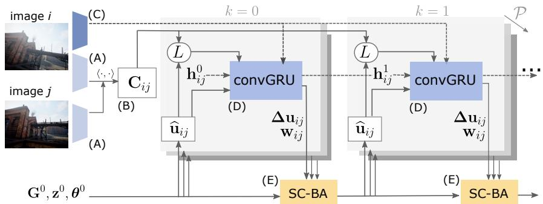

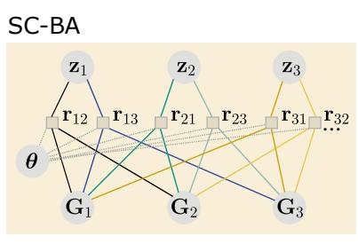  
Figure 3. Illustration of the self-calibrating bundle adjustment (SC-BA) layer integrated into DROID-SLAM [44]. Two unrolled update iterations are shown. For each image pair $( \mathbf { I } _ { i } , \mathbf { I } _ { j } ) \in \mathcal { P }$ , the model predicts flow revisions $\Delta \mathbf { u } _ { i j }$ and confidence weights $\mathbf { w } _ { i j }$ in each iteration k. In the SC-BA layer, these predictions are used to update camera intrinsics θ together with poses G and depth z. The close-up of the SC-BA layer (right), shows a factor graph representation of the underlying optimization problem. The factors $\mathbf { r } _ { i j }$ represent the error terms associated with pair $( \mathbf { I } _ { i } , \mathbf { I } _ { j } )$ , while the nodes represent the parameters that are being estimated.

Correlation computation (B) The subsequent correlation layer constructs a four-dimensional correlation volume $\mathbf { C } _ { i j } \in \mathbb { R } ^ { H \times W \times H \times W }$ which contains the inner product $\langle \cdot , \cdot \rangle$ of all pairs of feature vectors. The rationale behind this layer is that high correlations indicate similar and thus potentially corresponding image regions. To reduce memory consumption, the volume is not fully computed in advance, but the individual entries are computed on demand using the lookup operator L (see [44] for details).

Iterative updates Based on the outputs of the context module (C), the correlations (B), and an initial guess for poses $G ^ { 0 }$ , depth $z ^ { 0 }$ and intrinsics $\pmb { \theta } ^ { 0 }$ , the model iteratively updates all parameters by performing two steps in every iteration k: (D) Prediction of flow revisions and (E) Self-calibrating bundle adjustment (Fig. 3).

Prediction of flow revisions (D) First, the predicted correspondences $\widehat { \mathbf { u } } _ { i j }$ are obtained by transforming all pixels u to image $\mathbf { I } _ { j }$ using Eq. (3) with the current estimates of pose $\widehat { G } ^ { k }$ , depth ${ \widehat { z } } ^ { k }$ and intrinsics $\widehat { \pmb { \theta } } ^ { k }$ . Based on $\widehat { \mathbf { u } } _ { i j } .$ the correlation volume is indexed, and the correlation of feature maps in the neighbourhood of $\widehat { \mathbf { u } } _ { i j }$ is passed to the convolutional gated recurrent unit (convGRU). Furthermore, context features and the current flow estimate $\widehat { \mathbf { f } } _ { i j } \ = \ \widehat { \mathbf { u } } _ { i j } \ - \mathbf { u } _ { i }$ are injected into the convGRU. Based on this information, the convGRU computes an updated hidden state $\mathbf { h } _ { i j } ^ { k + 1 }$ which is passed through two additional convolutional layers to predict a dense flow revision $\begin{array} { r c l } { \Delta \mathbf { u } _ { i j } } & { \in } & { \mathbb { R } ^ { H \times \bar { W } \times 2 } } \end{array}$ and associated confidence weights $\mathbf { w } _ { i j } \in \mathbb { R } ^ { H \times W \times 2 } ( \mathrm { F i g . ~ } 4 )$ Furthermore, a pixel-wise damping factor $\lambda \in \mathbb { R } ^ { H \times W }$ is predicted by pooling the hidden state over all pairs with same source image.

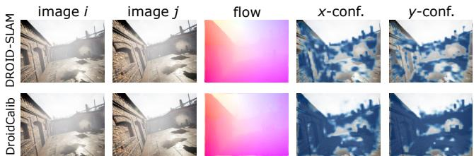  
Figure 4. Exemplary estimated flow $\mathbf { f } _ { i j }$ and confidence weights $\mathbf { w } _ { i j }$ in x- and y-direction (blue overlay) in the last update iteration $k .$ Compared to DROID-SLAM (top), DroidCalib (bottom) predicts higher, less spatially confined confidence weights.

Self-calibrating bundle adjustment layer (E) For each image pair $( \mathbf { I } _ { i } , \mathbf { I } _ { j } )$ , the flow revision $\Delta \mathbf { u } _ { i j }$ is used to compute measured correspondences $\mathbf { u } _ { i j } ^ { * } \ = \ \widehat { \mathbf { u } } _ { i j } + \Delta \mathbf { u } _ { i j }$ between the images, where $\widehat { \mathbf { u } } _ { i j }$ is computed via Eq. (3). Following Sec. 3.2, these correspondences, together with the confidence weights $\mathbf { w } _ { i j }$ , are plugged into the cost function (4). The updated parameters $\widehat { \pmb { \theta } } ^ { k + 1 } , \widehat { G } ^ { k + 1 } , \widehat { z } ^ { k + 1 }$ are obtained by minimizing the cost with n = 2 Gauß-Newton steps in every iteration k, as shown in (9).

Training The model is trained end-to-end, in a supervised manner, on the synthetic dataset TartanAir [49]. Following [44], short sequences of seven images are passed through the model during training, and we perform $n _ { k } ~ = ~ 1 4$ update iterations for every sequence. DROID-SLAM uses a combination of flow loss, pose loss and residual loss. To train for self-calibration, we additionally add an intrinsics loss, $\begin{array} { r l r } { L _ { \pmb \theta } } & { { } = } & { \sum _ { k = 1 } ^ { n _ { k } } \gamma ^ { n _ { k } - k } \| \hat { \pmb \theta } ^ { k } - \bar { \pmb \theta } \| _ { 1 } } \end{array}$ where θ¯ are the ground-truth intrinsics, $\lVert \cdot \rVert _ { 1 }$ is the L1-norm and $\gamma = 0 . 9$ introduces a weighting that increases with $k .$ Furthermore, we replace the ground-truth intrinsics θ¯ in the flow loss with the current estimate $\hat { \pmb { \theta } } ^ { k }$ . During training, we expose the model to calibration errors by adding uniformly distributed random errors $\delta \in [ - 5 \% , 5 \% ]$ to the initial intrinsics. We train for 250000 iterations with a learning rate of $2 . 5 \times 1 0 ^ { - 4 }$ . The effect of different training setups is evaluated in Suppl. Sec. C.

<table><tr><td>Dataset</td><td>Method</td><td colspan="2">ME (pixel)</td><td>Runtime</td><td>Memory</td><td>Failures</td></tr><tr><td rowspan="4">TartanAir</td><td>COLMAP+NetVLAD</td><td>1.45</td><td>[0.11, 1349.4]</td><td>7 min</td><td>1 GB</td><td>1/ 16</td></tr><tr><td>COLMAP+NetVLAD+Superpoint+Superglue</td><td>0.45</td><td>[0.19, 10.8]</td><td>20 min</td><td>2 GB</td><td>0 / 16</td></tr><tr><td>SelfSup-Calib**</td><td>18.3 0.23</td><td>[5.00 , 60.1]</td><td>28 min</td><td>11 GB</td><td>0 / 16</td></tr><tr><td>DroidCalib</td><td></td><td>[0.08, 0.79]</td><td>7 min</td><td>11 GB</td><td>0 / 16</td></tr><tr><td rowspan="4">EuRoC</td><td>COLMAP+NetVLAD</td><td>1.77</td><td>[0.38, 21.2]</td><td>14 min</td><td>1 GB</td><td>0 / 11</td></tr><tr><td>COLMAP+NetVLAD+Superpoint+Superglue</td><td>0.71</td><td>[0.42, 4.11]</td><td>41 min</td><td>2 GB</td><td>0 / 11</td></tr><tr><td>SelfSup-Calib**</td><td>27.6</td><td>[14.0 , 56.1]</td><td>52 min</td><td>11 GB</td><td>0 / 11</td></tr><tr><td>DroidCalib</td><td>0.42</td><td>[0.16,0.74]</td><td>13 min</td><td>12 GB</td><td>0/ 11</td></tr><tr><td rowspan="4">TUM</td><td>COLMAP+NetVLAD</td><td>6.54</td><td>[2.53, 52.1]</td><td>4 min</td><td>1 GB</td><td>0/9</td></tr><tr><td>COLMAP+NetVLAD+Superpoint+Superglue</td><td>4.10</td><td>[1.66, 8.09]</td><td>13 min</td><td>2 GB</td><td>2/9</td></tr><tr><td>SelfSup-Calib**</td><td>29.7</td><td>[17.6, 44.5]</td><td>25 min</td><td>11 GB</td><td>0/9</td></tr><tr><td>DroidCalib</td><td>3.09</td><td>[1.50, 6.93]</td><td>5 min</td><td>4 GB</td><td>0/9</td></tr><tr><td rowspan="4">EuRoC raw</td><td>COLMAP+NetVLAD*</td><td>3.66</td><td>[2.03, 31.1]</td><td>21 min</td><td>1 GB</td><td>1/11</td></tr><tr><td>COLMAP+NetVLAD+Superpoint+Superglue*</td><td>3.48</td><td>[0.66, 6.14]</td><td>1 h 2 min</td><td>2 GB</td><td>0 / 11</td></tr><tr><td>SelfSup-Calib**</td><td>10.8</td><td>[1.63 , 47.9]</td><td>53 min</td><td>11 GB</td><td>0 / 11</td></tr><tr><td>DroidCalib**</td><td>0.40</td><td>[0.31, 0.80]</td><td>14 min</td><td>12 GB</td><td>0 / 11</td></tr></table>

Table 1. Comparison with self-calibration baselines on full sequences. Results show median [min, max] of the mapping error (ME) over all sequences within the respective dataset. We further report the median runtime, the median peak GPU memory consumption and the number of failed (non-converged) runs. For the raw EuRoC sequences which contain radial distortion, we use the opencv camera model with two radial distortion parameters (\*) or the unified camera model (\*\*). Separate results for all sequences can be found in Suppl. Tab. S5.

SLAM system During inference, the model operates on an incoming image stream and dynamically builds a frame graph to connect images with overlapping field of view [44]. In the frontend, keyframes are added and removed incrementally and local bundle adjustments are performed. In the backend, a global bundle adjustment over the full history of keyframes is performed. The backend is employed as the final step of the estimation, after all images have been registered by the frontend. For further details on the SLAM system, we refer to [44], as all associated hyperparameters stay untouched by our extension.

Runtime and memory For training, we used two Nvidia Titan RTX 24 GB GPUs, where training takes ∼12 days. For inference, we used a single Nvidia Titan RTX 24 GB GPU, and runtime and memory consumption depend on the length of the sequence and the image size (see Suppl. Sec. D). Tab. 1 contains median memory and runtime for the full sequences. The frontend of DroidCalib runs at 4 fps on TartanAir with an image size of 512 × 384. For comparison, the plain DROID-SLAM runs at 10 fps on the same data. The difference arises from the additional dense matrix blocks required for estimating the intrinsics (Sec. 3.2).

## 4. Experiments

Datasets We evaluate on the TartanAir [49] monocular test split from the CVPR 2020 SLAM challenge, the EuRoC dataset [3], and the Freiburg-1 sequences from the TUM-RGBD dataset [34]. We only use monocular sequences. As proposed in [44] we employ DroidCalib and DROID-

SLAM on reduced image sizes (512 × 384 for TartanAir, 512 × 320 for EuRoC, $3 2 0 \times 2 4 0$ for TUM), use rectified images (unless stating ”raw images”), and skip every other frame in the EuRoC and the TUM sequences. After inference, intrinsics are rescaled to the original image size.

Baselines As baselines for self-calibration (Tab. 1) we use COLMAP [33] and COLMAP in combination with Superpoint [7] and Superglue [31], using the hloc toolbox [30, 31] as an interface. COLMAP is a Structure-from-Motion pipeline and allows estimating camera intrinsics from a set of images. In the default setup, features are extracted using SIFT [23], followed by nearest neighbor feature matching. COLMAP+Superpoint+Superglue replaces the classical keypoint extraction with the deep learning approach Superpoint [7] and the nearest neighbor matching with Superglue [31]. As exhaustive matching takes up to several days per sequence, we instead use NetVLAD [1] to select images for matching. NetVLAD computes image descriptors that allow to pair an image only with the most similar other images. Following the SfM pipeline from hloc [30], we pair each image with their top five images with most similar NetVLAD image descriptors. We also tried sequential matching with a window of five images, but results were inferior (Suppl. Sec. E). We further compare with the self-supervised learning approach by Fang et al. [8] which we will refer to as SelfSup-Calib. We used the author’s implementation and the unified camera model. The work originally proposed to train jointly on all EuRoC sequences. To obtain per-sequence results, we trained on the individual sequences but left all other hyperparameters untouched (see also Suppl. Sec. E for details). As baseline for motion estimation, we use the original DROID-SLAM, using the author’s open source implementation [44].

Metrics To assess the accuracy of the calibration, we use the mapping error (ME) which quantifies the difference between two sets of intrinsic parameters in image space [12]. Specifically, we compare the estimated intrinsics against the ground-truth or reference intrinsics of the respective dataset, and use the square root of the effective mapping error [12] to obtain values in units of pixels. We always evaluate the mapping error on the original image resolution, even if estimation was performed on a reduced image dimension. To assess the accuracy of trajectory estimates, we use the translation part of the average trajectory error (ATE). We used the evo toolbox [10] and chose the root mean squared error. In the following experiments, we either use naive initial values $\pmb { \theta } _ { 0 }$ for the intrinsics, computed from the image dimension as $\begin{array} { r } { f _ { x } ^ { 0 } \ = \ \frac { H _ { 0 } + W _ { 0 } } { 2 } , \ f _ { y } ^ { 0 } \ = \ \frac { \ b { H } _ { 0 } + W _ { 0 } } { 2 } , \ c _ { x } ^ { 0 } \ = \ \frac { W _ { 0 } } { 2 } } \end{array}$ $\begin{array} { r } { c _ { y } ^ { 0 } \ = \ \frac { H _ { 0 } } { 2 } } \end{array}$ , or we impose uniformly distributed random errors $\bar { \delta \in \left[ - \Delta _ { \theta } , \Delta _ { \theta } \right] }$ on the initial intrinsics, where the error bounds $\Delta _ { \theta }$ are specified relative to the respective parameter, ranging from 0% to 25%.

original image  
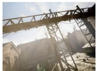  
θ0=(320, 320, 320, 240, 0)

(a) diff. pinhole intrinsics  
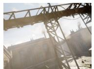

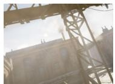  
θ1=(420, 420, 320, 240, 0) θ2=(520, 520, 370, 190, 0)

(b) distortion  
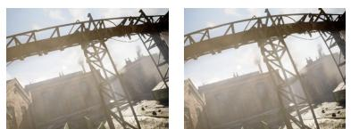  
θ =(580, 580, 320, 240, 0.5) θ =(1090, 1090, 320, 240, 1.5)

(c)  
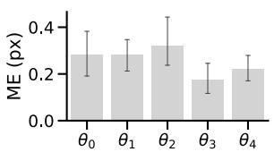  
Figure 5. Evaluation for warped images with different intrinsics $\pmb { \theta } = ( f _ { x } , f _ { y } , c _ { x } , c _ { y } , \alpha )$ , including distortion. An exemplary image along with the associated warped images are shown. We report calibration accuracy in terms of the mapping error (ME) in pixels. Barplot show average mapping error and 95% confidence intervals across all TartanAir test sequences.

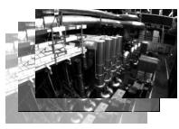

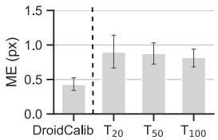

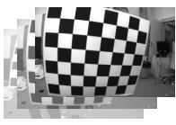

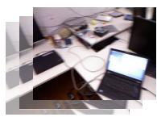

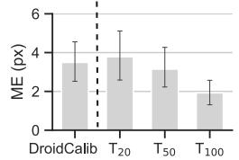

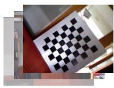  
Figure 6. Comparison with target-based calibration on EuRoC (top) and TUM (bottom) datasets. $T _ { 2 0 } , T _ { 5 0 } , T _ { 1 0 0 }$ denote targetbased calibrations with different numbers of calibration images. Plots show average mapping error (ME) and 95% confidence intervals across 20 random samples of calibration images.

## 4.1. Accuracy of estimated intrinsics

We evaluate the self-calibration accuracy across all datasets, using naive initial values $\theta _ { 0 }$ for all intrinsic parameters (Tab. 2). For both, TartanAir and EuRoC, estimated intrinsics are close to their respective ground truth values provided by the authors of the datasets, with a median mapping error below 0.5 pixels. On the TUM dataset, calibration results are less accurate with a median mapping error of 3.09 pixels. To relate these values to classical target-based calibration, we used the calibration images from the Eu-RoC und the TUM dataset and performed classical targetbased calibrations on different subsets of the undistorted images (Fig. 6, for details on the target-based calibration, see Suppl. Sec. E). The median mapping error w.r.t. the reference calibration for common dataset sizes (20 to 100 calibration images) is on the same order of magnitude as the values obtained with DroidCalib (Fig. 6). This shows that the self-calibration can reach an accuracy on the same order of magnitude as existing target-based calibrations.

<table><tr><td></td><td> $\mathbf { f _ { x } }$ </td><td> $\mathbf { f _ { y } }$ </td><td> $\mathbf { c _ { x } }$ </td><td> $\mathbf { c _ { y } }$ </td><td>ME (pixel)</td></tr><tr><td>TartanAir</td><td></td><td></td><td></td><td></td><td></td></tr><tr><td>Reference</td><td>320.0</td><td>320.0</td><td>320.0</td><td>240.0</td><td></td></tr><tr><td>MH000</td><td>320.2</td><td>320.2</td><td>320.3</td><td>240.0</td><td>0.09</td></tr><tr><td>MH001</td><td>318.7</td><td>318.4</td><td>320.4</td><td>240.4</td><td>0.67</td></tr><tr><td>MH002</td><td>320.2</td><td>320.1</td><td>320.2</td><td>240.2</td><td>0.11</td></tr><tr><td>MH003</td><td>320.3</td><td>320.8</td><td>319.8</td><td>240.1</td><td>0.26</td></tr><tr><td>MH004</td><td>320.5</td><td>320.4</td><td>320.2</td><td>239.4</td><td>0.23</td></tr><tr><td>MH005</td><td>320.0</td><td>320.0</td><td>320.4</td><td>240.2</td><td>0.08</td></tr><tr><td>MH006</td><td>320.1</td><td>320.0</td><td>320.4</td><td>240.7</td><td>0.13</td></tr><tr><td>MH007</td><td>320.4</td><td>320.2</td><td>320.2</td><td>240.1</td><td>0.17</td></tr><tr><td></td><td></td><td></td><td></td><td>|</td><td>Median 0.23</td></tr><tr><td>EuRoC</td><td>458.7</td><td>457.3</td><td>367.2</td><td>248.4</td><td></td></tr><tr><td>Reference</td><td></td><td></td><td></td><td></td><td></td></tr><tr><td>MH.01</td><td>457.9</td><td>457.9</td><td>368.0</td><td>249.1</td><td>0.28 0.25</td></tr><tr><td>MH_02</td><td>457.9</td><td>457.1</td><td>367.8</td><td>248.5</td><td>0.34</td></tr><tr><td>MH_03</td><td>457.9</td><td>458.2 457.2</td><td>368.0 367.7</td><td>250.2 249.1</td><td>0.38</td></tr><tr><td>MH_04</td><td>457.4</td><td>457.8</td><td>367.9</td><td>248.6</td><td>0.16</td></tr><tr><td>MHL05</td><td>458.3 459.1</td><td>459.0</td><td>368.2</td><td>250.0</td><td>0.42</td></tr><tr><td>V1.01 V1_02</td><td></td><td>459.4</td><td>367.9</td><td>249.7</td><td>0.49</td></tr><tr><td></td><td>459.4</td><td></td><td></td><td></td><td>0.55</td></tr><tr><td>V1_03</td><td>459.6</td><td>459.5</td><td>368.3</td><td>249.4</td><td>0.52</td></tr><tr><td>V2_01</td><td>459.2</td><td>459.7</td><td>368.2</td><td>249.7</td><td></td></tr><tr><td>V2_02 V2_03</td><td>459.5</td><td>459.8 460.1</td><td>367.8 368.2</td><td>249.9 249.5</td><td>0.58 0.74</td></tr><tr><td></td><td>460.2</td><td></td><td></td><td></td><td></td></tr><tr><td>TUM</td><td></td><td></td><td></td><td>一</td><td>Median 0.42</td></tr><tr><td>Reference</td><td>517.3</td><td>516.5</td><td>318.6</td><td>255.3</td><td></td></tr><tr><td>360</td><td>530.2</td><td>529.4</td><td>320.4</td><td>261.1</td><td>3.71</td></tr><tr><td>desk</td><td>531.7</td><td>527.5</td><td>321.0</td><td>248.4</td><td>3.70</td></tr><tr><td>desk2</td><td>525.6</td><td>553.6</td><td>317.4</td><td>284.0</td><td>6.93</td></tr><tr><td>floor</td><td>530.5</td><td>518.4</td><td>323.0</td><td>240.2</td><td>3.09</td></tr><tr><td>room</td><td>523.2</td><td>526.1</td><td>320.9</td><td>261.8</td><td>2.22</td></tr><tr><td>xyz</td><td>523.4</td><td>504.0</td><td>325.3</td><td>281.2</td><td>3.03</td></tr><tr><td>rpy</td><td>531.2</td><td>532.7</td><td>323.7</td><td>276.2</td><td>4.66</td></tr><tr><td>plant</td><td>525.4</td><td>527.3</td><td>319.5</td><td>254.3</td><td>2.58</td></tr><tr><td>teddy</td><td>523.1</td><td>519.6</td><td>324.1</td><td>249.3</td><td>1.50</td></tr><tr><td></td><td></td><td></td><td></td><td></td><td></td></tr></table>

Table 2. Accuracy of intrinsics estimated by DroidCalib. Values show focal lengths $f _ { x } , f _ { y }$ and principal point $c _ { x } , c _ { y } ,$ and the mapping error ME. Due to spatial constraints, we only list the ”hard” sequences from TartanAir; for all sequences, see Suppl. Tab. S4.

TartanAir
<table><tr><td></td><td>MH_01</td><td>MH_02</td><td>MH_03</td><td>MH_04</td><td>MH_05</td><td>V1_01</td><td>V1_02</td><td>V1_03</td><td>V2_01</td><td>V2_02</td><td>V2_03</td><td>Median</td></tr><tr><td>DROID-SLAM</td><td>0.011</td><td>0.018</td><td>0.022</td><td>0.043</td><td>0.040</td><td>0.036</td><td>0.012</td><td>0.024</td><td>0.016</td><td>0.009</td><td>0.013</td><td>0.018</td></tr><tr><td>DroidCalib</td><td>0.008</td><td>0.010</td><td>0.020</td><td>0.040</td><td>0.037</td><td>0.035</td><td>0.010</td><td>0.083</td><td>0.014</td><td>0.010</td><td>0.010</td><td>0.014</td></tr></table>

Table 3. Generalization to the unified camera model. Using the raw images and unknown intrinsics, DroidCalib achieves similar accuracy as DROID-SLAM using rectified images and reference intrinsics, without need for re-training or finetuning. Values show average trajectory error (ATE) in meters.

Finally, as the test sequences of TartanAir have the same intrinsics as the training data, we performed an additional experiment to ensure that the results on TartanAir don’t reflect an overfitting. Through resizing and cropping, we synthetically generated TartanAir images with different intrinsics (Fig. 5 (a)). Consistent with the results on EuRoC and TUM, the intrinsics can be recovered with high accuracy even if they deviate significantly from the training intrinsics (Fig. 5 (c)). This suggests that the model does not overfit to the intrinsics of the training data.

## 4.2. Comparison with self-calibration baselines

We compare different approaches to intrinsic selfcalibration from video, in terms of calibration accuracy, runtime, memory consumption1 and number of failures to converge (Tab. 1). We assess all methods on a single Nvidia Titan RTX 24 GB GPU, using one run per sequence, and using naive initial values for all intrinsics. On all four datasets, the calibration accuracy of DroidCalib is highest among the different methods. Compared to the respective secondbest approaches, the median mapping error of DroidCalib is reduced by 49% on TartanAir, 41% on EuRoC, 25% on TUM, and 89% on EuRoC raw. Furthermore, the computation time of DroidCalib is among the fastest of the baselines, however, requiring more memory, especially compared to the COLMAP-based approaches. We also note that the results from SelfSup-Calib are less accurate than the other baseline methods. One explanation is that our comparison is based on single sequences, rather than a batch of sequences as proposed by the authors (see Suppl. Sec. E).

## 4.3. Trajectory estimation with unknown intrinsics

The self-calibrating bundle adjustment layer allows using the deep visual SLAM system DROID-SLAM with unknown intrinsics. We therefore assess the accuracy of estimated trajectories for different error bounds $\Delta _ { \theta }$ in the initial intrinsics (Fig. 7, Suppl. Tab. S3). When using the ground truth intrinsics $( \Delta _ { \theta } = 0 . 0 )$ , DroidCalib and DROID-SLAM yield similar accuracy, which is the intended result. For an increasing error in the intrinsics, the ATE of DROID-SLAM increases, while DroidCalib remains low (Fig. 7). This demonstrates that the SC-BA layer enables accurate trajectory estimation despite erroneous or unknown intrinsics. In Suppl. Sec. B, we further show qualitative results obtained on YouTube videos with unknown intrinsics.

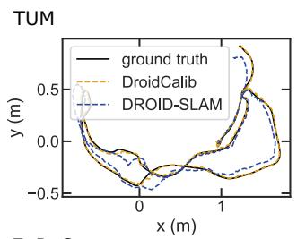

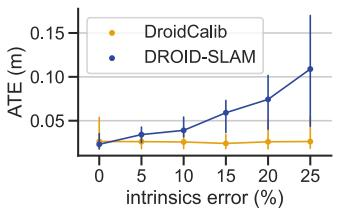

EuRoC  
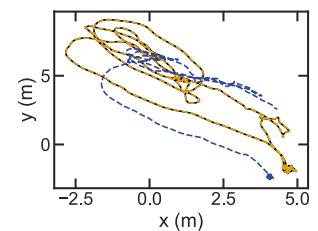

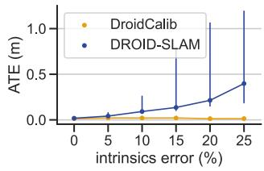

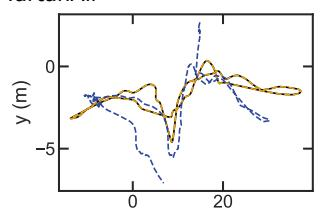  
× (m)

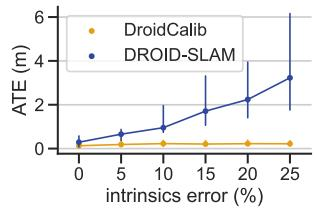  
Figure 7. Trajectory estimation with unknown cameras. Left: Exemplary trajectory estimates with $\Delta _ { \theta } ~ = ~ 2 5 \%$ initial error in the intrinsics (sequences desk, $M H _ { - } O I , M H O O 2 )$ . Without selfcalibration, this intrinsics error results in significant inaccuracy in the estimated trajectories (see DROID-SLAM result). Right: Average trajectory error (ATE) for an increasing error $\Delta _ { \theta }$ . Values show median and 95% bootstrap confidence intervals across all sequences in the respective dataset, using three runs per sequence.

## 4.4. Generalization to the unified camera model

For the approach to be applicable to a wide range of cameras, we extended it from a plain pinhole model to the unified camera model [26]. The projection function and the Jacobian in the self-calibrating bundle adjustment layer are adjusted accordingly, while we keep the learned weights of the model without any finetuning.

First, we test the model on TartanAir sequences, synthetically warped to exhibit different levels of distortion (Fig. 5 (b)). We use naive initial intrinsics $\pmb { \theta } _ { 0 }$ and zero initial distortion $\alpha _ { 0 } = 0 .$ . Fig. 5 (c) shows that the calibration accuracy on distorted images is as high as on the original, distortion-free images, showing the model’s ability to generalize. Then, we further test the model on the raw Eu-RoC sequences which contain significant radial distortion (see Tab. 3). Specifically, we compare the trajectory estimates of DroidCalib using the raw images against DROID-SLAM using rectified images and reference intrinsics. Both approaches yield similar accuracy (Tab. 3), demonstrating that DroidCalib can be employed to significantly different lenses without re-training or finetuning.

## 4.5. Limitations

On the TUM dataset we find that the intrinsics cannot be recovered as accurately as for the other datasets (Tab. 2). These sequences were taken with a hand-held rollingshutter camera and exhibit significant motion blur. Although the accuracy of DroidCalib remains superior to the baselines (Tab. 1), such challenging sequences reveal limitations. Another limitation are critical types of motion from which camera intrinsics are not observable [35]. These critical types of motion affect any monocular self-calibration algorithm that is based on multi-view constraints, and include orbital motion, pure translation and planar motion [35]. Therefore, methods that build purely on the consistency of the scene structure over time and do not impose prior knowledge on the camera or the scene require diverse, unconstrained camera motion.

## 5. Conclusion

We proposed a novel approach to intrinsic camera self-calibration that leverages the capabilities of deep learning while explicitly modeling projection functions and multi-view geometry. Experiments show that it enables recovering camera intrinsics from monocular video with high accuracy, setting a new state-of-the-art for intrinsic self-calibration on three public datasets. Unlike pure deep learning approaches to camera calibration, it does not require a training dataset consisting of a large variety of cameras, but directly generalizes to different cameras and projection functions. Thereby, camera self-calibration can particularly benefit from combining deep learning with explicit modeling of projections and multi-view geometry. Future work may extend the self-calibration with uncertainty estimation, in order to detect challenging sequences and critical motion. Furthermore, using a sparse rather than a dense system would be an interesting direction, as it could significantly reduce memory consumption. Overall, the approach is a step towards accurate calibration without targets, enabling 3D perception without any knowledge about the camera.

Acknowledgements We thank our colleagues Christian Homeyer, Jan Fabian Schmidt, Charlotte Arndt and Andre´ Wagner for valuable discussions and feedback.

## References

[1] Relja Arandjelovic, Petr Gronat, Akihiko Torii, Tomas Pajdla, and Josef Sivic. Netvlad: Cnn architecture for weakly supervised place recognition. In Proceedings of the IEEE conference on computer vision and pattern recognition, pages 5297–5307, 2016. 6

[2] Oleksandr Bogdan, Viktor Eckstein, Francois Rameau, and Jean-Charles Bazin. Deepcalib: A deep learning approach for automatic intrinsic calibration of wide field-of-view cameras. In Proceedings of the 15th ACM SIGGRAPH European Conference on Visual Media Production, pages 1–10, 2018. 2

[3] Michael Burri, Janosch Nikolic, Pascal Gohl, Thomas Schneider, Joern Rehder, Sammy Omari, Markus W Achtelik, and Roland Siegwart. The euroc micro aerial vehicle datasets. The International Journal of Robotics Research, 35(10):1157–1163, 2016. 6

[4] Carlos Campos, Richard Elvira, Juan J Gomez Rodr ´ ´ıguez, Jose MM Montiel, and Juan D Tard´ os. Orb-slam3: An accu-´ rate open-source library for visual, visual–inertial, and multimap slam. IEEE Transactions on Robotics, 37(6):1874– 1890, 2021. 2

[5] Yuhua Chen, Cordelia Schmid, and Cristian Sminchisescu. Self-supervised learning with geometric constraints in monocular video: Connecting flow, depth, and camera. In Proceedings of the IEEE/CVF International Conference on Computer Vision, pages 7063–7072, 2019. 2

[6] Javier Civera, Diana R Bueno, Andrew J Davison, and JMM Montiel. Camera self-calibration for sequential bayesian structure from motion. In 2009 IEEE International Conference on Robotics and Automation, pages 403–408. IEEE, 2009. 2

[7] Daniel DeTone, Tomasz Malisiewicz, and Andrew Rabinovich. Superpoint: Self-supervised interest point detection and description. In Proceedings of the IEEE conference on computer vision and pattern recognition workshops, pages 224–236, 2018. 2, 6

[8] Jiading Fang, Igor Vasiljevic, Vitor Guizilini, Rares Ambrus, Greg Shakhnarovich, Adrien Gaidon, and Matthew R Walter. Self-supervised camera self-calibration from video. In 2022 International Conference on Robotics and Automation (ICRA), pages 8468–8475. IEEE, 2022. 2, 3, 6

[9] Ariel Gordon, Hanhan Li, Rico Jonschkowski, and Anelia Angelova. Depth from videos in the wild: Unsupervised monocular depth learning from unknown cameras. In Proceedings of the IEEE/CVF International Conference on Computer Vision, pages 8977–8986, 2019. 2, 3

[10] Michael Grupp. evo: Python package for the evaluation of odometry and slam. https://github.com/ MichaelGrupp/evo, 2017. 7

[11] Xiaodong Gu, Weihao Yuan, Zuozhuo Dai, Chengzhou Tang, Siyu Zhu, and Ping Tan. Dro: Deep recurrent optimizer for structure-from-motion. arXiv preprint arXiv:2103.13201, 2021. 2, 3

[12] Annika Hagemann, Moritz Knorr, Holger Janssen, and Christoph Stiller. Inferring bias and uncertainty in camera calibration. International Journal of Computer Vision, 130(1):17–32, 2022. 7

[13] Richard I Hartley. Self-calibration from multiple views with a rotating camera. In European Conference on Computer Vision, pages 471–478. Springer, 1994. 2

[14] Elsayed E Hemayed. A survey of camera self-calibration. In Proceedings of the IEEE Conference on Advanced Video and Signal Based Surveillance, 2003., pages 351–357. IEEE, 2003. 1, 2

[15] Lionel Heng, Gim Hee Lee, and Marc Pollefeys. Selfcalibration and visual slam with a multi-camera system on a micro aerial vehicle. Autonomous robots, 39:259–277, 2015. 2

[16] Lionel Heng, Bo Li, and Marc Pollefeys. Camodocal: Automatic intrinsic and extrinsic calibration of a rig with multiple generic cameras and odometry. In 2013 IEEE/RSJ International Conference on Intelligent Robots and Systems, pages 1793–1800. IEEE, 2013. 2

[17] Yoonwoo Jeong, Seokjun Ahn, Christopher Choy, Anima Anandkumar, Minsu Cho, and Jaesik Park. Self-calibrating neural radiance fields. In Proceedings of the IEEE/CVF International Conference on Computer Vision, pages 5846– 5854, 2021. 2

[18] Nima Keivan and Gabe Sibley. Online slam with any-time self-calibration and automatic change detection. In 2015 IEEE International Conference on Robotics and Automation (ICRA), pages 5775–5782. IEEE, 2015. 2

[19] Jinwoo Lee, Hyunsung Go, Hyunjoon Lee, Sunghyun Cho, Minhyuk Sung, and Junho Kim. Ctrl-c: Camera calibration transformer with line-classification. In Proceedings of the IEEE/CVF International Conference on Computer Vision, pages 16228–16237, 2021. 1, 2

[20] Yukai Lin, Viktor Larsson, Marcel Geppert, Zuzana Kukelova, Marc Pollefeys, and Torsten Sattler. Infrastructure-based multi-camera calibration using radial projections. In European Conference on Computer Vision, pages 327–344. Springer, 2020. 2

[21] Philipp Lindenberger, Paul-Edouard Sarlin, Viktor Larsson, and Marc Pollefeys. Pixel-perfect structure-frommotion with featuremetric refinement. In Proceedings ofthe IEEE/CVF International Conference on Computer Vision, pages 5987–5997, 2021. 2

[22] Manuel Lopez, Roger Mari, Pau Gargallo, Yubin Kuang, Javier Gonzalez-Jimenez, and Gloria Haro. Deep single image camera calibration with radial distortion. In Proceedings of the IEEE/CVF Conference on Computer Vision and Pattern Recognition, pages 11817–11825, 2019. 1, 2

[23] David G Lowe. Distinctive image features from scaleinvariant keypoints. International journal of computer vision, 60:91–110, 2004. 6

[24] Stephen J Maybank and Olivier D Faugeras. A theory of self-calibration of a moving camera. International journal of computer vision, 8(2):123–151, 1992. 1, 2

[25] Jer´ ome Maye, Paul Furgale, and Roland Siegwart. Self-ˆ supervised calibration for robotic systems. In 2013 IEEE Intelligent Vehicles Symposium (IV), pages 473–480. IEEE, 2013. 1

[26] Christopher Mei and Patrick Rives. Single view point omnidirectional camera calibration from planar grids. In Proceedings 2007 IEEE International Conference on Robotics and Automation, pages 3945–3950. IEEE, 2007. 3, 8

[27] Raul Mur-Artal, Jose Maria Martinez Montiel, and Juan D Tardos. Orb-slam: a versatile and accurate monocular slam system. IEEE transactions on robotics, 31(5):1147–1163, 2015. 2

[28] Adam Paszke, Sam Gross, Francisco Massa, Adam Lerer, James Bradbury, Gregory Chanan, Trevor Killeen, Zeming Lin, Natalia Gimelshein, Luca Antiga, et al. Pytorch: An imperative style, high-performance deep learning library. Advances in neural information processing systems, 32, 2019. 8

[29] Ignacio Rocco, Relja Arandjelovic, and Josef Sivic. Convolutional neural network architecture for geometric matching. In Proceedings of the IEEE conference on computer vision and pattern recognition, pages 6148–6157, 2017. 2

[30] Paul-Edouard Sarlin, Cesar Cadena, Roland Siegwart, and Marcin Dymczyk. From coarse to fine: Robust hierarchical localization at large scale. In CVPR, 2019. 6

[31] Paul-Edouard Sarlin, Daniel DeTone, Tomasz Malisiewicz, and Andrew Rabinovich. Superglue: Learning feature matching with graph neural networks. In Proceedings of the IEEE/CVF conference on computer vision and pattern recognition, pages 4938–4947, 2020. 2, 3, 6

[32] Paul-Edouard Sarlin, Ajaykumar Unagar, Mans Larsson, Hugo Germain, Carl Toft, Viktor Larsson, Marc Pollefeys, Vincent Lepetit, Lars Hammarstrand, Fredrik Kahl, et al. Back to the feature: Learning robust camera localization from pixels to pose. In Proceedings of the IEEE/CVF conference on computer vision and pattern recognition, pages 3247–3257, 2021. 1

[33] Johannes L Schonberger and Jan-Michael Frahm. Structurefrom-motion revisited. In Proceedings of the IEEE conference on computer vision and pattern recognition, pages 4104–4113, 2016. 1, 2, 3, 6

[34] Jurgen Sturm, Nikolas Engelhard, Felix Endres, Wolfram¨ Burgard, and Daniel Cremers. A benchmark for the evaluation of rgb-d slam systems. In 2012 IEEE/RSJ international conference on intelligent robots and systems, pages 573–580. IEEE, 2012. 6

[35] Peter Sturm. Critical motion sequences for monocular selfcalibration and uncalibrated euclidean reconstruction. In Proceedings ofIEEE Computer Society Conference on Computer Vision and Pattern Recognition, pages 1100–1105. IEEE, 1997. 9

[36] Deqing Sun, Xiaodong Yang, Ming-Yu Liu, and Jan Kautz. Pwc-net: Cnns for optical flow using pyramid, warping, and cost volume. In Proceedings of the IEEE conference on

computer vision and pattern recognition, pages 8934–8943, 2018. 3

[37] Jiaming Sun, Zehong Shen, Yuang Wang, Hujun Bao, and Xiaowei Zhou. Loftr: Detector-free local feature matching with transformers. In Proceedings of the IEEE/CVF conference on computer vision and pattern recognition, pages 8922–8931, 2021. 3

[38] Takafumi Taketomi, Hideaki Uchiyama, and Sei Ikeda. Visual slam algorithms: A survey from 2010 to 2016. IPSJ Transactions on Computer Vision and Applications, 9(1):1– 11, 2017. 2

[39] Chengzhou Tang and Ping Tan. Ba-net: Dense bundle adjustment network. arXiv preprint arXiv:1806.04807, 2018. 2, 4

[40] Vladimir Tankovich, Christian Hane, Yinda Zhang, Adarsh Kowdle, Sean Fanello, and Sofien Bouaziz. Hitnet: Hierarchical iterative tile refinement network for real-time stereo matching. In Proceedings of the IEEE/CVF Conference on Computer Vision and Pattern Recognition, pages 14362– 14372, 2021. 1

[41] Jean-Philippe Tardif, Peter Sturm, and Sebastien Roy. Plane-´ based self-calibration of radial distortion. In 2007 IEEE 11th International Conference on Computer Vision, pages 1–8. IEEE, 2007. 2

[42] Zachary Teed and Jia Deng. Deepv2d: Video to depth with differentiable structure from motion. arXiv preprint arXiv:1812.04605, 2018. 2, 3

[43] Zachary Teed and Jia Deng. Raft: Recurrent all-pairs field transforms for optical flow. In European conference on computer vision, pages 402–419. Springer, 2020. 1, 3

[44] Zachary Teed and Jia Deng. Droid-slam: Deep visual slam for monocular, stereo, and rgb-d cameras. Advances in Neural Information Processing Systems, 34:16558–16569, 2021. 2, 3, 4, 5, 6

[45] Bill Triggs, Philip F McLauchlan, Richard I Hartley, and Andrew W Fitzgibbon. Bundle adjustment—a modern synthesis. In International workshop on vision algorithms, pages 298–372. Springer, 1999. 2

[46] Roger Tsai. A versatile camera calibration technique for high-accuracy 3d machine vision metrology using off-theshelf tv cameras and lenses. IEEE Journal on Robotics and Automation, 3(4):323–344, 1987. 1

[47] Igor Vasiljevic, Vitor Guizilini, Rares Ambrus, Sudeep Pillai, Wolfram Burgard, Greg Shakhnarovich, and Adrien Gaidon. Neural ray surfaces for self-supervised learning of depth and ego-motion. In 2020 International Conference on 3D Vision (3DV), pages 1–11. IEEE, 2020. 2

[48] Sen Wang, Ronald Clark, Hongkai Wen, and Niki Trigoni. Deepvo: Towards end-to-end visual odometry with deep recurrent convolutional neural networks. In 2017 IEEE international conference on robotics and automation (ICRA), pages 2043–2050. IEEE, 2017. 1

[49] Wenshan Wang, Delong Zhu, Xiangwei Wang, Yaoyu Hu, Yuheng Qiu, Chen Wang, Yafei Hu, Ashish Kapoor, and Sebastian Scherer. Tartanair: A dataset to push the limits of visual slam. In 2020 IEEE/RSJ International Conference on Intelligent Robots and Systems (IROS), pages 4909–4916. IEEE, 2020. 5, 6

[50] Xingkui Wei, Yinda Zhang, Zhuwen Li, Yanwei Fu, and Xiangyang Xue. Deepsfm: Structure from motion via deep bundle adjustment. In European conference on computer vision, pages 230–247. Springer, 2020. 2, 3

[51] Zhucun Xue, Nan Xue, Gui-Song Xia, and Weiming Shen. Learning to calibrate straight lines for fisheye image rectification. In Proceedings of the IEEE/CVF Conference on Computer Vision and Pattern Recognition, pages 1643– 1651, 2019. 1, 2

[52] Xiaoqing Yin, Xinchao Wang, Jun Yu, Maojun Zhang, Pascal Fua, and Dacheng Tao. Fisheyerecnet: A multi-context collaborative deep network for fisheye image rectification. In Proceedings of the European conference on computer vision (ECCV), pages 469–484, 2018. 1, 2

[53] Zhengyou Zhang. A flexible new technique for camera calibration. IEEE Transactions on pattern analysis and machine intelligence, 22(11):1330–1334, 2000. 1

[54] Bingbing Zhuang, Quoc-Huy Tran, Gim Hee Lee, Loong Fah Cheong, and Manmohan Chandraker. Degeneracy in self-calibration revisited and a deep learning solution for uncalibrated slam. In 2019 IEEE/RSJ International Conference on Intelligent Robots and Systems (IROS), pages 3766–3773. IEEE, 2019. 2