(a) Synthesizing Images with Pixel-level Annotations for Semantic Segmentation

# DiffuMask: Synthesizing Images with Pixel-level Annotations for Semantic Segmentation Using Diffusion Models

Weijia Wu1,3, Yuzhong Zhao2, Mike Zheng Shou3\*, Hong Zhou1∗, Chunhua Shen1,4 1 Zhejiang University 2 University of Chinese Academy of Sciences 3 National University of Singapore 4 Ant Group

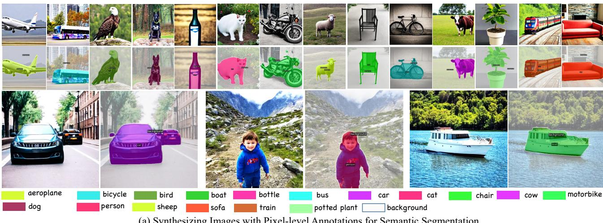

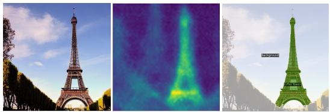  
Prompt: A photograph of Eiffel Tower

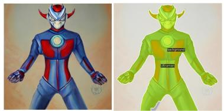  
Prompt: A painting of a highly detailed Ultraman

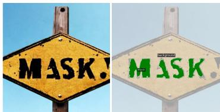  
Prompt: A road sign shows Mask  
(b) Open-Vocabulary Image and Semantic Mask Generation

Figure 1 – DiffuMask synthesizes photo-realistic images and high-quality mask annotations by exploiting the attention maps of the diffusion model. Without human effort for localization DiffuMask is capable of producing high-quality semantic masks.

## Abstract

Collecting and annotating images with pixel-wise labels is time-consuming and laborious. In contrast, synthetic data can befreely available using a generative model (e.g., DALL-E, Stable Diffusion). In this paper, we show that it is possible to automatically obtain accurate semantic masks of synthetic images generated by the Off-the-shelf Stable Diffusion model, which uses only text-image pairs during training. Our approach, termed DiffuMask, exploits the potential of the cross-attention map between text and image, which is natural and seamless to extend the text-driven image synthesis to semantic mask generation. DiffuMask uses text-guided cross-attention information to

localize class/word-specific regions, which are combined with practical techniques to create a novel high-resolution and class-discriminative pixel-wise mask. The methods help to significantly reduce data collection and annotation costs. Experiments demonstrate that the existing segmentation methods trained on synthetic data of DiffuMask can achieve a competitive performance over the counterpart of real data (VOC 2012, Cityscapes). For some classes (e.g., bird), DiffuMask presents promising performance, close to the state-of-the-art result of real data (within 3% mIoU gap). Moreover, in the open-vocabulary segmentation (zero-shot) setting, DiffuMask achieves new state-ofthe-art results on the Unseen classes of VOC 2012. The project website can befound at DiffuMask.

## 1. Introduction

Semantic segmentation is a fundamental task in vision, and existing data-hungry semantic segmentation models usually require a large amount of data with pixel-level annotations to achieve significant progress. Unfortunately, pixel-wise mask annotation is a labor-intensive and expensive process. For example, labeling a single semantic urban image in Cityscapes [14] can take up to 60 minutes, underscoring the level of difficulty involved in this task Additionally, in some cases, it may be challenging or even impossible to collect images due to existing privacy and copyright. To reduce the cost of annotation, weakly-supervised learning has become a popular approach in recent years. This approach involves training strong segmentation models using weak or cheap labels, such as image-level labels [2, 33, 59, 61, 51, 52], points [3], scribbles [37, 63], and bounding boxes [34]. Although these methods are free of pixel-level annotations, still suffer from several disadvantages, including low-performance accuracy, complex training strategy, indispensable extra annotation cost (e.g., edge), and image collection cost.

With the great development of computer graphics (e.g., generative model), an alternative way is to utilize synthetic data, which is largely available from the virtual world, and the pixel-level ground truth can be freely and automatically generated. DatasetGAN [65] firstly exploits the feature space of a trained GAN and trains a shallow decoder to produce pixel-level labeling. BigDatasetGAN [35] extends DatasetGAN to handle the large class diversity of ImageNet. However, both methods suffer from certain drawbacks, the need for a small number of pixel-level labeled examples to generalize to the rest of the latent space and suboptimal performance due to imprecise generative masks.

Recently, large-scale language-image generation (LLIG) models, such as DALL-E [48], and Stable Diffusion [49], have shown phenomenal generative semantic and compositional power, as shown in Fig. 1. Given one language description, the text-conditioned image generation model can create corresponding semantic things and stuff, where visual and textual embedding are fused using spatial crossattention. We dive deep into the cross-attention layers and explore how they affect the generative semantic object and structure of the image. We find that cross-attention maps are the core, which binds visual pixels and text tokens of the prompt text. Also, the cross-attention maps contain rich class (text token) discriminative spatial localization information, which critically affects the generated image.

Can the attention map be used as mask annotation? Consider semantic segmentation [19, 14]—a ‘good’ pixellevel semantic mask annotation should satisfy two conditions: (a) class-discriminative (i.e., localize and distinguish the categories in the image); (b) high-resolution, precise mask (i.e., capture fine-grained detail). Fig. 2b presents a visualization of cross attention map between text token and vision. $8 \times 8 , 1 6 \times 1 6 , 3 2 \times 3 2$ , and $6 4 \times 6 4$ , as four different resolutions, are extracted from different layers of the U-Net of Stable Diffusion [49]. 8×8 feature map is the lowest resolution, including obvious class-discriminative location. $3 2 \times 3 2$ and 64 × 64 feature maps include highresolution and highlight fine-grained details. The average map shows the possibility for us to use for semantic segmentation, where it is class-discriminative and fine-grained. To further validate the potential of the attention map of the generative task, we convert the probability map to a binary map with fixed thresholds γ, and refine them with Dense CRF [31], as shown in Fig. 2c. With the 0.35 threshold, the mask presents a wonderful precision on fine-grained details (e.g., foot, ear of the ‘horse’).

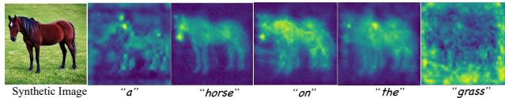  
(a) Cross attention maps of different text tokens.

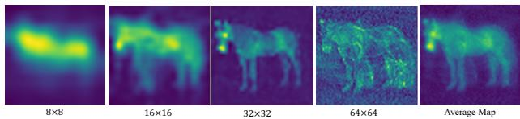

(b) Cross attention maps of different resolutions.  
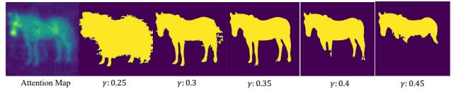  
(c) Binarization Mask with different thresholds γ in Equ. (3).  
Figure 2 – Cross-attention maps of a text-conditioned diffusion model (i.e., Stable Diffusion [49]). Prompt language: ‘a horse on the grass’.

Based on the above observation, we present DiffuMask, an automatic procedure to generate a massive high-quality image with a pixel-level semantic mask. Unlike Dataset-GAN [65] and BigDatasetGAN [35], DiffuMask does not require any pixel-level annotations. This approach takes full advantage of powerful zero-shot text-to-image generative models such as Stable Diffusion [49], which are trained on web-scale image-text pairs. DiffuMask mainly includes two advantages for two challenges: 1) Precise Mask. An adaptive threshold of binarization is proposed to convert the probability map (attention map) to a binary map, as the mask annotation. Besides, noise learning [44, 56] is used to filter noisy labels. 2) Domain Gap: retrieval-based prompt (various and verisimilar prompt guidance) and data augmentations (e.g., Splicing [7]), as two effective solutions, are designed to reduce the domain gap via enhancing the diversity of data. With the above advantages, DiffuMask can generate infinite images with pixel-level annotation for any class without human effort. These synthetic data can then be used for training any semantic segmentation architecture (e.g., mask2former [11]), replacing real data.

To summarize, our contributions are three-folds:

• We show a novel insight that it is possible to automatically obtain the synthetic image and mask annotation from a text-supervised pre-trained diffusion model.

• We present DiffuMask, an automatic procedure to generate massive image and pixel-level semantic annotation without human effort and any manual mask annotation, which exploits the potential of the crossattention map between text and image.

• Experiments demonstrate that segmentation methods trained on DiffuMask perform competitively on real data, e.g., VOC 2012. For some classes, e.g., dog, the performance is close to that of training with real data (within 3% gap). Moreover, in the open-vocabulary segmentation (zero-shot) setting, DiffuMask achieves new SOTA results on the Unseen classes of VOC 2012.

## 2. Related Work

Reducing Annotation Cost. Various ways can be explored to reduce the segmentation data cost, including interactive human-in-the-loop annotation [1, 39], nearestneighbor mask transfer [26], or weak/cheap mask annotation supervision in different levels, such as imagelevel labels [2, 33, 59, 61, 51, 52], points [3], scribbles [37, 63], and bounding boxes [34, 9, 32]. Among the above-related works, image-level label supervised learning [51, 52] presents the lowest cost, and its performance is unacceptable. Bounding boxes [9, 32] annotation usually shows a competitive performance than pixel-wise supervised methods, but its annotation cost is the most expensive. By comparison, synthetic data presents many advantages, including lower data cost without image collection, and infinite availability for enhancing the diversity of data.

Image Generation. Image generation is a basic and challenging task in computer vision. There are several mainstream methods for the task, including Generative Adversarial Networks (GAN) [23], Variational autoencoders (VAE) [30], flow-based models [18], and Diffusion Probabilistic Models (DM) [55, 49, 24]. Recently, the diffusion model has drawn lots of attention due to its wonderful performance. GLIDE [43] used pre-trained language model (CLIP [47]) and the cascaded diffusion structure for text-to-image generation. Similarly, DALL-E 2 [48] of OpenAI Imagen [53] obtain the corresponding text embedding with CLIP and adopted a similar hieratical structure to generate images. To increase accessibility and reduce significant resource consumption, Stable Diffusion [49] of Stability AI introduced a novel direction in which the model diffuses on VAE latent spaces instead of pixel spaces.

Synthetic Dataset Generation. Prior works [29, 16] for dataset synthesis mainly utilize 3D scene graphs to render images and their labels. 2D methods, i.e., Generative Adversarial Networks (GAN) [23] mainly is used to solve domain adaptation task [13, 13], which leverages image-toimage translation to reduce the domain gap. Recently, inspired by the success of generative model (e.g., DALL-E 2, Stable Diffusion), some works further try to explore the potential of synthetic data to replace real data as the training data in many downstream tasks, including image classification [28, 6], object detection [60, 42, 21, 20, 67, 66], image segmentation [35, 65, 36], 3D Rendering [64, 46]. DatasetGAN [65] utilized a few labeled real images to train a segmentation mask decoder, leading to an infinite synthetic image and mask generator. Based on DatasetGAN, BigDatasetGAN [46] scale the class diversity to ImageNet size, which generates 1k classes with manually annotated 5 images per class. With Stable diffusion and Mask R-CNN pre-trained on COCO dataset, Li et al. [36] design and train a grounding module to generate images and segmentation masks. Different from the above methods, we go one step further and synthesize accurate semantic labels by exploiting the potential of cross attention map between text and image. One significant advantage of the DiffuMask is that it does not require any manual localization annotations (i.e., box and mask) and only rely on text supervision.

## 3. Methodology

In this paper, we explore simultaneously generating images and the semantic mask described in the text prompt with the existing pre-trained diffusion model. Using the synthetic data to train the existing segmentation methods, and apply them to the real images.

The core is to exploit the potential of the cross-attention map in the generative model and domain gap between synthetic and real data, providing corresponding new insights, solutions, and analysis. We introduce the preliminary of cross attention in Sec. 3.1, Mask generation and refinement with cross-attention map in text-conditioned diffusion models in Sec. 3.2, data diversity enhancement with prompt engineering in Sec. 3.4, data augmentation in Sec. 3.5.

## 3.1. Cross-Attention of Text-Image

Text-guided generative models (e.g., Imagen [53], Stable Diffusion [49]) use a text prompt P to guide the contentrelated image I generation from a random gaussian image noise z, where visual and textual embedding are fused using the spatial cross-attention. Specifically, Stable Diffusion [49] consists of a text encoder, a variational autoencoder (VAE), and a U-shaped network [50]. The interaction between the text and vision occurs in the U-Net for the latent vectors at each time step, where cross-attention layers are used to fuse the embeddings of the visual and textual features and produce spatial attention maps for each textual token. Formally, for step t, the visual features of the noisy image $\varphi ( z _ { t } ) \in \mathbf { \bar { R } } ^ { H \times W \times \mathbf { \bar { C } } }$ are flatted and linearly projected into a Query vector $Q \ = \ \ell _ { Q } ( \varphi ( z _ { t } ) )$ . The text prompt $\mathcal { P }$ is projected into the textual embedding $\tau _ { \theta } ( \mathcal { P } ) \in \mathbb { R } ^ { N \times d } ( N$ refers to the sequence length of text tokens and d is the latent projection dimension) with the text encoder $\tau _ { \theta }$ , then is mapped into a Key matrix $K = \ell _ { K } ( \tau _ { \theta } ( \mathcal { P } ) )$ and a Value matrix $V = \ell _ { V } ( \tau _ { \theta } ( \mathcal { P } ) )$ , via learned projections $\ell _ { Q } , \ell _ { K } , \ell _ { V }$ The cross attention maps can be calculated by:

$$
\mathcal { A } = \mathrm { S o f t m a x } \left( \frac { Q K ^ { T } } { \sqrt { d } } \right) ,\tag{1}
$$

where $\mathcal { A } \in \mathbb { R } ^ { H \times W \times N }$ (re-shape). For $j \cdot$ -th text token, $e . g .$ horse on Fig. 2a, the corresponding weight $\mathcal { A } _ { j } \in \mathbb { R } ^ { H \times W }$ on the visual map $\varphi ( z _ { t } )$ can be obtained. Finally, the output of cross-attention can be obtained with $\widehat { \varphi } \left( z _ { t } \right) = \mathcal { A } V$ , which is then used to update the spatial features $\varphi ( z _ { t } )$

## 3.2. Mask Generation and Refinement

Based on Equ. 1, we can obtain the corresponding cross attention map $\mathscr { A } _ { i } ^ { s , t }$ . s denotes the attention map from s-th layer of U-Net, and corresponding to four different resolutions, $i . e . , 8 \times 8 , 1 6 \times 1 6 , 3 2 \times 3 2$ , and $6 4 \times 6 4$ , as shown in Fig. 2b. t denotes t-th diffusion step (time). Then the average cross-attention map can be calculated by aggregating the multi-layer and multi-time attention maps as follows:

$$
\hat { \mathcal { A } } _ { j } = \frac { 1 } { S \cdot T } \sum _ { s \in S , t \in T } \frac { \mathcal { A } _ { j } ^ { s , t } } { \operatorname* { m a x } ( \mathcal { A } _ { j } ^ { s , t } ) } ,\tag{2}
$$

where S and $T$ refer to the total steps and the number of layers $( i . e .$ , four for U-Net). Normalization is necessary due the value of the attention map from the output of Softmax is not a probability between 0 and 1.

## 3.2.1 Standard Binarization

Given an average attention map (a probability map) $M \in$ $\mathbb { R } ^ { H \times W }$ for j-th text token produced by the cross attention in Equ. (1), it is essential to convert it to a binary map, where pixels with 1 as the foreground region $( e . g .$ ., ‘horse’). Usually, as shown in Fig. 2c, the simplest solution for the binarization process is using a fixed threshold value γ, and refining with DenseCRF [31] (local relationship defined by color and distance of pixels) as follows:

$$
B = \operatorname { D e n s e C R F } ( \left[ \gamma ; \hat { \mathcal { A } } _ { j } \right] _ { \mathrm { a r g m a x } } ) .\tag{3}
$$

The above method is not practical and effective, while the optimal threshold of each image and each category are not exactly the same. To explore the relationship between threshold and binary mask quality, we set a simple analysis experiment. Stable Diffusion [49] is used to generate 1k images and corresponding attention maps for each class. The prediction of Mask2former [11] pre-trained on Pascal-VOC 2012 as the ground truth is adopted to calculate the quality of mask quality (mIoU), as shown in Fig. 3. The optimal threshold of different classes usually are different, $e . g .$ , around 0.48 for ‘Bottle’ class, different from that (i.e., around 0.39) of ‘Dog’ class. To achieve the best quality of the mask, the adaptive threshold is a feasible solution for the various binarization for each image and class.

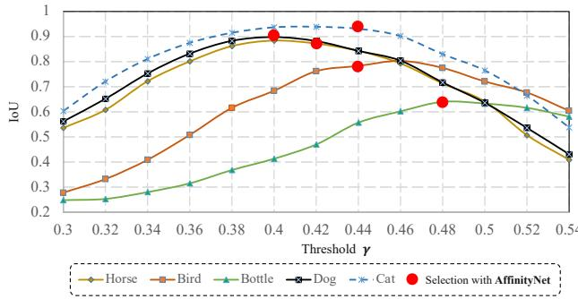  
Figure 3 – Relationship between mask quality (IoU) and threshold for various categories. 1k generative images are used for each class from Stable Diffusion [49]. Mask2former [11] pre-trained on Pascal-VOC 2012 [19] is used to generate the ground truth. The optimal threshold of different classes usually is different.

## 3.2.2 Adaptive Threshold for Binarization

It is challenging to determine the optimal threshold for binarizing the probability maps because of the variation in shape and region for each object class. The image generation relies on text-supervision, which does not provide a precise definition of the shape and region of object classes. For example, the masks with 0.45γ and that with 0.35γ in Fig. 2c, the model can not judge which one is better, while no location information as supervision and reference is provided by human effort.

Looking deeper at the challenge, pixels with a middle confidence score cause uncertainty, while that with a high and low score usually represent the true foreground and the background. To address the challenge, semantic affinity learning (i.e., AffinityNet [2]) is used to give an estimation for those pixels with a middle confidence score. Thus we can obtain the definition for global prototype, i.e., which semantic masks with different threshold $\gamma$ is suitable to represent the whole prototype. AffinityNet aims to predict semantic affinity between a pair of adjacent coordinates. During the training phase, those pixels in the middle score range are considered as neutral. If one of the adjacent coordinates is neutral, the network simply ignores the pair during training. Without neutral pixels, the affinity label of two coordinates is set to 1 (positive pair) if their classes are the same, and 0 (negative pair) otherwise. During the inference phase, a coarse affinity map $\hat { B } \in \mathbb { R } ^ { H \times W }$ can be predicted by AffinityNet for each class of each image. $\hat { B }$ is used to search for a suitable threshold γˆ during a search space $\Omega = \{ \gamma _ { i } \} _ { i = 1 } ^ { L }$ as follows:

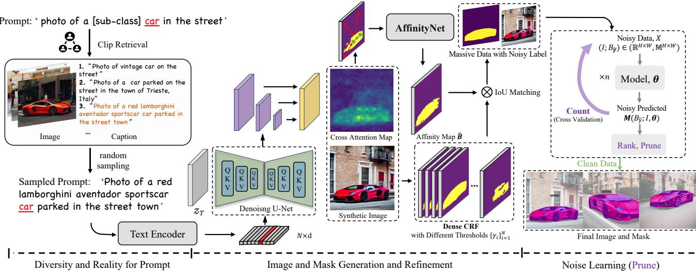  
Figure 4 – Pipeline for DiffuMask with a prompt: ‘Photo of a [sub-class] car in the street’. DiffuMask mainly includes three steps: 1) Prompt engineering is used to enhance the diversity and reality of prompt language (Sec. 3.4). 2) Image and mask generation and refinement with adaptive threshold from AffinityNet (Sec. 3.2). 3) Noise learning is designed to further improve the quality of data via filtering the noisy label (Sec. 3.3).

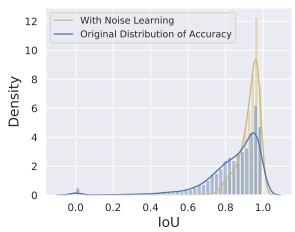

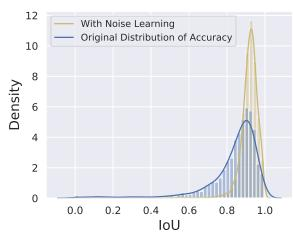  
(a) Distribution of ‘Horse’.  
(b) Distribution of ‘Bird’.  
Figure 5 – Effect of Noise Learning (NL). 30k generative images are used for each class. NL prunes 70% images on the basis of the rank of IoU. Mask2former [11] pre-trained on VOC 2012 [19] is used to generate the ground truth. NL brings obvious improvement in mask quality by pruning data.

$$
\hat { \gamma } = \underset { \gamma \in \Omega } { \arg \operatorname* { m a x } } \sum \mathcal { L } _ { \mathrm { m a t c h } } ( \hat { B } , B _ { \gamma } ) ,\tag{4}
$$

where $\mathcal { L } _ { \mathrm { m a t c h } } ( \hat { B } , B _ { \gamma } )$ is a pair-wise matching cost of IoU between affinity map Bˆ and a binary map from attention map with threshold γ. As a result, an adaptive threshold $\hat { \gamma }$ can be obtained for each image of each class. The red points in Fig. 3 represent the corresponding threshold from matching with the affinity map. They are usually close to the optimal threshold.

## 3.3. Noise Learning

Although refined mask $B _ { \hat { \gamma } }$ presents a competitive result, there are still existing noisy labels with low precision. Fig. 5 provides the probability density distribution of IoU for the ‘Horse’ and ‘Bird’ classes. The masks with IoU under 80% account for a non-negligible proportion and may cause a significant performance drop. Inspired by noise learning [44, 56, 10] for the classification task, we design a simple, yet effective noise learning (NL) strategy to prune the noise labels for the segmentation task.

NL improves the data quality by identifying and filtering noisy labels. The main procedure (see Fig. 4) comprises two steps: (1) Count: estimating the distribution of label noise $Q _ { B _ { \hat { \gamma } } , B ^ { * } }$ to characterize pixel-level label noise, $B ^ { * }$ refers to the prediction of model. (2) Rank, and Prune: filter out noisy examples and train with errors removed data. Formally, given massive generative images and annotations $\{ ( \mathcal { I } , B _ { \widehat { \gamma } } ) \}$ , a segmentation model θ (e.g., Mask2former [11], Mask-RCNN [27]) is used to predict out-of-sample probabilities of segmentation result $\theta : \mathcal { I } $ $M _ { c } ( B _ { \hat { \gamma } } ; \mathcal { I } , \pmb { \theta } )$ by cross-validation. Then we can estimate the joint distribution of noisy labels $B _ { \hat { \gamma } }$ and true labels, $Q _ { B _ { \hat { v } } , B ^ { * } } ^ { c } = \Phi _ { \mathrm { I o U } } ( B _ { \hat { \gamma } } , B ^ { * } )$ , where c denotes c-th class. With $Q _ { B _ { \hat { \gamma } } , B ^ { * } } ^ { c } ,$ some interpretable and explainable ranking methods, such as loss reweighting [22, 41] can be used for CL to find label errors using. In this paper, we adopt a simple and effective modularized rank and prune method, i.e., Prune by Class, which decouples the model and data cleaning procedure. For each class, select and prune α% examples with the lowest self-confidence $Q _ { B _ { \hat { \gamma } } , B ^ { * } } ^ { c }$ as the noisy data, and train model θ with the remaining clean data. While $\alpha \%$ is set to 50%, the probability density distribution of IoU from the remaining clean data is presented in Fig. 5 (yellow). CL can bring an obvious gain for the mask precision, which further taps the potential of attention map as mask annotation.

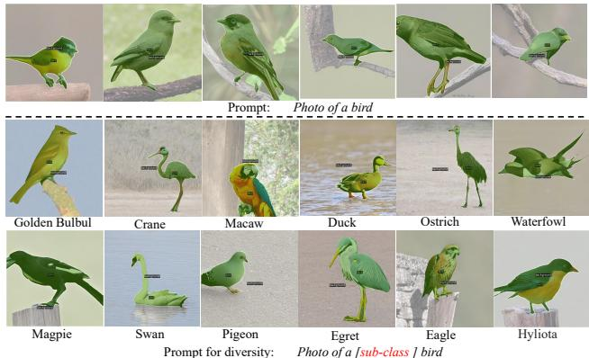  
Figure 6 – Prompt for diversity in sub-class for the bird class. 100 sub-classes for bird class in total for our experiment. The same prompt strategy is used for other classes, e.g., cat, car.

## 3.4. Prompt Engineering

Previous works [42, 58] have shown the effectiveness of prompt engineering on diversity enhancement of generative data. These studies utilize a variety of prompt modifiers to influence the generated images, e.g., GPT3 used by ImaginaryNet [42]. Unlike generation-based or modificationbased prompts, we design two practical, reality-based prompt strategies.

Prompt with Sub-Classes. Simple text prompts, such as ‘Photo of a bird’, often results in monotony for generative images, as depicted in Fig. 6 (upper), they fail to capture the diverse range of objects and scenes found in the real world. To address this challenge, we incorporate ‘sub-classes’ for each category to improve diversity. To achieve this, we select K sub-classes for each category from Wiki1 and integrate this information into the prompt templates. Fig. 6 (down) presents an example for ‘bird’ category. Given K sub-classes, i.e., Golden Bullul, Crane, this allows us to obtain K corresponding text prompts ‘Photo of a [sub-class] bird’, denoted by $\{ \hat { \mathcal { P } } _ { 1 } , \hat { \mathcal { P } } _ { 2 } , . . . , \hat { \mathcal { P } } _ { K } \}$

Retrieval-based Prompt. The prompt Pˆ still is a handcrafted sentence template, we expect to develop it into a real language prompt in the human community. One feasible solution for that is through prompt retrieval [5, 47]. As shown in Fig. 4, given a prompt Pˆ, i.e., ‘Photo of a [sub-class] car in the street’, Clipretrieval [5] pre-trained on Laion5B [54] is used to retrieve top N real images and captions, where the captions as the final prompt sets. Using this approach, we can collect a total of $K \times N$ text prompts, denoted by $\sum { \overset { K \times N } { \mathop { i = 1 } } } { \hat { \mathcal { P } } } _ { i }$ i, for our synthetic data.

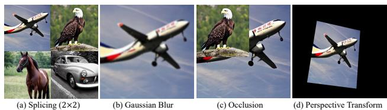  
Figure 7 – Data Augmentation. Four data augmentations are used to reduce the domain gap.

During inference, we randomly sample a prompt from this set to generate each image.

## 3.5. Data Augmentation

To further reduce the domain gap between the generated images and the real-world images in terms of size, blur, and occlusion, data augmentations Φ(·) (e.g., Splicing [7]), as the effective strategies are used, as shown in Fig. 7. Splicing. Synthetic image usually present normal size for the foreground (object), i.e., objects typically occupy the majority of image. However, real-world images often contain objects of varying resolutions, including small objects in datasets such as Cityscapes [15]. To address this issue, we use Splicing augmentation. Fig. 7 (a) presents one example for the image splicing $( 2 \times 2 )$ . In the experiment, six scales of image splicing are used, $i . e . , 1 \times 2 , 2 \times 1 , 2 \times 2 , 3 \times 3 ,$ $5 \times 5 ,$ and $8 \times 8 .$ , and the images are sampled from train set randomly. Gaussian Blur. Synthetic images typically exhibit a uniform level of blur, whereas real images exhibit varying degrees of blur due to motion, focus, and artifact issues. Gaussian Blur [40] is used to increase the diversity of blur, where the length of Gaussian Kernel is randomly sampled from a range of 6 to 22. Occlusion. Similar to CutMix [62], to make the model focus on discriminative parts of objects, patches of another image are cut and pasted among training images where the corresponding labels are also mixed proportionally to the area of the patches. Perspective Transform. Similar to the above augmentations, perspective transform is used to improve the diversity of the generated images by simulating different viewpoints.

## 4. Experiments

## 4.1. Experimental Setups

Datasets and Task. Datasets. Following the previous works [11, 36] for semantic segmentation, Pascal-VOC 2012 [19], ADE20k [68] and Cityscapes [15] are used to evaluate DiffuMask. Tasks. Three tasks are adopted in our experiment, i.e., semantic segmentation, open-vocabulary segmentation, and domain generalization.

Implementation Details The pre-trained Stable Diffusion [49], the text encoder of CLIP [47], AffinityNet [2] are adopted as the base components. We do not finetune the Stable Diffusion and only train AffinityNet for each category. The corresponding parameter optimization and setting (e.g., initialization, data augmentation, batch size, learning rate) all are similar to that of the original paper. Synthetic data for training. For each category on Pascal-VOC 2012 [19], we generate 10k images and set α of noise learning to 0.7 to filter 7k images. As a result, we collect 60k synthetic data for 20 classes as the final training set, and the spatial resolution is $5 1 2 \times 5 1 2$ . For Cityscapes [14], we only evaluate 2 important classes, i.e., ‘Human’ and ‘Vehicle’, including six sub-classes, person, rider, car, bus, truck, train, and generate 30k images for each subcategory, where 10k images are selected as the final training data by noise learning. Considering the relationship between rider and motorbike/bicycle, we set the two classes to be ignored, while evaluating the ‘Human’ class on Table 2 and Table 6. In our experiment, only a single object for an image is considered. Multi-categories generation [36] usually causes the unstable quality of the images, limited by the generation ability of Stable Diffusion. Mask2Former [11] is used as the baseline to evaluate the dataset. 8 Tesla V100 GPUs are used for all experiments.

<table><tr><td></td><td></td><td></td><td colspan="10">Semantic Segmentation (IoU) for Selected Classes/%</td><td></td><td></td><td></td></tr><tr><td>Train Set</td><td>Number</td><td>Backbone</td><td>aeroplane</td><td>bird</td><td>boat</td><td>bus</td><td>car</td><td>cat</td><td>chair</td><td>COW dog</td><td>horse</td><td>person</td><td>sheep</td><td>sofa</td><td>mIoU</td></tr><tr><td colspan="2">Train with Pure Real Data</td><td></td><td></td><td></td><td></td><td></td><td></td><td></td><td></td><td></td><td></td><td></td><td></td><td></td><td></td></tr><tr><td rowspan="2">VOC</td><td>R: 11.5k (all)</td><td>R50</td><td>87.5</td><td>94.4</td><td>70.6</td><td>95.5</td><td>87.7</td><td>92.2 44.0</td><td>85.4</td><td>89.1</td><td>82.1</td><td>89.2</td><td>80.6</td><td>53.6</td><td>77.3</td></tr><tr><td>R: 11.5k (all) R: 5.0k</td><td>Swin-B</td><td>97.0</td><td>93.7</td><td>71.5</td><td>91.7</td><td>89.6</td><td>96.5</td><td>57.5 95.9</td><td>96.8</td><td>94.4</td><td>92.5</td><td>95.1</td><td>65.6</td><td>84.3</td></tr><tr><td colspan="2"></td><td>Swin-B</td><td>95.5</td><td>87.7</td><td>77.1</td><td>96.1</td><td>91.2</td><td>95.2</td><td>47.3</td><td>90.3</td><td>92.8 94.6</td><td>90.9</td><td>93.7</td><td>61.4</td><td>83.4</td></tr><tr><td colspan="2">Train with Pure Synthetic Data</td><td></td><td></td><td></td><td></td><td></td><td></td><td></td><td></td><td></td><td></td><td></td><td></td><td></td><td></td></tr><tr><td rowspan="2">DiffuMask</td><td>S: 60.0k S: 60.0k</td><td>R50</td><td>80.7</td><td>86.7</td><td>56.9</td><td>81.2</td><td>74.2</td><td>79.3 14.7</td><td>63.4</td><td>65.1</td><td>64.6</td><td>71.0</td><td>64.7</td><td>27.8</td><td>57.4</td></tr><tr><td></td><td>Swin-B</td><td>90.8</td><td>92.9</td><td>67.4</td><td>88.3 82.9</td><td>92.5</td><td>27.2</td><td>92.2</td><td>86.0</td><td>89.0</td><td>76.5</td><td>92.2</td><td>49.8</td><td>70.6</td></tr><tr><td colspan="2">Finetune on Real Data</td><td></td><td></td><td></td><td></td><td></td><td></td><td></td><td></td><td></td><td></td><td></td><td></td><td></td><td></td></tr><tr><td rowspan="2">VOC, DiffuMask</td><td> $\mathrm { S } \colon 6 0 . 0 \mathrm { k } + \mathrm { R } \colon 5 . 0 \mathrm { k }$   $\mathrm { S } \colon 6 0 . 0 \mathrm { k } + \mathrm { R } \colon 5 . 0 \mathrm { k }$ </td><td>R50</td><td>85.4</td><td>92.8</td><td>74.1</td><td>92.9</td><td>83.7</td><td>91.7</td><td>38.4</td><td>86.5</td><td>86.2 82.5</td><td>87.5</td><td></td><td>81.2 39.8</td><td>77.6</td></tr><tr><td></td><td>Swin-B</td><td>95.6</td><td>94.4</td><td>72.3</td><td>96.9</td><td>92.9</td><td>96.6 51.5</td><td>96.7</td><td>95.5</td><td>96.1</td><td>91.5</td><td>96.4</td><td>70.2</td><td>84.9</td></tr></table>

Table 1 – Result of Semantic Segmentation on the VOC 2012 val. mIoU is for 20 classes. $\mathbf { \partial } ^ { \ast } \mathbf { S } ^ { \ast }$ and $\cdot _ { \mathrm { R } } \cdot$ refer to ‘Synthetic’ and ‘Real’.

<table><tr><td></td><td></td><td></td><td colspan="2">Category/%</td><td></td></tr><tr><td>Train Set</td><td>Number</td><td>Backbone</td><td>Human</td><td>Vehicle</td><td>mIoU</td></tr><tr><td colspan="6">Train with Pure Real Data</td></tr><tr><td rowspan="3">Cityscapes</td><td>3.0k (all)</td><td>R50</td><td>83.4</td><td>94.5</td><td>89.0</td></tr><tr><td>3.0k (all)</td><td>Swin-B</td><td>85.5</td><td>96.0</td><td>90.8</td></tr><tr><td>1.5k</td><td>Swin-B</td><td>84.6</td><td>95.3</td><td>90.0</td></tr><tr><td colspan="6">Train with Pure Synthetic Data</td></tr><tr><td>DiffuMask</td><td>100.0k</td><td>R50</td><td>70.7</td><td>85.3</td><td>78.0</td></tr><tr><td>Finetune with Real Data</td><td>100.0k</td><td>Swin-B</td><td>72.1</td><td>87.0</td><td>79.6</td></tr><tr><td colspan="6"></td></tr><tr><td>Cityscapes, DiffuMask</td><td> $1 0 0 . 0 \mathrm { k } + 1 . 5 \mathrm { k }$ </td><td>R50</td><td>84.6</td><td>95.5</td><td>90.1</td></tr><tr><td></td><td> $1 0 0 . 0 \mathrm { k } + 1 . 5 \mathrm { k }$ </td><td>Swin-B</td><td>86.4</td><td>96.4</td><td>91.4</td></tr></table>

Table 2 – The mIoU (%) of Semantic Segmentation on Cityscapes val. ‘Human’ includes two sub-classes person and rider. ‘Vehicle’ includes four sub-classes, i.e., car, bus, truck and train. Mask2former [11] with ResNet50 is used.

Evaluation Metrics. Mean intersection-over-union (mIoU) [19, 11], as the common metric of semantic segmentation, is used to evaluate the performance. For openvocabulary segmentation, following the prior [17, 12], the mIoU averaged on seen classes, unseen classes, and their harmonic mean are used.

<table><tr><td rowspan="2">Methods</td><td colspan="2">Train Set/%</td><td colspan="3">mIoU/%</td></tr><tr><td>Type</td><td>Categories</td><td>Seen</td><td>Unseen</td><td>Harmonic</td></tr><tr><td colspan="6">Manual Mask Supervision</td></tr><tr><td>ZS3 [8]</td><td>real</td><td>15</td><td>78.0</td><td>21.2</td><td>33.3</td></tr><tr><td>CaGNet [25]</td><td>real</td><td>15</td><td>78.6</td><td>30.3</td><td>43.7</td></tr><tr><td>Joint [4]</td><td>real</td><td>15</td><td>77.7</td><td>32.5</td><td>45.9</td></tr><tr><td>STRICT [45]</td><td>real</td><td>15</td><td>82.7</td><td>35.6</td><td>49.8</td></tr><tr><td>SIGN [12]</td><td>real</td><td>15</td><td>83.5</td><td>41.3</td><td>55.3</td></tr><tr><td>ZegFormer [17]</td><td>real</td><td>15</td><td>86.4</td><td>63.6</td><td>73.3</td></tr><tr><td colspan="6">Pseudo Mask Supervision from Model pre-trained on COCO [38]</td></tr><tr><td>Li et al. [36] (ResNet101)</td><td>synthetic</td><td>15+5</td><td>62.8</td><td>50.0</td><td>55.7</td></tr><tr><td colspan="6">Text(Prompt) Supervision</td></tr><tr><td>DiffuMask (ResNet50)</td><td>synthetic</td><td>15+5</td><td>60.8</td><td>50.4</td><td>55.1</td></tr><tr><td>DiffuMask (ResNet101)</td><td>synthetic</td><td>15+5</td><td>62.1</td><td>50.5</td><td>55.7</td></tr><tr><td>DiffuMask (Swin-B)</td><td>synthetic</td><td>15+5</td><td>71.4</td><td>65.0</td><td>68.1</td></tr></table>

Table 3 – Performance for Zero-Shot Semantic Segmentation Task on PASCAL VOC. ‘Seen’, ‘Unseen’, and ‘Harmonic’ denote mIoU of seen, unseen categories, and their harmonic mean. Priors are trained with real data and masks.

Mask Smoothness. The mask $B _ { \hat { \gamma } }$ generated by the Dense CRF often contains jagged edges and numerous small regions that do not correspond to distinct objects in the image. To address these issues, we trained a segmentation model θ (i.e. Mask2Former), using the mask $B _ { \hat { \gamma } }$ generated by the Dense CRF as input. We then used this model to predict the pseudo labels for the training set of synthetic data, resulting in a final semantic mask annotation

Cross Validation for Noise Learning. In the experiment, we performed the three-fold cross-validation for each class. The five-fold cross-validation (CV) is a process in which all data is randomly split into k folds, in our case k = 3, and then the model is trained on the k − 1 folds, while one fold is left to test the quality.

## 4.2. Protocol-I: Semantic Segmentation

VOC 2012. Table 1 presents the results of semantic segmentation on the VOC 2012. The existing segmentation methods trained on synthetic data (DiffuMask) can achieve a competitive performance, i.e., 70.6% v.s. 84.3% for mIoU with Swin-B backbone. A point worth emphasizing is that our synthetic data does not need any manual localization and mask annotation, while real data need humans to perform a pixel-wise mask annotation. For some categories, i.e., bird, cat, cow, horse, sheep, DiffuMask presents a powerful performance, which is quite close to that of training on real (within 5% gap). Besides, finetune on few real data, the results can be improved further, and exceed that of training on full real data, e.g., 84.9% mIoU finetune on 5.0k real data v.s 83.4% mIoU training on full real data (11.5k).

<table><tr><td>Annotation</td><td>γ</td><td>Bird Dog</td><td></td><td>mIoU</td><td>Retri. Sub-C</td><td></td><td>Bird Dog</td><td>|mIoU</td></tr><tr><td>Affinity map</td><td>-</td><td></td><td>84.4 78.8</td><td>81.6</td><td></td><td></td><td>78.2 75.6</td><td>76.9</td></tr><tr><td>Attention</td><td>0.4</td><td></td><td>88.1 82.4</td><td>85.3</td><td>√</td><td></td><td>79.2 76.2</td><td>77.7</td></tr><tr><td>Attention</td><td>0.5</td><td></td><td>90.3 67.4</td><td>78.9</td><td>√</td><td>10</td><td>91.3 83.9</td><td>87.6</td></tr><tr><td>Attention</td><td>0.6</td><td>50.538.3</td><td></td><td>44.4</td><td>√</td><td>50</td><td>92.585.4</td><td>89.0</td></tr><tr><td>DiffuMask</td><td>AT</td><td>92.9</td><td>86.0</td><td>89.5</td><td>√</td><td>100</td><td>92.9 86.0</td><td>89.5</td></tr></table>

(a) DiffuMask v.s. Attention Map.  
(b) Prompt Engineering.

<table><tr><td>α</td><td>Bird</td><td>Dog mIoU</td><td></td></tr><tr><td>0.3</td><td>87.2</td><td>79.2</td><td>83.2</td></tr><tr><td>0.4</td><td>89.5</td><td>79.9</td><td>84.7</td></tr><tr><td>0.5</td><td>91.9</td><td>84.4</td><td>88.2</td></tr><tr><td>0.6</td><td>92.6</td><td>85.2</td><td>89.1</td></tr><tr><td>0.7</td><td>92.9</td><td>86.0</td><td>89.5</td></tr></table>

(c) Noise Learning.

<table><tr><td>Method</td><td>Bird Dog</td><td>mIoU</td></tr><tr><td rowspan="3">Φ1  $\Phi _ { 1 } , \Phi _ { 2 }$ </td><td>87.0 81.5</td><td>84.3</td></tr><tr><td>90.2 83.7</td><td>87.0</td></tr><tr><td>90.9 84.8</td><td>87.9</td></tr><tr><td> $\Phi _ { 1 } , \Phi _ { 2 } , \Phi _ { 3 }$ </td><td>91.2 85.1</td><td>88.2</td></tr><tr><td> $\Phi _ { 1 } , \Phi _ { 2 } , \Phi _ { 3 } , \Phi _ { 4 }$ </td><td>92.9 86.0</td><td>89.5</td></tr></table>

(d) Data Augmentation.  
Table 4 – DiffuMask ablations. We perform ablations on VOC 2012 val. γ and ‘AT’ denotes the ‘Threshold’ and ‘Adaptive Threshold’, respectively. α refers to the proportion of data pruning. Φ1, Φ2, Φ3 and Φ4 refer to ‘Splicing’, ‘Gaussian Blur’, ‘Occlusion’, and ‘Perspective Transform’, respectively. ‘Retri.’ and ‘Sub-C’ denotes ‘retrieval-based’ and ‘Sub-Class’, respectively. Mask2former with Swin-B is adopted as the baseline.

Cityscapes. Table 2 presents the results on Cityscapes. Urban street scenes of Cityscapes are more challenging, including a mass of small objects and complex backgrounds. We only evaluate two classes, i.e., Vehicle and Human, which are the two most important categories in the driving scene. Compared with training on real images, DiffuMask presents a competitive result, i.e., 79.6% vs. 90.8% mIoU.

ADE20K ADE20K, as one more challenging dataset, is also used to evaluate the DiffuMask. Table 5 presents the results of three categories (bus, car, person) on ADE20K. With fewer synthetic images (6k), we achieve a competitive performance than that of a mass of real images (20.2k). Compared with the other two categories, Class car achieves the best performance, with 73.4% mIoU.

## 4.3. Protocol-II: Open-vocabulary Segmentation

As shown in Fig. 1, it is natural and seamless to extend the text-driven synthetic data (our DiffuMask) to the openvocabulary (zero-shot) task. As shown in Table 3, compared with priors training on real images with manually annotated mask, DiffuMask can achieve a SOTA result on Unseen classes. It is worth mentioning that DiffuMask is pure synthetic/fake data and supervised by text, while priors all must need the real image and corresponding manual mask annotation. Li et al., as one contemporaneous work, use the segmentation model pre-trained on COCO [38] to predict the pseudo label of the synthetic image, which is high-cost.

## 4.4. Protocol-III: Domain Generalization

Table 6 presents the results for cross-dataset validation, which can evaluate the generalization of data. Compared with real data, DiffuMask show powerful effectiveness on domain generalization, e.g., 69.5% with DiffuMask v.s 68.0 with ADE20K [68] on VOC 2012 val. The domain gap [57] between real datasets sometimes is bigger than that among synthetic and real data. For Motorbike class, model training with Cityscapes only achieves 28.9% mIoU, but that of DiffuMask is 63.2% mIoU. We argue that the main reason is domain shift in foreground and background domains, i.e., Cityscapes contains images of city roads, with the majority of Motorbike objects being small in size. But VOC 2012 is an open-set scenario, where Motorbike objects vary greatly in size and include close-up shots.

<table><tr><td>Train Set</td><td></td><td></td><td colspan="3">Category/%</td><td></td></tr><tr><td></td><td>Number</td><td>Backbone</td><td>bus</td><td>car</td><td>person</td><td>mIoU</td></tr><tr><td colspan="7">Train with Pure Real Data</td></tr><tr><td>ADE20K</td><td>R: 20.2k</td><td>R50</td><td>87.9</td><td>82.5</td><td>79.4</td><td>83.3</td></tr><tr><td></td><td>R: 20.2k</td><td>Swin-B</td><td>93.6</td><td>86.1</td><td>84.0</td><td>87.9</td></tr><tr><td colspan="7">Train with Pure Synthetic Data</td></tr><tr><td>DiffuMask</td><td>S: 6.0k</td><td>R50</td><td>43.4</td><td>67.3</td><td>60.2</td><td>57.0</td></tr><tr><td></td><td>S: 6.0k</td><td>Swin-B</td><td>72.8</td><td>73.4</td><td>62.6</td><td>69.6</td></tr></table>

Table 5 – The mIoU (%) of Semantic Segmentation on the ADE20K val.

<table><tr><td colspan="2"></td><td colspan="4">mIoU/%</td></tr><tr><td>Train Set</td><td>Test Set</td><td>Car</td><td>Person</td><td>Motorbike</td><td>mIoU</td></tr><tr><td>Cityscapes [14]</td><td>VOC 2012 [19] val</td><td>26.4</td><td>32.9</td><td>28.3</td><td>29.2</td></tr><tr><td>ADE20K [68]</td><td>VOC 2012 [19] val</td><td>73.2</td><td>66.6</td><td>64.1</td><td>68.0</td></tr><tr><td>DiffuMask</td><td>VOC 2012 [19] val</td><td>74.2</td><td>71.0</td><td>63.2</td><td>69.5</td></tr><tr><td>VOC 2012 [19]</td><td>Cityscapes [14] val</td><td>85.6</td><td>53.2</td><td>11.9</td><td>50.2</td></tr><tr><td>ADE20K [68]</td><td>Cityscapes [14] val</td><td>83.3</td><td>63.4</td><td>33.7</td><td>60.1</td></tr><tr><td>DiffuMask</td><td>Cityscapes [14] val</td><td>84.0</td><td>70.7</td><td>23.6</td><td>59.4</td></tr></table>

Table 6 – Performance for Domain Generalization between different datasets. Mask2former [11] with ResNet50 is used as the baseline. Person and Rider classes of Cityscapes [14] are consider as the same class, i.e., Person in the experiment.

## 4.5. Ablation Study

Compared with Attention Map. Table 4a presents the comparison with the attention map and the impact of binarization threshold γ. It is clear that the optimal threshold for different categories is different, even various for different images of the same category. Sometimes it is sensitive for some categories, such as Dog. The mIoU of 0.4 γ is better than that of 0.6 γ around 40% mIoU, which can not be neglectful. By contrast, our adaptive threshold is robust. Fig. 3 also shows it is close to the optimal threshold.

<table><tr><td>Backbone</td><td>Bird</td><td>Dog</td><td>Sheep</td><td>Horse</td><td>Person</td><td>mIoU</td></tr><tr><td>RseNet 50</td><td>86.7</td><td>65.1</td><td>64.7</td><td>64.6</td><td>71.0</td><td>70.3</td></tr><tr><td>RseNet 101</td><td>86.7</td><td>66.8</td><td>65.3</td><td>63.4</td><td>70.2</td><td>70.5</td></tr><tr><td>Swin-B</td><td>92.9</td><td>86.0</td><td>92.2</td><td>89.0</td><td>76.5</td><td>87.3</td></tr><tr><td>Swin-L</td><td>92.8</td><td>86.4</td><td>92.3</td><td>88.3</td><td>77.3</td><td>87.4</td></tr></table>

Table 7 – Impact of Backbone on VOC 2012 val. Mask2former [11] is used as the baseline.

<table><tr><td>Annotation</td><td>Bird</td><td>Dog</td><td>Person</td><td>Sofa</td><td>mIoU</td></tr><tr><td>Real Image, Manual Label</td><td>93.7</td><td>96.8</td><td>92.5</td><td>65.6</td><td>87.2</td></tr><tr><td>Synthetic Image, Pseudo Label</td><td>95.2</td><td>86.2</td><td>89.9</td><td>59.5</td><td>82.7</td></tr><tr><td>Synthetic Image, DiffuMask</td><td>92.9</td><td>86.0</td><td>76.5</td><td>49.8</td><td>76.3</td></tr></table>

Table 8 – Impact of Mask Precision and Domain Gap on VOC 2012 val. Mask2former [11] with Swin-B is used as the baseline. ‘Pseudo’ denotes pseudo mask annotation from Mask2former [11] pre-trained on VOC 2012.

Prompt Engineering. Table 4b provides the related ablation study for prompt strategies. Retrieval-based and subclasses prompt all can bring an obvious gain. For dog, 10 sub-classes prompt brings a 7.7% mIoU improvement, which is quite significant. It is reasonable, the fine-grained prompts can directly enhance the diversity of generative images, as shown in Fig. 6.

Noise Learning. Table 4c presents the impact of prune threshold α. 10k synthetic images for each class are used in this experiment. The gain is considerable while α changes from 0.3 to 0.5. In other experiments, we set the α to 0.7 for each category.

Data Augmentation. The ablation study for the four augmentations is shown in Table 4d. Compared with the other three augmentations, the gain of image splicing is the biggest. One main reason is that the synthetic images are all 512 × 512 resolution and the size of the object usually is normal, image splicing can enhance the diversity of scale.

What causes the performance gap between synthetic and real data. Domain gap and mask precision are the main reasons for the performance gap between synthetic and real data. Table 8 is set To further explore the problem. Li et al. [36] shows that the pseudo mask of the synthetic image from Mask2former [11] pre-trained on VOC 2012 is quite accurate, and can as the ground truth. Thus, we also use the pseudo label from the pre-trained Mask2former to train the model. As shown in Table 8, mask precision cause 6.4% mIoU gap, and the domain gap of images causes 4.5% mIoU gap. Notably, for the bird class, the use of synthetic data with a pseudo label resulted in better results than the corresponding real images. This observation suggests that there may be no domain gap for the bird class in the VOC 2012 dataset.

Backbone Table 7 presents the ablation study for the backbone. For some classes, e.g. sheep, the stronger backbone can bring obvious gains, i.e. Swin-B achieves 27.5% mIoU improvement than that of ResNet 50. And the mIoU of all classes with Swin-B achieves 19.2% mIoU improvements. It is an interesting and novel insight that a stronger backbone can reduce the domain gap between synthetic and real data. To give a further analysis for that, we present some results comparison of visualizations, as shown in Fig. 8. Swin-B brings an obvious improvement in classification, False Negatives, and mask precision.

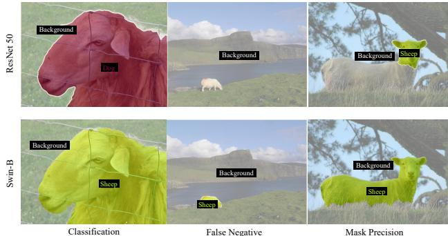  
Figure 8 – Impact of Backbone. Stronger backbone is robust for classification, False Negative, and mask precision.

## 5. Conclusion

A new insight is presented in this paper, demonstrating that the accurate semantic mask of generative images can be automatically obtained through the use of a textdriven diffusion model. To achieve this goal, we present DiffuMask, an automatic procedure to generate image and pixel-level semantic annotation. The existing segmentation methods training on synthetic data of DiffuMask can achieve a competitive performance over the counterpart of real data. Besides, DiffuMask shows the powerful performance for open-vocabulary segmentation, which can achieve a promising result on Unseen category. We hope DiffuMask can bring new insights and inspiration for bridg ing generative data and real-world data in the community.

## Acknowledgements

W. Wu, C. Shen’s participation was supported by the National Key R&D Program of China (No. 2022ZD0118700). W. Wu, H. Zhou’s participation was supported by the National Key Research and Development Program of China (No. 2022YFC3602601), and the Key Research and Development Program of Zhejiang Province of China (No. 2021C02037). M. Shou’s participation was supported by the National Research Foundation, Singapore under its NRFF Award NRF-NRFF13-2021-0008, and his Start-Up Grant from National University of Singapore.

## References

[1] David Acuna, Huan Ling, Amlan Kar, and Sanja Fidler. Efficient interactive annotation of segmentation datasets with polygon-rnn++. In Proceedings of the IEEE conference on Computer Vision and Pattern Recognition, pages 859–868, 2018. 3

[2] Jiwoon Ahn and Suha Kwak. Learning pixel-level semantic affinity with image-level supervision for weakly supervised semantic segmentation. In Proceedings of the IEEE conference on computer vision and pattern recognition, pages 4981–4990, 2018. 2, 3, 4, 6

[3] Peri Akiva and Kristin Dana. Towards single stage weakly supervised semantic segmentation. arXiv preprint arXiv:2106.10309, 2021. 2, 3

[4] Donghyeon Baek, Youngmin Oh, and Bumsub Ham. Exploiting a joint embedding space for generalized zero-shot semantic segmentation. In Proc. ICCV, 2021. 7

[5] Romain Beaumont. Clip retrieval: Easily compute clip embeddings and build a clip retrieval system with them. GitHub, 2022. 6

[6] Victor Besnier, Himalaya Jain, Andrei Bursuc, Matthieu Cord, and Patrick Perez. This dataset does not exist: training´ models from generated images. In ICASSP 2020-2020 IEEE International Conference on Acoustics, Speech and Signal Processing (ICASSP), pages 1–5. IEEE, 2020. 3

[7] Alexey Bochkovskiy, Chien-Yao Wang, and Hong-Yuan Mark Liao. Yolov4: Optimal speed and accuracy of object detection. arXiv preprint arXiv:2004.10934, 2020. 2, 6

[8] Maxime Bucher, Tuan-Hung Vu, Matthieu Cord, and Patrick Perez. Zero-shot semantic segmentation.´ NeurIPS, 2019. 7

[9] Liang-Chieh Chen, Sanja Fidler, Alan L Yuille, and Raquel Urtasun. Beat the mturkers: Automatic image labeling from weak 3d supervision. In Proceedings ofthe IEEE conference on computer vision and pattern recognition, pages 3198– 3205, 2014. 3

[10] Pengfei Chen, Ben Ben Liao, Guangyong Chen, and Shengyu Zhang. Understanding and utilizing deep neural networks trained with noisy labels. In International Conference on Machine Learning, pages 1062–1070. PMLR, 2019. 5

[11] Bowen Cheng, Ishan Misra, Alexander G Schwing, Alexander Kirillov, and Rohit Girdhar. Masked-attention mask transformer for universal image segmentation. In Proceedings of the IEEE/CVF Conference on Computer Vision and Pattern Recognition, pages 1290–1299, 2022. 3, 4, 5, 6, 7, 8, 9

[12] Jiaxin Cheng, Soumyaroop Nandi, Prem Natarajan, and Wael Abd-Almageed. Sign: Spatial-information incorporated generative network for generalized zero-shot semantic segmentation. In Proc. ICCV, 2021. 7

[13] Jaehoon Choi, Taekyung Kim, and Changick Kim. Selfensembling with gan-based data augmentation for domain adaptation in semantic segmentation. In Proceedings of the IEEE/CVF International Conference on Computer Vision, pages 6830–6840, 2019. 3

[14] Marius Cordts, Mohamed Omran, Sebastian Ramos, Timo Rehfeld, Markus Enzweiler, Rodrigo Benenson, Uwe Franke, Stefan Roth, and Bernt Schiele. The cityscapes dataset for semantic urban scene understanding. In Proceedings ofthe IEEE conference on computer vision and pattern recognition, pages 3213–3223, 2016. 2, 7, 8

[15] Marius Cordts, Mohamed Omran, Sebastian Ramos, Timo Rehfeld, Markus Enzweiler, Rodrigo Benenson, Uwe Franke, Stefan Roth, and Bernt Schiele. The cityscapes dataset for semantic urban scene understanding. In Proceedings ofthe IEEE conference on computer vision and pattern recognition, pages 3213–3223, 2016. 6

[16] Jeevan Devaranjan, Sanja Fidler, and Amlan Kar. Unsupervised learning of scene structure for synthetic data generation, Sept. 9 2021. US Patent App. 17/117,425. 3

[17] Jian Ding, Nan Xue, Gui-Song Xia, and Dengxin Dai. Decoupling zero-shot semantic segmentation. In Proc. CVPR, 2022. 7

[18] Laurent Dinh, David Krueger, and Yoshua Bengio. Nice: Non-linear independent components estimation. arXiv preprint arXiv:1410.8516, 2014. 3

[19] Mark Everingham, Luc Van Gool, Christopher KI Williams, John Winn, and Andrew Zisserman. The pascal visual object classes (voc) challenge. International journal of computer vision, 88(2):303–338, 2010. 2, 4, 5, 6, 7, 8

[20] Yunhao Ge, Harkirat Behl, Jiashu Xu, Suriya Gunasekar, Neel Joshi, Yale Song, Xin Wang, Laurent Itti, and Vibhav Vineet. Neural-sim: Learning to generate training data with nerf. In European Conference on Computer Vision, pages 477–493. Springer, 2022. 3

[21] Yunhao Ge, Jiashu Xu, Brian Nlong Zhao, Laurent Itti, and Vibhav Vineet. Dall-e for detection: Language-driven context image synthesis for object detection. arXiv preprint arXiv:2206.09592, 2022. 3

[22] Jacob Goldberger and Ehud Ben-Reuven. Training deep neural-networks using a noise adaptation layer. In Proc. Int. Conf. Learn. Representations, 2017. 5

[23] Ian Goodfellow, Jean Pouget-Abadie, Mehdi Mirza, Bing Xu, David Warde-Farley, Sherjil Ozair, Aaron Courville, and Yoshua Bengio. Generative adversarial networks. Communications ofthe ACM, 63(11):139–144, 2020. 3

[24] Yuchao Gu, Xintao Wang, Jay Zhangjie Wu, Yujun Shi, Yunpeng Chen, Zihan Fan, Wuyou Xiao, Rui Zhao, Shuning Chang, Weijia Wu, et al. Mix-of-show: Decentralized lowrank adaptation for multi-concept customization of diffusion models. arXiv preprint arXiv:2305.18292, 2023. 3

[25] Zhangxuan Gu, Siyuan Zhou, Li Niu, Zihan Zhao, and Liqing Zhang. Context-aware feature generation for zeroshot semantic segmentation. In ACM MM, 2020. 7

[26] Matthieu Guillaumin, Daniel Kuttel, and Vittorio Ferrari.¨ Imagenet auto-annotation with segmentation propagation. International Journal of Computer Vision, 110(3):328–348, 2014. 3

[27] Kaiming He, Georgia Gkioxari, Piotr Dollar, and Ross Gir-´ shick. Mask r-cnn. In Proceedings ofthe IEEE international conference on computer vision, pages 2961–2969, 2017. 5

[28] Ruifei He, Shuyang Sun, Xin Yu, Chuhui Xue, Wenqing Zhang, Philip Torr, Song Bai, and Xiaojuan Qi. Is synthetic

data from generative models ready for image recognition? arXiv preprint arXiv:2210.07574, 2022. 3

[29] Amlan Kar, Aayush Prakash, Ming-Yu Liu, Eric Cameracci, Justin Yuan, Matt Rusiniak, David Acuna, Antonio Torralba, and Sanja Fidler. Meta-sim: Learning to generate synthetic datasets. In Proceedings of the IEEE/CVF International Conference on Computer Vision, pages 4551–4560, 2019. 3

[30] Diederik P Kingma and Max Welling. Auto-encoding variational bayes. arXiv preprint arXiv:1312.6114, 2013. 3

[31] Philipp Krahenb¨ uhl and Vladlen Koltun. Efficient inference¨ in fully connected crfs with gaussian edge potentials. Advances in neural information processing systems, 24, 2011. 2, 4

[32] Viveka Kulharia, Siddhartha Chandra, Amit Agrawal, Philip Torr, and Ambrish Tyagi. Box2seg: Attention weighted loss and discriminative feature learning for weakly supervised segmentation. In European Conference on Computer Vision, pages 290–308. Springer, 2020. 3

[33] Jungbeom Lee, Eunji Kim, and Sungroh Yoon. Antiadversarially manipulated attributions for weakly and semisupervised semantic segmentation. In Proceedings of the IEEE/CVF Conference on Computer Vision and Pattern Recognition, pages 4071–4080, 2021. 2, 3

[34] Jungbeom Lee, Jihun Yi, Chaehun Shin, and Sungroh Yoon. Bbam: Bounding box attribution map for weakly supervised semantic and instance segmentation. In Proceedings ofthe IEEE/CVF conference on computer vision and pattern recognition, pages 2643–2652, 2021. 2, 3

[35] Daiqing Li, Huan Ling, Seung Wook Kim, Karsten Kreis, Sanja Fidler, and Antonio Torralba. Bigdatasetgan: Synthesizing imagenet with pixel-wise annotations. In Proceedings of the IEEE/CVF Conference on Computer Vision and Pattern Recognition, pages 21330–21340, 2022. 2, 3

[36] Ziyi Li, Qinye Zhou, Xiaoyun Zhang, Ya Zhang, Yanfeng Wang, and Weidi Xie. Guiding text-to-image diffusion model towards grounded generation. arXiv preprint arXiv:2301.05221, 2023. 3, 6, 7, 9

[37] Di Lin, Jifeng Dai, Jiaya Jia, Kaiming He, and Jian Sun. Scribblesup: Scribble-supervised convolutional networks for semantic segmentation. In Proceedings of the IEEE conference on computer vision and pattern recognition, pages 3159–3167, 2016. 2, 3

[38] Tsung-Yi Lin, Michael Maire, Serge Belongie, James Hays, Pietro Perona, Deva Ramanan, Piotr Dollar, and C Lawrence´ Zitnick. Microsoft coco: Common objects in context. In Proc. ECCV, 2014. 7, 8

[39] Huan Ling, Jun Gao, Amlan Kar, Wenzheng Chen, and Sanja Fidler. Fast interactive object annotation with curve-gcn. In Proceedings of the IEEE/CVF conference on computer vision and pattern recognition, pages 5257–5266, 2019. 3

[40] Raphael Gontijo Lopes, Dong Yin, Ben Poole, Justin Gilmer, and Ekin D Cubuk. Improving robustness without sacrificing accuracy with patch gaussian augmentation. arXiv preprint arXiv:1906.02611, 2019. 6

[41] Nagarajan Natarajan, Inderjit S Dhillon, Pradeep K Ravikumar, and Ambuj Tewari. Learning with noisy labels. 2013. 5

[42] Minheng Ni, Zitong Huang, Kailai Feng, and Wangmeng Zuo. Imaginarynet: Learning object detectors without real images and annotations. arXiv preprint arXiv:2210.06886, 2022. 3, 6

[43] Alex Nichol, Prafulla Dhariwal, Aditya Ramesh, Pranav Shyam, Pamela Mishkin, Bob McGrew, Ilya Sutskever, and Mark Chen. Glide: Towards photorealistic image generation and editing with text-guided diffusion models. arXiv preprint arXiv:2112.10741, 2021. 3

[44] Curtis Northcutt, Lu Jiang, and Isaac Chuang. Confident learning: Estimating uncertainty in dataset labels. Journal of Artificial Intelligence Research, 70:1373–1411, 2021. 2, 5

[45] Giuseppe Pastore, Fabio Cermelli, Yongqin Xian, Massimiliano Mancini, Zeynep Akata, and Barbara Caputo. A closer look at self-training for zero-label semantic segmentation. In Proc. CVPRW, 2021. 7

[46] Ben Poole, Ajay Jain, Jonathan T Barron, and Ben Mildenhall. Dreamfusion: Text-to-3d using 2d diffusion. arXiv preprint arXiv:2209.14988, 2022. 3

[47] Alec Radford, Jong Wook Kim, Chris Hallacy, Aditya Ramesh, Gabriel Goh, Sandhini Agarwal, Girish Sastry, Amanda Askell, Pamela Mishkin, Jack Clark, et al. Learning transferable visual models from natural language supervision. In International conference on machine learning, pages 8748–8763. PMLR, 2021. 3, 6

[48] Aditya Ramesh, Prafulla Dhariwal, Alex Nichol, Casey Chu, and Mark Chen. Hierarchical text-conditional image generation with clip latents. arXiv preprint arXiv:2204.06125, 2022. 2, 3

[49] Robin Rombach, Andreas Blattmann, Dominik Lorenz, Patrick Esser, and Bjorn Ommer. High-resolution image¨ synthesis with latent diffusion models. In Proceedings of the IEEE/CVF Conference on Computer Vision and Pattern Recognition, pages 10684–10695, 2022. 2, 3, 4, 6

[50] Olaf Ronneberger, Philipp Fischer, and Thomas Brox. Unet: Convolutional networks for biomedical image segmentation. In Medical Image Computing and Computer-Assisted Intervention–MICCAI 2015: 18th International Conference, Munich, Germany, October 5-9, 2015, Proceedings, Part III 18, pages 234–241. Springer, 2015. 3

[51] Lixiang Ru, Bo Du, and Chen Wu. Learning visual words for weakly-supervised semantic segmentation. In IJCAI, volume 5, page 6, 2021. 2, 3

[52] Lixiang Ru, Yibing Zhan, Baosheng Yu, and Bo Du. Learning affinity from attention: End-to-end weakly-supervised semantic segmentation with transformers. In Proceedings of the IEEE/CVF Conference on Computer Vision and Pattern Recognition, pages 16846–16855, 2022. 2, 3

[53] Chitwan Saharia, William Chan, Saurabh Saxena, Lala Li, Jay Whang, Emily Denton, Seyed Kamyar Seyed Ghasemipour, Burcu Karagol Ayan, S Sara Mahdavi, Rapha Gontijo Lopes, et al. Photorealistic text-to-image diffusion models with deep language understanding. arXiv preprint arXiv:2205.11487, 2022. 3

[54] Christoph Schuhmann, Romain Beaumont, Richard Vencu, Cade Gordon, Ross Wightman, Mehdi Cherti, Theo

Coombes, Aarush Katta, Clayton Mullis, Mitchell Wortsman, et al. Laion-5b: An open large-scale dataset for training next generation image-text models. arXiv preprint arXiv:2210.08402, 2022. 6

[55] Jascha Sohl-Dickstein, Eric Weiss, Niru Maheswaranathan, and Surya Ganguli. Deep unsupervised learning using nonequilibrium thermodynamics. In International Conference on Machine Learning, pages 2256–2265. PMLR, 2015. 3

[56] Hwanjun Song, Minseok Kim, Dongmin Park, Yooju Shin, and Jae-Gil Lee. Learning from noisy labels with deep neural networks: A survey. IEEE Transactions on Neural Networks and Learning Systems, 2022. 2, 5

[57] Marco Toldo, Andrea Maracani, Umberto Michieli, and Pietro Zanuttigh. Unsupervised domain adaptation in semantic segmentation: a review. Technologies, 8(2):35, 2020. 8

[58] Sam Witteveen and Martin Andrews. Investigating prompt engineering in diffusion models. arXiv preprint arXiv:2211.15462, 2022. 6

[59] Tong Wu, Junshi Huang, Guangyu Gao, Xiaoming Wei, Xiaolin Wei, Xuan Luo, and Chi Harold Liu. Embedded discriminative attention mechanism for weakly supervised semantic segmentation. In Proceedings ofthe IEEE/CVF Conference on Computer Vision and Pattern Recognition, pages 16765–16774, 2021. 2, 3

[60] Zhenyu Wu, Lin Wang, Wei Wang, Tengfei Shi, Chenglizhao Chen, Aimin Hao, and Shuo Li. Synthetic data supervised salient object detection. In Proceedings of the 30th ACM International Conference on Multimedia, pages 5557–5565, 2022. 3

[61] Lian Xu, Wanli Ouyang, Mohammed Bennamoun, Farid Boussaid, Ferdous Sohel, and Dan Xu. Leveraging auxiliary tasks with affinity learning for weakly supervised semantic segmentation. In Proceedings of the IEEE/CVF International Conference on Computer Vision, pages 6984–6993, 2021. 2, 3

[62] Sangdoo Yun, Dongyoon Han, Seong Joon Oh, Sanghyuk Chun, Junsuk Choe, and Youngjoon Yoo. Cutmix: Regularization strategy to train strong classifiers with localizable features. In Proceedings of the IEEE/CVF international conference on computer vision, pages 6023–6032, 2019. 6

[63] Bingfeng Zhang, Jimin Xiao, Jianbo Jiao, Yunchao Wei, and Yao Zhao. Affinity attention graph neural network for weakly supervised semantic segmentation. IEEE Transactions on Pattern Analysis and Machine Intelligence, 2021. 2, 3

[64] Yuxuan Zhang, Wenzheng Chen, Huan Ling, Jun Gao, Yinan Zhang, Antonio Torralba, and Sanja Fidler. Image gans meet differentiable rendering for inverse graphics and interpretable 3d neural rendering. arXiv preprint arXiv:2010.09125, 2020. 3

[65] Yuxuan Zhang, Huan Ling, Jun Gao, Kangxue Yin, Jean-Francois Lafleche, Adela Barriuso, Antonio Torralba, and Sanja Fidler. Datasetgan: Efficient labeled data factory with minimal human effort. In Proceedings of the IEEE/CVF Conference on Computer Vision and Pattern Recognition, pages 10145–10155, 2021. 2, 3

[66] Yuzhong Zhao, Weijia Wu, Zhuang Li, Jiahong Li, and Weiqiang Wang. Flowtext: Synthesizing realistic scene text video with optical flow estimation. arXiv preprint arXiv:2305.03327, 2023. 3

[67] Yuzhong Zhao, Qixiang Ye, Weijia Wu, Chunhua Shen, and Fang Wan. Generative prompt model for weakly supervised object localization. arXiv preprint arXiv:2307.09756, 2023. 3

[68] Bolei Zhou, Hang Zhao, Xavier Puig, Sanja Fidler, Adela Barriuso, and Antonio Torralba. Scene parsing through ade20k dataset. In Proceedings of the IEEE conference on computer vision and pattern recognition, pages 633–641, 2017. 6, 8