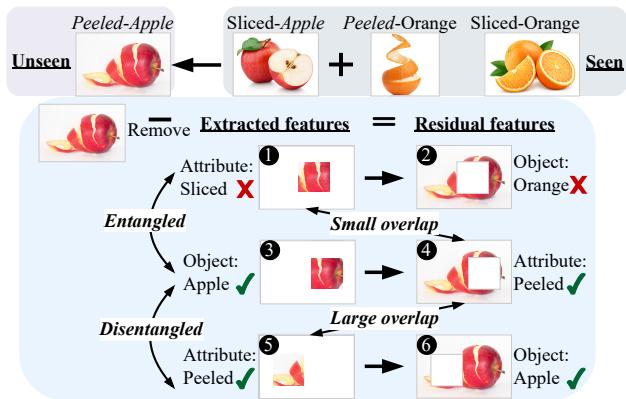
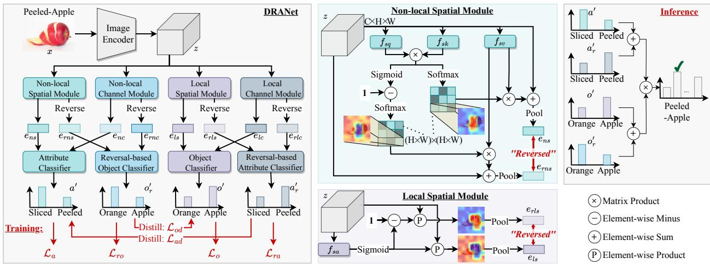
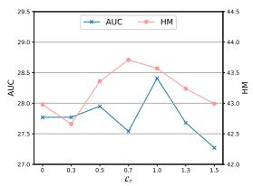
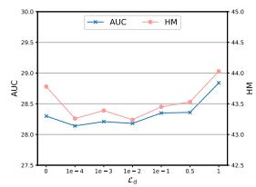
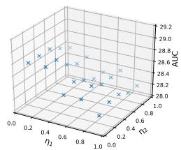
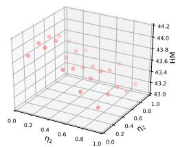
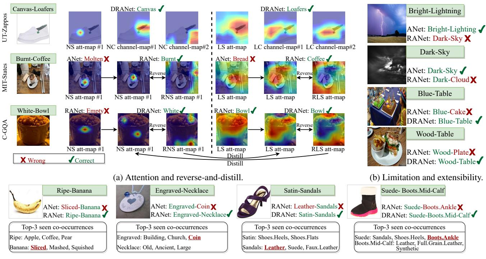

# Distilled Reverse Attention Network for Open-world Compositional Zero-Shot Learning

Yun Li1 Zhe Liu2 Saurav Jha2 Lina Yao1,2 1 CSIRO Data61 2 University of New South Wales

y.li@csiro.au zheliu912@gmail.com saurav.jha@unsw.edu.au lina.yao@data61.csiro.au

## Abstract

Open-World Compositional Zero-Shot Learning (OW-CZSL) aims to recognize new compositions of seen attributes and objects. In OW-CZSL, methods built on the conventional closed-world setting degrade severely due to the unconstrained OW test space. While previous works alleviate the issue by pruning compositions according to external knowledge or correlations in seen pairs, they introduce biases that harm the generalization. Some methods thus predict state and object with independently constructed and trained classifiers, ignoring that attributes are highly context-dependent and visually entangled with objects. In this paper, we propose a novel Distilled Reverse Attention Network to address the challenges. We also model attributes and objects separately but with different motivations, capturing contextuality and locality, respectively. We further design a reverse-and-distill strategy that learns disentangled representations of elementary components in training data supervised by reverse attention and knowledge distillation. We conduct experiments on three datasets and consistently achieve state-of-the-art (SOTA) performance.

## 1. Introduction

Humans can recognize complex concepts never seen before (e.g., the pink elephant) by composing their knowledge of familiar visual primitives (elephants and other pink objects). This ability of compositional learning is considered a hallmark of human intelligence [17] that deep learning methods clearly lack [18]. Deep learning often requires a large quantity of labeled examples to train. However, realworld instances follow a long-tailed distribution [34, 38], making it impractical to gather supervision for all categories. Compositional Zero-shot Learning (CZSL) mimics the human ability to tackle these issues [31, 23, 29, 15].

CZSL learns the compositionality of seen objects (e.g. fruits, animals, etc.) and attributes (e.g. colors, sizes, etc.) as primitives to recognize unseen attribute-object pairs. For example, CZSL composes and generalizes Peeled-Orange and Sliced-Apple to Peeled-Apple (Fig. 1). Conventional CZSL methods characterize closed-world (CW-CZSL) settings [31, 28, 30, 23], where unseen attribute-object pairs contained in test images are given as priors to restrict the search space. For example, the test space of the widely-used benchmark MIT-States [13] is simplified to 1,662 compositions out of 28,175 possible pairs (115 attributes × 245 objects) for CW-CZSL. This setup fundamentally reduces the generalization ability of CZSL models. Therefore, in this work, we study a more realistic and challenging task: unconstrained Open-World CZSL (OW-CZSL) [14, 15, 26, 27], where arbitrary compositions may appear at test time.

  
Figure 1: Motivation behind our disentangling strategy for OW-CZSL. When extracted features of objects and attributes are disentangled (images 3 and 5), their residual features (images 4 and 6) carry sufficient information about each other to classify correctly, and produce large overlap between the object residuals and the attribute features (images 4 and 5). For entangled attribute-object features (images 1 and 3), the phenomena are otherwise reversed (image 2: few object information; images 1 and 4: small overlap).

A notable line of works for CW-CZSL projects attributeobject pairs and images onto a shared embedding space to perform similarity-based composition classification [41,

29, 39]. However, their performances severely degrade for OW-CZSL [26] due to greatly expanded output space (e.g., ∼ 17 times in MIT-States). Thus, some works adapt them to OW-CZSL by pruning OW composition space based on feasibility scores calculated according to linguistic side information [15] or seen attribute-object dependencies [26, 27]. Such scores inevitably introduce biases caused by distribution shifts between images and external linguistic knowledge bases or seen and unseen compositions, resulting in visual-semantic inconsistent or seen-biased predictions. Therefore, for OW-CZSL, we follow another direction that adopts two parallel discriminative modules to infer objects and attributes respectively, reducing composition search to separate attribute and object search [15, 14, 19, 43].

Despite the success of separate modeling techniques in CW- and OW-CZSL, these ignore the intrinsic differences between attributes and objects [19, 43, 15, 14]. Children, for instance, learn nouns faster than adjectives because they relate to context differently [7]. Similarly, visual primitives of attributes (often adjectives) are more context-sensitive than objects (usually nouns) [28, 30]. For example, Small in Small-Cat and Small-Building is not visually equivalent, while Tomato in Red-Tomato and Fresh-Tomato is similar. Extracting attribute and object features using identical structures [15, 14] without considering the heavier context dependencies of attributes may impair the discrimination.

Another bottleneck for separate modeling is visual entanglement. Taking Fig. 1 as an example, given an image of the unseen composition, i.e., Peeled-Apple, it is hard to distinguish which visual features are Apple and which ones are Peeled. The extracted features of attributes and objects are highly entangled (images 1 and 3), leading to a wrong prediction biased towards the seen pairs, i.e., Sliced-Apple. Some efforts disentangle the embeddings in CW-CZSL [33, 1, 43, 19]. However, they either learn pair-wise attribute-object correlations in compositional space [32, 1] or adopt generative methods to synthesize samples for all pairs [33, 19], thus making them infeasible for OW-CZSL due to the drastically expanded output space.

To address these issues, we propose the Distilled Reverse Attention Network (DRANet) that extracts and disentangles visual primitives of attributes and objects for OW-CZSL. First, we design attribute/object-specific networks to extract their features differently according to their characteristics. As suggested by [35], Convolutional Neural Networks (CNNs), used to extract visual embeddings in CZSL, are built on top of local neighborhoods and thus cannot capture long-range context. Therefore, we adapt non-local attention blocks [35, 6] to model spatial and channel contextual relationships for attribute learning while adopting local attention to focus on essential parts for object recognition.

Second, we design an attention-based disentangling strategy for OW-CZSL, namely Reverse-and-Distill. This strategy is based on the observation that humans can still recognize Apple after removing Peeled from the images of Peeled-Apple. Intuitively, if learned primitives of attributes and objects are disentangled, removing either of them from the feature space will not affect the classification of the other. Thus, object predictions after erasing the attribute features (or attribute predictions after object removal) can indicate the unraveling degree of attribute and object features. For example, as shown in Fig. 1, models can still recognize Apple (image 6) after removing attribute features when primitives are disentangled (images 3 and 5) but fail (image 2) when entangled (images 1 and 3). Given that feature removal is intractable in practice, we approximate it by reversing attention. We then achieve attribute and object feature disentanglement by supervising their residuals to crossly carry sufficient object and attribute information. Besides, when attribute and object features are disentangled, the overlaps between attribute features and object residuals (or object features and attribute residuals) become large (seeing images 4 and 5 or images 3 and 6 in Fig. 1). We enlarge such overlaps by distilling primitives to learn from mutual residuals for further unraveling.

In summary, our contributions are as follows: 1) We propose the DRANet for OW-CZSL. DRANet employs distinct extractors to capture attribute and object features, enhancing contextuality and locality, simultaneously. 2) We design the reverse-and-distill strategy to disentangle the attribute and object embeddings in OW-CZSL, where existing disentangling methods in CW-CZSL are impractical. 3) We achieve SOTA performance on three benchmark datasets, and analyze the limitations and extensibility of our model.

## 2. Related work

Compositional Zero-Shot Learning (CZSL) aims to recognize unseen concepts by composing learned attribute and object primitives. A typical schema of CZSL is to learn joint representations of compositions [37, 29, 32, 39, 41]. [29] establishes element and composition relationships in a graph space. [31] uses a gating network to generate a unified classifier for compositions. [44] refines composition embeddings by hierarchically constructing concepts. Other methods try to model attributes as transformations applied to objects [23, 30] and learn a classifier based on objects modified by attributes. The transformation can be linear projection [30] or symmetry coupling and decoupling [23].

Another mainstream methods model attributes and objects separately [43, 19, 33, 1] to reduce composition learning into attribute and object learning. [43] employs a block memory network to generate features for concepts. [19, 33] compare images with the same objects or objects to decompose visual primitives. Among them, some works [19, 33, 1] find that isolated modeling ignores attribute-object interactions and thus proposes to disentangle attributes and objects for CW-CZSL with affinity estimation [33], contrastive learning [19], or cutting the confounding links [1]. In this work, we design a new disentangling strategy suitable for OW-CZSL, i.e., reverse-and-distill. It takes a single image as input without image pair comparisons or sample generations [19, 33], regularizes and distills feature extraction via reverse attention to unravel attributes and objects. Existing disentangling methods unravel attributes and objects on the feature level, while our method disentangles via reverse attention and thus can be projected to the pixel level.

  
Figure 2: DRANet Overview. It contains four modules to extract non-local and local features from spatial and channel dimensions. The concatenated spatial-channel embeddings from the non-local and local modules are used to predict attributes and objects, respectively. Their reversed knowledge is swapped as inputs for reversal-based object and attribute classifiers, respectively. The model is optimized with four classification losses and reversal-oriented distillation losses. The Non-local and Local Spatial Modules are based on non-local attention [35] and soft attention [40], respectively, and adapted using reverse attention for attribute-object disentanglement. During inference, all the results are combined for final predictions.

Open-world CZSL (OW-CZSL) is more challenging due to its relaxed constraints on the output space [26, 14, 15, 27]. Feasibility [26] is estimated to remove compositions by using ConceptNet to measure attribute-object compatibility [15], or constructing graph convolutional networks to model primitive correlations [27]. As in [15, 14], we predict objects and attributes separately, different in that their predictions are in isolation, while we, as the first disentangling attempt in OW-CZSL, untwine two branches mutually and collaboratively for better generalization.

Attention mechanisms are commonly adopted in computer vision tasks such as scene segmentation [5, 6], image classification [2, 4], or Zero-Shot Learning (ZSL) [22, 20, 25, 21] that closely relates to CZSL. In ZSL, attention mechanisms are usually used to capture subtle visual differences [20] or locate semantics-rich regions to improve attribute-visual compatibility [22, 24]. Despite the success of attention mechanisms in vision tasks, as most CZSL tasks focus on how to explore compositional nature rather than visual representation learning, incorporation of visual attention in CZSL is underexplored. A previous work [43] in CZSL adopts attention, but in the linguistic view. In this paper, we utilize attention in visual cues, adopting non-local attention inspired by [36, 6] to capture contextuality and using local attention to enhance visual distinction. With visual attention, DRANet can extract context without external linguistic knowledge (e.g., pre-trained word embeddings [30]).

## 3. Method

Problem definitions and notations. CZSL models images as compositions of attributes $a \in { \mathcal { A } }$ and objects $o \in { \mathcal { O } } .$ Suppose ${ \mathcal { A } } , { \mathcal { O } } ,$ and training data $S = \{ ( x , y ) | x \in X ^ { S } , y \in$ $Y ^ { \bar { S } } \bar  \}$ from seen compositions (compositions with labeled samples) are given, where $x \in X ^ { S }$ is an image with label $y ~ \in ~ Y ^ { S } ; ~ y$ is a tuple $( a , o )$ of attribute-object labels and $a \in \mathcal { A } , o \in \mathcal { O }$ . Given a test set $\mathcal { T } \ = \ \{ ( x , y ) | x \ \in$ $X ^ { \mathcal { T } } , y \in Y ^ { \mathcal { T } } \}$ , CZSL aims to predict the label $y \in Y ^ { \mathcal { T } }$ for each image $x \in X ^ { \mathcal { T } }$ . For OW-CZSL, $Y ^ { \mathcal { T } }$ is the set of all possible attribute-object pairs $Y ^ { \mathcal { T } } = \mathcal { A } \times \mathcal { O }$ . More specifically, output space in OW-CZSL consists of seen compositions $Y ^ { \dot { S } }$ , unseen compositions $Y ^ { \mathcal { U } }$ without training samples, and pairs not present in the dataset. Note that seen and unseen compositions are disjoint, i.e., $Y ^ { S } \cap Y ^ { \mathcal { U } } = \emptyset$ . To bridge them, all attributes and objects in $Y ^ { \mathcal { U } }$ appear as label elements in $Y ^ { S }$ , i.e., seen elements form unseen pairs.

Overview. As shown in Fig. 2, our DRANet includes non-local and local modules. Under the constraints of attribute and object classification losses, non-local blocks attempt to extract spatial and channel contextuality for attribute learning; local blocks aim to discover important regions and channels for object recognition. Attentionbased reversing operations mimic feature erasures to encourage the attribute-object disentanglement supervised by the reversal-based classification losses. Distillation losses further encourage mutually exclusive learning of non-local and local blocks throughout the training process.

## 3.1. Non-local Networks for Attributes.

Contextuality is crucial for attribute understanding [28, 30] due to its heavy dependency on context. Thus for attributes, we adapt non-local attention [35, 6] to relate highresponse regions and channels with themselves and with externals to capture contextuality. However, the extracted attribute features may be highly entangled with object features; thus, we design the reverse attention mechanism and incorporate it with the non-local blocks to perform feature disentanglement. In this section, we introduce the design of reverse attention in attribute learning. Object reverse attention, and how to realize the decoupling by the reverse attention are detailed in Secs. 3.2 and 3.3, respectively.

Non-local Spatial Module (NSM). Given an image x, the image encoder embeds x to obtain the feature map $z ~ \in ~ \mathbb { R } ^ { \bar { C } \times H \times W }$ . Then, as shown in Fig. 2 (left and topcenter in the figure), NSM feeds z to three one-layer $1 \times 1$ CNNs, i.e., $f _ { s q } .$ $f _ { s k }$ , and $f _ { s v } .$ , to generate the query, key, and value maps $( e _ { s q } , ~ e _ { s k }$ , and $e _ { s v } .$ , respectively), where $\{ e _ { s q } , e _ { s k } \} \in \mathbb { R } ^ { c \times H \times W }$ (c is a reduced channel number to save computations), and $e _ { s v } \in \mathbb { R } ^ { C \times H \times W }$ . We reshape $e _ { s q }$ and $e _ { s v }$ to $\mathbb { R } ^ { c \times N }$ , where $N = H \times W$ , and perform a dot product between the transpose of $e _ { s q }$ and $e _ { s k } \colon w _ { s } = e _ { s q } ^ { T } e _ { s k }$

To capture the contextuality, we then normalize w with Softmax to calculate the non-local attention map and multiply the reshaped $e _ { s v } \in \mathbb { R } ^ { C \times N }$ with the transpose of the attention map. We then construct residual connections by adding the product (reshaped to $\mathbb { R } ^ { C \times H \times W } )$ to x, and pool the sum to obtain the final non-local spatial outputs $e _ { n s } \colon$

$$
e _ { n s } = P o o l ( \alpha e _ { s v } S o f t m a x ( w _ { s } ) ^ { T } + x )\tag{1}
$$

where α is a learnable scale factor that is initialized to zero and is gradually optimized, and $P o o l ( \cdot )$ is the average pooling function. For each position, $e _ { n s }$ computes a weighted sum of the features across all positions and the original features $x ,$ contributing to a global contextual view, thus improving the attribute representation learning.

We also calculate the reversed embeddings based on $w _ { s }$ We first use Sigmoid to activate $w _ { s }$ into (0,1) and subtract it from 1 to reverse the focus. We then apply a Softmax layer to generate the reversed attention and calculate the reversed non-local spatial embedding $e _ { r n s } .$

$$
e _ { r n s } = P o o l ( \alpha e _ { s v } S o f t m a x ( 1 - S i g m o i d ( w _ { s } ) ) ^ { T } + x )\tag{2}
$$

For the non-local spatial attention maps, the overall size is $N \times N$ , i.e., $( H \times W ) \times ( H \times W )$ , which means each position corresponds to a sub-attention map of size $( H \times W )$

Fig. 2 illustrates such sub-attention maps for the same position in the non-local attribute attention and its reversed attention. The reversed sub-attention emphasizes the features neglected by the attribute sub-attention. We approximate the reversed embeddings (or so-called attribute reversal) after the reversed attention as the residuals after removing the learned attribute features from the original features.

Non-local Channel Module (NCM). While NSM extracts contextuality in the spatial view, we further propose to capture semantic contextuality from the channel view. The channel maps of high-level features can be viewed as response activation of specific classes. Therefore, establishing their interrelationships can explore semantic contextuality [6, 3]. We employ NCM to extract the channel interdependencies. The structure and pipeline of NCM are similar to NSM, but with two-fold differences. First, we adopt Fully-Connected Networks (FCN) instead of CNN to generate the query, key, and value maps. The FCNs are designed using the idea of Squeeze-and-Excitation [12] with the FC layers replacing the convolutional blocks. Second, the spatial module performs pooling at the last step, while the channel module performs pooling at first; thus, all embedding sizes during the process differ accordingly. Passing x through NCM, we obtain the non-local channel embedding $e _ { n c }$ and its reversal $e _ { r n c }$ for the attribute and reversalbased object classification, respectively.

Attribute classification. The extracted non-local spatial and channel embeddings $e _ { n s }$ and $e _ { n c }$ are concatenated to form $e _ { n }$ and fed to the attribute classifier $f _ { a c }$ to predict the attributes. During training, we minimize the cross-entropy loss to improve the attribute compatibility:

$$
\begin{array} { r } { \mathcal { L } _ { a } = \sum _ { x , y = ( a , o ) \in \mathcal { S } } \mathcal { L } _ { c e } ( x , a ) = - \sum _ { x , y = ( a , o ) \in \mathcal { S } } \log f _ { a c } ( e _ { n } , a ) } \end{array}\tag{3}
$$

where $\mathcal { L } _ { c e }$ denotes cross-entropy loss; a is the ground-truth attribute label for x. $f _ { a c } ( e _ { n } , a )$ represents the probability of $^ { a , }$ assigned by $f _ { a c }$ based on the input $e _ { n }$

## 3.2. Local Networks for Objects

Existing works in CZSL often model object recognition as part of the composition task and treat it as equivalent of learning the attributes, thus ignoring how to better recognize objects from an object perspective. We argue that the goal of object learning in CZSL is not only limited to transferring object knowledge in compositions, but also to improve object classification performance. A case for the latter comes from related fields such as zero-shot image classification, where adopting the local attention mechanisms have led to successful attempts at extracting discriminative features [20, 9], localizing distinct regions [8, 22], etc. Thus we consider local attention for improved object learning.

Local Spatial and Channel Module (LSM and LCM). The structure of LSM is illustrated in Fig. 2 (bottom center). A convolutional layer followed by the Sigmoid function acts upon z to produce the local attention weights and their reversed mappings (obtained by subtracting the weights from 1). We multiply z with the two attention maps to obtain the local spatial embedding $e _ { l s }$ and its reversal $e _ { r l s }$ . Local and reverse-local channel embeddings $e _ { l c }$ and $e _ { r l c }$ are computed in a similar manner by LCM.

Object classification. To combine the local spatial and channel features, we concatenate $e _ { l s }$ and $e _ { l c }$ as $e _ { l }$ . We then use the object classifier $f _ { o c }$ to predict objects supervised by the cross-entropy loss:

$$
\mathcal { L } _ { o } = \sum _ { x , y = ( a , o ) \in S } \mathcal { L } _ { c e } ( x , o ) = - \sum _ { x , y = ( a , o ) \in S } \log f _ { o c } ( e _ { l } , o )\tag{4}
$$

where o is the ground-truth object of $x ,$ and $f _ { o c } ( e _ { l } , o )$ outputs the probabilities corresponding to the object labels.

## 3.3. Attribute-Object Disentanglement

The non-local and local modules capture contextuality and locality for independent attribute and object recognition without considering their compositional nature. To account for the latter, we propose the reverse-and-distill strategy that disentangles the attribute and object features so that any unseen composition becomes perceptible. As illustrated in Fig. 1, to disentangle the visual primitives, we regularize the attribute learning by the attribute- and object-reversals. The underlying reasoning for this is two-fold: 1) the object’s feature map and its reversal are naturally disentangled; 2) if the attribute reversal contains much object information, the attribute features become less likely to contain object knowledge thus disentangled from the object features. Such attribute features are then entangled and largely overlapped with the object reversals due to the virtue of the first point. Note that these inferences also hold for object learning.

Reverse. Owing to the aforementioned reasoning, we desire the object- and attribute-reversals to be sufficiently informative to predict attributes and objects, respectively. In this case, the attribute and object features would exclude information about each other thus, becoming disentangled. We combine non-local attribute-reversals $e _ { r n s }$ and $e _ { r n c }$ into $e _ { r n } ,$ , and concatenate local object-reversals $e _ { r l s }$ and $e _ { r l c }$ into $e _ { r l }$ . Then, $e _ { r n }$ and $e _ { r l }$ are swapped to be fed to the reversalbased object and attribute classifier, respectively. We guide the reverse learning with the cross-entropy loss:

$$
\mathcal { L } _ { r } = - ( \sum _ { x , y = ( a , o ) \in \mathcal { S } } \log f _ { r o c } ( e _ { r n } , o ) + \log f _ { r a c } ( e _ { r l } , a ) )\tag{5}
$$

Distill. We also optimize the attribute features to learn from object reversal and the object features to learn from attribute reversal to enlarge the overlaps for further disentanglement. Intuitively, if the attribute features completely overlap with the object reversal, the attribute features would be disentangled from the object features due to the natural disentanglement between the object and its reversal.

<table><tr><td colspan="10">Training</td></tr><tr><td>Dataset</td><td>a</td><td>0</td><td>p</td><td>sp</td><td>i</td><td> $\operatorname { s p }$ </td><td>Testing up</td><td>i cw/p</td></tr><tr><td>MIT-States 115</td><td></td><td>5245</td><td>28175</td><td>1262 30k</td><td></td><td></td><td>400 40013k</td><td>6%</td></tr><tr><td>UT-Zappos 16</td><td></td><td>12</td><td>192</td><td>83</td><td>23k 18</td><td>18</td><td></td><td>3k53%</td></tr><tr><td>C-GQA</td><td></td><td></td><td>413 674 278362</td><td>5592 27k</td><td></td><td>888 923</td><td>5k</td><td>2%</td></tr></table>

Table 1: Datasets: a, o, p, i, sp, and up are the number of attributes, objects, all pairs, images, seen pairs, and unseen pairs. cw/p is the ratio of CW testing pairs to all pairs.

We introduce a knowledge distillation loss [11] quantified by the Kullback–Leibler (KL) Divergence term to perform the teacher-student learning where the attribute- and objectreversals act as teachers:

$$
\begin{array} { l } { \displaystyle \mathcal { L } _ { d } = \displaystyle \sum _ { x , y = ( a , o ) \in S } \mathcal { K L } ( f _ { o c } ( e _ { l } , o ) \| f _ { r o c } ( e _ { r n } , o ) ) } \\ { \displaystyle + \mathcal { K L } ( f _ { a c } ( e _ { n } , a ) \| f _ { r a c } ( e _ { r l } , a ) ) } \end{array}\tag{6}
$$

## 3.4. Training and Inference

Training objectives. To enable collaborative learning of modules in DRANet, we define the overall training loss as:

$$
\mathcal { L } _ { c z s l } = \mathcal { L } _ { a } + \mathcal { L } _ { o } + \lambda _ { 1 } \mathcal { L } _ { r } + \lambda _ { 2 } \mathcal { L } _ { d }\tag{7}
$$

where $\lambda _ { 1 }$ and $\lambda _ { 2 }$ are hyper-parameters.

Inference. We fuse attribute and reversal-based attribute predictions, fuse object and reversal-based object predictions, and multiply the fusions to obtain final predictions:

$$
\begin{array} { r l } & { y ^ { \prime } = \underset { y = ( a , o ) \in Y ^ { \mathcal { T } } } { \arg \operatorname* { m a x } } \left( ( 1 - \eta _ { 1 } ) f _ { a c } ( e _ { n } , a ) + \eta _ { 1 } f _ { r a c } ( e _ { r l } , a ) \right) } \\ & { \quad \ast \left( ( 1 - \eta _ { 2 } ) f _ { o c } ( e _ { l } , o ) + \eta _ { 2 } f _ { r o c } ( e _ { r n } , o ) \right) } \end{array}\tag{8}
$$

where $\eta _ { 1 }$ and $\eta _ { 2 }$ modulate the fusion amounts of reversed classifier predictions.

## 4. Experiment

## 4.1. Experiment Settings

Datasets and evaluation metrics. We evaluate our model on three widely-used datasets: MIT-States [13] com posing 115 attributes and 245 objects, UT-Zappos [45, 46] containing 16 attribute and 12 objects, and C-GQA [29] consisting of 413 attributes and 674 objects. We follow previous works [31, 29] to split the datasets into seen and unseen compositions, and adopt the Generalized CZSL [29] setting where both seen and unseen pairs may appear at test time. The statistics of the split and datasets are shown in Tab. 1. Note that unseen compositions are not revealed in OW-CZSL, i.e., the model may output non-existing pairs. For example, as shown in Tab. 1, only 2% out of all possible pairs occur in C-GQA test data. We evaluate the model following the protocol in [31, 26]: we calibrate a bias on seen compositions during testing and vary the bias to obtain the best seen accuracy (S), best unseen accuracy (U), best harmonic mean (HM) and the area under the curve (AUC).

<table><tr><td rowspan="2">Method</td><td colspan="4">MIT-States</td><td colspan="3">UT-Zappos</td><td colspan="5">C-GQA</td></tr><tr><td>S</td><td>U</td><td>HM</td><td>AUC</td><td>S</td><td>U</td><td>HM</td><td>AUC</td><td>S</td><td>U</td><td>HM</td><td>AUC</td></tr><tr><td>TMN [31]</td><td>12.6</td><td>0.9</td><td>1.2</td><td>0.1</td><td>55.9</td><td>18.1</td><td>21.7</td><td>8.4</td><td>NA</td><td>NA</td><td>NA</td><td>NA</td></tr><tr><td>AoP [30]</td><td>16.6</td><td>5.7</td><td>4.7</td><td>0.7</td><td>50.9</td><td>34.2</td><td>29.4</td><td>13.7</td><td>NA</td><td>NA</td><td>NA</td><td>NA</td></tr><tr><td>LE+ [28]</td><td>14.2</td><td>2.5</td><td>2.7</td><td>0.3</td><td>60.4</td><td>36.5</td><td>30.5</td><td>16.3</td><td>19.2</td><td>0.7</td><td>1.0</td><td>0.08</td></tr><tr><td>VisProd [28]</td><td>20.9</td><td>5.8</td><td>5.6</td><td>0.7</td><td>54.6</td><td>42.8</td><td>36.9</td><td>19.7</td><td>24.8</td><td>1.7</td><td>2.8</td><td>0.33</td></tr><tr><td>SymNet [23]</td><td>21.4</td><td>7.0</td><td>5.8</td><td>0.8</td><td>53.3</td><td>44.6</td><td>34.5</td><td>18.5</td><td>26.7</td><td>2.2</td><td>3.3</td><td>0.43</td></tr><tr><td> $\mathrm { C G E _ { f f } } \ [ 2 9 ]$ </td><td>29.6</td><td>4.0</td><td>4.9</td><td>0.7</td><td>58.8</td><td>46.5</td><td>38.0</td><td>21.5</td><td>28.3</td><td>1.3</td><td>2.2</td><td>0.30</td></tr><tr><td> $\mathrm { C G E } \left[ 2 9 \right]$ </td><td>32.4</td><td>5.1</td><td>6.0</td><td>1.0</td><td>61.7</td><td>47.7</td><td>39.0</td><td>23.1</td><td>32.7</td><td>1.8</td><td>2.9</td><td>0.47</td></tr><tr><td> $\mathrm { C o m p C o s } ^ { \mathrm { C W } } \ [ 2 6 ]$ </td><td>25.3</td><td>5.5</td><td>5.9</td><td>0.9</td><td>59.8</td><td>45.6</td><td>36.3</td><td>20.8</td><td>28.0</td><td>1.0</td><td>1.6</td><td>0.20</td></tr><tr><td> $\mathrm { C o m p C o s } \ [ 2 6 ]$ </td><td>25.4</td><td>10.0</td><td>8.9</td><td>1.6</td><td>59.3</td><td>46.8</td><td>36.9</td><td>21.3</td><td>28.4</td><td>1.8</td><td>2.8</td><td>0.39</td></tr><tr><td> $\mathrm { V i s P r o d } _ { \mathrm { f f } } + + \ : [ 1 4 ]$ </td><td>24.6</td><td>6.7</td><td>6.6</td><td>1.0</td><td>58.3</td><td>47.1</td><td>39.3</td><td>22.8</td><td>27.2</td><td>2.1</td><td>3.3</td><td>0.46</td></tr><tr><td> $\mathrm { V i s P r o d } \substack { + + } \left[ 1 4 \right]$ </td><td>28.1</td><td>7.5</td><td>7.3</td><td>1.2</td><td>62.5</td><td>51.5</td><td>41.8</td><td>26.5</td><td>28.0</td><td>2.8</td><td>4.5</td><td>0.75</td></tr><tr><td> $\operatorname { K G - S P _ { f f } } \ [ 1 5 ]$ </td><td>23.4</td><td>7.0</td><td>6.7</td><td>1.0</td><td>58.0</td><td>47.2</td><td>39.1</td><td>22.9</td><td>26.6</td><td>2.1</td><td>3.4</td><td>0.44</td></tr><tr><td> $\operatorname { K G } . \operatorname { S P } \left[ 1 5 \right]$ </td><td>28.4</td><td>7.5</td><td>7.4</td><td>1.3</td><td>61.8</td><td>52.1</td><td>42.3</td><td>26.5</td><td>31.5</td><td>2.9</td><td>4.7</td><td>0.78</td></tr><tr><td>DRANetff</td><td>27.1</td><td>6.6</td><td>6.9</td><td>1.1</td><td>60.7</td><td>46.1</td><td>39.7</td><td>23.5</td><td>28.2</td><td>3.1</td><td>5.0</td><td>0.71</td></tr><tr><td>DRANet</td><td>29.8</td><td>7.8</td><td>7.9</td><td>1.5</td><td>65.1</td><td>54.3</td><td>44.0</td><td>28.8</td><td>31.3</td><td>3.9</td><td>6.0</td><td>1.05</td></tr><tr><td>-Base Model</td><td>25.6</td><td>6.8</td><td>7.0</td><td>ī.1</td><td>59.5</td><td>50.9</td><td>41.1</td><td>25.2</td><td>31.4</td><td>3.0</td><td>4.6</td><td>0.75</td></tr><tr><td>-ANet</td><td>28.9</td><td>7.2</td><td>7.4</td><td>1.3</td><td>61.0</td><td>53.7</td><td>42.9</td><td>27.3</td><td>30.6</td><td>3.5</td><td>5.4</td><td>0.88</td></tr><tr><td>-RANet</td><td>30.9</td><td>7.5</td><td>7.8</td><td>1.4</td><td>64.5</td><td>54.2</td><td>43.8</td><td>28.3</td><td>30.6</td><td>3.8</td><td>5.9</td><td>0.94</td></tr></table>

Table 2: Main results and the overall module ablation. The performance is evaluated by best accuracy on seen (S), unseen (U), their harmonic mean (H), and the area under the curve (AUC). ff represents fixing backbone during training. Best results are in bold. Second best results are in blue.

Implementation Details. We follow prior practices [15, 29] to adopt ResNet18 [10] as our image encoder. Other modules in DRANet are built as one- or two-layer FCN or CNN. The model is trained end-to-end with Adam optimizer [16]. The learning rate is set to $5 e - 5$

## 4.2. Comparisons with SOTAs

We compare DRANet with approaches adapted from CW-CZSL [31, 30, 28, 23, 29], and methods designed for OW-CZSL [27, 14, 15]. Given the same data splits and evaluation protocols, we use the results reported in [15] for competitors. Results are shown in Tab. 2. As can be seen, our DRANet achieves the best or comparable results on all datasets. In particular, DRANet yields 8.7% and 34.6% relative improvements of AUC over the second-best methods on UT-Zappos and C-GQA datasets, respectively. It also achieves impressive gains for the harmonic mean (HM) on the two datasets, i.e., 1.7% and 1.3%, respectively. HM is the key criterion among S, U, and HM, since it depicts the balance between both seen (S) and unseen classes (U). On MIT-State, our model performs the second-best inferior to CompCos [26]. Although DRANet shows a lower HM with a gap of 1.0, the AUC gap drops to 0.1, indicating that the performance of our model is uniform and robust, albeit with a more modest peak compared with CompCos.

A variant of our model that fixes the backbone during training $( \mathrm { D R A N e t _ { f f } } )$ also performs the best among the fixed-backbone methods, demonstrating that our improvements are not derived from the image encoder. The reasons for improvements are three-fold. First, comparing methods containing two parallel attribute and object discriminators (DRANet, KG-SP, and VisProd++) with other methods that predict in the composition space, we find that for the OW-CZSL setting, modeling attributes and objects separately is more appropriate, and leads to better performance in general. Second, we propose the reverse-and-distill strategy to disentangle the attributes and objects, thus improving the generalization ability. Comparing KG-SP [15] with our model, both of which adopt two separate classification modules, our model shows superior performance on all criteria, proving that our models can transfer knowledge to unseen pairs better. Third, we adopt different non-local and local feature extractors designed based on distinct characteristics of attributes and objects, benefiting their recognition. Further analysis of the extractor structure is detailed in Sec. 4.3.

## 4.3. Ablation Study and Parameter Analysis

Overall Module Ablation. We compare DRANet with its three variants: Base Model without attentions and disentanglement, ANet adopting non-local and local attentions over the base model, and RANet that further equips reverse attention and reversal-based classification into ANet for disentanglement (without revers distillation compared to DRANet). Results are shown in Tab. 2. We find that HM and AUC increase with each additional module across all datasets, suggesting that 1) extracting attributes and objects with strengthened contextuality and locality is beneficial; 2) reverse classification and reverse distillation both improve the model’s adaptability to unseen compositions. We then analyse the detailed design of each component in Tab. 3.

<table><tr><td></td><td>S</td><td>U</td><td>HM</td><td>AUC</td><td>HM-a</td><td>HM-0</td></tr><tr><td>Ation SwapA ANet</td><td>Both Local Both Non-local</td><td>62.6 62.5 60.8 61.0</td><td>52.0 42.3 53.7 42.4 52.0 41.8 53.7 42.9</td><td>26.8 27.2 26.3 27.3</td><td>52.7 53.5 51.5 53.3</td><td>73.9 73.4 72.6 73.8</td></tr><tr><td>Rese</td><td> $\mathrm { \bf A N e t ~ w } \mathcal { L } _ { r }$   $a ^ { \prime } * o ^ { \prime } + a _ { r } ^ { \prime } * o _ { r } ^ { \prime }$  RANet</td><td>64.1 64.1 64.5</td><td>53.0 53.7 43.2 54.2 43.8</td><td>42.6 27.7 28.1 28.3</td><td>53.1 53.1 53.5</td><td>72.8 73.0 73.1</td></tr><tr><td>Distil</td><td>l-oriented n-oriented</td><td>64.4 53.6 64.3</td><td>43.5</td><td>28.1</td><td>53.3</td><td>73.2</td></tr><tr><td>DRANet</td><td>65.1</td><td>53.8 54.3</td><td>43.3 44.0</td><td>28.3 28.8</td><td>53.4 53.6</td><td>73.2 73.5</td></tr></table>

Table 3: Detailed module design ablation. Best results are marked for each module.

Design of Attentions. We contrast ANet with adopting identical attention (both local or non-local) or swapped attentions (SwapA: non-local for objects and local for attributes) to extract attributes and objects . Tab. 3 shows that adopting non-local and local attention improves the attribute and object accuracy respectively, with ANet achieving the best HM and AUC while Swap performing the worst. This is consistent with our claim that attributes and objects are of different contextual dependencies and identical extractors may impair their discrimination.

Incorporation of Reversal. We analyze how incorporating reversal-based classification results can aid the final prediction. We namely compare only using reverse loss $\mathcal { L } _ { r }$ for model optimization (ANet with $\mathcal { L } _ { r } )$ , and two variants further incorporating reversal-based predictions in inference, $i . e , a ^ { \prime } * o ^ { \prime } + a _ { r } ^ { \prime } * o _ { r } ^ { \prime }$ and $( a ^ { \prime } + a _ { r } ^ { \prime } ) * ( o ^ { \prime } + o _ { r } ^ { \prime } )$ (adopted by RANet ). As shown in Tab. 3, integrating reverse learning helps improve the performance, with $( a ^ { \prime } + a _ { r } ^ { \prime } ) * ( o ^ { \prime } + o _ { r } ^ { \prime } )$ yielding a larger gain. $a ^ { \prime } { * } o ^ { \prime } { + } a _ { r } ^ { \prime } { * } o _ { r } ^ { \prime }$ and $( a ^ { \prime } + a _ { r } ^ { \prime } ) * ( o ^ { \prime } + o _ { r } ^ { \prime } )$ can be viewed as ensembles of two and four models, respectively (each product can be seen as the output of a distinct model). The performance gain is thus correlated with a better model ensemble that helps alleviate domain shift while increasing the robustness against noise [42].

Orientation of Distillation. We also evaluate the effect of distilling orientation in Tab. 3 by comparing DRANet with variants that: 1) treat attribute and reversal-based object classifier on top of non-local modules as teachers, namely n-oriented, 2) consider two classifiers built on local modules as teachers, namely l-oriented. We find that only DRANet aids further disentanglement on top of RANet. It may be because 1) DRANet performs mutual distillation between non-local and local modules, while the n- and l-oriented approaches rely on the local or non-local modules dominating the teacher-student learning, thus hurts the performance; 2) DRANet adopt reversals as teachers. Seeing Fig. 1 and comparing using reversals as teachers $( \mathrm { I m } { \bf g } 2 \stackrel { t e a c h } { \longrightarrow } \mathrm { I m } { \bf g } 3 \stackrel { u n r a v e l } { \longrightarrow } \mathrm { I m } { \bf g } 1 )$ with as students $( \mathrm { I m g } 3 { \stackrel { t e a c h } { \longrightarrow } } \mathrm { I m g } 2 ^ { r e v e r s e } \mathrm { I m g } 1 { \stackrel { u n r a v e l } { \longrightarrow } } \mathrm { I m g } 3 )$ , the former → Img1 in the latter may cause gradient vanishing since reversing operation contains Sigmoid. Therefore it is better to use reversals as teachers instead of students.

  
(a) λ1 of $\mathcal { L } _ { r }$ .

  
(b) λ2 of $\mathcal { L } _ { d } .$

  
(c) AUC.

  
(d) HM.  
Figure 3: Loss and fusing ratios on UT-Zappos.

Hyper-parameter Analysis. We also analyze model’s sensitivity to hyper-parameters on UT-Zappos. Figs. 3a and 3b show the results with varying loss ratios. We observe that on varying $\mathcal { L } _ { r }$ , the performance increases first and then decreases. This trend gets reversed while varying $\mathcal { L } _ { d }$ with both the loss ratios achieving the best results around 1.0. We also vary the fusion ratios $( \eta _ { 1 } , \eta _ { 2 } )$ and show the results in Figs. 3c and 3d. HM and AUC are best at (0.1, 0.3).

## 4.4. Visualization Results

Attentions and reverse-and-distill. We choose samples from three datasets and visualize attention maps in Fig. 4a to explain what attention learns and how the reverse-anddistill optimizes the attention. We visualize the local spatial attention directly, show the non-local attention corresponding to the pixel with the peak local attention weight, and display feature maps of some attended channels since it is hard to directly display channel attention. From image of Canvas-Loafers, we observe that the learned attention maps attend to discriminative regions. To identify Burnt-Coffee, we observe that ANet is fooled by the fork and knife to misclassify it as Molten-Bread, while RANet shifts its attention to the coffee and cup through the reversing strategy and thus predicts correctly. For White-Bowl, RANet ignores the rice and predicts it as Empty-Bowl, while the reverse attention distills the non-local attention to expand its focus from bowl to both rice and bowl thus producing the right label.

  
(c) Disentanglement.  
Figure 4: Visualization. (a) Attention and reverse-and-distill. For each image, the three activation maps on the left and the right refer to the non-local (N) attention of attributes and the local (L) attention of objects, respectively. S, C and R further denote the spatial, channel and reverse attention maps while att-map and channel-map represent the spatial attention maps and channel feature maps, respectively. (b)-(c) Qualitative results: (b) Cases for limitations and extensibility of our model. (c) For unseen compositions, we show the top-3 frequent seen co-occurrences of their attributes and objects in training data, and the predictions of DRANet and its variants, to explore disentanglements.

Qualitative results. We study the qualitative results to explore if visual disentangling is actually happening (Fig. 4c), and if happens, what are its limitations and extensibility (Fig. 4b).

Disentanglement: As shown in Fig. 4c, we choose images of unseen compositions and display the top-3 frequent seen co-occurrences of ground-truth primitives. In the two leftmost images, ANet can be seen to predict correct attributes/objects but mispredict the images as seen compositions with the correct primitives due to the entanglement. For example, ANet recognizes Ripe-Banana as Sliced-Banana, where Sliced is the most frequent attribute co-occurring with Banana in training data. Similarly, ANet misclassifies Engraved-Necklace as Engraved-Coin.

RANet enhances ANet with reverse attention to cut off cooccurrences; thus, it rectifies mistakes. Distilling further enlarges attribute-object gaps to unravel features that RANet cannot handle. This is shown in the rightmost two images in Fig. 4c, where DRANet corrects entangled predictions of RANet to Satin-Sandal and Suede-Boots.Mid-Calf.

Limitations: Reverse attention may 1) confuse the focal point of the image – as shown in Fig. 4b, RANet identifies Bright-Lighting as Dark-sky and Dark-Sky as Dark-Cloud (although also correct); or 2) even lead to attribute-object inconsistency, e.g., misclassifying Blue-Table as Blue-Cake and Wood-Table as Wood-Plate when the images have cakes or plates on the table. The reason is that attention and reverse-attention reinforce attributes and objects independently.

Extensibility: Limitation (1) inspires us to adopt reverse attention in multi-object recognition as it can find neglected information, such as dark sky around bright lightning. Limitation (2) can be relieved by the distilling process as it coordinates attention and reverse-attention mutually (e.g., DRANet amends Blue-Cake to Blue-Table, and Wood-Table to Wood-Plate in Fig. 4b).

## 5. Conclusion

In this work, we propose a Distilled Reverse Attention Network (DRANet) to tackle the Open-World Compositional Zero-Shot Learning task. We capture attribute context-dependency and object local distinction through extractors tailored to their inherent discrepancies. We then design the reverse-and-distill strategy, which adopts reverse attention as the regularizer and the cross-distiller, to disentangle attribute and object features, thus better transferring recognition ability to unseen compositions. Through comprehensive experiments, we prove the effectiveness of our model and achieve SOTA performance on three datasets. In addition, we highlight the limitations of our work, including entity inconsistency and focal confusion, which, however, may be beneficial for uncovering overlooked information, if extended to multi-object recognition in the future.

## References

[1] Yuval Atzmon, Felix Kreuk, Uri Shalit, and Gal Chechik. A causal view of compositional zero-shot recognition. Advances in Neural Information Processing Systems, 33:1462– 1473, 2020.

[2] Chun-Fu Richard Chen, Quanfu Fan, and Rameswar Panda. Crossvit: Cross-attention multi-scale vision transformer for image classification. In Proceedings of the IEEE/CVF international conference on computer vision, pages 357–366, 2021.

[3] Long Chen, Hanwang Zhang, Jun Xiao, Liqiang Nie, Jian Shao, Wei Liu, and Tat-Seng Chua. Sca-cnn: Spatial and channel-wise attention in convolutional networks for image captioning. In Proceedings of the IEEE conference on computer vision and pattern recognition, pages 5659–5667, 2017.

[4] Yanni Dong, Quanwei Liu, Bo Du, and Liangpei Zhang. Weighted feature fusion of convolutional neural network and graph attention network for hyperspectral image classification. IEEE Transactions on Image Processing, 31:1559– 1572, 2022.

[5] Jun Fu, Jing Liu, Jie Jiang, Yong Li, Yongjun Bao, and Hanqing Lu. Scene segmentation with dual relation-aware attention network. IEEE Transactions on Neural Networks and Learning Systems, 32(6):2547–2560, 2020.

[6] Jun Fu, Jing Liu, Haijie Tian, Yong Li, Yongjun Bao, Zhiwei Fang, and Hanqing Lu. Dual attention network for scene segmentation. In IEEE Conference on Computer Vision and Pattern Recognition, CVPR 2019, Long Beach, CA, USA, June 16-20, 2019, pages 3146–3154. Computer Vision Foundation / IEEE, 2019.

[7] Michael Gasser and Linda B Smith. Learning nouns and adjectives: A connectionist account. Language and cognitive processes, 13(2-3):269–306, 1998.

[8] Jiannan Ge, Hongtao Xie, Shaobo Min, and Yongdong Zhang. Semantic-guided reinforced region embedding for generalized zero-shot learning. In Proceedings of the AAAI Conference on Artificial Intelligence, volume 35, pages 1406–1414, 2021.

[9] Chaoxu Guo, Bin Fan, Jie Gu, Qian Zhang, Shiming Xiang, Veronique Prinet, and Chunhong Pan. Progressive sparse local attention for video object detection. In Proceedings ofthe IEEE/CVF International Conference on Computer Vision, pages 3909–3918, 2019.

[10] Kaiming He, Xiangyu Zhang, Shaoqing Ren, and Jian Sun. Deep residual learning for image recognition. In Proceedings ofthe IEEE conference on computer vision and pattern recognition, pages 770–778, 2016.

[11] Geoffrey Hinton, Oriol Vinyals, Jeff Dean, et al. Distilling the knowledge in a neural network. arXiv preprint arXiv:1503.02531, 2(7), 2015.

[12] Jie Hu, Li Shen, and Gang Sun. Squeeze-and-excitation networks. In Proceedings of the IEEE conference on computer vision and pattern recognition, pages 7132–7141, 2018.

[13] Phillip Isola, Joseph J Lim, and Edward H Adelson. Discovering states and transformations in image collections. In Proceedings ofthe IEEE conference on computer vision and pattern recognition, pages 1383–1391, 2015.

[14] Shyamgopal Karthik, Massimiliano Mancini, and Zeynep Akata. Revisiting visual product for compositional zero-shot learning. In NeurIPS 2021 Workshop on Distribution Shifts: Connecting Methods and Applications, 2021.

[15] Shyamgopal Karthik, Massimiliano Mancini, and Zeynep Akata. Kg-sp: Knowledge guided simple primitives for open world compositional zero-shot learning. In Proceedings of the IEEE/CVF Conference on Computer Vision and Pattern Recognition, pages 9336–9345, 2022.

[16] Diederik P Kingma and Jimmy Ba. Adam: A method for stochastic optimization. arXiv preprint arXiv:1412.6980, 2014.

[17] Brenden M Lake. Towards more human-like concept learning in machines: Compositionality, causality, and learningto-learn. PhD thesis, Massachusetts Institute of Technology, 2014.

[18] Brenden M Lake, Tomer D Ullman, Joshua B Tenenbaum, and Samuel J Gershman. Building machines that learn and think like people. Behavioral and brain sciences, 40, 2017.

[19] Xiangyu Li, Xu Yang, Kun Wei, Cheng Deng, and Muli Yang. Siamese contrastive embedding network for compositional zero-shot learning. In Proceedings of the IEEE/CVF Conference on Computer Vision and Pattern Recognition, pages 9326–9335, 2022.

[20] Yun Li, Zhe Liu, Xiaojun Chang, Julian McAuley, and Lina Yao. Diversity-boosted generalization-specialization balancing for zero-shot learning. IEEE Transactions on Multimedia, 2023.

[21] Yun Li, Zhe Liu, Lina Yao, and Xiaojun Chang. Attributemodulated generative meta learning for zero-shot learning. IEEE Transactions on Multimedia, 2021.

[22] Yun Li, Zhe Liu, Lina Yao, Xianzhi Wang, Julian McAuley, and Xiaojun Chang. An entropy-guided reinforced partial convolutional network for zero-shot learning. IEEE Transactions on Circuits and Systemsfor Video Technology, 2022.

[23] Yong-Lu Li, Yue Xu, Xiaohan Mao, and Cewu Lu. Symmetry and group in attribute-object compositions. In Proceedings of the IEEE/CVF Conference on Computer Vision and Pattern Recognition, pages 11316–11325, 2020.

[24] Zhe Liu, Yun Li, Lina Yao, Julian McAuley, and Sam Dixon. Rethink, revisit, revise: A spiral reinforced selfrevised network for zero-shot learning. arXiv preprint arXiv:2112.00410, 2021.

[25] Zhe Liu, Yun Li, Lina Yao, Xianzhi Wang, and Guodong Long. Task aligned generative meta-learning for zero-shot learning. In Proceedings of the AAAI Conference on Artificial Intelligence, volume 35, pages 8723–8731, 2021.

[26] Massimiliano Mancini, Muhammad Ferjad Naeem, Yongqin Xian, and Zeynep Akata. Open world compositional zeroshot learning. In Proceedings of the IEEE/CVF conference on computer vision and pattern recognition, pages 5222– 5230, 2021.

[27] Massimiliano Mancini, Muhammad Ferjad Naeem, Yongqin Xian, and Zeynep Akata. Learning graph embeddings for open world compositional zero-shot learning. IEEE Transactions on Pattern Analysis and Machine Intelligence, 2022.

[28] Ishan Misra, Abhinav Gupta, and Martial Hebert. From red wine to red tomato: Composition with context. In Proceedings ofthe IEEE Conference on Computer Vision and Pattern Recognition, pages 1792–1801, 2017.

[29] Muhammad Ferjad Naeem, Yongqin Xian, Federico Tombari, and Zeynep Akata. Learning graph embeddings for compositional zero-shot learning. In Proceedings of the IEEE/CVF Conference on Computer Vision and Pattern Recognition, pages 953–962, 2021.

[30] Tushar Nagarajan and Kristen Grauman. Attributes as operators: factorizing unseen attribute-object compositions. In Proceedings of the European Conference on Computer Vision (ECCV), pages 169–185, 2018.

[31] Senthil Purushwalkam, Maximilian Nickel, Abhinav Gupta, and Marc’Aurelio Ranzato. Task-driven modular networks for zero-shot compositional learning. In Proceedings of the IEEE/CVF International Conference on Computer Vision, pages 3593–3602, 2019.

[32] Frank Ruis, Gertjan Burghouts, and Doina Bucur. Independent prototype propagation for zero-shot compositionality. Advances in Neural Information Processing Systems, 34:10641–10653, 2021.

[33] Nirat Saini, Khoi Pham, and Abhinav Shrivastava. Disentangling visual embeddings for attributes and objects. In Proceedings of the IEEE/CVF Conference on Computer Vision and Pattern Recognition, pages 13658–13667, 2022.

[34] Grant Van Horn and Pietro Perona. The devil is in the tails: Fine-grained classification in the wild. arXiv preprint arXiv:1709.01450, 2017.

[35] Xiaolong Wang, Ross Girshick, Abhinav Gupta, and Kaiming He. Non-local neural networks. In 2018 IEEE/CVF Conference on Computer Vision and Pattern Recognition, pages 7794–7803, 2018.

[36] Xiaolong Wang, Ross Girshick, Abhinav Gupta, and Kaiming He. Non-local neural networks. In Proceedings of the IEEE conference on computer vision and pattern recognition, pages 7794–7803, 2018.

[37] Xin Wang, Fisher Yu, Trevor Darrell, and Joseph E Gonzalez. Task-aware feature generation for zero-shot compositional learning. arXiv preprint arXiv:1906.04854, 2019.

[38] Yu-Xiong Wang, Deva Ramanan, and Martial Hebert. Learning to model the tail. Advances in neural information processing systems, 30, 2017.

[39] Kun Wei, Muli Yang, Hao Wang, Cheng Deng, and Xianglong Liu. Adversarial fine-grained composition learning for unseen attribute-object recognition. In Proceedings of the IEEE/CVF International Conference on Computer Vision, pages 3741–3749, 2019.

[40] Guo-Sen Xie, Li Liu, Xiaobo Jin, Fan Zhu, Zheng Zhang, Jie Qin, Yazhou Yao, and Ling Shao. Attentive region embedding network for zero-shot learning. In Proceedings of the IEEE Conference on Computer Vision and Pattern Recognition, pages 9384–9393, 2019.

[41] Guangyue Xu, Parisa Kordjamshidi, and Joyce Y Chai. Zero-shot compositional concept learning. arXiv preprint arXiv:2107.05176, 2021.

[42] Yonghao Xu, Bo Du, Lefei Zhang, Qian Zhang, Guoli Wang, and Liangpei Zhang. Self-ensembling attention networks: Addressing domain shift for semantic segmentation. In Proceedings of the AAAI Conference on Artificial Intelligence, volume 33, pages 5581–5588, 2019.

[43] Ziwei Xu, Guangzhi Wang, Yongkang Wong, and Mohan S Kankanhalli. Relation-aware compositional zero-shot learning for attribute-object pair recognition. IEEE Transactions on Multimedia, 2021.

[44] Muli Yang, Cheng Deng, Junchi Yan, Xianglong Liu, and Dacheng Tao. Learning unseen concepts via hierarchical decomposition and composition. In Proceedings of the IEEE/CVF Conference on Computer Vision and Pattern Recognition, pages 10248–10256, 2020.

[45] Aron Yu and Kristen Grauman. Fine-grained visual comparisons with local learning. In Proceedings of the IEEE conference on computer vision and pattern recognition, pages 192–199, 2014.

[46] Aron Yu and Kristen Grauman. Semantic jitter: Dense supervision for visual comparisons via synthetic images. In Proceedings of the IEEE International Conference on Computer Vision, pages 5570–5579, 2017.