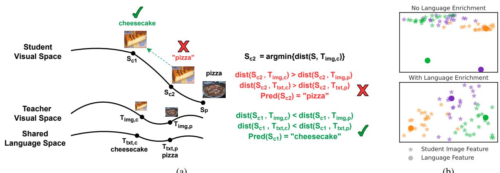
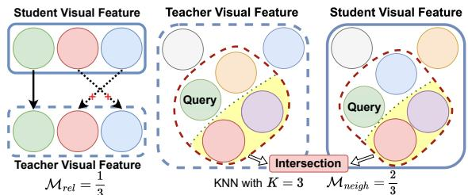
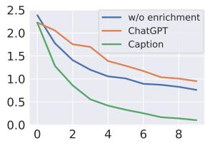
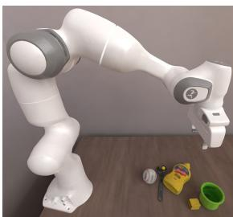

# Distilling Large Vision-Language Model with Out-of-Distribution Generalizability

Xuanlin Li\* Yunhao Fang\* Minghua Liu Zhan Ling Zhuowen Tu Hao Su UC San Diego

## Abstract

Large vision-language models have achieved outstanding performance, but their size and computational requirements make their deployment on resource-constrained devices and time-sensitive tasks impractical. Model distillation, the process of creating smaller, faster models that maintain the performance oflarger models, is a promising direction towards the solution. This paper investigates the distillation of vi sual representations in large teacher vision-language models into lightweight student models using a small- or mid-scale dataset. Notably, this studyfocuses on open-vocabulary outof-distribution (OOD) generalization, a challenging problem that has been overlooked in previous model distillation literature. We propose two principlesfrom vision and language modality perspectives to enhance student’s OOD generalization: (1) by better imitating teacher’s visual representation space, and carefully promoting better coherence in visionlanguage alignment with the teacher; (2) by enriching the teacher’s language representations with informative andfinegrained semantic attributes to effectively distinguish between different labels. We propose several metrics and conduct extensive experiments to investigate their techniques. The results demonstrate significant improvements in zero-shot andfew-shot student performance on open-vocabulary outof-distribution classification, highlighting the effectiveness ofour proposed approaches. Code released at this link.

## 1. Introduction

In recent years, there has been a significant growth and development of large vision language models (large VLMs) such as CLIP [39], GLIP [28], OFA [49], SimVLM [53], BEiT [50], Florence [60], and Flamingo [1], which have been pretrained on massive amounts of internet-scale data. These models have demonstrated enormous potential in a wide range of downstream applications, including classification/detection, image-to-text generation, and visionlanguage reasoning, especially for the out-of-distribution (OOD) samples and open-vocabulary settings. Despite their potential, the large model sizes, high computational resource requirements, and inefficient inference speed of these models restrict their deployment on mobile and IoT edge devices [21, 44], as well as in scenarios like robotic control [4] that require rapid network inference. Thus, it would be ideal if we can obtain small and compact models that still possess strong generalizability towards diverse open-set concepts encountered in the real world.

We note that the internet-scale data has endowed foundation models with well-aligned vision and language representation spaces across diverse domains and datasets. Ideally, if such representation spaces can be perfectly distilled into smaller models, the resulting models can naturally possess similar open-set OOD generalization ability as their larger counterparts. However, it is usually not the case, as demonstrated in our later experiments. Therefore, we ask the fol lowing question: How to effectively distill representation spaces of large vision-language teacher models to benefit OOD generalization ofsmaller student models?

In this study, we investigate the principles and techniques for distilling visual representations from large visionlanguage models using small- to mid-scale datasets, with a specific focus on out-of-distribution (OOD) generalization. Although large-scale datasets with image-text pairs exist, as a pioneer work in this direction, we argue that small- to mid-scale datasets has many practical scenarios for vision application researchers (e.g., for robotics), because this is more flexible, allowing for faster research and development cycles with fewer resource dependencies. Additionally, as we shall see, extensive experiments yield a deeper understanding of the representation spaces of vision-language models, which can be beneficial for future tasks like distilling image-based foundation models for detection [22, 49], segmentation [24, 10], and other data modalities like 3D geometries [58, 36, 29]. To keep study focused and fundamental, we also choose the image classification task to explore many possible strategies.

Based on extensive experimental results, we propose to preserve the internal structure of the representation spaces. Specifically, we propose techniques to maintain the relation ship between the visual and language representation spaces of the teacher models and a novel strategy to enhance the text representation used during distillation. Across our study, we make the following contributions:

  
(a)  
(b)  
Figure 1: (a) Illustration of better teacher-student visual space alignments, motivated by our finding that achieving precise matching between teacher and student’s high-dimensional visual spaces is inherently challenging. While the student cheesecake image feature $S _ { \mathrm { c } 2 }$ minimizes its distance to the teacher’s cheesecake image feature, it is even closer to the teacher’s pizza image feature. This discrepancy results in poor coherence in visual space and vision-language alignment with the teacher, causing classification mistakes. By replacing the “minimizing distance” requirement with the “relative distance” requirement, which encourages student visual features to be closer to their corresponding teacher visual features than other teacher visual features, we greatly enhance visual space and vision-language alignment coherency with the teacher, thereby improving OOD generalization. (b) UMAP embeddings of student visual features and text features before and after language representation enrichment with LLMs. Different colors denote different OOD classes on tiered-ImageNet. Language representation enrichment confers better clusterings of image features around their corresponding text features, enhancing OOD generalization.

1) We motivate the ability for students to generalize towards out-of-distribution (OOD) concepts by designing several metrics that measure the visual representation space consistency and the vision-language alignment consistency between the student and the teacher vision-language model.

2) We find that by better imitating teacher’s visual representation space, and carefully promoting better coherence in vision-language alignment with the teacher, we substantially strengthen student’s OOD generalization ability.

3) We further improve student’s OOD generalization ability by enriching teacher’s language representations with more informative, finegrained, and meaningful semantic attributes to effectively distinguish between different labels.

4) We conduct a thorough experimental analysis to understand the efficacy and impact of our techniques on students OOD generalization ability.

## 2. Related Work

Vision-Language Models (VLMs). Recent years have witnessed tremendous progress on vision language models [39, 28, 49, 53, 50, 60, 1]. Various lines of approaches have been proposed to improve the downstream task performance of VLMs, such as prompt learning [65, 59, 61, 66], prompt engineering [38, 19, 30], and finetuning via visionlanguage fusion [43, 51, 25]. Different from these works that utilize existing VLMs on downstream tasks, our work studies distilling large VLM’s feature space structures towards smaller student networks. Specifically, we investigate principles that effectively leverage the visual representation spaces and vision-language alignments in large VLMs to enhance the OOD generalization ability of students.

Network Distillation on VLMs. The teacher-student distillation framework [20] aims to distill teacher model knowledge into student models, thereby improving their downstream task performance. A classic setting considers teachers and students to be vision-only. In particular, distilling image representations from teacher visual backbones, such as CNNs [17] and Vision Transformers [12], have been well-studied [47, 34, 31, 6, 46, 37, 14, 56]. With the success of large-scale VLMs, recent works start to distill their powerful multimodal visual and language representations towards various downstream tasks, such as object detection [15, 32], visual-language reasoning [52, 8, 13], scene understanding [36], or adopt distillation during vision language model pretraining to further enhance their performance [26, 27, 11, 64, 45].

As the real world is full of concepts unseen during model training, it is essential for student models to attain strong OOD generalization capabilities. However, prior works have rarely carefully studied how to design distillation approaches to enhance such ability. In this work, we propose principles and approaches to improve student’s OOD generalization ability, and we carefully analyze their efficacies through various metrics and extensive experiments.

## 3. Overview

Problem Setup. We distill a large vision-language teacher model T (e.g., CLIP ViT-L/14) to a small student image model $S \left( \mathrm { e . g . } \right.$ ., ResNet18) by focusing on out-of-distribution (OOD) generalization for open-vocabulary object classification. We choose small- or mid-scale datasets to achieve the distillation so that the distillation process is flexible for fast research cycle and has less resource dependency.

The teacher consists of an image encoder $T _ { \mathrm { i m g } } ( \cdot )$ and a text encoder $T _ { \mathrm { t x t } } ( \cdot )$ . During distillation, we keep the flexibility of the existing teacher text encoder for the open-set setting, and we let the student model S be vision-only, i.e., $S = S _ { \mathrm { i m g } }$ Through this process, we hope that S not only achieves high prediction accuracy on seen labels $\mathcal { V } _ { \mathrm { i d } }$ , but also attains strong generalization ability on out-of-distribution labels $\mathcal { D } _ { \mathrm { o o d } }$ . In addition, we train students from scratch to avoid label contamination, allowing us to more carefully assess and understand their OOD generalization ability.

Experiment Setup. We are given a training (distillation) dataset $\mathcal { X } _ { \mathrm { t r a i n } }$ , an in-distribution evaluation dataset $\mathcal { X } _ { \mathrm { i d } }$ , and an out-of-distribution evaluation dataset $\mathcal { X } _ { \mathrm { o o d } }$ . Each dataset consists of image-label pairs $\{ ( { \bf x } , y ) \}$ . For $( \mathbf { x } , y ) \in \mathcal { X } _ { \mathrm { t r a i n } } \cup$ $\mathcal { X } _ { \mathrm { i d } } .$ , we have $y \in \mathcal { V } \mathrm { i d }$ , and for $( \mathbf { x } , y ) \ \in \ \mathcal { X } _ { \mathrm { o o d } }$ , we have $y \in \mathcal { D } _ { \mathrm { o o d } }$ , where $\mathcal { D } _ { \mathrm { i d } } , \mathcal { D } _ { \mathrm { o o d } }$ denote in-distribution and outof-distribution label sets, and $y _ { \mathrm { i d } } \cap y _ { \mathrm { o o d } } = \emptyset$ . We evaluate the student on $\mathcal { X } _ { \mathrm { i d } } .$ , along with zero-shot and few-shot generalization on $\mathcal { X } _ { \mathrm { o o d } }$ . For few-shot learning, we finetune our student models (we will show later in our ablation study that finetuning achieves much higher performance on $\mathcal { X } _ { \mathrm { o o d } }$ than training-free retrieval). We also adopt balanced training batches where at most half of samples come from few-shot data and the rest from $\mathcal { X } _ { \mathrm { t r a i n } }$ . This strategy leads to similar performance on $\mathcal { X } _ { \mathrm { i d } }$ before and after finetuning.

We adopt a diverse collection of recognition tasks using small to medium-scale datasets, including Caltech-Birds [55], StanfordCars [23], Flower102 [35], Food101 [3], SUN397 [57], and tiered-ImageNet [40, 9]. We split the dataset labels such that $| \mathcal { V } _ { \mathrm { i d } } | ~ = ~ | \mathcal { V } _ { \mathrm { o o d } } |$ , except tiered-ImageNet, which comes with an existing split.

Organization of Exposition. Like other papers on understanding neural network behaviors [16, 2, 18, 48], we will propose techniques and invent metrics to help understand the effectiveness of each technique. Following the organization of a representative work of this kind [62], we present different techniques in a waterfall style and organize the presentation of each technique by grouping the approach, metric, and results together.

Approach Overview. Our approach aims to preserve the structure of the visual representation space and its relationship with the text representation space inherited from the teacher model to enhance the student’s OOD generalization ability. Specificially, (1) In Sec. 4, we show that by better imitating teacher’s visual representation space, and carefully promoting better coherence in vision-language alignment with the teacher, students achieve substantially better OOD generalization. (2) In Sec. 5, we show that by enriching teacher’s language representations, there are more meaningful attributes to effectively distinguish between different labels, thereby further enhancing student’s OOD generalization ability. A summary of our main experimental findings is illustrated in Fig. 1.

## 4. Teacher-Student Visual Space and Vision-Language Alignments

## 4.1. Better Imitating Teacher’s Visual Representation Space

Naive baseline without visual space alignment between teacher and student. A straightforward approach to training a student model is to directly align its visual representation with teacher’s language representation through only the following contrastive loss:

$$
\begin{array} { r l } & { \mathcal { L } _ { \mathrm { c l s } } ( \mathbf { x } , y ) = \displaystyle \sum _ { y ^ { \prime } } - \mathbf { 1 } _ { y ^ { \prime } = y } \log P _ { S } ( y ^ { \prime } | \mathbf { x } ) } \\ & { P _ { S } ( y | \mathbf { x } ) = \frac { \exp ( \cos ( S ( \mathbf { x } ) , T _ { \mathrm { t x t } } ( l ( y ) ) ) / \tau ) } { \displaystyle \sum _ { y ^ { \prime } \in \mathcal { V } } \exp ( \cos ( S ( \mathbf { x } ) , T _ { \mathrm { t x t } } ( l ( y ^ { \prime } ) ) ) / \tau ) } } \end{array}\tag{1}
$$

Here τ is the temperature parameter. $S ( \mathbf { x } )$ denotes the feature of x extracted by a student image model S. $l ( y ) =$ prompt + description(y) is a language generation function that maps the label y to its natural language representation, which consists of a prompt and a description of $y .$ For this baseline, we use the suggested prompt “A photo of $\mathbf { a } ^ { \prime \prime }$ from the CLIP paper, and let description(y) to be simply the class label name (e.g., “lotus”). From here on, we assume that all teacher and student representations are normalized, i.e., $\begin{array} { r } { S ( \mathbf { x } )  \frac { S ( \mathbf { x } ) } { \vert \vert S ( \mathbf { x } ) \vert \vert _ { 2 } } , T _ { \mathrm { \mathrm { t x t } } } ( l ( \bar { y } ) )  \frac { T _ { \mathrm { \mathrm { t x t } } } ( l ( y ) ) } { \vert \vert T _ { \mathrm { t x t } } ( l ( y ) ) \vert \vert _ { 2 } } } \end{array}$ . In this case, $\begin{array} { r } { \cos ( S ( \mathbf x ) , T _ { \mathrm { t x t } } ( l ( y ) ) ) = 1 - { \frac { | | S ( \mathbf x ) - T _ { \mathrm { t x t } } ( l ( y ) ) | | _ { 2 } ^ { 2 } } { 2 } } } \end{array}$

Training student models solely using $\mathcal { L } _ { \mathrm { c l s } }$ does not enforce similarity between teacher and student visual representation space structures. Consequently, student visual space structures tend to overfit to training labels, hindering their OOD generalizability. This motivates us to introduce auxiliary losses to align teacher and student visual representation spaces, which we will describe next.

Directly fitting teacher visual features. We note that teacher’s visual representation space is well-aligned with language across diverse datasets, and such alignment demonstrates strong generalization across many domains. By imitating teacher’s visual space structure, we hope to enhance the ability for student’s visual space to generalize and extrapolate towards unseen concepts, thereby implicitly enhancing the generalizability of student’s vision-language alignment and improving its OOD generalization.

<table><tr><td></td><td>CaltechBirds</td><td>StanfordCars</td><td>Flower102</td><td>Food101</td><td>SUN397</td><td>tiered-ImageNet</td><td>Average</td></tr><tr><td>CLIP ViT-L/14</td><td>70.0 / 70.5</td><td>79.3 / 78.3</td><td>74.4 / 84.1</td><td>90.5 / 91.2</td><td>72.8 / 74.4</td><td>71.1 /76.3</td><td>76.4 / 79.1</td></tr><tr><td>CLIP RN50</td><td>57.1 / 56.4</td><td>53.2 / 56.3</td><td>59.3 / 65.3</td><td>76.5 / 78.3</td><td>65.0 / 66.3</td><td>55.7 / 62.0</td><td>61.1 / 64.1</td></tr><tr><td>Closed-Set Classification</td><td>48.1 / NA / 18.1</td><td>27.9 /NA/10.1</td><td>77.1/NA/45.0</td><td>71.7 /NA/30.3</td><td>57.8 /NA /31.1</td><td>63.4 /NA/31.2</td><td>57.7 /NA/27.6</td></tr><tr><td> ${ \mathcal { L } } _ { \mathrm { c l s } }$ </td><td>61.0 / 14.2 / 34.9</td><td>56.3 / 14.7 / 20.0</td><td>81.2 / 4.5 / 46.2</td><td>72.2 / 16.1 / 24.5</td><td>57.5 / 13.6 / 28.6</td><td>64.4 / 13.9 / 27.5</td><td>65.4 / 12.8 / 30.3</td></tr><tr><td> ${ \mathcal { L } } _ { \mathrm { m s e } }$ </td><td>27.0 / 12.0 / 14.3</td><td>5.5 / 3.8 / 4.0</td><td>48.1 / 7.3 / 15.0</td><td>45.0 / 17.0 / 19.3</td><td>24.3 / 11.0 / 14.5</td><td>49.3 / 14.8 / 23.2</td><td>33.2 / 11.0 / 15.1</td></tr><tr><td> $\mathcal { L } _ { \mathrm { c l s } } + \mathcal { L } _ { \mathrm { m s e } }$ </td><td>63.7 / 17.4 / 36.2</td><td>62.2 / 18.8 / 35.1</td><td>82.6 / 6.3 / 46.0</td><td>72.3 / 19.0 / 35.5</td><td>57.1 / 15.3 / 29.4</td><td>66.2 / 14.9 / 28.5</td><td>67.4 / 15.3 / 35.1</td></tr><tr><td>Lim-cst</td><td>42.1 / 21.3 / 29.1</td><td>33.2 / 13.7 / 20.0</td><td>54.8 / 13.3 / 27.3</td><td>70.0 / 34.9 / 36.8</td><td>45.2 / 22.8 / 27.2</td><td>46.3 / 22.8 / 30.8</td><td>48.6 / 21.5 / 28.5</td></tr><tr><td> ${ \mathcal { L } } _ { \mathrm { c l s } } + { \mathcal { L } } _ { \mathrm { i m - c s t } }$ </td><td>60.9 / 20.4 / 37.6</td><td>59.6 / 18.3 / 31.2</td><td>82.4 / 12.7 / 52.5</td><td>74.0 / 30.5 / 42.0</td><td>62.5 / 18.8 / 35.2</td><td>64.4 / 18.0 / 33.5</td><td>67.3 / 19.8 / 38.7</td></tr><tr><td> ${ \mathcal { L } } _ { \mathrm { c l s } } + { \mathcal { L } } _ { \mathrm { i m - c s t } } + { \mathcal { L } } _ { \mathrm { m s e } }$ </td><td>62.5 / 20.8 / 39.0</td><td>59.6 / 19.0 / 33.1</td><td>82.6 / 12.0 / 48.7</td><td>75.0 / 31.2 / 42.0</td><td>60.0 / 19.8 / 35.2</td><td>67.0 / 19.4 / 34.6</td><td>67.8 / 20.3 / 38.8</td></tr><tr><td> ${ \mathcal { L } } _ { \mathrm { c l s } } + { \mathcal { L } } _ { \mathrm { i m - c s t } } + { \mathcal { L } } _ { \mathrm { v l p r o x } } ( + { \mathcal { L } } _ { \mathrm { m s c } } ) ^ { 1 }$ </td><td>62.3 / 21.6 / 39.0</td><td>63.9 / 19.8 / 38.5</td><td>82.7 / 14.6 / 52.0</td><td>74.3 / 32.0 / 43.2</td><td>61.7 / 21.5 / 34.7</td><td>67.5 / 20.5 / 35.3</td><td>68.7 / 21.7 / 40.5</td></tr><tr><td> ${ \mathcal { L } } _ { \mathrm { i m - c s t } } + { \mathcal { L } } _ { \mathrm { v l p r o x } } ( + { \mathcal { L } } _ { \mathrm { m s c } } )$ </td><td>45.3 / 21.9 / 30.4</td><td>46.5 / 17.8 / 26.9</td><td>66.9 / 13.5 / 35.4</td><td>71.4 / 35.2 / 40.0</td><td>52.0 / 23.1 / 28.8</td><td>57.5 / 23.0 / 33.2</td><td>56.6 / 22.4 / 32.5</td></tr></table>

Table 1: Comparison between student models trained without teacher-student visual representation space alignment $( \mathcal { L } _ { \mathrm { c l s } }$ only), with direct teacher visual feature fitting $\left( + \mathcal { L } _ { \mathrm { m s e } } \right)$ , with improved teacher-student visual space alignment $\left( + { \mathcal { L } } _ { \mathrm { i m - c s t } } \right)$ , and with improved preservation of teacher’s vision-language alignment structure $( + \mathcal { L } _ { \mathrm { v l p r o x } } )$ . We adopt ResNet18 as the student and CLIP ViT-L/14 as the teacher. The three numbers $x _ { 1 } / x _ { 2 } / x _ { 3 }$ in each entry denote the evaluation performance on $\mathcal { X } _ { \mathrm { i d } } ,$ , zero-shot performance on $\mathcal { X } _ { \mathrm { o o d } } .$ , and 5-shot performance on $\mathcal { X } _ { \mathrm { o o d } } .$ , respectively (“NA”=not applicable). As reference, we also report CLIP performance $( x _ { 1 } / x _ { 2 }$ in each entry denote zero-shot results on $\mathcal { X } _ { \mathrm { i d } }$ and $\mathcal { X } _ { \mathrm { o o d } } )$ , along with a closed-set classfication baseline that uses separate classifiers for $\mathcal { V } _ { \mathrm { i d } }$ and $\mathcal { D } _ { \mathrm { o o d } }$ . Note that CLIP was pretrained on LAION [42], where the training image-text pairs contain many concepts similar to those in ${ \mathcal { N } } _ { \mathrm { i d } }$ and $\mathcal { D } _ { \mathrm { o o d } }$ , resulting in higher evaluation performance on $\mathcal { X } _ { \mathrm { o o d } }$
<table><tr><td></td><td>Food101</td><td>SUN397</td></tr><tr><td>Lmse</td><td>0.24 / 28.4°</td><td>0.36 / 34.9°</td></tr><tr><td>Lmse (RN50)</td><td>0.24 / 28.4°</td><td>0.35 / 34.4°</td></tr><tr><td>Lcls + Lmse</td><td>0.45 / 39.2°</td><td>0.71 / 49.8°</td></tr><tr><td> $\mathcal { L } _ { \mathrm { c l s } } + \mathcal { L } _ { \mathrm { m s e } } + \mathcal { L } _ { \mathrm { i m - c s t } }$ </td><td>0.65 / 47.6°</td><td>0.82 / 53.8°</td></tr><tr><td> ${ \mathcal { L } } _ { \mathrm { c l s } } + { \mathcal { L } } _ { \mathrm { i m - c s t } }$ </td><td>1.29 / 69.2°</td><td>1.28 / 68.9°</td></tr></table>

Table 2: Average MSE / degree difference between student visual features and teacher visual features for students trained with different strategies. We adopt ResNet18 as student and CLIP ViT-L/14 as teacher, except $^ { \circ \circ } { \mathcal { L } } _ { \mathrm { m s e } }$ (RN50)”, where the student is ResNet50, and the teacher is CLIP ResNet50. We find that it is very challenging for students to precisely match teacher’s visual features through $\mathcal { L } _ { \mathrm { m s e } }$ . Moreover, in conjunction with Tab. 1, we find that a lower visual feature MSE is not necessary for better student OOD generalization.

A direct approach to achieve this is to align the teacher and student visual representations through the Mean Squared-Error (MSE) loss:

$$
\mathcal { L } _ { \mathrm { m s e } } ( \mathbf { x } ) = | | S ( \mathbf { x } ) - T _ { \mathrm { i m g } } ( \mathbf { x } ) | | _ { 2 } ^ { 2 }\tag{2}
$$

In Tab. 1, we show that adding $\mathcal { L } _ { \mathrm { m s e } }$ on top of $\mathcal { L } _ { \mathrm { c l s } }$ improves student OOD generalization. However, upon further examination, we find that students face significant challenges in precisely reproducing teacher’s visual representations, as evidenced by the substantial errors shown in Tab. 2. Such errors persist even when the student and teacher networks possess the same representation power (e.g., both ResNet50 networks). This phenomenon highlights that achieving precise matching between teacher and student’s high-dimensional visual feature spaces is inherently challenging, which can be attributed to differences in weight initialization, training data, and the presence of local minima in the loss landscape. Moreover, we later find that when students struggle to precisely match teacher’s visual features, they also struggle to preserve teacher’s local visual space structure and relative visual feature relationship between different images, hindering their OOD generalization ability.

Better imitating teacher visual representation space. Since precisely matching teacher’s visual features is inherently challenging, we propose to augment the training objective with the following contrastive loss, which “softly” matches teacher’s visual features:

$$
\mathcal { L } _ { \mathrm { i m - c s t } } ( \mathbf { x } ) = \frac { \exp ( - | | S ( \mathbf { x } ) - T _ { \mathrm { i m g } } ( \mathbf { x } ) | | _ { 2 } ^ { 2 } / \tau ) } { \sum _ { \mathbf { x } ^ { \prime } } \exp ( - | | S ( \mathbf { x } ) - T _ { \mathrm { i m g } } ( \mathbf { x } ^ { \prime } ) | | _ { 2 } ^ { 2 } / \tau ) }\tag{3}
$$

By combining $\mathcal { L } _ { \mathrm { i m - c s t } }$ with ${ \mathcal { L } } _ { \mathrm { c l s } } .$ , we observe in Tab. 1 that the student exhibits significantly better zero-shot and few-shot OOD generalization ability across different datasets. Interestingly, such improvement is accompanied by a larger distance between student and teacher visual features, as shown in Tab. 2. This finding suggests that a lower MSE visual feature matching loss, which only captures the absolute distance to teacher’s visual features, does not necessarily imply better visual space consistency. This is because MSE does not con sider the coherence ofrelative visualfeature relationships or local visual space structures between teacher and student.

In the following paragraphs, we will develop several metrics to better assess the teacher-student visual space consistency. These metrics provide us with valuable insights into how $\mathcal { L } _ { \mathrm { i m - c s t } }$ facilitates students to achieve closer visual space proximity to the teacher while yielding a deeper understanding of the teacher’s visual representation space.

Quantifying teacher-student visual space alignment. To quantify how student models preserve teacher’s visual representation space structures, we propose two metrics. For the first metric, we are motivated by the fact that if the relative relationships among teacher’s visual representations are preserved, then for an image $\mathbf { x } , S ( \mathbf { x } )$ tends to be the closest to $T _ { \mathrm { i m g } } ( \mathbf { x } )$ rather than $T _ { \mathrm { i m g } } ( \mathbf { x } ^ { \prime } )$ of some other image $\mathbf { x } ^ { \prime } \neq \mathbf { x } .$ . The latter scenario tends to break the relative feature relationship between x and $\mathbf { x } ^ { \prime }$ that is originally present in the teacher, thereby causing the student to have distinct visual feature manifold structure from the teacher, as illustrated in Fig. 2(a). Furthermore, if $S ( \mathbf { x } )$ is closer to $T _ { \mathrm { i m g } } ( \mathbf { x } ^ { \prime } )$ , then the language feature closest to $S ( \mathbf { x } )$ often differs from the language feature closest to $T _ { \mathrm { i m g } } ( \mathbf { x } )$ , and the latter is typically the ground truth language label. Thus, such discrepancy often results in erroneous label predictions. We can then formally define the first metric as follows:

  
(a) Mrel  
(b) $\mathcal { M } _ { \mathrm { n e i g h } }$  
Figure 2: Illustrations of $\mathcal { M } _ { \mathrm { r e l } }$ and $\mathcal { M } _ { \mathrm { n e i g h } }$ that measure the coherence of relative visual feature relationship and local visual space structure between the student and teacher. Each color corresponds to a single image. In (a), arrows indicate the nearest neighbors from student’s visual space to teacher’s visual space. Solid lines represent correct matching, while dashed lines indicate incorrect matching. In (b), the green circle represents a query image, and the red dashed regions represent the k-nearest neighbors (kNN) in both spaces. We measure the intersection between the two kNN sets.

$$
\mathcal { M } _ { \mathrm { r e l } } ( \mathcal { X } ) = \frac { \sum _ { i = 1 } ^ { | \mathcal { X } | } \mathbf { 1 } [ i = \mathrm { a r g m i n } _ { j } | | T _ { \mathrm { i m g } } ( \mathbf { x } _ { j } ) - S ( \mathbf { x } _ { i } ) | | _ { 2 } ^ { 2 } ] } { | \mathcal { X } | }\tag{4}
$$

The second metric measures the proximity between local neighborhoods of student visual features and teacher visual features. That is, for each image, how much the k images whose features have the closest proximity to it (excluding itself) overlap between the student and the teacher (see Fig. 2b for illustration). We can define this metric as follows:

$$
\mathcal { M } _ { \mathrm { n e i g h } } ( \mathcal { X } , k ) = \frac { \sum _ { i = 1 } ^ { | \mathcal { X } | } \left| \mathrm { K N N } ( S , \mathbf { x } _ { i } , k ) \cap \mathrm { K N N } ( T _ { \mathrm { i m g } } , \mathbf { x } _ { i } , k ) \right| } { k \left| \mathcal { X } \right| }\tag{5}
$$

Here $\mathrm { K N N } ( S , \mathbf { x } _ { i } , k ) = \{ \mathrm { a r g b o t t o m k } _ { j } | | S ( \mathbf { x } _ { j } ) - S ( \mathbf { x } _ { i } ) | | _ { 2 } \}$ outputs the k nearest-neighbor image-ids of $S ( \mathbf { x } _ { i } )$ , and $\mathrm { K N N } ( T _ { \mathrm { i m g } } , { \bf x } _ { i } , k )$ is defined similarly. This metric is complementary to $\mathcal { M } _ { \mathrm { r e l } }$ as it only requires the set of neighbor image ids to be identical between the student and the teacher, and does not enforce these neighbor images to have the same relative feature relationships.

<table><tr><td> $\mathcal { M } _ { \mathrm { r e l } } \uparrow \mid \mathcal { M } _ { \mathrm { n e i g h } } \uparrow$ </td><td>一  $\mathcal { X } _ { \mathrm { t r a i n } }$ </td><td> $\mathcal { X } _ { \mathrm { o o d } }$  一</td><td> $k = 3$ </td><td> $k = 5$ </td><td> $k = 1 0$ </td></tr><tr><td> $\mathcal { L } _ { \mathrm { c l s } } + \mathcal { L } _ { \mathrm { m s c } }$ </td><td>0.030</td><td>0.004</td><td>0.13 / 0.06</td><td>0.18 / 0.07</td><td>0.27 / 0.08</td></tr><tr><td> ${ \mathcal { L } } _ { \mathrm { c l s } } + { \mathcal { L } } _ { \mathrm { m s c } } + { \mathcal { L } } _ { \mathrm { i m - c s t } }$ </td><td>0.305</td><td>0.022</td><td>0.20 / 0.10</td><td>0.25 / 0.11</td><td>0.34 / 0.13</td></tr></table>

Table 3: We evaluate $\mathcal { M } _ { \mathrm { r e l } }$ (middle 2 columns) and $\mathcal { M } _ { \mathrm { n e i g h } }$ (right 3 columns) on different students to measure their coherence with teacher’s relative visual feature relationships and local visual feature structures (higher the better). For Mneigh, $x _ { 1 } / x _ { 2 }$ in each entry denote $\mathcal { M } _ { \mathrm { n e i g h } } ( \mathcal { X } _ { \mathrm { t r a i n } } )$ and $\mathcal { M } _ { \mathrm { n e i g h } } ( \mathcal { X } _ { \mathrm { o o d } } )$ respectively. Metrics are evaluated on Flower102. More results in Appendix.

$\mathcal { L } _ { \mathrm { i m - c s t } }$ improves teacher-student visual space alignments through better relative and local visual space coherence. We assess $\mathcal { M } _ { \mathrm { r e l } }$ and $\mathcal { M } _ { \mathrm { n e i g h } }$ on different students and present the results in Tab. 3. We find that students trained solely with ${ \mathcal { L } } _ { \mathrm { m s e } }$ and without $\mathcal { L } _ { \mathrm { i m - c s t } }$ exhibit poor values for both $\mathcal { M } _ { \mathrm { r e l } }$ and $\mathcal { M } _ { \mathrm { n e i g h } }$ . Notably, $\mathcal { M } _ { \mathrm { r e l } } ( \mathcal { X } _ { \mathrm { t r a i n } } )$ is only 0.03, indicating a large discrepancy between student and teacher visual spaces, even on the training set. On the other hand, after incorporating ${ \mathcal { L } } _ { \mathrm { i m - c s t } } .$ , we observe significant improvements of $\mathcal { M } _ { \mathrm { r e l } }$ and $\mathcal { M } _ { \mathrm { n e i g h } }$ on both $\mathcal { X } _ { \mathrm { t r a i n } }$ and $\mathcal { X } _ { \mathrm { o o d } }$ . This demonstrates that the student exhibits much better consistency in relative and local visual structures with the teacher, both for seen and unseen concepts, thereby enhancing the generalization and extrapo lation ability of the student’s visual space. A better-aligned visual space also implicitly enables better generalization and extrapolation in vision-language alignments (which we show later), contributing to improved OOD performance. Furthermore, our findings suggest a broader principle: when students face challenges in precisely matching the teacher’s visual space, the proximity of local visual feature structures and relative visual feature relationships have a greater impact on OOD generalization than the absolute distance to the teacher’s features.

## 4.2. Better Coherence with Teacher’s Vision Language Alignment Structure

Motivation. In Section 4.1, we focused on improving the student’s OOD generalization ability by better aligning studentteacher visual spaces. Since teacher’s visual space is wellaligned with language across diverse concepts and domains, a better student coherence with teacher’s visual space im plicitly leads to better vision-language (V-L) alignments. Naturally, an alternative perspective to improve student’s OOD generalization becomes to enhance its explicit V-L alignments and improve their coherence with the teacher’s, where we previously only used a simple contrastive V-L matching loss $\mathcal { L } _ { \mathrm { c l s } }$ . Another motivation to focus on explicit V-L alignments arises from our finding that they play an essential role to ensure precise and accurate V-L alignments, especially when training on seen concepts or performing few-shot learning on novel concepts. Relying solely on implicit V-L alignments is inadequate in these scenarios. This is evident in Tab. 1, where solely utilizing the visual space alignment loss ${ \mathcal { L } } _ { \mathrm { i m - c s t } }$ yields better performance on 0-shot $\mathcal { X } _ { \mathrm { o o d } }$ (where classes are unseen) but worse performance on $\mathcal { X } _ { \mathrm { i d } }$ and 5-shot $\mathcal { X } _ { \mathrm { o o d } }$ (where classes are seen). On the other hand, by combining both implicit and explicit V-L alignment losses $( \mathcal { L } _ { \mathrm { { i m - c s t } } } + \mathcal { L } _ { \mathrm { { c l s } } } )$ , students excel in all of $\mathcal { X } _ { \mathrm { i d } } , 0 { \mathrm { - s h o t } } \mathcal { X } _ { \mathrm { o o d } } ,$ and 5-shot $\mathcal { X } _ { \mathrm { o o d } }$ scenarios. Therefore, by improving explicit V-L alignments, we not only hope to further enhance student’s 0-shot OOD generalization ability, but also improve their performance on familiar concepts and their ability to few-shot adapt to novel concepts.

Explicitly enhancing teacher-student vision-language alignment coherency. We note that while $\mathcal { L } _ { \mathrm { c l s } }$ performs explicit V-L alignments, it has the limitation of indiscriminately pushing an image away from all non ground-truth language features, therefore disregarding teacher’s relative alignment relationship between the same image and different language features. Furthermore, we find that even though preserving teacher’s relative V-L alignment structure is desirable, it may not always be perfect due to potential misalignments between teacher image features and their corresponding language labels. These misalignments can introduce inconsistent noise during distillation, ultimately harming student performance.

Motivated by these observations, we propose to augment our training objective with $\mathcal { L } _ { \mathrm { v l p r o x } }$ , which effectively and carefully preserves the teacher’s vision-language alignment structure while accounting for potential misalignments:

$$
\begin{array} { r l } & { \mathcal { L } _ { \mathrm { v l p r o x } } ( \mathbf { x } , k ) = I ( \mathbf { x } ) \cdot \mathcal { D } _ { \mathrm { K L } } ( P _ { T , \mathrm { t o p k } } ( \cdot | \mathbf { x } ) | | P _ { S , \mathrm { t o p k } } ( \cdot | \mathbf { x } ) ) } \\ & { \qquad I ( \mathbf { x } ) = \mathbf { 1 } [ \mathrm { a r g m a x } _ { y } P _ { T } ( y | \mathbf { x } ) = \mathrm { l a b e l } ( \mathbf { x } ) ] } \\ & { P _ { \cdot , \mathrm { t o p k } } ( y | \mathbf { x } ) = \frac { \mathbf { 1 } _ { y \in Y _ { \mathrm { t o p k } } } P _ { \cdot } ( y | \mathbf { x } ) } { \sum _ { y \in Y _ { \mathrm { t o p k } } } P _ { \cdot } ( y | \mathbf { x } ) } ; Y _ { \mathrm { t o p k } } = \mathrm { a r g t o p k } _ { y } P _ { T } ( y | \mathbf { x } ) } \end{array}\tag{6}
$$

Here $P _ { T }$ and $P _ { S }$ denote teacher and student label probabilities; $I ( \cdot )$ filters out images misaligned with language labels; and k controls the number of most-similar language features for each image. In our implementations, we find a larger k beneficial for OOD generalization, and we choose $k = 2 5 6$

We demonstrate the effectiveness of $\mathcal { L } _ { \mathrm { v l p r o x } }$ in Tab. 1. We find that by combining $\mathcal { L } _ { \mathrm { v l p r o x } }$ with $\mathcal { L } _ { \mathrm { c l s } }$ and ${ \mathcal { L } } _ { \mathrm { i m - c s t } } .$ , we further improve student’s ability to generalize towards OOD concepts. Interestingly, we also observe that while $\mathcal { L } _ { \mathrm { c l s } }$ and $\mathcal { L } _ { \mathrm { v l p r o x } }$ both explicitly perform V-L alignments, adding them together yields significantly better student performance on $\mathcal { X } _ { \mathrm { i d } }$ and 5-shot $\mathcal { X } _ { \mathrm { o o d } }$ than solely keeping $\mathcal { L } _ { \mathrm { v l p r o x } }$ . This observation is distinct from those in the traditional model distillation literature [20], where distilling teacher logits alone from vision-only models typically produces good student performance.

<table><tr><td> $\mathcal { M } _ { \mathrm { v l a l i g n } } \downarrow$ </td><td> $k = 2$ </td><td> $k = 3$ </td><td> $k = 5$ </td></tr><tr><td> $\mathcal { L } _ { \mathrm { c l s } } + \mathcal { L } _ { \mathrm { m s c } }$ </td><td>0.20 / 0.50</td><td>0.68 / 1.45</td><td>2.67 / 4.73</td></tr><tr><td> ${ \mathcal { L } } _ { \mathrm { c l s } } + { \mathcal { L } } _ { \mathrm { m s c } } + { \mathcal { L } } _ { \mathrm { i m - c s t } }$ </td><td>0.18 / 0.43</td><td>0.62 / 1.3</td><td>2.52 / 4.24</td></tr><tr><td> ${ \mathcal { L } } _ { \mathrm { c l s } } + { \mathcal { L } } _ { \mathrm { m s c } } + { \mathcal { L } } _ { \mathrm { i m - c s t } } + { \mathcal { L } } _ { \mathrm { v l p r o x } }$ </td><td>0.17 / 0.39</td><td>0.59 / 1.17</td><td>2.17 / 4.20</td></tr></table>

Table 4: We evaluate $\mathcal { M } _ { \mathrm { v l a l i g n } }$ (lower the better) on different students to measure their proximity with the teacher visionlanguage alignment structure. $x _ { 1 } / x _ { 2 }$ in each entry denote $\mathcal { M } _ { \mathrm { v l a l i g n } } ( \mathcal { X } _ { \mathrm { t r a i n } } )$ and $\mathcal { M } _ { \mathrm { v l a l i g n } } ( \mathcal { X } _ { \mathrm { o o d } } )$ ), respectively. Metrics are evaluated on Flower102. More results are in Appendix.

Quantifying teacher-student vision-language alignment coherency. To better understand the vision-language align ment proximity between teacher and student, we propose a metric $\mathcal { M } _ { \mathrm { v l a l i g n } }$ to quantify such proximity:

$$
\begin{array} { r l } & { \mathcal { M } _ { \mathrm { v l a l i g n } } ( \mathcal { X } , k ) = \frac { \sum _ { i = 1 } ^ { | \mathcal { X } | } \# \mathrm { r e v e r s e } _ { - \mathrm { p a i r s } } ( \mathrm { a r r } \mathrm { S } ( i , k ) ) } { | \mathcal { X } | } } \\ & { \qquad \mathrm { a r r S } ( i , k ) = [ | | S ( \mathbf { x } _ { i } ) - T _ { \mathrm { t x t } } ( l ( y _ { j } ) ) | | _ { 2 } ] _ { j \in \mathcal { T } ( i , k ) } } \\ & { \qquad \mathcal { Z } ( i , k ) = \mathrm { a r g t o p k } ( [ - | | T _ { \mathrm { i m } } ( \mathbf { x } _ { i } ) - T _ { \mathrm { t x t } } ( l ( y _ { j } ) ) | | _ { 2 } ) ] _ { j = 1 } ^ { | \mathcal { V } | } ) } \end{array}
$$

Here #reverse pairs(·) measures the number of reverse pairs $\{ ( i , j ) : a _ { i } > a _ { j } \}$ in an array. Overall, $\mathcal { M } _ { \mathrm { v l a l i g n } }$ measures the extent to which the distance ordering of the k nearest language features to the teacher image feature differs from the distance ordering of the same k language features with respect to the student image feature. In other words, a lower value of $\mathcal { M } _ { \mathrm { v l a l i g n } }$ indicates a higher degree of proximity to the teacher’s vision-language alignment, as teacher’s relative language orderings with respect to each image becomes better preserved.

We assess $\mathcal { M } _ { \mathrm { v l a l i g n } }$ on different students and present the results in Tab. 4. We find that $\mathcal { L } _ { \mathrm { i m - c s t } }$ not only fosters strong student-teacher visual space alignments, but also implicitly facilitates effective V-L alignments along this process. This observation illustrates that a better relative and local visual space coherence with the teacher (indicated by better $\mathcal { M } _ { \mathrm { r e l } }$ and $\mathcal { M } _ { \mathrm { n e i g h } } )$ can lead to enhanced alignment coherence in the V-L space. Additionally, the inclusion of $\mathcal { L } _ { \mathrm { v l p r o x } }$ further strengthens teacher-student V-L alignments. Such improved alignments are then effectively transferred to unseen concepts, demonstrating that the student has acquired better V-L alignment structures that generalize well to OOD scenarios.

## 5. Language Representation Enrichment

In Sec. 4, we focused on improving the imitation of teacher’s visual space and promoting better coherence with teacher’s vision-language alignment. Throughout this process, we kept the language representations fixed. However, the quality of language representations also plays a pivotal role in student learning and inference. Ideally, language representations should be capture precise, finegrained, and meaningful semantic attributes, such that the student can effectively distinguish between different labels. We therefore ask the following question: can we leverage better and richer teacher language representations to further enhance student’s OOD generalization ability? We propose the following candidate strategies:

<table><tr><td></td><td>CaltechBirds</td><td>StanfordCars</td><td>Flower102</td><td>Food101</td><td>SUN397</td><td>tiered-ImageNet</td><td>Average</td></tr><tr><td>Tab. 1 best (no lang enrichment)</td><td>62.3 / 21.6 / 39.0</td><td> $6 3 . 9 \ : / \ : 1 9 . 8 \ : / \ : 3 8 . 5$ </td><td>82.7 / 14.6 / 52.0</td><td> $7 4 . 3 / 3 2 . 0 / 4 3 . 2$ </td><td>61.7 / 21.5 / 34.7</td><td> $6 7 . 5 / 2 0 . 5 / 3 5 . 3$ </td><td>68.7 / 21.7 / 40.5</td></tr><tr><td>Semantic Details</td><td>62.0 / 23.2 / 40.4</td><td> $6 3 . 6 / 2 0 . 0 / 3 7 . 5$ </td><td> $8 2 . 4 / 1 7 . 6 / 5 2 . 7$ </td><td> $7 4 . 8 / 3 3 . 9 / 4 3 . 7$ </td><td> $6 0 . 8 / 2 3 . 3 / 3 6 . 8 $ </td><td> ${ \bf 6 9 . 8 / } 2 3 . 5 / 3 6 . 2$ </td><td>68.9 / 23.6 / 41.2</td></tr><tr><td>Auxiliary Captions</td><td> ${ \bf 6 2 . 5 / } 2 1 . 4 / 4 1 . 0$ </td><td> $6 5 . 5 / 1 9 . 0 / 3 8 . 1$ </td><td> $8 1 . 9 / 1 4 . 3 / 5 2 . 5$ </td><td> $7 5 . 4 / 3 3 . 3 / 4 4 . 0$ </td><td> $6 1 . 6 / 2 2 . 1 / 3 6 . 9$ </td><td> $6 8 . 7 / 2 1 . 0 / 3 4 . 4$ </td><td> $6 9 . 3 / 2 1 . 9 / 4 1 . 2$ </td></tr><tr><td>Semantics + Caption</td><td> $6 2 . 0 / 2 2 . 7 / 3 9 . 8$ </td><td> $6 4 . 9 \ : / \ : 2 0 . 4 \ : / \ : 3 9 . 7$ </td><td> $8 3 . 7 / 1 8 . 2 / 5 3 . 4$ </td><td> $7 5 . 6 / 3 5 . 7 / 4 2 . 9$ </td><td> $6 1 . 0 / 2 4 . 0 / 3 7 . 5$ </td><td> $6 8 . 9 / 2 3 . 6 / 3 5 . 8$ </td><td>69.4 / 24.1 / 41.5</td></tr></table>

Table 5: Comparison between different language representation enrichment strategies. The three numbers $x _ { 1 } / x _ { 2 } / x _ { 3 }$ in each entry denote the evaluation performance on $\mathcal { X } _ { \mathrm { i d } }$ , zero-shot performance on $\mathcal { X } _ { \mathrm { o o d } }$ , and 5-shot performance on $\mathcal { X } _ { \mathrm { o o d } } .$ respectively.

<table><tr><td></td><td>StanfordCars</td><td>tiered-ImageNet</td></tr><tr><td>No language enrichment</td><td>63.9 / 19.8 / 38.5</td><td> $6 7 . 5 / 2 0 . 5 / 3 5 . 3$ </td></tr><tr><td>Prompt in Tab. 5</td><td>63.3 / 20.0 / 37.5</td><td> ${ \bf 6 9 . 8 / } 2 3 . 5 / 3 6 . 2$ </td></tr><tr><td>More Succinct</td><td>63.0 / 18.9 / 37.6</td><td>68.8 / 23.1 / 36.8</td></tr><tr><td>More Detailed</td><td>62.9 / 19.0 / 35.1</td><td>69.3 / 24.2 / 37.7</td></tr><tr><td>More Distinct</td><td>63.9 / 19.7 / 37.1</td><td>69.2 / 23.3 / 37.0</td></tr></table>

Table 6: Results on leveraging different prompts to control semantic details of label descriptions generated by ChatGPT.

Enriching semantic details of label descriptions by prompting LLMs. Previously, when we generate language representations $l ( y ) = \mathrm { p r o m p t } + \mathrm { d e s c r i p t i o n } ( y )$ for student training, we adopted a simple strategy. In particular, for the description of a label $y ,$ we merely used its label name, e.g., “lotus”. However, these simplistic descriptions overlook many finegrained properties of semantic categories, such as the shape, color, and texture of flowers, along with the description of their petals, leaves, and stems. In addition, we hope to automatically and efficiently generate enriched language descriptions for a wide range of labels, ensuring scalability for an arbitrary number of labels. Motivated by the recent progress on instruction-finetuned large language models (LLMs) [33, 7, 41, 54], which have demonstrated impressive sequence generation abilities given user prompts, we find these models well-suited for our goal. Therefore, we propose to use ChatGPT [5, 33] to generate category descriptions. We prompt ChatGPT with the following instruction: “Use a single sentence to describe the appearance and shape of {cls}. Only describe the shape and appearance”. This allows ChatGPT to generate informative, finegrained, and meaningful descriptions for target classes (e.g., “large, round, flat leaves; tall, slender stems; delicate petals in shades of pink, white, or yellow”), while keeping sequence lengths within CLIP text encoder’s limit. We then set description(y) by concatenating “a photo of $\{ \mathrm { c l s } \} ^ { \ast }$ with ChatGPT-generated class descriptions. We still keep the same vision-language alignment losses $( \mathcal { L } _ { \mathrm { c l s } }$ and $\mathcal { L } _ { \mathrm { v l p r o x } } )$ as before.

Augmenting text through auxiliary captions. Currently, during student training, there is only one language description per category, i.e., $| \{ l ( y ) : ( \mathbf { x } , y ) \in \mathcal { X } _ { \mathrm { t r a i n } } \} | = | \mathcal { Y } _ { \mathrm { i d } } |$

On the other hand, the number of training images significantly exceeds the number of labels, i.e., $| \mathcal { X } _ { \mathrm { t r a i n } } | \gg | \mathcal { V } _ { \mathrm { i d } } |$ We therefore wish to generate language descriptions for each individual image, such that we can substantially enrich the number of language features during student training, which potentially benefits student performance. To achieve this, we propose using OFA [49] to generate captions for each image, resulting in a new dataset $\{ ( \mathbf { x } , \mathrm { c a p } ( \mathbf { x } ) , y ) : ( \mathbf { x } , y ) \in \mathcal { X } _ { \mathrm { t r a i n } } \}$ augmented with captions. During student training, besides using the same vision-language alignment losses ${ \mathcal L } _ { \mathrm { c l s } }$ and $\mathcal { L } _ { \mathrm { v l p r o x } }$ as before, we also adopt the following auxiliary loss:

$$
\mathcal { L } _ { \mathrm { c a p } } ( \mathbf { x } ) = \frac { \exp ( \cos ( S ( \mathbf { x } ) , T _ { \mathrm { t x t } } ( \mathrm { c a p } ( \mathbf { x } ) ) ) / \tau ) } { \sum _ { ( \mathbf { x } ^ { \prime } , y ^ { \prime } ) : y ^ { \prime } \neq y } \exp ( \cos ( S ( \mathbf { x } ) , T _ { \mathrm { t x t } } ( \mathrm { c a p } ( \mathbf { x } ^ { \prime } ) ) / \tau ) }\tag{8}
$$

The loss pushes x and its corresponding caption cap(x) together while pulling away from captions belonging to different categories. Our preliminary experiments show that distinguishing captions belonging to the same category could degrade student performance as they are usually similar. Note that we only incorporate captions for the auxiliary loss during student training. For student inference and label predictions, we continue to use the same l(y) as before.

## 5.1. Analyzing the Efficacy of Different Strategies

We adopt the aforementioned language-enriching strategies for student learning, and we present the results in Tab. 5. We find that combining LLM-enriched label descriptions with auxiliary captions yields the best OOD generalization. However, upon analyzing their individual effectiveness, we find that LLM-enriched label descriptions provide significantly better zero-shot OOD benefit than auxiliary captions, and solely relying on auxiliary captions only marginally improves zero-shot OOD generalizability. Upon further analysis, we find that many generated captions only broadly describe objects and are much less informative than ChatGPTgenerated descriptions for distinguishing fine-grained categories. For instance, in the StanfordCars dataset, a generated caption for an “Acura Integra Type R 2001” image is $\mathbf { \ddot { a } }$ white car is parked in a field”, and solely relying on the white color provides little information to distinguish different car categories. Consequently, captions have limited impact on enhancing the generalizability of student’s vision-language alignment structures.

Given the significant benefits of LLM-enriched label descriptions, we are particularly interested in exploring different prompts to control how ChatGPT generates semantic details and their influence on OOD generalizability. We design the following prompts: More Succinct: “Use a single sentence to broadly describe the appearance and shape of {cls}. Don’t give too much details. Only describe the shape and appearance.” More Detailed: “Use a single sentence and short, simple, descriptive phrases to describe the detailed appearance and detailed shape of {cls}.” More Distinct: “Use a single sentence to describe the unique, distinctive appearance and shape of {cls}. Only describe the unique, distinctive shape and appearance.”

We compare these prompts in Tab. 6. Interestingly, we observe that generating more detailed semantic descriptions on labels does not always perform better. We conjecture that this is because (1) LLM-generated details are not grounded in specific images, causing some attributes to be invisible and confusing the students; (2) the teacher CLIP is trained on LAION [42], where most language descriptions do not contain many finegrained appearance details, so CLIP’s text embeddings are not very sensitive to some of these details. Additionally, we find that explicitly prompting ChatGPT to generate more concise text descriptions could be still helpful. Upon further analysis, we find that the resulting generations remain highly descriptive, albeit with slightly fewer details (e.g., when describing a “trumbone”, the more concise description becomes “a brass instrument with a long cylindrical tube curved into an elongated S shape with a flared bell at the end”, whereas under our original prompt, additional details like “a sliding U-shaped section called the slide” are included).

## 5.2. Comparing Language Representation Spaces Before and After Enrichment

To gain further insights into the efficacy of our language enrichment strategies, in this section, we analyze the changes in language space structures before and after adopting such strategies. On the out-of-distribution evaluation dataset of Flower102, we obtain text features $\{ T _ { \mathrm { t x t } } ( l _ { \mathrm { n e w } } ( y ) ) \} _ { y = 1 } ^ { | \mathcal { V } _ { \mathrm { o o d } } | }$ and $\{ T _ { \mathrm { t x t } } ( l _ { \mathrm { o l d } } ( y ) ) \} _ { y = 1 } ^ { | \mathcal { V } _ { \mathrm { o o d } } | }$ , where $l _ { \mathrm { n e w } }$ denotes the language generation function with LLM enrichment, and $l _ { \mathrm { o l d } }$ uses simple label names as label descriptions. We also obtain the average caption features for each class, namely $\{ \mathrm { m e a n } [ \{ T _ { \mathrm { t x t } } ( \mathrm { c a p } ( \mathbf { x } ) ) : \mathrm { l a b e l } ( \mathbf { x } ) = y \} ] \} _ { y = 1 } ^ { | \mathcal { V } _ { \mathrm { o o d } } | }$ . We then meancenter these 3 sets of text features, perform Singular-Value Decomposition, and plot the resulting eigenvalues in Fig. 3. We observe that language features of $l _ { \mathrm { n e w } }$ contain many more large eigenvalues than $l _ { \mathrm { o l d : } }$ , demonstrating that the text space generated by $l _ { \mathrm { n e w } }$ confers more independent and meaningful attributes to effectively distinguish between different classes. On the other hand, the language space of auxiliary captions only contains a small number of meaningful attributes, indicating that auxiliary captions are not very helpful for distinguishing between different labels. Additionally, in conjunction with Tab. 5, we find that the advantages of richer attributes are concealed when evaluating students on the in-distribution classes, since students tend to overfit the existing attributes of these labels during training. However, for OOD scenarios, the presence of more finegrained attributes allows OOD text features to be more precisely aligned with image features, especially when no vision-language alignment training is done on these OOD samples (see Fig. 1b for an illustration). As a result, students exhibit better OOD generalization ability.

Furthermore, we analyze the average cosine similarity between all pairs of text features within each of the three sets we introduced earlier. We present the results in Tab. 7. We observe that LLM-enriched semantic details allow text features to naturally separate further apart from each other, making it easier to distinguish between different classes. In contrast, auxiliary captions show limited effectiveness in achieving such separation between classes.

  
Figure 3: Top 10 eigenvalues of text features.

<table><tr><td></td><td>|Cos. Sim.</td></tr><tr><td>w/o enrichment|</td><td>0.5156</td></tr><tr><td>ChatGPT</td><td>0.4462</td></tr><tr><td>Caption</td><td>0.5572</td></tr></table>

Table 7: Average cosine similarity between all pairs of text features.

## 6. Ablations and Applications

In this section, we introduce ablation studies to enhance our main findings. We also illustrate an example to adopt our previous findings towards novel tasks and domains.

Different designs on visual space and vision-language alignments. We ablate on our designs of visual space and vision-language alignments and present the results in Tab. 8. We first explore various designs of $\mathcal { L } _ { \mathrm { v l p r o x } }$ , which aims to improve the vision-language alignment coherency with the teacher. We find that enhancing coherency with a greater number of most-similar language features by increasing k improves student OOD generalization. Additionally, it is also beneficial to filter out teacher’s image features that are misaligned with their corresponding language labels. Interestingly, we observe a different pattern when considering the teacher-student visual space alignments. In this case, we did not find filtering out misaligned image features helpful, and imitating the entirety of teacher’s visual space yields better student OOD generalization.

Different student visual backbones. In our prior experiments, we adopted ResNet as our student visual backbone. In this section, we further investigate whether our findings are consistent across different student network architectures. We adopt ViT-B/32 [12] as our student, while keeping CLIP ViT-

<table><tr><td></td><td>Flower102</td><td>tiered-ImageNet</td></tr><tr><td>Main Paper Tab. 5 best</td><td>82.4 / 17.6 / 52.7</td><td> $6 9 . 8 \ : / \ : 2 3 . 5 \ : / \ : 3 6 . 2$ </td></tr><tr><td>No filtering in  $\mathcal { L } _ { \mathrm { v l p r o x } }$ </td><td>83.3 / 16.8 / 51.5</td><td> $6 9 . 6 \ : / \ : 2 3 . 2 \ : / \ : 3 5 . 3$ </td></tr><tr><td> $k = 1 0 \mathrm { f o r } \mathcal { L } _ { \mathrm { v l p r o x } }$ </td><td> $8 3 . 4 / 1 7 . 0 / 5 1 . 4$ </td><td> $6 8 . 4 / 2 2 . 6 / 3 4 . 6$ </td></tr><tr><td> $k = 1 \mathrm { f o r } \mathcal { L } _ { \mathrm { v l p r o x } }$ </td><td> $8 1 . 4 / 1 5 . 9 / 5 1 . 4$ </td><td> $6 6 . 7 / 2 1 . 0 / 3 5 . 4$ </td></tr><tr><td> $\mathrm { W i t h \ f l t e r i n g \ i n } \ \mathcal { L } _ { \mathrm { i m - c s t } }$ </td><td>83.6 / 16.6 / 51.0</td><td> $6 8 . 5 / 2 3 . 1 / 3 3 . 4$ </td></tr></table>

Table 8: Ablation studies on (1) different designs of $\mathcal { L } _ { \mathrm { v l p r o x } } ,$ and (2) whether to imitate the entirety of the teacher’s visual space in ${ \mathcal { L } } _ { \mathrm { i m - c s t } } .$
<table><tr><td> ${ \mathcal { L } } _ { \mathrm { c l s } }$ </td><td>Lim-cst</td><td> $\mathcal { L } _ { \mathrm { v l p r o x } }$ </td><td>Semantics|</td><td>Flower102</td><td>CaltechBirds</td><td>SUN397</td></tr><tr><td>√</td><td></td><td></td><td></td><td>77.9 / 5.3 / 31.3</td><td>19.7 / 6.2 / 10.639.6 / 8.6 / 13.5</td><td></td></tr><tr><td>√</td><td>√</td><td></td><td></td><td></td><td>78.1 / 11.0 / 46.0 21.5 / 7.7 / 11.1 44.2 / 13.7 / 18.3</td><td></td></tr><tr><td>√</td><td>√</td><td></td><td> $\begin{array} { l } { \surd } \\ { \surd } \end{array}$ </td><td></td><td>77.8 / 11.9 / 46.5 22.2 / 8.8 / 12.7 44.3 / 14.7 / 19.5</td><td></td></tr><tr><td>√</td><td>√</td><td>√</td><td></td><td></td><td></td><td>78.9 / 13.1 / 47.7 22.2 / 8.5 / 13.1 45.0 / 15.4 / 21.0</td></tr></table>

Table 9: Distilling CLIP ViT-L/14 into a student ViT-B/32 network. In each entry, $x _ { 1 } / x _ { 2 } / x _ { 3 }$ denote $\mathcal { X } _ { \mathrm { i d } }$ / zero-shot $\mathcal { X } _ { \mathrm { o o d } }$ / 5-shot $\mathcal { X } _ { \mathrm { o o d } }$ performance.
<table><tr><td></td><td>CaltechBirds</td><td>SUN397</td><td>tiered-ImageNet</td></tr><tr><td>5-shot Finetune</td><td>40.36</td><td>36.81</td><td>36.17</td></tr><tr><td>5-shot Retrieval</td><td>24.39</td><td>24.40</td><td>24.27</td></tr></table>

Table 10: Comparison between finetuning student visual backbone vs. training-free retrieval on $\mathcal { X } _ { \mathrm { o o d } }$ . Finetuning student backbones significantly outperforms training-free retrieval.

L/14 as our VLM teacher. Results are shown in Tab. 9. We observe that even though we apply strong data augmentations (RandAugment) when training the student ViT-B/32, it still suffers from severe overfitting (the training accuracy on $\mathcal { X } _ { \mathrm { t r a i n } }$ is > 90%, which is significantly higher than the accuracy on $\mathcal { X } _ { \mathrm { i d } }$ in Tab. 9). The in-distribution and OOD generalization performance of the ViT-B/32 student are also worse than the ResNet student. Nevertheless, we still observe that better teacher-student visual space alignment, improved coherence in vision-language alignment, and language representation enrichment all enhance student’s OOD generalization ability, aligning with our previous findings.

Few-shot learning strategies on $\mathcal { X } _ { \mathbf { o o d } }$ . Previously, we finetune the student visual networks during few shot learning on $\mathcal { X } _ { \mathrm { o o d } }$ . Alternatively, we could adopt a finetune-free retrievalbased strategy like [63], which has been shown effective on large VLMs. We compare these two strategies in Tab. 10. Further implementation details are presented in Appendix. Interestingly, we observe that the retrieval-based strategy significantly underperforms finetuning student visual backbones. We hypothesize that this phenomenon arises because our student networks are trained on small to medium-scale datasets, and have been exposed to far fewer concepts than their teacher VLMs. Consequently, student’s image feature structure and vision-language alignment structure are less generalizable on OOD concepts, making them less suitable for retrieval-based approaches.

<table><tr><td></td><td> $\mathcal { X } _ { \mathrm { i d } }$ </td><td> $\mathcal { V } _ { \mathrm { i d } } \ \mathrm { o n } \ \mathcal { X } _ { \mathrm { o o d } }$ </td><td> $\mathcal { V } _ { \mathrm { o o d } } \ \mathrm { o n } \ \mathcal { X } _ { \mathrm { o o d } }$ </td></tr><tr><td>Closed-Set</td><td> $9 6 . 4 / 9 6 . 5 $ </td><td> $\mathrm { N A } / 8 6 . 2$ </td><td> $\mathrm { N A } / 8 7 . 7$ </td></tr><tr><td> ${ \mathcal { L } } _ { \mathrm { c l s } }$ </td><td> $9 6 . 9 / 9 7 . 2 $ </td><td> $7 9 . 3 / 8 5 . 3 $ </td><td> $7 1 . 7 / 8 7 . 3 $ </td></tr><tr><td> $+ \mathcal { L } _ { \mathrm { i m - c s t } }$ </td><td>99.2 / 99.2</td><td> $8 4 . 0 / 9 1 . 9 $ </td><td> $7 6 . 3 / 8 8 . 3 $ </td></tr><tr><td>+ Semantic Enrich</td><td> $9 8 . 2 / 9 9 . 0 $ </td><td>84.3 / 92.0</td><td>83.0 / 89.6</td></tr></table>

(a) Overall accuracy over all YCB objects
<table><tr><td></td><td> $\mathcal { X } _ { \mathrm { i d } }$ </td><td> $\mathcal { V } _ { \mathrm { i d } } \ \mathrm { o n } \ \mathcal { X } _ { \mathrm { o o d } }$ </td><td> $\mathcal { V } _ { \mathrm { o o d } } \ \mathrm { o n } \ \mathcal { X } _ { \mathrm { o o d } }$ </td></tr><tr><td>Closed-Set</td><td> $9 1 . 6 / 9 1 . 9$ </td><td> $\mathrm { N A } / 5 7 . 8$ </td><td> $\mathrm { N A } / 3 5 . 9$ </td></tr><tr><td> ${ \mathcal { L } } _ { \mathrm { c l s } }$ </td><td>94.0 / 94.4</td><td> $4 6 . 5 / 5 4 . 7$ </td><td>23.3 / 32.8</td></tr><tr><td> $+ \mathcal { L } _ { \mathrm { i m - c s t } }$ </td><td>98.1 / 98.0</td><td>55.3 / 70.8</td><td>23.7 / 47.3</td></tr><tr><td>+ Semantic Enrich</td><td> $9 7 . 2 / 9 7 . 4 $ </td><td>55.6 / 70.8</td><td>11.7 / 50.7</td></tr></table>

(b) F1-measure over objects that exist in observations.  
Table 11: Results on grasp feasibility prediction in the Pick-Clutter task. In each entry, $x _ { 1 } / x _ { 2 }$ denote zero-shot and few-shot evaluation results, respectively. $( \mathcal { L } _ { \mathrm { v l p r o x } }$ is not available for this experiment since multiple objects exists in an observation)

Applications. We additionally demonstrate in Fig. 4 and Tab. 11 that we can adopt our previous findings for improving student’s OOD generalization ability towards novel tasks and domains like robotics (more details in Appendix).

  
Figure 4: Illustration of the PickClutter task. Given the name of a target object, the robot agent needs to decide whether the corresponding object is graspable based on the current visual observation.

## 7. Conclusion

In this work, we studied distillation of large teacher vision-language models into lightweight student models by focusing on open-vocabulary out-of-distribution (OOD) generalization for object classifica-

tion using small to medium-scale datasets. We investigated strengthening students’ OOD generalization ability from two key perspectives: first, by better imitating teacher’s visual representation space and carefully promoting better teacher-student vision-language alignment coherence; and second, by enhancing the teacher’s language representations with informative and meaningful semantic attributes to effectively differentiate between different labels. We analyzed the efficacy and impact of our techniques by introducing metrics and conducting a comprehensive experimental anal ysis. Along this process, we significantly improve student’s zero-shot and few-shot generalization performance on openvocabulary OOD classification tasks.

Acknowledgements. We sincerely thank Jiayuan Gu from UC San Diego for their valuable discussions and feedback. This work is in part supported by Qualcomm AI and AI Institute for Learning-Enabled Optimization at Scale (TI-LOS).

## References

[1] Jean-Baptiste Alayrac, Jeff Donahue, Pauline Luc, Antoine Miech, Iain Barr, Yana Hasson, Karel Lenc, Arthur Mensch, Katie Millican, Malcolm Reynolds, et al. Flamingo: a visual language model for few-shot learning. arXiv preprint arXiv:2204.14198, 2022. 1, 2

[2] Devansh Arpit, Stanislaw Jastrzebski, Nicolas Ballas, David Krueger, Emmanuel Bengio, Maxinder S. Kanwal, Tegan Maharaj, Asja Fischer, Aaron Courville, Yoshua Bengio, and Simon Lacoste-Julien. A closer look at memorization in deep networks. In Doina Precup and Yee Whye Teh, editors, Proceedings of the 34th International Conference on Machine Learning, volume 70 of Proceedings of Machine Learning Research, pages 233–242. PMLR, 06–11 Aug 2017. 3

[3] Lukas Bossard, Matthieu Guillaumin, and Luc Van Gool. Food-101 - mining discriminative components with random forests. In European Conference on Computer Vision, 2014. 3

[4] Anthony Brohan, Noah Brown, Justice Carbajal, Yevgen Chebotar, Joseph Dabis, Chelsea Finn, Keerthana Gopalakrishnan, Karol Hausman, Alex Herzog, Jasmine Hsu, et al. Rt-1: Robotics transformer for real-world control at scale. arXiv preprint arXiv:2212.06817, 2022. 1

[5] Tom Brown, Benjamin Mann, Nick Ryder, Melanie Subbiah, Jared D Kaplan, Prafulla Dhariwal, Arvind Neelakantan, Pranav Shyam, Girish Sastry, Amanda Askell, et al. Language models are few-shot learners. Advances in neural information processing systems, 33:1877–1901, 2020. 7

[6] Pengguang Chen, Shu Liu, Hengshuang Zhao, and Jiaya Jia. Distilling knowledge via knowledge review. In Proceedings of the IEEE/CVF Conference on Computer Vision and Pattern Recognition, pages 5008–5017, 2021. 2

[7] Hyung Won Chung, Le Hou, Shayne Longpre, Barret Zoph, Yi Tay, William Fedus, Eric Li, Xuezhi Wang, Mostafa Dehghani, Siddhartha Brahma, et al. Scaling instructionfinetuned language models. arXiv preprint arXiv:2210.11416, 2022. 7

[8] Wenliang Dai, Lu Hou, Lifeng Shang, Xin Jiang, Qun Liu, and Pascale Fung. Enabling multimodal generation on clip via vision-language knowledge distillation. arXiv preprint arXiv:2203.06386, 2022. 2

[9] Jia Deng, Wei Dong, Richard Socher, Li-Jia Li, Kai Li, and Li Fei-Fei. Imagenet: A large-scale hierarchical image database. In 2009 IEEE Conference on Computer Vision and Pattern Recognition, pages 248–255, 2009. 3

[10] Zheng Ding, Jieke Wang, and Zhuowen Tu. Open-vocabulary panoptic segmentation with maskclip. arXiv preprint arXiv:2208.08984, 2022. 1

[11] Xiaoyi Dong, Yinglin Zheng, Jianmin Bao, Ting Zhang, Dongdong Chen, Hao Yang, Ming Zeng, Weiming Zhang, Lu Yuan, Dong Chen, et al. Maskclip: Masked self-distillation advances contrastive language-image pretraining. arXiv preprint arXiv:2208.12262, 2022. 2

[12] Alexey Dosovitskiy, Lucas Beyer, Alexander Kolesnikov, Dirk Weissenborn, Xiaohua Zhai, Thomas Unterthiner, Mostafa Dehghani, Matthias Minderer, Georg Heigold, Sylvain Gelly, et al. An image is worth 16x16 words: Transform-

ers for image recognition at scale. International Conference on Learning Representations, 2021. 2, 8

[13] Zhiyuan Fang, Jianfeng Wang, Xiaowei Hu, Lijuan Wang, Yezhou Yang, and Zicheng Liu. Compressing visual-linguistic model via knowledge distillation. In Proceedings of the IEEE/CVF International Conference on Computer Vision, pages 1428–1438, 2021. 2

[14] Zhiyuan Fang, Jianfeng Wang, Lijuan Wang, Lei Zhang, Yezhou Yang, and Zicheng Liu. Seed: Self-supervised distillation for visual representation. International Conference on Learning Representations, 2021. 2

[15] Xiuye Gu, Tsung-Yi Lin, Weicheng Kuo, and Yin Cui. Openvocabulary object detection via vision and language knowledge distillation. arXiv preprint arXiv:2104.13921, 2021. 2

[16] Chuan Guo, Geoff Pleiss, Yu Sun, and Kilian Q. Weinberger. On calibration of modern neural networks. In Doina Precup and Yee Whye Teh, editors, Proceedings ofthe 34th International Conference on Machine Learning, volume 70 of Proceedings ofMachine Learning Research, pages 1321–1330. PMLR, 06–11 Aug 2017. 3

[17] Kaiming He, Xiangyu Zhang, Shaoqing Ren, and Jian Sun. Deep residual learning for image recognition. In Proceedings of the IEEE conference on computer vision and pattern recognition, pages 770–778, 2016. 2

[18] Peter Henderson, Riashat Islam, Philip Bachman, Joelle Pineau, Doina Precup, and David Meger. Deep reinforcement learning that matters. In Proceedings ofthe AAAI conference on artificial intelligence, volume 32, 2018. 3

[19] Amir Hertz, Ron Mokady, Jay Tenenbaum, Kfir Aberman, Yael Pritch, and Daniel Cohen-Or. Prompt-to-prompt image editing with cross attention control. arXiv preprint arXiv:2208.01626, 2022. 2

[20] Geoffrey E. Hinton, Oriol Vinyals, and Jeffrey Dean. Distilling the knowledge in a neural network. ArXiv, abs/1503.02531, 2015. 2, 6

[21] Andrew G Howard, Menglong Zhu, Bo Chen, Dmitry Kalenichenko, Weijun Wang, Tobias Weyand, Marco Andreetto, and Hartwig Adam. Mobilenets: Efficient convolutional neural networks for mobile vision applications. arXiv preprint arXiv:1704.04861, 2017. 1

[22] Aishwarya Kamath, Mannat Singh, Yann LeCun, Gabriel Synnaeve, Ishan Misra, and Nicolas Carion. Mdetr-modulated detection for end-to-end multi-modal understanding. In Proceedings ofthe IEEE/CVF International Conference on Computer Vision, pages 1780–1790, 2021. 1

[23] Jonathan Krause, Michael Stark, Jia Deng, and Li Fei-Fei. 3d object representations for fine-grained categorization. In 2013 IEEE International Conference on Computer Vision Workshops, pages 554–561, 2013. 3

[24] Boyi Li, Kilian Q Weinberger, Serge Belongie, Vladlen Koltun, and Rene Ranftl. Language-driven semantic seg-´ mentation. arXiv preprint arXiv:2201.03546, 2022. 1

[25] Junnan Li, Dongxu Li, Silvio Savarese, and Steven Hoi. Blip-2: Bootstrapping language-image pre-training with frozen image encoders and large language models. arXiv preprint arXiv:2301.12597, 2023. 2

[26] Junnan Li, Dongxu Li, Caiming Xiong, and Steven Hoi. Blip: Bootstrapping language-image pre-training for unified visionlanguage understanding and generation. In International Conference on Machine Learning, pages 12888–12900. PMLR, 2022. 2

[27] Junnan Li, Ramprasaath Selvaraju, Akhilesh Gotmare, Shafiq Joty, Caiming Xiong, and Steven Chu Hong Hoi. Align before fuse: Vision and language representation learning with momentum distillation. Advances in neural information processing systems, 34:9694–9705, 2021. 2

[28] Liunian Harold Li, Pengchuan Zhang, Haotian Zhang, Jianwei Yang, Chunyuan Li, Yiwu Zhong, Lijuan Wang, Lu Yuan, Lei Zhang, Jenq-Neng Hwang, et al. Grounded languageimage pre-training. In Proceedings of the IEEE/CVF Conference on Computer Vision and Pattern Recognition, pages 10965–10975, 2022. 1, 2

[29] Minghua Liu, Ruoxi Shi, Kaiming Kuang, Yinhao Zhu, Xuanlin Li, Shizhong Han, Hong Cai, Fatih Porikli, and Hao Su. Openshape: Scaling up 3d shape representation towards open-world understanding. arXiv preprint arXiv:2305.10764, 2023. 1

[30] Vivian Liu and Lydia B Chilton. Design guidelines for prompt engineering text-to-image generative models. In Proceedings of the 2022 CHI Conference on Human Factors in Computing Systems, pages 1–23, 2022. 2

[31] Yufan Liu, Jiajiong Cao, Bing Li, Chunfeng Yuan, Weiming Hu, Yangxi Li, and Yunqiang Duan. Knowledge distillation via instance relationship graph. In Proceedings of the IEEE/CVF Conference on Computer Vision and Pattern Recognition, pages 7096–7104, 2019. 2

[32] Zongyang Ma, Guan Luo, Jin Gao, Liang Li, Yuxin Chen, Shaoru Wang, Congxuan Zhang, and Weiming Hu. Openvocabulary one-stage detection with hierarchical visuallanguage knowledge distillation. In Proceedings of the IEEE/CVF Conference on Computer Vision and Pattern Recognition, pages 14074–14083, 2022. 2

[33] Long Ouyang, Jeff Wu, Xu Jiang, Diogo Almeida, Carroll L Wainwright, Pamela Mishkin, Chong Zhang, Sandhini Agarwal, Katarina Slama, Alex Ray, et al. Training language models to follow instructions with human feedback. arXiv preprint arXiv:2203.02155, 2022. 7

[34] Wonpyo Park, Dongju Kim, Yan Lu, and Minsu Cho. Relational knowledge distillation. In Proceedings of the IEEE/CVF Conference on Computer Vision and Pattern Recognition, pages 3967–3976, 2019. 2

[35] Omkar M Parkhi, Andrea Vedaldi, Andrew Zisserman, and C. V. Jawahar. Cats and dogs. In 2012 IEEE Conference on Computer Vision and Pattern Recognition, pages 3498–3505, 2012. 3

[36] Songyou Peng, Kyle Genova, Chiyu Jiang, Andrea Tagliasacchi, Marc Pollefeys, Thomas Funkhouser, et al. Openscene: 3d scene understanding with open vocabularies. arXiv preprint arXiv:2211.15654, 2022. 1, 2

[37] Zhiliang Peng, Li Dong, Hangbo Bao, Qixiang Ye, and Furu Wei. A unified view of masked image modeling. arXiv preprint arXiv:2210.10615, 2022. 2

[38] Sarah Pratt, Rosanne Liu, and Ali Farhadi. What does a platypus look like? generating customized prompts for zero-

shot image classification. arXiv preprint arXiv:2209.03320, 2022. 2

[39] Alec Radford, Jong Wook Kim, Chris Hallacy, Aditya Ramesh, Gabriel Goh, Sandhini Agarwal, Girish Sastry, Amanda Askell, Pamela Mishkin, Jack Clark, et al. Learning transferable visual models from natural language supervision. In International conference on machine learning, pages 8748–8763. PMLR, 2021. 1, 2

[40] Mengye Ren, Eleni Triantafillou, Sachin Ravi, Jake Snell, Kevin Swersky, Joshua B Tenenbaum, Hugo Larochelle, and Richard S Zemel. Meta-learning for semi-supervised fewshot classification. arXiv preprint arXiv:1803.00676, 2018. 3

[41] Victor Sanh, Albert Webson, Colin Raffel, Stephen H Bach, Lintang Sutawika, Zaid Alyafeai, Antoine Chaffin, Arnaud Stiegler, Teven Le Scao, Arun Raja, et al. Multitask prompted training enables zero-shot task generalization. arXiv preprint arXiv:2110.08207, 2021. 7

[42] Christoph Schuhmann, Richard Vencu, Romain Beaumont, Robert Kaczmarczyk, Clayton Mullis, Aarush Katta, Theo Coombes, Jenia Jitsev, and Aran Komatsuzaki. Laion-400m: Open dataset of clip-filtered 400 million image-text pairs. arXiv preprint arXiv:2111.02114, 2021. 4, 8

[43] Sheng Shen, Liunian Harold Li, Hao Tan, Mohit Bansal, Anna Rohrbach, Kai-Wei Chang, Zhewei Yao, and Kurt Keutzer. How much can clip benefit vision-and-language tasks? arXiv preprint arXiv:2107.06383, 2021. 2

[44] Mingxing Tan and Quoc Le. Efficientnet: Rethinking model scaling for convolutional neural networks. In International conference on machine learning, pages 6105–6114. PMLR, 2019. 1

[45] Changyao Tian, Wenhai Wang, Xizhou Zhu, Xiaogang Wang, Jifeng Dai, and Yu Qiao. Vl-ltr: Learning class-wise visuallinguistic representation for long-tailed visual recognition. European Conference on Computer Vision, 2022. 2

[46] Yonglong Tian, Dilip Krishnan, and Phillip Isola. Contrastive representation distillation. arXiv preprint arXiv:1910.10699, 2019. 2

[47] Hugo Touvron, Matthieu Cord, Matthijs Douze, Francisco Massa, Alexandre Sablayrolles, and Herve J´ egou. Training´ data-efficient image transformers & distillation through attention. In International conference on machine learning, pages 10347–10357. PMLR, 2021. 2

[48] Feng Wang and Huaping Liu. Understanding the behaviour of contrastive loss. In Proceedings of the IEEE/CVF conference on computer vision and pattern recognition, pages 2495–2504, 2021. 3

[49] Peng Wang, An Yang, Rui Men, Junyang Lin, Shuai Bai, Zhikang Li, Jianxin Ma, Chang Zhou, Jingren Zhou, and Hongxia Yang. Unifying architectures, tasks, and modalities through a simple sequence-to-sequence learning framework. International Conference on Machine Learning, 2022. 1, 2, 7

[50] Wenhui Wang, Hangbo Bao, Li Dong, Johan Bjorck, Zhiliang Peng, Qiang Liu, Kriti Aggarwal, Owais Khan Mohammed, Saksham Singhal, Subhojit Som, et al. Image as a foreign language: Beit pretraining for all vision and vision-language tasks. arXiv preprint arXiv:2208.10442, 2022. 1, 2

[51] Wenhui Wang, Hangbo Bao, Li Dong, Johan Bjorck, Zhiliang Peng, Qiang Liu, Kriti Aggarwal, Owais Khan Mohammed, Saksham Singhal, Subhojit Som, et al. Image as a foreign language: Beit pretraining for all vision and vision-language tasks. arXiv preprint arXiv:2208.10442, 2022. 2

[52] Zhecan Wang, Noel Codella, Yen-Chun Chen, Luowei Zhou, Jianwei Yang, Xiyang Dai, Bin Xiao, Haoxuan You, Shih-Fu Chang, and Lu Yuan. Clip-td: Clip targeted distillation for vision-language tasks. arXiv preprint arXiv:2201.05729, 2022. 2

[53] Zirui Wang, Jiahui Yu, Adams Wei Yu, Zihang Dai, Yulia Tsvetkov, and Yuan Cao. Simvlm: Simple visual language model pretraining with weak supervision. International Conference on Learning Representations, 2022. 1, 2

[54] Jason Wei, Maarten Bosma, Vincent Y Zhao, Kelvin Guu, Adams Wei Yu, Brian Lester, Nan Du, Andrew M Dai, and Quoc V Le. Finetuned language models are zero-shot learners. arXiv preprint arXiv:2109.01652, 2021. 7

[55] Peter Welinder, Steve Branson, Takeshi Mita, Catherine Wah, Florian Schroff, Serge Belongie, and Pietro Perona. Caltechucsd birds 200. Technical Report CNS-TR-201, Caltech, 2010. 3

[56] Kan Wu, Jinnian Zhang, Houwen Peng, Mengchen Liu, Bin Xiao, Jianlong Fu, and Lu Yuan. Tinyvit: Fast pretraining distillation for small vision transformers. In Computer Vision– ECCV 2022: 17th European Conference, Tel Aviv, Israel, October 23–27, 2022, Proceedings, Part XXI, pages 68–85. Springer, 2022. 2

[57] Jianxiong Xiao, James Hays, Krista A. Ehinger, Aude Oliva, and Antonio Torralba. Sun database: Large-scale scene recognition from abbey to zoo. In 2010 IEEE Computer Society Conference on Computer Vision and Pattern Recognition, pages 3485–3492, 2010. 3

[58] Le Xue, Mingfei Gao, Chen Xing, Roberto Mart´ın-Mart´ın, Jiajun Wu, Caiming Xiong, Ran Xu, Juan Carlos Niebles, and Silvio Savarese. Ulip: Learning unified representation of language, image and point cloud for 3d understanding. arXiv preprint arXiv:2212.05171, 2022. 1

[59] Yuan Yao, Ao Zhang, Zhengyan Zhang, Zhiyuan Liu, Tat Seng Chua, and Maosong Sun. Cpt: Colorful prompt tuning for pre-trained vision-language models. arXiv preprint arXiv:2109.11797, 2021. 2

[60] Lu Yuan, Dongdong Chen, Yi-Ling Chen, Noel Codella, Xiyang Dai, Jianfeng Gao, Houdong Hu, Xuedong Huang, Boxin Li, Chunyuan Li, et al. Florence: A new foundation model for computer vision. arXiv preprint arXiv:2111.11432, 2021. 1, 2

[61] Yuhang Zang, Wei Li, Kaiyang Zhou, Chen Huang, and Chen Change Loy. Unified vision and language prompt learning. arXiv preprint arXiv:2210.07225, 2022. 2

[62] Chiyuan Zhang, Samy Bengio, Moritz Hardt, Benjamin Recht, and Oriol Vinyals. Understanding deep learning requires rethinking generalization. In International Conference on Learning Representations, 2017. 3

[63] Renrui Zhang, Rongyao Fang, Wei Zhang, Peng Gao, Kunchang Li, Jifeng Dai, Yu Qiao, and Hongsheng Li. Tipadapter: Training-free clip-adapter for better vision-language modeling. arXiv preprint arXiv:2111.03930, 2021. 9

[64] Yiwu Zhong, Jianwei Yang, Pengchuan Zhang, Chunyuan Li, Noel Codella, Liunian Harold Li, Luowei Zhou, Xiyang Dai, Lu Yuan, Yin Li, et al. Regionclip: Region-based languageimage pretraining. In Proceedings of the IEEE/CVF Conference on Computer Vision and Pattern Recognition, pages 16793–16803, 2022. 2

[65] Kaiyang Zhou, Jingkang Yang, Chen Change Loy, and Ziwei Liu. Learning to prompt for vision-language models. International Journal ofComputer Vision, 130(9):2337–2348, 2022. 2

[66] Kaiyang Zhou, Jingkang Yang, Chen Change Loy, and Ziwei Liu. Learning to prompt for vision-language models. International Journal of Computer Vision, 130(9):2337–2348, 2022. 2