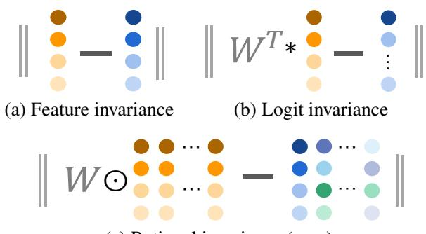
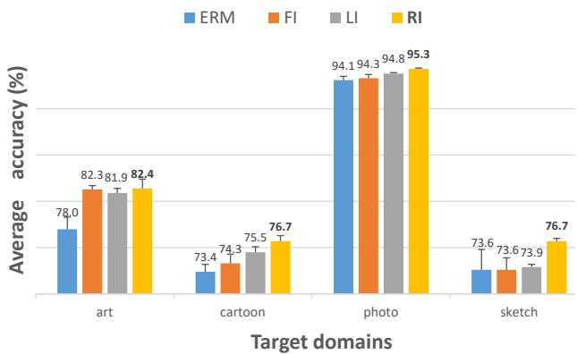
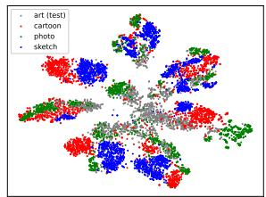
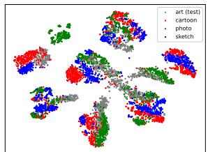
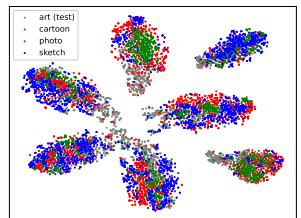
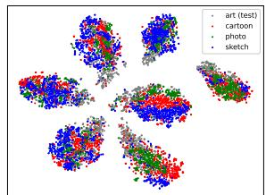

# Domain Generalization via Rationale Invariance

Liang Chen1 Yong Zhang2\* Yibing Song3 Anton van den Hengel1 Lingqiao Liu1∗ logit 1 The University of Adelaide 2 Tencent AI Lab 3 AI3 Institute, Fudan University

{liangchen527, zhangyong201303, yibingsong.cv}@gmail.comClassifier {anton.vandenhenge, lingqiao.liu}@adelaide.edu.au

## Abstract

This paper offers a new perspective to ease the challenge ofdomain generalization, which involves maintaining robust results even in unseen environments. Our design focuses on the decision-making process in thefinal classifier layer. Specifically, we propose treating the element-wise contri-� butions to the final results as the rationale for making a  … decision and representing the rationale for each sample as a matrix. For a well-generalized model, we suggest the rationale matricesfor samples belonging to the same category should be similar, indicating the model relies on domaininvariant clues to make decisions, thereby ensuring robust results. To implement this idea, we introduce a rationale in-rationale variance loss as a simple regularization technique, requiring only afew lines ofcode. Our experiments demonstrate that the proposed approach achieves competitive results across various datasets, despite its simplicity. Code is available at https://github.com/liangchen527/RIDG.

## 1. Introduction

Most existing machine learning models implicitly assume the training and test data are drawn from a similar distribution. While in practice, the real-world test samples often exhibit different characteristics due to distribution shift [35, 67], resulting in an unsatisfactory performance for the deployed model. This limitation hinders the further application of deep models in various tasks, such as autonomous driving or object recognition. Hence, it is crucial importance to develop effective domain generalization (DG) methods that can maintain robust results regardless of domain shift.

The seminal work[7] theoretically proves that well generalized representations should remain consistent across different environments. Following this principle, various DG methods have been proposed to identify invariant features that are stable across diverse domains. These efforts include explicit feature alignment[45, 25, 41, 30, 2], domainadversarial training [24, 41, 65, 43], gradient regularization [1, 36, 55, 50], and meta-learning skills [39, 3, 19, 40], to name a few. Despite some notable achievements, however, DG remains a formidable challenge and is far from being solved. In fact, a recent study [27] reveals that most current state-of-the-art methods perform inferior to the baseline em pirical risk minimization (ERM) method[60] when applied with controlled model selection and restricted hyperparameter search. This finding highlights the need for innovative and effective models capable of maintaining robustness.

  
(c) Rational invariance (ours)  
Figure 1. Visualized versions of different invariance regularizations. Here ∥ · ∥ are the l norm; left and right sides of figures (a) - (c) denote the different feature, logit, and rational elements from the �⊙ �⊙sample and the corresponding mean value; W is the weight in the classifier; ⊙ is the element-wise product. In our setting, the rational matrix contains all element-wise contributions to the final results. Different from feature and logit invariance regularization, our rational invariance term considers both the feature and classifier weights involved in making a decision, providing a fine-grained characterization of the decision-making process.

This work takes a different path toward achieving robust outputs by emphasizing the decision-making process in the classifier layer of a deep neural network, rather than focusing solely on the features. For most existing models, the final output logits are computed by multiplying the penultimate layer’s feature with the classifier’s weights1. Delving deep into the process, each logit value can be regarded as the sum mation of the element-wise products between the feature and the corresponding weight. Considering each product term as a contribution to the corresponding logit, we collect all these contributions for logits from all classes as a matrix and then reinterpret them as the rationale for making decisions regarding the input sample.

By introducing the new concept of rationale, we can refine and extend the invariance principle [7] from a new perspective. We posit that to ensure robust results, a well-generalized model should make decisions based on clues that are stable across samples and domains. Building on this intuition, we propose a regularization term that enforces similarity be tween the rationale matrix from each sample and the mean rationale matrix for the corresponding class. To implement our idea, we dynamically calculate the class-wise mean rationale matrix through momentum updates during training, which can be implemented with just a few lines of code. As depicted in Figure 1, our approach differs from previous feature-based regularization [10] in that we also consider the influence of the classifier, preventing biased estimation of feature importance. Additionally, by providing a more fine-grained characterization of the decision-making process, our model overcomes the limitation of logit-based regularization [48], which fails to account for the varying impacts of each contribution to the final decision. Our experimental study also demonstrates that the proposed rationale invariance regularization strategy outperforms the feature and the logits invariance regularization schemes (see Figure 2).

By conducting extensive experiments on both the DomainBed [27] and Wilds [35] benchmarks, we show that the proposed method consistently improves upon the baseline method and achieves comparable performance against stateof-the-art models. These results highlight the effectiveness of our new idea, despite its simplicity.

The contributions of this work are three-fold:

• We introduce the concept of rationale in the decisionmaking process, which is new in the literature to the best of our knowledge, to improve DG.

• We propose a simple-but-effective strategy for utilizing the rationale concept toward the robust output objective, which is conducted by enforcing consistency between the rationale matrix from each sample and its corresponding mean value.

• We conduct extensive experiments on the existing benchmark with rigorous evaluation protocol [27] and demonstrate that the proposed rationale-based method can perform favorably against existing arts.

## 2. Related Works

Domain generalization (DG), designed to enable a learned model to maintain robust results in unseen target domains, is gaining increasing attention in the research community lately. The problem can be traced back to a decade ago [9], and various approaches have been proposed to push the generalization boundary ever since [45, 25, 41, 30, 24, 41, 65, 43, 39, 3, 19, 40, 50, 48, 14, 11, 16, 12, 13, 15]. The primary goal for most current arts is to identify invariant features given the limited training domains [2, 33].

  
Figure 2. Performance improvements from different invariance regularization, i.e. feature invariance (FI), logit invariance (LI), and the proposed rationale invariance (RI), for the baseline ERM model (i.e. implemented with ResNet18 [29] backbone). Experiments are conducted on the PACS dataset [38] with the leave-one-out setting. Following [27], we use 60 sets of random seeds and hyperparameters for each target domain. The reported average accuracy and error bars verify the effectiveness of our method.

Despite the varying details, we can categorize them into the following types. (1) Explicit mining invariant features. The previous work [7] theoretically reveals that if the features remain invariant across different environments, then they are general and transferable to different domains. To this end, some existing arts aim to explicitly explore invariant features for generalization. For example, [45] suggests using maximum mean discrepancy (MMD) to align the obtained features from different domains; [26] adopts a multi-task auto-encoder that transforms the original image into analogs in multiple related domains and expects the learned features to be robust across domains. The idea of explicitly ensuring invariance has been explored in the gradient level recently, such as that in [55] and [50], where the inner products of gradients from different domains are maximized to achieve robustness [55], and gradients of sam ples from different domains are expected to be similar to their mean values [50]. (2) Using specially-designed optimization algorithms. There are also approaches that resort to different training strategies, such as adversarial learning [24, 41, 65, 43] and meta-learning [39, 3, 19, 40], for finding invariance features. For example, adversarial training is adopted in [24] to enforce the learned features to be agnostic about the domain information, where the target mainstream feature that minimizes the semantic classification loss is also required to maximize the domain classification loss. This idea is combined with the MMD constraint in [43] to update an auto-encoder. Based on the MAML framework [23], most of the meta-learning-based techniques try to find invariance by simulating distribution shifts between seen and unseen environments [39, 3, 19, 40]. In [32], Huang et al. suggest learning diverse features via masking out the easy clues during training. Test-time training is also introduced in [15] for the task of DG. (3) Augmentation. Existing augmentation techniques applied in DG are often focused on two folds, the feature level [42, 70, 46] that combines different features or their style statistics, and image level [64, 63] which synthesize new data by directly mixing images [64] or its phase [63]. It is noteworthy that not all augmentation skills are effective, only those related to the data from test domains can benefit generalization [56], explaining why these methods can not ensure improvements for DG.

However, despite a proliferation of DG models, doubts are cast regarding the improvements of current arts compared with the baseline model [27]. Indeed, both the results in [27] and our experimental studies suggest most current methods cannot improve DG in all evaluated datasets. In contrast, our method is consistently beneficial for the baseline method. Moreover, compared to the related methods that use feature [10] or logit [48] invariance regularizations, our method also shows certain improvements, demonstrating the effectiveness of the new rationale concept.

## 3. Methdology

Preliminary. Let $\mathcal { D } _ { s } = \{ \mathcal { D } _ { 1 } , \mathcal { D } _ { 2 } , . . . , \mathcal { D } _ { M } \}$ be a set of given training domains, where $\mathcal { D } _ { i }$ is a joint distribution over the image space X and label space Y. From each domain $\mathcal { D } _ { i } ,$ we can observe $n _ { i }$ training data points which consist of input $x \in \mathcal { X }$ and semantic label $\boldsymbol { y } \in \mathcal { V } \colon ( x _ { j } ^ { i } , y _ { j } ^ { i } ) _ { j = 1 } ^ { n _ { i } } \sim \mathcal { D } _ { i }$ . Given the target domain $\mathcal { D } _ { t }$ that samples images from a different distribution, the vanilla DG task asks a model trained on the multi-source $\mathcal { D } _ { s }$ (with $M > 1 )$ to perform well on the unseen domain $\mathcal { D } _ { t }$

## 3.1. Rationale in the Decision-Making Process

This section includes a comprehensive description of our newly proposed rationale representation, as well as comparisons against existing concepts.

In current deep models, the final output results derived from the decision-making process involve obtaining the feature $\mathbf { z } \in \mathbb { R } ^ { D }$ through a feature extractor $f \ ( i . e . \ \mathbf { z } = \ f ( x ) )$ , followed by the computation of the final logits $\mathbf { o } \in \mathbb { R } ^ { K }$ by applying the classifier h on z $( i . e . \ \mathbf { o } = h ( \mathbf { z } ) )$ . Assuming there are K classes in Y, the output logits can be represented as $\mathbf { o } = \mathbf { W } ^ { T } \mathbf { z } \in \mathbb { R } ^ { K }$ , where $\dot { \mathbf { W } } \in \mathbb { R } ^ { \mathbf { \tilde { \cal { D } } } \times \boldsymbol { K } }$ is the weight of h. To delve deeper into this process, we can represent each logit value (the k-th dimension of o) $O _ { k }$ as generated by the summation of element-wise products between the feature elements and the corresponding weights in the classifier layer, which can be represented as following:

$$
o _ { k } = { \bf W } _ { \{ , k \} } ^ { \top } \mathbf { z } = \sum _ { j = 1 } ^ { D } W _ { \{ j , k \} } z _ { j } .\tag{1}
$$

In the above equation, the logit for class k is simply the accumulation of all $W _ { \{ j , k \} } z _ { j }$ which can be regarded as an element-wise contribution to $o _ { k }$ . Intuitively, $W _ { \{ j , k \} } z _ { j }$ provides a piece of evidence to support the specific decision. We thus can collect all $W _ { \{ j , k \} } z _ { j }$ as a matrix $\mathbf { R } \in \mathbb { R } ^ { D \times K }$ to represent the rationale of classifying a sample, which is formally defined as following:

$$
\mathbf { R } = \left[ \begin{array} { c c c c } { W _ { \{ 1 , 1 \} } z _ { 1 } } & { W _ { \{ 1 , 2 \} } z _ { 1 } } & { \ldots } & { W _ { \{ 1 , K \} } z _ { 1 } } \\ { W _ { \{ 2 , 1 \} } z _ { 2 } } & { W _ { \{ 2 , 2 \} } z _ { 2 } } & { \ldots } & { W _ { \{ 2 , K \} } z _ { 2 } } \\ { \vdots } & { \vdots } & { \ddots } & { \vdots } \\ { W _ { \{ D , 1 \} } z _ { D } } & { W _ { \{ D , 2 \} } z _ { D } } & { \ldots } & { W _ { \{ D , K \} } z _ { D } } \end{array} \right]\tag{2}
$$

Note that we construct the rational matrix R from all classes. This is because the final posterior probability is often calculated via performing the Softmax function on all the logits. In other words, logits from all classes will affect the final posterior probability.

Rationale V.S. feature V.S. logit: To ensure robust results, previous studies explicitly or implicitly regularize the decision-making process through the analysis of features [10] or logits [48]. However, these two strategies have intrinsic limitations. Specifically, by focusing only on features, the classifier weights that determine the effects of different feature elements may not be given sufficient consideration, leading to biased estimates of feature importance. For instance, a feature element with a large value may correspond to a small value in the classifier, resulting in a lower impact on the final results. Simply looking at the feature value or variance can therefore be misleading, thus diminishing the overall performance of the model.

In contrast to features, logit implicitly takes the classifier into account, alleviating the issue in the situation that focuses only on features to a certain extent. However, the logit provides only a coarse decision value and lacks a detailed explanation of the decision-making process. This limitation makes it challenging to comprehend the rationale behind a decision. Consequently, solely relying on logits may not provide control over the decision-making process, leading to ineffectiveness in obtaining robust outputs. This limitation is further validated in our visual analysis in Sec. 5.3.

Our rationale matrix representation, i.e., R matrix, over comes the limitations of both feature-based and logit-based analyses by representing the decision-making process from a more fine-grained perspective that also takes the classifier into account. It provides a new tool for domain generalization or other related machine learning problems. We provide more analysis regarding these strategies in Sec. 5.1.

Algorithm 1 Pseudo codes of the training process for the proposed method in a PyTorch-like style. proposed method in a PyTorch-like style.

# f, h: feature extractor, classifier   
# $K , D \colon$ total number of classes, dimension of the feature   
# m, α: momentum, weight parameter   
R = torch.zeros(K, K, D) # initialize $\overline { { R } }$   
# training process   
for x, y in training loader: # load a minibatch with N samples   
$z = f ( x )$   
# obtain the rationale tensor for the current batch   
R = torch.zeros(K, N, D) # initialize R   
# obtaining R based on Eq. (2)   
for i in range(K):   
R [i] = h.weight[i] ∗ z   
classes = torch.unique(y)   
$\mathcal { L } _ { i n v } = 0$   
# compute $\mathcal { L } _ { i n v }$ for different classes   
for i in range(classes.shape[0]):   
# mean values of R in the current batch   
Rmean = R [:, y == classes [i]].mean(dim=1).detach()   
# update R for different classes based on Eq. (4)   
R [classes $[ i ] ] = ( 1 - m ) * { \overline { { R } } }$ [classes [i]] + m ∗ Rmean   
# computing $\mathcal { L } _ { i n v }$ based on Eq. (3)   
$\mathcal { L } _ { i n v } + = \mathbf { M } \mathbf { S } \mathbf { E } \mathbf { I }$ oss(R [:, y == classes [i]] , R [classes [i]])   
# computing $\mathcal { L } _ { a l l }$ based on Eq. (5)   
$\mathcal { L } _ { a l l }$ = CrossEntropyLoss(h(z), y) + αLinv   
([f.params, h.params]).zero grad()   
$\mathcal { L } _ { a l l }$ .backward()   
update([f.params, h.params])

## 3.2. Rationale Invariance for DG

Our primary goal is to design a model that can maintain robust outputs despite the varying environments. The rationale matrix provides a characterization of how a decision is made, and new regularization can be introduced upon the rationale concept to control the decision-making process to approximate the optimal design. Various methods can be potentially used for designing such regularization terms, but this study adopts a simple approach by ensuring that the rationale matrix of samples from the same class aligns with their corresponding mean value. This approach implies that the decision to classify an object should be based on the same reasoning, regardless of the variation in samples or domains. This is reasonable because the causal factors for decision-making are often stable patterns that persist across samples and domains [44].

Formally, we impose an invariance loss term to enforce the rationale matrix from a sample to be close to its corresponding mean. Denoting as $\mathcal { L } _ { i n v }$ , this regularization term can be written as:

$$
\mathcal { L } _ { i n v } = \frac { 1 } { N _ { b } } \sum _ { k } \sum _ { \{ n | y _ { n } = k \} } \| { \bf R } _ { n } - \overline { { { \bf R } } } _ { k } \| ^ { 2 } ,\tag{3}
$$

where $\| \cdot \|$ is the l2 norm, $N _ { b }$ is the number of samples in a mini-batch; ${ \mathbf { R } } _ { n }$ denotes the rationale matrix for the n-th sample. $\overline { { \mathbf { R } } } _ { k }$ denotes the mean matrix of the rationale matrix corresponding to the k-th class.

However, calculating $\overline { { \mathbf { R } } } _ { k }$ directly involves averaging through all the samples, which is computationally expensive. Thus, we suggest updating $\overline { { \mathbf { R } } } _ { k }$ online in each iteration step in a momentum fashion. Inspired by the previous work [28], the updating process for $\overline { { \mathbf { R } } } _ { k }$ can be given as:

$$
\overline { { \mathbf { R } } } _ { k } ^ { t } = ( 1 - m ) \times \overline { { \mathbf { R } } } _ { k } ^ { t - 1 } + m \times \frac { 1 } { | y _ { n } = k | } \sum _ { \{ n | y _ { n } = k \} } \mathbf { R } _ { n } ,\tag{4}
$$

where t is the iteration index, m is a positive momentum value, and $| y _ { n } = k |$ computes the sample corresponding to the k-th class. We initialize $\overline { { \mathbf { R } } } _ { k }$ with the rationale computed from the first iteration step.

## 3.3. Learning Objective

Combining the rationale invariance constraint with the classification loss $\begin{array} { r } { \mathcal { L } _ { c l a } = \frac { 1 } { N _ { h } } \sum _ { n } \mathbf { C E } ( h ( f ( x _ { n } ) ) , y _ { n } ) } \end{array}$ , where CE denotes the cross-entropy loss, our overall training objective $\mathcal { L } _ { a l l }$ merely contains two terms,

$$
\mathcal { L } _ { a l l } = \mathcal { L } _ { c l a } + \alpha \mathcal { L } _ { i n v } ,\tag{5}
$$

where α is a positive weight. The optimization task regarding minimization Eq. (5) can be fulfilled by the existing technique [34]. The pseudo-code for the training process is presented in Algorithm 1. As seen, the proposed method is extremely simple, as it only adds a few lines based on the standard ERM training pipeline.

## 4. Experiments

## 4.1. Experiments on DomainBed [27]

Datasets. We use five different datasets in the DomainBed benchmark [27] to comprehensively evaluate the proposed method, namely PACS [38], VLCS [21], OfficeHome [61], TerraInc [6], and DomainNet [47]. (1) PACS has 9,991 images that can be categorized into 7 classes. This dataset is probably the most commonly used dataset in the DG literature due to its large distributional shift across 4 domains, including art painting, cartoon, photo, and sketch; (2) VLCS consists of 10,729 images collected from 5 different classes. These images are originally from 4 different datasets (i.e. PASCAL VOC 2007 [20], LabelMe [52], Caltech [22], and Sun [62]), and each dataset is considered a domain in the DG setting; (3) OfficeHome is an object recognition dataset that contains 15,588 images from 65 classes, which can be divided into 4 domains including artistic, clipart, product, and real world; (4) TerraInc consists of 24,788 animal images captured in the wild from different locations, there are a total of 10 classes in it with the corresponding location viewed as the varying domain, i.e. L100, L38, L43, L46. (5)

Table 1. Evaluations on the DomainBed benchmark [27]. All methods are examined for 60 trials in each unseen domain. Here Top5 accumulates the number of datasets where a method achieves the top 5 performances. Every symbol ↑ denotes a score of +1, meaning the specific method outperforms ERM (on account of their variances), and vice versa for the symbol ↓, which denotes a score of −1; otherwise, the score is 0. The best results are colored as red, and the second bests are colored as blue
<table><tr><td></td><td>PACS</td><td>VLCS</td><td>OfficeHome</td><td>TerraInc</td><td>DomainNet</td><td>Avg.</td><td>Top5</td><td>Score</td></tr><tr><td>MMD [41]</td><td> $\overline { { 8 1 . 3 \pm 0 . 8 \uparrow } }$ </td><td> $\overline { { 7 4 . 9 \pm 0 . 5 \downarrow } }$ </td><td> $\overline { { 5 9 . 9 \pm 0 . 4 \downarrow } }$ </td><td> $\overline { { 4 2 . 0 \pm 1 . 0 \uparrow } }$ </td><td> $7 . 9 \pm 6 . 2 \downarrow$ </td><td>53.2</td><td>1</td><td>-1</td></tr><tr><td>RSC [32]</td><td> $8 0 . 5 \pm 0 . 2 \uparrow$ </td><td> $7 5 . 4 \pm 0 . 3$ </td><td> $5 8 . 4 \pm 0 . 6 \downarrow$ </td><td> $3 9 . 4 \pm { 1 . 3 }$ </td><td> $2 7 . 9 \pm 2 . 0 \downarrow$ </td><td>56.3</td><td>0</td><td>-1</td></tr><tr><td>IRM [1]</td><td> $8 0 . 9 \pm 0 . 5 \uparrow$ </td><td> $7 5 . 1 \pm 0 . 1 \downarrow$ </td><td> $5 8 . 0 \pm 0 . 1 \downarrow$ </td><td> $3 8 . 4 \pm 0 . 9$ </td><td> $3 0 . 4 \pm 1 . 0 \downarrow$ </td><td>56.6</td><td>0</td><td>-2</td></tr><tr><td>ARM [69]</td><td> $8 0 . 6 \pm 0 . 5$ </td><td> $7 5 . 9 \pm 0 . 3$ </td><td> $5 9 . 6 \pm 0 . 3 \downarrow$ </td><td> $3 7 . 4 \pm 1 . 9$ </td><td> $2 9 . 9 \pm 0 . 1 \downarrow$ </td><td>56.7</td><td>0</td><td>-2</td></tr><tr><td>DANN [24]</td><td> $7 9 . 2 \pm 0 . 3$ </td><td> $7 6 . 3 \pm 0 . 2 \uparrow$ </td><td> $5 9 . 5 \pm 0 . 5 \downarrow$ </td><td> $3 7 . 9 \pm 0 . 9$ </td><td> $3 1 . 5 \pm 0 . 1 \downarrow$ </td><td>56.9</td><td>1</td><td>-1</td></tr><tr><td>GroupGRO [53]</td><td> $8 0 . 7 \pm 0 . 4 \uparrow$ </td><td> $7 5 . 4 \pm 1 . 0$ </td><td> $6 0 . 6 \pm 0 . 3$ </td><td> $4 1 . 5 \pm 2 . 0$ </td><td> $2 7 . 5 \pm 0 . 1 \downarrow$ </td><td>57.1</td><td>0</td><td>-1</td></tr><tr><td>CDANN [43]</td><td> $8 0 . 3 \pm 0 . 5$ </td><td> $7 6 . 0 \pm 0 . 5$ </td><td> $5 9 . 3 \pm 0 . 4 \downarrow$ </td><td> $3 8 . 6 \pm 2 . 3$ </td><td> $3 1 . 8 \pm 0 . 2 \downarrow$ </td><td>57.2</td><td>0</td><td>-2</td></tr><tr><td>VREx [37]</td><td> $8 0 . 2 \pm 0 . 5$ </td><td> $7 5 . 3 \pm 0 . 6$ </td><td> $5 9 . 5 \pm 0 . 1 \downarrow$ </td><td> $4 3 . 2 \pm 0 . 3 \uparrow$ </td><td> $2 8 . 1 \pm 1 . 0 \downarrow$ </td><td>57.3</td><td>1</td><td>-1</td></tr><tr><td>CAD [51]</td><td> $8 1 . 9 \pm 0 . 3 \uparrow$ </td><td> $7 5 . 2 \pm 0 . 6$ </td><td> $6 0 . 5 \pm 0 . 3$ </td><td> $4 0 . 5 \pm 0 . 4 \uparrow$ </td><td> $3 1 . 0 \pm 0 . 8 \downarrow$ </td><td>57.8</td><td>1</td><td>1</td></tr><tr><td>CondCAD [51]</td><td> $8 0 . 8 \pm 0 . 5 \uparrow$ </td><td> $7 6 . 1 \pm 0 . 3$ </td><td> $6 1 . 0 \pm 0 . 4$ </td><td> $3 9 . 7 \pm 0 . 4$ </td><td> $3 1 . 9 \pm 0 . 7 \downarrow$ </td><td>57.9</td><td>0</td><td>0</td></tr><tr><td>MTL [8]</td><td> $8 0 . 1 \pm 0 . 8$ </td><td> $7 5 . 2 \pm 0 . 3 \downarrow$ </td><td> $5 9 . 9 \pm 0 . 5$ </td><td> $4 0 . 4 \pm 1 . 0$ </td><td> $3 5 . 0 \pm 0 . 0 \downarrow$ </td><td>58.1</td><td>0</td><td>-2</td></tr><tr><td>ERM [60]</td><td> $7 9 . 8 \pm 0 . 4$ </td><td> $7 5 . 8 \pm 0 . 2$ </td><td> $6 0 . 6 \pm 0 . 2$ </td><td> $3 8 . 8 \pm 1 . 0$ </td><td> $3 5 . 3 \pm 0 . 1$ </td><td>58.1</td><td>0</td><td>-</td></tr><tr><td>MixStyle [70]</td><td> $8 2 . 6 \pm 0 . 4 \uparrow$ </td><td> $7 5 . 2 \pm 0 . 7$ </td><td> $5 9 . 6 \pm 0 . 8$ </td><td> $4 0 . 9 \pm 1 . 1$ </td><td> $3 3 . 9 \pm 0 . 1 \downarrow$ </td><td>58.4</td><td>1</td><td>0</td></tr><tr><td>MLDG [39]</td><td> $8 1 . 3 \pm 0 . 2 \uparrow$ </td><td> $7 5 . 2 \pm 0 . 3 \downarrow$ </td><td> $6 0 . 9 \pm 0 . 2$ </td><td> $4 0 . 1 \pm 0 . 9$ </td><td> $3 5 . 4 \pm 0 . 0$ </td><td>58.6</td><td>0</td><td>0</td></tr><tr><td>Mixup [64]</td><td> $7 9 . 2 \pm 0 . 9$ </td><td> $7 6 . 2 \pm 0 . 3$ </td><td> $6 1 . 7 \pm 0 . 5$ </td><td> $4 2 . 1 \pm 0 . 7 \uparrow$ </td><td> $3 4 . 0 \pm 0 . 0 \downarrow$ </td><td>58.6</td><td>1</td><td>0</td></tr><tr><td>MIRO [10]</td><td> $7 5 . 9 \pm 1 . 4 \downarrow$ </td><td> $7 6 . 4 \pm 0 . 4$ </td><td> $6 4 . 1 \pm 0 . 4 \uparrow$ </td><td> $4 1 . 3 \pm 0 . 2 \uparrow$ </td><td> $3 6 . 1 \pm 0 . 1 \uparrow$ </td><td>58.8</td><td>3</td><td>2</td></tr><tr><td>Fishr [50]</td><td> $8 1 . 3 \pm 0 . 3 \uparrow$ </td><td> $7 6 . 2 \pm 0 . 3$ </td><td> $6 0 . 9 \pm 0 . 3$ </td><td> $4 2 . 6 \pm 1 . 0 \uparrow$ </td><td> $3 4 . 2 \pm 0 . 3 \downarrow$ </td><td>59.0</td><td>1</td><td>1</td></tr><tr><td>SagNet [46]</td><td> $8 1 . 7 \pm 0 . 6 \uparrow$ </td><td> $7 5 . 4 \pm 0 . 8$ </td><td> $6 2 . 5 \pm 0 . 3 \uparrow$ </td><td> $4 0 . 6 \pm 1 . 5$ </td><td> $3 5 . 3 \pm 0 . 1$ </td><td>59.1</td><td>1</td><td>2</td></tr><tr><td>SelfReg [33]</td><td> $8 1 . 8 \pm 0 . 3 \uparrow$ </td><td> $7 6 . 4 \pm 0 . 7$ </td><td> $6 2 . 4 \pm 0 . 1 \uparrow$ </td><td> $4 1 . 3 \pm 0 . 3 \uparrow$ </td><td> $3 4 . 7 \pm 0 . 2 \downarrow$ </td><td>59.3</td><td>2</td><td>2</td></tr><tr><td>Fish [55]</td><td> $8 2 . 0 \pm 0 . 3 \uparrow$ </td><td> $7 6 . 9 \pm 0 . 2 \uparrow$ </td><td> $6 2 . 0 \pm 0 . 6 \uparrow$ </td><td> $4 0 . 2 \pm 0 . 6$ </td><td> $3 5 . 5 \pm 0 . 0 \uparrow$ </td><td>59.3</td><td>3</td><td>4</td></tr><tr><td>CORAL [57]</td><td> $8 1 . 7 \pm 0 . 0 \uparrow$ </td><td> $7 5 . 5 \pm 0 . 4$ </td><td> $6 2 . 4 \pm 0 . 4 \uparrow$ </td><td> $4 1 . 4 \pm { 1 . 8 }$ </td><td> $3 6 . 1 \pm 0 . 2 \uparrow$ </td><td>59.4</td><td>2</td><td>3</td></tr><tr><td>SD [48]</td><td> $8 1 . 9 \pm 0 . 3 \uparrow$ </td><td> $7 5 . 5 \pm 0 . 4$ </td><td> $6 2 . 9 \pm 0 . 2 \uparrow$ </td><td> $4 2 . 0 \pm 1 . 0 \uparrow$ </td><td> $3 6 . 3 \pm 0 . 2 \uparrow$ </td><td>59.7</td><td>4</td><td>4</td></tr><tr><td>Ours</td><td> $8 2 . 8 \pm 0 . 3 \uparrow$ </td><td> $7 5 . 9 \pm 0 . 3$ </td><td> $6 3 . 3 \pm 0 . 1 \uparrow$ </td><td> $4 3 . 7 \pm 0 . 5 \uparrow$ </td><td> $3 6 . 0 \pm 0 . 2 \uparrow$ </td><td>60.3</td><td>4</td><td>4</td></tr></table>

DomainNet contains 586,575 images from a total of 345 classes, whose domains can be depicted into 6 types: clipart, infograph, painting, quickdraw, real, and sketch.

Implementation details. Following the prevelant design, we use the imagenet [18] pretrained ResNet18 model [29] as the backbone for all the datasets. Results with the ResNet50 backbone are presented in the supplementary material.We use dynamic ranges for the value of momentum in Eq. (4): $m ~ \in ~ [ 0 . 0 0 0 1 , 0 . 1 ]$ and the weight parameter in Eq. (5): $\alpha \in [ 0 . 0 0 1 , 0 . 1 ]$ . Regarding other settings related to the compared arts: for all the datasets, we use the leave-one-out strategy to evaluate these methods, which uses one domain as the hold-out target domain and others as the source domains, and we evaluate all the compared methods each with 60 trials for different datasets. Specifically, in each trial, the training and test samples are randomly split in a ratio of 8:2 (trial:val), and all the compared methods are reevaluated using the default settings in DomainBed in the same device (8 Nvidia Tesla v100 GPUs and each with 32G memory) to ensure fair comparisons. The hyper-parameter settings, such as learning rate, augmentation strategies, and batch size, are all dynamically set according to [27].

Experimental results. Average results from the 60 trials of different compared methods in the DomainBed benchmark are listed in Table 1. We use average accuracy (i.e. Avg.), leading performances (i.e. Top5), and performance score [67] (i.e. Score) to evaluate the compared arts. We note that the simple ERM baseline obtains favorable performance against existing arts in the term of average accuracy. As a matter of fact, among all the compared arts, less than half can benefit ERM in general (with a Score > 0), and only 5 methods(i.e. SagNet [46], Fish [55], CORAL [57], SD [48], and Ours) do not decrease the performance of ERM in all datasets. These results comply with the observation in [27] and show that most existing strategies cannot improve ERM when evaluated with rigorous settings. In comparison, the proposed rationale invariance framework leads the baseline ERM by 2 percent and the second best model (i.e. SD [48]) by 0.6 percent in the term of average accuracy. Meanwhile, it also obtains the best results in 2 out of the 5 benchmarks (i.e. PACS and TerraInc datasets) and 4 in the top 5, performing one of the best in the Score criteria, demonstrating its effectiveness compared with existing models.

Moreover, when compared with arts that adopt the featureinvariance [10] and logit-invariance [48] regularizations, our method also showcases comparable or even better results, especially in the PACS and TerraInc datasets, demonstrating the effectiveness of the new rationale concept. Note that the feature-invariance inspired method MIRO [10] performs inferior to others when evaluated in the PACS dataset. This is because their approach specifically enforces similarity between intermediate features from the model and that from the pretrained backbone, which can be detrimental to the performance when there is a significant distribution shift between the target data, such as cartoon’ or ’sketch’ images from PACS, and samples used for pertaining. We provide more experimental studies to analyze the invariance constraints from MIRO [10] and SD [48] in Sec. 5.1. Results of average accuracy in each domain from different datasets are presented in the supplementary material. Please also refer to it for further details.

Table 2. Evluations on four challenging datasets from the Wilds benchmark [35]. Results are directly cited from the public leaderboard. Metrics of means and standard deviations are reported across different trials (according to the default settings in [35]). The best results are colored as red. We reevaluate ERM (i.e. ERM (ours)) as a comparison. Our method performs favorably against existing arts, leading in half of the evaluated datasets, and obtains better results than the corresponding ERM in all situations.
<table><tr><td rowspan="2">Method</td><td colspan="2">iWildCam</td><td>Camelyon17</td><td>RxRX1</td><td colspan="2">FMoW</td></tr><tr><td> $\operatorname { A v g . } \operatorname { a c c . }$ </td><td>Macro F1</td><td> $\operatorname { A v g . } \operatorname { a c c . }$ </td><td> $\operatorname { A v g . } \operatorname { a c c . }$ </td><td>Worst acc.</td><td> $\operatorname { A v g . } \operatorname { a c c . }$ </td></tr><tr><td>ERM [60]</td><td> $\overline { { 7 1 . 6 \pm 2 . 5 } }$ </td><td> $3 1 . 0 \pm 1 . 3$ </td><td> $7 0 . 3 \pm 6 . 4$ </td><td> $2 9 . 9 \pm 0 . 4$ </td><td> $\overline { { 3 2 . 3 \pm 1 . 2 5 } }$ </td><td> $\overline { { 5 3 . 0 \pm 0 . 5 5 } }$ </td></tr><tr><td>CORAL [57]</td><td> $7 3 . 3 \pm 4 . 3$ </td><td> $3 2 . 8 \pm 0 . 1$ </td><td> $5 9 . 5 \pm 7 . 7$ </td><td> $2 8 . 4 \pm 0 . 3$ </td><td> $3 1 . 7 \pm 1 . 2 4$ </td><td> $5 0 . 5 \pm 0 . 3 6$ </td></tr><tr><td>GroupGRO [53]</td><td> $7 2 . 7 \pm 2 . 1$ </td><td> $2 3 . 9 \pm 2 . 0$ </td><td> $6 8 . 4 \pm 7 . 3$ </td><td> $2 3 . 0 \pm 0 . 3$ </td><td> $3 0 . 8 \pm 0 . 8 1$ </td><td> $5 2 . 1 \pm 0 . 5 0$ </td></tr><tr><td>IRM [1]</td><td> $5 9 . 8 \pm { 3 . 7 }$ </td><td> $1 5 . 1 \pm 4 . 9$ </td><td> $6 4 . 2 \pm 8 . 1$ </td><td> $8 . 2 \pm 1 . 1$ </td><td> $3 0 . 0 \pm 1 . 3 7$ </td><td> $5 0 . 8 \pm 0 . 1 3$ </td></tr><tr><td>ARM-BN [69]</td><td> $7 0 . 3 \pm 2 . 4$ </td><td> $2 3 . 7 \pm 2 . 7$ </td><td> $8 7 . 2 \pm 0 . 9$ </td><td> $3 1 . 2 \pm 0 . 1$ </td><td> $2 4 . 6 \pm 0 . 0 4$ </td><td> $4 2 . 0 \pm 0 . 2 1$ </td></tr><tr><td>TTBNA [54]</td><td> $4 6 . 6 \pm 0 . 9$ </td><td> $1 3 . 8 \pm 0 . 6$ </td><td></td><td> $2 0 . 1 \pm 0 . 2$ </td><td> $3 0 . 0 \pm 0 . 2 3$ </td><td> $5 1 . 5 \pm 0 . 2 5$ </td></tr><tr><td>Fish [55]</td><td> $6 4 . 7 \pm 2 . 6$ </td><td> $2 2 . 0 \pm 1 . 8$ </td><td> $7 4 . 7 \pm 7 . 1$ </td><td></td><td> $3 4 . 6 \pm 0 . 1 8$ </td><td> $5 1 . 8 \pm 0 . 3 2$ </td></tr><tr><td>CGD [49]</td><td></td><td></td><td> $6 9 . 4 \pm 7 . 9$ </td><td></td><td> $3 2 . 0 \pm 2 . 2 6$ </td><td> $5 0 . 6 \pm 1 . 3 9$ </td></tr><tr><td>LISA [66]</td><td></td><td></td><td> $7 7 . 1 \pm 6 . 9$ </td><td> $3 1 . 9 \pm 1 . 0$ </td><td> $3 5 . 5 \pm 0 . 8 1$ </td><td> $5 2 . 8 \pm 1 . 1 5$ </td></tr><tr><td>ERM (ours)</td><td> $\overline { { 7 0 . 5 \pm 4 . 3 } }$ </td><td> $3 0 . 1 \pm 0 . 7$ </td><td> $\overline { { 8 0 . 1 \pm 3 . 9 } }$ </td><td> $2 9 . 9 \pm 0 . 3$ </td><td> $\overline { { 3 3 . 0 \pm 1 . 3 4 } }$ </td><td> $\overline { { 5 3 . 1 \pm 1 . 1 6 } }$ </td></tr><tr><td>Ours</td><td> $7 0 . 9 \pm 2 . 8$ </td><td> $3 0 . 7 \pm 1 . 0$ </td><td> $9 0 . 6 \pm 2 . 9$ </td><td> $3 0 . 0 \pm 0 . 3$ </td><td> $3 6 . 1 \pm 1 . 4 8$ </td><td> $5 5 . 9 \pm 0 . 2 5$ </td></tr></table>

## 4.2. Experiments on Wilds [35]

mark [35]. We implement our model and the baseline ERM [60] with the default settings in all training and evaluation processes. In both iWildCam and RxRx1 datasets, we use the imagenet pretrained ResNet50 [29] structure for trainings. We compute the average accuracy (avg. acc.) in the two datasets and report Macro F1 for iWildCam. The results are computed over a total of 3 trials in each dataset with different random seeds once the trainings are finished; For Camelyon17 and FMoW, we use the imagenet pretrained DensNet121 [31] for the training processes. We report the average accuracy over 10 trials for evaluating Camelyon17, and we use both the metrics of worst-case accuracy and average accuracy to evaluate FMoW, which are computed across 3 trials with varying random seeds.

Datasets. The Wilds benchmark [35] contains multiple datasets that capture real-world distribution shifts across a diverse range of modalities. We conduct experiments on four challenging datasets from Wilds to further examine our method, including iWildCam [5], Camelyon17 [4], RxRx1 [58], FMoW [17]. Specifically, (1) iWildCam contains 203,029 animal images from 182 different species, which are taken from a total of 324 camera traps in different locations (i.e. domains); (2) Camelyon17 has 45,000 images used for the binary tumor classification task, which are collected from 5 different hospitals (i.e. domains); (3) RxRx1 consists of 125,514 high-resolution fluorescence microscopy images of human cells under 1,108 genetic perturbations (i.e. classes) in 51 experimental batches (i.e. domains); (4) FMoW is a satellite dataset contains 118,886 samples used for land classification across different regions and years, and the total categories and domains are 62 and 80 (i.e. years × regions), respectively.

Implementation and evaluation details. Implementation details for different datasets vary in the Wilds bench-

Experimental results. We list the evaluation results in Table 2 where the statistics from the compared arts are directly cited from the public leaderboard2. Similar to the observation in [27], we note most of the sophisticated alternatives perform on par with the baseline ERM in general. In particular, there are certain situations in which nearly all methods are outperformed by ERM. This is particularly evident in the FMoW dataset, where ERM achieves higher average accuracy than all other approaches except for our model. Differently, our method achieves the best performance in 2 of the 4 evaluated datasets and outperforms ERM in all 4 benchmarks, with particularly impressive results in the Camelyon17 dataset, where improvements of over 10% were observed. These findings demonstrate the effectiveness of our proposed method. We note our method performs less effectively than [57] in the iWildCam [5] dataset. This is mainly because classes are highly imbalanced in [5]: some classes contain very few samples. This will result the corresponding $\overline { { \mathbf { R } } } _ { k }$ to not contain information from other samples (i.e. $\overline { { \mathbf { R } } } _ { k } \approx \mathbf { R } _ { n } )$ , leading to ineffectiveness when computing

Table 3. Comparison between different invariance constraint and mean value updating schemes in the unseen domain from the PACS [38], OfficeHome [61], and DomainNet [47] datasets. Here the $" Z ' ," O '$ , and $^ { \circ } R ^ { \prime }$ denotes the feature-invariance, logits-invariance, and the proposed rationale invariance constraints; 0 is an all-zero tensor, m is the momentum value, when $m = 0 ,$ R is fixed as the rationale from the pretrained model (i.e. Pr.), and when $m = 1$ , R takes the dynamic mean value from the current batch (i.e. Dy.). Mt. denotes the proposed momentum updating strategy for obtaining R. Reported accuracies and standard deviations are computed same as that detailed in Sec. 4.1.
<table><tr><td rowspan="2">Models</td><td colspan="3">Invariance</td><td colspan="3">Setting of R</td><td colspan="3">Test datasets</td><td rowspan="2"> $\operatorname { A v g } .$ </td></tr><tr><td>Z</td><td>0</td><td>R</td><td>Pr.</td><td>Dy.</td><td>0 Mt.</td><td>PACS</td><td>OfficeHome</td><td>DomainNet</td></tr><tr><td>ERM</td><td>一</td><td></td><td>一</td><td>一</td><td></td><td>一</td><td> $7 9 . 8 \pm 0 . 4$ </td><td> $\overline { { 6 0 . 6 \pm 0 . 2 } }$ </td><td> $3 5 . 3 \pm 0 . 1 $ </td><td>58.6</td></tr><tr><td>W/ fea.</td><td>√</td><td>一</td><td>一</td><td>一</td><td>一</td><td>√ 一</td><td> $8 1 . 1 \pm 0 . 5$ </td><td> $6 2 . 6 \pm 0 . 6$ </td><td> $3 5 . 8 \pm 0 . 1$ </td><td>59.8</td></tr><tr><td>W/ log.</td><td>一</td><td>√</td><td>一</td><td>一</td><td>一 一</td><td>√</td><td> $8 1 . 5 \pm 0 . 3$ </td><td> $6 2 . 2 \pm 0 . 2$ </td><td> $3 5 . 3 \pm 0 . 3$ </td><td>59.7</td></tr><tr><td>W/ m = 0 −</td><td></td><td>√ 一</td><td></td><td>√</td><td>一</td><td>一</td><td> $8 1 . 6 \pm 0 . 4$ </td><td> $6 2 . 5 \pm 0 . 1$ </td><td> $3 5 . 8 \pm 0 . 1$ </td><td>60.0</td></tr><tr><td>W/ m = 1 −</td><td></td><td>√</td><td></td><td>一</td><td>√</td><td></td><td> $8 2 . 0 \pm 0 . 3$ </td><td> $6 2 . 8 \pm 0 . 2$ </td><td> $3 5 . 0 \pm 0 . 5$ </td><td>59.9</td></tr><tr><td>W/R = 0 −</td><td></td><td>√ 一</td><td></td><td>一</td><td>一</td><td>√ 一</td><td> $8 1 . 2 \pm 0 . 5$ </td><td> $6 2 . 9 \pm 0 . 3$ </td><td> $3 4 . 9 \pm 0 . 6$ </td><td>59.7</td></tr><tr><td>Ours</td><td>一</td><td></td><td>√</td><td>一</td><td>一</td><td>√ 一</td><td> $\overline { { 8 2 . 8 \pm 0 . 3 } }$ </td><td> $\overline { { 6 3 . 3 \pm 0 . 1 } }$ </td><td> $3 6 . 0 \pm 0 . 2$ </td><td>60.7</td></tr></table>

$\mathcal { L } _ { i n v } .$ . We leave the improvements to future works.

## 5. Analysis and Discussion

This section analyzes the effectiveness of the proposed rationale concept and the adopted momentum updating strategy by conducting ablation studies on the widely-used PACS [38], OfficeHome [61], and DomainNet [47] datasets with the rigorous evaluation settings detailed in Sec. 4.1. We provide more analysis in our supplementary material, please refer to it for details.

## 5.1. Effectiveness of the New Rationale Concept

We compare our method with the following two variants to demonstrate the effectiveness of the proposed rationale concept. (1) Ours with feature-invariance constraint (i.e. W/ fea.), which replaces our rationale-invariance constraint with the existing feature-invariance strategy [10]. In this setting, we reformulate Eq. (3) into $\begin{array} { r l } { \mathcal { L } _ { i n v } } & { { } = } \end{array}$ $\begin{array} { r } { { \frac { 1 } { N _ { b } } } \sum _ { k } \sum _ { \{ n | y _ { n } = k \} } \| { \bf z } _ { n } - { \bf \overline { { z } } } _ { k } \| ^ { 2 } } \end{array}$ , where $\overline { { \mathbf { z } } } _ { k }$ is also computed in the same momentum manner; (2) Ours with logitinvariance constraint (i.e. W/ log.), which replaces the original design with the logit-invariance constraint [48] in the overall framework. For this strategy, the invariance constraint in Eq. (3) can be rewritten as $\begin{array} { r l } { \mathcal { L } _ { i n v } } & { { } = } \end{array}$ $\begin{array} { r } { { \frac { 1 } { N _ { b } } } \sum _ { k } \sum _ { \{ n | y _ { n } = k \} } \| \mathbf { o } _ { n } - \mathbf { \overline { { o } } } _ { k } \| ^ { 2 } } \end{array}$ , where $\overline { { \mathbf { o } } } _ { k }$ is the momentum updated mean value of the logits. Other settings for these two variants are kept the same as our original designs to ensure fair comparisons.

We list the evaluation results in 2nd-3rd rows in Table 3. We observe that both these two variants can bring certain improvements to the baseline ERM method. This is because both the two invariance constraints can help the model to obtain robust results to a certain extent, thus improving generalization. However, these two strategies have intrinsic limitations. Specifically, when focusing solely on the features, $\mathcal { L } _ { i n v }$ may amplify the effects of the irreverent feature elements that with large values but correspond to small weights in the decision-making process, thus diminishing the overall classification performance. Meanwhile, since o is the summation of all the element-wise contributions, enforcing $\mathcal { L } _ { i n v }$ on o fails to take the varying effect of each contribution value to the final decision into account, which may end up boosting contribution with small values to ensure the corresponding summation equals the mean value. As a result, the model will be encouraged to emphasize the corresponding irreverent features. Differently, we can control the fine-grained decision-making process by focusing on the rational concept, thus avoiding the aforementioned limitations. This is also the reason why our method can outperform those two variants in all test datasets.

## 5.2. Effectiveness of the Momentum Updating

We obtain the mean rationale value R with a momentum updating strategy. To examine the effectiveness of this scheme, we compare our original design with the following three variants. (1) Ours with m set to be 0 (i.e. W/ m = 0). This variant augments the original design by fixing the momentum in Eq. (4) as 0, which can be regarded as replacing R with the rationale from the initial pretrained model, similar to the strategy in [10]; (2) Ours with m set to be 1 (i.e. W/ $m = 1 )$ . This scheme fixes m as 1, and it can be considered as using the dynamic mean rationale value from the current batch for R; (3) Ours with R fixed as 0 (i.e. W/ R = 0), where 0 is an all-zero tensor, similar to that adopted in [48]. Other settings are also the same as the original designs.

Results regarding these variants are listed in the 4th-6th rows in Table 3. We observe that the setting of fixing R as 0 performs inferior to others, and the performance in each domain is close to the setting of replacing the original design with the logit invariance constraint (i.e. W/ log.), this is mainly because this setting uses a uniform value to regularize each contribution value, also neglecting the differences of each individual contribution. Meanwhile, when R takes the value from the preatrained model $( i . e . \mathrm { { W } / \mathrm { {  m } = 0 ) } }$ , the corresponding performance is slightly better than the other two variants, which may suggest that borrowing rational directly from the pretrained model can help making invariant decisions. We leave such exploration to our future works. As for the setting of R using the mean value from the current batch $( i . e . \ \mathrm { W / \ } m \ = \ 1 )$ . Due to the limited samples in a batch, it fails to take all samples from the same category into account, thus being outperformed by our momentum updating strategy.

  
(a) ERM

  
(b) Logit invariance

  
(c) Feature invariance

  
(d) Ours  
Figure 3. 2D t-SNE [59] of the vectorized R from different invariance regularization. The PACS dataset [38] is used with art as the unseen target domain. The seven clusters in the figures denote the corresponding classes. Objects from different categories are well separated in the proposed rationale-based model, yet the corresponding domain information is subtle in each cluster, demonstrating its efficacy in making effective and domain-agnostic decisions.

## 5.3. Visualizations

To better showcase the differences between existing invariance regularization terms, this section presents the 2D t-SNE [59] visualizations of the rationale matrices from different strategies using samples from [38], where the different R are transformed into their vectorized forms (i.e. $\mathbf { R } : \in \mathbb { R } ^ { D K \times 1 } )$ ) before the dimension reduction processes.

Results are plotted in Figure 3. We observe the clusters from the proposed rationale invariance regularization are more clearly separated than that from the other three strategies, demonstrating its effectiveness in making effective decisions when encountering data from an unknown distribution. This observation complies with the results reported in Table 3. Meanwhile, we note that representations from the logit-invariance constraint are also separated by their domain information, similar to that in the baseline ERM method. This is not surprising, as the logit cannot provide fine-grained representations of the decision-making process, thus incapable of obtaining a domain-invariant rationale matrix. Note that both the visualizations from our rationale invariance regularization and the classical feature invariance constraint [7] contain subtle domain information compared to the ERM method, indicating that both the term can enforce the model to make domain-invariant decisions. In order to avoid the potential issue of the feature invariance constraint causing the model to rely heavily on irrelevant features and consequently leading to poor classification results, we thus introduce the new rationale invariance constraint to ensure a robust and effective decision-making process. We provide more visual illustrations in our supplementary material for better comprehending our rational invariance regularization, please refer to it for details.

## 5.4. Limitations and Future Works

Despite the simplicity and effectiveness of the proposed rationale concept, there remain improvements that can benefit future studies. First, we note the rationale matrix designed in Eq. (2) is for the general classification task that ends the model by outputting logits. There are certain occasions where it cannot be trivially extended, such as the cases in the regression task where the last layer of the model is a convolution operation. Our future work aims to broaden the application of the rationale concept to a wider range of contexts. Second, we implement the invariance constraint by assigning a mean rationale matrix for each class. However, this setting cannot be applied to the situation where the class number is indefinite, such as the Poverty map [68] estimation task in Wilds [35]. A promising improvement for the proposed framework will be applying it to tasks with continuous labels.

## 6. Conclusion

This work proposes a simple yet effective method to ease the domain generalization problem. Our method derives from the intuition that a well-generalized model should make robust decisions encountering varying environments. To implement this idea, we introduce the rationale concept, which can be represented as a matrix that collects all the element-wise contributions to the decision-making process for a given sample. To ensure robust outputs, we suggest that the rationale matrices from the same category should remain unchanged, and the idea is fulfilled by enforcing the rationale matrix from a sample to be similar to its corresponding mean value, which is momentum updating during the training process. The overall framework is easy to implement, requiring only a few lines of code upon the baseline. Through extensive experiments on existing benchmarks, we demonstrate that the proposed method can consistently improve the baseline and obtain favorable performances against state-of-the-art models, despite its simplicity.

Acknowledgements. Liang Chen is supported by the China Scholarship Council (CSC Student ID 202008440331).

## References

[1] Martin Arjovsky, Leon Bottou, Ishaan Gulrajani, and David´ Lopez-Paz. Invariant risk minimization. arXiv preprint arXiv:1907.02893, 2019. 1, 5, 6

[2] Yuval Atzmon, Felix Kreuk, Uri Shalit, and Gal Chechik. A causal view of compositional zero-shot recognition. NeurIPS, 2020. 1, 2

[3] Yogesh Balaji, Swami Sankaranarayanan, and Rama Chellappa. Metareg: Towards domain generalization using metaregularization. In NeurIPS, 2018. 1, 2, 3

[4] Peter Bandi, Oscar Geessink, Quirine Manson, Marcory Van Dijk, Maschenka Balkenhol, Meyke Hermsen, Babak Ehteshami Bejnordi, Byungjae Lee, Kyunghyun Paeng, Aoxiao Zhong, et al. From detection of individual metastases to classification of lymph node status at the patient level: the camelyon17 challenge. IEEE TMI, 38(2):550–560, 2018. 6

[5] Sara Beery, Arushi Agarwal, Elijah Cole, and Vighnesh Birodkar. The iwildcam 2021 competition dataset. arXiv preprint arXiv:2105.03494, 2021. 6

[6] Sara Beery, Grant Van Horn, and Pietro Perona. Recognition in terra incognita. In ECCV, 2018. 4

[7] Shai Ben-David, John Blitzer, Koby Crammer, and Fernando Pereira. Analysis of representations for domain adaptation. In NeurIPS, 2006. 1, 2, 8

[8] Gilles Blanchard, Aniket Anand Deshmukh, Urun Dogan, Gyemin Lee, and Clayton Scott. Domain generalization by marginal transfer learning. arXiv preprint arXiv:1711.07910, 2017. 5

[9] Gilles Blanchard, Gyemin Lee, and Clayton Scott. Generalizing from several related classification tasks to a new unlabeled sample. In NeurIPS, 2011. 2

[10] Junbum Cha, Kyungjae Lee, Sungrae Park, and Sanghyuk Chun. Domain generalization by mutual-information regularization with pre-trained models. In ECCV, 2022. 2, 3, 5, 6, 7

[11] Chaoqi Chen, Jiongcheng Li, Xiaoguang Han, Xiaoqing Liu, and Yizhou Yu. Compound domain generalization via metaknowledge encoding. In CVPR, 2022. 2

[12] Chaoqi Chen, Luyao Tang, Feng Liu, Gangming Zhao, Yue Huang, and Yizhou Yu. Mix and reason: Reasoning over semantic topology with data mixing for domain generalization. In NeurIPS, 2022. 2

[13] Chaoqi Chen, Luyao Tang, Leitian Tao, Hong-Yu Zhou, Yue Huang, Xiaoguang Han, and Yizhou Yu. Activate and reject: towards safe domain generalization under category shift. In ICCV, 2023. 2

[14] Liang Chen, Yong Zhang, Yibing Song, Lingqiao Liu, and Jue Wang. Self-supervised learning of adversarial example: Towards good generalizations for deepfake detection. In CVPR, 2022. 2

[15] Liang Chen, Yong Zhang, Yibing Song, Ying Shan, and Lingqiao Liu. Improved test-time adaptation for domain generalization. In CVPR, 2023. 2, 3

[16] Liang Chen, Yong Zhang, Yibing Song, Jue Wang, and Lingqiao Liu. Ost: Improving generalization of deepfake detection via one-shot test-time training. In NeurIPS, 2022. 2

[17] Gordon Christie, Neil Fendley, James Wilson, and Ryan Mukherjee. Functional map of the world. In CVPR, 2018. 6

[18] Jia Deng, Wei Dong, Richard Socher, Li-Jia Li, Kai Li, and Li Fei-Fei. Imagenet: A large-scale hierarchical image database. In CVPR, 2009. 5

[19] Qi Dou, Daniel Coelho de Castro, Konstantinos Kamnitsas, and Ben Glocker. Domain generalization via model-agnostic learning of semantic features. In NeurIPS, 2019. 1, 2, 3

[20] Mark Everingham, Luc Van Gool, Christopher KI Williams, John Winn, and Andrew Zisserman. The pascal visual object classes (voc) challenge. IJCV, 88(2):303–338, 2010. 4

[21] Chen Fang, Ye Xu, and Daniel N Rockmore. Unbiased metric learning: On the utilization of multiple datasets and web images for softening bias. In ICCV, 2013. 4

[22] Li Fei-Fei, Rob Fergus, and Pietro Perona. Learning generative visual models from few training examples: An incre mental bayesian approach tested on 101 object categories. In CVPR worksho, 2004. 4

[23] Chelsea Finn, Pieter Abbeel, and Sergey Levine. Modelagnostic meta-learning for fast adaptation of deep networks. In ICML, 2017. 3

[24] Yaroslav Ganin, Evgeniya Ustinova, Hana Ajakan, Pascal Germain, Hugo Larochelle, Franc¸ois Laviolette, Mario Marchand, and Victor Lempitsky. Domain-adversarial training of neural networks. JMLR, 17(1):2096–2030, 2016. 1, 2, 5

[25] Muhammad Ghifary, David Balduzzi, W Bastiaan Kleijn, and Mengjie Zhang. Scatter component analysis: A unified framework for domain adaptation and domain generalization. IEEE TPAMI, 39(7):1414–1430, 2016. 1, 2

[26] Muhammad Ghifary, W Bastiaan Kleijn, Mengjie Zhang, and David Balduzzi. Domain generalization for object recognition with multi-task autoencoders. In ICCV, 2015. 2

[27] Ishaan Gulrajani and David Lopez-Paz. In search of lost domain generalization. In ICLR, 2021. 1, 2, 3, 4, 5, 6

[28] Kaiming He, Haoqi Fan, Yuxin Wu, Saining Xie, and Ross Girshick. Momentum contrast for unsupervised visual representation learning. In CVPR, 2020. 4

[29] Kaiming He, Xiangyu Zhang, Shaoqing Ren, and Jian Sun. Deep residual learning for image recognition. In CVPR, 2016. 2, 5, 6

[30] Shoubo Hu, Kun Zhang, Zhitang Chen, and Laiwan Chan. Domain generalization via multidomain discriminant analysis. In UAI, 2020. 1, 2

[31] Gao Huang, Zhuang Liu, Laurens Van Der Maaten, and Kilian Q Weinberger. Densely connected convolutional networks. In CVPR, 2017. 6

[32] Zeyi Huang, Haohan Wang, Eric P Xing, and Dong Huang. Self-challenging improves cross-domain generalization. In ECCV, 2020. 3, 5

[33] Daehee Kim, Youngjun Yoo, Seunghyun Park, Jinkyu Kim, and Jaekoo Lee. Selfreg: Self-supervised contrastive regularization for domain generalization. In ICCV, 2021. 2, 5

[34] Diederik P Kingma and Jimmy Ba. Adam: A method for stochastic optimization. In ICLR, 2015. 4

[35] Pang Wei Koh, Shiori Sagawa, Henrik Marklund, Sang Michael Xie, Marvin Zhang, Akshay Balsubramani,

Weihua Hu, Michihiro Yasunaga, Richard Lanas Phillips, Irena Gao, et al. Wilds: A benchmark of in-the-wild distribution shifts. In ICML, 2021. 1, 2, 6, 8

[36] Masanori Koyama and Shoichiro Yamaguchi. When is invariance useful in an out-of-distribution generalization problem? arXiv preprint arXiv:2008.01883, 2020. 1

[37] David Krueger, Ethan Caballero, Joern-Henrik Jacobsen, Amy Zhang, Jonathan Binas, Dinghuai Zhang, Remi Le Priol, and Aaron Courville. Out-of-distribution generalization via risk extrapolation (rex). In ICML, 2021. 5

[38] Da Li, Yongxin Yang, Yi-Zhe Song, and Timothy M Hospedales. Deeper, broader and artier domain generalization. In ICCV, 2017. 2, 4, 7, 8

[39] Da Li, Yongxin Yang, Yi-Zhe Song, and Timothy M Hospedales. Learning to generalize: Meta-learning for domain generalization. In AAAI, 2018. 1, 2, 3, 5

[40] Da Li, Jianshu Zhang, Yongxin Yang, Cong Liu, Yi-Zhe Song, and Timothy M Hospedales. Episodic training for domain generalization. In ICCV, 2019. 1, 2, 3

[41] Haoliang Li, Sinno Jialin Pan, Shiqi Wang, and Alex C Kot. Domain generalization with adversarial feature learning. In CVPR, 2018. 1, 2, 5

[42] Pan Li, Da Li, Wei Li, Shaogang Gong, Yanwei Fu, and Timothy M Hospedales. A simple feature augmentation for domain generalization. In ICCV, 2021. 3

[43] Ya Li, Xinmei Tian, Mingming Gong, Yajing Liu, Tongliang Liu, Kun Zhang, and Dacheng Tao. Deep domain generalization via conditional invariant adversarial networks. In ECCV, 2018. 1, 2, 3, 5

[44] Divyat Mahajan, Shruti Tople, and Amit Sharma. Domain generalization using causal matching. In ICML, 2021. 4

[45] Krikamol Muandet, David Balduzzi, and Bernhard Scholkopf.¨ Domain generalization via invariant feature representation. In ICML, 2013. 1, 2

[46] Hyeonseob Nam, HyunJae Lee, Jongchan Park, Wonjun Yoon, and Donggeun Yoo. Reducing domain gap by reducing style bias. In CVPR, 2021. 3, 5

[47] Xingchao Peng, Qinxun Bai, Xide Xia, Zijun Huang, Kate Saenko, and Bo Wang. Moment matching for multi-source domain adaptation. In ICCV, 2019. 4, 7

[48] Mohammad Pezeshki, Oumar Kaba, Yoshua Bengio, Aaron C Courville, Doina Precup, and Guillaume Lajoie. Gradient starvation: A learning proclivity in neural networks. In NeurIPS, 2021. 2, 3, 5, 6, 7

[49] Vihari Piratla, Praneeth Netrapalli, and Sunita Sarawagi. Focus on the common good: Group distributional robustness follows. In ICLR, 2022. 6

[50] Alexandre Rame, Corentin Dancette, and Matthieu Cord. Fishr: Invariant gradient variances for out-of-distribution generalization. In ICML, 2022. 1, 2, 5

[51] Yangjun Ruan, Yann Dubois, and Chris J Maddison. Optimal representations for covariate shift. In ICLR, 2022. 5

[52] Bryan C Russell, Antonio Torralba, Kevin P Murphy, and William T Freeman. Labelme: a database and web-based tool for image annotation. IJCV, 77(1):157–173, 2008. 4

[53] Shiori Sagawa, Pang Wei Koh, Tatsunori B Hashimoto, and Percy Liang. Distributionally robust neural networks for

group shifts: On the importance of regularization for worstcase generalization. In ICLR, 2020. 5, 6

[54] Steffen Schneider, Evgenia Rusak, Luisa Eck, Oliver Bringmann, Wieland Brendel, and Matthias Bethge. Improving robustness against common corruptions by covariate shift adaptation. NeurIPS, 2020. 6

[55] Yuge Shi, Jeffrey Seely, Philip HS Torr, N Siddharth, Awni Hannun, Nicolas Usunier, and Gabriel Synnaeve. Gradient matching for domain generalization. In ICLR, 2021. 1, 2, 5, 6

[56] Connor Shorten and Taghi M Khoshgoftaar. A survey on image data augmentation for deep learning. Journal of big data, 6(1):1–48, 2019. 3

[57] Baochen Sun and Kate Saenko. Deep coral: Correlation alignment for deep domain adaptation. In ECCV, 2016. 5, 6

[58] James Taylor, Berton Earnshaw, Ben Mabey, Mason Victors, and Jason Yosinski. Rxrx1: An image set for cellular morphological variation across many experimental batches. In ICLRW, 2019. 6

[59] Laurens Van der Maaten and Geoffrey Hinton. Visualizing data using t-sne. JMLR, 9(11), 2008. 8

[60] Vladimir Vapnik. The nature of statistical learning theory. Springer science & business media, 1999. 1, 5, 6

[61] Hemanth Venkateswara, Jose Eusebio, Shayok Chakraborty, and Sethuraman Panchanathan. Deep hashing network for unsupervised domain adaptation. In CVPR, 2017. 4, 7

[62] Jianxiong Xiao, James Hays, Krista A Ehinger, Aude Oliva, and Antonio Torralba. Sun database: Large-scale scene recognition from abbey to zoo. In CVPR, 2010. 4

[63] Qinwei Xu, Ruipeng Zhang, Ya Zhang, Yanfeng Wang, and Qi Tian. A fourier-based framework for domain generaliza tion. In CVPR, 2021. 3

[64] Shen Yan, Huan Song, Nanxiang Li, Lincan Zou, and Liu Ren. Improve unsupervised domain adaptation with mixup training. arXiv preprint arXiv:2001.00677, 2020. 3, 5

[65] Fu-En Yang, Yuan-Chia Cheng, Zu-Yun Shiau, and Yu-Chiang Frank Wang. Adversarial teacher-student representation learning for domain generalization. In NeurIPS, 2021. 1, 2

[66] Huaxiu Yao, Yu Wang, Sai Li, Linjun Zhang, Weixin Liang, James Zou, and Chelsea Finn. Improving out-of-distribution robustness via selective augmentation. In ICML, 2022. 6

[67] Nanyang Ye, Kaican Li, Haoyue Bai, Runpeng Yu, Lanqing Hong, Fengwei Zhou, Zhenguo Li, and Jun Zhu. Ood-bench: Quantifying and understanding two dimensions of out-ofdistribution generalization. In CVPR, 2022. 1, 5

[68] Christopher Yeh, Anthony Perez, Anne Driscoll, George Azzari, Zhongyi Tang, David Lobell, Stefano Ermon, and Mar shall Burke. Using publicly available satellite imagery and deep learning to understand economic well-being in africa. Nature communications, 11(1):2583, 2020. 8

[69] Marvin Zhang, Henrik Marklund, Nikita Dhawan, Abhishek Gupta, Sergey Levine, and Chelsea Finn. Adaptive risk minimization: A meta-learning approach for tackling group distribution shift. arXiv preprint arXiv:2007.02931, 2020. 5, 6

[70] Kaiyang Zhou, Yongxin Yang, Yu Qiao, and Tao Xiang. Domain generalization with mixstyle. In ICLR, 2021. 3, 5