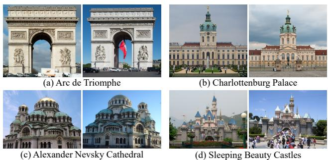
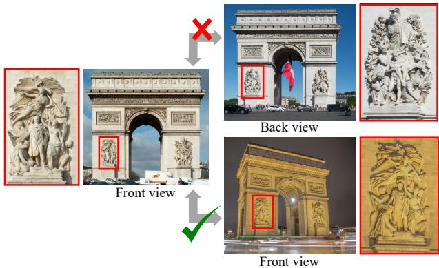
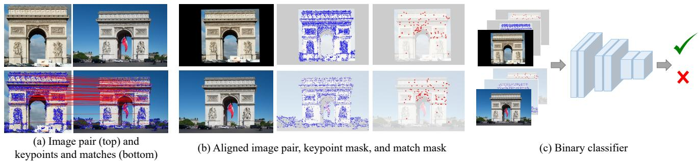
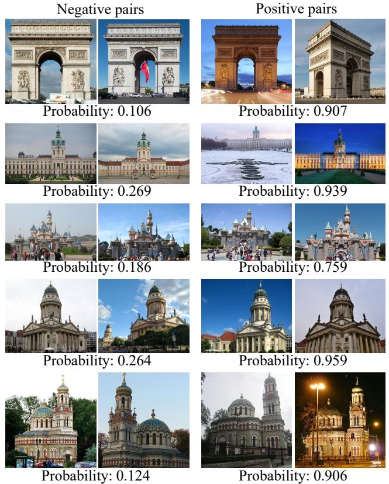
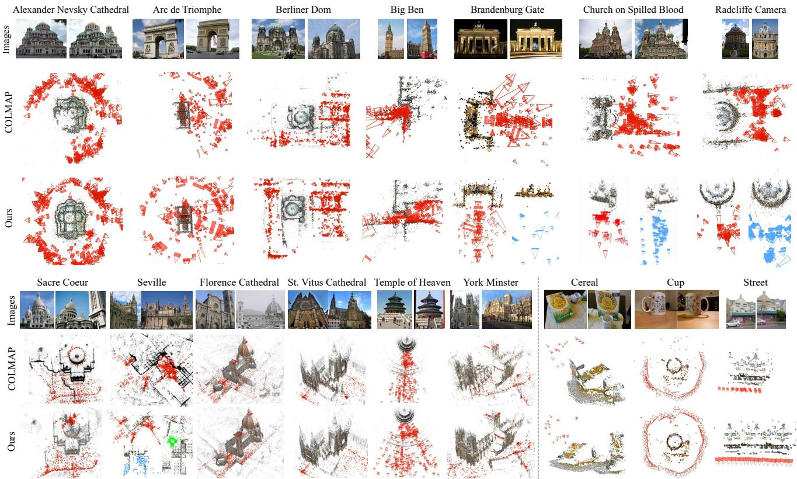

# Doppelgangers: Learning to Disambiguate Images of Similar Structures

Ruojin Cai1 Joseph Tung1 Qianqian Wang1 Hadar Averbuch-Elor2 Bharath Hariharan1 Noah Snavely1 1Cornell University 2Tel Aviv University

## Abstract

We consider the visual disambiguation task ofdetermin ing whether a pair ofvisually similar images depict the same or distinct 3D surfaces (e.g., the same or opposite sides of a symmetric building). Illusory image matches, where two images observe distinct but visually similar 3D surfaces, can be challenging for humans to differentiate, and can also lead 3D reconstruction algorithms to produce erroneous results. We propose a learning-based approach to visual disambiguation, formulating it as a binary classification task on image pairs. To that end, we introduce a new datasetfor this problem, Doppelgangers, which includes image pairs of similar structures with ground truth labels. We also design a network architecture that takes the spatial distribution of local keypoints and matches as input, allowing for better reasoning about both local and global cues. Our evaluation shows that our method can distinguish illusory matches in difficult cases, and can be integrated into SfM pipelines to produce correct, disambiguated 3D reconstructions. See our project page for our code, datasets, and more results: doppelgangers-3d.github.io.

## 1. Introduction

From time to time we are faced with the task of distinguishing between two things that are nearly indistinguishable, but are not the same object. Examples of such lookalikes include identical twin siblings, two similar keys on a keychain, and two cups on a table at a party—only one of which is ours. While these objects might look identical, there are often subtle cues we can use to tell them apart; for instance, even “identical” twins are not truly visually identical, but have perceptible differences.

Computer vision systems also face a version of this problem. In particular, our work considers geometric vision tasks like 3D reconstruction, where methods often must determine whether two images depict the exact same 3D surface in the world, or two different 3D surfaces that happen to look very similar—where wrong answers can lead to wrong 3D models. We call this task visual disambiguation, but you could also call it the Big Ben problem: London’s Big Ben is a clock tower with four-way symmetry, where the four sides of the tower look nearly the same. Local feature matching methods like SIFT easily confuse one side for another, finding many matches between distinct 3D surfaces. These spurious matches lead structure from motion methods to pro duce incorrect reconstructions where multiple sides collapse together. Yet views of different sides of Big Ben are not truly identical—the individual bricks are different, the backgrounds are different, etc. If matching methods knew what to look for, they could perhaps tell the different sides apart. Figure 1 shows other examples of this “spot the difference” problem—see if you can tell these structures apart yourself.

  
Figure 1. These image pairs observe distinct but visually similar 3D surfaces. Can you spot the differences and distinguish between the two images in each pair? Hints in the footnote.1 Such illusory image matches can fool humans, and also fool 3D reconstruction algorithms into thinking they share 3D correspondence. We propose a new method to disambiguate these kinds of false matches from image pairs that truly observe the same structure.

We call illusory image matches like those in Fig. 1 doppelgangers, after the idea of two distinct people or objects that look very similar. Prior methods for disambiguating doppelgangers in the context of 3D vision have devised heuristics that analyze the structure of a full image collection. In contrast, our paper explores the fundamental building block of pairwise image comparison: can we automatically determine whether two views are the same, or just similar? We formulate this visual disambiguation problem as a binary classification task on image pairs, and develop a learningbased solution.

Our solution involves assembling a new dataset, Doppelgangers, consisting of image pairs that either depict the same surface (positives) or two different, similar surfaces (negatives). Creating Doppelgangers involved a challenging data curation task, since even humans can struggle to distinguish same from similar. We show how to use existing image annotations stored in the Wikimedia Commons image database to automatically create a large set of labeled image pairs. We find that simply training a deep network model using these raw image pairs performs poorly. Therefore, we also design a network where we provide useful information in the form of local features and 2D correspondence.

On our Doppelgangers test set, we find that our method works remarkably well on challenging disambiguation tasks, and significantly better than baselines and alternative network designs. We also explore the use of our learned classifier as a simple pre-processing filter on scene graphs computed in structure from motion pipelines like COLMAP [31], and find that it significantly improves the correctness of reconstructions on a set of difficult scenes, outperforming more complex visual disambiguation algorithms.

In summary, our paper makes the following contributions:

• We formulate the visual disambiguation problem on pairs of images.

• Based on this formulation, we create the Doppelgangers Dataset, leveraging the existing cataloging of imagery on Wikimedia Commons.

• We design a network architecture well-suited for solving pairwise visual disambiguation as a classification problem. We show that training this network on our dataset leads to strong classification performance and downstream utility to SfM problems.

## 2. Related Work

Local feature matching methods have been wildly successful [23]. The combination of repeatability, discriminability, invariance to image transformations, and robustness to factors like partial occlusion make local features ideal for answering the question, Are these two images in correspondence?, solidifying them as a foundation for downstream tasks like image retrieval [32, 24, 3], near-duplicate detection [4], and structure from motion (SfM) [30, 33, 31].

However, these same properties make it hard for local feature matching methods to definitively answer the negation of this question: Are these two (possibly similar) images not in correspondence? The dominant assumption in local feature matching is that sufficiently many geometrically consistent feature matches are strong positive evidence that two images correspond; more rarely is negative evidence considered. This has remained true as deep learning has led to improvements in feature detection [7, 8], feature extraction [40, 25, 10, 26], and feature matching [41, 29]. Generally, these methods all still seek to find as many consistent correspondences as possible based on local appearance, but rarely consider global evidence that a pair of images might in reality be deceptively similar, non-overlapping views.

There are a few counterexamples to this view of feature matching. In bag-of-visual-words–based image retrieval methods, TF-IDF weighting is often used to downweight local features that occur across many images, because such features are poor evidence that images match [32]. Jegou and´ Chum go further and consider missing visual word matches as negative evidence for image-level matches [16]. Other methods consider the visual change detection problem, and specifically look for differences between two views of (usually) the same scene [28]. For SfM on Internet collections, a common problem are watermarks, timestamps, and frames (decorative borders) [36, 14]. These user-added visual elements yield spurious feature matches on otherwise unrelated images, which can often be filtered with heuristics.

Most related to our work are methods for disambiguation of image collections in the context of SfM. These methods attempt to fix the problem of broken 3D reconstructions in the face of repeated structures. Some SfM disambiguation methods carefully identify reliable matches [18], while many others identify cues for identifying spurious matches. A common approach is to look for evidence in the scene graph—the network of corresponding images computed during SfM—such as loops that lack geometric cycle consistency [43], graph structures that are inconsistent with physical 3D space [37], and graph geodesic constraints [39]. Other methods detect missing correspondences as a negative cue for image-level matches [42, 17, 5]. Heinly et al. go further and detect conflicting 3D observations in SfM models, such as images that observe 3D points that should be impossible to see because they would be occluded by some other, spurious geometry [13]. Other methods rely on non-visual information, like timestamps or image ordering [27]. Finally, the SLAM community has studied a related problem referred to as perceptual aliasing, where distinct locations within an environment (e.g., an office building with identical offices) yield similar visual fingerprints [1, 6, 19, 15].

Prior global methods often rely on hand-designed heuristics that can be brittle, can require manual parameter tuning for each individual reconstruction task, and can also over-segment correct 3D models. In contrast, our method is designed for the fundamental problem of two-frame visual disambiguation, which we solve by learning from data.

We find that our method can disambiguate a range of SfM datasets with minimal tuning. It considers cues distinct from those of global image connectivity methods, such as RGB values and spatial distributions of keypoints/matches, and can implicitly take advantage of both positive and negative signals (like missing correspondences). Surprisingly, we find that looking at pairs of images, without considering the full image collection, is sufficient to create correct reconstructions in nearly all of our experiments. Furthermore, our approach is also orthogonal to global structure–based methods, and could naturally be combined with them.

## 3. Visual disambiguation

Our work addresses the following visual disambiguation problem: Given two possibly very similar images, determine whether they depict the same physical 3D surface, or whether they are images of two different 3D surfaces. This is a binary classification task on image pairs. A true (positive) matching pair is one where both images depict the same physical 3D surface, while a false (negative) pair observes distinct 3D surfaces with no (or very few) identical 3D points in common. Illusory image matches—false pairs that look similar, which we also refer to as doppelgangers—occur when two images observe distinct but visually similar 3D surfaces.

Ambiguous image pairs can arise from symmetric buildings, repeated visual elements, and replicas of landmarks in different parts of the world. For example, consider the images of the Arc de Triomphe shown in Figure 2. At first glance, views of the front and back of this symmetric structure appear nearly identical. But on closer inspection we can observe differences between the two sides, such as the distinct sculptures. As this example illustrates, these cues can be hard to discern, as they can involve subtle differences amidst overall similar structures. This problem of distinguishing doppelgangers is even more challenging in the presence of varying illumination, viewpoint, and transient objects.

Doppelgangers are also problematic in practice, especially for 3D computer vision pipelines. These often rely on feature matching methods that may find many incorrect matches between illusory pairs. These incorrect matches can lead SfM methods to produce erroneous 3D reconstructions.

We find that simple classification schemes like thresholding on the number of feature matches do not suffice to identify doppelgangers. Prior image collection–level methods for visual disambiguation, discussed in Section 2, cannot disambiguate individual image pairs, and can be brittle in practice or require time-consuming parameter tuning.

In contrast, we propose a learning-based approach that trains a binary classifier on image pairs. Since, we know of no existing dataset for visual disambiguation, we collect a new dataset of image pairs with carefully produced ground truth labels (Section 4). Our goal is to differentiate illusory matches, even when there are only subtle differences in small regions. To achieve this, we propose a deep network that takes the spatial distribution of keypoint and matches as input to better reason about both local features and global and image-level information, as described in Section 5.

  
Figure 2. Images captured from highly symmetric landmarks, such as the Arc de Triomphe, are difficult to disambiguate into true and false matching pairs due to repeated structures. However, by zooming into the sculptures, highlighted in red boxes, we can uncover subtle differences between the front and back sides, allowing us to differentiate between them.

## 4. The Doppelgangers Dataset

We present the Doppelgangers Dataset, a benchmark dataset that allows for training and standardized evaluation of visual disambiguation algorithms. Doppelgangers consists of a collection of internet photos of world landmarks and cultural sites that exhibit repeated patterns and symmetric structures. The dataset includes a large number of image pairs, each labeled as either positive or negative based on whether they are true or false (illusory) matching pairs. It is relatively easy to find image pairs in the wild that are correctly matching (positives). It is much more difficult to find and accurately label negative image pairs. Below, we describe how we tackle this data gathering problem.

## 4.1. Mining Wikimedia Commons

Inspired by the Google Landmarks [35] and WikiScenes datasets [38], Doppelgangers is collected from Wikimedia Commons. Wikimedia Commons has an extensive collection of freely available images contributed by the public. These include a large number of photos of world landmarks, organized into a hierarchy of categories. In some landmark categories, there exists sub-categories organized according to information like viewing direction (e.g., North/South), providing valuable annotations for inferring geometric relationships between images. For instance, the category consisting of exterior images of the Eglise de la´ Madeleine (a church in Paris) is called Exterior of Eglise de´ la Madeleine, with sub-categories that include North facade of Eglise de la Madeleine´ and South facade of Eglise de la´

Madeleine. We assemble a list of landmark categories with sub-categories that contain keywords related to directions, such as “North”, “South”, “East”, “West”, “Left”, “Right”, “Front”, and “Back”. Following [38], we recursively download images from all sub-categories in the list to obtain an initial set of images for each landmark. We also identified a few other visually ambiguous landmark categories for our dataset, such as replicated Disneyland castles and the Deutscher und Franzosischer Dom.¨

## 4.2. Deriving image pairs with ground truth labels

One approach to creating and labeling image pairs would rely solely on the directional labels on images induced by their Wikimedia Commons category. In particular, if two images of the same landmark are captured from the same direction (e.g., both from the north), we could label them a positive pair, whereas if they are captured from opposite directions (e.g., one from the north and one from the south), we could label them a negative pair, since images of opposite building faces are unlikely to have any true overlap. However, this approach can produce positive pairs that lack correspondence, because two images of the same building face may not overlap (e.g., two closeups of different details). Similar logic applies to negative pairs: we are mainly interested in hard negatives, i.e., images of different surfaces where feature matching yields spurious correspondences. Hence, we need a way to mine for “interesting” pairs.

Finding potential doppelgangers by image matching. To identify interesting image pairs that share putative correspondence (correctly or incorrectly), we use the feature matching module in COLMAP [31], a state-of-the-art SfM system. This process yields a set of putative matching image pairs for each landmark in our dataset, along with local keypoints for each image and pairwise matches between image pairs. We only include image pairs that have such pairwise matches in our dataset, ensuring visual similarity between the included pairs. For positive pairs, this means they exhibit overlap, and for negative pairs, they depict different but similar structures.

Augmentation with image flipping. Some landmarks may not naturally form negative pairs because they lack similar structures when viewed from opposite directions. Therefore, it can be more difficult to find negative pairs compared to positive pairs (which are extremely abundant). When contemplating how to increase the number of negative training pairs, we were inspired by the image pairs like the one shown in Figure 1(c), where the opposite views of some buildings resemble a 2D image flip. Horizontally flipping one image in a pair changes it to a different, mirror-image scene [22], but feature matches on similar structures may still exist. Therefore, to increase the variety of scenes in our training data, we sample a positive pair and flip one of the images, resulting in a negative pair—a pair of similar images that nonetheless correspond to different (mirror image) surfaces. Unlike traditional data augmentation that generates more samples with the same label, our approach transforms a positive pair into a negative pair. Note that we only use such synthetic augmented pairs for training and not as test data.

## 4.3. Dataset statistics

The above process results in ∼76K internet photos of 222 world landmarks and cultural sites, and yields over 1M visually similar image pairs. Among these pairs, 178K are labeled as negative pairs. We provide additional data collection details and statistics in the supplemental material.

Of the 222 scenes, 58 naturally form negative pairs. Of these 58, we split off 16 scenes (and sample 4,660 image pairs) as a test set, divided evenly into positive and negative pairs. From the 42 scenes remaining for the training set, we sample a maximum of 3K pairs per scene to ensure balance across landmarks during training. These 42 scenes contribute to 73K training pairs, again divided nearly evenly between positive and negative pairs.

Our proposed flipping augmentation on Wikimedia Commons imagery yields an additional 92K training pairs across 164 scenes. To further augment negative pairs for use in training, we also applied the flipping augmentation to matching image pairs from MegaDepth [20], a large dataset of multi-view Internet photo collections. MegaDepth adds an additional 57K training pairs from 72 scenes.

## 5. Classifying visually ambiguous pairs

We now describe how we design a classifier for visual disambiguation. A straightforward solution would be to train a network to take as input a raw image pair, and to output the probability that this pair is a positive match. However, we found that this approach works poorly even starting from pre-trained models and state-of-the-art architectures [2, 9]. Visual disambiguation is a hard problem, and we conjecture that it is difficult for a network to discover all the necessary subtle cues from raw RGB images alone.

To gain insight into the problem, consider the front and back views shown in Figure 2. The task is similar to a “spot-the-difference” game, where we would look for image regions that should correspond, but don’t. For instance, in Figure 2, the sculptures should match across the views, but are different. We might also note mismatched structures in the background or even on low-level details like individual bricks. To allow the network to perform similar reasoning, we provide it with information about the spatial distribution of distinctive keypoints and keypoint matches. In addition, we perform a rough alignment of the images to allow the network to directly compare corresponding regions. We describe these enhancements below.

  
Figure 3. Method overview. (a) Given a pair of images, we extract keypoints and matches via feature matching methods. Note that this is a negative (doppelganger) pair picturing opposite sides of the Arc de Triomphe. The feature matches are primarily in the top part of the structure, where there are repeated elements, as opposed to the sculptures on the bottom part. (b) We create binary masks of keypoints and matches. We then align the image pair and masks with an affine transformation estimated from matches. (c) Our classifier takes the concatenation of the images and binary masks as input and outputs the probability that the given pair is positive.

## 5.1. Spatial distribution of keypoints and matches

Given two input images, as a pre-processing step, we compute keypoint matches between them, then use RANSAC [11] to estimate a Fundamental matrix and filter out outlier matches. We provide the locations of all detected keypoints, as well as all (filtered) matches as an additional network input in the form of two binary mask images.

The idea is that the keypoint and match locations provide useful signals to the network. For instance, by showing the network where keypoint matches were found, it also lets the network know where matches weren’t found (where there are keypoints but no matches). Such regions may indicate missing or distinct objects. The network can also compute other signals if it chooses, like the raw number of matches (a reasonable baseline for visual disambiguation). As an example, we illustrate SIFT keypoints and matches for a doppelganger pair in Figure 3(a). We see that matches are denser in regions with visually similar structures, but much sparser in regions with distinct structures such as sculptures.

In particular, for an image pair $\left( I _ { a } , I _ { b } \right)$ (of dimensions $H \times W )$ , we extract keypoints and matches. We denote the set of keypoints for image $I _ { a }$ as $\mathcal { K } _ { a } = \{ \mathbf { x } _ { i } ^ { a } \} _ { i = 1 } ^ { N _ { a } }$ , where $\mathbf { x } _ { i } ^ { a }$ is the pixel location of the $i ^ { \mathrm { { t h } } }$ keypoint. Similarly, we denote matches between this image pair as a set of keypoint pairs $\mathcal { M } _ { a , b } = \{ ( \mathbf { x } _ { i _ { k } } ^ { a } , \mathbf { x } _ { j _ { k } } ^ { b } ) \} _ { k = 1 } ^ { M _ { a , b } }$ . We create a binary mask of keypoints ${ \bf K } _ { a } \in \{ 0 , 1 \} ^ { \bar { H } \times W }$ using the keypoints $\kappa _ { a }$ , where pixels corresponding to keypoints (rounded to grid location) are set to one, and other pixels are set to zero. Similarly, we create a binary mask of matches $\mathbf { M } _ { a , b } ^ { a } \in \{ 0 , 1 \} ^ { H \times W }$ for $I _ { a } ,$ where pixels corresponding to matches are set to one, and all other pixels are set to zero. These keypoint and match masks are illustrated in Figure 3(b). Our classifier takes these masks as input, along with the RGB image pair.

Alignment for better comparison. To facilitate comparison of potentially corresponding regions, we also perform a rough geometric alignment of the input image pair. We estimate an affine transform T from the matches ${ \mathcal { M } } _ { a , b } ,$ , and warp the images and the binary masks accordingly. Fig ure 3(b) shows an example. Note that the alignment need not be perfect; the goal is simply to bring regions that the network might wish to compare closer together.

## 5.2. Binary classification

As illustrated in Figure 3(c), our classifier $F _ { \theta }$ takes an image pair and derived binary keypoint and match masks as input, and outputs the probability that the pair is a positive match. We concatenate the RGB images and masks for both images into a 6 + 4 = 10-channel input tensor. To optimize our classifier $F _ { \theta } ,$ we use a focal loss [21], a modified version of the cross-entropy loss. The focal loss improves performance by balancing the distribution of positive and negative pairs, and giving more weight to hard examples.

## 5.3. Implementation details

Keypoint and match masks. After resizing and padding each image to 1024 × 1024 resolution, we compute matches using LoFTR [34], a detector-free, learned local feature matching method. We use a LoFTR model pretrained on MegaDepth [20], which focuses on outdoor scenes. We then perform geometric verification using RANSAC [11], and establish the keypoint mask using all LoFTR output matches and the match mask using geometrically verified matches.

Network and training. The classifier $F _ { \theta }$ consists of 3 residual blocks [12], an average pooling layer, and a fully connected layer. We train for 10 epochs with a batch size of 16 using the Adam optimizer with an initial learning rate of $5 \times 1 0 ^ { - 4 }$ . The learning rate is linearly decayed to $5 \times 1 0 ^ { - 6 }$ from epoch 5 onwards. Additional implementation details are provided in the supplemental material.

<table><tr><td></td><td colspan="2">SIFT [23]+RANSAC [11]</td><td colspan="2">LoFTR [34]</td><td colspan="2">DINO [2]-ViT</td><td rowspan="2">Ours</td></tr><tr><td></td><td>#matches</td><td>%matches</td><td>#matches</td><td>%matches</td><td>Latent code</td><td>Feature map</td></tr><tr><td>Average precision</td><td>83.4</td><td>81.2</td><td>85.3</td><td>86.0</td><td>62.0</td><td>63.3</td><td>95.2</td></tr><tr><td>ROC AUC</td><td>80.2</td><td>77.1</td><td>78.9</td><td>80.3</td><td>60.9</td><td>61.5</td><td>93.8</td></tr><tr><td>Alexander Nevsky Cathedral, Łódź</td><td>72.7</td><td>75.9</td><td>80.7</td><td>80.4</td><td>50.9</td><td>50.3</td><td>89.5</td></tr><tr><td>Alexander Nevsky Cathedral, Sofia</td><td>89.5</td><td>87.6</td><td>90.0</td><td>92.2</td><td>53.0</td><td>53.6</td><td>98.5</td></tr><tr><td>Alexander Nevsky Cathedral, Tallinn</td><td>73.1</td><td>76.0</td><td>76.1</td><td>80.3</td><td>58.8</td><td>50.8</td><td>86.2</td></tr><tr><td>Arc de Triomphe</td><td>86.1</td><td>81.7</td><td>85.7</td><td>93.3</td><td>55.4</td><td>61.1</td><td>97.6</td></tr><tr><td>Berlin Cathedral</td><td>91.8</td><td>91.6</td><td>93.6</td><td>92.7</td><td>76.4</td><td>70.6</td><td>99.4</td></tr><tr><td>Brandenburg Gate</td><td>79.3</td><td>73.7</td><td>90.9</td><td>95.6</td><td>60.8</td><td>60.9</td><td>99.8</td></tr><tr><td>Cathedral of Saints Peter and Paul in Brno</td><td>95.8</td><td>96.4</td><td>89.8</td><td>88.4</td><td>64.6</td><td>79.9</td><td>99.8</td></tr><tr><td>Cathedral of St Alexander Nevsky, Prešov</td><td>82.5</td><td>74.0</td><td>86.1</td><td>85.3</td><td>62.9</td><td>64.8</td><td>94.6</td></tr><tr><td>Charlottenburg Palace</td><td>81.5</td><td>76.1</td><td>85.6</td><td>81.1</td><td>65.8</td><td>54.1</td><td>93.3</td></tr><tr><td>Church of Savior on the Spilled Blood</td><td>82.1</td><td>73.2</td><td>84.9</td><td>75.5</td><td>63.9</td><td>67.5</td><td>93.8</td></tr><tr><td>Deutscher und Französischer Dom (Berlin)</td><td>74.5</td><td>71.9</td><td>85.8</td><td>84.2</td><td>55.6</td><td>51.5</td><td>98.1</td></tr><tr><td>Florence Cathedral</td><td>90.6</td><td>83.8</td><td>84.5</td><td>82.0</td><td>54.6</td><td>63.8</td><td>94.2</td></tr><tr><td>Sleeping Beauty Castle</td><td>81.1</td><td>81.2</td><td>75.0</td><td>85.6</td><td>67.2</td><td>66.4</td><td>97.1</td></tr><tr><td>St. Vitus Cathedral</td><td>96.8</td><td>88.0</td><td>89.2</td><td>87.5</td><td>84.0</td><td>77.0</td><td>99.8</td></tr><tr><td>Sydney Harbour Bridge</td><td>79.4</td><td>92.3</td><td>83.8</td><td>86.2</td><td>53.0</td><td>75.5</td><td>87.0</td></tr><tr><td>Washington Square Arch</td><td>77.7</td><td>75.9</td><td>82.8</td><td>86.0</td><td>65.2</td><td>65.0</td><td>95.1</td></tr></table>

Table 1. Quantitative results for visual disambiguation evaluated on the Doppelgangers test set. The first two rows show the average precision and ROC AUC multiplied by 100, respectively, averaged over the 16 test scenes. The remaining rows show the average precision, multiplied by 100, for each individual scene. #matches refers to thresholding the number of matches and %matches refers to thresholding the ratio of the number of matches to the number of keypoints, as described in Section 6.1.

## 6. Experiments

In this section, we evaluate our visual disambiguation method on the Doppelgangers dataset. We then discuss how our pairwise classifier can be integrated into a SfM pipeline for reconstructing visually ambiguous image collections. Our experimental results demonstrate the effectiveness and generalization power of our method for SfM disambiguation. Finally, we provide an ablation study to validate the effectiveness of each component in our network design.

## 6.1. Visual disambiguation

Baselines. We compare our method to three baselines:

One set of baselines simply uses the number of local feature matches to predict if an image pair is a positive (true) match. We evaluate two feature matching baselines, one based on SIFT [23] and one on LoFTR [34]. Both SIFT and LoFTR matches are filtered via geometric verification using RANSAC, yielding a cleaner set of matches for use in classification. Our baselines use these matches in two ways: (1) thresholding the number of matches after geometric verification, and (2) thresholding the ratio of the number of matches to the number of keypoints. The idea behind (2) is that if there are few matches relative to the number of keypoints, that may be a sign that the pair is a doppelganger.

In addition, we compare our method to DINO [2], selfsupervised features that achieve state-of-the-art image classification and semantic segmentation results. We train a classifier using on the latent codes and feature maps produced by the pretrained DINO model.

Quantitative results. Table 1 presents quantitative results for visual disambiguation evaluated on the Doppelgangers test set, reported in terms of average precision (AP) and ROC AUC score, averaged across the 16 test scenes. Our method outperforms all other baselines with an AP of 95.2% and ROC AUC of 93.8%. DINO produces much poorer results, possibly because it generates features that are wellsuited for semantic classification tasks but not for visual disambiguation. For feature matching methods, we find that the number (or ratio) of matches alone is insufficient to perform well on this task. Our method can leverage not only the number of matches, but also rich information about the spatial distribution of keypoints and matches.

Visualizing test pairs. We show a visualization of test pairs along with our network’s prediction scores in Figure 4. The test set covers a variety of scenes and includes different types of visual ambiguity, such as symmetric structures, replicas of landmarks, and twin buildings. The pairs on the left of the figure are doppelgangers that are visually challenging to distinguish. Our network confidently predicts them as negative pairs. On the right of the figure, we show positive pairs with varying viewpoint and illumination. Our method correctly recognizes them as depicting the same 3D surfaces.

Further details on the baseline implementations, additional comparisons with D2-Net+RANSAC [10, 11] and SuperPoint+SuperGlue [8, 29], more quantitative results (including per-scene results, confusion matrices, precisionrecall curves, and false positive rates), and failure cases discussion are provided in the supplemental material.

  
Figure 4. Visual disambiguation results. We display test pairs and their corresponding probability of being a positive match, as predicted by our network. Negative pairs are shown in the left column and positives in the right column. Note that our network cleanly separates the negative and positive pairs by score, including in the presence of varying illumination and other factors.

## 6.2. Structure from motion disambiguation

We integrate our binary classifier into COLMAP’s SfM pipeline [31] to evaluate its use in disambiguating scenes with duplicate and symmetric structures.

Benchmark data. We evaluate our method’s use on the SfM problem on benchmark datasets from Heinly et al. [13], Wilson et al. [37], and Roberts et al. [27], along with several datasets we collected from Flickr. Altogether, we consider two kinds of datasets: Internet photo collections of landmarks (13 landmarks that are difficult to reconstruct due to symmetric and repeated structures), and three non-landmark collections with repeated or duplicate structures from [27] that significantly differ from our training data. Our model is primarily trained on landmark collections, but we include the non-landmark scenes from [27] to evaluate its generalization ability to different types of collections. Table 2 shows the number of images in each scene. These scenes are not present in our training data.

Integrating our method into SfM. SfM takes a collection of images $\mathcal { T } = \{ I _ { i } \} _ { i = 1 } ^ { n }$ as input. A feature extraction and matching stage first produces a set of image pairs with geometrically verified matches, with these pairs denoted as $\mathcal { P } = \{ ( I _ { a } , I _ { b } ) | a , b \in \{ 1 , . . . , N _ { \mathbb { Z } } \} \}$ . A scene graph $\mathcal { G } = ( \mathcal { I } , \mathcal { P } )$ is then established, with images as nodes and image pairs as edges. A reconstruction stage then takes G as input and computes camera poses for a subset of images, along with a 3D point cloud.

Illusory image pairs with repeated and symmetric structures can produce spurious matches, leading to broken reconstructions. To detect and remove the illusory pairs, we use our binary classifier as a filter on the edges of the scene graph. Our classifier outputs a probability that an image pair $\left( I _ { a } , I _ { b } \right)$ in P is a positive pair, which we can then threshold to remove edges from the scene graph with probability lower than a threshold τ. If the classifier removes all incorrect edges (and only those edges), SfM can produce a disambiguated, correct reconstruction. However, if the classifier removes too few edges, the reconstruction may still be incorrect; if it removes too many edges, the scene graph may break apart and result in several partial reconstructions. Hence, this task is a good test for the performance of a pairwise classifier.

Baselines. We compare our method with several baselines, including “vanilla” COLMAP [31], which is a state-of-theart SfM system. The default threshold for the number of matches for a valid image pair in COLMAP is 15. We also consider the simple baseline of setting a much higher threshold of 150 matches to remove potential doppelganger pairs. Additionally, we compare our method to four SfM disambiguation methods: Heinly et al. [13] propose a postprocessing method that analyzes reprojected geometry conflicts between images. Wilson et al. [37] prunes bad tracks, while Cui et al. [5] and Yan et al. [39] filter out incorrect matches between images prior to SfM. These methods are based on heuristics that consider a collection of images at a time. We utilize the default hyperparameters provided in the GitHub implementations of [13]2 and [37]3, respectively. For [5, 39], we follow the implementation provided in the COLMAP disambiguation GitHub repository4, and use hyperparameters tuned for the Alexander Nevsky Cathedral landmark on other landmark scenes, and hyperparameters tuned for the Street scene on other datasets from [27]. For our method, we use the same probability threshold across all landmarks, without tuning per scene.

Reconstruction results. The reconstruction results are summarized in Table 2. SfM successes and failures are identified by checking for conflicts between the reconstruction and the corresponding images or 3D mesh from Google Earth.

<table><tr><td colspan="2"></td><td>Images</td><td>COLMAP [31]</td><td>[31] #matches&gt;150</td><td>Heinly et al. [13]</td><td>Wilson et al. [37]</td><td>Cui et al. [5]</td><td>Yan et al. [39]</td><td>Ours</td></tr><tr><td rowspan="10">Inte arks Othrs</td><td>Alexander Nevsky Cathedral [13]</td><td>448</td><td>x</td><td>x</td><td>√</td><td>x</td><td>√</td><td>√</td><td>√</td></tr><tr><td>Arc de Triomphe [13]</td><td>434</td><td>x</td><td>x</td><td>√</td><td>x</td><td>x</td><td>√</td><td>√</td></tr><tr><td>Berliner Dom [13]</td><td>1,618</td><td>x</td><td>√</td><td>√</td><td>X*</td><td>√</td><td>X*</td><td>√</td></tr><tr><td>Big Ben [13]</td><td>402</td><td>x</td><td>x</td><td>√</td><td>x</td><td>√</td><td>x</td><td>√</td></tr><tr><td>Brandenburg Gate [13]</td><td>175</td><td>x</td><td>√</td><td>√</td><td>一</td><td>x</td><td>x</td><td>√</td></tr><tr><td>Church on Spilled Blood [13]</td><td>277</td><td>x</td><td>x</td><td>√</td><td>1</td><td>x</td><td>x</td><td>x</td></tr><tr><td>Radcliffe camera [13]</td><td>282</td><td>x</td><td>√</td><td>√</td><td>X*</td><td>√</td><td>√</td><td>√</td></tr><tr><td>Sacre Coeur [37]</td><td>5,450</td><td>x</td><td>x</td><td>√†</td><td>X*</td><td></td><td>X*</td><td>x</td></tr><tr><td>Seville [37]</td><td>2,396</td><td>x</td><td>√</td><td>x</td><td>√</td><td></td><td>X*</td><td>√</td></tr><tr><td>Florence Cathedral [Flickr] St. Vitus Cathedral [Flickr]</td><td>8,674 5,059</td><td>x</td><td>x</td><td>1 √</td><td>x</td><td></td><td>√</td><td>√</td></tr><tr><td>Temple of Heaven [Flickr]</td><td>1,538</td><td>x x</td><td>x</td><td></td><td>√ x</td><td></td><td>X*</td><td>√</td></tr><tr><td>York Minster [Flickr]</td><td>3,902</td><td>x</td><td>x √</td><td>x x</td><td>x</td><td></td><td>X*</td><td>√</td></tr><tr><td></td><td></td><td></td><td></td><td></td><td></td><td>1</td><td>x</td><td>√</td></tr><tr><td>Cereal [27]</td><td>25</td><td>x</td><td>x</td><td>√</td><td>x</td><td>x</td><td>√</td><td>x</td></tr><tr><td>Cup [27]</td><td>64</td><td>x</td><td>x</td><td>x</td><td>x</td><td>x</td><td>√</td><td>√</td></tr><tr><td>Street [27]</td><td>Number of scenes: √/X*/X</td><td>19</td><td>x 0/0/16</td><td>x 5/0/11</td><td>x 10/0/5</td><td>x 2/3/9</td><td>√ 5/0/5</td><td>1</td><td>X*</td></tr></table>

Table 2. Structure from Motion disambiguation results. ✓ means that a scene is correctly disambiguated and reconstructed. ✗ means that a method fails to disambiguate the scene, and ✗\* means a scene is over-split. ‘–’ means that a method fails to produce a reconstruction. [13] fails to generate a reconstruction for Florence Cathedral (>8k images) due to memory issues. [37] requires focal length information, which is unavailable for the Brandenburg Gate and Church on Spilled Blood datasets. [5] fails to produce results on large-scale scenes due to numerical errors. With a single threshold, our method successfully reconstructs 12 out of 16 scenes. †The Sacre Coeur result from [13] uses a different subset of images as reported in their paper.

Our method successfully disambiguates and reconstructs 12 out of 16 scenes all using the same parameter settings, achieving the highest number of correctly reconstructed scenes of all methods. We also evaluated our method using several probability thresholds, and found the results to be robust to the setting of the threshold (more results in supplemental). The generalization ability of our learning-based method is evident from the fact that it can be applied to new scenes that haven’t been observed during training, without the need for fine-tuning or parameter tuning.

Our method fails on a few test scenes with the default threshold, but we found our method can successfully disambiguate through threshold tuning. No method, except [13], reconstructs the Church on Spilled Blood correctly. How ever, we found that with a higher score threshold, our method correctly splits this scene into sub-models (as there is insufficient overlap in the input images to produce a single unified model). This suggests that the scene is particularly challenging to disambiguate, requiring a more stringent threshold to filter out illusory image pairs. We observe a similar pattern with the Sacre Coeur dataset. Our method with default settings fails on the Cereal and Street datasets from [27], which are quite different from our training scenes. However, we found that our method can accurately reconstruct without over-splitting on both scenes by tuning the threshold. These results imply that probabilities predicted by our model maintain a reasonable ordering, with lower probabilities assigned to illusory image pairs and higher probabilities to positive pairs. The need for tuning is likely due to the difference in domain between our training data and the datasets from [27].

We show reconstructions produced by vanilla COLMAP and those disambiguated with our method in Figure 5. Vanilla COLMAP yields ghost structures such as extra towers, domes, and facades for landmarks like Alexander Nevsky Cathedral, Berliner Dom, Church on Spilled Blood, Sacre Coeur, Seville, Florence Cathedral, and St. Vitus Cathedral. It produces reconstructions that collapse to one side for landmarks like the two-way symmetric Arc de Triomphe and Brandenburg Gate, the four-way symmetric Big Ben and the tower of York Minster, the dome of Radcliffe Camera, and the highly symmetric Temple of Heaven. Our method can disambiguate the range of ambiguities that appear in these scenes, resulting in correct COLMAP reconstructions.

<table><tr><td>Backbone</td><td>CNN (Full) Transformer</td><td>95.2 95.5</td></tr><tr><td>Dataset</td><td>w/o Augmentation</td><td>93.6</td></tr><tr><td rowspan="3">Design</td><td>w/o Masks</td><td>64.7</td></tr><tr><td>SIFT+RANSAC masks</td><td>87.6</td></tr><tr><td>w/o Alignment</td><td>92.3</td></tr></table>

Table 3. Ablation study of backbone selection, dataset augmentation, and network input design. Results are reported as average precision times 100.

## 6.3. Ablation study

We conduct an ablation study to evaluate three factors: backbone selection, dataset augmentation, and network input design. The results, reported as average precision scores, are shown in Table 3. Additional ablations on combination of factors are provided in the supplemental material.

  
Figure 5. Visualization of Structure from Motion disambiguation results. We show a doppelganger pair at the top of each scene, vanilla COLMAP reconstructions in the middle, and our method’s disambiguated reconstructions at the bottom. Note that for some landmarks, the correct reconstruction is separated into multiple components when disambiguated due to a lack of camera views from sufficient viewpoints (shown as multiple submodels with red, blue, and green cameras). Our results are generated using the same threshold on the image match probabilities, except for the Church on Spilled Blood, Cereal, and Street datasets.

In the Transformer experiment, we replace the CNN backbone with a vision transformer; we find that this setting achieves comparable results, but with longer training time. In the w/o Augmentation experiment, we train the classifier on 42 scenes without flip augmentations. This setting results in lower performance, indicating that our flip augmentation effectively increases the amount of useful training data.

The remaining variations are trained on the dataset of 42 scenes without augmentation for speed of training.

Keypoint and match masks. In the w/o Masks setting, the keypoint and match masks are removed from the input, leaving only RGB images. This significantly degrades visual disambiguation performance, with a drop in average precision from 93.6% to 64.7%, validating the importance of the keypoint and match masks as network inputs. In the SIFT+RANSAC masks experiment, the LoFTR keypoint and match masks are replaced with masks computed with SIFT+RANSAC, leading to degraded performance due to the lower quality of SIFT+RANSAC masks compared to those from LoFTR. However, this version still outperforms other baselines.

Alignment. In the w/o Alignment experiment, we do not align the input pair, resulting in a decrease in average precision from 93.6% to 92.3%.

## 7. Conclusion

We tackle the visual disambiguation problem by framing it as a binary classification task on image pairs. We propose a learning-based approach, and collect a new dataset, Dop pelgangers, which consists of visually similar image pairs with binary labels. We design a classification network that leverages local features and matches. Our experiments show that our method outperforms baselines and alternative network designs, achieving surprisingly good performance on this challenging disambiguation task. Furthermore, we integrate our learned classifier into an SfM pipeline and show that it can produce correctly disambiguated reconstructions on difficult landmarks.

Acknowledgements. We thank Zhengqi Li, David Fouhey, and Bill Freeman for their valuable discussions. This work was supported in part by a Snap Research Fellowship and by the National Science Foundation (IIS-2008313).

## References

[1] Adrien Angeli, Stephane Doncieux, Jean-Arcady Meyer, and´ David Filliat. Incremental vision-based topological slam. In 2008 IEEE/RSJ International Conference on Intelligent Robots and Systems, pages 1031–1036. Ieee, 2008. 2

[2] Mathilde Caron, Hugo Touvron, Ishan Misra, Herve J ´ egou,´ Julien Mairal, Piotr Bojanowski, and Armand Joulin. Emerging properties in self-supervised vision transformers. In ICCV, pages 9650–9660, 2021. 4, 6

[3] Ondrej Chum, James Philbin, Josef Sivic, Michael Isard, and Andrew Zisserman. Total Recall: Automatic query expansion with a generative feature model for object retrieval. In ICCV, 2007. 2

[4] Ondrej Chum, James Philbin, and Andrew Zisserman. Near duplicate image detection: min-Hash and tf-idf weighting. In BMVC, 2008. 2

[5] Zhaopeng Cui and Ping Tan. Global structure-from-motion by similarity averaging. In ICCV, pages 864–872, 2015. 2, 7, 8

[6] Mark Cummins and Paul Newman. Appearance-only slam at large scale with fab-map 2.0. The International Journal of Robotics Research, 30(9):1100–1123, 2011. 2

[7] Daniel DeTone, Tomasz Malisiewicz, and Andrew Rabinovich. Toward geometric deep slam. arXiv preprint arXiv:1707.07410, 2017. 2

[8] Daniel DeTone, Tomasz Malisiewicz, and Andrew Rabinovich. Superpoint: Self-supervised interest point detection and description. In CVPRW, pages 224–236, 2018. 2, 6

[9] Alexey Dosovitskiy, Lucas Beyer, Alexander Kolesnikov, Dirk Weissenborn, Xiaohua Zhai, Thomas Unterthiner, Mostafa Dehghani, Matthias Minderer, Georg Heigold, Sylvain Gelly, Jakob Uszkoreit, and Neil Houlsby. An image is worth 16x16 words: Transformers for image recognition at scale. ICLR, 2021. 4

[10] Mihai Dusmanu, Ignacio Rocco, Tomas Pajdla, Marc Pollefeys, Josef Sivic, Akihiko Torii, and Torsten Sattler. D2-net: A trainable cnn for joint detection and description of local features. arXiv preprint arXiv:1905.03561, 2019. 2, 6

[11] Martin A Fischler and Robert C Bolles. Random sample consensus: a paradigm for model fitting with applications to image analysis and automated cartography. Communications ofthe ACM, 24(6):381–395, 1981. 5, 6

[12] Kaiming He, Xiangyu Zhang, Shaoqing Ren, and Jian Sun. Deep residual learning for image recognition. In CVPR, pages 770–778, 2016. 5

[13] Jared Heinly, Enrique Dunn, and Jan-Michael Frahm. Correcting for duplicate scene structure in sparse 3d reconstruction. In ECCV, 2014. 2, 7, 8

[14] Jared Heinly, Johannes Lutz Schonberger, Enrique Dunn, and¨ Jan-Michael Frahm. Reconstructing the World\* in Six Days \*(As Captured by the Yahoo 100 Million Image Dataset). In CVPR, 2015. 2

[15] Muhammad Haris Ikram, Saran Khaliq, Muhammad Latif Anjum, and Wajahat Hussain. Perceptual aliasing++: Adversarial attack for visual slam front-end and back-end. IEEE Robotics and Automation Letters, 7(2):4670–4677, 2022. 2

[16] Herve J´ egou and Ond´ ˇrej Chum. Negative evidences and co-occurences in image retrieval: The benefit of pca and whitening. In ECCV, 2012. 2

[17] Nianjuan Jiang, Ping Tan, and Loong-Fah Cheong. Seeing double without confusion: Structure-from-motion in highly ambiguous scenes. In CVPR, pages 1458–1465. IEEE, 2012. 2

[18] Rajbir Kataria, Joseph DeGol, and Derek Hoiem. Improving structure from motion with reliable resectioning. In 2020 international conference on 3D vision (3DV), pages 41–50. IEEE, 2020. 2

[19] Pierre-Yves Lajoie, Siyi Hu, Giovanni Beltrame, and Luca Carlone. Modeling perceptual aliasing in slam via discrete– continuous graphical models. IEEE Robotics and Automation Letters, 4(2):1232–1239, 2019. 2

[20] Zhengqi Li and Noah Snavely. Megadepth: Learning singleview depth prediction from internet photos. In CVPR, pages 2041–2050, 2018. 4, 5

[21] Tsung-Yi Lin, Priya Goyal, Ross Girshick, Kaiming He, and Piotr Dollar. Focal loss for dense object detection. In´ ICCV, pages 2980–2988, 2017. 5

[22] Zhiqiu Lin, Jin Sun, Abe Davis, and Noah Snavely. Visual chirality. In CVPR, pages 12295–12303, 2020. 4

[23] David G Lowe. Distinctive image features from scaleinvariant keypoints. IJCV, 60:91–110, 2004. 2, 6

[24] D. Nister and H. Stewenius. Scalable recognition with a vocabulary tree. In CVPR, 2006. 2

[25] Yuki Ono, Eduard Trulls, Pascal Fua, and Kwang Moo Yi. Lf-net: Learning local features from images. NeurIPS, 31, 2018. 2

[26] Jerome Revaud, Philippe Weinzaepfel, Cesar De Souza, Noe´ Pion, Gabriela Csurka, Yohann Cabon, and Martin Humenberger. R2d2: repeatable and reliable detector and descriptor. arXiv preprint arXiv:1906.06195, 2019. 2

[27] Richard Roberts, Sudipta N Sinha, Richard Szeliski, and Drew Steedly. Structure from motion for scenes with large duplicate structures. In CVPR, pages 3137–3144. IEEE, 2011. 2, 7, 8

[28] Ragav Sachdeva and Andrew Zisserman. The change you want to see. In WACV, 2023. 2

[29] Paul-Edouard Sarlin, Daniel DeTone, Tomasz Malisiewicz, and Andrew Rabinovich. Superglue: Learning feature matching with graph neural networks. In CVPR, pages 4938–4947, 2020. 2, 6

[30] Frederik Schaffalitzky and Andrew Zisserman. Multi-view matching for unordered image sets, or “how do i organize my holiday snaps?”. In ECCV, pages 414–431. Springer, 2002. 2

[31] Johannes L Schonberger and Jan-Michael Frahm. Structurefrom-motion revisited. In CVPR, pages 4104–4113, 2016. 2, 4, 7, 8

[32] Josef Sivic and Andrew Zisserman. Video Google: a text retrieval approach to object matching in videos. In ICCV, 2003. 2

[33] Noah Snavely, Steven M Seitz, and Richard Szeliski. Photo tourism: exploring photo collections in 3d. In ACM siggraph 2006 papers, pages 835–846. 2006. 2

[34] Jiaming Sun, Zehong Shen, Yuang Wang, Hujun Bao, and Xiaowei Zhou. Loftr: Detector-free local feature matching with transformers. In CVPR, pages 8922–8931, 2021. 5, 6

[35] Tobias Weyand, Andre Araujo, Bingyi Cao, and Jack Sim. Google landmarks dataset v2 - a large-scale benchmark for instance-level recognition and retrieval. In CVPR, 2020. 3

[36] Tobias Weyand, Chih-Yun Tsai, and Bastian Leibe. Fixing wtfs: Detecting image matches caused by watermarks, timestamps, and frames in internet photos. In WACV, 2015. 2

[37] Kyle Wilson and Noah Snavely. Network principles for sfm: Disambiguating repeated structures with local context. In ICCV, pages 513–520, 2013. 2, 7, 8

[38] Xiaoshi Wu, Hadar Averbuch-Elor, Jin Sun, and Noah Snavely. Towers of babel: Combining images, language, and 3d geometry for learning multimodal vision. In ICCV, pages 428–437, 2021. 3, 4

[39] Qingan Yan, Long Yang, Ling Zhang, and Chunxia Xiao. Distinguishing the indistinguishable: Exploring structural ambiguities via geodesic context. In CVPR, pages 3836–3844, 2017. 2, 7, 8

[40] Kwang Moo Yi, Eduard Trulls, Vincent Lepetit, and Pascal Fua. Lift: Learned invariant feature transform. In ECCV, pages 467–483. Springer, 2016. 2

[41] Kwang Moo Yi, Eduard Trulls, Yuki Ono, Vincent Lepetit, Mathieu Salzmann, and Pascal Fua. Learning to find good correspondences. In CVPR, pages 2666–2674, 2018. 2

[42] Christopher Zach, Arnold Irschara, and Horst Bischof. What can missing correspondences tell us about 3d structure and motion? In CVPR, pages 1–8. IEEE, 2008. 2

[43] Christopher Zach, Manfred Klopschitz, and Marc Pollefeys. Disambiguating visual relations using loop constraints. In 2010 IEEE Computer Society Conference on Computer Vision and Pattern Recognition, pages 1426–1433. IEEE, 2010. 2