# Downstream-agnostic Adversarial Examples

Ziqi Zhou∗1 2 3 4, Shengshan Hu∗1 2 3 4, Ruizhi Zhao∗1 2 3 4 Qian Wang‡, Leo Yu Zhang§, Junhui Hou¶, Hai Jin†1 2 5

∗School of Cyber Science and Engineering, Huazhong University of Science and Technology †School of Computer Science and Technology, Huazhong University of Science and Technology ‡School of Cyber Science and Engineering, Wuhan University §School of Information and Communication Technology, Griffith University ¶Department of Computer Science, City University of Hong Kong {zhouziqi, hushengshan, zhaoruizhi, hjin}@hust.edu.cn qianwang@whu.edu.cn, leo.zhang@griffith.edu.au, jh.hou@cityu.edu.hk

## Abstract

Self-supervised learning usually uses a large amount of unlabeled data topre-train an encoder which can be used as a general-purpose feature extractor, such that downstream users only need to perform fine-tuning operations to enjoy the benefit of “large model”. Despite this promising prospect, the security of pre-trained encoder has not been thoroughly investigated yet, especially when the pre-trained encoder is publicly availablefor commercial use.

In this paper, we propose AdvEncoder, the first framework for generating downstream-agnostic universal adversarial examples based on the pre-trained encoder. AdvEncoder aims to construct a universal adversarial perturbation or patch for a set of natural images that can fool all the downstream tasks inheriting the victim pre-trained encoder. Unlike traditional adversarial example works, the pre-trained encoder only outputsfeature vectors rather than classification labels. Therefore, wefirst exploit the highfrequency component information of the image to guide the generation ofadversarial examples. Then we design a generative attack framework to construct adversarial perturbations/patches by learning the distribution of the attack surrogate dataset to improve their attack success rates and transferability. Our results show that an attacker can successfully attack downstream tasks without knowing either the pre-training dataset or the downstream dataset. We also tailor four defenses for pre-trained encoders, the re-

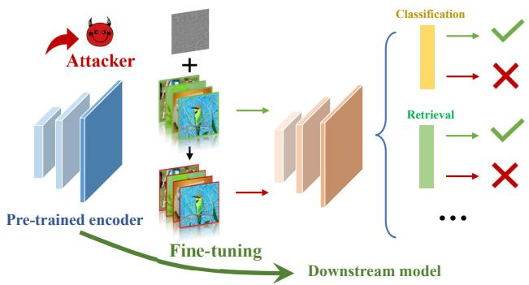  
Figure 1: An overview of adversarial examples against different downstream tasks based on a pre-trained encoder

sults of which further prove the attack ability of AdvEncoder. Our codes are available at: https://github. com/CGCL-codes/AdvEncoder.

## 1. Introduction

Self-supervised learning [8, 10] (SSL) is an emerging machine learning paradigm that seeks to overcome the restrictions of labeled data. It usually uses a large volume of unlabeled data to pre-train a general-purpose encoder, which can be used as a feature extractor for various downstream tasks like image classification, image retrieval, object detection, etc. As a result, any resource-constrained user can enjoy the advantages of “large model” without performing the expensive training from scratch, where only light-weight fine-tuning operations are needed at its request. Driven by this promising prospect, pre-training encoders become popular in industry and many service providers publicly release their pre-trained encoders (e.g., SimCLR by Google [8, 9], MoCo by Meta [12, 26]) or deploy them as a commercial service (e.g., OpenAI [52], Clarifai [13]).

Meanwhile, it is well known that deep neural networks (DNNs) are vulnerable to various adversarial attacks [23, 44, 61, 65], which will make pre-trained encoder fragile as well. However, the security of pre-trained encoder has received much less consideration in the literature. Although some recent works studied security threats on pre-trained encoders including backdoor attack [31, 32], poisoning attack [40], and privacy risks [15, 41], none of them paid attention to adversarial examples, another kind of prevalent and destructive attack on DNNs. Constructing adversarial examples against pre-trained encoders is quite different from its traditional attack route due to the fact that the attacker has no knowledge of the downstream tasks. In other words, the attacker needs to attack a DNN without knowing its task type, the pre-training dataset, and the downstream dataset, even when the whole model will get fine-tuned. To the best of our knowledge, how to realize adversarial example attack in the practical scenario of pre-training still remains challenging and unresolved.

In this work, we take a big step towards bridging the gap between adversarial examples and pre-trained encoders. We consider both adversarial perturbation [5, 23, 37, 45] and patch [3, 30, 39, 61]. The former one has a high imperceptibility, while the latter one is visible but confined to a small area of the image and more readily applicable in the physical world. Furthermore, without the knowledge of downstream data, we aim to realize universal adversarial attacks [25, 44, 63] where one adversarial perturbation or patch applies to a set of natural images and can cause model misclassification.

Specifically, we propose AdvEncoder, a novel attack framework for generating downstream-agnostic universal adversarial examples. The most challenging job lies in addressing the limitations and lacking supervised signals and the information about the downstream tasks. Inspired by the fact that deep neural networks are biased towards texture features of images [34, 60], the change of texture information, i.e., the high frequency components (HFC) of the image, is very likely to cause the model decision change. We first exploit a high frequency component filter to get the HFC of benign and adversarial samples, and pull away their Euclidean distance as much as possible to influence the model’s decision. We then design a generative attack framework to construct adversarial perturbations or patches with high attack success rates and transferability by learning the distribution of the data, with a fixed random noise as input. Our main contributions are summarized as follows:

• We propose AdvEncoder, the first attack framework to construct downstream-agnostic universal adversarial examples in self-supervised learning. We reveal that the pre-trained encoder incurs severe security risks for the downstream tasks.

• We design a frequency-based generative network to generate universal adversarial examples by directly alearting the texture features of the image itself. It is a flexible framework that can generate both adversarial perturbations and patches.

• Our extensive experiments on fourteen self-supervised training methods and four image datasets show that our AdvEncoder achieves high attack success rates and transferability against different downstream tasks.

• We tailor four popular defenses to mitigate AdvEncoder. The results further prove the attack ability of AdvEncoder and highlight the needs of new defense mechanism to defend pre-trained encoders.

## 2. Background and Related Work

## 2.1. Self-supervised Learning

Self-supervised learning seeks to utilize the oversight signals within the unlabeled data itself to pre-train encoders that can convert complex inputs into generic representations. The pre-trained encoder that learned generally valuable domain knowledge can be used as a universal feature extractor to transfer knowledge to solve different specific downstream tasks. In this paper, we concentrate on image encoders.

Based on [22, 58], self-supervised learning schemes can be divided into the following categories: (1) contrastive learning methods (e.g., MoCo [10, 12], SimCLR [8]) train representations such that dissimilar negative pairs are widely apart and comparable positive pairs are shown to be near to one another. (2) negative-free methods (e.g., BYOL [24], Sim-Siam [11], and ReSSL [64]) achieve better representation without the use of negative samples by maintaining the consistency between positive samples and ignoring negative ones. (3) clustering-based methods (e.g., SwAV [6], DeepCluster v2 [6], and DINO [7]) group similar samples into the same class using conventional clustering methods. (4) redundancy reduction-based methods (e.g., Barlow Twins [62], W-MSE [21], VICReg [2], and VIbCReg [38]) enhance the connection in the same dimension of the representation while attempting to decoupling in distinct dimensions. Concurrently, the use of nearestneighbor retrieval has been investigated in NNCLR [19]. These approaches start from different motivations, design different loss functions, and use different network structures and tricks, which also make them have different defense abilities against adversarial attacks.

## 2.2. Attacks on Pre-trained Encoders

Recently, a growing number of works began to investigate the privacy and security issues of the pre-trained encoders in self-supervised learning. Some efforts investigated privacy risks against pre-trained encoders, such as membership inference attacks [27, 41], model extraction [20, 42, 56]. At the same time, backdoor attacks and poisoning attacks, the common security threats that usually occur in the training phase, have been shown to be deleterious to pre-trained encoders [4, 32, 40, 55]. In contrast, adversarial examples, which appear during the testing phase and pose great threat against neural networks, have not been thoroughly investigated yet. A concurrent work, PAP [1], produced a pre-trained perturbation by lifting the feature activations of low-level layers, but the generated adversarial examples lack semantics and rely heavily on the pre-training dataset. On the contrary, our work aims to achieve effective attacks from the perspective of directly changing the intrinsic texture features of the samples under more demanding conditions that better reflect realistic scenarios.

## 2.3. Universal Adversarial Examples

It is well known that deep neural networks are vulnerable to adversarial examples, where an attacker can fool the model by adding minor noise to the image, usually in the form of perturbation [5, 23, 28, 29] and patch [30, 39, 61]. Universal adversarial attack [44] was proposed to fool the target model by imposing a single adversarial noise vector on all the images. Existing works can be divided into optimization-based universal adversarial attacks [44, 46, 47] and generative universal adversarial attacks [25, 48, 49]. Compared with optimization-based solution, generative universal adversarial attacks can generate more generalized and natural-looking adversarial examples by learning the distribution of samples. However, existing generative universal adversarial attacks in supervised learning can only fool a single model and require the label information of the model output. Since pre-trained encoders can only output the feature vector corresponding to the image, exiting attacks cannot be directly applied to the pre-trained encoders, let alone having no knowledge about the downstream tasks. Some works also proposed different defenses against adversarial examples, such as data preprocessing, adversarial training [43, 59], pruning [66], and fine-tuning [53]. These methods can defend against adversarial samples at different phases.

## 3. Methodology

## 3.1. Threat Model

Following existing studies on attacking pre-trained encoders [32, 40, 55], we assume the attacker has access to the pre-trained encoders (e.g., through purchasing or directly downloading from publicly available websites), but has no knowledge of the pre-training datasets and the downstream tasks. The goal of the attacker is to conduct non-targeted adversarial attacks to disable the downstream tasks or damage their accuracy. Specifically, the attacker uses the pre-trained encoder to design a downstream agnostic universal adversarial perturbation or patch that applies to various kinds of the input images from different datasets. Then the adversarial example can mislead all the downstream classifiers that inherit the victim pre-trained encoder. We also assume that the downstream task undertaker (called user hereinafter) is able to fine-tune the linear layer or the pre-trained encoder for their cause and the model provider can adopt common defenses like adversarial training to purify the encoder.

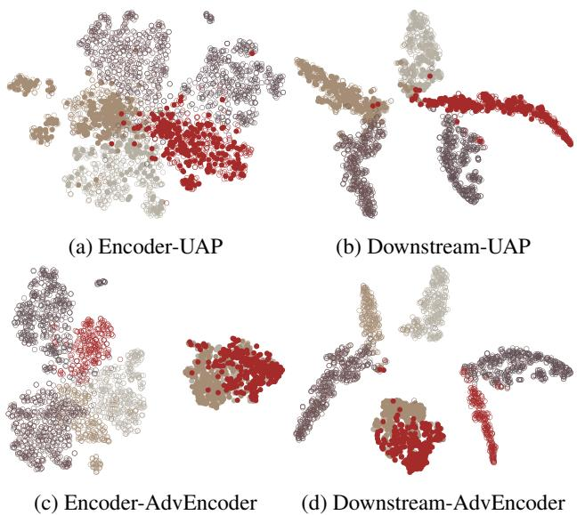  
Figure 2: t-SNE visualization of the feature space of the adversarial examples produced by UAP [44] and AdvEncoder in the pre-trained encoder (based on SimCLR) and downstream model, respectively. Five different colors represent different classes. The hollow circles represent bengin examples, while the solid ones represent adversarial examples.

## 3.2. Problem Definition

Given an input $x \in \mathcal { D } _ { p }$ to a pre-trained encoder $g _ { \boldsymbol { \theta } } ( \cdot )$ that returns a feature vector $v \in \mathcal V$ , a downstream classifier $f _ { \theta ^ { \prime } } ( \cdot )$ gives predictions based on the similarity of the feature vectors, where θ and $\theta ^ { ' }$ denote the parameters of the pre-trained encoder and the downstream classifier, x indicates any image in the dataset, $\mathcal { D } _ { p }$ and V refer to the pretraining dataset and feature space, respectively. The attacker uses an attacker’s surrogate dataset $\mathcal { D } _ { a }$ , which is irrelevant to the pre-training dataset $\mathcal { D } _ { p }$ and the downstream dataset $\mathcal { D } _ { d } .$ , to generate a universal adversarial noise against the pre-trained encoder. Additionally, the universal adversarial noise δ should be suffciently small, and modeled through an upper-bound ϵ on the $l _ { p } { \mathrm { - n o r m } }$ . This problem can be formu-

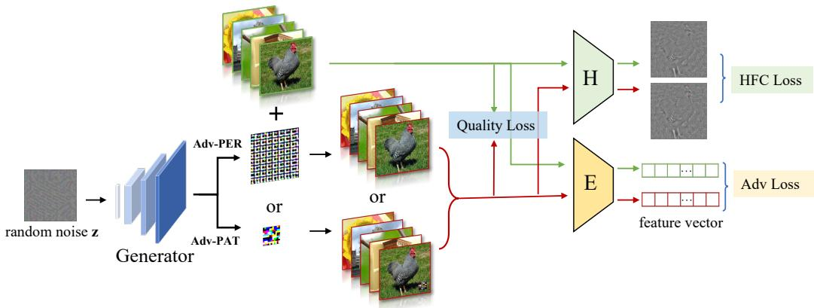  
Figure 3: The pipeline of our attack

lated as:

$$
g _ { \theta } \left( x + \delta \right) \neq g _ { \theta } \left( x \right) , \quad s . t . \left\| \delta \right\| _ { p } \leq \epsilon\tag{1}
$$

The attacker’s goal is to implement a universal non-target attack to fool the downstream classifier $f _ { \theta ^ { \prime } }$ . When a universal adversarial noise δ is attached to the downstream dataset sample $x \in \mathcal { D } _ { d }$ , it leads to misclassification. Therefore, the attacker’s goal can be formalized as:

$$
f _ { \theta ^ { \prime } } ( g _ { \theta } ( x + \delta ) ) \neq f _ { \theta ^ { \prime } } ( g _ { \theta } ( x ) ) , \quad s . t . \| \delta \| _ { p } \leq \epsilon\tag{2}
$$

## 3.3. Intuition Behind AdvEncoder

The pre-trained encoder outputs similar feature vectors for similar images, which are close together in the feature space and far away from the images of other categories. The downstream tasks will output decisions based on these feature vectors, thus the attacker needs to push the adversarial example away from its initial position as much as possible in the feature space. In order to realize downstreamagnostic adversarial attack, there are two challenges ahead.

Challenge I: Lack of supervised signals in pre-trained encoder. When the attacker feeds the image to the pretrained encoder, it only obtains the corresponding feature vector instead of the label. It is infeasible to effectively attack the pre-trained encoder with the traditional approaches of adversarial examples in supervised learning. An intuitive idea is to add a large budget perturbation to the sample to make the pre-trained encoder misclassify it. However, as seen from Fig. 2(a), a large budget perturbation will not necessarily achieve the above goal, but may simply be an internal movement within the same class, rather than in a direction away from that class. Recent works [17, 43, 60] have revealed that surface-statistical content with high frequency property is essential for DNNs and adversarial perturbations also have this property. Therefore, we propose using a universal adversarial noise to change the high frequency component of the image, i.e., the texture information, to influence the output of the pre-trained encoder. It plays the role of label guidance in the supervised learning, and it is easier to push the target samples out of the original decision boundaries from the perspective of directly altering the semantics of the image itself.

Challenge II: Lack of information about the downstream tasks. In the pre-trained encoder to downstream task paradigm, where fine-tuning affects original feature boundaries of the model, the above approach that simply fools the pre-trained encoder can barely influence downstream task decisions. As seen in Fig. 2(b), the adversarial examples that have left the original class are again correctly classified by the downstream model after the change of decision boundaries caused by fine-tuning. We thus hope to make the adversarial examples far enough away from the original class by a universal adversarial noise under a small perturbation bound, as depicted in Fig. 2(c). Consequently, the downstream classifier will be misled based on the apparent similarity of the feature vectors. Given the remarkable capability of generative networks at generating features with fixed patterns, we further design a generative attack framework to improve the generalization of universal adversarial noise. As shown in Fig. 2(d), all target samples will be clustered together in the feature space and get away from all the normal samples, making it difficult for downstream tasks to correctly classify target samples.

## 3.4. Frequency-based Generative Attack Framework

In this section, we present AdvEncoder, a novel generative attack against pre-trained encoder in self-supervised learning. The pipeline of AdvEncoder is depicted in Fig. 3. It consists of an adversarial generator G, a high frequency filter H, and a victim encoder E. Specifically, we design a frequency-based generative attack framework to generate a universal adversarial noise. By feeding a fixed noise z into the adversarial generator, we obtain a universal adversarial noise and paste it onto target image of the attacker’s surrogate dataset $\mathcal { D } _ { a }$ to get an adversarial example $x ^ { a d v }$

The objective function of the adversarial generator G is:

$$
\mathcal { L } _ { \mathcal { G } } = \alpha \mathcal { L } _ { a d v } + \beta \mathcal { L } _ { h f c } + \lambda \mathcal { L } _ { q }\tag{3}
$$

where $\mathcal { L } _ { a d v }$ is the adversarial loss function, $\mathcal { L } _ { h f c }$ is the high frequency component loss function, $\mathcal { L } _ { q }$ is the quality loss function, α, β, λ are pre-defined hyper-parameters.

$\mathcal { L } _ { a d v }$ enhances the attack strength of universal adversarial noise by maximizing the feature vector distance between the normal and adversarial samples of the encoder output. We adopt InfoNCE [51] loss to measure the similarity between the output feature vectors of the pre-trained encoder $g ( \cdot )$ . Specifically, we treat the benign sample $x _ { i } \in \mathcal { D } _ { a }$ and the adversarial sample $x _ { i } ^ { a d v }$ as negative pairs, pulling away their feature distance. Thus $\mathcal { L } _ { a d v }$ is expressed as:

$$
\mathcal { L } _ { a d v } = l o g [ \frac { e x p ( S ( g _ { \theta } ( x _ { i } ^ { a d v } ) , g _ { \theta } ( x _ { i } ) ) / \tau ) } { \sum _ { j = 0 } ^ { K } e x p ( S ( g _ { \theta } ( x _ { i } ^ { a d v } ) , g _ { \theta } ( x _ { j } ) / \tau ) ) } ]\tag{4}
$$

where $S \left( \cdot \right)$ denotes the cosine similarity measure function, j is not equal to i, and τ indicates a temperature parameter.

Due to the lack of the guidance of label information, pushing away the locations of output embeddings in the feature space by adding noises alone requires large perturbation budget. $\mathcal { L } _ { h f c }$ changes the original semantic features of the image by modifying the high frequency components to further separate the location of the target sample.

We can obtain the HFC of an image through the high frequency component filter H. The high frequency component loss $\mathcal { L } _ { h f c }$ can be formalized as:

$$
\mathcal { L } _ { h f c } = - \Big | \Big | \mathcal { H } ( { x } ^ { a d v } ) - \mathcal { H } ( { x } ) \Big | \Big | _ { 2 }\tag{5}
$$

To achieve better stealthiness, we use $\mathcal { L } _ { q }$ to control the magnitude of the adversarial noises output by the generator and crop δ after each optimisation to ensure it meets the constraints ε. Formally, we have:

$$
\mathcal { L } _ { q } = \left. x ^ { a d v } - x \right. _ { 2 }\tag{6}
$$

Without changing the framework of AdvEncoder, we can convert a universal adversarial noise into two common forms of attacks, universal adversarial perturbation (AdvEncoder-Perturbation, abbreviated as Adv-PER) and universal adversarial patch (AdvEncoder-Patch, abbreviated as Adv-PAT).

Adv-PER. The attacker directly adds the universal adversarial perturbation generated by the generator to the image, which has better stealthiness. The perturbation-based adversarial example can be represented as:

$$
x ^ { a d v } = x + \mathcal { G } ( z )\tag{7}
$$

Adv-PAT. The attacker can apply the adversarial patch to the image with a randomly chosen hidden location to obtain

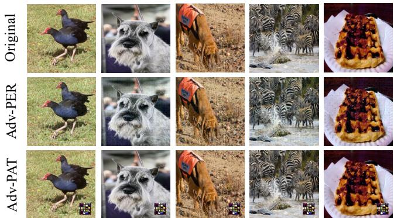  
Figure 4: Adversarial examples generated by AdvEnocder based on ImageNet

the adversarial example. It is easier to be realized in the physical world. The patch-based adversarial example can be represented as:

$$
x ^ { a d v } = x \odot ( 1 - m ) + \mathcal { G } ( z ) \odot m\tag{8}
$$

where ⊙ denotes the element-wise product, m is a binary matrix that contains the position information of the universal adversarial patch.

## 4. Experiments

## 4.1. Experimental Setting

Datasets and Models. We use the publicly available pretrained encoders from solo-learn [16], an established SSL library, as victim encoders. All the encoders are pretrained on ImageNet [54] or CIFAR10 [36] with ResNet18 backbone. For a comprehensive study, we select fourteen SSL methods (Barlow Twins [62], BYOL [24], DeepCluster v2 [6], DINO [7], MoCo v2+ [10], MoCo v3 [12], NNCLR [19], ReSSL [64], SimCLR [8], SupCon [35], SwAV [6], VIbCReg [38], VICReg [2], W-MSE [21]). We make no strong assumptions about the attacker’s knowledge, so we set the attacker’s surrogate dataset to be CIFAR-10 as the default setting. For different downstream tasks, we use the following four image datasets: STL10 [14], GT-SRB [57], CIFAR10, and ImageNet.

Evaluation Metrics. We use Attack Success Rate (ASR) to evaluate the attack performance of our AdvEncoder, which refers to the success rate of generated adversarial examples in deceiving the classifier. A higher value indicates stronger attack capability.

## 4.2. Attack Performance

Implementation Details. To demonstrate the effectiveness of AdvEncoder when the downstream task is unknowable, two types of downstream tasks, image classification and image retrieval, are chosen for testing. Following [30, 44, 48], we set ϵ (i.e., the perturbation budget of Adv-PER) to

Table 1: The ASR (%) of Adv-PER under different settings. $S _ { 1 } \ - \ S _ { 4 }$ denote the settings where the downstream datasets are CIFAR10, STL10, GTSRB, ImageNet, respectively, and all the attacker’s surrogate dataset is CIFAR10. $S _ { 5 } \ – \ S _ { 8 }$ use ImageNet as the attacker’s surrogate dataset, with the downstream datasets remained the same as $S _ { 1 } - S _ { 4 } .$ . Barlow Twins and DeepCluster v2 are abbreviated as Barlow and DeepC2, respectively.
<table><tr><td>Dataset</td><td>Setting</td><td>Barlow</td><td>BYOL</td><td>DeepC2</td><td>DINO</td><td>MoCo2+</td><td>MoCo3</td><td>NNCLR</td><td>ReSSL</td><td>SimCLR</td><td>SupCon</td><td>SwAV</td><td>VIbCReg</td><td>VICReg</td><td>W-MSE</td></tr><tr><td rowspan="9">CIFAR10</td><td>S1 S2</td><td>85.51 45.67</td><td>89.93 63.48</td><td>79.42 58.25</td><td>89.37 56.15</td><td>64.92 32.08</td><td>84.79 55.03</td><td>88.48 51.37</td><td>87.85 51.60</td><td>57.07 30.11</td><td>93.62 71.88</td><td>87.71 45.25</td><td>87.15 52.25</td><td>90.04 68.38</td><td>89.26 55.10</td></tr><tr><td></td><td>87.49</td><td></td><td></td><td></td><td></td><td></td><td></td><td></td><td></td><td></td><td></td><td>84.70</td><td>89.24</td><td></td></tr><tr><td>S3 S4</td><td>76.53</td><td>84.59</td><td>83.17</td><td>87.02</td><td>80.53</td><td>80.40</td><td>91.09</td><td>92.73</td><td>69.30</td><td>91.26</td><td>92.11 73.89</td><td></td><td></td><td>78.80</td></tr><tr><td></td><td></td><td>87.69</td><td>80.21</td><td>79.42</td><td>69.94</td><td>83.41</td><td>81.14</td><td>78.61</td><td>66.59</td><td>91.53</td><td></td><td>74.24</td><td>86.42</td><td>84.57</td></tr><tr><td>S5</td><td>90.46</td><td>85.94</td><td>87.42</td><td>89.99</td><td>58.00</td><td>76.44</td><td>90.10</td><td>88.23</td><td>72.20</td><td>89.43</td><td>72.28</td><td>89.41</td><td>89.03</td><td>78.87</td></tr><tr><td>S6</td><td>85.85</td><td>74.93</td><td>88.96</td><td>70.64</td><td>33.51</td><td>43.35</td><td>87.13</td><td>65.55</td><td>58.62</td><td>78.78</td><td>36.94</td><td>80.44</td><td>74.89</td><td>60.68</td></tr><tr><td>S7</td><td>97.19</td><td>95.52</td><td>94.50</td><td>93.43</td><td>79.59</td><td>82.98</td><td>91.59</td><td>93.45</td><td>92.53</td><td>95.96</td><td>83.35</td><td>96.41</td><td>93.00</td><td>73.07</td></tr><tr><td>S8</td><td>97.42</td><td>92.47</td><td>96.48</td><td>90.31</td><td>69.60</td><td>75.19</td><td>96.30</td><td>88.44</td><td>87.50</td><td>94.35</td><td>71.32</td><td>97.15</td><td>90.93</td><td>82.74</td></tr><tr><td>AVG S1</td><td>83.26</td><td>84.32</td><td>83.55</td><td>82.04</td><td>61.02</td><td>72.70</td><td>84.65</td><td>80.81</td><td>66.74</td><td>88.35</td><td>70.36</td><td>82.72</td><td>85.24</td><td>75.39</td></tr><tr><td rowspan="9"></td><td></td><td>70.13</td><td>88.12</td><td>79.27</td><td>83.29</td><td>82.33</td><td>72.52</td><td>70.91</td><td>87.86</td><td>71.94</td><td>76.37</td><td>84.00</td><td>82.77</td><td>82.51</td><td>89.62</td></tr><tr><td>S2</td><td>55.49</td><td>58.67</td><td>45.29</td><td>61.67</td><td>53.22</td><td>59.51</td><td>53.00</td><td>59.63</td><td>55.87</td><td>48.73</td><td>55.22</td><td>61.01</td><td>57.95</td><td>67.96</td></tr><tr><td>S3</td><td>74.18</td><td>73.75</td><td>68.10</td><td>67.65</td><td>70.89</td><td>68.05</td><td>67.73</td><td>82.39</td><td>64.30</td><td>66.19</td><td>69.51</td><td>78.18</td><td>78.65</td><td>76.72</td></tr><tr><td>S4</td><td>71.84</td><td>75.44</td><td>73.29</td><td>75.83</td><td>74.01</td><td>65.51</td><td>68.85</td><td>76.18</td><td>71.52</td><td>69.65</td><td>74.41</td><td>72.57</td><td>77.60</td><td>83.59</td></tr><tr><td>S5</td><td>87.94</td><td>88.94</td><td>77.28</td><td>83.97</td><td>86.95</td><td>76.11</td><td>86.32</td><td>89.69</td><td>88.95</td><td>78.18</td><td>86.54</td><td>84.50</td><td>81.64</td><td>90.61</td></tr><tr><td>S6</td><td>69.35</td><td>64.76</td><td>57.81</td><td>64.16</td><td>56.13</td><td>60.49</td><td>65.75</td><td>67.33</td><td>70.08</td><td>55.90</td><td>60.14</td><td>70.04</td><td>58.28</td><td>80.05</td></tr><tr><td>S7</td><td>78.59</td><td>78.45</td><td>69.38</td><td>70.83</td><td>80.62</td><td>77.67</td><td>74.05</td><td>86.13</td><td>83.70</td><td>69.05</td><td>81.17</td><td>81.65</td><td>79.76</td><td>85.56</td></tr><tr><td>S8</td><td>80.02</td><td>80.28</td><td>77.48</td><td>77.52</td><td>76.74</td><td>75.72</td><td>74.73</td><td>81.36</td><td>79.68</td><td>71.01</td><td>80.20</td><td>80.33</td><td>78.32</td><td>90.03</td></tr><tr><td>AVG</td><td>73.44</td><td>76.05</td><td>68.49</td><td>73.12</td><td>72.61</td><td>69.45</td><td>70.17</td><td>78.82</td><td>73.26</td><td>66.88</td><td>73.90</td><td>76.38</td><td>74.34</td><td>83.02</td></tr></table>

Table 2: The ASR (%) of Adv-PAT under different settings. S - S represent the same settings as mentioned in Tab. 1.
<table><tr><td>Dataset</td><td>Setting</td><td>Barlow</td><td>BYOL</td><td>DeepC2</td><td>DINO</td><td>MoCo2+</td><td>MoCo3</td><td>NNCLR</td><td>ReSSL</td><td>SimCLR</td><td>SupCon</td><td>SwAV</td><td>VIbCReg</td><td>VICReg</td><td>W-MSE</td></tr><tr><td rowspan="9">CIFAR10</td><td>S1 S2</td><td>82.32 88.16</td><td>88.20 80.08</td><td>90.88 89.55</td><td>81.77 77.95</td><td>81.52 84.03</td><td>89.71 82.10</td><td>74.44 71.74</td><td>61.46 73.23</td><td>89.87 89.38</td><td>69.19 66.48</td><td>89.31 85.60</td><td>63.32 66.56</td><td>82.15 79.54</td><td>89.13 82.56</td></tr><tr><td>S3</td><td></td><td></td><td></td><td></td><td></td><td></td><td>89.84</td><td></td><td></td><td></td><td></td><td>89.88</td><td>90.65</td><td>89.22</td></tr><tr><td></td><td>93.89</td><td>92.02</td><td>94.43</td><td>89.98</td><td>98.40</td><td>90.21</td><td></td><td>89.15</td><td>96.22</td><td>91.19</td><td>97.09</td><td></td><td></td><td></td></tr><tr><td>S4</td><td>97.86</td><td>95.61</td><td>99.68</td><td>97.32</td><td>98.49</td><td>97.01</td><td>94.81</td><td>96.51</td><td>99.05</td><td>96.81</td><td>98.51</td><td>96.25</td><td>95.56</td><td>96.88</td></tr><tr><td>S5</td><td>87.14</td><td>88.44</td><td>90.88</td><td>82.20</td><td>84.64</td><td>90.28</td><td>67.74</td><td>66.53</td><td>89.90</td><td>76.34</td><td>89.31</td><td>62.79</td><td>84.68</td><td>89.25</td></tr><tr><td>S6</td><td>88.00</td><td>86.12</td><td>89.71</td><td>76.61</td><td>84.34</td><td>84.88</td><td>73.12</td><td>72.96</td><td>89.31</td><td>67.63</td><td>86.84</td><td>56.24</td><td>79.74</td><td>82.52</td></tr><tr><td>S7</td><td>93.91</td><td>91.76</td><td>94.69</td><td>87.15</td><td>99.20</td><td>93.58</td><td>90.08</td><td>92.50</td><td>96.19</td><td>91.19</td><td>97.09</td><td>91.01</td><td>92.40</td><td>90.10</td></tr><tr><td>S8</td><td>96.14</td><td>97.73</td><td>99.69</td><td>97.83</td><td>98.40</td><td>98.44</td><td>96.48</td><td>98.11</td><td>99.05</td><td>96.27</td><td>98.03</td><td>95.28</td><td>96.65</td><td>96.51</td></tr><tr><td>AVG S1</td><td>90.93 88.17</td><td>89.99</td><td>93.69</td><td>86.35</td><td>91.13</td><td>90.78</td><td>82.28</td><td>81.31</td><td>93.62</td><td>81.89</td><td>92.72</td><td>77.67</td><td>87.67</td><td>89.52</td></tr><tr><td rowspan="9"></td><td></td><td></td><td>90.14</td><td>89.22</td><td>89.41</td><td>89.90</td><td>90.02</td><td>88.80</td><td>92.01</td><td>90.30</td><td>90.50</td><td>90.06</td><td>89.04</td><td>89.49</td><td>91.21</td></tr><tr><td>S2</td><td>82.35</td><td>88.60</td><td>89.98</td><td>89.07</td><td>90.70</td><td>91.56</td><td>88.86</td><td>91.20</td><td>89.42</td><td>90.27</td><td>90.48</td><td>89.66</td><td>85.14</td><td>89.86</td></tr><tr><td>S3</td><td>95.12</td><td>99.29</td><td>96.89</td><td>94.67</td><td>94.01</td><td>98.49</td><td>98.36</td><td>91.30</td><td>94.33</td><td>94.32</td><td>97.08</td><td>96.82</td><td>94.09</td><td>99.09</td></tr><tr><td>S4</td><td>99.09</td><td>98.18</td><td>99.16</td><td>98.79</td><td>98.64</td><td>98.29</td><td>98.34</td><td>98.51</td><td>99.02</td><td>99.10</td><td>98.61</td><td>98.59</td><td>98.56</td><td>98.51</td></tr><tr><td>S5</td><td>89.00</td><td>90.14</td><td>89.22</td><td>89.41</td><td>89.90</td><td>88.83</td><td>88.81</td><td>92.01</td><td>90.30</td><td>90.50</td><td>90.06</td><td>89.04</td><td>89.33</td><td>91.22</td></tr><tr><td>S6</td><td>83.09</td><td>90.11</td><td>89.98</td><td>89.56</td><td>90.70</td><td>91.55</td><td>88.86</td><td>91.19</td><td>89.39</td><td>90.70</td><td>90.38</td><td>90.78</td><td>84.42</td><td>89.86</td></tr><tr><td>S7</td><td>95.37</td><td>95.64</td><td>97.38</td><td>93.18</td><td>91.19</td><td>98.20</td><td>98.36</td><td>90.19</td><td>94.33</td><td>92.65</td><td>97.08</td><td>96.82</td><td>96.31</td><td>99.18</td></tr><tr><td>S8</td><td>98.89</td><td>98.19</td><td>99.21</td><td>98.62</td><td>98.64</td><td>98.47</td><td>98.70</td><td>98.45</td><td>99.02</td><td>98.98</td><td>98.71</td><td>98.59</td><td>98.75</td><td>98.47</td></tr><tr><td>AVG</td><td>91.39</td><td>93.79</td><td>93.88</td><td>92.84</td><td>92.96</td><td>94.43</td><td>93.63</td><td>93.11</td><td>93.26</td><td>93.38</td><td>94.06</td><td>93.67</td><td>92.01</td><td>94.67</td></tr></table>

Table 3: Top-10 retrieval attack results. “per-mAP” represents the retrieval accuracy of the Adv-PER samples corresponding to clean samples, while “pat-mAP” denotes the accuracy of Adv-PAT samples.
<table><tr><td>Dataset</td><td>Metric</td><td>Barlow</td><td>BYOL</td><td>DINO</td><td>MoCo v2+</td><td>NNCLR</td><td>SimCLR</td></tr><tr><td rowspan="2">STL10</td><td>map</td><td>81.03</td><td>79.02</td><td>79.58</td><td>63.24</td><td>76.15</td><td>73.58</td></tr><tr><td>per_map pat_map</td><td>23.26 21.15</td><td>21.76 19.64</td><td>22.95 21.12</td><td>22.77 26.89</td><td>24.99 26.22</td><td>21.76 23.59</td></tr><tr><td rowspan="3">GTSRB</td><td>map</td><td>93.92</td><td>85.68</td><td>88.49</td><td>84.37</td><td>83.83</td><td>88.53</td></tr><tr><td>per_map</td><td>42.81</td><td>45.81</td><td>30.72</td><td>38.93</td><td>36.14</td><td>45.56</td></tr><tr><td>pat_map</td><td>11.63</td><td>10.07</td><td>10.17</td><td>11.75</td><td>11.66</td><td>13.63</td></tr></table>

10/255 and the patch size (i.e., noise percentage of each sample) of Adv-PAT to 0.03. We choose the bottom right corner of the image, which is not easily visible, to apply the patch. We set the hyper-parameters $\alpha = 1 , \beta = 5 , \lambda = 1$ and the training epoch to 20 with batch size of 256. The generator network is trained by Adam optimizer with the initial learning rate 0.0002.

For the classification task, we attack fourteen types of

SSL pre-trained encoders. We evaluate AdvEncoder on each victim pre-trained encoder over four downstream tasks using two attacker’s surrogate datasets, respectively. As for the retrieval task, we attack six types of SSL encoders trained on CIFAR10 corresponding to the retrieval tasks of GTSRB and STL10. We use mAP (mean average precision) [67] to measure the retrieval accuracy, and adapt permAP and pat-mAP to measure the retrieval accuracy for adversarial examples. Adversarial examples generated by AdvEncoder are shown in Fig. 4.

Analysis. Our experimental results on classification tasks reveal the severe vulnerability of downstream tasks based on pre-trained encoders. Firstly, from Tab. 1 and Tab. 2, we can see that among the 224 attack settings, both Adv-PER and Adv-PAT perform well on all downstream tasks. In particular, Adv-PAT has a consistently high attack performance under different settings, with an average ASR of over 90%. Secondly, the attacker’s surrogate dataset has an impact on the attack performance, e.g., the ImageNet surrogate dataset outperforms CIFAR10. AdvEncoder performs better when the attacker’s surrogate dataset is similar to the pre-training dataset and downstream dataset. Thirdly, among the fourteen training methods, MoCo, SimCLR are more robust for adversarial examples, while BYOL, NNCLR, and SupCon are relatively weaker. The experimental results on image retrieval tasks in Tab. 3 also show that the adversarial examples generated by AdvEncoder can greatly affect the retrieval accuracy under different settings.

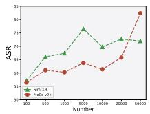  
(a) Num-PER

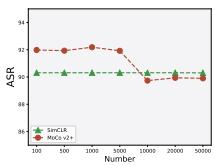  
(b) Num-PAT

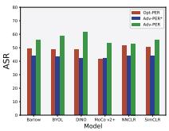  
(c) HFC-G-PER

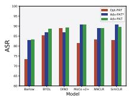  
(d) HFC-G-PAT

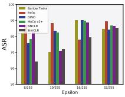  
(e) ϵ

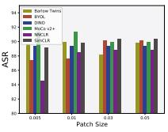  
(f) Patch-Size  
Figure 5: The ablation study results. (a) - (d) examine the effect of the number of the surrogate data and different modules. (e) - (f) explore the effect of different attack strengths.

## 4.3. Ablation Study

In this section, we explore the effect of different attacker’s surrogate datasets, modules, and attack strengths on AdvEncoder. We choose encoders trained on ImageNet and select CIFAR10 as the surrogate and downstream dataset.

The Effect of Number of Surrogate Data. We investigate the effect of the limited sample size of the attacker’s surrogate dataset. Specifically, we randomly select different numbers of CIFAR10 samples to constitute the surrogate dataset and choose SimCLR and MoCo v2+ encoders for the attack. The results in Fig. 5(a) - (b) show that the performance of Adv-PER generally improves with the increase of the number of samples. For Adv-PAT, it performs well with different numbers of surrogate dataset settings.

The Effect of HFC & G. We analyze the effect of the HFC module and the generator module on the effectiveness of the scheme. We choose the downstream dataset as STL10. In Fig. 5(c) - (d), Opt-PER and Opt-PAT represent optimization-based versions of the same loss function, “∗” denotes the version without HFC loss. Experimental results show that each module plays an important role.

The Effect of ϵ & Patch Size. We study the effect of four different perturbation upper bound ϵ and patch size on the attack performance of Adv-PER and Adv-PAT, respectively. From Fig. 5(e), we can see that different pre-trained encoders have different sensitivities to different perturbation budgets. The curves in Fig. 5(f) show that the downstream tasks are more vulnerable to adversarial patches.

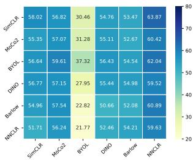  
(a) CIFAR10-ImageNet

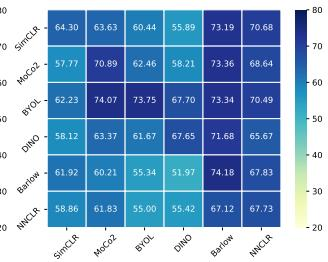  
(b) ImageNet-ImageNet  
Figure 6: The results (%) of transferability study.

## 4.4. Transferability Study

In this section, we choose Adv-PER as a representative to analyze the transferability of our scheme from two perspectives, namely, crossing pre-training datasets and SSL methods. To this end, we conduct experiments using CI-FAR10 as the attacker’s surrogate dataset and GTSRB as the downstream dataset. In Fig. 6(a) - (b), CIFAR10-ImageNet represents we use CIFAR10 and ImageNet to train two encoders based on which adversarial examples and downstream tasks are made, respectively. ImageNet-ImageNet has the same definition. Each column represents different downstream models attacked with the same adversarial examples. The results indicate that the Adv-PER method can effectively transfer attacks across different pre-training datasets and SSL methods, even without any prior knowledge of the pre-training and downstream datasets.

Table 4: The ASR (%) of comparison study
<table><tr><td rowspan=1 colspan=1>Method</td><td rowspan=1 colspan=1>Barlow</td><td rowspan=1 colspan=1>BYOL</td><td rowspan=1 colspan=1>DINO</td><td rowspan=1 colspan=1>MoCo v2+</td><td rowspan=1 colspan=1>NNCLR</td><td rowspan=1 colspan=1>SimCLR</td></tr><tr><td rowspan=1 colspan=1>UAP [44]</td><td rowspan=1 colspan=1>48.95</td><td rowspan=1 colspan=1>45.97</td><td rowspan=1 colspan=1>43.01</td><td rowspan=1 colspan=1>42.24</td><td rowspan=1 colspan=1>46.41</td><td rowspan=1 colspan=1>48.41</td></tr><tr><td rowspan=7 colspan=1>UPGD [18]FFF [47]SSP [50]NAG [48]PAP-base [1]PAP-fuse [1]PAP-ugs [1]</td><td rowspan=1 colspan=1>18.31</td><td rowspan=1 colspan=1>23.89</td><td rowspan=1 colspan=1>18.59</td><td rowspan=1 colspan=1>18.31</td><td rowspan=1 colspan=1>17.57</td><td rowspan=1 colspan=1>20.83</td></tr><tr><td rowspan=1 colspan=1>47.71</td><td rowspan=1 colspan=1>50.26</td><td rowspan=1 colspan=1>45.53</td><td rowspan=1 colspan=1>50.33</td><td rowspan=1 colspan=1>46.64</td><td rowspan=1 colspan=1>52.33</td></tr><tr><td rowspan=1 colspan=1>50.40</td><td rowspan=1 colspan=1>46.30</td><td rowspan=1 colspan=1>47.12</td><td rowspan=1 colspan=1>50.87</td><td rowspan=1 colspan=1>49.51</td><td rowspan=1 colspan=1>48.06</td></tr><tr><td rowspan=1 colspan=1>8.98</td><td rowspan=1 colspan=1>10.91</td><td rowspan=1 colspan=1>26.22</td><td rowspan=1 colspan=1>14.34</td><td rowspan=1 colspan=1>24.49</td><td rowspan=1 colspan=1>6.76</td></tr><tr><td rowspan=1 colspan=1>37.89</td><td rowspan=1 colspan=1>27.29</td><td rowspan=1 colspan=1>25.52</td><td rowspan=1 colspan=1>30.47</td><td rowspan=1 colspan=1>24.65</td><td rowspan=1 colspan=1>46.89</td></tr><tr><td rowspan=1 colspan=1>46.61</td><td rowspan=1 colspan=1>45.47</td><td rowspan=1 colspan=1>30.26</td><td rowspan=1 colspan=1>45.14</td><td rowspan=1 colspan=1>40.05</td><td rowspan=1 colspan=1>46.30</td></tr><tr><td rowspan=1 colspan=1>38.20</td><td rowspan=1 colspan=1>36.89</td><td rowspan=1 colspan=1>30.55</td><td rowspan=1 colspan=1>37.71</td><td rowspan=1 colspan=1>42.99</td><td rowspan=1 colspan=1>53.56</td></tr><tr><td rowspan=1 colspan=1>Adv-PER</td><td rowspan=1 colspan=1>55.49</td><td rowspan=1 colspan=1>58.67</td><td rowspan=1 colspan=1>61.67</td><td rowspan=1 colspan=1>53.22</td><td rowspan=1 colspan=1>53.00</td><td rowspan=1 colspan=1>55.87</td></tr><tr><td rowspan=1 colspan=1>UA-PAT [3]</td><td rowspan=1 colspan=1>58.20</td><td rowspan=1 colspan=1>34.62</td><td rowspan=1 colspan=1>46.12</td><td rowspan=1 colspan=1>79.04</td><td rowspan=1 colspan=1>49.73</td><td rowspan=1 colspan=1>50.35</td></tr><tr><td rowspan=1 colspan=1>Adv-PAT</td><td rowspan=1 colspan=1>82.35</td><td rowspan=1 colspan=1>88.60</td><td rowspan=1 colspan=1>89.07</td><td rowspan=1 colspan=1>90.70</td><td rowspan=1 colspan=1>88.86</td><td rowspan=1 colspan=1>89.42</td></tr></table>

## 4.5. Comparison Study

Implementation Details. In this section, we compare Adv-Encoder with state-of-the-art adversarial attacks. PAP [1] is the most similar work with ours as it produces pretrained perturbations from the perspective of model feature activation values. In contrast, we address the attack inheritance of adversarial samples by directly changing the important texture features of the samples themselves. To further demonstrate our superiority, for perturbation we compare with classic optimized-based UAP schemes (e.g., UAP [44], UPGD [18], FFF [47], SSP [50], and PAP [1]) and generative-based UAP scheme (e.g., NAG [48]). For patch, we compare Adv-PAT with UA-PAT [3], an optimization-based adversarial patch method, which maintains the same experimental setup as the Adv-Encoder. Since the above supervised learning adversarial attacks can not be directly applied to attack the pre-trained encoder, we enable those UAP schemes to have complete pre-trained model (i.e., encoder connected with classification head trained under the same pre-training dataset). For a comprehensive comparison under the pre-trained encoder to downstream task paradigm, we choose six encoders trained on ImageNet with CIFAR10 for the attacker’s surrogate dataset and STL10 for the downstream dataset.

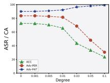  
(a) Corruption

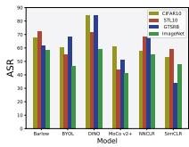  
(b) Fine-tune-PER

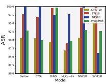  
(c) Fine-tune-PAT

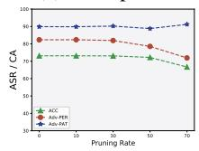  
(d) Pruning

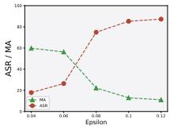  
(e) AT-PER

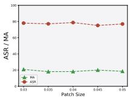  
(f) AT-PAT  
Figure 7: The attack performance (%) of AdvEncoder in different settings. (a) - (d) examine three defenses Corruption, Fine-tuning, and Pruning on CIFAR10. (e) - (f) show the effect of adversarial training of the pre-trained encoder (based on SimCLR) on AdvEncoder.

Analysis. From Tab. 4, we can see that AdvEncoder outperforms the other solutions without knowing the pretraining dataset and the downstream dataset. Adv-PER shows superior performance compared to optimizationbased and generative-based methods. Furthermore, AdvEncoder achieves better overall attack performance than the most relevant existing work, PAP, across six pre-trained encoders. Notably, Adv-PAT outperforms UA-PAT with an average ASR of over 85%. Importantly, our method achieves these results without requiring additional classification headers, and instead directly leverages the pretrained encoders for the attack.

## 5. Defense

In this section, we tailor four defensive measures trying to mitigate AdvEncoder from the perspective of the user and the model provider, respectively. For users using pretrained encoders, we adopt pre-processing the input data, fine-tuning the entire model using a small amount of data, and pruning the parameters to defend against adversarial attacks. As for the model providers, the defender can perform adversarial training on pre-trained encoders. In the following experiments, we use the default settings from Sec. 4.3.

## 5.1. Corruption

We defend against adversarial examples by corrupting the images through adding different degree of Gaussian noise to the samples. As illustrated in Fig. 7(a), the accuracy of the model decreases significantly as the degree of Gaussian noise added increases. In particular, Adv-PER only experiences a slight decrease in accuracy when the degree of Gaussian noise is increased to 0.03, while Adv-PAT is almost unaffected. These findings indicate that Adv-Encoder can effectively resist the corruption-based preprocessing defense.

## 5.2. Fine-tuning & Pruning

Fine-tuning [53] and pruning [66] are two commonly used methods for downstream models to inherit pre-trained encoders, providing better adaptability to downstream tasks. We first fully fine-tune pre-trained encoders based on MoCo v2+, using ten classes in CIFAR10, STL10, GSTRB, and ImageNet, respectively. The results in Fig. 7(b) - (c) show that AdvEncoder still has excellent attack performance even after the encoder is fully fine-tuned. Furthermore, we choose pruning rate in [0.1, 0.7], the results in Fig. 7(d) show that AdvEncoder is able to resist the defenses based on model parameter pruning.

## 5.3. Adversarial Training

Adversarial training improves the robustness of the pretrained encoder and poses a greater challenge to the adversarial examples. Following [33], we use the ImageNet dataset for adversarial training of the pre-trained encoder and choose CIFAR10 as downstream dateset. As demonstrated in Fig. 7(e) - (f), we explore the degree of resistance to adversarial training for AdvEncoder of different attack strengths. Adversarial training slightly affects Adv-PER, but our attack can succeed after improving the attack strength. Adv-PAT has not been affected at all.

## 6. Conclusion

In this paper, we propose the first generative attack to construct downstream-agnostic adversarial examples in self-supervised learning. It is a flexible framework that can generate both universal adversarial perturbations and patches. We verify the excellent attack performance of AdvEncoder on four downstream tasks corresponding to fourteen publicly available SSL encoders over two pre-training datasets. We tailor four popular defenses to mitigate Adv-Encoder. The results further prove the attack ability of Adv-Encoder and highlight the needs of new defense mechanism to defend pre-trained encoders.

Acknowledgments. Shengshan’s work is supported in part by the National Natural Science Foundation of China (Grant No.U20A20177) and Hubei Province Key R&D Technology Special Innovation Project under Grant No.2021BAA032. Qian’s work is supported in part by the National Natural Science Foundation of China under Grants U20B2049 and U21B2018. Shengshan Hu is the corresponding author.

## References

[1] Yuanhao Ban and Yinpeng Dong. Pre-trained adversarial perturbations. In Proceedings of the 36th International Conference on Neural Information Processing Systems (NeurIPS’22), 2022. 3, 7, 8

[2] Adrien Bardes, Jean Ponce, and Yann LeCun. Vicreg: Variance-invariance-covariance regularization for selfsupervised learning. arXiv preprint arXiv:2105.04906, 2021. 2, 5

[3] Tom B. Brown, Dandelion Mane, Aurko Roy, Mart ´ ´ın Abadi, and Justin Gilmer. Adversarial patch. arXiv preprint arXiv:1712.09665, 2017. 2, 7, 8

[4] Nicholas Carlini and Andreas Terzis. Poisoning and backdooring contrastive learning. arXiv preprint arXiv:2106.09667, 2021. 3

[5] Nicholas Carlini and David Wagner. Towards evaluating the robustness of neural networks. In Proceedings of the 38th IEEE Symposium on Security and Privacy (S&P’17), pages 39–57. Ieee, 2017. 2, 3

[6] Mathilde Caron, Ishan Misra, Julien Mairal, Priya Goyal, Piotr Bojanowski, and Armand Joulin. Unsupervised learning of visual features by contrasting cluster assignments. In Proceedings ofthe 34th International Conference on Neural Information Processing Systems (NeurIPS’20), pages 9912– 9924, 2020. 2, 5

[7] Mathilde Caron, Hugo Touvron, Ishan Misra, Herve J´ egou,´ Julien Mairal, Piotr Bojanowski, and Armand Joulin. Emerging properties in self-supervised vision transformers. In Proceedings of the IEEE/CVF International Conference on Computer Vision (ICCV’21), pages 9650–9660, 2021. 2, 5

[8] Ting Chen, Simon Kornblith, Mohammad Norouzi, and Geoffrey Hinton. A simple framework for contrastive learning of visual representations. In Proceedings ofthe International Conference on Machine Learning (ICML’20), pages 1597– 1607. PMLR, 2020. 1, 2, 5

[9] Ting Chen, Simon Kornblith, Kevin Swersky, Mohammad Norouzi, and Geoffrey Hinton. Big self-supervised models are strong semi-supervised learners. In Proceedings of the 34th International Conference on Neural Information Processing Systems (NeurIPS’20), pages 22243–22255, 2020. 2

[10] Xinlei Chen, Haoqi Fan, Ross Girshick, and Kaiming He. Improved baselines with momentum contrastive learning. arXiv preprint arXiv:2003.04297, 2020. 1, 2, 5

[11] Xinlei Chen and Kaiming He. Exploring simple siamese representation learning. In Proceedings of the IEEE/CVF Conference on Computer Vision and Pattern Recognition (CVPR’21), pages 15750–15758, 2021. 2

[12] Xinlei Chen, Saining Xie, and Kaiming He. An empirical study of training self-supervised vision transformers. In Proceedings of the IEEE/CVF International Conference on Computer Vision (ICCV’21), pages 9640–9649, 2021. 2, 5

[13] Clarifai. Clarifai General Image Embedding Model. https://www.clarifai.com/models/ general-image-embedding, 2022. 2

[14] Adam Coates, Andrew Ng, and Honglak Lee. An analysis of single-layer networks in unsupervised feature learning. In Proceedings of the Fourteenth International Conference on Artificial Intelligence and Statistics (AISTATS’11), pages 215–223. JMLR Workshop and Conference Proceedings, 2011. 5

[15] Tianshuo Cong, Xinlei He, and Yang Zhang. Sslguard: A watermarking scheme for self-supervised learning pretrained encoders. In Proceedings of the ACM SIGSAC Conference on Computer and Communications Security (CCS’22), pages 579–593, 2022. 2

[16] Victor Guilherme Turrisi da Costa, Enrico Fini, Moin Nabi, Nicu Sebe, and Elisa Ricci. solo-learn: A library of selfsupervised methods for visual representation learning. Journal ofMachine Learning Research, 23(56):1–6, 2022. 5

[17] Kresimir Delac, Mislav Grgic, and Sonja Grgic. Effects of jpeg and jpeg2000 compression on face recognition. In Proceedings of the International Conference on Pattern Recognition and Image Analysis (PRIA’05), pages 136–145. Springer, 2005. 4

[18] Yingpeng Deng and Lina J. Karam. Universal adversarial attack via enhanced projected gradient descent. In Proceedings of the IEEE International Conference on Image Processing (ICIP’20), pages 1241–1245. IEEE, 2020. 7, 8

[19] Debidatta Dwibedi, Yusuf Aytar, Jonathan Tompson, Pierre Sermanet, and Andrew Zisserman. With a little help from my friends: Nearest-neighbor contrastive learning of visual representations. In Proceedings of the IEEE/CVF International Conference on Computer Vision (ICCV’21), pages 9588– 9597, 2021. 2, 5

[20] Adam Dziedzic, Nikita Dhawan, Muhammad Ahmad Kaleem, Jonas Guan, and Nicolas Papernot. On the difficulty of defending self-supervised learning against model extraction. arXiv preprint arXiv:2205.07890, 2022. 3

[21] Aleksandr Ermolov, Aliaksandr Siarohin, Enver Sangineto, and Nicu Sebe. Whitening for self-supervised representation learning. In Proceedings of the International Conference on Machine Learning (ICML’21), pages 3015–3024. PMLR, 2021. 2, 5

[22] Enrico Fini, Victor G. Turrisi da Costa, Xavier Alameda-Pineda, Elisa Ricci, Karteek Alahari, and Julien Mairal. Selfsupervised models are continual learners. In Proceedings of the IEEE/CVF Conference on Computer Vision and Pattern Recognition (CVPR’22), pages 9621–9630, 2022. 2

[23] Ian J Goodfellow, Jonathon Shlens, and Christian Szegedy. Explaining and harnessing adversarial examples. arXiv preprint arXiv:1412.6572, 2014. 2, 3

[24] Jean-Bastien Grill, Florian Strub, Florent Altche, Corentin´ Tallec, Pierre H. Richemond, Elena Buchatskaya, Carl Doersch, Bernardo Avila Pires, Zhaohan Guo, Moham-´ mad Gheshlaghi Azar, Bilal Piot, Koray Kavukcuoglu, Remi´

Munos, and Michal Valko. Bootstrap your own latent a new approach to self-supervised learning. In Proceedings of the 34th International Conference on Neural Information Processing Systems (NeurIPS’20), pages 21271–21284, 2020. 2, 5

[25] Jamie Hayes and George Danezis. Learning universal adversarial perturbations with generative models. In Proceedings of the IEEE Security and Privacy Workshops (SPW’18), pages 43–49. IEEE, 2018. 2, 3

[26] Kaiming He, Haoqi Fan, Yuxin Wu, Saining Xie, and Ross Girshick. Momentum contrast for unsupervised visual representation learning. In Proceedings of the IEEE/CVF Conference on Computer Vision and Pattern Recognition (CVPR’20), pages 9729–9738, 2020. 2

[27] Xinlei He and Yang Zhang. Quantifying and mitigating privacy risks of contrastive learning. In Proceedings of the ACM SIGSAC Conference on Computer and Communications Security (CCS’21), pages 845–863, 2021. 3

[28] Shengshan Hu, Xiaogeng Liu, Yechao Zhang, Minghui Li, Leo Yu Zhang, Hai Jin, and Libing Wu. Protecting facial privacy: Generating adversarial identity masks via stylerobust makeup transfer. In Proceedings of the IEEE/CVF Conference on Computer Vision and Pattern Recognition (CVPR’22), pages 15014–15023, 2022. 3

[29] Shengshan Hu, Junwei Zhang, Wei Liu, Junhui Hou, Minghui Li, Leo Yu Zhang, Hai Jin, and Lichao Sun. Pointca: Evaluating the robustness of 3d point cloud completion models against adversarial examples. In Proceedings of the 37th AAAI Conference on Artificial Intelligence (AAAI’23), number 1, pages 872–880, 2023. 3

[30] Shengshan Hu, Yechao Zhang, Xiaogeng Liu, Leo Yu Zhang, Minghui Li, and Hai Jin. Advhash: Set-to-set targeted attack on deep hashing with one single adversarial patch. In Proceedings of the 29th ACM International Conference on Multimedia (ACM MM’21), pages 2335–2343, 2021. 2, 3, 5

[31] Shengshan Hu, Ziqi Zhou, Yechao Zhang, Leo Yu Zhang, Yifeng Zheng, Yuanyuan He, and Hai Jin. Badhash: Invisible backdoor attacks against deep hashing with clean label. In Proceedings of the 30th ACM International Conference on Multimedia (ACM MM’22), pages 678–686, 2022. 2

[32] Jinyuan Jia, Yupei Liu, and Neil Zhenqiang Gong. Badencoder: Backdoor attacks to pre-trained encoders in selfsupervised learning. In Proceedings of the IEEE Symposium on Security and Privacy (S&P’22), pages 2043–2059. IEEE, 2022. 2, 3

[33] Ziyu Jiang, Tianlong Chen, Ting Chen, and Zhangyang Wang. Robust pre-training by adversarial contrastive learning. In Proceedings of the 34th International Conference on Neural Information Processing Systems (NeurIPS’20), pages 16199–16210, 2020. 8

[34] Jason Jo and Yoshua Bengio. Measuring the tendency of cnns to learn surface statistical regularities. arXiv preprint arXiv:1711.11561, 2017. 2

[35] Prannay Khosla, Piotr Teterwak, Chen Wang, Aaron Sarna, Yonglong Tian, Phillip Isola, Aaron Maschinot, Ce Liu, and Dilip Krishnan. Supervised contrastive learning. In Proceedings ofthe 34th International Conference on Neural In-

formation Processing Systems (NeurIPS’20), pages 18661– 18673, 2020. 5

[36] Alex Krizhevsky and Geoffrey Hinton. Learning multiple layers of features from tiny images. 2009. 5

[37] Alexey Kurakin, Ian J. Goodfellow, and Samy Bengio. Adversarial examples in the physical world. In Proceedings of the 5th International Conference on Learning Representations (ICLR’17), pages 99–112. Chapman and Hall/CRC, 2017. 2

[38] Daesoo Lee and Erlend Aune. Vibcreg: Variance-invariancebetter-covariance regularization for self-supervised learning on time series. arXiv preprint arXiv:2109.00783, 2021. 2, 5

[39] Aishan Liu, Jiakai Wang, Xianglong Liu, Bowen Cao, Chongzhi Zhang, and Hang Yu. Bias-based universal adversarial patch attack for automatic check-out. In Proceedings of the European Conference on Computer Vision (ECCV’20), pages 395–410. Springer, 2020. 2, 3

[40] Hongbin Liu, Jinyuan Jia, and Neil Zhenqiang Gong. Poisonedencoder: Poisoning the unlabeled pre-training data in contrastive learning. In Proceedings ofthe 31st USENIX Security Symposium (USENIX Security’22), pages 3629–3645, 2022. 2, 3

[41] Hongbin Liu, Jinyuan Jia, Wenjie Qu, and Neil Zhenqiang Gong. Encodermi: Membership inference against pretrained encoders in contrastive learning. In Proceedings of the ACM SIGSAC Conference on Computer and Communications Security (CCS’21), pages 2081–2095, 2021. 2, 3

[42] Yupei Liu, Jinyuan Jia, Hongbin Liu, and Neil Zhenqiang Gong. Stolenencoder: Stealing pre-trained encoders. arXiv preprint arXiv:2201.05889, 2022. 3

[43] Aleksander Madry, Aleksandar Makelov, Ludwig Schmidt, Dimitris Tsipras, and Adrian Vladu. Towards deep learning models resistant to adversarial attacks. arXiv preprint arXiv:1706.06083, 2017. 3, 4

[44] Seyed-Mohsen Moosavi-Dezfooli, Alhussein Fawzi, Omar Fawzi, and Pascal Frossard. Universal adversarial perturbations. In Proceedings of the IEEE/CVF Conference on Computer Vision and Pattern Recognition (CVPR’17), pages 1765–1773, 2017. 2, 3, 5, 7, 8

[45] Seyed-Mohsen Moosavi-Dezfooli, Alhussein Fawzi, and Pascal Frossard. Deepfool: a simple and accurate method to fool deep neural networks. In Proceedings of the IEEE/CVF Conference on Computer Vision and Pattern Recognition (CVPR’16), pages 2574–2582, 2016. 2

[46] Konda Reddy Mopuri, Aditya Ganeshan, and R. Venkatesh Babu. Generalizable data-free objective for crafting universal adversarial perturbations. IEEE Transactions on Pattern Analysis and Machine Intelligence, 41(10):2452–2465, 2018. 3

[47] Konda Reddy Mopuri, Utsav Garg, and Venkatesh Babu Radhakrishnan. Fast feature fool: A data independent approach to universal adversarial perturbations. In Proceedings of the British Machine Vision Conference (BMVC’17). BMVA Press, 2017. 3, 7, 8

[48] Konda Reddy Mopuri, Utkarsh Ojha, Utsav Garg, and R. Venkatesh Babu. Nag: Network for adversary generation. In Proceedings of the IEEE/CVF Conference on Computer

Vision and Pattern Recognition (CVPR’18), pages 742–751, 2018. 3, 5, 7, 8

[49] Konda Reddy Mopuri, Phani Krishna Uppala, and R. Venkatesh Babu. Ask, acquire, and attack: Data-free uap generation using class impressions. In Proceedings of the European Conference on Computer Vision (ECCV’18), pages 19–34, 2018. 3

[50] Muzammal Naseer, Salman Khan, Munawar Hayat, Fahad Shahbaz Khan, and Fatih Porikli. A self-supervised approach for adversarial robustness. In Proceedings of the IEEE/CVF Conference on Computer Vision and Pattern Recognition (CVPR’20), pages 262–271, 2020. 7, 8

[51] Aaron van den Oord, Yazhe Li, and Oriol Vinyals. Representation learning with contrastive predictive coding. arXiv preprint arXiv:1807.03748, 2018. 5

[52] OpenAI. OpenAI API. https://openai.com/blog/ openai-api/, 2021. 2

[53] Zirui Peng, Shaofeng Li, Guoxing Chen, Cheng Zhang, Haojin Zhu, and Minhui Xue. Fingerprinting deep neural networks globally via universal adversarial perturbations. In Proceedings of the IEEE/CVF Conference on Computer Vision and Pattern Recognition (CVPR’22), pages 13430– 13439, 2022. 3, 8

[54] Olga Russakovsky, Jia Deng, Hao Su, Jonathan Krause, Sanjeev Satheesh, Sean Ma, Zhiheng Huang, Andrej Karpathy, Aditya Khosla, Michael S. Bernstein, Alexander C. Berg, and Li Feifei. Imagenet large scale visual recognition challenge. International Journal of Computer Vision, 115(3):211–252, 2015. 5

[55] Aniruddha Saha, Ajinkya Tejankar, Soroush Abbasi Koohpayegani, and Hamed Pirsiavash. Backdoor attacks on self-supervised learning. In Proceedings of the IEEE/CVF Conference on Computer Vision and Pattern Recognition (CVPR’22), pages 13337–13346, 2022. 3

[56] Zeyang Sha, Xinlei He, Ning Yu, Michael Backes, and Yang Zhang. Can’t steal? cont-steal! contrastive stealing attacks against image encoders. arXiv preprint arXiv:2201.07513, 2022. 3

[57] Johannes Stallkamp, Marc Schlipsing, Jan Salmen, and Christian Igel. Man vs. computer: Benchmarking machine learning algorithms for traffic sign recognition. Neural Networks, 32:323–332, 2012. 5

[58] Chenxin Tao, Honghui Wang, Xizhou Zhu, Jiahua Dong, Shiji Song, Gao Huang, and Jifeng Dai. Exploring the equivalence of siamese self-supervised learning via a unified gradient framework. In Proceedings of the IEEE/CVF Conference on Computer Vision and Pattern Recognition (CVPR’22), pages 14431–14440, 2022. 2

[59] Florian Tramer and Dan Boneh. Adversarial training and ro-\` bustness for multiple perturbations. In Proceedings of the 33rd International Conference on Neural Information Processing Systems (NeurIPS’19), pages 5866–5876, 2019. 3

[60] Haohan Wang, Xindi Wu, Zeyi Huang, and Eric P. Xing. High-frequency component helps explain the generalization of convolutional neural networks. In Proceedings of the IEEE/CVF Conference on Computer Vision and Pattern Recognition (CVPR’20), pages 8684–8694, 2020. 2, 4

[61] Xiao Yang, Fangyun Wei, Hongyang Zhang, and Jun Zhu. Design and interpretation of universal adversarial patches in face detection. In Proceedings of the European Conference on Computer Vision (ECCV’20), pages 174–191. Springer, 2020. 2, 3

[62] Jure Zbontar, Li Jing, Ishan Misra, Yann LeCun, and Stephane Deny. Barlow twins: Self-supervised learning via´ redundancy reduction. In Proceedings of the International Conference on Machine Learning (ICML’21), pages 12310– 12320. PMLR, 2021. 2, 5

[63] Yechao Zhang, Shengshan Hu, Leo Yu Zhang, Junyu Shi, Minghui Li, Xiaogeng Liu, and Hai Jin. Why Does Little Robustness Help? A Further Step Towards Understanding Adversarial Transferability. In Proceedings of the 45th IEEE Symposium on Security and Privacy (S&P’24), 2024. 2

[64] Mingkai Zheng, Shan You, Fei Wang, Chen Qian, Changshui Zhang, Xiaogang Wang, and Chang Xu. Ressl: Relational self-supervised learning with weak augmentation. In Proceedings of the 35th International Conference on Neural Information Processing Systems (NeurIPS’21), pages 2543– 2555, 2021. 2, 5

[65] Ziqi Zhou, Shengshan Hu, Minghui Li, Hangtao Zhang, Yechao Zhang, and Hai Jin. Advclip: Downstream-agnostic adversarial examples in multimodal contrastive learning. In Proceedings of the 31st ACM International Conference on Multimedia (ACM MM ’23), 2023. 2

[66] Michael Zhu and Suyog Gupta. To prune, or not to prune: exploring the efficacy of pruning for model compression. arXiv preprint arXiv:1710.01878, 2017. 3, 8

[67] Keneilwe Zuva and Tranos Zuva. Evaluation of information retrieval systems. International Journal ofComputer Science and Information Technology, 4(3):35–43, 2012. 6