# Dynamic Perceiver for Efficient Visual Recognition

Yizeng Han1\* Dongchen Han1∗ Zeyu Liu2 Yulin Wang1 Xuran Pan1 Yifan Pu1 Chao Deng3 Junlan Feng3 Shiji Song1 Gao Huang1,4†

1 Department of Automation, BNRist, Tsinghua University

2 Department of Computer Science and Technology, BNRist, Tsinghua University

3 China Mobile Research Institute 4 Beijing Academy of Artificial Intelligence

## Abstract

Early exiting has become a promising approach to improving the inference efficiency of deep networks. By structuring models with multiple classifiers (exits), predictions for “easy” samples can be generated at earlier exits, negating the needfor executing deeper layers. Current multi-exit networks typically implement linear classifiers at intermediate layers, compelling low-level features to encapsulate high-level semantics. This sub-optimal design invariably undermines the performance of later exits. In this paper, we propose Dynamic Perceiver (Dyn-Perceiver) to decouple the feature extraction procedure and the early classification task with a novel dual-branch architecture. A feature branch serves to extract imagefeatures, while a classification branch processes a latent code assigned for classification tasks. Bi-directional cross-attention layers are established to progressively fuse the information of both branches. Early exits are placed exclusively within the classification branch, thus eliminating the need for linear separability in low-level features. Dyn-Perceiver constitutes a versatile and adaptableframework that can be built upon various architectures. Experiments on image classification, action recognition, and object detection demonstrate that our method significantly improves the inference efficiency of different backbones, outperforming numerous competitive approaches across a broad range of computational budgets. Evaluation on both CPU and GPU platforms substantiate the superior practical efficiency of Dyn-Perceiver. Code is available at https://www.github. com/LeapLabTHU/Dynamic\_Perceiver.

## 1. Introduction

Convolutional neural networks (CNNs) [19, 25, 67, 49, 40, 34] and vision Transformers [11, 54, 72, 39, 59, 41] have precipitated substantial advancements in visual recognition. Despite concerted efforts towards scaling up vision models for superior accuracy [75, 38, 51], the high computational demands have acted as a deterrent to their deployment in resource-constrained scenarios. Research endeavours towards improving the inference efficiency of deep networks span a multitude of directions, including lightweight architecture design [23, 77, 22], pruning [15, 20, 70], quantization [30, 73], etc. In contrast to traditional models, which adhere to a static computational graph during testing, dynamic networks [16, 3, 35, 61, 18, 64, 65, 79, 78] can adapt their computation with varying input complexities, leading to promising results in efficient visual recognition.

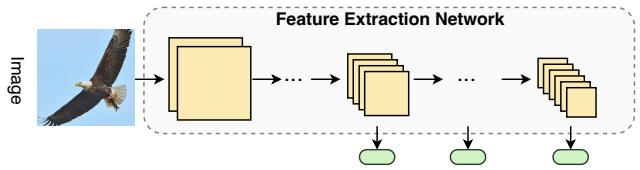  
(a) The previous early-exiting scheme.

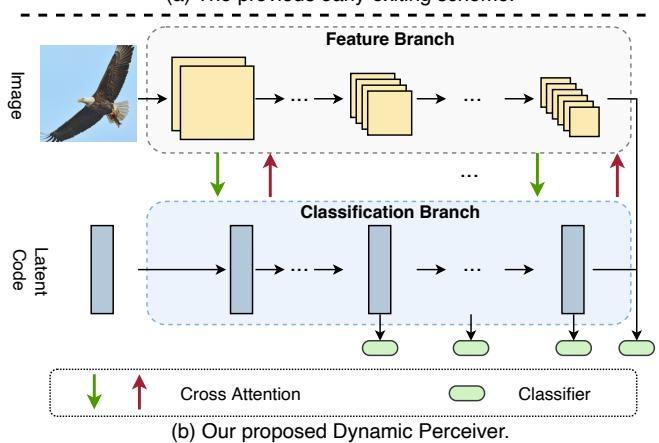  
Figure 1: Comparison of Dyn-Perceiver with the previous early-exiting scheme. (a) Conventional methods build classifiers on intermediate features, degrading the performance of the last exit; (b) Dyn-Perceiver decouples feature extraction and early classification with a two-branch structure.

In the field of dynamic networks, dynamic early-exiting networks [3, 14, 12, 24, 69, 71] construct multiple classifiers along the depth dimension, allowing samples that yield high classification confidence at early classifiers, referred to as “easy” samples, to be rapidly predicted without activating deeper layers. Existing implementations mostly build early classifiers on intermediate features [3, 24, 69] (Fig. 1 (a)). However, it has been observed [24] that classifiers will interfere with each other and significantly degrade the performance of the final exit. A widely held belief is that deep models generally extract features from a low level to a high level, and it is more appropriate to feed the high-level features at the end of a network to a linear classifier. Early classifiers in previous literature force intermediate low-level features to encapsulate high-level semantics and be linearly separable. This essentially means that feature extraction and early classification are intricately intertwined. This sub-optimal design invariably undermines the performance of dynamic early-exiting networks.

Ideally, it is expected that 1) there is a latent code which consistently embeds semantic information for direct use in classification tasks; 2) early classification and feature extraction should be decoupled, i.e., the acquisition of semantic information should be managed by a separate branch, thereby avoiding the necessity of sharing shallow layers in a feature extractor. Under these circumstances, the latent code needs to achieve linear separability, not the low-level image features, preserving the performance of late exits. The concept of incorporating a latent code is inspired by the general-purpose architecture, Perceiver [29]. This model leverages asymmetric attention to iteratively distill inputs into a latent code, which is then employed for specific tasks. Despite its impressive ability to process various modalities, Perceiver’s application in visual recognition encounters a significant challenge in terms of computational cost, particularly when the pixel count in images is substantial.

In this paper, we propose a novel two-branch structure (Fig. 1 (b)), named Dynamic Perceiver (Dyn-Perceiver), for efficient visual recognition. Specifically, a feature branch extracts image features from a low level to a high level. Concurrently, a trainable latent code, engineered to encapsulate the semantics pertinent to classification, is processed by a classification branch. These two branches progressively exchange information via symmetric crossattention layers, and the token number of image features is significantly reduced compared to the original Perceiver. Critically, multiple classifiers are situated solely in the classification branch, enabling early predictions without hindering feature extraction. The outputs from both branches are ultimately fused before being supplied to the final classifier.

Our design boasts three key advantages: 1) feature extraction and early classification are explicitly decoupled, and the experiment results in Sec. 4.2 demonstrate that the early classifier in our method even improves the performance of the last exit; 2) the Dyn-Perceiver framework is simple and versatile. It does away with the need for meticulously handcrafted structures as seen in previous approaches [24, 69, 62]. In essence, we can construct the classification branch on any advanced vision backbones to attain top-tier performance. Such universality also allows Dyn-Perceiver to seamlessly serve as a backbone for downstream tasks such as object detection; 3) the theoretical efficiency of early exiting in Dyn-Perceiver can effectively translate into practical speedup on different hardware devices.

We evaluate the performance of Dyn-Perceiver with multiple visual backbones including ResNet [19], RegNet-Y [49], and MobileNet-v3 [22]. Experiments show that Dyn-Perceiver significantly outperforms various competing models in terms of the accuracy-efficiency trade-off in ImageNet [10] classification. Notably, the inference efficiency of RegNet-Y experiences a remarkable increase of 1.9-4.8× without any compromise in accuracy. The practical latency of Dyn-Perceiver is also validated on CPU and GPU platforms. Additionally, our method effectively enhances the performance-efficiency trade-off in action recognition (Something-Something V1 [13]) and object detection tasks. For instance, Dyn-Perceiver boosts the mean average precision (mAP) of RegNet-Y by 0.9% while diminishing its computation by 43% on the COCO [37] dataset.

## 2. Related Works

Efficient visual recognition. Extensive efforts have been dedicated to improving the inference efficiency of deep networks. Popular approaches include network pruning [15, 20, 70, 53], weight quantization [30, 27, 73, 42], and lightweight architecture design [23, 77]. However, an inherent limitation of these static models is that they all treat different samples with equal computation, leading to inevitable inefficiency. In contrast, our Dyn-Perceiver can adapt its architecture (depth) to different inputs, effectively mitigating superfluous computation for “easy” samples.

Perceiver-style architectures. Our work draws inspiration from the general-purpose model Perceiver [29, 28]. Perceiver’s latent code directly queries information from raw inputs. Such generality comes at the cost of expensive computation. To this end, we adopt a visual backbone as feature extractor, thereby allowing the latent code to efficiently collect information from features, which contain considerably fewer tokens. Moreover, the performance of Dyn-Perceiver profits from our symmetric attention mechanism. Finally, Perceiver is a static model, which recursively executes attention layers for a fixed number of times. Dyn-Perceiver dynamically skips the computation of deep layers.

Mobile-Former [7] also explores convolution-attention interactions. Dyn-Perceiver differs from Mobile-Former in two key aspects: 1) while Mobile-Former strives to construct an efficient static network, our model is a universal framework especially designed for dynamic early exiting; 2) the convolution’s input in a Mobile-Former block is the output from attention, rendering the inference pipeline a sequential process. Nevertheless, our computation in two branches is independent and hence more parallel-friendly.

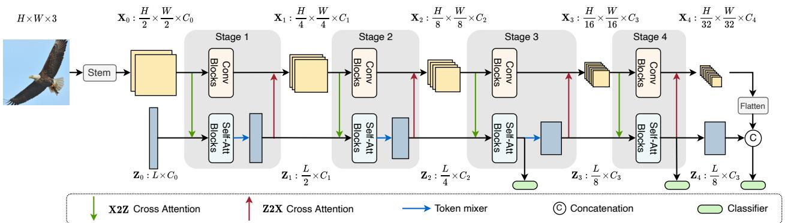  
Figure 2: An overview of Dyn-Perceiver. The feature branch (top) and the classification branch (bottom) process image features $\mathbf { X } _ { 0 } , \cdots , \mathbf { X } _ { 4 }$ and the latent code $\mathbf { Z } _ { 0 } , \cdots , \mathbf { Z } _ { 4 }$ respectively. Cross-attention layers are built symmetrically to fuse infor mation from the two branches. Early classifiers are appended only in the classification branch. Best viewed in color.

Dynamic early exiting [3, 24, 69] facilitates swift output predictions at shallower layers, reducing redundant computation in deep layers. Past observations [24] have noted that the direct insertion of early classifiers degrades the performance of the final exit. Multi-scale dense network (MS-DNet) [24] and resolution adaptive network (RANet) [69] partially address this via multi-scale structures and dense connections. However, their early classifiers are still appended on intermediate features. As a countermeasure, our model explicitly decouples feature extraction and early classification via a dual-branch architecture, which effectively improves the performance of the final exit. Furthermore, Dyn-Perceiver is a general and simple framework. It can be effortlessly constructed atop various backbones without requiring the intricately-designed architectures such as MS-DNet. This adaptability allows Dyn-Perceiver to seamlessly function as a backbone for downstream tasks.

## 3. Method

In this section, we first provide an overview of the proposed Dyn-Perceiver (Sec. 3.1). Then the main components are explained (Sec. 3.2). We finally introduce the adaptive inference paradigm and the training strategy (Sec. 3.3).

## 3.1. Overview

Overall architecture. To explicitly decouple the feature extraction process and the early classification task, we propose a novel two-branch architecture consisting of 4 stages (Fig. 2). The first branch, refered to as the feature branch, can be designed as any visual backbone. In this paper, we implement it as a CNN for efficiency. The feature branch takes an image as input and generates feature maps $( \mathbf { X } _ { 0 }$ to $\mathbf { X } _ { 4 } )$ from a low level to a high level. The second branch, denoted as the classification branch, receives a trainable latent code $\mathbf { Z } _ { 0 }$ as input. This latent code is randomly initialized and then processed by a series of self-attention operations. Following the common practice in popular vision models [19, 25, 39], we construct a token mixer (blue arrows in Fig. 2) between every two stages to reduce the token length and expand the hidden dimension of the latent code.

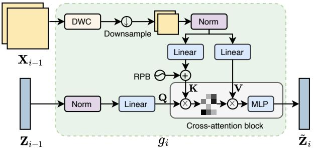  
Figure 3: X2Z cross attention. The operations (g ) in the light green block correspond to a green arrow in Fig. 2.

Symmetric cross attention. To incorporate the semantic information into the latent code, we adopt feature-to-latent (X2Z) cross attention (green arrows in Fig. 2) at the start of each stage. Subsequently, the two branches conduct convolution and self-attention operations independently. The semantic information in the latent code is then integrated into the feature branch via latent-to-feature (Z2X) cross attention (red arrows in Fig. 2) at the end of each stage.

Dynamic early exiting. The output from two branches are ultimately merged before being input to a linear classifier. Importantly, intermediate classifiers are added at the end of the last two stages of the classification branch to facilitate dynamic early exiting without disrupting feature extraction.

## 3.2. Main components

In this subsection, we present the main components in Dyn-Perceiver, generally in their order of execution. X2Z cross attention. At the start of each stage, the classification branch interacts with the input by querying information from image features. Specifically, we denote the input of the i-th $( i = 1 , 2 , 3 , 4 )$ stage in the feature branch and the classification branch as $\mathbf { X } _ { i - 1 }$ and $\mathbf { Z } _ { i - 1 }$ , respectively. Before feeding $\mathbf { Z } _ { i - 1 }$ to the self-attention blocks, we use a cross-attention module $g _ { i }$ to integrate the image feature $\mathbf { X } _ { i - 1 }$ into the latent code (Fig. 3): $\bar { \tilde { \mathbf { Z } } } _ { i - 1 } = g _ { i } ( \mathbf { Z } _ { i - 1 } , \mathbf { X } _ { i - 1 } )$ where $\mathbf { Z } _ { i - 1 }$ is the query, and $\mathbf { X } _ { i - 1 }$ is the key and the value. Note that the token numbers in early features can be large, which is inefficient if we directly conduct cross attention. Therefore, we apply depth-wise convolution (DWC) to enhance local feature extraction, and then pool the feature $\mathbf { X } _ { i - 1 }$ to the size of $7 \times 7$ before feeding it to the crossattention block. Moreover, we use relative position bias (RPB) [50] to encode the position information.

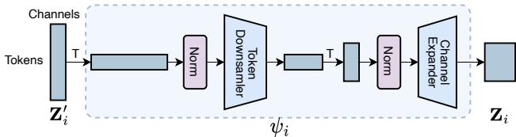  
Figure 4: Token mixer. The token downsampler performs per-channel interaction along the token dimension, and the channel expander performs per-token interaction along the channel dimension. The operations in the light blue block (ψi) correspond to a blue arrow in Fig. 2.

Self-attention blocks in the classification branch. The output of X2Z cross attention $\tilde { \mathbf { Z } } _ { i - 1 }$ is then processed by cascaded self-attention blocks: ${ \bf Z } _ { i } ^ { \prime } = f _ { i } ^ { \mathrm { a t t } } ( \tilde { \bf Z } _ { i - 1 } )$ . In this paper, we simply implement $f _ { i } ^ { \mathrm { a t t } }$ with the standard Transformer [56] blocks. Specifically, a Transformer block is composed of a multi-head self-attention (MHSA) block followed by a multi-layer perceptron (MLP).

Token mixers. Inspired by the common practice in popular vision backbones [19, 25, 39], we propose to “downsample” the latent code and align its channels with the image feature between every two stages. Specifically, we use two linear layers to reduce the token number of the latent code and expand the channel number1 (see Fig. 4). We denote the token mixer as $\psi _ { i }$ . It takes $\mathbf { Z } _ { i } ^ { \prime }$ calculated by $f _ { i } ^ { \mathrm { a t t } }$ as input, and generates the output of the i-th stage in the classification branch: $\mathbf { Z } _ { i } = \psi _ { i } ( \mathbf { Z } _ { i } ^ { \prime } )$ . To summarize, the operations in stage i of the classification branch can be written as

$$
\begin{array} { r } { { \bf Z } _ { i } = \psi _ { i } ( f _ { i } ^ { \mathrm { a t t } } ( g _ { i } ( { \bf Z } _ { i - 1 } , { \bf X } _ { i - 1 } ) ) ) . } \end{array}\tag{1}
$$

The feature branch can be established with an arbitrary visual backbone. In this paper, we primarily experiment with three commonly used CNNs: ResNet [19], RegNet-Y [49] and MobileNet-v3 [22]. We denote the output of the i-th CNN stage as $\tilde { \mathbf { X } } _ { i } = f _ { i } ^ { \mathrm { c o n v } } ( \mathbf { X } _ { i - 1 } )$ , where $f _ { i } ^ { \mathrm { c o n v } }$ is the sequential convolutional blocks in the i-th CNN stage.fi

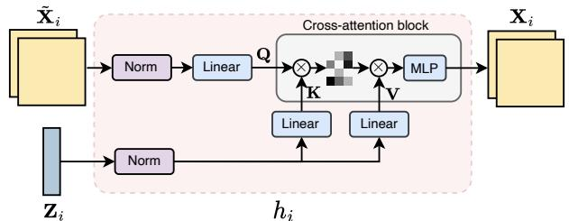  
Figure 5: Z2X cross attention. The operations in the light red block $( h _ { i } )$ correspond to a red arrow in Fig. 2.

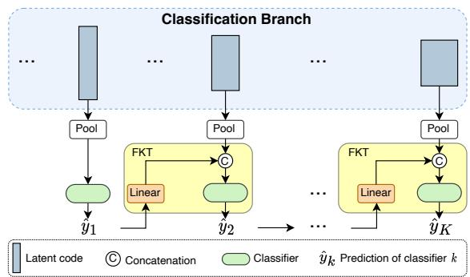  
Figure 6: FKT modules.

Note that $f _ { i } ^ { \mathrm { c o n v } }$ can be executed independently with the selfattention blocks $f _ { i } ^ { \mathrm { a t t } }$ in the first two stages to facilitate parallel computation. We execute the two branches sequentially in the last two stages to minimize the computation for obtaining early predictions (see Sec. 3.3 for details).

Z2X cross attention. Different from the original Perceiver which only distills the input into the latent code, We further use a cross-attention layer (Fig. 5) at the end of each stage to aggregate the semantic information in the classification branch back into the feature branch. We denote the cross-attention layer after stage i as $h _ { i }$ . The output of the convolutional blocks $\tilde { \mathbf { X } } _ { i }$ is used as the query, and the output of the token mixer $\mathbf { Z } _ { i }$ is the key and the value. The Z2X cross attention $h _ { i }$ produces the input for the (i+1)-th CNN stage: $\mathbf { X } _ { i } = h _ { i } ( \ddot { \mathbf { X } } _ { i } , \mathbf { Z } _ { i } )$ . In a nutshell, the operations on image features in stage i can be represented by

$$
\mathbf { X } _ { i } = h _ { i } ( f _ { i } ^ { \mathrm { c o n v } } ( \mathbf { X } _ { i - 1 } ) , \mathbf { Z } _ { i } ) .\tag{2}
$$

Classifiers. To conduct dynamic early exiting [16] without disrupting feature extraction, we build classifier heads after the last two stages only in the classification branch. Concretely, we pool the latent code along the token dimension and feed the result to a classification head. The classifier at the end of the feature branch is kept, as we find it slightly improves the dynamic inference performance. We also find that early classifiers at the first two stages bring limited improvements in dynamic early exiting. Finally, we concatenate the outputs from two branches and establish the last classifier based on the merged features.

Forward Knowledge Transfer (FKT). Inspired by the previous work on training multi-exit models [32], we propose to transfer the knowledge of early classifiers to deep ones. Specifically, a linear layer is attached to the output of an early classifier. The pooled latent code in the next stage is concatenated with the output of this linear layer before being fed to the classifier (Fig. 6). It is worth noting that instead of using a pretrain-finetune strategy as in [32], our FKT modules can directly improve the performance of both early and deep classifiers in end-to-end training (see the empirical analysis in Sec. 4.2). We believe that FKT could be viewed as a shortcut between classifiers, which also facilitates the optimization of early classifiers.

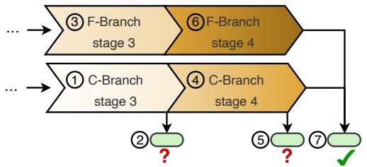  
(a) Inference procedure for a "hard" sample

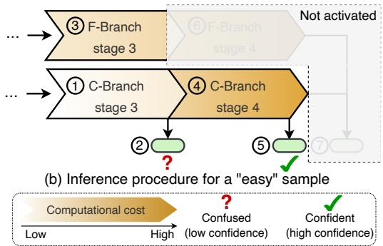  
Figure 7: The inference procedure of the last two stages for “hard” (a) and “easy” (b) samples. F-Branch and C-Branch are the feature branch and the classification branch, respectively. The circled numbers denote the execution order. Deeper layers (shaded areas) will not be activated for the samples that are predicted with high confidence by an early classifier. Best viewed in color.

## 3.3. Inference and training

Dynamic early exiting. To reduce the redundant computation on “easy” samples, we conduct dynamic early exiting based on the classification confidence of early classifiers. The inference procedure for processing “hard” and “easy” samples is illustrated in Fig. 7. We can observe from Eq. (1) that the output of stage i in the classification branch $\mathbf { Z } _ { i }$ does not rely on the output of the same stage in the feature branch $\mathbf { X } _ { i } .$ . Therefore, the early prediction can be obtained by first activating a stage in the classification branch and its followed classifier. If the confidence (the max value of the Softmax probability) exceeds a threshold, the forward propagation terminates without activating deeper layers.

Training with self-distillation. We propose to use our last classifier to guide the training of early exits. Specifically, the loss function for the k-th classifier can be written as

$$
\begin{array} { r l } & { \mathcal { L } _ { k } = \alpha \mathcal { L } _ { k } ^ { \mathrm { C E } } + ( 1 - \alpha ) \mathcal { L } _ { k } ^ { \mathrm { K D } } , k = 1 , 2 , \cdots , K - 1 , } \\ & { \mathcal { L } _ { K } = \mathcal { L } _ { K } ^ { \mathrm { C E } } , } \end{array}\tag{3}
$$

where K is the number of exits, and $\mathcal { L } _ { k } ^ { \mathrm { C E } }$ is the crossentropy (CE) loss of the k-th classifier. The item $\mathcal C _ { k } ^ { \mathrm { K D } }$ is the Kullback Leibler (KL) divergence of the soft class probabilities between the k-th and the last classifier. Such self-distillation training is a complementary strategy to the aforementioned forward knowledge transfer (FKT) module and is also used without the pretrain-finetune paradigm in [32]. The ablation study in Sec. 4.2 demonstrates that it can successfully boost the performance of early classifiers.

The overall training loss can be constructed by accumulating the loss from all exits: $\scriptstyle { \mathcal { L } } = \sum _ { k = 1 } ^ { K } { \mathcal { L } } _ { k }$ , and α in Eq. (3) is simply set as 0.5 in all our experiments.

## 4. Experiments

In this section, we first evaluate Dyn-Perceiver with different visual backbones on ImageNet [10], and then validate the proposed method in action recognition on Something-Something V1 [13] (Sec. 4.1). Ablation studies (Sec. 4.2) and visualization (Sec. 4.3) are further presented to give a deeper understanding of our approach. Finally, we demonstrate the versatility of Dyn-Perceiver by using it as a backbone for COCO object detection [37] (Sec. 4.4).

Datasets. ImageNet [10] comprises 1000 classes, with 1.2 million and 50,000 images for training and validation. The images in ImageNet are of size 224×224. Something-Something V1 [13] is a large-scale human action dataset that includes 98k videos, and we use the official trainingvalidation split. The COCO dataset [37] contains 80 categories with 118k training images and 5k validation images. We use the average FLOPs (floating-point operations) on the validation set of each dataset to measure the computational cost. The FLOPs are calculated with 8 224×224 frames per video on Something-Something V1 and are computed based on an input size of 1280×800 on COCO.

Models. We implement the feature branch with ResNet-50 [19], RegNet-Y [49] and MobileNet-v3 [22]. For the classification branch, we choose the initial token number L of the latent code from {128,192,256} to construct differentsized models. The head number of self attention in stage i is fixed as $2 ^ { i - 1 } , i = 1 , 2 , 3 , 4$ . The cross-attention layers all have 1 head. Other details are listed in Appendix A.

Inference and training. To perform dynamic early exiting on ImageNet, we randomly split 50,000 images from the training set. Then we vary the computation budget, solve the confidence thresholds on the split data as in [24], and evaluate the validation accuracy. The training setup for ImageNet classification is provided in Appendix B. On

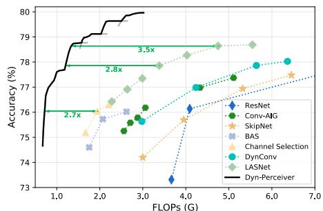  
(a) ResNet-based Dyn-Perceiver v.s. other dynamic networks

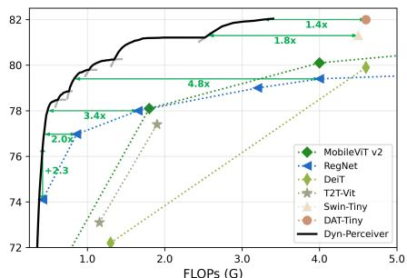  
(b) RegNet-based Dyn-Perceiver v.s. static backbones

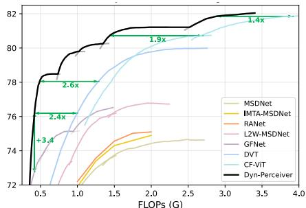  
(c) RegNet-based Dyn-Perceiver v.s. EE competitors

Figure 8: Accuracy v.s. FLOPs curves on ImageNet of Dyn-Perceiver implemented on ResNets (a) and RegNets-Y (b, c). Competing dynamic networks, static backbones, and early-exiting methods are compared in (a), (b), and (c) respectively.  
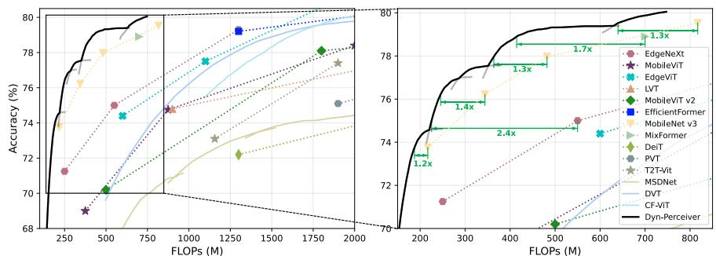  
Figure 9: ImageNet results of Dyn-Perceiver built on top of MobileNet-v3.

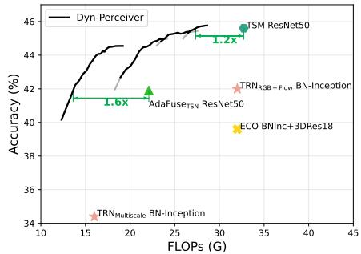  
Figure 10: Action recognition results.

Something-Something V1, we replace the CNN backbone in TSM [34] with ours and follow all the data-processing setups in [34]. In COCO object detection, ImageNetpretrained models are finetuned for 12 epochs with the default configuration of RetinaNet [36] in MMDetection [4].

## 4.1. Main results

Results on ResNet are shown in Fig. 8 (a). The earlyexiting performance of our Dyn-Perceiver is represented in gray curves, with the highest accuracy under each budget depicted by black curves. The multiple curves correspond to different models, whose detailed configurations are provided in Appendix A. We control the model complexity by manipulating the width (0.375-0.75×) of ResNet-50 [19] and the number of initial tokens L in the latent code. Our models are compared with various ResNet-based adaptive inference competitors, including layer skipping (Conv-AIG [57] and SkipNet [60]), channel skipping (BAS-ResNet [2] and Channel Selection [21]), and spatial-wise dynamic networks (DynConv [58] and LASNet [18]). It can be observed that Dyn-Perceiver significantly outperforms other types of dynamic networks. Notably, apart from the performance, a key advantage of Dyn-Perceiver is its flexibility to adjust the computational cost with a single model. When the resource budget varies, we can simply set appropriate early-exiting thresholds to meet the constraint instead of training another model with different sparsity like other methods.

Results on RegNets. We further implement Dyn-Perceiver on RegNet-Y [49] from 400M to 3.2G FLOPs and compare our method with multiple static backbones. The results in Fig. 8 (b) show the consistent improvement of our method across a wide range of computational budgets. For instance, Dyn-Perceiver reduces the computation by 4.8× to achieve the same accuracy as a RegNet-Y-4GF. Compared with the recent Swin-Transformer [39] and Vision Transformer with Deformable Attention (DAT) [66], Dyn-Perceiver reduces the computation by 1.8× and 1.4× respectively.

Comparison with early-exiting networks. Our RegNetbased Dyn-Perceiver is also compared with state-of-the-art dynamic early-exiting networks, including MSDNet [24], RANet [69], MSDNet trained with improved training techniques [32, 17], glance-and-focus network (GFNet) [63], dynamic vision Transformer (DVT) [62], and the recent CF-ViT [5]. The results in Fig. 8 (c) demonstrate that Dyn-Perceiver consistently outperforms these competitors.

Results on MobileNet-v3. We further validate Dyn-Perceiver on MobileNet-v3 with different width factors (0.75-1.5×). Our method is compared with various competitive baselines, including CNN (MobileNet-v3 [22]), vision Transformers (DeiT [54], T2T-ViT [72], PVT [59]), and hybrid models (MobileViT [44], MobleViT-v2 [45], Efficient-Former [33], EdgeViT [47], Lite Vision Transformer (LVT) [68], EdgeNeXt [43] and MixFormer [6]). As can be seen from Fig. 9 that Dyn-Perceiver consistently outperforms the competitors in a wide range of computational budgets. For example, when the budget ranges in 0.2-0.8 GFLOPs, Dyn-Perceiver has ∼1.2-1.4× less computation than MobileNetv3 when achieving the same performance.

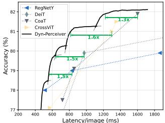  
(a) RegNet-based models on TX2

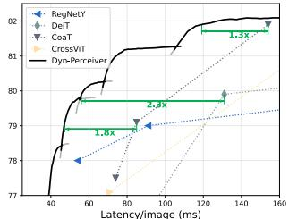  
(b) RegNet-based models on a deskop CPU

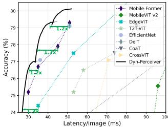  
(c) MobileNet-v3-based models on a desktop CPU

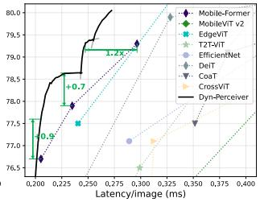  
(d) MobileNet-v3-based models on an A100 GPU

Figure 11: Speed test results of Dyn-Perceiver on different hardware platforms including a mobile device TX2 (a), a desktop CPU (b, c), and a server-end A100 GPU (d).
<table><tr><td>Model</td><td>Key/Value in X2Z</td><td>Z2X/ Z2O</td><td>Dyn</td><td>FLOPs</td><td>Top-1 Acc. (%)</td></tr><tr><td>Perceiver [29]</td><td>Input image</td><td>x</td><td>x</td><td>404G</td><td>78.6</td></tr><tr><td>Perceiver IO [28]</td><td>Input image</td><td>√</td><td>x</td><td>407G</td><td>79.0</td></tr><tr><td>Dyn-Perceiver</td><td>Feature map</td><td>√</td><td>x</td><td>0.86G</td><td>79.5</td></tr><tr><td>(MobileNet-v3-1.25×)</td><td>Feature map</td><td>√</td><td>√</td><td>0.55G</td><td>79.0</td></tr></table>

Table 1: Dyn-Perceiver v.s. Perceiver [29] and Perciver IO [28]. All three models use a latent code Z to query information from input images [29, 28] or features X (ours). Perceiver IO [28] adopts an additional output code O for classification. “Dyn” represents dynamic early exiting.

Action recognition. We implement ResNet-based (for a fair comparison with baselines) Dyn-Perceiver in the TSM framework [34] and compare our method with competitors including TSM [34], TRN [80], ECO [81] and AdaFuse [46]. As shown in Fig. 10, Dyn-Perceiver can seamlessly be applied in video classification and achieves a favorable trade-off between accuracy and efficiency.

The practical efficiency. We evaluate the practical efficiency of Dyn-Perceiver across multiple hardware platforms, including a mobile device (Nvidia Jetson TX2), a desktop CPU (Intel i5-8265U), and a server GPU (Nvidia A100). We set the batch size to 1 on CPUs and 128 on GPU. The accuracy-latency curves in Fig. 11 demonstrate that the exceptional theoretical efficiency of dynamic early exiting can effectively translate into the realistic speedup across different hardware platforms. For instance, while the recent Mobile-Former [7] exhibits remarkable performance in theoretical efficiency, the MobileNet-v3-based Dyn-Perceiver models consistently run faster on hardware while achieving comparable accuracy. We conjecture this is because our two-branch structure can be executed in parallel, and the regular activation functions are more hardware-friendly compared to dynamic ReLU [8] adopted in [7].

<table><tr><td>Exit</td><td>1</td><td>2</td></tr><tr><td>CNN (0.86 GFLOPs)</td><td></td><td></td></tr><tr><td>RegNet-Y-800MF [49] w/o EE</td><td></td><td>77.0</td></tr><tr><td>w/EE</td><td>72.4</td><td>75.8 (↓1.2)</td></tr><tr><td>Transformer w/ CLS token (1.10 GFLOPs)</td><td></td><td></td></tr><tr><td>T2T-ViT-7 [72] w/o EE</td><td></td><td>71.7</td></tr><tr><td>w/EE</td><td>65.4</td><td>69.5 (↓2.2)</td></tr><tr><td>Dyn-Perceiver (0.67 GFLOPs)</td><td></td><td></td></tr><tr><td>w/o EE</td><td></td><td>77.1</td></tr><tr><td>w/ EE in the feature branch</td><td>75.6</td><td>76.9 (↓0.2)</td></tr><tr><td>w/ EE in the classification branch</td><td>76.8</td><td>77.8 (↑0.7)</td></tr></table>

Table 2: Ablation study of the two-branch structure. The results on RegNet and T2T-ViT show the negative effect when an early classifier (EE) is built on intermediate features or CLS token. In contrast, the EE in our classification branch increases the last classifier’s accuracy.

Comparison with Perceiver [29] and Perceiver IO [28] is presented in Tab. 1. By introducing the feature branch, the symmetric cross-attention mechanism, and the dynamic early-exiting paradigm, our method significantly reduces the computation without sacrificing accuracy.

## 4.2. Ablation studies

We conduct ablation studies with our RegNetY-400MFbased model to validate the effectiveness of our two-branch framework and different design choices.

The effectiveness of our two-branch framework. We first demonstrate that incorporating early exits (EE) into a standard model degrades its final performance. We experiment with a CNN (RegNet-Y-800M [49]) and a vision Transformer with a CLS token (T2T-ViT-7 [72]). An early exit is built on the feature map at stage 3 of the CNN and the CLS token at the 4th block of T2T-ViT-7, respectively. The accuracy of different exits is reported in Tab. 2. It is observed that the performance of both the CNN and the vision Transformer is significantly affected by the early exit. We can conclude that the CLS token cannot serve as our latent code perfectly, as it frequently participates in the attention operation with other patches in each block, and the network weights for processing the CLS token are shared with those for processing image features. In other words, feature extraction and early classification are still closely coupled.

Next, we conduct experiments with our two-branch structure, which is compared with two variants: the first has the same architecture but without early exits (EE), and the second incorporates an EE in the feature branch. The accuracy of different exits is listed in Tab. 2. The results suggest that: 1) the classification branch mitigates the accuracy drop brought by the EE to some extent, even if it is placed in the feature branch; 2) the EE in the feature branch still downgrades the last classifier’s performance by interfering with feature extraction; 3) building EE in the classification branch successfully decouples feature extraction and early classification and is therefore superior to the former choice. Moreover, the last exit even outperforms the variant without any EE. We conjecture that the EE provides a “deep supervision” [31] for the classification branch. The above analysis indicates that our two-branch architecture is the key to avoiding the negative effect brought by early exits.

Harmonica  
Cacatua galerita
<table><tr><td></td><td colspan="4">Top-1 Acc. (%)</td></tr><tr><td>Exit index</td><td>1</td><td>2</td><td>3</td><td>4</td></tr><tr><td>Vanilla</td><td>43.0</td><td>73.6</td><td>50.1</td><td>74.3</td></tr><tr><td>+X2Z</td><td>57.3 (↑ 14.3)</td><td>73.4 (↓ 0.2)</td><td>74.8 (↑ 24.7)</td><td>76.5 (↑ 2.2)</td></tr><tr><td>+ DWC</td><td>58.0 (↑ 0.7)</td><td>73.6 (↑ 0.2)</td><td>75.0 (↑ 0.2)</td><td>76.7 (↑ 0.2)</td></tr><tr><td>+Z2X</td><td>56.3 (↓ 1.7)</td><td>75.1 (↑ 1.5)</td><td>75.9 (↑ 0.9)</td><td>77.8 (↑ 1.1)</td></tr><tr><td>+FKT</td><td>57.3 (↑ 1.0)</td><td>75.4 (↑ 0.3)</td><td>76.2 (↑ 0.3)</td><td>77.9 (↑ 0.1)</td></tr><tr><td>+ Self-distillation</td><td>61.8 (↑ 4.5)</td><td>75.6 (↑ 0.2)</td><td>76.8 (↑ 0.6)</td><td>77.8 (↓ 0.1)</td></tr><tr><td>- Token Mixers</td><td>42.3 (↓ 19.5)</td><td>74.9 (↓ 0.7)</td><td>59.1 (↓ 17.7)</td><td>75.2 (↓ 2.6)</td></tr></table>

Table 3: Ablation study of different components. Each row increases neglectable computation overhead.

“Easy”  
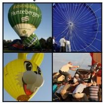  
Balloon

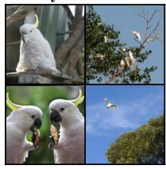

  
Figure 12: Visualization of “easy” and “hard” samples.

The effect of different components. We start from a “vanilla” two-branch structure that lacks cross-attention layers and FKT modules, and train it without selfdistillation. In the vanilla model, we retain the first X2Z cross attention, as we find the training divergent without it. Then we progressively add the components introduced in Sec. 3.2. The first line in Tab. 3 shows that the classification branch performs subpar without aggregating sufficient information from the feature branch. Next, the X2Z cross attention significantly improves the performance of the classification branch. The $4 ^ { \mathrm { { \bar { t h } } } }$ line of Tab. 3 demonstrates that the semantic information in the latent code also bolsters the performance of the feature branch. FKT and self-distillation further improve the accuracy of early classifiers. Finally, we remove the token mixers, which means that the token length and the channel number of the latent code are kept the same across different stages. We can witness that the token mixers are also important to the final performance.

## 4.3. Visualization

Fig. 12 show the images that are output by the first (“easy”) and the last (“hard”) exit of Dyn-Perceiver during dynamic early exiting. We can easily tell that “easy” samples generally contain simpler backgrounds, and the foreground objects usually have clearer appearances and standard poses. In the “hard” images, the foreground objects may have incomplete appearances (e.g. the balloon) or are very small in the scene (e.g. the Cacatua galerita). Interestingly, the harmonicas don’t even appear in the hard images, yet they are still correctly classified by the last exit. This indicates that our latent code captures rich semantic-level information to understand the “playing harmonica” action.

<table><tr><td>Model</td><td>Backbone FLOPs</td><td>mAP</td><td> $\mathrm { m A P ^ { s } }$ </td><td> $\mathrm { m A P } ^ { m }$ </td><td>mAPl</td></tr><tr><td>RegNet-X-1.6GF</td><td>33.2G</td><td>37.4</td><td>22.4</td><td>41.1</td><td>49.2</td></tr><tr><td>RegNet-Y-1.6GF*</td><td>33.4G</td><td>38.5</td><td>22.1</td><td>41.7</td><td>50.8</td></tr><tr><td>RegNet-X-3.2GF</td><td>65.5G</td><td>39.0</td><td>22.6</td><td>43.5</td><td>50.8</td></tr><tr><td>RegNet-Y-3.2GF*</td><td>66.0G</td><td>39.3</td><td>22.7</td><td>43.1</td><td>51.8</td></tr><tr><td>Dyn-Perceiver (RegNet-Y-1.6GF)</td><td>38.1G</td><td>40.2</td><td>24.1</td><td>43.9</td><td>53.0</td></tr></table>

Table 4: COCO detection results. The RegNet-X performance is obtained from the official website, and RegNet-$\mathbf { Y } ^ { \ast }$ is our implementation. The metrics mAPs, mAPm, and mAPl denote the mAP on small, medium, and large objects.

## 4.4. Object detection results

The recent early-exiting networks [24, 69, 62] usually have specially designed architectures, and may not be suitable to apply on downstream tasks, e.g. object detection. In contrast, Dyn-Perceiver can be built on top of standard vision models, and therefore can seamlessly serve as a backbone for object detection. We implement a RegNet-based model in RetinaNet [36]. Mean average precision (mAP) on the COCO [37] validation set is used to measure the detection performance. Note that early exiting is not used in this task, and the experiment is mainly to demonstrate the generality of our model. The results in Tab. 4 suggest that Dyn-Perceiver outperforms the baselines even with less computation. The performance on object detection further validates that early classifiers in the classification branch will not downgrade the quality of the feature pyramid extracted by the feature branch. To the best of our knowledge, Dyn-Perceiver is the first dynamic early-exiting network that is empirically evaluated in the object detection task.

## 5. Conclusion

We introduced Dynamic Perceiver (Dyn-Perceiver), to explicitly decouple feature extraction and early exiting with a two-branch structure for efficient visual recognition. The inspiration came from the general-purpose architecture Perceiver using a latent code to directly query inputs. We adapted Perceiver to efficient visual recognition by introducing a feature branch. The latent code in Dyn-Perceiver is processed by a classification branch, and early exits are only inserted in this classification branch, thus not affecting the coarse-to-fine feature extraction process. The two branches interact with each other via symmetric cross-attention layers. Experiments on ImageNet demonstrated that our design effectively mitigates the negative effects brought by early exits. The framework consistently reduced the computational cost of different visual backbones on image classification, action recognition, and object detection tasks. Dyn-Perceiver significantly outperformed various competitive models in balancing accuracy and efficiency. Furthermore, evaluations on multiple hardware devices showcased the preferable inference latency of our method.

Acknowledgement. This work is supported in part by National Key R&D Program of China (2021ZD0140407), the National Natural Science Foundation of China (62022048, 62276150) and the Tsinghua University-China Mobile Communications Group Co.,Ltd. Joint Institute. We also appreciate the generous donation of computing resources by High-Flyer AI.

## References

[1] Hangbo Bao, Li Dong, Songhao Piao, and Furu Wei. Beit: Bert pre-training of image transformers. In ICLR, 2021. 12

[2] Babak Ehteshami Bejnordi, Tijmen Blankevoort, and Max Welling. Batch-shaping for learning conditional channel gated networks. In ICLR, 2020. 6

[3] Tolga Bolukbasi, Joseph Wang, Ofer Dekel, and Venkatesh Saligrama. Adaptive neural networks for efficient inference. In ICML, 2017. 1, 2, 3

[4] Kai Chen, Jiaqi Wang, Jiangmiao Pang, Yuhang Cao, Yu Xiong, Xiaoxiao Li, Shuyang Sun, Wansen Feng, Ziwei Liu, Jiarui Xu, et al. Mmdetection: Open mmlab detection toolbox and benchmark. arXivpreprint arXiv:1906.07155, 2019. 6

[5] Mengzhao Chen, Mingbao Lin, Ke Li, Yunhang Shen, Yongjian Wu, Fei Chao, and Rongrong Ji. Coarse-to-fine vision transformer. In AAAI, 2023. 6

[6] Qiang Chen, Qiman Wu, Jian Wang, Qinghao Hu, Tao Hu, Errui Ding, Jian Cheng, and Jingdong Wang. Mixformer: Mixing features across windows and dimensions. In CVPR, 2022. 6

[7] Yinpeng Chen, Xiyang Dai, Dongdong Chen, Mengchen Liu, Xiaoyi Dong, Lu Yuan, and Zicheng Liu. Mobileformer: Bridging mobilenet and transformer. In CVPR, 2022. 2, 7

[8] Yinpeng Chen, Xiyang Dai, Mengchen Liu, Dongdong Chen, Lu Yuan, and Zicheng Liu. Dynamic relu. In ECCV, 2020. 7

[9] Ekin D Cubuk, Barret Zoph, Jonathon Shlens, and Quoc V Le. Randaugment: Practical automated data augmentation with a reduced search space. In CVPR workshops, 2020. 12

[10] Jia Deng, Wei Dong, Richard Socher, Li-Jia Li, Kai Li, and Li Fei-Fei. Imagenet: A large-scale hierarchical image database. In CVPR, 2009. 2, 5

[11] Alexey Dosovitskiy, Lucas Beyer, Alexander Kolesnikov, Dirk Weissenborn, Xiaohua Zhai, Thomas Unterthiner, Mostafa Dehghani, Matthias Minderer, Georg Heigold, Sylvain Gelly, Jakob Uszkoreit, and Neil Houlsby. An image is worth 16x16 words: Transformers for image recognition at scale. In ICLR, 2021. 1

[12] Michael Figurnov, Maxwell D Collins, Yukun Zhu, Li Zhang, Jonathan Huang, Dmitry Vetrov, and Ruslan

Salakhutdinov. Spatially adaptive computation time for residual networks. In CVPR, 2017. 2

[13] Raghav Goyal, Samira Ebrahimi Kahou, Vincent Michalski, Joanna Materzynska, Susanne Westphal, Heuna Kim, Valentin Haenel, Ingo Fruend, Peter Yianilos, Moritz Mueller-Freitag, et al. The” something something” video database for learning and evaluating visual common sense. In ICCV, 2017. 2, 5

[14] Alex Graves. Adaptive computation time for recurrent neural networks. arXiv preprint arXiv:1603.08983, 2016. 2

[15] Song Han, Huizi Mao, and William J Dally. Deep compression: Compressing deep neural networks with pruning, trained quantization and huffman coding. 2016. 1, 2

[16] Yizeng Han, Gao Huang, Shiji Song, Le Yang, Honghui Wang, and Yulin Wang. Dynamic neural networks: A survey. TPAMI, 2021. 1, 4

[17] Yizeng Han, Yifan Pu, Zihang Lai, Chaofei Wang, Shiji Song, Junfen Cao, Wenhui Huang, Chao Deng, and Gao Huang. Learning to weight samples for dynamic earlyexiting networks. In ECCV, 2022. 6

[18] Yizeng Han, Zhihang Yuan, Yifan Pu, Chenhao Xue, Shiji Song, Guangyu Sun, and Gao Huang. Latency-aware spatialwise dynamic networks. In NeurIPS, 2022. 1, 6

[19] Kaiming He, Xiangyu Zhang, Shaoqing Ren, and Jian Sun. Deep residual learning for image recognition. In CVPR, 2016. 1, 2, 3, 4, 5, 6

[20] Yang He, Ping Liu, Ziwei Wang, Zhilan Hu, and Yi Yang. Filter pruning via geometric median for deep convolutional neural networks acceleration. In CVPR, 2019. 1, 2

[21] Charles Herrmann, Richard Strong Bowen, and Ramin Zabih. Channel selection using gumbel softmax. In ECCV, 2020. 6

[22] Andrew Howard, Mark Sandler, Grace Chu, Liang-Chieh Chen, Bo Chen, Mingxing Tan, Weijun Wang, Yukun Zhu, Ruoming Pang, Vijay Vasudevan, et al. Searching for mobilenetv3. In ICCV, 2019. 1, 2, 4, 5, 6

[23] Andrew G Howard, Menglong Zhu, Bo Chen, Dmitry Kalenichenko, Weijun Wang, Tobias Weyand, Marco Andreetto, and Hartwig Adam. Mobilenets: Efficient convolutional neural networks for mobile vision applications. arXiv preprint arXiv:1704.04861, 2017. 1, 2

[24] Gao Huang, Danlu Chen, Tianhong Li, Felix Wu, Laurens van der Maaten, and Kilian Weinberger. Multi-scale dense networks for resource efficient image classification. In ICLR, 2018. 2, 3, 5, 6, 8

[25] Gao Huang, Zhuang Liu, Geoff Pleiss, Laurens Van Der Maaten, and Kilian Weinberger. Densely connected convolutional networks. TPAMI, 2019. 1, 3, 4

[26] Gao Huang, Yu Sun, Zhuang Liu, Daniel Sedra, and Kilian Q Weinberger. Deep networks with stochastic depth. In ECCV, 2016. 12

[27] Itay Hubara, Matthieu Courbariaux, Daniel Soudry, Ran El-Yaniv, and Yoshua Bengio. Binarized neural networks. In NeurIPS, 2016. 2

[28] Andrew Jaegle, Sebastian Borgeaud, Jean-Baptiste Alayrac, Carl Doersch, Catalin Ionescu, David Ding, Skanda Koppula, Daniel Zoran, Andrew Brock, Evan Shelhamer, et al.

Perceiver io: A general architecture for structured inputs & outputs. In ICLR, 2021. 2, 7

[29] Andrew Jaegle, Felix Gimeno, Andy Brock, Oriol Vinyals, Andrew Zisserman, and Joao Carreira. Perceiver: General perception with iterative attention. In ICML, 2021. 2, 7

[30] Sangil Jung, Changyong Son, Seohyung Lee, Jinwoo Son, Jae-Joon Han, Youngjun Kwak, Sung Ju Hwang, and Changkyu Choi. Learning to quantize deep networks by optimizing quantization intervals with task loss. In CVPR, 2019. 1, 2

[31] Chen-Yu Lee, Saining Xie, Patrick Gallagher, Zhengyou Zhang, and Zhuowen Tu. Deeply-supervised nets. In AIStat, 2015. 8

[32] Hao Li, Hong Zhang, Xiaojuan Qi, Ruigang Yang, and Gao Huang. Improved techniques for training adaptive deep networks. In ICCV, 2019. 4, 5, 6

[33] Yanyu Li, Geng Yuan, Yang Wen, Eric Hu, Georgios Evangelidis, Sergey Tulyakov, Yanzhi Wang, and Jian Ren. Efficientformer: Vision transformers at mobilenet speed. arXiv preprint arXiv:2206.01191, 2022. 6

[34] Ji Lin, Chuang Gan, and Song Han. Tsm: Temporal shift module for efficient video understanding. In ICCV, 2019. 1, 6, 7, 12

[35] Ji Lin, Yongming Rao, Jiwen Lu, and Jie Zhou. Runtime neural pruning. In NeurIPS, 2017. 1

[36] Tsung-Yi Lin, Priya Goyal, Ross Girshick, Kaiming He, and Piotr Dollar. Focal loss for dense object detection. In´ ICCV, 2017. 6, 8, 12

[37] Tsung-Yi Lin, Michael Maire, Serge Belongie, James Hays, Pietro Perona, Deva Ramanan, Piotr Dollar, and C Lawrence´ Zitnick. Microsoft coco: Common objects in context. In ECCV, 2014. 2, 5, 8

[38] Ze Liu, Han Hu, Yutong Lin, Zhuliang Yao, Zhenda Xie, Yixuan Wei, Jia Ning, Yue Cao, Zheng Zhang, Li Dong, et al. Swin transformer v2: Scaling up capacity and resolution. In CVPR, 2022. 1

[39] Ze Liu, Yutong Lin, Yue Cao, Han Hu, Yixuan Wei, Zheng Zhang, Stephen Lin, and Baining Guo. Swin transformer: Hierarchical vision transformer using shifted windows. In ICCV, 2021. 1, 3, 4, 6

[40] Zhuang Liu, Hanzi Mao, Chao-Yuan Wu, Christoph Feichtenhofer, Trevor Darrell, and Saining Xie. A convnet for the 2020s. In CVPR, 2022. 1

[41] Ze Liu, Jia Ning, Yue Cao, Yixuan Wei, Zheng Zhang, Stephen Lin, and Han Hu. Video swin transformer. In CVPR, 2022. 1

[42] Zhenhua Liu, Yunhe Wang, Kai Han, Wei Zhang, Siwei Ma, and Wen Gao. Post-training quantization for vision transformer. In NeurIPS, 2021. 2

[43] Muhammad Maaz, Abdelrahman Shaker, Hisham Cholakkal, Salman Khan, Syed Waqas Zamir, Rao Muhammad Anwer, and Fahad Shahbaz Khan. Edgenext: efficiently amalgamated cnn-transformer architecture for mobile vision applications. arXiv preprint arXiv:2206.10589, 2022. 6

[44] Sachin Mehta and Mohammad Rastegari. Mobilevit: Lightweight, general-purpose, and mobile-friendly vision transformer. In ICLR, 2022. 6

[45] Sachin Mehta and Mohammad Rastegari. Separable selfattention for mobile vision transformers. arXiv preprint arXiv:2206.02680, 2022. 6

[46] Yue Meng, Rameswar Panda, Chung-Ching Lin, Prasanna Sattigeri, Leonid Karlinsky, Kate Saenko, Aude Oliva, and Rogerio Feris. Adafuse: Adaptive temporal fusion network for efficient action recognition. In ICLR, 2021. 7

[47] Junting Pan, Adrian Bulat, Fuwen Tan, Xiatian Zhu, Lukasz Dudziak, Hongsheng Li, Georgios Tzimiropoulos, and Brais Martinez. Edgevits: Competing light-weight cnns on mobile devices with vision transformers. In ECCV, 2022. 6

[48] Boris T Polyak and Anatoli B Juditsky. Acceleration of stochastic approximation by averaging. SIAM journal on control and optimization, 1992. 12

[49] Ilija Radosavovic, Raj Prateek Kosaraju, Ross Girshick, Kaiming He, and Piotr Dollar. Designing network design´ spaces. In CVPR, 2020. 1, 2, 4, 5, 6, 7

[50] Prajit Ramachandran, Niki Parmar, Ashish Vaswani, Irwan Bello, Anselm Levskaya, and Jon Shlens. Stand-alone selfattention in vision models. NeurIPS, 2019. 4

[51] Carlos Riquelme, Joan Puigcerver, Basil Mustafa, Maxim Neumann, Rodolphe Jenatton, Andre Susano Pinto, Daniel´ Keysers, and Neil Houlsby. Scaling vision with sparse mixture of experts. In NeurIPS, 2021. 1

[52] Christian Szegedy, Vincent Vanhoucke, Sergey Ioffe, Jon Shlens, and Zbigniew Wojna. Rethinking the inception architecture for computer vision. In CVPR, 2016. 12

[53] Yehui Tang, Kai Han, Yunhe Wang, Chang Xu, Jianyuan Guo, Chao Xu, and Dacheng Tao. Patch slimming for efficient vision transformers. In CVPR, 2022. 2

[54] Hugo Touvron, Matthieu Cord, Matthijs Douze, Francisco Massa, Alexandre Sablayrolles, and Herve J ´ egou. Training´ data-efficient image transformers & distillation through attention. In ICML, 2021. 1, 6

[55] Hugo Touvron, Matthieu Cord, Alexandre Sablayrolles, Gabriel Synnaeve, and Herve J ´ egou. Going deeper with im-´ age transformers. In ICCV, 2021. 12

[56] Ashish Vaswani, Noam Shazeer, Niki Parmar, Jakob Uszkoreit, Llion Jones, Aidan N Gomez, Łukasz Kaiser, and Illia Polosukhin. Attention is all you need. In NeurIPS, 2017. 4

[57] Andreas Veit and Serge Belongie. Convolutional networks with adaptive inference graphs. In ECCV, 2018. 6

[58] Thomas Verelst and Tinne Tuytelaars. Dynamic convolutions: Exploiting Spatial Sparsity for Faster Inference. In CVPR, 2020. 6

[59] Wenhai Wang, Enze Xie, Xiang Li, Deng-Ping Fan, Kaitao Song, Ding Liang, Tong Lu, Ping Luo, and Ling Shao. Pyramid vision transformer: A versatile backbone for dense prediction without convolutions. In ICCV, 2021. 1, 6

[60] Xin Wang, Fisher Yu, Zi-Yi Dou, Trevor Darrell, and Joseph E Gonzalez. Skipnet: Learning dynamic routing in convolutional networks. In ECCV, 2018. 6

[61] Yulin Wang, Zhaoxi Chen, Haojun Jiang, Shiji Song, Yizeng Han, and Gao Huang. Adaptive focus for efficient video recognition. ICCV, 2021. 1

[62] Yulin Wang, Rui Huang, Shiji Song, Zeyi Huang, and Gao Huang. Not all images are worth 16x16 words: Dy-

namic vision transformers with adaptive sequence length. In NeurIPS, 2021. 2, 6, 8

[63] Yulin Wang, Kangchen Lv, Rui Huang, Shiji Song, Le Yang, and Gao Huang. Glance and focus: a dynamic approach to reducing spatial redundancy in image classification. In NeurIPS, 2020. 6

[64] Yulin Wang, Yang Yue, Yuanze Lin, Haojun Jiang, Zihang Lai, Victor Kulikov, Nikita Orlov, Humphrey Shi, and Gao Huang. Adafocus v2: End-to-end training of spatial dynamic networks for video recognition. In CVPR, 2022. 1

[65] Yulin Wang, Yang Yue, Xinhong Xu, Ali Hassani, Victor Kulikov, Nikita Orlov, Shiji Song, Humphrey Shi, and Gao Huang. Adafocusv3: On unified spatial-temporal dynamic video recognition. In ECCV, 2022. 1

[66] Zhuofan Xia, Xuran Pan, Shiji Song, Li Erran Li, and Gao Huang. Vision transformer with deformable attention. In CVPR, 2022. 6

[67] Saining Xie, Ross Girshick, Piotr Dollar, Zhuowen Tu, and´ Kaiming He. Aggregated residual transformations for deep neural networks. In CVPR, 2017. 1

[68] Chenglin Yang, Yilin Wang, Jianming Zhang, He Zhang, Zijun Wei, Zhe Lin, and Alan Yuille. Lite vision transformer with enhanced self-attention. In CVPR, 2022. 6

[69] Le Yang, Yizeng Han, Xi Chen, Shiji Song, Jifeng Dai, and Gao Huang. Resolution adaptive networks for efficient inference. In CVPR, 2020. 2, 3, 6, 8

[70] Le Yang, Haojun Jiang, Ruojin Cai, Yulin Wang, Shiji Song, Gao Huang, and Qi Tian. Condensenet v2: Sparse feature reactivation for deep networks. In CVPR, 2021. 1, 2

[71] Le Yang, Ziwei Zheng, Jian Wang, Shiji Song, Gao Huang, and Fan Li. Adadet: An adaptive object detection system based on early-exit neural networks. IEEE Transactions on Cognitive and Developmental Systems, 2023. 2

[72] Li Yuan, Yunpeng Chen, Tao Wang, Weihao Yu, Yujun Shi, Zi-Hang Jiang, Francis EH Tay, Jiashi Feng, and Shuicheng Yan. Tokens-to-token vit: Training vision transformers from scratch on imagenet. In ICCV, 2021. 1, 6, 7

[73] Zhihang Yuan, Chenhao Xue, Yiqi Chen, Qiang Wu, and Guangyu Sun. Ptq4vit: Post-training quantization for vision transformers with twin uniform quantization. In ECCV, 2022. 1, 2

[74] Sangdoo Yun, Dongyoon Han, Seong Joon Oh, Sanghyuk Chun, Junsuk Choe, and Youngjoon Yoo. Cutmix: Regularization strategy to train strong classifiers with localizable features. In ICCV, 2019. 12

[75] Xiaohua Zhai, Alexander Kolesnikov, Neil Houlsby, and Lucas Beyer. Scaling vision transformers. In CVPR, 2022. 1

[76] Hongyi Zhang, Moustapha Cisse, Yann N Dauphin, and David Lopez-Paz. mixup: Beyond empirical risk minimization. In ICLR, 2018. 12

[77] Xiangyu Zhang, Xinyu Zhou, Mengxiao Lin, and Jian Sun. Shufflenet: An extremely efficient convolutional neural network for mobile devices. In CVPR, 2018. 1, 2

[78] Tianchen Zhao, Xuefei Ning, Ke Hong, Zhongyuan Qiu, Pu Lu, Yali Zhao, Linfeng Zhang, Lipu Zhou, Guohao Dai, Huazhong Yang, et al. Ada3d: Exploiting the spatial redundancy with adaptive inference for efficient 3d object detection. In ICCV, 2023. 1

[79] Ziwei Zheng, Le Yang, Yulin Wang, Miao Zhang, Lijun He, Gao Huang, and Fan Li. Dynamic spatial focus for efficient compressed video action recognition. IEEE Transactions on Circuits and Systemsfor Video Technology, 2023. 1

[80] Bolei Zhou, Alex Andonian, Aude Oliva, and Antonio Torralba. Temporal relational reasoning in videos. In ECCV, 2018. 7

[81] Mohammadreza Zolfaghari, Kamaljeet Singh, and Thomas Brox. Eco: Efficient convolutional network for online video understanding. In ECCV, 2018. 7