# ENVIDR: Implicit Differentiable Renderer with Neural Environment Lighting

Ruofan Liang1,2 Huiting Chen1 Chunlin Li1 Fan Chen1 Selvakumar Panneer3 Nandita Vijaykumar1,2 1University of Toronto 2Vector Institute 3Intel Labs

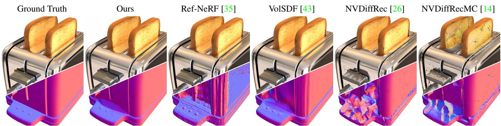  
Figure 1: Compared to prior work, ENVIDR has more accurate surface reconstruction and higher quality rendering for shiny objects with inter-reflections, as depicted for this “toaster” scene. The project page: nexuslrf.github.io/ENVIDR

## Abstract

Recent advances in neural rendering have shown great potential for reconstructing scenes from multiview images. However, accurately representing objects with glossy surfaces remains a challenge for existing methods. In this work, we introduce ENVIDR, a rendering and modeling framework for high-quality rendering and reconstruction of surfaces with challenging specular reflections. To achieve this, we first propose a novel neural renderer with decomposed rendering components to learn the interaction between surface and environment lighting. This renderer is trained using existing physically based renderers and is decoupled from actual scene representations. We then propose an SDF-based neural surface model that leverages this learned neural renderer to represent general scenes. Our model additionally synthesizes indirect illuminations caused by inter-reflectionsfrom shiny surfaces by marching surface-reflected rays. We demonstrate that our method outperforms state-of-art methods on challenging shiny scenes, providing high-quality rendering of specular reflections while also enabling material editing and scene relighting.

## 1. Introduction

Neural Radiance Fields (NeRF) [24] has emerged as a promising approach to many important 3D computer vision and graphics tasks. By integrating deep learning with traditional volume rendering techniques, NeRF enables highquality 3D scene modeling and reconstruction with photorealistic rendering quality with significant recent research that has achieved impressive results [25, 26, 28, 20]. While NeRF can synthesize novel views with photo-realistic quality, they often struggle to accurately represent surfaces with high specular reflectance. Instead of learning a solid, smooth surface for these regions, NeRF models tend to interpret the view-dependent specular reflections as virtual lights or images underneath the actual surfaces (Figure 2). This leads to learning inaccurate surface geometry in the shiny regions. These virtual lights can also interfere with normal directions and negatively affect performance in inverse rendering tasks such as relighting and environment estimation. This challenge has also been observed and analyzed by prior work, Verbin et al. [35], but is yet to be fully addressed.

Prior work largely takes one of two major approaches to address the challenge of learning reflection in neural rendering. The first approach involves explicitly representing virtual lights or images underneath the surface to account for complex view-dependent appearance [13, 42, 17, 34]. The original NeRF [24] and its extensions such as [21, 2, 45] also synthesize complex reflections in this way (Figure 2). Although this approach at large can improve rendering quality, it often sacrifices the accuracy of the reconstructed sur face and limits the ability to edit scenes, such as relighting. Alternatively, the second approach incorporates knowledge of inverse rendering to model the interaction between light and surface [47, 49, 6, 26]. By decomposing rendering parameters, these methods can achieve material editing and scene relighting. However, these methods often suffer from relatively low rendering quality compared to topperforming NeRF models without full decomposition. This is because the simplified or approximated rendering equation [16] used in these models cannot account for all complex rendering effects. Ref-NeRF [35] improves the rendering of glossy objects with some decomposition; however its editability (e.g., relighting) is still limited as it does not fully decompose surface material and environment illumination. In this work, we aim to further improve the quality of neural rendering for glossy surfaces, while retaining accurate surface geometry and the ability to edit scenes.

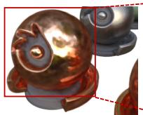  
Rendered image

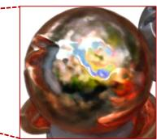  
Zooming + Slicing

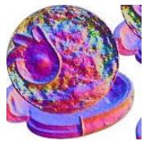  
Normal  
Figure 2: Artifacts in rendering surfaces with specular reflections due to the inaccurate interpretation of virtual lights underneath object surfaces (results from mip-NeRF [2]).

In this work, we introduce ENVIDR, a new rendering and modeling framework for high-quality reconstructing and rendering of 3D objects with challenging specular reflections. It comprises two major parts: 1) a novel neural renderer and 2) an SDF-based neural surface model that represents the scene and interacts with the neural renderer.

Our neural renderer is different from prior works [47, 49, 6, 26] that incorporate the rendering equations for inverse rendering as we do not use an explicit form of the rendering equation. Instead, our neural renderer learns an approximation of physically based rendering (PBR) using 3 decomposed MLPs accounting for environment lighting, diffuse rendering, and specular rendering, respectively (Figure 3). This neural renderer is trained using images with various materials and environments synthesized by existing PBR renderers. In our renderer, the environment MLP is a decoupled component that is trained to represent the preintegrated lighting of a specific environment with neural features as output (different from prior methods [6, 10, 19] that outputs RGB). Thus, our neural renderer can be used for scene relighting and material editing by simply swapping out the environment MLP with the one that is trained to represent the desired environment map.

To interact with this neural renderer, we present a new neural surface model that employs an SDF-based neural representation (similar to [43]). We, however, use the diffuse/specular MLPs from the neural renderer in place of the commonly used directional color MLP. During training, we only train this SDF model and a new environment MLP without changing the pre-trained diffuse/specular MLPs in the neural renderer.

Finally, shiny surfaces may have inter-reflections that cause apparent view-dependent indirect illumination. To model this, we approximate the incoming radiance from inter-reflections by marching rays along the surfacereflected view directions. We additionally propose a color blending model that converts the approximated incoming radiance into indirect illumination and blends it into EN-VIDR’s final rendered color.

We demonstrate the effectiveness of our proposed method on several challenging shiny scenes, and our results show that it is quantitatively and qualitatively on par with or superior to previous methods. Our method achieves this while preserving high-quality decomposed rendering components, including diffuse color, specular color, material roughness, and environment light, which enables physically based scene editing.

## 2. Related Work

Neural rendering and NeRF. Neural rendering is a class of reconstruction and rendering approaches that employ neural methods to learn complex mappings from captured images to novel images [33]. Neural radiance field (NeRF) [24] is one representative work that utilizes implicit neural representations and volume rendering for photorealistic novel view synthesis. NeRF has inspired many follow-up works that achieve state-of-the-art performance in 3D rendering tasks [2, 3, 35, 31]. Recent work also utilizes the hybrid neural representation to accelerate the training and rendering speed of NeRF models [25, 32], making it practical for real applications such as game and movie productions. One major limitation of the original NeRF method is that its unconstrained volumetric representation leads to low-quality surface geometry. Follow-up methods combine the implicit surface representation with NeRF [43, 38] to enable volume rendering on neural surface representations for more accurate and continuous surface reconstruction.

Rendering reflective and glossy surfaces. Rendering views in scenes with complex specular reflections has been challenging. Early methods use light field techniques [11, 18, 40, 8], which require dense image capture. Recent approaches use learning-based methods to reconstruct the light field from a small set of images [51, 9, 39], but are limited by the number of available viewpoints. Recent advances in neural rendering also show promising results in rendering reflective or glossy surfaces. NeRFReN [13] models planar reflections by learning a separate neural field. SNISR [42] treats specular highlights as virtual lights underneath the surface with a reflection MLP. Neural Catacaustics [17] uses a neural warp field to approximate the catacaustic through the virtual points for reflections. However, these methods do not model the physically based interaction between lighting and surface, limiting their ability to edit the lighting of represented scenes. Ref-NeRF [35] conditions the view-dependent color on the reflected view direction and improves learning of surface normals, but it may still inaccurately learn virtual geometry from complex reflections (see Fig. 1). In contrast, our model uses the surface-based representation to constrain the surface normal, and it decouples environment light from the directional MLP to achieve scene relighting.

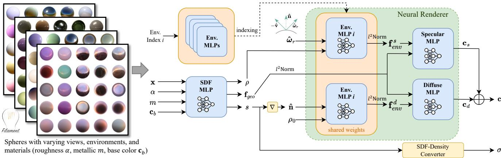  
Figure 3: Overview of our proposed neural renderer. Training images are synthesized by Filament PBR engine [29] during runtime, and probes are from HDRI Haven (CC-0). The MLPs in our neural renderer are some simple and tiny MLPs.

Neural inverse rendering. Inverse rendering aims to estimate surface geometry, material properties and lighting conditions from images [22]. Recently, NeRF methods have been employed in inverse rendering tasks to learn scene lighting and material properties (e.g., BRDF). However, prior work such as [4, 30] requires known lighting conditions to learn materials. More recent works such as [47, 6, 49, 26, 14] jointly estimate environment light and materials with images under unknown lighting conditions. These methods employ different representations to model the environment light, such as learnable spherical Gaussians [5, 47], pre-integrated environment texture [6], HDR light probes [49, 19, 26, 14]. With the estimated decomposed rendering parameters, previous neural inverse rendering methods rely on an approximated or simplified rendering equation [16] to synthesize or edit the scene, limiting their ability to achieve high-quality renderings comparable to top-performing NeRF models. In contrast, our model uses a neural renderer to learn the physically based interaction between surface and environment through existing PBR renderers, without explicitly formulating the rendering equation. Similar to [6, 10, 19], our model also uses MLPs to represent environment lights, however, the output of our environment MLP is neural features instead of RGB colors. Regarding indirect illumination, [30, 50] incorporate indirect illumination in their model, but their approximation may not work well on shiny surfaces. We instead directly march the surface-reflected rays to synthesize indirect lighting on shiny surfaces.

## 3. Preliminaries

## 3.1. Volume Rendering with Neural Surface

Instead of representing volume density like NeRF [24], neural surface methods [27, 44] use implicit neural representation to represent scene geometry as signed distance fields (SDF). For a given 3D point $\mathbf { x } \in \mathbb { R } ^ { 3 }$ , SDF returns the point’s distance to the closest surface $\mathbf { x } \mapsto s = F _ { \theta } ( \mathbf { x } )$ $F _ { \theta }$ denotes the neural spatial representation with learnable parameters θ. $F _ { \theta }$ can be either a fully implicit MLP or a hybrid model containing voxel-based features [25, 46, 41].

To render a pixel, a ray $\mathbf { r } : \mathbf { o } + t \hat { \mathbf { v } }$ is cast from the camera’s origin o along its view direction ˆv. The SDF value $s _ { i }$ of sampled point $\mathbf { x } _ { i }$ along the ray are then converted to density or opacity value for volume rendering. VolSDF [43] demonstrates a density conversion method with the cumulative distribution function (CDF) of Laplace distribution:

$$
\sigma _ { \beta } ( s ) = { \left\{ \begin{array} { l l } { { \frac { 1 } { 2 \beta } } \exp ( { \frac { s } { \beta } } ) } & { { \mathrm { i f ~ } } s \leq 0 , } \\ { { \frac { 1 } { \beta } } ( 1 - { \frac { 1 } { 2 } } \exp ( - { \frac { s } { \beta } } ) ) } & { { \mathrm { i f ~ } } s > 0 } \end{array} \right. }\tag{1}
$$

Where $\sigma$ is converted volume density, β is a learnable parameter. With the predicted color $\mathbf { c } ( \mathbf { x } _ { i } )$ of sampled points along the ray, the color C(r) for the current ray r is integrated with volume rendering [23]:

$$
\mathbf { C } ( \mathbf { r } ) = \sum _ { i } \exp ( - \sum _ { j = 1 } ^ { i - 1 } \sigma _ { j } \delta _ { j } ) { \big ( } 1 - \exp ( - \sigma _ { j } \delta _ { j } ) { \big ) } \mathbf { c } ( \mathbf { x } _ { i } )\tag{2}
$$

where $\delta _ { i }$ denotes the distance between adjacent sampled positions along the ray.

## 3.2. The Rendering Equation

Mathematically, the outgoing radiance of a surface point x with normal nˆ from outgoing direction $\hat { \omega } _ { o }$ can be described by the physically based rendering equation [16]:

$$
L _ { o } ( \mathbf { x } , \hat { \omega } _ { o } ) = \int _ { \Omega } L _ { i } ( \mathbf { x } , \hat { \omega } _ { i } ) f _ { r } ( \mathbf { x } , \hat { \omega } _ { i } , \hat { \omega } _ { o } ) ( \hat { \mathbf { n } } \cdot \hat { \omega } _ { i } ) d \hat { \omega } _ { i }\tag{3}
$$

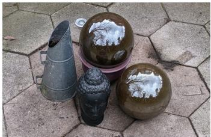  
(a) Ground Truth

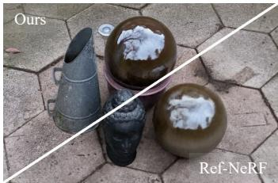  
(b) Rendering Results

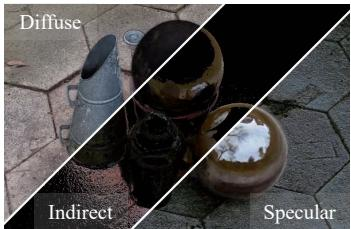  
(d) Our Color Decomposition

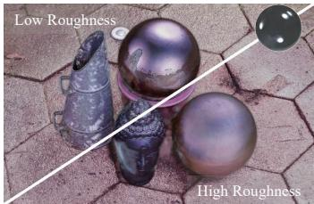  
(e) Relighting #1

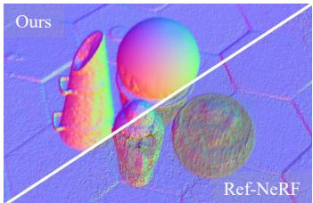  
(c) Normals

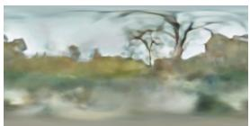  
(g) Estimated Environment Light

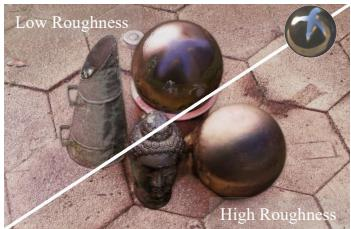  
(f) Relighting #2

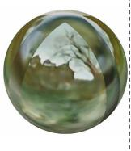

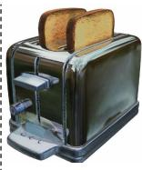  
(h) Env-MLP Swapping for Relighting Other Scenes  
Figure 4: ENVIDR achieves high-quality rendering (b) and reconstruction (c) of scenes with glossy/shiny surfaces. Our method represents diffuse, direct specular, and indirect specular colors separately (d), and enables various scene relighting and material editing (e-h) using our proposed neural renderer with decomposed rendering components. Ref-NeRF’s results are reproduced based on the official code.

where $\hat { \omega } _ { i }$ denotes incoming light direction, Ω denotes the hemisphere centered at nˆ, $L _ { i } ( \mathbf { x } , \hat { \omega } _ { i } )$ is the incoming radiance of x from ωˆ , $f _ { r }$ is the BRDF that describes the surface response of incoming lights. BDRF can be expressed as a function with diffuse $f _ { d }$ and specular $f _ { s }$ components [36]:

$$
f _ { r } = f _ { d } + f _ { s }
$$

## 4. Neural Renderer: Approximating the PBR

(4)

From the rendering equation described in 3.2, we know PBR is the result of the interaction between the surface material and lighting. The neural renderer proposed in this work attempts to learn a neural approximation of the PBR, instead of explicitly formulating a rendering equation. In addition to the geometry MLP F for surface geometry representation, we use three MLPs: environment light MLP $E ( \cdot )$ , diffuse MLP $R _ { d } ( \cdot )$ , and specular MLP $R _ { s } ( \cdot )$ in place of NeRF’s directional MLP. Similar to the decomposition of BDRF in PBR (Eqn. 4), our diffuse MLP and specular MLP implicitly learn the rendering rules for the corresponding color components. The environment light MLP encodes the distant light probes of a specific environment into neural features that interact with surface geometry features (i.e., feature fusion) through diffuse/specular MLPs.

## 4.1. Decomposed Rendering MLPs

Environment Light MLP. Similar to [6, 19, 10], we represent the environment light probes as a coordinate-based MLP, conditioned on light directions. However, the output of our environment MLP is a high-dimensional neural feature vector instead of a valid HDR pixel. These neural environment features help our neural renderer capture complex surface-lighting interactions compared to RGB pixels. For efficient rendering, we use a similar approach as Neural-PIL [6] to represent pre-integrated environment light. Therefore, our environment MLP also requires roughness as the additional input. We employ the integrated directional encoding (IDE) [35] over input direction and roughness to better learn continuous, high-frequency environment feature vectors. More specifically, given a light direction $\hat { \omega } ,$ and a roughness value1 $\rho ,$ our environment MLP E returns a neural feature vector ${ \bf f } _ { e n v }$

$$
\mathbf { f } _ { e n v } = \pmb { { \cal E } } ( \hat { \omega } , \rho )\tag{5}
$$

$\mathbf { f } _ { e n v }$ is then used for synthesizing diffuse/specular colors. To change the environment lighting of the rendered scene, we can swap the environment MLP to achieve this.

Diffuse MLP. The diffuse MLP learns color synthesis from the diffuse (Lambertian) BRDF. Since the irradiance of diffuse color is a cosine-weighted integration of environment light over a hemisphere centered at surface normal direction ˆn, the diffuse color is independent of view direction and surface roughness. Based on this, we use the normal direction ˆn and a constant high roughness value $\rho _ { 0 }$ (we empirically set $\rho _ { 0 } ~ = ~ 0 . 6 4 )$ as the input to our environment MLP to query the environment neural feature vector ${ \bf f } _ { e n v } ^ { d } = { \cal E } ( \hat { \bf n } , \rho _ { 0 } )$ . Environment features $\mathbf { f } _ { e n v } ^ { d }$ are then concatenated with geometry features $\mathbf { f } _ { g e o }$ as the input to the diffuse MLP $\mathbf { \nabla } _ { R _ { d } } \mathrm { : }$

$$
\mathbf { c } _ { d } = R _ { d } ( \mathbf { f } _ { g e o } , \mathbf { f } _ { e n v } ^ { d } )\tag{6}
$$

Specular MLP. As the counterpart of the diffuse MLP, specular MLP learns color synthesis from the specular

BRDF. The commonly used analytic BRDF model [7, 36] also depends on view direction and roughness. The specular BRDF lobe2 tends to be located around the direction of specular reflection and its shape is controlled by material roughness $\rho$ and the angle between the outgoing direction $\hat { \omega } _ { o } \left( \hat { \omega } _ { o } = - \hat { \mathbf { v } } \right)$ and surface normal ˆn. Similarly, the outgoing radiance at $\hat { \omega } _ { o }$ can be approximated as an integral over the weight distribution of incoming lights that is centered around reflected view direction $\hat { \omega } _ { r }$ . Therefore, we use the reflected view direction $\hat { \omega } _ { r }$ and the predicted roughness $\rho$ (via geometry MLP $F _ { g } )$ to query environment MLP E for the environment feature vector $\mathbf { f } _ { e n v } ^ { s } = \pmb { { \cal E } } ( \hat { \omega } _ { r } , \rho )$ . Environment features, geometry features, and the dot product between $\hat { \omega } _ { o }$ and ˆn. are then combined as the input to the specular MLP $\scriptstyle { \mathbf { } } R _ { s }$

$$
\mathbf { c } _ { s } = \boldsymbol { R _ { s } } ( \mathbf { f } _ { g e o } , \mathbf { f } _ { e n v } ^ { s } , \hat { \boldsymbol { \omega } } _ { o } \cdot \hat { \mathbf { n } } )\tag{7}
$$

Finally, the synthesized diffuse and specular colors after volume rendering (Eq. 2) are additively combined in the linear space and then converted to sRGB space with gamma tone mapping [1]:

$$
\mathbf { C } = \gamma ( \mathbf { C } _ { d } + \mathbf { C } _ { s } )\tag{8}
$$

## 4.2. Training the Neural Renderer

We train our neural renderer using synthesized images of a sphere with various materials and environment lighting rendered by an existing PBR renderer as depicted in Figure 3. Specifically, we use Filament [29] to synthesize images by varying perceptual roughness α, metallic value $m _ { : }$ , and base color $\mathbf { c } _ { b }$ for the surface material, as well as different light probes. Note that it trained with only 11 light probes that are not used by any evaluated synthetic scene (please refer to Supp. ?? for more details). To render the same sphere with our neural renderer, we employ a simple MLP ${ { F } _ { s p h e r e } }$ (similar to the one introduced in 3.1) to represent the sphere surface with SDF and output geometry features $\mathbf { f } _ { g e o }$ ${ { F } _ { s p h e r e } }$ is also conditioned on the three material attributes $( \alpha , m , \mathbf { c } _ { b } )$ to account for the changes in geometry features caused by varying material properties.

To train our model, we construct an L1 photometric loss between images synthesized by the PBR renderer $\mathbf { C } ^ { * }$ and ones synthesized by our renderer C. Other than the photometric loss, we also use the ground truth SDF $s ^ { * }$ to supervise the SDF prediction of the sphere (MSE). The loss function is formulated as:

$$
\mathcal { L } _ { r } = \mathcal { L } _ { r g b } ( \mathbf { C } , \mathbf { C } ^ { * } ) + \lambda _ { 1 } \mathcal { L } _ { S D F } ( s , s ^ { * } ) + \lambda _ { 2 } \mathcal { L } _ { e i k } ( \nabla s )\tag{9}
$$

Where $L _ { e i k }$ is Eikonal loss [12], $\lambda _ { 1 }$ & $\lambda _ { 2 }$ are loss weights which we set to 0.1 and 0.01 respectively. Figure 5 showcases the controllable rendering results of our renderer. Once the neural renderer is trained, we will freeze the weights of diffuse/specular MLPs for the rest experiments.

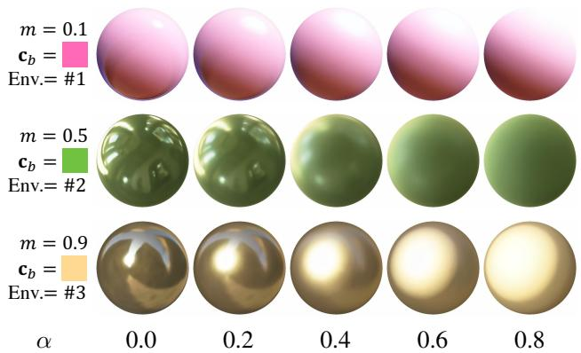  
Figure 5: Spheres sythesized by our neural renderer with varying metallic $m ,$ base color $\mathbf { c } _ { b } ,$ roughness $\alpha ,$ and light probes. We will show an interactive web demo in the future.

## 4.3. Feature Normalization

Unlike the prior work that estimates all rendering parameters with physical meanings, our high-dimensional neural features are unconstrained, since they are simply the outputs of a linear net layer. There could be multiple possible feature mappings to the RGB colors in the high-dimensional space, which could cause mismatched colors in relighting results when swapping the environment MLP learned from two different scenes. To constrain the neural features for more plausible relighting results with environment MLP swapping, we propose to normalize the neural features $( \mathbf { f } _ { e n v }$ and $\mathbf { f } _ { g e o } )$ with $l ^ { 2 } .$ -norm of each feature vector:

$$
\mathbf { f } ^ { \prime } = \mathbf { f } / \lVert \mathbf { f } \rVert _ { 2 }\tag{10}
$$

This normalization maps neural features to the unit vector on a hypersphere manifold, which improves the feature interchangeability among different represented neural scenes. We will give an empirical analysis of this in Section 7.1.

## 5. Neural Rendering for General Scenes

## 5.1. Neural Surface Representations

Following [25, 37, 46], our approach utilizes a hybrid neural SDF representation $F _ { g }$ with multi-resolution feature grids and hash encoding for the efficient learning and rendering of scene surfaces. Given an input query position x, $F _ { g }$ converts coordinate input x into a concatenated feature vector from the multi-resolution hash encoding sampled with trilinear interpolation (the encoding used in Instant-NGP [25]). The encoded features are then fed into a shallow MLP to predict all of SDF s, roughness $\rho ,$ and geometry feature $\mathbf { f } _ { g e o }$ . Note that unlike $F _ { s p h e r e }$ used for learning the neural renderer, $F _ { g }$ for general scenes is not conditioned on any explicit material properties. Instead, $F _ { g }$ implicitly learns the material properties through the multiview training images and encodes the knowledge into its geometry feature $\mathbf { f } _ { g e o }$

$$
s , \rho , \mathbf { f } _ { g e o } = F _ { g } ( \mathbf { x } )\tag{11}
$$

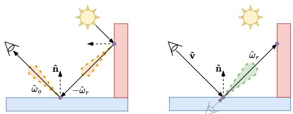  
(a) Tracing ray’s reflection path to the camera.  
(b) The raymarching process to capture pixel color.  
Figure 6: The illustrations of inter-reflections from the (a) physical lighting process and (b) raymarching rendering process. We assume the surface has a low roughness value.

For the color rendering, we utilize pre-trained diffuse and specular MLPs $( R _ { d }$ & $\mathbf { \mathcal { R } } _ { s } )$ from 4.2 to synthesize output colors. The weights of both $\mathbf { \delta } _ { R _ { d } }$ and $\scriptstyle { \mathbf { } } R _ { s }$ remain frozen throughout training. To estimate unknown environment light from training images, we randomly initialize an environment MLP $E _ { g }$ and optimize it alongside the geometry model $F _ { g }$ . By combining all these components, we introduce our neural scene representation and rendering model, which we call ENVIDR. Similar to the training of other neural surface models [43, 38], Our training is supervised by L1 photometric loss and the Eikonal constraint [12]:

$$
\mathcal { L } = \mathcal { L } _ { r g b } ( \mathbf { C } , \mathbf { C } ^ { * } ) + \lambda _ { e i k } \mathcal { L } _ { e i k } ( \nabla s )\tag{12}
$$

where $\lambda _ { e i k }$ is a weight hyperparameter which we set to 0.01. To ensure a smooth geometry initialization at the beginning, we add additional SDF regularizations at the early training iterations, please refer to the supplement for details.

## 5.2. Ray Marching for Inter-reflections

Our learned neural renderer from 4 only models the image-based lighting from distant light probes. As a result, ENVIDR in Section 5 cannot effectively handle the indirect illumination caused by surface inter-reflection. Interreflection can negatively impact the inverse rendering process for mirror-like specular surfaces as shown in Figure 1. We observe that most indirect illumination effects arise from reflective surfaces with low roughness values. Although rougher surfaces can also be affected by indirect illumination, the resulting visual effects are less apparent. Thus, we focus on synthesizing inter-reflection on reflective surfaces with predicted roughness lower than a threshold $\rho _ { s }$ (set to 0.1 in our experiments).

The weight distribution of incoming lights for outgoing radiance at $\hat { \omega } _ { o }$ on surfaces with low roughness is similar to a specular BRDF with rays concentrated at the reflected view direction $\hat { \omega } _ { r }$ . Thus, to efficiently approximate the incoming radiance of the indirect illumination caused by interreflection on these surfaces, we can perform additional raymarching (one-bounce) along the reflected view directions (see Fig. 6). This raymarching is similar to the raymarching along camera rays, but the origin and direction are set to the surface point $\mathbf { p } _ { s }$ and $\hat { \omega } _ { r }$

To render indirect illumination from approximated incoming radiance $\mathbf { e } _ { r }$ from rendered reflected rays, we introduce another color encoding MLP ${ \cal { E } } _ { r e f }$ to convert rendered reflected ray color into neural features $\bar { \mathbf { f } } _ { e n v } ^ { r e f }$ compatible with our specular MLP $\mathbf { \delta } _ { R _ { s } }$ . The rendered indirect illumination ${ \bf c } _ { r e f }$ is then output by:

$$
\mathbf { c } _ { r e f } = R _ { s } ( \mathbf { f } _ { g e o } , \mathbf { f } _ { e n v } ^ { r e f } , \hat { \boldsymbol { \omega } } _ { o } \cdot \hat { \mathbf { n } } ) , ~ \mathbf { f } _ { e n v } ^ { r e f } = E _ { r e f } ( \mathbf { e } _ { r } , \boldsymbol { \rho } )\tag{13}
$$

To blend the rendered indirect illumination into our final rendering results, we let the geometry MLP $F _ { g }$ to additionally predict a blending factor $\eta \in [ 0 , 1 ]$ (with Sigmoid activation) to combine the original direct specular color $\mathbf { c } _ { s }$ and indirect specular color ${ \bf c } _ { r e f }$ into new specular color $\mathbf { c } _ { s } ^ { \prime } { \mathrm { : } }$

$$
\mathbf { c } _ { s } ^ { \prime } = \mathbf { c } _ { s } + \eta \mathbf { c } _ { r e f }\tag{14}
$$

## 6. Experiments

We evaluate our method on various challenging shiny scenes and demonstrate the qualitative and quantitative results. We compare against prior methods based on view synthesis, scene relighting, and environment light estimation. Please refer to supplement for additional results. Datasets. We use all 6 scenes in the Shiny Blender dataset proposed in [35], 2 shiny scenes (“ficus” and “materials”) from NeRF’s Blender dataset [24], and one real captured shiny scene (“garden spheres”) from SNeRG [15].

Baselines. We choose Ref-NeRF [35] as the top-performing view synthesis model, NVDIFFREC [26] and NVD-IFFRECMC [14] as two top-performing neural inverse rendering models. We also include VolSDF [43] as a baseline neural surface model.

## 6.1. Novel View Synthesis

Following prior works, we use PSNR, SSIM, and LPIPS [48] to measure the view synthesis quality. Similar to [35], we use mean angular error (MAE) to evaluate the estimated surface normals. We show the novel view synthesis results for all evaluated scenes in Table 1 and visual results in Figure 1 and 4. Our model consistently shows better qualities in perceptually based metrics (SSIM and LPIPS). ENVIDR significantly outperforms previous neural inverse rendering and neural surface methods. ENVIDR also performs on par with Ref-NeRF, and with higher PSNR scores in some scenes. However, we should note that Ref-NeRF has a much lower surface quality (depicted by MAE) and does not support scene relighting.

In terms of learned surface quality, ENVIDR achieves the lowest MAEs on almost all evaluated synthetic scenes, indicating superior surface quality. We attribute this improvement primarily to the VolSDF-like neural surface representation employed in our model, as VolSDF also demonstrates competitive MAE values. Combining our neural renderer and neural surface model can further enhance the quality of the learned surface geometry.

<table><tr><td colspan="8">ficus mat. car ball</td></tr><tr><td colspan="8">helmet teapot toaster coffee PSNR↑</td></tr><tr><td>VolSDF</td><td>22.91 29.13</td><td></td><td>27.41 33.66</td><td>28.97 44.73</td><td></td><td>24.1031.22</td><td></td></tr><tr><td>NVDiffRec</td><td>29.8826.89</td><td></td><td>27.98 21.77</td><td>26.97 40.44</td><td>24.3130.74</td><td></td><td></td></tr><tr><td>NVDiffMC</td><td>27.0525.68</td><td></td><td>25.93 30.85</td><td>26.27 38.44</td><td></td><td>22.1829.60</td><td></td></tr><tr><td>ReF-NeRF</td><td>33.91 35.41</td><td></td><td>30.82 47.46</td><td>29.68</td><td>47.9025.70 34.21</td><td></td><td>23.46</td></tr><tr><td>Ours</td><td>30.53 29.51</td><td></td><td>29.88 41.03</td><td>36.98 46.14</td><td></td><td>26.63 34.45</td><td>22.67</td></tr><tr><td colspan="8">SSIM↑</td></tr><tr><td>VolSDF</td><td>0.929</td><td>0.954</td><td>0.955 0.985</td><td>0.968 0.998</td><td>0.928 0.977</td><td></td><td></td></tr><tr><td>NVDiffRec</td><td>0.985</td><td>0.955</td><td>0.963 0.858</td><td>0.951 0.996</td><td>0.928</td><td>0.973</td><td></td></tr><tr><td>NVDiffMC</td><td>0.969</td><td>0.943</td><td>0.940 0.940</td><td>0.940 0.995</td><td>0.886</td><td>0.965</td><td></td></tr><tr><td>ReF-NeRF</td><td>0.983</td><td>0.983</td><td>0.955 0.995</td><td>0.958 0.998</td><td>0.922</td><td>0.974</td><td>0.601</td></tr><tr><td>Ours</td><td>0.987</td><td>0.971</td><td>0.972 0.997</td><td>0.993 0.999</td><td>0.955</td><td>0.984</td><td>0.695</td></tr><tr><td colspan="8">LPIPS</td></tr><tr><td>VolSDF</td><td>0.068</td><td>0.048</td><td>0.047</td><td>0.056 0.053 0.004</td><td>0.105</td><td>0.061</td><td></td></tr><tr><td>NVDiffRec</td><td>0.012</td><td>0.047 0.045</td><td>0.297 0.118</td><td>0.011</td><td>0.169</td><td>0.076</td><td></td></tr><tr><td>NVDiffMC</td><td>0.026</td><td>0.080 0.077</td><td>0.312</td><td>0.157 0.014</td><td>0.225</td><td>0.097</td><td></td></tr><tr><td>ReF-NeRF</td><td>0.019</td><td>0.022</td><td>0.041 0.059</td><td>0.075 0.004</td><td>0.095</td><td>0.078</td><td>0.138</td></tr><tr><td>Ours</td><td>0.010</td><td>0.026 0.031</td><td>0.020 0.022</td><td>0.003</td><td>0.097</td><td>0.044</td><td>0.372</td></tr><tr><td colspan="8">MAE°</td></tr><tr><td>VolSDF</td><td>39.80</td><td>8.28 7.84</td><td>1.10</td><td>5.97</td><td>4.61 11.48</td><td>7.68</td><td></td></tr><tr><td>NVDiffRec</td><td>32.39</td><td>15.42</td><td>11.78 32.67</td><td>21.19 5.55</td><td>16.04 15.05</td><td></td><td></td></tr><tr><td>NVDiffMC</td><td>29.69</td><td>10.78</td><td>11.05 1.55</td><td>9.33 7.63</td><td>13.33</td><td>22.02</td><td></td></tr><tr><td>ReF-NeRF</td><td>41.05</td><td>9.53</td><td>14.93 1.55</td><td>29.48 9.23</td><td>42.87</td><td>12.24</td><td></td></tr><tr><td>Ours</td><td>34.44</td><td>8.47</td><td>7.10 0.74</td><td>1.66 2.47</td><td>6.45</td><td>9.23</td><td></td></tr></table>

Table 1: Quantitative comparison among evaluated models. “NVDiffMC” is short for NVDIFFRECMC. Ref-NeRF’s results are imported from their original paper [35].

## 6.2. Environment Estimation

Although the environment MLP in ENVIDR does not directly represent RGB values of environment light, it encodes the environment light as neural features. Our learned neural renderer can convert these neural features into RGB colors on a metallic sphere. By unwrapping such a sphere, we can obtain a panorama view of the environment light, which is similar to a light-probe image. This approach allows us to extract the environment light and compare it against the results obtained from other methods. In this section, we choose NVDIFFREC as a strong baseline to evaluate the accuracy of our environment light estimation.

Figure 7 visually compares our estimated environment light maps with those of NVDIFFREC3. Figure 7 demonstrates that our model effectively captures high-frequency environment lighting through the training with multiview images. Both our approach and NVDIFFREC accurately capture the high-quality environment light from highly reflective objects like the “toaster” and “helmet”. However, NVDIFFREC struggles to capture the detailed patterns of environment light for less reflective objects such as the “coffee” and “teapot”, whereas our model still captures these patterns with precision.

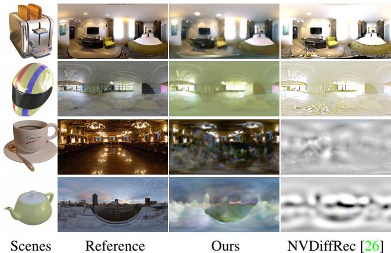  
Figure 7: The comparison of estimated environment light probes. HDR light probes are converted to sRGB by gamma correction. Note that NVDIFFRECMC’s extracted probes have similar or worse qualities compared to NVDIFFREC.

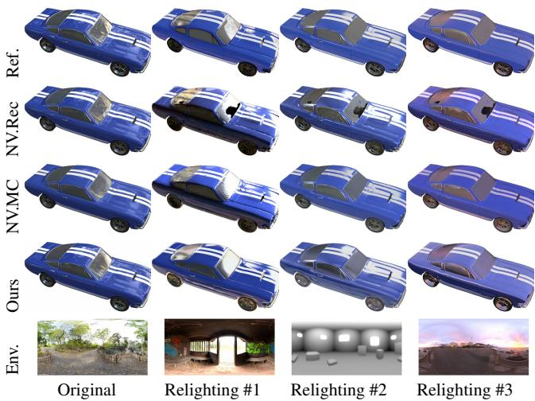  
Figure 8: Relighting results for “car”. Except for ours, other results are rendered by Blender. Since our relighting is synthesized by a neural model, the intensity of environment light represented by our env MLP may not match the Blender rendering.

## 6.3. Relighting

Similar to the relighting process in the traditional PBR, we can relight the scene represented by our model by replacing the environment MLP with environment MLPs representing new environment lights (these pre-trained env. MLPs can be obtained from our neural renderer).

In Figure 8, we present a comparison between the scene relighting results obtained from our neural renderer and those obtained from NVDIFFREC and NVDIFFRECMC (rendered by Blender). Table 2 also provides a quantitative comparison. Our model outperforms NVDIFFREC since NVDIFFREC fails to accurately reconstruct surfaces on reflective regions (e.g., artifacts shown in Figure 8). Even though the baseline models directly use the same Blender rendering as the ground-truth reference, our model using a fully neural approach still provides comparable results with specular reflections on relit surfaces. Artifacts from our approach are primarily due to: 1) the mismatch of rendering parameters (e.g., light intensity) used by our neural renderer and Blender; 2) no synthesized shadowing effects on surfaces with occluded visibility due to the use of pre-integrated environment representation. We intend to address these limitations in our future work.

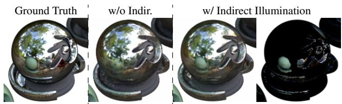

<table><tr><td></td><td>car</td><td>ficus</td><td>materials</td></tr><tr><td>NVDiffRec</td><td>22.44 / 0.920</td><td>20.21 / 0.888</td><td>22.07 / 0.895</td></tr><tr><td>NVDiffMC</td><td>24.71 / 0.936</td><td>23.16 / 0.921</td><td>23.69 / 0.914</td></tr><tr><td>Ours</td><td>22.45 / 0.921</td><td>24.64 / 0.936</td><td>22.48 / 0.900</td></tr></table>

Table 2: Quantitative results (PSNR/SSIM) of relighting on three synthetic scenes with 4 light probe images, each with 50 uniformly sampled views

## 7. Ablation

## 7.1. The Design Choice of Neural Render

Our proposed neural renderer is able to generalize to scenes with various shapes and materials for achieving reasonable relighting effects. To justify the design choices, we conduct ablation studies from two aspects and present the visual comparisons in Figure 9.

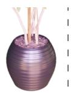  
Reference

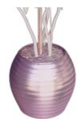  
l2-Norm

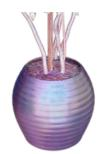  
Inst-Norm

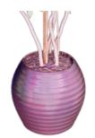  
w/o Norm

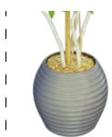  
w/o Pre-train  
Figure 9: The effects of design choices on scene relighting. Note that models trained with different design options have the same level of rendering quality before relighting.

The use of pre-trained rendering MLPs. The use of pretrained diffuse/specular MLPs allows the model to enforce a consistent feature-color mapping across different scenes. Without pre-training, the model cannot synthesize accurate reflections during relighting (“w/o Pre-train” in Fig. 9).

Feature normalizations. The feature normalization (Sec. 4.3) is another non-trivial part of our design. To demonstrate the effectiveness of our l2-Norm, we train two additional models: one without any normalization (“w/o Norm”) and one with instance normalization (“Inst-Norm”). Compared to our l2-Norm, both w/o Norm and Inst-Norm fail to synthesize the accurate specular highlight in the relit scene (e.g., pot in Fig. 9).

## 7.2. The Effect of Indirect Illuminations.

To demonstrate the effectiveness of our modeling of indirect illuminations, we train our model without specific modeling of indirect illumination (“w/o Indir.”) on 4 scenes that

contain obvious inter-reflections. Table 3 and Figure 10 provide the quantitative and qualitative comparisons, respectively. The results demonstrate that our additional modeling of indirect illumination can help improve model’s rendering quality, as well as the accuracy of surface geometry.
<table><tr><td rowspan=1 colspan=1></td><td rowspan=1 colspan=1>materials</td><td rowspan=1 colspan=1>toaster</td><td rowspan=1 colspan=1>coffee</td><td rowspan=1 colspan=1>garden.</td></tr><tr><td rowspan=1 colspan=1>w/o Indir.w/ Indir.</td><td rowspan=1 colspan=1>29.40 / 8.8529.51 / 8.47</td><td rowspan=1 colspan=1>25.46 / 7.6426.63 / 6.45</td><td rowspan=1 colspan=1>33.86 / 10.4434.45 / 9.23</td><td rowspan=1 colspan=1>22.57 /22.67 /</td></tr></table>

Table 3: Comparison of PSNR/MAE scores for models trained with and without indirect illumination modeling.  
Figure 10: The visual comparison between models trained with and without indirect illumination modeling, the rightmost figure shows our synthesized indirect specular color.

## 8. Limitations and Conclusions

The main limitation of our neural renderer is the absence of explicit modeling of light visibility, which is crucial for synthesizing shadowing effects. Our use of a preintegrated representation of environment light, assuming full visibility of the lights to the surface, may result in lower rendering quality of shaded surfaces in complex objects (e.g., the base of material balls in Fig. 10). This issue is also present in other neural inverse rendering methods [47, 6, 26]. Given the high-quality surface geometry reconstructed by our model, our future work could incorporate geometry-based visibility approximations in proposed recent works [14, 19] to deal with shadowing effects. Other limitations of our approach include the lack of fine-grained rendering parameter decomposition, the inability to handle semi-transparent or unbounded scenes, and limited support for indirect illuminations only on low-roughness surfaces.

To summarize, we show that our approximation of physically based rendering with decomposed neural net components can help implicit neural surface models improve rendering and reconstruction of glossy surfaces, with results on par with or better than the state-of-art for view synthesis and inverse rendering, while enabling more accurate surface reconstruction and scene editing. The design of our neural renderer is inspired by PBR and models the implicit interaction between material and environment lighting. We use various plausible scene relighting and material editing examples in the paper to show the applicability of our approach. We believe our approach can benefit other implicit neural representation methods, leading to higher rendering and reconstruction quality with enhanced scene editability.

Acknowledgments The authors thank the anonymous reviewers for their valuable feedback. We also thank Dev Agarwal, David Lindell, Chen Yang, Zanwei Zhou, Sankeerth Durvasula, and Yushi Guan. This work was supported in part by NSERC and Intel.

## References

[1] Matthew Anderson, Ricardo Motta, Srinivasan Chandrasekar, and Michael Stokes. Proposal for a standard default color space for the internet—srgb. In Color and imaging conference, volume 1996, pages 238–245. Society for Imaging Science and Technology, 1996. 5

[2] Jonathan T Barron, Ben Mildenhall, Matthew Tancik, Peter Hedman, Ricardo Martin-Brualla, and Pratul P Srinivasan. Mip-nerf: A multiscale representation for anti-aliasing neural radiance fields. In Proceedings of the IEEE/CVF International Conference on Computer Vision, pages 5855–5864, 2021. 1, 2

[3] Jonathan T Barron, Ben Mildenhall, Dor Verbin, Pratul P Srinivasan, and Peter Hedman. Mip-nerf 360: Unbounded anti-aliased neural radiance fields. In Proceedings of the IEEE/CVF Conference on Computer Vision and Pattern Recognition, pages 5470–5479, 2022. 2

[4] Sai Bi, Zexiang Xu, Pratul Srinivasan, Ben Mildenhall, Kalyan Sunkavalli, Milos Haˇ san, Yannick Hold-Geoffroy,ˇ David Kriegman, and Ravi Ramamoorthi. Neural reflectance fields for appearance acquisition. arXiv preprint arXiv:2008.03824, 2020. 3

[5] Mark Boss, Raphael Braun, Varun Jampani, Jonathan T Barron, Ce Liu, and Hendrik Lensch. Nerd: Neural reflectance decomposition from image collections. In Proceedings of the IEEE/CVF International Conference on Computer Vision, pages 12684–12694, 2021. 3

[6] Mark Boss, Varun Jampani, Raphael Braun, Ce Liu, Jonathan Barron, and Hendrik Lensch. Neural-pil: Neural pre-integrated lighting for reflectance decomposition. Advances in Neural Information Processing Systems, 34:10691–10704, 2021. 1, 2, 3, 4, 8

[7] Robert L Cook and Kenneth E. Torrance. A reflectance model for computer graphics. ACM Transactions on Graphics (ToG), 1(1):7–24, 1982. 5

[8] Abe Davis, Marc Levoy, and Fredo Durand. Unstructured light fields. In Computer Graphics Forum, volume 31, pages 305–314. Wiley Online Library, 2012. 2

[9] John Flynn, Michael Broxton, Paul Debevec, Matthew Du-Vall, Graham Fyffe, Ryan Overbeck, Noah Snavely, and Richard Tucker. Deepview: View synthesis with learned gradient descent. In Proceedings of the IEEE/CVF Conference on Computer Vision and Pattern Recognition, pages 2367– 2376, 2019. 2

[10] James AD Gardner, Bernhard Egger, and William AP Smith. Rotation-equivariant conditional spherical neural fields for learning a natural illumination prior. arXiv preprint arXiv:2206.03858, 2022. 2, 3, 4

[11] Steven J Gortler, Radek Grzeszczuk, Richard Szeliski, and Michael F Cohen. The lumigraph. In Proceedings of the

23rd annual conference on Computer graphics and interactive techniques, pages 43–54, 1996. 2

[12] Amos Gropp, Lior Yariv, Niv Haim, Matan Atzmon, and Yaron Lipman. Implicit geometric regularization for learning shapes. arXiv preprint arXiv:2002.10099, 2020. 5, 6

[13] Yuan-Chen Guo, Di Kang, Linchao Bao, Yu He, and Song-Hai Zhang. Nerfren: Neural radiance fields with reflections. In Proceedings of the IEEE/CVF Conference on Computer Vision and Pattern Recognition, pages 18409–18418, 2022. 1, 2

[14] Jon Hasselgren, Nikolai Hofmann, and Jacob Munkberg. Shape, light & material decomposition from images using monte carlo rendering and denoising. arXiv preprint arXiv:2206.03380, 2022. 1, 3, 6, 8

[15] Peter Hedman, Pratul P Srinivasan, Ben Mildenhall, Jonathan T Barron, and Paul Debevec. Baking neural radiance fields for real-time view synthesis. In Proceedings of the IEEE/CVF International Conference on Computer Vision, pages 5875–5884, 2021. 6

[16] James T Kajiya. The rendering equation. In Proceedings of the 13th annual conference on Computer graphics and interactive techniques, pages 143–150, 1986. 2, 3

[17] Georgios Kopanas, Thomas Leimkuhler, Gilles Rainer,¨ Clement Jambon, and George Drettakis. Neural point cata-´ caustics for novel-view synthesis of reflections. ACM Transactions on Graphics (TOG), 41(6):1–15, 2022. 1, 2

[18] Marc Levoy and Pat Hanrahan. Light field rendering. In Proceedings of the 23rd annual conference on Computer graphics and interactive techniques, pages 31–42, 1996. 2

[19] Ruofan Liang, Jiahao Zhang, Haoda Li, Chen Yang, and Nandita Vijaykumar. Spidr: Sdf-based neural point fields for illumination and deformation. arXiv preprint arXiv:2210.08398, 2022. 2, 3, 4, 8

[20] Chen-Hsuan Lin, Jun Gao, Luming Tang, Towaki Takikawa, Xiaohui Zeng, Xun Huang, Karsten Kreis, Sanja Fidler, Ming-Yu Liu, and Tsung-Yi Lin. Magic3d: Highresolution text-to-3d content creation. arXiv preprint arXiv:2211.10440, 2022. 1

[21] Lingjie Liu, Jiatao Gu, Kyaw Zaw Lin, Tat-Seng Chua, and Christian Theobalt. Neural sparse voxel fields. Advances in Neural Information Processing Systems, 2020. 1

[22] Stephen Robert Marschner. Inverse rendering for computer graphics. Cornell University, 1998. 3

[23] Nelson Max. Optical models for direct volume rendering. IEEE Transactions on Visualization and Computer Graphics, 1(2):99–108, 1995. 3

[24] Ben Mildenhall, Pratul P. Srinivasan, Matthew Tancik, Jonathan T. Barron, Ravi Ramamoorthi, and Ren Ng. Nerf: Representing scenes as neural radiance fields for view synthesis. In ECCV, 2020. 1, 2, 3, 6

[25] Thomas Muller, Alex Evans, Christoph Schied, and Alexan-¨ der Keller. Instant neural graphics primitives with a multiresolution hash encoding. ACM Trans. Graph., 41(4):102:1– 102:15, July 2022. 1, 2, 3, 5

[26] Jacob Munkberg, Jon Hasselgren, Tianchang Shen, Jun Gao, Wenzheng Chen, Alex Evans, Thomas Muller, and Sanja Fi-¨ dler. Extracting triangular 3d models, materials, and lighting

from images. In Proceedings of the IEEE/CVF Conference on Computer Vision and Pattern Recognition, pages 8280– 8290, 2022. 1, 2, 3, 6, 7, 8

[27] Jeong Joon Park, Peter Florence, Julian Straub, Richard Newcombe, and Steven Lovegrove. Deepsdf: Learning continuous signed distance functions for shape representation. In Proceedings ofthe IEEE/CVF conference on computer vision and pattern recognition, pages 165–174, 2019. 3

[28] Ben Poole, Ajay Jain, Jonathan T Barron, and Ben Mildenhall. Dreamfusion: Text-to-3d using 2d diffusion. arXiv preprint arXiv:2209.14988, 2022. 1

[29] Mathias Agopian Romain Guy. Filament: a real-time physically based rendering engine. https://github.com/ google/filament, 2018. 3, 5

[30] Pratul P Srinivasan, Boyang Deng, Xiuming Zhang, Matthew Tancik, Ben Mildenhall, and Jonathan T Barron. Nerv: Neural reflectance and visibility fields for relighting and view synthesis. In Proceedings of the IEEE/CVF Conference on Computer Vision and Pattern Recognition, pages 7495–7504, 2021. 3

[31] Matthew Tancik, Vincent Casser, Xinchen Yan, Sabeek Pradhan, Ben Mildenhall, Pratul P Srinivasan, Jonathan T Barron, and Henrik Kretzschmar. Block-nerf: Scalable large scene neural view synthesis. In Proceedings ofthe IEEE/CVF Conference on Computer Vision and Pattern Recognition, pages 8248–8258, 2022. 2

[32] Matthew Tancik, Ethan Weber, Evonne Ng, Ruilong Li, Brent Yi, Justin Kerr, Terrance Wang, Alexander Kristoffersen, Jake Austin, Kamyar Salahi, Abhik Ahuja, David McAllister, and Angjoo Kanazawa. Nerfstudio: A modular framework for neural radiance field development. arXiv preprint arXiv:2302.04264, 2023. 2

[33] Ayush Tewari, Ohad Fried, Justus Thies, Vincent Sitzmann, Stephen Lombardi, Kalyan Sunkavalli, Ricardo Martin-Brualla, Tomas Simon, Jason Saragih, Matthias Nießner, et al. State of the art on neural rendering. In Computer Graphics Forum, volume 39, pages 701–727. Wiley Online Library, 2020. 2

[34] Kushagra Tiwary, Askhat Dave, Nikhil Behari, Tzofi Klinghoffer, Ashok Veeraraghavan, and Ramesh Raskar. Orca: Glossy objects as radiance field cameras. arXiv preprint arXiv:2212.04531, 2022. 1

[35] Dor Verbin, Peter Hedman, Ben Mildenhall, Todd Zickler, Jonathan T Barron, and Pratul P Srinivasan. Ref-nerf: Structured view-dependent appearance for neural radiance fields. arXiv preprint arXiv:2112.03907, 2021. 1, 2, 4, 6, 7

[36] Bruce Walter, Stephen R Marschner, Hongsong Li, and Kenneth E Torrance. Microfacet models for refraction through rough surfaces. Rendering techniques, 2007:18th, 2007. 4, 5

[37] Jingwen Wang, Tymoteusz Bleja, and Lourdes Agapito. Go-surf: Neural feature grid optimization for fast, highfidelity rgb-d surface reconstruction. arXiv preprint arXiv:2206.14735, 2022. 5

[38] Peng Wang, Lingjie Liu, Yuan Liu, Christian Theobalt, Taku Komura, and Wenping Wang. Neus: Learning neural implicit surfaces by volume rendering for multi-view reconstruction. Advances in Neural Information Processing Systems, 2021. 2, 6

[39] Suttisak Wizadwongsa, Pakkapon Phongthawee, Jiraphon Yenphraphai, and Supasorn Suwajanakorn. Nex: Real-time view synthesis with neural basis expansion. In Proceedings of the IEEE/CVF Conference on Computer Vision and Pattern Recognition, pages 8534–8543, 2021. 2

[40] Daniel N Wood, Daniel I Azuma, Ken Aldinger, Brian Curless, Tom Duchamp, David H Salesin, and Werner Stuetzle. Surface light fields for 3d photography. In Proceedings of the 27th annual conference on Computer graphics and interactive techniques, pages 287–296, 2000. 2

[41] Tong Wu, Jiaqi Wang, Xingang Pan, Xudong Xu, Christian Theobalt, Ziwei Liu, and Dahua Lin. Voxurf: Voxel-based efficient and accurate neural surface reconstruction. arXiv preprint arXiv:2208.12697, 2022. 3

[42] Xiuchao Wu, Jiamin Xu, Zihan Zhu, Hujun Bao, Qixing Huang, James Tompkin, and Weiwei Xu. Scalable neural indoor scene rendering. ACM Transactions on Graphics (TOG), 41(4):1–16, 2022. 1, 2

[43] Lior Yariv, Jiatao Gu, Yoni Kasten, and Yaron Lipman. Volume rendering of neural implicit surfaces. Advances in Neural Information Processing Systems, 34:4805–4815, 2021. 1, 2, 3, 6

[44] Lior Yariv, Yoni Kasten, Dror Moran, Meirav Galun, Matan Atzmon, Basri Ronen, and Yaron Lipman. Multiview neural surface reconstruction by disentangling geometry and appearance. Advances in Neural Information Processing Systems, 33:2492–2502, 2020. 3

[45] Alex Yu, Ruilong Li, Matthew Tancik, Hao Li, Ren Ng, and Angjoo Kanazawa. Plenoctrees for real-time rendering of neural radiance fields. In Proceedings of the IEEE/CVF International Conference on Computer Vision, pages 5752– 5761, 2021. 1

[46] Zehao Yu, Songyou Peng, Michael Niemeyer, Torsten Sattler, and Andreas Geiger. Monosdf: Exploring monocular geometric cues for neural implicit surface reconstruction. Advances in Neural Information Processing Systems, 2022. 3, 5

[47] Kai Zhang, Fujun Luan, Qianqian Wang, Kavita Bala, and Noah Snavely. Physg: Inverse rendering with spherical gaussians for physics-based material editing and relighting. In Proceedings of the IEEE/CVF Conference on Computer Vision and Pattern Recognition, pages 5453–5462, 2021. 1, 2, 3, 8

[48] Richard Zhang, Phillip Isola, Alexei A Efros, Eli Shechtman, and Oliver Wang. The unreasonable effectiveness of deep features as a perceptual metric. In Proceedings of the IEEE conference on computer vision and pattern recognition, pages 586–595, 2018. 6

[49] Xiuming Zhang, Pratul P. Srinivasan, Boyang Deng, Paul Debevec, William T. Freeman, and Jonathan T. Barron. Nerfactor: Neural factorization of shape and reflectance under an unknown illumination. ACM Trans. Graph., 40(6), dec 2021. 1, 2, 3

[50] Yuanqing Zhang, Jiaming Sun, Xingyi He, Huan Fu, Rongfei Jia, and Xiaowei Zhou. Modeling indirect illumination for inverse rendering. In Proceedings of the IEEE/CVF Conference on Computer Vision and Pattern Recognition, pages 18643–18652, 2022. 3

[51] Tinghui Zhou, Richard Tucker, John Flynn, Graham Fyffe, and Noah Snavely. Stereo magnification: Learning view synthesis using multiplane images. arXiv preprin arXiv:1805.09817, 2018. 2