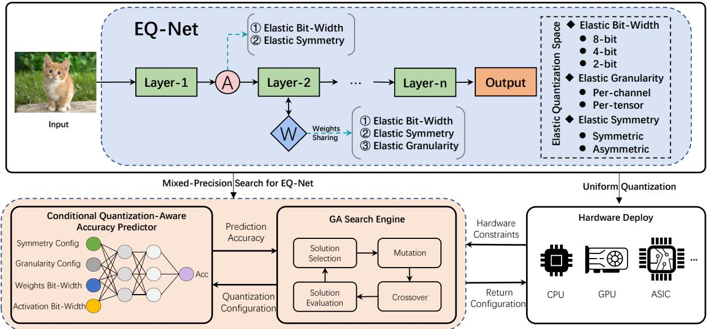
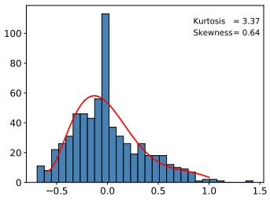
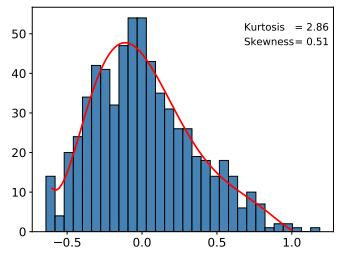
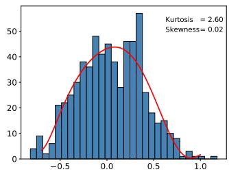
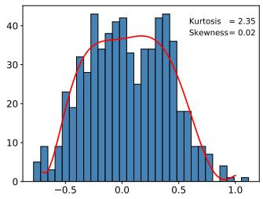
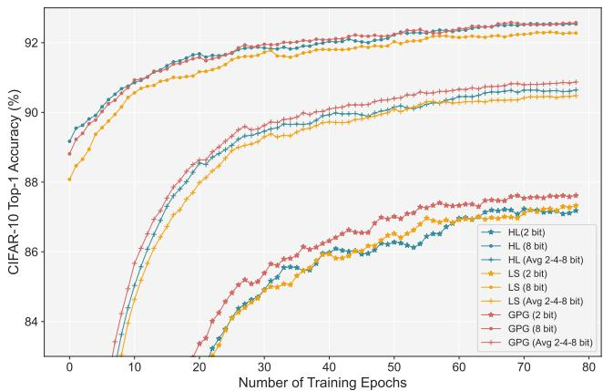
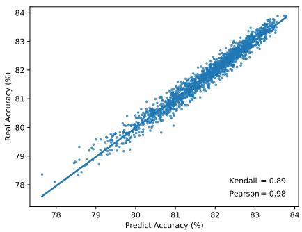
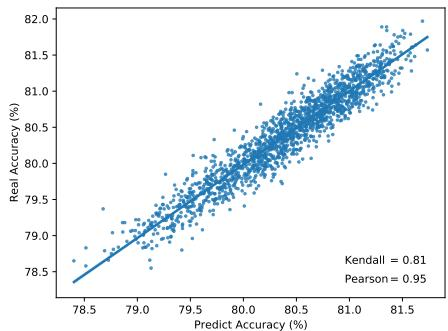
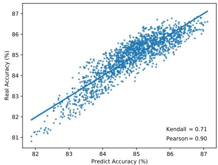

# EQ-Net: Elastic Quantization Neural Networks

Ke Xu1,2, Lei Han4, Ye Tian2,3, Shangshang Yang1,2\* and Xingyi Zhang1,2,3

1School of Artificial Intelligence, Anhui University, Hefei, China 2Key Laboratory of Intelligent Computing and Signal Processing of Ministry of Education, Hefei, China 3Institutes of Physical Science and Information Technology, Anhui University, Hefei, China 4School of Computer Science and Technology, Anhui University, Hefei, China

## Abstract

Current model quantization methods have shown their promising capability in reducing storage space and computation complexity. However, due to the diversity ofquantization forms supported by different hardware, one limitation ofexisting solutions is that usually require repeated optimization for different scenarios. How to construct a model withflexible quantizationforms has been less studied. In this paper, we explore a one-shot network quantization regime, named Elastic Quantization Neural Networks (EQ-Net), which aims to train a robust weight-sharing quantization supernet. First ofall, we propose an elastic quantization space (including elastic bit-width, granularity, and symmetry) to adapt to various mainstream quantitative forms. Secondly, we propose the Weight Distribution Regularization Loss (WDR-Loss) and Group Progressive Guidance Loss (GPG-Loss) to bridge the inconsistency ofthe distributionfor weights and outpu logits in the elastic quantization space gap. Lastly, we incorporate genetic algorithms and the proposed Conditional Quantization-Aware Accuracy Predictor (CQAP) as an estimator to quickly search mixed-precision quantized neural networks in supernet. Extensive experiments demonstrate that our EQ-Net is close to or even better than its static counterparts as well as state-of-the-art robust bit-width methods. Code can be available at https://github.com/xuke225/EQ-Net.

## 1. Introduction

Deploying intricate deep neural networks(DNN) on edge devices with limited resources, such as smartphones or IoT devices, poses a significant challenge due to their demanding computational and memory requirements. Model quantization [13, 28, 33] has emerged as a highly effective strategy to mitigate the aforementioned challenge. This technique involves transforming the floating-point values into fixedpoint values of lower precision, thereby reducing the memory requirements of the DNN model without altering its original architecture. Additionally, computationally expensive floating-point matrix multiplications between weights and activations can be executed more efficiently on low-precision arithmetic circuits, leading to reduced hardware costs and lower power consumption.

Despite the evident advantages in terms of power and costs, quantization incurs added noise due to the reduced precision. However, recent research has demonstrated that neural networks can withstand this noise and maintain high accuracy even when quantized to 8-bits using post-training quantization (PTQ) techniques [26, 30, 27, 24, 46]. PTQ is typically efficient and only requires access to a small calibration dataset, but its effectiveness declines when applied to lowbit quantization (≤ 4-bits) of neural networks. In contrast, quantization-aware training (QAT) [52, 7, 14, 11, 4, 21, 29] has emerged as the prevailing method for achieving low-bit quantization while preserving near full-precision accuracy. By simulating the quantization operation during training or fine-tuning, the network can adapt to the quantization noise and yield better solutions than PTQ.

Currently, most AI accelerators support model quantization, but the forms of quantization supported by different hardware platforms are not exactly the same [25]. For example, NVIDIA’s GPU adopts channel-wise symmetric quantization in TensorRT [31] inference engine, while Qualcomm’s DSP adopts per-tensor asymmetric quantization in SNPE [34] inference engine. For conventional QAT methods, the different quantization forms supported by hardware platforms may require repeated optimization of the model during deployment on multiple devices, leading to extremely low efficiency of model quantization deployment.

To address the problem of repeated optimization in model quantization resulting from discrepancies in quantization schemes, this paper proposes an elastic quantization space design that encompasses the current mainstream quantization scenarios and classifies them into elastic quantization bit-width (2-bit, 4-bit, 8-bit, etc.), elastic quantization granularity (per-layer quantization, per-channel quantization), and elastic quantization symmetry (symmetric quantization, asymmetric quantization), as shown in Figure 1. This approach enables flexible deployment models under different quantization scenarios by designing a unified quantization formula that integrates various model quantization forms and implementing elastic switching of quantization bit-width, granularity, and symmetry through parameter splitting.

  
Figure 1: A conceptual overview of EQ-Net approach.

Inspired by one-shot neural architecture search [5, 51, 44, 48], this paper attempts to train a robust elastic quantization supernet based on the constructed elastic quantization space. Unlike neural architecture search, the elastic quantization supernet is fully parameter-shared, and there is no additional weight parameter optimization space with net work structure differences. Therefore, training the elastic quantization supernet may encounter the problem of negative gradient suppression [41, 49] due to different quantization forms. In other words, samples with inconsistent predictions between quantization configuration A (e.g., 8-bit/perchannel/asymmetric) and quantization configuration B (e.g., 2-bit/per-tensor/symmetric) are considered negative samples by each other, which slows down the convergence speed of the supernet during training. To solve the aforementioned problem, this paper proposes an efficient training strategy for elastic quantization supernet. Our goal is to reduce negative gradients by establishing consistency in weight and logits distributions: (1) introducing the Weight Distribution Regularization (WDR) to perform skewness and kurtosis regularization on shared weights, to better align the elastic quantization space and establish weight distribution consistency; (2) introducing the Group Progressive Guidance (GPG) to group the quantization sub-networks and guide them with progressive soft labels during the supernet training stage to establish consistency in output logits distributions.

As shown in Figure 1, the trained elastic quantization supernet can achieve both uniform and mixed-precision quantization (MPQ). Compared with previous MPQ works [45, 16, 10, 9, 20], our method can specify any quantization bit-width and forms in the elastic quantization space and quickly obtain a quantized model with the corresponding accuracy. With these features, we propose a Conditional Quantization-Aware Accuracy Predictor (CQAP), combined with a genetic algorithm to efficiently search for the Pareto solution on mixed-precision quantization models under the target quantization bit-width and forms.

## 2. Related Works

One-Shot Network Architecture Search. The goal of Neural Architecture Search (NAS) is to search an optimal architecture within a large architecture search space. The term ‘one-shot’ alludes to the fact that the subnet population only needs to be trained once. Regarding one-shot NAS methods, Cai et al. [5] proposed a once-for-all (OFA) model that facilitates various architectural settings by decoupling the training and search stages, thereby reducing the com putational cost. BigNAS [51] challenges the conventional pipeline by training the supernet using the sandwich rule, constructing a big single-stage model without extra retraining or post-processing. AttentiveNAS [44] improves the quality of the subnet by replacing the original uniform sampling strategy with a Pareto-aware sampling strategy during the training stage, and uses the Monte Carlo sampling to accelerate the sampling process. AlphaNet [43] enhances the performance of the subnet by utilizing Alpha divergence to tackle the issue of overestimating the uncertainty of teacher networks that arise from KL divergence. Inspired by this OFA NAS approach, we construct a weight-sharing elastic quantization supernet which includes elastic quantization bit-width, symmetry, and granularity. By training an elastic quantization supernet, a variety of quantized networks with different forms can be obtained to suit different scenarios.

Multi-Bit Quantization of Neural Networks. Recently, several research works on multi-bit quantization have caught our attention. For robustness of weights, Milad et al. [1] propose a regularization scheme applied during regular training, which models quantization noise as an additive per turbation bounded by the $\ell _ { \infty }$ norm, constrained above the first-order term of the perturbation applied to the network from the $\ell _ { 1 }$ norm of the gradients; RobustQuant [38] prove that uniformly distributed weights have a higher tolerance to quantization with lower sensitivity to specific quantizer implementation compared to normally-distributed weights, and proposes Kurtosis regularization to enhance their quantization robustness. For robust quantization training strategies, AnyPrecision [50] employs DoReFa [52] quantization constraints to train a model but saves it in floating-point form. During runtime, the floating-point model can be directly set to different bit-widths by truncating the least signifi cant bits; CoQuant [39] introduce a collaborative knowledge transfer approach to train a multi-bit quantization network; OQAT [37] presents the bit inheritance mechanism under the OFA framework to progressively reduce the bit-width, allowing higher bit-width models to guide the search and training of lower bit-width models. However, this method limits its quantization policy search space to fixed-precision quantization policies, which may reduce the flexibility of the model; BatchQuant [2] proposes a quantizer to stabilize single-shot supernet training for joint mixed-precision quan tization and architecture search; MultiQuant [49] enhances supernet training by using an adaptive soft label strategy to overcome the vicious competition between high bit-width and low bit-width quantized networks. The previous studies mainly focused on the robustness of multi-bit quantization, while this paper incorporates the granularity and symmetry of quantization into the search space from the perspective of hardware deployment. In addition, by establishing similarity constraints on the weight distribution and output logits dis tribution, the training efficiency of the supernet is improved.

## 3. Approach

In this section, we will give a comprehensive and detailed analysis of our proposed method, mainly including the de-

sign of elastic quantization search space, the modeling of quantization supernet, and the training strategy.

## 3.1. Quantization Preliminaries

To help modeling elastic quantization neural networks, we start by introducing common notations for quantization. We introduce w and x to represent the weight matrix and activation matrix in the neural network. A complete uniform quantization process consists of quantization and dequantization operations, which can be represented as follows:

$$
\left\{ \begin{array} { l } { \hat { w } = \mathrm { c l i p } \left( \left\lfloor \frac { w } { s } \right\rceil + z , - 2 ^ { b - 1 } , 2 ^ { b - 1 } - 1 \right) } \\ { \overline { { w } } = s \cdot ( \hat { w } - z ) } \end{array} \right.\tag{1}
$$

where s and z are called quantization step size and zeropoint, respectively. ⌊·⌉ rounds the continuous numbers to the nearest integers. b represents the predetermined quantization bit-width. Given a quantization weight matrix wˆ and activation matrix xˆ, the product is given by

$$
\pmb { o } _ { i j } = s _ { w } s _ { x } \sum _ { c = 1 } ^ { C } \left( \hat { w } _ { i c } \hat { \pmb x } _ { c j } - z _ { w } \hat { \pmb x } _ { c j } - z _ { x } \hat { \pmb w } _ { i c } + z _ { w } z _ { x } \right)\tag{2}
$$

where o is the convolution output or the pre-activation, C represents the number of weights channels.

## 3.2. Elastic Quantization Space Design

Our elastic quantization search space consists of three parts, elastic quantization bit width, elastic quantization symmetry, and elastic quantization granularity.

Elastic Quantization Bit-Width. With proper training, different quantization bit-widths can share the same weights. Therefore, for elastic quantization bit-widths, we only need to separate and store the quantization step size and zero-point required for different quantization bit-widths. In other words, the model weights are shared among different quantization bit-widths, and only differences in quantization step size and zero-point. Typically, the quantization step size is smaller and the saturation truncation range is larger for higher bit widths, while the quantization step size is larger and the saturation truncation range is smaller for lower bit-widths. This greatly alleviates the training pressure on hyperparameters, but poses challenges to the robustness of shared weights. Additionally, the choice of elastic quantization bit-widths is arbitrary and can be designed according to requirements.

Elastic Quantization Symmetry. Elastic quantization symmetry supports both symmetric and asymmetric quantization. For symmetric quantization, the zero-point is fixed to $0 ( z = 0 )$ , while for asymmetric quantization, the zeropoint is adjustable to different ranges $( z \in \mathbb { Z } )$ . Asymmetric quantization scheme with trainable zero-point that can learn to accommodate the negative activations [4]. The switching between symmetric and asymmetric quantization is achieved by dynamically modifying the value of the zero point.

Elastic Quantization Granularity. Elastic quantization granularity supports both per-tensor and per-channel quantization. Per-tensor quantization uses only one set of step size and zero-point for a tensor in one layer $( s \in \mathbb { R } _ { + } , z \in \mathbb { Z } )$ while per-channel quantization quantizes each weight kernel independently $\bar { ( s } \in \mathbb { R } _ { + } ^ { 1 \times C } , \bar { z } \in \mathbb { Z } ^ { 1 \times C } )$ . Compared to per-tensor, per-channel quantization is a more fine-grained approach. Since both granularities need to be implemented in the elastic quantization space, the step size and zero-point for per-tensor can be obtained heuristically from per-channel, or can be learned as independent parameters. In addition, the elastic quantization granularity is designed for weights only, and the activations are all in the form of per-tensor.

## 3.3. Elastic Quantization Network Modeling

Assuming that the elastic quantization space of a model can be represented as $\mathcal { E } = \{ \mathcal { E } _ { b } , \mathcal { E } _ { g } , \mathcal { E } _ { s } \}$ , where $\mathcal { E } _ { b } , \mathcal { E } _ { g } ,$ and ${ \mathcal { E } } _ { s }$ respectively represent elastic quantization bit-width, granularity, and symmetry, as described in Section 3.2. Given the floating-point weights w and activations x, the learnable quantization step size set $\mathbf { s } = \{ s _ { w , l } ^ { e } , s _ { a , l } ^ { e } \}$ , and zero-point set $\mathbf { z } = \{ z _ { w , l } ^ { e } , z _ { a , l } ^ { e } \}$ , the optimization problem of the elastic quantized network can be formalized as:

$$
\operatorname* { m i n } _ { { \bf w } ^ { * } , { \bf s } ^ { * } , { \bf z } ^ { * } } \sum _ { \mathcal { E } } \mathcal { L } _ { v a l } \left( \mathrm { Q N N } \left( \hat { w } , \hat { x } , s , z \right) \right)\tag{3}
$$

where $s _ { w , l } ^ { e }$ and $s _ { a , l } ^ { e }$ represent the weights and activation step size with quantization configuration $e \in { \mathcal { E } }$ in layer $l ; \mathcal { L } _ { v a l }$ denotes the validation loss; QNN denotes quantization neural network. It can be seen that the training objective of elastic quantization networks is to minimize the task loss under all elastic quantization spaces by optimizing the weights, step sizes, and zero-points.

## 3.4. Elastic Quantization Training

To enable efficient elastic quantization training, we propose the use of weight distribution regularization and group progressive guidance techniques to promote data consistency across various elastic quantization spaces.

Weight Distribution Regularization. DNN weights often conform to Gaussian or Laplace distributions [3]. To better align these weights to the elastic quantization space, we propose the incorporation of skewness and kurtosis regularizations. Skewness regularization primarily limits the direction and degree of skewness in the data distribution (as expressed in $\operatorname { E q . } ( 4 )$ , where $\mu$ and σ are the mean and standard deviation of w). Reducing the degree of skewness in the weight distribution enhances the robustness of weights in elastic quantization symmetry.

$$
\operatorname { S k e w } [ { \pmb w } ] = \mathbb { E } \left[ \left( \frac { { \pmb w } - { \boldsymbol \mu } } { \sigma } \right) ^ { 3 } \right]\tag{4}
$$

In contrast, kurtosis regularization primarily limits the sharpness of the peak in the data distribution (as expressed in $\operatorname { E q . } ( 5 ) \rangle$ ). Reducing the sharpness of the weight distribution peak enhances the robustness of weights in the elastic quan tization bit-width.

$$
\operatorname { K u r t } [ { \pmb w } ] = \mathbb { E } \left[ \left( \frac { { \pmb w } - { \pmb \mu } } { \sigma } \right) ^ { 4 } \right]\tag{5}
$$

To sum up, the weight distribution regularization loss for the supernet training is defined as follows:

$$
\mathcal { L } _ { \mathrm { W D R } } = \frac { 1 } { L } \sum _ { i = 1 } ^ { L } \left( \left| \mathrm { S k e w } \left[ \pmb { w } _ { i } \right] \right| ^ { 2 } + \left| \mathrm { K u r t } \left[ \pmb { w } _ { i } \right] - \mathcal { K } _ { T } \right| ^ { 2 } \right)\tag{6}
$$

where $L$ is the number of layers and $\mathcal { K } _ { T }$ is the target for kurtosis regularization. Based on relevant experimental re search [38], optimal robustness is achieved at $\mathcal { K } _ { T } = 1 . 8$

Group Progressive Guidance. As highlighted in [19, 15], an ensemble of teacher networks can provide more diverse soft labels during distillation training of the student network, leading to greater consistency in output logits. In our supernet, a multitude of subnets exists with varying quantization configurations, thereby enabling the generation of diverse soft labels. Motivated by this, we employ different grouped subnets as a teacher ensemble during in-place distillation to achieve progressive guidance across different groups. Following the sandwich rule [51], we sample the highest quantization bit-width subnets (including random symmetry and granularity, denoted as H), the lowest (denoted as $L ) ,$ , and random subnets (denoted as $R )$ in each training step. In this approach, the subnets with the highest bit-width are trained to predict the ground truth label y, while the subnets with random bit-width losses are defined based on the crossentropy with the ground truth label and the Kullback-Leibler (KL) divergence with the soft logits of highest subnets, $\mathbb { y } _ { H }$ Likewise, the losses of the lowest subnets are defined based on the cross-entropy with y and the KL divergence with $\forall _ { R } .$

$$
\left\{ \begin{array} { l l } { \mathcal { L } _ { H } = \mathcal { L } _ { \mathrm { C E } } \left( \mathbb { Y } _ { H } , \pmb { y } \right) } \\ { \mathcal { L } _ { R } = \lambda * \mathcal { L } _ { \mathrm { K L } } \left( \mathbb { Y } _ { R } , \mathbb { Y } _ { H } \right) + \left( 1 - \lambda \right) * \mathcal { L } _ { \mathrm { C E } } \left( \mathbb { Y } _ { R } , \pmb { y } \right) } \\ { \mathcal { L } _ { L } = \lambda * \mathcal { L } _ { \mathrm { K L } } \left( \mathbb { Y } _ { L } , \mathbb { Y } _ { R } \right) + \left( 1 - \lambda \right) * \mathcal { L } _ { \mathrm { C E } } \left( \mathbb { Y } _ { L } , \pmb { y } \right) } \end{array} \right.\tag{7}
$$

where $\mathcal { L } _ { \mathrm { K L } }$ and $\mathcal { L } _ { \mathrm { C E } }$ indicate the KL divergence loss and cross-entropy loss, respectively. In summary, the group

progressive guidance losses for training the supernet are defined as follows:

$$
\mathcal { L } _ { \mathrm { G P G } } ( \boldsymbol { \theta } ) = \mathcal { L } _ { H } ( \boldsymbol { \theta } ) + \mathcal { L } _ { R } ( \boldsymbol { \theta } ) + \mathcal { L } _ { L } ( \boldsymbol { \theta } )\tag{8}
$$

It then aggregates the gradients from all sampled subnets before updating the weights of the supernet model.

## 3.5. Mixed-Precision Quantization Search

The mixed-precision search approach is designed to systematically explore the suitable bit-width configuration for each layer of a supernet. During the performance estimation phase, it is necessary to perform batch norm calibration [23, 51] to re-calibrate the statistics of the batch normalization layer prior to estimating the performance of the quantization subnet. Batch norm calibration and the validation of quantization models are time-consuming, resulting in an expensive evaluation cost for the search. When employing search algorithms for quantized bit-width search, thousands of subnets must be evaluated. To expedite the search process and minimize the time cost in the search phase, we propose a proxy model for performance estimation.

Conditional Quantization-Aware Accuracy Predictor. In the stage of mixed precision quantization, not only the bit-width of each layer but also the form of quantization will have a crucial impact on the final results. To achieve a unified prediction of the elastic quantization model, we propose a Conditional Quantization-Aware Accuracy Predictor (CQAP) in contrast to previous precision predictors [49]. As shown in the lower left corner of Figure 1, we use the quantization symmetry and granularity as the conditions to evaluate the final precision for different bit-widths, and adopt binary encoding as the input to the predictor. The backbone architecture of the predictor maintains the same MLP structure as the previous work [44, 49], and the output results in the predicted accuracy. The CQAP can be formalized as:

$$
\begin{array} { r } { \operatorname { a c c } = \operatorname { M L P } ( \underbrace { G _ { w } , S _ { w } , S _ { a } } _ { \mathrm { C o n d i t i o n a l } } , \underbrace { B _ { w } , B _ { a } } _ { \mathrm { B i t W i d t h } } ) } \end{array}\tag{9}
$$

where $G _ { w } , S _ { w } , B _ { w }$ represent the granularity, symmetry, and bit width of each layer for weights quantization respectively. $S _ { a } , B _ { a }$ represent the symmetry and bit width of each layer for activations quantization respectively.

Genetic Algorithm for Mixed-Precision Search. During the search phase, the genetic algorithm[47] explores the bit-width of each layer and utilizes a CQAP to evaluate the corresponding accuracy of each candidate configuration. The genetic algorithm first initializes a set of solutions that satisfy the constraints using Monte Carlo sampling [49, 43] as the initial population. Subsequently, the fitness score of each candidate quantization network produced by the predictor is evaluated based on its accuracy. The individual with the highest fitness scores is preserved as elitist and included in the mutation and crossover process to generate a new population based on a predefined probability. This selectionmutation-crossover procedure is iteratively performed until the algorithm achieves a satisfactory Pareto solution that satisfies the average bit-width targets for both weights and activations.

## 4. Experimental Results

In this section, we present the results of a comprehensive set of experiments demonstrating the superiority of our proposed approach over several baselines on the ImageNet [8]. Additionally, we conducted comprehensive ablation experiments and visualization analyses to confirm the effectiveness of both the WDR and the GPG methods for EQ-Net.

## 4.1. Implementation Details

We separately trained two major classes of models using pre-trained weights provided by the TorchVision and Py-Torch v1.10 frameworks [32]. The first class comprised classical ResNet [18] models, namely ResNet18 and ResNet50, while the second class included lightweight models MobileNetV2 [36] and EfficientNetB0 [42], which utilize separable convolutions. It is worth mentioning that the Efficient-NetB0 model utilizes the Swish [35] activation function, which produces negative values. This feature allows us to investigate the differences between symmetric and asymmetric quantization using this model. The elastic quantization space of these networks is shown in Table 1. Note that we excluded 2-bit quantization in the lightweight model, as it results in a significant performance drop. We train each model for 120 epochs using Adam [22] optimizer with a cosine learning rate decay. The base learning rate is set as 0.001. After each quantization supernet is trained, we sample 8000 different subnetworks in each supernet and calculate their accuracy on a subset of the training set, making a <config, accuracy> dataset to train CQAP. We train CQAP for 100 epochs using SGD, the learning rate is set as 0.0004, and the weight decay of 0.0001. In the search phase of GA, we set the size of the population to 100 and the number of generations to 500.

## 4.2. Comparison with State-of-the-Art Methods

Table 2 shows the comparison of our trained EQ-Net which uses Bit-width, Granularity, and Symmetry One-For-All(BGS-OFA) method with fixed quantization, mixed precision, and other Bit-width One-For-All(B-OFA) methods.

For ResNet18, EQ-Net outperforms RobustQuant [38] and CoQuant [39], by nearly 10% at 2 and 3 fixed bit-width, and this gap is further widened to 15% in ResNet50. When the quantization bit width is set to 3, we outperform MultiQuant [49] by 1.8% in ResNet18 but underperform this algorithm by 0.7% in ResNet50. We speculate that the reason for this difference is that our BGS-OFA method contains per-channel quantization form, which is more unstable [21] when the model is larger and affects the training of the whole supernet. Compared with LSQ method, we have less than 1% accuracy gap in the 2-bit quantization of ResNet model, but our method has better robustness and generality. In mixed precision quantization, our 3-bit mixed quantization accuracy in ResNet18 has reached the accuracy of FP32, which benefits from robust supernet training and search technology.

Table 1: Elastic quantization space design under different models
<table><tr><td rowspan=2 colspan=1>NetWork</td><td rowspan=1 colspan=3>Weight Quantization Forms</td><td rowspan=1 colspan=2>Activation Quantization Forms</td></tr><tr><td rowspan=1 colspan=1>Bit-Width</td><td rowspan=1 colspan=1>Symmetric</td><td rowspan=1 colspan=1>Granularity</td><td rowspan=1 colspan=1>Bit-Width</td><td rowspan=1 colspan=1>Symmetric</td></tr><tr><td rowspan=1 colspan=1>ResNet18/ResNet50</td><td rowspan=1 colspan=1>2,3,4,5,6,7,8</td><td rowspan=1 colspan=1>symmetric/asymmetric</td><td rowspan=1 colspan=1>per-channel/per-layer</td><td rowspan=1 colspan=1>2,3,4,5,6,7,8</td><td rowspan=1 colspan=1>symmetric/asymmetric</td></tr><tr><td rowspan=1 colspan=1>MobileNetV2/EfficientNetB0</td><td rowspan=1 colspan=1>3,4,5,6,7,8</td><td rowspan=1 colspan=1>symmetric/asymmetric</td><td rowspan=1 colspan=1>per-channel/per-layer</td><td rowspan=1 colspan=1>3,4,5,6,7,8</td><td rowspan=1 colspan=1>symmetric/asymmetric</td></tr></table>

Table 2: Comparison of state-of-the-art quantization methods on ImageNet. ‘B-OFA’ denotes bit-width One-For-All methods, ‘BGS-OFA denotes bit-width, symmetry and granularity One-For-All methods.
<table><tr><td rowspan="2">Network</td><td rowspan="2">Benchmark</td><td rowspan="2">Criterion</td><td rowspan="2">Granularity</td><td rowspan="2">Symmetry</td><td colspan="2">Weights</td><td colspan="2">Activation</td><td colspan="2">Accuracy</td></tr><tr><td>W-bits</td><td>W-Comp</td><td>A-bits</td><td>A-Comp</td><td>Top-1 (Drop)</td><td>FP Top-1</td></tr><tr><td rowspan="10">ResNet-18</td><td>LSQ [11]</td><td>Uniform</td><td>Per-tensor</td><td>Symmetric</td><td>22</td><td>14.11×</td><td>2 2</td><td>13.25× 13.25×</td><td>67.6% (↓2.9%)</td><td>70.5%</td></tr><tr><td>LSQ+[4]</td><td>Uniform</td><td>Per-tensor</td><td>Asymmetric</td><td></td><td>14.11×</td><td></td><td></td><td>66.8% (↓3.3%)</td><td>70.1%</td></tr><tr><td>EdMIPS [6]</td><td>Mixed-Precision</td><td>Per-tensor</td><td>Symmetric</td><td>2MP</td><td>16.00×</td><td></td><td>&lt;16.00×</td><td>65.9% (↓3.9%)</td><td>69.8%</td></tr><tr><td>RobustQuant [38]</td><td>B-OFA</td><td>Per-tensor</td><td>Symmetric</td><td>3</td><td>10.67×</td><td>3</td><td>10.67×</td><td>57.3% (↓13.0%)</td><td>70.3%</td></tr><tr><td>CoQuant [39]</td><td>B-OFA</td><td>Per-tensor</td><td>Symmetric</td><td>2</td><td>14.11×</td><td>2</td><td>13.25×</td><td>57.1% (↓12.7%)</td><td>69.8%</td></tr><tr><td>AnyPrecision [50]</td><td>B-OFA</td><td>Per-tensor</td><td>Symmetric</td><td>2</td><td>14.11×</td><td>2</td><td>13.25×</td><td>64.2% (↓4.0%)</td><td>68.2%</td></tr><tr><td>MultiQuant [49]</td><td>B-OFA</td><td>Per-tensor</td><td>Asymmetric</td><td>3</td><td>10.37×</td><td>3</td><td>10.37×</td><td>67.5% (↓2.3%)</td><td>69.8%</td></tr><tr><td>MultiQuant [49]</td><td>B-OFA</td><td>Per-tensor</td><td>Asymmetric</td><td>3MP</td><td>9.93×</td><td>3MP</td><td>9.56×</td><td>69.2% (↓0.6%)</td><td>69.8%</td></tr><tr><td></td><td></td><td>Per-tensor</td><td>Symmetric</td><td>2</td><td>14.11×</td><td>2</td><td>13.25×</td><td>65.9% (↓3.9%)</td><td>69.8%</td></tr><tr><td rowspan="2">EQ-Net(Ours)</td><td rowspan="2">BGS-OFA</td><td>Per-tensor Per-tensor</td><td>Asymmetric Asymmetric</td><td>3 3MP</td><td>10.37× 9.93×</td><td>3 3MP</td><td>10.37× 9.56×</td><td>69.3% (↓0.5%)</td><td></td><td>69.8% 69.8%</td></tr><tr><td></td><td></td><td></td><td></td><td></td><td></td><td></td><td>69.8% (↓0.0%)</td><td></td></tr><tr><td rowspan="9">ResNet-50</td><td>LSQ [11] HAQ [45]</td><td>Uniform Mixed-Precision</td><td>Per-tensor Per-tensor</td><td>Symmetric Symmetric</td><td>2 3MP</td><td>12.88× 10.57×</td><td>2 MP</td><td>15.34×</td><td>73.7% (↓3.2%)</td><td>76.9% 76.1%</td></tr><tr><td>HAWQ-V2 [9]</td><td>Mixed-Precision</td><td>Per-channel</td><td>Symmetric</td><td>2MP</td><td>12.24×</td><td>4MP</td><td>&lt;8.00×</td><td>75.3% (↓0.8%) 75.8% (↓1.6%)</td><td>77.4%</td></tr><tr><td></td><td></td><td></td><td></td><td></td><td></td><td></td><td></td><td></td><td></td></tr><tr><td>RobustQuant [38] CoQuant [39]</td><td>B-OFA B-OFA</td><td>Per-tensor Per-tensor</td><td>Symmetric Symmetric</td><td>3</td><td>10.67×</td><td>3</td><td>10.67×</td><td>57.3% (↓19.0%)</td><td>76.3%</td></tr><tr><td>AnyPrecision [50]</td><td>B-OFA</td><td>Per-tensor</td><td>Symmetric</td><td>2</td><td>12.88× 12.88×</td><td>2 2</td><td>15.34×</td><td>57.1% (↓19.0%)</td><td>76.1%</td></tr><tr><td>MultiQuant [49]</td><td>B-OFA</td><td>Per-tensor</td><td>Asymmetric</td><td>23</td><td>10.67×</td><td>3</td><td>15.34× 10.67×</td><td>71.7% (↓3.3%) 75.4% (↓0.7%)</td><td>75.0% 76.1%</td></tr><tr><td></td><td></td><td></td><td></td><td></td><td></td><td></td><td></td><td></td><td></td></tr><tr><td rowspan="2">EQ-Net(Ours)</td><td rowspan="2">BGS-OFA</td><td>Per-tensor Per-tensor</td><td>Symmetric Asymmetric</td><td>2 3</td><td>12.88× 10.67×</td><td>2 3</td><td>15.34× 10.67×</td><td>72.5%(↓3.6%) 74.7%(↓1.4%)</td><td>76.1% 76.1%</td></tr><tr><td>Per-tensor</td><td>Symmetric</td><td>3MP</td><td>10.57×</td><td>3MP</td><td>10.57×</td><td>75.1%(↓1.0%)</td><td>76.1%</td></tr><tr><td rowspan="5">MobileNetV2</td><td>HAQ [45]</td><td>Mixed-Precision</td><td>Per-tensor</td><td>Symmetric</td><td>4MP</td><td>8.00×</td><td>4MP</td><td>8.00×</td><td>67.0% (↓5.1%)</td><td>72.1%</td></tr><tr><td>RobustQuant [38]</td><td>B-OFA</td><td></td><td>Symmetric</td><td></td><td></td><td>4</td><td></td><td></td><td></td></tr><tr><td>MultiQuant [49]</td><td>B-OFA</td><td>Per-tensor Per-tensor</td><td>Asymmetric</td><td>4 4</td><td>8.00× 8.00×</td><td>4</td><td>8.00× 8.00×</td><td>59.0% (↓12.3%) 69.9% (↓2.0%)</td><td>71.3% 71.9%</td></tr><tr><td></td><td></td><td>Per-tensor</td><td>Asymmetric</td><td>4</td><td>8.00×</td><td>4</td><td>8.00×</td><td>71.0% (↓0.9%)</td><td>71.9%</td></tr><tr><td>EQ-Net(Ours)</td><td>BGS-OFA</td><td>Per-tensor</td><td>Symmetric</td><td>4MP</td><td>8.00×</td><td>4MP</td><td>8.00×</td><td>71.2% (↓0.7%)</td><td>71.9%</td></tr><tr><td rowspan="4">EfficientNetB0</td><td>LSQ [11]</td><td>Uniform</td><td>Per-tensor</td><td>Symmetric</td><td>4</td><td>8.00×</td><td>4</td><td>8.00×</td><td>71.9% (↓4.2%)</td><td>76.1%</td></tr><tr><td>LSQ+ [4]</td><td>Uniform</td><td>Per-tensor</td><td>Asymmetric</td><td>4</td><td>8.00×</td><td>4</td><td>8.00×</td><td>73.8% (↓2.3%)</td><td>76.1%</td></tr><tr><td></td><td></td><td>Per-tensor</td><td>Symmetric</td><td>4</td><td>8.00×</td><td>4</td><td>8.00×</td><td>74.1% (↓3.6%)</td><td>77.7%</td></tr><tr><td>EQ-Net(Ours)</td><td>BGS-OFA</td><td>Per-tensor</td><td>Asymmetric</td><td>4</td><td>8.00×</td><td>4</td><td>8.00×</td><td>75.1% (↓2.6%)</td><td>77.7%</td></tr></table>

In both the lightweight MobileNetV2 and EfficientNetB0 models, the capability of our algorithm is further illustrated. In MobileNetV2, we surpass the algorithms RobustQuant and MultiQuant which use the B-OFA approach by 11.4% and 1.1% at 4 bit-width, respectively. Meanwhile, our algorithm outperforms HAQ [45] by 4.2% in mixed precision quantization. The reason for achieving such well-done results is that when using separable convolution, the distribution of weights in some layers is irregular and sometimes even double-peaked [12], increasing the difficulty of quantization, while our WDR-Loss can well transition the weights to uniform distribution and improve the accuracy of quantization. Since the activation function used by ResNet18, ResNet50, and MobileNetV2 is ReLU [17], which has no negative values, there is not much difference between symmetric and asymmetric quantization. EfficientNetB0 uses the Swich [35] activation function with negative values, and we can see an improvement of about 1% when applying asymmetric quantization compared to symmetric quantization. Our algorithm outperforms LSQ by 0.6% in symmetric quantization but falls short of LSQ+ [4] by 0.3% in asymmetric quantization. This disparity can be attributed to the fact that the network weights need to balance the trade-offs between the two quantization methods, resulting in an increase in the accuracy of symmetric quantization while a little decrease in the accuracy of asymmetric quantization.

  
(a) Baseline.

  
(b) Kurtosis Loss.

  
(c) Skewness Loss.

  
(d) Kurtosis+Skewness Loss.  
Figure 2: Ablation analysis of weights distribution from 21-th layer on elastic quantized ResNet20 with Kurtosis and Skewness regularization. The blue column represents the histogram distribution, and the red solid line represents the 7th order fitting curve of the data.

## 4.3. Ablation Studies

Effectiveness of Weight Distribution Regularization. To make the weight distribution of neural networks more suitable for elastic quantization, we introduce weight distribution regularization. Figure 2(a) illustrates the weight distribution of the 21st layer of ResNet20 on the CIFAR10 dataset. The figure reveals that certain layers in ResNet architecture exhibit skewed and sharp distribution characteristics, as evidenced by the kurtosis value of 3.37 and the skewness value of 0.64. The impact of such distribution phenomena on fixedbit-width quantization is relatively insignificant. However, for elastic quantization with high robustness demands, such phenomena can significantly affect the overall performance, particularly for low bit widths. Figure 2(b) and Figure 2(c) depict the effects of applying kurtosis and skewness regularization to the weights, respectively. Notably, Figure 2(d) shows that simultaneously applying kurtosis and skewness regularization can lead to a distribution effect that is closer to uniform distribution, effectively eliminating data skewness and sharpness simultaneously. Moreover, as presented in Table 3, incorporating kurtosis and skewness regularization can boost accuracy by nearly 1% for the 2-bit scenario, while the average accuracy for 2, 4, and 8 bits can improve by 0.5%.

Effectiveness of Group Progressive Guidance. In the training procedure of elastic quantization supernet, we adopt the training strategy of GPG proposed in Section 3.4. This strategy utilizes soft labels from the high bit-width subnet to progressively guide the low bit-width subnet, creating more coherence between the output of the high and low bit-width networks. As a result, the performance of the low bit-width subnet is substantially improved. The Convergence curve graph of ResNet20 trained using three different methods (hard label, label smoothing [40], and our GPG method) on CIFAR-10 are presented in Figure 3. It can be observed that our proposed strategy consistently outperforms the other methods at 2 bit-width during training. Additionally, the performance for 2 bit-width is similar when using the label smoothing and hard label methods. Furthermore, to demonstrate the training efficiency of the whole quantization supernet, we use the average precision of 2-4-8 bit-widths, and the average precision of our method is always the best. When the bit-width is set to 8, although our GPG method is initially inferior to the hard label method during the first few epochs, our method steadily improves and is able to catch up with the hard label method, which demonstrates that our method can improve the accuracy of the low bit-width subnet without sacrificing the high bit-width performance.

Table 3: Ablation study for weight distribution regularization.
<table><tr><td>ResNet20</td><td>2-bit</td><td>Avg 2-4-8-bit</td></tr><tr><td>Baseline</td><td>86.4%</td><td>90.3%</td></tr><tr><td>+ Kurtosis Loss</td><td>87.3%</td><td>90.5%</td></tr><tr><td>+ Skewness Loss</td><td>86.9%</td><td>90.4%</td></tr><tr><td>Kurtosis+Skewness Loss</td><td>87.3%</td><td>90.7%</td></tr></table>

  
Figure 3: Top-1 accuracy of ResNet20 on CIFAR-10 for different benchmarks (including 2bit, 8-bit, and 2-4-8 bit average accuracy). HL and LS denote hard label and label smoothing, respectively.

  
(a) ResNet18.

  
(b) MobileNetV2.

  
(c) EfficientNetB0.  
Figure 4: Ablation analysis of CQAP Rank correlation between actual accuracy and predicted accuracy on split validation set of ImageNet.

Table 4: Ablation study for learned vs. heuristic (min, mean, max) per-tensor quantization.
<table><tr><td>Per-channel Baseline</td><td>2-bit 88.3%</td><td>4-bit 91.9%</td><td>8-bit 92.5%</td></tr><tr><td>Per-tensor</td><td>2-bit</td><td>4-bit</td><td>8-bit</td></tr><tr><td>min</td><td>49.3%</td><td>72.7%</td><td>75.7%</td></tr><tr><td>mean</td><td>86.6%</td><td>91.8%</td><td>92.1%</td></tr><tr><td>max</td><td>87.0%</td><td>91.8%</td><td>92.2%</td></tr><tr><td>learnable</td><td>87.2%</td><td>92.4%</td><td>92.5%</td></tr></table>

Learned vs. Heuristic Per-Tensor Quantization. Our proposed EQ-Net offers both per-channel and per-tensor quantization options. Per-channel quantization utilizes different step sizes for each convolution kernel, while per-tensor involves sharing a single step size across a layer of the network. Hence, exploring the efficacy of utilizing independent learnable parameters or heuristics on a per-channel basis for per-tensor quantization warrants investigation. As shown in Table 4, we compare the learnable method with three heuristic methods. The results demonstrate that the learnable method outperforms all three heuristics. Specifically, the learnable step size exhibits 0.2%/0.6%/0.3% boosts over the best-performing heuristic method max at bit-widths of 2/4/8. Among the three heuristics, the max achieves the highest accuracy, followed by the mean, which is only 0.4%/0.1% lower than the max at 2/8 bit-width, respectively. The worst performing method is min, which is approximately 20% lower than the other two heuristics at any bit-width, this outcome is due to the narrow quantization value range that results from using the smallest step size, causing large quantization error. Therefore, in our EQ-Net, we use independent learnable step sizes for per-tensor quantization.

Rank Preservation Analysis of Accuracy Predictor. As illustrated in Figure 1, the mixed precision search can be conducted after the completion of quantization supernet training. During the search phase, we employ the CQAP, as proposed in Section 3.5, as a proxy model for measuring accuracy. Since CQAP is used to evaluate the performance of each mixed-precision model, it is imperative to guarantee a rank correlation between predictors and actual performance. We sampled 10k images from the training set of the ImageNet dataset and used the accuracy of this subset to measure the performance of the candidate subnet. In Figure 4, we illustrate the rank correlation coefficients for three different supernets. It is evident that the Pearson coefficient is consistently above 0.90, and the Kendall coefficient is above 0.80 except for EfficientNetB0. It is demonstrated that there is a strong correlation between the predicted accuracy of our CQAP and the actual performance of the candidate subnet. The Kendall coefficient and Pearson coefficient for Efficient-NetB0 are 0.71 and 0.90, respectively. These values are comparatively lower than those obtained for the other two networks under consideration. The reason for this slightly inferior performance can be attributed to the significant precision difference observed between symmetric and asymmetric quantization when applied to EfficientNetB0.

## 5. Conclusion

In this paper, we have proposed Elastic Quantization Neural Networks (EQ-Net) that achieve hardware-friendly and efficient training through a one-shot weight-sharing quantization supernet. By training the supernet on designed elastic quantization space, EQ-Net can support subnets with both uniform and mixed-precision quantization without retraining. We propose two training schemes with Weight Distribution

Regularization (WDR) and Group Progressive Guidance (GPG) techniques to optimize EQ-Net. We demonstrate that EQ-Net can achieve near-static quantization accuracy performance in an elastic quantization space.

## Acknowledgments

This work was supported in part by the National Natural Science Foundation of China (No. 62206003, No. 62276001, No. 62136008, No. U20A20306, No. U21A20512) and in part by the Excellent Youth Foundation of Anhui Provincial Colleges (No. 2022AH030013).

## References

[1] Milad Alizadeh, Arash Behboodi, Mart van Baalen, Christos Louizos, Tijmen Blankevoort, and Max Welling. Gradient $\ell _ { 1 }$ regularization for quantization robustness. In Proc. of ICLR, 2020.

[2] Haoping Bai, Meng Cao, Ping Huang, and Jiulong Shan. Batchquant: Quantized-for-all architecture search with robust quantizer. In Proc. ofNeurIPS, 2021.

[3] Ron Banner, Yury Nahshan, and Daniel Soudry. Post training 4-bit quantization of convolutional networks for rapiddeployment. In Proc. ofNeurIPS, 2019.

[4] Yash Bhalgat, Jinwon Lee, Markus Nagel, Tijmen Blankevoort, and Nojun Kwak. LSQ+: improving low-bit quantization through learnable offsets and better initialization. In Proc. ofCVPR, 2020.

[5] Han Cai, Chuang Gan, Tianzhe Wang, Zhekai Zhang, and Song Han. Once-for-all: Train one network and specialize it for efficient deployment. In Proc. ofICLR, 2020.

[6] Zhaowei Cai and Nuno Vasconcelos. Rethinking differentiable search for mixed-precision neural networks. In Proc. of CVPR, 2020.

[7] Jungwook Choi, Zhuo Wang, Swagath Venkataramani, Pierce I-Jen Chuang, Vijayalakshmi Srinivasan, and Kailash Gopalakrishnan. Pact: Parameterized clipping activation for quantized neural networks. ArXiv preprint, 2018.

[8] Jia Deng, Wei Dong, Richard Socher, Li-Jia Li, Kai Li, and Fei-Fei Li. Imagenet: A large-scale hierarchical image database. In Proc. ofCVPR, 2009.

[9] Zhen Dong, Zhewei Yao, Daiyaan Arfeen, Amir Gholami, Michael W. Mahoney, and Kurt Keutzer. HAWQ-V2: hessian aware trace-weighted quantization of neural networks. In Proc. ofNeuIPS, 2020.

[10] Zhen Dong, Zhewei Yao, Amir Gholami, Michael W. Mahoney, and Kurt Keutzer. HAWQ: hessian aware quantization of neural networks with mixed-precision. In Proc. ofICCV, 2019.

[11] Steven K. Esser, Jeffrey L. McKinstry, Deepika Bablani, Rathinakumar Appuswamy, and Dharmendra S. Modha. Learned step size quantization. In Proc. of ICLR, 2020.

[12] Alexander Finkelstein, Uri Almog, and Mark Grobman. Fighting quantization bias with bias. CoRR, abs/1906.03193, 2019.

[13] Amir Gholami, Sehoon Kim, Zhen Dong, Zhewei Yao, Michael W. Mahoney, and Kurt Keutzer. A survey of quanti-

zation methods for efficient neural network inference. ArXiv preprint, 2021.

[14] Ruihao Gong, Xianglong Liu, Shenghu Jiang, Tianxiang Li, Peng Hu, Jiazhen Lin, Fengwei Yu, and Junjie Yan. Differentiable soft quantization: Bridging full-precision and low-bit neural networks. In Proc. ofICCV, 2019.

[15] Jianping Gou, Baosheng Yu, Stephen John Maybank, and Dacheng Tao. Knowledge distillation: A survey. ArXiv preprint, 2020.

[16] Hai Victor Habi, Roy H. Jennings, and Arnon Netzer. HMQ: hardware friendly mixed precision quantization block for cnns. In Proc. ofECCV, 2020.

[17] Kaiming He, Xiangyu Zhang, Shaoqing Ren, and Jian Sun. Delving deep into rectifiers: Surpassing human-level performance on imagenet classification. In Proc. of ICCV, 2015.

[18] Kaiming He, Xiangyu Zhang, Shaoqing Ren, and Jian Sun. Deep residual learning for image recognition. In Proc. of CVPR, 2016.

[19] Geoffrey E. Hinton, Oriol Vinyals, and Jeffrey Dean. Distilling the knowledge in a neural network. CoRR, 2015.

[20] Xijie Huang, Zhiqiang Shen, Shichao Li, Zechun Liu, Xianghong Hu, Jeffry Wicaksana, Eric P. Xing, and Kwang-Ting Cheng. SDQ: stochastic differentiable quantization with mixed precision. In Proc. ofICML, 2022.

[21] Dohyung Kim, Junghyup Lee, and Bumsub Ham. Distance aware quantization. In Proc. of ICCV, 2021.

[22] Diederik P. Kingma and Jimmy Ba. Adam: A method for stochastic optimization. In Proc. ofICLR, 2015.

[23] Bailin Li, Bowen Wu, Jiang Su, and Guangrun Wang. Eagleeye: Fast sub-net evaluation for efficient neural network pruning. In Proc. ofECCV, 2020.

[24] Yuhang Li, Ruihao Gong, Xu Tan, Yang Yang, Peng Hu, Qi Zhang, Fengwei Yu, Wei Wang, and Shi Gu. BRECQ: pushing the limit of post-training quantization by block reconstruction. In Proc. ofICLR, 2021.

[25] Yuhang Li, Mingzhu Shen, Jian Ma, Yan Ren, Mingxin Zhao, Qi Zhang, Ruihao Gong, Fengwei Yu, and Junjie Yan. Mqbench: Towards reproducible and deployable model quantization benchmark. In Proc. ofNeurIPS, 2021.

[26] Szymon Migacz. 8-bit inference with tensorrt. In GPU technology conference, 2017.

[27] Markus Nagel, Rana Ali Amjad, Mart van Baalen, Christos Louizos, and Tijmen Blankevoort. Up or down? adaptive rounding for post-training quantization. In Proc. of ICML, 2020.

[28] Markus Nagel, Marios Fournarakis, Rana Ali Amjad, Yelysei Bondarenko, Mart Van Baalen, and Tijmen Blankevoort. A white paper on neural network quantization. arXiv preprint arXiv:2106.08295, 2021.

[29] Markus Nagel, Marios Fournarakis, Yelysei Bondarenko, and Tijmen Blankevoort. Overcoming oscillations in quantizationaware training. In Proc. of ICML, 2022.

[30] Yury Nahshan, Brian Chmiel, Chaim Baskin, Evgenii Zheltonozhskii, Ron Banner, Alexander M. Bronstein, and Avi Mendelson. Loss aware post-training quantization. ArXiv preprint, 2019.

[31] NVIDIA. Tensorrt: A c++ library for high performance inference on nvidia gpus and deep learning accelerators. https://github.com/NVIDIA/TensorRT, Last accessed on 2023-02-27.

[32] Adam Paszke, Sam Gross, Francisco Massa, Adam Lerer, James Bradbury, Gregory Chanan, Trevor Killeen, Zeming Lin, Natalia Gimelshein, Luca Antiga, Alban Desmaison, Andreas Köpf, Edward Yang, Zachary DeVito, Martin Raison, Alykhan Tejani, Sasank Chilamkurthy, Benoit Steiner, Lu Fang, Junjie Bai, and Soumith Chintala. Pytorch: An imperative style, high-performance deep learning library. In Proc. of NeuIPS, 2019.

[33] Haotong Qin, Ruihao Gong, Xianglong Liu, Xiao Bai, Jingkuan Song, and Nicu Sebe. Binary neural networks: A survey. Pattern Recognition, 2020.

[34] Qualcomm. Qualcomm neural processing sdk for ai. https://developer.qualcomm.com/software/ qualcomm-neural-processing-sdk, Last accessed on 2023-02-16.

[35] Prajit Ramachandran, Barret Zoph, and Quoc V. Le. Search ing for activation functions. In Proc. ofICLR, 2018.

[36] Mark Sandler, Andrew G. Howard, Menglong Zhu, Andrey Zhmoginov, and Liang-Chieh Chen. Mobilenetv2: Inverted residuals and linear bottlenecks. In Proc. of CVPR, 2018.

[37] Mingzhu Shen, Feng Liang, Ruihao Gong, Yuhang Li, Chuming Li, Chen Lin, Fengwei Yu, Junjie Yan, and Wanli Ouyang. Once quantization-aware training: High performance extremely low-bit architecture search. In Proc. ofICCV, 2021.

[38] Moran Shkolnik, Brian Chmiel, Ron Banner, Gil Shomron, Yury Nahshan, Alex M. Bronstein, and Uri C. Weiser. Robust quantization: One model to rule them all. In Proc. of NeuIPS, 2020.

[39] Ximeng Sun, Rameswar Panda, Chun-Fu Chen, Naigang Wang, Bowen Pan, Kailash Gopalakrishnan, Aude Oliva, Rogério Feris, and Kate Saenko. All at once network quantization via collaborative knowledge transfer. ArXiv preprint, 2021.

[40] Christian Szegedy, Vincent Vanhoucke, Sergey Ioffe, Jonathon Shlens, and Zbigniew Wojna. Rethinking the in ception architecture for computer vision. In Proc. of CVPR, 2016.

[41] Jingru Tan, Changbao Wang, Buyu Li, Quanquan Li, Wanli Ouyang, Changqing Yin, and Junjie Yan. Equalization loss for long-tailed object recognition. In Proc. ofCVPR, 2020.

[42] Mingxing Tan and Quoc Le. Efficientnet: Rethinking model scaling for convolutional neural networks. In Proc. ofICML, 2019.

[43] Dilin Wang, Chengyue Gong, Meng Li, Qiang Liu, and Vikas Chandra. Alphanet: Improved training of supernets with alpha-divergence. In Proc. ofICML, 2021.

[44] Dilin Wang, Meng Li, Chengyue Gong, and Vikas Chandra. Attentivenas: Improving neural architecture search via attentive sampling. ArXiv preprint, 2020.

[45] Kuan Wang, Zhijian Liu, Yujun Lin, Ji Lin, and Song Han. HAQ: hardware-aware automated quantization with mixed precision. In Proc. of CVPR, 2019.

[46] Xiuying Wei, Ruihao Gong, Yuhang Li, Xianglong Liu, and Fengwei Yu. Qdrop: Randomly dropping quantization for extremely low-bit post-training quantization. In Proc. of ICLR, 2022.

[47] Darrell Whitley. A genetic algorithm tutorial. Statistics and computing, 1994.

[48] Jiyang Xie, Xiu Su, Shan You, Zhanyu Ma, Fei Wang, and Chen Qian. Scalenet: Searching for the model to scale. In Proc. ofECCV, 2022.

[49] Ke Xu, Qiantai Feng, Xingyi Zhang, and Dong Wang. Multiquant: Training once for multi-bit quantization of neural networks. In Proc. of IJCAI, 2022.

[50] Haichao Yu, Haoxiang Li, Honghui Shi, Thomas S. Huang, and Gang Hua. Any-precision deep neural networks. In Proc. of AAAI, 2021.

[51] Jiahui Yu, Pengchong Jin, Hanxiao Liu, Gabriel Bender, Pieter-Jan Kindermans, Mingxing Tan, Thomas S. Huang, Xiaodan Song, Ruoming Pang, and Quoc Le. Bignas: Scaling up neural architecture search with big single-stage models. In Proc. ofECCV, 2020.

[52] Shuchang Zhou, Yuxin Wu, Zekun Ni, Xinyu Zhou, He Wen, and Yuheng Zou. Dorefa-net: Training low bitwidth convolutional neural networks with low bitwidth gradients. ArXiv preprint, 2016.