# Efficient Diffusion Training via Min-SNR Weighting Strategy

Tiankai Hang1, Shuyang Gu2\*, Chen Li3, Jianmin Bao2, Dong Chen2,

Han Hu2, Xin Geng1, Baining Guo1\*

1Southeast University, 2Microsoft Research Asia,

3National Key Laboratory of Human-Machine Hybrid Augmented Intelligence, National Engineering Research Center for Visual Information and Applications, and Institute of Artificial Intelligence and Robotics, Xi’an Jiaotong University

tkhang,xgeng,307000167 @seu.edu.cn, shuyanggu,t-chenli1,jianmin.bao,doch,hanhu @microsoft.com

## Abstract

Denoising diffusion models have been a mainstream approach for image generation, however, training these models often suffers from slow convergence. In this paper, we discovered that the slow convergence is partly due to conflicting optimization directions between timesteps. To address this issue, we treat the diffusion training as a multi-task learning problem, and introduce a simple yet effective approach referred to as Min-SNR-γ. This method adapts loss weights of timesteps based on clamped signal-to-noise ratios, which effectively balances the conflicts among timesteps. Our results demonstrate a significant improvement in converging speed, 3.4 faster than previous weighting strategies. It is also more effective, achieving a new record FID score of 2.06 on the ImageNet 256  256 benchmark using smaller architectures than that employed in previous state-of-the-art. The code is available at https://github.com/TiankaiHang/Min-SNR-Diffusion-Training.

## 1. Introduction

In recent years, denoising diffusion models [48, 19, 57, 36] have emerged as a promising new class of deep generative models due to their remarkable ability to model complicated distributions. Compared to prior Generative Adversarial Networks (GANs), diffusion models have demonstrated superior performance across a range of generation tasks in various modalities, including text-to-image generation [40, 43, 41, 17], image manipulation [26, 34, 4, 56], video synthesis [18, 47, 22], text generation [28, 16, 59], 3D avatar synthesis [39, 53], etc. A key limitation of present denoising diffusion models is their slow convergence rate, requiring substantial amounts of GPU hours for training [41, 40]. This constitutes a considerable challenge for researchers seeking to effectively experiment with these models.

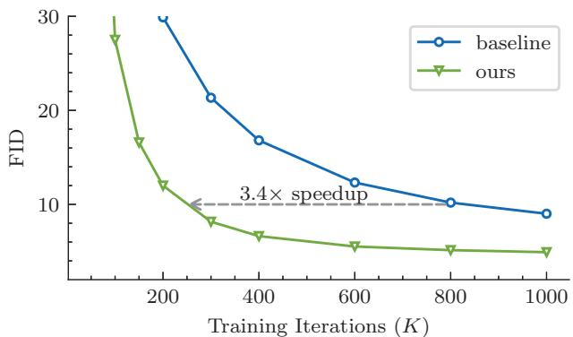  
Figure 1: By leveraging a non-conflicting weighting strategy, our method can converge 3.4 times faster than baseline, resulting in superior performance.

In this paper, we first conducted a thorough examination of this issue, revealing that the slow convergence rate likely arises from conflicting optimization directions for different timesteps during training. In fact, we find that by dedicatedly optimizing the denoising function for a specific noise level can even harm the reconstruction performance for other noise levels, as shown in Figure 2. This indicates that the optimal weight gradients for different noise levels are in conflict with one another. Given that current denoising diffusion models [19, 12, 36, 41] employ shared model weights for various noise levels, the conflicting weight gradients will impede the overall convergence rate, if without careful consideration on the balance of these noise timesteps.

To tackle this problem, we propose the Min-SNR-γ loss weighting strategy. This strategy treats the denoising process of each timestep as an individual task, thus diffusion training can be considered as a multi-task learning problem. To balance various tasks, we assign loss weights for each task according to their difficulty. Specifically, we adopt a clamped signal-to-noise ratio (SNR) as loss weight to alleviate the conflicting gradients issue. By organizing various timesteps using this new weighting strategy, the diffusion training process can converge much faster than previous approaches, as illustrated in Figure 1.

Generic multi-task learning methods usually seek to mitigate conflicts between tasks by adjusting the loss weight of each task based on their gradients. One classical approach [11, 46], Pareto optimization, aims to seek a gradient descent direction to improve all the tasks. However, these approaches differ from our Min-SNR-γ weighting strategy in three aspects: 1) Sparsity. Most previous studies in the generic multi-task learning field have focused on scenarios with a small number of tasks, which differs from the diffusion training where the number of tasks can be up to thousands. As in our experiments, Pareto optimal solutions in diffusion training tend to set loss weights of most timesteps as 0. In this way, many timesteps will be left without any learning, and thus harm the entire denoising process. 2) Instability. The gradients computed for each timestep in each iteration are often noisy, owing to a limited number of samples for each timestep. This hampers the accurate computation of Pareto optimal solutions. 3) Inefficiency. The calculation of Pareto optimal solutions is time-consuming, significantly slowing down the overall training.

Our proposed Min-SNR-γ strategy is a predefined global step-wise loss weighting setting, instead of run-time adaptive loss weights for each iteration as in the original Pareto optimization, thus avoiding the sparsity issue. Moreover, the global loss weighting strategy eliminates the need for noisy computation of gradients and the time-consuming Pareto optimization process, making it more efficient and stable. Though suboptimal, the global strategy can be also almost as effective: Firstly, the optimization dynamics of each denoising task are largely shaped by the task’s noise level, without the need to account for individual samples too much. Secondly, after a moderate number of iterations, the gradients of the majority subsequent training process become more stable, thus it can be approximated by a stationery weighting strategy.

To validate the effectiveness of the Min-SNR-γ weighting strategy, we first compute its Pareto objective value and compare it with the optimal step-wise loss weights obtained by directly solving the Pareto problem. Together, we also compare it with several conventional loss weighting strategies, including constant weighting, SNR weighting, and SNR with an lower bound. Figure 4 shows that our Min-SNR-γ weighting strategy produces Pareto objective values almost as low as the optimal one, significantly better than other existing works, indicating a significant alleviation of the gradient conflicting issue. As a result, the proposed weighting strategy not only converges much faster than previous approaches, but is also effective and general for various generation scenarios. It achieves a new record of FID score 2.06 on the ImageNet 256 256 benchmark, and proves to also improve models using other prediction targets and network architectures.

Our contributions are summarized as follows:

• We have uncovered a compelling explanation for the slow convergence issue in diffusion training: a conflict in gradients across various timesteps.

• We have proposed a new loss weighting strategy for diffusion model training, which greatly mitigates the conflicting gradients across timesteps and results in a marked acceleration of convergence speed.

• We have established a new FID score record on the ImageNet 256 256 image generation benchmark.

## 2. Related Works

Denoising Diffusion Models. Diffusion models [19, 50, 12] are strong generative models, particularly in the field of image generation, due to their ability to model complex distributions. This advantage has led to superiority over previous GAN models in terms of both high-fidelity and diversity of generated images [12, 24, 35, 40, 41, 43]. Besides, diffusion models also show great success in text-to-video generation [18, 47, 52], 3D Avatar generation [39, 53], image to image translation [37], image manipulation [4, 26], music generation [23], and even drug discovery [55]. The most widely used network structure for diffusion models in the field of image generation is UNet [19, 12, 35, 36]. Recently, researchers have also explored the use of Vision Transformers [13] as an alternative, with U-ViT [2] borrowing the skip connection design from UNet [42] and DiT [38] leveraging Adaptive LayerNorm and discovering that the zero initialization strategy is critical for achieving state-of-the-art class-conditional ImageNet generation results.

Improved Diffusion Models. Recent studies have tried to improve the diffusion models from different perspectives. Some works aim to improve the quality of generated images by guiding the sampling process [12, 21]. Other studies propose fast sampling methods that require only a dozen steps [49, 29, 32, 24] to generating high-quality images. Some works have further distilled the diffusion models for even fewer steps in the sampling process [44, 33]. Meanwhile, some researchers [19, 24, 6] have noticed that the noise schedule is important for diffusion models. Other works [36, 44] have found that different predicting targets from denoising networks affect the training stability and final performance. Finally, some works [14, 1] have proposed using the Mixture of Experts (MoE) approach to handle noise from different levels, which can boost the performance of diffusion models, but require a larger number of parameters and longer training time.

Multi-task Learning. The goal of Multi-task learning (MTL) is to learn multiple related tasks jointly so that the knowledge contained in a task can be leveraged by other tasks. One of the main challenges in MTL is negative transfer [9], means the joint training of tasks hurts learning instead of helping it. From an optimization perspective, it manifests as the presence of conflicting task gradients. To address this issue, some previous works [58, 54, 8] try to modulate the gradient to prevent conflicts. Meanwhile, other works attempt to balance different tasks through carefully design the loss weights [7, 25]. GradNorm [7] considers loss weight as learnable parameters and updates them through gradient descent. Another approach MTO [11, 46] regards the multi-task learning problem as a multi-objective optimization problem and obtains the loss weights by solving a quadratic programming problem.

## 3. Method

## 3.1. Preliminary

Diffusion models consist of two processes: a forward noising process and a reverse denoising process. We denote the distribution of training data as $p ( \mathbf { x } _ { 0 } )$ . The forward process is a Gaussian transition, gradually adds noise with different scales to a real data point $\mathbf { x } _ { 0 } \sim p ( \mathbf { x } _ { 0 } )$ to obtain a series of noisy latent variables $\left\{ \mathbf { x } _ { 1 } , \mathbf { x } _ { 2 } , \ldots , \mathbf { x } _ { T } \right\}$ :

$$
q ( \mathbf { x } _ { t } | \mathbf { x } _ { 0 } ) = \mathcal { N } ( \mathbf { x } _ { t } ; \alpha _ { t } \mathbf { x } _ { 0 } , \sigma _ { t } ^ { 2 } \mathbf { I } )\tag{1}
$$

$$
{ \bf x } _ { t } = \alpha _ { t } { \bf x } _ { 0 } + \sigma _ { t } \epsilon\tag{2}
$$

where - is the noise sampled from Gaussian distribution $\mathcal { N } ( 0 , \bf { I } )$ . The noise schedule $\sigma _ { t }$ denotes the magnitude of noise added to the clean data at t timestep. It increases monotonically with t. In this paper, we adopt the standard variance-preserving diffusion process, where $\begin{array} { r l } { \alpha _ { t } } & { { } = } \end{array}$ $\sqrt { 1 - \sigma _ { t } ^ { 2 } }$

The reverse process is parameterized by another Gaussian transition, gradually denoises the latent variables and restores the real data $\mathbf { x } _ { \mathrm { 0 } }$ from a Gaussian noise:

$$
p _ { \theta } ( \mathbf { x } _ { t - 1 } | \mathbf { x } _ { t } ) = \mathcal { N } ( \mathbf { x } _ { t - 1 } ; \hat { \mu } _ { \theta } ( \mathbf { x } _ { t } ) , \hat { \Sigma } _ { \theta } ( \mathbf { x } _ { t } ) ) .\tag{3}
$$

$\hat { \mu } _ { \boldsymbol { \theta } }$ and $\hat { \Sigma } _ { \theta }$ are predicted statistics. Ho et al. [19] set $\hat { \Sigma } _ { \theta } ( \mathbf { x } _ { t } )$ to the constant $\boldsymbol { \sigma } _ { t } ^ { 2 } \mathbf { I } ,$ , and $\hat { \mu } _ { \boldsymbol { \theta } }$ can be decomposed into the linear combination of $\mathbf { x } _ { t }$ and a noise approximation model $\hat { \epsilon } _ { \theta }$ . They find using a network to predict noise  works well, especially when combined with a simple re-weighted loss function:

$$
\begin{array} { r } { \mathcal { L } _ { \mathrm { s i m p l e } } ^ { t } ( \theta ) = \mathbb { E } _ { \mathbf { x } _ { 0 } , \epsilon } \left[ \| \epsilon - \hat { \epsilon } _ { \theta } ( \alpha _ { t } \mathbf { x } _ { 0 } + \sigma _ { t } \epsilon ) \| _ { 2 } ^ { 2 } \right] . } \end{array}\tag{4}
$$

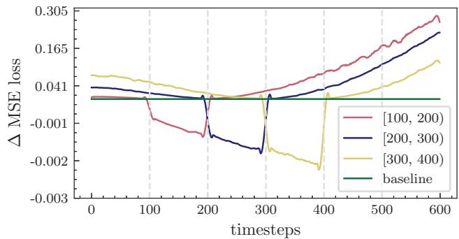  
Figure 2: We finetune the diffusion model in specific ranges of timesteps:[100, 200), [200, 300), and [300, 400), then we investigate how it affects the loss in different timesteps. The surrounding timesteps may derive benefit from it, while others may experience adverse effects.

Most previous works [36, 12, 35] follow this strategy and predict the noise. Later works [17, 44] use another reparameterization that predicts the noiseless state x0:

$$
\begin{array} { r } { \mathcal { L } _ { \mathrm { s i m p l e } } ^ { t } ( \theta ) = \mathbb { E } _ { \mathbf { x } _ { 0 } , \epsilon } \left[ | | \mathbf { x } _ { 0 } - \hat { \mathbf { x } } _ { \theta } ( \alpha _ { t } \mathbf { x } _ { 0 } + \sigma _ { t } \epsilon ) | | _ { 2 } ^ { 2 } \right] . } \end{array}\tag{5}
$$

And some other works [44, 41] even employ the network to directly predict velocity v. Despite their prediction targets being different, we can derive that they are mathematically equivalent by modifying their loss weights.

## 3.2. Diffusion Training as Multi-Task Learning

To reduce the number of parameters, previous studies [19, 36, 12] often share the parameters of the denoising models across all steps. However, it’s important to keep in mind that different steps may have vastly different requirements. At each step of a diffusion model, the strength of the denoising varies. For example, easier denoising tasks (when $t  0 )$ may require simple reconstructions of the input in order to achieve lower denoising loss. This strategy, unfortunately, does not work as well for noisier tasks (when $t  T )$ . Thus, it’s extremely important to analyze the correlation between different timesteps.

In this regard, we conduct a simple experiment. We begin by clustering the denoising process into several separate bins. Then we finetune the diffusion model by sampling timesteps in each bin. Lastly, we evaluate its effectiveness by looking at how it impacted the loss of other bins. As shown in Figure 2, we can observe that finetuning specific steps benefited those surrounding steps. However, it’s often detrimental for other steps that are far away. This inspires us to consider whether we can find a more efficient solution that benefits all timesteps simultaneously.

We re-organized our goal from the perspective of multitask learning. The training process of denoising diffusion models contains T different tasks, each task represents an individual timestep. We denote the model parameters as θ and the corresponding training loss is $\mathcal { L } ^ { t } ( \theta ) , t \in$ $\{ 1 , 2 , \ldots , T \}$ . Our goal is to find a update direction $\delta \neq 0 ,$ that satisfies:

$$
\begin{array} { r } { \mathcal { L } ^ { t } ( \theta + \delta ) \leq \mathcal { L } ^ { t } ( \theta ) , \forall t \in \{ 1 , 2 , \ldots , T \} . } \end{array}\tag{6}
$$

We consider the first-order Taylor expansion:

$$
\begin{array} { r } { \mathcal { L } ^ { t } ( \theta + \delta ) \approx \mathcal { L } ^ { t } ( \theta ) + \left. \delta , \nabla _ { \theta } \mathcal { L } ^ { t } ( \theta ) \right. . } \end{array}\tag{7}
$$

Thus, the ideal update direction is equivalent to satisfy:

$$
\left. \delta , \nabla _ { \theta } \mathcal { L } ^ { t } ( \theta ) \right. \leq 0 , \forall t \in \{ 1 , 2 , \ldots , T \} .\tag{8}
$$

## 3.3. Pareto optimality of diffusion models

Theorem 1 Consider a update direction $\delta ^ { * }$ :

$$
\delta ^ { * } = - \sum _ { t = 1 } ^ { T } w _ { t } \nabla _ { \theta } \mathcal { L } ^ { t } ( \theta ) ,\tag{9}
$$

of which $w _ { t }$ is the solution to the optimization problem:

$$
\operatorname* { m i n } _ { w _ { t } } \left\{ \| \sum _ { t = 1 } ^ { T } w _ { t } \nabla _ { \theta } \mathcal { L } ^ { t } ( \theta ) \| ^ { 2 } | \sum _ { t = 1 } ^ { T } w _ { t } = 1 , w _ { t } \geq 0 \right\}\tag{10}
$$

If the optimal solution to the Equation 8 exists, then $\delta ^ { * }$ should satisfy it. Otherwise, it means that we must sacrifice a certain task in exchangefor the loss decrease ofother tasks. In other words, we have reached the Pareto Stationary and the training has converged.

A more general form of this theorem was first proposed in [11] and we leave a succinct proof in the supplementary material. Since diffusion models are required to go through all the timesteps when generating images. So any timestep should not be ignored during training. Consequently, a regularization term is included to prevent the loss weights from becoming excessively small. The optimization goal in Equation 10 becomes:

$$
\operatorname* { m i n } _ { w _ { t } } \left\{ \| \sum _ { t = 1 } ^ { T } w _ { t } \nabla _ { \theta } \mathcal { L } ^ { t } ( \theta ) \| _ { 2 } ^ { 2 } + \lambda \sum _ { t = 1 } ^ { T } \| w _ { t } \| _ { 2 } ^ { 2 } \right\}\tag{11}
$$

where λ controls the regularization strength.

To solve Equation 11, [46] leverages the Frank-Wolfe [15] algorithm to obtain the weight $\{ w _ { t } \}$ through iterative optimization. Another approach is to adopt Unconstrained Gradient Descent(UGD). Specifically, we reparameterize $w _ { t }$ through $\beta _ { t }$ :

$$
w _ { t } = \frac { e ^ { \beta _ { t } } } { Z } , Z = \sum _ { t } e ^ { \beta _ { t } } , \beta _ { t } \in \mathbb { R } .\tag{12}
$$

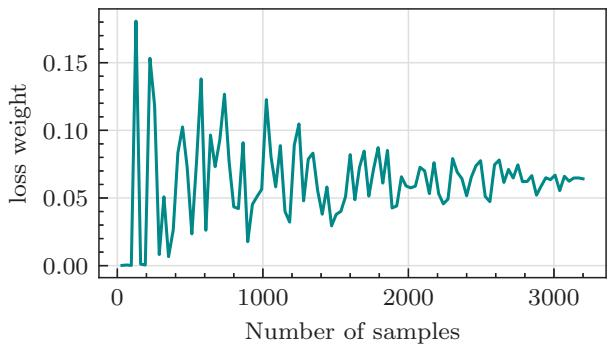  
Figure 3: Demonstration of the instability of optimizationbased weighting strategy. As the number of samples increases, the loss weight becomes stable, while the computation cost increases.

Combined with Equation 11, we can use gradient descent to optimize each term independently:

$$
\operatorname* { m i n } _ { \beta _ { t } } \frac { 1 } { Z ^ { 2 } } \| \sum _ { t = 1 } ^ { T } e ^ { \beta _ { t } } \nabla _ { \theta } \mathcal { L } _ { t } ( \theta ) \| _ { 2 } ^ { 2 } + \frac { \lambda } { Z ^ { 2 } } \sum _ { t = 1 } ^ { T } \| e ^ { \beta _ { t } } \| _ { 2 } ^ { 2 }\tag{13}
$$

However, whether leveraging the Frank-Wolfe or the UGD algorithm, there are two disadvantages: 1) Inefficiency. Both of these two methods need additional optimization at each training iteration, it greatly increases the training cost. 2) Instability. In practice, by using a limited number of samples to calculate the gradient term $\nabla _ { { \boldsymbol { \theta } } } { \mathcal { L } } ^ { t } ( { \boldsymbol { \theta } } )$ the optimization results are unstable(as shown in Figure 3). In other words, the loss weights for each denoising task vary greatly during training, making the entire diffusion training inefficient.

## 3.4. Min-SNR-γ Loss Weight Strategy

In order to avoid the inefficiency and instability caused by the iterative optimization in each iteration, one possible attempt is to adopt a stationery loss weight strategy.

To simplify the discussion, we assume that the network is reparametered to predict the noiseless state $\mathbf { x } _ { \mathrm { 0 } }$ . However, it’s worth noting that different prediction objectives can be transformed into one another, we will delve into it in Section 4.2. Now, we consider the following alternative training loss weights:

• Constant weighting. $w _ { t } = 1$ . Which treats different tasks as equally weighted and has been used in both discrete diffusion models [17, 51] and continuous diffusion models [5].

• SNR weighting. $w _ { t } ~ = ~ \mathrm { S N R } ( t )$ , where $\mathbf { S N R } ( t ) \ =$ $\alpha _ { t } ^ { 2 } / \sigma _ { t } ^ { 2 }$ . It’s the most widely used weighting strategy [33, 22, 12, 41]. By combining with Equation 2, we can find it’s numerically equivalent to the constant weighting strategy when the predicting target is noise.

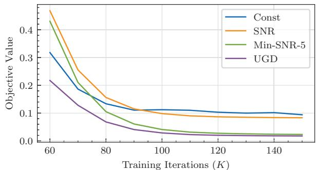  
Figure 4: Comparison of the objective values in Equation 11 on different weighting strategies.

• Max-SNR-γ weighting. $w _ { t } = \operatorname* { m a x } \{ \mathrm { S N R } ( t ) , \gamma \}$ . This modification of SNR weighting is first proposed in [44] to avoid a weight of zero with zero SNR steps. They set $\gamma = 1$ as their default setting. However, the weights still concentrate on small noise levels.

• Min- $- S \mathrm { N R - } \gamma$ weighting. $w _ { t } = \mathrm { m i n } \{ \mathrm { S N R } ( t ) , \gamma \}$ . We propose this weighting strategy to avoid the model focusing too much on small noise levels.

• UGD optimization weighting. $w _ { t }$ is optimized from Equation 13 in each timestep. Compared with the previous setting, this strategy changes during training.

First, we combine these weighting strategies into Equation 11 to validate whether they are approach to the Pareto optimality state. As shown in Figure 4, the UGD optimization weighting strategy can achieve the lowest score on our optimization target. In addition, the Min-SNR-γ weighting strategy is the closest to the optimum, demonstrating it has the property to optimize different timesteps simultaneously.

In the following section, we present experimental results to demonstrate the effectiveness of our Min-SNR-γ weighting strategy in balancing diverse noise levels. Our approach aims to achieve faster convergence and strong performance.

## 4. Experiments

In this section, we first provide an overview of the experimental setup. Subsequently, we conduct comprehensive ablation studies to show that our method is versatile and suitable for various prediction targets and network architectures. Finally, we compare our approach with the state-ofthe-art methods across multiple benchmarks, demonstrating not only its accelerated convergence but also its superior capability in generating high-quality images.

## 4.1. Setup

Datasets. We perform experiments on both unconditional CelebA dataset [30] and the conditional ImageNet dataset [10]. The CelebA dataset, which comprises 162,770 human faces, is a widely-used unconditional image generation benchmark. We follow ScoreSDE [57] for data preprocessing, which involves center cropping each image to a resolution of $1 4 0 \times 1 4 0$ and then resizing it to $6 4 \times 6 4 .$ . For class conditional generation, we adopt ImageNet [10] with a total of 1.3 million images from 1000 different classes. We test the performance on both $6 4 ^ { 2 }$ and $2 5 6 ^ { 2 }$ resolutions. Training Details. For low resolution $( 6 4 \times 6 4 )$ image generation, we follow ADM [12] and directly train the diffusion model on the pixel-level. For high-resolution image generation, we utilize LDM [41] approach by first compressing the images into latent space, then training a diffusion model to model the latent distributions. To obtain the latent for images, we employ VAE from Stable Diffusion1, which encodes a high-resolution image $( 2 5 6 \times 2 5 6 \times 3 )$ into $3 2 \times 3 2 \times 4$ latent codes.

In our experiments, we employ both ViT and UNet as our diffusion model backbones. We adopt a vanilla ViT structure without any modifications [13] as our default setting. we incorporate the timestep t and class condition c as learnable input tokens to the model. Although further customization of the network structure may improve performance, our focus in this paper is to analyze the general properties of diffusion models. For the UNet structure, we follow ADM [12] and keep the FLOPs similar to the ViT-B model, which has 1.5 parameters. Additional details can be found in the supplementary material.

For the diffusion settings, we use a cosine noise scheduler following the approach in [36, 12]. The total number of timesteps is standardized to $T = 1 0 0 0$ across all datasets. We adopt AdamW [27, 31] as our optimizer. For the CelebA dataset, we train our model for 500K iterations with a batch size of 128. During the first 5,000 iterations, we implement a linear warm-up and keep the learning rate at $1 \times 1 0 ^ { - 4 }$ for the remaining training. For the ImageNet dataset, the default learning rate is fixed at $1 \times 1 0 ^ { - 4 }$ . The batch size is set to 1024 for $6 4 ^ { 2 }$ resolution and 256 for $2 5 6 ^ { 2 }$ resolution.

Evaluation Settings. We utilize an Exponential Moving Average (EMA) model with a rate of 0.9999 for evaluation. During the evaluation phase, we generate images with the Heun sampler from EDM [24]. For conditional image generation, we also implement the classifier-free sampling strategy [21] to achieve better results. Finally, we measure the quality of the generated images using the FID score calculated on 50K images.

## 4.2. Analysis of the Proposed Min-SNR-γ

Comparison of Different Weighting Strategies. To demonstrate the significance of the loss weighting strategy, we conduct experiments with different loss weight settings for predicting $\mathbf { x } _ { \mathrm { 0 } }$ . These settings include: 1) constant weighting, where $w _ { t } ~ = 1 , 2 )$ SNR weighting, with $w _ { t } \ = \ \mathrm { S N R } ( t ) , \ 3 )$ truncated SNR weighting, with $w _ { t } =$ max $\{ \mathrm { S N R } ( t ) , \gamma \}$ (following [44] with a set value of $\gamma = 1 ) .$ and 4) our proposed Min-SNR-γ weighting strategy, with $w _ { t } = \mathrm { m i n } \{ \mathrm { S N R } ( t ) , \gamma \}$ , we set $\gamma = 5$ as the default value.

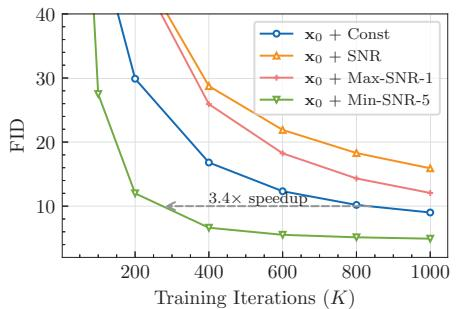

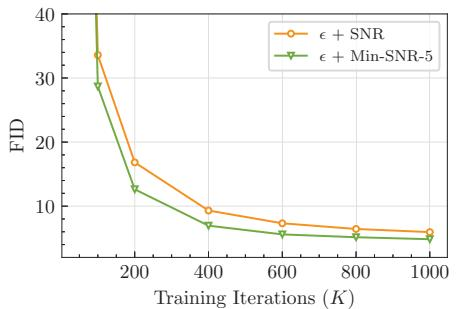

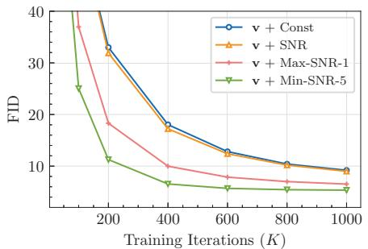  
Figure 5: Comparing different loss weighting designs on predicting x , , v. Taking the neural network output as noise with const or Max-SNR-γ strategy lead to divergence. Min-SNR-γ strategy converges the fastest under all these settings.

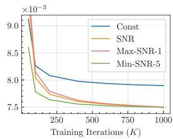

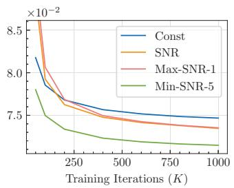

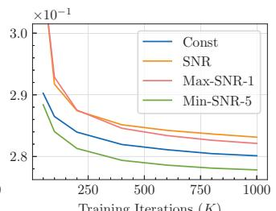

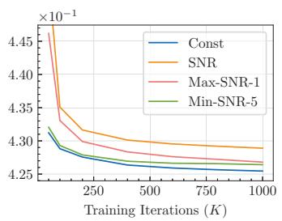  
Figure 6: Unweighted loss in different ranges of timesteps. From left to right, each figure represents a specific range of timesteps: [0, 100), [200, 300), [600, 700), [800, 900). The y-axis represents the Mean Squared Error (MSE), averaged over each range of timesteps.

The ViT-B serves as our default backbone and experiments are performed on ImageNet 256 256. As illustrated in Figure 5, we observe that all results improve as the number of training iterations increases. However, our method demonstrates a significantly faster convergence compared to other methods. Specifically, it exhibits a 3.4 speedup in reaching an FID score of 10. It is worth mentioning that the SNR weighting strategy performed the worst, which could be due to its disproportionate focus on less noisy stages.

For a deeper understanding of the reasons behind the varying convergence rates, we analyzed their training loss at different noise levels. For a fair comparison, we exclude the loss weight term by only calculating $\| \mathbf { x } _ { 0 } - \hat { \mathbf { x } } _ { \theta } \| _ { 2 } ^ { 2 }$ . Considering that the loss of different noise levels varies greatly, we calculate the loss in different bins and present the results in Figure 6. The results show that while the constant weighting strategy is effective for high noise intensities, it performs poorly at low noise intensities. Conversely, the SNR weighting strategy exhibits the opposite behavior. In contrast, our proposed Min-SNR-γ strategy achieves a lower training loss across almost all cases, and indicates quicker convergence through the FID metric.

Furthermore, we present visual results in Figure 7 to demonstrate the fast convergence of Min-SNR-γ. We sample images from training iteration 50K, 200K, 400K, and 1M with different loss weights. Our results show that Min-$\mathrm { S N R - } \gamma$ generates a clear object with only 200K iterations, which is significantly better in quality than other methods. $\mathbf { M i n - S N R - } \gamma$ for Different Prediction Targets. Instead of predicting the original signal $\mathbf { x } _ { \mathrm { 0 } }$ from the network, some recent works have employed alternative re-parameterizations, such as predicting noise , or velocity v [44]. To verify the applicability of our weighting strategy to these prediction targets, we conduct experiments comparing the four aforementioned weighting strategies across these different re-parameterizations.

As we discussed in Section 3.4, predicting noise  is mathematically equivalent to predicting $\mathbf { x } _ { \mathrm { 0 } }$ by intrinsically involving Signal-to-Noise Ratio as a weight factor, thus we divide the SNR term in practice. For example, the Min-SNR-γ strategy in predicting noise can be expressed as $\begin{array} { r } { w _ { t } = \frac { \mathrm { m i n } \{ \mathrm { S N R } ( t ) , \gamma \} } { \mathrm { S N R } ( t ) } = \mathrm { m i n } \{ \frac { \gamma } { \mathrm { S N R } ( t ) } , 1 \} } \end{array}$ . And the SNR strategy in predicting noise is equivalent to a “constant strat-$\mathrm { e g y } ^ { \mathrm { , , } }$ . For simplicity and consistency, we still refer to them as Min-SNR-γ and SNR strategies. Similarly, we can derive that when predicting velocity v, the loss weight factor must be divided by (SNR + 1). These strategies are still referred to by their original names for ease of reference.

We conduct experiments on these two variants in Figure 5. Noise output with const or Max- $- S \mathrm { N R - } \gamma$ setting leads to divergence. Meanwhile, our proposed Min-SNR-γ strategy converges faster than other loss weighting strategies for both prediction noise and predicting velocity. These demonstrate that balancing the loss weights for different timesteps is intrinsic, independent of any re-parameterization.

Longer Training  
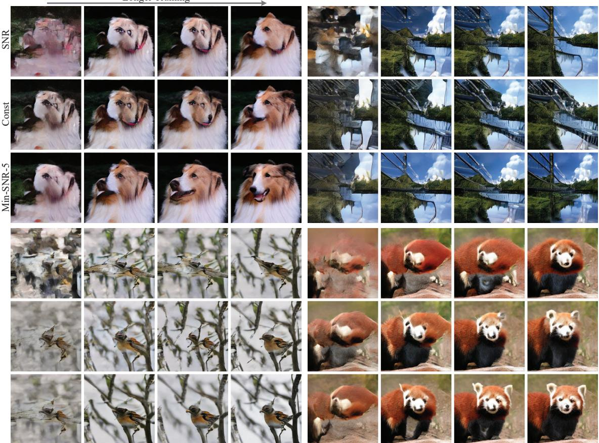  
Figure 7: Qualitative comparison of the generation results from different weighting strategies on ImageNet-256 dataset. Images in each column are sampled from 50K, 200K, 400K, and 1M iterations. Our Min-SNR-5 strategy yields significant improvements in visual fidelity from the same iteration.

Min-SNR-γ on Different Network Architectures. The Min-SNR-γ strategy is versatile and robust for different prediction targets and network structures. We conduct experiments on the widely used UNet and keep the number of parameters close to the ViT-B model. For each experiment, models are trained for 1 million iterations and their FID scores are calculated at multiple iterations. The results in Table 1 indicate that the Min-SNR-γ strategy converges significantly faster than the baseline and provides better performance for both predicting $\mathbf { x } _ { \mathrm { 0 } }$ and predicting .

Robustness Analysis. We utilize a single hyper-parameter, γ, as the truncate value. To assess its robustness, we conduct thorough analysis in various settings. Our experiments were performed on ImageNet-256 using the ViT-B model and predicting $\mathbf { x } _ { \mathrm { 0 } }$ . We vary the truncate value γ by setting it to 1, 5, 10, and 20. The results are shown in Table 2. We find there are only minor variations in the FID score when γ is smaller than 20. Additionally, we conducted more experiments by modifying the predicting target to the noise , and modifying the network structure to UNet. We find that the results were also consistently stable. Our results indicate that good performance can usually be achieved when γ is set to 5, making it the established default setting.

<table><tr><td>Training Iterations</td><td>200K</td><td>400K</td><td>600K</td><td>800K</td><td>1M</td></tr><tr><td>Baseline (x0)</td><td>25.93</td><td>15.41</td><td>11.54</td><td>9.52</td><td>8.33</td></tr><tr><td>+ Min-SNR-5</td><td>7.99</td><td>5.34</td><td>4.69</td><td>4.41</td><td>4.28</td></tr><tr><td>Baseline (€)</td><td>8.55</td><td>5.43</td><td>4.64</td><td>4.35</td><td>4.21</td></tr><tr><td>+ Min-SNR-5</td><td>7.32</td><td>4.98</td><td>4.48</td><td>4.24</td><td>4.14</td></tr></table>

Table 1: Ablation studies on the UNet backbone. Whether the network predicts $\mathbf { x } _ { \mathrm { 0 } }$ or , the Min-SNR-5 weighting design converges faster and achieves better FID score.

## 4.3. Comparison with state-of-the-art Methods

CelebA-64. We conduct experiments on CelebA 64 64 for unconditional generation. Both UNet and ViT are trained for 500K iterations. During the evaluation, we use Heun sampler [24] to generate 50K samples. The FID results are summarized in Table 3. Our ViT-Small [13] model outperforms previous ViT-based models with an FID score of 2.14.

<table><tr><td>γ</td><td>1</td><td>5</td><td>10</td><td>20</td></tr><tr><td>ViT (x0)</td><td>4.98</td><td>4.92</td><td>5.34</td><td>5.45</td></tr><tr><td>ViT (€)</td><td>4.89</td><td>4.84</td><td>4.94</td><td>5.41</td></tr><tr><td>UNet (x0)</td><td>4.49</td><td>4.28</td><td>4.32</td><td>4.37</td></tr><tr><td>UNet (€)</td><td>4.30</td><td>4.14</td><td>4.14</td><td>4.12</td></tr></table>

Table 2: Ablation study on γ. The results are robust to the hyper-parameter γ in different settings.
<table><tr><td>Method</td><td>#Params</td><td>FID</td></tr><tr><td>DDIM [49]</td><td>79M</td><td>3.26</td></tr><tr><td>Soft Truncation [49]</td><td>62M</td><td>1.90</td></tr><tr><td>Our UNet</td><td>59M</td><td>1.60</td></tr><tr><td>U-ViT-Small [2]</td><td>44M</td><td>2.87</td></tr><tr><td>ViT-Small (ours)</td><td>43M</td><td>2.14</td></tr></table>

Table 3: FID results on unconditional CelebA 64 64 [30] benchmark. We experiment with both UNet and ViT.
<table><tr><td>Method</td><td>#Params</td><td>FID</td></tr><tr><td>BigGAN-deep [3] StyleGAN-XL [45]</td><td></td><td>4.06 1.51</td></tr><tr><td>IDDPM (small) [36] IDDPM (large) [36]</td><td>100M 270M</td><td>6.92 2.92</td></tr><tr><td>CDM [20]</td><td></td><td>1.48</td></tr><tr><td>ADM [12] EDM [24]</td><td>296M 296M</td><td>2.61 1.36</td></tr><tr><td>U-ViT-Mid [2]</td><td></td><td></td></tr><tr><td>U-ViT-Large [2]</td><td>131M</td><td>5.85</td></tr><tr><td></td><td>287M</td><td>4.26</td></tr><tr><td>ViT-L (ours)</td><td>269M</td><td>2.28</td></tr></table>

Table 4: FID results on ImageNet 64 64. We conduct experiments using the ViT-L backbone which significantly improves upon previous methods.

It is worth mentioning that no modifications are made to the naive network structure, demonstrating that the results could still be improved further. Meanwhile, our method using the UNet [12] structure achieves an even better FID score of 1.60, outperforming previous UNet methods.

ImageNet-64. We also validate our method on classconditional ImageNet 64 64 benchmark. During training, the class label is dropped with the probability 0.15 for classifier-free inference [21]. The model is trained for 800K iterations and images are synthesized using classifier-free guidance scale of 1.5. For a fair comparison, we adopt a 21-layer ViT-Large model without additional architecture designs, which has a similar number of parameters to U-ViT-Large [2]. The results presented in Table 4 show that our method achieves an FID score of 2.28, significantly improving upon the U-ViT-Large model.

<table><tr><td>Method</td><td>#Params</td><td>FID</td></tr><tr><td>BigGAN-deep [3] StyleGAN-XL [45]</td><td>340M</td><td>6.95 2.30</td></tr><tr><td>Improved VQ-Diffusion [17]</td><td>460M</td><td>4.83</td></tr><tr><td>IDDPM [36]</td><td>270M</td><td>12.26</td></tr><tr><td>CDM [20]</td><td></td><td>4.88</td></tr><tr><td>ADM-U, ADM-G [12]</td><td>608M</td><td>3.94</td></tr><tr><td>LDM [41]</td><td>400M</td><td>3.60</td></tr><tr><td>UNet (ours)</td><td>395M</td><td>2.81†</td></tr><tr><td>U-ViT-L [2]</td><td>287M</td><td>3.40</td></tr><tr><td>DiT-XL-2 [38]</td><td>675M</td><td>2.27</td></tr><tr><td></td><td></td><td></td></tr><tr><td>ViT-XL (ours)</td><td>451M</td><td>2.06</td></tr></table>

Table 5: FID results on ImageNet 256 256. † denotes only train 1.4M iterations. Our model with a ViT-XL backbone achieves a new record FID score of 2.06.

ImageNet-256. We also apply diffusion models for higherresolution image generation on the ImageNet 256 256 benchmark. To enhance training efficiency, we first compress $2 5 6 \times 2 5 6 \times 3$ images into 32 32 4 latent codes using the encoder from LDM [41]. During the sampling process, we employ the Heun sampler and the classifier-free guidance $C F G = 1 . 5$ . The FID comparison is presented in Table 5. Under the setting of predicting  with Min-SNR-5, our ViT-XL model achieves the FID of 2.08 for only 2.1M iterations, which is 3.3 faster than DiT and outperforms the previous state-of-the-art FID of 2.27. Moreover, with longer training (about 7M iterations as in [38]), we are able to achieve FID 2.06 by predicting $\mathbf { x } _ { \mathrm { 0 } }$ with Min-SNR-5. Our UNet-based model with 395M parameters is trained for about 1.4M iterations and achieves FID score of 2.81.

## 5. Conclusion

In this paper, we point out that the conflicting optimization directions between different timesteps may cause slow convergence in diffusion training. To address it, we regard the diffusion training process as a multi-task learning problem and introduce a novel weighting strategy, named Min-$\operatorname { S N R - } \gamma ,$ , to effectively balance different timesteps. Experiments demonstrate our method can boost diffusion training several times faster, and achieves the state-of-the-art FID score on ImageNet-256 dataset.

## Acknowledgments

We sincerely thank Yixuan Wei, Zheng Zhang, and Stephen Lin for helpful discussion. This research was partly supported by the National Key Research & Development Plan of China (No. 2018AAA0100104), the National Science Foundation of China (62125602, 62076063).

## References

[1] Yogesh Balaji, Seungjun Nah, Xun Huang, Arash Vahdat, Jiaming Song, Karsten Kreis, Miika Aittala, Timo Aila, Samuli Laine, Bryan Catanzaro, Tero Karras, and Ming-Yu Liu. ediff-i: Text-to-image diffusion models with ensemble of expert denoisers. arXiv preprint arXiv:2211.01324, 2022. 2

[2] Fan Bao, Shen Nie, Kaiwen Xue, Yue Cao, Chongxuan Li, Hang Su, and Jun Zhu. All are worth words: A vit backbone for diffusion models. arXiv preprint arXiv:2209.12152, 2022. 2, 8

[3] Andrew Brock, Jeff Donahue, and Karen Simonyan. Large scale gan training for high fidelity natural image synthesis. International Conference on Learning Representations, 2019. 8

[4] Tim Brooks, Aleksander Holynski, and Alexei A Efros. Instructpix2pix: Learning to follow image editing instructions. In Proceedings of the IEEE/CVF Conference on Computer Vision and Pattern Recognition, pages 18392–18402, 2023. 1, 2

[5] Hanqun Cao, Cheng Tan, Zhangyang Gao, Guangyong Chen, Pheng-Ann Heng, and Stan Z Li. A survey on generative diffusion model. arXiv preprint arXiv:2209.02646, 2022. 4

[6] Ting Chen. On the importance of noise scheduling for diffusion models. arXiv preprint arXiv:2301.10972, 2023. 2

[7] Zhao Chen, Vijay Badrinarayanan, Chen-Yu Lee, and Andrew Rabinovich. Gradnorm: Gradient normalization for adaptive loss balancing in deep multitask networks. In International conference on machine learning, pages 794–803. PMLR, 2018. 3

[8] Zhao Chen, Jiquan Ngiam, Yanping Huang, Thang Luong, Henrik Kretzschmar, Yuning Chai, and Dragomir Anguelov. Just pick a sign: Optimizing deep multitask models with gradient sign dropout. Advances in Neural Information Processing Systems, 33:2039–2050, 2020. 3

[9] Michael Crawshaw. Multi-task learning with deep neural networks: A survey. arXiv preprint arXiv:2009.09796, 2020. 3

[10] Jia Deng, Wei Dong, Richard Socher, Li-Jia Li, Kai Li, and Li Fei-Fei. Imagenet: A large-scale hierarchical image database. In 2009 IEEE conference on computer vision and pattern recognition, pages 248–255. Ieee, 2009. 5

[11] Jean-Antoine Desid ´ eri. Multiple-gradient descent algorithm ´ (mgda) for multiobjective optimization. Comptes Rendus Mathematique, 350(5-6):313–318, 2012. 2, 3, 4

[12] Prafulla Dhariwal and Alexander Nichol. Diffusion models beat gans on image synthesis. Advances in Neural Information Processing Systems, 34:8780–8794, 2021. 1, 2, 3, 4, 5, 8

[13] A. Dosovitskiy, L. Beyer, A. Kolesnikov, D. Weissenborn, X. Zhai, T. Unterthiner, M. Dehghani, M. Minderer, G. Heigold, and S. Gelly. An image is worth 16x16 words: Transformers for image recognition at scale. In International Conference on Learning Representations, 2021. 2, 5, 7

[14] Zhida Feng, Zhenyu Zhang, Xintong Yu, Yewei Fang, Lanxin Li, Xuyi Chen, Yuxiang Lu, Jiaxiang Liu, Weichong

Yin, Shikun Feng, et al. Ernie-vilg 2.0: Improving text-toimage diffusion model with knowledge-enhanced mixtureof-denoising-experts. arXiv preprint arXiv:2210.15257, 2022. 2

[15] Marguerite Frank and Philip Wolfe. An algorithm for quadratic programming. Naval research logistics quarterly, 3(1-2):95–110, 1956. 4

[16] Shansan Gong, Mukai Li, Jiangtao Feng, Zhiyong Wu, and Lingpeng Kong. Sequence to sequence text generation with diffusion models. In International Conference on Learning Representations, 2023. 1

[17] Shuyang Gu, Dong Chen, Jianmin Bao, Fang Wen, Bo Zhang, Dongdong Chen, Lu Yuan, and Baining Guo. Vector quantized diffusion model for text-to-image synthesis. In Proceedings of the IEEE/CVF Conference on Computer Vision and Pattern Recognition, pages 10696–10706, 2022. 1, 3, 4, 8

[18] Jonathan Ho, William Chan, Chitwan Saharia, Jay Whang, Ruiqi Gao, Alexey A. Gritsenko, Diederik P. Kingma, Ben Poole, Mohammad Norouzi, David J. Fleet, and Tim Salimans. Imagen video: High definition video generation with diffusion models. ArXiv, abs/2210.02303, 2022. 1, 2

[19] Jonathan Ho, Ajay Jain, and Pieter Abbeel. Denoising diffusion probabilistic models. Advances in Neural Information Processing Systems, 33:6840–6851, 2020. 1, 2, 3

[20] Jonathan Ho, Chitwan Saharia, William Chan, David J Fleet, Mohammad Norouzi, and Tim Salimans. Cascaded diffusion models for high fidelity image generation. J. Mach. Learn. Res., 23:47–1, 2022. 8

[21] Jonathan Ho and Tim Salimans. Classifier-free diffusion guidance. In NeurIPS 2021 Workshop on Deep Generative Models and Downstream Applications, 2021. 2, 5, 8

[22] Jonathan Ho, Tim Salimans, Alexey A. Gritsenko, William Chan, Mohammad Norouzi, and David J. Fleet. Video diffusion models. In Alice H. Oh, Alekh Agarwal, Danielle Belgrave, and Kyunghyun Cho, editors, Advances in Neural Information Processing Systems, 2022. 1, 4

[23] Qingqing Huang, Daniel S Park, Tao Wang, Timo I Denk, Andy Ly, Nanxin Chen, Zhengdong Zhang, Zhishuai Zhang, Jiahui Yu, Christian Frank, et al. Noise2music: Textconditioned music generation with diffusion models. arXiv preprint arXiv:2302.03917, 2023. 2

[24] Tero Karras, Miika Aittala, Timo Aila, and Samuli Laine. Elucidating the design space of diffusion-based generative models. In Alice H. Oh, Alekh Agarwal, Danielle Belgrave, and Kyunghyun Cho, editors, Advances in Neural Information Processing Systems, 2022. 2, 5, 7, 8

[25] Alex Kendall, Yarin Gal, and Roberto Cipolla. Multi-task learning using uncertainty to weigh losses for scene geometry and semantics. In Proceedings of the IEEE conference on computer vision and pattern recognition, pages 7482–7491, 2018. 3

[26] Gwanghyun Kim, Taesung Kwon, and Jong Chul Ye. Diffusionclip: Text-guided diffusion models for robust image manipulation. In Proceedings of the IEEE/CVF Conference on Computer Vision and Pattern Recognition, pages 2426– 2435, 2022. 1, 2

[27] D. P. Kingma and J. Ba. Adam: A method for stochastic optimization. In International Conference on Learning Representations, 2014. 5

[28] Xiang Lisa Li, John Thickstun, Ishaan Gulrajani, Percy Liang, and Tatsunori B Hashimoto. Diffusion-lm improves controllable text generation. arXiv preprint arXiv:2205.14217, 2022. 1

[29] Luping Liu, Yi Ren, Zhijie Lin, and Zhou Zhao. Pseudo numerical methods for diffusion models on manifolds. ArXiv, abs/2202.09778, 2022. 2

[30] Ziwei Liu, Ping Luo, Xiaogang Wang, and Xiaoou Tang. Deep learning face attributes in the wild. In Proceedings of International Conference on Computer Vision (ICCV), December 2015. 5, 8

[31] I. Loshchilov and F. Hutter. Decoupled weight decay regularization. In International Conference on Learning Representations, 2018. 5

[32] Cheng Lu, Yuhao Zhou, Fan Bao, Jianfei Chen, Chongxuan Li, and Jun Zhu. Dpm-solver: A fast ode solver for diffusion probabilistic model sampling in around 10 steps. ArXiv, abs/2206.00927, 2022. 2

[33] Chenlin Meng, Robin Rombach, Ruiqi Gao, Diederik Kingma, Stefano Ermon, Jonathan Ho, and Tim Salimans. On distillation of guided diffusion models. In Proceedings of the IEEE/CVF Conference on Computer Vision and Pattern Recognition, pages 14297–14306, 2023. 2, 4

[34] Chenlin Meng, Yang Song, Jiaming Song, Jiajun Wu, Jun-Yan Zhu, and Stefano Ermon. Sdedit: Image synthesis and editing with stochastic differential equations. arXiv preprint arXiv:2108.01073, 2021. 1

[35] Alex Nichol, Prafulla Dhariwal, Aditya Ramesh, Pranav Shyam, Pamela Mishkin, Bob McGrew, Ilya Sutskever, and Mark Chen. Glide: Towards photorealistic image generation and editing with text-guided diffusion models. In International Conference on Machine Learning, 2021. 2, 3

[36] Alexander Quinn Nichol and Prafulla Dhariwal. Improved denoising diffusion probabilistic models. In International Conference on Machine Learning, pages 8162–8171. PMLR, 2021. 1, 2, 3, 5, 8

[37] Gaurav Parmar, Krishna Kumar Singh, Richard Zhang, Yijun Li, Jingwan Lu, and Jun-Yan Zhu. Zero-shot image-to-image translation. In ACM SIGGRAPH 2023 Conference Proceedings, pages 1–11, 2023. 2

[38] William Peebles and Saining Xie. Scalable diffusion models with transformers. arXiv preprint arXiv:2212.09748, 2022. 2, 8

[39] Ben Poole, Ajay Jain, Jonathan T Barron, and Ben Mildenhall. Dreamfusion: Text-to-3d using 2d diffusion. In The Eleventh International Conference on Learning Representations, 2022. 1, 2

[40] Aditya Ramesh, Prafulla Dhariwal, Alex Nichol, Casey Chu, and Mark Chen. Hierarchical text-conditional image generation with clip latents. arXiv preprint arXiv:2204.06125, 2022. 1, 2

[41] Robin Rombach, Andreas Blattmann, Dominik Lorenz, Patrick Esser, and Bjorn Ommer. High-resolution image ¨ synthesis with latent diffusion models. In Proceedings of

the IEEE/CVF Conference on Computer Vision and Pattern Recognition, pages 10684–10695, 2022. 1, 2, 3, 4, 5, 8

[42] Olaf Ronneberger, Philipp Fischer, and Thomas Brox. Unet: Convolutional networks for biomedical image segmentation. In Medical Image Computing and Computer-Assisted Intervention–MICCAI 2015: 18th International Conference, Munich, Germany, October 5-9, 2015, Proceedings, Part III 18, pages 234–241. Springer, 2015. 2

[43] Chitwan Saharia, William Chan, Saurabh Saxena, Lala Li, Jay Whang, Emily Denton, Seyed Kamyar Seyed Ghasemipour, Raphael Gontijo-Lopes, Burcu Karagol Ayan, Tim Salimans, Jonathan Ho, David J. Fleet, and Mohammad Norouzi. Photorealistic text-to-image diffusion models with deep language understanding. In Alice H. Oh, Alekh Agarwal, Danielle Belgrave, and Kyunghyun Cho, editors, Advances in Neural Information Processing Systems, 2022. 1, 2

[44] Tim Salimans and Jonathan Ho. Progressive distillation for fast sampling of diffusion models. In International Conference on Learning Representations, 2022. 2, 3, 5, 6

[45] Axel Sauer, Katja Schwarz, and Andreas Geiger. Styleganxl: Scaling stylegan to large diverse datasets. In ACM SIG-GRAPH 2022 conference proceedings, pages 1–10, 2022. 8

[46] Ozan Sener and Vladlen Koltun. Multi-task learning as multi-objective optimization. Advances in neural information processing systems, 31, 2018. 2, 3, 4

[47] Uriel Singer, Adam Polyak, Thomas Hayes, Xi Yin, Jie An, Songyang Zhang, Qiyuan Hu, Harry Yang, Oron Ashual, Oran Gafni, Devi Parikh, Sonal Gupta, and Yaniv Taigman. Make-a-video: Text-to-video generation without text-video data. In The Eleventh International Conference on Learning Representations, 2023. 1, 2

[48] Jascha Sohl-Dickstein, Eric Weiss, Niru Maheswaranathan, and Surya Ganguli. Deep unsupervised learning using nonequilibrium thermodynamics. In International Conference on Machine Learning, pages 2256–2265. PMLR, 2015. 1

[49] Jiaming Song, Chenlin Meng, and Stefano Ermon. Denoising diffusion implicit models. In International Conference on Learning Representations, 2021. 2, 8

[50] Yang Song and Stefano Ermon. Generative modeling by estimating gradients of the data distribution. Advances in neural information processing systems, 32, 2019. 2

[51] Zhicong Tang, Shuyang Gu, Jianmin Bao, Dong Chen, and Fang Wen. Improved vector quantized diffusion models. arXiv preprint arXiv:2205.16007, 2022. 4

[52] Ruben Villegas, Mohammad Babaeizadeh, Pieter-Jan Kindermans, Hernan Moraldo, Han Zhang, Mohammad Taghi Saffar, Santiago Castro, Julius Kunze, and Dumitru Erhan. Phenaki: Variable length video generation from open domain textual descriptions. In International Conference on Learning Representations, 2023. 2

[53] Tengfei Wang, Bo Zhang, Ting Zhang, Shuyang Gu, Jianmin Bao, Tadas Baltrusaitis, Jingjing Shen, Dong Chen, Fang Wen, Qifeng Chen, et al. Rodin: A generative model for sculpting 3d digital avatars using diffusion. In Proceedings of the IEEE/CVF Conference on Computer Vision and Pattern Recognition, pages 4563–4573, 2023. 1, 2

[54] Zirui Wang, Yulia Tsvetkov, Orhan Firat, and Yuan Cao. Gradient vaccine: Investigating and improving multi-task optimization in massively multilingual models. arXiv preprint arXiv:2010.05874, 2020. 3

[55] Minkai Xu, Lantao Yu, Yang Song, Chence Shi, Stefano Ermon, and Jian Tang. Geodiff: A geometric diffusion model for molecular conformation generation. arXiv preprint arXiv:2203.02923, 2022. 2

[56] Binxin Yang, Shuyang Gu, Bo Zhang, Ting Zhang, Xuejin Chen, Xiaoyan Sun, Dong Chen, and Fang Wen. Paint by example: Exemplar-based image editing with diffusion models. In Proceedings of the IEEE/CVF Conference on Computer Vision and Pattern Recognition, pages 18381–18391, 2023. 1

[57] S. Yang, J. Sohl-Dickstein, D. P. Kingma, A. Kumar, S. Ermon, and B. Poole. Score-based generative modeling through stochastic differential equations. In International Conference on Learning Representations, 2021. 1, 5

[58] Tianhe Yu, Saurabh Kumar, Abhishek Gupta, Sergey Levine, Karol Hausman, and Chelsea Finn. Gradient surgery for multi-task learning. Advances in Neural Information Processing Systems, 33:5824–5836, 2020. 3

[59] Zixin Zhu, Yixuan Wei, Jianfeng Wang, Zhe Gan, Zheng Zhang, Le Wang, Gang Hua, Lijuan Wang, Zicheng Liu, and Han Hu. Exploring discrete diffusion models for image captioning. arXiv preprint arXiv:2211.11694, 2022. 1