# Efficient Region-Aware Neural Radiance Fields for High-Fidelity Talking Portrait Synthesis

Jiahe Li1, Jiawei Zhang1, Xiao Bai1\*, Jun Zhou2, Lin Gu3,4 1School of Computer Science and Engineering, State Key Laboratory of Software Development Environment, Jiangxi Research Institute, Beihang University 2School of Information and Communication Technology, Griffith University 3RIKEN AIP 4The University of Tokyo

## Abstract

This paper presents ER-NeRF, a novel conditional Neural Radiance Fields (NeRF) based architecture for talking portrait synthesis that can concurrently achieve fast convergence, real-time rendering, and state-of-the-art performance with small model size. Our idea is to explicitly exploit the unequal contribution of spatial regions to guide talking portrait modeling. Specifically, to improve the accuracy of dynamic head reconstruction, a compact and expressive NeRF-based Tri-Plane Hash Representation is introduced by pruning empty spatial regions with three planar hash encoders. For speech audio, we propose a Region Attention Module to generate region-aware condition feature via an attention mechanism. Different from existing methods that utilize an MLP-based encoder to learn the cross-modal relation implicitly, the attention mechanism builds an explicit connection between audio features and spatial regions to capture the priors of local motions. Moreover, a direct and fast Adaptive Pose Encoding is introduced to optimize the head-torso separation problem by mapping the complex transformation of the head pose into spatial coordinates. Extensive experiments demonstrate that our method renders better high-fidelity and audio-lips synchronized talking portrait videos, with realistic details and high efficiency compared to previous methods. Code is available at https://github.com/Fictionarry/ ER-NeRF.

## 1. Introduction

Audio-driven talking portrait synthesis is an important and challenging issue with several applications such as digital humans, virtual avatars, film-making, and video conferencing. Over the past few years, many researchers have tackled the task with deep generative models [10, 28, 36, 52,

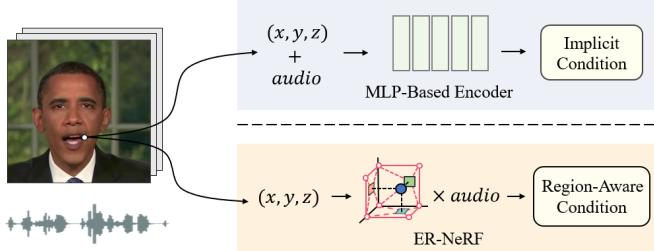  
Figure 1. Instead of learning the implicit audiovisual relation by an MLP-based encoder, we explicitly attend to the cross-modal interaction between speech audio and spatial regions. Region awareness enables ER-NeRF to render more accurate facial motions.

51, 25, 45]. Recently, Neural Radiance Fields (NeRF) [26] is introduced into audio-driven talking portrait synthesis. It provides a new way to learn a direct mapping from the audio feature to the corresponding visual appearance by a deep multi-layer perceptron (MLP). Since then, several studies condition NeRF on audio signals in an end-to-end way [19, 24, 29, 42] or by some intermediate representations [43, 7] to reconstruct a specific talking portrait. Though these vanilla NeRF-based methods have shown great success in the synthesis quality, the inference speed is far from meeting real-time requirements, which seriously limits their practical applications.

Several recent works on efficient neural representation have demonstrated tremendous speedups over vanilla NeRF by replacing part of the MLP network with sparse feature grids [33, 27, 6, 8, 15, 5, 16]. Instant-NGP [27] introduces a hash-encoded voxel grid for static scene modeling, allowing fast speed and high-quality rendering with a compact model. RAD-NeRF [35] first applies this technique to talking portrait synthesis and builds a real-time framework with state-of-the-art performance. However, this approach requires a complex MLP-based grid encoder to learn the regional audio-motion mapping implicitly, which limits its convergence and reconstruction quality.

This paper aims to explore a more effective solution for efficient and high-fidelity talking portrait synthesis. Based on previous studies, we notice that different spatial regions contribute unequally to representing talking portraits: (1) In volumetric rendering, since only the surface regions contribute to representing the dynamic head, most other spatial regions are empty and can be pruned with some efficient NeRF techniques to reduce the training difficulty; (2) As the fact that different facial areas have varying associations with speech audio [24], different spatial regions are inherently related to the audio signal in their own distinct manners and lead to unique audio-driven local motions. Inspired by these observations, we explicitly exploit the unequal contribution of spatial regions to guide the talking portrait modeling, and present a novel Efficient Region-aware talking portrait NeRF (ER-NeRF) framework for realistic and efficient talking portrait synthesis, which achieves high-quality rendering, fast convergence, and real-time inference with small model size.

Our first improvement focuses on the dynamic head representation. Although RAD-NeRF [35] has leveraged Instant-NGP to represent the talking portrait and achieves a fast inference, its rendering quality and convergence are hampered by hash collisions when modeling the 3D dynamic talking head. To address this problem, we introduce a Tri-Plane Hash Representation that factorizes the 3D space into three orthogonal planes via a NeRF-based tri-plane decomposition [6]. During the factorization, all spatial regions are squeezed onto 2D planes, with the corresponding feature grids pruned. Hence, hash collisions only occur in lowdimensional subspaces and are reduced in number. With fewer noises, the network can pay more attention to processing audio features,leading to the capability of reconstructing more accurate head structures and finer dynamic motions.

To capture the regional impact of audio signals, we further explore the relevance between the audio feature and position encoding of the proposed Tri-Plane Hash Representation. Instead of concatenating the raw features and learning the audiovisual correlation by a large MLP-based encoder, we propose a Region Attention Module that adjusts the audio feature to best fit certain spatial regions via a cross-modal attention mechanism. Hence, the dynamic parts of the portrait can acquire more appropriate features to model accurate facial movements, while other static portions remain unaffected by the changing signals. By gaining regional awareness, high-quality and efficient modeling for local motions can be achieved.

Moreover, a simple but effective Adaptive Pose Encoding is proposed in our framework to solve the head-torso separation problem. It maps the complex pose transformation onto spatial coordinates and provides a clearer position relation for torso-NeRF to learn its own pose implicitly.

The main contributions of our work are summarized as

follows:

• We introduce an efficient Tri-Plane Hash Representation to facilitate dynamic head reconstruction, which also achieves high-quality rendering, real-time inference and fast convergence with a compact model size.

• We propose a novel Region Attention Module to capture the correlation between the audio condition and spatial regions for accurate facial motion modeling.

• Extensive experiments show that the proposed ER-NeRF renders realistic talking portraits with high efficiency and visual quality, which outperforms state-of-the-art methods on both objective evaluation and human studies.

## 2. Related Work

2D-Based Talking Portrait Synthesis. Driving talking portraits by arbitrary speech audio is an active research topic in computer vision and computer graphics. This task aims to reenact the specific person with high image quality and audio-visual consistency. Conventional methods [4, 3] define phoneme-mouth correspondence rules and stitch the mouth shapes. Early deep learning-based methods focus on synthesizing the audio-synchronized lip motions for a given facial image [28, 14, 23, 10, 41]. Later, to enhance controllability, intermediate representations like facial landmarks and 3D facial models are utilized in several multistage methods [36, 39, 45, 25]. However, extra errors and information losses would occur in the estimation of these intermediate representations. More recently, diffusion models have been used to improve lip-sync and image quality [44, 30, 32], but they are slow in inference. Due to the lack of an explicit 3D structure representation, 2D-based methods have drawbacks in the naturalness and consistency of head pose control.

NeRF-based Talking Portrait Synthesis. 3D vision techniques aim to learn the 3D structure from images and videos relying on multi-view correspondence, and have been widely developed in many areas [40, 48, 37, 47, 50]. Recently, Neural Radiance Fields (NeRF) [26] has been applied to tackle 3D head structure problems in audio-driven talking portrait synthesis. Earlier works [19, 42, 29, 24] are mainly built on a vanilla NeRF renderer, making them slow and costly for memory. Among them, SSP-NeRF [24] is the first to consider the different impacts of audio on facial areas and adopts a semantic sampling strategy to encourage local motion modeling. By applying Instant-NGP [27], RAD-NeRF [35] has made huge improvements in visual quality and efficiency. Nevertheless, it requires a complex module to handle audio signals. These end-to-end methods take the whole or part of a large MLP network as the encoder to learn the connection between audio and regions, increasing their complexity and training difficulty. Some multistage methods [43, 7] pre-train a model to learn the audiovisual relation by intermediate representations, and utilize a NeRF-based renderer for image generation. However, they are inefficient due to the complex architecture. This paper proposes an efficient NeRF-based method that significantly improves visual quality and audio-lips synchronization.

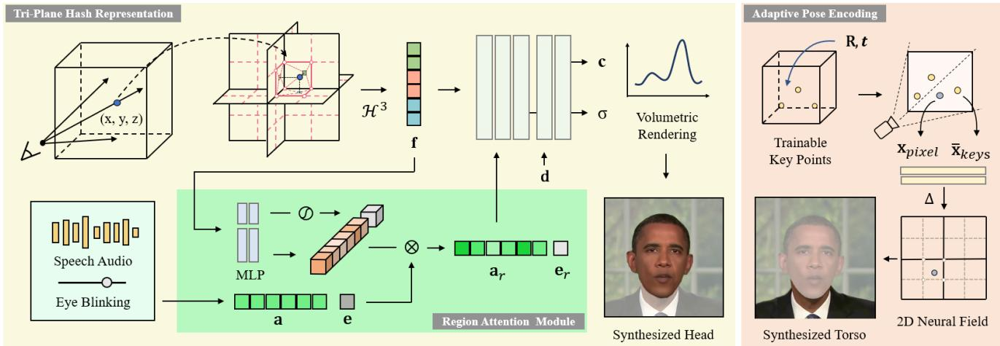  
Figure 2. Overview of ER-NeRF framework. The head part of the talking portrait is modeled by the Tri-Plane Hash Representation. A tri-plane hash encoder $\mathcal { H } ^ { 3 }$ is used to encode the 3D coordinate x into its spatial geometry feature f. The input condition features of speech audio a and eye blinking e are reweighted in channel-level with the Region Attention Module and converted to region-aware condition features $\mathbf { a } _ { r }$ and $\scriptstyle \mathbf { e } _ { r }$ . Then the region-aware features combined with spatial geometry feature f and the view direction d are input into an MLP decoder to predict the color c and density σ of the head. The torso part is rendered by another torso-NeRF with the Adaptive Pose Encoding. The corresponding head pose $\mathbf { P } = \left( \mathbf { R } , t \right)$ is applied to transform the trainable key points to get their normalized 2D coordinates $\bar { \mathbf { X } } _ { k e y s }$ , which conditions a certain 2D Neural Field to predict the torso image.

Efficient Neural Representation. Many reported works focus on the efficiency of NeRF. Recently, several hybrid explicit-implicit representations [6, 8, 27, 33, 17] are proposed for static scene reconstruction and strike a balance between speed and memory cost. In these methods, a high-dimensional scene would be separated and stored into sparse feature grids. Plane-based approaches [6, 8] factorize the space into multiple low-dimensional planes and vectors to get a compact representation. Instant-NGP [27] employs multiple hash tables to store the sparse details in multiresolution, assuming most empty regions have been pruned, which hugely improves memory utilization and rendering quality as well. Although the size of each hash map is usually insufficient for representing all positions in the space, the method does not handle the hash collision explicitly but leaves it to the MLP decoder. These methods are mainly designed for static scenes and are incapable of generating dynamic representation. In the field of dynamic NeRFs, current efficient methods are either focused on how to rebuild the scene along the timeline [5, 16, 31, 8, 15, 38] or can only control some simple deformations [46], both of which are unsuitable for modeling audio-driven talking portrait. By leveraging the advantages of the hash and plan-based methods, we introduce an efficient representation for highquality dynamic head modeling that achieves fast training and inference with small model size.

## 3. Method

## 3.1. Preliminaries and Problem Setting

Given a set of multi-view images and camera poses, NeRF [26] represents a static 3D scene with an implicit function $\mathcal { F } : ( \mathbf { x } , \mathbf { d } )  ( \mathbf { c } , \sigma )$ , where $\mathbf { x } = ( x , y , z )$ is the 3D spatial coordinate and $\mathbf { d } = ( \theta , \phi )$ is the viewing direction. The output $\textbf { c } = ~ ( r , g , b )$ denotes the emitted color and σ is the volume density. The color $C ( \mathbf { r } )$ of one pixel crossed by the ray $\mathbf { r } ( t ) = \mathbf { o } + t \mathbf { d }$ from camera center o can be calculated by aggregating the color c along the ray:

$$
{ \hat { C } } ( r ) = \int _ { t _ { n } } ^ { t _ { f } } \sigma ( \mathbf { r } ( t ) ) \cdot \mathbf { c } ( \mathbf { r } ( t ) , \mathbf { d } ) \cdot T ( t ) d t ,\tag{1}
$$

where $t _ { n }$ and $t _ { f }$ are the near and far bounds. $T ( t )$ is the accumulated transmittance from $t _ { n }$ to t:

$$
T ( t ) = \exp ( - \int _ { t _ { n } } ^ { t } \sigma ( \mathbf { r } ( s ) ) d s ) .\tag{2}
$$

In hash grid-based NeRF [27], a multiresolution hash encoder H is utilized to encode the spacial point by its coordinate x. Therefore, conditioned with the audio feature a, the basic implicit function of hash NeRF-based audiodriven talking portrait synthesis can be formulated as:

$$
\mathcal { F } ^ { A } : ( \mathbf { x } , \mathbf { d } , \mathbf { a } ; \mathcal { H } ) \to ( \mathbf { c } , \sigma ) .\tag{3}
$$

In this paper, we adopt the same basic setting as previous NeRF-based works [19, 24, 35]. Specifically, we use a few minutes of single-person video as the training data, which is captured from the front view by a static camera. The camera’s intrinsic and extrinsic parameters for each frame are calculated from the head poses, which are estimated by a 3DMM model. Audio features are extracted from a pretrained DeepSpeech [20] model. We also employ an off-theshelf semantic parsing method to separate the head, torso, and background for various usages. Moreover, we train and render the head and torso separately for acceleration.

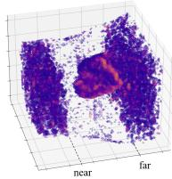

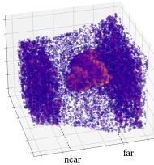  
(a) Static

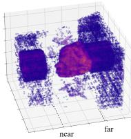  
(b) 3D hash grid  
(c) Tri-hash (ours)  
Figure 3. The visualized occupacy grids. We show the predicted head surfaces according to σ. (a) 3D hash grid without audio condition. $( \mathbf { b } , \mathbf { c } )$ 3D hash grid and our tri-plane hash representation conditioned with audio. The MLP decoder of the 3D hash grid becomes overloaded after being required to handle audio features and learn the dynamic motions at the same time, while our representation can still reconstruct the fine surface.

## 3.2. Tri-Plane Hash Representation

Instant-NGP [27] utilizes a set of hash tables to reduce the number of feature grids for efficient neural representation. Inspired by this idea, RAD-NeRF [35] is developed as a real-time and high-quality talking portrait synthesis framework, which leveraged the hash map to represent the small number of surface regions for the portrait head in multiresolution. However, a general 3D hash grid representation is not natively suitable for our task.

A particular problem is the hash collision. Hashing in Instant-NGP treats every position in 3D space equally, which enhances its expressive ability for complex scenes. Nevertheless, the number of hash collisions linearly increases with the number of sampling points, which makes it a burden for the MLP decoder to solve the conflicting gradients. This problem has little effect when reconstructing static scenes, but for talking portrait synthesis, it gets serious when the MLP decoder needs to handle multiple audio features at the same time, as illustrated in Fig. 3.

Factorization for Hash Grid. Since fewer sampling points always mean lower quality, it’s hard to solve this problem by directly reducing the sampling number per ray. Another thinking is to avoid hash collisions from high dimensions. As previous works have proved that a static 3D space of the head can be represented by three 2D tensors [6], it’s possible to squeeze the dynamic talking head into several low-dimensional subspaces with little information loss. From this perspective, we factorize the 3D spatial feature volume into three orthogonal 2D hash grids.

For a given coordinate $\textbf { x } = ~ ( x , y , z ) ~ \in ~ \mathbb { R } ^ { \mathbf { X } \mathbf { Y } \mathbf { Z } }$ , we separately encode its projected coordinates by three 2Dmultiresolution hash encoders [27]:

$$
\mathcal { H } ^ { \mathbf { A B } } : ( a , b )  \mathbf { f } _ { a b } ^ { \mathbf { A B } }\tag{4}
$$

where the output $\mathbf { f } _ { a b } ^ { \mathbf { A B } } \in \mathbb { R } ^ { L F }$ is the plane-level geometry feature for the projected coordinate $( a , b )$ and $\mathcal { H } ^ { \mathbf { A B } }$ is the multiresolution hash encoder for plane $\bf \mathbb { R } ^ { A B }$ , with the number of levels $L ,$ feature dimensions per entry $F .$ Then we concatenate the results to get the final geometry feature $\mathbf { f } _ { g } \in \mathbb { R } ^ { 3 \times L F }$

$$
\mathbf { f } _ { \mathbf { x } } = \mathcal { H } ^ { \mathbf { X Y } } ( x , y ) \oplus \mathcal { H } ^ { \mathbf { Y Z } } ( y , z ) \oplus \mathcal { H } ^ { \mathbf { X Z } } ( x , z ) .\tag{5}
$$

The symbol ⊕ denotes the concatenation operator that concatenates features into a $3 \times L F .$ -channel vector.

Our proposed factorization significantly reduces hash collision, as now the collision only occurs in 2D planes. Assuming a common situation that the query rays are almost perpendicular to the frontal plane, the collision can be reduced from $O ( R ^ { 2 } N )$ to $O ( R ^ { 2 } + 2 R N )$ , where $R ^ { 2 }$ is the number of target pixels and N is the sampling number. With a usual setting of $N = 1 6$ and $R \approx 2 5 6$ in RAD-NeRF [35], our representation can ideally achieve a $5 \times$ reduction in hash collision with the same model size. This reduction enables the MLP decoder to focus more on processing audio features, leading to improved convergence and dynamic rendering quality.

Overall Head Representation. The input to the MLP decoder consists of $\mathbf { f _ { x } } ,$ the view direction d and a dynamic condition feature set D including audio feature. The implicit function of the tri-plane hash representation can be formulated as:

$$
\mathcal { F } ^ { \mathcal { H } } : ( \mathbf { x } , \mathbf { d } , \mathcal { D } ; \mathcal { H } ^ { 3 } )  ( \mathbf { c } , \sigma ) ,\tag{6}
$$

where $\mathcal { H } ^ { 3 } : \mathbf { x }  \mathbf { f } _ { \mathbf { x } }$ denotes a tri-plane hash encoder consisting of all of three planar hash encoders in Eq. 4.

## 3.3. Region Attention Module

Dynamic conditions like audio seldom influence the whole portrait equally. Hence, learning how these conditions affect different regions of the portrait is essential for generating natural facial movements. Many previous works [19, 24, 42] ignore this point at the feature level and use some costly approaches to learn the correlation implicitly. By leveraging the multi-resolution regional information stored in the hash encoder, we introduce a lightweight region attention mechanism to explicitly fetch the relations between the dynamic feature and different spatial regions.

Region Attention Mechanism. The region attention mechanism involves an external attention step to calculate the attention vector and a cross-modal channel attention step for reweighting. We aim to connect the dynamic condition feature with the multiresolution geometry feature $\mathbf { f _ { x } } \in \mathbb { R } ^ { N }$ , which is encoded by the hash encoder H for a spatial point x. However, since this hierarchical feature is constructed by concatenation, no explicit information flow exists during encoding.

To improve the regional information exchange between different levels of $\mathbf { f _ { x } }$ efficiently, and further discriminate the importance of audio for each region via the norm of the attention vector, we use a two-layer MLP to capture the global context of the space. Hence it can be explained as the form of external attention mechanism [18] with two external memory units $M _ { k }$ and $M _ { v }$ for individual levels connection and self-condition query:

$$
\begin{array} { c } { { A = \mathrm { R e L U } ( F M _ { k } ^ { T } ) , } } \\ { { { \cal V } _ { o u t } = A M _ { v } . } } \end{array}\tag{7}
$$

where vector $\mathbf { f _ { x } }$ is viewed as an matrix $\boldsymbol { F } \in \mathbb { R } ^ { N \times 1 }$

Then, similar to the channel attention mechanism proposed by Hu et al. [22], we treat the resulting feature $\bar { V } _ { o u t } \ \in \ \mathbf { \bar { \mathbb { R } } } ^ { O \times 1 }$ as the region attention vector $\textbf { v } \in \mathbb { R } ^ { O }$ to reweight each channel of the dynamic condition feature $\mathbf { q } \in \mathbb { R } ^ { O }$ . Finally, the output feature vector is:

$$
\mathbf { q } _ { o u t } = \mathbf { v } \odot \mathbf { q }\tag{8}
$$

where ⊙ denotes the Hadamard product. The resulting region-aware feature $\mathbf { q } _ { o u t }$ at each channel is related to hieratical regions where x is located, since the region attention vector v includes an informative multi-resolution representation of the space. Therefore, the multi-resolution spatial region can decide which part of the information in q should be kept or enhanced.

Speech Audio. For audio signals, given a query coordinate x and an audio feature $\mathbf { a } \in \mathbb { R } ^ { A }$ , we calculate the geometry feature of x by the tri-plane hash encoder $\mathcal { H } ^ { 3 }$ of our triplane hash representation. Then we feed it into a two-layer MLP to generate the region attention vector $\mathbf { v } _ { a , \mathbf { x } } ~ \in ~ \mathbb { R } ^ { A }$ for audio with the same number of channels A. After that, channel-wise attention is applied to a by $\mathbf { v } _ { a , \mathbf { x } } \colon$

$$
\begin{array} { r l } & { \mathbf { v } _ { a , \mathbf { x } } = \mathrm { M L P } _ { a } ( \mathcal { H } ^ { 3 } ( \mathbf { x } ) ) , } \\ & { \mathbf { a } _ { r , \mathbf { x } } = \mathbf { v } _ { a , \mathbf { x } } \odot \mathbf { a } . } \end{array}\tag{9}
$$

During training, in regions that vary with the audio, the attention vector $\mathbf { v } _ { a , \mathbf { x } }$ is optimized for better utilization of the audio feature a. Instead, for the static parts, the audio conditions are considered noises and $\mathbf { v } _ { a , \mathbf { x } }$ is going to be a zero vector to help denoising the useless information.

Eye Blinking. We also apply the mechanism for explicit eye blinking control. We use a scalar to describe the action of eye blinking and regard it as a vector e with one dimension. Differently, the region attention vector $\mathbf { v } _ { e } \in \mathbb { R } ^ { 1 }$ for eye blinking is output by a sigmoid layer:

$$
\begin{array} { r l } & { \mathbf { v } _ { e , \mathbf { x } } = \mathrm { M L P } _ { e } ( \mathcal { H } ^ { 3 } ( \mathbf { x } ) ) , } \\ & { \mathbf { e } _ { r , \mathbf { x } } = \mathbf { e } \cdot \mathrm { S i g m o i d } ( \mathbf { v } _ { e , \mathbf { x } } ) . } \end{array}\tag{10}
$$

The result $\mathbf { e } _ { r , \mathbf { x } }$ is scaled by $\mathbf { v } _ { e , \mathbf { x } }$ according to its geometry position. In the region of the eyes, $\mathbf { e } _ { r , \mathbf { x } }$ conditions the ap-

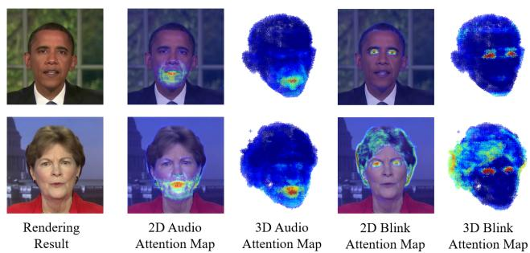  
Figure 4. Visualization of Region Attention Module. Even if influenced by some uncertain details like fluffy hair, our region attention module successfully captures the relation between dynamic conditions and spatial regions without explicit annotation.

pearance significantly and is close to e for maximizing its effect. Otherwise, it tends to become 0 to reduce the negative interference.

## 3.4. Training Details

Adaptive Pose Encoding. To solve the head-torso separation problem, we make an improvement based on previous works [35, 43]. Instead of directly using the whole image or pose matrix as the condition, we map the complex transformation of the head pose into the coordinates of several key points that have clearer position information, and lead the torso-NeRF to learn an implicit torso pose from these coordinates.

The encoding process is very simple. We initialize N points in the 3D canonical space with trainable homogeneous coordinates $\mathbf { X } _ { k e y s } ~ \in ~ \mathbb { R } ^ { 4 \times N }$ and apply the head pose $\mathbf { P } ~ = ~ ( \mathbf { R } , t )$ to transform the key points $\hat { \mathbf { X } } _ { k e y s } ~ =$ $\mathbf { P } ^ { - 1 } \mathbf { X } _ { k e y s }$ . Then we project $\hat { \mathbf { X } } _ { k e y s }$ onto the image plane and get the 2D coordinates $\bar { \mathbf { X } } _ { k e y s } \in \mathbb { R } ^ { 2 \times N }$ which are the final encoding results to condition the torso-NeRF. In this work, we use $N = 3$ and a 2D deformable neural field [35] to render the pixel-wise color of the torso .1

Coarse-to-Fine Optimization. We apply a two-staged coarse-to-fine training process for better image quality. At the coarse stage, we follow the vanilla NeRF to use the MSE loss for the predicted color Cˆ(r) of the image I:

$$
\mathcal { L } _ { c o a r s e } = \sum _ { \mathrm { i } \in \mathcal { T } } \left\| C ( \mathrm { i } ) - \hat { C } ( \mathrm { i } ) \right\| _ { 2 } ^ { 2 } .\tag{11}
$$

Since MSE loss has a weakness in optimizing sharp details, we then apply an overall finetune with LPIPS loss [49]. Similar to RAD-NeRF [35], we randomly sample a set of patches $\mathcal { P }$ from the whole image and combine the LPIPS loss by a weight λ to enhance details:

$$
\mathcal { L } _ { f i n e } = \sum _ { \mathrm { i } \in \mathcal { P } } \Big \Vert C ( \mathrm { i } ) - \hat { C } ( \mathrm { i } ) \Big \Vert _ { 2 } ^ { 2 } + \lambda \mathrm { L P I P S } ( \hat { \mathcal { P } } , \mathcal { P } ) .\tag{12}
$$

<table><tr><td>Methods Ground Truth</td><td>PSNR ↑ N/A</td><td>LPIPS↓ 0</td><td>FID↓ 0</td><td>LMD↓ 0</td><td>AUE↓ 0</td><td>Sync ↑ 7.584</td><td>Time -</td><td>FPS -</td><td>Size (MB) -</td></tr><tr><td>Wav2Lip [28]</td><td></td><td></td><td>31.08</td><td>5.124</td><td>3.861</td><td>8.576</td><td>-</td><td>19</td><td>&gt;400</td></tr><tr><td>PC-AVS [51]</td><td>18.25</td><td>0.2440</td><td>101.97</td><td>4.816</td><td>3.142</td><td>8.397</td><td></td><td>32</td><td>&gt;500</td></tr><tr><td>AD-NeRF [19]</td><td>30.75</td><td>0.1034</td><td>18.60</td><td>3.345</td><td>2.201</td><td>5.205</td><td>18h</td><td>0.13</td><td>5.21</td></tr><tr><td>RAD-NeRF [35]</td><td>33.13</td><td>0.0519</td><td>12.05</td><td>2.812</td><td>2.102</td><td>5.052</td><td>5h</td><td>32</td><td>11.8</td></tr><tr><td>RAD-NeRF†</td><td>33.26</td><td>0.0486</td><td>12.20</td><td>2.802</td><td>1.750</td><td>5.197</td><td>-</td><td>-</td><td>一</td></tr><tr><td>ER-NeRF (Ours)</td><td>33.10</td><td>0.0291</td><td>10.42</td><td>2.740</td><td>1.629</td><td>5.708</td><td>2h</td><td>34</td><td>2.51</td></tr></table>

† using AU45 and overall LPIPS finetune.

## 4. Experiments

## 4.1. Experimental Settings

Dataset. For a fair comparison, the dataset for our experiments is obtained from publicly-released video sets [19, 24, 29]. We collect four high-definition speaking video clips with an average length of about 6500 frames in 25 FPS. Each raw video is cropped and resized to $5 1 2 \times 5 1 2$ with a center portrait, except the one from AD-NeRF [19] with the size of 450 × 450. A pre-trained DeepSpeech model is used to extract the basic audio feature from the speech audio.

Comparison Baselines. We compare our method with recent representative one-shot and person-specific models, including Wav2Lip [28], PC-AVS [51], NVP [36], LSP [25] and SynObama [34]. In addition, we also compare our method with the three end-to-end NeRF-based models: AD-NeRF [19], SSP-NeRF, and RAD-NeRF [24]. Furthermore, we evaluate our method directly on the Ground Truth to provide a clearer comparison.

Implementation Details. We implement our method on PyTorch. For a specific portrait, we train the head part for 100, 000 and 25, 000 iterations at the coarse and the fine stage, respectively. In each iteration, we randomly sample a batch of $2 5 6 ^ { 2 }$ rays from one image. Each 2D hash encoder is set with $L = 1 4 , F = 1$ , and with resolutions from 64 to 512. The torso part is trained separately for another 100, 000 iterations. We use AdamW optimizer for both networks with a learning rate of 0.01 for hash encoders and 0.001 for other modules. For the control of eye blinking, we choose AU45 [13] to describe the degree of the action. All experiments are performed on a single RTX 3080Ti GPU. Both the training for the head and torso take about 2 hours.

## 4.2. Quantitative Evaluation

Metrics. We employ Peak Signal-to-Noise Ratio (PSNR) to measure the overall image quality and Learned Perceptual Image Patch Similarity (LPIPS) [49] to measure the details. As we have already used the LPIPS during training, for a fair comparison, an additional feature-based loss Fréchet Inception Distance (FID) [21] is involved for evaluating image quality. We also utilize the landmark distance

Table 1. The quantitative results of the head reconstruction setting. The best results are in bold. Since Wav2Lip can see the ground truth during the self-driven evaluation, we provide another clip of video as the image input. Hence PSNR and LPIPS are not valid. The inference FPS of NeRF-based methods is tested on the Obama dataset [19] under the resolution of $4 5 0 \times 4 5 0 .$
<table><tr><td rowspan="2">Methods</td><td colspan="2">Testset A</td><td colspan="2">Testset B</td></tr><tr><td>LMD↓ 0</td><td>Sync ↑ 6.701</td><td>LMD↓ 0</td><td>Sync ↑ 7.309</td></tr><tr><td>Ground Truth</td><td></td><td></td><td></td><td></td></tr><tr><td>Wav2Lip [28] PC-AVS [51]</td><td>6.221</td><td>8.378</td><td>7.393</td><td>8.966</td></tr><tr><td></td><td>7.112</td><td>8.087</td><td>7.722</td><td>8.565</td></tr><tr><td>SynObama [34]</td><td>6.540</td><td>6.802</td><td>7.954</td><td>4.313</td></tr><tr><td>NVP [36] LSP [25]</td><td>5.905</td><td>4.287</td><td>8.122</td><td>5.843</td></tr><tr><td></td><td></td><td></td><td></td><td></td></tr><tr><td>AD-NeRF [19]</td><td>6.192 6.332</td><td>5.195 5.422</td><td>8.006</td><td>4.316</td></tr><tr><td>SSP-NeRF [24] RAD-NeRF [35]</td><td>6.357</td><td>6.186</td><td>8.332</td><td>6.680</td></tr><tr><td>RAD-NeRF†</td><td>6.339</td><td>6.119</td><td>8.355</td><td>6.392</td></tr><tr><td>Ours</td><td>6.254</td><td>6.242</td><td>8.150</td><td>6.830</td></tr></table>

† using AU45 and overall LPIPS finetune.

Table 2. The quantitative results of lip synthchronization setting. The best overall results and the best NeRF-based methods are in bold and underline, respectively.

(LMD) [9] and SyncNet confidence score (Sync) [11, 12] for lip synchronization and action units error (AUE) [2, 1] to evaluate face motion accuracy.

Comparison Settings. In quantitative evaluation, we focus on the synthesized quality of the head. Our comparisons are divided into two settings: 1) The head reconstruction setting, where we split each video into training and test dataset to evaluate the reconstruction quality of the head for a specific portrait. 2) The lip synchronization setting, where we use the audio track of unseen videos to drive all methods for comparisons in lip synchronization.

For the first setting, we use all videos in the collected dataset described in Sec. 4.1 and split each video for both training and evaluation. For the second setting, we extract two audio clips from the public demos of NVP and SynObama, named Testset A and Testset B. Due to the lack of pre-trained models and codes for NVP, SynObama, and SSP-NeRF, we also get their generated videos from released demos for evaluation. Following previous works [19, 24, 35], we train our method and other baselines on the Obama dataset released with AD-NeRF [19]. For each generated result, we crop and rescaled the facial area into the same size for a fair comparison.

Ours  
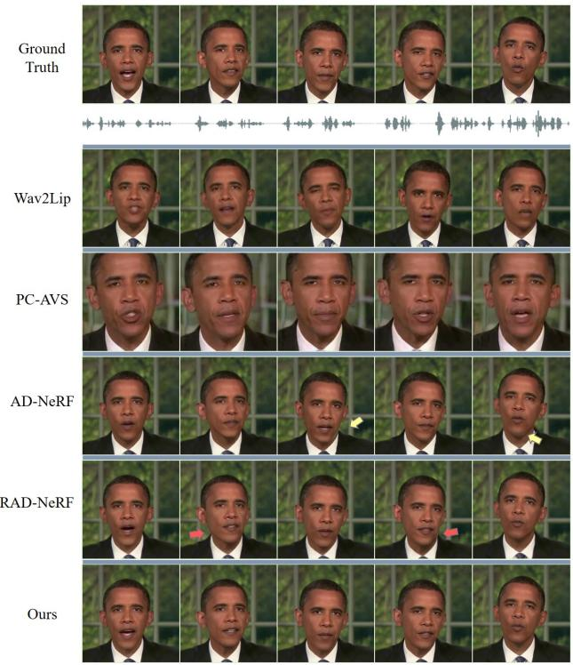

Ground Truth  
RAD-NeRF  
AD-NeRF  
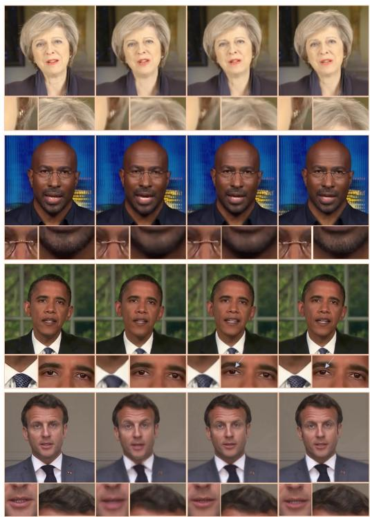

Figure 5. The comparison of the key frames and details of generated portraits. We show the generated results of the baseline [28, 51, 19, 35] under the head reconstruction setting and the ground truth. For NeRF-based methods, we also synthesize the torso part for evaluation. Please zoom in for better visualization.
<table><tr><td>Methods</td><td>Wav2Lip [28]</td><td>PC-AVS [51]</td><td>SynObama [34]</td><td>LSP [25]</td><td>NVP [36]</td><td>AD-NeRF [19]</td><td>RAD-NeRF [35]</td><td>ER-NeRF (Ours)</td></tr><tr><td>Lip-sync Accuracy</td><td>2.67</td><td>2.50</td><td>3.56</td><td>2.67</td><td>2.83</td><td>3.25</td><td>3.81</td><td>4.14</td></tr><tr><td>Image Quality</td><td>1.92</td><td>1.83</td><td>4.22</td><td>3.83</td><td>3.75</td><td>3.33</td><td>3.69</td><td>4.08</td></tr><tr><td>Video Realness</td><td>1.89</td><td>1.83</td><td>3.33</td><td>2.92</td><td>3.50</td><td>3.02</td><td>3.47</td><td>3.86</td></tr></table>

Table 3. User Study. The rating is of scale 1-5, the higher the better. We highlight the best and second best results.

Evaluation Results. The results of the head reconstruction setting and lip synchronization setting are shown in Table 1 and Table 2, respectively. It can be observed that: (1) In the head reconstruction setting, our method achieves the best reconstruction quality in vision and lip synchronization. Although the one-shot methods (Wav2Lip and PC-AVS) perform best in Sync and can synthesize talking heads without per-scene training, they get poor scores in other metrics, which shows that they cannot accurately reconstruct the specific portrait. For a fair comparison, we also apply the overall LPIPS finetune and AU45 [13] to RAD-NeRF to enhance its image quality and eye blinking but cause no obvious improvement in image details. Our ER-NeRF performs the best in most metrics while reaching a higher score than other baselines in Sync. The results show that our method can synthesize realistic portraits with high lip-sync accuracy. (2) In the lip synchronization setting, our method shows an excellent generalization ability to synthesize lipsync talking portraits. AD-NeRF and SSP-NeRF encounter an over-smoothing lip movement, leading to a high LMD score but low SyncNet confidence. While getting the highest Sync score among NeRF-based methods, our method exceeds some representative baselines in lip synchronization. (3) Our method reaches real-time inference, with a faster training time and smaller model size. In Table 1, we report the inference FPS, model size and the time cost for training person-specific models. In comparison, our ER-NeRF achieves the best performance in all three metrics, which demonstrates its high efficiency.

## 4.3. Qualitative Evaluation

Evaluation Results. For an intuitive comparison of the whole portrait, we show the key frames of a clip and details of four portraits in Figure 5. For NeRF-based methods, we synthesize the torso part to evaluate the whole portrait. The result shows that our ER-NeRF renders more details and has the highest personalized lip-sync accuracy. Although Wav2Lip and PC-AVS achieve a high score in Sync, their generated results have an obvious gap from the ground truth. To evaluate the torso part, all three NeRFbased methods render the torso and head separately. AD-NeRF severely suffers from head-torso separation (yellow arrow), and the torso of RAD-NeRF also fails to align with the head sometimes (red arrow). With the same basic representation for the torso as RAD-NeRF, our method demonstrates higher robustness and quality thanks to the design of Adaptive Pose Encoding.

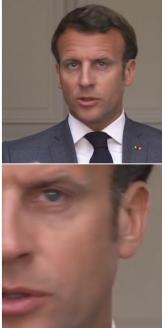

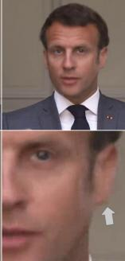

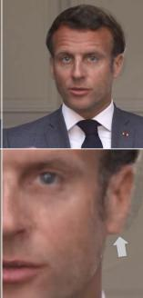  
AD-NeRF  
Ground Truth

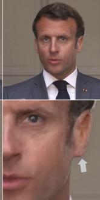  
RAD-NeRF  
Ours  
Figure 6. Evaluation of the out-of-range pose. Even with a more compact representation, our method can still render accurate structure at a large rotation angle which is rare in the training video.

In addition, we also compare results with some out-ofrange poses, as shown in Figure 6. Despite having pruned most feature grids, our method performs the best in image quality and structure accuracy, which means the robustness and efficiency of our Tri-Plane Hash Representation.

User Study We conducted a user study to better judge the visual quality of the generated heads. We sample 28 generated video clips from the quantitative evaluation, and invite 18 attendees to join the study. The Mean Opinion Scores (MOS) rating protocol is adopted for evaluation and the attendees are required to rate the generated videos from three aspects: (1) Lip-sync Accuracy; (2) Video Realness; (3) Image Quality. The average scores of each method are shown in Table 3. Our ER-NeRF performs the best in lip-sync accuracy and realness. For image quality, only SynObama [34] gets a higher score than our method, which however relies on a large number of training videos and cannot render in real-time. The results show the excellent visual quality of our method for high-fidelity talking portrait synthesis.

## 4.4. Ablation Study

In this section, we report the ablation study under the head reconstruction setting to prove the effectiveness of our two main contributions. We test settings of different backbones, dynamic feature integration methods and attention targets. The results are shown in Table 4 and Table 5.

Representation. We evaluate three representation backbones on the quality of head reconstruction. The first is an MLP-based network, which is the same as AD-NeRF [19]. For grid-based backbones, we compare our tri-hash representation with pure tri-plane in EG3D [6] and the Instant-NGP [27] 3D hash grid that is used in RAD-NeRF [35]. Due to our specialized architecture, the proposed tri-hash representation achieves the best image quality and makes a significant improvement in lip synchronization.

<table><tr><td>Backbone</td><td>Concat Att.</td><td>PSNR↑</td><td>LPIPS↓</td><td>LMD↓</td><td>AUE↓</td><td>Sync↑</td></tr><tr><td>MLP</td><td>√</td><td>30.75</td><td>0.103</td><td>3.345</td><td>2.201</td><td>5.205</td></tr><tr><td>Pure Tri-Plane</td><td>√</td><td>32.11</td><td>0.033</td><td>2.960</td><td>1.812</td><td>4.441</td></tr><tr><td></td><td>√</td><td>33.14</td><td>0.030</td><td>2.825</td><td>1.677</td><td>5.233</td></tr><tr><td rowspan="2">iNGP [27]</td><td>√</td><td>33.05</td><td>0.031</td><td>2.919</td><td>1.729</td><td>4.664</td></tr><tr><td>√</td><td>33.12</td><td>0.030</td><td>2.810</td><td>1.689</td><td>5.257</td></tr><tr><td rowspan="2">Tri-Hash</td><td>√</td><td>33.25</td><td>0.029</td><td>2.881</td><td>1.634</td><td>5.123</td></tr><tr><td>√</td><td>33.10</td><td>0.029</td><td>2.740</td><td>1.646</td><td>5.708</td></tr></table>

Table 4. Ablation Study on Tri-Plane Hash Representation and Region Attention Module.
<table><tr><td>Type</td><td>PSNR ↑</td><td>LPIPS ↓</td><td>LMD↓</td><td>AUE↓</td><td>Sync ↑</td></tr><tr><td>Feature-Wise</td><td>33.14</td><td>0.030</td><td>2.781</td><td>1.650</td><td>5.465</td></tr><tr><td>Channel-Wise</td><td>33.10</td><td>0.029</td><td>2.740</td><td>1.646</td><td>5.708</td></tr></table>

Table 5. Ablation Study on types of attention.

Region Attention Module. We evaluate the region attention mechanism on two backbones compared with directly concatenating. The results show the enormous impact of our method on modeling accurate motions. Note that by only using our attention mechanism with existing backbones, we can get better scores in both image quality and lip synchronization than current state-of-the-art methods with half of the training time and fewer parameters, which shows the high efficiency of our attention mechanism.

Attention Type. In Table 5, we compare three types of attention for the region attention mechanism: feature-wise and channel-wise. Feature-wise attention scales the entire audio feature with a one-dimensional attention vector, while channel-wise reweights each channel, as described in Section 3.3. The outperforming of channel-wise attention indicates that the proposed region attention mechanism successfully captures the distinct impacts of spatial regions and significantly improves lip motion quality.

## 5. Ethical Consideration

We hope our ER-NeRF can enhance interactive experiences and benefits human beings. However, it could be misused for some malicious purposes. As part of our responsibility, we will share our generated results to help develop stronger deepfake detectors. We believe that the responsible use of this technique can promote the healthy growth of both machine learning research and the digital industry.

## 6. Conclusion

In this paper, We propose an efficient and effective framework ER-NeRF for high-quality talking portrait synthesis, mainly consisting of a Tri-Plane Hash Representation and a Region Attention Module. Our framework achieves significant improvement in realistic talking portrait synthesis with higher efficiency. Due to the space limitation, we have put the discussion in the supplementary material. We hope our work can benefit human beings and also inspire more novel conditional NeRF techniques.

Acknowledgments. In this work, Jiahe Li, Jiawei Zhang and Xiao Bai are supported by the National Natural Science Foundation of China (No. 62276016), Lin Gu is supported by JST Moonshot R&D Grant Number JPMJMS2011, Japan.

## References

[1] Tadas Baltrušaitis, Marwa Mahmoud, and Peter Robinson. Cross-dataset learning and person-specific normalisation for automatic action unit detection. In 2015 11th IEEE International Conference and Workshops on Automatic Face and Gesture Recognition (FG), volume 6, pages 1–6. IEEE, 2015. 6

[2] Tadas Baltrusaitis, Amir Zadeh, Yao Chong Lim, and Louis-Philippe Morency. Openface 2.0: Facial behavior analysis toolkit. In 2018 13th IEEE international conference on automaticface & gesture recognition (FG 2018), pages 59–66. IEEE, 2018. 6

[3] Matthew Brand. Voice puppetry. In Proceedings of the 26th annual conference on Computer graphics and interactive techniques, pages 21–28, 1999. 2

[4] Christoph Bregler, Michele Covell, and Malcolm Slaney. Video rewrite: Driving visual speech with audio. In Proceedings ofthe 24th annual conference on Computer graphics and interactive techniques, pages 353–360, 1997. 2

[5] Ang Cao and Justin Johnson. Hexplane: A fast representation for dynamic scenes. In Proceedings of the IEEE/CVF Conference on Computer Vision and Pattern Recognition, pages 130–141, 2023. 1, 3

[6] Eric R Chan, Connor Z Lin, Matthew A Chan, Koki Nagano, Boxiao Pan, Shalini De Mello, Orazio Gallo, Leonidas J Guibas, Jonathan Tremblay, Sameh Khamis, et al. Efficient geometry-aware 3d generative adversarial networks. In Proceedings of the IEEE/CVF Conference on Computer Vision and Pattern Recognition, pages 16123–16133, 2022. 1, 2, 3, 4, 8

[7] Aggelina Chatziagapi, ShahRukh Athar, Abhinav Jain, Rohith Mysore Vijaya Kumar, Vimal Bhat, and Dimitris Samaras. Lipnerf: What is the right feature space to lip-sync a nerf. In International Conference on Automatic Face and Gesture Recognition 2023, 2023. 1, 2

[8] Anpei Chen, Zexiang Xu, Andreas Geiger, Jingyi Yu, and Hao Su. Tensorf: Tensorial radiance fields. In Computer Vision–ECCV 2022: 17th European Conference, Tel Aviv, Israel, October 23–27, 2022, Proceedings, Part XXXII, pages 333–350. Springer, 2022. 1, 3

[9] Lele Chen, Zhiheng Li, Ross K Maddox, Zhiyao Duan, and Chenliang Xu. Lip movements generation at a glance. In Computer Vision–ECCV 2018: 15th European Conference, Munich, Germany, September 8–14, 2018, Proceedings, Part VII 15, pages 538–553. Springer, 2018. 6

[10] Lele Chen, Ross K Maddox, Zhiyao Duan, and Chenliang Xu. Hierarchical cross-modal talking face generation with dynamic pixel-wise loss. In Proceedings of the IEEE/CVF conference on computer vision and pattern recognition, pages 7832–7841, 2019. 1, 2

[11] Joon Son Chung and Andrew Zisserman. Lip reading in the wild. In Computer Vision–ACCV 2016: 13th Asian Conference on Computer Vision, Taipei, Taiwan, November 20- 24, 2016, Revised Selected Papers, Part II 13, pages 87–103. Springer, 2017. 6

[12] Joon Son Chung and Andrew Zisserman. Out of time: Automated lip sync in the wild. In Computer Vision–ACCV 2016 Workshops: ACCV 2016 International Workshops, Taipei, Taiwan, November 20-24, 2016, Revised Selected Papers, Part II 13, pages 251–263. Springer, 2017. 6

[13] Paul Ekman and Wallace V. Friesen. Facial Action Coding System: Manual. Palo Alto: Consulting Psychologists Press, 1978. 6, 7

[14] Tony Ezzat, Gadi Geiger, and Tomaso Poggio. Trainable videorealistic speech animation. ACM Transactions on Graphics (TOG), 21(3):388–398, 2002. 2

[15] Jiemin Fang, Taoran Yi, Xinggang Wang, Lingxi Xie, Xiaopeng Zhang, Wenyu Liu, Matthias Nießner, and Qi Tian. Fast dynamic radiance fields with time-aware neural voxels. In SIGGRAPHAsia 2022 Conference Papers, pages 1–9, 2022. 1, 3

[16] Sara Fridovich-Keil, Giacomo Meanti, Frederik Rahbæk Warburg, Benjamin Recht, and Angjoo Kanazawa. K-planes: Explicit radiance fields in space, time, and appearance. In Proceedings of the IEEE/CVF Conference on Computer Vision and Pattern Recognition, pages 12479–12488, 2023. 1, 3

[17] Sara Fridovich-Keil, Alex Yu, Matthew Tancik, Qinhong Chen, Benjamin Recht, and Angjoo Kanazawa. Plenoxels: Radiance fields without neural networks. In Proceedings of the IEEE/CVF Conference on Computer Vision and Pattern Recognition, pages 5501–5510, 2022. 3

[18] Meng-Hao Guo, Zheng-Ning Liu, Tai-Jiang Mu, and Shi-Min Hu. Beyond self-attention: External attention using two linear layers for visual tasks. IEEE Transactions on Pattern Analysis and Machine Intelligence, 2022. 5

[19] Yudong Guo, Keyu Chen, Sen Liang, Yong-Jin Liu, Hujun Bao, and Juyong Zhang. Ad-nerf: Audio driven neural radiance fields for talking head synthesis. In Proceedings of the IEEE/CVF International Conference on Computer Vision, pages 5784–5794, 2021. 1, 2, 3, 4, 6, 7, 8

[20] Awni Hannun, Carl Case, Jared Casper, Bryan Catanzaro, Greg Diamos, Erich Elsen, Ryan Prenger, Sanjeev Satheesh, Shubho Sengupta, Adam Coates, et al. Deep speech: Scaling up end-to-end speech recognition. arXiv preprint arXiv:1412.5567, 2014. 4

[21] Martin Heusel, Hubert Ramsauer, Thomas Unterthiner, Bernhard Nessler, and Sepp Hochreiter. Gans trained by a two time-scale update rule converge to a local nash equilibrium. Advances in neural information processing systems, 30, 2017. 6

[22] Jie Hu, Li Shen, and Gang Sun. Squeeze-and-excitation networks. In Proceedings of the IEEE conference on computer vision and pattern recognition, pages 7132–7141, 2018. 5

[23] Amir Jamaludin, Joon Son Chung, and Andrew Zisserman. You said that?: Synthesising talking faces from audio. International Journal of Computer Vision, 127:1767–1779, 2019. 2

[24] Xian Liu, Yinghao Xu, Qianyi Wu, Hang Zhou, Wayne Wu, and Bolei Zhou. Semantic-aware implicit neural audiodriven video portrait generation. In Computer Vision–ECCV 2022: 17th European Conference, Tel Aviv, Israel, October 23–27, 2022, Proceedings, Part XXXVII, pages 106–125. Springer, 2022. 1, 2, 3, 4, 6

[25] Yuanxun Lu, Jinxiang Chai, and Xun Cao. Live speech portraits: Real-time photorealistic talking-head animation. ACM Trans. Graph., 40(6), dec 2021. 1, 2, 6, 7

[26] Ben Mildenhall, Pratul P Srinivasan, Matthew Tancik, Jonathan T Barron, Ravi Ramamoorthi, and Ren Ng. Nerf: Representing scenes as neural radiance fields for view synthesis. In European Conference on Computer Vision, pages 405–421. Springer, 2020. 1, 2, 3

[27] Thomas Müller, Alex Evans, Christoph Schied, and Alexander Keller. Instant neural graphics primitives with a multiresolution hash encoding. ACM Transactions on Graphics (ToG), 41(4):1–15, 2022. 1, 2, 3, 4, 8

[28] KR Prajwal, Rudrabha Mukhopadhyay, Vinay P Namboodiri, and CV Jawahar. A lip sync expert is all you need for speech to lip generation in the wild. In Proceedings of the 28th ACM International Conference on Multimedia, pages 484–492, 2020. 1, 2, 6, 7

[29] Shuai Shen, Wanhua Li, Zheng Zhu, Yueqi Duan, Jie Zhou, and Jiwen Lu. Learning dynamic facial radiance fields for few-shot talking head synthesis. In Computer Vision–ECCV 2022: 17th European Conference, Tel Aviv, Israel, October 23–27, 2022, Proceedings, Part XII, pages 666–682. Springer, 2022. 1, 2, 6

[30] Shuai Shen, Wenliang Zhao, Zibin Meng, Wanhua Li, Zheng Zhu, Jie Zhou, and Jiwen Lu. Difftalk: Crafting diffusion models for generalized audio-driven portraits animation. In Proceedings of the IEEE/CVF Conference on Computer Vision and Pattern Recognition, pages 1982–1991, 2023. 2

[31] Liangchen Song, Anpei Chen, Zhong Li, Zhang Chen, Lele Chen, Junsong Yuan, Yi Xu, and Andreas Geiger. Nerfplayer: A streamable dynamic scene representation with decomposed neural radiance fields. arXiv preprint arXiv:2210.15947, 2022. 3

[32] Michał Stypułkowski, Konstantinos Vougioukas, Sen He, Maciej Zi˛eba, Stavros Petridis, and Maja Pantic. Diffused heads: Diffusion models beat gans on talking-face generation. arXiv preprint arXiv:2301.03396, 2023. 2

[33] Cheng Sun, Min Sun, and Hwann-Tzong Chen. Direct voxel grid optimization: Super-fast convergence for radiance fields reconstruction. In Proceedings ofthe IEEE/CVF Conference on Computer Vision and Pattern Recognition, pages 5459– 5469, 2022. 1, 3

[34] Supasorn Suwajanakorn, Steven M Seitz, and Ira Kemelmacher-Shlizerman. Synthesizing obama: learning lip sync from audio. ACM Transactions on Graphics (ToG), 36(4):1–13, 2017. 6, 7, 8

[35] Jiaxiang Tang, Kaisiyuan Wang, Hang Zhou, Xiaokang Chen, Dongliang He, Tianshu Hu, Jingtuo Liu, Gang Zeng, and Jingdong Wang. Real-time neural radiance talking portrait synthesis via audio-spatial decomposition. arXiv preprint arXiv:2211.12368, 2022. 1, 2, 3, 4, 5, 6, 7, 8

[36] Justus Thies, Mohamed Elgharib, Ayush Tewari, Christian Theobalt, and Matthias Nießner. Neural voice puppetry: Audio-driven facial reenactment. In Computer Vision–ECCV 2020: 16th European Conference, Glasgow, UK, August 23–28, 2020, Proceedings, Part XVI 16, pages 716–731. Springer, 2020. 1, 2, 6, 7

[37] Chen Wang, Xiang Wang, Jiawei Zhang, Liang Zhang, Xiao Bai, Xin Ning, Jun Zhou, and Edwin Hancock. Uncertainty estimation for stereo matching based on evidential deep learning. Pattern Recognition, 124:108498, 2022. 2

[38] Feng Wang, Sinan Tan, Xinghang Li, Zeyue Tian, and Huaping Liu. Mixed neural voxels for fast multi-view video synthesis. arXiv preprint arXiv:2212.00190, 2022. 3

[39] Kaisiyuan Wang, Qianyi Wu, Linsen Song, Zhuoqian Yang, Wayne Wu, Chen Qian, Ran He, Yu Qiao, and Chen Change Loy. Mead: A large-scale audio-visual dataset for emotional talking-face generation. In Computer Vision–ECCV 2020: 16th European Conference, Glasgow, UK, August 23– 28, 2020, Proceedings, Part XXI, pages 700–717. Springer, 2020. 2

[40] Xiang Wang, Chen Wang, Bing Liu, Xiaoqing Zhou, Liang Zhang, Jin Zheng, and Xiao Bai. Multi-view stereo in the deep learning era: A comprehensive review. Displays, 70:102102, 2021. 2

[41] Olivia Wiles, A Sophia Koepke, and Andrew Zisserman. X2face: A network for controlling face generation using images, audio, and pose codes. In Computer Vision– ECCV 2018: 15th European Conference, Munich, Germany, September 8-14, 2018, Proceedings, Part XIII 15, pages 690–706. Springer, 2018. 2

[42] Shunyu Yao, RuiZhe Zhong, Yichao Yan, Guangtao Zhai, and Xiaokang Yang. Dfa-nerf: Personalized talking head generation via disentangled face attributes neural rendering. arXiv preprint arXiv:2201.00791, 2022. 1, 2, 4

[43] Zhenhui Ye, Ziyue Jiang, Yi Ren, Jinglin Liu, Jinzheng He, and Zhou Zhao. Geneface: Generalized and high-fidelity audio-driven 3d talking face synthesis. In The Eleventh International Conference on Learning Representations, 2022. 1, 2, 5

[44] Zhentao Yu, Zixin Yin, Deyu Zhou, Duomin Wang, Finn Wong, and Baoyuan Wang. Talking head generation with probabilistic audio-to-visual diffusion priors. arXiv preprint arXiv:2212.04248, 2022. 2

[45] Chenxu Zhang, Yifan Zhao, Yifei Huang, Ming Zeng, Saifeng Ni, Madhukar Budagavi, and Xiaohu Guo. Facial: Synthesizing dynamic talking face with implicit attribute learning. In Proceedings ofthe IEEE/CVF international conference on computer vision, pages 3867–3876, 2021. 1, 2

[46] He Zhang, Fan Li, Jianhui Zhao, Chao Tan, Dongming Shen, Yebin Liu, and Tao Yu. Controllable free viewpoint video reconstruction based on neural radiance fields and motion graphs. IEEE Transactions on Visualization and Computer Graphics, 2022. 3

[47] Jiawei Zhang, Xiang Wang, Xiao Bai, Chen Wang, Lei Huang, Yimin Chen, Lin Gu, Jun Zhou, Tatsuya Harada, and Edwin R Hancock. Revisiting domain generalized stereo matching networks from a feature consistency perspective.

In Proceedings of the IEEE/CVF Conference on Computer Vision and Pattern Recognition, pages 13001–13011, 2022. 2

[48] Pengcheng Zhang, Lei Zhou, Xiao Bai, Chen Wang, Jun Zhou, Liang Zhang, and Jin Zheng. Learning multi-view visual correspondences with self-supervision. Displays, 72:102160, 2022. 2

[49] Richard Zhang, Phillip Isola, Alexei A Efros, Eli Shechtman, and Oliver Wang. The unreasonable effectiveness of deep features as a perceptual metric. In Proceedings of the IEEE conference on computer vision and pattern recognition, pages 586–595, 2018. 5, 6

[50] Youmin Zhang, Yimin Chen, Xiao Bai, Suihanjin Yu, Kun Yu, Zhiwei Li, and Kuiyuan Yang. Adaptive unimodal cost volume filtering for deep stereo matching. In Proceedings of the AAAI Conference on Artificial Intelligence, volume 34, pages 12926–12934, 2020. 2

[51] Hang Zhou, Yasheng Sun, Wayne Wu, Chen Change Loy, Xiaogang Wang, and Ziwei Liu. Pose-controllable talking face generation by implicitly modularized audio-visual representation. In Proceedings of the IEEE/CVF conference on computer vision and pattern recognition, pages 4176–4186, 2021. 1, 6, 7

[52] Yang Zhou, Xintong Han, Eli Shechtman, Jose Echevarria, Evangelos Kalogerakis, and Dingzeyu Li. Makelttalk: speaker-aware talking-head animation. ACM Transactions On Graphics (TOG), 39(6):1–15, 2020. 1