# EgoLoc: Revisiting 3D Object Localization from Egocentric Videos with Visual Queries

Jinjie Mai1 Abdullah Hamdi2,1 Silvio Giancola1 Chen Zhao1 Bernard Ghanem1 1King Abdullah University of Science and Technology (KAUST) 2Visual Geometry Group, University of Oxford {jinjie.mai,silvio.giancola,chen.zhao,bernard.ghanem}@kaust.edu.sa abdullah.hamdi@eng.ox.ac.uk

## Abstract

With the recent advances in video and 3D understanding, novel 4D spatio-temporal methodsfusing both concepts have emerged. Towards this direction, the Ego4D Episodic Memory Benchmark proposed a taskfor Visual Queries with 3D Localization (VQ3D). Given an egocentric video clip and an image crop depicting a query object, the goal is to localize the 3D position of the center of that query object with respect to the camera pose ofa queryframe. Current methods tackle the problem of VQ3D by unprojecting the 2D localization results of the sibling task Visual Queries with 2D Localization (VQ2D) into 3D predictions. Yet, we point out that the low number of camera poses caused by camera re-localization from previous VQ3D methods severally hinders their overall success rate. In this work, we formalize a pipeline (we dub EgoLoc) that better entangles 3D multiview geometry with 2D object retrievalfrom egocentric videos. Our approach involves estimating more robust camera poses and aggregating multi-view 3D displacements by leveraging the 2D detection confidence, which enhances the success rate ofobject queries and leads to a significant improvement in the VQ3D baseline performance. Specifically, our approach achieves an overall success rate of up to 87.12%, which sets a new state-of-the-art result in the VQ3D task1. We provide a comprehensive empirical analysis ofthe VQ3D task and existing solutions, and highlight the remaining challenges in VQ3D. The code is available at https://github.com/Wayne-Mai/EgoLoc.

## 1. Introduction

Time moves forward, from the past to the future, and we cannot turn it back. But our minds have a special ability to remember past events, almost as if we are traveling back in time. This ability is called Episodic Memory, and it’s unique to humans [88]. It’s more than just remembering facts; it’s about reliving past experiences, knowing when they happened, and understanding that they happened to us [88]. In the pursuit of more human-like AI systems, infusing Episodic Memory capabilities into our machines holds great promise, especially in assisting people to recall their past experiences.

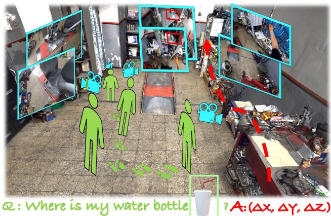  
Figure 1. Visual Query with 3D Localization Task in Egocentric Videos. Given an egocentric video clip and an image crop depicting a query object, the goal is to localize the last time a query object was seen in the video and return the 3D displacement vector from the camera center of the queryframe to the center of the object in 3D.

Towards such efforts, the massive-scale dataset and benchmark suite Ego4D [26] introduced multiple tasks on Episodic Memory from egocentric videos, with the scope of browsing and searching past human experiences. Among those challenges, the task of Visual Queries (VQ) aimed at answering “Where was object X last seen in the video?”, with X being a single image crop of an object, clearly visible and humanly identifiable. In particular, Visual Queries with 3D Localization (VQ3D) focuses on retrieving the relative 3D localization of a query object with respect to a current query frame, as illustrated in Figure 1.

The task of VQ3D arose from the natural progress in computer vision challenges, building on top of the latest development in image understanding [20, 103], video understanding [26, 78], and 3D geometric understanding [74, 30, 31]. Specifically, VQ3D requires a frame-wise understanding of an egocentric video to localize objects in 2D images, a special 2D localization of the object along the temporal dimension, coupled with a 3D scene understanding to unproject the 2D localization into a 3D environment. Although most of the effort in Ego4D originates in the field of video understanding, little effort has been paid to improve the meaningful 3D knowledge needed by VQ3D methods.

Previous work [26] performs camera pose estimation by relocalizing real egocentric video frames to a Matterport scan, suffering from the simulation-to-real gap (difference in the domains and reference coordinates). IT also builds on 2D localization without proper 3D entanglement. In this work, we attempt to bridge the gap between video and 3D scene understanding in VQ3D. In particular, we develop a pipeline that better entangles 3D multiview geometry with 2D object retrieval from egocentric videos. To fully understand the 3D scene, our proposed aggregation method predicts displacement from multiple views by leveraging the detection scores. This led to state-of-the-art results in the VQ3D task. We summarize our contributions as follows.

• We formalize the pipeline for the task of Visual Queries with 3D Localization (VQ3D) from egocentric videos, with a thorough study of each module. We identify and solve the Simulation-2-Real gap for camera pose estimation, and elevate the baseline performance from 8.71% [26] to 77.27%.

• We propose to aggregate multi-view 3D displacements by employing the 2D detection confidences to weight predictions and further enhance 3D localization. Our method (EgoLoc) achieves 87.12% in Overall Success Rate on the test set of the VQ3D task, significantly outperforming the baseline and setting new state-of-theart results in VQ3D.

• We perform an extensive empirical analysis of different components and configurations in the VQ3D pipeline, which aims to benefit future research in the VQ3D direction.

## 2. Related Work

2D Detection with Visual Queries. 2D object detection is an essential computer vision task that involves detecting objects within a 2D image and providing their corresponding bounding boxes and class labels. Over the past few years, deep learning based object detection models [68, 24, 69, 34, 51, 83, 12] have achieved remarkable performance on several benchmark datasets [52, 20, 21, 27, 44].

However, generalizing trained detectors to unseen classes and the open world [38, 102] remains a challenge. Specially, Visual Queries with 2D Localization (VQ2D) [26], the sister task of VQ3D, given a static image crop of the object and an egocentric video recording, aims to localize the last appearance of the object spatially and temporally, producing a set of bounding boxes for every frame of a continuous video clip. VQ2D can be considered as an extension of Few-Shot Detection(FSD) [4, 22], where the detection model should be able to quickly transfer to unseen categories given limited new samples. However, both VQ2D [92, 93] and FSD [39, 64, 96] suffer from false positive detections due to limited positive examples. In this work, we investigate how to combine VQ2D components specialized for VQ3D.

Egocentric Video Understanding. The field of computer vision has witnessed significant advances in understanding third-person view images and videos [20, 52, 21, 10, 13, 40, 94, 100, 2, 99, 35]. However, the ability to understand visual data from afirst-person perspective is equally crucial for various research domains, including vision, robotics, and augmented reality. Despite this, it presents unique challenges that require specialized research. In recent years, egocentric vision research has gained substantial attention due to the availability of egocentric datasets [61, 77, 17, 95, 85, 1, 26]. In response, several studies have been conducted to address the challenges associated with first-person views, such as detecting the camera wearer’s hands [5], privacy protection [82], human-object interactions [55], gaze estimation [48], human body pose estimation [37], and activity recognition and detection [42, 7, 49, 41, 57, 66]. Particularly noteworthy is Ego4D [26], which proposes the Visual Query localization task, requiring the agent to locate objects with visual queries in 2D or 3D given recorded egocentric videos.

3D Understanding from Egocentric Video. Research on 3D object detection has been extensively conducted using images [6, 56, 73, 29], point clouds [23, 79, 65, 46] and videos [36, 11]. To comprehend and reconstruct 3D scenes from a set of 2D images, Structure from Motion (SfM) [62] has been used. SfM can be categorized into geometricbased methods[74, 45, 58] that use multiview geometry, learning-based methods [104, 89, 43] that employ deep neural networks, and hybrid SfM [80, 81] that combine both approaches. Various SfM methods have been developed to address large-scale videos from dynamic environments [101] and casual videos from daily life [98, 54]. However, the unique characteristics of egocentric videos, such as dynamics, motion blur, and unusual viewpoints, introduce significant challenges to 3D understanding. Although many studies [71, 84, 90, 47, 97, 28, 16] have focused on recovering 3D human poses from egocentric videos, very few works have been conducted for egocentric perception in a 3D context. A few notable examples are Chen et al.’s [15] study on egocentric indoor localization based on the Manhattan geometry of room layouts, EGO-SLAM [63] that proposed a SLAM system for outdoor egocentric videos using SfM over a temporal window, and NeuralDiff [87] and N3F [86] that developed a dynamic NeRF from egocentric videos to detect and segment moving objects. Furthermore, Tushar et al. [59] proposed an approach that links camera poses and videos to predict human-centric scene context. Our method leverages the 3D structure and egomotion recovered from the egocentric video. It fuses multi-view image detections for enhanced 3D localization of the queried object, which motivates future developments of a strong VQ3D baseline for embodied-AI.

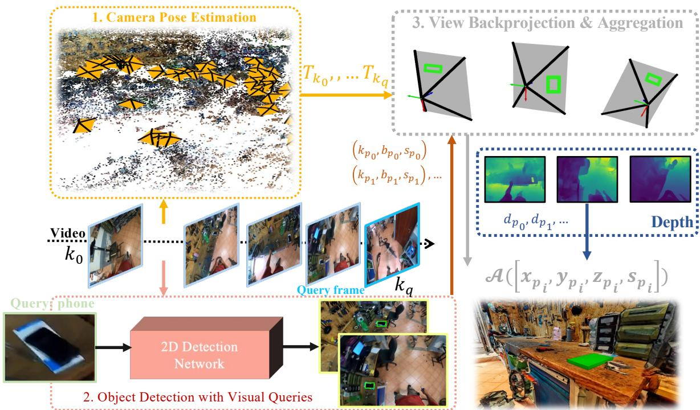  
Figure 2. Main Pipeline. Our method estimates the camera poses T and retrieves the query object from each frame ki before query frame $k _ { q }$ . Then, we select the posed frames $k _ { p _ { i } }$ with peak 2D response that successfully retrieve the query object’s bbox $b _ { p _ { i } }$ with high confidence score $s _ { p _ { i } } ,$ , estimate the depth $d _ { p _ { i } }$ of these frames, and aggregate A the 3D position $\left[ x _ { p _ { i } } , y _ { p _ { i } } , z _ { p _ { i } } \right]$ of the retrieved object to form the final prediction.

Episodic Memory and Embodied AI. Embodied Question Answering (EQA) [18, 19], is a special case of the videolanguage grounding task, where an embodied agent should answer language questions according to visual observations in 3D indoor environments. While EQA usually requires the model to give an answer [8] (e.g. language, video clip, etc.) to a language query, VQ3D considers image crops of objects as the query and predicts object displacement as output, which is more intuitive and fundamental for present computer vision techniques. Such a task setting is also strongly related to embodied AI problems [18, 14, 3], but they usually assume the poses are known and operate in stable simulators. Progress in VQ3D has the potential to adapt embodied AI techniques to real-world applications.

Egocentric videos  
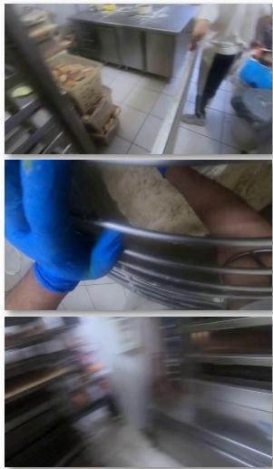

Matterport Scan  
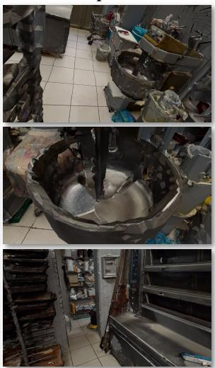  
Figure 3. Egocentric Videos and Matterport Scan. We show illustrations of the domain gap between Matterport Scan and real scenes. Matterport Scan may have different illumination, scene appearance, and missing/low-quality scans. Egocentric videos are usually dynamic, free of view (FOV), and have fast motion blur, bringing great challenges for 3D reconstruction and localization.

## 3. Method

## 3.1. Task and Pipeline Overview

First, we formalize the VQ3D task as defined in the Ego4D Episodic Memory Benchmark [26]. Given an egocentric video V, a query object o defined by a single visual crop v, and a query frame $q ,$ the objective is to estimate the relative displacement vector $\Delta d = ( \Delta x , \Delta y , \Delta z )$ defining the 3D location where the query object o was last seen in the environment, with respect to the reference system defined by the 3D pose of the query frame $q .$

To localize a given image query in the video geometrically, we propose a multi-stage pipeline to entangle 2D information with 3D geometry. First, we perform Structure from Motion (SfM) [74], which estimates the 3D poses $\big \{ T _ { 0 } , . . . , T _ { N - 1 } \big \}$ for all the N video frames $\big \{ k _ { 0 } , . . . , k _ { N - 1 } \big \}$ Second, we feed the frames of an egocentric video V and the visual crop v with the query object o to a model that retrieves peak response frames $\{ k _ { p _ { 0 } } , k _ { p _ { 1 } } . . . , \}$ with corresponding 2D bounding boxes $\{ b _ { p _ { 0 } } , b _ { p _ { 1 } } . . . , \}$ of the query object o. Finally, for each response frames $k _ { p _ { i } }$ , we estimate the depth and back-project the object centroid to 3D using estimated pose $T _ { k _ { p _ { i } } }$ We recover the world 3D location $[ \hat { x } , \hat { y } , \hat { z } ]$ of the object by aggregating per response frame $p _ { i } { ' } s$ prediction $[ x _ { p _ { i } } , y _ { p _ { i } } , z _ { p _ { i } } , s _ { p _ { i } } ]$ . The final relative displacement vector $\Delta d$ is obtained by projection using $T _ { q }$ with respect to the query frame q. Figure 2 illustrates an overview of our pipeline.

## 3.2. Camera Pose Estimation

Estimating the camera poses from egocentric videos is difficult, but essential for high-level tasks. To recover camera poses, the baseline from Ego4D [26] tried to extract the features and match them between the sampled renderings of Matterport Scan and selected frames from the egocentric videos. However, there is a domain gap between egocentric videos and Matterport scans, as shown in Figure 3, and already observed in previous works [72, 9], which brings great difficulties for their camera re-localization. As a result, the Ego4D [26] baseline mostly fails to match video frames, leading to inaccurate 3D reconstruction, low number of Query with Poses (QwP), and low performance in the VQ3D metrics. To alleviate this issue, we propose to use COLMAP [74] on the entire sequences and empirically explore the proper hyperparameters for egocentric videos. This leads to an improved QwP rate and improves the overall VQ3D pipeline.

## 3.3. Visual Queries with 2D Localization

The Video Object Detection from Visual Queries module aims to locate a query object o defined by a single visual crop v both spatially and temporally. The VQ3D baseline proposed by Ego4D [26] builds upon the existing VQ2D pipeline, which includes object detection and tracking stages.

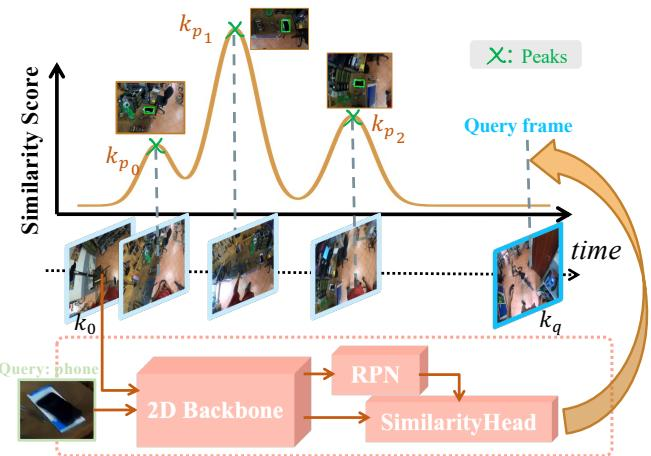  
Figure 4. Our 2D Object Retrieval Module. The 2D Backbone $\mathcal { F }$ extracts features for both query object o and the input video stream. A pre-trained RPN [70] with ROI-Align [33] is then used to generate box proposals and visual features. A Siamese head is trained to evaluate the similarity between query object features and proposal features. At inference time, the peak responses in the score signals will be selected as our response frames.

However, extending VQ2D to 3D may not be optimal due to the unwieldy and error-prone tracking module, which produces blurry frames and uncertain tracklets that can drift. We propose a revised implementation of VQ2D [26, 92] that prunes the tracker and integrates the detector more closely with the 3D modules using a multiview inductive bias to improve the model’s reliability and robustness.

2D Detection. To detect the query object in a video frame $k _ { i } ,$ , a pre-trained Region Proposal Network (RPN) [69] with a Feature Pyramid Network (FPN) [50] backbone is utilized to generate a set of bounding box proposals $\{ b _ { i _ { 0 } } , b _ { i _ { 1 } } , \ldots \}$ . These proposals are then processed through the RoI-Align operation [33] to extract visual features for each box $\{ \mathcal { F } ( b _ { i _ { 0 } } ) , \mathcal { F } ( b _ { i _ { 1 } } ) , \ldots \}$ . Meanwhile, we also extract features $\mathcal { F } ( v )$ for the visual crop v using the same FPN backbone. To determine whether the query object is present in frame $k _ { i }$ , a Siamese head S is used to output a similarity score between [0, 1] for all the bounding box proposals: $\{ s _ { i _ { 1 } } , s _ { i _ { 2 } } . . . \}$ . Then we select the Top-1 bounding box proposal as $b _ { i }$ for frame $k _ { i }$ . Finally we can get a tuple of $\{ ( k _ { 0 } , b _ { 0 } , s _ { 0 } ) , . . . , ( k _ { q } , b _ { q } , s _ { q } ) \}$ for each video frame before the query frame, as shown on the plot at the top of Figure 4.

Peak Selection. After smoothing the scores with a median filter, we search for response peaks and select our response frames accordingly. As the appearance and disappearance of an object in a video can result in a peak signal, we hypothesize that a local peak signal indicates higher confidence for the query object o to be present in the video frame. Finally, we couple the peak response frames with their corresponding top-1 bounding box proposal and detection similarity score as follows: $\{ ( k _ { p _ { 0 } } , b _ { p _ { 0 } } , s _ { p _ { 0 } } ) , ( k _ { p _ { 1 } } , b _ { p _ { 1 } } , s _ { p _ { 1 } } ) . . . , \}$

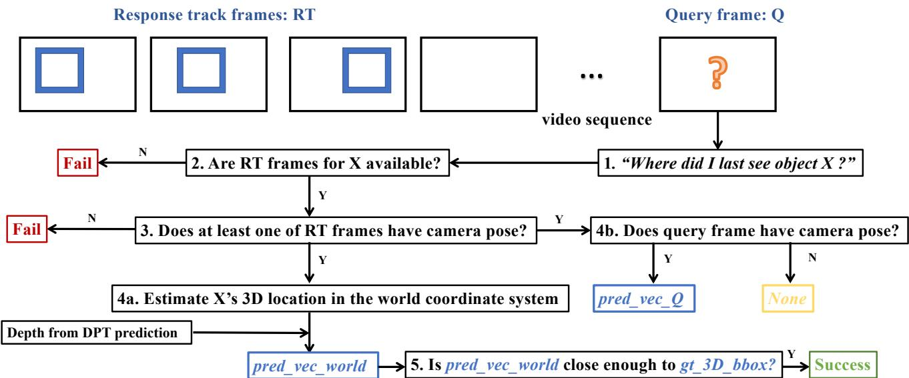  
Figure 5. VQ3D Evluation Metrics. This flow chart shows how the metrics are calculated for the VQ3D task. The predicted object location in world’s coordinate system is pred\_vec\_world. The predicted location of the object in the query frame’s coordinate system is pred\_vec\_Q.

## 3.4. Multi-View Unprojection & Aggregation

Finally, for each posed response frame, we estimate the Angular error between pred\_vec\_Q3D position for the center of the 2D bounding box. We estimate the depth maps for the posed response frames using successful queries in step a pretrained monocular depth estimation network [67]. With the paired response $k _ { p _ { i } }$ and the bounding box $b _ { p _ { i } }$ together, we retrieve the depth $d _ { p _ { i } }$ of the object o as the depth value of its centroid in the depth map. The backprojection of the 2D position into a 3D displacement vector $[ x _ { p _ { i } } , y _ { p _ { i } } , z _ { p _ { i } } ]$ for posed view $k _ { p _ { i } }$ total queries in stis given in Equation (1), where $u _ { p _ { i } } , v _ { p _ { i } }$ corresponds to the centroid of the bounding box $b _ { p _ { i } }$ and K is the intrinsic parameters of the camera estimated by COLMAP. A visual description of this module is shown on the right side of Figure 2.

$$
[ x _ { p _ { i } } , y _ { p _ { i } } , z _ { p _ { i } } , 1 ] ^ { T } = T _ { p _ { i } } d _ { p _ { i } } K ^ { - 1 } [ u _ { p _ { i } } , v _ { p _ { i } } , 1 ] ^ { T }\tag{1}
$$

Unlike the Ego4D baseline [26] that only uses the last tracking response, we propose to aggregate information from multiple points of view to localize the query object o, which leads to a more accurate estimation of the displacement vector ∆d more robust to noisy posed views. We make a simple assumption here that recent multiple appearances of an object in a short video clip should be geometrically close to each other in the world coordinate system, in particular, since the object tends to be static without extensive movement [76, 41, 91]. We defined our aggregation function A in Equation (2).

$$
\begin{array} { r } { [ \hat { x } , \hat { y } , \hat { z } ] ^ { T } = \mathcal { A } ( [ x _ { p _ { 0 } } , y _ { p _ { 0 } } , z _ { p _ { 0 } } , s _ { p _ { 0 } } ] ^ { T } , . . . , [ x _ { p _ { i } } , y _ { p _ { i } } , z _ { p _ { i } } , s _ { p _ { i } } ] ^ { T } ) } \end{array}\tag{2}
$$

To further fuse the temporal predictions across multiview robustly, we propose taking the 2D detection confidence, i.e. the similarity score $s _ { p _ { i } }$ , into account while fusing multiview. A higher detection score $s _ { p _ { i } }$ indicates a higher probability of the presence of a query object at the specific 3D location. Practically, we use the weighted average as our aggregation operator $\mathcal { A } ( \mathbf { x } _ { p _ { i } } ) = \sum s _ { i } \mathbf { x } _ { p _ { i } }$

With the global 3D location of the query object and the camera pose of query frame $T _ { q }$ known, we can finally give the prediction for relative displacement vector:

$$
\Delta \hat { d } = T _ { q } ^ { - 1 } [ \hat { x } , \hat { y } , \hat { z } , 1 ] ^ { T }\tag{3}
$$

## 4. Experiments

## 4.1. Ego4D VQ3D Benchmark

Ego4D [26] is a massive-scale egocentric video dataset and benchmark suite. As a part of the episodic memory benchmark, the VQ3D task contains 164, 44, and 69 video clips for train, validation, and test set, respectively. There are 164 and 264 visual queries in the validation and test sets, respectively. The video clips typically last from 5 to 10 minutes. All those video clips were recorded in indoor scenes that have been scanned with Matterport devices before. The ground-truth 3D locations of the objects were annotated by volunteers in the Matterport scans.

<table><tr><td rowspan="2">Method</td><td colspan="5">Validation Set</td></tr><tr><td>Succ%↑ Succ*%↑ L2↓ Angle↓ QwP%↑</td><td></td><td></td><td></td><td></td></tr><tr><td>Ego4D [26]</td><td>1.22</td><td>30.77</td><td>5.98</td><td>1.6</td><td>1.83</td></tr><tr><td>Ego4D*</td><td>73.78</td><td>91.45</td><td>2.05</td><td>0.82</td><td>80.49</td></tr><tr><td>EgoLoc (ours)</td><td>80.49</td><td>98.14</td><td>1.45</td><td>0.61</td><td>82.32</td></tr><tr><td colspan="6">Test Server Leaderboard</td></tr><tr><td>Ego4D [26]</td><td>8.71</td><td>51.47</td><td>4.93</td><td>1.23</td><td>15.15</td></tr><tr><td>Ego4D*</td><td>77.27</td><td>86.06</td><td>2.37</td><td>1.14</td><td>90.15</td></tr><tr><td>EgoLoc (ours)</td><td>87.12</td><td>96.14</td><td>1.86</td><td>0.92</td><td>90.53</td></tr></table>

## 4.2. Experimental Setup

To be robust to motion blur, we subsample 100 contiguous non-blurry frames from the videos selected by the variance of Laplacian greater than 100, which will be fed into COLMAP auto-reconstruction to estimate camera intrinsic at first. To model the fisheye distortion in egocentric videos, we choose the RADIAL\_FISHEYE camera. We then set the sequential matcher with window\_size = 10 in COLMAP sparse reconstruction for the whole video. Since the poses from SfM have the scale ambiguity [32] issue, we align the COLMAP reconstruction to Matterport scan coordinate system as post-processing. We render at least three images from the Matterport scan with known camera poses and then perform a Sim3 transformation to align the COLMAP coordinate system. The 2D Faster-RCNN [69] backbone is pretrained on MS-COCO [53] and frozen. We only train the Siamese head in VQ2D [26] train set. We perform a median filter with kernel\_size = 5 frames and select the detection peaks [75] supported by peak\_width ≥ 3, distance ≥ 25 from the detection score curve. We adopt the DPT [67] network pretrained on NYU V2 [60] for depth estimation.

## 4.3. Metrics

For a fair comparison, we use the same metrics as defined by Ego4D’s baseline [26]. Given the predicted 3D location and the ground truth object 3D location, Angle corresponds to its angular error in radians, and L2 corresponds to its distance error in meters using the root mean square error (RMSE). QwP represents the query ratio for which we have pose estimation for both the response frames and the query frame. The Success metric is formulated as the ratio of query prediction, whose L2 error is smaller than a threshold, to total queries. Note that if we fail to estimate the camera pose for the response frames or the query frame, the corresponding query will be considered as failed directly. The Success∗ means the success metric computed only for queries with associated pose estimates.

In summary, we provide a detailed flow chart to explain how the evaluation works in Figure 5. The metrics can be hence calculated as follows.

$$
Q w P = { \frac { \mathrm { Q u e r i s ~ w i t h ~ b o t h } p r e d _ { - } v e c _ { - } w o r l d , p r e d _ { - } v e c _ { - } Q } { \mathrm { T o t a l ~ q u e r i e s ~ i n ~ S t e p ~ } ! } }
$$

$$
S u c c ^ { * } R a t e = { \frac { \mathrm { S u c c e s s f u l ~ q u e r i e s ~ i n ~ S t e p ~ } 5 } { \mathrm { T o t a l ~ q u e r i e s ~ w i t h ~ R T ~ c a m e r a ~ p o s e s ~ i n ~ S t e p ~ } 4 \mathrm { a } } } ,
$$

$$
S u c c ~ R a t e = { \frac { { \mathrm { S u c c e s s f u l ~ q u e r i e s ~ i n ~ S t e p ~ } } 5 } { \mathrm { T o t a l ~ q u e r i e s ~ i n ~ S t e p ~ } 1 } }
$$

## 4.4. Our Results

We present the main results of our study in Table 1, where we demonstrate significant improvements in both the validation and test sets across all metrics. As we had hypothesized,

Table 1. Main Results. We show our results on the validation and test sets of the VQ3D task from the Ego4D Episodic Memory Benchmark. We compare against Ego4D [26] baseline and Ego4D∗, an improved baseline by just replacing the camera pose estimation part to ours.

the low success rate in the Ego4D dataset was largely due to the low Queries with Poses (QwP) ratio, which serves as the upper bound for the overall success rate. Without frame poses, it is impossible to estimate 3D displacement. The low QwP ratio in Ego4D was caused by their camera pose estimation method, which tried to perform feature matching across a large domain gap between simulated and real scenes, as can be seen in the first row of our results in Table 1. Our baseline of the new proposed pipeline Ego4D∗, by just replacing the camera pose estimation part of Ego4D, achieved a success rate of 73.78% and 77.27% in the validation and test sets, respectively, compared to Ego4D’s 1.22% and 8.71%.

Despite similar QwP values, our proposed aggregation method demonstrates significant enhancements to the improved Ego4D∗ baseline in terms of overall success, L2 accuracy, and angle accuracy. The use of multi-view fusion significantly improves localization accuracy, as evidenced by the reduction in L2 error. These improvements translate to a 6.71% increase in overall success rate on the validation set and a 9.85% increase on the test set.

## 5. Analysis

We conduct an extensive empirical analysis of different modules on the validation set.

## 5.1. Ablation Study

VQ2D. Table 2 presents the findings of the analysis conducted on 2D object detection from egocentric videos on the VQ3D performance. To localize the object in 2D, Ego4D employs the “Detection and Tracking” strategy, specifically “LastTrack”. This strategy involves selecting the detection response peak closest to the query frame (Figure 4), running the tracker forward and backward to obtain the response track, and using the last frame from the response track as the answer to the question “where did I last see object X?”. However, this approach has limitations, including time and computation overheads, blurry response, objects being far from the center of the frame, and difficulties in depth estimation for backprojection to 3D.

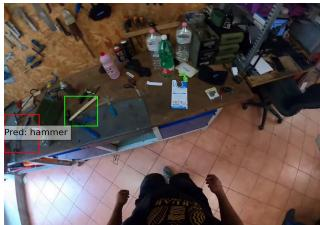

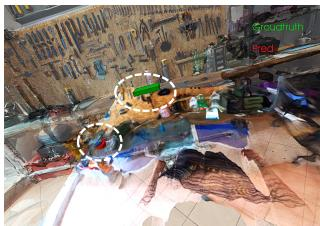  
Ego4D, L2=1.55

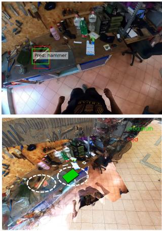  
(a) Query object: hammer  
Ours, L2=1.04

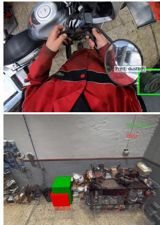  
Ours, L2 = 0.24  
(b) Query object: dustbin

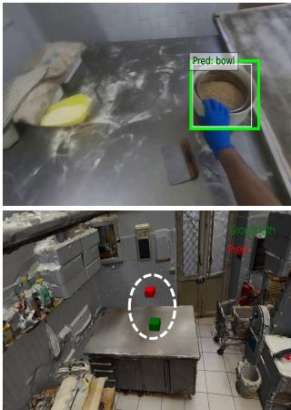  
Ours, L2 = 0.57  
(c) Query object: bowl

Figure 6. Visualization of 2D responses and 3D Localization. We visualize the 2D response detection on the top row with the corresponding 3D localization below. We backproject the response frame to an example Matterport scan using estimated depth map and camera poses to show a superposition. The highlighted area is backprojection, and the faded area is groundtruth scene scan. For query (a), our object detection selection gives the correct bbox while the tracking result from Ego4D has shifted, leading to better 3D localization. For query (b) , our method shows pretty good localization accuracy, even though the view angle is quite unusual along with severe fisheye distortion. For query (c), since the wearer is grabbing and moving the bowl, our prediction is shifted a little bit.
<table><tr><td>VQ2D</td><td></td><td>Succ%↑ Succ*%↑ L2↓ Angle↓ QwP%↑</td><td></td><td></td><td></td></tr><tr><td>LastTrack</td><td>73.78</td><td>91.45</td><td>2.05</td><td>0.82</td><td>80.49</td></tr><tr><td>LastDetPeak</td><td>78.05</td><td>94.41</td><td>1.81</td><td>0.7</td><td>82.32</td></tr><tr><td>TopDetPeak</td><td>79.88</td><td>96.89</td><td>1.48</td><td>0.51</td><td>82.32</td></tr><tr><td>DetPeaks</td><td>80.49</td><td>98.14</td><td>1.45</td><td>0.61</td><td>82.32</td></tr></table>

Table 2. Ablation study on Detection We ablate on how to use VQ2D results, comparing selecting the last frame of tracking, last detection peak or the highest detection response peak. Our EgoLoc pipeline utilizes multiple detection peaks for aggregation.

Our study focuses more on the confidence and precision of the question “where did I last see object X?”. To this end, the “LastTrack” approach is compared to “LastDetPeak” (selecting the last peak), “TopDetPeak” (selecting the high est peak), and “DetPeaks” (selecting multi-peak responses motivated by multiview aggregation). The results indicate that even considering one peak can enhance the “LastTrack” approach from 73.78% to 78.05%. Furthermore, our “Det-Peaks” outperforms the other approaches, achieving a Top-1 performance of over 80% in overall success.

VQ2D GT. Furthermore, the VQ3D benchmark, which is a subset of VQ2D data, includes ground truth tracking annotations for the query object’s last appearance. To evaluate the pipeline, peak responses are substituted as ground truth tracking since ground truth (GT) does not have scores from detection. The study ablates on the last GT frame and multiview mean of GT frame strategy. The results, as presented in Table 3, demonstrate that ground truth 2D annotations can decrease the object localization shift, with reduced L2 and angular error. However, even though it achieves the highest success rate, the overall success rate is only 0.61% higher than that of Detection Peaks. This finding indicates that the 2D object retrieval module has almost reached saturation compared to the camera pose estimation. Although the current Siamese detector still lacks 2D detection accuracy [26, 92], we are approaching the upper bound of potential improvements gained from 2D object retrieval. Because 2D metrics in pixels, e.g., IoU, tend to be stricter than current 3D metrics in meters.

<table><tr><td>VQ2D</td><td>Succ*%↑</td><td>L2↓</td><td>Angle↓</td></tr><tr><td>Last GT Track</td><td>98.04</td><td>1.22</td><td>0.41</td></tr><tr><td>Mean GT Track</td><td>98.69</td><td>1.17</td><td>0.41</td></tr><tr><td>EgoLoc (on GT 2D Track)</td><td>97.39</td><td>1.47</td><td>0.64</td></tr></table>

Table 3. Compared to GT 2D Tracking. We compare our results based on the ground truth 2D annotation, i.e., ground truth tracking result for the last appearance of the query object. \*Since different 2D response frames will affect the QwP ratio, we only compare the queries where both GT response frames and detection peak frames have camera poses to ensure only 2D detection accuracy will influence the relative localization accuracy.

Multiview Aggregation. The simplest way to do backprojection for object o in 3D is taking one single response for Equation (1). However, since our pipeline is multi-stage, prediction from one single frame could be fragile to the errors we accumulated in each module. Aggregating 3D displacements predicted from multiview strengthens the 3D precision.

<table><tr><td colspan="6">View</td></tr><tr><td>Aggregation</td><td>Succ%↑</td><td>Succ*%↑</td><td>L2↓</td><td>Angle↓</td><td>QwP%↑</td></tr><tr><td>Last</td><td>78.05</td><td>94.41</td><td>1.81</td><td>0.7</td><td>82.32</td></tr><tr><td>Mean</td><td>79.88</td><td>97.52</td><td>1.53</td><td>0.66</td><td>82.32</td></tr><tr><td>NMS</td><td>79.88</td><td>96.89</td><td>1.43</td><td>0.5</td><td>82.32</td></tr><tr><td>Det Weighted</td><td>80.49</td><td>98.14</td><td>1.45</td><td>0.61</td><td>82.32</td></tr></table>

Table 4. Ablation Study on Multi-View Aggregation We ablate different ways to aggregate the 3D prediction from multi-view 2D responses. Weighted aggregation based on detection confidence is what EgoLoc pipeline utilizes

In Table 4, given the response peaks, we ablate on different multiview aggregation functions A. “Mean” is the most straightforward and naive way where we set A = mean. “DetWeighted” is our proposed method to fuse 3D predictions from multiview peaks based on 2D object retrieval confidence. “Non Maximum Suppression (NMS)” is inspired by the 2D detection field [25] where we select the 3D prediction point with the highest confidence score and fuse it with the neighborhood points also by the confidence score. In this way, the predicted locations with low confidence and far away from Top-1 won’t be considered, but the final prediction still benefits from multiview.

As we have found from Table 4, Mean and NMS give a comparable performance. But the best performance, a boost of 2.44%, is observed from the proposed detection confidence fusion.

<table><tr><td>Triangulation</td><td>Succ%↑</td><td>Succ*%↑</td><td>L2↓</td><td>Angle↓</td><td>QwP%↑</td></tr><tr><td>DetPeaks</td><td>56.1</td><td>67.7</td><td>6.2</td><td>1.16</td><td>82.32</td></tr><tr><td>TrackGT</td><td>56.71</td><td>71.9</td><td>4.88</td><td>1.26</td><td>81.1</td></tr><tr><td>DPT</td><td>80.49</td><td>98.14</td><td>1.45</td><td>0.61</td><td>82.32</td></tr></table>

Table 5. Ablation study on Depth Estimation We try to do Nview triangulation given the 2D responses for the same 3D object across multiple known posed images. TrackGT is the 2D tracking ground truth annotation for the last appearance. DPT [67] is used in EgoLoc’s triangulation.

Depth Estimation. We adopt the off-the-shelf monocular depth estimation network, DPT [67], robust to blurry and fisheye distortion, to get a smooth depth estimation for the object. However, since we have paired 2D points with camera poses $\{ ( k _ { p _ { 0 } } , b _ { p _ { 0 } } , T _ { p _ { 0 } } ) , ( k _ { p _ { 1 } } , b _ { p _ { 1 } } , T _ { p _ { 1 } } ) . . . , \}$ for peak frames, it’s also possible to estimate the depth d from multi-view geometry by triangulation [32] if we have detected more than one peak response. This can be done by solving the combined equation system consisting of Equation 1 from each view.

At first, we use the camera intrinsic estimated by COLMAP to undistort the images. Then, we have tried to use our detected response peaks and groundtruth 2D tracking to triangulate. As shown in Table 5, we find a catastrophic drop in L2, angle, and overall performance. Even triangulation from groundtruth 2D bboxes is just slightly better than using detection peaks but still has a massive localization L2 error as large as 4.88.

<table><tr><td rowspan="2">Method</td><td colspan="5">Test Server Leaderboard |Succ%↑ Succ*%↑ L2↓ Angle↓ QwP%↑</td></tr><tr><td></td><td></td><td></td><td></td><td></td></tr><tr><td>Ego4D baseline</td><td>8.71</td><td>51.47</td><td>4.93</td><td>1.23</td><td>15.15</td></tr><tr><td>+Egocentric SfM</td><td>77.27</td><td>86.06</td><td>2.37</td><td>1.14</td><td>90.15</td></tr><tr><td>+Last Detection</td><td>81.06</td><td>90.35</td><td>2.20</td><td>1.24</td><td>90.53</td></tr><tr><td>+Detection Peak</td><td>85.61</td><td>94.98</td><td>1.85</td><td>1.24</td><td>90.53</td></tr><tr><td>+MV-Peaks Average</td><td>86.36</td><td>95.37</td><td>1.94</td><td>1.19</td><td>90.53</td></tr><tr><td>+MV-Peaks Weighted</td><td>87.12</td><td>96.14</td><td>1.86</td><td>0.92</td><td>90.53</td></tr></table>

Table 6. Full Ablations. We list the performance of adding each module in EgoLoc compared to the Ego4D [26] baseline. MV refers to multi-view. EgoLoc utilizes weighted multi-view aggregation based on multiple detection peaks (+MV-Peaks Weighted ).

We think the reason comes two-fold: 1) Triangulation, as a naive approach, is sensitive to the quality of undistortion and view consistency, while the distortion coefficients and camera poses estimated by COLMAP are not precise enough; 2) Also, the short baseline due to the small translation with fast rotation commonly seen in egocentric videos brings extra difficulties for a numerically stable solution.

Complete Ablations. We present a more complete and unified ablation in Table 6. It shows that each module provides an improvement over Ego4D baseline on test set. Though the most significant gain is brought by our adaption of Egocentric SfM, our other modules also have nontrivial contributions to further improve by about 10%. Our final model MV-Peaks Weighted uses the weighted average predictions from confident peak detections along with egocentric SfM.

Scene Variance. We notice that the absolute success rate in validation and test set has big differences, comparing Ego4D’s 1.22% with 8.71%, our 77.44% with 86.36% in Table 1. So we ablate our method’s performance across different scenes in Table 7. We find that the QwP is dominating the overall performance, especially for the hard scene, Bakery, where COLMAP only gets poses for 44.12% of queries. Also, the variance of L2 in different scenarios is also significant. This implies that egocentric videos recorded in different scenes and activities may have very different characteristics, making the VQ3D task more challenging.

Visualization. We provide the visualization results for some queries in Figure 6. For query (a), Ego4D’s detection and tracking strategy does not perform well. It may detect the wrong object at one previous frame and keep tracking it, or the tracker may lose track of the correct object. Our method, instead, considers multiview peaks with confidence, thus providing more accurate object recognition and localization.

<table><tr><td>Scene</td><td>Succ%↑</td><td>Succ*%↑</td><td>L2↓</td><td>Angle↓</td><td>QwP%↑</td></tr><tr><td>All</td><td>80.49</td><td>98.14</td><td>1.45</td><td>0.61</td><td>82.32</td></tr><tr><td>Scooter mechanic 31</td><td>91.89</td><td>97.3</td><td>1.35</td><td>0.5</td><td>94.59</td></tr><tr><td>Baker 32</td><td>41.18</td><td>96.77</td><td>1.68</td><td>0.76</td><td>44.12</td></tr><tr><td>Carpenter 33</td><td>82.14</td><td>100</td><td>1.48</td><td>1</td><td>82.14</td></tr><tr><td>Bike mechanic 34</td><td>96.43</td><td>100</td><td>1.43</td><td>0.48</td><td>96.43</td></tr></table>

Table 7. Variance of Egocentric Scenes. We show EgoLoc’s results on some scenes from Ego4D [26]. Different scenes have completely different room layouts, lighting, and human activities,. This is part of the challenge of VQ3D.

However, query (c) also shows a flaw in our assumption that the object tends to be static across multiple peak responses. Here since the wearer is interacting with the bowl, the fusion from other views shifts the weighted average prediction floating above the table.

## 5.2. Discussions and Insights

Our investigation into VQ3D has revealed several key issues, highlighting avenues for further research. Our camera pose estimation remains a bottleneck, and developing robust SfM/SLAM algorithms for dynamic egocentric videos is a crucial next step. Furthermore, an end-to-end learningbased solution for camera and object re-localization could have applications in online settings, such as wearable AI assistants. Constructing a 4D episodic memory of the dy namic 3D environment is another promising direction. Our work represents a new starting point for further research in egocentric 3D understanding. Ultimately, we hope that our work will serve as a new starting point for further research in this field. And we believe that further investigation in VQ3D could yield interesting and valuable insights toward egocentric 3D understanding.

## 6. Conclusions and Future Works

In this work, we have presented a reformulation of the VQ3D task and a modular pipeline that leads to significant improvements on the Ego4D VQ3D benchmark. Through numerous experiments and ablations, we have validated our proposed methodology and demonstrated its effectiveness. Nevertheless, we recognize that this is just the first step towards addressing the challenges of 4D understanding and we anticipate further research in this direction. Additionally, our successful methods and strategies may be applied to classical vision tasks in video understanding, offering new possibilities for leveraging 3D knowledge in such settings. We believe that these developments will contribute to a better understanding of complex dynamic scenes and help unlock new applications in fields such as robotics, autonomous driving, and augmented/virtual reality.

Acknowledgement. The authors would like to thank Guohao Li, Jesus Zarzar and Sara Rojas Martinez for the insightful discussion. This work was supported by the KAUST

Office of Sponsored Research through the Visual Computing Center funding, as well as, the SDAIA-KAUST Center of Excellence in Data Science and Artificial Intelligence (SDAIA-KAUST AI). Part of the support is also coming from the KAUST Ibn Rushd Postdoc Fellowship program.

## References

[1] Hiroyasu Akada, Jian Wang, Soshi Shimada, Masaki Takahashi, Christian Theobalt, and Vladislav Golyanik. Unrealego: A new dataset for robust egocentric 3d human motion capture. In Computer Vision–ECCV 2022: 17th European Conference, Tel Aviv, Israel, October 23–27, 2022, Proceedings, Part VI, pages 1–17. Springer, 2022. 2

[2] Juan Leon Alcazar, Moritz Cordes, Chen Zhao, and Bernard Ghanem. End-to-end active speaker detection. In Proceedings ofthe European Conference on Computer Vision (ECCV), 2022. 2

[3] Peter Anderson, Qi Wu, Damien Teney, Jake Bruce, Mark Johnson, Niko Sünderhauf, Ian Reid, Stephen Gould, and Anton Van Den Hengel. Vision-and-language navigation: Interpreting visually-grounded navigation instructions in real environments. In Proceedings of the IEEE conference on computer vision and pattern recognition, pages 3674–3683, 2018. 3

[4] Simone Antonelli, Danilo Avola, Luigi Cinque, Donato Crisostomi, Gian Luca Foresti, Fabio Galasso, Marco Raoul Marini, Alessio Mecca, and Daniele Pannone. Few-shot object detection: A survey. ACM Computing Surveys (CSUR), 54(11s):1–37, 2022. 2

[5] Sven Bambach, Stefan Lee, David J Crandall, and Chen Yu. Lending a hand: Detecting hands and recognizing activities in complex egocentric interactions. In Proceedings of the IEEE international conference on computer vision, pages 1949–1957, 2015. 2

[6] Wentao Bao, Bin Xu, and Zhenzhong Chen. Monofenet: Monocular 3d object detection with feature enhancement networks. IEEE Transactions on Image Processing, 29:2753– 2765, 2019. 2

[7] Fabien Baradel, Natalia Neverova, Christian Wolf, Julien Mille, and Greg Mori. Object level visual reasoning in videos. In Proceedings of the European Conference on Computer Vision (ECCV), pages 105–121, 2018. 2

[8] Leonard Bärmann and Alex Waibel. Where did i leave my keys?-episodic-memory-based question answering on egocentric videos. In Proceedings of the IEEE/CVF Conference on Computer Vision and Pattern Recognition, pages 1560–1568, 2022. 3

[9] Arunkumar Byravan, Jan Humplik, Leonard Hasenclever, Arthur Brussee, Francesco Nori, Tuomas Haarnoja, Ben Moran, Steven Bohez, Fereshteh Sadeghi, Bojan Vujatovic, et al. Nerf2real: Sim2real transfer of vision-guided bipedal motion skills using neural radiance fields. arXiv preprint arXiv:2210.04932, 2022. 4

[10] Fabian Caba Heilbron, Victor Escorcia, Bernard Ghanem, and Juan Carlos Niebles. Activitynet: A large-scale video

benchmark for human activity understanding. In Proceedings ofthe ieee conference on computer vision and pattern recognition, pages 961–970, 2015. 2

[11] Holger Caesar, Varun Bankiti, Alex H Lang, Sourabh Vora, Venice Erin Liong, Qiang Xu, Anush Krishnan, Yu Pan, Giancarlo Baldan, and Oscar Beijbom. nuscenes: A multimodal dataset for autonomous driving. In Proceedings of the IEEE/CVF conference on computer vision and pattern recognition, pages 11621–11631, 2020. 2

[12] Nicolas Carion, Francisco Massa, Gabriel Synnaeve, Nicolas Usunier, Alexander Kirillov, and Sergey Zagoruyko. Endto-end object detection with transformers. In Computer Vision–ECCV 2020: 16th European Conference, Glasgow, UK, August 23–28, 2020, Proceedings, Part I 16, pages 213–229. Springer, 2020. 2

[13] Joao Carreira and Andrew Zisserman. Quo vadis, action recognition? a new model and the kinetics dataset. In proceedings of the IEEE Conference on Computer Vision and Pattern Recognition, pages 6299–6308, 2017. 2

[14] Devendra Singh Chaplot, Dhiraj Gandhi, Saurabh Gupta, Abhinav Gupta, and Ruslan Salakhutdinov. Learning to explore using active neural slam. arXiv preprint arXiv:2004.05155, 2020. 3

[15] Xiaowei Chen and Guoliang Fan. Egocentric indoor localization from coplanar two-line room layouts. In Proceedings of the IEEE/CVF Conference on Computer Vision and Pattern Recognition, pages 1549–1559, 2022. 2

[16] Yudi Dai, Yitai Lin, Chenglu Wen, Siqi Shen, Lan Xu, Jingyi Yu, Yuexin Ma, and Cheng Wang. Hsc4d: Human-centered 4d scene capture in large-scale indoor-outdoor space using wearable imus and lidar. In Proceedings ofthe IEEE/CVF Conference on Computer Vision and Pattern Recognition, pages 6792–6802, 2022. 2

[17] Dima Damen, Hazel Doughty, Giovanni Maria Farinella, Sanja Fidler, Antonino Furnari, Evangelos Kazakos, Davide Moltisanti, Jonathan Munro, Toby Perrett, Will Price, et al. Scaling egocentric vision: The epic-kitchens dataset. In Proceedings of the European Conference on Computer Vision (ECCV), pages 720–736, 2018. 2

[18] Abhishek Das, Samyak Datta, Georgia Gkioxari, Stefan Lee, Devi Parikh, and Dhruv Batra. Embodied question answering. In Proceedings of the IEEE Conference on Computer Vision and Pattern Recognition, pages 1–10, 2018. 3

[19] Samyak Datta, Sameer Dharur, Vincent Cartillier, Ruta Desai, Mukul Khanna, Dhruv Batra, and Devi Parikh. Episodic memory question answering. In Proceedings of the IEEE/CVF Conference on Computer Vision and Pattern Recognition, pages 19119–19128, 2022. 3

[20] Jia Deng, Wei Dong, Richard Socher, Li-Jia Li, Kai Li, and Li Fei-Fei. Imagenet: A large-scale hierarchical image database. In Computer Vision and Pattern Recognition, 2009. CVPR 2009. IEEE Conference on, pages 248–255. IEEE, 2009. 2

[21] Mark Everingham, Luc Van Gool, Christopher KI Williams, John Winn, and Andrew Zisserman. The pascal visual object classes (voc) challenge. International journal of computer vision, 88:303–308, 2009. 2

[22] Qi Fan, Wei Zhuo, Chi-Keung Tang, and Yu-Wing Tai. Fewshot object detection with attention-rpn and multi-relation detector. In Proceedings of the IEEE/CVF conference on computer vision and pattern recognition, pages 4013–4022, 2020. 2

[23] Andreas Geiger, Philip Lenz, and Raquel Urtasun. Are we ready for autonomous driving? the kitti vision benchmark suite. In Conference on Computer Vision and Pattern Recognition (CVPR), 2012. 2

[24] Ross Girshick. Fast r-cnn. In Proceedings of the IEEE international conference on computer vision, pages 1440– 1448, 2015. 2

[25] Ross Girshick, Jeff Donahue, Trevor Darrell, and Jitendra Malik. Rich feature hierarchies for accurate object detection and semantic segmentation. In Proceedings of the IEEE conference on computer vision and pattern recognition, pages 580–587, 2014. 8

[26] Kristen Grauman, Andrew Westbury, Eugene Byrne, Zachary Chavis, Antonino Furnari, Rohit Girdhar, Jackson Hamburger, Hao Jiang, Miao Liu, Xingyu Liu, et al. Ego4d: Around the world in 3,000 hours of egocentric video. In Pro ceedings ofthe IEEE/CVF Conference on Computer Vision and Pattern Recognition, pages 18995–19012, 2022. 1, 2, 4, 5, 6, 7, 8, 9

[27] Agrim Gupta, Piotr Dollar, and Ross Girshick. Lvis: A dataset for large vocabulary instance segmentation. In Proceedings of the IEEE/CVF conference on computer vision and pattern recognition, pages 5356–5364, 2019. 2

[28] Vladimir Guzov, Aymen Mir, Torsten Sattler, and Gerard Pons-Moll. Human poseitioning system (hps): 3d human pose estimation and self-localization in large scenes from body-mounted sensors. In Proceedings of the IEEE/CVF Conference on Computer Vision and Pattern Recognition, pages 4318–4329, 2021. 2

[29] Abdullah Hamdi, Bernard Ghanem, and Matthias Nießner. Sparf: Large-scale learning of 3d sparse radiance fields from few input images. arXiv preprint arXiv:2212.09100, 2022. 2

[30] Abdullah Hamdi, Silvio Giancola, and Bernard Ghanem. Mvtn: Multi-view transformation network for 3d shape recognition. In Proceedings ofthe IEEE/CVF International Conference on Computer Vision (ICCV), pages 1–11, October 2021. 2

[31] Abdullah Hamdi, Silvio Giancola, and Bernard Ghanem. Voint cloud: Multi-view point cloud representation for 3d understanding. In The Eleventh International Conference on Learning Representations, 2023. 2

[32] Richard Hartley and Andrew Zisserman. Multiple view geometry in computer vision. Cambridge university press, 2003. 6, 8

[33] Kaiming He, Georgia Gkioxari, Piotr Dollár, and Ross Girshick. Mask r-cnn. In Proceedings ofthe IEEE international conference on computer vision, pages 2961–2969, 2017. 4

[34] Kaiming He, Xiangyu Zhang, Shaoqing Ren, and Jian Sun. Spatial pyramid pooling in deep convolutional networks for visual recognition. IEEE transactions on pattern analysis and machine intelligence, 37(9):1904–1916, 2015. 2

[35] Jan Held, Anthony Cioppa, Silvio Giancola, Abdullah Hamdi, Bernard Ghanem, and Marc Van Droogenbroeck. Vars: Video assistant referee system for automated soccer decision making from multiple views. In Proceedings of the IEEE/CVF Conference on Computer Vision and Pattern Recognition, pages 5085–5096, 2023. 2

[36] Xinyu Huang, Xinjing Cheng, Qichuan Geng, Binbin Cao, Dingfu Zhou, Peng Wang, Yuanqing Lin, and Ruigang Yang. The apolloscape dataset for autonomous driving. In Proceed ings ofthe IEEE conference on computer vision and pattern recognition workshops, pages 954–960, 2018. 2

[37] Hao Jiang and Kristen Grauman. Seeing invisible poses: Estimating 3d body pose from egocentric video. In 2017 IEEE Conference on Computer Vision and Pattern Recognition (CVPR), pages 3501–3509. IEEE, 2017. 2

[38] KJ Joseph, Salman Khan, Fahad Shahbaz Khan, and Vineeth N Balasubramanian. Towards open world object detection. In Proceedings of the IEEE/CVF Conference on Computer Vision and Pattern Recognition, pages 5830–5840, 2021. 2

[39] Bingyi Kang, Zhuang Liu, Xin Wang, Fisher Yu, Jiashi Feng, and Trevor Darrell. Few-shot object detection via feature reweighting. In Proceedings ofthe IEEE/CVF International Conference on Computer Vision, pages 8420–8429, 2019. 2

[40] Andrej Karpathy, George Toderici, Sanketh Shetty, Thomas Leung, Rahul Sukthankar, and Li Fei-Fei. Large-scale video classification with convolutional neural networks. In Proceedings ofthe IEEE conference on Computer Vision and Pattern Recognition, pages 1725–1732, 2014. 2

[41] Evangelos Kazakos, Jaesung Huh, Arsha Nagrani, Andrew Zisserman, and Dima Damen. With a little help from my temporal context: Multimodal egocentric action recognition. arXiv preprint arXiv:2111.01024, 2021. 2, 5

[42] Evangelos Kazakos, Arsha Nagrani, Andrew Zisserman, and Dima Damen. Epic-fusion: Audio-visual temporal binding for egocentric action recognition. In Proceedings of the IEEE/CVF International Conference on Computer Vision, pages 5492–5501, 2019. 2

[43] Alex Kendall, Matthew Grimes, and Roberto Cipolla. Posenet: A convolutional network for real-time 6-dof camera relocalization. In Proceedings ofthe IEEE international conference on computer vision, pages 2938–2946, 2015. 2

[44] Alina Kuznetsova, Hassan Rom, Neil Alldrin, Jasper Uijlings, Ivan Krasin, Jordi Pont-Tuset, Shahab Kamali, Stefan Popov, Matteo Malloci, Alexander Kolesnikov, et al. The open images dataset v4: Unified image classification, object detection, and visual relationship detection at scale. International Journal of Computer Vision, 128(7):1956–1981, 2020. 2

[45] Mathieu Labbé and François Michaud. Rtab-map as an open-source lidar and visual simultaneous localization and mapping library for large-scale and long-term online operation. Journal of Field Robotics, 36(2):416–446, 2019. 2

[46] Bing Li, Cheng Zheng, Silvio Giancola, and Bernard Ghanem. SCTN: Sparse convolution-transformer network for scene flow estimation. In AAAI, 2022. 2

[47] Jiaman Li, Karen Liu, and Jiajun Wu. Ego-body pose estimation via ego-head pose estimation. In Proceedings of the IEEE/CVF Conference on Computer Vision and Pattern Recognition, pages 17142–17151, 2023. 2

[48] Yin Li, Miao Liu, and James M Rehg. In the eye of beholder: Joint learning of gaze and actions in first person video. In Proceedings of the European conference on computer vision (ECCV), pages 619–635, 2018. 2

[49] Yanghao Li, Tushar Nagarajan, Bo Xiong, and Kristen Grauman. Ego-exo: Transferring visual representations from third-person to first-person videos. In Proceedings of the IEEE/CVF Conference on Computer Vision and Pattern Recognition, pages 6943–6953, 2021. 2

[50] Tsung-Yi Lin, Piotr Dollár, Ross Girshick, Kaiming He, Bharath Hariharan, and Serge Belongie. Feature pyramid networks for object detection. In Proceedings of the IEEE conference on computer vision and pattern recognition, pages 2117–2125, 2017. 4

[51] Tsung-Yi Lin, Priya Goyal, Ross Girshick, Kaiming He, and Piotr Dollár. Focal loss for dense object detection. In Proceedings of the IEEE international conference on computer vision, pages 2980–2988, 2017. 2

[52] Tsung-Yi Lin, Michael Maire, Serge Belongie, James Hays, Pietro Perona, Deva Ramanan, Piotr Dollár, and C Lawrence Zitnick. Microsoft coco: Common objects in context. In Computer Vision–ECCV 2014: 13th European Conference, Zurich, Switzerland, September 6-12, 2014, Proceedings, Part V 13, pages 740–755. Springer, 2014. 2

[53] Tsung-Yi Lin, Michael Maire, Serge Belongie, James Hays, Pietro Perona, Deva Ramanan, Piotr Dollár, and C. Lawrence Zitnick. Microsoft coco: Common objects in context. In European Conference on Computer Vision (ECCV), Zürich, 2014. Oral. 6

[54] Sheng Liu, Xiaohan Nie, and Raffay Hamid. Depth-guided sparse structure-from-motion for movies and tv shows. In Proceedings of the IEEE/CVF Conference on Computer Vision and Pattern Recognition, pages 15980–15989, 2022. 2

[55] Yunze Liu, Yun Liu, Che Jiang, Z Fu, K Lyu, W Wan, H Shen, B Liang, He Wang, and Li Yi Hoi4d. A 4d egocentric dataset for category-level human-object interaction. In IEEE/CVF Conf. Comput. Vis. Pattern Recog.(CVPR), 2022b, volume 1, 2022. 2

[56] Shujie Luo, Hang Dai, Ling Shao, and Yong Ding. M3dssd: Monocular 3d single stage object detector. In Proceedings of the IEEE/CVF Conference on Computer Vision and Pattern Recognition, pages 6145–6154, 2021. 2

[57] Jonathan Munro and Dima Damen. Multi-modal domain adaptation for fine-grained action recognition. In Proceedings ofthe IEEE/CVF conference on computer vision and pattern recognition, pages 122–132, 2020. 2

[58] Raul Mur-Artal, Jose Maria Martinez Montiel, and Juan D Tardos. Orb-slam: a versatile and accurate monocular slam system. IEEE transactions on robotics, 31(5):1147–1163, 2015. 2

[59] Tushar Nagarajan, Santhosh Kumar Ramakrishnan, Ruta Desai, James Hillis, and Kristen Grauman. Egocentric scene

context for human-centric environment understanding from video. arXiv preprint arXiv:2207.11365, 2022. 3

[60] Pushmeet Kohli Nathan Silberman, Derek Hoiem and Rob Fergus. Indoor segmentation and support inference from rgbd images. In ECCV, 2012. 6

[61] Thi-Hoa-Cuc Nguyen, Jean-Christophe Nebel, and Francisco Florez-Revuelta. Recognition of activities of daily living with egocentric vision: A review. Sensors, 16(1):72, 2016. 2

[62] Onur Özye¸sil, Vladislav Voroninski, Ronen Basri, and Amit Singer. A survey of structure from motion\*. Acta Numerica, 26:305–364, 2017. 2

[63] Suvam Patra, Kartikeya Gupta, Faran Ahmad, Chetan Arora, and Subhashis Banerjee. Ego-slam: A robust monocular slam for egocentric videos. In 2019 IEEE Winter Conference on Applications of Computer Vision (WACV), pages 31–40. IEEE, 2019. 3

[64] Juan-Manuel Perez-Rua, Xiatian Zhu, Timothy M Hospedales, and Tao Xiang. Incremental few-shot object detection. In Proceedings of the IEEE/CVF Conference on Computer Vision and Pattern Recognition, pages 13846– 13855, 2020. 2

[65] Guocheng Qian, Xingdi Zhang, Abdullah Hamdi, and Bernard Ghanem. Pix4point: Image pretrained transformers for 3d point cloud understanding. arXiv preprint arXiv:2208.12259, 2022. 2

[66] Merey Ramazanova, Victor Escorcia, Fabian Caba Heilbron, Chen Zhao, and Bernard Ghanem. Owl (observe, watch, listen): Localizing actions in egocentric video via audiovisual temporal context. In Proceedings of the IEEE/CVF Conference on Computer Vision and Pattern Recognition Workshop (CVPRW), 2023. 2

[67] René Ranftl, Alexey Bochkovskiy, and Vladlen Koltun. Vision transformers for dense prediction. In Proceedings ofthe IEEE/CVF International Conference on Computer Vision, pages 12179–12188, 2021. 5, 6, 8

[68] Joseph Redmon, Santosh Divvala, Ross Girshick, and Ali Farhadi. You only look once: Unified, real-time object detection. In Proceedings of the IEEE conference on computer vision and pattern recognition, pages 779–788, 2016. 2

[69] Shaoqing Ren, Kaiming He, Ross Girshick, and Jian Sun. Faster r-cnn: Towards real-time object detection with region proposal networks. In C. Cortes, N. D. Lawrence, D. D. Lee, M. Sugiyama, and R. Garnett, editors, Advances in Neural Information Processing Systems 28, pages 91–99. Curran Associates, Inc., 2015. 2, 4, 6

[70] Shaoqing Ren, Kaiming He, Ross Girshick, and Jian Sun. Faster r-cnn: Towards real-time object detection with region proposal networks. Advances in neural information processing systems, 28, 2015. 4

[71] Helge Rhodin, Christian Richardt, Dan Casas, Eldar Insafutdinov, Mohammad Shafiei, Hans-Peter Seidel, Bernt Schiele, and Christian Theobalt. Egocap: egocentric marker-less motion capture with two fisheye cameras. ACM Transactions on Graphics (TOG), 35(6):1–11, 2016. 2

[72] Marco Rosano, Antonino Furnari, Luigi Gulino, and Giovanni Maria Farinella. On embodied visual navigation in

real environments through habitat. In 2020 25th International Conference on Pattern Recognition (ICPR), pages 9740–9747. IEEE, 2021. 4

[73] Danila Rukhovich, Anna Vorontsova, and Anton Konushin. Imvoxelnet: Image to voxels projection for monocular and multi-view general-purpose 3d object detection. In Proceedings ofthe IEEE/CVF Winter Conference on Applications of Computer Vision, pages 2397–2406, 2022. 2

[74] Johannes Lutz Schönberger and Jan-Michael Frahm. Structure-from-motion revisited. In Conference on Computer Vision and Pattern Recognition (CVPR), 2016. 2, 4

[75] SciPy Contributors. SciPy: Scientific library for Python - scipy.signal.find\_peaks. Online, 2021. 6

[76] Fadime Sener, Dipika Singhania, and Angela Yao. Temporal aggregate representations for long-range video understanding. In Computer Vision–ECCV 2020: 16th European Conference, Glasgow, UK, August 23–28, 2020, Proceedings, Part XVI 16, pages 154–171. Springer, 2020. 5

[77] Gunnar A Sigurdsson, Abhinav Gupta, Cordelia Schmid, Ali Farhadi, and Karteek Alahari. Charades-ego: A large-scale dataset of paired third and first person videos. arXiv preprint arXiv:1804.09626, 2018. 2

[78] Mattia Soldan, Alejandro Pardo, Juan León Alcázar, Fabian Caba, Chen Zhao, Silvio Giancola, and Bernard Ghanem. Mad: A scalable dataset for language grounding in videos from movie audio descriptions. In Proceedings of the IEEE/CVF Conference on Computer Vision and Pattern Recognition, pages 5026–5035, 2022. 2

[79] Shuran Song, Samuel P Lichtenberg, and Jianxiong Xiao. Sun rgb-d: A rgb-d scene understanding benchmark suite. In Proceedings ofthe IEEE conference on computer vision and pattern recognition, pages 567–576, 2015. 2

[80] Zachary Teed and Jia Deng. Deepv2d: Video to depth with differentiable structure from motion. arXiv preprint arXiv:1812.04605, 2018. 2

[81] Zachary Teed and Jia Deng. Droid-slam: Deep visual slam for monocular, stereo, and rgb-d cameras. Advances in neural information processing systems, 34:16558–16569, 2021. 2

[82] Daksh Thapar, Aditya Nigam, and Chetan Arora. Anonymizing egocentric videos. In Proceedings of the IEEE/CVF International Conference on Computer Vision, pages 2320– 2329, 2021. 2

[83] Zhi Tian, Chunhua Shen, Hao Chen, and Tong He. Fcos: Fully convolutional one-stage object detection. In Proceed ings of the IEEE/CVF international conference on computer vision, pages 9627–9636, 2019. 2

[84] Denis Tome, Thiemo Alldieck, Patrick Peluse, Gerard Pons-Moll, Lourdes Agapito, Hernan Badino, and Fernando De la Torre. Selfpose: 3d egocentric pose estimation from a headset mounted camera. arXiv preprint arXiv:2011.01519, 2020. 2

[85] Denis Tome, Patrick Peluse, Lourdes Agapito, and Hernan Badino. xr-egopose: Egocentric 3d human pose from an hmd camera. In Proceedings ofthe IEEE/CVF International Conference on Computer Vision, pages 7728–7738, 2019. 2

[86] Vadim Tschernezki, Iro Laina, Diane Larlus, and Andrea Vedaldi. Neural feature fusion fields: 3d distillation of

self-supervised 2d image representations. arXiv preprint arXiv:2209.03494, 2022. 3

[87] Vadim Tschernezki, Diane Larlus, and Andrea Vedaldi. Neuraldiff: Segmenting 3d objects that move in egocentric videos. In 2021 International Conference on 3D Vision (3DV), pages 910–919. IEEE, 2021. 3

[88] Endel Tulving. Episodic memory: From mind to brain. Annual review ofpsychology, 53(1):1–25, 2002. 1

[89] Sudheendra Vijayanarasimhan, Susanna Ricco, Cordelia Schmid, Rahul Sukthankar, and Katerina Fragkiadaki. Sfmnet: Learning of structure and motion from video. arXiv preprint arXiv:1704.07804, 2017. 2

[90] Jian Wang, Lingjie Liu, Weipeng Xu, Kripasindhu Sarkar, and Christian Theobalt. Estimating egocentric 3d human pose in global space. In Proceedings of the IEEE/CVF International Conference on Computer Vision, pages 11500– 11509, 2021. 2

[91] Chao-Yuan Wu, Christoph Feichtenhofer, Haoqi Fan, Kaiming He, Philipp Krahenbuhl, and Ross Girshick. Long-term feature banks for detailed video understanding. In Proceedings ofthe IEEE/CVF Conference on Computer Vision and Pattern Recognition, pages 284–293, 2019. 5

[92] Mengmeng Xu, Cheng-Yang Fu, Yanghao Li, Bernard Ghanem, Juan-Manuel Perez-Rua, and Tao Xiang. Negative frames matter in egocentric visual query 2d localization. arXiv preprint arXiv:2208.01949, 2022. 2, 4, 7

[93] Mengmeng Xu, Yanghao Li, Cheng-Yang Fu, Bernard Ghanem, Tao Xiang, and Juan-Manuel Perez-Rua. Where is my wallet? modeling object proposal sets for egocentric visual query localization. arXiv preprint arXiv:2211.10528, 2022. 2

[94] Mengmeng Xu, Chen Zhao, David S Rojas, Ali Thabet, and Bernard Ghanem. G-tad: Sub-graph localization for temporal action detection. In Proceedings ofthe IEEE/CVF Conference on Computer Vision and Pattern Recognition, 2020. 2

[95] Weipeng Xu, Avishek Chatterjee, Michael Zollhoefer, Helge Rhodin, Pascal Fua, Hans-Peter Seidel, and Christian Theobalt. Mo 2 cap 2: Real-time mobile 3d motion capture with a cap-mounted fisheye camera. IEEE transactions on visualization and computer graphics, 25(5):2093–2101, 2019. 2

[96] Li Yin, Juan M Perez-Rua, and Kevin J Liang. Sylph: A hypernetwork framework for incremental few-shot object detection. In Proceedings ofthe IEEE/CVF Conference on Computer Vision and Pattern Recognition, pages 9035–9045, 2022. 2

[97] Siwei Zhang, Qianli Ma, Yan Zhang, Zhiyin Qian, Taein Kwon, Marc Pollefeys, Federica Bogo, and Siyu Tang. Egobody: Human body shape and motion of interacting people from head-mounted devices. In European Conference on Computer Vision, pages 180–200. Springer, 2022. 2

[98] Zhoutong Zhang, Forrester Cole, Zhengqi Li, Michael Rubinstein, Noah Snavely, and William T Freeman. Structure and motion from casual videos. In Computer Vision–ECCV 2022: 17th European Conference, Tel Aviv, Israel, October 23–27, 2022, Proceedings, Part XXXIII, pages 20–37. Springer, 2022. 2

[99] Chen Zhao, Shuming Liu, Karttikeya Mangalam, and Bernard Ghanem. Re2TAL: Rewiring pretrained video backbones for reversible temporal action localization. In Proceedings ofthe IEEE/CVF Conference on Computer Vision and Pattern Recognition (CVPR), 2023. 2

[100] Chen Zhao, Ali K Thabet, and Bernard Ghanem. Video self-stitching graph network for temporal action localization. In Proceedings ofthe IEEE/CVF International Conference on Computer Vision (ICCV), 2021. 2

[101] Wang Zhao, Shaohui Liu, Hengkai Guo, Wenping Wang, and Yong-Jin Liu. Particlesfm: Exploiting dense point trajectories for localizing moving cameras in the wild. In Computer Vision–ECCV 2022: 17th European Conference, Tel Aviv, Israel, October 23–27, 2022, Proceedings, Part XXXII, pages 523–542. Springer, 2022. 2

[102] Xiaowei Zhao, Xianglong Liu, Yifan Shen, Yuqing Ma, Yixuan Qiao, and Duorui Wang. Revisiting open world object detection. arXiv preprint arXiv:2201.00471, 2022. 2

[103] Zhong-Qiu Zhao, Peng Zheng, Shou-tao Xu, and Xindong Wu. Object detection with deep learning: A review. IEEE transactions on neural networks and learning systems, 30(11):3212–3232, 2019. 2

[104] Tinghui Zhou, Matthew Brown, Noah Snavely, and David G Lowe. Unsupervised learning of depth and ego-motion from video. In Proceedings of the IEEE conference on computer vision and pattern recognition, pages 1851–1858, 2017. 2