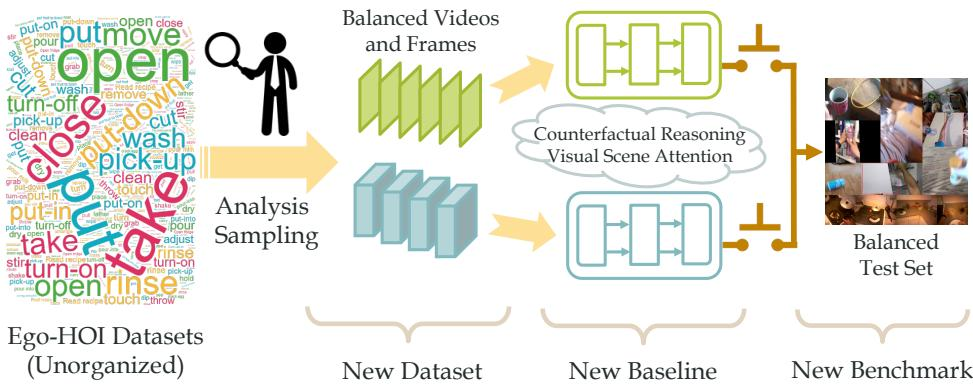
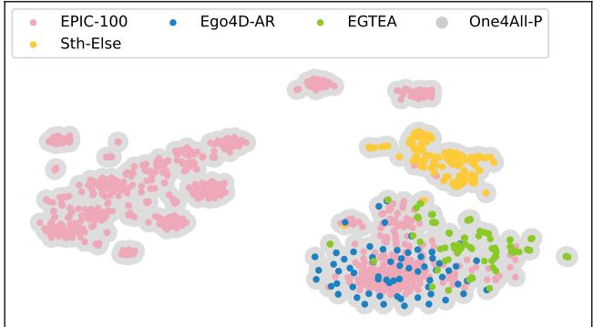
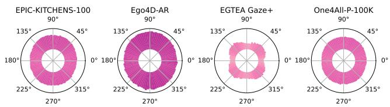
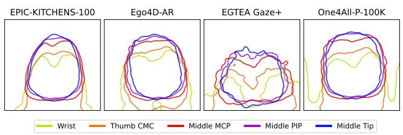
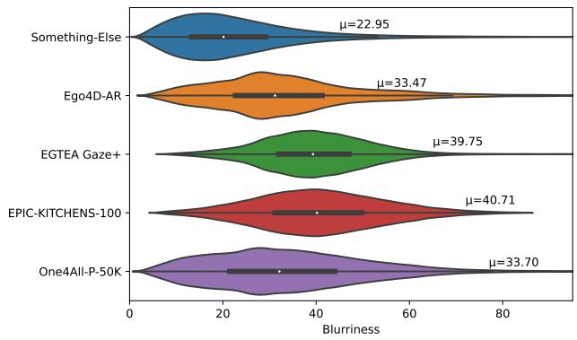
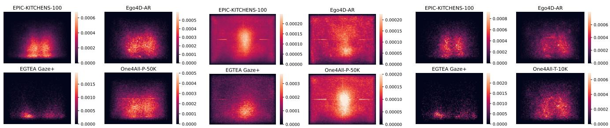
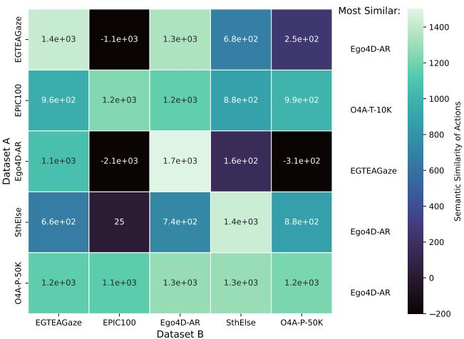
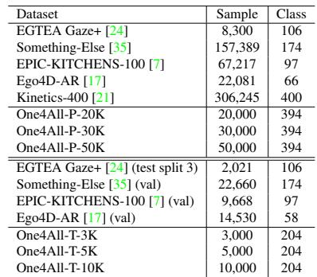
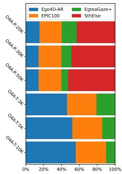
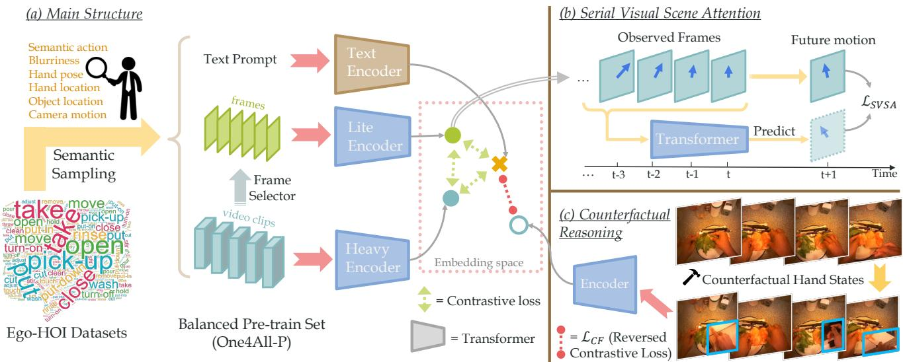

# EgoPCA: A New Framework for Egocentric Hand-Object Interaction Understanding

Yue Xu1, Yong-Lu Li1,2\*, Zhemin Huang1, Michael Xu Liu3, Cewu Lu1, Yu-Wing Tai4, Chi-Keung Tang2

1Shanghai Jiao Tong University 2HKUST 3New Hope Investment Group 4Dartmouth CollegeContr {silicxuyue, yonglu li, lucewu}@sjtu.edu.cn

zhemin.huang@outlook.com, Michaelliu@newhope.cn, yuwing@gmail.com, cktang@cs.ust.hk

  
Figure 1: A new framework for Ego-HOI learning, consisting of a new benchmark, a new baseline model, and a learning mechanism.

## Abstract

With the surge in attention to Egocentric Hand-Object Interaction (Ego-HOI), large-scale datasets such as Ego4D and EPIC-KITCHENS have been proposed. However, most current research is built on resources derived from thirdperson video action recognition. This inherent domain gap between first- and third-person action videos, which have not been adequately addressed before, makes current Ego-HOI suboptimal. This paper rethinks and proposes a new framework as an infrastructure to advance Ego-HOI recognition by Probing, Curation and Adaption (EgoPCA). We contribute comprehensive pre-train sets, balanced test sets and a new baseline, which are complete with a trainingfinetuning strategy. With our new framework, we not only achieve state-of-the-art performance on Ego-HOI benchmarks but also build several new and effective mechanisms and settings to advance further research. We believe our data and the findings will pave a new way for Ego-HOI

understanding. Code and data are available at https: //mvig-rhos.com/ego\_pca.

## 1. Introduction

Understanding Egocentric Hand-Object Interaction (Ego-HOI) is a fundamental task for computer vision and embodied AI. To promote HOI learning, many egocentric video datasets [17, 7, 24, 16, 44] have been released, which contributed to recent advances in this direction. Recently, deep learning based methods [50, 12, 4], especially Transformers and visual-language models [11, 1, 2, 51] have achieved high performances on these benchmarks.

Though significant progress has been made, challenges remain. With few better choices available, current studies on Ego-HOI typically adopt existing tools and settings of third-person action recognition, despite the significant domain gap between egocentric and exocentric action [44, 25]. Notably, third-person action depicts almost full human body and associated poses, while first-person action typically only engages hands; third-person videos are usually stable or readily stabilized, while first-person videos can exhibit different degrees of camera motion and shaking, which are possibly intended by the actor. Given the large domain gap, existing methods inherited from third-person vision are arguably unsuitable. Moreover, it remains unclear whether the existing Ego-HOI datasets [17, 7, 24, 35, 44] can support the model pre-training for transferability on downstream tasks. Thus, here, we address the important technical question in Ego-HOI: What are the effective model and training mechanisms for Ego-HOI learning?

To understand the need for a new baseline and customized training for Ego-HOI learning, we analyze the existing paradigm and observe three main weaknesses: 1) Previous methods are mainly based on models pre-trained on Kinetics [21]. It has been widely discussed that thirdperson action datasets like Kinetics have a huge domain and the semantic gap with egocentric videos [44, 43, 59, 5, 25]. Thus, we need a new pre-train set specifically designed for Ego-HOI; 2) Previous ad-hoc models are designed for thirdperson video learning. And these solutions are typically tailored to address one or a limited subset of Ego-HOI learning instead of a more general one-for-all model, i.e., one model for all Ego-HOI benchmarks; 3) In current schemes, finetuning one shared pre-trained model for all downstream tasks is inefficient, which also falls short of adapting to every downstream task or benchmark. Therefore, a taskspecific scheme is necessary so that we can efficiently learn a customized model for each downstream task.

In light of these weaknesses, in this work, we propose a novel basic framework for Ego-HOI learning by Probing, Curation and Adaption (EgoPCA): we probe the properties of Ego-HOI videos, based on which we leverage data curation for balanced pre-train and test datasets, and finally adapt the model according to specific tasks. The details are as follows.

1) New Pre-Train and Test Sets. We build a new comprehensive pre-train set based on the videos from Ego-HOI datasets. Although multiple datasets are available for training a universal Ego-HOI model, the noisy, highly long-tailed source datasets (e.g., EPIC-KITCHEN [7] and EGTEA Gaze+ [24]) can introduce imbalance to the pretrained models and thus adversely influence their generalization ability [10]. The bulky “head” data in the longtailed distribution also result in unmanageable training cost given the current rapid growth of the model and data size. Hence we propose to seek a balanced pretrain data distribution for the training efficacy and efficiency. In the scope of Ego-HOI, the data should be balanced not only on the semantics of samples but also on the other video properties such as camera motion or hand poses. After conducting thorough studies on Ego-HOI video properties, we sample a small but balanced and informative subset from multiple datasets [17, 7, 24, 35]. which can support better transfer learning for downstream tasks with domain and semantic gaps. Alongside, a new balanced test set is built that accounts for the long-tailed distribution of Ego-HOI videos and its HOI semantics for fair and unbiased evaluation of models, which is a widely adopted approach [32].

2) One-for-All Baseline Model. We propose a new baseline given the unique egocentric video properties, that consist of an efficient lite network and a representative heavy network, which can leverage both frames and videos in training. Moreover, we observe that the camera motion associated with Ego-HOI videos often correlates to serial attention to the visual scene of interaction. So we propose Serial Visual Scene Attention (SVSA) prediction task to exploit such knowledge. In particular, we incorporate counterfactual reasoning in ego-videos, applying intervention on the “hand” causal node by replacing the hand patch with different hand states while keeping the scene/background. The model output should change after intervention. With these constraints, our baseline achieves state-of-the-art (SOTA) on several benchmarks when pre-trained on our training set, and outperforms the SOTA significantly on our test set.

3) All-for-One Customized Mechanism. Towards the best settings for each downstream task, we propose a new video sampling and selection algorithm based on the egovideo properties analysis. Given our one-for-all model, we apply our optimal training and tuning policies for each task. Subsequently, we further outperform the performance of our one-for-all model on several benchmarks.

Overall, to “standardize” Ego-HOI learning and integrate resources, our contributions are: 1) we revisit the Ego-HOI tasks and analyze the data from the perspectives of dataset construction and model design; 2) according to our analysis, instead of directly using the third-person video methods/tools, we propose a new framework (pre-train set, baseline, and test set) designed exclusively for Ego-HOI; 3) to pursue SOTA while minimizing training costs, we propose a customized approach for downstream tasks.

## 2. Related Work

## 2.1. HOI Understanding

Different from the third-person and general HOI learning [26, 27] that studies the interactions between the whole body and object, Ego-HOI only focuses on the hand-object interactions in the egocentric view. Recently, various Ego-HOI datasets have been proposed [17, 7, 24, 16, 44]. EPIC-KITCHENS [7] is one of the first large-scale Ego-HOI datasets with over 80 K instances, more general actions, and objects, where hand and object positions are available. Similarly, EGTEA Gaze+ [24] contains HOI annotation and provides auxiliary gaze data. The success of deep learning has promoted the development of Ego-HOI recognition models, including 2D ConvNets [50], multi-stream networks [12], and 3D ConvNets [4]. Transformer-based networks and visual-language models have played important roles in HOI learning [11, 22, 51], which can significantly boost performance.

## 2.2. Video Action Recognition

Video action recognition is a foundational task. In terms of backbones, previous methods can roughly fall into three groups. Two-stream [46, 49, 13], 3D CNN [4, 48, 57, 12], and Transformer methods [2, 1, 11, 55, 33]. In terms of large-scale pre-training, it has already been a standard procedure for Ego-HOI models. In the early ages, researchers leverage the pre-training on large-scale image datasets, e.g., ImageNet [8, 41] and MS-COCO [31]. Some methods follow the image pre-training and extract features from video frames, while such methods can not exploit the temporal information and require aggregation of such information. Given large-scale video datasets, methods [39, 15, 14, 23, 28] pre-train models on Kinetics [21, 4] or HowTo100M [36] to utilize the transferability and enhance recognition. Besides, CLIP [40] is a milestone in adopting contrastive learning with large-scale image-text pairs, demonstrating outstanding zero-shot performance. In terms of transfer learning, previous works typically finetune the pre-trained backbone paired with a new classifier to adapt to downstream tasks. ActionCLIP [51] end-to-end finetunes on target datasets and shows that finetuning is critical to both language and image encoders. Ego-Exo [25] uses Kinetics pre-trained backbone and finetunes it on the target egocentric dataset.

## 3. Ego-HOI Videos

Egocentric videos have various properties from exocentric videos as they are often characterized by more camera motions, higher blurriness, etc. So we explore the key properties inherent in Ego-HOI videos to guide the framework design (Section 3.1) and propose our sampling strategy for balanced data. We introduce the ego-property similarity and selection method (Section 3.2) and the construction of our pre-train set One4All-P (Section 3.3), which is comprehensive, generalizable and transferable. Finally, we construct our balanced test set One4All-T (Section 3.4).

## 3.1. Ego-HOI Video Properties

We first present how to quantitatively measure the video properties to visualize and derive our sampling strategy. The comprehensive analysis will be presented on five datasets: EPIC-KITCHENS-100 [7], EGTEA Gaze+ [24], Ego4D-AR 1, Something-Else [35] and our One4All-P.

  
Figure 2: Semantic distribution of actions of Ego-HOI train sets. We use BERT [9] embeddings to visualize the classes.

Ego-HOI Semantics. The action label of a video clip is one of the most important properties of egocentric videos. Considering the ego-property similarity in the labels among different datasets, we represent the HOI semantics of a video clip as the label word vectors extracted by the pretrained BERT [9]. Thus, videos with similar HOIs are in close proximity in the BERT latent space. Figure 2 depicts the t-SNE visualization of the class semantics of several datasets, which shows that our One4All-P spans the largest area and that the class embeddings of Something-Else are differently located from the rest of the datasets.

Camera Motion. Different from third-person videos typically shot by stable cameras, egocentric videos are captured by wearable cameras, so they exhibit a wider variety of viewpoints, view angles, and shaking movements. Such camera motions highly correlate to the human’s intention in the HOI task which helps video understanding, e.g., which object to interact with in the next step. We use dense optical flows between frames to quantify per-pixel camera motion. We compute the polar histogram of shift vectors by angles and take the angle and length of the largest bin to represent the camera motion of the frame. The camera motion of each video is represented as the polar histogram of motion vectors of the frames. Figure 3 shows the polar histogram of camera motion of datasets, and EPIC-100 and Ego4D-AR exhibit larger motion than EGTEA and One4All-P.

Blurriness. Egocentric videos can be blurry due to fast camera motion, either intentional or occasional. We measure the blurriness by the variance of Laplacian of the frames since a blurry frame has a smaller variance of Laplacian. Then each video is represented as the mean and variance of blurriness of multiple frames. Figure 5 shows the distribution of blurriness. Something-Else has the lowest blurriness score as it was captured with less camera movement. In comparison, our One4All-P is more balanced in blurriness and covers the blurriness ranges of other datasets.

Hand/Object Location. The location distribution of hands or objects varies among different datasets. We extract the hands and objects’ location with existing detection toolboxes (MMPose [6] for hand and Detic [61] for object), and each video is represented as discrete heatmaps of hands and objects. We show the heatmaps of hand and object locations (Figure 6, 7). The hands and objects are primarily located at the bottom of the frames in EGTEA Gaze+, while they are rather arbitrary in EPIC-100 and One4All-P.

  
Figure 3: Camera motion polar histogram of Ego-HOI train sets. The length and angle of the bars: the motion magnitude and angle.

  
Figure 4: Hand pose. We show the high-density contours of the heatmaps of different hand keypoints on different train sets.

  
Figure 5: Blurriness (train sets). µ: average blurriness value.

Hand Pose. To more accurately capture the detail of human hands, we measure the hand pose in videos with an off-the-shelf pose detector (MMPose [6]). Then, each video clip is represented as the 21 keypoints (a 42-dim vector). Figure 4 visualizes the distribution of hand poses, where we generate heatmaps of 5 main keypoints (from wrist to middle fingertip) and draw the contours of their high-density area. The figure shows that the hands are usually placed vertically and fingers pointing upwards in Ego-HOI datasets, which is omitted in hand box representations. Moreover, the hands in EPIC-100 are closer to the center than those of EGTEA Gaze+. Compared to EPIC-100 and Ego4D, the hand pose of One4All-P is more diversified.

We also present comparisons between valid/test sets of Ego-HOI datasets. The hand location heatmaps are shown in Figure 8. For the rest, please refer to the supplementary. Our One4All-Val also shows balancedness on the proposed video properties over other datasets.

## 3.2. Ego-Property Similarity

To measure the property similarity between datasets, we propose the ego-property similarity. For the similarity between sets A and B, we use Kernel Density Estimation (KDE) to estimate the distribution of A as $\widetilde { P _ { A } }$ . Then the similarity is measured as the likelihood of the set B on $P _ { A } \colon$

$$
\operatorname { S i m } ( A , B ) = { \widetilde { P _ { A } } } ( B ) = \prod _ { x \in B } { \widetilde { P _ { A } } } ( x ) ,\tag{1}
$$

where the representation x of a sample is one of the aforementioned quantitative properties, e.g. semantic BERT vectors, hand pose keypoints. In KDE, we assume the Gaus-

Algorithm 1 Video Selection   
Input: Source data $S$ and extra data $E ,$ KDE update fre  
quency $k ,$ target instance number $m ,$ temperature τ   
Output: Selected instances $T = \{ t _ { 1 } , \cdots , t _ { m } \}$   
1: $T \gets \{ \}$   
2: repeat   
3: Train KDE model $P _ { S }$ with source data $S ,$   
4: Compute log-likelihood $q _ { i } = \log P _ { S } \left( e _ { i } \right) , \forall e _ { i } \in E ,$   
5: Compute sampling probability $p _ { i }$ with Equation $2$   
6: Draw k instances $E _ { k }$ from $E$ with distribution $p _ { i }$   
7: $S \gets S \bigcup E _ { k } , T \gets T \bigcup E _ { k }$   
8: $E  E \backslash E _ { k }$   
9: until $| S |$ reach m

sian kernels have diagonal covariance, and the bandwidth of each dimension is selected with Silverman’s estimator [45]. Exceptionally, for the blurriness, we regard the mean values of blurriness of video frames as the representation x and the standard deviation as the bandwidth. As an example, we compare the ego-property similarity between datasets in Figure 9 and list the most similar dataset for each dataset.

Video Selection. Based on the ego-property similarity, we propose an ego-property similarity-based selection algorithm to sample extra data to enrich the original video set towards balancedness or higher performance. We estimate the KDE distribution $\widetilde { P _ { S } }$ of source dataset $S$ and select a subset T from extra dataset E based on the likelihood $\widetilde { P _ { S } } ( e _ { i } )$ of each sample $e _ { i } .$ . If the aim is performance, we maximize the ego-property similarity between S and $T ,$ , so the sampling probability is the normalized likelihood $p _ { i } \propto \widetilde { P _ { S } } ( e _ { i } )$ . And if the aim is balancedness, we maximize the distance between S and T for data diversity, so we incorporat reversed probability $p _ { i } \propto \widetilde { P _ { S } } ( e _ { i } ) ^ { - 1 }$ . Since the z-score normalization of probability is equal to the softmax of log-likelihood, the sampling probability is formulated:

  
Figure 6: Hand location heatmaps of Ego-HOI datasets (train set).  
Figure 7: Object location heatmaps of Ego-HOI datasets (train set).  
Figure 8: Comparison of hand location of test set of Ego-HOI datasets.

<table><tr><td></td><td>Random</td><td>Action Semantic</td><td>Camera Motion</td><td>Blurriness</td><td>Hand Location</td><td>Object Location</td><td>Hand Pose</td><td>Unified (best weight)</td></tr><tr><td>+5%</td><td>69.7 (+0.3)</td><td>70.0 (+0.5)</td><td>70.5 (+1.0)</td><td>70.0 (+0.5)</td><td>70.5 (+1.0)</td><td>70.5 (+1.1)</td><td>70.3 (+0.9)</td><td>70.6 (+1.2)</td></tr><tr><td>+10%</td><td>69.7 (+0.2)</td><td>70.1 (+0.6)</td><td>70.2 (+0.8)</td><td>70.2 (+0.7)</td><td>71.0 (+1.5)</td><td>69.7 (+0.3)</td><td>70.0 (+0.6)</td><td>70.6 (+1.2)</td></tr><tr><td>+20%</td><td>69.6 (+0.2)</td><td>70.2 (+0.8)</td><td>70.3 (+0.8)</td><td>70.0 (+0.5)</td><td>70.9 (+1.5)</td><td>70.3 (+0.8)</td><td>70.2 (+0.7)</td><td>71.2 (+1.8)</td></tr></table>

Table 1: Performance after adding data to EGTEA Gaze+ [24] split 3 according to various criteria. The baseline (w/o additional data) accuracy is 69.4%. We find that the camera motion, hand location/pose, and object location are more important among all the factors.

  
Figure 9: The unified ego-property similarity between datasets.

$$
p _ { i } = \left\{ \begin{array} { l l } { \mathrm { s o f t m a x } ( \frac { 1 } { \tau } \log \widetilde { P _ { S } } ( e _ { i } ) ) , \quad ( \mathrm { p e r f o r m a n c e } ) } \\ { \mathrm { s o f t m a x } ( - \frac { 1 } { \tau } \log \widetilde { P _ { S } } ( e _ { i } ) ) , \quad ( \mathrm { b a l a n c e d n e s s } ) } \end{array} \right.\tag{2}
$$

where temperature τ modulates the sampling strength. We gradually select samples and update the KDE distribution per k instances. The input is our video property representations. The complete algorithm is shown in Algorithm 1.

We conduct an ablation study in Table 1. We add auxiliary videos from 3 other datasets ([7, 35, 17]) to EGTEA Gaze+ to enhance the performance according to different video properties. Results indicate that camera motion, hand location and pose, and object location are better criteria for video selection compared to semantics, blurriness, etc.

(a) Datasets  

  
(b) Data Sources  
Table 2: Previous datasets and our pre-train/test sets. (a) The upper block indicates the (pre)train sets and the lower block shows the validation/test sets. (b) The components in our datasets.

Unified Ego-Property Based Sampling. Then we propose a unified sampling criterion with ego properties. We compute the sampling probability with Eq. 2 for each video property and take their weighted sum as unified sampling probability. The weight is obtained in proportion to the significance of each property. An example is given in Table 1. The ablation shows the superiority of the unified criterion.

## 3.3. Constructing A Comprehensive Pre-train Set

Considering the generalization and transfer ability of the pre-trained model, we intend for a more comprehensive pre-train set, which is balanced and diverse not only on labels but also on the proposed properties. With the egoproperty similarity and selection algorithm, we progressively select samples to enhance the dataset’s balancedness on multiple properties while ensuring high sample diversity. We construct our pre-train set with EPIC-KITCHENS-100, EGTEA Gaze+, Something-Else, and Ego4D-AR. Note that we only use Something-Else for training since it also contains third-person videos (roughly 10%), in order to exploit its high diversity in hand and object. We first merge the action labels of the datasets and merge the semantically identical classes. Then we randomly sample 30 instances for each class for a class-balanced base dataset. Then, the Algorithm 1 is applied to complement the dataset while keeping the balancedness. Thus, we propose our pre-train datasets One4All-P-20K, One4All-P-30K, and One4All-P-50K, with 20 K, 30 K, and 50 K video clips respectively. Table 2 shows their details. Here, we aim at studying how to build a high-quality while minimal pre-train set to improve efficiency while pursuing maximum performance. Adding more data may indeed improve performance while sometimes may degrade the scores, as the more severe longtailed distribution, the less diversity, background bias, etc.

## 3.4. Constructing A More Balanced Test Set

The widely adopted Ego-HOI benchmarks like EPIC-KITCHENS and EGTEA-Gaze+ are either limited in scale or possess severely long-tailed test sets, resulting in a skewed evaluation. Thus, a more balanced test set is required by the Ego-HOI community for a fair and balanced evaluation, which is balanced from multiple aspects like interaction semantics, hand/object locations, etc. We use the same video selection approach (Algorithm 1) to extract our new test sets One4All-T-5K, One4All-T-10K, and One4All-T-20K. Table 2 tabulates the details of the test set.

## 4. Methodology

We propose our paradigm based on the analysis. Existing methods typically adopt approaches of third-person action. Considering the gap between egocentric and exocentric HOI, we propose a baseline and pre-train it on our pre-train dataset for a one-for-all model (Section 4.1). Then the pre-trained model can be finetuned to a stronger taskspecific model with our customization (Section 4.2).

## 4.1. One-for-All (One4All) Baseline Model

Ego-HOI data has unique properties making it unsuitable to use third-person models and pre-train directly. Moreover, these properties should be utilized rather than ignored in Ego-HOI models. So we propose a new baseline model for Ego-HOI learning. As shown in Figure 11, our model resembles CLIP [40] and consists of three encoders: lite, heavy, and text networks. The lite network captures frame-level features while the heavy network learns spatiotemporal features. These two streams are aligned with the text feature. As the instances in a batch may belong to the same class, we incorporate a KL contrastive loss following [51] different from CLIP [40]: in each B-sized batch, the output visual features $\mathbf { F } = f _ { i } | _ { i = 1 } ^ { B }$ are aligned with the text feature $\mathbf { T } = \pmb { t } _ { i } | _ { i = 1 } ^ { B }$ of label prompts by the loss:

$$
\begin{array} { r } { \mathcal { L } _ { k l } \left( \mathbf { F } , \mathbf { T } , \pmb { y } \right) = \frac { 1 } { B } \displaystyle \sum _ { i = 1 } ^ { B } K L [ S o f t m a x ( \frac { S _ { i \star } } { \tau } ) \| Q _ { i \star } ] + } \\ { \frac { 1 } { B } \displaystyle \sum _ { j = 1 } ^ { B } K L [ S o f t m a x ( \frac { S _ { \star j } } { \tau } ) \| Q _ { \star j } ] , } \end{array}\tag{3}
$$

where y is the class label and $\tau$ is the softmax temperature. $S _ { i j } = \cos ( f _ { i } , \ t _ { j } )$ is the cosine similarity matrix between visual and text features. Q is the ground truth matrix and $Q _ { i j }$ is 1 only if $i ^ { t h }$ and $j ^ { t h }$ instance is in the same class. The KL contrastive loss draws closer to the visual and text features that have the same semantics.

Specifically, the model is trained in multiple steps. First, the frame-level lite network is pre-trained with frame-text pairs in Ego-HOI data. Then we freeze the frame encoder and pre-train ATP module [3] with video-text pairs. ATP is a keyframe selector that automatically selects the most informative frame given a batch of features. We sample N frames for each video clip, from which the ATP module selects the feature of one frame to represent the video. Both steps are supervised by KL contrastive loss as Equation 3.

After that, both the frame encoder and ATP module are frozen during the joint training of lite and heavy networks on our One4All-P dataset. For each video in a batch, we sample $L _ { 1 } \times N$ frames to the frame encoder and the ATP module selects $L _ { 1 }$ frames. A shallow Transformer will aggregate the frame features to $\mathbf { F } _ { l } .$ Another $L _ { 2 }$ frames are sent to the heavy network for video representation $\mathbf { F } _ { h }$ . Both features are aligned with the text feature by constraint:

$$
\begin{array} { r l } & { \mathcal { L } _ { C L } \left( { { \bf { F } } _ { l } } , { { \bf { F } } _ { h } } , { \bf { T } } \right) = \mathcal { L } _ { k l } \left( { { \bf { F } } _ { l } } , { { \bf { T } } } , { y } \right) } \\ & { \qquad + \mathcal { L } _ { k l } \left( { { \bf { F } } _ { h } } , { \bf { T } } , { y } \right) + \mathcal { L } _ { c e } \left( { { \bf { F } } _ { l } } , { { \bf { F } } _ { h } } \right) . } \end{array}\tag{4}
$$

$\mathcal { L } _ { c e }$ is the CE contrastive loss in CLIP [40] since we only align the lite and heavy features of the same instance.

During inference, the lite and heavy networks independently generate prediction by cosine similarity to the text embeddings of the classes. The two streams can be combined by mean pooling to produce the Full model result. In the non-zero-shot scenario, linear probing can be applied to enhance fixed-class recognition performance. Thus, our method is flexible in HOI learning. The full model achieves better model performance, while the lite or heavy models are more efficient and amenable to customization.

Given the special properties of Ego-HOI videos, we further design two customized constraints to better utilize the rich information inherent in Ego-HOI videos.

Serial Visual Scene Attention Learning (SVSA). If a model can learn human intention from its associated view changes, dubbed as SVSA, its focus on the view of HOI should be temporally continuous and thus predictable. We enhance the learning of SVSA with an auxiliary task by proposing to predict the movement of the view center from the semantic feature flow. As shown in Figure 11, we hope the motion direction can be recoverable. Thankfully, for each video clip with sampled frame features $\mathbf { F } = \mathbf { \mathsf { \pmb { f } } } _ { i } | _ { i = 1 } ^ { L } ,$ we have already extracted the camera motion $m = [ x , y ]$ during the dataset analysis, which stands for the movement of the camera center from $L ^ { t h }$ frame to $( L + 1 ) ^ { t h }$ frame. So we propose the following SVSA constraint:

Figure 11: Baseline model overview. (a) It consists of a lite and a heavy network. The embeddings are aligned with text features by contrastive learning; (b, c) Given the unique properties, we propose SVSA and counterfactual reasoning to promote Ego-HOI learning.
<table><tr><td>Model</td><td>Pre-train Set</td><td></td><td>Ego4D-AR</td><td>EPIC-100</td><td>EGTEA</td><td>One4All-T-3k</td><td>One4All-T-5K</td><td>One4All-T-10k</td></tr><tr><td>1</td><td>Chance</td><td>1</td><td>1.6</td><td>1.0</td><td>1.1</td><td>0.2</td><td>0.2</td><td>0.2</td></tr><tr><td>2</td><td>CLIP [40]</td><td>CLIP 400M</td><td>4.0</td><td>10.4</td><td>17.2</td><td>2.3</td><td>1.8</td><td>1.5</td></tr><tr><td>3</td><td>CLIP [40]</td><td>Kinetics-400</td><td>3.0</td><td>7.2</td><td>23.7</td><td>3.5</td><td>2.6</td><td>2.2</td></tr><tr><td>4</td><td>ActionCLIP [51]</td><td>Kinetics-400</td><td>3.0</td><td>8.8</td><td>18.5</td><td>2.9</td><td>2.2</td><td>1.8</td></tr><tr><td>5</td><td>EgoVLP [30]</td><td>EgoClip</td><td>2.1</td><td>5.5</td><td>12.4</td><td>1.6</td><td>1.2</td><td>1.0</td></tr><tr><td>6</td><td>CLIP [40]</td><td>One4All-P-50K</td><td>6.9</td><td>21.4</td><td>35.7</td><td>15.7</td><td>14.6</td><td>13.7</td></tr><tr><td>7</td><td>ActionCLIP [51]</td><td>One4All-P-50K</td><td>5.8</td><td>33.8</td><td>44.2</td><td>21.0</td><td>20.1</td><td>19.3</td></tr><tr><td>8</td><td>Ours (Full)</td><td>Random-50K</td><td>6.9</td><td>34.6</td><td>50.5</td><td>22.7</td><td>20.7</td><td>20.2</td></tr><tr><td>9</td><td>Ours (Lite)</td><td>One4All-P-50K</td><td>5.6</td><td>40.5</td><td>48.9</td><td>23.2</td><td>22.2</td><td>21.4</td></tr><tr><td>10</td><td>Ours (Full)</td><td>One4All-P-20K</td><td>6.6</td><td>35.1</td><td>50.8</td><td>22.5</td><td>20.8</td><td>19.5</td></tr><tr><td>11</td><td>Ours (Full)</td><td>One4All-P-30K</td><td>6.0</td><td>35.7</td><td>52.5</td><td>22.7</td><td>20.9</td><td>19.7</td></tr><tr><td>12</td><td>Ours (Full)</td><td>One4All-P-50K</td><td>7.2</td><td>41.8</td><td>52.9</td><td>25.1</td><td>23.8</td><td>23.3</td></tr></table>

Table 3: Performance of one-for-all model on benchmarks. Our lite model adopts the CLIP pre-trained model, and the heavy model uses a Kinetics-400 pre-trained MViT backbone. Full means the simple late fusion of the lite and heavy model logits. Top-1 accuracy is reported.

$$
\mathcal { L } _ { S V S A } \left( \mathbf { F } , m \right) = 1 - \cos \langle \mathcal { F } _ { s } ( \mathbf { F } ) , m \rangle ,\tag{5}
$$

where $\mathcal { F } _ { s }$ is a shallow network receiving a frame feature sequence and outputs a 2D direction vector. The negative cosine drives the predicted angle to approach ground truth. Here, we use 2D motion. Considering 3D may bring a new improvement, but it is more expensive given egocentric videos for 3D reconstruction.

Counterfactual Reasoning for Ego-HOI. Counterfactual causation studies the outcome of an event if the event does not actually occur and we leverage counterfactual learning to enhance causal robustness. We construct counterfactual Ego-HOI samples. In Figure 11, for a clip with frames $\mathbf { F } = f _ { i } | _ { i = 1 } ^ { L }$ , we modify the “hand” node (hand state) and expect changes in the output. We sample α% from the L frames and construct counterfactual video $\mathbf { F } _ { c f }$ by 1) replacing the whole frames by frames in the same video but with dissimilar hand pose or action label, or 2) if possible, replacing the hand area by hand boxes of other frames with different hand poses or action labels. Thus we modify the hand node without changing other nodes. We propose a constraint to supervise the prediction after counterfactual modification, as a “reversed” contrastive loss [19]:

<table><tr><td>Method</td><td>Ego4D-AR</td><td>EGTEA</td></tr><tr><td>SOTA</td><td>16.3</td><td>64.0</td></tr><tr><td>Ours (full) Ours (full, +5%)</td><td>17.6 17.8</td><td>70.8 71.1</td></tr><tr><td>Ours (full, +10%)</td><td>18.5</td><td>71.5</td></tr><tr><td>Ours (full, +20%)</td><td>17.9</td><td>71.5</td></tr><tr><td>Ours (full, -5% ⇒ +5%)</td><td>17.7</td><td>70.4</td></tr><tr><td>Ours (full, -10% ⇒ +10%)</td><td>17.9</td><td>70.2</td></tr><tr><td>Ours (full, -20% ⇒ +20%)</td><td>16.8</td><td></td></tr><tr><td></td><td></td><td>68.4</td></tr></table>

Table 5: Results of customized all-for-one strategy. Adding samples with our sampling strategy brings significant improvement. Replacing samples also enhances the models while maintaining the training efficiency.

$$
\mathcal { L } _ { C F } ( \mathbf { F } , y ) = \operatorname* { m a x } \left[ 0 , \gamma - \cos \langle \mathcal { T } ( y ) , \mathcal { V } ( \mathbf { F } _ { c f } ) \rangle \right] ^ { 2 } ,\tag{6}
$$

where $\nu$ and $\tau$ are the visual (lite/heavy) and text net, and $\gamma$ is the contrastive margin to clamp the cosine similarity and penalize the cosine similarity that is smaller than γ. This constraint ensures that the label of the counterfactual sample is semantically different from the original GT.

The full training loss with weight $\lambda _ { 1 } , \lambda _ { 2 }$ is:

$$
\mathcal { L } = \mathcal { L } _ { C L } + \lambda _ { 1 } \mathcal { L } _ { S V S A } + \lambda _ { 2 } \mathcal { L } _ { C F } .\tag{7}
$$

## 4.2. All-for-One (All4One) Customized Mechanism

Our pre-train set and baseline yield high-performing Ego-HOI models, which can be further strengthened with customized strategies on each dataset. Besides the datasetspecific finetuning, we can add informative samples to enhance the performance with minimum overhead based on the video properties of each instance and video selection (Algorithm 1), instead of adding data optionally. And recent research [42] shows that removing samples only results in minor performance degradation, and at times even produces slight improvement. Thus we apply data pruning before addition to offset its overhead. The pruning is similar to video selection where instances with high KDE likelihood are removed, as they are more likely to be redundant.

## 5. Experiments

## 5.1. Datasets

Our experiments are conducted on several widelyemployed egocentric datasets: EPIC-KITCHENS-100 [7], EGTEA Gaze+ [24], Ego4D-AR [17] (Table 2). Please refer to the supplementary for details of Ego4D-AR. We report top-1 verb accuracy on EPIC-KITCHENS-100, Ego4D-AR, and action accuracy on EGTEA-Gaze+.

## 5.2. Implementation Details

We apply video selection on several datasets and in particular, Something-Else [35] is used in pre-train set construction. In the analysis and selection, for semantics, we use pre-trained BERT-Base for semantic embeddings. For hand location and pose, the frames are sampled at FPS=2 and we use cascade mask-RCNN with ResNeXt101 and ResNet50 pose estimator [56] pre-trained on Onehand10k [54] from MMPose [6]. For object location, the frames are sampled at FPS=2 and we use ImageNet-21K [8]+LVIS [18] pre-trained Detic [61] with Swin transformer [33]. For camera motion, the frames are sampled at FPS=8 and we estimate the Gunnar-Farneback optical flow. The shift vectors are put into 90 bins by their angles. For blurriness, we resize the frames to 65,536 pixels for a fair comparison. We use ViT as the lite network and MViT as the heavy network. The frame-level ViT is 12-layered and the patch size used is 16. The video MViT [11] receives $1 6 \times 1 6 \times 3$ tubelet embeddings. The text network is a 12-layered Transformer. The ATP module connecting the image stream and video stream is a fully connected layer. The aggregator of frame features in the lite network is 6- layered Transformers and the SVSA estimator is 3-layered Transformers.

For more details, please refer to the supplementary.

## 5.3. One-for-All Model

We first train our model on One4All-P. We compare our method with multiple methods and pre-train datasets. Table 3 shows that our Full method surpasses the previous models and pre-train sets on all benchmarks. The lite network also outperforms previous methods on EGTEA-Gaze+. The overall performance on Ego4D-AR is lower than other benchmarks due to its zero-shot test samples.

Pretrain Set Comparison. (Experiment {2, 3, 6}, {4, 7} , and {8, 10, 11, 12}) The models trained on One4All-P outperform the counterparts with other pre-train sets such as Kinetics-400. Besides, we randomly sample a subset of Random-50K from the same 4 datasets as One4All-P. Although given the same data source, pretraining on our One4All-P is superior to a random subset, showing that a balanced dataset indeed benefits the pretraining process and the design taken into consideration of our proposed video properties is proper for Ego-HOI videos.

Model Comparison. (Experiment {6, 7, 9, 12}) On the same pre-train set One4All-P-50K or Random-50K, our Full is the strongest one-for-all baseline on most benchmarks. On Ego4D-AR, our baseline is comparable to ActionCLIP but outperforms it on other benchmarks.

One4All-T. Besides the existing benchmarks, we evaluate the models on our test sets One4All-T in different sizes. One4All-T is a more balanced and harder test set, while our Full model still outperforms the rest on our test sets.

<table><tr><td rowspan=1 colspan=1>Method</td><td rowspan=1 colspan=1>Ego4D-AR</td></tr><tr><td rowspan=1 colspan=1>I3D [4]SlowFast [12]</td><td rowspan=1 colspan=1>14.6*16.1*</td></tr><tr><td rowspan=1 colspan=1>ActionCLIP [51]</td><td rowspan=1 colspan=1>12.3*</td></tr><tr><td rowspan=1 colspan=1>MViT-B/16x4 [11]ViViT-L/16x2 [1]</td><td rowspan=1 colspan=1>16.3*16.1*</td></tr><tr><td rowspan=1 colspan=1>Ours (lite)Ours (heavy)Ours (full)</td><td rowspan=1 colspan=1>12.717.217.6</td></tr></table>

(a) Ego4D-AR

<table><tr><td rowspan=1 colspan=1>Method</td><td rowspan=1 colspan=1>EPIC-100</td></tr><tr><td rowspan=1 colspan=1>TSM [29]</td><td rowspan=1 colspan=1>67.9</td></tr><tr><td rowspan=1 colspan=1>Ego-Exo [25]</td><td rowspan=1 colspan=1>67.0</td></tr><tr><td rowspan=1 colspan=1>IPL [53]</td><td rowspan=1 colspan=1>68.6</td></tr><tr><td rowspan=1 colspan=1>ViViT-L/16x2 [1]</td><td rowspan=1 colspan=1>66.4</td></tr><tr><td rowspan=1 colspan=1>MFormer-HR [38]</td><td rowspan=1 colspan=1>67.0</td></tr><tr><td rowspan=1 colspan=1>TimeSformer [2]</td><td rowspan=1 colspan=1>67.1</td></tr><tr><td rowspan=1 colspan=1>MeMViT/16x4 [55]</td><td rowspan=1 colspan=1>70.4</td></tr><tr><td rowspan=1 colspan=1>Ours (lite)Ours (heavy)Ours (full)</td><td rowspan=1 colspan=1>62.967.968.7</td></tr></table>

(b) EPIC-KITCHENS-100

<table><tr><td rowspan=1 colspan=1>Method</td><td rowspan=1 colspan=1>EGTEA</td></tr><tr><td rowspan=1 colspan=1>Kapidis et al. [20]Min et al. [37]Zhang et al. [60]</td><td rowspan=1 colspan=1>65.7†69.669.6†</td></tr><tr><td rowspan=1 colspan=1>I3D [4]TSM [29]</td><td rowspan=1 colspan=1>58.060.2</td></tr><tr><td rowspan=1 colspan=1>Ego-RNN et al. [47]</td><td rowspan=1 colspan=1>58.6</td></tr><tr><td rowspan=1 colspan=1>SAP [52]</td><td rowspan=1 colspan=1>62.0</td></tr><tr><td rowspan=1 colspan=1>TSM+STAM [58]Lu et al. [34]</td><td rowspan=1 colspan=1>64.068.6</td></tr><tr><td rowspan=1 colspan=1>Ours (lite)Ours (heavy)Ours (full)</td><td rowspan=1 colspan=1>66.269.870.8</td></tr></table>

(c) EGTEA Gaze+ split 3  
Table 4: Performance comparison on Ego4D-AR, EPIC-KITCHENS-100, EGTEA Gaze+ of the all-for-one models finetuned on each respective dataset. The results with \* are reproduced. (†: accuracy on 3 splits; ‡: accuracy on split 1. The actual split 3 accuracy is lower than the reported score for these two methods). Top-1 accuracy is reported here.

## 5.4. All-for-One Mechanism

With the pre-trained model, we finetune the model on each dataset, as shown in Table 4. Most baselines adopt Kinetics pretraining, only except TSM and Ego-RNN. Our method achieves the SOTA on Ego4D-AR, EGTEA-Gaze+ by over 1% margin. On EPIC-100, our method could be further improved if using a larger temporal reception field similar to MeMViT. We also apply our sampling strategy to select informative samples and strengthen our baseline in Table 5. With our unified selection criterion, adding only 10% of samples from the data pool brings about a 1% improvement on all datasets. Moreover, to enhance our model while keeping the training efficiency, we replace part of the train set with video selection and maintain the data size. Replacing only 5% to 10% of samples can bring performance gain on Ego4D-AR without adding cost. While on EGTEA-Gaze+, replacing samples leads to comparable performance, and replacing 20% leads to a drop since EGTEA has a larger domain gap than the other datasets and it is hard to find substitutes that can compensate for the semantic loss.

## 5.5. Ablation Study

We conduct ablations to justify our modules and designs.

SVSA and Counterfactual Reasoning. We exclude the SVSA or counterfactual reasoning task during training. As shown in Table 6, the full model suffers degradation without either $\mathcal { L } _ { S V S A }$ or $\mathcal { L } _ { C F }$ , which verifies their efficacy based on the unique property of Ego-HOI video.

Factor Weights. The factor weights of our unified criterion are crucial in video selection and dataset construction. The weight is derived according to the analysis and experiments on the video properties, where we find hand/object location, hand pose, and camera motion are more important. We conduct comparisons of weights in Table 7 and we use the empirical best weight combination in our method.

<table><tr><td>Method</td><td>EGTEA</td><td>Ego4D-AR</td></tr><tr><td>Full Model</td><td>70.8</td><td>17.6</td></tr><tr><td>w/o  $\mathcal { L } _ { S V S A }$ </td><td>70.1</td><td>16.8</td></tr><tr><td>w/o  $\mathcal { L } _ { C F }$ </td><td>70.3</td><td>17.0</td></tr><tr><td>w/o linear probing</td><td>70.6</td><td>16.8</td></tr></table>

Table 6: Ablation verifying model components, weights for video properties for the unified criterion, and model constraints.

<table><tr><td>Unified Weight</td><td>+5%</td><td>+10%</td><td>+20%</td></tr><tr><td>1:1:1:1:1:1</td><td>70.6</td><td>70.0</td><td>70.7</td></tr><tr><td> $0 : 1 : 1 : 0 : 1 : 0$ </td><td>70.2</td><td>70.0</td><td>70.4</td></tr><tr><td> $0 : 1 : 1 : 1 : 1 : 0$ </td><td>70.8</td><td>70.3</td><td>70.9</td></tr><tr><td>5:10:8:8:10:5(Ours)</td><td>70.6</td><td>70.6</td><td>71.2</td></tr></table>

Table 7: Ablations on weights (semantics, hand box, pose, object box, camera motion, blurriness) of the unified property on EGTEA-Gaze+. Baseline (w/o additional data) accuracy: 69.4%.

For more visualizations, limitations, and discussions, please refer to our supplementary materials.

## 6. Conclusion

In this work, we propose a new framework for Ego-HOI learning. Different from previous works relying on tools, data, and mechanisms from the 3rd-view recognition, we provide more balanced pre-train and test sets with more diverse semantics and hand-object spatial configurations to improve the pre-training and evaluation. And we propose a baseline and training mechanisms for downstream tasks. The experiments validate that our framework not only achieves SOTA on multiple benchmarks but also paves the way for more robust and fruitful Ego-HOI studies.

## References

[1] Anurag Arnab, Mostafa Dehghani, Georg Heigold, Chen Sun, Mario Luciˇ c, and Cordelia Schmid. Vivit: A video vi-´ sion transformer. In ICCV, 2021. 1, 3, 9

[2] Gedas Bertasius, Heng Wang, and Lorenzo Torresani. Is space-time attention all you need for video understanding? In ICML, 2021. 1, 3, 9

[3] Shyamal Buch, Cristobal Eyzaguirre, Adrien Gaidon, Jiajun´ Wu, Li Fei-Fei, and Juan Carlos Niebles. Revisiting the” video” in video-language understanding. In CVPR, 2022. 6

[4] Joao Carreira and Andrew Zisserman. Quo vadis, action recognition? a new model and the kinetics dataset. In CVPR, 2017. 1, 2, 3, 9

[5] Jinwoo Choi, Gaurav Sharma, Manmohan Chandraker, and Jia-Bin Huang. Unsupervised and semi-supervised domain adaptation for action recognition from drones. In Proceedings of the IEEE/CVF Winter Conference on Applications of Computer Vision, pages 1717–1726, 2020. 2

[6] MMPose Contributors. Openmmlab pose estimation toolbox and benchmark. https://github.com/ open-mmlab/mmpose, 2020. 4, 8

[7] Dima Damen, Hazel Doughty, Giovanni Maria Farinella, Sanja Fidler, Antonino Furnari, Evangelos Kazakos, Davide Moltisanti, Jonathan Munro, Toby Perrett, Will Price, et al. Scaling egocentric vision: The epic-kitchens dataset. In ECCV, 2018. 1, 2, 3, 5, 8

[8] Jia Deng, Wei Dong, Richard Socher, Li-Jia Li, Kai Li, and Li Fei-Fei. Imagenet: A large-scale hierarchical image database. In CVPR, 2009. 3, 8

[9] Jacob Devlin, Ming-Wei Chang, Kenton Lee, and Kristina Toutanova. Bert: Pre-training of deep bidirectional transformers for language understanding. arXiv preprint arXiv:1810.04805, 2018. 3

[10] Rahim Entezari, Mitchell Wortsman, Olga Saukh, M Moein Shariatnia, Hanie Sedghi, and Ludwig Schmidt. The role of pre-training data in transfer learning. arXiv preprint arXiv:2302.13602, 2023. 2

[11] Haoqi Fan, Bo Xiong, Karttikeya Mangalam, Yanghao Li, Zhicheng Yan, Jitendra Malik, and Christoph Feichtenhofer. Multiscale vision transformers. In ICCV, 2021. 1, 3, 8, 9

[12] Christoph Feichtenhofer, Haoqi Fan, Jitendra Malik, and Kaiming He. Slowfast networks for video recognition. In ICCV, 2019. 1, 2, 3, 9

[13] Christoph Feichtenhofer, Axel Pinz, and Richard Wildes. Spatiotemporal residual networks for video action recognition. In NIPS, 2016. 3

[14] Valentin Gabeur, Chen Sun, Karteek Alahari, and Cordelia Schmid. Multi-modal transformer for video retrieval. In ECCV, 2020. 3

[15] Rohit Girdhar, Joao Carreira, Carl Doersch, and Andrew Zisserman. Video action transformer network. In CVPR, 2019. 3

[16] Raghav Goyal, Samira Ebrahimi Kahou, Vincent Michalski, Joanna Materzynska, Susanne Westphal, Heuna Kim, Valentin Haenel, Ingo Fruend, Peter Yianilos, Moritz Mueller-Freitag, et al. The” something something” video

database for learning and evaluating visual common sense. In ICCV, 2017. 1, 2

[17] Kristen Grauman, Andrew Westbury, Eugene Byrne, Zachary Chavis, Antonino Furnari, Rohit Girdhar, Jackson Hamburger, Hao Jiang, Miao Liu, Xingyu Liu, et al. Ego4d: Around the world in 3,000 hours of egocentric video. In CVPR, 2022. 1, 2, 3, 5, 8

[18] Agrim Gupta, Piotr Dollar, and Ross Girshick. Lvis: A dataset for large vocabulary instance segmentation. In Proceedings of the IEEE/CVF conference on Computer Vision and Pattern Recognition, pages 5356–5364, 2019. 8

[19] Raia Hadsell, Sumit Chopra, and Yann LeCun. Dimensionality reduction by learning an invariant mapping. In CVPR, 2006. 8

[20] Georgios Kapidis, Ronald Poppe, Elsbeth van Dam, Lucas Noldus, and Remco Veltkamp. Multitask learning to improve egocentric action recognition. In ICCVW, 2019. 9

[21] Will Kay, Joao Carreira, Karen Simonyan, Brian Zhang, Chloe Hillier, Sudheendra Vijayanarasimhan, Fabio Viola, Tim Green, Trevor Back, Paul Natsev, et al. The kinetics human action video dataset. arXiv preprint arXiv:1705.06950, 2017. 2, 3, 5

[22] Dan Kondratyuk, Liangzhe Yuan, Yandong Li, Li Zhang, Mingxing Tan, Matthew Brown, and Boqing Gong. Movinets: Mobile video networks for efficient video recognition. In CVPR, 2021. 3

[23] Linjie Li, Yen-Chun Chen, Yu Cheng, Zhe Gan, Licheng Yu, and Jingjing Liu. Hero: Hierarchical encoder for video+ language omni-representation pre-training. In EMNLP, 2020. 3

[24] Yin Li, Miao Liu, and James M Rehg. In the eye of beholder: Joint learning of gaze and actions in first person video. In ECCV, 2018. 1, 2, 3, 5, 8

[25] Yanghao Li, Tushar Nagarajan, Bo Xiong, and Kristen Grauman. Ego-exo: Transferring visual representations from third-person to first-person videos. In CVPR, 2021. 1, 2, 3, 9

[26] Yong-Lu Li, Liang Xu, Xinpeng Liu, Xijie Huang, Yue Xu, Shiyi Wang, Hao-Shu Fang, Ze Ma, Mingyang Chen, and Cewu Lu. Pastanet: Toward human activity knowledge engine. In CVPR, 2020. 2

[27] Yong-Lu Li, Siyuan Zhou, Xijie Huang, Liang Xu, Ze Ma, Hao-Shu Fang, Yanfeng Wang, and Cewu Lu. Transferable interactiveness knowledge for human-object interaction detection. In CVPR, 2019. 2

[28] Zekang Li, Zongjia Li, Jinchao Zhang, Yang Feng, and Jie Zhou. Bridging text and video: A universal multimodal transformer for audio-visual scene-aware dialog. IEEE/ACM Transactions on Audio, Speech, and Language Processing, 29:2476–2483, 2021. 3

[29] Ji Lin, Chuang Gan, and Song Han. Tsm: Temporal shift module for efficient video understanding. In ICCV, 2019. 9

[30] Kevin Qinghong Lin, Alex Jinpeng Wang, Mattia Soldan, Michael Wray, Rui Yan, Eric Zhongcong Xu, Difei Gao, Rongcheng Tu, Wenzhe Zhao, Weijie Kong, et al. Egocentric video-language pretraining. In NeurIPS, 2022. 7

[31] Tsung-Yi Lin, Michael Maire, Serge Belongie, James Hays, Pietro Perona, Deva Ramanan, Piotr Dollar, and C Lawrence´ Zitnick. Microsoft coco: Common objects in context. In European conference on computer vision, pages 740–755. Springer, 2014. 3

[32] Ziwei Liu, Zhongqi Miao, Xiaohang Zhan, Jiayun Wang, Boqing Gong, and Stella X Yu. Large-scale long-tailed recognition in an open world. In Proceedings of the IEEE/CVF Conference on Computer Vision and Pattern Recognition, pages 2537–2546, 2019. 2

[33] Ze Liu, Jia Ning, Yue Cao, Yixuan Wei, Zheng Zhang, Stephen Lin, and Han Hu. Video swin transformer. In CVPR, 2022. 3, 8

[34] Minlong Lu, Danping Liao, and Ze-Nian Li. Learning spatiotemporal attention for egocentric action recognition. In ICCVW, 2019. 9

[35] Joanna Materzynska, Tete Xiao, Roei Herzig, Huijuan Xu, Xiaolong Wang, and Trevor Darrell. Something-else: Compositional action recognition with spatial-temporal interaction networks. In CVPR, 2020. 2, 3, 5, 8

[36] Antoine Miech, Dimitri Zhukov, Jean-Baptiste Alayrac, Makarand Tapaswi, Ivan Laptev, and Josef Sivic. Howto100m: Learning a text-video embedding by watching hundred million narrated video clips. In ICCV, 2019. 3

[37] Kyle Min and Jason J Corso. Integrating human gaze into attention for egocentric activity recognition. In WACV, 2021. 9

[38] Mandela Patrick, Dylan Campbell, Yuki Asano, Ishan Misra, Florian Metze, Christoph Feichtenhofer, Andrea Vedaldi, and Joao F. Henriques. Keeping your eye on the ball: Tra-˜ jectory attention in video transformers. In NeurIPS, 2021. 9

[39] Didik Purwanto, Rizard Renanda Adhi Pramono, Yie-Tarng Chen, and Wen-Hsien Fang. Extreme low resolution action recognition with spatial-temporal multi-head self-attention and knowledge distillation. In Proceedings ofthe IEEE/CVF International Conference on Computer Vision (ICCV) Workshops, 2019. 3

[40] Alec Radford, Jong Wook Kim, Chris Hallacy, Aditya Ramesh, Gabriel Goh, Sandhini Agarwal, Girish Sastry, Amanda Askell, Pamela Mishkin, Jack Clark, et al. Learning transferable visual models from natural language supervision. In ICML, 2021. 3, 6, 7

[41] Tal Ridnik, Emanuel Ben-Baruch, Asaf Noy, and Lihi Zelnik-Manor. Imagenet-21k pretraining for the masses. In NeurIPS, 2021. 3

[42] Ozan Sener and Silvio Savarese. Active learning for convolutional neural networks: A core-set approach. arXiv preprint arXiv:1708.00489, 2017. 8

[43] Gunnar A Sigurdsson, Abhinav Gupta, Cordelia Schmid, Ali Farhadi, and Karteek Alahari. Actor and observer: Joint modeling of first and third-person videos. In Proceedings of the IEEE Conference on Computer Vision and Pattern Recognition, pages 7396–7404, 2018. 2

[44] Gunnar A Sigurdsson, Abhinav Gupta, Cordelia Schmid, Ali Farhadi, and Karteek Alahari. Charades-ego: A large-scale dataset of paired third and first person videos. arXiv preprint arXiv:1804.09626, 2018. 1, 2

[45] Bernard W Silverman. Density estimation for statistics and data analysis. Routledge, 2018. 4

[46] Karen Simonyan and Andrew Zisserman. Two-stream convolutional networks for action recognition in videos. In Z. Ghahramani, M. Welling, C. Cortes, N. Lawrence, and K.Q. Weinberger, editors, NeurIPS, 2014. 3

[47] Swathikiran Sudhakaran and Oswald Lanz. Attention is all we need: Nailing down object-centric attention for egocentric activity recognition. arXiv preprint arXiv:1807.11794, 2018. 9

[48] Du Tran, Heng Wang, Lorenzo Torresani, Jamie Ray, Yann LeCun, and Manohar Paluri. A closer look at spatiotemporal convolutions for action recognition. In CVPR, 2018. 3

[49] Limin Wang, Yu Qiao, and Xiaoou Tang. Action recognition with trajectory-pooled deep-convolutional descriptors. In CVPR, 2015. 3

[50] Limin Wang, Yuanjun Xiong, Zhe Wang, Yu Qiao, Dahua Lin, Xiaoou Tang, and Luc Van Gool. Temporal segment networks for action recognition in videos. TPAMI, 2018. 1, 2

[51] Mengmeng Wang, Jiazheng Xing, and Yong Liu. Actionclip: A new paradigm for video action recognition. arXiv preprint arXiv:2109.08472, 2021. 1, 3, 6, 7, 9

[52] Xiaohan Wang, Yu Wu, Linchao Zhu, and Yi Yang. Symbiotic attention with privileged information for egocentric action recognition. In AAAI, 2020. 9

[53] Xiaohan Wang, Linchao Zhu, Heng Wang, and Yi Yang. Interactive prototype learning for egocentric action recognition. In ICCV, 2021. 9

[54] Yangang Wang, Cong Peng, and Yebin Liu. Mask-pose cascaded cnn for 2d hand pose estimation from single color image. IEEE Transactions on Circuits and Systems for Video Technology, 29(11):3258–3268, 2018. 8

[55] Chao-Yuan Wu, Yanghao Li, Karttikeya Mangalam, Haoqi Fan, Bo Xiong, Jitendra Malik, and Christoph Feichtenhofer. Memvit: Memory-augmented multiscale vision transformer for efficient long-term video recognition. In CVPR, 2022. 3, 9

[56] Bin Xiao, Haiping Wu, and Yichen Wei. Simple baselines for human pose estimation and tracking. In Proceedings of the European conference on computer vision (ECCV), pages 466–481, 2018. 8

[57] Saining Xie, Chen Sun, Jonathan Huang, Zhuowen Tu, and Kevin Murphy. Rethinking spatiotemporal feature learning: Speed-accuracy trade-offs in video classification. In ECCV, 2018. 3

[58] Lijin Yang, Yifei Huang, Yusuke Sugano, and Yoichi Sato. Stacked temporal attention: Improving first-person action recognition by emphasizing discriminative clips. arXiv preprint arXiv:2112.01038, 2021. 9

[59] Huangyue Yu, Minjie Cai, Yunfei Liu, and Feng Lu. What i see is what you see: Joint attention learning for first and third person video co-analysis. In Proceedings of the 27th ACM International Conference on Multimedia, pages 1358–1366, 2019. 2

[60] Zehua Zhang, David Crandall, Michael Proulx, Sachin Talathi, and Abhishek Sharma. Can gaze inform egocentric

action recognition? In 2022 Symposium on Eye Tracking Research and Applications, pages 1–7, 2022. 9

[61] Xingyi Zhou, Rohit Girdhar, Armand Joulin, Philipp Krahenb¨ uhl, and Ishan Misra. Detecting twenty-thousand¨ classes using image-level supervision. In ECCV, 2022. 4, 8