# Encyclopedic VQA: Visual questions about detailed properties of fine-grained categories

Thomas Mensink†,∗ mensink@google.com

Felipe Cadar‡ cadar@dcc.ufmg.br

Jasper Uijlings†,∗ jrru@google.com

Howard Zhou∗ howardzhou@google.com

Lluis Castrejon∗ lluisc@google.com

Fei Sha∗ fsha@google.com

Arushi Goel‡ goel.arushi@gmail.com

Andre Araujo ´ ∗ andrearaujo@google.com

Vittorio Ferrari∗ vittoferrari@google.com

## Abstract

We propose Encyclopedic-VQA, a large scale visual question answering (VQA) dataset featuring visual questions about detailed properties of fine-grained categories and instances. It contains 221k unique question+answer pairs each matched with (up to) 5 images, resulting in a total of 1M VQA samples. Moreover, our dataset comes with a controlled knowledge base derived from Wikipedia, marking the evidence to support each answer. Empirically, we show that our dataset poses a hard challenge for large vision+language models as they perform poorly on our dataset: PaLI [12] is state-of-the-art on OK-VQA [35], yet it only achieves 13.0% accuracy on our dataset. Moreover, we experimentally show that progress on answering our encyclopedic questions can be achieved by augmenting large models with a mechanism that retrieves relevant information from the knowledge base. An oracle experiment with perfect retrieval achieves 87.0% accuracy on the singlehop portion of our dataset, and an automatic retrievalaugmented prototype yields 48.8%. We believe that our dataset1 enablesfuture research on retrieval-augmented vision+language models.

## 1. Introduction

Recently, large Vision+Language models (VLMs) have demonstrated impressive performance on Visual Question Answering (VQA) benchmarks [5, 12, 22, 53]. However, Fig. 1 shows two typical examples where such models fail. Answering these questions correctly requires knowledge of detailed properties (i.e. symbol of which city, year of automation) of fine-grained categories (‘Pinus Pinea’) or instances (‘Point Reyes Lighthouse’). We hypothesize that this type of encyclopedic knowledge is hard for VLMs to properly encode in its model parameters because such longtail information occurs rarely in its training data (i.e. the web). Additionally, VLMs produce such incorrect answers generally with high confidence, while these answers are hard for users to verify since the model does not provide any explanations. The answer to Fig. 1 (left) is correct; (right) should be 1975. PaLI [12] predicts both incorrectly.

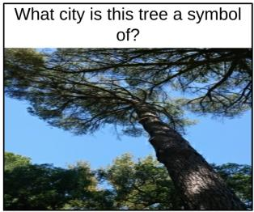

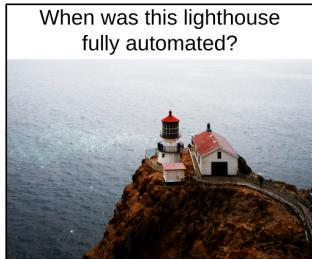  
Figure 1: One of the two answers above is wrong, do you know which one? Encyclopedic questions about detailed properties of fine-grained entities are difficult. Not only for humans, but also for large VLMs. PaLI [12] fails to answer both questions correctly.

Both problems can be addressed by retrieval-augmented models, which base their predictions on knowledge retrieved from a database. These models recently gained popularity in NLP (e.g. [7, 21, 28, 31]), and some early multi-modal models also exist [20, 24, 34, 49]. Retrievalaugmented models are well-suited for encyclopedic knowledge since retrieving the correct entry from a knowledge base greatly facilitates constructing the right answer. Furthermore, the retrieved piece of knowledge provides attribution to the answer by design. This increases model in-

Landmarks

Automatic  
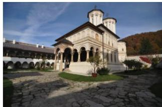  
Q: Who founded this monastery?  
A: Prince Constantin Brâncoveanu C: Horezu monastery

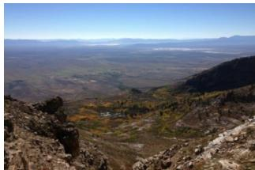  
Q: When was the first permanent settlement made at this valley? A: 1864 C: Clover valley

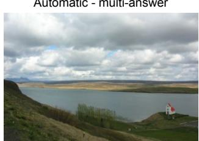  
Q: What fish can be found in this lake? A: trout, lake char C: Úlfljótsvatn

  
Q: What amusement park is located in the city where this square is located? A: Tivoli Gardens C: Rådhuspladsen, Copenhagen  
Natural World

  
Q: How old does this reptile become?  
A: 40 years C: Gila monster

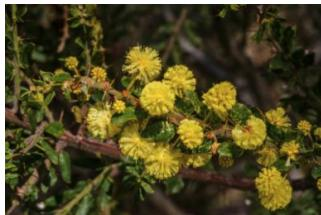  
Q: How many feet tall does this tree grow to? A: 7 to 13 C: Acacia paradoxa

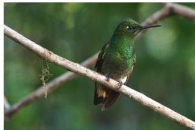  
Q: Where is this bird found?  
A: Colombia, Venezuela, Ecuador C: Boissonneaua

  
Q: How many national park service maintained sites are in the state where this plant grows? A: 24 C: Chorizanthe rigida

Figure 2: Example VQA annotations for different question types. Each example consists of an image I, a question Q and the answer A. We also show the category C of the subject of the question. As attribution, we provide a section within the Wikipedia page of C which supports the answer. Our Encyclopedic-VQA dataset has a total of 1M (I, Q, A) triplets.  
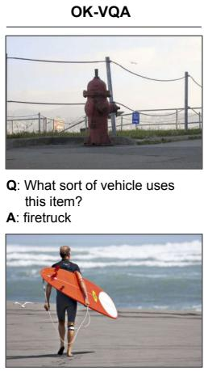  
Q: When was this piece of sporting equipment invented? A: 1926

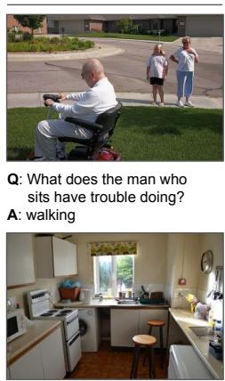  
Q: What could block the washer’s door? A: stove

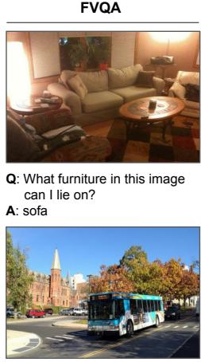  
Q: Which transportation way in this image is cheaper than taxi? A: bus

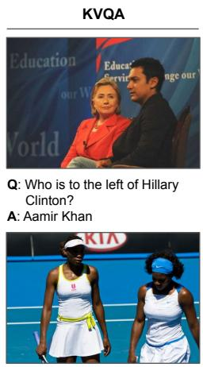  
Q: Who among the people in the image is the eldest? A: Person in the left

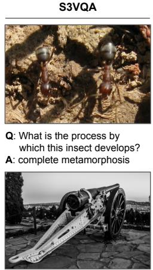  
Q: Where was this weapon used to attack the French camp? A: Crecy

Figure 3: Typical examples of VQA datasets which require knowledge beyond the image.

terpretability and therefore human trust, has applications to fairness and helps diagnosing and debugging model errors.

To drive progress on handling encyclopedic knowledge and attribution in VQA we need a suitable dataset. The popular OK-VQA [35] and A-OKVQA [43] datasets focus on questions requiring knowledge outside the query image. However, the majority of questions require commonsense knowledge (e.g. Fig. 3 top-row, two left-most examples), a type of knowledge for which current VLMs are powerful in both theory and practice [5, 12, 22, 53]. These datasets [35, 43] also include some questions requiring knowledge of detailed properties, but mostly about coarser basic-level categories [42] (e.g. Fig. 3 bottom-left). There are a few other datasets which target detailed properties [25, 44]. But both [25, 44] lack attribution annotations, [25] is very small (Tab. 1 right-most column), and [44] focuses only on celebrities (Fig. 3 fourth column). Hence no current VQA dataset is fully satisfactory.

In this paper we introduce the Encyclopedic-VQA dataset, which offers several attractive features (Fig. 2, Tab. 1). Our dataset asks questions about fine-grained categories from iNaturalist 2021 [48] (Fig. 2 bottom row) and instances from the Google Landmarks Dataset v2 [52] (Fig. 2 top row). We construct questions about detailed properties based on Wikipedia (e.g. founder of building, maximum age of animal). As a consequence, all questions in our dataset are about encyclopedic knowledge. Furthermore, we provide a controlled knowledge base suited to answer these questions: 2M Wikipedia pages consisting of free-form text and images [45]. We also mark ground-truth attribution for each answer at the granularity level of a section within a Wikipedia page. Importantly, our dataset is collected at scale: we have 221k unique question+answer pairs each matched with around 5 images, resulting in a total of 1M examples. This makes our dataset the largest of its kind. Finally, many of our questions are complex two-hop questions [54], which require multiple different documents from the knowledge base to solve (Fig. 2 right).

<table><tr><td></td><td>OK-VQA [35]</td><td>A-OKVQA [43]</td><td>FVQA [50]</td><td>S3VQA [25]</td><td>KVQA [44]</td><td>Encyclopedic-VQA (ours)</td></tr><tr><td>Truly multimodal</td><td>++</td><td>++</td><td>++</td><td>++</td><td>++</td><td>++</td></tr><tr><td>Encyclopedic</td><td>±</td><td>-</td><td></td><td>+</td><td>++</td><td>++</td></tr><tr><td>→ Detailed properties</td><td>+</td><td>±</td><td></td><td>++</td><td>++</td><td>++</td></tr><tr><td>→ fine-grained categories / instances</td><td>一</td><td>-</td><td>-</td><td>+</td><td>++</td><td>++</td></tr><tr><td>Controlled knowledge base</td><td></td><td></td><td>+</td><td>±</td><td>±</td><td>++</td></tr><tr><td>→ answer supported by KB</td><td></td><td></td><td>++</td><td>++</td><td>++</td><td>++</td></tr><tr><td>→ KB provided</td><td></td><td></td><td>++</td><td>- -</td><td>++</td><td>++</td></tr><tr><td>→ KB free-form</td><td></td><td>- -</td><td>- -</td><td></td><td>- -</td><td>++</td></tr><tr><td>→ attribution</td><td></td><td>±</td><td>++</td><td>- -</td><td>- -</td><td>++</td></tr><tr><td>Scale</td><td>±</td><td>+</td><td>- -</td><td>- -</td><td>++</td><td>++</td></tr><tr><td>Two-hop</td><td>- -</td><td>- -</td><td>- -</td><td>- -</td><td>++</td><td>+</td></tr><tr><td>Subject</td><td>various</td><td>various</td><td>various</td><td>various</td><td>celebrities</td><td>fine-grained species, landmarks</td></tr><tr><td>Number of text questions Q</td><td>14k</td><td>25k</td><td>6k</td><td>7k</td><td>183k</td><td>221k</td></tr><tr><td>Number of images I</td><td>14k</td><td>24k</td><td>2k</td><td>7k</td><td>25k</td><td>514k</td></tr><tr><td>Number of unique VQA triplets (I, Q, A)</td><td>14k</td><td>25k</td><td>6k</td><td>7k</td><td>183k</td><td>1,036k</td></tr></table>

Table 1: Comparison of recent VQA datasets. We compare recent VQA datasets with our proposed dataset on VQA design principles.

We validate the usefulness of our dataset through several experiments. In particular, we demonstrate that a large VLM (PaLI [12]) which yields state-of-the-art results on OK-VQA [35] performs poorly on our dataset (13.0% accuracy). Next we demonstrate through an oracle experiment that retrieval-augmented models can yield 87.0% accuracy. Finally, we use an online image search engine to build an automatic retrieval-augmented prototype, reaching 48.8% accuracy. We conclude that (1) our dataset poses a strong challenge in VQA and is in fact too hard for standard VLMs; (2) retrieval-augmented VLMs demonstrate a strong potential for addressing encyclopedic knowledge; (3) our results leave significant headroom for further research to improve retrieval-augmented VLMs.

## 2. Design principles for our dataset

We create our VQA dataset with the following desired properties in mind: (1) Truly Multimodal. The questions should not be answerable without the image or the textual question [19]. (2) Encyclopedic. The questions should be about detailed properties of fine-grained categories or instances; a type of questions which are problematic for vanilla VLMs [5, 12, 22, 53]. (3) Controlled knowledge base. Each answer in our dataset should be attributable to that specific part of the knowledge base which supports it.

Hence the knowledge base is an integral part of our dataset, which enables measuring whether a model answers a question correctly for the right reason. For generality we want this knowledge base to be free-form text and to contain images. (4) Scale. The dataset should be large. Dataset size has always mattered and this is even more true with the increasingly large VLM models (e.g. [4, 12, 26, 56, 37]). (5) Two-hop. A portion of our questions should require knowledge from multiple different documents from the knowledge base. Including such complex two-hop questions [54] leaves substantial headroom for future model development.

## 3. Related Work

Visual Question Answering (VQA). DAQUAR [33], FM-IQA [18], Visual Madlibs [55], VQAv1 [6] and VQAv2 [19] are early VQA datasets. These datasets mostly ask visual questions that can be answered based on the query image and generic knowledge such as basic-level category recognition (e.g. ‘cat’), counting items, colors, etc.

Knowledge-based VQA. Tab. 1 and Fig. 3 compare datasets which are designed to require knowledge not present in the image [25, 35, 43, 44, 50]. In particular, OK-VQA [35] and A-OKVQA [43] mostly require commonsense knowledge. In addition, some questions (18%) in A-OKVQA do require knowledge of detailed properties, but about basic-level categories. Finally, 3% of the questions require knowledge about physics. In this paper we create a dataset with questions exclusively about detailed properties of fine-grained categories and instances (Fig. 2). We believe that such encyclopedic questions truly require access to a knowledge base to be answered. In fact, we release the knowledge base along with our dataset, whereas no explicit knowledge base was involved in the creation of [35, 43].

Some existing VQA datasets are supported by a knowledge base [25, 44, 50]. FVQA [50] is about commonsense knowledge. KVQA [44] asks detailed properties about celebrities. Both [44, 50] are based on a structured knowledge base (RDF triplets). Instead, our knowledge base is readily available free-form Wikipedia text, which has more information. Furthermore, KVQA is exclusively about people, which requires specialized methods based on face detection and recognition. In contrast, our dataset offers a broader range of topics, including animals, plants and landmarks. S3VQA [25] is the most related work to ours. It builds on categories of OpenImages [30], some fine-grained and others more basic-level. They automatically generate questions from Wikipedia articles, which by construction are about detailed properties. Then they let experts manually select and rephrase relevant questions. Our paper also automatically generates QA pairs from Wikipedia. However, we go beyond [25] in several ways: (1) our dataset is much larger (7k vs 1M VQA triplets), (2) we include more complex multi-hop questions, (3) we release the knowledge base along with the QA pairs. This also includes ground-truth answer attribution in the form of the supporting Wikipedia section.

The InfoSeek dataset [13] is concurrent to our work. It also targets detailed properties of fine-grained categories, but does not include multi-answer and two-hop questions, and was collected using a different annotation protocol.

Automatic question generation. A few VQA datasets are generated from image captions [41, 11]. While this enables much larger scale, it results in simple visual questions. We build a portion of our dataset using a similar pipeline as [11], but apply it to Wikipedia pages instead to obtain high-quality questions on detailed properties. As another difference, we verify them with human annotators.

Multi-Hop Reasoning in NLP. The NLP community has many text-only QA datasets (e.g. [17, 27, 29, 36, 39, 47, 51, 54]). Notably, HotpotQA [54] introduces the concept of ‘bridge entity’ which links two related entities. They use this to show an annotator two related Wikipedia paragraphs from different pages and ask to create questions which requires knowledge from both paragraphs. We use ‘bridge entities’ to automatically chain two questions together into a compound two-hop question.

Retrieval-augmented models. Our dataset seems particularly suited for retrieval-augmented models. While pioneered in NLP [7, 21, 28, 31], several recent works use retrieval for VQA. KRISP [34] leverages triplets encoding facts, categorical knowledge and object relationships in a graph-based reasoning framework. KAT [20] uses Wikidata triplets, and a reasoning module cross-attends them with GPT-3 answers, the result being fed into a decoder for answer generation. InFactuality [49] leverages index images to link entities present in the query image and Wikidata triplets to gather facts, which are fed into a UNITER [14] reasoning module. REVEAL [24]’s external knowledge is composed of image-text pairs, question answering pairs and knowledge graph triplets, which are used to assist a generator module in producing answers.

## 4. Dataset

We now detail the construction of our dataset while following the design principles (Sec. 2). To achieve scale we automate construction whenever possible. We use human annotators to ensure quality and to provide information which we could not get automatically. We simplify human annotation tasks as much as possible, which increases both the quality and efficiency of their work.

We define a unit for our VQA task as a triplet (I, Q, A). The multi-modal question features an image I and accompanying textual question Q. The subject of the question Q appears in I and is a core concept of our work. We refer to the category of the subject as C (e.g. ‘Horezu Monastery’ or ‘Gila Monster’ in Fig. 2-left). The answer A is purely textual. Our dataset also records the evidence for each answer in the knowledge base, as a section within the Wikipedia page for C where the answer is found. In contrast to many existing VQA datasets, we record only a single answer, since it is unambiguous given the knowledge base.

To make our dataset truly multi-modal, we always refer to the subject of the question by its super category (e.g. ‘this monastery’, ‘this reptile’, as opposed to ‘the Horezu Monastery’, ‘the Gila monster’, etc.). This ensures visual recognition is required to solve our task, as there would be many potential answers to the textual question alone (e.g. a different answer for each monastery in the world).

## 4.1. Supporting Datasets

We build on two of the largest existing datasets with fine-grained categories: iNaturalist 2021 (iNat21) [48] and Google Landmarks Dataset V2 (GLDv2) [52]. iNat21 is a fine-grained visual classification dataset containing 2.7M images depicting 10,000 species, grouped into 11 super categories: plants, insects, birds, mammals, etc. GLDv2 is a landmark recognition dataset with 4M images depicting 200k landmarks. Each landmark is sourced from Wikimedia Commons [3], enabling us to mine the existing category-hierarchy (allowing to define super categories, like bridges, castles, lighthouses, lakes etc.), and to link them to Wikipedia articles. We use these provided annotations to speed up the annotation of our dataset, to identify relevant knowledge categories, and to assign images I to textual questions Q automatically.

We create our controlled knowledge base starting from the WIT dataset [45], which contains 37M image-snippet pairs with 11M unique images from Wikipedia. We select all images linked to an English snippet and then extend WIT to include the full corresponding Wikipedia article (snapshot of 13 August 2022). This spans 2M English articles. We then identify which categories of iNat21 and GLDv2 map one-to-one to a single Wikipedia article. We found such unique mappings for 80% of the iNat21 and 50% of the GLDv2 categories. We only create questions for those categories with a uniquely identifiable Wikipedia article.

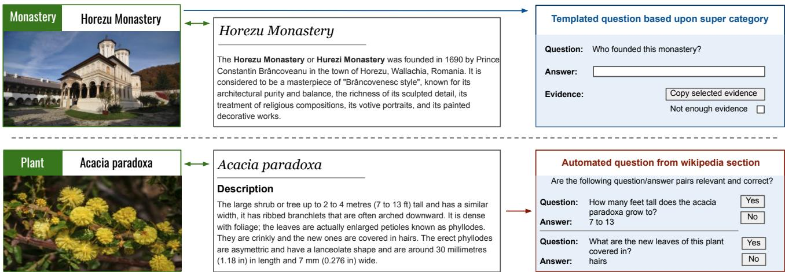  
Figure 4: Data collection for templated and automatically generated single-hop questions. Top: Experts create templated questions Q based on a super category (e.g. Monastery). Annotators are given the full Wikipedia page for a particular C, and asked to provide the answers A and the evidence. Bottom: Questions are automatically generated from a Wikipedia section of C and validated by human annotators. In both processes, the annotator never sees the image I corresponding to C.

The combination of iNat21 & GLDv2 with Wikipedia as knowledge base enables creating (I, Q, A) triplets covering the long-tail: questions about detailed properties (on Wikipedia text) of fine-grained categories (species from iNat21) and instances (landmarks from GLDv2). Hence, this satisfies the encyclopedic design principle.

## 4.2. Single-hop questions

The answer to a single-hop question can be found in the Wikipedia article of the category C which is the subject of the question. We construct such questions in two alternative ways: templated and automatically generated.

Templated single-hop. We use of the super category annotations available in the supporting datasets (e.g. reptiles for iNat21, monasteries for GLDv2). For each super category we manually define several questions, like Whofounded this monastery?. We then ask human annotators to answer these questions for a particular species/landmark C (e.g. Horezu Monastery), showing them the relevant Wikipedia page (see Fig. 4). Hence, the annotators do not have to recognize C in an image, which would require expert knowledge. Instead, they just have to identify whether the answer is in the Wikipedia article. If yes, they mark the evidence for it (for attribution). If no, we discard that question (as it cannot be answered with our knowledge base and it would break the controlled knowledge base principle). We start with 10 questions per category, resulting in 4.3 questions on average per species with a valid answer for iNat21, and 3.4 per landmark for GLDv2 (see examples in Fig. 2 first column).

Now we have a textual question Q and an answer A. To form a complete multi-modal question, we pair Q with an image I of C from the supporting datasets. Note that any Q occurs multiple times in the dataset with different answers. Hence by design the accompanying image I is necessary to resolve the specific category C and a model simply remembering Q+A pairs cannot solve the challenge.

Automatically generated single-hop. We increase the diversity of questions in the dataset with automatically generated questions (Fig. 4). Similar to [25], we feed the Wikipedia article of a category to a question generation model [11]. It processes a section of an article at a time, producing a large number of Q+A pairs (typically 100s), by inverting statements from the text.

We include two filtering steps. First, we require the category name of C to be used in the question. This reduces the number of questions by 20×, and ensures that the question is about C (and not about another entity found in the snippet of text). Second, to increase diversity we remove near identical questions and limit the number of questions per Wikipedia section.

The human annotation task is now extremely simple: validate whether the Q+A pair is relevant and correct, given the Wikipedia section used to generate it. A question Q is relevant if it is is well-formed, makes sense semantically, and is expected to have an unambiguous answer. The answer A is correct if it is supported by the given Wikipedia section. Finally, we can directly use the Wikipedia section used to generate the QA pair as evidence for the answer (attribution for free!)

About 80% of the questions sent to annotators are validated positively. The questions contain (by design) the name of the category C, and we rephrase them using a carefully-prompted FLAN [16] version of PaLM [15] to replace the mention of C by its super category, which produces Q. For example, the question Where is the Eglise´ Saint-Cannat located? is rephrased by PaLM to Where is this church located? An image I from C from a supporting dataset is then associated to this question.

Multi-answer questions. For many properties of a category C the response should be a list with multiple answers. For example What fish can be found in this lake? or Where is this bird found?, could be answered with a list of fish (or countries, respectively; Fig. 2, third column). For these kinds of questions we define the multi-answer question type. We filter the automatically generated QA pairs for questions likely to have multiple answers, and extract an initial list. Then we ask the annotators to complete and verify the list with all the possible answers.

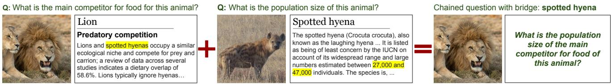  
Figure 5: Illustration of two-hop question generation using bridge entities. The bridge entity, e.g. spotted hyena, is an answer to a single-hop question which has its own entry in the knowledge base. Hence we can ask a second single-hop question about it. These two questions are then chained into a two-hop question.

## 4.3. Two-hop questions

Two-hop questions are defined as requiring two reasoning steps to obtain the final answer. Here we focus on chained two-hop questions, which require two consecutive retrieval steps. To construct such questions at scale, we use the notion of a bridge entity [54]: if the answer to a singlehop question is an entity with its own Wikipedia page, it serves as a bridge entity, about which we can ask a second single-hop question, see Fig. 5.

We automatically identify bridge entities from the single-hop answers (Sec. 4.2), then manually discard words like yes, blue, and heavy which would yield very artificial multi-hop questions. We then automatically generate and validate questions for these bridge entities using our automatically generated single-hop pipeline.

We create the final two-hop question automatically using PaLM, by feeding it the two single-hop questions with an appropriate prompt. Unfortunately, these two-hop questions are often incorrect. Therefore, we create a second prompt to validate the two-hop question: PaLM is asked to answer the two-hop question using the two initial single-hop questions with answers as context. If the predicted answer is identical to the answer of the second single-hop question, then the two-hop question is validated and kept in our dataset; otherwise, it is discarded. This increases the accuracy of the two-hop questions substantially. Examples of validated two-hop questions are given in Fig. 2 (right).

## 4.4. Dataset statistics

Our dataset contains in total 1M (I, Q, A) triplets (Tab. 2). These are derived from a total of 221k textual Q+A pairs from 16.7k different categories C. Each Q+A pair is combined with (up to) 5 images I showing different instances of the same category C from the supporting datasets. This increases visual diversity and in total we use 514k unique images. There are in total 15k textual singlehop templated questions, and 158k automatically generated questions. Moreover, the dataset contains 25k multi-answer questions and 22k two-hop questions.

Looking in detail at the 221k Q+A pairs, 175k of them have a unique Q (i.e. no string match with any other question). Moreover, there are 95k unique answers, of which 73k occur only once. The remaining 22k answers follow a Zipf’s law: 11k answers occur twice, 2k answers occur 10+ times, and less than 400 answers occur more than 50 times.

Train / Val / Test splits. To allow for evaluating different properties of the dataset, we carefully design its train/- val/test splits. First, there is no overlap in the images I used in the train, val, or test splits. For GLDv2, we sample images for all our splits from their train-clean split, which avoids most noisy labels in their dataset. For iNat21, we sample our train images from their train set, and our val and test images from their validation set (their test set annotations are not publicly available). Next, about two-thirds of the questions Q and half of the answers A in our val and test splits do not occur in our train split. Finally, roughly 17% of the subject categories C in our val and test splits are not used in our train split. This allows for analyzing different desirable properties of VQA models on our dataset.

<table><tr><td></td><td colspan="3">Number of (Q, A) pairs</td><td colspan="3">Total (I, Q, A) triplets</td></tr><tr><td></td><td>Train</td><td>Val</td><td>Test</td><td>Train</td><td>Val</td><td>Test</td></tr><tr><td>Templated</td><td>13,928</td><td>400</td><td>1,000</td><td>66,535</td><td>1,827</td><td>1,000</td></tr><tr><td>Automatic</td><td>153,441</td><td>1,750</td><td>2,750</td><td>737,114</td><td>8,025</td><td>2,750</td></tr><tr><td>Multi Answer</td><td>23,929</td><td>400</td><td>1,000</td><td>112,736</td><td>1,844</td><td>1,000</td></tr><tr><td>Two Hop</td><td>21,040</td><td>400</td><td>1,000</td><td>99,866</td><td>1,895</td><td>1,000</td></tr><tr><td>Total</td><td>212,338</td><td>2,950</td><td>5,750</td><td>1,016,251</td><td>13,591</td><td>5,750</td></tr></table>

Table 2: Dataset Statistics. We report the number of (question, answer) pairs, and (image, question, answer) triplets for different question types. In total our dataset contains 1M VQA triplets, making it the largest of its kind.

<table><tr><td>Dataset</td><td>variety of Q # unique bigrams</td><td>disparity of Q avg. cosine dist.</td></tr><tr><td>FVQA [50]</td><td>7.9k</td><td>0.620</td></tr><tr><td>KVQA [44]</td><td>12.8k</td><td>0.504</td></tr><tr><td>OK-VQA [35]</td><td>19.3k</td><td>0.843</td></tr><tr><td>S3VQA [25]</td><td>19.7k</td><td>0.805</td></tr><tr><td>A-OKVQA [43]</td><td>33.9k</td><td>0.856</td></tr><tr><td>Encyclopedic-VQA</td><td>257.9k</td><td>0.833</td></tr></table>

Table 3: Diversity of questions Q measured in terms of variety and disparity (higher is better). Disparity numbers are mostly taken from [43], but we reproduced their A-OKVQA result to validate our re-implementation. Our dataset has the largest variety and is close to the best ones on disparity.

## 4.5. Question Diversity

We want to compare the diversity of our VQA questions to other datasets. However, diversity is a broad concept which manifests through a combination of three basic properties: variety, disparity, and balance [46]. Here we focus on variety and disparity.

Variety. This refers to the semantic variety spanned by the VQA questions. One simple measure of variety is the number of unique textual questions Q (175k in our dataset). However, this ignores the fact that some questions are semantically similar. Another measure is the number of topics covered by the questions, for which we can use the number of categories C (16.7k in our dataset). However, each dataset typically uses a different set of categories at different levels of granularity, making their category counts hard to compare directly. So instead, we consider the number of unique bigrams across all questions Q, as a reasonable approximation of the semantic space spanned by all Q.

Disparity. This measures how different the questions are from each other. We follow the measure introduced in A-OKVQA [43]: (1) we first project all questions Q into a common semantic space using a publicly available [2] Sentence-BERT model [40]; then (2) we measure the average cosine distance between all question pairs (defined as 1− cosine similarity by [43]). Note that while [43] proposed this as a generic measure of diversity, it actually only measures disparity as defined in [46].

Results. We report variety and disparity for knowledgebased VQA datasets in Tab. 3. Our dataset offers the largest question variety by an order of magnitude. Importantly, this is not only due to dataset size: while Encyclopedic-VQA and KVQA [44] are the largest datasets and have a comparable number of questions, KVQA has much less variety. In terms of disparity, our dataset is close to the best ones OK-VQA [35] and A-OKVQA [43], and better than FVQA, KVQA and S3VQA.

<table><tr><td>Model</td><td>Retrieval</td><td>OK-VQA Accuracy</td></tr><tr><td>KAT [20]</td><td>√</td><td>53.1</td></tr><tr><td>REVEAL [24]</td><td>√</td><td>59.1</td></tr><tr><td>PromptCap [23]</td><td></td><td>60.4</td></tr><tr><td>PaLI [12]</td><td>=</td><td>64.5</td></tr></table>

Table 4: OK-VQA: PaLI is state-of-the-art on OK-VQA. It is therefore an good candidate to apply to our Encyclopedic-VQA.

## 5. Experiments

We evaluate PaLI [12], PaLM [15] and GPT-3 [8] on our dataset. We apply all models directly and in retrievalaugmented settings. For evaluation we use the test split of our dataset on the single-hop templated and automatically generated questions (except for Sec. 5.6 where we also evaluate multi-answer and two-hop questions). We measure accuracy as the percentage of questions where the predicted model answer matches the ground-truth answer. All ground-truth answers and model predictions are pre processed following standard VQA practices [19] to facilitate checking their correctness (remove articles, punctuation, etc.). Furthermore, we use the ’BERT Matching’ criterion BEM [10] to determine whether a predicted answer is correct given the question and the ground-truth answer. BEM evaluation allows for more flexibility in the answer formulation than classical exact matching, coming much closer to human judgement of correctness, as is shown in [10] and in our user study in the Supplementary Material. We consider an answer correct when its BEM score is ≥ 0.5. If an example has multiple ground-truth answers, we compute the BEM score for each and choose the maximum.

## 5.1. Large Models without Retrieval

PaLI. To measure the performance of a large VLM on Encyclopedic-VQA we use PaLI [12]. It yields the stateof-the-art accuracy on OK-VQA [35] (64.5%), and outperforms retrieval-augmented models such as KAT [20] (53.1%) and REVEAL [24] (59.1%) by a large margin (Tab. 4). This demonstrates that the type of knowledge required to solve OK-VQA can be captured by large VLMs. PaLI is therefore a good candidate to verify whether large VLMs capture also encyclopedic knowledge. We use a PaLI model with 17B parameters pre-trained on a huge amount of data including Wikipedia (so it has seen the knowledge base containing the answers for our dataset). Our PaLI model is additionally fine-tuned on OK-VQA and therefore particularly suited for VQA tasks. We feed this model Q, I input for each test sample to produce model answers.

Tab. 5 (first row) shows that PaLI has an accuracy of only 13.0%. This low performance indicates that PaLI either fails to recognise fine-grained categories and instances, or fails to provide detailed properties, or both. Hence encyclopedic knowledge is truly difficult for this model.

<table><tr><td colspan="3"></td><td colspan="3">Model</td></tr><tr><td>System</td><td>Retrieval</td><td>Extra input</td><td>PaLI [12]</td><td>PaLM [15]</td><td>GPT-3 [8]</td></tr><tr><td>Vanilla model</td><td>-</td><td>-</td><td>13.0%</td><td>19.7%</td><td>15.5%</td></tr><tr><td rowspan="3">Oracle</td><td>Subject C</td><td>-</td><td>16.7%</td><td>31.0%</td><td>26.9%</td></tr><tr><td>KB Article</td><td>-</td><td>29.7%</td><td>78.4%</td><td>77.4%</td></tr><tr><td>KB Section</td><td>-</td><td>48.8%</td><td>87.0%</td><td>82.1%</td></tr><tr><td rowspan="2">Lens</td><td>KB Article</td><td>-</td><td>21.4%</td><td>48.0%</td><td>44.9%</td></tr><tr><td>KB Section</td><td>-</td><td>28.1%</td><td>48.8%</td><td>44.6%</td></tr><tr><td>PromptCap</td><td></td><td>Captions NN train samples</td><td>17.8%</td><td>29.7%</td><td>25.6%</td></tr></table>

Table 5: Accuracy on single-hop questions. We report model accuracy for our single-hop templated and automatically generated questions. While large models struggle with our Encyclopedic-VQA dataset, our experiments show the promise of augmenting them with a retrieval mechanism.

PaLM and GPT-3. Models with a larger language understanding component [9, 8, 15, 38] might be better at memorizing detailed properties and extracting information from textual knowledge base entries. Therefore, we experiment with PaLM 2 [15] (text-bison@001 model, available through the PaLM API) and GPT-3 [8] (text-davinci-003, accessible through the OpenAI API). Both are trained on massive amounts of text including Wikipedia. GPT-3 is especially large, with 175B parameters. Here we feed each model only the text questions Q as thery cannot consume images. This measures how well our dataset can be solved by language alone. These models reach a modest accuracy (19.7%, 15.5%, Tab. 5). While they only takes textual inputs, they can be made multimodal by adding a visual retrieval mechanism, as we do in the following sections.

## 5.2. Large Models with Oracle Retrieval

Oracle retrieval of subject C. This experiment tests whether the most difficult aspect of Encyclopedic-VQA is recognizing fine-grained categories and instances in the image. Therefore we provide along with the test question its corresponding subject category C as an additional textual input to our models (i.e. as part of the prompt; Oracle - Subject C in Tab. 5). While PaLI shows small improvements over its non-retrieval version, PaLM and GPT-3 improve considerably to 31.0% and 26.9%, respectively. However, this is still rather low performance. We conclude that determining the fine-grained category or instance is only part of what makes our dataset difficult.

Oracle retrieval of KB article. We now go a step further and provide the full ground-truth Wikipedia article about C to the models in the prompt (Oracle, KB Article in Tab. 5). This time, results increase dramatically: 29.7% accuracy for PaLI, 78.4% for PaLM and 77.4% for GPT-3. This demonstrates that (1) memorizing detailed properties is a hard challenge for vanilla large VLMs, (2) adding a retrieval component shows great potential for predicting detailed properties, and (3) since PaLM and GPT-3 work much better than PaLI, having a strong language understanding model is important for extracting the right information from the free-form text KB article.

Oracle retrieval of KB section. Finally, to understand the importance of retrieving information that is more precisely localized than an entire Wikipedia page, we provide to the models the ground-truth section which supports the answer (Oracle - KB Section in Tab. 5). Again, accuracy improves to 48.8% for PaLI, 87.0% for PaLM and 82.1% for GPT-3. This demonstrates the importance of providing exact information to the language component. As a bonus, the smaller the retrieved document is upon which the model bases its answer, the more verifiable and interpretable this answer is.

## 5.3. Large Models with Visual Retrieval

Lens-based retrieval of KB article. To go beyond the oracle demonstration above, as proof-of-concept we propose to augment large models with a real retrieval system based on Google Lens [1]. Google Lens is an image retrieval system which indexes a huge amount of web images. Given a query image, it finds other images based on their visual similarity and relevance to objects it recognizes in the query image. It returns the most similar indexed images along with an entity prediction based on these top-ranked images. To augment our system, we send Google Lens the query image I to obtain its entity prediction. We then find the best matching KB article for this entity in our knowledge base. Finally, we feed the retrieved KB article as prompt to our models as in Sec. 5.2.

Results are shown as Lens - KB Article in Tab. 5. All models greatly outperform their non-retrieval augmented versions. PaLM and GPT-3 in particular more than double, to 48.0% and 44.9% respectively.

<table><tr><td rowspan="2"></td><td colspan="3">Accuracy</td><td rowspan="2">KB retrieval</td></tr><tr><td>Overall</td><td>w/ correct retrieval</td><td>w/ incorrect retrieval</td></tr><tr><td>Lens Retrieval KB Article</td><td>48.0%</td><td>77.7%</td><td>21.2%</td><td>accuracy 47.4%</td></tr><tr><td>KB Section</td><td>48.8%</td><td>82.3%</td><td>20.7%</td><td>45.6%</td></tr></table>

Table 6: Attribution for retrieval-augmented VLMs. We report model accuracy for PaLM [15] conditional on retrieval results. Retrieval success rates are similar for articles and sections, but PaLM has better accuracy when augmented with sections.

Lens-based retrieval of KB section. Given a retrieved KB article, we now aim to select the most relevant KB section within it based on Q. To do so we query PaLM with a special prompt feeding one KB section at a time, along with Q while asking ‘can the answer to this question be found in this text?’. We retain all sections for which PaLM answers ‘Yes’ (usually only one), and consider their concatenation as the final retrieved ‘KB section’. Finally, we feed this retrieved section in the prompt to all models (PaLI, PaLM or GPT-3) as in Sec. 5.2.

Results are shown as Lens - KB Section in Tab. 5. Performance is now even higher for PaLI (28.1%) and PaLM (48.8%), whereas GPT-3 does not seem to benefit further. These numbers are roughly halfway between versions without retrieval and with oracle retrieval. We conclude that retrieval augmentation works in practice, and that our dataset leaves significant headroom for future research on retrievalaugmented VLMs.

CLIP-based retrieval. KAT [20] and REVIVE [32] are two retrieval-augmented VQA systems which use frozen CLIP [37] embeddings to perform retrieval. In the Supplementary Material we explore whether KAT and REVIVE could potentially succeed on Encyclopedic-VQA.

## 5.4. Attribution for Retrieval-Augmented models

The attribution annotations of our dataset enable measuring whether retrieval-augmented models give the correct answer for the right reason. Tab. 6 measures attribution for the PaLM models with Lens retrieval.

First, we observe that Google Lens retrieves the correct KB Article 47.4% of the time. Furthermore, we report 45.6% retrieval accuracy at the finer level of a KB Section. This demonstrates that given a correctly retrieved KB Article, our system almost always finds the correct Section within it. More importantly, if the retrieved KB Section is incorrect, accuracy drops drastically to 20.7%, close to the non-augmented variant (both when using PaLM). In contrast, if the correct KB Section is found, accuracy is 82.3%. Thus, retrieving the correct document, and even better the correct section, is essential to performing well on our dataset.

## 5.5. Comparison to PromptCap

We compare our retrieval-based methods to Prompt-Cap [23], which has strong performance on OK-VQA (Tab. 4). PromptCap is a system with multiple components. It has a captioning model which consumes both I and Q and generates an image caption tailored to answer the question Q. This caption is then passed to GPT-3 as context to answer Q. Additionally, PromptCap performs in-context learning: for a given test question, it uses the CLIP embeddings [37] of Q and I to find the 32 nearest training examples. Then it includes their 32 corresponding Prompt-Cap captions, questions and answers in the GPT-3 prompt. In [23] the underlying LLM was GPT-3. In this experiment we also apply PromptCap with PaLM and PaLI. Results in Tab. 5 show that PromptCap indeed does better than using PaLI, PaLM, or GPT-3 alone. However, it still performs substantially worse than our retrieval-augmented methods. This further confirms the hard challenge our dataset poses.

## 5.6. Multi-answer and two-hop questions

To evaluate multi-answer questions, we convert the model prediction into a set of strings and compute the intersection-over-the-union (IoU) between this set and the set of ground-truth answers. If IoU >= 0.5 then we consider that prediction as correct. If not, then we use BEM to determine the equivalence of the prediction list string and the ground-truth list. For two-hop questions, we use BEM as described for single-hop templated and automatically generated questions.

PaLI with Lens KB Section Retrieval obtains an accuracy of 9.2% for multi-answer questions and 14.7% for twohop questions. Similarly, PaLM with KB Section retrieval achieves 33.6% and 22.8% for multi-answer and two-hop questions, respectively. GPT-3 obtains 32.1% for multianswer and 18.7% for two-hop questions, in between PaLI and PaLM. These modest performances, especially on twohop questions, confirm the challenge of our proposed tasks, and highlight the usefulness of Encyclopedic-VQA to measure progress on designing retrieval mechanisms for such complex types of questions.

## 6. Conclusions

We introduced Encyclopedic-VQA, a large-scale VQA dataset about detailed properties of fine-grained categories and instances, which includes a knowledge base with answer attributions. We demonstrated that our dataset is truly difficult for standard VLMs. Additionally, we showed with both an oracle experiment and a prototype automatic system that augmenting these models with a retrieval component substantially improves results, yet leaving headroom for even further improvements. Therefore our dataset enables future research on retrieval-augmented VLMs.

## References

[1] Google Lens. https://lens.google.com - Web interface available at https://images.google.com. 8

[2] Huggingface. https://huggingface.co/sentencetransformers/multi-qa-MiniLM-L6-cos-v1. 7

[3] Wikimedia Commons. https://commons.wikimedia.org. 4

[4] Armen Aghajanyan, Bernie Huang, Candace Ross, Vladimir Karpukhin, Hu Xu, Naman Goyal, Dmytro Okhonko, Mandar Joshi, Gargi Ghosh, Mike Lewis, and Luke Zettlemoyer. CM3: A causal masked multimodal model of the internet. In arXiv, 2022. 3

[5] Jean-Baptiste Alayrac, Jeff Donahue, Pauline Luc, Antoine Miech, Iain Barr, Yana Hasson, Karel Lenc, Arthur Mensch, Katie Millican, Malcolm Reynolds, Roman Ring, Eliza Rutherford, Serkan Cabi, Tengda Han, Zhitao Gong, Sina Samangooei, Marianne Monteiro, Jacob Menick, Sebastian Borgeaud, Andrew Brock, Aida Nematzadeh, Sahand Sharifzadeh, Mikolaj Binkowski, Ricardo Barreira, Oriol Vinyals, Andrew Zisserman, and Karen Simonyan. Flamingo: a Visual Language Model for Few-Shot Learning. NeurIPS, 2022. 1, 2, 3

[6] Stanislaw Antol, Aishwarya Agrawal, Jiasen Lu, Margaret Mitchell, Dhruv Batra, C. Lawrence Zitnick, and Devi Parikh. VQA: visual question answering. In ICCV, 2015. 3

[7] Sebastian Borgeaud, Arthur Mensch, Jordan Hoffmann, Trevor Cai, Eliza Rutherford, Katie Millican, George van den Driessche, Jean-Baptiste Lespiau, Bogdan Damoc, Aidan Clark, Diego de Las Casas, Aurelia Guy, Jacob Menick, Roman Ring, Tom Hennigan, Saffron Huang, Loren Maggiore, Chris Jones, Albin Cassirer, Andy Brock, Michela Paganini, Geoffrey Irving, Oriol Vinyals, Simon Osindero, Karen Simonyan, Jack W. Rae, Erich Elsen, and Laurent Sifre. Improving language models by retrieving from trillions of tokens. arXiv:2112.04426, 2022. 1, 4

[8] Tom Brown, Benjamin Mann, Nick Ryder, Melanie Subbiah, Jared D Kaplan, Prafulla Dhariwal, Arvind Neelakantan, Pranav Shyam, Girish Sastry, Amanda Askell, et al. Language models are few-shot learners. Advances in neural information processing systems, 33:1877–1901, 2020. 7, 8

[9] Tom B. Brown, Benjamin Mann, Nick Ryder, Melanie Subbiah, Jared Kaplan, Prafulla Dhariwal, Arvind Neelakantan, Pranav Shyam, Girish Sastry, Amanda Askell, Sandhini Agarwal, Ariel Herbert-Voss, Gretchen Krueger, Tom Henighan, Rewon Child, Aditya Ramesh, Daniel M. Ziegler, Jeffrey Wu, Clemens Winter, Christopher Hesse, Mark Chen, Eric Sigler, Mateusz Litwin, Scott Gray, Benjamin Chess, Jack Clark, Christopher Berner, Sam McCandlish, Alec Radford, Ilya Sutskever, and Dario Amodei. Language Models are Few-Shot Learners. arXiv, 2020. 8

[10] Jannis Bulian, Christian Buck, Wojciech Gajewski, Benjamin Boerschinger, and Tal Schuster. Tomayto, tomahto. beyond token-level answer equivalence for question answering evaluation. arXiv preprint arXiv:2202.07654, 2022. 7

[11] Soravit Changpinyo, Doron Kukliansky, Idan Szpektor, Xi Chen, Nan Ding, and Radu Soricut. All you may need for VQA are image captions. In NAACL, 2022. 4, 5

[12] Xi Chen, Xiao Wang, Soravit Changpinyo, AJ Piergiovanni, Piotr Padlewski, Daniel Salz, Sebastian Goodman, Adam Grycner, Basil Mustafa, Lucas Beyer, Alexander Kolesnikov, Joan Puigcerver, Nan Ding, Keran Rong, Hassan Akbari, Gaurav Mishra, Linting Xue, Ashish Thapliyal, James Bradbury, Weicheng Kuo, Mojtaba Seyedhosseini, Chao Jia, Burcu Karagol Ayan, Carlos Riquelme, Andreas Steiner, Anelia Angelova, Xiaohua Zhai, Neil Houlsby, and Radu Soricut. PaLI: A Jointly-Scaled Multilingual Language-Image Model. arXiv, 2022. 1, 2, 3, 7, 8

[13] Yang Chen, Hexiang Hu, Yi Luan, Haitian Sun, Soravit Changpinyo, Alan Ritter, and Ming-Wei Chang. Can pre-trained vision and language models answer visual information-seeking questions? In arXiv, 2023. 4

[14] Yen-Chun Chen, Linjie Li, Licheng Yu, Ahmed El Kholy, Faisal Ahmed, Zhe Gan, Yu Cheng, and Jingjing Liu. UNITER: UNiversal Image-TExt Representation Learning. In ECCV, 2020. 4

[15] Aakanksha Chowdhery, Sharan Narang, Jacob Devlin, Maarten Bosma, Gaurav Mishra, Adam Roberts, Paul Barham, Hyung Won Chung, Charles Sutton, Sebastian Gehrmann, Parker Schuh, Kensen Shi, Sasha Tsvyashchenko, Joshua Maynez, Abhishek Rao, Parker Barnes, Yi Tay, Noam Shazeer, Vinodkumar Prabhakaran, Emily Reif, Nan Du, Ben Hutchinson, Reiner Pope, James Bradbury, Jacob Austin, Michael Isard, Guy Gur-Ari, Pengcheng Yin, Toju Duke, Anselm Levskaya, Sanjay Ghemawat, Sunipa Dev, Henryk Michalewski, Xavier Garcia, Vedant Misra, Kevin Robinson, Liam Fedus, Denny Zhou, Daphne Ippolito, David Luan, Hyeontaek Lim, Barret Zoph, Alexander Spiridonov, Ryan Sepassi, David Dohan, Shivani Agrawal, Mark Omernick, Andrew M. Dai, Thanumalayan Sankaranarayana Pillai, Marie Pellat, Aitor Lewkowycz, Erica Moreira, Rewon Child, Oleksandr Polozov, Katherine Lee, Zongwei Zhou, Xuezhi Wang, Brennan Saeta, Mark Diaz, Orhan Firat, Michele Catasta, Jason Wei, Kathy Meier-Hellstern, Douglas Eck, Jeff Dean, Slav Petrov, and Noah Fiedel. PaLM: Scaling Language Modeling with Pathways. arXiv, 2022. 5, 7, 8, 9

[16] Hyung Won Chung, Le Hou, Shayne Longpre, Barret Zoph, Yi Tay, William Fedus, Eric Li, Xuezhi Wang, Mostafa Dehghani, Siddhartha Brahma, et al. Scaling instruction-finetuned language models. arXiv preprint arXiv:2210.11416, 2022. 5

[17] Matthew Dunn, Levent Sagun, Mike Higgins, V. Ugur Guney, Volkan Cirik, and Kyunghyun Cho. SearchQA: A new Q&A dataset augmented with context from a search engine. In arXiv, 2017. 4

[18] Haoyuan Gao, Junhua Mao, Jie Zhou, Zhiheng Huang, Lei Wang, and Wei Xu. Are you talking to a machine? Dataset and methods for multilingual image question. In NeurIPS, 2015. 3

[19] Yash Goyal, Tejas Khot, Douglas Summers-Stay, Dhruv Batra, and Devi Parikh. Making the V in VQA matter: Elevating the role of image understanding in Visual Question Answering. In CVPR, 2017. 3, 7

[20] Liangke Gui, Borui Wang, Qiuyuan Huang, Alex Hauptmann, Yonatan Bisk, and Jianfeng Gao. KAT: A Knowl-

edge Augmented Transformer for Vision-and-Language. In NAACL, 2022. 1, 4, 7, 9

[21] Kelvin Guu, Kenton Lee, Zora Tung, Panupong Pasupat, and Ming-Wei Chang. REALM: Retrieval-Augmented Language Model Pre-Training. In Proc. ICML, 2020. 1, 4

[22] Yaru Hao, Haoyu Song, Li Dong, Shaohan Huang, Zewen Chi, Wenhui Wang, Shuming Ma, and Furu Wei. Language models are general-purpose interfaces. In arXiv, 2022. 1, 2, 3

[23] Yushi Hu, Hang Hua, Zhengyuan Yang, Weijia Shi, Noah A Smith, and Jiebo Luo. Promptcap: Prompt-guided taskaware image captioning. arXiv preprint arXiv:2211.09699, 2022. 7, 9

[24] Ziniu Hu, Ahmet Iscen, Chen Sun, Zirui Wang, Kai-Wei Chang, Yizhou Sun, Cordelia Schmid, David A. Ross, and Alireza Fathi. REVEAL: Retrieval-Augmented Visual-Language Pre-Training with Multi-Source Multimodal Knowledge Memory. In CVPR, 2023. 1, 4, 7

[25] Aman Jain, Mayank Kothyari, Vishwajeet Kumar, Preethi Jyothi, Ganesh Ramakrishnan, and Soumen Chakrabarti. Select, substitute, search: A new benchmark for knowledgeaugmented visual question answering. In SIGIR, 2021. 2, 3, 4, 5, 7

[26] Chao Jia, Yinfei Yang, Ye Xia, Yi-Ting Chen, Zarana Parekh, Hieu Pham, Quoc V. Le, Yun-Hsuan Sung, Zhen Li, and Tom Duerig. Scaling up visual and vision-language representation learning with noisy text supervision. In ICML, 2021. 3

[27] Mandar Joshi, Eunsol Choi, Daniel S. Weld, and Luke Zettlemoyer. TriviaQA: A large scale distantly supervised challenge dataset for reading comprehension. In ACL, 2017. 4

[28] Urvashi Khandelwal, Omer Levy, Dan Jurafsky, Luke Zettlemoyer, and Mike Lewis. Generalization through memorization: Nearest neighbor language models. In ICLR, 2020. 1, 4

[29] Tushar Khot, Peter Clark, Michal Guerquin, Peter Jansen, and Ashish Sabharwal. QASC: A dataset for question answering via sentence composition. In AAAI, 2020. 4

[30] Alina Kuznetsova, Hassan Rom, Neil Alldrin, Jasper Uijlings, Ivan Krasin, Jordi Pont-Tuset, Shahab Kamali, Stefan Popov, Matteo Malloci, Tom Duerig, and Vittorio Ferrari. The Open Images Dataset V4: Unified image classification, object detection, and visual relationship detection at scale. IJCV, 2020. 4

[31] Patrick Lewis, Ethan Perez, Aleksandra Piktus, Fabio Petroni, Vladimir Karpukhin, Naman Goyal, Heinrich Kuttler, Mike Lewis, Wen tau Yih, Tim Rockt¨ aschel, Se-¨ bastian Riedel, and Douwe Kiela. Retrieval-Augmented Generation for Knowledge-Intensive NLP Tasks. In Proc. NeurIPS, 2020. 1, 4

[32] Yuanze Lin, Yujia Xie, Dongdong Chen, Yichong Xu, Chenguang Zhu, and Lu Yuan. Revive: Regional visual representation matters in knowledge-based visual question answering. arXiv preprint arXiv:2206.01201, 2022. 9

[33] Mateusz Malinowski and Mario Fritz. A multi-world approach to question answering about real-world scenes based on uncertain input. In NeurIPS, 2014. 3

[34] Kenneth Marino, Xinlei Chen, Devi Parikh, Abhinav Gupta, and Marcus Rohrbach. KRISP: Integrating Implicit and

Symbolic Knowledge for Open-Domain Knowledge-Based VQA. In Proc. CVPR, 2021. 1, 4

[35] Kenneth Marino, Mohammad Rastegari, Ali Farhadi, and Roozbeh Mottaghi. OK-VQA: A visual question answering benchmark requiring external knowledge. In CVPR, 2019. 1, 2, 3, 7

[36] Todor Mihaylov, Peter Clark, Tushar Khot, and Ashish Sabharwal. Can a suit of armor conduct electricity? a new dataset for open book question answering. In EMNLP, 2018. 4

[37] Alec Radford, Jong Wook Kim, Chris Hallacy, Aditya Ramesh, Gabriel Goh, Sandhini Agarwal, Girish Sastry, Amanda Askell, Pamela Mishkin, Jack Clark, Gretchen Krueger, and Ilya Sutskever. Learning transferable visual models from natural language supervision. In ICML, 2021. 3, 9

[38] Jack W. Rae, Sebastian Borgeaud, Trevor Cai, Katie Millican, Jordan Hoffmann, Francis Song, John Aslanides, Sarah Henderson, Roman Ring, Susannah Young, Eliza Rutherford, Tom Hennigan, Jacob Menick, Albin Cassirer, Richard Powell, George van den Driessche, Lisa Anne Hendricks, Maribeth Rauh, Po-Sen Huang, Amelia Glaese, Johannes Welbl, Sumanth Dathathri, Saffron Huang, Jonathan Uesato, John Mellor, Irina Higgins, Antonia Creswell, Nat McAleese, Amy Wu, Erich Elsen, Siddhant Jayakumar, Elena Buchatskaya, David Budden, Esme Sutherland, Karen Simonyan, Michela Paganini, Laurent Sifre, Lena Martens, Xiang Lorraine Li, Adhiguna Kuncoro, Aida Nematzadeh, Elena Gribovskaya, Domenic Donato, Angeliki Lazaridou, Arthur Mensch, Jean-Baptiste Lespiau, Maria Tsimpoukelli, Nikolai Grigorev, Doug Fritz, Thibault Sottiaux, Mantas Pajarskas, Toby Pohlen, Zhitao Gong, Daniel Toyama, Cyprien de Masson d’Autume, Yujia Li, Tayfun Terzi, Vladimir Mikulik, Igor Babuschkin, Aidan Clark, Diego de Las Casas, Aurelia Guy, Chris Jones, James Bradbury, Matthew Johnson, Blake Hechtman, Laura Weidinger, Iason Gabriel, William Isaac, Ed Lockhart, Simon Osindero, Laura Rimell, Chris Dyer, Oriol Vinyals, Kareem Ayoub, Jeff Stanway, Lorrayne Bennett, Demis Hassabis, Koray Kavukcuoglu, and Geoffrey Irving. Scaling Language Models: Methods, Analysis & Insights from Training Gopher. arXiv, 2022. 8

[39] Pranav Rajpurkar, Jian Zhang, Konstantin Lopyrev, and Percy Liang. SQuAD: 100,000+ questions for machine comprehension of text. In EMNLP, 2016. 4

[40] Nils Reimers and Iryna Gurevych. Sentence-bert: Sentence embeddings using siamese bert-networks. In EMNLP, 2019. 7

[41] Mengye Ren, Ryan Kiros, and Richard S. Zemel. Exploring models and data for image question answering. In NeurIPS, 2015. 4

[42] Eleanor Rosch. Principles of categorization. In Eleanor Rosch and B. B. Lloyd, editors, Cognition and Categorization, pages 27–48. Lawrence Erlbaum Associates, 1978. 2

[43] Dustin Schwenk, Apoorv Khandelwal, Christopher Clark, Kenneth Marino, and Roozbeh Mottaghi. A-OKVQA: A benchmark for visual question answering using world knowledge. In ECCV, 2022. 2, 3, 7

[44] Sanket Shah, Anand Mishra, Naganand Yadati, and Partha Pratim Talukdar. KVQA: Knowledge-aware visual question answering. In AAAI, 2019. 2, 3, 7

[45] Krishna Srinivasan, Karthik Raman, Jiecao Chen, Michael Bendersky, and Marc Najork. Wit: Wikipedia-based image text dataset for multimodal multilingual machine learning. SIGIR, 2021. 3, 4

[46] Andy Stirling. A general framework for analysisng diversity in science, technology, and society. Journal of the Royal Society Interface, 2007. 7

[47] Alon Talmor and Jonathan Berant. The web as a knowledgebase for answering complex questions. In NAACL, 2018. 4

[48] Grant van Horn, Elijah Cole, Sara Beery, Kimberly Wilber, Serge Belongie, and Oisin Mac Aodha. Benchmarking Representation Learning for Natural World Image Collections. In CVPR, 2021. 2, 4

[49] Peter Vickers, Nikolaos Aletras, Emilio Monti, and Loic Barrault. In Factuality: Efficient Integration of Relevant Facts for Visual Question Answering. In ACL, 2021. 1, 4

[50] Peng Wang, Qi Wu, Chunhua Shen, Anthony Dick, and Anton van den Hengel. FVQA: Fact-based visual question answering. IEEE Trans. on PAMI, 2018. 3, 7

[51] Johannes Welbl, Pontus Stenetorp, and Sebastian Riedel. Constructing datasets for multi-hop reading comprehension across documents. In ACL, 2018. 4

[52] T. Weyand, A. Araujo, B. Cao, and J. Sim. Google landmarks dataset v2 - a large-scale benchmark for instance-level recognition and retrieval. In CVPR, 2020. 2, 4

[53] Zhengyuan Yang, Zhe Gan, Jianfeng Wang, Xiaowei Hu, Yumao Lu, Zicheng Liu, and Lijuan Wang. An empirical study of gpt-3 for few-shot knowledge-based vqa. In AAAI, 2022. 1, 2, 3

[54] Zhilin Yang, Peng Qi, Saizheng Zhang, Yoshua Bengio, William Cohen, Ruslan Salakhutdinov, and Christopher D. Manning. HotpotQA: A dataset for diverse, explainable multi-hop question answering. In EMNLP, 2018. 3, 4, 6

[55] Licheng Yu, Eunbyung Park, Alexander C. Berg, and Tamara L. Berg. Visual madlibs: Fill in the blank image generation and question answering. In ICCV, 2015. 3

[56] Lu Yuan, Dongdong Chen, Yi-Ling Chen, Noel Codella, Xiyang Dai, Jianfeng Gao, Houdong Hu, Xuedong Huang, Boxin Li, Chunyuan Li, Ce Liu, Mengchen Liu, Zicheng Liu, Yumao Lu, Yu Shi, Lijuan Wang, Jianfeng Wang, Bin Xiao, Zhen Xiao, Jianwei Yang, Michael Zeng, Luowei Zhou, and Pengchuan Zhang. Florence: A New Foundation Model for Computer Vision. arXiv, 2021. 3