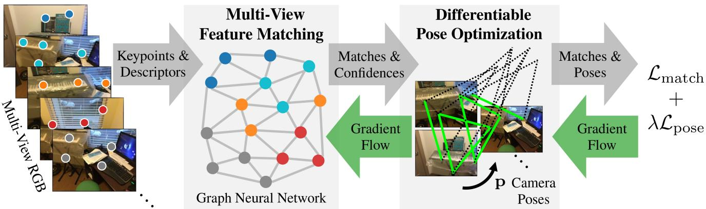
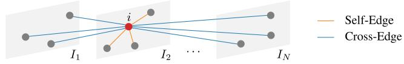
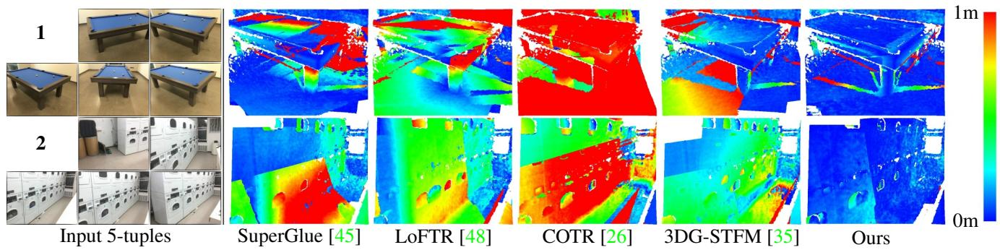
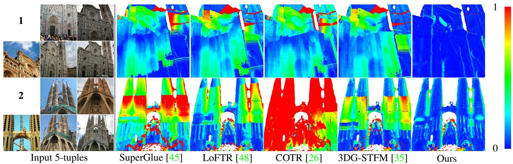
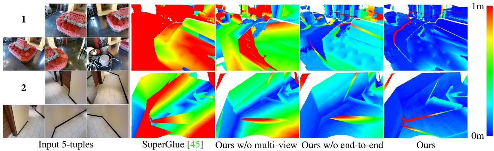
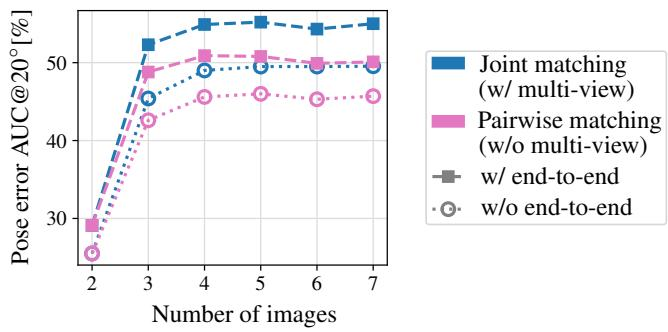

# End2End Multi-View Feature Matching with Differentiable Pose Optimization

Barbara Roessle and Matthias Nießner Technical University of Munich

  
Figure 1. We connect feature matching and pose optimization in an end-to-end trainable approach that enables matches and confidenc weights to be informed by the pose estimation objective. To this end, we introduce GNN-based multi-view feature matching to predic matches and confidences tailored to a differentiable pose solver, which significantly improves pose estimation performance.

## Abstract

Erroneous feature matches have severe impact on subsequent camera pose estimation and often require additional, time-costly measures, like RANSAC, for outlier rejection. Our method tackles this challenge by addressing feature matching and pose optimization jointly. To this end, we propose a graph attention network to predict image correspondences along with confidence weights. The resulting matches serve as weighted constraints in a differentiable pose estimation. Training feature matching with gradientsfrom pose optimization naturally learns to downweight outliers and boosts pose estimation on image pairs compared to SuperGlue by 6.7% on ScanNet. At the same time, it reduces the pose estimation time by over 50% and renders RANSAC iterations unnecessary. Moreover, we integrate information from multiple views by spanning the graph across multiple frames to predict the matches all at once. Multi-view matching combined with end-to-end training improves the pose estimation metrics on Matterport3D by 18.5% compared to SuperGlue.

## 1. Introduction

Feature matching is a key component in many 3D vision applications such as structure from motion (SfM) or simultaneous localization and mapping (SLAM). Conventional pose estimation is a multi-step process: feature detection finds interest points, for which local descriptors are computed. Based on the descriptors, pairs of keypoints from different images are matched, which defines constraints in the pose optimization. A major challenge lies in the ambiguity of matching local descriptors by nearest-neighbor search, which is error-prone, particularly in texture-less areas or in presence of repetitive patterns. Hand-crafted heuristics or outlier filters become necessary to circumvent this problem to some degree.

Recent learning-based approaches [45, 48, 26, 35] instead leverage the greater image context to improve the matching, e.g., SuperGlue [45] introduces a graph neural network (GNN) for descriptor matching on an image pair. Graph edges connect keypoints from arbitrary locations and enable reasoning in a broad context, leading to globally well-informed solutions compared to convolutional neural networks (CNN) with limited receptive field. The receptive field in SuperGlue, however, remains limited by the twoview setup, despite that more images are typically available in pose estimation tasks. Our idea is to further facilitate information flow by joining multiple views in the matching process. This way, we allow multi-view correlation to strengthen geometric reasoning and confidence prediction. Joint matching of multiple images integrates well into pose estimation pipelines, as they typically solve for more than two cameras.

Additionally, we note that accurate feature matching, in and of itself, does not necessarily give rise to accurate pose estimation, as the spatial distribution of feature matches is essential for robust pose optimization. For instance, perfectly precise matches may form a degenerate case (e.g., lying on a line) and thus have no value for pose optimization. In addition, confidence scores predicted by matching networks do not necessarily reflect the value of matches towards pose optimization. Feature matching and pose estimation are thus tightly coupled problems, for which we propose a joint solution.

We encode keypoints and descriptors from multiple images to construct a graph, where self-attention provides context awareness within the same image and cross-attention enables reasoning with respect to all other images. A GNN predicts matches along with confidence weights, which define constraints on the camera poses that we optimize with a differentiable solver. The GNN is trained end-to-end using gradients from the pose optimization. From this feedback, the network learns to produce valuable matches for pose estimation and thereby learns effective outlier rejection. We evaluate our method on image pairs and in a multi-view setting on ScanNet [14], Matterport3D [10], and MegaDepth [30] datasets and show that our joint approach to feature matching and pose estimation improves over prior work on learned feature matching, enabled by the following contributions:

• We introduce an end-to-end trainable pose estimation that both guides confidence weights of feature matches in an unsupervised fashion and backpropagates gradients to inform the matching network.

• We propose a multi-view graph attention network to learn feature matches simultaneously across multiple frames.

## 2. Related Work

Conventional Feature Matching. The classical feature matching pipeline comprises the following steps: 1) interest point detection, 2) feature description, 3) matching through nearest neighbor search in descriptor space, and 4) outlier filtering. In this pipeline, hand-crafted features like SIFT [32] and ORB [44] are very successful and have been widely used for many years. However, they tend to struggle with appearance or viewpoint changes. Starting with LIFT [55], learning-based descriptors have been developed to tackle these challenges [36, 17, 41, 4, 52]. They often combine interest point detection and description, such as SuperPoint [16], which we use for our method. Nearest neighbor feature matching is prone to outliers, making post-processing methods indispensable. This includes mutual check, ratio test [32], neighborhood consensus [51, 9, 8, 5, 34] and sampling-based outlier rejection [19, 3, 39]. Learning-based approaches have also addressed outlier detection [56, 40, 7, 58]—these methods rely on reasonable matching proposals and lack visual information in their decision process.

Learning Feature Matching. Recent methods employ neural networks for feature matching on image pairs. There are methods that determine dense, pixel-wise correspondences with confidence estimates for filtering [43, 42, 29]. However, the matching lacks global context due to the limited receptive field of CNNs and fails to distinguish regions of little texture or repetitive structure. In contrast, SuperGlue [45] represents a sparse matching network that operates on keypoints with descriptors. Using an attentional GNN [54] all keypoints interact, hence the receptive field spans across both images, leading to accurate matches in wide-baseline settings. Inspired by GNN-based feature matching, we build upon SuperGlue by enhancing its receptive field through multi-view matching and by improving outlier filtering through end-to-end training with pose optimization. LoFTR [48] and COTR [26] recently proposed detector-free methods that operate on RGB images directly. Using attention and a coarse-to-fine approach, they equally achieve a receptive field across the image pair and high quality matches. 3DG-STFM [35] extends LoFTR with student-teacher learning to leverage RGB-comprised depth information. We show that our end-to-end and multi-view approach improves pose estimation over SuperGlue and the detector-free methods LoFTR, COTR, and 3DG-STFM.

Pose Optimization. Once matches between a set of images are found, bundle adjustment formulations [50] are used to optimize poses on RGB [1] or RGB-D data [15]. This typically leads to non-linear least squares problems which are optimized with non-linear solvers, like Gauss-Newton or Levenberg-Marquardt. Such pipelines usually perform feature matching as a pre-process, followed by a filtering with a combination of RANSAC and robust optimization techniques [57, 12]. However, feature matching and pose optimization largely remain separate steps and cannot inform each other. To this end, differentiable pose optimization techniques, such as DeMoN [53], BA-Net [49], RegNet [22], or 3DRegNet [38], propose to obtain gradients through the pose optimization that in turn guide the learning of feature descriptors. In contrast to treating feature extraction as a separate step, feature descriptors are then learned with the objective to obtain well-aligned poses. In our work, we go a step further and focus on learning how to match features rather than using a predefined matching method. We leverage differentiable pose optimization to provide gradients for our feature matching network, and achieve significantly improved pose estimation results.

## 3. Method

Our method associates keypoints from N images $\{ I _ { n } \} _ { n = 1 } ^ { N }$ , such that the resulting matches and confidence weights are particularly valuable for estimating the corresponding camera poses $\{ \mathbf { p } _ { n } \} _ { n = 1 } ^ { N } ; \mathbf { p } _ { n } \in \mathbb { R } ^ { 6 }$ . Keypoints are represented by their image coordinates $\mathbf { x } \in \mathbb { R } ^ { 2 } .$ , visual descriptors d $\in \mathbb { R } ^ { D }$ and a confidence score $c \in [ 0 , 1 ]$ . We use the SuperPoint network for feature detection and description [16]. Our pipeline (Fig. 1) ties together feature matching and pose optimization: we employ a GNN to associate keypoints across multiple images (Sec. 3.1). The resulting matches and confidence weights define constraints in the subsequent pose optimization (Sec. 3.2), which is differentiable, thus enabling end-to-end training (Sec. 3.3). Both, multi-view and end-to-end, are independent and can be used in isolation, however, the benefit is larger in combination, as shown in the experiments (Sec. 4).

## 3.1. Multi-View Graph Attention Network

Motivation. In the multi-view matching problem of N images, each keypoint matches to at most N − 1 other keypoints, where each of the matching keypoints belongs to a different input image. Without knowing the transformations between images, one keypoint can match to any keypoint location in the other images. Hence, all keypoints in the other images need to be considered as matching candidates. Although keypoints from the same image are not matching candidates, they contribute valuable constraints in the assignment problem, e.g., their projection into other images must follow consistent transformations. The matching problem can be represented as a graph, where nodes model keypoints and edges their relationships. A GNN architecture reflects this structure and enables learning the complex relations between keypoints to determine feature matches. The iterative message passing process enables the search for globally optimal matches as opposed to a greedy local assignment. On top of that, attention-based message aggregation allows each keypoint to focus on information from the keypoints that provide the most insight for its assignment. We build upon SuperGlue, which introduces an attentional GNN for descriptor matching on image pairs [45]. Our extension to multi-image matching is motivated by the following: first, graph-based reasoning can benefit from tracks that are longer than two keypoints—i.e., a match becomes more confident, if multiple views agree on the keypoint similarity and its coherent location with respect to the other keypoints in each frame. In particular, with regards to robust pose optimization, it is crucial to facilitate this information flow and boost the confidence prediction. Second, pose estimation or SLAM systems generally consider multiple input views. With the described graph structure, jointly matching N images is more efficient in terms of intra-frame GNN messages than matching the corresponding image pairs individually, as detailed in the supplementary material.

  
Figure 2. Keypoints are graph nodes. Keypoint i is connected to keypoints in the same image through self-edges and to keypoints in other images though cross-edges.

Graph Construction. Each keypoint represents a graph node. The initial node embedding ${ { \bf \Pi } ^ { ( 1 ) } } { \bf \Pi } _ { { \bf f } _ { i } }$ of keypoint i is computed from its image coordinate $\mathbf { x } _ { i } .$ , confidence $c _ { i }$ and descriptor $\mathbf { d } _ { i } ,$ , which allows the GNN to consider spatial location, certainty and visual appearance in the matching:

$$
{ \bf \Pi } ^ { ( 1 ) } \mathbf { f } _ { i } = \mathbf { d } _ { i } + F _ { \mathrm { e n c o d e } } \left( \left[ \mathbf { x } _ { i } \parallel c _ { i } \right] \right) ,\tag{1}
$$

where ∥ denotes row-wise concatenation. $F _ { \mathrm { e n c o d e } }$ is a multilayer perceptron (MLP) that lifts the image point and its confidence into the high-dimensional space of the descriptor to help the spatial learning [45, 20, 54]. The graph nodes are connected by two kinds of edges: self-edges connect keypoints within the same image. Cross-edges connect keypoints from different images (Fig. 2). The edges are undirected, i.e., information flows in both directions.

Message Passing. Interaction between keypoints—the graph nodes—is realized through message passing [18, 21]. The goal is to achieve a state where node descriptors of matching keypoints are close in descriptor space, whereas unrelated keypoints are far apart. The GNN has L layers, where each layer ℓ corresponds to a message exchange between keypoints. The layers alternate between updates along self-edges $\mathcal { E } _ { \mathrm { s e l f } }$ and cross-edges $\mathcal { E } _ { \mathrm { c r o s s } } -$ starting with an exchange along self-edges in layer $\ell \ =$ 1 [45]. Eq. (2) describes the iterative node descriptor update, where ${ { \bf \Pi } ^ { ( \ell ) } } { \bf { m } } \varepsilon _ {  i }$ is the aggregated message from all keypoints that are connected to keypoint i by an edge in $\mathcal { E } \in \{ \mathcal { E } _ { \mathrm { s e l f } } , \mathcal { E } _ { \mathrm { c r o s s } } \} . \ ^ { ( \ell ) } F _ { \mathrm { u p d a t e } }$ is a MLP, where each GNN layer ℓ has a separate set of network weights.

$$
{ \bf \Pi } ^ { ( \ell + 1 ) } { \bf f } _ { i } = { \bf \Pi } ^ { ( \ell ) } { \bf f } _ { i } + { \bf \Pi } ^ { ( \ell ) } F _ { \mathrm { u p d a t e } } ( [ { \bf \Pi } ^ { ( \ell ) } { \bf f } _ { i } \parallel { \bf \Pi } ^ { ( \ell ) } { \bf m } \varepsilon _ {  i } ] )\tag{2}
$$

Multi-head attention [54] is used to merge all incoming information for keypoint i into a single message $^ { ( \ell ) } \mathbf { m } \varepsilon _ {  i } \ [ 4 5 ]$ . Messages along self-edges are combined by self-attention between the keypoints of the same image, messages along cross-edges by cross-attention between the keypoints from all other images. Linear projection of node descriptors is used to compute the query ${ \bf \Pi } ( \ell ) _ { { \bf q } _ { i } }$ of query keypoint i, as well as the keys ${ { \bf \Pi } ^ { ( \ell ) } } { \bf { k } } _ { j }$ and values ${ ( \grave { \ell } ) } _ { \mathbf { V } _ { j } }$ of its source keypoints j:

$$
{ { \bf \Lambda } ^ { ( \ell ) } } { \bf q } _ { i } = { { \bf \Lambda } ^ { ( \ell ) } } { \bf W } _ { 1 } { } ^ { ( \ell ) } { \bf f } _ { i } + { { \bf \Lambda } ^ { ( \ell ) } } { \bf b } _ { 1 } ,\tag{3}
$$

$$
\begin{array} { r } { \left[ ^ { ( \ell ) } \mathbf { k } _ { j } \right] = \left[ ^ { ( \ell ) } \mathbf { W } _ { 2 } \right] ( \ell ) \mathbf { f } _ { j } + \left[ ^ { ( \ell ) } \mathbf { b } _ { 2 } \right] . } \end{array}\tag{4}
$$

The set of source keypoints $\{ j : ( i , j ) \in \mathcal { E } \}$ comprises all keypoints connected to i by an edge of the type, that is relevant to the current layer. W and b are per-layer weight matrices and bias vectors, respectively. For each source keypoint the similarity to the query is computed by the dot product $^ { ( \ell ) } { \bf q } _ { i } \cdot { \bf \mu } ^ { ( \ell ) } { \bf k } _ { j }$ . The softmax over the similarity scores determines the attention weight $\alpha _ { i j }$ of each source keypoint $j$ in the aggregated message to i:

$$
{ } ^ { ( \ell ) } \mathbf { m } \varepsilon \to i = \sum _ { j : ( i , j ) \in \mathcal E } { } ^ { ( \ell ) } \alpha _ { i j } { } ^ { ( \ell ) } \mathbf { v } _ { j } .\tag{5}
$$

It is important to note that in cross-attention layers, the source keypoints j to a query keypoint i come from multiple images. The softmax-based weighting is robust to variable number of input views and therewith variable number of keypoints. After L message passing iterations the node descriptors for subsequent assignment are retrieved by linear projection:

$$
\mathbf { f } _ { i } = \mathbf { W } _ { 4 } ^ { \left( L + 1 \right) } \mathbf { f } _ { i } + \mathbf { b } _ { 4 } .\tag{6}
$$

Partial Assignment. The partial assignment problem of keypoints from two images can be solved with the differentiable Sinkhorn algorithm [47, 13, 45]: Given an input score matrix, a partial assignment is optimized, where each keypoint either obtains a match in the other image or remains unmatched. We compute the assignment on the set of possible image pairs P, excluding pairs between identical images and pairs that are a permutation of another pair. For each pair $( a , b ) \in \mathcal { P } ; a , b \in \{ 1 , 2 , . . . , N \}$ , the score matrix is filled with the dot-product similarities of node descriptors. From the resulting partial assignment matrix $\mathbf { P } _ { a b } ,$ the set of matches is derived: first, a candidate match for each keypoint is determined by the row-wise and column-wise maximal elements. Second, we keep only those matches, where both keypoints mutually agree on the assignment.

Confidence Prediction. For each pair of matching keypoints $i , j$ a confidence weight $w _ { i j }$ is predicted from the final node descriptors $\mathbf { f } _ { i } , \mathbf { f } _ { j }$ and their score in the corresponding partial assignment matrix $\mathrm { { \bf P } } _ { a b } \mathrm { { : } }$

$$
w _ { i j } = F _ { \mathrm { c o n f } { } . 1 } ( F _ { \mathrm { c o n f } { } . 2 } ( \mathbf { P } _ { a b , i , j } ) + F _ { \mathrm { c o n f } { } . 3 } \left( \left[ \mathbf { f } _ { i } \parallel \mathbf { f } _ { j } \right] \right) ) ,\tag{7}
$$

where $F _ { \mathrm { c o n f } _ { - ^ { * } } }$ represent small MLPs.

## 3.2. Differentiable Pose Optimization

We introduce a differentiable relative pose optimization that provides supervision signal for feature matching. It is composed of two parts: initial pose estimation through a weighted eight-point algorithm and pose refinement through bundle adjustment.

Weighted Eight-Point Algorithm. For each image pair, a fundamental matrix F is computed using the eight-point algorithm [31] with input coordinate normalization [23]. To facilitate the learning of meaningful confidences, it is essential to consider all matches in a weighted manner. Hence, we define the system of linear equations as a confidence-weighted version of the eight-point algorithm:

$$
\mathrm { d i a g } ( { \bf w } ) { \bf A } \mathrm { f l a t } ( { \bf F } ) = { \bf 0 } .\tag{8}
$$

Eq. (8) follows from the epipolar geometry $\mathbf { x } ^ { \prime \top } \mathbf { F } \mathbf { x } = 0$ by arranging the known coordinates of a match, $\mathbf { x } = [ x , y , z ] ^ { \top }$ and $\begin{array} { r } { \bar { { \bf x } ^ { \prime } } ~ = ~ [ x ^ { \prime } , y ^ { \prime } , z ^ { \prime } ] ^ { \top } } \end{array}$ , into matrix A and flattening F in column-major order to a vector flat(F). Each row $[ x x ^ { \prime } , x y ^ { \prime } , x , y \bar { x } ^ { \prime } , y y ^ { \prime } , y , x ^ { \prime } , y ^ { \prime } , 1 ]$ in A describes one match and is multiplied with its confidence through the diagonal matrix diag(w) from the vector of confidences w. Given more than 8 matches, the system is overdetermined. Thus, we search a least-squares solution for F that minimizes ∥diag(w)A flat $( \mathbf { F } ) \Vert _ { 2 }$ under the constraint ∥flat $( \mathbf { F } ) \Vert _ { 2 } = 1$ to avoid the trivial solution. Singular value decomposition (SVD) of diag(w)A determines this solution as the singular vector with the smallest singular value and we force the resulting F to have rank 2 [24]. The partial derivatives of the SVD can be computed in closed-form [25], thus the eightpoint algorithm suits well for end-to-end training. Given the intrinsics and the resulting F, there are four possible solutions for the relative transformation between an image pair, aside from unknown scale. During training, we select the solution closest to the ground truth. At test time, following the cheirality constraint [24], the solution with most triangulated points in front of both cameras is chosen.

Bundle Adjustment. The initial relative pose $\mathbf { p } _ { \mathrm { i n i t } }$ from the weighted eight-point algorithm is refined using a bundle adjustment formulation. To this end, we introduce a differentiable optimizer Ω to refine the relative pose p and estimate 3D points $\mathbf { Y } \in \mathbb { R } ^ { M \times 3 }$ for the matches $\mathcal { M } \colon$

$$
\{ \mathbf { p } , \mathbf { Y } \} = \Omega ( \mathbf { p } _ { \mathrm { i n i t } } , \mathcal { M } ) .\tag{9}
$$

For each match m, we compute confidence-weighted residuals $ { \mathbf { r } } _ { m } ,  { \mathbf { r } } _ { m } ^ { \prime } \in \mathbb { R } ^ { 2 }$ on the projection of the corresponding 3D point y into each image and define the energy as the sum of squares:

$$
E ( \mathbf { p } , \mathbf { Y } ) = \sum _ { ( \mathbf { x } , \mathbf { x } ^ { \prime } , w ) , \mathbf { y } \in \mathcal { M } , \mathbf { Y } } \left( \left\| \mathbf { r } _ { m } \right\| _ { 2 } ^ { 2 } + \left\| \mathbf { r } _ { m } ^ { \prime } \right\| _ { 2 } ^ { 2 } \right) , \mathrm { ~ w h e r e ~ }\tag{10}
$$

$$
{ \bf r } _ { m } = w \left( \pi ( { \bf y } ) - { \bf x } \right) , ~ { \bf r } _ { m } ^ { \prime } = w \left( \pi ^ { \prime } ( { \bf R } { \bf y } + { \bf t } ) - { \bf x } ^ { \prime } \right) .\tag{11}
$$

x and $\mathbf { x } ^ { \prime }$ are the image coordinates of a match and w is its confidence. The 3D points are defined in the first camera frame and $\{ \mathbf { R } \in \mathbb { R } ^ { 3 \times 3 } , \mathbf { t } \in \mathbb { R } ^ { 3 } \}$ describes the transformation from the first to the second camera, for which $ { \mathbf { p } } \in \mathbb { R } ^ { 6 }$ is the equivalent pose vector in $\mathfrak { s e } ( 3 )$ coordinates, i.e., three translation elements followed by three rotation elements. The functions, π and $\pi ^ { \prime } { \mathrm { . } }$ , project a 3D point from the respective camera frame to its image plane. p is initialized to $\mathbf { p } _ { \mathrm { i n i t } }$ and Y is initialized by triangulating the matches.

Gauss-Newton algorithm is used to minimize the energy with respect to the relative pose and the 3D points. Thus, we optimize for a vector $\mathbf { z } = \left\lceil \mathbf { p } \right\rceil \left\| \operatorname { f a t } ( \mathbf { Y } ^ { \top } ) \right\rceil \bar { \in } \mathbb { R } ^ { 6 + 3 M }$ and compose a residual vector $\mathbf { r } \overset {  } { = } [ \mathbf { r } _ { 1 } \parallel \mathbf { r } _ { 1 } ^ { \prime } \parallel \dots \parallel \mathbf { r } _ { M } \parallel \mathbf { r } _ { M } ^ { \prime } ] \in$ $\mathbb { R } ^ { 4 M }$ , where $M$ is the number of matches. The Jacobian matrix $\mathbf { J } ~ \in ~ \mathbb { R } ^ { 4 M \times ( 6 + 3 M ) }$ is initialized to 0 and for each match m the corresponding submatrices are filled with the partial derivatives with respect to the pose $\frac { \partial \mathbf { r } _ { m } ^ { \prime } } { \partial \mathbf { p } } \in \mathbb { R } ^ { 2 \times 6 }$ and with respect to the 3D point $\begin{array} { r } { \frac { \partial \mathbf { r } _ { m } } { \partial \mathbf { y } } , \frac { \partial \mathbf { r } _ { m } ^ { \prime } } { \partial \mathbf { y } } \in \mathbb { R } ^ { 2 \times 3 } \ [ 6 ] \mathrm { . } } \end{array}$

$$
\frac { \partial \mathbf { r } _ { m } ^ { \prime } } { \partial \mathbf { p } } = w \frac { \partial \pi ^ { \prime } ( \mathbf { R } \mathbf { y } + \mathbf { t } ) } { \partial ( \mathbf { R } \mathbf { y } + \mathbf { t } ) } \left[ \mathbf { I } \right. \left. - ( \mathbf { R } \mathbf { y } + \mathbf { t } ) ^ { \wedge } \right] ,\tag{12}
$$

$$
\frac { \partial \mathbf { r } _ { m } } { \partial \mathbf { y } } = w \frac { \partial \pi ( \mathbf { y } ) } { \partial \mathbf { y } } , \qquad \frac { \partial \mathbf { r } _ { m } ^ { \prime } } { \partial \mathbf { y } } = w \frac { \partial \pi ^ { \prime } ( \mathbf { R y } + \mathbf { t } ) } { \partial ( \mathbf { R y } + \mathbf { t } ) } \mathbf { R } ,\tag{13}
$$

$$
\mathrm { w h e r e } \ \frac { \partial \pi ( \mathbf { u } ) } { \partial \mathbf { u } } = \left[ \begin{array} { c c c } { f _ { x } / u _ { z } } & { 0 } & { - \left. f _ { x } u _ { x } \right/ u _ { z } ^ { 2 } } \\ { 0 } & { f _ { y } / u _ { z } } & { - \left. f _ { y } u _ { y } \right/ u _ { z } ^ { 2 } } \end{array} \right] .\tag{14}
$$

I is $\mathrm { ~ 1 ~ 3 ~ } \times \mathrm { ~ 3 ~ }$ identity matrix, $( \cdot ) ^ { \wedge }$ maps a vector $\in \mathbb { R } ^ { 3 }$ to its skew-symmetric matrix, $f _ { * }$ are focal lengths and $u _ { * }$ are coordinates of a 3D point u.

Using the current state of $\{ \mathbf { p } , \mathbf { Y } \}$ , each Gauss-Newton iteration establishes a linear system, that is solved for the update $\Delta \mathbf { z }$ using LU decomposition:

$$
\mathbf { J } ^ { \top } \mathbf { J } \Delta \mathbf { z } = - \mathbf { J } ^ { \top } \mathbf { r } .\tag{15}
$$

We update the state in $T$ Gauss-Newton iterations and apply Jacobi preconditioning and a damping factor $\beta$ for stability.

## 3.3. End-to-End Training

The whole pipeline, from the matching network to the pose optimization, is differentiable, which allows for a pose loss that guides the matching network to produce valuable matches and accurate confidences for robust pose optimization. The training objective $\mathcal { L }$ consists of a matching term ${ \mathcal { L } } _ { \mathrm { m a t c h } }$ [45] and a pose term $\mathcal { L } _ { \mathrm { p o s e } }$ , which are balanced by

the factor λ:

$$
\mathcal { L } = \sum _ { ( a , b ) \in \mathcal { P } } \mathcal { L } _ { \mathrm { m a t c h } } ( a , b ) + \lambda \mathcal { L } _ { \mathrm { p o s e } } ( a , b ) , \mathrm { ~ w h e r e }\tag{16}
$$

17)

$$
\begin{array} { r l } & { \mathcal { L } _ { \mathrm { m a t c h } } ( a , b ) = - \displaystyle \sum _ { ( i , j ) \in \mathcal { T } _ { a b } } \log \mathbf { P } _ { a b , i , j } } \\ & { \qquad - \displaystyle \sum _ { i \in \mathcal { U } _ { a b } } \log \mathbf { P } _ { a b , i , j _ { \mathrm { m a x } } } - \sum _ { j \in \mathcal { V } _ { a b } } \log \mathbf { P } _ { a b , i _ { \mathrm { m a x } } , j } , } \\ & { \mathcal { L } _ { \mathrm { p o s e } } ( a , b ) = \displaystyle \cos ^ { - 1 } ( \frac { \mathbf { f } _ { a - b , k } \cdot \mathbf { t } _ { a - b } } { \| \mathbf { f } _ { a - b } \| _ { 2 } \cdot \| \mathbf { t } _ { a - b } \| _ { 2 } } ) } \\ & { \qquad + \lambda _ { \mathrm { r o t } } \cos ^ { - 1 } ( \frac { \operatorname { t r } ( \mathbf { \hat { R } } _ { a  b } ^ { \top } \mathbf { R } _ { a  b } ) - 1 } { \| \mathbf { f } _ { a  b } \| _ { 2 } } ) . } \end{array}\tag{18}
$$

${ \mathcal { L } } _ { \mathrm { m a t c h } }$ computes the negative log-likelihood of the assignment between an image pair. The labels are computed using the ground truth depth maps and camera parameters: $\mathcal { T } _ { a b }$ is the set of matching keypoints, $\mathcal { U } _ { a b }$ and $\mathcal { V } _ { a b }$ identify unmatched keypoints from $I _ { a }$ and $I _ { b } ,$ , respectively. $\mathcal { L } _ { \mathrm { p o s e } }$ computes a transformation error between a pair of camera poses, where the translational and rotational components are balanced by $\lambda _ { \mathrm { { r o t } } }$ . We found that training on the weighted eightpoint result works equally well as training on both weighted eight-point and bundle adjustment, hence, $\mathcal { L } _ { \mathrm { p o s e } }$ is applied on the weighted eight-point result. At test time, however, the pose refinement with bundle adjustment is highly beneficial as shown in the experiments (Sec. 4). $\hat { \mathbf { R } } _ { a  b }$ and $\hat { \mathbf { t } } _ { a  b }$ are the rotation matrix and translation vector of the estimated pose. $\mathbf { R } _ { a  b }$ and $\mathbf { t } _ { a  b }$ define the ground truth transformation. We use the Adam optimizer [28]. Further detail on the network architecture and training setup are provided in the supplementary material.

## 4. Results

We evaluate performance on indoor and outdoor pose estimation in a two-view and multi-view setting (Secs. 4.1 and 4.2) and runtime (Sec. 4.3). Sec. 4.4 shows the effectiveness of end-to-end training and multi-view matching in an ablation study. A cross-dataset and matching evaluation is provided in the supplement.

Baselines. Prior work, in particular SuperGlue [45], has extensively demonstrated the superiority of the GNN approach over conventional matching. Hence, we focus on comparisons to recent matching networks: SuperGlue [45], LoFTR [48], COTR [26], and 3DG-STFM [35]. We additionally compare to a non-learning-based matcher, i.e., mutual nearest neighbor search on the SuperPoint [16] descriptors. This serves to confirm the effectiveness of SuperGlue and our method, which both use SuperPoint descriptors.

## 4.1. Two-View Pose Estimation

Following prior work [45, 48, 35], we evaluate on the same 1500 image pairs of ScanNet and MegaDepth and compute the area under the curve (AUC) in % at the thresholds [5◦, 10◦, 20◦] of the pose error, i.e., the maximum of rotation and translation error, where the translation error is the angle between translation vectors, since poses are only determined up to an unknown scale factor. Tabs. 1 and 2 list the AUC metrics for four pose estimation methods: (i) essential matrix estimation with RANSAC, (ii) weighted eight-point algorithm (Sec. 3.2), (iii) RANSAC followed by T = 10 bundle adjustment iterations (Sec. 3.2) and (iv) weighted eight-point algorithm followed by T = 10 bundle adjustment iterations (Sec. 3.2). The results show that our method outperforms the baselines on two-view pose estimation. For our method, the combination of weighted eight-point algorithm and bundle adjustment is stronger than pose estimation with RANSAC in the indoor and outdoor setting. This shows that end-to-end training enables the learning of accurate confidences that down-weight outliers and render RANSAC unnecessary.

<table><tr><td rowspan="2"></td><td rowspan="2">Pose est. method</td><td colspan="3">Pose error AUC [%] ↑</td></tr><tr><td>@5°</td><td>@10°</td><td>@20°</td></tr><tr><td>Mutual nearest neighbor</td><td></td><td>9.5</td><td>21.6</td><td>35.7</td></tr><tr><td>SuperGlue [45]</td><td></td><td>16.2</td><td>33.8</td><td>51.8</td></tr><tr><td>LoFTR [48]</td><td>RANSAC</td><td>22.1</td><td>40.8</td><td>57.6</td></tr><tr><td>COTR [26] cross-dataset</td><td></td><td>11.8</td><td>26.5</td><td>42.5</td></tr><tr><td>3DG-STFM [35]</td><td></td><td>23.6</td><td>43.6</td><td>61.2</td></tr><tr><td>Ours w/o multi-view</td><td></td><td>20.7</td><td>41.3</td><td>60.7</td></tr><tr><td>Mutual nearest neighbor</td><td></td><td>0.0</td><td>0.1</td><td>0.7</td></tr><tr><td>SuperGlue [45]</td><td>-p-t</td><td>11.7</td><td>26.8</td><td>45.6</td></tr><tr><td>LoFTR [48]</td><td></td><td>15.0</td><td>30.6</td><td>47.3</td></tr><tr><td>COTR [26] cross-dataset</td><td>Wiht</td><td>3.2</td><td>9.5</td><td>20.2</td></tr><tr><td>3DG-STFM [35]</td><td></td><td>10.1</td><td>23.4</td><td>39.5</td></tr><tr><td>Ours w/o multi-view</td><td></td><td>20.7</td><td>41.6</td><td>61.7</td></tr><tr><td>Mutual nearest neighbor</td><td></td><td>10.1</td><td>22.4</td><td>36.3</td></tr><tr><td>SuperGlue [45]</td><td>RANSAC</td><td>17.0</td><td>35.2</td><td>54.0</td></tr><tr><td>LoFTR [48]</td><td></td><td>22.4</td><td>41.0</td><td>57.7</td></tr><tr><td>COTR [26] cross-dataset</td><td>unle əuust.</td><td>12.6</td><td>27.7</td><td>43.5</td></tr><tr><td>3DG-STFM [35] Ours w/o multi-view</td><td></td><td>23.3</td><td>42.4</td><td>59.1</td></tr><tr><td></td><td></td><td>23.1</td><td>43.6</td><td>62.3</td></tr><tr><td>Mutual nearest neighbor</td><td>Wee- pont</td><td>0.0</td><td>0.3</td><td>1.8</td></tr><tr><td>SuperGlue [45]</td><td>bule ədust</td><td>20.6</td><td>40.0</td><td>58.7</td></tr><tr><td>LoFTR [48]</td><td></td><td>24.0</td><td>42.8</td><td>59.1</td></tr><tr><td>COTR [26] cross-dataset</td><td></td><td>8.5</td><td>19.6</td><td>33.9</td></tr><tr><td>3DG-STFM [35]</td><td></td><td>20.3</td><td>37.9</td><td>54.1</td></tr><tr><td>Ours w/o multi-view</td><td></td><td>25.7</td><td>47.2</td><td>66.4</td></tr></table>

Table 1. Baseline comparison on two-view, wide-baseline, indoor pose estimation on ScanNet. Through end-to-end training with pose optimization, our network learns to predict valuable matches for pose estimation, and downweights outliers. This enables accurate weighted pose estimation, which outperforms the baselines. “cross-dataset” indicates that COTR was trained on MegaDepth.

<table><tr><td rowspan="2"></td><td rowspan="2">Pose est. method</td><td colspan="3">Pose error AUC [%] ↑</td></tr><tr><td>@5°</td><td>@10°</td><td>@20°</td></tr><tr><td>Mutual nearest neighbor</td><td></td><td>32.2</td><td>47.6</td><td>55.2</td></tr><tr><td>SuperGlue [45]</td><td></td><td>43.4</td><td>61.6</td><td>76.2</td></tr><tr><td>LoFTR [48]</td><td>RANSAC</td><td>52.8</td><td>69.2</td><td>81.2</td></tr><tr><td>COTR [26]</td><td></td><td>35.2</td><td>53.9</td><td>69.6</td></tr><tr><td>3DG-STFM [35]</td><td></td><td>52.6</td><td>68.5</td><td>80.0</td></tr><tr><td>Ours w/o multi-view</td><td></td><td>49.5</td><td>66.7</td><td>79.9</td></tr><tr><td>Mutual nearest neighbor</td><td></td><td>0.1</td><td>0.2</td><td>1.0</td></tr><tr><td>SuperGlue [45]</td><td>8po-nt</td><td>23.8</td><td>36.2</td><td>49.2</td></tr><tr><td>LoFTR [48]</td><td></td><td>15.5</td><td>27.1</td><td>41.6</td></tr><tr><td>COTR [26]</td><td></td><td>29.6</td><td>43.4</td><td>57.2</td></tr><tr><td>3DG-STFM [35]</td><td>Wght</td><td>4.0</td><td>9.5</td><td>19.8</td></tr><tr><td>Ours w/o multi-view</td><td></td><td>46.9</td><td>62.8</td><td>76.3</td></tr><tr><td>Mutual nearest neighbor</td><td></td><td>34.9</td><td>49.5</td><td>61.9</td></tr><tr><td>SuperGlue [45]</td><td></td><td>48.3</td><td>65.2</td><td>78.3</td></tr><tr><td>LoFTR [48]</td><td></td><td>52.8</td><td>69.6</td><td>82.0</td></tr><tr><td>COTR [26] cross-dataset</td><td>RANSAC une əus.</td><td>45.0</td><td>61.1</td><td>73.8</td></tr><tr><td>3DG-STFM [35]</td><td></td><td>51.2</td><td>67.7</td><td>80.2</td></tr><tr><td>Ours w/o multi-view</td><td></td><td>55.3</td><td>70.8</td><td>82.3</td></tr><tr><td>Mutual nearest neighbor</td><td>Wei- on t</td><td>0.1</td><td>0.8</td><td>4.3</td></tr><tr><td>SuperGlue [45]</td><td>bue ədus.</td><td>40.3</td><td>53.6</td><td>65.6</td></tr><tr><td>LoFTR [48]</td><td></td><td>25.7</td><td>40.0</td><td>54.7</td></tr><tr><td>COTR [26]</td><td></td><td>47.1</td><td>61.3</td><td>72.5</td></tr><tr><td>3DG-STFM [35]</td><td></td><td>10.2</td><td>20.0</td><td>35.0</td></tr><tr><td>Ours w/o multi-view</td><td></td><td>61.2</td><td>74.9</td><td>85.0</td></tr></table>

Table 2. Baseline comparison on two-view, wide-baseline, outdoor pose estimation on MegaDepth. The pose optimization objective guides our method to produce matches with accurate confidences for weighted pose estimation, leading to higher pose accuracy than the baselines relying on RANSAC.

## 4.2. Multi-View Pose Estimation

For multi-view evaluation, we sample test images with the same overlap criterion as used by prior work to sample image pairs [45, 48, 35]. However, instead of sampling a pair, we sample a 5-tuple, by appending three more images that each satisfy the overlap criterion to the previous one. Further detail and overlap ranges are provided in the sup plement. Besides ScanNet and MegaDepth, we evaluate on Matterport3D, which is particularly challenging for matching, as view captures are much more sparse, i.e., neighboring images are 60◦ horizontally and 30◦ vertically apart. This difficult dataset, serves to measure robustness on the pose estimation task.

Multi-view pose estimation is evaluated as follows: (i) Feature matches are computed. Baselines that operate on image pairs are run on all possible pairs of the tuple. (ii) Relative poses are estimated between all possible pairs using the best performing two-view pose estimation from Sec. 4.1. (iii) Absolute poses are determined through robust estimators for rotation [11] and translation [37], which take initial absolute poses and relative poses as input. The initial absolute poses are obtained by composing relative poses along edges of a maximum spanning tree on the match graph, where edge weights are inlier counts from the previous step. (iv) Bundle adjustment jointly optimizes all poses by minimizing the confidence-weighted reprojection error of inlier matches using Ceres Solver for non-linear least squares optimization [2]. The pose estimation performance is measured by the translation and rotation error AUC between all possible pairs of the tuple.

<table><tr><td rowspan="2"></td><td colspan="3">Transl. error AUC [%] ↑</td><td colspan="3">Rot. error AUC [%] ↑</td></tr><tr><td>@5°</td><td>@10°</td><td>@20°</td><td>@5°</td><td>@10°</td><td>@20°</td></tr><tr><td>Mutual nearest neighbor</td><td>8.5</td><td>17.8</td><td>31.0</td><td>33.0</td><td>48.4</td><td>62.8</td></tr><tr><td>SuperGlue [45]</td><td>21.3</td><td>37.5</td><td>53.7</td><td>54.2</td><td>71.0</td><td>82.6</td></tr><tr><td>LoFTR [48]</td><td>20.6</td><td>36.9</td><td>53.7</td><td>57.3</td><td>72.0</td><td>82.0</td></tr><tr><td>COTR [26] cross-dataset</td><td>10.9</td><td>22.4</td><td>36.9</td><td>38.8</td><td>53.6</td><td>66.3</td></tr><tr><td>3DG-STFM [35]</td><td>22.0</td><td>38.7</td><td>55.5</td><td>57.0</td><td>72.7</td><td>83.0</td></tr><tr><td>Ours</td><td>26.9</td><td>45.6</td><td>63.0</td><td>64.2</td><td>78.8</td><td>87.7</td></tr></table>

Table 3. Baseline comparison on multi-view indoor pose estimation on ScanNet. Our multi-view and end-to-end approach, predicts matches and confidences that improve pose estimation compared to the pairwise baselines. “cross-dataset” indicates that COTR was trained on MegaDepth.

<table><tr><td rowspan="2"></td><td colspan="3">Transl. error AUC [%] ↑</td><td colspan="3">Rot. error AUC [%] ↑</td></tr><tr><td>@5°</td><td>@10°</td><td>@20°</td><td>@5°</td><td>@10°</td><td>@20°</td></tr><tr><td>Mutual nearest neighbor</td><td>2.8</td><td>5.6</td><td>10.6</td><td>3.3</td><td>6.6</td><td>12.3</td></tr><tr><td>SuperGlue [45]</td><td>17.1</td><td>24.0</td><td>32.7</td><td>17.9</td><td>25.9</td><td>35.3</td></tr><tr><td>Ours w/o multi-view</td><td>19.4</td><td>27.8</td><td>38.4</td><td>20.9</td><td>30.5</td><td>41.8</td></tr><tr><td>Ours w/o end-to-end</td><td>28.5</td><td>35.4</td><td>42.7</td><td>29.4</td><td>38.0</td><td>46.2</td></tr><tr><td>Ours</td><td>33.2</td><td>42.1</td><td>51.6</td><td>35.1</td><td>45.8</td><td>56.2</td></tr></table>

Table 4. Baseline comparison and ablation study on multi-view indoor pose estimation on Matterport3D. The full version of our method, with multi-view matching and end-to-end training with pose optimization, achieves best performance.

<table><tr><td rowspan="2"></td><td colspan="3">Transl. error AUC [%] ↑</td><td colspan="3">Rot. error AUC [%] ↑</td></tr><tr><td>@5°</td><td>@10°</td><td>@20°</td><td>@5°</td><td>@10°</td><td>@20°</td></tr><tr><td>Mutual nearest neighbor</td><td>12.0</td><td>20.1</td><td>31.9</td><td>23.4</td><td>36.7</td><td>51.8</td></tr><tr><td>SuperGlue [45]</td><td>47.3</td><td>58.7</td><td>68.9</td><td>60.9</td><td>73.6</td><td>83.4</td></tr><tr><td>LoFTR [48]</td><td>48.7</td><td>59.5</td><td>69.5</td><td>63.9</td><td>75.3</td><td>84.0</td></tr><tr><td>COTR [26]</td><td>37.9</td><td>48.1</td><td>58.3</td><td>49.8</td><td>61.9</td><td>72.7</td></tr><tr><td>3DG-STFM [35]</td><td>44.5</td><td>55.3</td><td>65.8</td><td>59.5</td><td>71.9</td><td>81.7</td></tr><tr><td>Ours</td><td>52.1</td><td>63.0</td><td>72.5</td><td>66.7</td><td>77.8</td><td>85.9</td></tr></table>

Table 5. Baseline comparison on multi-view outdoor pose estimation on MegaDepth. Through multi-view matching and end-toend training, our method achieves higher pose estimation accuracy than the baselines.

The quantitative results (Tabs. 3 to 5) show that our method achieves higher AUC metrics than the baselines across all thresholds in the indoor and outdoor setting. The metrics on Matterport3D are overall lower than on ScanNet and MegaDepth, due to the smaller overlap between images.

<table><tr><td rowspan="2"></td><td colspan="2">Pose error AUC [%] ↑</td></tr><tr><td>@5°</td><td>@10°</td></tr><tr><td>SuperGlue [45]</td><td>70.0</td><td>80.2</td></tr><tr><td>Ours</td><td>74.5</td><td>83.4</td></tr></table>

Table 6. IMC multi-view evaluation using COLMAP SfM on the PhotoTourism dataset. Although COLMAP does not use matching confidences, there is a clear benefit from our multi-view matching method.

In this scenario, our method outperforms SuperGlue with a larger gap than on ScanNet or MegaDepth, which shows that our approach copes better with the more challenging setting in Matterport3D. For qualitative comparison, we visualize the reprojection error by projecting the ground truth depth maps from all other views using the estimated poses, scaled according to the ground truth (Figs. 3 and 4). With multi-view reasoning during matching and learned outlier rejection through end-to-end training, our method is robust to challenging situations, like repetitive patterns (Fig. 3 sample 2) or large viewpoint changes (Fig. 3 sample 1).

We further evaluate multi-view pose estimation using the protocol of the Image Matching Challenge (IMC) 2021 [27]. It provides a multi-view setting, where COLMAP [46] Structure-from-Motion (SfM) estimates camera poses on groups of 5-25 internet images of tourist attractions. Tab. 6 lists the pose error AUC metrics for the detector-based methods, SuperGlue and Ours. Even though COLMAP does not consider our learned confidence weights, we observe a clear improvement through our endto-end and multi-view approach.

Details on the baseline comparisons, further qualitative results and a cross-attention visualization are provided in the supplementary material.

## 4.3. Runtime

Tab. 7 compares runtime for matching and pose estimation. Our method requires the same amount of time as SuperGlue for matching an image pair, however, we reduce runtime by 9% when matching a 5-tuple. The savings stem from fewer intra-frame GNN messages in multi-view matching compared to matching the corresponding pairs individually (see supplementary material). The detector-free baselines take far more time for matching. Our method more than halves the RANSAC time compared to SuperGlue. This shows that our confidences allow for better outlier pre-filtering by confidence thresholding, which improves the ratio between inliers and outliers prior to RANSAC. Our proposed weighted pose estimation (weighted eight-point + bundle adjustment)—besides reducing the pose error (Sec. 4.1)—reduces the runtime on SuperGlue matches and our matches by half, compared to RANSAC on SuperGlue matches. Only COTR, due to a smaller number of matches, has a shorter pose estimation runtime, however, its matching time is multiple orders of magnitude higher and the pose accuracy is lower. All runtime is measured on a Nvidia GeForce RTX 2080. For a fair comparison to the detector-free matchers, the matching time of SuperGlue and our method includes the SuperPoint inference time.

Figure 3. Reprojection error (right) for estimated camera poses on ScanNet 5-tuples (left). With multi-view matching and end-to-end training, our method successfully handles challenging pose estimation scenarios, while baselines have severe camera pose errors.  
  
Figure 4. Reprojection error (right) for estimated camera poses on MegaDepth 5-tuples (left). Through multi-view matching and endto-end training, our method successfully estimates camera poses in challenging outdoor scenarios, while baselines show misalignment. Reprojection errors are visualized in the MegaDepth scaling.

<table><tr><td rowspan="2"></td><td colspan="2">Matching time ↓</td><td colspan="3">Pose estimation time ↓</td></tr><tr><td>2-view</td><td>5-view 10 pairs</td><td>RANSAC Weight.</td><td>8-point</td><td>Bundle adjust.</td></tr><tr><td>SuperGlue [45]</td><td>60ms</td><td>371 ms</td><td>126 ms</td><td>5ms</td><td>56 ms</td></tr><tr><td>LoFTR [48]</td><td>108 ms</td><td>976ms</td><td>148 ms</td><td>9ms</td><td>511 ms</td></tr><tr><td>COTR [26]</td><td>37950 ms</td><td>357096 ms</td><td>126 ms</td><td>5ms</td><td>47 ms</td></tr><tr><td>3DG-STFM [35]</td><td>130ms</td><td>1176ms</td><td>201 ms</td><td>10ms</td><td>735 ms</td></tr><tr><td>Ours</td><td>60 ms</td><td>338ms</td><td>52 ms</td><td>5ms</td><td>56 ms</td></tr></table>

Table 7. Matching and pose estimation time on ScanNet. Multiview matching is faster than matching the corresponding pairs. Our confidences enable effective thresholding prior to RANSAC, reducing its runtime. Weighted eight-point + bundle adjustment is faster or comparable to RANSAC on SuperGlue and our matches.

## 4.4. Ablation Study

The quantitative results on Matterport3D (Tab. 4) show that the full version of our method achieves the best performance. This is consistent with the qualitative results (Fig. 5), as well as the ablation results on ScanNet and MegaDepth, which are provided in the supplement.

Without Multi-View. Omitting multi-view in the GNN causes an average performance drop of 14.2% on Matterport3D. This suggests that the multi-view receptive field supports information flow from other views to bridge gaps, where the overlap is small. Sample 1 in Fig. 5 shows that without multi-view reasoning, the matching fails to resolve large viewpoint changes and difficult object symmetries.

Without End-to-End. Without end-to-end training the average performance drops by 7.3%. This shows that end-to-end training enables the learning of an outlier downweighting, that improves pose estimation. Dropping endto-end leads to increased misalignment in Fig. 5.

  
Figure 5. Reprojection error (right) for estimated camera poses on Matterport3D 5-tuples (left). Our complete method improves camera alignment over the ablated versions and SuperGlue, showing the importance of multi-view matching and end-to-end training.

Variable Number of Input Views. In Fig. 6, we investigate the impact of the number of images used for matching, both in pairwise (w/o multi-view) and joint (w/ multiview) manner. The experiment is conducted on sequences of 9 images which are generated on ScanNet as described in Sec. 4.2. The results show that pose estimation improves, when matching across a larger span of neighboring images. The curves, however, plateau when a larger window size does not bring any more relevant images into the matching. Additionally, the results show the benefit of joint matching in a single graph as opposed to matching all possible image pairs individually.

  
Figure 6. Pose error AUC on sequences of 9 images on ScanNet using variable number of images in pairwise or joint matching. Multi-view matching across ∼5 images combined with end-to-end training gives the best performance.

Variable Image Overlap. Evaluations on reduced image overlap are provided in the supplementary material.

## 4.5. Limitations

One of our contributions is the end-to-end differentiablity of the pose optimization that guides the matching network. While this significantly improves the pose estimation results, we currently only backpropgate gradients to the matching network, but do not update keypoint descriptors; i.e., we use existing SuperPoint [16]. However, we believe that jointly training feature descriptors is a promising avenue to even further improve performance. Besides, more recent keypoint detectors and descriptors like ASLFeat [33], in contrast to SuperPoint, provide subpixel accuracy, which can boost subsequent matching and pose estimation.

## 5. Conclusion

We have presented a method that couples multi-view feature matching and pose optimization into an end-to-end trainable pipeline. Our graph neural network matches features across multiple views in a joint fashion, which enables globally informed matching solutions. Combined with differentiable pose optimization, gradients inform the matching network, which learns to reject outliers to produce valuable matches for pose estimation. Our method significantly improves pose estimation compared to prior work. In particular, we observe increased robustness in challenging settings, such as in presence of repetitive structure or small image overlap as in the Matterport3D dataset. Overall, we believe that our end-to-end approach is an important stepping stone towards an end-to-end trained SLAM method.

## Acknowledgements

This work was supported by the ERC Starting Grant Scan2CAD (804724), the German Research Foundation (DFG) Grant “Making Machine Learning on Static and Dynamic 3D Data Practical”, and the German Research Foundation (DFG) Research Unit “Learning and Simulation in Visual Computing”. We thank Angela Dai for the video voice over.

## References

[1] Sameer Agarwal, Yasutaka Furukawa, Noah Snavely, Ian Simon, Brian Curless, Steven M Seitz, and Richard Szeliski. Building rome in a day. Communications of the ACM, 54(10):105–112, 2011. 2

[2] Sameer Agarwal, Keir Mierle, and The Ceres Solver Team. Ceres Solver, 3 2022. 7

[3] Daniel Bar´ ath and Jiri Matas. Magsac: Marginalizing sample´ consensus. 2019 IEEE/CVF Conference on Computer Vision and Pattern Recognition (CVPR), pages 10189–10197, 2019. 2

[4] Aritra Bhowmik, Stefan Gumhold, Carsten Rother, and Eric Brachmann. Reinforced feature points: Optimizing feature detection and description for a high-level task. 2020 IEEE/CVF Conference on Computer Vision and Pattern Recognition (CVPR), pages 4947–4956, 2020. 2

[5] Jiawang Bian, Wen-Yan Lin, Yasuyuki Matsushita, Sai-Kit Yeung, Tan Dat Nguyen, and Ming-Ming Cheng. Gms: Grid-based motion statistics for fast, ultra-robust feature correspondence. 2017 IEEE Conference on Computer Vision and Pattern Recognition (CVPR), pages 2828–2837, 2017. 2

[6] Jose Luis Blanco. A tutorial on se(3) transformation parameterizations and on-manifold optimization. University of Malaga, Tech. Rep, 09 2010. 5

[7] Eric Brachmann and Carsten Rother. Neural-guided ransac: Learning where to sample model hypotheses. 2019 IEEE/CVF International Conference on Computer Vision (ICCV), pages 4321–4330, 2019. 2

[8] Luca Cavalli, Viktor Larsson, Martin R. Oswald, Torsten Sattler, and Marc Pollefeys. Handcrafted outlier detection revisited. In ECCV, 2020. 2

[9] Jan Cech, Jiri Matas, and Michal Perdoch. Efficient sequential correspondence selection by cosegmentation. IEEE Transactions on Pattern Analysis and Machine Intelligence, 32:1568–1581, 2008. 2

[10] Angel X. Chang, Angela Dai, Thomas A. Funkhouser, Maciej Halber, Matthias Nießner, Manolis Savva, Shuran Song, Andy Zeng, and Yinda Zhang. Matterport3d: Learning from rgb-d data in indoor environments. 3DV, 2017. 2

[11] Avishek Chatterjee and Venu Madhav Govindu. Efficient and robust large-scale rotation averaging. In 2013 IEEE International Conference on Computer Vision, pages 521–528, 2013. 6

[12] Sungjoon Choi, Qian-Yi Zhou, and Vladlen Koltun. Robust reconstruction of indoor scenes. In IEEE Conference on Computer Vision and Pattern Recognition (CVPR), 2015. 2

[13] Marco Cuturi. Sinkhorn distances: Lightspeed computation of optimal transport. In NIPS, 2013. 4

[14] Angela Dai, Angel X. Chang, Manolis Savva, Maciej Halber, Thomas A. Funkhouser, and Matthias Nießner. Scannet: Richly-annotated 3d reconstructions of indoor scenes. CVPR, 2017. 2

[15] Angela Dai, Matthias Nießner, Michael Zollhofer, Shahram¨ Izadi, and Christian Theobalt. Bundlefusion: Real-time globally consistent 3d reconstruction using on-the-fly sur-

face reintegration. ACM Transactions on Graphics (ToG), 36(4):1, 2017. 2

[16] Daniel DeTone, Tomasz Malisiewicz, and Andrew Rabinovich. Superpoint: Self-supervised interest point detection and description. 2018 IEEE/CVF Conference on Computer Vision and Pattern Recognition Workshops (CVPRW), pages 337–33712, 2018. 2, 3, 5, 9

[17] Mihai Dusmanu, Ignacio Rocco, Tomas Pajdla, Marc Polle-´ feys, Josef Sivic, Akihiko Torii, and Torsten Sattler. D2-net: A trainable cnn for joint description and detection of local features. 2019 IEEE/CVF Conference on Computer Vision and Pattern Recognition (CVPR), pages 8084–8093, 2019. 2

[18] David Duvenaud, Dougal Maclaurin, Jorge Aguilera-Iparraguirre, Rafael Gomez-Bombarelli, Timothy Hirzel,´ Alan Aspuru-Guzik, and Ryan Adams. Convolutional net-´ works on graphs for learning molecular fingerprints. Advances in Neural Information Processing Systems (NIPS), 2015. 3

[19] Martin A. Fischler and Robert C. Bolles. Random sample consensus: a paradigm for model fitting with applications to image analysis and automated cartography. Commun. ACM, 24:381–395, 1981. 2

[20] Jonas Gehring, Michael Auli, David Grangier, Denis Yarats, and Yann Dauphin. Convolutional sequence to sequence learning. In ICML, 2017. 3

[21] Justin Gilmer, Samuel S. Schoenholz, Patrick F. Riley, Oriol Vinyals, and George E. Dahl. Neural message passing for quantum chemistry. In ICML, 2017. 3

[22] Lei Han, Mengqi Ji, Lu Fang, and Matthias Nießner. Regnet: Learning the optimization of direct image-to-image pose registration. arXiv preprint arXiv:1812.10212, 2018. 2

[23] R.I. Hartley. In defense of the eight-point algorithm. IEEE Transactions on Pattern Analysis and Machine Intelligence, 19(6):580–593, 1997. 4

[24] Richard Hartley and Andrew Zisserman. Multiple View Geometry in Computer Vision. Cambridge University Press, 2 edition, 2004. 4

[25] Catalin Ionescu, Orestis Vantzos, and Cristian Sminchisescu. Matrix backpropagation for deep networks with structured layers. In 2015 IEEE International Conference on Computer Vision (ICCV), pages 2965–2973, 2015. 4

[26] Wei Jiang, Eduard Trulls, Jan Hosang, Andrea Tagliasacchi, and Kwang Moo Yi. COTR: Correspondence Transformer for Matching Across Images. In ICCV, 2021. 1, 2, 5, 6, 7, 8

[27] Yuhe Jin, Dmytro Mishkin, Anastasiia Mishchuk, Jiri Matas, Pascal Fua, Kwang Moo Yi, and Eduard Trulls. Image matching across wide baselines: From paper to practice. International Journal of Computer Vision, 129(2):517–547, 2021. 7

[28] Diederik P. Kingma and Jimmy Ba. Adam: A method for stochastic optimization. CoRR, 2015. 5

[29] Xinghui Li, K. Han, Shuda Li, and Victor Adrian Prisacariu. Dual-resolution correspondence networks. NeurIPS, 2020. 2

[30] Zhengqi Li and Noah Snavely. Megadepth: Learning singleview depth prediction from internet photos. 2018 IEEE/CVF Conference on Computer Vision and Pattern Recognition, pages 2041–2050, 2018. 2

[31] Hugh Christopher Longuet-Higgins. A computer algorithm for reconstructing a scene from two projections. Nature, 293:133–135, 1981. 4

[32] David Lowe. Distinctive image features from scale-invariant keypoints. International Journal of Computer Vision, 2004. 2

[33] Zixin Luo, Lei Zhou, Xuyang Bai, Hongkai Chen, Jiahui Zhang, Yao Yao, Shiwei Li, Tian Fang, and Long Quan. Aslfeat: Learning local features of accurate shape and localization. Computer Vision and Pattern Recognition (CVPR), 2020. 9

[34] Jiayi Ma, Ji Zhao, Junjun Jiang, Huabing Zhou, and Xiaojie Guo. Locality preserving matching. International Journal of Computer Vision, pages 512–531, 2018. 2

[35] Runyu Mao, Chen Bai, Yatong An, Fengqing Zhu, and Cheng Lu. 3dg-stfm: 3d geometric guided student-teacher feature matching. ECCV, 2022. 1, 2, 5, 6, 7, 8

[36] Yuki Ono, Eduard Trulls, Pascal V. Fua, and Kwang Moo Yi. Lf-net: Learning local features from images. In NeurIPS, 2018. 2

[37] Onur Ozyesil and Amit Singer. Robust camera location es-¨ timation by convex programming. 2015 IEEE Conference on Computer Vision and Pattern Recognition (CVPR), pages 2674–2683, 2015. 6

[38] G Dias Pais, Srikumar Ramalingam, Venu Madhav Govindu, Jacinto C Nascimento, Rama Chellappa, and Pedro Miraldo. 3dregnet: A deep neural network for 3d point registration. In Proceedings of the IEEE/CVF conference on computer vision and pattern recognition, pages 7193–7203, 2020. 2

[39] Rahul Raguram, Jan-Michael Frahm, and Marc Pollefeys. A comparative analysis of ransac techniques leading to adaptive real-time random sample consensus. In ECCV, 2008. 2

[40] Rene Ranftl and Vladlen Koltun. Deep fundamental matrix´ estimation. In ECCV, 2018. 2

[41] Jer´ ome Revaud, Philippe Weinzaepfel, C ˆ esar Roberto de´ Souza, No’e Pion, Gabriela Csurka, Yohann Cabon, and M. Humenberger. R2d2: Repeatable and reliable detector and descriptor. Advances in Neural Information Processing Systems, 2019. 2

[42] Ignacio Rocco, Relja Arandjelovi’c, and Josef Sivic. Efficient neighbourhood consensus networks via submanifold sparse convolutions. In ECCV, 2020. 2

[43] Ignacio Rocco, Mircea Cimpoi, Relja Arandjelovic, Akihiko´ Torii, Tomas Pajdla, and Josef Sivic. Neighbourhood con-´ sensus networks. In NeurIPS, 2018. 2

[44] Ethan Rublee, Vincent Rabaud, Kurt Konolige, and Gary R. Bradski. Orb: An efficient alternative to sift or surf. 2011 International Conference on Computer Vision, pages 2564– 2571, 2011. 2

[45] Paul-Edouard Sarlin, Daniel DeTone, Tomasz Malisiewicz, and Andrew Rabinovich. Superglue: Learning feature matching with graph neural networks. 2020 IEEE/CVF Conference on Computer Vision and Pattern Recognition (CVPR), pages 4937–4946, 2020. 1, 2, 3, 4, 5, 6, 7, 8, 9

[46] Johannes Lutz Schonberger and Jan-Michael Frahm.¨ Structure-from-motion revisited. In Conference on Computer Vision and Pattern Recognition (CVPR), 2016. 7

[47] Richard Sinkhorn and Paul Knopp. Concerning nonnegative matrices and doubly stochastic matrices. Pacific Journal of Mathematics, pages 343–348, 1967. 4

[48] Jiaming Sun, Zehong Shen, Yuang Wang, Hujun Bao, and Xiaowei Zhou. Loftr: Detector-free local feature matching with transformers. 2021 IEEE/CVF Conference on Computer Vision and Pattern Recognition (CVPR), pages 8918– 8927, 2021. 1, 2, 5, 6, 7, 8

[49] Chengzhou Tang and Ping Tan. Ba-net: Dense bundle adjustment network. arXiv preprint arXiv:1806.04807, 2018. 2

[50] Bill Triggs, Philip F McLauchlan, Richard I Hartley, and Andrew W Fitzgibbon. Bundle adjustment—a modern synthesis. In International workshop on vision algorithms, pages 298–372. Springer, 1999. 2

[51] Tinne Tuytelaars and Luc Van Gool. Wide baseline stereo matching based on local, affinely invariant regions. In BMVC, 2000. 2

[52] Michal J. Tyszkiewicz, P. Fua, and Eduard Trulls. Disk: Learning local features with policy gradient. Advances in Neural Information Processing Systems, 2020. 2

[53] Benjamin Ummenhofer, Huizhong Zhou, Jonas Uhrig, Nikolaus Mayer, Eddy Ilg, Alexey Dosovitskiy, and Thomas Brox. Demon: Depth and motion network for learning monocular stereo. In Proceedings ofthe IEEE conference on computer vision and pattern recognition, pages 5038–5047, 2017. 2

[54] Ashish Vaswani, Noam Shazeer, Niki Parmar, Jakob Uszkoreit, Llion Jones, Aidan N Gomez, Ł ukasz Kaiser, and Illia Polosukhin. Attention is all you need. In Advances in Neural Information Processing Systems, 2017. 2, 3

[55] Kwang Moo Yi, Eduard Trulls, Vincent Lepetit, and Pascal V. Fua. Lift: Learned invariant feature transform. ECCV, 2016. 2

[56] Kwang Moo Yi, Eduard Trulls, Yuki Ono, Vincent Lepetit, Mathieu Salzmann, and Pascal V. Fua. Learning to find good correspondences. 2018 IEEE/CVF Conference on Computer Vision and Pattern Recognition, pages 2666–2674, 2018. 2

[57] Christopher Zach. Robust bundle adjustment revisited. In European Conference on Computer Vision, pages 772–787. Springer, 2014. 2

[58] Jiahui Zhang, Dawei Sun, Zixin Luo, Anbang Yao, Lei Zhou, Tianwei Shen, Yurong Chen, Long Quan, and Hongen Liao. Learning two-view correspondences and geometry using order-aware network. 2019 IEEE/CVF International Conference on Computer Vision (ICCV), pages 5844–5853, 2019. 2