# Enhanced Soft Label for Semi-Supervised Semantic Segmentation

Jie Ma1 Chuan Wang1 Yang Liu1 Liang Lin1 Guanbin Li1,2\* 1 School of Computer Science and Engineering, Sun Yat-sen University, Guangzhou, China 2 Research Institute, Sun Yat-sen University, Shenzhen, China

majie25@mail2.sysu.edu.cn, cwang.hkucs@gmail.com, liuy856@mail.sysu.edu.cn, linliang@ieee.org, liguanbin@mail.sysu.edu.cn

## Abstract

As a mainstream framework in the field of semisupervised learning (SSL), self-training via pseudo labeling and its variants have witnessed impressive progress in semisupervised semantic segmentation with the recent advance of deep neural networks. However, modern self-training based SSL algorithms use a pre-defined constant threshold to select unlabeled pixel samples that contribute to the training, thus failing to be compatible with different learning difficulties of variant categories and different learning status ofthe model. To address these issues, we propose Enhanced Soft Label (ESL), a curriculum learning approach tofully leverage the high-value supervisory signals implicit in the untrustworthy pseudo label. ESL believes that pixels with unconfident predictions can be pretty sure about their belonging to a subset of dominant classes though being arduous to determine the exact one. It thus contains a Dynamic Soft Label (DSL) module to dynamically maintain the high probability classes, keeping the label “soft” so as to make full use of the high entropy prediction. However, the DSL itself will inevitably introduce ambiguity between dominant classes, thus blurring the classification boundary. Therefore, we further propose a pixel-to-part contrastive learning method cooperated with an unsupervised object part grouping mechanism to improve its ability to distinguish between different classes. Extensive experimental results on Pascal VOC 2012 and Cityscapes show that our approach achieves remarkable improvements over existing state-of-the-art approaches.

## 1. Introduction

In recent years, the powerful feature representation capability of deep learning has allowed us to witness tremendous progress in visual understanding tasks represented by semantic segmentation [5, 6, 13, 28, 34, 48, 50]. However, as a notorious “data hungry” model, deep learning’s powerful feature representation relies on a large amount of high-quality annotated data. For semantic segmentation, the acquisition of pixel-level data annotations is unbearably time-consuming and labor-intensive. Therefore, with the development of semantic segmentation, the need for data-efficient semantic segmentation methods is extremely urgent. With the development of semi-supervised learning [3, 29, 32, 39, 42, 47], semi-supervised semantic segmentation [7, 24, 27, 30, 43] which focuses on the study of using massive unlabeled images to assist a small amount of labeled data to improve the performance of semantic segmentation, has thus emerged as promising approaches to reduce the need for annotations and has gained extensive research attention.

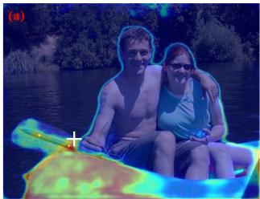

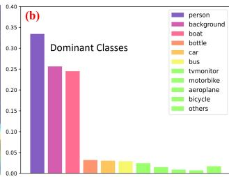  
Figure 1. (a) An unlabeled image with entropy map, where warm color means high entropy. (b) The prediction of a high entropy pixel marked in the white cross in (a). As seen, despite the difficulty to distinguish this pixel between dominant classes (person, background and boat), the model is pretty sure that it belongs to one of the dominant classes.

The core challenge of semi-supervised semantic segmentation is to make full use of unlabeled images. Self-training via pseudo labeling [15, 25, 43, 44, 45] and its variants have developed into a mainstream learning paradigm in this field. These methods usually leverage all labeled images to train a model in a fully-supervised manner and generate pseudo labels for all unlabeled images based on the trained model. Then, they re-train the model from scratch using all labeled images with ground-truth labels and unlabeled images with pseudo labels. Since pseudo-labels inevitably contain noise, simply applying them to model training is bound to trigger the confirmation bias problem [2], i.e. overfitting to the incorrect pseudo labels. To mitigate such issues, existing approaches usually just preserve high-confidence predictions, while low-confidence predictions are discarded. However, the selection of the involved training pixels depends on the appropriate threshold setting, which is hard to be compatible with various learning difficulties of variant categories and different learning status of the model.

In this paper, we argue that simply discarding these lowconfidence pseudo labels falls into a suboptimal trap, as there are usually hard samples with high-value supervisory signals that are crucial for model training. For the sake of convenience, we first introduce the concept of dominant classes, which generally refer to the categories with higher probability in the prediction of a pixel, and the details are described in Section. 3.2. The dominant classes of a pixel contain the categories that are usually semantic similar or spatial closer. For example, the pixel exemplified in Fig. 1 is a hard sample located in the object boundary, which is crucial for the training of the model, and its dominant classes include person, background, and boat. While the model is arduous to determine its exact class, it is pretty sure that the pixel belongs to the set of the dominant classes. Simply discarding such low-confidence pixel samples during training will result in unavoidable information loss thereby leading to inferior performance. Therefore, to fully explore the potential of high entropy predictions, we design a Dynamic Soft Label (DSL) method to dynamically maintain the high probability classes by keeping the label as a “soft” version. Concretely, we assign dominant classes for each pixel based on its probability prediction and normalize its probability score of dominant classes as a soft pseudo label, i.e. each class in the set of dominant classes will make contributions to the model training.

Though our proposed DSL can effectively utilize high entropy predictions, it brings ambiguity among dominant classes and thus blurs the classification boundary. To alleviate such issues, we adopt the typical contrastive learning method [17] to boost the power of distinguishing different classes, thereby Enhancing our dynamic Soft Label (ESL). Some prior works [1, 41, 49] extend the popular InfoNCE contrastive loss [17] to fully/semi-supervised semantic segmentation and make significant modifications for its use in a pixel-to-pixel paradigm or pixel-to-region paradigm. Unfortunately, in semi-supervised semantic segmentation, such pixel-to-pixel contrastive learning paradigm faces the unique technical challenge of sampling error as the pseudo labels for unlabeled images unavoidably contain noise. Although the pixel-to-region contrastive learning paradigm can alleviate this issue by averaging the class region features, this paradigm is so coarse that it ignores intra-class diversity and gives unfaithful sample allocation, such as forcing a pixel of cat-eye to be similar to the whole cat. Based on this concern, to fully explore the potential of intraclass diversity, we dive into the object part and further propose a pixel-to-part contrastive learning method cooperated with an unsupervised object-part grouping mechanism. Concretely, we maintain several prototypes for each class and each prototype represents a specific pattern. Then, the whole object in an image can be grouped into several meaningful parts by identifying the nearest prototype to each pixel. The candidate positive and negative samples can be obtained by the average pooling of the part feature. With the proposed pixel-to-part contrastive learning method, our DSL can be further enhanced by alleviating the ambiguity problem between dominant classes. To sum up, our contributions can be summarized in three-fold:

• We believe that simply neglecting pixels with the lowconfidence pseudo label during semi-supervised training falls into a suboptimal trap, and propose Enhanced Soft Label (ESL), a curriculum learning approach to fully leverage the high-value supervisory signals implicitly in the untrustworthy pseudo label.

• To alleviate the ambiguity issue between dominant classes caused by soft label, we further propose a novel pixel-to-part contrastive learning cooperated with an unsupervised object-part grouping mechanism to facilitate the learning of class boundaries.

• We evaluate our ESL on both Pascal VOC [10] and Cityscapes [8] under different partition protocols and demonstrate its superior performance.

## 2. Related Work

Semantic segmentation. Semantic segmentation has made great progress benefitting from deep neural networks [18, 21, 35] and large-scale datasets [8, 9, 10]. FCN [28] first proposes a fully convolutional network to perform semantic segmentation. Inspired by FCN, various methods [5, 6, 12, 13, 38] attempt to model context information by aggregating multiple pixels. DeepLabV3Plus [6] applies a spatial pyramid pooling structure to gather multiscale contextual information and an encoder-decoder to capture sharper object boundaries. ACNet [13] finds that the context demands are varying from different pixels and proposes to capture pixel-aware contexts by a competitive fusion of global context and local context. Some recent works, like Segmenter [34] and SETR [48], explore transformer-based semantic segmentation. However, these methods highly rely on pixel-level annotated labels which are labor-intensive and time-consuming to collect. In this paper, we focus on how to utilize a large amount of unlabeled data with the help of limited labeled data for semisupervised semantic segmentation.

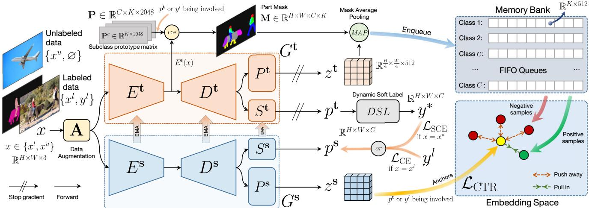  
Figure 2. An overview of our proposed Enhanced Soft Label framework, which consists of a teacher and a student network $G ^ { \mathbf { t } }$ and $G ^ { \mathbf { s } } .$ sharing the same network architecture, i.e. an encoder E, a decoder D followed by a projector head P and a segmentation head S, bu with different parameters. The teacher segmentation head $S ^ { \mathbf { t } }$ produces dynamic soft label $y ^ { * }$ for unlabeled images to supervise the student network. The teacher projector $P ^ { \mathrm { t } }$ generates object-part features as the candidate positive and negative samples for contrastive learning.

Semi-supervised semantic segmentation. The core challenge of semi-supervised semantic segmentation is to make full use of unlabeled images with the help of limited labeled images. Some earlier approaches [33] adopt GAN-based [31] method to provide auxiliary supervisory signals for unlabeled images. Recent methods simplify the paradigm, which can be generally divided into consistency regularization-based methods [7, 30] and self-training-based methods [15, 45]. Consistency regularization-based methods aim to get similar output under different perturbations, including input perturbation, feature perturbation, and network perturbation, etc. CCT [30] proposes cross-consistency training, where an invariance of the predictions is enforced over different perturbations applied to the outputs of the encoder. CPS [7] proposes to encourage high similarity between the predictions of two perturbed networks for the same input image and expand training data by using the unlabeled data with pseudo labels. Self-training-based methods aim to generate pseudo labels for unlabeled images to enlarge the labeled set. ST++ [45] explores the potential of strong data augmentation in self-training. USRN [15] builds the balanced subclass distribution from imbalanced class distribution to learn class-unbiased segmentation. However, these methods usually set a threshold to filter out low-confidence pseudo labels to avoid model degradation, which will lead to a suboptimal result, as most of these pixels are hard samples with valuable information for model training. Some methods attempt to use unreliable pseudo labels to avoid information loss. AEL [20] designs a re-weighting strategy to allocate more weight for the convincing samples. U2PL [43] treats the unreliable pixels as the negative samples to those most unlikely categories. Though impressive performance, they both ignore the other categories in the dominant classes that are also beneficial to the mode training. In this paper, we propose a dynamic soft label (DSL) method to fully utilize high-entropy prediction by converting it to a “soft” label, i.e. each category in the set of dominant classes will make contributions to the model training.

Contrastive learning. Contrastive learning has achieved great success in image-level self-supervised representation learning[4, 14, 17, 40]. The core idea is to enforce positive pairs to be similar and negative pairs to be dissimilar in embedding space. MoCo [17] builds a dynamic dictionary with a queue and a moving-averaged encoder for unsupervised visual representation learning. BYOL [14] directly attracts positive pairs without resorting to negative pairs. Recently, some works propose to explore the potential of dense contrastive learning in semantic segmentation. PC2Seg [49] adopts pixel-level contrastive learning and introduces several negative sampling techniques to avoid the problem of sampling error. ReCo [26] proposes a contrastive learningbased framework designed at a regional level. RegionContrast [19] considers cross-image semantic correlations and proposes a region-aware contrastive learning method. However, we argue such region-level contrastive learning ignores intra-class diversity, and thus gives unfaithful sample allocation, such as making a pixel of cat-eye to be similar to the whole cat. In this paper, to fully explore the potential of intra-class diversity, based on the design of an unsupervised object-part grouping mechanism, we conduct a more faithful pixel-to-part contrastive learning.

## 3. Algorithm

## 3.1. The ESL Framework

Our Enhanced Soft Label (ESL) framework is designed for semi-supervised training of semantic segmentation task, which means that it naturally involves two types of datasets, the labeled $\mathcal { D } ^ { l } ~ = ~ \{ ( x _ { i } ^ { l } , y _ { i } ^ { l } ) \}$ and the unlabeled $\begin{array} { r l } { { \mathcal { D } } ^ { u } } & { { } = } \end{array}$ $\{ ( x _ { i } ^ { u } , \mathcal { D } ) \}$ ones. Here $( x , y )$ represents a data pair of an RGB image x and its semantic mask $y ,$ with placeholder $\mathcal { D }$ indicating the unavailability of semantic mask in $\mathcal { D } ^ { u }$ To enable semi-supervised training, ESL is built upon two fully convolutional networks (FCNs) of the same architecture without sharing parameters, i.e. a teacher network $G ^ { \mathbf { t } }$ and a student one $G ^ { \mathbf { s } }$ . Each FCN G is composed of an encoder $E ,$ , a decoder $D ,$ , a projector head P, and a segmentation head S. Given an RGB image $x \in \mathbb { R } ^ { H \times W \times \mathbf { \breve { 3 } } }$ , the segmentation head from the student network $S ^ { \mathbf { s } }$ produces a probability map $p ^ { \mathbf { s } } \in \mathbb { R } ^ { H \times W \times C }$ for C classes, which participates in the calculation of a strong or weak supervised loss depending on $x = x ^ { l }$ or $x = x ^ { u }$ . Its counterpart $p ^ { \mathbf { t } }$ in $G ^ { \mathbf { t } }$ is involved in computing our proposed Dynamic Soft Label (DSL) introduced in Sec. 3.2. Feature maps $z ^ { \mathbf { t } }$ and $z ^ { \mathbf { s } }$ of size $\begin{array} { r } { \frac { \dot { H } } { \tau } \times \frac { W } { \tau } \times L } \end{array}$ from the projector heads $P ^ { \mathbf { t } }$ and $P ^ { \mathbf { s } }$ are auxiliary outputs used to compute a contrastive loss $\mathcal { L } _ { c }$ detailed in Sec. 3.3, where $\tau$ and $L$ represent downsample ratio and feature dimension separately. In mathematical words, the process is as follows,

$$
[ p ^ { \alpha } , z ^ { \alpha } ] = G ^ { \alpha } \big ( \mathbf { A } ( x ) \big ) , \alpha \in \{ \mathbf { t } , \mathbf { s } \} , x \in \{ x ^ { l } , x ^ { u } \} ,\tag{1}
$$

where A is a data augmentation module. Specifically, A produces two augmented versions of x, strong augmented x˜ and weak augmented xˆ. Normally, $\hat { x } ^ { l }$ is fed to $G ^ { \mathbf { s } }$ to compute cross-entropy loss in Eq. 2. For unlabeled images, $\hat { x ^ { u } }$ is fed to $G ^ { \mathbf { t } }$ to generate a pseudo label to supervise the student network $G ^ { \mathbf { s } }$ training, whose input is $\tilde { x ^ { u } }$ . Especially, the weak augmentation images $\hat { x } ^ { l }$ and $\hat { x ^ { u } }$ are also fed to the teacher network to generate object-part features for pixelto-part contrastive loss in Eq. 10. The framework is illustrated at Fig. 2, with $\tau = 4 , L = 5 1 2$ in practice.

## 3.2. Dynamic Soft Label

Training a semantic segmentation network with labeled data pair is rather straightforward due to the availability of strong supervision $y ^ { l }$ . Similarly in ESL framework, crossentropy loss $\mathcal { L } _ { \mathrm { C E } }$ is applied for this case, i.e.

$$
\mathcal { L } _ { \mathrm { C E } } = - \frac { 1 } { N } \sum _ { c = 1 } ^ { C } \sum _ { j } y _ { c , j } ^ { l } \log ( p _ { c , j } ^ { \mathrm { s } } ) , [ p ^ { \mathrm { s } } , z ^ { \mathrm { s } } ] = G ^ { \mathrm { s } } ( \hat { x ^ { l } } ) ,\tag{2}
$$

where c represents the c-th channel of $y ^ { l }$ and $p ^ { \mathbf { s } } , j$ is a pixel location and $N = H \cdot W$ is the total number of elements in $y ^ { l }$ . For the case of an unlabeled image $x ^ { u }$ , previous methods normally use a one-hot hard pseudo label produced by the teacher network to supervise the training of the student network. The one-hot hard label is usually obtained by simply setting a threshold to filter $p ^ { \mathbf { t } } .$ , causing inevitable information loss just like the example shown in Fig. 1. To this end, we propose a Dynamic Soft Label (DSL) module to dynamically maintain the high probability classes, keeping the label $\mathrm { \Delta ^ { 6 6 } s o f t { 7 } }$ so as to make full use of the high entropy prediction. Specifically, we define so-called “dominant classes” for a given pixel $j$ to be those of high probability that $j$ belongs to, i.e.

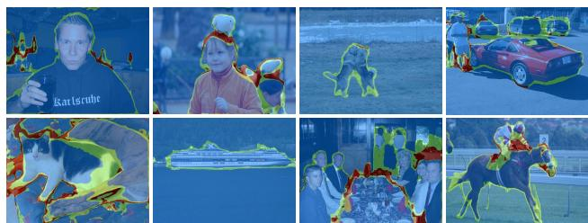  
Figure 3. Pixel with different dominant class numbers is distinguished with colors. Blue: 1. Green: 2. Red: $\geq 3 .$

$$
{ \bf C } _ { j } = \{ c | p _ { c , j } ^ { \bf t } \ge \delta _ { j } \} ,\tag{3}
$$

where $\delta _ { j }$ is a dynamic threshold to filter the dominant classes, determined by the accumulated probability for sorted $p _ { j } ^ { \mathbf { t } }$ in descending order. Specifically, we set a threshold $\eta$ so that the accumulated probability with counted classes is no less than it, i.e.

$$
\operatorname* { m i n } _ { C ^ { * } } \sum _ { c = 1 } ^ { C ^ { * } } d e s c e n d \cdot s o r t ( p _ { c , j } ^ { \mathbf { t } } ) \geq \eta \implies \delta _ { j } = p _ { C ^ { * } , j } ^ { \mathbf { t } } ,\tag{4}
$$

where $C ^ { * }$ is the threshold class of the prediction vector $p _ { c , j } ^ { \mathbf { t } }$ and its elements that below than $p _ { C ^ { * } , j } ^ { \mathbf { t } }$ will not be counted into the dominant classes. Note that when $\eta \leq \operatorname* { m a x } _ { c } \{ p _ { c , j } ^ { \mathbf { t } } \}$ the DSL will degrade into the one-hot hard label, which reflects its compatibility to previous works. Fig. 3 shows the dominant class number of each pixel. As seen, most pixels only contain one dominant class, i.e. hard label, while for some confusing areas like object boundaries, the dominant class number is more than one.

After we obtain the dominant classes for each pixel $j$ as in Eq. 3, a corresponding dominant classes mask $h \in$ $\mathbb { R } ^ { H \times W \times C }$ is easily achieved by setting $h _ { c , j } = 1$ for $c \in \mathbf { C } _ { j }$ and 0 elsewhere, and the DSL $y ^ { \ast }$ is further calculated by normalizing the masked $p ^ { \mathbf { t } }$ in the class dimension, i.e. for pixel $j ,$

$$
y _ { j } ^ { * } = ( h _ { j } \cdot p _ { j } ^ { \mathbf { t } } ) / | h _ { j } \cdot p _ { j } ^ { \mathbf { t } } | ,\tag{5}
$$

where $\boldsymbol { h } _ { j } \in \mathbb { R } ^ { C }$ is the dominant class mask at pixel $j$ and $| \cdot |$ is the $l _ { 1 }$ norm of a vector. Finally, the DSL $\bar { y ^ { * } }$ serves as

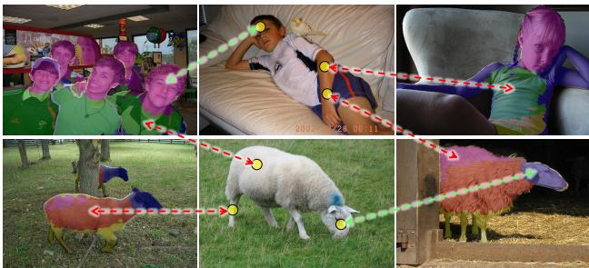  
Figure 4. Visualization of object-part grouping results of $K = 5$ and positive/negative sample allocation. The yellow circles in the middle images are selected anchors, with green arrows pointing to the positive samples and red ones pointing to the negative samples assigned to the anchor, respectively.

a weak supervision for $p ^ { \mathbf { s } }$ , which is achieved by employing a soft cross entropy loss as,

$$
\mathcal { L } _ { \mathrm { S C E } } = - \frac { 1 } { N } \sum _ { c = 1 } ^ { C } \sum _ { j } y _ { c , j } ^ { * } \log ( p _ { c , j } ^ { \mathrm { s } } ) , [ p ^ { \mathrm { s } } , z ^ { \mathrm { s } } ] = G ^ { \mathrm { s } } ( \tilde { x ^ { u } } ) .\tag{6}
$$

With $\mathcal { L } _ { \mathrm { C E } }$ and $\mathcal { L } _ { \mathrm { S C E } }$ being formulated, labeled and unlabeled datasets $\mathcal { D } ^ { l } , \mathcal { D } ^ { u }$ can be already well handled in the training of our ESL framework.

## 3.3. Pixel-to-Part Contrastive Learning

The proposed DSL module avoids trivially degrading the probability map $p ^ { \mathbf { t } }$ into a one-hot hard label, so that the soft label $y ^ { * }$ effectively utilizes the high entropy prediction and distinguishes a pixel into dominant classes, as an example shown in Fig. 1. However, it still lacks the capability to distinguish between dominant classes, causing a blurred boundary between them. To tackle this issue, we further propose a pixel-to-part contrastive learning approach.

Unsupervised object-part grouping mechanism. We define an object part to be pixels belonging to a subclass, achieved by a subclass similarity evaluation. Specifically, before the formal training, we first collect the features $\{ E ^ { \mathbf { t } } ( x _ { i } ^ { l } ) \}$ of dimension $L ^ { \prime }$ for the entire labeled dataset $\mathcal { D } ^ { l }$ where $E ^ { \mathbf { t } }$ is initialized with the parameter pre-trained on Imagenet [9]. Due to the availability of the ground truth label $\{ y _ { i } ^ { l } \}$ , we can split $\{ E ^ { \mathbf { t } } ( x _ { i } ^ { l } ) \}$ pixel-wisely into C classes, noted as $\mathcal { E } _ { 1 } , \mathcal { E } _ { 2 } , . . . , \mathcal { E } _ { C }$ . Then we apply K-means to each $\mathcal { E } _ { c }$ to obtain $K$ subclasses, with the mean vector as a prototype representation of each subclass. As such, a subclass prototype matrix $\mathbf { P } \in \mathbb { R } ^ { C \times K \times L ^ { \prime } }$ is built with these means. With it, in further training procedure, which subclasses a pixel $j$ belongs to is determined by comparing it with $\mathbf { P } ^ { c ^ { * } }$ , i.e.

$$
k ^ { * } = \underset { k } { \mathrm { a r g m a x } } \cos ( E ^ { \mathbf { t } } ( x ) _ { j } , \mathbf { P } _ { k } ^ { c ^ { * } } ) ,\tag{7}
$$

where $\cos ( \cdot , \cdot )$ is cosine similarity and $c ^ { * }$ is $j ^ { \circ } \mathrm { s }$ class by querying $x ' s$ label $y ^ { l }$ if $x = x ^ { l }$ or $p ^ { \mathbf { t } }$ for the largest probability class if $x = x ^ { u }$ . With $c ^ { * } , k ^ { * }$ obtained, we naturally have a one-hot object-part mask $\mathbf { M } \in \mathbb { R } ^ { H \times W \times C \times K }$ with $\mathbf { M } _ { j , c ^ { * } , k ^ { * } } = 1$ , with which we apply mask average pooling $\mathbf { \Gamma } ( \mathbf { M A P } ) \tan z ^ { \mathbf { t } }$ subclass-wisely to achieve at most $C \times K$ mean features of dimension $L ,$ considering not all classes and subclasses exist for a particular image x. Mathematically, for subclass $( c , k )$ , MAP works as

$$
\mu _ { c , k } = \frac { \sum _ { j } \mathbf { M } _ { j , c , k } \cdot z _ { j } ^ { \mathbf { t } } } { \sum _ { j } \mathbf { M } _ { j , c , k } } , \quad \mu _ { c , k } \in \mathbb { R } ^ { L } .\tag{8}
$$

We then push $\mu _ { c , k }$ subclass-wisely into a memory bank composed of $C \times K$ First-In-First-Out (FIFO) queues of size $q .$ This memory bank is further used for positive and negative sampling in constructing the contrastive loss. Fig. 4 visualizes some object-part grouping results. As seen, our grouping mechanism successfully divides the whole object into several meaningful parts.

Contrastive loss. We utilize InfoNCE loss as a contrastive loss, involving anchors $v ,$ positive and negative samples $v ^ { + } , v ^ { - }$ . Specifically, for a labeled or unlabeled image x we extract qualified features for each class c in the following manner,

$$
\left\{ \begin{array} { l l } { \tilde { \mathcal { A } } _ { c } ^ { l } = \{ z _ { j } ^ { \mathrm { s } } | y _ { c , j } ^ { l } = 1 \} \quad \mathrm { i f ~ } x = x ^ { l } , } \\ { \tilde { \mathcal { A } } _ { c } ^ { u } = \{ z _ { j } ^ { \mathrm { s } } | p _ { c , j } ^ { \mathrm { t } } > \zeta \} \quad \mathrm { o t h e r w i s e } , } \end{array} \right.\tag{9}
$$

where $\zeta = 0 . 9 5$ is a confidence threshold to reduce sample error. Then we randomly choose 10% samples from either one case to form anchor set $A _ { c } ,$ i.e. $v \in A _ { c }$ and the size of $\mathcal { A } _ { c } \mathrm { i s } \lvert \mathcal { A } _ { c } \rvert$

We further randomly sample 1 positive and $N _ { s }$ negative samples from the memory bank for each anchor. For the positive one, we first identify its subclass $k ^ { * }$ by measuring the cos similarity in Eqn. 7, and then sample one from corresponding $( c , k ^ { * } )$ -th queue. While negative samples are randomly selected from other queues excluding $( c , k ^ { * } )$ )-th queue. Finally with anchors, positive and negative samples available, we formulate an InfoNCE loss for class c as

$$
\mathcal { L } _ { \mathrm { C T R } } ^ { c } = - \frac { 1 } { \left| \mathcal { A } _ { c } \right| } \sum _ { j = 1 } ^ { \left| \mathcal { A } _ { c } \right| } \log \frac { \Phi _ { \sigma } ( v _ { j } , v _ { j } ^ { + } ) } { \Phi _ { \sigma } ( v _ { j } , v _ { j } ^ { + } ) + \sum _ { v _ { j } ^ { - } \in \mathcal { N } _ { j } } \Phi _ { \sigma } ( v _ { j } , v _ { j } ^ { - } ) } ,\tag{10}
$$

where ${ \mathcal { N } } _ { j }$ is the negative sample set of size $N _ { s } = 2 5 5$ for anchor $\begin{array} { r } { \dot { v _ { j } } , \Phi _ { \sigma } ( a , b ) \dot { = } e ^ { \cos ( a , \dot { b } ) / \sigma } } \end{array}$ with a temperature $\sigma$ set to 0.5 in this work. Finally, the entire contrastive loss for all classes are obtained with $\begin{array} { r } { \mathcal { L } _ { \mathrm { C T R } } = \frac { 1 } { C } \sum _ { c = 1 } ^ { C } \mathcal { L } _ { \mathrm { C T R } } ^ { c } } \end{array}$ . We illustrate the positive and negative sample allocation in Fig. 4. As seen, our pixel-to-part contrastive learning gives a more faithful and refined sample allocation.

## 3.4. Training Details

We sum up all the losses together as our training loss, i.e.

$$
\begin{array} { r } { \mathcal { L } = \mathcal { L } _ { \mathrm { C E } } + \lambda _ { 1 } \mathcal { L } _ { \mathrm { S C E } } + \lambda _ { 2 } \mathcal { L } _ { \mathrm { C T R } } , } \end{array}\tag{11}
$$

where $\lambda _ { 1 }$ and $\lambda _ { 2 }$ are weight parameters, which is set to 0.2 and 0.1, respectively, in all experiments. Note that gradients back-propagate in $G ^ { \mathbf { s } }$ only while $G ^ { \mathbf { t } }$ is updated via an exponential moving average (EMA) scheme from $G ^ { \mathbf { s } }$ . Similarly, with each mini-batch fed, we also apply MAP to $E ^ { \mathbf { t } } ( x )$ with the part mask M as in Eq. 8, by replacing $z _ { j } ^ { \mathbf { t } }$ with $E ^ { \mathbf { t } } ( x ) _ { j }$ This produces a matrix $\mathbf { P ^ { \prime } }$ of the same shape with P, further updating P by,

$$
\mathbf { P } = \theta \cdot \mathbf { P } + ( 1 - \theta ) \cdot \mathbf { P } ^ { \prime } ,\tag{12}
$$

where $\theta \in [ 0 , 1 ]$ is momentum coefficient and set to 0.99 in this paper. In practice, we use a ResNet-101 [18] pretrained on ImageNet [9] as the backbone of the encoder E and DeepLabv3+ [6] as the decoder D. Both the projector head and segmentation head consist of three Conv-BN-ReLU blocks. Besides, $E ^ { \mathbf { t } } ( x ) , z ^ { \mathbf { t } }$ will be resized before being applied to with MAP, considering their sizes are equal to $H \times W$ originally.

## 4. Experimental Results

## 4.1. Datasets and Implementation Details

Datasets. Our experiments are conducted on two datasets, Cityscapes [8] and Pascal VOC 2012 [10], whose training and validation images are 2975 : 500 and 1464 : 1449 respectively, with high-quality annotations. For Pascal VOC 2012, its training set is further augmented to 10, 582 images by combining the SBD [16] dataset with relatively low-quality annotations, so that a blender version is formed as in U2PL [43] and the original one is noted as classic version for distinction. We conduct experiments under $1 / 1 6 , 1 / 8 , 1 / 4$ and $1 / 2$ partition protocols for all three datasets, meaning $1 / 1 6 \sim 1 / 2$ of the training data serves as labeled dataset $\mathcal { D } ^ { l }$ in our framework, the rest training images are regarded as unlabeled dataset $\mathcal { D } ^ { u }$ . Note that for classic Pascal VOC, $\mathcal { D } ^ { u }$ also includes all the images from SBD, so that an experiment with full partition including 1464 labeled and 9118 unlabeled training images is also conducted, shown in the last column of Table. 1(a). In terms of evaluation, mean Intersection-over-Union (mIoU) is employed as the metric, and pre-processing steps like center crop and sliding window are also involved for Pascal VOC and Cityscapes respectively following previous works [43, 49]. Before being fed, images are cropped to $5 1 3 ^ { 2 }$ and 7692 for Pascal VOC and Cityscapes respectively.

Implementation details. We use stochastic gradient descent (SGD) optimizer for training with the backbone initial learning rate $1 0 ^ { - 3 }$ and $1 0 ^ { - 2 }$ , weight decay $1 0 ^ { - 4 }$ and $5 \times 1 0 ^ { - 4 }$ , and training epoch 80 and 200 for Pascal VOC and Cityscapes, respectively. The learning rate of the decoder, projector head, and segmentation head is set to 10 times that of the backbone. For each mini-batch, it contains 8 labeled and 8 unlabeled images. As for the augmentation module A mentioned in Eq. 1, weak version xˆ includes random flipping and resizing with a scale between 0.5 and 2.0, and strong version x˜ only contains CutMix [46]. To keep the comparison fair, OHEM loss is applied on Cityscapes like previous methods [7, 43].

## 4.2. Comparison with Existing Methods

Quantitative results. We first conduct a comparison quantitatively and report the mIoU values on three datasets in Table. 1.

◦ Pascal VOC 2012. Table. 1 compares our ESL with other state-of-the-art methods on the PASCAL VOC validation set, with labeled training images coming from classic (a) and blender (b) training sets. For classic’s results, our ESL achieves the best performance over all the other methods, beats the 2nd best by 0.95%, 0.90%, 1.57%, 1.11%, 1.30% under $1 / 1 6 , 1 / 8 , 1 / 4 , 1 / 2$ and full partition protocols, respectively, especially outperforms the supervised baseline significantly. A similar comparison is also conducted on blender’s results, and our method also achieves comparable results with the state-of-the-art. It reflects that our method relies on less labeled training data and demonstrates a stronger capability on semi-supervised learning. Besides, it is worth noting that, as seen in the last columns of Table. 1(a) and (b), i.e. 1464 high-quality annotated vs. 5291 mixed-quality annotated images serve as labeled training images, performance even drops with more supervision, revealing that annotation quality of labeled data is more critical in semi-supervised semantic segmentation than data amount.

◦ Cityscapes. Table. 1(c) further lists the comparison results on the Cityscapes validation set. Similarly, our ESL outperforms the supervised baseline by a large margin due to the help of numerous unlabeled data. ESL also beats the 2nd best by 0.22%, 0.26%, 0.42%, 1.34% under 1/16, $1 / 8 , 1 / 4 , 1 / 2$ partition protocols, respectively, demonstrating its consistent superiority over the state-of-the-art. Besides, we observe that our ESL can achieve better performance when using more labeled images. It is mainly because the Cityscapes dataset exhibits a long-tailed label distribution, and extremely limited labeled data can not cover all patterns of tail classes.

<table><tr><td>Method</td><td>1/16 (92)</td><td>1/8 (183)</td><td>1/4 (366)</td><td>1/2 (732)</td><td>Full (1464)</td></tr><tr><td>Sup Baseline</td><td>45.77</td><td>54.92</td><td>65.88</td><td>71.69</td><td>72.50</td></tr><tr><td>MT [36]</td><td>51.72</td><td>58.93</td><td>63.86</td><td>69.51</td><td>70.96</td></tr><tr><td>CutMix-Seg [11]</td><td>52.16</td><td>63.47</td><td>69.46</td><td>73.73</td><td>76.54</td></tr><tr><td>PC2Seg [49]</td><td>57.00</td><td>66.28</td><td>69.78</td><td>73.05</td><td>74.15</td></tr><tr><td>ReCo [26]</td><td>64.78</td><td>72.02</td><td>73.14</td><td>74.69</td><td></td></tr><tr><td>CPS [7]</td><td>64.07</td><td>67.42</td><td>71.71</td><td>75.88</td><td></td></tr><tr><td>ST++[45]</td><td>65.20</td><td>71.00</td><td>74.60</td><td>77.30</td><td>79.10</td></tr><tr><td>PSMT [27]</td><td>65.80</td><td>69.58</td><td>76.57</td><td>78.42</td><td>80.01</td></tr><tr><td>U2PL [43]</td><td>67.98</td><td>69.15</td><td>73.66</td><td>76.16</td><td>79.49</td></tr><tr><td>GTA-Seg [22]</td><td>70.02</td><td>73.16</td><td>75.57</td><td>78.37</td><td>80.47</td></tr><tr><td colspan="6">ESL 70.97 74.06 78.14 79.53 81.77</td></tr></table>

(a) mIoU on classic Pascal VOC

<table><tr><td>Method</td><td>1/16 (662)</td><td>1/8 (1323)</td><td>1/4 (2646)</td><td>1/2 (5291)</td></tr><tr><td>Sup Baseline</td><td>67.87</td><td>71.55</td><td>75.80</td><td>77.13</td></tr><tr><td>MT [36]</td><td>70.59</td><td>73.20</td><td>76.62</td><td>77.61</td></tr><tr><td>CutMix-Seg [11]</td><td>72.56</td><td>72.69</td><td>74.25</td><td>75.89</td></tr><tr><td>CCT[30]</td><td>67.94</td><td>73.00</td><td>76.17</td><td>77.56</td></tr><tr><td>GCT [23]</td><td>69.77</td><td>73.30</td><td>75.25</td><td>77.14</td></tr><tr><td>CPS [7]</td><td>74.48</td><td>76.44</td><td>77.68</td><td>78.64</td></tr><tr><td>ST++ [45]</td><td>74.70</td><td>77.90</td><td>77.90</td><td></td></tr><tr><td>PSMT [27]</td><td>75.50</td><td>78.20</td><td>78.72</td><td>79.76</td></tr><tr><td>U2PL†[43]</td><td>74.43</td><td>77.60</td><td>78.70</td><td>79.94</td></tr><tr><td>ESL</td><td>76.36</td><td>78.57</td><td>79.02</td><td>79.98</td></tr></table>

(b) mIoU on blender Pascal VOC
<table><tr><td>Method</td><td>1/16 (186)</td><td>1/8 (372)</td><td>1/4 (744)</td><td>1/2 (1488)</td></tr><tr><td>Sup Baseline</td><td>65.74</td><td>72.53</td><td>74.43</td><td>77.83</td></tr><tr><td>MT [36]</td><td>68.08</td><td>73.71</td><td>76.53</td><td>78.59</td></tr><tr><td>CutMix-Seg [11]</td><td>67.06</td><td>71.83</td><td>76.36</td><td>78.25</td></tr><tr><td>CCT [30]</td><td>69.64</td><td>74.48</td><td>76.35</td><td>78.29</td></tr><tr><td>GCT [23]</td><td>66.90</td><td>72.96</td><td>76.45</td><td>78.58</td></tr><tr><td>CPS [7]</td><td>69.78</td><td>74.31</td><td>74.58</td><td>76.81</td></tr><tr><td>PSMT [27]</td><td></td><td>76.89</td><td>77.60</td><td>79.09</td></tr><tr><td>U2PL [43]</td><td>74.90</td><td>76.48</td><td>78.51</td><td>79.12</td></tr><tr><td>GTA-Seg [22]</td><td>69.38</td><td>72.02</td><td>76.08</td><td></td></tr><tr><td>ESL</td><td>75.12</td><td>77.15</td><td>78.93</td><td>80.46</td></tr></table>

(c) mIoU on Cityscapes  
Table 1. Comparison with existing methods on classic (a) and blender (b) PASCAL VOC and Cityscapes (c) validation set based on ResNet-101 backbone under various partition protocols. In (a)(b)(c), “Sup Baseline” represents supervised training without unlabeled data, and “-” means the corresponding method doesn’t report the result. † stands for the corrected version by the author from GitHub. 1 ‡ means the results are borrowed from $\mathrm { U } ^ { 2 } \mathrm { P } \mathrm { L }$ [43]. The best and the 2nd best values are marked in black and blue bold, respectively.

## 4.3. Ablation Studies

Training loss. We investigate our overall training loss under the full partition protocol on classic Pascal VOC dataset in Table. 2. The $^ { 6 6 } \mathcal { L } _ { \mathrm { S C E } }$ (Hard label)” stands for the one-hot hard label applied for unlabeled images, i.e. the dominant classes only contain the highest probability class. First of all, we set supervised training without using unlabeled images as the baseline, achieving mIoU of 72.50%. Combining unlabeled images with hard pseudo labels increases the baseline by 5.82%, indicating that a large number of unlabeled images can assist the model training with the guidance of limited labeled images. Simply replacing the hard label with our dynamic soft label, the performance boosts 2.09%, demonstrating its effectiveness compared to the hard label. Incorporating our proposed pixel-to-part contrastive learning can further improve the performance, achieving a stateof-the-art result with mIoU of 81.77%. In addition, it should be emphasized that although our pixel-to-part contrastive learning is intended to solve the ambiguity issue brought on by DSL, it can also perform independently, i.e. a 1.94% improvement compared to hard label only.

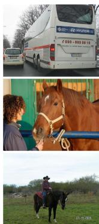  
(a) Input image

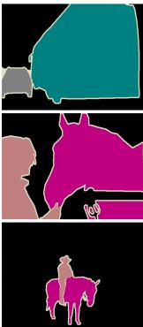  
(b) Ground truth

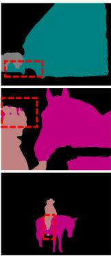  
(c) w/0 LCTR

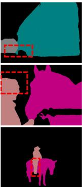  
(d) ESL

Figure 5. Effectiveness of $\mathcal { L } _ { \mathrm { { C T R } } } .$ . (a) Input images. (b) Ground truth. (c) The model trained with $\mathcal { L } _ { \mathrm { C E } }$ and $\mathcal { L } _ { \mathrm { S C E } }$ only. (d) The model trained with all losses including $\mathcal { L } _ { \mathrm { { C T R } } } .$ . As seen, better segmentation is achieved at the boundaries by our contrastive learning strategy, highlighted in red dashed boxes.  
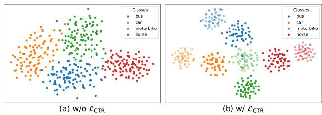  
Figure 6. Embedding space learned without LCTR (a) and with $\mathcal { L } _ { \mathrm { C T R } }$ (b). For better visualization, we show four classes with two object parts per class. The different object parts are distinguished by the transparency.

Fig. 5 shows the segmentation results on the PASCAL VOC 2012 validation set. Through visualizing the segmentation results, we observe that simply using DSL is hard to segment object boundaries, as it introduces ambiguous problems between dominant classes. Our proposed pixelto-part contrastive learning can boost the ability to distinguish different classes, thereby achieving much better performance on object boundaries.

Fig. 6 visualizes the embedding space learned without $\mathcal { L } _ { \mathrm { C T R } } \left( \mathrm { a } \right)$ and with $\mathcal { L } _ { \mathrm { C T R } }$ (b) using T-SNE [37]. As can be observed, the model learned with $\mathcal { L } _ { \mathrm { C T R } }$ produces a more clear classification boundary. Moreover, pixel features belonging to the same object-part are well separated, indicating that our proposed pixel-to-part contrastive learning can better reshape the embedding space.

<table><tr><td> $\mathcal { L } _ { \mathrm { C E } }$ </td><td> $\mathcal { L } _ { \mathrm { S C E } }$  (Hard label)</td><td> $\mathcal { L } _ { \mathrm { S C E } } \left( \mathrm { D S L } \right)$ </td><td> $\mathcal { L } _ { \mathrm { C T R } }$ </td><td>mIoU</td></tr><tr><td>√</td><td></td><td></td><td></td><td>72.50</td></tr><tr><td>√</td><td>√</td><td></td><td></td><td>78.32</td></tr><tr><td>√</td><td>√</td><td></td><td>√</td><td>80.26</td></tr><tr><td>√</td><td></td><td>√</td><td></td><td>80.41</td></tr><tr><td>√</td><td></td><td>√</td><td>√</td><td>81.77</td></tr></table>

Table 2. Ablation Study on the effectiveness of each component under full partition protocol on classic Pascal VOC.

DSL. Table. 3 quantifies the effect of η in Eq. 4, which controls the scope of the dominant classes. The DSL performs well using a relatively large value, showing that containing more ambiguous classes in dominant classes is beneficial. Besides, we observe that when η is set to a relatively small value $( \mathbf { e . g . } \ \eta = 0 . 8 )$ , the performance will decrease into a similar value to the hard label in Table. 2 (78.32). The reason is that the dominant classes only contain one class when using a small η, i.e. our DSL will degrade into the hard label strategy. As a result, we set $\eta = 0 . 9 5$ for all comparison experiments.

Besides, in Table. 3, we also investigate a more straightforward strategy by setting η to the 5th largest value of the prediction vector, i.e. the dominant classes of each pixel will contain the top five categories of the prediction vector. We observe that the performance is slightly worse than our DSL. The reason is that for some low entropy predictions, the model is confident enough to its prediction, simply fixing the category number of dominant classes will introduce the extra noise. However, our DSL can dynamically recognize the scope of dominant classes for each pixel, which can provide a more refined supervisory signal. In other words, our ESL can take both high entropy and low entropy prediction into consideration, and hence results in greater performance.

Fig. 7(a) compares the performance of hard label and our proposed DSL. As seen, the DSL outperforms the hard label under all partition protocols, which demonstrates the superior performance of our proposed DSL. Specifically, we observe that the DSL improves the mIoU more with fewer labeled images, e.g. a 5.53% improvement with 92 labeled images and a 2.09% improvement with 1464 labeled images. Therefore, we make a discussion to explain why the soft label outperforms the hard label. For high entropy prediction, simply converting it to a one-hot hard label is likely to make noise, leading to class-imbalanced pseudo labels, as the green line illustrated in Fig. 7(b). The situation becomes more serious, especially on the label-scarce regimes (e.g. 92 and 183 labeled images). However, the soft label can be more class-balanced compared to the hard label, as the yellow line illustrated in Fig. 7(b), since it can preserve correct signals. Therefore, the model trained with class-balanced pseudo labels can produce class-unbiased segmentation.

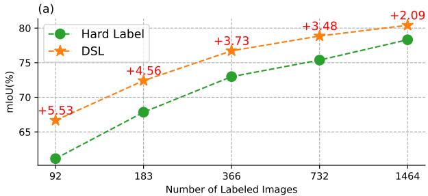

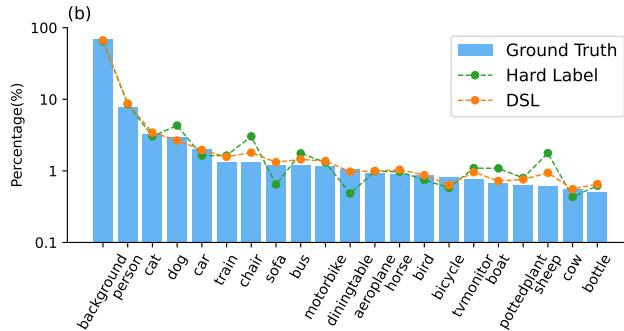  
Figure 7. (a) The performance of DSL under the different number of labeled images on the Pascal VOC dataset. (b) Class distribution on unlabeled data under 1/8 partition protocol on classic Pascal VOC dataset. The DSL outperforms typical hard label under all partition protocols, as the DSL can produce more class-balanced pseudo labels compared to the hard label.

Subclass number K. We conduct experiments to investigate the impact of different subclass numbers K in Table. 4. $K = 0$ represents the model trained with $\mathcal { L } _ { \mathrm { C E } }$ and $\mathcal { L } _ { \mathrm { S C E } }$ , without contrastive loss $\mathcal { L } _ { \mathrm { C T R } }$ $K = 1$ stands for each class having only one subclass, i.e. itself. In this case, our method degrades into the pixel-to-region paradigm. We can see a performance gain $( \mathrm { i . e . ~ } 8 0 . 4 1 \% \to 8 0 . 7 4 \% )$ , indicating that contrastive learning can strengthen the ability to discriminate different classes. When there are more prototypes (i.e. $K = 3 )$ , the performance improvement is obviously $( 8 0 . 7 4 \%  8 1 . 3 9 \% )$ , demonstrating the effectiveness of our pixel-to-part contrastive learning paradigm compared to the pixel-to-region paradigm. The mIoU can be further improved by employing more prototypes. However, increasing K beyond 5 can’t yield a continuous improvement in performance. Therefore, we set $K = 5$ as our default setting for all comparison experiments.

<table><tr><td>η</td><td>0.80</td><td>0.90</td><td>0.95</td><td>0.99</td><td>Top-5</td></tr><tr><td>mIoU</td><td>78.43</td><td>78.96</td><td>80.41</td><td>80.28</td><td>79.89</td></tr></table>

Table 3. Ablation Study on η in Eq. 4, which controls the scope of dominant classes, under full partition protocol on classic Pascal VOC dataset. The $ { \mathrm { ^ { 6 6 } T o p - 5 } }  { \mathrm { ^ { , } } }$ stands for setting η to the 5th largest value of the prediction vector. The default setting of $\eta = 0 . 9 5$ in our experiments is marked in bold.

<table><tr><td>K</td><td>0</td><td>1</td><td>3</td><td>5</td><td>7</td><td>10</td></tr><tr><td>mIoU</td><td>80.41</td><td>80.74</td><td>81.39</td><td>81.77</td><td>81.72</td><td>81.64</td></tr></table>

Table 4. Ablation Study on subclass number K under full partition protocol on classic Pascal VOC dataset. The default setting of $K = 5$ in all comparison experiments is marked in bold.

## 5. Conclusion

In this paper, we propose an enhanced soft label (ESL) framework to improve the semantic segmentation performance in a semi-supervised manner. It is achieved by a newly introduced dynamic soft label method that can fully explore the potential of high entropy predictions by maintaining the score of dominant classes, instead of simply discarding them as previous works do that may lead to inferior results. Furthermore, in order to enhance the feature representation and also strengthen the discrimination between dominant classes, we introduce a pixel-to-part contrastive learning approach integrated with an unsupervised object-part grouping mechanism. Benefitting from the two components mentioned above, our ESL is able to handle challenging scenarios and produce more accurate segmentation results. Extensive experimental results demonstrate the superiority of our ESL over the state-of-the-art methods, and ablation studies also reveal the effectiveness of our proposed modules.

Acknowledgments This work was supported in part by the Guangdong Basic and Applied Basic Research Foundation (NO. 2020B1515020048), in part by the National Natural Science Foundation of China (NO. 61976250), in part by the Shenzhen Science and Technology Program (NO. JCYJ20220530141211024).

## References

[1] Inigo Alonso, Alberto Sabater, David Ferstl, Luis Montesano, and Ana C Murillo. Semi-supervised semantic segmentation with pixel-level contrastive learning from a classwise memory bank. In Proceedings of the IEEE/CVF International Conference on Computer Vision, pages 8219–8228, 2021.

[2] Eric Arazo, Diego Ortego, Paul Albert, Noel E. O’Connor, and Kevin McGuinness. Pseudo-labeling and confirmation bias in deep semi-supervised learning. 2020 International

Joint Conference on Neural Networks (IJCNN), pages 1–8, 2020.

[3] David Berthelot, Nicholas Carlini, Ian Goodfellow, Nicolas Papernot, Avital Oliver, and Colin A Raffel. Mixmatch: A holistic approach to semi-supervised learning. Advances in neural information processing systems, 32, 2019.

[4] Mathilde Caron, Ishan Misra, Julien Mairal, Priya Goyal, Piotr Bojanowski, and Armand Joulin. Unsupervised learning of visual features by contrasting cluster assignments. Advances in neural information processing systems, 33:9912– 9924, 2020.

[5] Liang-Chieh Chen, George Papandreou, Florian Schroff, and Hartwig Adam. Rethinking atrous convolution for semantic image segmentation. ArXiv, abs/1706.05587, 2017.

[6] Liang-Chieh Chen, Yukun Zhu, George Papandreou, Florian Schroff, and Hartwig Adam. Encoder-decoder with atrous separable convolution for semantic image segmentation. european conference on computer vision, 2018.

[7] Xiaokang Chen, Yuhui Yuan, Gang Zeng, and Jingdong Wang. Semi-supervised semantic segmentation with cross pseudo supervision. computer vision and pattern recognition, 2021.

[8] Marius Cordts, Mohamed Omran, Sebastian Ramos, Timo Rehfeld, Markus Enzweiler, Rodrigo Benenson, Uwe Franke, Stefan Roth, and Bernt Schiele. The cityscapes dataset for semantic urban scene understanding. computer vision and pattern recognition, 2016.

[9] Jia Deng, Wei Dong, Richard Socher, Li-Jia Li, K. Li, and Li Fei-Fei. Imagenet: A large-scale hierarchical image database. 2009 IEEE Conference on Computer Vision and Pattern Recognition, pages 248–255, 2009.

[10] Mark Everingham, S. M. Eslami, Luc Van Gool, Christopher Williams, John Winn, and Andrew Zisserman. The pascal visual object classes challenge: A retrospective. International Journal of Computer Vision, 2015.

[11] Geoffrey French, Samuli Laine, Timo Aila, Michal Mackiewicz, and Graham Finlayson. Semi-supervised semantic segmentation needs strong, varied perturbations. In British Machine Vision Conference, number 31, 2020.

[12] J. Fu, J. Liu, Haijie Tian, Zhiwei Fang, and Hanqing Lu. Dual attention network for scene segmentation. 2019 IEEE/CVF Conference on Computer Vision and Pattern Recognition (CVPR), pages 3141–3149, 2019.

[13] J. Fu, Jing Liu, Yuhang Wang, Yong Li, Yongjun Bao, Jinhui Tang, and Hanqing Lu. Adaptive context network for scene parsing. 2019 IEEE/CVF International Conference on Computer Vision (ICCV), pages 6747–6756, 2019.

[14] Jean-Bastien Grill, Florian Strub, Florent Altché, Corentin Tallec, Pierre Richemond, Elena Buchatskaya, Carl Doersch, Bernardo Avila Pires, Zhaohan Guo, Mohammad Gheshlaghi Azar, et al. Bootstrap your own latent-a new approach to self-supervised learning. Advances in neural information processing systems, 33:21271–21284, 2020.

[15] Dayan Guan, Jiaxing Huang, Aoran Xiao, and Shijian Lu. Unbiased subclass regularization for semi-supervised semantic segmentation. In Proceedings ofthe IEEE/CVF Conference on Computer Vision and Pattern Recognition, pages 9968–9978, 2022.

[16] Bharath Hariharan, Pablo Arbeláez, Lubomir D. Bourdev, Subhransu Maji, and Jitendra Malik. Semantic contours from inverse detectors. 2011 International Conference on Computer Vision, pages 991–998, 2011.

[17] Kaiming He, Haoqi Fan, Yuxin Wu, Saining Xie, and Ross Girshick. Momentum contrast for unsupervised visual representation learning. In Proceedings of the IEEE/CVF conference on computer vision and pattern recognition, pages 9729–9738, 2020.

[18] Kaiming He, X. Zhang, Shaoqing Ren, and Jian Sun. Deep residual learning for image recognition. 2016 IEEE Conference on Computer Vision and Pattern Recognition (CVPR), pages 770–778, 2016.

[19] Hanzhe Hu, Jinshi Cui, and Liwei Wang. Region-aware contrastive learning for semantic segmentation. In Proceedings ofthe IEEE/CVF International Conference on Computer Vision, pages 16291–16301, 2021.

[20] Hanzhe Hu, Fangyun Wei, Han Hu, Qiwei Ye, Jinshi Cui, and Liwei Wang. Semi-supervised semantic segmentation via adaptive equalization learning. Advances in Neural Information Processing Systems, 34:22106–22118, 2021.

[21] Gao Huang, Zhuang Liu, and Kilian Q. Weinberger. Densely connected convolutional networks. 2017 IEEE Conference on Computer Vision and Pattern Recognition (CVPR), pages 2261–2269, 2017.

[22] Ying Jin, Jiaqi Wang, and Dahua Lin. Semi-supervised semantic segmentation via gentle teaching assistant. In Advances in Neural Information Processing Systems.

[23] Zhanghan Ke, Di Qiu, Kaican Li, Qiong Yan, and Rynson WH Lau. Guided collaborative training for pixel-wise semi-supervised learning. In Computer Vision–ECCV 2020: 16th European Conference, Glasgow, UK, August 23–28, 2020, Proceedings, Part XIII 16, pages 429–445. Springer, 2020.

[24] Donghyeon Kwon and Suha Kwak. Semi-supervised semantic segmentation with error localization network. In Proceedings of the IEEE/CVF Conference on Computer Vision and Pattern Recognition, pages 9957–9967, 2022.

[25] Dong-Hyun Lee et al. Pseudo-label: The simple and efficient semi-supervised learning method for deep neural networks. In Workshop on challenges in representation learning, ICML, volume 3, page 896, 2013.

[26] Shikun Liu, Shuaifeng Zhi, Edward Johns, and Andrew Davison. Bootstrapping semantic segmentation with regional contrast. In International Conference on Learning Representations.

[27] Yuyuan Liu, Yu Tian, Yuanhong Chen, Fengbei Liu, Vasileios Belagiannis, and Gustavo Carneiro. Perturbed and strict mean teachers for semi-supervised semantic segmentation. In Proceedings of the IEEE/CVF Conference on Computer Vision and Pattern Recognition, pages 4258–4267, 2022.

[28] Jonathan Long, Evan Shelhamer, and Trevor Darrell. Fully convolutional networks for semantic segmentation. IEEE Transactions on Pattern Analysis and Machine Intelligence, 2014.

[29] Yuxiang Nie, Chaowei Fang, Lechao Cheng, Liang Lin, and Guanbin Li. Adapting object size variance and class imbalance for semi-supervised object detection. In Proceedings of the AAAI Conference on Artificial Intelligence, volume 37, pages 1966–1974, 2023.

[30] Yassine Ouali, Céline Hudelot, and Myriam Tami. Semisupervised semantic segmentation with cross-consistency training. In Proceedings of the IEEE/CVF Conference on Computer Vision and Pattern Recognition, pages 12674– 12684, 2020.

[31] Alec Radford, Luke Metz, and Soumith Chintala. Unsupervised representation learning with deep convolutional generative adversarial networks. CoRR, abs/1511.06434, 2016.

[32] Kihyuk Sohn, David Berthelot, Nicholas Carlini, Zizhao Zhang, Han Zhang, Colin A Raffel, Ekin Dogus Cubuk, Alexey Kurakin, and Chun-Liang Li. Fixmatch: Simplifying semi-supervised learning with consistency and confidence. Advances in neural information processing systems, 33:596– 608, 2020.

[33] Nasim Souly, Concetto Spampinato, and Mubarak Shah. Semi supervised semantic segmentation using generative adversarial network. 2017 IEEE International Conference on Computer Vision (ICCV), pages 5689–5697, 2017.

[34] Robin Strudel, Ricardo Garcia Pinel, Ivan Laptev, and Cordelia Schmid. Segmenter: Transformer for semantic segmentation. 2021 IEEE/CVF International Conference on Computer Vision (ICCV), pages 7242–7252, 2021.

[35] Mingxing Tan and Quoc Le. Efficientnet: Rethinking model scaling for convolutional neural networks. In International conference on machine learning, pages 6105–6114. PMLR, 2019.

[36] Antti Tarvainen and Harri Valpola. Mean teachers are better role models: Weight-averaged consistency targets improve semi-supervised deep learning results. Advances in neural information processing systems, 30, 2017.

[37] Laurens Van der Maaten and Geoffrey Hinton. Visualizing data using t-sne. Journal of machine learning research, 9(11), 2008.

[38] Jingdong Wang, Ke Sun, Tianheng Cheng, Borui Jiang, Chaorui Deng, Yang Zhao, Dong Liu, Yadong Mu, Mingkui Tan, Xinggang Wang, Wenyu Liu, and Bin Xiao. Deep high-resolution representation learning for visual recognition. IEEE Transactions on Pattern Analysis and Machine Intelligence, 43:3349–3364, 2021.

[39] Kuo Wang, Yuxiang Nie, Chaowei Fang, Chengzhi Han, Xuewen Wu, Xiaohui Wang, Liang Lin, Fan Zhou, and Guanbin Li. Double-check soft teacher for semi-supervised object detection. In International Joint Conference on Artificial Intelligence (IJCAI), volume 1, page 3, 2022.

[40] Tongzhou Wang and Phillip Isola. Understanding contrastive representation learning through alignment and uniformity on the hypersphere. In International Conference on Machine Learning, pages 9929–9939. PMLR, 2020.

[41] Wenguan Wang, Tianfei Zhou, Fisher Yu, Jifeng Dai, Ender Konukoglu, and Luc Van Gool. Exploring cross-image pixel contrast for semantic segmentation. In Proceedings of the IEEE/CVF International Conference on Computer Vision, pages 7303–7313, 2021.

[42] Yidong Wang, Hao Chen, Qiang Heng, Wenxin Hou, Yue Fan, Zhen Wu, Jindong Wang, Marios Savvides, Takahiro Shinozaki, Bhiksha Raj, et al. Freematch: Self-adaptive thresholding for semi-supervised learning. arXiv preprint arXiv:2205.07246, 2022.

[43] Yuchao Wang, Haochen Wang, Yujun Shen, Jingjing Fei, Wei Li, Guoqiang Jin, Liwei Wu, Rui Zhao, and Xinyi Le. Semi-supervised semantic segmentation using unreliable pseudo-labels. In Proceedings of the IEEE/CVF Conference on Computer Vision and Pattern Recognition, pages 4248– 4257, 2022.

[44] Haiming Xu, Lingqiao Liu, Qiuchen Bian, and Zhen Yang. Semi-supervised semantic segmentation with prototypebased consistency regularization. In Advances in Neural Information Processing Systems.

[45] Lihe Yang, Wei Zhuo, Lei Qi, Yinghuan Shi, and Yang Gao. St++: Make self-training work better for semi-supervised semantic segmentation. In Proceedings ofthe IEEE/CVF Conference on Computer Vision and Pattern Recognition, pages 4268–4277, 2022.

[46] Sangdoo Yun, Dongyoon Han, Seong Joon Oh, Sanghyuk Chun, Junsuk Choe, and Young Joon Yoo. Cutmix: Regularization strategy to train strong classifiers with localizable features. 2019 IEEE/CVF International Conference on Computer Vision (ICCV), pages 6022–6031, 2019.

[47] Bowen Zhang, Yidong Wang, Wenxin Hou, Hao Wu, Jindong Wang, Manabu Okumura, and Takahiro Shinozaki. Flexmatch: Boosting semi-supervised learning with curriculum pseudo labeling. Advances in Neural Information Processing Systems, 34:18408–18419, 2021.

[48] Sixiao Zheng, Jiachen Lu, Hengshuang Zhao, Xiatian Zhu, Zekun Luo, Yabiao Wang, Yanwei Fu, Jianfeng Feng, Tao Xiang, Philip H. S. Torr, and Li Zhang. Rethinking semantic segmentation from a sequence-to-sequence perspective with transformers. 2021 IEEE/CVF Conference on Computer Vision and Pattern Recognition (CVPR), pages 6877– 6886, 2021.

[49] Yuanyi Zhong, Bodi Yuan, Hong Wu, Zhiqiang Yuan, Jian Peng, and Yu-Xiong Wang. Pixel contrastive-consistent semi-supervised semantic segmentation. In Proceedings of the IEEE/CVF International Conference on Computer Vision, pages 7273–7282, 2021.

[50] Tianfei Zhou, Wenguan Wang, Ender Konukoglu, and Luc Van Gool. Rethinking semantic segmentation: A prototype view. 2022 IEEE/CVF Conference on Computer Vision and Pattern Recognition (CVPR), pages 2572–2583, 2022.