# Enhancing Fine-Tuning based Backdoor Defense with Sharpness-Aware Minimization

Mingli Zhu1 Shaokui Wei1 Li Shen2 Yanbo Fan3 Baoyuan Wu1\* 1School of Data Science, Shenzhen Research Institute of Big Data, The Chinese University of Hong Kong, Shenzhen (CUHK-Shenzhen), China 2JD Explore Academy 3Tencent AI Lab

## Abstract

Backdoor defense, which aims to detect or mitigate the effect of malicious triggers introduced by attackers, is becoming increasingly criticalfor machine learning security and integrity. Fine-tuning based on benign data is a natural defense to erase the backdoor effect in a backdoored model. However, recent studies show that, given limited benign data, vanillafine-tuning has poor defense performance. In this work, we firstly investigate the vanilla fine-tuning processfor backdoor mitigationfrom the neuron weight perspective, and find that backdoor-related neurons are only slightly perturbed in the vanillafine-tuning process, which explains its poor backdoor defense performance. To enhance thefine-tuning based defense, inspired by the observation that the backdoor-related neurons often have larger weight norms, we propose FT-SAM, a novel backdoor defense paradigm that aims to shrink the norms ofbackdoorrelated neurons by incorporating sharpness-aware minimization with fine-tuning. We demonstrate the effectiveness of our method on several benchmark datasets and network architectures, where it achieves state-of-the-art defense performance, and provide extensive analysis to reveal the FT-SAM’s mechanism. Overall, our work provides a promising avenue for improving the robustness of machine learning models against backdoor attacks. Codes are available at https://github.com/SCLBD/BackdoorBench.

## 1. Introduction

As deep neural networks (DNNs) have been increasingly applied to safety-critical tasks such as face recognition, autonomous driving, and medical image processing [16, 1, 28, 29, 33, 31, 44, 52, 30], the threat exhibited by DNNs has drawn attention from both the industrial and academic community. Recently, backdoor attacks [50, 15, 34, 14, 2] have emerged as a new practical and stealthy threat to DNNs, for which the attacker plant predefined triggers to a small portion of the dataset and misleads the DNNs trained on such dataset to behave normally with benign inputs while classifying input with trigger into the target class. To detect or mitigate the effect of backdoor, substantial efforts have been done in inversing triggers, splitting dataset, or pruning the DNNs, while fine-tuning, a natural choice for backdoor defense has received much less atten tion. Although complex techniques such as unlearning and pruning have achieved remarkable performance, they usually come at the cost of accuracy on the original tasks. Additionally, the effectiveness of pruning is contingent upon the network structure, as highlighted by Wu et al. [51, 49], underscoring the necessity for meticulous pruning strategies. In contrast, fine-tuning, a more general approach, can moderately restore the model’s utility.

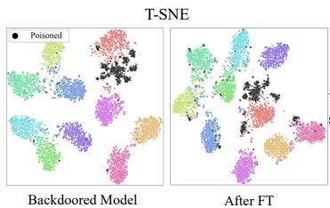

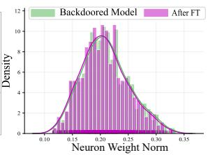  
Figure 1: Left: T-SNE [45] visualization on the backdoored model and the model after fine-tuning. FT fails to remove backdoor effect. Right: the neuron weight norm distribution between the two models. The weight seems to have remained mostly unchanged after the fine-tuning process.

Although vanilla fine-tuning has been adopted as a component of some backdoor defense methods [32, 27], fine-tuning a backdoored model to remove the backdoor is still challenging when only limited benign data is given[49]. Previous work [49] has found that fine-tuning is a powerful technique in some situations. However, it cannot resist strong backdoor attacks such as Blended [7] and LF [55]. One of the possible reasons is the backdoored model already fits the benign samples well; hence, vanilla fine-tuning can only make minor changes to the weights of neurons and fail to mitigate the backdoor effect. To demonstrate this, we adopt the Blended [7] attack with poisoning ratio 10% on CIFAR-10 dataset [21] and PreAct-ResNet18 model [17], and the backdoored model is fine-tuned using 5% benign training samples. As shown in Figure 1, FT fails to mitigate backdoor effect and there’s only slight changes on neuron weight norms. In this paper, we focus on the problem of designing a new objective function that can alter the backdoor-related weights and mitigate the backdoor effect via fine-tuning.

To address this problem, we first take a closer look at the fine-tuning process from neurons’ perspective. We empirically observe that the weight norm of neurons has a positive correlation with backdoor-related neurons in our experiment, which is also implied in [57]. Intuitively, the neurons with large norms can cause the backdoor features to override the normal features, making the model incorrectly pay attention to the trigger’s feature. Motivated by the relationship between the neuron weight norms and the backdoor effect, we propose to adopt Sharpness-Aware Minimization (SAM) with adaptive perturbations [11, 22] to fine-tune the backdoored model, which can revise the large outliers of weight norms and induce a more concentrated distribution of weight norms [24]. In detail, SAM considers a min-max formulation to encourage the weights in neighbors with a uniformly low loss. The adaptive constraints on perturbations can facilitate greater change of backdoor-related neurons. By leveraging SAM on the backdoored model, we empirically show that the model not only benefits from escaping the current local minima but also receives more perturbations on backdoorrelated neurons than the normal weights. Therefore, SAM implicitly facilitates the learning of backdoored neurons and helps to mitigate the backdoor effect.

To demonstrate the effectiveness of our method, we conduct experiments on three benchmark datasets with two networks, and compare them to seven state-of-the-art defense methods. The results show our method is competitive with and frequently superior to the best baselines. Our method is also robust across different components. Additionally, we empirically confirm that our strategy can take the place of fine-tuning, which can be used in conjunction with current backdoor defense techniques to make up for accuracy drop.

In summary, our main contributions are three-fold: (1) We reveal the reason of the weak backdoor defense performance of the vanilla fine-tuning based on a deep investigation from the perspective of backdoor-related neurons’ weight changes. (2) By leveraging SAM, we design an innovative fine-tuning paradigm to effectively remove the backdoor effect from a pre-trained backdoored model by perturbing the neurons. (3) Experimental results and analyses demonstrate that the proposed method can achieve state-of-the-art performance among existing defense methods and boost existing defense methods based on fine-tuning.

## 2. Related work

Backdoor Attack. Several backdoor attacks [8, 56] have been proposed, including data poisoning attacks [47, 61, 12] and training controllable attacks [37, 25]. In data poisoning attacks, BadNets [15] is one of the earliest attacks, in which they revise a small part of the data by patching a pre-defined pattern onto the images and relabeling them to the targeted class. Then the DNN trained on the poisoned dataset will be planted a backdoor. Blended [7] design a more strong backdoor attack by blending benign images with a whole pre-defined image. Recently, more advanced backdoors have been proposed to increase concealment of the triggers, such as LF [55], Wanet [37], and Input-aware [36]. Training controllable backdoor attacks assume that the attacker can control the training process, such that the attack can flexibly design triggers or decide the images to attack. To better evade backdoor detection, clean-label attacks[39, 3] succeed by destroying the subject information of images and building a connection between the planted trigger and targeted label.

Backdoor Defense. In general, backdoor defense methods can be categorized into training-stage defenses [13] and post-training defenses [58]. The former considers that a defender is given a backdoored dataset to train the model. The defender can leverage the different behaviors between benign and poisoned images in the training process to escape attacks, such as the loss dropping speed [26] and clustering phenomenon in the feature space[5, 19, 6]. Most defense methods belong to post-training defenses [57, 60, 48], where the defender is given a suspicious model and has no access to the full training dataset. They need to remove backdoor threats by using a small set of benign samples. Post-training defenses can be roughly divided into fine-tuning-based defenses (NC [46], NAD [27], and i-BAU [54] ) and pruningbased defenses ( FP [32] and ANP [51] ). FP assumes that poisoned and benign samples have different activation paths. They remove backdoors by pruning the inactivated neurons of benign data and then fine-tuning the pruned model. ANP assumes that backdoor-related neurons are more sensitive to adversarial neuron perturbations. They search for and mask these suspicious neurons by a minimax optimization on benign samples. NC searches for a possible trigger by optimization and retrains the model by regularizing the model to predict correctly on the images with the recovered trigger. NAD first fine-tunes a teacher model on a small subset of benign data and then fine-tunes a student model under the guidance of the teacher model. I-BAU borrows ideas from universal adversarial perturbations and proposes the implicit backdoor adversarial unlearning algorithm to solve the minimax problem.

Sharpness-Aware Minimization. Loss landscape has long been considered related to generalization in deep learning. Hochreiter and Schmidhuber [18] have provided numerical support for the hypothesis that flat and wide minima generalize better than sharp minima. Chaudhari et al. [4] propose entropy-SGD to explicitly search for wider minima. Recently, SAM [11] improves model generalization by simultaneously minimizing loss value and loss sharpness. Besides, several variants of SAM have been proposed [62, 43, 42, 20, 35, 59] to search for flat minima. For example, ASAM [22] proposes a new learning method for flat loss surface which is invariant to parameter re-scaling. GSAM [62] defines a surrogate gap and they minimize the surrogate gap and perturbed loss synchronously. Besides, PGN [53] improves generalization by directly minimizing the loss function and the gradient norm. Randomized smoothing [10] is another way to improve generalization and has been widely used in adversarial training [9].

In contrast to existing post-processing defenses, our approach introduces a minimax formulation to enhance the process of fine-tuning for backdoor removal. Notably, our approach does not require any modification to the network architecture and preserves the model’s utility. Furthermore, our work sheds light on the efficacy of sharpness-aware minimization technique for fine-tuning in backdoor defenses.

## 3. Methodology

## 3.1. Problem

Threat Model. We assume that an adversary carries out a backdoor attack on a DNN model $f _ { w }$ with weights $\pmb { w } \in \mathbb { R } ^ { d }$ where d is the number of parameters in the model. The poisoning ratio is defined as the proportion of poisoned samples in the training dataset. The goal of the attacker is to make the model trained on the poisoned dataset classify the samples with triggers to the target labels while classifying clean samples normally.

Defender’s Goal. We consider that the defender is given a backdoored model and a few benign samples $\mathcal { D } _ { b e n i g n }$ The defender’s goal is to fine-tune the model so that the benign data performance is maintained, and the backdoor effect is removed, $i . e .$ , the ratio of poisoned samples that are misclassified as the target label is low.

## 3.2. Investigating the Vanilla Fine-Tuning

In the vanilla fine-tuning (FT) based backdoor defense [32], it is assumed that limited benign samples $\mathcal { D } _ { b e n i g n }$ (e.g., only 5% benign samples), which are drawn from the same distribution as the original benign training dataset, are available to fine-tune the backdoored model. As evaluated in the latest backdoor learning benchmark, $i . e . .$ , BackdoorBench [49], FT has some effect on mitigating the backdoor behavior in some cases, but doesn’t work well when facing several advanced backdoor attacks. We hypothesize that since the backdoored model has already fitted the benign training samples $\mathcal { D } _ { b e n i g n }$ well during the pre-training process, FT on $\mathcal { D } _ { b e n i g n }$ cannot provide sufficient power to escape from the current solution (i.e., current model weights), such that the backdoor effect cannot be mitigated well.

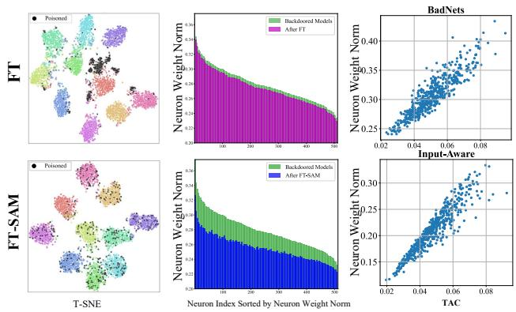  
Figure 2: First two columns: Comparison of the defense models by vanilla fine-tuning (FT, top row) and by FT-SAM (bottom row), respectively. The first column illustrates the T-SNE visualizations of the two models. The two figures in the middle depict the changes in neuron norms in the last convolution layer of the two models, sorted by the neuron weight index of the backdoored model in descending order. Last column: A positive correlation between TAC value [57] and weight norms for each neuron in the last convolution layer of two backdoored models. The TAC metric is introduced as a measure to quantify the association between the backdoor impact and neurons. A higher TAC value attributed to a neuron signifies a stronger connection to backdoors.

To verify the above hypothesis, we conduct a deep investigation of FT based backdoor defense. Specifically, we fine-tune the backdoored model using 5% benign training samples for 100 epochs with the same learning rate as in the training of the backdoored model. All experiments adopt the Blended [7] attack with poisoning ratio 10%, on CIFAR-10 dataset [21] and PreAct-ResNet18 model [17]. The accuracy on benign testing dataset (i.e., benign accuracy) of this backdoored model is 93.44%, and the Attack Success Rate (ASR) is 97.71%. After FT defense, the benign accuracy and ASR are changed to 92.48% and 82.22%, respectively. As shown in the first two figures in the top row of Figure 2, we provide two perspectives to analyze the FT’s effect in this experiment:

1. T-SNE Visualization. The left-top T-SNE visualization in Figure 2 shows the feature space before the fully connected layer in the FT defended model, on both benign testing images $( i . e . ,$ , colored points) and poisoned testing samples $( i . e .$ , black points). The poisoned samples are still clustered together. This phenomenon explains the high ASR value after FT.

2. Changes of Neuron Weight Norms. As shown in the middle-top sub-plot of Figure 2, we compare the changes of neuron weight norms in the last convolutional layer (containing 512 neurons) between the backdoored model (see green bins) and the FT defended model (see purple bins). It is observed that FT treats all neurons equally and there are only slight changes on most neuron weights. It verifies that FT cannot generate a new model that is far from the current model.

## 3.3. Proposed Method

Motivation. To motivate our method, we first introduce one crucial observation of the relationship between the neuron weight norms and backdoor-related neurons in a backdoored model, as shown in the last column of Figure 2. Note that TAC shown at the horizontal axis indicates the trigger activated change metric [57], and it is utilized to quantify the association between the backdoor effect and neurons. TAC value in the ${ { l } ^ { t h } }$ layer is defined as the activation differences of channel-wise neurons in the $l ^ { t h }$ layer between the benign samples and the corresponding poisoned ones in the model, and higher TAC value indicates stronger correlation. It is evident that neurons associated with backdoors tend to exhibit large neuron weight norms across various backdoored models. Inspired by this finding, we attempt to design a strategy that can significantly perturb the neurons with large weight norms (i.e., the backdoor-related neurons), in order to mitigate backdoor effect.

Min-Max Formulation. We propose the following optimization problem:

$$
\operatorname* { m i n } _ { \pmb { w } } \operatorname* { m a x } _ { \pmb { \epsilon } \in S } \mathcal { L } ( \pmb { w } + \pmb { \epsilon } ) ,\tag{1}
$$

where $\begin{array} { r } { \mathcal { L } ( w + \epsilon ) = \mathbb { E } _ { ( \pmb { x } , \pmb { y } ) \in \mathcal { D } _ { b e n i g n } } \left[ \ell ( f _ { w + \epsilon } ( \pmb { x } ) , \pmb { y } ) \right] } \end{array}$ with cross-entropy loss $\ell , S = \{ \epsilon : \| \mathbf { T } _ { w } ^ { - 1 } \epsilon \| _ { 2 } \leq \rho \}$ , and $\rho > 0$ is the hyper-parameter for the budget of weight perturbation. Inspired by ASAM [22], we introduce

$$
\mathbf { T } _ { \boldsymbol { w } } = \operatorname { d i a g } \left( | w _ { 1 } | , | w _ { 2 } | , \ldots , | w _ { d } | \right) \in \mathbb { R } ^ { d \times d } ,\tag{2}
$$

where $w _ { i }$ is the i-th entry of w, to set adaptive perturbation budget for different neurons and encourage larger perturbations to the neurons with larger weight norms, which are more likely to be related to the backdoor effect. We refer to our method as FT-SAM.

Optimization. As described in Algorithm 1, Problem (1) can be efficiently solved by alternatively updating w and $\epsilon .$

• Inner Maximization: Given model weight ${ \pmb w } _ { t }$ , the weight perturbation ϵ could be updated by solving the following sub-problem:

$$
\operatorname* { m a x } _ { \epsilon \in S } \mathcal { L } ( \pmb { w } _ { t } + \epsilon ) .\tag{3}
$$

Algorithm 1 Fine-Tuning with SAM (FT-SAM)   
1: Input: Training set $\mathcal { D } _ { b e n i g n }$ , backdoored model $f _ { w } ,$   
learning rate $\eta > 0 ,$ perturbation bound $\rho > 0$ , loss   
function ${ \mathcal { L } } ,$ max iteration number $T .$   
2: Output: Model fine-tuned with SAM.   
3: Initialize w0.   
4: for $t = 0 , . . . , T - 1$ do   
5: Sample a mini-batch B from $\mathcal { D } _ { b e n i g n } ;$   
6: Update $\mathbf { T } _ { \pmb { w } _ { t } }$ via Equation (2) with ${ \pmb w } _ { t } ;$   
7: Update $\epsilon _ { t + 1 }$ via Equation (4);   
8: Update ${ \pmb w } _ { t + 1 }$ via Equation (6);   
9: end for   
10: return $f _ { w _ { T } }$

Utilizing Taylor expansion, the first-order approximation of Problem (3) and the corresponding solution are formulated as follows:

$$
\begin{array} { r l } & { \epsilon _ { t + 1 } = \arg \underset { \epsilon \in \mathcal { S } } { \operatorname* { m a x } } \mathcal { L } ( \pmb { w } _ { t } + \epsilon ) } \\ & { ~ \approx \arg \underset { \epsilon \in \mathcal { S } } { \operatorname* { m a x } } \mathcal { L } ( \pmb { w } _ { t } ) + \epsilon ^ { \top } \nabla _ { \pmb { w } _ { t } } \mathcal { L } ( \pmb { w } _ { t } ) } \\ & { ~ = \rho \frac { \mathbf { T } _ { \pmb { w } _ { t } } ^ { 2 } \nabla _ { \pmb { w } _ { t } } \mathcal { L } ( \pmb { w } _ { t } ) } { \big \| \mathbf { T } _ { \pmb { w } _ { t } } \nabla _ { \pmb { w } _ { t } } \mathcal { L } ( \pmb { w } _ { t } ) \big \| _ { 2 } } . } \end{array}\tag{4}
$$

A detailed derivation of the above update is provided in Section A of Supplementary Material.

• Outer Minimization: Given $\epsilon _ { t + 1 }$ , the model weight w can be updated by solving the following sub-problem

$$
\operatorname* { m i n } _ { \pmb { w } } \mathcal { L } ( \pmb { w } + \pmb { \epsilon } _ { t + 1 } ) ,\tag{5}
$$

which is optimized by stochastic gradient descent, i.e.,

$$
\begin{array} { r } { \pmb { w } _ { t + 1 } = \pmb { w } _ { t } - \eta \nabla _ { \pmb { w } } \mathcal { L } \big ( \pmb { w } + \pmb { \epsilon } _ { t + 1 } \big ) \big | _ { \pmb { w } = \pmb { w } _ { t } } , } \end{array}\tag{6}
$$

where η is the learning rate.

Remark. To show the effectiveness of FT-SAM on backdoor mitigation, here we present two example sub-plots at the first two columns in the bottom row of Figure 2. The T-SNE visualization at the left-bottom shows that the poisoned features are dispersed and lie closely to features of benign samples, demonstrating that the backdoor effect has been well mitigated, while the clean accuracy is maintained. The middle-bottom sub-plot shows the neurons, especially those with large weight norms, are more significantly perturbed via our FT-SAM defense strategy, compared to FT. It preliminarily explains why FT-SAM is more effective than FT on backdoor mitigation. Moreover, we present further in-depth analysis to understand the mechanism of FT-SAM, from the perspectives of neuron weight norms and weight gradient norms in Section 4.4.

## 4. Experiment

## 4.1. Experimental Setup

Attack Settings. We consider 10 popular state-of-the-art (SOTA) backdoor attacks: BadNets [15] with two attack settings (BadNets-A2O and BadNets-A2A refer to attacking one class and all classes, respectively), Blended backdoor attack (Blended) [7], Input-aware dynamic backdoor attack (Input-aware)[36], Clean-label attack (CLA)[39], Low frequency attack (LF) [55], Sinusoidal signal backdoor attack (SIG) [3], Sample-specific backdoor attack (SSBA) [25], Trojan backdoor attack (Trojan) [34], and Warping-based poisoned networks (WaNet) [37]. We follow the default attack configuration as in BackdoorBench [49] for a fair comparison, such as trigger patterns and optimization hyperparameters. The poisoning ratio is set to 10% in all attacks and the $0 ^ { t h }$ label is set to be the targeted label except for BadNets- $\mathbf { \partial } \cdot \mathbf { A } 2 \mathbf { A } .$ , in which the target labels for original labels y are set to $y _ { t } = ( y + 1 )$ mod C. Here C is the total number of classes and mod is short for "modulus". We evaluate all the attacks on 3 benchmark datasets, CIFAR-10 [21], Tiny ImageNet [23], and GTSRB [41] over two networks, PreAct-ResNet18 [17] and VGG19-BN [40] except for two clean-label attacks SIG and CLA, where the 10% poisoning ratio cannot be reached by attacking only one class. We also compare our method to SOTA methods with a 5% poisoning ratio on CIFAR-10 and Tiny ImageNet on PreAct-ResNet18. More implementation details and the comparison with SOTA defense methods with 5% poisoning ratio can be found in Sections B and C of Supplementary Material.

Defense Settings. We compare the proposed method with vanilla fine-tuning (FT) and seven SOTA backdoor defense methods: Fine-pruning (FP) [32], NAD [27], AC [5], NC [46], ANP [51], ABL [26], and i-BAU [54]. All the defense methods can access 5% benign training data except for AC and ABL, which use the entire poisoned dataset and train a model from scratch. We follow the default configurations for SOTA defense as in BackdoorBench [49]. We use a learning rate of 0.01 with batch size 256 for 100 epochs on CIFAR-10 and Tiny ImageNet, and 50 epochs on GTSRB for FT and FT-SAM. The analysis of sensitivity to different numbers of benign training samples can be found in Section 4.3. For FT-SAM, the most crucial hyper-parameter is the perturbation radius $\rho .$ We set $\rho = 2$ for CIFAR-10 and $\rho = 8$ for Tiny ImageNet and GTSRB on PreAct-ResNet18. More implementation details can be found in Section B of Supplementary Material.

Evaluation Metric. We use three metrics to evaluate the performance of different defenses: ACCuracy on benign data (ACC), Attack Success Rate (ASR), and Defense Effectiveness Rating (DER). ASR measures the proportion of backdoor samples that are successfully misclassified to the target label. $\mathrm { D E R } \in [ 0 , 1 ]$ is firstly proposed in this work to evaluate defense performance considering both ACC and ASR. It is defined as follows:

$$
\mathrm { D E R } = [ \operatorname* { m a x } ( 0 , \Delta \mathrm { A S R } ) - \operatorname* { m a x } ( 0 , \Delta \mathrm { A C C } ) + 1 ] / 2 ,\tag{7}
$$

where ∆ASR denotes the drop in ASR after applying defense, and $\Delta \mathrm { A C C }$ represents the drop in ACC after applying defense. For instance, a value of $\mathrm { D E R } = 1$ means the defense successfully reduces the ASR from 1 to 0 without any drop in ACC; DER = 0 means ACC drops from 1 to 0 and ASR doesn’t change. The max is added to the metric since the increase of ACC or ASR rarely occurs in defenses. A superior defense is indicated by a lower ASR, higher ACC, and higher DER. To ensure a fair comparison between different strategies for the target label, we remove samples whose ground-truth labels already belong to the target class. Note that among all defenses, the one with the best performance is indicated in boldface, and the value with underline denotes the second-best result. We provide PyTorch1 and MindSpore2 implementations of FT-SAM.

## 4.2. Experimental Results

We verify the effectiveness of our method by comparing it against the seven SOTA defense methods on CIFAR-10 and Tiny ImageNet with 10% poisoning ratio on PreAct-ResNet18. The results are presented in Table 1 and Table 2. As shown in Table 1, Badnets-A2O and Wanet can be defended by almost all the defense methods. FT shows promising defense performance and maintains ACC on several attacks, but it cannot resist complex attacks, such as Blended, LF and SSBA. The results of NAD are very similar to FT as both methods fine-tune the model with limited data. I-BAU demonstrates a noticeable effect against almost all attacks with average $\mathrm { A S R } < 6 \%$ , but it sacrifices ACC to achieve a robust model, as evidenced by a low DER. ANP and ABL also show potential in defending against some attacks but their results are unstable, with fluctuating ASR, low ACC, and low DER on different attacks. The sensitivity of the pruning threshold among different attacks in ANP may explain this result, while ABL’s process of combining learning and unlearning may harm the model’s utility. NC performs comparably well in some attacks while the average DER is low, indicating that NC’s resilience is not that high. In comparison, our approach receives a high DER in most cases, indicating the effectiveness of our method in defending against various attacks. It demonstrates the power to decrease ASR on average (2.47%) across all attacks.

Table 2 presents the experimental results on Tiny ImageNet with PreAct-ResNet18. We observe that all compared defense methods fail to maintain both ACC and ASR on complex attacks, which is reflected in a low DER. FT, FP, and NAD demonstrate similar defense performance as they cannot defend against complex attacks. ABL is successful in removing backdoors while reducing ACC synchronously, while i-BAU fails on Tiny ImageNet, possibly due to the larger input size which increases the difficulty of minimax optimization. In contrast, the proposed method shows robustness against all the attacks, with only a slight drop in ACC and remarkably high DER. The defense results on the GT-SRB dataset and the performance on VGG19-BN network can be found in Section C of Supplementary Material.

Table 1: Comparison with state-of-the-art defenses on CIFAR-10 dataset with 5% benign data on PreAct-ResNet18 (%).
<table><tr><td rowspan="2">Attack</td><td rowspan="2">Backdoored ACC/ASR</td><td rowspan="2">FT ACC/ASR/DER</td><td rowspan="2">FP [32] ACC/ASR/DER</td><td rowspan="2">NAD [27] ACC/ASR/DER</td><td rowspan="2">AC [5] ACC/ASR/DER</td><td rowspan="2">NC [46] ACC/ASR/DER</td><td rowspan="2">ANP [51] ACC/ASR/DER</td><td rowspan="2">ABL [26] ACC/ASR/DER</td><td rowspan="2">i-BAU [54] ACC/ASR/DER</td><td rowspan="2">FT-SAM(Ours) ACC/ASR/DER</td></tr><tr><td></td></tr><tr><td>BadNets-A2O[15]</td><td>91.82/93.79</td><td>90.29/1.70/95.28</td><td>91.77/0.84/96.45</td><td>88.82/1.96/94.42</td><td>48.84/16.57/67.12</td><td>57.22/0.90/79.14</td><td>91.65/3.83/94.89</td><td>80.10/0.00/91.03</td><td>87.43/4.48/92.46</td><td>92.21/1.63/96.08</td></tr><tr><td>BadNets-A2A[15]</td><td>91.89/74.42</td><td>91.07/1.16/86.22</td><td>92.05/1.31/86.56</td><td>90.73/1.61/85.83</td><td>87.23/67.03/51.37</td><td>89.79/1.11/85.61</td><td>92.33/2.56/85.93</td><td>44.39/40.65/43.14</td><td>89.39/1.29/85.32</td><td>91.87/1.03/86.69</td></tr><tr><td>Blended[7]</td><td>93.44/97.71</td><td>92.48/82.22/57.26</td><td>92.57/8.32/94.26</td><td>92.09/55.04/70.66</td><td>88.82/95.10/49.00</td><td>91.91/84.31/55.94</td><td>93.00/57.38/69.95</td><td>74.31/0.10/89.24</td><td>88.24/6.00/93.26</td><td>92.44/4.91/95.90</td></tr><tr><td>Input-aware[36]</td><td>94.03/98.35</td><td>93.00/65.85/65.74</td><td>94.05/10.95/93.70</td><td>94.08/10.43/93.96</td><td>51.37/90.94/32.38</td><td>94.11/98.98/50.00</td><td>94.06/11.10/93.63</td><td>50.58/98.82/28.28</td><td>89.91/8.92/92.66</td><td>93.76/1.07/98.51</td></tr><tr><td>CLA[39]</td><td>84.55/99.93</td><td>90.38/10.76/94.59</td><td>90.67/78.72/60.61</td><td>90.01/8.53/95.70</td><td>81.57/99.11/48.92</td><td>90.87/4.56/97.69</td><td>82.55/0.18/98.88</td><td>68.14/0.00/91.76</td><td>85.66/18.99/90.47</td><td>90.72/3.52/98.21</td></tr><tr><td>LF[55]</td><td>93.01/99.06</td><td>92.37/93.89/52.26</td><td>92.05/21.32/88.39</td><td>91.72/75.47/61.15</td><td>52.28/94.34/31.99</td><td>93.01/99.06/50.00</td><td>92.53/26.38/86.10</td><td>71.68/0.86/88.44</td><td>88.92/11.99/91.49</td><td>91.07/3.81/96.65</td></tr><tr><td>SIG[3]</td><td>84.49/97.87</td><td>90.47/5.74/96.06</td><td>90.81/7.06/95.41</td><td>90.05/6.60/95.63</td><td>81.33/98.23/48.42</td><td>84.50/97.87/50.00</td><td>83.87/97.24/50.00</td><td>48.06/0.00/80.72</td><td>85.87/1.32/98.27</td><td>91.16/0.80/98.53</td></tr><tr><td>SSBA[25]</td><td>92.88/97.07</td><td>92.47/90.04/53.31</td><td>92.21/20.27/88.07</td><td>92.15/70.77/62.79</td><td>46.75/67.63/41.65</td><td>92.88/97.07/50.00</td><td>92.02/16.18/90.01</td><td>79.87/0.33/91.86</td><td>86.53/2.89/93.91</td><td>92.12/2.80/96.75</td></tr><tr><td>Trojan[34]</td><td>93.47/99.99</td><td>92.59/35.50/81.80</td><td>92.24/67.73/65.51</td><td>92.18/5.77/96.47</td><td>89.47/100.00/48.00</td><td>91.85/51.03/73.67</td><td>92.71/84.82/57.20</td><td>70.70/0.02/88.60</td><td>89.29/0.54/97.63</td><td>92.75/4.12/97.57</td></tr><tr><td>Wanet[37]</td><td>92.80/98.90</td><td>93.14/1.26/98.82</td><td>92.94/0.66/99.12</td><td>93.07/0.73/99.08</td><td>52.81/11.86/73.52</td><td>92.80/98.90/50.00</td><td>93.24/1.54/98.68</td><td>67.23/92.97/40.18</td><td>90.70/0.88/97.96</td><td>92.87/0.96/98.97</td></tr><tr><td>Avg</td><td>91.24/95.71</td><td>91.83/38.81/78.45</td><td>92.14/21.72/86.99</td><td>91.49/23.69/86.01</td><td>68.05/74.08/49.22</td><td>87.89/63.38/64.49</td><td>90.80/30.12/82.57</td><td>65.51/23.37/73.30</td><td>88.19/5.73/93.47</td><td>92.10/2.47/96.62</td></tr></table>

Table 2: Comparison with state-of-the-art defenses on Tiny ImageNet dataset with 5% benign data on PreAct-ResNet18 (%).
<table><tr><td rowspan="2">Attack</td><td rowspan="2">Backdoored ACC/ASR</td><td rowspan="2">FT ACC/ASR/DER</td><td rowspan="2">FP [32] ACC/ASR/DER</td><td rowspan="2">NAD [27] ACC/ASR/DER</td><td rowspan="2">AC [5] ACC/ASR/DER</td><td rowspan="2">NC [46] ACC/ASR/DER</td><td rowspan="2">ANP [51] ACC/ASR/DER</td><td rowspan="2">ABL [26] ACC/ASR/DER</td><td rowspan="2">i-BAU [54] ACC/ASR/DER</td><td rowspan="2">FT-SAM(Ours) ACC/ASR/DER</td></tr><tr><td></td></tr><tr><td>BadNets-A2O[15]</td><td>56.12/99.90</td><td>55.56/0.44/99.45</td><td>48.81/0.66/95.96</td><td>48.35/0.27/95.93</td><td>49.21/99.76/46.62</td><td>56.12/99.90/50.00</td><td>47.34/0.00/95.56</td><td>48.34/0.00/96.06</td><td>51.63/95.92/49.74</td><td>51.91/0.21/97.74</td></tr><tr><td>BadNets-A2A[15]</td><td>55.99/27.81</td><td>55.04/22.28/52.29</td><td>47.88/3.19/58.26</td><td>48.29/2.30/58.91</td><td>47.71/13.15/53.19</td><td>54.12/18.72/53.61</td><td>40.70/2.39/55.07</td><td>49.60/29.44/46.81</td><td>53.52/12.89/56.23</td><td>52.24/2.09/60.99</td></tr><tr><td>Blended[7]</td><td>55.53/97.57</td><td>54.74/87.18/54.80</td><td>47.45/34.40/77.54</td><td>49.52/67.60/61.98</td><td>48.51/96.50/47.02</td><td>52.79/0.04/97.39</td><td>40.21/28.78/76.73</td><td>47.95/0.10/94.94</td><td>49.30/26.34/82.50</td><td>50.81/1.03/95.91</td></tr><tr><td>Input-aware[36]</td><td>57.67/99.19</td><td>57.86/0.68/99.26</td><td>49.18/3.75/93.48</td><td>50.08/0.61/95.50</td><td>49.48/98.73/46.14</td><td>56.15/84.64/56.52</td><td>50.62/0.46/95.84</td><td>49.42/0.10/95.42</td><td>53.96/1.29/97.10</td><td>52.69/1.01/96.60</td></tr><tr><td>LF[55]</td><td>55.21/98.51</td><td>54.53/94.14/51.85</td><td>48.18/63.83/63.83</td><td>49.61/58.01/67.45</td><td>49.68/98.17/47.41</td><td>53.08/90.48/52.95</td><td>41.75/65.98/59.54</td><td>45.37/0.02/94.33</td><td>53.65/94.27/51.34</td><td>51.30/3.58/95.51</td></tr><tr><td>SSBA[25]</td><td>55.97/97.69</td><td>55.17/92.08/52.40</td><td>48.06/52.25/68.76</td><td>47.67/69.47/59.96</td><td>49.02/97.44/46.65</td><td>53.30/0.26/97.38</td><td>41.83/14.24/84.65</td><td>47.39/0.00/94.55</td><td>52.39/84.64/54.73</td><td>51.87/0.38/96.60</td></tr><tr><td>Trojan[34]</td><td>56.48/99.97</td><td>55.70/37.11/81.04</td><td>45.96/8.88/90.28</td><td>48.83/1.01/95.66</td><td>49.82/99.96/46.68</td><td>54.43/1.54/98.19</td><td>45.36/0.53/94.16</td><td>46.31/0.00/94.90</td><td>51.85/99.15/48.10</td><td>52.28/0.21/97.78</td></tr><tr><td>Wanet[37]</td><td>57.81/96.50</td><td>57.37/0.18/97.94</td><td>50.35/1.37/93.83</td><td>50.02/0.87/93.92</td><td>48.99/99.68/45.59</td><td>57.81/96.50/50.00</td><td>30.34/0.00/84.51</td><td>47.01/0.02/92.84</td><td>53.04/69.82/60.95</td><td>54.32/0.79/96.11</td></tr><tr><td>Avg</td><td>56.35/89.64</td><td>55.75/41.76/73.64</td><td>48.23/21.04/80.24</td><td>49.05/25.02/78.66</td><td>49.05/87.92/47.21</td><td>54.73/49.01/69.50</td><td>42.27/14.05/80.76</td><td>47.67/3.71/88.63</td><td>52.42/60.54/62.59</td><td>52.18/1.16/92.16</td></tr></table>

Table 3: Performance with different benign ratio under different attacks on CIFAR-10 dataset on PreAct-ResNet18 (%).
<table><tr><td>Benign Ratio</td><td>Model</td><td>BadNets-A2O[15] ACC/ASR/DER</td><td>BadNets-A2A[15] ACC/ASR/DER</td><td>Blended[7] ACC/ASR/DER</td><td>Input-aware[36] ACC/ASR/DER</td><td>CLA[39] ACC/ASR/DER</td><td>LF[55] ACC/ASR/DER</td><td>SIG[3] ACC/ASR/DER</td><td>SSBA[25] ACC/ASR/DER</td><td>Trojan[34] ACC/ASR/DER</td><td>Wanet[37] ACC/ASR/DER</td></tr><tr><td></td><td>Backdoored</td><td>91.82/93.79/-</td><td>91.89/74.42/-</td><td>93.44/97.71/-</td><td>94.03/98.35/-</td><td>84.55/99.93/-</td><td>93.01/99.06/-</td><td>92.65/95.89/-</td><td>84.49/97.87/-</td><td>92.88/97.07/-</td><td>93.47/99.99/-</td></tr><tr><td>10%</td><td>FT</td><td>91.67/1.17/96.24</td><td>90.42/1.61/85.67</td><td>92.62/77.20/59.85</td><td>94.17/10.44/93.96</td><td>91.53/5.68/97.13</td><td>92.12/69.22/64.47</td><td>91.18/0.88/96.77</td><td>92.42/65.32/66.27</td><td>92.68/99.61/49.90</td><td>93.57/1.50/99.24</td></tr><tr><td rowspan="3">5%</td><td>FT-SAM</td><td>91.94/1.26/96.27</td><td>92.46/1.01/86.71</td><td>92.53/3.94/96.43</td><td>94.22/0.93/98.71</td><td>91.44/4.90/97.52</td><td>92.64/3.83/97.43</td><td>91.46/1.13/96.78</td><td>91.75/2.63/97.62</td><td>92.94/2.50/97.28</td><td>93.23/0.78/99.48</td></tr><tr><td>FT</td><td>90.29/1.70/95.28</td><td>91.07/1.16/86.22</td><td>92.48/82.22/57.26</td><td>93.00/65.85/65.74</td><td>90.38/10.76/94.59</td><td>92.37/93.89/52.26</td><td>90.47/5.74/93.98</td><td>92.47/90.04/53.91</td><td>92.59/35.50/80.64</td><td>93.14/1.26/99.20</td></tr><tr><td>FT-SAM</td><td>92.21/1.63/96.08</td><td>91.87/1.03/86.69</td><td>92.44/4.91/95.90</td><td>93.76/1.07/98.51</td><td>90.72/3.52/98.21</td><td>91.07/3.81/96.65</td><td>91.16/0.80/96.80</td><td>92.12/2.80/97.53</td><td>92.75/4.12/96.41</td><td>92.87/0.96/99.22</td></tr><tr><td rowspan="2">1%</td><td>FT FT-SAM</td><td>89.25/6.14/92.54</td><td>91.98/1.42/86.50</td><td>92.09/87.98/54.19 90.83/3.01/96.05</td><td>92.23/69.51/63.52</td><td>88.12/11.61/94.16</td><td>92.36/98.87/49.77</td><td>87.80/3.07/93.99</td><td>92.08/94.87/51.50</td><td>92.61/99.70/49.87</td><td>92.65/9.79/94.69</td></tr><tr><td></td><td>88.96/1.29/94.82</td><td>90.43/1.12/85.92</td><td></td><td>93.12/0.81/98.31</td><td>88.74/3.13/98.40</td><td>90.88/4.64/96.14</td><td>88.31/1.00/95.27</td><td>91.11/1.51/98.18</td><td>90.63/4.36/95.23</td><td>90.79/0.91/98.20</td></tr></table>

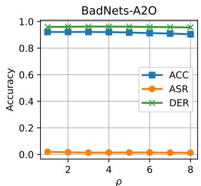

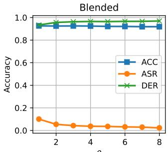

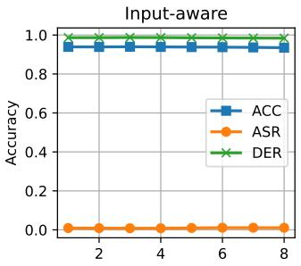

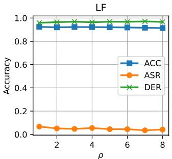  
Figure 3: Performance of FT-SAM with ρ from 1 to 8 against attacks on CIFAR-10 and 10% poisoning ratio with PreAct-ResNet18.

Table 4: Combination with SOTA defenses on CIFAR-10 dataset with 5% benign data on PreAct-ResNet18 (%).
<table><tr><td rowspan="2">Attack</td><td rowspan="2">BadNets-A2O[15] ACC/ASR/DER</td><td rowspan="2">Blended[7] ACC/ASR/DER</td><td rowspan="2">Input-aware[36] ACC/ASR/DER</td><td rowspan="2">CLA[39] ACC/ASR/DER</td><td rowspan="2">LF[55] ACC/ASR/DER</td><td rowspan="2">SIG[3] ACC/ASR/DER</td><td rowspan="2">SSBA[25] ACC/ASR/DER</td><td rowspan="2">Wanet[37] ACC/ASR/DER</td></tr><tr><td></td></tr><tr><td>Backdoored</td><td>91.82/93.79/-</td><td>93.44/97.71/-</td><td>94.03/98.35/-</td><td>84.55/99.93/-</td><td>93.01/99.06/-</td><td>92.65/95.89/-</td><td>84.49/97.87/-</td><td>93.47/99.99/-</td></tr><tr><td>Pruning</td><td>82.52/97.22/45.35</td><td>81.25/99.31/43.91</td><td>84.66/99.90/45.32</td><td>75.42/99.72/45.54</td><td>83.22/99.78/45.11</td><td>75.57/78.57/50.12</td><td>80.75/98.53/48.13</td><td>83,38/99,84/45.03</td></tr><tr><td>Pruning+FT(FP [32])</td><td>91.77/0.84/96.45</td><td>92.57/8.32/94.26</td><td>94.05/10.95/93.70</td><td>90.67/78.72/60.61</td><td>92.05/21.32/88.39</td><td>90.81/7.06/93.50</td><td>92.21/20.27/88.80</td><td>92.94/0.66/99.40</td></tr><tr><td>Pruning + FT-SAM</td><td>91.20/0.62/96.27</td><td>92.07/5.42/95.46</td><td>93.84/1.14/98.51</td><td>90.18/33.76/83.09</td><td>92.03/17.42/90.33</td><td>90.30/5.06/94.24</td><td>91.83/14.73/91.57</td><td>92.52/0.57/99.24</td></tr><tr><td>ANP [51]</td><td>91.65/3.83/94.89</td><td>93.00/57.38/69.95</td><td>94.06/11.10/93.63</td><td>82.55/0.18/98.88</td><td>92.53/26.38/86.10</td><td>83.87/97.24/45.61</td><td>92.02/16.18/90.84</td><td>93.24/1.54/99.11</td></tr><tr><td>ANP [51] + FT</td><td>92.24/1.41/96.19</td><td>92.90/42.28/77.45</td><td>94.17/1.11/98.62</td><td>91.47/6.44/96.74</td><td>92.71/63.33/67.71</td><td>91.22/0.08/97.19</td><td>92.57/35.46/81.21</td><td>93.36/0.66/99.61</td></tr><tr><td>ANP [51] + FT-SAM</td><td>90.99/1.12/95.92</td><td>91.51/2.57/96.61</td><td>93.03/1.09/98.13</td><td>91.08/2.09/98.92</td><td>91.71/4.00/96.88</td><td>89.57/0.08/96.37</td><td>91.49/4.16/96.86</td><td>91.90/0.78/98.82</td></tr></table>

## 4.3. Ablation Studies

Performance with Different Values of Hyper-parameter $\rho _ { \bullet }$ The most crucial hyper-parameter in our defense approach is the constraint bound $\rho$ imposed on the perturbation ϵ. $\mathbf { A }$ higher value of $\rho$ increases the weight perturbation, thereby improving the network’s robustness. However, in cases where we are given limited training data, a smaller value of $\rho$ could better maintain model’s performance while reducing the effectiveness of defenses. Here we evaluate the sensitivity of $\rho$ by conducting four complex attacks using a learning rate of 0.01 and different values of $\rho .$ . Figure 3 displays the defense results. A smaller value of $\rho$ may not completely remove backdoors, which is more obvious for complex attacks, $e . g .$ , Blended and LF. But it shows that FT-SAM can enhance the model’s robustness and exhibit a certain level of ACC and DER when faced with different $\rho .$ Overall, the hyper-parameter $\rho$ is not very sensitive, and a wide range of values can be selected without significantly impacting the model’s performance. It can be attributed to the adaptive strategy (parameters norm times $\rho )$ in FT-SAM scales the perturbation $\epsilon .$ Thus, there is a wide range of $\rho$ to keep stable performance, and a larger $\rho$ often accelerates the BM process.

Performance under Different Components. To evaluate the effectiveness of FT-SAM in various scenarios, we conducted experiments with different numbers of benign training samples, backbones, and poisoning ratios. Table 3 presents defense results of FT-SAM on the CIFAR-10 dataset with a 10% poisoning ratio under different ratios of benign samples. The hyper-parameter $\rho$ is set to 2 across all experiments. We observed that FT-SAM demonstrates a robust defense mechanism across various numbers of benign samples, with only a modest decrease in performance given 1% benign samples. Contrarily, different attacks cause different trends in the effectiveness of FT at various numbers of benign samples, and poor results can be observed through the exceptionally low DER especially when the ratio is low. In contrast, our method exhibits consistently high DER. Further results on the performance of FT-SAM with different backbones (VGG19-BN) and poisoning ratios can be found in Sections C and D of Supplementary Material.

Combination with SOTA Defenses. As discussed in Section 3.3, FT-SAM, as a kind of fine-tuning method, shows superiority over vanilla fine-tuning and has the potential to replace it in fine-tuning-based defense processes. Moreover, we hypothesize that FT-SAM can also enhance pruningbased defense methods, which suffer from performance drops if the defense configuration is not well optimized. To verify our hypothesis and demonstrate the versatility of FT-SAM, we combined it with two existing post-processing defense methods: FP [32] and ANP [51]. FP first prunes the suspicious neurons of the model and then fine-tunes the pruned model with limited samples. We replace fine-tuning to FT-SAM in the second step of FP. ANP identifies the backdoor neurons that mostly enlarge the loss function and then masks these neurons. We keep the mask computed by ANP and fine-tune it with FT-SAM. The experiment is conducted on the CIFAR-10 with PreAct-ResNet18. We also display results for pure pruning, as well as the combination of ANP and fine-tuning (ANP + FT) for a fair comparison. As shown in Table 4, the original defense methods show susceptibility to various attacks, including ANP against Blended and FP against CLA. Additionally, ANP shows a low ACC and DER. Although the ANP + FT sometimes worked, it performs poorly in other attacks. On average, our proposed approach improves both defense strategies with a high DER. This result may inspire the development of new robust defense strategies with the help of FT-SAM.

## 4.4. Further Analysis

Understanding FT-SAM’s Mechanism from the Perspective of Neuron Weight Norms. We first present scatter plots of neuron weight norms w.r.t. TAC values of ten backdoor attacks in Figure 4. We have three observations. 1) The neuron weight norms and TAC are highly correlated in the backdoored models across all attacks, which further verifies the preliminary observation shown in the last column of Figure 2. 2) There are only minor changes in the neuron weight norms between the backdoored models and the models after FT across all attacks, which further explains the weak performance of FT on backdoor mitigation. 3) There are notable decreases in the overall neuron weight norms after conducting FT-SAM defense on the backdoored models. And, the decreasing magnitude increases along with the TAC value, demonstrating that the backdoor-related neurons are more changed. It explains the good performance of FT-SAM on backdoor mitigation. Furthermore, we also show the distributions of neuron weight norms of different models in Figure 5. It is observed that the variance of the distribution of the model after FT-SAM is smaller than those of the backdoored model and the model after FT. It reveals that the model relies more evenly on different neurons for decision-making, such that it is less likely to be dominated by some particular neurons, i.e., having lower backdoor risk.

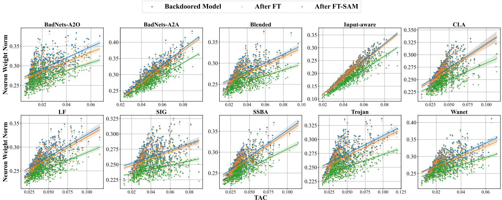

Figure 4: Scatter plot to demonstrate the relationship between neuron weight norms and TAC for backdoored models, models after FT, and models after FT-SAM on various attacks with a 5% poisoning ratio on CIFAR-10 and PreAct-ResNet18.  
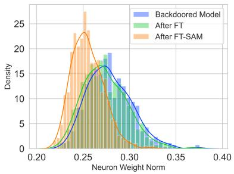  
Figure 5: Parameters distribution comparison to the backdoored model between FT and FT-SAM defenses on CIFAR-10 and 5% poisoning ratio with PreAct-ResNet18.

Understanding FT-SAM’s Mechanism from the Perspective of Weight Gradient Norms. To further understand the mechanism of FT-SAM on backdoor mitigation in comparison with FT, we perform more analysis from the weight gradient norms’ perspective. Specifically, we visualize the gradient norms calculated by FT $( i . e . , \parallel \nabla _ { \textbf { \em w } } \mathcal { L } ( \textbf { \em w } ) \parallel _ { 2 } )$ and FT-SAM $( i . e . , \| \nabla _ { w } \mathcal { L } ( w + \epsilon ) \| _ { 2 } )$ in Figure 6(a) and 6(b), respectively. The gradients’ $\ell _ { 2 }$ norms are calculated on one mini-batch training data $( i . e .$ , 256 samples) by FT and FT

SAM optimization. We sort the 512 neurons of the last convolutional layer of PreAct-ResNet18 by the TAC value [57] in ascending order. Our analysis is expanded from the following two aspects.

• In Terms of the Model after FT, as shown in Figure 6(a), we can obtain two observations. 1) All gradient norms are very small, which explains the slight neuron weight changes of FT on backdoored models. 2) There are no significant differences in gradient norms between these neurons. It implies that the weight changes between backdoor-related and non-backdoor-related neurons are similar. This explains why the backdoor effect is not mitigated well after FT.

• In Terms of the Model after FT-SAM, Figure 6(b) tells: the gradient norms are much larger than those of the model after FT, and there is a positive correlation between gradient norms and backdoor related neurons. This explains the above observation in Figure 4 that the backdoor-related neurons are highly perturbed by FT-SAM. Furthermore, we investigate why FT-SAM could give such gradients, and find that the weight per turbation ϵ (see Equation (1)) and $\mathbf { T } _ { w }$ (see Equation (2)) are the main reasons. As shown in Figure 6(c), we study the relationship between the perturbation and the gradient norms. Specifically, we vary the perturbation budget $\rho$ (see the descriptions under Equation (1)) and calculate the corresponding average gradient norms over 512 neurons. For the backdoored models across various backdoor attacks, there is a common positive correlation between perturbation budget and average gradient norm, i.e., larger perturbation, larger average gradient norm. It explains that the gradient norms in FT-SAM are much larger than those in FT. Besides, if given a fixed $\rho ,$ we study the relationship between the specific perturbation norm and the neuron weight norm for each neuron in FT-SAM. If utilizing the vanilla SAM $( i . e . , \mathbf { T } _ { w }$ in Equation (1) is set to iden tity matrix), SAM tends to perturb more on neurons with large weight norms, as shown in Figure 6(d). If utilizing the adaptive SAM $( i . e . , \mathbf { T } _ { w }$ is defined in Equation (2)), this tendency is further boosted, as shown in Figure 6(e). It explains the positive correlation between gradient norms and backdoor-related neurons.

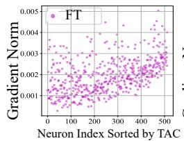  
(a)

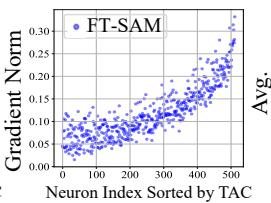  
(b)

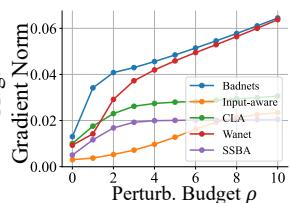  
(c)

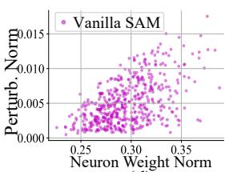  
(d)

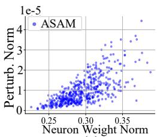  
(e)

Figure 6: Understanding FT-SAM. (a) and (b) A comparison of the gradient norms for each neuron in the last convolution layer of the two models calculated during the first batch of the first epoch. (c) The relationship between perturbation bound $\rho$ and average gradient norm of all neurons. (d) The relationship between neurons weight norms and the computed perturbation norm in inner-step of vanilla SAM. (e) The relationship between neurons weight norms and the computed perturbation norm in inner-step of adaptive SAM (ASAM).  
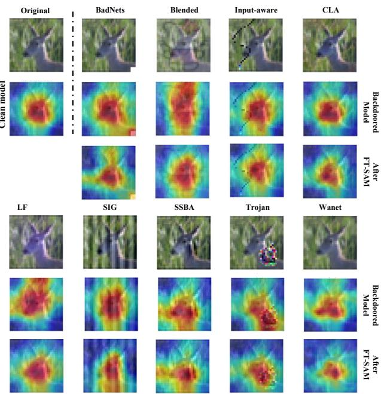  
Figure 7: Grad-CAM [38] of regions contributed to model decision under different attacks by FT-SAM defense comparing to the backdoored models on CIFAR-10 dataset and 5% poisoning ratio with PreAct-ResNet18.

Grad-CAM Visualization under Different Attacks. Grad-CAM [38] figures can provide insights into how a neural network makes its predictions. If the original model generates a strong signal in a subject region of the image that is highly relevant for the classification task, then this could indicate that the defense mechanism has successfully removed the backdoor. Figure 7 displays the benign image of a deer and its Grad-CAM figure, along with the samples from nine attacks and their Grad-CAM figures. As shown in the figure, compared to the backdoored model, all the Grad-CAM figures of the defense models focus on the subject region of the image, i.e., the head of the deer instead of the triggers. This demonstrates that the backdoor has been eliminated successfully.

## 5. Conclusion

In this work, we investigate the impact of fine-tuning on backdoor defenses and provide insights into why finetuning fails from a neuron-level perspective. Specifically, we explore the relationship between the norms of network neurons and their contribution to backdoor attacks and find that neurons with larger norms contribute more to backdoor attacks. Leveraging this observation, we propose a novel finetuning technique, dubbed FT-SAM, that employs sharpnessaware minimization to perturb backdoor-related neurons. We empirically demonstrate that our method can significantly reduce the weight norm of backdoor-related neurons and shows its effectiveness by investigating the gradient of neuron weight computed by FT-SAM. Extensive experiments demonstrate that our method reliably eliminates the injected backdoor and offers the highest robustness against various cutting-edge backdoor attacks while preserving high accuracy. Finally, integrating our method with other defense methods demonstrates FT-SAM is a promising defense strat egy against backdoor attacks.

Acknowledgment. Baoyuan Wu was supported by the National Natural Science Foundation of China under grant No. 62076213, Shenzhen Science and Technology Program under grants No. RCYX20210609103057050, No. ZDSYS20211021111415025, No. GXWD20201231105722002-20200901175001001, and CAAI-Huawei MindSpore Open Fund.

## References

[1] Insaf Adjabi, Abdeldjalil Ouahabi, Amir Benzaoui, and Abdelmalik Taleb-Ahmed. Past, present, and future of face recognition: A review. Electronics, 9(8):1188, 2020. 1

[2] Jiawang Bai, Kuofeng Gao, Dihong Gong, Shu-Tao Xia, Zhifeng Li, and Wei Liu. Hardly perceptible trojan attack against neural networks with bit flips. In European Conference on Computer Vision, pages 104–121. Springer, 2022. 1

[3] Mauro Barni, Kassem Kallas, and Benedetta Tondi. A new backdoor attack in cnns by training set corruption without label poisoning. In 2019 IEEE International Conference on Image Processing (ICIP), pages 101–105. IEEE, 2019. 2, 5, 6, 7

[4] Pratik Chaudhari, Anna Choromanska, Stefano Soatto, Yann LeCun, Carlo Baldassi, Christian Borgs, Jennifer Chayes, Levent Sagun, and Riccardo Zecchina. Entropy-sgd: Biasing gradient descent into wide valleys. Journal of Statistical Mechanics: Theory and Experiment, 2019(12):124018, 2019. 3

[5] Bryant Chen, Wilka Carvalho, Nathalie Baracaldo, Heiko Ludwig, Benjamin Edwards, Taesung Lee, Ian Molloy, and Biplav Srivastava. Detecting backdoor attacks on deep neural networks by activation clustering. In Workshop on Artificial Intelligence Safety. CEUR-WS, 2019. 2, 5, 6

[6] Weixin Chen, Baoyuan Wu, and Haoqian Wang. Effective backdoor defense by exploiting sensitivity of poisoned samples. Advances in Neural Information Processing Systems, 35:9727–9737, 2022. 2

[7] Xinyun Chen, Chang Liu, Bo Li, Kimberly Lu, and Dawn Song. Targeted backdoor attacks on deep learning systems using data poisoning. arXiv e-prints, pages arXiv–1712, 2017. 1, 2, 3, 5, 6, 7

[8] Ziyi Cheng, Baoyuan Wu, Zhenya Zhang, and Jianjun Zhao. Tat: Targeted backdoor attacks against visual object tracking. Pattern Recognition, 142:109629, 2023. 2

[9] Jeremy Cohen, Elan Rosenfeld, and Zico Kolter. Certified adversarial robustness via randomized smoothing. In international conference on machine learning, pages 1310–1320. PMLR, 2019. 3

[10] Huijie Feng, Chunpeng Wu, Guoyang Chen, Weifeng Zhang, and Yang Ning. Regularized training and tight certification for randomized smoothed classifier with provable robustness. In Proceedings ofthe AAAI Conference on Artificial Intelligence, volume 34, pages 3858–3865, 2020. 3

[11] Pierre Foret, Ariel Kleiner, Hossein Mobahi, and Behnam Neyshabur. Sharpness-aware minimization for efficiently improving generalization. In International Conference on Learning Representations, 2021. 2, 3

[12] Kuofeng Gao, Jiawang Bai, Baoyuan Wu, Mengxi Ya, and Shu-Tao Xia. Imperceptible and robust backdoor attack in 3d point cloud. arXiv preprint arXiv:2208.08052, 2022. 2

[13] Kuofeng Gao, Yang Bai, Jindong Gu, Yong Yang, and Shu-Tao Xia. Backdoor defense via adaptively splitting poisoned dataset. In Proceedings of the IEEE/CVF Conference on Computer Vision and Pattern Recognition, pages 4005–4014, 2023. 2

[14] Yansong Gao, Bao Gia Doan, Zhi Zhang, Siqi Ma, Jiliang

Zhang, Anmin Fu, Surya Nepal, and Hyoungshick Kim. Backdoor attacks and countermeasures on deep learning: A comprehensive review. arXiv e-prints, pages arXiv–2007, 2020. 1

[15] Tianyu Gu, Kang Liu, Brendan Dolan-Gavitt, and Siddharth Garg. Badnets: Evaluating backdooring attacks on deep neural networks. IEEE Access, 7:47230–47244, 2019. 1, 2, 5, 6, 7

[16] Kaiming He, Xiangyu Zhang, Shaoqing Ren, and Jian Sun. Deep residual learning for image recognition. In The IEEE / CVF Computer Vision and Pattern Recognition Conference, 2016. 1

[17] Kaiming He, Xiangyu Zhang, Shaoqing Ren, and Jian Sun. Identity mappings in deep residual networks. In Computer Vision–ECCV 2016: 14th European Conference, Amsterdam, The Netherlands, October 11–14, 2016, Proceedings, Part IV 14, pages 630–645. Springer, 2016. 2, 3, 5

[18] Sepp Hochreiter and Jürgen Schmidhuber. Flat minima. Neural computation, 9(1):1–42, 1997. 3

[19] Kunzhe Huang, Yiming Li, Baoyuan Wu, Zhan Qin, and Kui Ren. Backdoor defense via decoupling the training process. In International Conference on Learning Representations, 2022. 2

[20] Zhuo Huang, Xiaobo Xia, Li Shen, Jun Yu, Chen Gong, Bo Han, and Tongliang Liu. Robust generalization against corruptions via worst-case sharpness minimization, 2023. 3

[21] Alex Krizhevsky, Geoffrey Hinton, et al. Learning multiple layers of features from tiny images. 2009. 2, 3, 5

[22] Jungmin Kwon, Jeongseop Kim, Hyunseo Park, and In Kwon Choi. Asam: Adaptive sharpness-aware minimization for scale-invariant learning of deep neural networks. In International Conference on Machine Learning, pages 5905–5914. PMLR, 2021. 2, 3, 4

[23] Ya Le and Xuan Yang. Tiny imagenet visual recognition challenge. CS 231N, 7(7):3, 2015. 5

[24] Tao Li, Weihao Yan, Zehao Lei, Yingwen Wu, Kun Fang, Ming Yang, and Xiaolin Huang. Efficient generalization improvement guided by random weight perturbation. arXiv e-prints, pages arXiv–2211, 2022. 2

[25] Yuezun Li, Yiming Li, Baoyuan Wu, Longkang Li, Ran He, and Siwei Lyu. Invisible backdoor attack with sample-specific triggers. In Proceedings of the IEEE/CVF International Con ference on Computer Vision, pages 16463–16472, 2021. 2, 5, 6, 7

[26] Yige Li, Xixiang Lyu, Nodens Koren, Lingjuan Lyu, Bo Li, and Xingjun Ma. Anti-backdoor learning: Training clean models on poisoned data. Advances in Neural Information Processing Systems, 34:14900–14912, 2021. 2, 5, 6

[27] Yige Li, Xixiang Lyu, Nodens Koren, Lingjuan Lyu, Bo Li, and Xingjun Ma. Neural attention distillation: Erasing backdoor triggers from deep neural networks. In International Conference on Learning Representations, 2021. 1, 2, 5, 6

[28] Siyuan Liang, Longkang Li, Yanbo Fan, Xiaojun Jia, Jingzhi Li, Baoyuan Wu, and Xiaochun Cao. A large-scale multipleobjective method for black-box attack against object detection. In European Conference on Computer Vision, pages 619–636. Springer, 2022. 1

[29] Siyuan Liang, Aishan Liu, Jiawei Liang, Longkang Li, Yang Bai, and Xiaochun Cao. Imitated detectors: Stealing knowl-

edge of black-box object detectors. In Proceedings of the 30th ACM International Conference on Multimedia, pages 4839–4847, 2022. 1

[30] Siyuan Liang, Xingxing Wei, Siyuan Yao, and Xiaochun Cao. Efficient adversarial attacks for visual object tracking. In Computer Vision–ECCV 2020: 16th European Conference, Glasgow, UK, August 23–28, 2020, Proceedings, Part XXVI 16, pages 34–50. Springer, 2020. 1

[31] Siyuan Liang, Baoyuan Wu, Yanbo Fan, Xingxing Wei, and Xiaochun Cao. Parallel rectangle flip attack: A query-based black-box attack against object detection. arXiv preprint arXiv:2201.08970, 2022. 1

[32] Kang Liu, Brendan Dolan-Gavitt, and Siddharth Garg. Finepruning: Defending against backdooring attacks on deep neural networks. In Research in Attacks, Intrusions, and Defenses: 21st International Symposium, RAID 2018, Heraklion, Crete, Greece, September 10-12, 2018, Proceedings 21, pages 273–294. Springer, 2018. 1, 2, 3, 5, 6, 7

[33] Liangkai Liu, Sidi Lu, Ren Zhong, Baofu Wu, Yongtao Yao, Qingyang Zhang, and Weisong Shi. Computing systems for autonomous driving: State of the art and challenges. IEEE Internet ofThings Journal, 8(8):6469–6486, 2020. 1

[34] Yingqi Liu, Shiqing Ma, Yousra Aafer, Wen-Chuan Lee, Juan Zhai, Weihang Wang, and Xiangyu Zhang. Trojaning attack on neural networks. In 25th Annual Network and Distributed System Security Symposium, NDSS 2018, San Diego, California, USA, February 18-221, 2018. The Internet Society, 2018. 1, 5, 6

[35] Peng Mi, Li Shen, Tianhe Ren, Yiyi Zhou, Xiaoshuai Sun, Rongrong Ji, and Dacheng Tao. Make sharpness-aware minimization stronger: A sparsified perturbation approach. Advances in Neural Information Processing Systems, 35:30950– 30962, 2022. 3

[36] Tuan Anh Nguyen and Anh Tran. Input-aware dynamic backdoor attack. Advances in Neural Information Processing Systems, 33:3454–3464, 2020. 2, 5, 6, 7

[37] Tuan Anh Nguyen and Anh Tuan Tran. Wanet - imperceptible warping-based backdoor attack. In International Conference on Learning Representations, 2021. 2, 5, 6, 7

[38] Ramprasaath R Selvaraju, Michael Cogswell, Abhishek Das, Ramakrishna Vedantam, Devi Parikh, and Dhruv Batra. Gradcam: Visual explanations from deep networks via gradientbased localization. In Proceedings ofthe IEEE international conference on computer vision, pages 618–626, 2017. 9

[39] Ali Shafahi, W Ronny Huang, Mahyar Najibi, Octavian Suciu, Christoph Studer, Tudor Dumitras, and Tom Goldstein. Poison frogs! targeted clean-label poisoning attacks on neural networks. Advances in neural information processing systems, 31, 2018. 2, 5, 6, 7

[40] Karen Simonyan and Andrew Zisserman. Very deep convolutional networks for large-scale image recognition. arXiv preprint arXiv:1409.1556, 2014. 5

[41] Johannes Stallkamp, Marc Schlipsing, Jan Salmen, and Christian Igel. The german traffic sign recognition benchmark: a multi-class classification competition. In The 2011 international joint conference on neural networks, pages 1453–1460. IEEE, 2011. 5

[42] Hao Sun, Li Shen, Qihuang Zhong, Liang Ding, Shixiang Chen, Jingwei Sun, Jing Li, Guangzhong Sun, and Dacheng

Tao. Adasam: Boosting sharpness-aware minimization with adaptive learning rate and momentum for training deep neural networks. arXiv preprint arXiv:2303.00565, 2023. 3

[43] Yan Sun, Li Shen, Tiansheng Huang, Liang Ding, and Dacheng Tao. Fedspeed: Larger local interval, less communication round, and higher generalization accuracy. In International Conference on Learning Representations. 3

[44] J-Donald Tournier, Robert Smith, David Raffelt, Rami Tabbara, Thijs Dhollander, Maximilian Pietsch, Daan Christiaens, Ben Jeurissen, Chun-Hung Yeh, and Alan Connelly. Mrtrix3: A fast, flexible and open software framework for medical image processing and visualisation. Neuroimage, 202:116137, 2019. 1

[45] Laurens Van der Maaten and Geoffrey Hinton. Visualizing data using t-sne. Journal of machine learning research, 9(11), 2008. 1

[46] Bolun Wang, Yuanshun Yao, Shawn Shan, Huiying Li, Bimal Viswanath, Haitao Zheng, and Ben Y Zhao. Neural cleanse: Identifying and mitigating backdoor attacks in neural networks. In 2019 IEEE Symposium on Security and Privacy (SP), pages 707–723. IEEE, 2019. 2, 5, 6

[47] Ruotong Wang, Hongrui Chen, Zihao Zhu, Li Liu, Yong Zhang, Yanbo Fan, and Baoyuan Wu. Robust backdoor attack with visible, semantic, sample-specific, and compatible triggers. arXiv preprint arXiv:2306.00816, 2023. 2

[48] Shaokui Wei, Mingda Zhang, Hongyuan Zha, and Baoyuan Wu. Shared adversarial unlearning: Backdoor mitigation by unlearning shared adversarial examples. arXiv preprint arXiv:2307.10562, 2023. 2

[49] Baoyuan Wu, Hongrui Chen, Mingda Zhang, Zihao Zhu, Shaokui Wei, Danni Yuan, and Chao Shen. Backdoorbench: A comprehensive benchmark of backdoor learning. In Thirtysixth Conference on Neural Information Processing Systems Datasets and Benchmarks Track, 2022. 1, 3, 5

[50] Baoyuan Wu, Li Liu, Zihao Zhu, Qingshan Liu, Zhaofeng He, and Siwei Lyu. Adversarial machine learning: A systematic survey of backdoor attack, weight attack and adversarial example. arXiv preprint arXiv:2302.09457, 2023. 1

[51] Dongxian Wu and Yisen Wang. Adversarial neuron pruning purifies backdoored deep models. Advances in Neural Information Processing Systems, 34:16913–16925, 2021. 1, 2, 5, 6, 7

[52] Liang Xiao, Xiaoyue Wan, Xiaozhen Lu, Yanyong Zhang, and Di Wu. Iot security techniques based on machine learning: How do iot devices use ai to enhance security? IEEE Signal Processing Magazine, 35(5):41–49, 2018. 1

[53] Chaojian Yu, Bo Han, Mingming Gong, Li Shen, Shiming Ge, Bo Du, and Tongliang Liu. Robust weight perturbation for adversarial training, 2022. 3

[54] Yi Zeng, Si Chen, Won Park, Zhuoqing Mao, Ming Jin, and Ruoxi Jia. Adversarial unlearning of backdoors via implicit hypergradient. In International Conference on Learning Representations, 2022. 2, 5, 6

[55] Yi Zeng, Won Park, Z Morley Mao, and Ruoxi Jia. Rethinking the backdoor attacks’ triggers: A frequency perspective. In Proceedings ofthe IEEE/CVF International Conference on Computer Vision, pages 16473–16481, 2021. 1, 2, 5, 6, 7

[56] Tongqing Zhai, Yiming Li, Ziqi Zhang, Baoyuan Wu, Yong Jiang, and Shu-Tao Xia. Backdoor attack against speaker ver-

ification. In ICASSP 2021-2021 IEEE International Conference on Acoustics, Speech and Signal Processing (ICASSP), pages 2560–2564. IEEE, 2021. 2

[57] Runkai Zheng, Rongjun Tang, Jianze Li, and Li Liu. Datafree backdoor removal based on channel lipschitzness. In Computer Vision–ECCV 2022: 17th European Conference, Tel Aviv, Israel, October 23–27, 2022, Proceedings, Part V, pages 175–191. Springer, 2022. 2, 3, 4, 8

[58] Runkai Zheng, Rongjun Tang, Jianze Li, and Li Liu. Preactivation distributions expose backdoor neurons. Advances in Neural Information Processing Systems, 35:18667–18680, 2022. 2

[59] Qihuang Zhong, Liang Ding, Li Shen, Peng Mi, Juhua Liu, Bo Du, and Dacheng Tao. Improving sharpness-aware minimization with fisher mask for better generalization on language models. arXiv preprint arXiv:2210.05497, 2022. 3

[60] Mingli Zhu, Shaokui Wei, Hongyuan Zha, and Baoyuan Wu. Neural polarizer: A lightweight and effective backdoor defense via purifying poisoned features. arXiv preprint arXiv:2306.16697, 2023. 2

[61] Zihao Zhu, Mingda Zhang, Shaokui Wei, Li Shen, Yanbo Fan, and Baoyuan Wu. Boosting backdoor attack with a learnable poisoning sample selection strategy. arXiv preprint arXiv:2307.07328, 2023. 2

[62] Juntang Zhuang, Boqing Gong, Liangzhe Yuan, Yin Cui, Hartwig Adam, Nicha C Dvornek, sekhar tatikonda, James s Duncan, and Ting Liu. Surrogate gap minimization improves sharpness-aware training. In International Conference on Learning Representations, 2022. 3