# Erasing Concepts from Diffusion Models

Rohit Gandikota∗,1

Joanna Materzynska ´ ∗,2

Jaden Fiotto-Kaufman1

David Bau1

1Northeastern University 2Massachusetts Institute of Technology

1[gandikota.ro, fiotto-kaufman.j, davidbau]@northeastern.edu 2jomat@mit.edu

Erasing Nudity

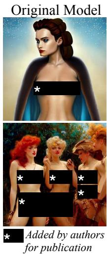

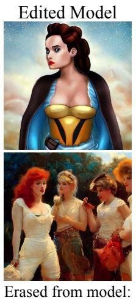  
Erased from model: “Nudity”  
Erasing Artistic Style

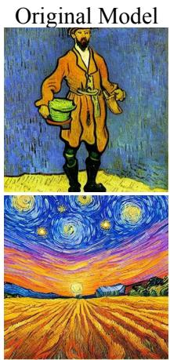

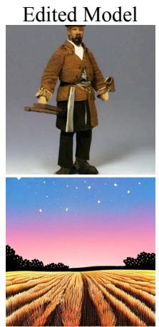  
Erased from model: “Van Gogh”  
Erasing Objects

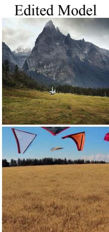  
Erased from model: “Car”

Figure 1: Given only a short text description of an undesired visual concept and no additional data, our method fine-tunes model weights to erase the targeted concept. Our method can avoid NSFW content, stop imitation of a specific artist’s style, or even erase a whole object class from model output, while preserving the model’s behavior and capabilities on other topics.

## Abstract

Motivated by concerns that large-scale diffusion models can produce undesirable output such as sexually explicit content or copyrighted artistic styles, we study erasure of specific concepts from diffusion model weights. We propose afine-tuning method that can erase a visual conceptfrom a pre-trained diffusion model, given only the name ofthe style and using negative guidance as a teacher. We benchmark our method against previous approaches that remove sexually explicit content and demonstrate its effectiveness, performing on par with Safe Latent Diffusion and censored training. To evaluate artistic style removal, we conduct experiments erasingfive modern artistsfrom the network and conduct a user study to assess the human perception ofthe removed styles. Unlike previous methods, our approach can remove concepts from a diffusion model permanently rather than modifying the output at the inference time, so it cannot be circumvented even ifa user has access to model weights. Our code, data, and results are available at erasing.baulab.info.

## 1. Introduction

Recent text-to-image generative models have attracted at tention due to their remarkable image quality and seemingly infinite generation capabilities. These models are trained on vast internet datasets, which enables them to imitate a wide range of concepts. However, some concepts learned by the model are undesirable, including copyrighted content and pornography, which we aim to avoid in the model’s output [27, 16, 29]. In this paper, we propose an approach for selectively removing a single concept from a text-conditional model’s weights after pretraining. Prior approaches have focused on dataset filtering [30], post-generation filtering [29], or inference guiding [38]. Unlike data filtering meth ods, our method does not require retraining, which is prohibitive for large models. Inference-based methods can censor [29] or steer the output away from undesired concepts effectively [38], but they can be easily circumvented. In contrast, our approach directly removes the concept from the model’s parameters, making it safe to distribute its weights.

The open-source release of the Stable Diffusion text-toimage diffusion model has made image generation technology accessible to a broad audience. To limit the generation of unsafe images, the first version was bundled with a simple NSFW filter to censor images if the filter is triggered [29], yet since both the code and model weights are publicly avail able, it is easy to disable the filter [43]. In an effort to prevent the generation of sensitive content, the subsequent SD 2.0 model is trained on data filtered to remove explicit images, an experiment consuming 150,000 GPU-hours of computation [32] over the 5-billion-image LAION dataset [39]. The high cost of the process makes it challenging to establish a causal connection between specific changes in the data and the capabilities that emerge, but users report that removing explicit images and other subjects from the training data may have had a negative impact on the output quality [30]. And despite the effort, explicit content remains prevalent in the model’s output: when we evaluate generation of images using prompts from the 4,703 prompts of the Inappropriate Image Prompts (I2P) benchmark [38], we find that the popu lar SD 1.4 model produces 796 images with exposed body parts identified by a nudity detector, while the new trainingset-restricted SD 2.0 model produces 417 (Figure 7).

Another major concern regarding the text-to-image models is their ability to imitate potentially copyrighted content. Not only is the quality of the AI-generated art on par with the human-generated art [34], it can also faithfully replicate an artistic style of real artists. Users of Stable Diffusion [31] and other large-scale text-to-image synthesis systems have discovered that prompts such as “art in the style of [artist]” can mimic styles of specific artists, potentially devaluing original work. Copyright concerns of several artists has led to a lawsuit against the makers of Stable Diffusion [1], raising new legal issues [41]; the courts have yet to rule on these cases. Recent work [42] aims to protect the artist by applying an adversarial perturbation to artwork before posting it online to prevent the model from imitating it. That approach, however, cannot remove a learned artistic style from a pretrained model.

In response to safety and copyright infringement concerns, we propose a method for erasing a concept from a text-to-image model. Our method, Erased Stable Diffusion (ESD), fine-tunes the model’s parameters using only undesired concept descriptions and no additional training data. Unlike training-set censorship approaches, our method is fast and does not require training the whole system from scratch. Furthermore, our method can be applied to existing models without the need to modify input images [42]. Unlike the post-filtering [29] or simple blacklisting methods, erasure cannot be easily circumvented, even by users who have access to the parameters. We benchmark our method on removing offensive content and find that it is as effective as Safe Latent Diffusion [38] for removing offensive images. We also test the ability of our method to remove an artistic style from the model. We conduct a user study to test the impact of erasure on user perception of the remove artist’s style in output images, as well as the interference with other artistic styles and their impact on image quality. Finally, we also test our method on erasure of complete object classes.

## 2. Related Works

Undesirable image removal. Previous work to avoid undesirable image output in generative models has taken two main approaches: The first is to censor images from the training set, for example, by removing all people [25], or by more narrowly curating data to exclude undesirable classes of images [39, 27, 33]. Dataset removal has the disadvantage that the resources required to retrain large models makes it a very costly way to respond to problems discovered after training; also large-scale censorship can produce unintended effects [26]. The second approach is post-hoc, modifying output after training using classifiers [3, 21, 29], or by adding guidance to the inference process [38]; such methods are efficient to test and deploy, but they are easily circumvented by a user with access to parameters [43]. We compare both previous approaches including Stable Diffusion 2.0 [30], which is a complete retraining of the model on a censored training set, and Safe Latent Diffusion [38], which the stateof-the-art guidance-based approach. The focus of our current work is to introduce a third approach: we tune the model parameters using a guidance-based model-editing method, which is both fast to employ and also difficult to circumvent.

Image cloaking. Another approach to protecting images from imitation by large models is for an artist to cloak im ages by adding adversarial perturbations before posting them on the internet. Cloaking allows artists to effectively hide their work from a machine-learned model during training or inference by adding perturbations that cause the model to confuse the cloaked image with an unrelated image [36] or an image with a different artistic style [42]; the method is a promising way for an artist to self-censor their own content from AI training sets while still making their work visible to humans. Our paper addresses a different problem than the problem addressed by cloaking: we ask how a model creator can erase an undesired visual concept without active self-censorship by content providers.

Model editing. As the cost of training grows, there has been increasing interest in lightweight model-editing methods that alter the behavior of large-scale generative models given little or no new training data. In text generators, a model’s knowledge of facts can be edited based on a single statement of the fact by modifying specific neurons [7] or layers [23], or by using hypernetworks [8, 24]. In image synthesis, a generative adversarial network (GAN) can be edited using a handful of words [14], a few sketches [46], warping gestures [47], or copy-and-paste [2]. Recently, it has been shown that text-conditional diffusion models can be edited by associating a token for a new subject trained using only a handful of images [13, 20, 35]. Unlike previous methods that add or modify the appearance of objects, the goal of our current work is to erase a targeted visual concept from a diffusion model given only a single textual description of the concept, object, or style to be removed.

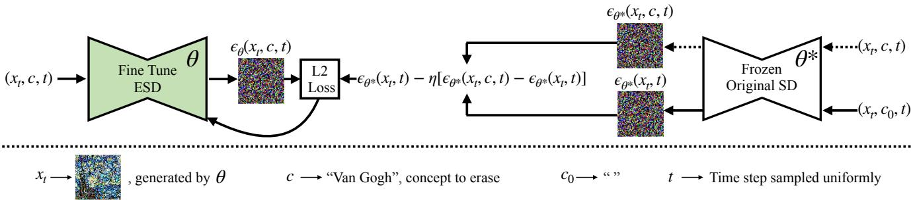  
Figure 2: The optimization process for erasing undesired visual concepts from pre-trained diffusion model weights involves using a short text description of the concept as guidance. The ESD model is fine-tuned with the conditioned and unconditioned scores obtained from frozen SD model to guide the output away from the concept being erased. The model learns from its own knowledge to steer the diffusion process away from the undesired concept.

Memorization and unlearning. While the traditional goal of machine learning is to generalize without memorization, large models are capable of exact memorization if specifically trained to do so [48], and unintentional memorization has also been observed in large-scale settings [6, 5], including diffusion models [45]. The possibility of such exact memorization has driven privacy and copyright concerns and has led to work in machine unlearning [40, 4, 15], which aims to modify a model to behave as if particular training data had not been present. However, these methods are based on the assumption that the undesired knowledge corresponds to an identifiable set of training data points. The problem we tackle in this paper is very different from the problem of unlearning specific training data because rather than simulating the removal of a known training item, our goal is to erase a high-level visual concept that may have been learned from a large and unknown subset of the training data, such as the appearance of nudity, or the imitation of an artist’s style.

Energy-based composition. Our work is inspired by the observation [10, 11] that set-like composition can be performed naturally on energy-based models and diffusion counterparts [22] naturally via arithmetic on the score or the noise predictions. Score-based composition is also the basis for classifier-free-guidance [18]. Like previous works, we treat “A and not $\mathbf { B } ^ { \ast }$ as the difference between log probability densities for A and B; a similar observation has been used to reduce the undesirable output of both language models [37] and vision generators [38]. Unlike previous work that applies composition at inference time, we introduce the use of score composition as a source of unsupervised training data to teach a fine-tuned model to erase an undesired concept from model weights.

## 3. Background

## 3.1. Denoising Diffusion Models

Diffusion models are a class of generative models that learn the distribution space as a gradual denoising process [44, 17]. Starting from sampled Gaussian noise, the model gradually denoises for T time steps until a final image is formed. In practice, the diffusion model predicts noise $\epsilon _ { t }$ at each time step t that is used to generate the intermediate denoised image $x _ { t } ;$ where xT corresponds to the initial noise and $x _ { 0 }$ corresponds to the final image. This denoising process is modeled as a Markov transition probability.

$$
p _ { \theta } ( x _ { T : 0 } ) = p ( x _ { T } ) \prod _ { t = T } ^ { 1 } p _ { \theta } ( x _ { t - 1 } | x _ { t } )\tag{1}
$$

## 3.2. Latent Diffusion Models

Latent diffusion models (LDM) [31] improve efficiency by operating in a lower dimensional latent space z of a pretrained variational autoencoder with encoder E and decoder D. During training, for an image x, noise is added to its encoded latent, $z = \mathcal { E } ( x )$ leading to $z _ { t }$ where the noise level increases with t. LDM process can be interpreted as a sequence of denoising models with identical parameters θ that learn to predict the noise $\boldsymbol { \epsilon } _ { \theta } ( \boldsymbol { z } _ { t } , \boldsymbol { c } , t )$ added to $z _ { t }$ conditioned on the timestep t as well as a text condition $c .$ The following objective function is optimized:

$$
\mathcal { L } = \mathbb { E } _ { z _ { t } \in \mathcal { E } ( x ) , t , c , \epsilon \sim \mathcal { N } ( 0 , 1 ) } [ | | \epsilon - \epsilon _ { \theta } ( z _ { t } , c , t ) | | _ { 2 } ^ { 2 } ]\tag{2}
$$

Classifier-free guidance is a technique employed to regulate image generation, as described in Ho et al. [18]. This method involves redirecting the probability distribution towards data that is highly probable according to an implicit classifier $p ( c | z _ { t } )$ . This approach is used during inference and requires that the model be jointly trained on both conditional and unconditional denoising. The conditional and unconditional scores are both obtained from the model during inference. The final score $\tilde { \epsilon } _ { \theta } ( z _ { t } , c , t )$ is then directed towards the conditioned score and away from the unconditioned score by utilizing a guidance scale $\alpha > 1$

$$
\tilde { \epsilon } _ { \theta } ( z _ { t } , c , t ) = \epsilon _ { \theta } ( z _ { t } , t ) + \alpha ( \epsilon _ { \theta } ( z _ { t } , c , t ) - \epsilon _ { \theta } ( z _ { t } , t ) )\tag{3}
$$

The inference process starts from a Gaussian noise $z _ { T } \sim$ $\mathcal { N } ( 0 , 1 )$ and is denoised with the $\tilde { \epsilon } _ { \theta } ( z _ { T } , c , T )$ to get $z _ { T - 1 }$ This process is done sequentially till $z _ { 0 }$ and is transformed to image space using the decoder $x _ { 0 } \gets D ( z _ { 0 } )$

## 4. Method

The goal of our method is to erase concepts from textto-image diffusion models using its own knowledge and no additional data. Therefore, we consider fine-tuning a pretrained model rather than training a model from scratch. We focus on Stable Diffusion (SD) [31], an LDM that consists of 3 subnetworks: a text encoder T , a diffusion model (U-Net) $\theta ^ { * }$ and a decoder model D. We shall train new parameters θ.

Our approach involves editing the pre-trained diffusion U-Net model weights to remove a specific style or concept. We aim to reduce the probability of generating an image x according to the likelihood that is described by the concept, scaled by a power factor η.

$$
P _ { \theta } ( x ) \propto \frac { P _ { \theta ^ { * } } ( x ) } { P _ { \theta ^ { * } } ( c | x ) ^ { \eta } }\tag{4}
$$

Where $P _ { \theta ^ { * } } ( x )$ represents the distribution generated by the original model and c represents the concept to erase. Expanding $\begin{array} { r } { P ( c | x ) = \frac { P ( x | c ) P ( \acute { c } ) } { P ( x ) } } \end{array}$ , the gradient of the log probability ∇ log $P _ { \theta } ( x )$ would be proportional to:

$$
\nabla \log P _ { \theta ^ { * } } ( x ) - \eta ( \nabla \log P _ { \theta ^ { * } } ( x | c ) - \nabla \log P _ { \theta ^ { * } } ( x ) )\tag{5}
$$

Based on Tweedie’s formula [12] and the reparametrization trick of [17], we can introduce a time-varying noising process and express each score (gradient of log probability) as a denoising prediction $\boldsymbol { \varepsilon } ( x _ { t } , c , t )$ . Thus Eq. 5 becomes:

$$
\epsilon _ { \theta } ( x _ { t } , c , t ) \gets \epsilon _ { \theta ^ { * } } ( x _ { t } , t ) - \eta [ \epsilon _ { \theta ^ { * } } ( x _ { t } , c , t ) - \epsilon _ { \theta ^ { * } } ( x _ { t } , t ) ]\tag{6}
$$

This modified score function moves the data distribution to minimize the generation probability of images x that can be labeled as $c .$ The objective function in Equation 6 fine-tunes the parameters θ such that $\epsilon _ { \theta } ( x _ { t } , c , t )$ mimics the negatively guided noise. That way, after the fine-tuning, the edited model’s conditional prediction is guided away from the erased concept.

Figure 2 illustrates our training process. We exploit the model’s knowledge of the concept to synthesize training samples, thereby eliminating the need for data collection.

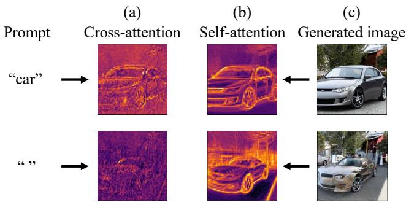  
Figure 3: When comparing generation of two similar car images conditioned on different prompts, self-attention (b) contributes to the features of a car regardless of the presence of the word $\ " \mathrm { c a r } \ "$ in the prompt, while the contribution of cross-attention (a) is linked to the presence of the word. Heatmaps show local contributions of the first attention modules of the 3rd upsampling block of the Stable Diffusion U-net while generating the images (c).

Training uses several instances of the diffusion model, with one set of parameters frozen (θ∗) while training the other set of parameters (θ) to erase the concept. We sample partially denoised images $x _ { t }$ conditioned on c using $\theta ,$ then we perform inference on the frozen model $\theta ^ { * }$ twice to predict the noise, once conditioned on c and the other unconditioned. Finally, we combine these two predictions linearly to negate the predicted noise associated with the concept, and we tune the new model towards that new objective.

## 4.1. Importance of Parameter Choice

The effect of applying the erasure objective (6) depends on the subset of parameters that is fine-tuned. The main distinction is between cross-attention parameters and noncross-attention parameters. Cross-attention parameters, illustrated in Figure 3a, serve as a gateway to the prompt, directly depending on the text of the prompt, while other parameters (Figure 3b) tend to contribute to a visual concept even if the concept is not mentioned in the prompt.

Therefore we propose fine tuning the cross attentions, ESD-x, when the erasure is required to be controlled and specific to the prompt, such as when a named artistic style should be erased. Further, we propose fine tuning unconditional layers (non-cross-attention modules), ESD-u, when the erasure is required to be independent of the text in the prompt, such as when the global concept of NSFW nudity should be erased. We refer to cross-attention-only finetuning as ESD-x-η (where η refers to the strength of the negative guidance), and we refer to the configuration that tunes only non-cross-attention parameters as ESD-u-η. For simplicity, we write ESD-x and ESD-u when $\eta = 1$

The effects of parameter choices on artist style removal are illustrated in Figure 4: when erasing the “Van Gogh”

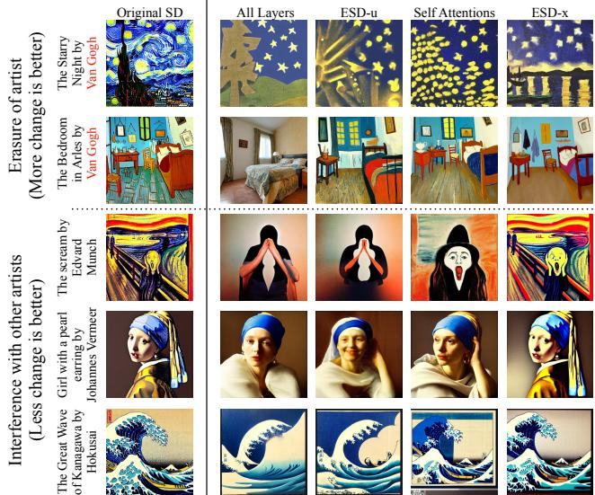  
Figure 4: Modifying the cross-attention weights, ESD-x, shows negligible interference with other styles (bottom 3 rows) and is thus well-suited for erasing art styles. In contrast, altering the non-cross-attention weights, ESD-u, has a global erasure effect (all rows) on the visual concept and is better suited for removing nudity or objects.

style ESD-u and other unconditioned parameter choices erase aspects of the style globally, erasing aspects of Van Gogh’s style from many artistic styles other than Van Gogh’s. On the other hand, tuning the cross-attention parameters only (ESD-x) erases the distinctive style of Van Gogh specifically when his name is mentioned in the prompt, keeping the interference with other artistic styles to a minimum.

Conversely, when removing NSFW content it is important that the visual concept of “nudity” is removed globally, especially in cases when nudity is not mentioned in the prompt. To measure those effects we evaluate on a data set that include many prompts that do not explicitly mention NSFW terms (Section 5.2). We find that ESD-u performs best in this application; full quantitative ablations over different parameter sets are included in Appendix.

## 5. Experiments

We train all our models for 1000 gradient update steps on a batch size of 1 with learning rate 1e-5 using the Adam optimizer. Depending on the concept we want to remove (4.1), the ESD-x method fine-tunes the cross-attention and ESD-u fine tunes the unconditional weights of the U-Net module in Stable Diffusion (our experiments use version 1.4 unless specified otherwise). Baseline methods are:

• SD (pretrained Stable Diffusion),

• SLD (Safe Latent Diffusion) [38], to adapt the method to our experiment, we substitute the concept we want to erase from the model for the original safety concepts.

• SD-Neg-Prompt (Stable Diffusion with Negative Prompts), an inference technique in the community, that aims to steer away from unwanted effects in an image. We adapt this method by using the artist’s name as the negative prompt.

## 5.1. Artistic Style Removal

## 5.1.1 Experiment Setup

To analyze imitation of art among contemporary practicing artists, we consider 5 modern artists and artistic topics; Kelly McKernan, Thomas Kinkade, Tyler Edlin, Kilian Eng and the series “Ajin: Demi-Human,” which have been reported to be imitated by Stable Diffusion. While we did not observe the model making direct copies of specific original artwork, it is undeniable that these artistic styles have been captured by the model. To study this effect, we demonstrate quali tative results in Fig 5 and conduct a user study to measure the human perception on the artistic removal effect. Our experiments validate the observation that the particular artistspecific style is removed from the model, while the content and structure of the prompt is preserved (Fig 5) with minimal interference on other artistic styles. For more image examples, please refer to Appendix.

## 5.1.2 Artistic Style Removal User Study

To measure the human perception of the effectiveness of the removed style, we conducted a user study. For each artist, we collect 40 images of art created by those artists, using Google Image Search to identify top-ranked works. Then for each artist, we also compose 40 generic text prompts that invoke the artist’s style, and we use Stable Diffusion to generate images for each artist using these prompts, for example: “Art by [artist]”, “A design of [artist]”, “An image in the style of [artist]”, “A reproduction of the famous art of [artist]”. We also evaluate images from edited diffusion models, as described in Section 5.1.1 as well as the baseline models. The images were generated with 4 seeds per prompt (same seeds were used for all methods) resulting in a dataset of 1000 images. Furthermore, we also included images from a similar human artist for each of the five artists. We pair real artist with similar real artist as follows: (Kelly McKernan, Kirbi Fagan), (Thomas Kinkade, Nicky Boehme), (Ajin: Demi Human, Tokyo Ghoul), (Tyler Edlin, Feng Zhu), (Kil ian Eng, Jean Giraud). For each similar artist, we collected 12-25 works to use in our study.

In our study, participants were presented with a set of five real artwork images along with an additional image. The additional image was either a real artwork from the same artist or a similar artist, or a synthetic image generated using a prompt involving the artist name with our method (ESD x) or other baseline methods (SLD and SD-Neg-Prompt)

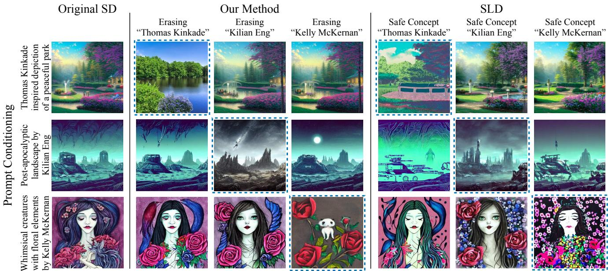  
Figure 5: Our method has a better erasure on intended style with a minimal interference compared to SLD [38]. The images enclosed in blue dotted borders are the intended erasure, and the off-diagonal images show effect on untargeted styles.

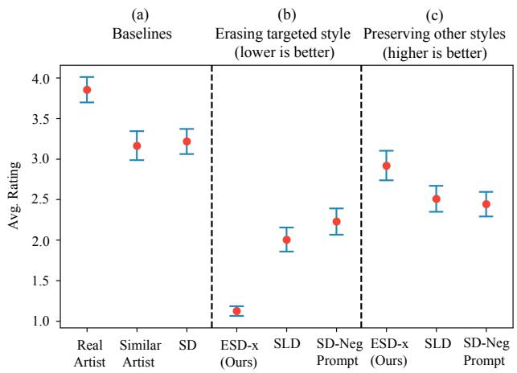  
Figure 6: User study ratings (with ± 95% confidence intervals) show that our method erases the intended style better than the baselines. The rating (1-5) represent the similarity of the images compared to original artist style (5 being most similar). With higher ratings for images from similar style artists, the study shows that style is highly subjective.

applied to remove the artist or a random different artist. Participants were asked to estimate, on a five-point Likert scale, their confidence level that the experimental image was created by the same artist as the five real artworks.

Our study involved 13 total participants, with an average of 170 responses per participant. We evaluated the effectiveness of the ESD-x method for removing the style of five modern artists and measuring the resemblance of generated artistic images to real images. Additionally, we assessed the amount of interference introduced by our method in com parison to other baseline methods, measuring the extent to which other artistic styles were affected.

The findings of our investigation are presented in Figure 6. Interestingly, even for the genuine artwork, there is some level of uncertainty about its authenticity. The average rating for the original images is 3.85, the average rating for artists similar to the selected artists is 3.16, while the average rating for the AI-generated art is 3.21, indicating that the AI-duplicates are rated higher than similar genuine artwork. These outcomes reinforce our observations that the model effectively captures the style of an artist. All three removal techniques effectively decrease the perceived artistic style, with average ratings of 1.12, 2.00, and 2.22 for ESD-x, SLD and SD-Neg-Prompt respectively.

In addition to assessing the removal of an artistic style, we are also interested in evaluating the interference of our method with different artistic styles. To accomplish this, we present our research participants with images produced using a text prompt referring to an artist that was not erased in a model generated with an erased artist. We compare our method to SLD and SD-Neg-Prompt in this experiment. The outcomes, presented in Figure 5, indicate that users are most likely to consider images generated using our method to be genuine artwork, as opposed to those generated using other removal techniques, indicating that our method does not interfere with other artistic styles as a result of removing an artist. It is worth noting that, unlike the two baselines, our method modifies the model permanently, rather than being

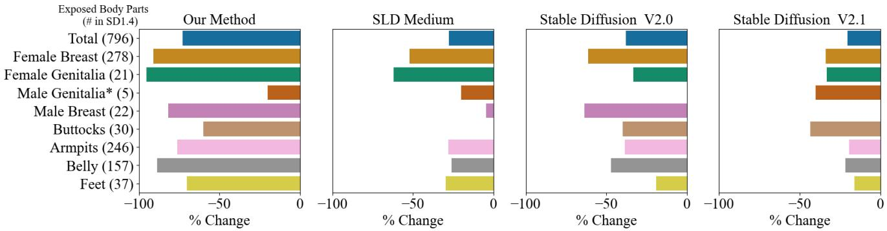  
Figure 7: Our method effectively removes nudity content from Stable Diffusion on I2P data, outperforming inference method, SLD [38] and model trained on NSFW filtered dataset, SD-V2.0 [30]. (SD-V2.1, also shown, filters less aggressively.) The figure shows the percentage change in the nudity-classified samples compared to the original SD-V1.4 model. The SD v1.4 produces 796 images with exposed body parts on the test prompts, and our method reduces this total to 134.

<table><tr><td>Method</td><td>FID-30k</td><td>CLIP</td></tr><tr><td>REAL</td><td>一</td><td>0.1561</td></tr><tr><td>SD</td><td>14.50</td><td>0.1592</td></tr><tr><td>SLD-Medium1</td><td>16.90</td><td>0.1594</td></tr><tr><td>SLD-Max</td><td>18.76</td><td>0.1583</td></tr><tr><td>ESD-u</td><td>13.68</td><td>0.1585</td></tr><tr><td>ESD-u-3</td><td>17.27</td><td>0.1586</td></tr></table>

Table 1: Our method shows better image fidelity performance compared to SLD and Stable Diffusion on COCO 30k images generated with inference guidance α = 7.5. All the methods show good CLIP score consistency with SD.

an inference approach.

Our method can also be applied to erase memorized artworks rather than entire artistic styles; we describe and analyze this variant in Section 5.4.

## 5.2. Explicit Content Removal

Recent works have addressed the challenge of NSFW content restriction either through inference modification [38], post-production classification based restriction [31] or retraining the entire model with NSFW restricted subset of LAION dataset [30]. Inference and post-production classification based methods can be easily circumvented when the models are open-sourced [43]. Retraining the models on filtered data can be very expensive, and we find that such models (Stable Diffusion V2.0) are still capable of generating nudity, as seen in Figure 7.

Since the erasure of unsafe content like nudity requires the effect to be global and independent of text embeddings, we use ESD-u to erase "nudity". In Figure 7, we compare the percentage change in nudity classified samples with respect to Stable Diffusion v1.4. We study the effectiveness of our method with both inference method (SLD [38]) and filtered re-training methods (SD V2.0 [30]). For all the models, 4703 images are generated using I2P prompts from [38]. The images are classified into various nudity classes using the Nudenet [28] detector. For this analysis, we show results for our weak erasure scale of η = 1. We find that across all the classes, our method has a more significant effect in erasing nudity2. For a more similar comparison study that was done by [38], please refer to Appendix.

To ensure that the erased model is still effective in generating safe content, we compare all the methods’ performance on COCO 30K dataset prompts. We measure the image fidelity to show the quality and CLIP score to show specificity of the model to generate conditional images in table 1. ESD-u refers to soft erasure with η = 1 and ESD-u-3 refers to stronger erasure with η = 3. Since COCO is a well curated dataset without nudity, this could be a reason for our method’s better FID compared to SD. All the methods have similar CLIP scores as SD showing minimal effect specificity.

## 5.3. Object Removal

In this section, we investigate the extent to which method can also be used to erase entire object classes from the model. We prepare ten ESD-u models, each removing one class name from a subset of the ImageNet classes [9] (we investgiate the Imagenette [19] subset which comprises ten easily identifiable classes). To measure the effect of removing both the targeted and untargeted classes, we generate 500 images of each class using base Stable Diffusion as well as each of the ten fine-tuned models using the prompt “an image of a [class name]”; then we evaluate the results by examining the top-1 predictions of a pretrained Resnet-50 Imagenet classifier. Table 2 displays quantitative results, comparing classification accuracy of the erased class in both the original Stable Diffusion model and our ESD-u model trained to eliminate the class. The table also shows the classification accuracy when generating the remaining nine classes. It is evident that our approach effectively removes the targeted classes in most cases, although there are some classes such as “church” that are more difficult to remove. Accuracy of untargeted classes remains high, but there is some interference, for example, removing “French horn” adds noticible distortions to other classes. Images showing the visual effects of object erasure are included in Appendix.

<table><tr><td rowspan="2">Class name</td><td colspan="2">Accuracy of erased class</td><td colspan="2">Accuracy of other classes</td></tr><tr><td>SD</td><td>ESD-u</td><td>SD</td><td>ESD-u</td></tr><tr><td>cassette player</td><td>15.6</td><td>0.60</td><td>85.1</td><td>64.5</td></tr><tr><td>chain saw</td><td>66.0</td><td>6.0</td><td>79.6</td><td>68.2</td></tr><tr><td>church</td><td>73.8</td><td>54.2</td><td>78.7</td><td>71.6</td></tr><tr><td>gas pump</td><td>75.4</td><td>8.6</td><td>78.5</td><td>66.5</td></tr><tr><td>tench</td><td>78.4</td><td>9.6</td><td>78.2</td><td>66.6</td></tr><tr><td>garbage truck</td><td>85.4</td><td>10.4</td><td>77.4</td><td>51.5</td></tr><tr><td>English springer</td><td>92.5</td><td>6.2</td><td>76.6</td><td>62.6</td></tr><tr><td>golf ball</td><td>97.4</td><td>5.8</td><td>76.1</td><td>65.6</td></tr><tr><td>parachute</td><td>98.0</td><td>23.8</td><td>76.0</td><td>65.4</td></tr><tr><td>French horn</td><td>99.6</td><td>0.4</td><td>75.8</td><td>49.4</td></tr><tr><td>Average</td><td>78.2</td><td>12.6</td><td>78.2</td><td>63.2</td></tr></table>

Table 2: Our method can cleanly erase many object concepts from a model, evidenced here a significant drop in classification accuracy of the concept while keeping the other class scores high. We measure the extent to which erasing an object class from the model affects the scores of other classes

## 5.4. Memorized Image Erasure

For image-specific erasure, ground truth images can be used for training instead of model-generated samples. We apply the same algorithm but use the original image to produce a partially denoised version through the forward diffusion process. Figure 9 demonstrates the minimal impact of erasing Starry Night from Stable Diffusion on Van Gogh’s style and other memorized artworks, indicating a fine-grained erasure effect. Additionally, we show the effect of erasing multiple memorized images in the Appendix. Simultane ously erasing multiple images starts to affect other memorized artwork, while having minimal interference on non-art generations. Figure 8 illustrates this using Learned Perceptual Image Patch Similarity (LPIPS) to compare original and edited model outputs. Higher LPIPS indicates greater change. More erased art increases divergence for memorized artwork, but not for non-art images.

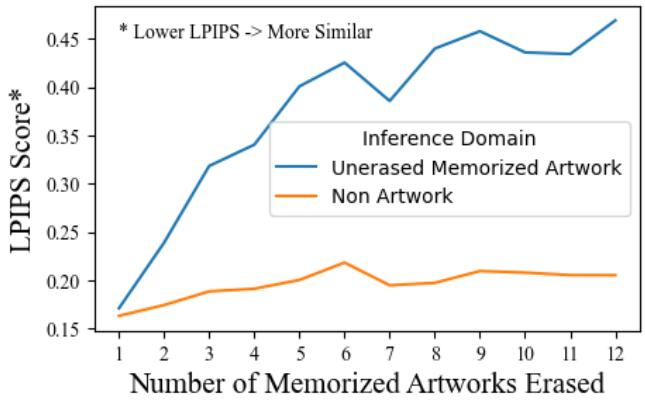  
Figure 8: Erasing multiple artwork images from stable diffusion has adverse effects on other unrelated memorized artworks, but has a minimal impact on the non-artwork generations. We use LPIPS score to measure the distortion in images before and after the model is edited. The higher LPIPS score represents more change

Erased Artwork  
Corresponding Artist Style  
Other Memorized Artwork  
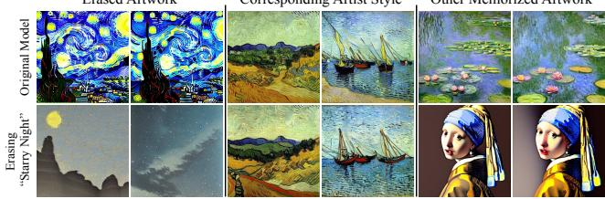  
Figure 9: Erasing a single artwork image does not effect the corresponding artist style or other memorized artworks. The edited model after erasing "Starry Night" clearly has minimal effect on Van Gogh style and other memorized artwork while effectively erasing "Starry Night".

## 5.5. Effect of η on Interference

To measure the effect of η on interference, we test three different "nudity" erased ESD-u-η models’ performance on 1000 images per each of the 10 Imagenette [19] classes. Setting η = 10 erases 92% of nudity cases but reduces 1000-way classification accuracy by 34% on object images, while η = 3 erases 88% and impacts objects by 14%, and η = 1 erases 83% and impacts objects by 7%. These results suggest that reducing the value of η can mitigate interference, although reducing η also reduces the efficacy of erasing the targeted concept. Reducing η also improves image quality, as indicated in Table 1, so the appropriate η to choose will depend on the application. We also show that using generic prompts can erase the synonymous concepts in Appendix.

## 5.6. Effect of paraphrased concept on Erasure

Erasing a generic prompt will reduce generation of a syn onymous concept, even using ESD-x. We explored concept removal by applying ESD-x to five different prompts that paraphrased the concept of the Eiffel Tower: [‘Parisian Iron Lady’, ‘Famous Tower in Paris’, ‘A famous landmark of Paris’, ‘Paris’s Iconic Monument’, ‘The metallic lacework giant of Paris’]. We generated 100 images that directly referenced ‘Eiffel Tower’. The original SD results contained 79 Eiffel Tower images, whereas the erased models generated only 38 on average. As shown in Figure 10, SD results (top row) frequently depict the tower, while ESD results (bottom) rarely do. This suggests our method targets meaning rather than specific wording.

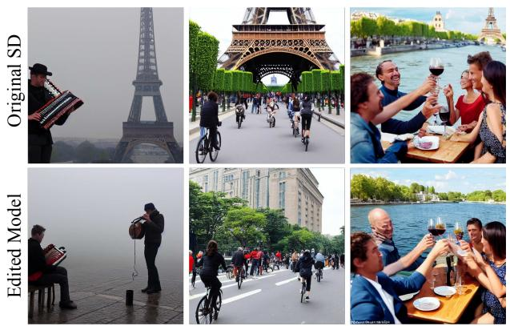  
Figure 10: Top: Images generate with Stable Diffusion, bottom: images generated with ESD when removing "A famous landmark of Paris". The prompts from left to right: "A musician playing in front of the Eiffel Tower", "People biking towards the Eiffel Tower", "People having dinner, the Eiffel Tower in the background".

## 5.7. Limitations

For both NSFW erasure and artistic style erasure, we find that our method is more effective than baseline approaches on erasing the targeted visual concept, but when erasing large concepts such as entire object classes or some par ticular styles, our method can impose a trade-off between complete erasure of a visual concept and interference with other visual concepts. In Figure 11 we illustrate some of the limitations. We quantify the typical level of interference during art erasure in the user study conducted in Section 5.1.2. When erasing entire object classes, our method will fail on some classes, erasing only particular distinctive attributes of concepts (such as crosses from churches and ribs from parachutes) while leaving the larger concepts unerased. Erasing entire object classes creates some interference to other classes, which is quantified in Section 5.3.

## 6. Conclusion

This paper proposes an approach for eliminating specific concepts from text-to-image generation models by editing the model weights. Unlike traditional methods that require extensive dataset filtering and system retraining, our approach does not involve manipulating large datasets or undergoing expensive training. Instead, it is a fast and efficient method that only requires the name of the concept to be removed. By removing the concept directly from the model weights, our method eliminates the need for post-inference filters and enables safe distribution of parameters.

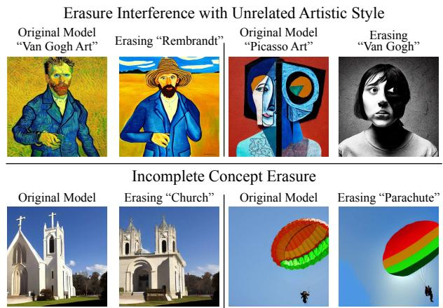  
Figure 11: Cases of incomplete concept erasures and style interference with our method. When erasing concepts from Stable Diffusion, the model, sometimes, tends to erase only the main elements like crosses in case of church and texture in case of parachute.

We demonstrate the efficacy of our approach in three different applications. Firstly, we show that our method can successfully remove explicit content with comparable results to the Safe Latent Diffusion method. Secondly, we demonstrate how our approach can be used to remove artistic styles, and support our findings with a thorough human study. Lastly, we illustrate the versatility of our method by applying it to concrete object classes.

## Code

Source code, data sets, and fine-tuned model weights for reproducing our results are available at the project website https://erasing.baulab.info and the GitHub repository https://github.com/rohitgandikota/erasing.

## Acknowledgments

Thanks to Antonio Torralba for valuable advice, discussions and support, and thanks to Fern Keniston for organizing the event where the team developed the work. RG, DB are supported by grants from Open Philanthropy and Signify. JM partially funded by ONR MURI grant N00014-22-1-2740

## References

[1] Sarah Andersen. et al v. Stability AI Ltd. et al. Case No. 3:2023cv00201. US District Court for the Northern District of California. Jan 2023. 2

[2] David Bau, Steven Liu, Tongzhou Wang, Jun-Yan Zhu, and Antonio Torralba. Rewriting a deep generative model. In Proceedings ofthe European Conference on Computer Vision (ECCV), 2020. 2

[3] Praneeth Bedapudi. NudeNet: Neural nets for nudity detection and censoring, 2022. 2

[4] Lucas Bourtoule, Varun Chandrasekaran, Christopher A Choquette-Choo, Hengrui Jia, Adelin Travers, Baiwu Zhang, David Lie, and Nicolas Papernot. Machine unlearning. In 2021 IEEE Symposium on Security and Privacy (SP), pages 141–159. IEEE, 2021. 3

[5] Nicholas Carlini, Daphne Ippolito, Matthew Jagielski, Katherine Lee, Florian Tramer, and Chiyuan Zhang. Quantifying memorization across neural language models. In Proceedings of the International Conference on Learning Representations (ICLR), 2023. 3

[6] Nicholas Carlini, Chang Liu, Úlfar Erlingsson, Jernej Kos, and Dawn Song. The secret sharer: Evaluating and testing unintended memorization in neural networks. In 28th USENIX Security Symposium (USENIX Security 19), pages 267–284, 2019. 3

[7] Damai Dai, Li Dong, Yaru Hao, Zhifang Sui, Baobao Chang, and Furu Wei. Knowledge neurons in pretrained transformers. In Proceedings of the 60th Annual Meeting of the Association for Computational Linguistics (Volume 1: Long Papers), pages 8493–8502, 2022. 2

[8] Nicola De Cao, Wilker Aziz, and Ivan Titov. Editing factual knowledge in language models. In Proceedings of the 2021 Conference on Empirical Methods in Natural Language Processing, pages 6491–6506, 2021. 2

[9] Jia Deng, Wei Dong, Richard Socher, Li-Jia Li, Kai Li, and Li Fei-Fei. Imagenet: A large-scale hierarchical image database. In 2009 IEEE conference on computer vision and pattern recognition, pages 248–255. Ieee, 2009. 7

[10] Yilun Du, Shuang Li, and Igor Mordatch. Compositional visual generation with energy based models. Advances in Neural Information Processing Systems, 33:6637–6647, 2020. 3

[11] Yilun Du, Shuang Li, Yash Sharma, Josh Tenenbaum, and Igor Mordatch. Unsupervised learning of compositional energy concepts. Advances in Neural Information Processing Systems, 34:15608–15620, 2021. 3

[12] Bradley Efron. Tweedie’s formula and selection bias. Journal of the American Statistical Association, 106(496):1602–1614, 2011. 4

[13] Rinon Gal, Yuval Alaluf, Yuval Atzmon, Or Patashnik, Amit Haim Bermano, Gal Chechik, and Daniel Cohen-or. An image is worth one word: Personalizing text-to-image generation using textual inversion. In The Eleventh International Conference on Learning Representations, 2023. 3

[14] Rinon Gal, Or Patashnik, Haggai Maron, Amit H Bermano, Gal Chechik, and Daniel Cohen-Or. Stylegan-nada: Clip-

guided domain adaptation of image generators. ACM Transactions on Graphics (TOG), 41(4):1–13, 2022. 2

[15] Aditya Golatkar, Alessandro Achille, and Stefano Soatto. Eternal sunshine of the spotless net: Selective forgetting in deep networks. In Proceedings ofthe IEEE/CVF Conference on Computer Vision and Pattern Recognition, pages 9304– 9312, 2020. 3

[16] Google. Imagen, unprecedented photorealism x deep level of language understanding, 2022. 1

[17] Jonathan Ho, Ajay Jain, and Pieter Abbeel. Denoising diffusion probabilistic models. Advances in Neural Information Processing Systems, 33:6840–6851, 2020. 3, 4

[18] Jonathan Ho and Tim Salimans. Classifier-free diffusion guidance. arXiv preprint arXiv:2207.12598, 2022. 3

[19] Jeremy Howard and Sylvain Gugger. Fastai: A layered api for deep learning. Information, 11(2):108, 2020. 7, 8

[20] Nupur Kumari, Bingliang Zhang, Richard Zhang, Eli Shechtman, and Jun-Yan Zhu. Multi-concept customization of textto-image diffusion. 2023. 3

[21] Gant Laborde. NSFW detection machine learning model, 2022. 2

[22] Nan Liu, Shuang Li, Yilun Du, Antonio Torralba, and Joshua B Tenenbaum. Compositional visual generation with composable diffusion models. arXiv preprint arXiv:2206.01714, 2022. 3

[23] Kevin Meng, David Bau, Alex J Andonian, and Yonatan Belinkov. Locating and editing factual associations in gpt. In Advances in Neural Information Processing Systems, 2022. 2

[24] Eric Mitchell, Charles Lin, Antoine Bosselut, Chelsea Finn, and Christopher D Manning. Fast model editing at scale. In International Conference on Learning Representations, 2021. 2

[25] Alex Nichol, Prafulla Dhariwal, Aditya Ramesh, Pranav Shyam, Pamela Mishkin, Bob McGrew, Ilya Sutskever, and Mark Chen. Glide: Towards photorealistic image generation and editing with text-guided diffusion models. arXiv preprint arXiv:2112.10741, 2021. 2

[26] Ryan O’Connor. Stable diffusion 1 vs 2 - what you need to know, 2022. 2

[27] OpenAI. DALL-E 2 preview - risks and limitations, 2022. 1, 2

[28] Bedapudi Praneeth. Nudenet: Neural nets for nudity classification, detection and selective censoring, 12 2019. 7

[29] Javier Rando, Daniel Paleka, David Lindner, Lennard Heim, and Florian Tramèr. Red-teaming the stable diffusion safety filter. arXiv preprint arXiv:2210.04610, 2022. 1, 2

[30] Robin Rombach. Stable diffusion 2.0 release, Nov 2022. 1, 2, 7

[31] Robin Rombach, Andreas Blattmann, Dominik Lorenz, Patrick Esser, and Björn Ommer. High-resolution image synthesis with latent diffusion models. In Proceedings ofthe IEEE Conference on Computer Vision and Pattern Recognition (CVPR), 2022. 2, 3, 4, 7

[32] Robin Rombach and Patrick Esser. Stable diffusion v1-4 model card, 2022. 2

[33] Robin Rombach and Patrick Esser. Stable diffusion v2 model card, 2022. 2

[34] Kevin Roose. An a.i.-generated picture won an art prize. artists aren’t happy., 2022. 2

[35] Nataniel Ruiz, Yuanzhen Li, Varun Jampani, Yael Pritch, Michael Rubinstein, and Kfir Aberman. Dreambooth: Fine tuning text-to-image diffusion models for subject-driven generation. arXiv preprint arXiv:2208.12242, 2022. 3

[36] Hadi Salman, Alaa Khaddaj, Guillaume Leclerc, Andrew Ilyas, and Aleksander Madry. Raising the cost of malicious ai-powered image editing. arXiv preprint arXiv:2302.06588, 2023. 2

[37] Timo Schick, Sahana Udupa, and Hinrich Schütze. Selfdiagnosis and self-debiasing: A proposal for reducing corpusbased bias in nlp. Transactions ofthe Associationfor Computational Linguistics, 9:1408–1424, 2021. 3

[38] Patrick Schramowski, Manuel Brack, Björn Deiseroth, and Kristian Kersting. Safe latent diffusion: Mitigating inappropriate degeneration in diffusion models. arXiv preprint arXiv:2211.05105, 2022. 1, 2, 3, 5, 6, 7

[39] Christoph Schuhmann, Romain Beaumont, Richard Vencu, Cade W Gordon, Ross Wightman, Mehdi Cherti, Theo Coombes, Aarush Katta, Clayton Mullis, Mitchell Wortsman, et al. Laion-5b: An open large-scale dataset for training next generation image-text models. In Thirty-sixth Conference on Neural Information Processing Systems Datasets and Benchmarks Track, 2022. 2

[40] Ayush Sekhari, Jayadev Acharya, Gautam Kamath, and Ananda Theertha Suresh. Remember what you want to forget: Algorithms for machine unlearning. Advances in Neural Information Processing Systems, 34:18075–18086, 2021. 3

[41] Riddhi Setty. Ai art generators hit with copyright suit over artists’ images, 1 2023. 2

[42] Shawn Shan, Jenna Cryan, Emily Wenger, Haitao Zheng, Rana Hanocka, and Ben Y Zhao. Glaze: Protecting artists from style mimicry by text-to-image models. arXiv preprint arXiv:2302.04222, 2023. 2

[43] SmithMano. Tutorial: How to remove the safety filter in 5 seconds, 8 2022. 2, 7

[44] Jascha Sohl-Dickstein, Eric Weiss, Niru Maheswaranathan, and Surya Ganguli. Deep unsupervised learning using nonequilibrium thermodynamics. In International Conference on Machine Learning, pages 2256–2265. PMLR, 2015. 3

[45] Gowthami Somepalli, Vasu Singla, Micah Goldblum, Jonas Geiping, and Tom Goldstein. Diffusion art or digital forgery? investigating data replication in diffusion models. arXiv preprint arXiv:2212.03860, 2022. 3

[46] Sheng-Yu Wang, David Bau, and Jun-Yan Zhu. Sketch your own gan. In Proceedings of the IEEE/CVF International Conference on Computer Vision, pages 14050–14060, 2021. 2

[47] Sheng-Yu Wang, David Bau, and Jun-Yan Zhu. Rewriting geometric rules of a gan. ACM Transactions on Graphics (TOG), 41(4):1–16, 2022. 2

[48] Chiyuan Zhang, Samy Bengio, Moritz Hardt, Benjamin Recht, and Oriol Vinyals. Understanding deep learning (still) requires rethinking generalization. Communications of the ACM, 64(3):107–115, 2021. 3