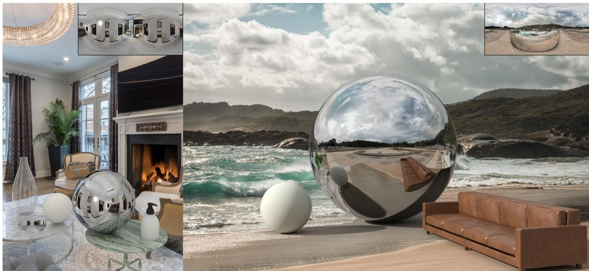
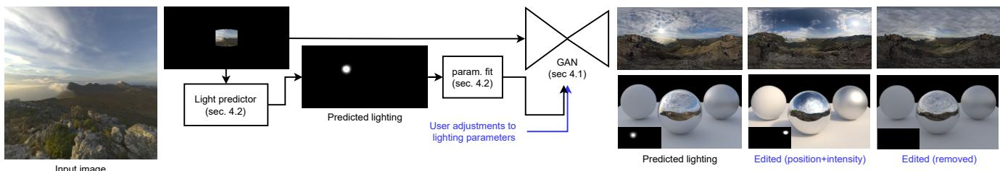
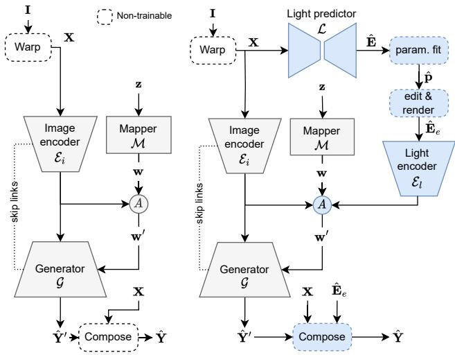
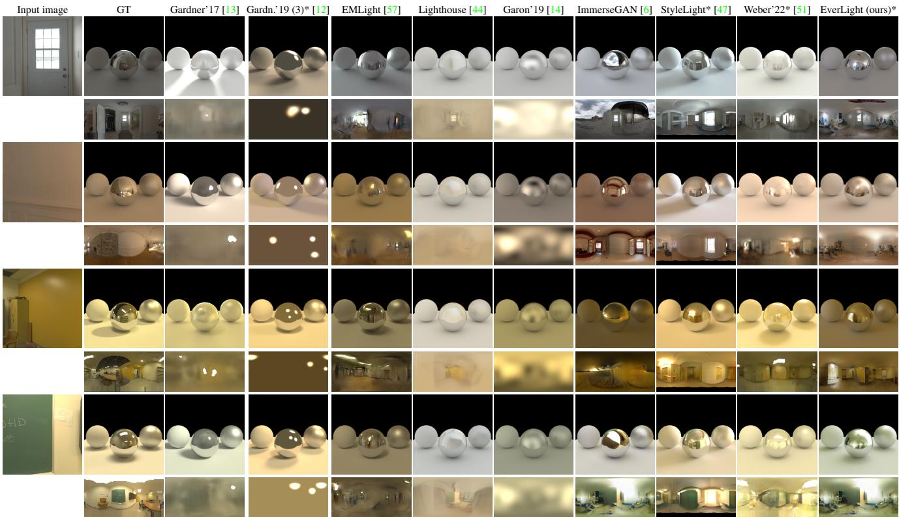
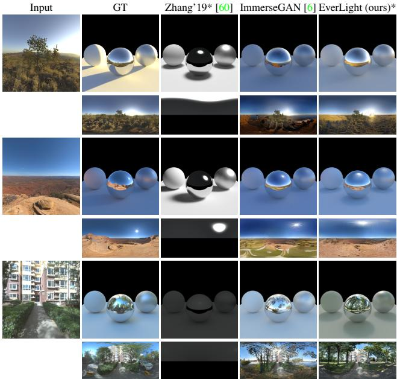
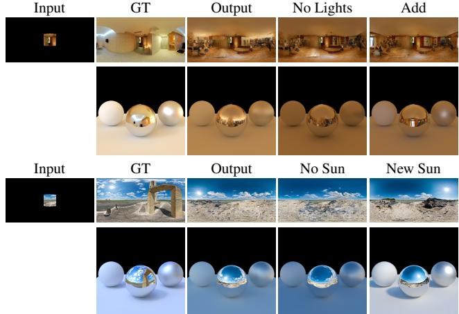
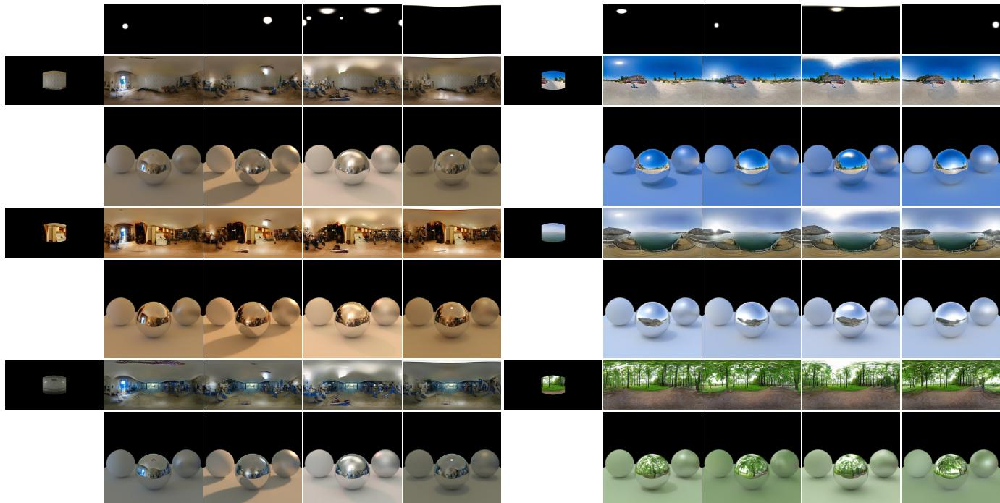
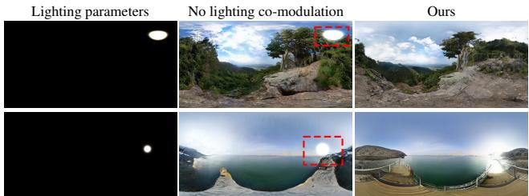

# EverLight: Indoor-Outdoor Editable HDR Lighting Estimation

Mohammad Reza Karimi Dastjerdi1\*, Jonathan Eisenmann2, Yannick Hold-Geoffroy2, Jean-Franc¸ois Lalonde1 1Universite Laval,´ 2Adobe

https://lvsn.github.io/everlight/

  
Figure 1. We present a method that produces an HDR 360◦ environment map (top right insets) from regular images (background) captured indoors (left) or outdoors (right) with any camera. Our method increases the realism of reflections in specular materials such as metals and plastics. Our approach simultaneously estimates the light sources in the environment beyond the camera frame and models them as HDR spherical gaussians, ready for use as HDRI in a renderer. This increases realism without user interaction when inserting virtual objects (left: vase, glasses, spheres, handbag, hand sanitizer, right table; right: spheres, sofa). Our parametric lighting representation makes it easy for users to add, remove, and edit lights in the environment, which will plausibly react to those edits.

## Abstract

Because of the diversity in lighting environments, existing illumination estimation techniques have been designed explicitly on indoor or outdoor environments. Methods have focused specifically on capturing accurate energy (e.g., through parametric lighting models), which emphasizes shading and strong cast shadows; or producing plausible texture (e.g., with GANs), which prioritizes plausible reflections. Approaches which provide editable lighting capabilities have been proposed, but these tend to be with simplified lighting models, offering limited realism. In this work, we propose to bridge the gap between these recent trends in the literature, and propose a method which combines a parametric light model with 360◦ panoramas, ready

to use as HDRI in rendering engines. We leverage recent advances in GAN-based LDR panorama extrapolationfrom a regular image, which we extend to HDR using parametric spherical gaussians. To achieve this, we introduce a novel lighting co-modulation method that injects lighting-related features throughout the generator, tightly coupling the original or edited scene illumination within the panorama generation process. In our representation, users can easily edit light direction, intensity, number, etc. to impact shading while providing rich, complex reflections while seamlessly blending with the edits. Furthermore, our method encompasses indoor and outdoor environments, demonstrating state-of-the-art results even when compared to domainspecific methods.

## 1. Introduction

The realistic blending of virtual assets in real imagery is required in many scenarios, ranging from special effects to augmented reality (AR) and advanced image editing. In this context, “getting the lighting right” is one of the key challenges. Image-based lighting [7] can be employed to solve this problem, but it requires physical access to the scene and specialized equipment. In an attempt to automate this process, techniques that learn to predict lighting directly from captured imagery have been proposed. While earlier approaches relied on engineered features [26], they have since been replaced by learning-based techniques [21, 13]. Driven by the popularity of on-device AR applications, this line of research has recently attracted much attention, and several trends have emerged in the literature.

Perhaps the most popular trend, naturally, has been to develop richer, more expressive lighting representations to improve the accuracy of lighting estimations. The seemingly most popular representation is environment maps (equirectangular images representing the entire field of view in 360◦) [13, 43, 29, 20, 42, 47], but others have been explored as well, including spatially-varying spherical harmonics [14], parametric light sources [21, 60, 12], dense spherical Gaussians in 2D [30] or 3D [50], sparse spherical gaussians [57, 55], sparse needlets [56], multi-scale volume of implicit features [44], and full neural light fields [49]. Recently, hybrid approaches combining environment maps and a single parametric light have also been proposed [51].

Another identifiable trend has been to create domainspecific approaches to design the representation and/or approach specifically for a target domain. The most common way of defining a domain has been to explicitly consider indoor (e.g., [13, 14, 30, 50]) vs outdoor (e.g., [26, 21, 60, 20, 64]) domains. Of note, Legendre et al. [29] proposed what is perhaps the only method in the literature that works for both indoor and outdoor scenes.

A third, more recent trend are user-editable methods, where the goal is to employ or design a lighting representation that can easily be understood and modified by a user. For example, parametric models [21, 60, 12] represent the dominant light sources using intuitive parameters (e.g., position, intensity, etc.) that can be interacted with easily, but fail to generate realistic reflections. Methods based on hybrid models [51] or GAN inversion [47] have demonstrated promising results, but are either limited to a single light source [51] or employ a slow optimization process [47].

In this paper, we present a single, coherent framework that unifies these three main trends. Our approach, dubbed EverLight, predicts a rich light representation in the form of a highly detailed 360◦ environment map; is domain-generic as it works on both indoor and outdoor scenes seamlessly; and is editable, as it estimates individual HDR light sources from the image which can synthesize both realistic shading and reflections (see fig. 1). EverLight is, to the best of our knowledge, the first editable HDR lighting estimation technique that works on both indoor and outdoor scenes seamlessly. Our work bridges the gap between HDR parametric lighting estimation and high-resolution field of view extrapolation by introducing a novel editable lighting comodulation technique, which combines the flexibility and intuitiveness of parametric lighting models with the generative power of GANs. Extensive experiments demonstrate that EverLight either compares favorably or outperforms indoor- and outdoor-specific approaches, both qualitatively and quantitatively.

## 2. Related work

Field of view extrapolation Several image-based techniques [9, 8, 3, 16] were proposed to extend images beyond their original frame by re-using their content. Since the inception of generative imaging [38, 22, 46], learningbased methods have delivered increasingly promising results for image inpainting and extrapolation tasks. Of note, CoModGAN [61], proposes to convert unconditional generators such as StyleGAN [23] to conditional models by comodulating both conditional inputs and the stochastic style representation throughout the generator. Karimi et al. [6] extended this architecture to 360◦ panorama extrapolation from regular field of view images. Similarly, Akimoto et al. [1] suggest performing panorama extrapolation using a two-stage GAN and a transformer-based architecture [2]. Kulkarni et al. [24] propose to use implicit radiance fields (NeRF [35]) coupled with a cross-domain embedding [37] to fill the occluded regions of the scene semantically.

Dynamic range extrapolation Cameras capture a limited dynamic range, resulting in saturated pixels when the radiance is outside this range. Over the years, methods have been developed [10, 11, 34, 32, 53] to recover the original values from those saturated pixels. Of note, Zhang and Lalonde [59] propose a method to extend the dynamic range for outdoor 360◦ panoramas, recovering the correct sun intensity according to the weather conditions.

Single image lighting estimation and modeling Illumi nation estimation was first approached for outdoor environments using explicit cues like detected shadows on the ground and shading on vertical walls [28, 27]. Later, deep learning methods were developed to replace these explicit cues, leveraging either parametric sky models [21, 60, 54] or non-parametric representations [29, 20, 64, 45].

Indoor lighting estimation has also received much attention in the literature, initially proposing to model the light as HDR panoramas or environment maps [13, 43, 42, 47]. This representation has the advantage of providing high-quality textures for reflections. Spherical harmonics [39, 33, 14, 62] and spherical gaussians [12, 30, 57, 55] are common alternatives. Lighting estimation has also been studied exhaustively as part of inverse rendering methods [4, 41, 40, 30, 50, 49, 31, 63]. The lighting representation of those methods is typically dense (either spatial or volumetric).

  
Figure 2. Overview of our proposed approach. Our method accepts as input a single image (left), and produces a parametric lighting representation. The image and predicted lighting are both fed to a GAN which generates a highly detailed, high dynamic range environment map (right, top), which can be used to render virtual scenes realistically (right, bottom). The lighting representation can be intuitively edited by a user to produce controllable relighting results, such as moving the sun around (right, middle), or removing it entirely (far right). The parametric lighting representation is shown as insets on the renders.

Editable lighting estimation All these aforementioned lighting representations, while more and more accurate, are typically intricate for users to edit. Notable exceptions are parametric models [21, 60, 12] that are intuitive but lack realism for reflections. Recently, Weber et al. [51] proposed to condition the texture generation with a single parametric light but are limited to indoor environments. Similarly, [47] can generate editable results, but rely on an expensive GAN inversion technique. In contrast, we propose an editable lighting estimation technique which generates high quality reflections, can handle more than one dominant light source, and requires a single forward pass in our network.

## 3. Background

## 3.1. Image formation

As in [42], we frame HDR lighting estimation as out-painting in a latitude-longitude (or equirectangular) panoramic representation. We warp the input image I to a 360◦ panorama $\mathbf { X } \in \mathbb { R } ^ { H \times W \times 3 }$ , where H and W are the panorama height and width respectively $( W \ : = \ : 2 H )$ , according to a simple pinhole camera model (with common assumptions: the principal point is the image center, negligible skew, unit pixel aspect ratio [18]). We also assume knowledge of the camera parameters (field of view and camera elevation and roll) as in [17, 1, 42, 6].

## 3.2. Style co-modulation

We base our approach on the style co-modulation framework of Zhao et al. [61], adapted to the case of $3 6 0 ^ { \circ }$ fov extrapolation by Karimi et al. [6], which we briefly summarize here for completeness and illustrate in fig. 3a. The input, partially observed panorama X is given as input to an image encoder $\mathcal { E } _ { i }$ , whose output is combined to that of the mapper M via an affine transform A:

$$
\mathbf { w } ^ { \prime } = A \left( \mathcal { E } _ { i } ( \mathbf { X } ) , \mathcal { M } ( \mathbf { z } ) \right) ,\tag{1}
$$

where $\mathbf { z } \ \sim \ \mathcal { N } ( 0 , \mathbf { I } )$ is a random noise vector, and $\mathbf { w } ^ { \prime }$ is the style vector modulating the generator G. The output of $\mathcal { E } _ { i } ( \mathbf { X } )$ is also provided as the input tensor to G. Finally, the known portion of the input panorama X is composited over the output of the synthesis network $\hat { \mathbf { Y } } ^ { \prime }$ to obtain the final result $\hat { \hat { \mathbf { Y } } }$ (we use the hat (ˆ) notation to denote an output of our method). This ensures both the observed image and the user-edited lights are preserved by the method.

## 4. Editable lighting co-modulation

## 4.1. Method overview

Fig. 2 presents a broad overview of our method for estimating a highly detailed, editable HDR lighting environment map from a single image. At the heart of our method is a novel editable lighting co-modulation mechanism, which is illustrated in greater detail in fig. 3b. A light prediction network L produces an HDR light environment map Eˆ $\in \mathbb { R } ^ { H \times W \times 3 }$ from the input partially-observed panorama X. The light map is then converted to a parametric lighting form pˆ, which can, optionally, be intuitively edited by a user to obtain $\hat { \mathbf { p } } _ { e }$ . It is then rendered back to a panorama $\hat { \mathbf { E } } _ { e } ~ \in ~ \mathbb { R } ^ { H \times W \times 3 }$ before being fed to a light encoder $\mathcal { E } _ { l }$ whose output is concatenated to the other vectors produced by the image encoder $\mathcal { E } _ { i }$ and mapper M before being given to the affine transform A. This modulates the style injection mechanism of the generator with information from the input image, the random style, and the lighting information, hence the entire style co-modulation process becomes

$$
\mathbf { w } ^ { \prime } = A \left( \mathcal { E } _ { i } ( \mathbf { X } ) , \mathcal { M } ( \mathbf { z } ) , \mathcal { E } _ { l } ( \hat { \mathbf { E } } _ { e } ) \right) .\tag{2}
$$

Finally, the (edited) light map $\hat { \mathbf { E } } _ { e }$ is also composited with $\hat { \mathbf { Y } } ^ { \prime }$ to produce the final result $\hat { \mathbf Y }$

  
(a) Co-modulation [61, 6]  
(b) Editable lighting co-modulation  
Figure 3. Overview of our proposed editable lighting comodulation method. The input image I is first warped according to its (known) camera parameters to a $3 6 0 ^ { \circ }$ panorama X via a (nontrainable) warp. (a) As proposed in [61, 6], an image encoder $\mathcal { E } _ { i }$ co-modulates (with the mapper M) the generator network $\mathcal { G }$ according to X. Here, A denotes a (learnable) affine transformation. (b) Our editable light co-modulation method first estimates an HDR light map Eˆ from the warped image X through a light predictor $\mathcal { L } .$ The light map is converted to a parametric model pˆ and can optionally be edited by a user to obtain $\hat { \mathbf { p } } _ { e }$ before being rerendered to an image Eˆ and injected in the style co-modulation mechanism via a light encoder $\mathcal { E } _ { l }$ . Our proposed novel components are highlighted in blue.

## 4.2. Lighting representation prediction

Parametric lighting representation p Similar to [12, 30], we model the dominant light sources in a scene as isotropic spherical gaussians. Given a set of K spherical gaussians, light intensity $L ( \omega )$ along (unit) direction vector $\omega \in \mathbb { S } ^ { 2 }$ is given by

$$
L ( \omega ; \{ \mathbf { c } _ { k } , \boldsymbol { \xi } _ { k } , \boldsymbol { \sigma } _ { k } \} _ { k = 1 } ^ { K } ) = \sum _ { k = 1 } ^ { K } \mathbf { c } _ { k } G ( \omega ; \boldsymbol { \xi } _ { k } , \boldsymbol { \sigma } _ { k } ) ,\tag{3}
$$

where $\begin{array} { r } { G ( \omega ; \xi , \sigma ) = \exp \left( - \frac { 1 } { \sigma ^ { 2 } } ( 1 - \omega \cdot \xi ) \right) } \end{array}$ . Here, $K$ denotes the number of individual light sources, $\mathbf { c } _ { k }$ the RGB intensity of each light source. $\xi _ { k } \in S ^ { 2 }$ and $\sigma _ { k } \in \mathbb { R } ^ { 1 }$ control the direction and bandwidth of each light source, respectively. Each light source is represented by three parameters $\mathbf { p } = \{ \mathbf { c } _ { k } , \xi _ { k } , \sigma _ { k } \}$ . This compact, parametric form of spherical gaussians makes them suitable for editing: users can easily understand and modify their parameters. After editing, the spherical gaussians are rendered to an image format $\hat { \mathbf { E } } _ { e }$ using eq. (3) before being given to the light encoder $\mathcal { E } _ { l }$

Light predictor L Directly predicting multiple parametric lights requires a complex 2-stage training procedure [12], which can be simplified if only a single dominant light is recovered [51]. Here, we instead train a network L to predict the light sources in an image format (akin to the first stage of [12] and [42]).

Spherical gaussian fitting To obtain the parameters p from both the predicted light map Eˆ and real panoramas E, we employ the following procedure. We first threshold the HDR values on which we compute their connected components. We initialize the gaussians position $\xi _ { k }$ and intensity at the center of mass and the maximum intensity of each connected component, respectively. We initialize all gaussian bandwidths with a fixed $\sigma = 0 . 4 5$ . We obtain the light parameters p by optimizing the L2 reconstruction error over every pixel of the panorama Ω as

$$
\hat { \mathbf { p } } = \underset { \mathbf { p } } { \arg \operatorname* { m i n } } \sum _ { \omega \in \Omega } \lambda _ { 1 } \left\| L ( \omega ; \mathbf { p } ) - \mathbf { E } ( \omega ) \right\| _ { 2 } ^ { 2 } + \ell _ { \mathrm { r e g } } ( \mathbf { p } ) ,\tag{4}
$$

where $\lambda _ { 1 }$ acts as a loss scaling factor and $\ell _ { \mathrm { r e g } } ( \mathbf { p } )$ is a regularizing term stabilizing the optimization over light vector length, intensity, bandwidth, and color (see supplementary for more details). We use non-maximal suppression to fuse overlapping lights during the optimization.

## 4.3. Data

To train our light predictor and generator, we employ a dataset consisting of $3 6 0 ^ { \circ }$ real captured panoramas purchased from 360cities1. We split our dataset into 239 064, 1000, and 1000 different panoramas for train, validation, and test purposes, respectively. We extend the dynamic range of the panoramas to HDR using the method of Zhang et al. [59] trained on the Laval indoor, outdoor, and sky HDR databases [25, 13, 20].

## 4.4. Implementation details

We implement our lighting co-modulation, light predictor, and spherical gaussian fitting algorithm using PyTorch [36]. We train our image encoder $\mathcal { E } _ { i } ,$ mapper $\mathcal { M } ,$ , light encoder $\mathcal { E } _ { l } .$ , and panorama generator $\mathcal { G }$ simultaneously using Adam with a learning rate of 0.002 for four days on eight A100 GPUs. We implement our light predictor with a UNet with fixup initialization [15, 58] for 12 hours on four A100 GPUs. The light predictor network contains five downsampling layers and one bottleneck layer. We use the cosine blurring filter of [13] and compute the losses in log domain to further stabilize the training of our light predictor. Our gaussian fitting algorithm optimizes the light parameters p using stochastic gradient descent without momentum and a learning rate of $5 \times 1 0 ^ { - 4 }$ . We leverage a learning rate reduction strategy that reduces it by two for every 20 epochs the loss did not improve. For its initialization, we first blur the panorama with a gaussian filter $\sigma = 3$ , then threshold it to its $9 8 . 5 ^ { \mathrm { t h } }$ percentile and use $\lambda _ { 1 } = { } ^ { 1 } / 5 0$

## 5. Experiments

We now evaluate our EverLight method against the recent state of the art. Because most previous methods are designed either for indoor or outdoor lighting, we separate the experiments accordingly. One notable exception is the work of Legendre et al. [29] which works across both domains— however, since neither code nor data are available we unfortunately could not include it in the evaluation.

## 5.1. Evaluation on indoor images

Quantitative comparison We first demonstrate that our model performs either on par or better than the state of the art on quantitative metrics evaluated on indoor images. For the evaluation protocol, we follow [51] and rely on the test set provided by [13]. For each of the 224 panoramas in the test split, we extract 10 LDR images using the same sampling distribution as in [13], for a total of 2,240 images for evaluation. Each image is given as input to a technique, and the resulting lighting representation is used to render a virtual scene composed of 9 diffuse spheres on a ground plane, seen from above (see [51]). The following metrics are then computed on the resulting renders: RMSE and its scale-invariant version (siRMSE) [4], RGB ang. [29], and PSNR. In addition, we also report the FID [19] computed directly on the lighting representation expressed in equirectangular format. To avoid overly favoring techniques trained and evaluated on the Laval Indoor HDR Dataset [13], we extend the evaluation from [51] and compute the FID against a test set of 1,093 unique indoor panoramas including the Laval Indoor HDR test set [13] (305), indoor panoramas extracted from [5] (192), and 360cities test set [6] (596).

We compare EverLight to the following methods. Two versions of [12] are compared: the original (3) where three light sources are estimated, and a version (1) trained to predict a single parametric light. We also compare to Lighthouse [44], which expects a stereo pair as input, but we generate a second image with a small baseline using [52] (visual inspection confirmed this yields results comparable to the published work). For [14], we select the coordinates of the image center for the object position. For [42], we implemented their proposed “Cluster ID loss”, and tonemapping but used pix2pixHD [48] as backbone. We compare against EMLight [57] and StyleLight [47] with the provided code. Finally, we also include [51], and the recent work of [6] as a state-of-the-art (LDR) field of view extrapolation method.

Tab. 1 shows the quantitative comparison results on indoor scenes. Our method achieves a strong balance between rendering scores (left) and FID (right). Notably, its FID is only slightly above (78.90 vs 65.98) that of ImmerseGAN [6], which shows that adding the controllable spherical gaussian lighting on the generated panoramas does not significantly affect their realism. While our results are on par with StyleLight [47], our feed-forward method does not require any time-consuming GAN inversion process, which takes around 0.07 seconds on a GeForce RTX 2070 GPU (versus 58 seconds for StyleLight [47]). Furthermore, the next best methods have much higher FID: Weber’22 [51] with 130.13, and EMLight [57] with 135.97.

Table 1. Quantitative comparative metrics for indoor images. The metrics si-RMSE, RMSE, RGB ang., and PSNR (left) are computed on (tonemapped) renderings of a diffuse scene, and FID (right) on the estimated environment maps directly. Each row is color-coded as best and second best . We also highlight the methods which produce lighting representations that can be interpreted and edited by a user (“Edit.”).
<table><tr><td rowspan=1 colspan=5>si-RMSE RMSE↓ RGB ang.↓PSNR↑</td><td rowspan=1 colspan=1>FID↓</td><td rowspan=1 colspan=1>Edit.</td></tr><tr><td rowspan=1 colspan=1>EverLight (ours)</td><td rowspan=1 colspan=1>0.091</td><td rowspan=1 colspan=1>0.238</td><td rowspan=1 colspan=1> $6 . 3 6 ^ { \circ }$ </td><td rowspan=1 colspan=1>10.03</td><td rowspan=1 colspan=1>78.90</td><td rowspan=1 colspan=1>yes</td></tr><tr><td rowspan=1 colspan=1>StyleLight [47]</td><td rowspan=1 colspan=1>0.123</td><td rowspan=1 colspan=1>0.316</td><td rowspan=1 colspan=1> $7 . 0 9 ^ { \circ }$ </td><td rowspan=1 colspan=1>12.35</td><td rowspan=1 colspan=1>78.55</td><td rowspan=1 colspan=1>yes</td></tr><tr><td rowspan=1 colspan=1>Weber’22 [51]</td><td rowspan=1 colspan=1>0.079</td><td rowspan=1 colspan=1>0.196</td><td rowspan=1 colspan=1> $4 . 0 8 ^ { \circ }$ </td><td rowspan=1 colspan=1>12.95</td><td rowspan=1 colspan=1>130.13</td><td rowspan=1 colspan=1>yes</td></tr><tr><td rowspan=1 colspan=1>Gardner&#x27;19 (1) [12]</td><td rowspan=1 colspan=1>0.099</td><td rowspan=1 colspan=1>0.229</td><td rowspan=1 colspan=1> $4 . 4 2 ^ { \circ }$ </td><td rowspan=1 colspan=1>12.21</td><td rowspan=1 colspan=1>410.12</td><td rowspan=1 colspan=1>yes</td></tr><tr><td rowspan=1 colspan=1>Gardner&#x27;19 (3) [12]</td><td rowspan=1 colspan=1>0.105</td><td rowspan=1 colspan=1>0.507</td><td rowspan=1 colspan=1> $4 . 5 9 ^ { \circ }$ </td><td rowspan=1 colspan=1>10.903</td><td rowspan=1 colspan=1>86.43</td><td rowspan=1 colspan=1>yes</td></tr><tr><td rowspan=1 colspan=1>Gardner&#x27;17 [13]</td><td rowspan=1 colspan=1>0.123</td><td rowspan=1 colspan=1>0.628</td><td rowspan=1 colspan=1> $8 . 2 9 ^ { \circ }$ </td><td rowspan=1 colspan=1>10.22</td><td rowspan=1 colspan=1>253.40</td><td rowspan=1 colspan=1>no</td></tr><tr><td rowspan=1 colspan=1>Garon&#x27;19 [14]</td><td rowspan=1 colspan=1>0.096</td><td rowspan=1 colspan=1>0.255</td><td rowspan=1 colspan=1> $8 . 0 6 ^ { \circ }$ </td><td rowspan=1 colspan=1>9.73</td><td rowspan=1 colspan=1>324.51</td><td rowspan=1 colspan=1>no</td></tr><tr><td rowspan=1 colspan=1>Lighthouse [44]</td><td rowspan=1 colspan=1>0.121</td><td rowspan=1 colspan=1>0.254</td><td rowspan=1 colspan=1> $4 . 5 6 ^ { \circ }$ </td><td rowspan=1 colspan=1>9.81</td><td rowspan=1 colspan=1>174.52</td><td rowspan=1 colspan=1>no</td></tr><tr><td rowspan=1 colspan=1>EMLight [57]</td><td rowspan=1 colspan=1>0.099</td><td rowspan=1 colspan=1>0.232</td><td rowspan=1 colspan=1> $3 . 9 9 ^ { \circ }$ </td><td rowspan=1 colspan=1>10.341</td><td rowspan=1 colspan=1>35.97</td><td rowspan=1 colspan=1>no</td></tr><tr><td rowspan=1 colspan=1>EnvmapNet† [42]</td><td rowspan=1 colspan=1>0.097</td><td rowspan=1 colspan=1>0.286</td><td rowspan=1 colspan=1> $7 . 6 7 ^ { \circ }$ </td><td rowspan=1 colspan=1>11.742</td><td rowspan=1 colspan=1>21.85</td><td rowspan=1 colspan=1>no</td></tr><tr><td rowspan=1 colspan=1>ImmerseGAN [6]</td><td rowspan=1 colspan=1>0.094</td><td rowspan=1 colspan=1>0.226</td><td rowspan=1 colspan=1> $8 . 6 1 ^ { \circ }$ </td><td rowspan=1 colspan=1>10.72</td><td rowspan=1 colspan=1>65.98</td><td rowspan=1 colspan=1>no</td></tr></table>

† Only their proposed ClusterID loss and tonemapping.

Qualitative evaluation We present qualitative results in fig. 4, where a virtual scene rendered with the corresponding lighting predictions for each technique are shown. To best illustrate the impact of HDR lighting (shading, shadows) and reflections, we render a scene composed of 3 spheres with varying reflectance properties (diffuse, mirror, glossy) on a flat diffuse ground plane. In addition, a tonemapped equirectangular view of the estimated light representation is provided under each render. While ImmerseGAN [6] yields highly realistic reflections, all renders obtained with this method are devoid of contrast, strong shading, and shadows since its output is LDR. The quality of the shading and shadows obtained with EverLight is qualitatively similar to those of StyleLight [47] and Weber’22 [51], despite these techniques being trained solely for indoor images, on the Laval Indoor HDR dataset.

## 5.2. Evaluation on outdoor images

We now evaluate on outdoor environments. Note that our method has not changed: the exact same EverLight model works interchangeably on indoor and outdoor images.

Quantitative evaluation Here, we rely on the outdoor panoramas from the [5] dataset, which contains 839 unique outdoor panoramas. For each panorama in this set, we extract three LDR images with the azimuth of $\quad h _ { \theta } \in$ {0, 120, 240}◦, for a total of 2,517 images for evaluation. As in sec. 5.1, each image is given as input to a technique, and the resulting lighting representation is used to render the same virtual scene. The same metrics are reported as well, except that the FID is computed on the outdoor test set described above. This time, we compare against the work of Zhang et al. [60], who proposed a method for predicting the parameters of an outdoor sun+sky lighting model [27]. We also include ImmerseGAN [6] as it was trained to extrapolate the field of view of outdoor images as well. Tab. 2 reports the quantitative comparison results on outdoor scenes. Here, our method vastly outperforms the previous outdoorspecific technique of Zhang’19 [60] on all metrics.

  
Figure 4. Qualitative rendering results for indoor scenes. We compare against the recent literature on single image lighting estimation, from left to right: Gardner et al. 2017 [13], Gardner et al. 2019 (with 3 parametric lights) [12], EMLight [57], Lighthouse [44], Garon et al. 2019 [14], ImmerseGAN [6], StyleLight [47], and Weber et al. 2022 [51]. Our results are shown in the last column. All methods with editable lighting capabilities are indicated with \*. From a given input crop (left), we show a render of a scene composed of three spheres (diffuse, mirror, glossy) on a diffuse ground plane (first row), and the corresponding estimated lighting (in equirectangular format) below.

Qualitative evaluation Corresponding qualitative results are presented in fig. 5, where a virtual scene rendered with the corresponding lighting predictions for each technique are shown. While the lighting representation employed by [60] is able to produce very strong shadows, the predicted lighting always results in almost-constant gray skies, which results in somewhat neutral renderings. ImmerseGAN [6], on the other hand, creates much more lively renderings, which however lack shadows and shading. Our method bridges these two works and offers results which combine the best of both worlds: realistic reflections with more pronounced shading and cast shadows.

Table 2. Quantitative comparative metrics for outdoor images. The metrics si-RMSE, RMSE, RGB ang., and PSNR (left) are computed on (tonemapped) renderings of a diffuse scene, and FID (right) on the estimated environment maps directly. Each row is color-coded as best and second best . We also highlight the methods which produce lighting representations that can be interpreted and edited by a user (“Edit.”).
<table><tr><td rowspan=1 colspan=4>si-RMSERMSERGB ang.↓PSNR↑</td><td rowspan=1 colspan=1>FID↓</td><td rowspan=1 colspan=1>Edit.</td></tr><tr><td rowspan=1 colspan=1>EverLight (ours) 0.163</td><td rowspan=1 colspan=1>0.469</td><td rowspan=1 colspan=1>8.53°</td><td rowspan=1 colspan=1>10.03</td><td rowspan=1 colspan=1>38.44</td><td rowspan=1 colspan=1>yes</td></tr><tr><td rowspan=2 colspan=1>Zhang&#x27;19 [60]   0.225ImmerseGAN [6] 0.174</td><td rowspan=1 colspan=1>1.058</td><td rowspan=1 colspan=1>11.80°</td><td rowspan=1 colspan=1>5.314</td><td rowspan=1 colspan=1>49.49</td><td rowspan=1 colspan=1>yes</td></tr><tr><td rowspan=1 colspan=1>0.332</td><td rowspan=1 colspan=1>9.26°</td><td rowspan=1 colspan=1>11.02</td><td rowspan=1 colspan=1>37.05</td><td rowspan=1 colspan=1>no</td></tr></table>

## 5.3. Editing the estimated lighting

Because our approach estimates a set of parametric light sources as spherical gaussians (c.f. sec. 4.2), a user can intuitively edit their properties before generating the panorama with the generator. We demonstrate editing capability by showing combinations of input images and desired lighting in fig. 7. In all cases, the desired spherical gaussians are realistically blended with the generated panoramas, sometimes even creating compelling interactions such as reflections on the ground or the sea. We demonstrate additional editing capabilities such as removing and/or adding light sources in fig. 6. Compared to StyleLight [47], our method requires a single forward pass in the network as opposed to a computationally expensive GAN inversion step. More importantly, our method works equally well for indoor and outdoor images, as shown in both figs. 6 and 7.

  
Figure 5. Qualitative rendering results for outdoor scenes. We compare against, from left to right: Zhang et al. 2019 [60], and ImmerseGAN [6]. Our results are shown in the last column. All methods with editable lighting capabilities are indicated with \*. From a given input crop (left), we show a render of a scene composed of three spheres (diffuse, mirror, glossy) on a diffuse ground plane (first row), and the corresponding estimated lighting (in equirectangular format) below.

## 5.4. Ablation studies

To evaluate the impact of our proposed lighting comodulation, we perform an ablation study by removing the lighting encoder (El in fig. 3) and compositing the estimated lighting directly to the generator output. In tab. 3, we report the FID computed on the same test sets as in secs. 5.1 and 5.2. While removing the lighting co-modulation does not have a noticeable impact for indoor images, in the outdoor case it prevents the generator from realistically blending the lighting parameters with its surroundings, as illustrated qualitatively in fig. 8. Note that we do not perform an ablation on the style co-modulation process from the mapper M (fig. 3) since [6] show using a feed-forward GAN without co-modulation [48] leads to mode-collapse-like visual artifacts.

  
Figure 6. Qualitative light editing results. For each group of results (top: indoor, bottom: outdoor), we show the input (image projected on equirectangular representation), ground truth, automatic estimate (“output”), removing the lights, and adding other lights. The first row shows the environment map, and second row the corresponding rendering.

Table 3. Quantitative comparison between our proposed method with and without lighting co-modulation process in terms of FID.
<table><tr><td rowspan="2"></td><td colspan="2">FID↓</td></tr><tr><td>outdoor</td><td>indoor</td></tr><tr><td>Ours</td><td>38.44</td><td>78.90</td></tr><tr><td>No lighting co-modulation</td><td>50.29</td><td>79.47</td></tr></table>

## 6. Discussion

We propose a method for estimating lighting from both indoor and outdoor environments as editable HDR 360◦ panoramas from regular images. Doing so effectively bridges the gap in currently available methods in the lit erature, where most methods are specifically designed for either indoors or outdoors, offer limited editing capabilities, or employ simplified, strictly parametric lighting models. Our approach enables easy user editing of several key lighting parameters, including adding and removing lights, and editing their intensity, color, and direction, while simultaneously providing high-quality texture within the HDR panorama to bring reflections to life when performing virtual object insertion. Notwithstanding being generic to inand outdoor environments, our method remains quantitatively competitive with domain-specific techniques. We are hopeful our ideas help reconcile the current schism in indoor and outdoor lighting estimation in the literature.

Despite providing either state-of-the-art or competitive results on several aspects of lighting and panorama texture generation, our method bears some limitations that we are hopeful future work will lift. First, the choice of spherical gaussians for HDR light sources is a trade-off modeling adequately the majority of light sources present in scenes in-the-wild. However, it does not visually represent many light sources like window panes, or accurately model very bright sources like the sun [27]. Second, while the part of our lighting representation that influences shading is flexible and editable, the panorama texture is currently not editable. We believe that integrating a guiding system for the generator, such as in [6], would bring back editability to the texture part of our representation. Lastly, our light predictor L is trained on proxy ground-truth data predicted by a network, leading to limited accuracy in light position and intensity. Capturing a large-scale dataset of real ground-truth HDR environments would likely help improve the accuracy.

  
Figure 7. Qualitative light editing results. Each group of results (left: indoor, right: outdoor) show, on the first column: 3 different input images projected in equirectangular representation; and on the first row: 4 different lighting configurations. The $3 \times 4$ image matrix correspond to the environment map predicted by EverLight for each input/lighting combination. Note how the network learned to realistically blend the bright light sources with their environments. For example, the virtual light sources create reflections on the ground (top) and water (below).

  
Figure 8. Ablation study on the effect of our proposed lighting co-modulation. Using the lighting co-modulation helps blending realistically the lighting parameters into the surrounding.

Acknowledgements The name of this paper EverLight is a homage to the Critical Role’s The Legend ofVox Machina. This work was partially supported by NSERC grant ALLRP 557208-20. We thank Sai Bi for his help with extending the dynamic range of the panoramas and everyone at UL who helped with proofreading.

## References

[1] Naofumi Akimoto, Seito Kasai, Masaki Hayashi, and Yoshimitsu Aoki. 360-degree image completion by twostage conditional GANs. In ICIP, 2019. 2, 3

[2] Naofumi Akimoto, Yuhi Matsuo, and Yoshimitsu Aoki. Diverse plausible 360-degree image outpainting for efficient 3dcg background creation. In CVPR, 2022. 2

[3] Connelly Barnes, Eli Shechtman, Adam Finkelstein, and Dan B Goldman. Patchmatch: A randomized correspondence algorithm for structural image editing. ACM TOG, 28(3):24, 2009. 2

[4] Jonathan T Barron and Jitendra Malik. Shape, illumination, and reflectance from shading. IEEE TPAMI, 37(8):1670– 1687, 2014. 3, 5

[5] Dachuan Cheng, Jian Shi, Yanyun Chen, Xiaoming Deng, and Xiaopeng. Zhang. Learning scene illumination by pair-

wise photos from rear and front mobile cameras. Computer Graphics Forum, 37(7):213–221, 2018. 5

[6] Mohammad Reza Karimi Dastjerdi, Yannick Hold-Geoffroy, Jonathan Eisenman, Siavash Khodadadeh, and Jean-Franc¸ois Lalonde. Guided co-modulated GAN for 360◦ field of view extrapolation. In 3DV, 2022. 2, 3, 4, 5, 6, 7, 8

[7] Paul Debevec. Rendering synthetic objects into real scenes: Bridging traditional and image-based graphics with global illumination and high dynamic range photography. In Proceedings of the 25th Annual Conference on Computer Graphics and Interactive Techniques, SIGGRAPH, pages 189–198, 1998. 2

[8] Alexei A Efros and William T Freeman. Image quilting for texture synthesis and transfer. In Proceedings ofthe 28th annual conference on Computer graphics and interactive techniques, pages 341–346, 2001. 2

[9] Alexei A Efros and Thomas K Leung. Texture synthesis by non-parametric sampling. In ICCV, volume 2, pages 1033– 1038. IEEE, 1999. 2

[10] Gabriel Eilertsen, Joel Kronander, Gyorgy Denes, Rafał K Mantiuk, and Jonas Unger. Hdr image reconstruction from a single exposure using deep cnns. ACM TOG, 36(6):1–15, 2017. 2

[11] Yuki Endo, Yoshihiro Kanamori, and Jun Mitani. Deep reverse tone mapping. ACM TOG, 36(6):177–1, 2017. 2

[12] Marc-Andre Gardner, Yannick Hold-Geoffroy, Kalyan´ Sunkavalli, Christian Gagne, and Jean-Franc¸ois Lalonde.´ Deep parametric indoor lighting estimation. In ICCV, 2019. 2, 3, 4, 5, 6

[13] Marc-Andre Gardner, Kalyan Sunkavalli, Ersin Yumer, Xi-´ aohui Shen, Emiliano Gambaretto, Christian Gagne, and´ Jean-Franc¸ois Lalonde. Learning to predict indoor illumination from a single image. ACM TOG, 9(4), 2017. 2, 4, 5, 6

[14] Mathieu Garon, Kalyan Sunkavalli, Sunil Hadap, Nathan Carr, and Jean-Franc¸ois Lalonde. Fast spatially-varying indoor lighting estimation. In CVPR, 2019. 2, 3, 5, 6

[15] David Griffiths, Tobias Ritschel, and Julien Philip. OutCast: Outdoor single-image relighting with cast shadows. Computer Graphics Forum, 41(2):179–193, 2022. 4

[16] Christine Guillemot and Olivier Le Meur. Image inpainting: Overview and recent advances. IEEE signal processing magazine, 31(1):127–144, 2013. 2

[17] Takayuki Hara, Yusuke Mukuta, and Tatsuya Harada. Spherical image generation from a single image by considering scene symmetry. In AAAI, 2021. 3

[18] R. I. Hartley and A. Zisserman. Multiple View Geometry in Computer Vision. Cambridge University Press, second edition, 2004. 3

[19] Martin Heusel, Hubert Ramsauer, Thomas Unterthiner, Bernhard Nessler, and Sepp Hochreiter. Gans trained by a two time-scale update rule converge to a local nash equilibrium. In NeurIPS, 2017. 5

[20] Yannick Hold-Geoffroy, Akshaya Athawale, and Jean-Franc¸ois Lalonde. Deep sky modeling for single image outdoor lighting estimation. In CVPR, 2019. 2, 4

[21] Yannick Hold-Geoffroy, Kalyan Sunkavalli, Sunil Hadap, Emiliano Gambaretto, and Jean-Franc¸ois Lalonde. Deep outdoor illumination estimation. In CVPR, 2017. 2, 3

[22] Phillip Isola, Jun-Yan Zhu, Tinghui Zhou, and Alexei A Efros. Image-to-image translation with conditional adversarial networks. In CVPR, 2017. 2

[23] Tero Karras, Samuli Laine, and Timo Aila. A style-based generator architecture for generative adversarial networks. In CVPR, 2019. 2

[24] Shreyas Kulkarni, Peng Yin, and Sebastian Scherer. 360fusionnerf: Panoramic neural radiance fields with joint guidance. arXiv preprint arXiv:2209.14265, 2022. 2

[25] Jean-Franc¸ois Lalonde, Louis-Philippe Asselin, Julien Becirovski, Yannick Hold-Geoffroy, Mathieu Garon, Marc-Andre Gardner, and Jinsong Zhang. The Laval HDR sky´ database, 2016. 4

[26] Jean-Franc¸ois Lalonde, Alexei A Efros, and Srinivasa G Narasimhan. Estimating the natural illumination conditions from a single outdoor image. IJCV, 98(2):123–145, 2012. 2

[27] Jean-Franc¸ois Lalonde and Iain Matthews. Lighting estimation in outdoor image collections. In 3DV, 2014. 2, 6, 8

[28] Jean-Franc¸ois Lalonde, Srinivasa G Narasimhan, and Alexei A Efros. What do the sun and the sky tell us about the camera? IJCV, 88:24–51, 2010. 2

[29] Chloe LeGendre, Wan-Chun Ma, Graham Fyffe, John Flynn, Laurent Charbonnel, Jay Busch, and Paul Debevec. Deeplight: Learning illumination for unconstrained mobile mixed reality. In CVPR, 2019. 2, 5

[30] Zhengqin Li, Mohammad Shafiei, Ravi Ramamoorthi, Kalyan Sunkavalli, and Manmohan Chandraker. Inverse rendering for complex indoor scenes: Shape, spatially-varying lighting and SVBRDF from a single image. In CVPR, 2020. 2, 3, 4

[31] Zhengqin Li, Jia Shi, Sai Bi, Rui Zhu, Kalyan Sunkavalli, Milos Haˇ san, Zexiang Xu, Ravi Ramamoorthi, and Manmo-ˇ han Chandraker. Physically-based editing of indoor scene lighting from a single image. In ECCV, 2022. 3

[32] Yu-Lun Liu, Wei-Sheng Lai, Yu-Sheng Chen, Yi-Lung Kao, Ming-Hsuan Yang, Yung-Yu Chuang, and Jia-Bin Huang. Single-image hdr reconstruction by learning to reverse the camera pipeline. In CVPR, 2020. 2

[33] David Mandl, Kwang Moo Yi, Peter Mohr, Peter M Roth, Pascal Fua, Vincent Lepetit, Dieter Schmalstieg, and Denis Kalkofen. Learning lightprobes for mixed reality illumination. In IEEE Int. Symp. Mixed Aug. Reality. IEEE, 2017. 3

[34] Demetris Marnerides, Thomas Bashford-Rogers, Jonathan Hatchett, and Kurt Debattista. Expandnet: A deep convolutional neural network for high dynamic range expansion from low dynamic range content. Computer Graphics Forum, 37(2):37–49, 2018. 2

[35] Ben Mildenhall, Pratul P. Srinivasan, Matthew Tancik, Jonathan T. Barron, Ravi Ramamoorthi, and Ren Ng. Nerf: Representing scenes as neural radiance fields for view synthesis. In ECCV, 2020. 2

[36] Adam Paszke, Sam Gross, Francisco Massa, Adam Lerer, James Bradbury, Gregory Chanan, Trevor Killeen, Zeming Lin, Natalia Gimelshein, Luca Antiga, et al. Pytorch:

An imperative style, high-performance deep learning library. NeurIPS, 2019. 4

[37] Alec Radford, Jong Wook Kim, Chris Hallacy, Aditya Ramesh, Gabriel Goh, Sandhini Agarwal, Girish Sastry, Amanda Askell, Pamela Mishkin, Jack Clark, et al. Learning transferable visual models from natural language supervision. In ICML, 2021. 2

[38] Alec Radford, Luke Metz, and Soumith Chintala. Unsupervised representation learning with deep convolutional generative adversarial networks. arXiv preprint arXiv:1511.06434, 2015. 2

[39] Ravi Ramamoorthi and Pat Hanrahan. An efficient representation for irradiance environment maps. In Proceedings of the 28th annual conference on Computer graphics and interactive techniques, pages 497–500, 2001. 3

[40] Soumyadip Sengupta, Jinwei Gu, Kihwan Kim, Guilin Liu, David W Jacobs, and Jan Kautz. Neural inverse rendering of an indoor scene from a single image. In ICCV, 2019. 3

[41] Zhixin Shu, Ersin Yumer, Sunil Hadap, Kalyan Sunkavalli, Eli Shechtman, and Dimitris Samaras. Neural face editing with intrinsic image disentangling. In CVPR, 2017. 3

[42] Gowri Somanath and Daniel Kurz. HDR environment map estimation for real-time augmented reality. In CVPR, 2021. 2, 3, 4, 5

[43] Shuran Song and Thomas Funkhouser. Neural illumination: Lighting prediction for indoor environments. In CVPR, 2019. 2

[44] Pratul P Srinivasan, Ben Mildenhall, Matthew Tancik, Jonathan T Barron, Richard Tucker, and Noah Snavely. Lighthouse: Predicting lighting volumes for spatiallycoherent illumination. In CVPR, 2020. 2, 5, 6

[45] Jiajun Tang, Yongjie Zhu, Haoyu Wang, Jun Hoong Chan, Si Li, and Boxin Shi. Estimating spatially-varying lighting in urban scenes with disentangled representation. In ECCV, 2022. 2

[46] Ayush Tewari, Ohad Fried, Justus Thies, Vincent Sitzmann, Stephen Lombardi, Kalyan Sunkavalli, Ricardo Martin-Brualla, Tomas Simon, Jason Saragih, Matthias Nießner, et al. State of the art on neural rendering. Computer Graphics Forum, 39(2):701–727, 2020. 2

[47] Guangcong Wang, Yinuo Yang, Chen Change Loy, and Ziwei Liu. Stylelight: HDR panorama generation for lighting estimation and editing. In ECCV, 2022. 2, 3, 5, 6, 7

[48] Ting-Chun Wang, Ming-Yu Liu, Jun-Yan Zhu, Andrew Tao, Jan Kautz, and Bryan Catanzaro. High-resolution image synthesis and semantic manipulation with conditional GANs. In CVPR, 2018. 5, 7

[49] Zian Wang, Wenzheng Chen, David Acuna, Jan Kautz, and Sanja Fidler. Neural light field estimation for street scenes with differentiable virtual object insertion. In ECCV, 2022. 2, 3

[50] Zian Wang, Jonah Philion, Sanja Fidler, and Jan Kautz. Learning indoor inverse rendering with 3D spatially-varying lighting. In ICCV, 2021. 2, 3

[51] Henrique Weber, Mathieu Garon, and Jean-Franc¸ois Lalonde. Editable indoor lighting estimation. In ECCV, 2022. 2, 3, 4, 5, 6

[52] Olivia Wiles, Georgia Gkioxari, Richard Szeliski, and Justin Johnson. Synsin: End-to-end view synthesis from a single image. In CVPR, 2020. 5

[53] Hanning Yu, Wentao Liu, Chengjiang Long, Bo Dong, Qin Zou, and Chunxia Xiao. Luminance attentive networks for hdr image and panorama reconstruction. Computer Graphics Forum, 40(7):181–192, 2021. 2

[54] Piaopiao Yu, Jie Guo, Fan Huang, Cheng Zhou, Hongwei Che, Xiao Ling, and Yanwen Guo. Hierarchical disentangled representation learning for outdoor illumination estimation and editing. In ICCV, 2021. 2

[55] Fangneng Zhan, Yingchen Yu, Rongliang Wu, Changgong Zhang, Shijian Lu, Ling Shao, Feiying Ma, and Xuansong Xie. Gmlight: Lighting estimation via geometric distribution approximation. IEEE TIP, 2022. 2, 3

[56] Fangneng Zhan, Changgong Zhang, Wenbo Hu, Shijian Lu, Feiying Ma, Xuansong Xie, and Ling Shao. Sparse needlets for lighting estimation with spherical transport loss. In ICCV, 2021. 2

[57] Fangneng Zhan, Changgong Zhang, Yingchen Yu, Yuan Chang, Shijian Lu, Feiying Ma, and Xuansong Xie. EM-Light: Lighting Estimation via Spherical Distribution Approximation. In AAAI, 2021. 2, 3, 5, 6

[58] Hongyi Zhang, Yann N Dauphin, and Tengyu Ma. Fixup initialization: Residual learning without normalization. In ICLR, 2019. 4

[59] Jinsong Zhang and Jean-Franc¸ois Lalonde. Learning high dynamic range from outdoor panoramas. In ICCV, 2017. 2, 4

[60] Jinsong Zhang, Kalyan Sunkavalli, Yannick Hold-Geoffroy, Sunil Hadap, Jonathan Eisenman, and Jean-Franc¸ois Lalonde. All-weather deep outdoor lighting estimation. In CVPR, 2019. 2, 3, 6, 7

[61] Shengyu Zhao, Jonathan Cui, Yilun Sheng, Yue Dong, Xiao Liang, Eric I Chang, and Yan Xu. Large scale image completion via co-modulated generative adversarial networks. In ICLR, 2021. 2, 3, 4

[62] Yiqin Zhao and Tian Guo. Pointar: Efficient lighting estimation for mobile augmented reality. In ECCV, 2020. 3

[63] Rui Zhu, Zhengqin Li, Janarbek Matai, Fatih Porikli, and Manmohan Chandraker. Irisformer: Dense vision transformers for single-image inverse rendering in indoor scenes. In CVPR, 2022. 3

[64] Yongjie Zhu, Yinda Zhang, Si Li, and Boxin Shi. Spatiallyvarying outdoor lighting estimation from intrinsics. In CVPR, 2021. 2