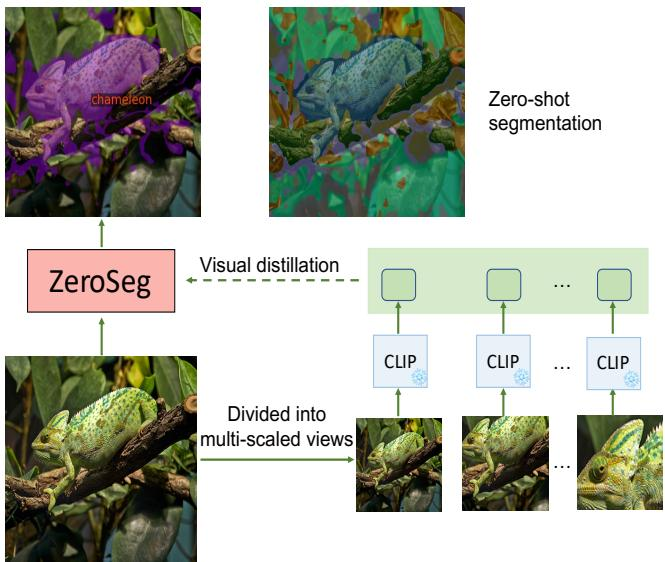
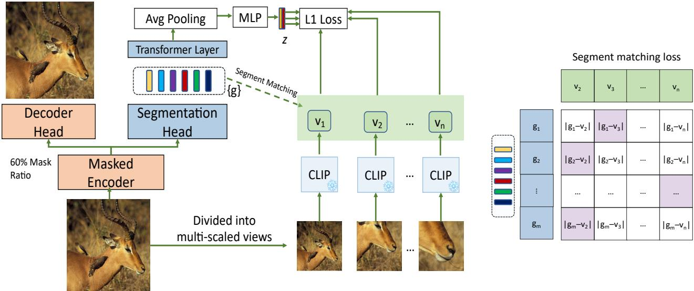
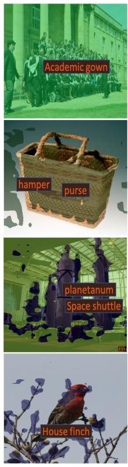
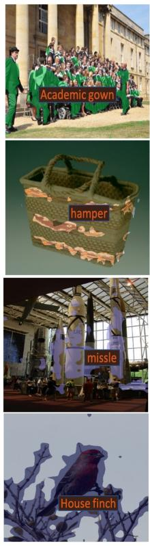
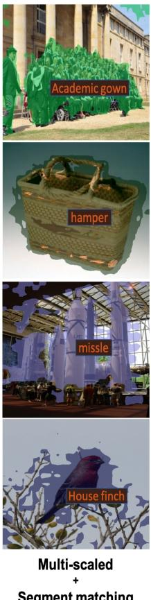
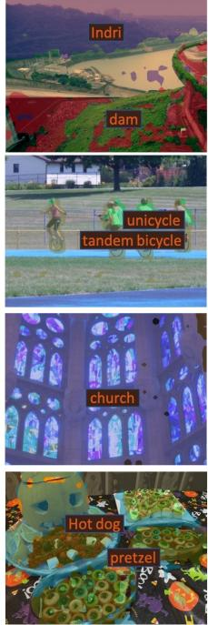
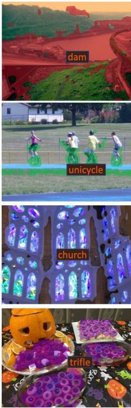
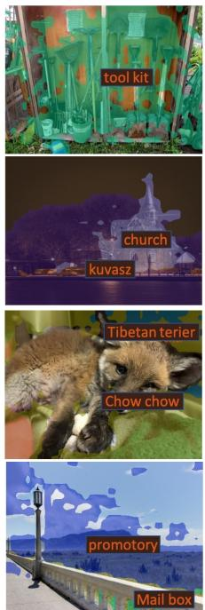
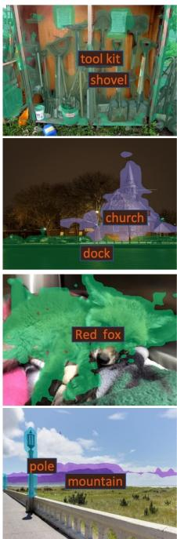

# Exploring Open-Vocabulary Semantic Segmentation from CLIP Vision Encoder Distillation Only

Jun Chen1,2 \* Deyao Zhu1 Guocheng Qian1 Bernard Ghanem1 Zhicheng Yan2 Chenchen Zhu2 Fanyi Xiao2 Sean Chang Culatana2† Mohamed Elhoseiny1†

1King Abdullah University of Science and Technology (KAUST) 2Meta AI Research

## Abstract

Semantic segmentation is a crucial task in computer vision that involves segmenting images into semantically meaningful regions at the pixel level. However, existing approaches often rely on expensive human annotations as supervision for model training, limiting their scalability to large, unlabeled datasets. To address this challenge, we present ZeroSeg, a novel method that leverages the existing pretrained vision-language (VL) model (e.g. CLIP vision encoder [39]) to train open-vocabulary zero-shot semantic segmentation models. Although acquired extensive knowledge of visual concepts, it is non-trivial to exploit knowledge from these VL models to the task of semantic segmentation, as they are usually trained at an image level. ZeroSeg overcomes this by distilling the visual concepts learned by VL models into a set of segment tokens, each summarizing a localized region of the target image. We evaluate ZeroSeg on multiple popular segmentation benchmarks, including PASCAL VOC 2012, PASCAL Context, and COCO, in a zero-shot manner Our approach achieves state-of-the-art performance when compared to other zero-shot segmentation methods under the same training data, while also performing competitively compared to strongly supervised methods. Finally, we also demonstrated the effectiveness of ZeroSeg on open-vocabulary segmentation, through both human studies and qualitative visualizations. The code is publicly available at https: //github.com/facebookresearch/ZeroSeg

## 1. Introduction

Semantic segmentation involves dividing an image into distinct regions and assigning each area a corresponding label, and the open-vocabulary setting targets performing segmentation with an unrestricted vocabulary. This process typically necessitates human-generated annotations, such as per-pixel label supervision [55, 19, 24, 40, 45, 53, 56, 11], or image-level supervision, e.g. human natural language [20, 16, 48]. However, it can be time-consuming and expensive to obtain these annotations, and thus the resulting model can not be trained on large amounts of data. Recently, new developments in the field of vision and language learning [39, 26, 1, 52, 8, 58] have emerged. Although some of these approaches have demonstrated impressive open-vocabulary image/object classification capabilities, their performance for open-vocabulary semantic segmentation has been less promising. Nonetheless, they provide a potential alternative solution to overcome the limitations of traditional supervised methods.

  
Figure 1. ZeroSeg overview. ZeroSeg is a zero-shot openvocabulary method for semantic segmentation. The approach begins by dividing the input image into a set of multi-scale views. Each view is then individually processed by a pretrained CLIP visual encoder model to extract visual concepts. These visual concepts are then distilled into our ZeroSeg model via the proposed segment matching loss. After training, our ZeroSeg model can be directly transferred to downstream semantic segmentation tasks in a zero-shot manner (i.e., no training or adaption on target datasets).

To improve the scalability of semantic segmentation for a large or open vocabulary, researchers have explored models that can learn directly from tens of millions of text samples [20, 48, 16]. However, these vision-language (VL) models are prohibitively expensive to train and thus it is best to be able to exploit pretrained VL model weights (e.g., CLIP) for downstream segmentation tasks. However, to directly adapt CLIP for per-pixel semantic segmentation is not trivial, since CLIP has only been trained using coarsegrained image-level supervision, even though it has learned extensive visual concepts.

Initial attempts have been made to also leverage pretrained vision-language models for open-vocabulary semantic segmentation, such as those discussed in [50, 33]. However, these previous attempts primarily treated CLIP as a zero-shot segment-level classifier or as a visual backbone for the improved initialization. They usually still need to require expensive per-pixel level labels or extensive imagetext pairs for the training. In contrast, our proposed method treats CLIP as a teacher model and distills its knowledge into our newly designed segmentation model, named ZeroSeg, to facilitate semantic segmentation. This process enables the direct transfer of various learned visual concepts into ZeroSeg without the need for any dense pixel-leve supervision or other forms of human annotations, thereby naturally extending CLIP for open-vocabulary semantic segmentation.

One of the main challenges in using a large pretrained vision-language model for per-pixel level supervision is how to effectively group and categorize semantically consistent pixels. To tackle this problem, we have incorporated a segments-grouping approach [48] into our ZeroSeg model. This approach automates the grouping of pixels into more significant, arbitrary-shaped segments. With these segments, it then becomes much easier to distill semantic information from the CLIP visual encoder to these localized image regions. As illustrated in Fig. 1, ZeroSeg divides the input image into multiple scaled regions and extracts their semantic features via the CLIP visual encoder. Each of those regional features will be distilled into a set of learnable segment tokens both locally and globally. The visual segments will finally emerge to match the consistency with the different scales of semantic information from CLIP. Additionally, to improve the efficiency of training, our model also incorporates a masked autoencoder [21].

To assess the efficacy of our proposed model, we trained

ZeroSeg using only the ImageNet 1k dataset [13], without any human label supervision. Our findings reveal that our model is comparable in performance to those that were trained with human-label supervision. Specifically, we achieved a mean intersection over union (mIoU) of 40.8 on PASCAL VOC 2012 [18], a mIoU of 20.6 on PASCAL Context [34], and a mIoU of 20.4 on the COCO dataset [29] in a zero-shot manner. These results are comparable to models such as GroupViT [48] and MaskCLIP [16], which were pretrained on 26M and 20M image-text pairs, respectively, indicating the efficiency and effectiveness of our approach. Additionally, our model has performed well in a larger-vocabulary (1000 classes) semantic segmentation task. Our work is the first to enable open-vocabulary semantic segmentation by only distilling knowledge from the pretrained CLIP vision encoder without using any pixel-level or text annotations.

Contributions. We make the following contributions:

• We introduce ZeroSeg, a model that enables efficient open-vocabulary semantic segmentation without relying on any pixel-level or text annotations. By distilling knowledge from a pretrained vision-language model, ZeroSeg bypasses the need for training on a large dataset of image-text pairs.

• We introduce segment matching loss and multi-scaled feature distillation loss, which are crucial for enabling open-vocabulary semantic segmentation from CLIP vision encoder distillation only.

• Despite being pretrained on only ImageNet-1k, which has almost 20 times fewer samples than the other baseline models trained on text supervision, ZeroSeg achieves comparable results. As a result, our model provides a significant increase in training efficiency without sacrificing performance.

## 2. Related Works

Supervised semantic segmentation. Fully supervised semantic segmentation methods rely on per-pixel level supervision and have achieved significant success. Many such methods have been proposed, including [10, 31, 55, 19, 24, 40, 45, 53, 56, 11]. They have achieved strong performance for in-domain semantic segmentation. However, these methods often struggle to generalize to new visual concepts that were not present in the training dataset. This limitation can be attributed to the fact that fully supervised methods require pixel-level annotations for all object classes of interest, making them impractical for scenarios where new object classes are encountered at test time.

Semantic segmentation with less supervision. Obtaining dense per-pixel labels is often costly and time-consuming, leading to a trend of research on learning to segment with less supervision. Some works leverage image-level labels, such as classification labels [46, 38, 49], captions [20, 16, 48], or pseudo-masks [28]. Few-shot methods [32, 14, 30, 35, 42, 51] have also been proposed to perform segmentation with fewer pixel-wise labels. In addition, zeroshot semantic segmentation approaches [5, 47, 23, 2, 27] have been developed to segment unseen visual concepts by aligning with language embeddings, but they still require per-pixel label supervision on seen categories at the beginning. Our approach differs from previous methods in that we rely solely on a CLIP vision encoder as the teacher without any per-pixel labels or language signals as supervision, allowing our strategy to train on any images. This enables more flexible and efficient semantic segmentation learning. Open-vocabulary segmentation. Open-vocabulary segmentation aims to segment images beyond a closed-set vocabulary. Early attempts at open-vocabulary segmentation involved linking pixels to word concepts from WordNet [54]. However, recent developments in CLIP-based methods have significantly improved the ability to perform openvocabulary segmentation. For example, Xu et al. [50] propose using CLIP to classify mask segments generated by a pretrained mask generator [12]. Li et al. encode pixel embeddings from a pretrained visual encoder and classify each embedding with the CLIP text encoder [39]. MaskCLIP+ [57] adapts a frozen CLIP model and leverages pseudoper-pixel labeling for semantic segmentation. Additionally, GroupViT [48] and OpenSeg [20] learn segmentation masks from large-scale text supervision. In contrast to these approaches, we generate segments by only distilling the knowledge from CLIP vision encoder.

Denoising autoencoder. Denoising autoencoders [21, 9, 3, 15] have gained popularity as a means of reconstructing original images from corrupted inputs. This technique is widely used in representation learning. There are various denoising strategies including jigsaw puzzles [36], inpainting [37], and color restoration [25], etc. Among these strategies, MAE [21], or masked autoencoder, stands out for its ability to reconstruct missing patches with superior performance. MAE also improves training efficiency by reducing the number of input tokens in the encoder. Our ZeroSeg also builds upon the success of MAE and incorporates a masked autoencoder to improve the training efficiency and semantic representation for those segments.

## 3. Method

This section presents our proposed architecture, $\mathrm { Z e ^ { - } }$ roSeg, which learns to perform semantic segmentation by only distilling the knowledge from the CLIP vision encoder. The architecture of ZeroSeg is illustrated in Figure 2. ZeroSeg incorporates a masked encoder [21] as the main backbone, and it has two different heads, the first one is the reconstruction decoder for reconstructing the masked patches.

The other one is the segmentation head to learn the semantic segmentation task. By incorporating the masked encoderdecoder, we empirically found that it can generate more reliable segmentations while being more efficient. During training, only a fraction (40%) of the visual patches are fed into the encoder, while the masked decoder reconstructs the remaining patches. We divide the full image into grids of multiple scales, and then compute images features from these grids. Next, we distill the grid features into the ZeroSeg model with mainly two losses. The first one is a multiscale feature distillation loss, while the other one is a segment matching loss to promote the semantic consistency between the segments and the visual concepts from the CLIP visual encoder.

## 3.1. Architecture

We build our ZeroSeg model based upon the recent masked autoencoder (MAE) work [21], which aims to learn semantically meaningful representations through reconstructing masked-out image pixels. Similar to MAE, ZeroSeg leverages an asymmetric encoder-decoder architecture (Fig. 2 left). When presented with an image, the encoder divides it into a sequence of non-overlapping patches. The encoder then selects a subset of visual tokens from each patch as input and generates the corresponding latent representation. Subsequently, the decoder utilizes this latent representation to reconstruct the missing patches, thereby producing a reconstructed image. ZeroSeg then trains the model by minimizing the mean squared error (MSE) between the reconstructed image and the original image in the pixel space.

In addition to the encoder-decoder structure tailored for mask autoencoding, we also incorporate an important segmentation head design (Fig. 2 right) to help ZeroSeg learn to perform open-vocabulary semantic segmentation.

To group visual concepts, we build upon the previous work GroupViT [48]. This approach involves organizing grouping layers into a hierarchy of stages, with each stage containing a grouping block to combine smaller groups into larger ones. Specifically, at each grouping layer, learnable segment tokens are used to bring semantically similar tokens together to form a single segment token based on their similarity. Finally, the image segments are merged into a fixed number of segment tokens $\{ \mathbf { g } _ { 1 } , \mathbf { g } _ { 2 } , . . . , \mathbf { g } _ { m } \}$ , each corresponding to a disjoint image region. This grouping process enables the method to organize visual information into arbitrary semantically meaningful image segments.

Though successful, GroupViT requires a large set of image-caption pairs for training, which is cumbersome and, as we will show, introduces bias into the type of data included in the training set that ultimately hurts the performance on the segmentation task. For this reason, we propose a text-free segmentation head in ZeroSeg (shown in

  
Figure 2. Training ZeroSeg model. ZeroSeg architecture consists of a ViT encoder and two heads including a decoder head and a segmentation head. The outputs from the decoder head is used to reconstruct the masked input image during training $( i . e . ,$ , masked autoencoding [21]), while the outputs from the segmentation head are transformed into several segment tokens {g} to learn semantic segmentation via distillation. To effectively distill localized semantic information to the segmentation model, ZeroSeg employs a multi scale feature generation method that divides the input image into multi-scale views, using $_ { e . g . 2 \times 2 }$ and 3×3 grids, and pass these views to a pretrained CLIP visual encoder to produce visual features $\{ v _ { 1 } , v _ { 2 } , \ldots , v _ { n } \}$ . Then, ZeroSeg distills semantic information from these multi-scale features to the segmentation model via two loss functions. The first one is an $\mathrm { L _ { 1 } }$ distillation loss between $\{ v _ { 1 } , v _ { 2 } , v _ { 3 } , . . . , v _ { n } \}$ and the global feature z. The second one is a segment matching loss to perform distillation between local region features $\{ v _ { 2 } , v _ { 3 } , . . . , v _ { n } \}$ (excluding $v _ { 1 }$ since it corresponds to the full-sized image feature) and segment tokens. For each segment token, this loss function searches for its nearest neighbor local region, and minimizes the $\mathrm { L _ { 1 } }$ distance between them.

Fig. 2). This means that all we need for training is a set of unlabeled images, which simplifies the training and makes our method much more widely applicable. Specifically, to derive the semantic representation for segment tokens, we extract multi-scale image features using a pretrained CLIP visual encoder and distill them into these tokens. Since CLIP visual encoders are trained to produce representations matching the text encoder outputs, we leverage this to produce the “pseudo text supervision” and thus avoid any text annotations.

## 3.2. Multi-scale image feature distillation

Multi-scale image feature extraction. An image can contain complex and diverse semantic information. Since the CLIP model only provides a single global representation for the entire image, it may not be sufficient to extract detailed regional semantic information. As we will show in experiments, it’s inadequate to naively adapting the CLIP model to our context, as it fails to capture the concept specific (i.e., objects or stuff) information which is critical for semantic segmentation. To address this limitation, we propose a multi-scale image feature extraction strategy to better capture regional semantic information at different scales. Specifically, this strategy involves dividing the full image into multiple views, such as 2x2, 3x3 grids, each corresponds to a different sub-region of the full image, as illustrated in Fig. 2. We then resize each view into a full-size image, and pass them through the CLIP visual encoder to produce image features of different scales: $\left\{ \mathbf { v } _ { 1 } , \mathbf { v } _ { 2 } , . . . , \mathbf { v } _ { n } \right\}$ which are more likely to capture diverse objects and extract more object-localized semantic information.

Multi-scale feature distillation loss. To leverage the semantic information in the multi-scale CLIP visual features, we adopt a Transformer layer to encode all segment tokens, followed by an average pooling and an MLP layer to obtain the global image representation z. We then compute the multi-scale feature distillation loss between z and the set of multi-scale image features $\left\{ \mathbf { v } _ { 1 } , \mathbf { v } _ { 2 } , . . . , \mathbf { v } _ { n } \right\}$ . For each $\mathbf { v } ,$ we distill its knowledge to z using an $\mathrm { L _ { 1 } }$ loss. This process compels the global image feature z to capture diverse and distinct regional semantic representations, thereby contributing to a more comprehensive semantic understanding of the image.

Segment matching loss. The current top-down approach for learning semantic masks with segment tokens lacks object-grounded constraints, which can potentially result in inconsistent semantic regions being captured by each segment token $( e . g .$ , mask pixels leaking into neighboring objects). This inconsistency can lead to incorrect segment classification. To overcome this, we propose a new segment matching loss $\mathcal { L } _ { m a t c h }$ as follows:

<table><tr><td colspan="5">Pretraining</td><td colspan="5">Transfer Learning</td></tr><tr><td>Models</td><td>Arch</td><td>Dataset</td><td>Scale</td><td>Supervision</td><td>Require labels</td><td>Zeroshot</td><td>VOC</td><td>Context</td><td>COCO</td></tr><tr><td> $\mathrm { D e i T } ^ { \# } \left[ 4 3 \right]$ </td><td>ViT</td><td>IN-1K[13]</td><td>1.3M</td><td>class</td><td>Yes</td><td>x</td><td>53.0</td><td>35.9</td><td></td></tr><tr><td> $\mathrm { D I N O } ^ { \# } \left[ 6 \right]$ </td><td>ViT</td><td>IN-1K</td><td>1.3M</td><td>self</td><td>Yes</td><td>x</td><td>39.1</td><td>20.4</td><td></td></tr><tr><td> $\mathbf { M o C o } ^ { \# } \left[ 2 2 \right]$ </td><td>ViT</td><td>IN-1K</td><td>1.3M</td><td>self</td><td>Yes</td><td>x</td><td>34.3</td><td>21.3</td><td></td></tr><tr><td>MaskCLIP+ [16]</td><td>ViT</td><td>Context+COCO+IN-22k</td><td>14M</td><td>pseudo masks</td><td>Yes</td><td>X</td><td></td><td>31.1</td><td>18.0</td></tr><tr><td>GroupViT</td><td>ViT</td><td>CC12M+YFCC</td><td>26M</td><td>text</td><td>Yes</td><td>√</td><td>52.3</td><td>22.4</td><td>24.3</td></tr><tr><td>CLIP</td><td>ViT</td><td>LAION-20M [16]</td><td>20M</td><td>text</td><td>Yes</td><td>√</td><td>-</td><td>13.5</td><td>8.2</td></tr><tr><td>MaskCLIP [16]</td><td>ViT</td><td>LAION-20M [16]</td><td>20M</td><td>text</td><td>Yes</td><td>√</td><td>一</td><td>17.7</td><td>11.8</td></tr><tr><td>GroupViT* [48]</td><td>ViT</td><td>CC3M+COCO</td><td>3.4M</td><td>text</td><td>Yes</td><td>√</td><td>28.1</td><td>14.8</td><td>12.9</td></tr><tr><td>SegCLIP [33]</td><td>ViT</td><td>CC3M+COCO</td><td>3.4M</td><td>text+CLIPT</td><td>Yes</td><td>√</td><td>33.3</td><td>19.1</td><td>15.2</td></tr><tr><td>ZeroSeg (Ours)</td><td>ViT</td><td>CC3M+COCO</td><td>3.4M</td><td>CLIPv</td><td>No</td><td>√</td><td>37.3</td><td>19.7</td><td>17.8</td></tr><tr><td>ZeroSeg (Ours)</td><td>ViT</td><td>IN-1K</td><td>1.3M</td><td>CLIPv</td><td>No</td><td>√</td><td>40.8</td><td>20.4</td><td>20.2</td></tr></table>

Table 1. Comparison to state-of-the-arts baselines. In the top section, we compare ZeroSeg to fully supervised segmentation methods. Whereas in the middle and bottom sections, we compare ZeroSeg to zero-shot segmentation methods which do not require any finetuning or adaption on target segmentation datasets. Note that MaskCLIP+ training requires a pretrained MaskCLIP model to generate pseudo segmentation ground truth and an adaption step on target segmentation datatsets. CLIP and $\mathrm { C L I P _ { T } }$ denote the visual and text encoder of a pretrained CLIP model, respectively. $\#$ refers to numbers reported in GroupViT [48], while ∗ refers to results reported from SegCLIP [33]. All results are reported using the mIoU metric.

$$
\mathcal { L } _ { m a t c h } = \sum _ { i = 1 } ^ { m } \operatorname* { m i n } _ { j } | \mathbf { g } _ { i } - \mathbf { v } _ { j } |\tag{1}
$$

$\mathcal { L } _ { m a t c h }$ aims to map each segment token $\mathrm { g } _ { i }$ to its most semantically aligned multi-scale image region feature ${ \bf v } _ { j }$ as illustrated in $\mathrm { F i g } 2 ( \mathrm { r i g h t } )$ . Note that this segment matching loss is only computed between each segment token ${ \bf { g } } _ { i }$ and local-regional features excluding the full-size image features. This design is to encourage each segment token to capture more object-centric semantic information. We achieve this by minimizing the $\mathrm { L _ { 1 } }$ distance between each ${ \bf { g } } _ { i }$ and its nearest $\mathbf { v } _ { j } ,$ , also measured in $\mathrm { L _ { 1 } }$ distance. As we will show in Sec. 4.4, adding this segment matching loss largely helped improve the semantic segmentation accuracy, by avoiding poor matches between segment tokens and image regions during training.

## 4. Results

## 4.1. Implementation details

Model architecture. Our proposed model, ZeroSeg, is based on the ViT-base architecture [17]. We use a 12-layer ViT transformer as our encoder. While for the reconstruction and segmentation heads, we adopt two transformer decoders each consisting of 8 and 5 transformer layers, respectively. Two grouping stages are appended to the segmentation head after the 2nd and 4th transformer layers, employing 32 and 8 learnable group tokens, respectively. To encode the positional information of image patches, we utilize absolute positional encoding [44] for both the encoder and the masked decoder. Multi-scale image features are extracted using a pretrained CLIP-L vision encoder. Details on the specific hyperparameters can be found in our Supplementary Materials.

Training details. In our work, we mainly train our ZeroSeg model on images from ImageNet 1k [13] dataset. We also train on CC3M [7] and COCO [29] for ablation study. We train our model on ImageNet-1K dataset for 80 epochs, with the first 20 epochs as the warm-up period, during which we use a base learning rate of 1.5e-4. We use the AdamW optimizer and a batch size of 4096. We only employ the center crop without any other augmentation strategies, hence we can pre-compute and cache the multi-scale image features using the CLIP model for better training efficiency. Finally, all training images are rescaled to 224×224 during training.

## 4.2. Comparison to the state-of-the-arts

We evaluate ZeroSeg on three benchmark datasets: PAS-CAL VOC 2012 [18], PASCAL Context [34], and COCO [29]. These datasets consist of 20, 59, and 80 foreground classes, respectively. To generate text embeddings for each class c during inference, we feed the classes to the CLIP text encoder using a set of predefined prompt templates (e.g., “a photo of the {class}”) and produce the corresponding class embeddings $t _ { c } , c \in \{ 1 , 2 , . . . , C \}$ , where C is the total number of foreground classes. We then compute the cosine similarity between each group token $\mathbf { g } _ { m }$ and class embedding $t _ { c } .$ Following [48], we adopt a threshold to filter out the background class and then take the nearest neighbor class as the semantic label for each group token. Specifically, we set the threshold to 0.95 for PASCAL VOC, 0.05 for PAS-CAL Context and 0.35 for COCO. All images are resized to have a shorter side length of 448 during inference.

<table><tr><td>Model</td><td>GroupViT</td><td>ZeroSeg (ours)</td></tr><tr><td>#votes</td><td>323/1000</td><td>677/1000</td></tr></table>

Table 2. Human study for open-vocabulary segmentation. We compare the number of favoring votes received by ZeroSeg and GroupViT, when asking AMT workers to evaluate the quality of segmentation results on sampled images from Conceptual Caption.
<table><tr><td>Window Scales</td><td>VOC (mIoU)</td></tr><tr><td>1x1</td><td>21.1</td></tr><tr><td> $1 \mathrm { x } 1 + 2 \mathrm { x } 2$ </td><td>23.7</td></tr><tr><td> $1 \mathrm { x } 1 + 3 \mathrm { x } 3$ </td><td>40.2</td></tr><tr><td> $1 \mathrm { x } 1 + 4 \mathrm { x } 4$ </td><td>32.4</td></tr><tr><td>1x1+2x2+3x3+4x4</td><td>40.8</td></tr></table>

Table 3. Ablating multi-scale image features. We dissect the impact of different settings to compute the multi-scale image feature. As an example, 2×2 refers to the setting where the full image is divided into 2×2 non-overlapping grids. Note that the segment matching loss is applied to all settings except for the 1×1 grid.

We compare our ZeroSeg model to various supervised and weakly-supervised semantic segmentation methods, including DeiT [43], DINO [6], MoCo [22], GroupViT [48], MaskCLIP [16], MaskCLIP+ [57] and SegCLIP [33]. Notably, our ZeroSeg model is the only one method that does not require any form of pixel-level or text annotations during the training process. For fair comparisons, all models are using the same ViT architecture as the backbone [17].

Table 1 summarizes the results of our comparison. First, the results demonstrate that ZeroSeg can achieve competitive performance to several non-zero-shot supervised segmentation baselines, despite not using any segmentation label during training. Specifically, ZeroSeg achieved an mIoU score of 40.8 on VOC, surpassing the performance of the supervised segmentation model with DINO and MoCo pretraining by +1.7 and +6.5 mIoU, respectively. Comparing to other zero-shot segmentation methods, ZeroSeg outperforms all baselines with a large margin when trained on a similar amount of data. For example, when trained on CC3M+COCO, ZeroSeg outperforms GroupViT and Seg-CLIP on VOC by +9.2% and +4.0%, respectively. In fact, ZeroSeg even outperforms MaskCLIP (+2.7 on PASCAL Context, +8.4 on COCO) which is trained on 15× more data (1.3M vs. 20M). These results demonstrate that our ZeroSeg model not only learns strong zero-shot segmentation capability, but also achieves so with high data efficiency. Finally, an interesting observation is that training on 1.3M ImageNet images yield better results compared to training on 3.4M images from CC3M and COCO, we hypothesize that this is due to the fact that ImageNet contains more common objects compared to Conceptual Caption, making it more aligned to objects seen in popular semantic segmentation benchmarks. This also highlights the advantage of not relying on texts during training, as it allows ZeroSeg to be trained on the widest possible range of data sources.

<table><tr><td>Ablations</td><td>VOC (mIoU)</td></tr><tr><td>Base</td><td>21.1</td></tr><tr><td>Base+Multi-scale</td><td>28.5</td></tr><tr><td>Base+segment matching</td><td>38.6</td></tr><tr><td>Base+Multi-scale+segment matching</td><td>40.8</td></tr></table>

Table 4. Ablating distillation losses. ‘Base’ refers to the setting where distillation is applied only between the full image feature and the global image representation z. Meanwhile, ‘Multi-scale refers to that the distillation is applied between all multi-scale features and the global representation z. Finally, ‘segment matching refers to turning on the segment matching loss computed between each segment token and the multi-scale image features.
<table><tr><td>Mask ratio</td><td>0%</td><td>20%</td><td>30%</td><td>40%</td><td>50%</td><td>60%</td><td>70%</td><td>80%</td></tr><tr><td>mIoU</td><td>35.6</td><td>37.6</td><td>38.7</td><td>40.4</td><td>39.8</td><td>40.8</td><td>33.3</td><td>32.8</td></tr><tr><td>Speedup (%)</td><td>0</td><td>15</td><td>19</td><td>26</td><td>32</td><td>36</td><td>39</td><td>43</td></tr></table>

Table 5. Ablating mask ratios. We study the impact of different mask ratios on segmentation quality (mIoU on VOC [18]) and the training speed. The relative speed-up is measured on the full model, by comparing to the setting of mask ratio being 0.

Comparison of computation efficiency. Our ZeroSeg is more computation-efficient compared to GroupViT. Table 7 contrasts the computational resources that are required for training both the GroupViT and ZeroSeg. It shows that GroupViT requires about 768 V100 training hours, whereas ZeroSeg only requires around 84 training hours. This means that ZeroSeg achieves comparable results with only 1/9th of the computational resources compared to GroupViT, indicating its training efficiency.

Semantic segmentation over compound words or subwords. We also discovered that GroupViT struggles with object classes that are defined by sub-words such as ‘ground’, a sub-word of background, or compound words like ‘bedclothes’, ‘keyboard’, and ‘motorbike’ in Table 8, which might stem from the misunderstanding in the language context during the model training. In contrast, ZeroSeg’s training is independent from the textual information, hence it has less influence from the sub-words and compound words compared to GroupViT. As a result, it outperforms than GroupViT by 18.07% in average on those sub-word or compound words.

Scaling with more unlabeled images. To assess the scalability of our model on more unlabeled images, we conducted experiments with larger datasets. We train ZeroSeg with CC12M+IN-1K datasets instead. The results, presented in Table 6, demonstrated that scaling up the training data leads to improved performance for ZeroSeg. Notably, ZeroSeg (CC12M+IN-1K) outperforms GroupViT (CC12M) by 1.8 mIoU on VOC dataset, providing further evidence of the scalability of our model. Finally, note that our result is lower than GroupViT trained on CC12M+YFCC mainly due to the inaccessibility of the large-scale YFCC dataset (14M samples).

<table><tr><td>Model</td><td>Datasets</td><td>VOC</td><td>Context COCO</td><td></td></tr><tr><td>GroupViT</td><td>CC12M</td><td>41.1</td><td></td><td></td></tr><tr><td>ZeroSeg</td><td>IN-1K</td><td>40.8</td><td>20.4</td><td>20.2</td></tr><tr><td>ZeroSeg</td><td>CC12M + IN-1K</td><td>42.9</td><td>21.8</td><td>22.1</td></tr></table>

Table 6. Training with larger-scaled datasets. The score for GroupViT is borrowed from their original paper. The results show that the performance for ZeroSeg can be further improved when we scale up with more unlabeled images.

## 4.3. Open-vocabulary semantic segmentation

Due to the high annotation costs, popular semantic segmentation datasets all have relatively small vocabulary (e.g., 20 and 59 classes for PASCAL VOC and Context). This means that it still remains relatively unexplored on how segmentation models perform in an open vocabulary setting. Though as an important task with great practical values, it’s non-trivial to conduct evaluation for open-vocabulary semantic segmentation. Therefore, to facilitate the evaluation, we simulate the open-vocabulary setting by constructing a large vocabulary consisting of 1000 classes from ImageNet [13], and compare ZeroSeg against the GroupViT baseline using this vocabulary. For test images, we randomly sample 200 images from the Conceptual Caption validation set. We generate segmentation masks using both our ZeroSeg model trained on 1.3M ImageNet images, and the GroupViT model trained on 26M image-text pairs from CC12M [7]+YFCC [41]. Since there are no ground-truth segmentation labels for Conceptual Caption, we conduct a human study to evaluate the quality of the generated segmentations. Specifically, we resort to Amazon Mechanical Turk for this. We assign each image with overlaid segmentation masks to 5 different workers, and ask each worker to decide which one in the pair has better segmentation quality.

Table 2 displays the evaluation results of our study. The results demonstrate that ZeroSeg received a larger number of votes than GroupViT (68% vs. 32%), indicating that ZeroSeg is capable of generating more reliable and human-preferable segmentation, particularly when dealing with a large vocabulary. These findings highlight the openvocabulary benefits of transferring knowledge from largepretrained vision-language models.

<table><tr><td></td><td>GroupViT</td><td>ZeroSeg</td></tr><tr><td>Context</td><td>22.4</td><td>20.4</td></tr><tr><td>COCO</td><td>24.3</td><td>20.2</td></tr><tr><td>GPU hours (h)</td><td>~768</td><td>~84</td></tr></table>

Table 7. Computation resources comparison on V100 GPUs. Compared to GroupViT, our model only require its 1/9 GPU training hours, but we are able to achieve comparable performance on Context and COCO semantic segmentation performance.
<table><tr><td>mIoU</td><td>bedclothes</td><td>ground</td><td></td><td>keyboard motorbike</td><td>avg</td></tr><tr><td>GroupViT</td><td>0.91</td><td>9.33</td><td>7.39</td><td>21.47</td><td>9.78</td></tr><tr><td>ZeroSeg</td><td>11.21</td><td>23.31</td><td>29.1</td><td>47.77</td><td>27.85</td></tr></table>

Table 8. Performance across Semantic Classes with Sub-Words (e.g., ”ground”) and Compound Words (e.g., ”bedclothes,” ”keyboard,” and ”motorbike”). Notably, ”ground” serves as a sub-word within ”background.” Remarkably, ZeroSeg’s training is independent of textual information, resulting in minimal influence from both sub-words and compound words.

## 4.4. Ablation study

Impact of multi-scale image feature distillation. In this study, we explore the impact of different designs for the multi-scale image feature distillation method. Specifically, we vary the number and the size of the grids used to compute the multi-scale features. For example, “1×1+2×2” refers to combining the full image feature (1×1) and features computed from each of the 2×2 grids. All ablative results are presented in Table 3. Our finding suggests that it’s insufficient to produce accurate semantic segmentation, when we only distill the knowledge to our ZeroSeg model from a full-sized image feature (1×1), as it fails to capture enough localized semantic features. Therefore, we explore more grid size settings such as 2×2, 3×3, and 4×4, as they are supposed to capture different levels of object details in the image. When combined with the full image feature (1×1), we observe that 3×3 grids outperform other settings (40.2 mIoU), while it works the best when we combine all grid sizes to produce multi-scale features for distillation. Overall, Table 3 demonstrates that the multi-scale image feature design has a significant impact on the success of distillation, as it almost doubled the segmentation mIoU on VOC (21.1 to 40.8).

Impact of segment matching loss. We compare the performance of our model with and without the segment matching loss. The results are presented in Table 4. We first compare the base to the base + multi-scale setting. base refers to the setting in which we only distill knowledge from the full image feature (i.e., 1×1 grid) to the global image representation z (Fig. 2). Whereas multi-scale refers to the distillation loss between the multi-scale image features (2x2, 3x3 and 4x4 grid features) and z. Our findings indicate that including the segment matching loss results in a large improvement over the model’s performance. Specifically, the addition of the segment matching loss led to a 17.5 mIoU increase on PASCAL VOC over the base model. Additionally, the segment matching loss also improves the performance of the base + multi-scale setting by 12.3 mIoU. These results suggest that the segment matching loss plays a crucial role in effectively transferring visual concept knowledge from CLIP to segment tokens. Overall, this ablative experimental result highlights the importance of the segment matching loss for our model’s success.

  
Base

  
Multi-scaled  
Segment matching  
Figure 3. Segmentation quality with different losses. We present the qualitatively segmentation results from models trained with different loss functions. Specifically, we compare models trained with only the global distillation loss (‘Base’), adding in the multi-scale loss (‘Multi-scaled’), and with the combined multi-scale and segment matching losses (‘Multi-scaled + Segment matching’).

Mask ratio for encoder input. As shown in [21], the mask ratio for the encoder input plays an important role affecting both the representation quality and the efficiency. We ablate the impact of different mask ratios on semantic segmentation accuracy in Table 5. The results suggest that a mask ratio of 60% leads to the best accuracy at an mIoU of 40.8% on VOC, while providing a ∼36% speedup compared to the training without any masks, and it also brings a improvement over 5.2 mIoU. Therefore, we choose 60% mask ratio as our default mask ratio for all the future experiments. Note that this is lower than the 75% mask ratio used in the MAE paper [21], suggesting that it requires seeing more pixels (i.e., lower mask ratio) to better learn pixel-level tasks.

## 4.5. Qualitative visualizations

Visualizing open-vocabulary semantic segmentation. In addition to the human study results described in Sec. 4.3, we present qualitative visualizations for open-vocabulary segmentation in this section. To do this, we apply both our ZeroSeg model and the GroupViT model (using the publicly released weights) to perform zero-shot open-vocabulary semantic segmentation. In Fig. 4, we visualize the results on 4 images randomly sampled from both the ImageNet and the Conceptual Caption validation set. From the figure, it’s clear that ZeroSeg produces better results under the openvocabulary setting, as it inherited CLIP model’s extraordinary capability for fine-grained classification. For example, in the top-right image, ZeroSeg accurately predicts the shovel class, rather than simply categorizing everything as toolkit, which is the case for GroupViT.

Visualization of the ablation on loss functions. To qualitatively observe the impact of different loss functions, we visualize the segmentation masks on two images, selected from the ImageNet validation set, using variants of ZeroSeg models trained with different loss functions. The visualizations are presented in Fig. 3. We observe that the base model is not able to produce meaningful segments, despite producing the correct object class label. With the multiscale loss added, the model starts to produce localized segments, but still lags behind on the precise delineation of object boundaries. Finally, by integrating both the multi-scale and the segment matching loss, our ZeroSeg model now produces much more accurate object boundaries, demonstrating the effectiveness of both losses.

## 5. Discussion

In this work, we present ZeroSeg as a novel method for training open-vocabulary zero-shot semantic segmentation models without using any pixel-level or text annotations. ZeroSeg learns to perform semantic segmentation by distilling knowledge from a large-scale pretrained visionlanguage model. This is a challenging task since these VL models are usually trained at an image-level and are not designed for pixel-level tasks like semantic segmentation.

To effectively distill visual knowledge from the pretrained VL model to our ZeroSeg model, we designed two loss functions: the multi-scaled feature distillation loss and the segment matching loss. The multi-scaled feature distillation loss helps ZeroSeg capture object-localized semantic information at different scales. On the other hand, the segment matching loss aims to help align each segment token with the corresponding image region, and thus produce spatially consistent semantic features. Through our experiments, we demonstrated that both losses are critical to achieving good segmentation accuracy and they are supplementary to each other.

  
Input

  
GroupViT

  
ZeroSeg

  
Input

  
GroupViT

  
ZeroSeg  
Figure 4. Comparing GroupViT and ZeroSeg on open-vocabulary semantic segmentation. We present a comparison on openvocabulary semantic segmentation between GroupViT and our ZeroSeg model. To simulate the open-vocabulary setting, we use a large vocabulary comprising 1000 classes from ImageNet. Half of the test images are sampled from the ImageNet validation set (top 2 rows), while other half from the Conceptual Caption dataset (bottom 2 rows). For each image, we show the original input, the output from GroupViT, and the output from our ZeroSeg model.

We train ZeroSeg on 1.3M ImageNet images and observe that it achieves comparable or better results, compared to those models that are either pretrained on much larger image-text pair datasets, or finetuned with segmentation labels in a supervised manner. Furthermore, through human study and visualizations, we demonstrate that ZeroSeg outperforms GroupViT on the task of open-vocabulary segmentation.

Overall, with ZeroSeg, we demonstrated that it’s possible to effectively train semantic segmentation models by transferring the knowledge from a pretrained, generalpurpose vision-language model. We hope this could open a new door to leverage the recent trendy efforts on foundation models [4] to benefit pixel-level downstream tasks like semantic segmentation.

Limitations. In the pursuit of exploring semantic segmentation using datasets composed solely of pure images, ZeroSeg still has some limitations. When contrasted with methods trained using pixel-level segmentation masks, the semantic segmentation boundaries within ZeroSeg appear more coarser. This drawback restricts its deployment in real-world applications. Potential solutions to alleviate this issue might include further fine-tuning the model with pixel-level supervision annotations, or exploring a more robust vision-language foundational model, such as GPT-4, to serve as a distillation teacher.

Broader impact. Our model has the unique capability to learn segmentation from images without dense pixel-level supervision or text annotations, thus enabling use cases across diverse domains. However, it’s important to acknowledge that the large pretrained vision-language models on which our model is based may perpetuate biases present in the training data. Therefore, mitigations like careful training data filtering is crucial to ensure the ethical use of our model.

Acknowledgements. We would like to express our sincere appreciation to Xinlei Chen and Saining Xie for providing their thoughtful suggestions.

## References

[1] Jean-Baptiste Alayrac, Jeff Donahue, Pauline Luc, Antoine Miech, Iain Barr, Yana Hasson, Karel Lenc, Arthur Mensch, Katherine Millican, Malcolm Reynolds, Roman Ring, Eliza Rutherford, Serkan Cabi, Tengda Han, Zhitao Gong, Sina Samangooei, Marianne Monteiro, Jacob Menick, Sebastian Borgeaud, Andrew Brock, Aida Nematzadeh, Sahand Sharifzadeh, Mikolaj Binkowski, Ricardo Barreira, Oriol Vinyals, Andrew Zisserman, and Karen Simonyan. Flamingo: a visual language model for few-shot learning. In Alice H. Oh, Alekh Agarwal, Danielle Belgrave, and Kyunghyun Cho, editors, Advances in Neural Information Processing Systems, 2022. 2

[2] Donghyeon Baek, Youngmin Oh, and Bumsub Ham. Exploiting a joint embedding space for generalized zero-shot semantic segmentation. In Proceedings of the IEEE/CVF international conference on computer vision, pages 9536– 9545, 2021. 3

[3] Hangbo Bao, Li Dong, Songhao Piao, and Furu Wei. BEit: BERT pre-training of image transformers. In International Conference on Learning Representations, 2022. 3

[4] Rishi Bommasani, Drew A Hudson, Ehsan Adeli, Russ Altman, Simran Arora, Sydney von Arx, Michael S Bernstein, Jeannette Bohg, Antoine Bosselut, Emma Brunskill, et al. On the opportunities and risks of foundation models. arXiv preprint arXiv:2108.07258, 2021. 9

[5] Maxime Bucher, Tuan-Hung Vu, Matthieu Cord, and Patrick Perez. Zero-shot semantic segmentation.´ Advances in Neural Information Processing Systems, 32, 2019. 3

[6] Mathilde Caron, Hugo Touvron, Ishan Misra, Herve J´ egou,´ Julien Mairal, Piotr Bojanowski, and Armand Joulin. Emerging properties in self-supervised vision transformers. In Proceedings ofthe IEEE/CVF international conference on computer vision, pages 9650–9660, 2021. 5, 6

[7] Soravit Changpinyo, Piyush Sharma, Nan Ding, and Radu Soricut. Conceptual 12m: Pushing web-scale image-text pretraining to recognize long-tail visual concepts. In Proceedings of the IEEE/CVF Conference on Computer Vision and Pattern Recognition, pages 3558–3568, 2021. 5, 7

[8] Jun Chen, Han Guo, Kai Yi, Boyang Li, and Mohamed Elhoseiny. Visualgpt: Data-efficient adaptation of pretrained language models for image captioning. In Proceedings of the IEEE/CVF Conference on Computer Vision and Pattern Recognition, pages 18030–18040, 2022. 2

[9] Jun Chen, Ming Hu, Boyang Li, and Mohamed Elhoseiny. Efficient self-supervised vision pretraining with local masked reconstruction. arXiv preprint arXiv:2206.00790, 2022. 3

[10] Liang-Chieh Chen, George Papandreou, Florian Schroff, and Hartwig Adam. Rethinking atrous convolution for semantic image segmentation. arXiv preprint arXiv:1706.05587, 2017. 2

[11] Bowen Cheng, Ishan Misra, Alexander G Schwing, Alexander Kirillov, and Rohit Girdhar. Masked-attention mask transformer for universal image segmentation. In Proceedings of the IEEE/CVF Conference on Computer Vision and Pattern Recognition, pages 1290–1299, 2022. 1, 2

[12] Bowen Cheng, Alex Schwing, and Alexander Kirillov. Perpixel classification is not all you need for semantic segmentation. Advances in Neural Information Processing Systems, 34:17864–17875, 2021. 3

[13] Jia Deng, Wei Dong, Richard Socher, Li-Jia Li, Kai Li, and Li Fei-Fei. Imagenet: A large-scale hierarchical image database. In 2009 IEEE conference on computer vision and pattern recognition, pages 248–255. Ieee, 2009. 2, 5, 7

[14] Nanqing Dong and Eric P Xing. Few-shot semantic segmentation with prototype learning. In BMVC, volume 3, 2018. 3

[15] Xiaoyi Dong, Jianmin Bao, Ting Zhang, Dongdong Chen, Weiming Zhang, Lu Yuan, Dong Chen, Fang Wen, and Nenghai Yu. Peco: Perceptual codebook for bert pre-training of vision transformers. arXiv preprint arXiv:2111.12710, 2021. 3

[16] Xiaoyi Dong, Yinglin Zheng, Jianmin Bao, Ting Zhang, Dongdong Chen, Hao Yang, Ming Zeng, Weiming Zhang, Lu Yuan, Dong Chen, et al. Maskclip: Masked selfdistillation advances contrastive language-image pretraining. arXiv preprint arXiv:2208.12262, 2022. 1, 2, 3, 5, 6

[17] Alexey Dosovitskiy, Lucas Beyer, Alexander Kolesnikov, Dirk Weissenborn, Xiaohua Zhai, Thomas Unterthiner, Mostafa Dehghani, Matthias Minderer, Georg Heigold, Sylvain Gelly, Jakob Uszkoreit, and Neil Houlsby. An image is worth 16x16 words: Transformers for image recognition at scale. In International Conference on Learning Representations, 2021. 5, 6

[18] Mark Everingham, Luc Van Gool, Christopher KI Williams, John Winn, and Andrew Zisserman. The pascal visual object classes (voc) challenge. International journal of computer vision, 88:303–308, 2009. 2, 5, 6

[19] Jun Fu, Jing Liu, Haijie Tian, Yong Li, Yongjun Bao, Zhiwei Fang, and Hanqing Lu. Dual attention network for scene segmentation. In Proceedings of the IEEE/CVF conference on computer vision and pattern recognition, pages 3146–3154, 2019. 1, 2

[20] Golnaz Ghiasi, Xiuye Gu, Yin Cui, and Tsung-Yi Lin. Scaling open-vocabulary image segmentation with image-level labels. In Computer Vision–ECCV 2022: 17th European Conference, Tel Aviv, Israel, October 23–27, 2022, Proceedings, Part XXXVI, pages 540–557. Springer, 2022. 1, 2, 3

[21] Kaiming He, Xinlei Chen, Saining Xie, Yanghao Li, Piotr Dollar, and Ross Girshick. Masked autoencoders are scalable´ vision learners. In Proceedings ofthe IEEE/CVF Conference on Computer Vision and Pattern Recognition, pages 16000– 16009, 2022. 2, 3, 4, 8

[22] Kaiming He, Haoqi Fan, Yuxin Wu, Saining Xie, and Ross Girshick. Momentum contrast for unsupervised visual representation learning. In Proceedings of the IEEE/CVF conference on computer vision and pattern recognition, pages 9729–9738, 2020. 5, 6

[23] Ping Hu, Stan Sclaroff, and Kate Saenko. Uncertainty-aware learning for zero-shot semantic segmentation. Advances in Neural Information Processing Systems, 33:21713–21724, 2020. 3

[24] Zilong Huang, Xinggang Wang, Lichao Huang, Chang Huang, Yunchao Wei, and Wenyu Liu. Ccnet: Criss-cross

attention for semantic segmentation. In Proceedings of the IEEE/CVF international conference on computer vision, pages 603–612, 2019. 1, 2

[25] Gustav Larsson, Michael Maire, and Gregory Shakhnarovich. Learning representations for automatic colorization. In Computer Vision–ECCV 2016: 14th European Conference, Amsterdam, The Netherlands, October 11–14, 2016, Proceedings, Part IV 14, pages 577–593. Springer, 2016. 3

[26] Junnan Li, Dongxu Li, Silvio Savarese, and Steven Hoi. Blip-2: Bootstrapping language-image pre-training with frozen image encoders and large language models. arXiv preprint arXiv:2301.12597, 2023. 2

[27] Peike Li, Yunchao Wei, and Yi Yang. Consistent structural relation learning for zero-shot segmentation. Advances in Neural Information Processing Systems, 33:10317–10327, 2020. 3

[28] Yi Li, Zhanghui Kuang, Liyang Liu, Yimin Chen, and Wayne Zhang. Pseudo-mask matters in weakly-supervised semantic segmentation. In Proceedings of the IEEE/CVF International Conference on Computer Vision, pages 6964–6973, 2021. 3

[29] Tsung-Yi Lin, Michael Maire, Serge Belongie, James Hays, Pietro Perona, Deva Ramanan, Piotr Dollar, and C Lawrence´ Zitnick. Microsoft coco: Common objects in context. In Computer Vision–ECCV 2014: 13th European Conference, Zurich, Switzerland, September 6-12, 2014, Proceedings, Part V 13, pages 740–755. Springer, 2014. 2, 5

[30] Yongfei Liu, Xiangyi Zhang, Songyang Zhang, and Xuming He. Part-aware prototype network for few-shot semantic segmentation. In Computer Vision–ECCV 2020: 16th European Conference, Glasgow, UK, August 23–28, 2020, Proceedings, Part IX 16, pages 142–158. Springer, 2020. 3

[31] Jonathan Long, Evan Shelhamer, and Trevor Darrell. Fully convolutional networks for semantic segmentation. In Proceedings ofthe IEEE conference on computer vision andpattern recognition, pages 3431–3440, 2015. 2

[32] Zhihe Lu, Sen He, Xiatian Zhu, Li Zhang, Yi-Zhe Song, and Tao Xiang. Simpler is better: Few-shot semantic segmentation with classifier weight transformer. In Proceedings ofthe IEEE/CVF International Conference on Computer Vision, pages 8741–8750, 2021. 3

[33] Huaishao Luo, Junwei Bao, Youzheng Wu, Xiaodong He, and Tianrui Li. Segclip: Patch aggregation with learnable centers for open-vocabulary semantic segmentation. arXiv preprint arXiv:2211.14813, 2022. 2, 5, 6

[34] Roozbeh Mottaghi, Xianjie Chen, Xiaobai Liu, Nam-Gyu Cho, Seong-Whan Lee, Sanja Fidler, Raquel Urtasun, and Alan Yuille. The role of context for object detection and semantic segmentation in the wild. In Proceedings of the IEEE conference on computer vision and pattern recognition, pages 891–898, 2014. 2, 5

[35] Khoi Nguyen and Sinisa Todorovic. Feature weighting and boosting for few-shot segmentation. In Proceedings of the IEEE/CVF International Conference on Computer Vision, pages 622–631, 2019. 3

[36] Mehdi Noroozi and Paolo Favaro. Unsupervised learning of visual representations by solving jigsaw puzzles. In Com-

puter Vision–ECCV 2016: 14th European Conference, Amsterdam, The Netherlands, October 11-14, 2016, Proceedings, Part VI, pages 69–84. Springer, 2016. 3

[37] Deepak Pathak, Philipp Krahenbuhl, Jeff Donahue, Trevor Darrell, and Alexei A Efros. Context encoders: Feature learning by inpainting. In Proceedings of the IEEE conference on computer vision and pattern recognition, pages 2536–2544, 2016. 3

[38] Pedro O Pinheiro and Ronan Collobert. From image-level to pixel-level labeling with convolutional networks. In Proceedings ofthe IEEE conference on computer vision andpattern recognition, pages 1713–1721, 2015. 3

[39] Alec Radford, Jong Wook Kim, Chris Hallacy, Aditya Ramesh, Gabriel Goh, Sandhini Agarwal, Girish Sastry, Amanda Askell, Pamela Mishkin, Jack Clark, et al. Learning transferable visual models from natural language supervision. In International Conference on Machine Learning, pages 8748–8763. PMLR, 2021. 1, 2, 3

[40] Robin Strudel, Ricardo Garcia, Ivan Laptev, and Cordelia Schmid. Segmenter: Transformer for semantic segmentation. In Proceedings of the IEEE/CVF international conference on computer vision, pages 7262–7272, 2021. 1, 2

[41] Bart Thomee, David A Shamma, Gerald Friedland, Benjamin Elizalde, Karl Ni, Douglas Poland, Damian Borth, and Li-Jia Li. Yfcc100m: The new data in multimedia research. Communications ofthe ACM, 59(2):64–73, 2016. 7

[42] Zhuotao Tian, Hengshuang Zhao, Michelle Shu, Zhicheng Yang, Ruiyu Li, and Jiaya Jia. Prior guided feature enrichment network for few-shot segmentation. IEEE transactions on pattern analysis and machine intelligence, 44(2):1050– 1065, 2020. 3

[43] Hugo Touvron, Matthieu Cord, Matthijs Douze, Francisco Massa, Alexandre Sablayrolles, and Herve J´ egou. Training´ data-efficient image transformers & distillation through attention. In International conference on machine learning, pages 10347–10357. PMLR, 2021. 5, 6

[44] Ashish Vaswani, Noam Shazeer, Niki Parmar, Jakob Uszkoreit, Llion Jones, Aidan N Gomez, Łukasz Kaiser, and Illia Polosukhin. Attention is all you need. Advances in neural information processing systems, 30, 2017. 5

[45] Xiaolong Wang, Ross Girshick, Abhinav Gupta, and Kaiming He. Non-local neural networks. In Proceedings of the IEEE conference on computer vision and pattern recognition, pages 7794–7803, 2018. 1, 2

[46] Yude Wang, Jie Zhang, Meina Kan, Shiguang Shan, and Xilin Chen. Self-supervised equivariant attention mechanism for weakly supervised semantic segmentation. In Proceedings of the IEEE/CVF Conference on Computer Vision and Pattern Recognition (CVPR), June 2020. 3

[47] Yongqin Xian, Subhabrata Choudhury, Yang He, Bernt Schiele, and Zeynep Akata. Semantic projection network for zero-and few-label semantic segmentation. In Proceedings of the IEEE/CVF Conference on Computer Vision and Pattern Recognition, pages 8256–8265, 2019. 3

[48] Jiarui Xu, Shalini De Mello, Sifei Liu, Wonmin Byeon, Thomas Breuel, Jan Kautz, and Xiaolong Wang. Groupvit: Semantic segmentation emerges from text supervision. In

Proceedings of the IEEE/CVF Conference on Computer Vision and Pattern Recognition, pages 18134–18144, 2022. 1, 2, 3, 5, 6

[49] Lian Xu, Wanli Ouyang, Mohammed Bennamoun, Farid Boussaid, Ferdous Sohel, and Dan Xu. Leveraging auxiliary tasks with affinity learning for weakly supervised semantic segmentation. In Proceedings of the IEEE/CVF International Conference on Computer Vision (ICCV), pages 6984–6993, October 2021. 3

[50] Mengde Xu, Zheng Zhang, Fangyun Wei, Yutong Lin, Yue Cao, Han Hu, and Xiang Bai. A simple baseline for openvocabulary semantic segmentation with pre-trained visionlanguage model. In Computer Vision–ECCV 2022: 17th European Conference, Tel Aviv, Israel, October 23–27, 2022, Proceedings, Part XXIX, pages 736–753. Springer, 2022. 2, 3

[51] Lihe Yang, Wei Zhuo, Lei Qi, Yinghuan Shi, and Yang Gao. Mining latent classes for few-shot segmentation. In Proceedings of the IEEE/CVF international conference on computer vision, pages 8721–8730, 2021. 3

[52] Lu Yuan, Dongdong Chen, Yi-Ling Chen, Noel Codella, Xiyang Dai, Jianfeng Gao, Houdong Hu, Xuedong Huang, Boxin Li, Chunyuan Li, et al. Florence: A new foundation model for computer vision. arXiv preprint arXiv:2111.11432, 2021. 2

[53] Yuhui Yuan, Lang Huang, Jianyuan Guo, Chao Zhang, Xilin Chen, and Jingdong Wang. Ocnet: Object context for semantic segmentation. International Journal of Computer Vision, 129(8):2375–2398, 2021. 1, 2

[54] Hang Zhao, Xavier Puig, Bolei Zhou, Sanja Fidler, and Antonio Torralba. Open vocabulary scene parsing. In Proceedings of the IEEE International Conference on Computer Vision, pages 2002–2010, 2017. 3

[55] Hengshuang Zhao, Jianping Shi, Xiaojuan Qi, Xiaogang Wang, and Jiaya Jia. Pyramid scene parsing network. In Proceedings ofthe IEEE conference on computer vision and pattern recognition, pages 2881–2890, 2017. 1, 2

[56] Sixiao Zheng, Jiachen Lu, Hengshuang Zhao, Xiatian Zhu, Zekun Luo, Yabiao Wang, Yanwei Fu, Jianfeng Feng, Tao Xiang, Philip HS Torr, et al. Rethinking semantic segmentation from a sequence-to-sequence perspective with transformers. In Proceedings of the IEEE/CVF conference on computer vision and pattern recognition, pages 6881–6890, 2021. 1, 2

[57] Chong Zhou, Chen Change Loy, and Bo Dai. Denseclip: Extract free dense labels from clip. arXiv preprint arXiv:2112.01071, 2021. 3, 6

[58] Deyao Zhu, Jun Chen, Xiaoqian Shen, Xiang Li, and Mohamed Elhoseiny. Minigpt-4: Enhancing vision-language understanding with advanced large language models. arXiv preprint arXiv:2304.10592, 2023. 2