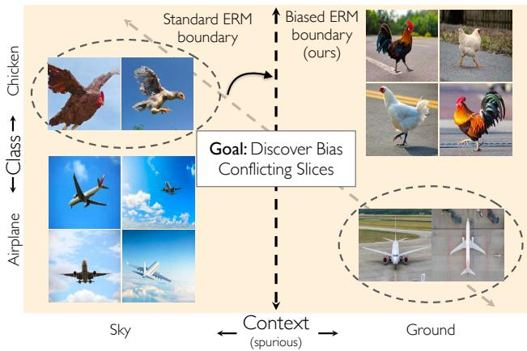
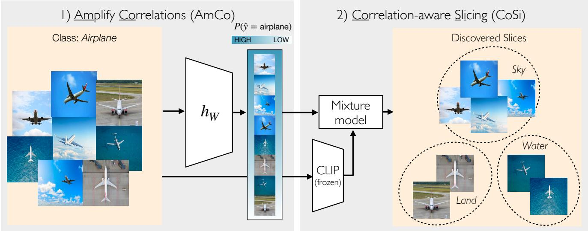
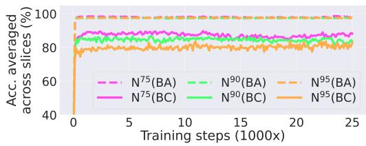
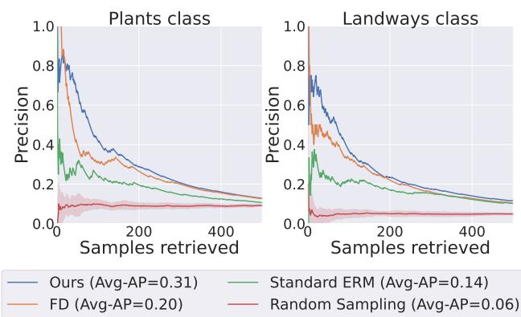
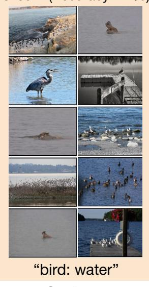
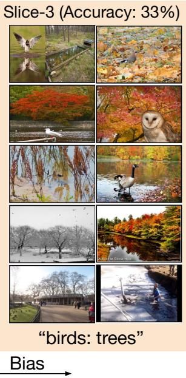
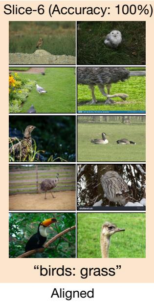
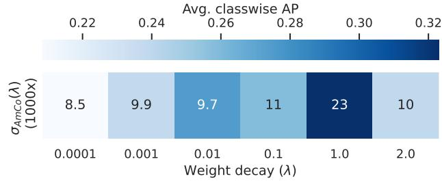
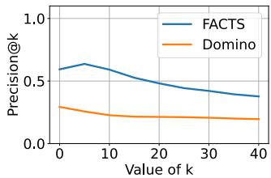
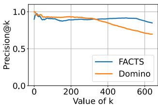

# FACTS: First Amplify Correlations and Then Slice to Discover Bias

Sriram Yenamandra Pratik Ramesh Viraj Prabhu Judy Hoffman

Georgia Institute of Technology

{sriramy, pratikramesh, virajp, judy}@gatech.edu

## Abstract

Computer vision datasets frequently contain spurious correlations between task-relevant labels and (easy to learn) latent task-irrelevant attributes (e.g. context). Models trained on such datasets learn “shortcuts” and underperform on bias-conflicting slices of data where the correlation does not hold. In this work, we study the problem of identifying such slices to inform downstream bias mitigation strategies. We propose First Amplify Correlations and Then Slice (FACTS), wherein we first amplify correlations to fit a simple bias-aligned hypothesis via strongly regularized empirical risk minimization. Next, we perform correlation-aware slicing via mixture modeling in biasaligned feature space to discover underperforming data slices that capture distinct correlations. Despite its simplicity, our method considerably improves over prior work (by as much as 35% precision@10) in correlation bias identification across a range of diverse evaluation settings. Code: https://github.com/yvsriram/FACTS.

## 1. Introduction

Real-world datasets frequently exhibit correlation biases, wherein a task-irrelevant attribute (say, the image background) is correlated with the task label of interest [1, 2, 3]. Consider the task of distinguishing images of chickens from airplanes (see Fig. 1). Naturally, most images of airplanes are in the sky, whereas chickens are typically found on the ground. A naive classifier trained on this biased dataset may conceivably learn to over-rely on the (relatively easier to learn) background and consequently underperform on bias-conflicting slices of the data (e.g. chickens in the air). Indeed, deep models trained with standard empirical risk minimization [4] are notorious for exploiting such “shortcuts” [5, 6], which may have serious repercussions in high-stakes applications like medicine [7, 8], face recognition [3], and autonomous driving [9].

In this work, given a potentially biased dataset, we attempt to automatically identify such bias-conflicting slices: dataset subsets wherein the spurious correlation does not hold. Such identification could inform downstream mitigation strategies based on reweighting [10, 11, 12, 13, 14] or annotating [15, 16, 17] more instances of underrepresented populations. Importantly, such a method should be able to discover slices that represent semantically coherent and distinct bias-conflicting subpopulations, that may optionally be “named” (say, using an image captioning model [18]), and presented to a practitioner.

  
Figure 1: Consider the task of classifying images of chickens and airplanes. Real-world datasets typically also contain spurious correlations between (easy to learn) taskirrelevant attributes and labels: e.g. most airplane images are airborne, whereas chickens are usually photographed on the ground. Naively training on such a dataset would lead to overfitting to the majority context within each class, and to underperforming on bias-conflicting slices of data (e.g. chickens in the sky). We study the problem of automatically identifying such bias-conflicting slices (dashed ovals), which can then inform downstream mitigation strategies. Our method, FACTS, first amplifies correlations to learn a context-aligned decision boundary, and then clusters samples that are confidently misclassified by this biased model to uncover bias-conflicting slices.

Why is discovering bias-conflicting slices hard? Presumably, one could annotate and control for potentially spurious attributes [19, 20, 21], but this is challenging to scale to larger datasets. Further, tasks labels are sometimes spuriously correlated with latent [6] attributes which may be unknown apriori [22], or not correspond to a clean, “humaninterpretable” concept [23] to begin with!

Some recent works have focused on fully automated solutions to this problem by posing it as a problem of discovering systematic error modes on a held out validation set (via “error-aware” mixture modeling [24] or distilling model failures as directions in latent space [15]), or by using external pretrained models such as CLIP [25] for image captioning [26]. However, we find that these methods can either only diagnose a single bias-conflicting slice perclass [15], fail to generalize to settings with severe correlation bias [24], or do not control for the bias in the external pretrained model [25, 26] itself. Further, by focusing exclusively on failure modes, such methods may miss underrepresented subpopulations which an overparameterized model may have memorized but still does not understand [27].

To address these limitations, we propose a simple algorithm we call First Amplify Correlations and Then Slice (FACTS). Our method first amplifies the model’s reliance on the underlying spurious correlation by training with heavily regularized empirical risk minimization. By doing so, we force the model to fit a simple, bias-aligned hypothesis that maximally separates bias-conflicting and biasaligned samples within each class, making them easier to segregate. Next, we propose a novel slicing strategy, that fits per-class mixture models in bias-amplified feature space (to ensure correlation-aware clustering) with an additional coherence prior (to ensure semantic coherence). By making limited assumptions, our method is able to generalize to challenging but practical evaluation settings not previously considered in the literature [24, 15]: containing multiple minority groups per-class, or containing a class without a minority group. We make the following contributions:

• We study the problem of automatically discovering coherent and distinct slices of a dataset containing correlation bias where the correlation does not hold.

• We propose FACTS, a novel two-stage algorithm that clusters in correlation-amplified feature space to uncover bias-conflicting slices, without assuming access to additional annotations.

• We report results for slice discovery on a range of diverse evaluation settings constructed from the WaterBirds [11], CelebA [28], and the newly introduced NICO++ [29] datasets, and demonstrate strong gains over prior work (with absolute gains of as much as 35% precision points across datasets!).

## 2. Related Work

Discovering Error Modes with Human Supervision. A number of prior works [19, 30, 21] propose human-inthe-loop approaches to characterize model failure modes. Wong et al. [19] fits sparse linear layers over deep representations and asks human annotators to verify if the learned features are spurious. Singla et al. [20] have humans annotate spurious neural features from an adversarially robust model for a few highly-activated images, that are used to automatically annotate the remaining dataset. While effective, these methods require human supervision or are designed for restricted model classes e.g. adversarially robust models. In contrast, we propose a fully automated approach for discovering correlation bias with minimal assumptions.

Automated Error Mode discovery. Recent works have attempted unsupervised discovery of model failure modes. Singla et al. [30] learn decision trees over feature representations of misclassified instances from an adversarially robust model. Domino [24] performs “error-aware” clustering of cross-modal embeddings to discover error modes. Jain et al. [15] distill model failures as directions in latent space by learning an SVM classifier to identify consistent error patterns. DrML [25] learns a task model on top of a multimodal embedding space, and uses text embeddings to probe the model and identify visual error modes. However, these works either assume knowledge apriori of an exhaustive set of possible spurious attributes, or do not generalize to more challenging use-cases (such as multiple bias conflicting attributes per-class). In this work, we focus on the related problem of discovering bias-conflicting slices of a dataset wherein a spurious correlation does not hold. We propose a novel approach that does not assume prior knowledge of potential correlations and generalizes to a diverse range of practical discovery scenarios.

Error Mode Discovery for Bias Mitigation. A few works discover error modes as an intermediate step toward bias mitigation. JTT [12] learns a model that upweights examples misclassified by a standard ERM model. LfF [13] first emphasizes learning easy samples using a generalized cross-entropy objective, in conjunction with a debiased model that upweights bias-conflicting datapoints identified by the biased model. Recently, AGRO [32] uses an adversarial slicing model for identifying a group assignment that maximizes the worst-group loss. BAM [14] first amplifies bias via introducing auxiliary variables and using a squared loss and then learns a debiased model that upweights samples misclassified by the bias-amplified model. Finally, MAPLE [33] implements a model agnostic, bi-level formulation for effective sample re-weighting to improve out-ofdistribution performance. Our work also seeks to emphasize the model’s reliance on spurious correlations to facilitate the discovery of correlation slices by encouraging a bigger separation between bias-aligned and bias-conflicting samples. Unlike prior works that simply upweight underrepresented subpopulations, we propose a novel algorithm based on bias-amplified clustering that can discover coherent failure modes in diverse evaluation settings.

  
Figure 2: First Amplify Correlations and Then Slice (FACTS). We seek to identify bias-conflicting slices of data where a spurious correlation between a task-irrelevant attribute (e.g. background) and the task label of interest does not hold. In the example above, this corresponds to airplane in water or land, while airplane in the sky forms a bias-aligned slice. Stage 1: We first Amplify Correlations (AmCo), wherein we learn a simple bias-aligned hypothesis that maximally separates bias-aligned and bias-conflicting samples within each class. Stage 2: Next, we perform Correlation-aware Slicing (CoSi), wherein we perform clustering in bias-amplified feature space, using additional cross-modal CLIP [31] embeddings as a semantic coherence prior. Finally, we present the top-k samples from each discovered slice to a practitioner.

## 3. Method

Problem Formulation. Let X and $\mathcal { V }$ denote input and output spaces. Consider a classification task defined over a labeled dataset D with samples $( x , y ) \in D$ drawn from $\mathcal { X } \times \mathcal { V }$ . Let A be the set of all spurious attributes across $x ,$ where $A = \{ a _ { 1 } , . . . , a _ { m } \}$ . Let $a _ { i } ( x ) \in \{ 0 , 1 \}$ indicate the presence of an attribute $a _ { i }$ (eg. sky, or road) for sample $x .$ We consider an attribute a as spurious if (i) it is easier to learn than the target label $y ( \mathrm { i i } )$ its presence results in the label predominantly assuming a particular value $\hat { y } ,$ i.e. a mostly dictates $\hat { y } ,$ that we denote as $a \implies { \hat { y } } .$ . Let M be a mapping $M : A  y$ which matches each spurious attribute to the label it mostly dictates. Formally, $\forall a _ { i } \in A$ there exists a unique $M ( a _ { i } ) \in \mathcal { V }$ such that:

$$
\frac { \sum _ { ( x , y ) \in D } \mathbb { 1 } [ a _ { i } ( x ) = 1 \mathrm { ~ a n d ~ } y = M ( a _ { i } ) ] } { \sum _ { x \in D } a _ { i } ( x ) } \geq \beta\tag{1}
$$

where $\beta$ is very large (in our experiments, typically $\geq 0 . 7 )$

We consider dataset $D$ as containing correlation bias if there exists at least one such spurious attribute. We further assume that all samples have at most one spurious attribute. For a given attribute-label pair $( a _ { i } , y ^ { * } )$ , let $s ( a _ { i } , y ^ { * } )$ ) denote a dataset slice satisfying it: $s ( a _ { i } , y ^ { * } ) = \{ x \mid \forall ( x , y ) \in D$ $y = y ^ { * }$ and $a _ { i } ( x ) = 1 \}$ . Assuming that the set of labels, Y is known and the set of attributes, A is unknown. Our goal is to identify the set of bias-conflicting slices S:

$$
S = \{ s ( a , y ) \mid \forall y \in \mathcal { V } , \forall a \in A : M ( a ) \neq y \}
$$

We now introduce our method, First Amplify Correlations Then Slice (FACTS), a two-stage algorithm that automatically identifies coherent bias-conflicting slices of the data by first Amplifying Correlations (AmCo), followed by Correlation-aware Slicing (CoSi).

## 3.1. First: Amplify Correlations (AmCo)

Consider dataset D with a spurious correlation $a \implies y .$ Let $h _ { W }$ denote a model parameterized by W trained on this dataset with empirical risk minimization (ERM) [4]. Normally, hW will learn a “shortcut”[5] for predicting y largely based on the spurious attribute a. Intuitively, a perfectly bias-aligned decision boundary that solely utilizes y to predict a, would yield a feature space in which withinclass bias-aligned and bias-conflicting samples are maximally separated $( e . g$ . chicken in the sky v/s the air in Fig. 1). Naturally, such a feature space will be highly conducive to segragating bias-conflicting and bias-aligned slices.

In practice however, $h _ { W }$ may have a high model capacity and learn both task-relevant and irrelevant features, rather than learning a perfectly bias-aligned decision boundary [34]. To overcome this, we propose to amplify the model’s reliance on the spurious attribute a by restricting its capacity, forcing it to learn a simple hypothesis. In practice, we achieve this by setting the weight decay rate λ to a large value during training. We amplify correlations and learn a model $h _ { W }$ by minimizing:

$$
\begin{array} { r l } { \underset { W } { \mathrm { a r g m i n } } } & { \ \mathbb { E } _ { ( \boldsymbol { x } , \boldsymbol { y } ) \in \mathcal { D } } \mathcal { L } _ { C E } ( h _ { W } ( \boldsymbol { x } ) , \boldsymbol { y } ) + \lambda \| W \| _ { 2 } , } \end{array}\tag{2}
$$

where $L _ { C E }$ represents a cross-entropy loss and bal denotes class-balanced sampling, which is required to prevent predictive mode collapse to a single class (the model learning to only predict the majority class).

Restricting model capacity by λ. Recall that our goal in this first phase is to learn a model that fits only bias-aligned samples with high confidence and confidently mispredicts bias-conflicting samples. To find a value of λ that will result in fitting such a model, we run a hyperparameter sweep across a range of values and for each value retrieve a checkpoint $h _ { W ^ { * } ( \lambda ) }$ corresponding to the point at which training accuracy peaks. We limit our search to maximum training accuracy to be able to fairly compare models with varying model capacity by ensuring that each model has fit its training data ‘optimally’. For a given sample $( x , y ) \in D$ , let the likelihood of the correct label y under a model $h _ { W }$ be:

$$
\mathfrak { L } ( h _ { W } , x , y ) = \mathfrak { s o f t m a x } ( h _ { W } ( x ) ) [ y ]
$$

We compute $\sigma _ { \tt A m C o } \left( \lambda \right)$ , which measures the average perclass variance in $\mathfrak { L } ( h _ { W ^ { * } ( \lambda ) } , x , y )$ . Let $D _ { c }$ denote the subset of data samples belonging to class $c \in \mathcal { V }$ . We compute:

$$
\sigma _ { \mathtt { A m C O } } ( \lambda ) = \frac { 1 } { | \mathcal { N } | } \sum _ { c = 1 } ^ { | \mathcal { V } | } \operatorname { V a r } _ { ( x , y ) \in D _ { c } } \left[ \mathfrak { L } ( h _ { W ^ { * } ( \lambda ) } , x , y ) \right]\tag{3}
$$

We pick a value $\lambda { = } \lambda ^ { * }$ that maximizes $\sigma _ { \tt A m C o } \left( \lambda \right)$ , and use the corresponding model checkpoint $h _ { \tt A m C o } = h _ { W ^ { * } \left( \lambda ^ { * } \right) }$ for the next phase of our method. Intuitively, $\sigma _ { \mathrm { { \scriptscriptstyle A m C O } } }$ captures the separation between features for bias-aligned and biasconflicting samples within a class: a high value indicates large separation, which indicates that the model has learned a heavily bias-aligned decision boundary (see Fig. 1, and empirical verification in Sec. 4.5), a property we explicitly leverage in the next stage of our method.

Fig. 2 (left) illustrates the AmCo phase, wherein we learn a simple bias-aligned model that separates bias-aligned and bias-conflicting slices within each class. Conveniently, by simply ordering samples in ascending order of their likelihood of belonging to the ground truth class under the model, we can now identify bias-conflicting samples. While useful, this does not however discover coherent slices of data or segregate distinct majority (or minority) groups within a class when more than one exists. To address this, we perform Correlation-aware Slicing in the feature space of the bias-amplified model $h _ { \tt A m C o } .$

## 3.2. Then: (Correlation-aware) Slicing (CoSi)

To discover distinct and coherent bias-conflicting slices for each class, we fit a correlation-aware mixture in the biasamplified feature space learned by $h _ { \mathrm { { \tt A m C o } } }$ . To prevent any inter-class contamination of slices, we opt to fit a separate mixture model for each class.

The mixture model assumes that the slice membership of samples is modeled using a categorical distribution $\hat { \mathbf { S } } \sim C a t ( \mathbf { p } )$ with parameters $\mathbf { p } ~ = ~ [ p _ { 1 } , p _ { 2 } \dots p _ { \hat { k } } ]$ , where $\textstyle \sum _ { i = 1 } ^ { \hat { k } } p _ { i } = 1$ . Here, $p _ { i }$ gives the membership probability the mixture model assigns to the $i ^ { t h }$ slice. We additionally model two sets of priors:

i) correlation prior, which we set to the predictive distribution (logits) from the biased model $h _ { \tt A m C o } ( x _ { i } )$ . The correlation prior encourages grouping together samples for which the biased model makes similar predictions; intuitively, for each class this corresponds to grouping together all biasaligned (or all bias-conflicting samples). For each slice $S ^ { ( \bar { j } ) }$ , we model the biased predictions $B$ as a multivariate Gaussian distribution $\mathcal { N } ( \mu _ { p } ^ { ( j ) } , \Sigma _ { p } ^ { ( j ) } )$

(ii) coherence prior, which for sample $x _ { i }$ is obtained using cross-modal (CLIP [31]) embeddings $z _ { i } = g ( x _ { i } )$ , which enforces that slices correspond to semantically coherent concepts. Additionally, this prior also makes the slices discovered by our method amenable to automated captioning [18] (see Figure 5) and prompt matching [24, 15] using CLIP. For each slice $S ^ { ( j ) }$ where $j = \{ 1 , . . . , \hat { k } \}$ , we fit a multivariate Gaussian distribution, $\mathcal { N } ( \mu _ { c } , \Sigma _ { c } )$

$\mathrm { L e t } \textbf { m } = \left[ \Big \{ \mu _ { p } ^ { ( j ) } , \boldsymbol { \Sigma } _ { p } ^ { ( j ) } , \mu _ { c } ^ { ( j ) } , \boldsymbol { \Sigma } _ { c } ^ { ( j ) } \Big \} _ { j = 1 } ^ { \hat { k } } \right]$ denote the set of all parameters of the multivariate distributions, where $\hat { k }$ is the number of slices predicted for each class. In total, we represent the full set of mixture model parameters for a class by $\phi = [ \mathbf { p } , \mathbf { m } ]$ . We fit $\phi$ so as to maximize the loglikelihood $l ( \phi )$ on the validation set $D _ { v a l }$ using expectation maximization (EM) [35], which is given by:

$$
\begin{array} { r l r } {  { l ( \phi ) = \sum _ { i = 1 } ^ { | D _ { v a l } | } \log \sum _ { j = 1 } ^ { \hat { k } } [ P ( S ^ { ( j ) } = 1 ) P ( Z = z _ { i } | S ^ { ( j ) } = 1 )  } } \\ & { } & {  P ( B = h _ { b } ( x _ { i } ) | S ^ { ( j ) } = 1 ) ^ { \alpha } ] , ( 4 } \end{array}
$$

and $\alpha$ controls the trade-off between the coherence and correlation priors. After fitting the per-class mixture models, we perform inference to generate slice assignments, rank slices in increasing order of model accuracy, and present the top-k samples from the lowest performing slices to a practitioner for further intervention.

## 4. Experiments

In this section, we first describe our evaluation settings (Sec. 4.1). We then present details of base-

<table><tr><td>Dataset</td><td>#Train samples</td><td>#Classes</td><td>#BC slices</td><td>Class imbal.</td><td>Corr. (%)</td></tr><tr><td>Waterbirds</td><td>4795</td><td>2</td><td>2</td><td>2.9</td><td>95</td></tr><tr><td>CelebA</td><td>162770</td><td>2</td><td>1</td><td>5.7</td><td>98</td></tr><tr><td> $\mathrm { N I C O + + } ^ { 7 5 }$ </td><td>9349</td><td>6</td><td>30</td><td>2.9</td><td>75</td></tr><tr><td> $\mathrm { N I C O + + ^ { 9 0 } }$ </td><td>8209</td><td>6</td><td>30</td><td>3.5</td><td>90</td></tr><tr><td> $\mathrm { N I C O + + ^ { 9 5 } }$ </td><td>7839</td><td>6</td><td>30</td><td>3.8</td><td>95</td></tr></table>

Table 1: Summary of evaluation settings. We study a diverse set of settings, including practical settings not considered in prior work: having no bias-conflicting slice for a class (CelebA), or having multiple bias-conflicting slices per-class (NICO++). Class imbalance is the ratio of the number of samples for the largest class to the smallest class. Correlation is the average % of samples for a given spurious attribute that contain the correlated majority label. (BC=bias-conflicting, Class imbal.=Class imbalance, Corr.=Correlation).

lines (Sec. 4.2) and quantitative results with our method (Sec. 4.3), followed by an ablation study (Sec. 4.4) and analysis (Sec. 4.5).

## 4.1. Evaluation settings

We evaluate our method across diverse correlation settings that vary in the number of classes, the number of bias-conflicting slices per class, the degree of label imbalance across classes, and the strength of spurious correlation (measured by degree of group imbalance within classes). We describe each setting below, and present summary statistics in Table 1.

Waterbirds [11] consists of crops of landbirds and waterbirds [36] superimposed on water and land backgrounds from the Places [37] dataset. The task of interest is to distinguish between waterbirds and landbirds, where the background (water/land) is spuriously correlated with the label (waterbirds/landbirds respectively). The correlation biases here are water ⇒˙= waterbirds and land ⇒˙= landbirds, resulting in two bias-conflicting slices (waterbirds in land and landbirds in water).

CelebA [28] contains images of celebrity faces annotated with various attributes such as gender, baldness, facial expression, and hair color. We use the entire training set of CelebA and consider the task of classifying images of people as either blonde or not blonde, using splits proposed in prior work on bias mitigation [12, 14]. The training set has a male ⇒˙= not blonde spurious correlation resulting in a single bias conflicting slice corresponding to blonde males. NICO++ [29] consists of real-world images of concepts (eg. dog, bike, and wheat) appearing in different contexts (eg. grass, water, and beach). Context annotations for six contexts (dim lighting, outdoor, grass, rock, autumn, water) have been made public, and we use these to generate training, validation, and testing splits to simulate controlled correlation settings for 6-way classification. We report on three such settings that we denote by $\mathrm { N I C O + + ^ { 9 5 } , \ N I C O + + ^ { 9 0 } }$ and $\mathrm { N I C O + + } ^ { 7 5 }$ , where the superscript denotes the degree to which each context is spuriously correlated with its corresponding class. As this correlation increases, the accuracy gap between bias-conflicting and bias-aligned slices of data widens (see Fig. 3).

  
Figure 3: Effect of correlation strength. We plot validation set accuracy of an ERM model trained on each of our proposed $\mathrm { N I C O + + } ^ { 9 5 }$ $\mathrm { N I C O + + } ^ { 9 0 }$ and $\mathrm { N I C O + + } ^ { 7 5 }$ settings. Accuracies of bias-conflicting (dashed) and bias-aligned (solid) slices are shown separately. We observe that the accuracy gap between bias-aligned and bias-conflicting slices widens as the the correlation strength increases (BC=bias conflicting slices, BA=bias aligned slices, $\mathrm { N } ^ { x } { = } \mathrm { N I C O + } { + } ^ { x } )$ .

Metrics. Following Domino [24], we employ Precision@k for evaluation, which measures how accurately a slice discovery method is able to segregate the bias-conflicting slices. Assume $\textit { S } = \ \{ s _ { 1 } , s _ { 2 } , . . . s _ { l } \}$ to be the set of ground truth bias-conflicting slices in a dataset D. Let the slices predicted by an algorithm A be $\hat { S } ~ = ~ \{ \hat { s } _ { 1 } , \hat { s } _ { 2 } , \dots \hat { s } _ { m } \}$ For a predicted slice ${ \hat { s } } _ { j } ,$ let ${ \cal O } _ { j } = \{ o _ { j 1 } , o _ { j 2 } \ldots o _ { j n } \}$ give the sequence of sample indices ordered by decreasing likelihood of the sample x belonging to the current slice. Given a ground truth slice $s _ { i }$ and a predicted slice $\hat { s } _ { j }$ , we compute their similarity: $\begin{array} { r } { P _ { k } ( s _ { i } , \hat { s } _ { j } ) ~ = ~ { \frac { 1 } { k } } \sum _ { i = 1 } ^ { k } \mathbb { 1 } [ x _ { o _ { j i } } ~ \in ~ s _ { i } ] } \end{array}$ Each ground truth slice $s _ { i }$ is then mapped to the most similar predicted slice using $\mathrm { a r g m a x } _ { s \in \hat { S } _ { i } } P _ { k } ( s _ { i } , s )$ We then average the similarity score between the ground truth slices and their best-matching predicted slices. Specifically, for a slice discovery algorithm A we compute:

$$
{ \mathrm { P r e c i s i o n } } \mathbb { i } { \mathrm { s } } ( A ) = { \frac { 1 } { l } } \sum _ { i = 1 } ^ { l } \operatorname* { m a x } _ { j \in [ m ] } P _ { k } ( s _ { i } , { \hat { s } } _ { j } )
$$

In addition, to solely evaluate the effectiveness of the first phase of our method (Sec. 3.1) at ranking samples in order of their bias alignment, we compute Avg-AP: For each class containing a bias-conflicting slice, we compute the Average Precision (AP) score that measures how good a given ranking is at separating bias-conflicting samples from the bias-aligned samples. We then average across classes to obtain Avg-AP.

<table><tr><td>Method</td><td>Waterbirds</td><td>CelebA</td><td> $\mathrm { N I C O + + } ^ { 7 5 }$ </td><td> $\mathrm { N I C O + + } ^ { 9 0 }$ </td><td> $\mathrm { N I C O + + } ^ { 9 5 }$ </td></tr><tr><td>FD [15]</td><td>0.9</td><td>0.7</td><td>0.19</td><td>0.19</td><td>0.19</td></tr><tr><td>Domino [24]</td><td>1.0</td><td>0.9</td><td>0.24</td><td>0.25</td><td>0.27</td></tr><tr><td>FACTS (ours)</td><td>1.0</td><td>0.9</td><td>0.56</td><td>0.60</td><td>0.62</td></tr></table>

Table 2: Our method results in better discovery of correlation slices across settings. We report Precision@10 (best=1.0) for retrieving ground truth bias-conflicting slices on the test set.

Implementation details. For all datasets, we train ResNet50 [38] models using an SGD optimizer with a momentum of 0.9 and batch size of 64 starting from supervised ImageNet [39] initialisations. Following [12], we train models for 300 epochs on Waterbirds and 50 epochs on CelebA. On NICO++, we train for 25k steps. For CelebA and Waterbirds, we follow prior work [12] and use a learning rate of $1 0 ^ { - 3 }$ and weight decay of $1 0 ^ { - 4 }$ for training the ERM models used by our baselines. We use a learning rate of $1 0 ^ { - 5 }$ for training bias-amplified models $h _ { \mathrm { { \tt A m C o } } }$ For weight decay, we sweep over the range $[ 1 0 ^ { - 3 } , 1 0 ^ { - 2 } , 1 0 ^ { - 1 } , 1 . 0 , 2 . 0 ]$ using the strategy described in Sec. 3.1. For CoSi, we run expectation maximization [35] for 100 steps or until the log-likelihood increases by less than $1 0 ^ { - 7 }$ in successive steps. We set the number of slices per class, ˆk to a large value of 36. We use a full covariance matrix for modeling the covariance of $B \mid S ^ { j } { = } 1 ( \Sigma _ { p } )$ while we follow prior work [24] to restrict the covariance matrix of $Z \mid S ^ { j } { = } 1 ( \Sigma _ { c } )$ to be diagonal. Further, we use a non-negative regularization of $\delta _ { p }$ on the diagonal elements of $\Sigma _ { p }$

## 4.2. Baselines

We compare against the following slice discovery methods: i) Domino [24] discovers slices by fitting an “error-aware” mixture model to a combination of multi-modal (CLIP [31]) embeddings of validation set examples, ERM model predictions, and labels. While the second phase of our method is motivated by Domino, there are some important distinctions: Domino does not use bias amplification, fits a single mixture model across classes with an additional soft constraint on class membership, and models a categorical distribution over the predicted labels (rather than using the full set of logits from the bias-amplified model, see Sec. 3.2). ii) Failure Directions (FD) [15] trains an SVM (per-class) to predict whether a standard ERM model would misclassify a given validation sample. The distance to the per-class SVM boundary is then used to score samples on an evaluation set. However, unlike FACTS, this method is constrained to retrieving only a single failure mode per-class.

## 4.3. Results

In Table 2, we compare the performance of our method to Domino [24] and Failure Directions [15] (FD) for discovering bias-conflicting slices on the test set of the Waterbirds, CelebA, and NICO++ datasets. Following Domino, we measure precision at $k = 1 0$ . A high-precision slice of 10 images will likely be representative of a given biasconflicting mode while still being of manageable size to be presented to a practitioner for intervention.

On Waterbirds and CelebA, our method achieves Precision@k of 1.0 and 0.9 respectively on the test set, matching prior work [24].

On the other hand, we see significant gains (>+0.37) on the more challenging NICO++ settings. Recall that these settings contain a controlled degree of correlation with multiple (5) bias-conflicting slices per class. As expected, FD [15] underperforms in this challenging setting as it cannot generalize $\mathbf { t o } > 1$ minority group per-class. Somewhat surprisingly, we find that Domino [24] also underperforms in this setting despite containing a clustering phase, presumably because it does not operate in bias-amplified feature space, models a less informative prior, and employs a soft class assignment.

  
Figure 4: Classwise Precision for retrieving biasconflicting samples from Plants and Landways classes in $\mathrm { N I C O + + } ^ { \sim }$ setting as the number of retrieved samples changes. The legend gives the Avg-AP scores for the different methods being compared.

Evaluating Bias Identification. We now evaluate the effectiveness of the first stage of our method, AmCo at simply identifying bias-conflicting samples, without having to separate them into distinct categories. Recall that AmCo can conveniently identify bias-conflicting samples by retrieving samples that have a low likelihood of belonging to the ground truth class under the bias-amplified model. To do so, we follow [15] and plot per-class precision at retrieving bias-conflicting samples for two classes in $\mathrm { N I C O + + } ^ { 9 5 }$ , as a function of the number of samples retrieved. We compare against Failure Directions [15] (FD), using per-sample ground truth confidences under a standard ERM model, and random sampling from the base population.

Figure 4 shows results. For both plants and landways classes, we see that for retrieving more than a few samples, AmCo consistently outperforms all methods, and obtains the best Avg-AP (+0.11 higher than the next best).

## 4.4. Ablations

Ablating AmCo. We now ablate the first stage of our proposed method and report Avg-AP on $\mathrm { N I C O + + } ^ { 9 5 }$ . We find: ▷ Amplifying Correlations improves retrieval (Table 3a, Row 1 v/s 5). We first compare our method against retrieving samples with a low confidence of belonging to the ground truth class under a standard ERM model, without any amplification. We find that bias amplification significantly boosts retrieval (+0.17 Avg-AP), validating our hypothesis that such amplification increases feature separation.

▷ Our proposed amplification strategy outperforms competing methods (Table 3a, Row 2-4 v/s 5). We compare against alternative loss objectives: i) GCE [13], ii) Li et al. that combine a squared loss with an additional auxiliary variable, iii) A simple linear probing [40] amplification strategy where we update only the classifier head and freeze all other parameters. On $N I C O + + ^ { 9 5 }$ , we observe that our strategy outperforms the next best BA method by +0.06.

<table><tr><td>Method</td><td>Avg-AP</td></tr><tr><td>None (ERM)</td><td>0.14</td></tr><tr><td>GCE [13]</td><td>0.13</td></tr><tr><td>Linear probe</td><td>0.25</td></tr><tr><td>Sq. loss + Aux var. [14]</td><td>0.22</td></tr><tr><td>Ours</td><td>0.31</td></tr></table>

(a) Varying amplification.

<table><tr><td rowspan=1 colspan=1>Method            Avg-AP</td></tr><tr><td rowspan=1 colspan=1>Max val ClassDiff [14] 0.06</td></tr><tr><td rowspan=1 colspan=1>Max val acc. (Ours)    0.31</td></tr><tr><td rowspan=1 colspan=1>Max train acc. (Ours)   0.31</td></tr><tr><td rowspan=1 colspan=1>Oracle                0.36</td></tr></table>

(b) Varying stopping criterion.  
Table 3: Ablating AmCo. We report Avg-AP at retrieving bias-conflicting samples on the $\mathrm { \bar { N I C O + + } } ^ { 9 5 }$ train set.

▷ Maximum training accuracy is an effective stopping criterion. (Table 3b) Recall that for retrieving biasconflicting samples, we seek to identify a snapshot in training at which bias amplification is large, and in our experiments we pick the point at which training accuracy peaks. To evaluate whether this is a reasonable stopping criterion, we compare against alternatives: i) maximum validation accuracy, ii) maximum ClassDiff, adapted from Li et al. [14] which finds the average difference in model validation accuracy between all class pairs (ClassDiff), to be strongly anti-correlated with worst-group accuracy, following which we pick the point with the highest ClassDiff / lowest worstgroup accuracy, indicating maximum amplification, and iii) an oracle strategy that picks a model corresponding to the best retrieval. We find that using maximum training or validation accuracy both perform well and reach within 0.05 AP of oracle retrieval.

<table><tr><td>Objective</td><td>Precision@10</td></tr><tr><td>CLIP</td><td>0.38</td></tr><tr><td>Predicted logits</td><td>0.58</td></tr><tr><td>Predicted label</td><td>0.26</td></tr><tr><td>CLIP + Predicted label [24]</td><td>0.38</td></tr><tr><td>CLIP + Predicted logits (Ours)</td><td>0.62</td></tr></table>

Table 4: Ablating CoSi. We report Precision@10 at identifying bias-conflicting slices on $\mathrm { N I C O + + } ^ { 9 5 }$

Ablating CoSi. Now In Table 4 we try variations of our proposed mixture modeling strategy CoSi, and report Precision@10 on $\mathrm { N I C O + + } ^ { 9 5 }$ . We find that dropping either term of our objective in Eq. 4 (distribution on logits within a slice or distribution on embeddings within a slice) degrades precision. Further, we compare with using only the predicted label rather than the complete logits distribution as done in Domino [24]; we find that this signficantly drops performance (-0.24 Precision@10). We hypothesize that this is because the logits distribution is more informative, which may be helpful in identifying bias-conflicting samples on which the model does not fail.

## 4.5. Analysis

Qualitative results. While our method uncovers coherent slices corresponding to dataset correlations, in practice it is important to be able to identify a small subset of coherent, bias-conflicting slices that may be presented to a practitioner. To do so, we order slices by validation accuracy (least to most). Fig. 5 shows slices discovered by our method on the bird class of $\mathrm { N I C O + + } ^ { 9 5 }$ , which is spuriously correlated with the grass context. For each predicted slice, we visualize the top-10 samples ranked based on their likelihood of belonging to the slice. We observe that FACTS is able to uncover coherent bias-conflicting slices, which we name using the strategy described in Kim et al. [26] to obtain slice descriptions like birds: water, birds: sunset and so on. We note that these bias-conflicting slices also correspond to failure modes for the model (evidenced by low accuracy). On the right, we visualize a bias-aligned slice discovered by FACTS (birds in grass (#6)), which can be easily filtered out based on its high validation accuracy (in this case, 100%).

Measuring bias amplification. To verify that our bias-amplification strategy indeed results in learning a bias-aligned decision boundary, we compute the difference in training accuracies of the actual bias-aligned and bias-conflicting slices per class (GT-Acc-gap). On $_ { \mathrm { N I C O + + } } 9 5$ , we find that GT-Acc-gap strongly correlates with Avg-AP on $\mathrm { N I C O + + } ^ { 9 5 }$ (Pearson coefficient 0.85), verifying that bias amplification does indeed lead to better retrieval. Further, our bias amplified model $h _ { \mathrm { { \tt A m C o } } }$ achieves a GT-Acc-gap of 0.23 (at the maximum training accuracy), while a standard ERM model achieves GT-Acc-gap of 0.001 (at its maximum training accuracy): clearly, our

  
Figure 5: Slices discovered by FACTS. We present the top-10 samples in slices predicted by our method for the bird class from $\mathrm { N I C O + + } ^ { 9 5 }$ , ordered in increasing order of model accuracy. The ground truth correlation in this case is $g r a s s \stackrel { . } { \Longrightarrow } b i r d ,$ and so our goal is to discover dataset slices wherein this correlation does not hold. As shown, the first two slices discovered by FACTS correspond to two distinct and coherent bias-conflicting slices – bird in water and bird at sunset (slice name obtained by extracting frequent keywords from a generated caption [18]). On the right we show an example of a bias-aligned slice discovered by our method, which may easily be discarded by filtering based on accuracy.

  
Figure 6: Validating λ tuning strategy. We plot the Avg-AP (color, darker is higher) across λ values along with the corresponding variance in confidence $\sigma _ { \mathrm { { \scriptscriptstyle A m C O } } }$ (inscribed values), at the point where training accuracy peaks. As seen, this best $\mathbb { A } \mathrm { v } { \mathfrak { g } } - \mathbb { A } \mathrm { P }$ is achieved at the λ that maximizes $\sigma _ { \mathrm { { \bar { A } } m C o } } .$

AmCo strategy successfully amplifies correlations.

Validating weight decay tuning strategy. Recall from Section 3.1 that we choose the weight decay value that maximizes the per-class average of variance in the likelihood of the ground truth label under the model, at the point where the training accuracy is maximum $( \sigma _ { \mathrm { A m C o } } )$ . In Fig. 6, we compute $\sigma _ { \mathrm { { \scriptscriptstyle A m C O } } }$ across a range of λ values and verify that the best $\mathbb { A } \mathrm { v } { \mathfrak { g } } - \mathbb { A } \mathrm { P }$ is indeed achieved at the maximum $\sigma _ { \mathrm { \scriptscriptstyle A m C o } } .$

Precision@k for different values of k. We perform our primary evaluations (Table 2) using the Precision@10 metric (Sec. 4.1). We additionally benchmark Precision@k across a range of values of k in Fig. 7. For Waterbirds, Precision@k of FACTS remains relatively stable, even for large values of k that match the total number of bias-conflicting samples per slice (642). In the case of $\mathrm { N I C O + + } ^ { 9 5 }$ , we observe that FACTS performs better than Domino [24] across different values of k.

Additional slice evaluation metrics. We evaluate the quality of slices predicted by different methods using a few additional metrics in Table 5. For each ground truth slice with β samples, we compute Recall@β and AP score obtained by the best matching predicted slice (see 4.1 for details on how ground truth slices are associated to predicted slices). We average these metrics across slices to obtain Avg. Slice Recall and Avg. Slice AP. As seen, FACTS predicts slices that achieve better recall and AP compared to Domino [24].

  
(a) $\mathrm { N I C O + + } ^ { 9 5 }$

  
(b) Waterbirds  
Figure 7: Precision@k for different values of k. We plot the Precision@k obtained by Domino [24] and FACTS. as k varies for $\mathrm { N I C O + + } ^ { 9 5 }$ and Waterbirds.

Evaluating slice ordering. The Precision@k metric (proposed by Domino [24]) only evaluates the ability of slicing algorithms to predict a matching slice for every ground truth slice. However, it does not evaluate their ability to separate the bias-conflicting slices from bias-aligned slices. As in Figure 2, we order the predicted slices by increasing validation accuracy. We additionally call a predicted slice as ”bias-conflicting” if at least 6 out of the top-10 samples of that slice are bias-conflicting. We use Slice Ranking AP to evaluate the extent to which the ordering places slices marked as ”bias-conflicting” on top. We observe that bias-conflicting slices predicted by FACTS can be better separated using validation accuracy when compared to Domino [24] (Table 5).

<table><tr><td>Method</td><td>Avg. Slice Recall</td><td>Avg. Slice AP</td><td>Slice Ranking AP</td></tr><tr><td>Domino [24]</td><td>0.15</td><td>0.24</td><td>0.92</td></tr><tr><td>FACTS</td><td>0.34</td><td>0.40</td><td>0.97</td></tr></table>

Table 5: Additional metrics. In addition to $\mathtt { P r e c i s i o n } @ \mathtt { k }$ ([24]), we use Avg. Slice Recall/AP and Slice Ranking AP to evaluate the slice quality and slice ordering respectively on $_ { \mathrm { N I C O + + } } 9 5$

In the supplementary, we present additional analysis for the sensitivity of our clustering strategy to its hyperparameters (we find it to be relatively stable), as well as additional qualitative results and ablation studies.

## 5. Discussion

We propose novel algorithm for automatically discovering correlation bias, that first amplifies correlations to learn a context-aligned decision boundary and then clusters instances in this bias-amplified feature space to uncover semantically coherent bias-conflicting slices. We show that despite its simplicity, our method significantly outperforms prior work across a diverse set of evaluation settings.

Limitations. We focus on identifying only correlation bias, and leave the discovery of other types of bias (e.g. due to mislabeled or ambiguous examples) to future work. Further, we make certain simplifying assumptions, e.g. a datapoint does not contain multiple spurious attributes. Finally, we restrict experiments to ResNet50 [38] architectures trained with SGD in this work. Despite these limitations, we envisage that our work will be useful in identifying spurious correlations across a broad range of real-world settings.

## 6. Acknowledgements

This work was supported in part by funding from Cisco, Google, DARPA LwLL, NASA ULI, and NSF #2144194. We thank George Stoica, Simar Kareer, Aaditya Singh and Sahil Khose for their feedback on the first draft of this work. We additionally thank Simar Kareer for help with figures.

## References

[1] Antonio Torralba and Alexei A Efros. Unbiased look at dataset bias. In CVPR 2011, pages 1521–1528. IEEE, 2011. 1

[2] Aylin Caliskan, Joanna J Bryson, and Arvind Narayanan. Semantics derived automatically from language corpora contain human-like biases. Science, 356(6334):183–186, 2017. 1

[3] Joy Buolamwini and Timnit Gebru. Gender shades: Intersectional accuracy disparities in commercial gender classification. In Conference on fairness, accountability and transparency, pages 77–91. PMLR, 2018. 1

[4] Vladimir Vapnik. The nature of statistical learning theory. Springer science & business media, 1999. 1, 3

[5] Robert Geirhos, Jorn-Henrik Jacobsen, Claudio Michaelis,¨ Richard Zemel, Wieland Brendel, Matthias Bethge, and Felix A Wichmann. Shortcut learning in deep neural networks. Nature Machine Intelligence, 2(11):665–673, 2020. 1, 3

[6] Sarah Jabbour, David Fouhey, Ella Kazerooni, Michael W. Sjoding, and Jenna Wiens. Deep learning applied to chest xrays: Exploiting and preventing shortcuts. In Finale Doshi-Velez, Jim Fackler, Ken Jung, David Kale, Rajesh Ranganath, Byron Wallace, and Jenna Wiens, editors, Proceedings ofthe 5th Machine Learningfor Healthcare Conference, volume 126 of Proceedings of Machine Learning Research, pages 750–782. PMLR, 07–08 Aug 2020. 1, 2

[7] Marcus A Badgeley, John R Zech, Luke Oakden-Rayner, Benjamin S Glicksberg, Manway Liu, William Gale, Michael V McConnell, Bethany Percha, Thomas M Snyder, and Joel T Dudley. Deep learning predicts hip fracture using confounding patient and healthcare variables. NPJ digital medicine, 2(1):31, 2019. 1

[8] Julia K Winkler, Christine Fink, Ferdinand Toberer, Alexander Enk, Teresa Deinlein, Rainer Hofmann-Wellenhof, Luc Thomas, Aimilios Lallas, Andreas Blum, Wilhelm Stolz, et al. Association between surgical skin markings in dermoscopic images and diagnostic performance of a deep learn-

ing convolutional neural network for melanoma recognition. JAMA dermatology, 155(10):1135–1141, 2019. 1

[9] Benjamin Wilson, Judy Hoffman, and Jamie Morgenstern. Predictive inequity in object detection. arXiv preprint arXiv:1902.11097, 2019. 1

[10] Junhyun Nam, Jaehyung Kim, Jaeho Lee, and Jinwoo Shin. Spread spurious attribute: Improving worst-group accuracy with spurious attribute estimation. In International Conference on Learning Representations, 2022. 1

[11] Shiori Sagawa\*, Pang Wei Koh\*, Tatsunori B. Hashimoto, and Percy Liang. Distributionally robust neural networks. In International Conference on Learning Representations, 2020. 1, 2, 5

[12] Evan Z Liu, Behzad Haghgoo, Annie S Chen, Aditi Raghunathan, Pang Wei Koh, Shiori Sagawa, Percy Liang, and Chelsea Finn. Just train twice: Improving group robustness without training group information. In Marina Meila and Tong Zhang, editors, Proceedings of the 38th International Conference on Machine Learning, volume 139 of Proceedings of Machine Learning Research, pages 6781–6792. PMLR, 18–24 Jul 2021. 1, 2, 5, 6

[13] Junhyun Nam, Hyuntak Cha, Sungsoo Ahn, Jaeho Lee, and Jinwoo Shin. Learning from failure: De-biasing classifier from biased classifier. Advances in Neural Information Processing Systems, 33:20673–20684, 2020. 1, 2, 7

[14] Gaotang Li, Jiarui Liu, and Wei Hu. Bias amplification improves worst-group accuracy without group information, 2023. 1, 2, 5, 7

[15] Saachi Jain, Hannah Lawrence, Ankur Moitra, and Aleksander Madry. Distilling model failures as directions in latent space. In ArXiv preprint arXiv:2206.14754, 2022. 1, 2, 4, 6, 7

[16] Nitesh V Chawla, Kevin W Bowyer, Lawrence O Hall, and W Philip Kegelmeyer. Smote: synthetic minority oversampling technique. Journal of artificial intelligence research, 16:321–357, 2002. 1

[17] Haibo He, Yang Bai, Edwardo A Garcia, and Shutao Li. Adasyn: Adaptive synthetic sampling approach for imbalanced learning. In 2008 IEEE international joint conference on neural networks (IEEE world congress on computational intelligence), pages 1322–1328. IEEE, 2008. 1

[18] Ron Mokady, Amir Hertz, and Amit H Bermano. Clipcap: Clip prefix for image captioning. arXiv preprint arXiv:2111.09734, 2021. 1, 4, 8

[19] Eric Wong, Shibani Santurkar, and Aleksander Madry. Leveraging sparse linear layers for debuggable deep networks. In Marina Meila and Tong Zhang, editors, Proceedings of the 38th International Conference on Machine Learning, volume 139 of Proceedings of Machine Learning Research, pages 11205–11216. PMLR, 18–24 Jul 2021. 1, 2

[20] Sahil Singla and Soheil Feizi. Salient imagenet: How to discover spurious features in deep learning? In International Conference on Learning Representations, 2022. 1, 2

[21] Harshay Shah, Sung Min Park, Andrew Ilyas, and Aleksander Madry. Modeldiff: A framework for comparing learning algorithms. arXiv preprint arXiv:2211.12491, 2022. 1, 2

[22] Luke Oakden-Rayner, Jared Dunnmon, Gustavo Carneiro, and Christopher Re. Hidden stratification causes clinically´ meaningful failures in machine learning for medical imaging. In Proceedings ofthe ACM conference on health, inference, and learning, pages 151–159, 2020. 2

[23] Arvindkumar Krishnakumar, Viraj Prabhu, Sruthi Sudhakar, and Judy Hoffman. Udis: Unsupervised discovery of bias in deep visual recognition models. In British Machine Vision Conference (BMVC), volume 1, page 3, 2021. 2

[24] Sabri Eyuboglu, Maya Varma, Khaled Kamal Saab, Jean-Benoit Delbrouck, Christopher Lee-Messer, Jared Dunnmon, James Zou, and Christopher Re. Domino: Discov-´ ering systematic errors with cross-modal embeddings. In The Tenth International Conference on Learning Representations, ICLR 2022, Virtual Event, April 25-29, 2022. Open-Review.net, 2022. 2, 4, 5, 6, 7, 8, 9

[25] Yuhui Zhang, Jeff Z. HaoChen, Shih-Cheng Huang, Kuan-Chieh Wang, James Zou, and Serena Yeung. Diagnosing and rectifying vision models using language. In The Eleventh International Conference on Learning Representations, 2023. 2

[26] Younghyun Kim, Sangwoo Mo, Minkyu Kim, Kyungmin Lee, Jaeho Lee, and Jinwoo Shin. Explaining visual biases as words by generating captions. arXiv preprint arXiv:2301.11104, 2023. 2, 7

[27] Rachit Bansal, Danish Pruthi, and Yonatan Belinkov. Measures of information reflect memorization patterns. In Alice H. Oh, Alekh Agarwal, Danielle Belgrave, and Kyunghyun Cho, editors, Advances in Neural Information Processing Systems, 2022. 2

[28] Ziwei Liu, Ping Luo, Xiaogang Wang, and Xiaoou Tang. Deep learning face attributes in the wild. In Proceedings of International Conference on Computer Vision (ICCV), December 2015. 2, 5

[29] Xingxuan Zhang, Yue He, Renzhe Xu, Han Yu, Zheyan Shen, and Peng Cui. Nico++: Towards better benchmarking for domain generalization, 2022. 2, 5

[30] Sahil Singla, Besmira Nushi, Shital Shah, Ece Kamar, and Eric Horvitz. Understanding failures of deep networks via robust feature extraction. In Proceedings of the IEEE/CVF Conference on Computer Vision and Pattern Recognition, pages 12853–12862, 2021. 2

[31] Alec Radford, Jong Wook Kim, Chris Hallacy, Aditya Ramesh, Gabriel Goh, Sandhini Agarwal, Girish Sastry, Amanda Askell, Pamela Mishkin, Jack Clark, et al. Learning transferable visual models from natural language supervision. In International conference on machine learning, pages 8748–8763. PMLR, 2021. 3, 4, 6

[32] Bhargavi Paranjape, Pradeep Dasigi, Vivek Srikumar, Luke Zettlemoyer, and Hannaneh Hajishirzi. AGRO: Adversarial discovery of error-prone groups for robust optimization.

In International Conference on Learning Representations, 2023. 2

[33] Xiao Zhou, Yong Lin, Renjie Pi, Weizhong Zhang, Renzhe Xu, Peng Cui, and Tong Zhang. Model agnostic sample reweighting for out-of-distribution learning. In Kamalika Chaudhuri, Stefanie Jegelka, Le Song, Csaba Szepesvari, Gang Niu, and Sivan Sabato, editors, Proceedings of the 39th International Conference on Machine Learning, volume 162 of Proceedings of Machine Learning Research, pages 27203–27221. PMLR, 17–23 Jul 2022. 2

[34] Melissa Hall, Laurens van der Maaten, Laura Gustafson, Maxwell Jones, and Aaron Bryan Adcock. Bias amplification in image classification. In Workshop on Trustworthy and Socially Responsible Machine Learning, NeurIPS 2022, 2022. 3

[35] Arthur P Dempster, Nan M Laird, and Donald B Rubin. Maximum likelihood from incomplete data via the em algorithm. Journal of the royal statistical society: series B (methodological), 39(1):1–22, 1977. 4, 6

[36] C Wah, S Branson, P Welinder, P Perona, and S Belongie. The Caltech-UCSD Birds-200-2011 dataset. Technical report, California Institute of Technology, 2011. 5

[37] Bolei Zhou, Agata Lapedriza, Aditya Khosla, Aude Oliva, and Antonio Torralba. Places: A 10 million image database for scene recognition. IEEE Transactions on Pattern Analysis and Machine Intelligence, 40(6):1452–1464, 2017. 5

[38] Kaiming He, Xiangyu Zhang, Shaoqing Ren, and Jian Sun. Deep residual learning for image recognition. In Proceedings ofthe IEEE conference on computer vision and pattern recognition, pages 770–778, 2016. 6, 9

[39] Alex Krizhevsky, Ilya Sutskever, and Geoffrey E Hinton. Imagenet classification with deep convolutional neural networks. Communications ofthe ACM, 60(6):84–90, 2017. 6

[40] Mang Ye, Xu Zhang, Pong C Yuen, and Shih-Fu Chang. Unsupervised embedding learning via invariant and spreading instance feature. In Proceedings of the IEEE/CVF Conference on Computer Vision and Pattern Recognition, pages 6210–6219, 2019. 7