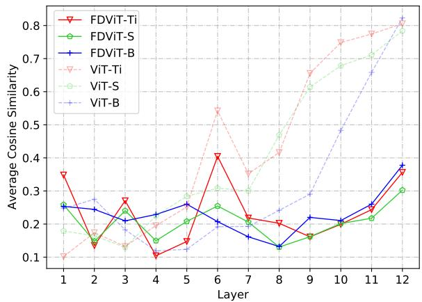
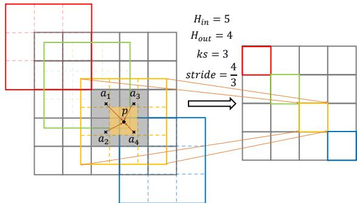
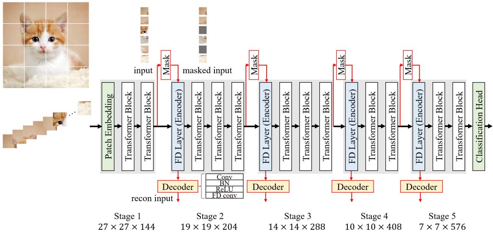
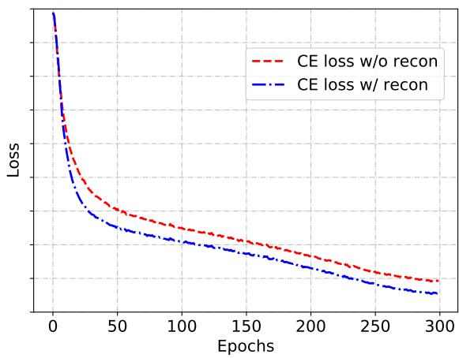

# FDViT: Improve the Hierarchical Architecture of Vision Transformer

Yixing Xu, Chao Li, Dong Li, Xiao Sheng, Fan Jiang, Lu Tian, Ashish Sirasao Advanced Micro Devices, Inc., Beijing, China

{yixing.xu, chao.li, d.li, xsheng, f.jiang, lu.tian, ashish.sirasao}@amd.com

## Abstract

Despite the fact that transformer-based models have yielded great success in computer vision tasks, they suffer from the challenge of high computational costs that limits their use on resource-constrained devices. One major reason is that vision transformers have redundant calculations since the self-attention operation generates patches with high similarity at a later stage in the network. Hierarchical architectures have been proposedfor vision transformers to alleviate this challenge. However, by shrinking the spatial dimensions to halfofthe originals with downsampling layers, the challenge is actually overcompensated, as too much information is lost. In this paper, we propose FDViT to improve the hierarchical architecture ofthe vision transformer by using a flexible downsampling layer that is not limited to integer stride to smoothly reduce the sizes of the middle feature maps. Furthermore, a masked auto-encoder architecture is used to facilitate the training of the proposed flexible downsampling layer and produces informative outputs. Experimental results on benchmark datasets demonstrate that the proposed method can reduce computational costs while increasing classification performance and achieving state-of-the-art results. For example, the proposed FDViT-S model achieves a top-1 accuracy of 81.5%, which is 1.7 percentpoints higher than the ViT-S model and reduces 39% FLOPs.

## 1. Introduction

Convolutional neural networks (CNNs) have been the first choice on computer vision (CV) tasks [25, 54, 56, 55, 19] in the past decade. Transformers with self-attention mechanisms are another kind of neural networks that are widely used in neural language processing (NLP) tasks and have a great success (e.g., BERT [13], GPT-3 [2] and Chat-GPT [1]). In order to utilize the power of transformers for computer vision tasks, many researchers attempt to use the self-attention mechanism. For example, DETR [3] applies the transformer encoder-decoder architecture to object detection task, and iGPT [7] trains a sequence transformer for image recognition task with a pre-training stage and finetuning stage.

  
Figure 1. Cosine similarities between different patches in each layer of ViT models and FDViT models. Patch similarities are reduced in FDViTs.

Recently, ViT [15] mitigates the performance gap between transformer models and CNN models and achieves a remarkable performance on the ImageNet dataset without using convolutional operation. Different from CNNs, ViT divides the input image into 16 × 16 patches and treats the patches as sequence input to the consequent transformer blocks. After that DeiT [44] proposes a data-efficient image transformer with a distillation training method and further improves the performance of ViT by a large margin. Since then, research into vision transformers has exploded and several CV tasks such as image recognition [15, 44], object detection [16], image segmentation [42] and low-level vision [6] have been studied.

Despite the success of the aforementioned vision transformers, they mostly share the network architecture of ViT and have the same disadvantage that the models are cumbersome and have high computational costs. This is mainly because there are many redundant calculations in the transformer network and the similarity between patches becomes higher as the network goes deeper [43, 39]. Because of this, vision transformer models are hard to apply to resourceconstrained devices such as smartphones, digital cameras, smart wristbands, etc. Therefore, many works attempt to deal with this challenge by reducing the number of patches using hierarchical architectures as CNN models do [53]. With several downsampling layers added to the vision transformer, the redundant information in different patches can be effectively reduced and a portable model is produced without too much loss of performance.

However, the aforementioned challenge is overcompensated by introducing the traditional downsampling layers such as max-pooling and convolutional operation with stride of two into vision transformers. The former shrinks the original spatial dimensions in half (from HW to H2 W2 ) and discards 75% of the data, and the latter discards 50% since the number of channels is always doubled at the same time (see the data loss ratio Eq. 3). Nevertheless, the similarity between patches is not that high at the early stage of the ViT networks (dashed lines in Fig. 1), and ignoring too much information hurts the final performance of the model.

In this paper, we propose a novel architecture called FDViT to improve the hierarchical architecture of vision transformer by introducing a flexible downsampling layer (FD layer) that is not limited to integer stride and can produce output feature map with any preset dimension. By doing this, the spatial dimension of the feature maps can be smoothly reduced to avoid too much information loss at the early stage of the network. We also introduce a masked auto-encoder architecture to facilitate the training of the proposed FD layer and generate informative outputs by treating the FD layer as the encoder, and use a decoder to recover the original input. As shown in Fig. 1, we can effectively reduce the similarity between patches and express the same amount of information with fewer FLOPs and parameters. We conduct a series of experiments on the ImageNet dataset and show that the proposed method can reduce the computational cost while at the same time increase the classification performance, which shows the superiority of our method. For example, the proposed model reaches 81.5% top-1 accuracy which is 1.7% higher than ViT-S model and reduces 39% FLOPs. We also verify the effectiveness of FDViT as a backbone for object detection on MSCOCO 2017 dataset and semantic segmentation task on ADE20K dataset, and the result shows a better performance compared to existing architectures.

## 2. Related Works

Dosovitskiy et al. [15] proposed Vision Transformer (ViT), which is the first work to use a pure transformer for image classification and archives state-of-the-art result. Each input image is sliced into a sequenced set with a constant size and then passes into multiple head self-attention layers to classify it.

However, ViT is resource-hungry and computeintensive. One of the most challenging problems in ViT is that the considerable sequence length of image patches ca a quadratic computational complexity and memory consumption, which hinders its application in portable devices.

In recent years, a collection of vision transformer backbones mainly focused on the following aspects to seek a better trade-off between performance and efficiency, i.e., introducing hierarchical architecture into vision transformers and enhancing the locality of vision transformers.

## 2.1. Hierarchical Vision Transformers

In computer vision tasks, pyramid pooling is widely used for extracting multi-scale feature maps. He et al. [24] introduced pyramid pooling to deep CNNs for image classification and object detection, while Mask-RCNN [22] and FPN [33] applied pyramid pooling for object detection and semantic segmentation.

Different from CNNs, self-attention operation in vision transformers is equivalent to low-pass filter [39] and generates similar patches, which causes redundant calculation. A number of improvements of vision transformer models have been proposed with hierarchical structures to provide a multi-scales encoding while reducing computational costs and memory consumption. A common practice is to use a single pooling operation to reduce the sequence length.

Wang et al. [45] proposed PVT, a pyramid transformer that presented a hierarchical structure with four stages, and showed that it can provide better results with fewer FLOPs and parameters for image recognition tasks. It reduced the sequence length of the transformer as the network deepens, which can reduce redundant calculation and at the same time extract high-level semantic information. Such design is followed by many other works afterward [34, 29, 57, 14]. Heo et al. [28] proposed a Pooling-based Vision Transformer combined with a series of pooling layers. It enabled the spatial size reduction in the vision transformer structure. Wu et al. [49] proposed P2T to adapt pyramid pooling to Multi-head Self-Attention (MSA) in vision transformer, so as to reduce the sequence length and capture powerful contextual features. In order to enhance the generalization of vision transformer to dense predictions of large patch size, Pan et al. [38] proposed a general hierarchical pooling strategy that significantly reduced the computation complexity while strengthening the scalability of essential dimensions of vision transformer models. CrossViT [5] extracted richer features by fusing the multi-branch feature maps with different scales.

## 2.2. Local-Enhanced Vision Transformers

Considering the quadratic computational cost caused by global self-attention operation, many methods constrain the range of attention within a local region [34, 14, 29, 48] or cooperate with local attention [20, 61, 9, 31, 60] to improve the efficiency of vision transformer while keeping the performance of the model.

Liu et al. [34] restricted the self-attention operation in non-overlapping local windows and realized the crosswindow connection by shifting these windows. Yuan et al. [14] presented the Cross-Shaped Window (CSWin) selfattention method in the horizontal and vertical stripes in parallel. Wu et al. [48] proposed Pale-Shaped self-Attention (PSAttention), which computed self-attention within a paleshaped region.

Local-enhanced methods generate patches with local attention and make the interaction between patches to extract global information, which are similar to depth-wise convolution followed by point-wise convolution in MobileNets to reduce the computation. In contrast, the hierarchical vision transformers reduce the number of FLOPs and parameters by reducing the number of patches. These two methods are orthogonal and can be combined together. Besides, there are some methods that combine convolution and self-attention operations. For example, Mobile-Former [8], Conformer [40] and DS-Net [35] integrated features produced by convolution and self-attention with the well-designed dual-branch structures. In contrast, Local ViT [32], CvT [47] and Shuffle Transformer [29] inserted several convolutional layers into transformer models. In this paper, we mainly discuss the hierarchical vision transformer methods. Local-enhanced methods and CNNs combined methods [52] are out of our scope.

## 3. Problem Formulation

In this section, we illustrate the motivation of our method. We introduce the preliminaries of vanilla ViT and the redundant calculation challenge generated by selfattention. Then, we propose the data loss ratio $R _ { d }$ after downsampling, and discuss the drawback of the current hierarchical architecture of vision transformers that overcompensate for the aforementioned challenge by having a large $R _ { d }$ at the early stage of the network.

## 3.1. Vanilla ViT

The input image $\mathbf { x } \in \mathbb { R } ^ { C \times H \times W }$ of vanilla ViT is first split into a set of N patches which are then flattened into vectors and concatenated into matrix $\mathbf { X } ^ { 0 } = \{ \mathbf { x } _ { p } ^ { i } \} _ { i = 1 } ^ { N }$ , where $\mathbf { x } _ { p } \in \mathbb { R } ^ { ( P ^ { 2 } ) \cdot C }$ is the feature vector of the p-th token, H and W are the height and width of the input image, $C$ is the input channel, $\bar { P }$ is the resolution of image patches and $N = \overline { { H W } } / P ^ { 2 }$ . Then, the token matrix is fed into the $L _ { - }$ layers vision transformer model composed of multi-head self-attention (MSA) modules and multi-layer perceptron (MLP) modules. Let matrix $\mathbf { X } ^ { l - 1 } \in \mathbb { R } ^ { N \times ( \bar { d } \cdot H _ { e } ) ^ { . } }$ be the input of l-th layer, where $H _ { e }$ is the number of heads and d is the embedding dimension of each head, the formulation of MSA and MLP modules are shown as follows:

$$
\mathbf { M S A } ( \mathbf { X } ^ { l - 1 } ) = \operatorname { c o n c a t } \left[ \operatorname { s o f t m a x } \left( \frac { \mathbf { Q } _ { h } ^ { l } \mathbf { K } _ { h } ^ { l \top } } { \sqrt { d } } \right) \mathbf { V } _ { h } ^ { l } \right] _ { h = 1 } ^ { H _ { e } } \cdot \mathbf { W } _ { O } ^ { l } ,
$$

$$
\mathbf { M L P } ( \hat { \mathbf { X } } ^ { l } ) = \phi ( \hat { \mathbf { X } } ^ { l } \mathbf { W } _ { a } ^ { l } ) \mathbf { W } _ { b } ^ { l } ,\tag{1}
$$

in which queries $\mathbf { Q } _ { h } ^ { l } = \mathbf { X } ^ { l - 1 } \mathbf { W } _ { Q } ^ { l } .$ , keys $\mathbf { K } _ { h } ^ { l } = \mathbf { X } ^ { l - 1 } \mathbf { W } _ { K } ^ { l }$ and values $\mathbf { V } _ { h } ^ { l } = \mathbf { X } ^ { l - 1 } \mathbf { W } _ { V } ^ { l }$ are linear transformations of the input matrix, $\mathbf { W } _ { O } ^ { l }$ is the projection matrix, ${ \bf W } _ { a } ^ { l }$ and $\mathbf { W } _ { b } ^ { l }$ are weight matrices of MLP module and ϕ(·) represents the non-linear activation function, which is GeLU in ViT model. Given the MSA and MLP modules defined above, a typical vision transformer block can be formulated as:

$$
\mathcal { T } ^ { l } ( \mathbf { X } ^ { l - 1 } ) = \mathbf { M } \mathbf { L } \mathbf { P } ( \hat { \mathbf { X } } ^ { l } + \mathbf { X } ^ { l - 1 } ) + ( \hat { \mathbf { X } } ^ { l } + \mathbf { X } ^ { l - 1 } ) ,\tag{2}
$$

in which $\hat { \mathbf { X } } ^ { l } = \mathbf { M } \mathbf { S } \mathbf { A } ( \mathbf { X } ^ { l - 1 } )$

Many recent researches point out that the redundancy of patches in vanilla ViT increases as the layer goes deep [43, 39]. This is because MSA acts like a low-pass filter that aggregates feature maps and reduces high-frequency signals, and the patches become similar as they are weighted averaged and contain all the information of other patches. We measure the redundancy of patches with widely used cosine similarity [43] which is straightforward and can better demonstrate the changes that occur as the number of layers deepens. Fig. 1 intuitively show the redundant calculation challenge in ViT by calculating the average cosine similarity of patches within a layer and plotting the similarities of each layer (the average of five measurements with 1024 random inputs each time). We can observe that the similarity between patches is acceptable in the shallow layers. However, as we move deeper into the layers, the redundancy increases and eventually exceeds 80% in the final layer.

## 3.2. Hierarchical Vision Transformer

The number of patches N remains the same in the entire ViT model. Thus, in order to deal with the challenge mentioned above, an intuitive solution is to reduce the number of patches. Hierarchical vision transformers learn from the success of traditional CNN models and introduce downsampling operations into vision transformers. Basically, there are two types of downsampling, i.e., maxpooling [38] and convolution with stride two and a double number of channels [28]. Given the latter as an example, the input $Z _ { i n } ~ \in ~ \mathbb { R } ^ { C \times H \times W }$ will transform to the output $Z _ { o u t } \ \stackrel { \cdot } { \in } \ \mathbb { R } ^ { ( 2 C ) \times ( H / 2 ) \times ( W / 2 ) }$ . Thus, the ratio of data loss after downsampling can be computed as:

$$
\begin{array} { r l r } {  { \mathcal { R } _ { d } = 1 - \frac { \Omega _ { o u t } } { \Omega _ { i n } } } } \\ & { } & { ~ = 1 - \frac { ( 2 C ) \times ( H / 2 ) \times ( W / 2 ) } { C \times H \times W } } \\ & { } & { ~ = 0 . 5 , } \end{array}\tag{3}
$$

  
Figure 2. The process of convolutional operation with non-integer stride. The point $p$ (the center of the yellow box) is the value at non-integer coordinates which is derived by gathering the information of four auxiliary points $\{ a _ { i } \} _ { i = 1 } ^ { 4 }$ around it (the center of four gray boxes around $^ { , p ) }$ . The way of gathering the information can be selected from maxpooling, average pooling, bilinear interpolation, etc. Better viewed in color.

in which $\Omega _ { i n }$ and $\Omega _ { o u t }$ are the total dimensionality of the feature maps before and after downsampling.

However, in Fig. 1 we can see that the redundant calculation challenge is not that severe at the early stage of the vision transformer, and the challenge is overcompensated since too much information is lost. In order to decrease the data loss ratio ${ \mathcal { R } } _ { d } ,$ an implicit solution is to increase the number of channels $C ,$ since a factor of two is the minimum integer for downsampling and the spatial dimensionalities H and $W$ can not be further increased. Nevertheless, a larger $C$ will increase the computational cost at the same time. Thus, we propose a new way to balance the data loss ratio and the computational cost in order to better deal with the redundant calculation challenge.

## 4. Proposed Method

In this section, we first introduce the flexible downsampling layer (FD layer) that is not limited to integer stride [30, 23, 11, 17, 18] and produce output feature map with any preset dimensionalities. Then, we propose a masked auto-encoder architecture to facilitate the training of FD layer and generate informative outputs. In this way, we can get a compact vision transformer with less redundant calculation. Finally, we introduce the overall architecture of the proposed FDViT.

## 4.1. Flexible Downsampling Layer (FD layer)

Given an input $Z _ { i n } \ \in \ \mathbb { R } ^ { C _ { i n } \times H _ { i n } \times W _ { i n } }$ and a convolutional layer with filter $F \in \mathbb { R } ^ { K _ { h } \times K _ { w } \times C _ { i n } \times C _ { o u t } }$ , the spatial size $H _ { o u t }$ of the output feature map can be calculated as:

$$
H _ { o u t } = \frac { H _ { i n } - K _ { h } + 2 P _ { h } } { S _ { h } } + 1 ,\tag{4}
$$

in which $K _ { h } , P _ { h }$ and $S _ { h }$ are the kernel size, padding and stride along the height dimension, and $C _ { i n }$ and $C _ { o u t }$ are the number of input and output channels. The calculation along width dimension is similar to that of height and is ignored in the following. Given an integer stride $S _ { h }$ , it is common that the height of the feature map is downsampled by a factor of $S _ { h } ,$ , which means the spatial dimensions are at least halved. We aim to smoothly reduce the spatial dimensions so that more information will be kept at the early stage of the network.

We relax the restriction of convolution with integer stride, allowing for the use of non-integer strides and propose a flexible downsampling layer that can output feature maps with arbitrary pre-defined size $H _ { o u t }$ . Specifically, given the input feature map size $H _ { i n }$ , we have:

$$
\hat { S } _ { h } = \frac { H _ { i n } - K _ { h } + 2 P _ { h } } { H _ { o u t } - 1 } .\tag{5}
$$

Without loss of generality, we define $\begin{array} { r } { P _ { h } = \frac { K _ { h } - 1 } { 2 } } \end{array}$ and the output of the FD layer is:

$$
\begin{array} { l } { { Z _ { o u t } ( c , h , w ) = } } \\ { { \displaystyle \sum _ { i = \lceil - \frac { K _ { h } } { 2 } \rceil } ^ { \lfloor \frac { K _ { h } } { 2 } \rfloor } \sum _ { j = \lceil - \frac { K _ { w } } { 2 } \rceil } ^ { \lfloor \frac { K _ { w } } { 2 } \rfloor } \sum _ { k = 1 } ^ { C _ { i n } } Z _ { i n } ( k , h \hat { S } _ { h } + i , w \hat { S } _ { w } + j ) \times F ( i , j , k , c ) , } } \end{array}\tag{6}
$$

in which $\hat { S } _ { h } ( \hat { S } _ { w } )$ is non-integer stride defined in Eq. 5.

Note that the values of input at non-integer coordinates are required in order to derive the output feature map. Thus, the value of point $p = f ( p _ { h } , p _ { w } )$ at coordinate $( p _ { h } , p _ { w } ) \in$ $\mathbb { R } _ { + } ^ { 2 }$ can be calculated with the help of four auxiliary points:

$$
\begin{array} { r } { a _ { 1 } = f ( \lceil p _ { h } \rceil , \lceil p _ { w } \rceil ) , \qquad a _ { 2 } = f ( \lceil p _ { h } \rceil , \lfloor p _ { w } \rfloor ) , } \\ { a _ { 3 } = f ( \lfloor p _ { h } \rfloor , \lceil p _ { w } \rceil ) , \qquad a _ { 4 } = f ( \lfloor p _ { h } \rfloor , \lfloor p _ { w } \rfloor ) , } \end{array}\tag{7}
$$

by gathering their information. Typically, maxpooling $p =$ $m a x ( a _ { i } )$ , average pooling $p = m e a n ( a _ { i } )$ , and the bilinear interpolation operation $p = b i l i n e a r ( a _ { i } ) , i = 1 , \cdot \cdot \cdot , 4$ can be used, as depicted in Fig. 2. The comparison of using different gathering functions is shown in the ablation study in Sec. 5.

Thus, we can set $H _ { o u t } = H _ { i n } / \alpha$ and $C _ { o u t } = \beta C _ { i n }$ , and the data loss ratio after FD layer can be computed as:

$$
\begin{array} { r l } & { \mathcal { R } _ { d } ^ { \prime } = 1 - \frac { \Omega _ { o u t } ^ { \prime } } { \Omega _ { i n } } } \\ & { \quad \quad = 1 - \frac { ( \beta C _ { i n } ) \times ( H / \alpha ) \times ( W / \alpha ) } { C _ { i n } \times H \times W } } \\ & { \quad \quad = 1 - \frac { \beta } { \alpha ^ { 2 } } , } \end{array}\tag{8}
$$

and $\mathrm { E q . } 3$ can be treated as a special case with $\alpha = \beta = 2$

  
Figure 3. The overall architecture of the proposed method. FDViT-S is used as an example. Modules with red lines are only used for training and do not participate in the inference process.

Recall that merely increase $\beta$ reduces the data loss while at the same time increasing the computational cost. Thus, we need to simultaneously change α and $\beta$ to keep the FLOPs roughly unchanged. In the following experiments, we set $\alpha = \beta = \sqrt { 2 }$ and the data loss after the downsampling layer reduces to $\mathcal { R } _ { d } ^ { \prime } \approx 0 . 2 9$ which is less than that of the original downsampling layer which discards 50% of the data in Eq. 3. By doing this, we can better cope with the redundant calculation challenge while keeping more information at the early stage of the network. More results of using different $\alpha / \beta$ can be seen in the experiments.

The proposed FD layer is different from several existing methods that also utilizing values at non-integer coordinates [30, 23, 11, 17, 18]. For example, RoIAlign [23] computes bilinear interpolation four times followed by a max function, while we compute only one time which is faster. Deformable convolution [11] generates kernel locations by adding learnable offsets and keeping integer stride, while we are parameter-free and derive outputs with an arbitrary size by fixing the kernel and using non-integer stride.

## 4.2. Generate Informative Output of FD Layer

Note that our basic motivation of using downsampling layer is to reduce the similarity of patches and derive compact feature maps, which copes well with the purpose of auto-encoder [46] that is widely used as an unsupervised learning method to generate compact features from the original input. Thus, besides training downsampling layers through an end-to-end manner with classification loss, we propose to use an auto-encoder architecture to facilitate the training of FD layers and generate informative output after

downsampling.

Specifically, given the input $I _ { i n } \in \mathbb { R } ^ { C _ { i n } \times H _ { i n } \times W _ { i n } }$ , we treat each FD layer as the encoder and derive the middle output $I _ { m i d } = E ( \bar { I } _ { i n } ) \in \mathbb { R } ^ { ( \beta C _ { i n } ) \times ( H _ { i n } / \alpha ) \times ( W _ { i n } / \alpha ) }$ , in which $E ( \cdot )$ is the operation introduced in Eq. 6. Then, $I _ { m i d }$ is sent to the decoder:

$$
I _ { o u t } = D ( I _ { m i d } ) = \mathrm { F D C o n v 2 } ( \mathrm { R e L U } ( \mathrm { B N } ( \mathrm { C o n v 1 } ( I _ { m i d } ) ) ) ) ,\tag{9}
$$

in which BN is the batch normalization, ReLU is the nonlinear activation function, Conv1 is the traditional convolutional layer that maps the channel dimension from $\beta C _ { i n }$ to $C _ { i n }$ and FDConv2 maps the spatial dimension from $H _ { i n } / \alpha$ $( W _ { i n } / \alpha )$ to $H _ { i n } \left( W _ { i n } \right)$ by using non-integer stride $1 / \alpha$ . The auto-encoder is trained by minimizing the mean squared error between the input $I _ { i n }$ and the output $I _ { o u t } \colon$

$$
\mathcal { L } _ { r e c o n } = \frac { 1 } { n } \sum _ { i = 1 } ^ { n } ( I _ { o u t } - I _ { i n } ) ^ { 2 } ,\tag{10}
$$

in which n is the number of samples.

In practice, we find that this simple solution has little effect on the final performance. This is mainly due to two reasons. Firstly, the difficulty of reconstruction task is less than the original classification task, and Eq. 10 converges at the beginning of the training process. Thus, the divergence of training stages between the two different tasks may hurt the final performance. Secondly, the target of the reconstruction task $I _ { i n }$ is not reliable at the early stage of training, since the vision transformer network does not converge and the input may change rapidly.

Table 1. Details of the proposed FDViT architectures.
<table><tr><td rowspan=2 colspan=1>Stage</td><td rowspan=2 colspan=2>Layer Configuration</td><td rowspan=1 colspan=3>FDViT</td></tr><tr><td rowspan=1 colspan=1>Ti</td><td rowspan=1 colspan=1>S</td><td rowspan=1 colspan=1>B</td></tr><tr><td rowspan=4 colspan=1>1</td><td rowspan=2 colspan=1>PatchEmbedding</td><td rowspan=1 colspan=1># Spatial</td><td rowspan=1 colspan=1>27</td><td rowspan=1 colspan=1>27</td><td rowspan=1 colspan=1>31</td></tr><tr><td rowspan=1 colspan=1># Channel</td><td rowspan=1 colspan=1>64</td><td rowspan=1 colspan=1>144</td><td rowspan=1 colspan=1>256</td></tr><tr><td rowspan=2 colspan=1>TransformerBlock</td><td rowspan=1 colspan=1>MLP Ratio</td><td rowspan=1 colspan=1></td><td rowspan=1 colspan=1>4</td><td rowspan=1 colspan=1></td></tr><tr><td rowspan=1 colspan=1># Block</td><td rowspan=1 colspan=1>2</td><td rowspan=1 colspan=1>2</td><td rowspan=1 colspan=1>3</td></tr><tr><td rowspan=4 colspan=1>2</td><td rowspan=2 colspan=1>FlexibleDownsample</td><td rowspan=1 colspan=1># Spatial</td><td rowspan=1 colspan=1>19</td><td rowspan=1 colspan=1>19</td><td rowspan=1 colspan=1>22</td></tr><tr><td rowspan=1 colspan=1># Channel</td><td rowspan=1 colspan=1>92</td><td rowspan=1 colspan=1>204</td><td rowspan=1 colspan=1>360</td></tr><tr><td rowspan=2 colspan=1>TransformerBlock</td><td rowspan=1 colspan=1>MLP Ratio</td><td rowspan=1 colspan=1></td><td rowspan=1 colspan=1>4</td><td rowspan=1 colspan=1></td></tr><tr><td rowspan=1 colspan=1># Block</td><td rowspan=1 colspan=1>3</td><td rowspan=1 colspan=1>3</td><td rowspan=1 colspan=1>3</td></tr><tr><td rowspan=4 colspan=1>3</td><td rowspan=2 colspan=1>FlexibleDownsample</td><td rowspan=1 colspan=1># Spatial</td><td rowspan=1 colspan=1>14</td><td rowspan=1 colspan=1>14</td><td rowspan=1 colspan=1>16</td></tr><tr><td rowspan=1 colspan=1># Channel</td><td rowspan=1 colspan=1>128</td><td rowspan=1 colspan=1>288</td><td rowspan=1 colspan=1>512</td></tr><tr><td rowspan=2 colspan=1>TransformerBlock</td><td rowspan=1 colspan=1>MLP Ratio</td><td rowspan=1 colspan=1></td><td rowspan=1 colspan=1>4</td><td rowspan=1 colspan=1></td></tr><tr><td rowspan=1 colspan=1># Block</td><td rowspan=1 colspan=1>3</td><td rowspan=1 colspan=1>3</td><td rowspan=1 colspan=1>3</td></tr><tr><td rowspan=4 colspan=1>4</td><td rowspan=2 colspan=1>FlexibleDownsample</td><td rowspan=1 colspan=1># Spatial</td><td rowspan=1 colspan=1>10</td><td rowspan=1 colspan=1>10</td><td rowspan=1 colspan=1>11</td></tr><tr><td rowspan=1 colspan=1># Channel</td><td rowspan=1 colspan=1>184</td><td rowspan=1 colspan=1>408</td><td rowspan=1 colspan=1>720</td></tr><tr><td rowspan=2 colspan=1>TransformerBlock</td><td rowspan=1 colspan=1>MLP Ratio</td><td rowspan=1 colspan=1></td><td rowspan=1 colspan=1>4</td><td rowspan=1 colspan=1></td></tr><tr><td rowspan=1 colspan=1># Block</td><td rowspan=1 colspan=1>2</td><td rowspan=1 colspan=1>2</td><td rowspan=1 colspan=1>2</td></tr><tr><td rowspan=4 colspan=1>5</td><td rowspan=2 colspan=1>FlexibleDownsample</td><td rowspan=1 colspan=1># Spatial</td><td rowspan=1 colspan=1>7</td><td rowspan=1 colspan=1>7</td><td rowspan=1 colspan=1>8</td></tr><tr><td rowspan=1 colspan=1># Channel</td><td rowspan=1 colspan=1>256</td><td rowspan=1 colspan=1>576</td><td rowspan=1 colspan=1>1024</td></tr><tr><td rowspan=2 colspan=1>TransformerBlock</td><td rowspan=1 colspan=1>MLP Ratio</td><td rowspan=1 colspan=1></td><td rowspan=1 colspan=1>4</td><td rowspan=1 colspan=1></td></tr><tr><td rowspan=1 colspan=1># Block</td><td rowspan=1 colspan=1>2</td><td rowspan=1 colspan=1>2</td><td rowspan=1 colspan=1>2</td></tr><tr><td rowspan=1 colspan=3>Parameter (M)</td><td rowspan=1 colspan=3>4.5  21.5  67.8</td></tr><tr><td rowspan=1 colspan=3>FLOPs (G)</td><td rowspan=1 colspan=3>0.6  2.8   11.9</td></tr></table>

Based on the above reason, we propose to align the difficulty of the reconstruction task to the classification task and apply a mask on the input to generate output that can generalize better, which is shown to be useful in MAE [21]. Specifically, given the input $I _ { i n } ,$ a binary mask $M _ { r } \in \{ 0 , 1 \} ^ { \bar { C } _ { i n } \times H _ { i n } \times \bar { W _ { i r } } }$ n is multiplied on $I _ { i n }$ and derive the masked input $I _ { i n } ^ { M _ { r } } = I _ { i n } \odot M _ { r }$ , in which $\begin{array} { r } { r = \frac { | M _ { r } ( m = 0 ) | } { | M _ { r } | } } \end{array}$ is defined as the masking ratio with $| M _ { r } ( m \ : = \ : 0 ) |$ indicates the number of 0’s in the binary mask and $\lvert M _ { r } \rvert$ is the total number of elements in $M _ { r }$ . The output of the masked auto-encoder is generated based on the masked input ${ \cal I } _ { o u t } ^ { M _ { r } } = D ( E ( { \cal I } _ { i n } ^ { M _ { r } } ) )$ , and the reconstruction loss is applied to the output and the original input:

$$
\mathcal { L } _ { r e c o n } ^ { M _ { r } } = \frac { 1 } { n } \sum _ { i = 1 } ^ { n } ( I _ { o u t } ^ { M _ { r } } - I _ { i n } ) ^ { 2 } ,\tag{11}
$$

where the masking ratio r controls the difficulty of this task. Note that the mask and the decoder architecture are only used during training, and do not have an effect on the inference process.

## 4.3. Overall Architecture of FDViT

We plot the overall architecture of the proposed FDViT in Fig. 3. Since the spatial dimensions are smoothly reduced, we use more FD layers for downsampling than the baseline model PiT [28] and other traditional hierarchical vision transformers such as PSViT [4] with two downsampling layers. For FD layers, the original input $I _ { i n }$ is used for subsequent layers to generate the classification output, and the masked input $I _ { i n } ^ { M _ { r } ^ { - } }$ is used as the input of auto-encoder architecture to further help FD layers generate informative feature maps. The mainstream network and the masked auto-encoder architecture are learned through an end-to-end training method by back-propagating the final loss function which combines the ordinary classification loss with the proposed reconstruction loss (Eq. 11):

$$
\mathcal { L } = \mathcal { L } _ { c } + \frac { \theta } { S } \sum _ { S } \mathcal { L } _ { r e c o n } ^ { M _ { r } ^ { S } } ,\tag{12}
$$

in which S is the number of FD layers, $\begin{array} { r l } { L _ { c } } & { { } = } \end{array}$ $\sum \mathcal { H } _ { c r o s s } ( \mathbf { y } , \mathbf { y } _ { g t } )$ is the cross-entropy loss for classification and θ is the trade-off parameter. Detailed architectures can be seen at Tab. 1.

## 5. Experiments

In this section, we empirically verify the effectiveness of the proposed FD layer and masked auto-encoder architecture for FDViT on widely used benchmark dataset ImageNet-1k [12], which contains over 1.2M training images from 1000 different classes and 50k validation images. We compare our method with state-of-the-art vision transformers containing hierarchical architectures, and also other non-hierarchical transformer and CNN models. Then, we conduct several ablation studies to better investigate each part of the proposed method. Finally, we conduct experiments for object detection on MSCOCO 2017 dataset which contains 118k training and 5k validation images, and also semantic segmentation task on ADE20K.

## 5.1. Experiments on ImageNet

Implementation details. We train our models for 300 epochs with an initial learning rate of 0.001 and a cosine learning rate decay scheduler. We use AdamP [27] optimizer for optimization with weight decay and momentum set to 0.05 and 0.9, respectively. The total batch-size is set to 1024. The trade-off parameter θ and the masking ratio r are set to 0.1 and 0.2, respectively. Other training parameters and the data augmentation strategy are same as those in DeiT [44].

Compared Methods. To verify the effectiveness of the proposed FDViT, we compare our method with (1) vision transformers with hierarchical architectures such as TP-ViT [36], HVT [38], PiT [28], PoolFormer [58] and PVT [45]; (2) Local-enhanced transformers such as

Table 2. Comparison with state-of-the-art methods on ImageNet-1k dataset. Methods are grouped by FLOPs.
<table><tr><td rowspan=1 colspan=5>Model</td><td rowspan=1 colspan=1>Category</td><td rowspan=1 colspan=2>Parameters (M)</td><td rowspan=1 colspan=1>FLOPs (G)</td><td rowspan=1 colspan=1>Top-1 Accuracy (%)</td></tr><tr><td rowspan=7 colspan=5>ResNet-18 [26]DPSViT-Ti [43]SAViT-Ti [10]ViT-Ti (DeiT-Ti) [15]TPViT-0.6G [36]HVT-Ti [38]PiT-Ti (baseline) [28]FDViT-Ti (ours)</td><td rowspan=7 colspan=1>CNNNon-hierarchical ViTNon-hierarchical ViTNon-hierarchical ViTHierarchical ViTHierarchical ViTHierarchical ViTHierarchical ViT</td><td rowspan=1 colspan=2>11.7</td><td rowspan=1 colspan=1>1.8</td><td rowspan=7 colspan=1>69.872.170.772.271.769.673.073.7</td></tr><tr><td rowspan=2 colspan=2>4.2</td><td rowspan=1 colspan=1>0.6</td></tr><tr><td rowspan=1 colspan=1>0.9</td></tr><tr><td rowspan=1 colspan=2>5.7</td><td rowspan=1 colspan=1>1.3</td></tr><tr><td rowspan=2 colspan=2>5.7</td><td rowspan=1 colspan=1>0.6</td></tr><tr><td rowspan=1 colspan=1></td><td rowspan=1 colspan=1>0.6</td></tr><tr><td rowspan=1 colspan=2>4.94.5</td><td rowspan=1 colspan=1>0.70.6</td></tr><tr><td rowspan=4 colspan=5>RegNetY-3.2GF [41]ResNet-50 [26]ResNext50-32x4d [51]</td><td rowspan=2 colspan=1>CNNCNN</td><td rowspan=1 colspan=2>19.4</td><td rowspan=1 colspan=1>3.2</td><td rowspan=2 colspan=1>79.078.5</td></tr><tr><td rowspan=1 colspan=2>0[26]</td><td rowspan=1 colspan=2>25.6</td><td rowspan=1 colspan=1>4.1</td></tr><tr><td rowspan=1 colspan=2>Next50-3</td><td rowspan=1 colspan=3>)-32x4d [51]</td><td rowspan=1 colspan=1>CNN</td><td rowspan=1 colspan=2>25.0</td><td rowspan=1 colspan=1>4.2</td><td rowspan=1 colspan=1>79.1</td></tr><tr><td rowspan=2 colspan=5>SAViT-S [10]</td><td rowspan=2 colspan=1>Non-hierarchical ViTNon-hierarchical ViT</td><td rowspan=1 colspan=2></td><td rowspan=1 colspan=1>2.4</td><td rowspan=1 colspan=1>79.5</td></tr><tr><td rowspan=1 colspan=2>14.7</td><td rowspan=1 colspan=1>3.1</td><td rowspan=1 colspan=1>80.1</td></tr><tr><td rowspan=1 colspan=5>ViT-S (DeiT-S) [15]</td><td rowspan=1 colspan=1>Non-hierarchical ViT</td><td rowspan=1 colspan=2>22.1</td><td rowspan=1 colspan=1>4.6</td><td rowspan=1 colspan=1>79.8</td></tr><tr><td rowspan=1 colspan=5>T2TViT-14 [59]</td><td rowspan=1 colspan=1>Non-hierarchical ViT</td><td rowspan=1 colspan=2>21.5</td><td rowspan=1 colspan=1>4.8</td><td rowspan=1 colspan=1>81.5</td></tr><tr><td rowspan=3 colspan=5>LIT-Ti [37]Twins-S [9]Swin-T [34]</td><td rowspan=2 colspan=1>Local-enhanced ViTLocal-enhanced ViT</td><td rowspan=1 colspan=2>19.0</td><td rowspan=1 colspan=1>3.6</td><td rowspan=1 colspan=1>81.1</td></tr><tr><td rowspan=1 colspan=2>24.1</td><td rowspan=1 colspan=1>3.8</td><td rowspan=1 colspan=1>81.2</td></tr><tr><td rowspan=1 colspan=1>Local-enhanced ViT</td><td rowspan=1 colspan=2>29.0</td><td rowspan=1 colspan=1>4.5</td><td rowspan=1 colspan=1>81.3</td></tr><tr><td rowspan=5 colspan=5>HVT-S [38]TPViT-4.4G [36]PoolFormer-S36 [58]PiT-S (baseline) [28]FDViT-S (ours)</td><td rowspan=2 colspan=1>Hierarchical ViTHierarchical ViT</td><td rowspan=1 colspan=2>22.1</td><td rowspan=1 colspan=1>2.4</td><td rowspan=1 colspan=1>78.0</td></tr><tr><td rowspan=1 colspan=2></td><td rowspan=1 colspan=1>4.4</td><td rowspan=1 colspan=1>81.2</td></tr><tr><td rowspan=1 colspan=1></td><td rowspan=1 colspan=1>Hierarchical ViT</td><td rowspan=1 colspan=2>31.0</td><td rowspan=1 colspan=1>5.1</td><td rowspan=1 colspan=1>81.4</td></tr><tr><td rowspan=2 colspan=1>Hierarchical ViTHierarchical ViT</td><td rowspan=2 colspan=2>23.521.5</td><td rowspan=1 colspan=1>2.9</td><td rowspan=1 colspan=1>80.9</td></tr><tr><td rowspan=1 colspan=1>2.8</td><td rowspan=1 colspan=1>81.5</td></tr><tr><td rowspan=8 colspan=5>ResNet-152 [26]ResNext101-64x4d [51]RegNetY-12GF [41]DPSViT-B [43]T2TViT-24 [59]ViT-B (DeiT-B) [15]PiT-B (baseline) [28]FDViT-B (ours)</td><td rowspan=2 colspan=1>CNNCNN</td><td rowspan=1 colspan=2>60.0</td><td rowspan=1 colspan=1>11.3</td><td rowspan=1 colspan=1>80.6</td></tr><tr><td rowspan=1 colspan=2>83.5</td><td rowspan=1 colspan=1>15.6</td><td rowspan=1 colspan=1>81.5</td></tr><tr><td rowspan=4 colspan=1>CNNNon-hierarchical ViTNon-hierarchical ViTNon-hierarchical ViT</td><td rowspan=1 colspan=2>51.8</td><td rowspan=1 colspan=1>12.1</td><td rowspan=1 colspan=1>80.3</td></tr><tr><td rowspan=1 colspan=2></td><td rowspan=1 colspan=1>9.4</td><td rowspan=1 colspan=1>81.5</td></tr><tr><td rowspan=1 colspan=2>64.1</td><td rowspan=1 colspan=1>13.8</td><td rowspan=1 colspan=1>82.3</td></tr><tr><td rowspan=1 colspan=2>86.6</td><td rowspan=1 colspan=1>17.6</td><td rowspan=1 colspan=1>81.8</td></tr><tr><td rowspan=2 colspan=1>Hierarchical ViTHierarchical ViT</td><td rowspan=1 colspan=2>73.8</td><td rowspan=1 colspan=1>12.5</td><td rowspan=1 colspan=1>82.0</td></tr><tr><td rowspan=1 colspan=2>67.8</td><td rowspan=1 colspan=1>11.9</td><td rowspan=1 colspan=1>82.4</td></tr></table>

Table 3. Classification results on ImageNet-1k dataset using different numbers and types of downsampling layers. ‘#ds’ represents the number of downsampling layers used in the network architecture. None of them use masked auto-encoder during training.
<table><tr><td rowspan=1 colspan=1>#ds</td><td rowspan=1 colspan=1>LayerType</td><td rowspan=1 colspan=1>Param(M)</td><td rowspan=1 colspan=1>FLOPs(G)</td><td rowspan=1 colspan=1>Top1 acc(%)</td></tr><tr><td rowspan=4 colspan=1>2244</td><td rowspan=2 colspan=1>originalFD</td><td rowspan=1 colspan=1>23.5</td><td rowspan=1 colspan=1>2.9</td><td rowspan=1 colspan=1>80.9</td></tr><tr><td rowspan=1 colspan=1>10.9</td><td rowspan=1 colspan=1>2.8</td><td rowspan=1 colspan=1>80.8</td></tr><tr><td rowspan=1 colspan=1>original</td><td rowspan=1 colspan=1>47.4</td><td rowspan=1 colspan=1>2.7</td><td rowspan=1 colspan=1>80.3</td></tr><tr><td rowspan=1 colspan=1>FD</td><td rowspan=1 colspan=1>21.5</td><td rowspan=1 colspan=1>2.8</td><td rowspan=1 colspan=1>81.3</td></tr></table>

LIT [37], Swin [34] and Twins [9]; (3) Other nonhierarchical transformer models such as DPS-ViT [43], T2T-ViT [59], SAViT [10] and (4) state-of-the-art CNN models such as ResNet [26], ResNext [51] and RegNet [41].

Experimental results. We show our experimental results in Tab. 5. The proposed models achieve better classification accuracy with fewer parameters and FLOPs compared to other hierarchical transformer-based models. Also, we outperform non-hierarchical transformers and CNN counterparts. Specifically, for the tiny model we achieve 73.7% classification accuracy which is 1.5% higher than DeiT-Ti model with over 2× FLOPs reduction and surpasses the baseline model PiT-Ti by 0.7% with fewer FLOPs. Similarly, the proposed FDViT-S and FDViT-B outperform baseline model PiT-S and PiT-B by 0.6% and 0.4% with 0.1G and 0.6G fewer FLOPs and 2.0M and 6.0M fewer parameters.

## 5.2. Ablation Studies

In this section, we conduct ablation studies to demonstrate the effectiveness of each part of the proposed method.

Effect of FD layers. Instead of using two downsampling layers with stride=2 as the baseline model PiT does, we use four FD layers with stride= 2 as shown in Tab. 1 to align the spatial dimension of the final output feature before classification. Thus, in order to better verify the effectiveness of the proposed FD layers, we compare the classification performance of using different number of downsampling layers with different strides, as shown in Tab. 3. Experiments are conducted based on PiT-S model using ImageNet-1k dataset.

Table 4. Ablation study of using different gathering functions to generate value at non-integer coordinates using four auxiliary points. Experiments are conducted on FDViT-S.
<table><tr><td rowspan=1 colspan=1>Type</td><td rowspan=1 colspan=1>Top1 acc (%)</td></tr><tr><td rowspan=2 colspan=1>bilinearmax pooling</td><td rowspan=2 colspan=1>81.3</td></tr><tr><td rowspan=1 colspan=1>80.3</td></tr><tr><td rowspan=1 colspan=1>average pooling</td><td rowspan=1 colspan=1>79.8</td></tr></table>

  
Figure 4. Classification loss with (blue line) and without (red line) using masked auto-encoders. The experiments are conducted on FDViT-Ti for ImageNet-1k dataset.

Note that using four FD layers yields the best result among different settings since it copes well with the challenge of redundant calculation of different patches. It can smoothly reduce the similarity at the early stage while at the same time discarding enough information in the later period. Instead, line 1 and line 3 discard too much information at an early period. Line 2 only reduces 50% of the patch data in total and is too conservative to solve the problem since the patch similarity at the end of the network is much larger. All the settings have similar FLOPs by adjusting the number of channels after downsampling, and none of them use masked auto-encoder during training.

We also give an ablation study on the way of gathering the information of four auxiliary points $\{ a _ { i } \} _ { i = 1 } ^ { 4 }$ in Eq. 7. Results in Tab. 4 shows that using the bilinear interpolation operation yields the best result among 3 different choices.

Effect of masked auto-encoder. In previous section, we use masked auto-encoders to facilitate the training of FD layers. In Fig. 4 we plot the classification loss with and without using masked auto-encoders. We can see that masked auto-encoders can facilitate the training process and reduce the classification loss by a margin, thus yield a better performance from 73.4% to 73.7% on FDViT-Ti.

Table 5. Experimental results of using different hyper-parameters $\alpha / \beta$ for FDViT-Ti on ImageNet dataset.
<table><tr><td rowspan=1 colspan=2> $\alpha / \beta$ </td><td rowspan=1 colspan=1>Params (M)</td><td rowspan=1 colspan=1>FLOPs (G)</td><td rowspan=1 colspan=1>Top-1 Acc (%)</td></tr><tr><td rowspan=1 colspan=2>2.0 / 2.0</td><td rowspan=1 colspan=1>4.9</td><td rowspan=1 colspan=1>0.7</td><td rowspan=1 colspan=1>73.0</td></tr><tr><td rowspan=1 colspan=2>1.8 / 1.8</td><td rowspan=1 colspan=1>3.8</td><td rowspan=1 colspan=1>0.5</td><td rowspan=1 colspan=1>72.8</td></tr><tr><td rowspan=2 colspan=2>1.6 / 1.61.4 / 1.4</td><td rowspan=1 colspan=1>4.1</td><td rowspan=1 colspan=1>0.5</td><td rowspan=2 colspan=1>73.1</td></tr><tr><td rowspan=1 colspan=1>1.4</td><td rowspan=1 colspan=1>4.5</td><td rowspan=1 colspan=1>0.6</td><td rowspan=2 colspan=1>70.6</td></tr><tr><td rowspan=1 colspan=2>1.2 / 1.2</td><td rowspan=1 colspan=1>2.8</td><td rowspan=1 colspan=1>0.6</td></tr><tr><td rowspan=1 colspan=2>1.0 / 1.0</td><td rowspan=1 colspan=1>5.7</td><td rowspan=1 colspan=1>1.3</td><td rowspan=1 colspan=1>72.2</td></tr></table>

Table 6. Classification results on ImageNet-1k dataset using different hierarchical vision transformer models as baselines, and apply the proposed method to them. ‘FD’ and ‘MAE’ stand for FD layers and masked auto-encoder training strategy.
<table><tr><td>Model</td><td>Params (M)</td><td>FLOPs (G)</td><td>Top1 acc (%)</td></tr><tr><td>HVT-Ti +FD +MAE</td><td>5.7 5.8 5.7</td><td>0.6 0.7</td><td>69.6 69.8 (+0.2)</td></tr><tr><td>+FD &amp; MAE</td><td>5.8</td><td>0.6 0.7</td><td>69.7 (+0.1) 70.0 (+0.4)</td></tr><tr><td>PiT-Ti</td><td>4.9</td><td>0.7</td><td>73.0</td></tr><tr><td>+FD</td><td>4.5</td><td>0.6</td><td>73.4 (+0.4)</td></tr><tr><td>+MAE</td><td>4.9</td><td>0.7</td><td>73.3 (+0.3)</td></tr><tr><td>+FD &amp; MAE</td><td>4.5</td><td>0.6</td><td>73.7 (+0.7)</td></tr></table>

Ablation Study on α and β. We conduct experiments using different α and $\beta$ for FDViT-Ti on the ImageNet dataset. The results are shown in the following table. Note that $\alpha = \beta = 2$ equals the original setting of PiT, $\alpha = \beta =$ 1.4 is the setting of proposed FDViT (this is equal to using $\alpha = \beta = \sqrt { 2 }$ since the dimensions are rounded to integers) and $\alpha = \beta = 1$ stands for the original setting of ViT. A different number of downsampling layers are used to generate roughly the same FLOPs. We can see in Tab. 5 that using $\alpha = \beta = 1 . 4$ yields the best result and is selected as the hyper-parameter.

General effect. In order to better verify the general effect of the proposed method, we apply our FD layer and masked auto-encoder to several hierarchical vision transformer models and report the results in Tab. 6, and show that FD layer and masked auto-encoder can improve the performance of hierarchical vision transformer models, and combine them together yield the best results.

Table 7. Experimental results on MSCOCO 2017 dataset using different backbones.
<table><tr><td>BackBone</td><td>AP</td><td> $\mathrm { { A P } _ { 5 0 } }$ </td><td> $\mathsf { A P } _ { 7 5 }$ </td><td>Params (M)</td></tr><tr><td>ViT-S</td><td>36.9</td><td>57.0</td><td>38.0</td><td>34.9</td></tr><tr><td>PiT-S</td><td>39.4</td><td>58.8</td><td>41.5</td><td>36.6</td></tr><tr><td>FDViT-S</td><td>39.9</td><td>59.4</td><td>42.2</td><td>34.7</td></tr></table>

Table 8. Semantic segmentation results on ADE20K dataset.
<table><tr><td rowspan=1 colspan=1>Model</td><td rowspan=1 colspan=1>PiT-S</td><td rowspan=1 colspan=1>FDViT-S</td></tr><tr><td rowspan=1 colspan=1>mIoU</td><td rowspan=1 colspan=1>42.6</td><td rowspan=1 colspan=1>44.0</td></tr></table>

## 5.3. Experiments on COCO

We further conduct experiments for object detection on MSCOCO dataset. Following PiT [28], we use the training setup from Deformable DETR [63] except for the image resolution. We use SGD optimizer with an initial learning rate of 2e-4, weight decay of 1e-4 and batch size of 16. A total of 50 epochs are used for training the model and the learning rate decays to 0.1 of the origin at the 30-th epoch. Different backbones are all pretrained on ImageNet dataset.

We compare FDViT to previous vision transformer networks (e.g., ViT [15] and PiT [28]) in Tab. 7. Our FDViT-S detector achieves 39.9% mAP on the object detection task which is 3.0% and 0.5% higher than that of ViT-S and PiT-S with 0.2M and 1.9M fewer parameters respectively, which shows that the proposed method is effective on not only image recognition task but also object detection task.

## 5.4. Semantic Segmentation on ADE20K

ADE20K [62] is a semantic segmentation dataset containing 20k training images from 150 semantic categories, 2k validation images and 3k testing images. UperNet [50] is used as the framework for conducting the experiments.

AdamW is used as the optimizer of training with the initial learning rate of 6e−5, weight decay of 1e−2 and batchsize of 16. A linear learning rate decay strategy is used, and the models are trained for 160K iterations in total.

In Tab. 8, using FDViT-S as the backbone achieves 44.0 mIoU on ADE20K while PiT-S achieves 42.6 mIoU. We can see that FDViT-S outperform PiT-S by +1.4 mIoU, which means that the proposed method also has advantages on the semantic segmentation task.

## 6. Conclusion

In this paper, we propose a novel hierarchical architecture of vision transformer to better deal with the challenge that different patches are redundant in the original ViT model while keeping more information at the early stage of the network. We introduce a flexible downsampling layer (FD layer) which has a non-integer stride and can produce an output feature map with any preset dimensionality. We further propose a masked auto-encoder to facilitate the training of FD layers and generate informative outputs. Experimental results on benchmark datasets ImageNet-1k, MSCOCO 2017 and ADE20K demonstrate the effectiveness of the proposed method which has better performance with fewer FLOPs and parameters.

## References

[1] Chatgpt: Optimizing language models for dialogue. https://openai.com/blog/chatgpt/.

[2] Tom Brown, Benjamin Mann, Nick Ryder, Melanie Subbiah, Jared D Kaplan, Prafulla Dhariwal, Arvind Neelakantan, Pranav Shyam, Girish Sastry, Amanda Askell, et al. Language models are few-shot learners. Advances in neural information processing systems, 33:1877–1901, 2020.

[3] Nicolas Carion, Francisco Massa, Gabriel Synnaeve, Nicolas Usunier, Alexander Kirillov, and Sergey Zagoruyko. End-toend object detection with transformers. In Computer Vision– ECCV 2020: 16th European Conference, Glasgow, UK, August 23–28, 2020, Proceedings, Part I 16, pages 213–229. Springer, 2020.

[4] Boyu Chen, Peixia Li, Baopu Li, Chuming Li, Lei Bai, Chen Lin, Ming Sun, Junjie Yan, and Wanli Ouyang. Psvit: Better vision transformer via token pooling and attention sharing. arXiv preprint arXiv:2108.03428, 2021.

[5] Chun-Fu Chen, Quanfu Fan, and Rameswar Panda. Crossvit: Cross-attention multi-scale vision transformer for image classification. arXiv preprint arXiv:2103.14899, 2021.

[6] Hanting Chen, Yunhe Wang, Tianyu Guo, Chang Xu, Yiping Deng, Zhenhua Liu, Siwei Ma, Chunjing Xu, Chao Xu, and Wen Gao. Pre-trained image processing transformer. In Proceedings of the IEEE/CVF Conference on Computer Vision and Pattern Recognition, pages 12299–12310, 2021.

[7] Mark Chen, Alec Radford, Rewon Child, Jeffrey Wu, Heewoo Jun, David Luan, and Ilya Sutskever. Generative pretraining from pixels. In International conference on machine learning, pages 1691–1703. PMLR, 2020.

[8] Yinpeng Chen, Xiyang Dai, Dongdong Chen, Mengchen Liu, Xiaoyi Dong, Lu Yuan, and Zicheng Liu. Mobileformer: Bridging mobilenet and transformer. arXiv preprint arXiv:2108.05895, 2021.

[9] Xiangxiang Chu, Zhi Tian, Yuqing Wang, Bo Zhang, Haibing Ren, Xiaolin Wei, Huaxia Xia, and Chunhua Shen. Twins: Revisiting the design of spatial attention in vision transformers. arXiv preprint arXiv:2104.13840, 1(2):3, 2021.

[10] Zheng Chuanyang, Zheyang Li, Kai Zhang, Zhi Yang, Wenming Tan, Jun Xiao, Ye Ren, and Shiliang Pu. Savit: Structure-aware vision transformer pruning via collaborative optimization. In Advances in Neural Information Processing Systems, 2022.

[11] Jifeng Dai, Haozhi Qi, Yuwen Xiong, Yi Li, Guodong Zhang, Han Hu, and Yichen Wei. Deformable convolutional

networks. In Proceedings of the IEEE international conference on computer vision, pages 764–773, 2017.

[12] Jia Deng, Wei Dong, Richard Socher, Li-Jia Li, Kai Li, and Li Fei-Fei. Imagenet: A large-scale hierarchical image database. In 2009 IEEE conference on computer vision and pattern recognition, pages 248–255. Ieee, 2009.

[13] Jacob Devlin, Ming-Wei Chang, Kenton Lee, and Kristina Toutanova. Bert: Pre-training of deep bidirectional transformers for language understanding. arXiv preprint arXiv:1810.04805, 2018.

[14] Xiaoyi Dong, Jianmin Bao, Dongdong Chen, Weiming Zhang, Nenghai Yu, Lu Yuan, Dong Chen, and Baining Guo. Cswin transformer: A general vision transformer backbone with cross-shaped windows. arXiv preprint arXiv:2107.00652, 2021.

[15] Alexey Dosovitskiy, Lucas Beyer, Alexander Kolesnikov, Dirk Weissenborn, Xiaohua Zhai, Thomas Unterthiner, Mostafa Dehghani, Matthias Minderer, Georg Heigold, Sylvain Gelly, Jakob Uszkoreit, and Neil Houlsby. An image is worth 16x16 words: Transformers for image recognition at scale. In International Conference on Learning Representations, 2021.

[16] Yuxin Fang, Bencheng Liao, Xinggang Wang, Jiemin Fang, Jiyang Qi, Rui Wu, Jianwei Niu, and Wenyu Liu. You only look at one sequence: Rethinking transformer in vision through object detection. Advances in Neural Information Processing Systems, 34:26183–26197, 2021.

[17] Dongyoon Han, Jiwhan Kim, and Junmo Kim. Deep pyramidal residual networks. In Proceedings of the IEEE conference on computer vision and pattern recognition, pages 5927–5935, 2017.

[18] Dongyoon Han, Sangdoo Yun, Byeongho Heo, and YoungJoon Yoo. Rethinking channel dimensions for efficient model design. In Proceedings of the IEEE/CVF conference on Computer Vision and Pattern Recognition, pages 732–741, 2021.

[19] Kai Han, Yunhe Wang, Hanting Chen, Xinghao Chen, Jianyuan Guo, Zhenhua Liu, Yehui Tang, An Xiao, Chunjing Xu, Yixing Xu, et al. A survey on vision transformer. IEEE transactions on pattern analysis and machine intelligence, 45(1):87–110, 2022.

[20] Kai Han, An Xiao, Enhua Wu, Jianyuan Guo, Chunjing Xu, and Yunhe Wang. Transformer in transformer. arXiv preprint arXiv:2103.00112, 2021.

[21] Kaiming He, Xinlei Chen, Saining Xie, Yanghao Li, Piotr Dollar, and Ross Girshick. Masked autoencoders are scalable´ vision learners. In Proceedings ofthe IEEE/CVF Conference on Computer Vision and Pattern Recognition, pages 16000– 16009, 2022.

[22] Kaiming He, Georgia Gkioxari, Piotr Dollar, and Ross Gir-´ shick. Mask r-cnn. In Proceedings ofthe IEEE international conference on computer vision, pages 2961–2969, 2017.

[23] Kaiming He, Georgia Gkioxari, Piotr Dollar, and Ross Gir-´ shick. Mask r-cnn. In Proceedings ofthe IEEE international conference on computer vision, pages 2961–2969, 2017.

[24] Kaiming He, Xiangyu Zhang, Shaoqing Ren, and Jian Sun. Spatial pyramid pooling in deep convolutional networks for

visual recognition. IEEE transactions on pattern analysis and machine intelligence, 37(9):1904–1916, 2015.

[25] Kaiming He, Xiangyu Zhang, Shaoqing Ren, and Jian Sun. Deep residual learning for image recognition. In Proceedings ofthe IEEE conference on computer vision and pattern recognition, pages 770–778, 2016.

[26] Kaiming He, Xiangyu Zhang, Shaoqing Ren, and Jian Sun. Deep residual learning for image recognition. In Proceedings ofthe IEEE conference on computer vision and pattern recognition, pages 770–778, 2016.

[27] Byeongho Heo, Sanghyuk Chun, Seong Joon Oh, Dongyoon Han, Sangdoo Yun, Gyuwan Kim, Youngjung Uh, and Jung-Woo Ha. Adamp: Slowing down the slowdown for momentum optimizers on scale-invariant weights. arXiv preprint arXiv:2006.08217, 2020.

[28] Byeongho Heo, Sangdoo Yun, Dongyoon Han, Sanghyuk Chun, Junsuk Choe, and Seong Joon Oh. Rethinking spatial dimensions of vision transformers. In Proceedings of the IEEE/CVF International Conference on Computer Vision (ICCV), pages 11936–11945, October 2021.

[29] Zilong Huang, Youcheng Ben, Guozhong Luo, Pei Cheng, Gang Yu, and Bin Fu. Shuffle transformer: Rethinking spatial shuffle for vision transformer. arXiv preprint arXiv:2106.03650, 2021.

[30] Donggyu Joo, Junho Yim, and Junmo Kim. Unconstrained control of feature map size using non-integer strided sampling. In BMVC, page 45, 2018.

[31] Jinpeng Li, Yichao Yan, Shengcai Liao, Xiaokang Yang, and Ling Shao. Local-to-global self-attention in vision transformers. arXiv preprint arXiv:2107.04735, 2021.

[32] Yawei Li, Kai Zhang, Jiezhang Cao, Radu Timofte, and Luc Van Gool. Localvit: Bringing locality to vision transformers. arXiv preprint arXiv:2104.05707, 2021.

[33] Tsung-Yi Lin, Piotr Dollar, Ross Girshick, Kaiming He,´ Bharath Hariharan, and Serge Belongie. Feature pyramid networks for object detection. In Proceedings of the IEEE conference on computer vision and pattern recognition, pages 2117–2125, 2017.

[34] Ze Liu, Yutong Lin, Yue Cao, Han Hu, Yixuan Wei, Zheng Zhang, Stephen Lin, and Baining Guo. Swin transformer: Hierarchical vision transformer using shifted windows. In Proceedings of the IEEE/CVF International Conference on Computer Vision (ICCV), pages 10012–10022, October 2021.

[35] Mingyuan Mao, Renrui Zhang, Honghui Zheng, Peng Gao, Teli Ma, Yan Peng, Errui Ding, and Shumin Han. Dualstream network for visual recognition. arXiv preprint arXiv:2105.14734, 2021.

[36] Dmitrii Marin, Jen-Hao Rick Chang, Anurag Ranjan, Anish Prabhu, Mohammad Rastegari, and Oncel Tuzel. Token pooling in vision transformers. arXiv preprint arXiv:2110.03860, 2021.

[37] Zizheng Pan, Bohan Zhuang, Haoyu He, Jing Liu, and Jianfei Cai. Less is more: Pay less attention in vision transformers. In Proceedings of the AAAI Conference on Artificial Intelligence, volume 36, pages 2035–2043, 2022.

[38] Zizheng Pan, Bohan Zhuang, Jing Liu, Haoyu He, and Jianfei Cai. Scalable vision transformers with hierarchical pooling. In Proceedings ofthe IEEE/cvfinternational conference on computer vision, pages 377–386, 2021.

[39] Namuk Park and Songkuk Kim. How do vision transformers work? ICLR, 2022.

[40] Zhiliang Peng, Wei Huang, Shanzhi Gu, Lingxi Xie, Yaowei Wang, Jianbin Jiao, and Qixiang Ye. Conformer: Local features coupling global representations for visual recognition. arXiv preprint arXiv:2105.03889, 2021.

[41] Ilija Radosavovic, Raj Prateek Kosaraju, Ross Girshick, Kaiming He, and Piotr Dollar. Designing network design´ spaces. In Proceedings of the IEEE/CVF Conference on Computer Vision and Pattern Recognition, pages 10428– 10436, 2020.

[42] Robin Strudel, Ricardo Garcia, Ivan Laptev, and Cordelia Schmid. Segmenter: Transformer for semantic segmentation. In Proceedings of the IEEE/CVF international conference on computer vision, pages 7262–7272, 2021.

[43] Yehui Tang, Kai Han, Yunhe Wang, Chang Xu, Jianyuan Guo, Chao Xu, and Dacheng Tao. Patch slimming for efficient vision transformers. In Proceedings ofthe IEEE/CVF Conference on Computer Vision and Pattern Recognition, pages 12165–12174, 2022.

[44] Hugo Touvron, Matthieu Cord, Matthijs Douze, Francisco Massa, Alexandre Sablayrolles, and Herve J´ egou. Training´ data-efficient image transformers & distillation through attention. In International Conference on Machine Learning, pages 10347–10357. PMLR, 2021.

[45] Wenhai Wang, Enze Xie, Xiang Li, Deng-Ping Fan, Kaitao Song, Ding Liang, Tong Lu, Ping Luo, and Ling Shao. Pyramid vision transformer: A versatile backbone for dense prediction without convolutions. In Proceedings of the IEEE/CVF International Conference on Computer Vision (ICCV), pages 568–578, October 2021.

[46] Yasi Wang, Hongxun Yao, and Sicheng Zhao. Auto-encoder based dimensionality reduction. Neurocomputing, 184:232– 242, 2016.

[47] Haiping Wu, Bin Xiao, Noel Codella, Mengchen Liu, Xiyang Dai, Lu Yuan, and Lei Zhang. Cvt: Introducing convolutions to vision transformers. In Proceedings of the IEEE/CVF International Conference on Computer Vision (ICCV), pages 22–31, October 2021.

[48] Sitong Wu, Tianyi Wu, Haoru Tan, and Guodong Guo. Pale transformer: A general vision transformer backbone with pale-shaped attention. In Proceedings of the AAAI Conference on Artificial Intelligence, volume 36, pages 2731–2739, 2022.

[49] Yu-Huan Wu, Yun Liu, Xin Zhan, and Ming-Ming Cheng. P2t: Pyramid pooling transformer for scene understanding. IEEE Transactions on Pattern Analysis and Machine Intelligence, 2022.

[50] Tete Xiao, Yingcheng Liu, Bolei Zhou, Yuning Jiang, and Jian Sun. Unified perceptual parsing for scene understanding. In Proceedings ofthe European conference on computer vision (ECCV), pages 418–434, 2018.

[51] Saining Xie, Ross Girshick, Piotr Dollar, Zhuowen Tu, and´ Kaiming He. Aggregated residual transformations for deep

neural networks. In Proceedings of the IEEE conference on computer vision and pattern recognition, pages 1492–1500, 2017.

[52] Yixing Xu, Xinghao Chen, and Yunhe Wang. Bimlp: compact binary architectures for vision multi-layer perceptrons. Advances in Neural Information Processing Systems, 35:5080–5092, 2022.

[53] Yixing Xu, Kai Han, Chang Xu, Yehui Tang, Chunjing Xu, and Yunhe Wang. Learning frequency domain approximation for binary neural networks. Advances in Neural Information Processing Systems, 34:25553–25565, 2021.

[54] Yixing Xu, Yunhe Wang, Hanting Chen, Kai Han, Chunjing Xu, Dacheng Tao, and Chang Xu. Positive-unlabeled compression on the cloud. Advances in Neural Information Processing Systems, 32, 2019.

[55] Yixing Xu, Yunhe Wang, Kai Han, Yehui Tang, Shangling Jui, Chunjing Xu, and Chang Xu. Renas: Relativistic evaluation of neural architecture search. In Proceedings of the IEEE/CVF conference on computer vision and pattern recognition, pages 4411–4420, 2021.

[56] Yixing Xu, Chang Xu, Chao Xu, and Dacheng Tao. Multipositive and unlabeled learning. In IJCAI, pages 3182–3188, 2017.

[57] Jianwei Yang, Chunyuan Li, Pengchuan Zhang, Xiyang Dai, Bin Xiao, Lu Yuan, and Jianfeng Gao. Focal self-attention for local-global interactions in vision transformers. arXiv preprint arXiv:2107.00641, 2021.

[58] Weihao Yu, Mi Luo, Pan Zhou, Chenyang Si, Yichen Zhou, Xinchao Wang, Jiashi Feng, and Shuicheng Yan. Metaformer is actually what you need for vision. In Proceedings of the IEEE/CVF conference on computer vision and pattern recognition, pages 10819–10829, 2022.

[59] Li Yuan, Yunpeng Chen, Tao Wang, Weihao Yu, Yujun Shi, Zi-Hang Jiang, Francis E.H. Tay, Jiashi Feng, and Shuicheng Yan. Tokens-to-token vit: Training vision transformers from scratch on imagenet. In Proceedings of the IEEE/CVF International Conference on Computer Vision (ICCV), pages 558–567, October 2021.

[60] Li Yuan, Qibin Hou, Zihang Jiang, Jiashi Feng, and Shuicheng Yan. Volo: Vision outlooker for visual recognition. arXiv preprint arXiv:2106.13112, 2021.

[61] Pengchuan Zhang, Xiyang Dai, Jianwei Yang, Bin Xiao, Lu Yuan, Lei Zhang, and Jianfeng Gao. Multi-scale vision longformer: A new vision transformer for high-resolution image encoding. In Proceedings of the IEEE/CVF International Conference on Computer Vision (ICCV), pages 2998–3008, October 2021.

[62] Bolei Zhou, Hang Zhao, Xavier Puig, Tete Xiao, Sanja Fidler, Adela Barriuso, and Antonio Torralba. Semantic understanding of scenes through the ade20k dataset. International Journal ofComputer Vision, 127:302–321, 2019.

[63] Xizhou Zhu, Weijie Su, Lewei Lu, Bin Li, Xiaogang Wang, and Jifeng Dai. Deformable detr: Deformable transformers for end-to-end object detection. arXiv preprint arXiv:2010.04159, 2020.