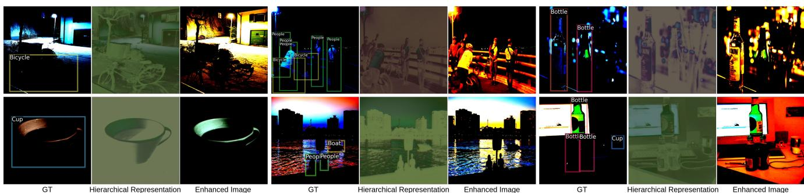
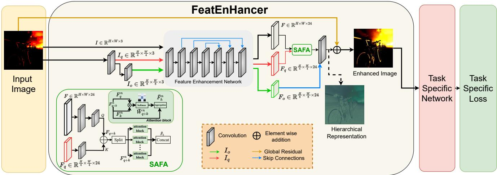
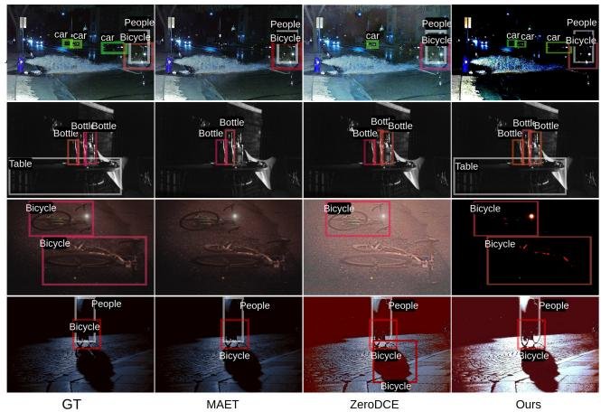
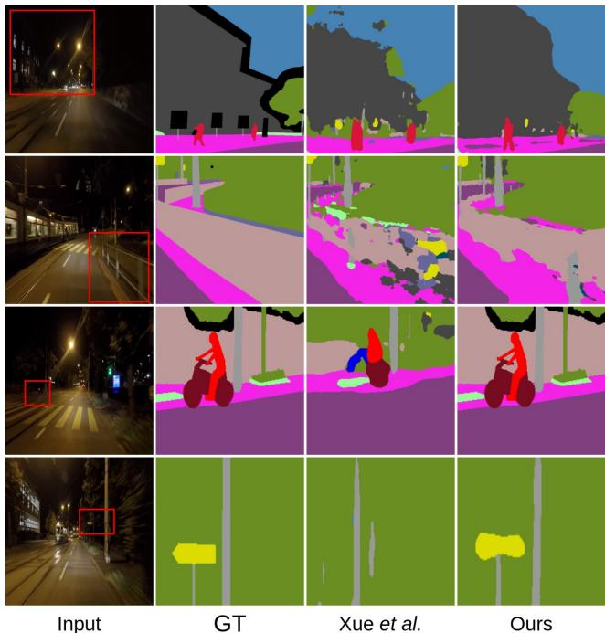

# FeatEnHancer: Enhancing Hierarchical Features for Object Detection and Beyond Under Low-Light Vision

Khurram Azeem Hashmi1,2, Goutham Kallempudi2, Didier Stricker1,2 and Muhammamd Zeshan Afzal1,2

1DFKI - German Research Center for Artificial Intelligence, 2RPTU Kaiserslautern, {khurram azeem.hashmi, didier.stricker, muhammad zeshan.afzal}@dfki.de, kallempu@rptu.de

  
Figure 1: Learned hierarchical representation and enhanced image from our FeatEnHancer. We train our FeatEnHancer on a downstream object detection task and visualize these images from the validation set. These maps and enhanced images show that despite producing less visually appealing images, our model enhances task-related features. Best viewed on the screen.

## Abstract

Extracting useful visual cuesfor the downstream tasks is especially challenging under low-light vision. Prior works create enhanced representations by either correlating visual quality with machine perception or designing illuminationdegrading transformation methods that require pre-training on synthetic datasets. We argue that optimizing enhanced image representation pertaining to the loss ofthe downstream task can result in more expressive representations. Therefore, in this work, we propose a novel module, FeatEnHancer, that hierarchically combines multiscalefeatures using multiheaded attention guided by task-related lossfunction to create suitable representations. Furthermore, our intra-scale enhancement improves the quality of features extracted at each scale or level, as well as combinesfeaturesfrom different scales in a way that reflects their relative importance for the task at hand. FeatEnHancer is a general-purpose plugand-play module and can be incorporated into any low-light vision pipeline. We show with extensive experimentation that the enhanced representation produced with FeatEnHancer significantly and consistently improves results in several low-

light vision tasks, including dark object detection (+5.7 mAP on ExDark), face detection (+1.5 mAP on DARK FACE), nighttime semantic segmentation (+5.1 mIoU on ACDC), and video object detection (+1.8 mAP on DarkVision), highlighting the effectiveness of enhancing hierarchical features under low-light vision.

## 1. Introduction

Recent remarkable advancements in high-level vision tasks have shown that given a high-quality image, current vision backbone networks [20, 15, 12, 32, 31], object detectors [42, 28, 43, 19, 2, 3, 49, 4, 71, 64, 65] and semantic segmentation models [34, 48, 57, 7, 58] can effectively learn desired features to perform vision tasks. Similarly, modern low-light image enhancement (LLIE) methods [44, 67, 14, 21, 17, 25] are capable of transforming a low-light image into a visual-friendly representation. However, a naive combination of the two brings sub-optimal gains when it comes to high-level vision tasks under lowlight vision.

This work explores the underlying reasons for the low performance of the combination of LLIE with high-level vision methods and observes the following limitations: 1) Although existing LLIE methods push the envelope of visual perception for human eyes, they do not align with vision backbone networks [20, 12, 15, 32, 31] due to lack of multi scale features. For instance, it is likely that the enhancement method increases brightness in some regions. However, it simultaneously corrupts the edges and texture information of objects. 2) The pixel distribution among different low-light images may have huge variance owing to the disparity in less illuminated environments [17, 25, 68]. This increases intra-class variance in some cases (see Fig. 3, where only one bicycle is recognized by [17] instead of two bicycles in the ground-truth). 3) Current LLIE approaches [14, 17, 25, 21, 44, 56, 67] employ enhancement loss functions to optimize the enhancement networks. These loss functions compel the network to attend to all pixels equally, lacking the learning of informative details necessary for high-level downstream vision tasks such as object pose and shape for object detection. Furthermore, to train these enhancement networks, most of them [44, 14, 67, 56] require a set of highquality images, which is hardly available in a real-world setting.

Motivated by these observations and inspired by recent developments in LLIE [17, 25] and vision-based backbone networks [15, 32, 31], this paper aims to bridge the gap by exploring an end-to-end trainable recipe that jointly optimizes the enhancement and downstream task objectives in a single network. To this end, we present FeatEnHancer, a general-purpose feature enhancer that learns to enrich multiscale hierarchical features favourable for downstream vision tasks in a low-light setting. An example of learned hierarchi cal representation and the enhanced image is illustrated in Fig. 1.

In particular, our FeatEnHancer first downsamples a lowlight RGB input image to construct multi-scale hierarchical representations. Subsequently, these representations are fed to our Feature Enhancement Network (FEN), which is a deep convolutional network, employed to enrich intra-scale semantic representations. Note that the parameters of FEN can be adjusted through task-related loss functions, which pushes the FEN to only enhance the task-related features. This multiscale learning allows the network to enhance both global and local information from higher and lower-resolution features, respectively. Once the enhanced representations on different scales are obtained, the remaining obstacle is to fuse them effectively. To achieve, this, we select two different strategies to capture both global and local information from higher and lower-resolution features. First, to merge highresolution features, inspired by multi-head attention in [50], we design a Scale-aware Attentional Feature Aggregation (SAFA) method that jointly attends information from different scales. Second, for lower-resolution features, the skip connection [20] scheme is adopted to merge the enhanced representation from SAFA to lower-resolution features. With these jointly learned hierarchical features, our FeatEnHancer provides semantically powerful representations which can be exploited by advanced methods such as feature pyramid networks [27] for object detection [43] and instance segmentation [19], or UNet [45] for semantic segmentation [34].

The main contributions of this work can be summarized as follows:

1. We propose FeatEnHancer, a novel module that enhances hierarchical features to boost downstream vision tasks under low-light vision. Our intra-scale feature enhancement and scale-aware attentional feature aggregation schemes are aligned with vision backbone networks and produce powerful semantic representations. FeatEnHancer is a general-purpose plug-and-play module that can be trained end-to-end with any highlevel vision task.

2. To the best of our knowledge, this is the first work that fully exploits multi-scale hierarchical features in low-light scenarios and generalizes to several downstream vision tasks such as object detection, semantic segmentation, and video object detection.

3. Extensive experiments on four different downstream visions tasks covering both images and videos demonstrate that our method brings consistent and significant improvements over baselines, LLIE methods and taskspecific state-of-the-art approaches.

## 2. Related Work

## 2.1. Enhancing Low-Light Images

Deep learning-based LLIE methods focus on improving the visual quality of low-light images that satisfies human visual perception [23, 22]. Most LLIE approaches [14, 44, 56, 67] operate under a supervised learning paradigm, requiring paired data during training. Unsupervised GANbased methods [21] eliminate the need for paired data during the training. However, their performance relies on the careful choice of unpaired data. Recently, zero-reference methods [17, 25, 68] discard the need for both paired and unpaired data to enhance low-light images by designing a set of non-reference loss functions. Inspired by these recent developments, this work aims to bridge low-light enhancement and downstream vision tasks (such as object detection [10, 33, 62], semantic segmentation [60, 47], and video object detection [63]) by enhancing multi-scale hierarchical features without needing paired or unpaired data to boost performance.

## 2.2. Enhancing Low-Light for Downstream Vision Tasks

These approaches consider machine perception as the criteria for success while enhancing images to improve downstream vision tasks. One obvious way to achieve this goal is to apply the LLIE methods as an initial step [70, 17]. However, this leads to unsatisfactory results (see Table 2, 4, and 5). Recently, another line of work has explored end-toend pipelines, optimizing both enhancement and individual tasks during training, and our work follows the same spirit. Face detection. Liang et al. [26] propose an effective information extraction scheme from low-light images by exploiting multi-exposure generation. Furthermore, bi-directional domain adaptation [52, 51] and parallel architecture that jointly performs enhancement and detection [37] are presented to advance the research. However, these approaches are carefully designed to tackle face detection [62, 53] only and deliver minor improvements when applied to generic object detection [51]. Contrarily, our FeatEnHancer is a general-purpose module. It significantly improves several downstream vision tasks. Hence, we refrain from comparing our method to architectures only evaluated for face detection.

Dark object detection. Dark (low-light) object detection [10, 30] methods have emerged recently, thanks to the real-world low illumination datasets [33, 39]. IA-YOLO [30] introduces a convolutional neural network (CNN)-based parameter predictor that learns the optimal configuration for the filters employed in the differential image processing module. Most related to our work is MAET [10], which investigates the physical noise model and image signal processing (ISP) pipeline under low illumination and learns the model to predict degradation parameters and object features. To avoid feature entanglement, they impose orthogonal tangent regularity to penalize cosine similarity between objects and degrading features. However, owing to the weather-specific hyperparameters in [30] and degradation parameters in [10], these works rely on large synthetic datasets to achieve desired performance. Unlike them, our FeatEnHancer is optimized from the task-related loss functions and does not require any pre-training on synthetic datasets mimicking low-light or harsh weather conditions.

Other high-level vision tasks. Besides face and object detection, recent research has explored high-level computer vision tasks like semantic segmentation [6, 34]. Xue et al. [60] devise a contrastive-learning strategy to improve visual and machine perception simultaneously, achieving impressive performance on nighttime semantic segmentation of adverse conditions dataset with correspondences (ACDC) dataset [47]. Furthermore, DarkVision [63] has emerged recently to tackle video object detection under low-light vision. In this work, thanks to [47, 63], we apply FeatEnHancer to semantic segmentation and video object detection under low-light vision to investigate its generalization capabilities.

## 2.3. Learning Multi-scale Hierarchical Features

Representing objects at varying scales is one of the main difficulties in computer vision. Therefore, the work in this domain goes back to the era of hand-engineered features [36, 11, 38, 24]. Modern object detectors [43, 28, 2, 71, 49, 40, 65] exploit multi-scale features to tackle this challenge. Similarly, multi-scale representations [34] and pyramid pooling schemes [69] have been proposed for effective semantic segmentation. Moreover, current improvements in vision-based backbone networks [15, 31, 32] demonstrate that learning hierarchical features during feature extraction directly uplifts the downstream vision tasks [19, 57, 2]. However, the multi-scale and hierarchical structures of CNN have not been fully explored for low-light vision tasks.

Under harsh weather conditions, DENet [41] employs Laplacian Pyramid [1] to decompose images into low and high-frequency components for object detection. Despite the encouraging results, the multi-scale feature learning in DENet relies on the Laplacian pyramid, which is susceptible to noise and may produce inconsistencies in regions with high contrast or sharp edges. Alternatively, aligned with the multi-scale learning in modern vision backbone networks [27, 32, 31], our FeatEnHancer employs CNN to generate multi-scale feature representations, which are fused through the scale-aware attentional feature aggregation and skip connections. Our approach is much more flexible and aligns with downstream vision tasks, boosting state-of-theart results on multiple downstream vision tasks.

## 3. Proposed Approach

The key idea of this paper is to design a general-purpose pluggable module that strengthens machine perception under low-light vision to solve several downstream vision tasks such as object detection, semantic segmentation, and video object detection. The overall architecture of FeatEnHancer is exhibited in Fig. 2. Our FeatEnHancer takes a low-light image as input and adaptively boosts its semantic representation by enriching task-related hierarchical features. We now discuss the key components of FeatEnHancer in detail.

## 3.1. Hierarchical Feature Enhancement

Inspired by the recent improvements in vision-based backbone networks [15, 31, 32], we introduce the enhancement of hierarchical features through jointly optimizing feature enhancement and downstream tasks under low-light vision. Unlike [15, 31, 32], our goal is to extract spatial features from low-light images and generate meaningful semantic representations. In order to enhance hierarchical features, we first construct multi-scale representations from the low-light input image. Later, we feed these multi-scale representations to our feature enhancement network.

  
Figure 2: Network architecture of the proposed FeatEnHancer employed in a downstream vision task. Our FeatEnHancer takes a low-light image and adaptively boosts its semantic representation by enriching task-related hierarchical features. Zoom in for the best view.

Constructing multi-scale representations. We take a lowlight RGB image $I ~ \in ~ \bar { \mathbb { R } ^ { H \times W \times C } }$ as input and employ regular convolutional operator Conv(.) on I to generate $\bar { I _ { q } } \in \mathbb { R } ^ { \frac { H } { 4 } \times \frac { W } { 4 } \times 3 }$ and $I _ { o } \in \mathbb { R } ^ { \frac { H } { 8 } \times \frac { W } { 8 } \times 3 }$ representing the quarter and octa scale of an input image, respectively. To summarize, it can be written as:

$$
\begin{array} { r } { I _ { q } = \mathbf { C o n v } ( I ) \qquad K = 7 , S = 4 , } \\ { I _ { o } = \mathbf { C o n v } ( I _ { q } ) \qquad K = 3 , S = 2 , } \end{array}\tag{1}
$$

where K and S denote kernel size and stride, and H, W, and C represent the height, width, and channels of an image.

Feature enhancement network. In order to enhance features at each scale, we require an enhancement network that learns to enhance spatial information important for downstream tasks. Inspired by low-light image enhancement networks [17, 25], we design a fully convolutional intra-scale feature extraction network (FEN). However, unlike [17, 25], our FEN introduces a single convolutional layer at the beginning that generates a feature map $F \in \mathbb { R } ^ { H \times W \times C }$ , where C is transformed from 3 to 32 by keeping the resolution $( H \times W )$ same as the input. Then a series of six convolutional layers with symmetrical skip concatenation is applied, where each convolutional layer, with K = 3 and $S = 1$ is accompanied by the ReLU activation function. We apply FEN on each scale $I , I _ { q } ,$ , and $I _ { o }$ separately, and obtain multiscale feature representations, denoted as $F , F _ { q }$ , and $F _ { o } ,$ respectively. This multi-scale learning allows the network to enhance both global and local information from higher and lower-resolution features. Hence, we ignore down-sampling and batch normalization to preserve semantic relations be tween neighbouring pixels which is similar to [17]. However, we discard the last convolutional layer of DCENet [17] in our FEN and propagate the final enhanced feature representations from each scale for the multi-scale feature fusion. Note that the implementation details of FEN in FeatEnHancer are independent of the proposed module, and even more, advanced image enhancement networks such as [68] can be applied to improve performance. Now, we discuss multiscale feature fusion in detail.

## 3.2. Multi-scale Feature Fusion

Since we already have multi-scale feature representations $( F , F _ { q } ,$ and $F _ { o } )$ from FEN, the remaining obstacle is to fuse them effectively. Lower-scale features $( F _ { o } )$ contain fine details and edges. In contrast, higher-resolution features $( F _ { q } )$ capture more abstract information, such as shapes and patterns. Therefore, naive aggregation leads to inferior performance (see Table 6a). Hence, we adopt two different strategies to capture both global and local information from higher and lower-resolution features. First, inspired by multi-head attention in [50] that enables the network to jointly learn in formation from different channels, we design a scale-aware attentional feature aggregation (SAFA) module that jointly attends to features from different scales. Second, we adopt a skip connection [20] (SC) scheme to integrate low-level information from $F _ { o }$ and the enhanced representation from SAFA to obtain the final enhanced hierarchical representation. Adopting SAFA for merging high-resolution features and SC for lower-resolution features leads to a more robust hierarchical representation (see Table 6b). Now, we discuss SAFA in detail.

Scale-aware Attentional Feature Aggregation. Even though high-resolution features assist in capturing fine details, such as recognizing small objects, applying an attentional operation to them is computationally demanding. Thus, in SAFA, we propose an efficient multi-scale aggregation strategy where enhanced high-resolution hierarchical features are projected to a smaller resolution prior to attentional feature aggregation. As illustrated in Figure 2, SAFA transforms $F \in \mathbb { R } ^ { \times W \times C }$ to $Q \in \mathbb { R } ^ { \frac { H } { 8 } \times \frac { W } { 8 } \times C }$ with two convolutional layers $( K = 7 , S = 4 ; K = 3 , S = 2 )$ and $F _ { q } \in \mathbb { R } ^ { \frac { H } { 4 } \times \frac { W } { 4 } \times \check { C _ { \mathrm { ~ t o ~ } } } } \mathrm { t o } \dot { K } \in \mathbb { R } ^ { \frac { H } { 8 } \times \frac { W } { 8 } \times C }$ with a single convolutional layer $( K = 3 , S = 2 )$ . Note that the weights of the convolutional layer $( K = 3 , S = 2 )$ are not shared because, in addition to down-scaling the high-resolution features, it serves as an embedding network before computing the attentional weights. Later, Q and K are concatenated to form the set of hierarchical features $F _ { q + k }$ , which are split into N blocks along the channel dimension C:

$$
F _ { q + k } ^ { n } = F _ { q + k } [ : , : , ( n - 1 ) \frac { C } { N } : n \frac { C } { N } ] ,\tag{2}
$$

where $n \in \{ 1 , 2 , . . . , N \}$ and N is the total number of attentional blocks. The $F _ { q + k } ^ { n } \in \mathbb { R } ^ { \frac { H } { 8 } \times \frac { W } { 8 } \times \frac { C } { N } }$ is used to compute attentional weights W in a single attention block as follows:

$$
\begin{array} { r } { W _ { q + k } ^ { n } = F _ { q } ^ { n } \cdot F _ { k } ^ { n } , } \end{array}\tag{3}
$$

$$
\bar { \mathbf { W } } _ { q + k } ^ { n } = \frac { \exp ( W _ { q + k } ^ { n } ) } { \sum _ { l = 1 } ^ { L } \exp ( W _ { q + k } ^ { n } ) } ,\tag{4}
$$

where $W _ { q + k } ^ { n }$ is the attentional weights of $F _ { q } ^ { n }$ and $F _ { k } ^ { n }$ for n-th block, and $\bar { \mathbf { W } } _ { q + k } ^ { n }$ is the normalized form of $W _ { q + k } ^ { n } .$ Derived from the n-th block of normalized attention weights, we apply weighted sum to compute the n-th block of enhanced hierarchical representation $\begin{array} { r } { \bar { \bar { \mathbf { F } } } _ { h } ^ { n } \in \mathbb { R } ^ { \frac { H } { 8 } \times \frac { W } { 8 } \times \frac { C } { N } } } \end{array}$ as follows:

$$
\bar { \mathbf { F } } _ { h } ^ { n } = \sum _ { l = 1 } ^ { L } \bar { \mathbf { W } } _ { q + k } ^ { n } \cdot F _ { q + k } ^ { n } ,\tag{5}
$$

now we concatenate all $\bar { \mathbf { F } } _ { h } ^ { n }$ along the channel dimension to obtain $\bar { \mathbf { F } } _ { h } \in \mathbb { R } ^ { \frac { H } { 8 } \times \frac { W } { 8 } \times \dot { C } }$ . Note that although $\bar { \mathbf { F } } _ { h }$ is the same size as $Q$ and $K .$ , it contains far richer representations, encompassing information from multi-scale high-resolution features.

Subsequently, as explained earlier in Sec. 3.2, with the help of skip connections (SC), we integrate $F _ { o }$ and $\bar { \mathbf { F } } _ { h }$ to obtain the final enhanced hierarchical representation covering both global and local features, as illustrated in Figure 1 and 2. Note that prior to the skip connection, we upsample $\bar { \mathbf { F } } _ { h }$ and $F _ { o }$ , where the upsampling operation $\begin{array} { r } { \\\\dot { U ( . ) } \in \mathbb { R } ^ { \frac { H } { 8 } \times \frac { W } { 8 } \times C }  \mathbb { R } ^ { H \times W \times C } } \end{array}$ is performed with sim ple bi-linear interpolation operation, which is much faster than using transposed convolutions [13]. Unlike image enhancement in existing works [17, 25, 10], with a multi-scale hierarchical feature enhancement strategy, our FeatEnHancer learns a powerful semantic representation by capturing both local and global features. This makes it a general-purpose module to enhance hierarchical features, boosting machine perception under low-light vision.

<table><tr><td>Dataset</td><td>Task</td><td>#Cls</td><td>#Train</td><td>#Val</td></tr><tr><td>ExDark [33]</td><td>Dark object detection</td><td>12</td><td>4800</td><td>2563</td></tr><tr><td>DARK FACE [62]</td><td>Face detection</td><td>1</td><td>5400</td><td>600</td></tr><tr><td>ACDC Nightime [47]</td><td>Semantic segmentation</td><td>19</td><td>400</td><td>106</td></tr><tr><td>DarkVision [63]</td><td>Video object detection</td><td>4</td><td>26</td><td>6</td></tr></table>

Table 1: Statistics of the datasets used to report results on four different downstream vision tasks. #Cls is the number of classes, whereas #Train and #Val denote number of training and validation samples for each dataset, respectively.

## 4. Experiments

We conduct extensive experiments for evaluating the proposed FeatEnHancer module to several downstream tasks under the low-light vision, including generic object detection [33, 39], face detection [62], semantic segmentation [47], and video object detection [63]. Table 1 summarizes the crucial statistics of the employed datasets. This section first compares the proposed method with powerful baselines, existing LLIE approaches, and task-specific stateof-the-art methods. Then, we ablate the important design choices of our FeatEnHancer. We provide complete implementation details for each experiment in Appendix A.

## 4.1. Dark Object Detection

Settings. For dark object detection experiments on the realworld data, we consider the exclusively dark (ExDark) [33] dataset (see Table 1). We adopt RetinaNet [28] as a typical detector and Featurized Query R-CNN [65] (FQ R-CNN) as an advanced object detection framework to report results. In the case of both detectors, pre-trained models on COCO [29] are fine-tuned on each dataset. For RetinaNet, images are resized to 640×640, and we train the network using 1×schedule in mmdetection [5] (12 epochs using SGD optimizer [46] with an initial learning rate of 0.001). For Featurized Query R-CNN, we employ multiscale training [4, 49, 65] (shorter side ranging from 400 to 800 with a longer side of 1333). The FQ R-CNN is trained for 50000 iterations using ADAMW [35] optimizer (initial learning rate of 0.0000025, weight decay of 0.0001, and batch size of 8). Note that for each object detection framework, we adopt the same settings while reproducing results of our work, baseline, LLIE approaches, and task-specific state-of-the-art methods.

We compare our FeatEnHancer to several state-of-theart LLIE methods, including KIND [67], RAUS [44], EnGAN [21], MBLLEN [14], Zero-DCE [17], Zero-DCE++ [17], and state-of-the-art dark object detection method, MAET [10]. For LLIE methods, all images are enhanced from their released checkpoints and propagated to the detector. In case of MAET [10], we pre-train the detector using their proposed degrading pipeline and then fine-tune it on both datasets to establish a direct comparison.

<table><tr><td rowspan="2">Methods</td><td colspan="2">RetinaNet</td><td colspan="2">FQ R-CNN</td></tr><tr><td>mAP50</td><td>mAP</td><td>mAP50</td><td>mAP</td></tr><tr><td>Baseline</td><td>72.1</td><td>46.3</td><td>74.5</td><td>47.0</td></tr><tr><td>RAUS [44]</td><td>64.7</td><td>44.0</td><td>77.0</td><td>48.1</td></tr><tr><td>KIND [67]</td><td>70.7</td><td>45.1</td><td>80.5</td><td>51.5</td></tr><tr><td>Zero-DCE++ [25]</td><td>70.3</td><td>45.2</td><td>79.5</td><td>49.2</td></tr><tr><td>EnGAN [21]</td><td>70.4</td><td>44.9</td><td>80.0</td><td>51.9</td></tr><tr><td>MBLLEN [14]</td><td>70.6</td><td>45.1</td><td>80.0</td><td>51.0</td></tr><tr><td>Zero-DCE [17]</td><td>71.0</td><td>45.2</td><td>80.6</td><td>52.0</td></tr><tr><td>MAET [10]</td><td>71.8</td><td>45.7</td><td>81.6</td><td>52.4</td></tr><tr><td>FeatEnHancer</td><td>72.6</td><td>46.4</td><td>86.3</td><td>56.5</td></tr></table>

<table><tr><td rowspan="2">Methods</td><td colspan="2">RetinaNet</td><td colspan="2">FQ R-CNN</td></tr><tr><td>AP50</td><td>AP</td><td>AP50</td><td>AP</td></tr><tr><td>Baseline</td><td>47.3</td><td>19.9</td><td>67.5</td><td>28.6</td></tr><tr><td>RAUS [44]</td><td>42.1</td><td>17.6</td><td>65.5</td><td>27.4</td></tr><tr><td>KIND [67]</td><td>47.2</td><td>19.8</td><td>65.0</td><td>27.5</td></tr><tr><td>Zero-DCE++ [25]</td><td>47.3</td><td>20.1</td><td>66.2</td><td>28.2</td></tr><tr><td>EnGAN [21]</td><td>45.1</td><td>19.3</td><td>67.4</td><td>28.4</td></tr><tr><td>MBLLEN [14]</td><td>47.1</td><td>19.8</td><td>67.3</td><td>27.1</td></tr><tr><td>Zero-DCE [17]</td><td>47.4</td><td>20.1</td><td>66.9</td><td>27.5</td></tr><tr><td>MAET [10]</td><td>44.3</td><td>18.7</td><td>66.1</td><td>27.1</td></tr><tr><td>FeatEnHancer</td><td>47.2</td><td>19.9</td><td>69.0</td><td>29.4</td></tr></table>

<table><tr><td>Method</td><td>mIoU</td></tr><tr><td>Baseline [7] RetinexNet [54]</td><td>45.7 41.9</td></tr><tr><td>DRBN [59]</td><td>43.3</td></tr><tr><td>FIDE [61]</td><td>43.4</td></tr><tr><td>KIND [67]</td><td>43.0</td></tr><tr><td>EnGAN [21]</td><td>43.8</td></tr><tr><td>ZeroDCE [17]</td><td>43.4</td></tr><tr><td></td><td></td></tr><tr><td>SSIENet [66]</td><td>41.4</td></tr><tr><td>Xue et al. [60]</td><td>49.8</td></tr><tr><td>FeatEnHancer</td><td>54.9</td></tr></table>

Table 2: Quantitative comparison on ExDark dataset. Results obtained on the commonly used evaluation metrics are highlighted. Our Feat-EnHancer brings consistent improvements and achieves new state-of-the-art results with FQ R-CNN.  
Table 3: Comparing FeatEnHancer on the DARK FACE dataset. With RetinaNet, Feat-EnHancer performs on par with other methods. However, with FQ R-CNN, FeatEnHancer surpasses all of them.  
Table 4: Quantitative comparison on the ACDC dataset. Huge gains from our FeatEn-Hancer lead to new stateof-the-art results.

Results on ExDark. Table 2 lists the results of LLIE works, MAET, and the proposed method on both object detection frameworks. It is evident that our FeatEnHancer brings consistent and significant gains over prior methods. Note that, while the performance of MAET and our method is comparable on RetinaNet $( \approx 7 2 \mathrm { \ A P _ { 5 0 } ) }$ , the proposed FeatEnHancer outperforms MAET by a significant margin on FQ R-CNN, achieving the new state-of-the-art $\mathrm { { A P } _ { 5 0 } }$ of 86.3. Furthermore, Figure 3 shows four detection examples from our method and the two best competitors using FQ R-CNN as a detector. These results illustrate that despite the inferior visual quality, our FeatEnHancer enhances hierarchical features that are favourable for dark object detection, producing state-of-the-art results.

## 4.2. Face Detection on DARK FACE

Settings. The DARK FACE [53, 62] is a challenging face detection dataset released for the $\mathrm { U G } ^ { 2 }$ competition. For experiments on the DARK FACE (see Table 1), the images are resized to a larger resolution of 1500 × 1000 for all methods. We adopt the same object detection frameworks of RetinaNet and FQ R-CNN and follow identical experimental settings, as explained in Sec. 4.1.

Results. The performance of FeatEnHancer, MAET, and six LLIE methods, using RetinaNet and Featurized Query R-CNN, are summarized in Table 3. Note that a few LLIE methods [17, 25, 67] yield superior results than our approach in the case of RetinaNet. We argue that due to tiny faces with highly dark images in the DARK FACE dataset, RetinaNet fails to capture information even from the enhanced hierarchical features. We discuss this behaviour with an example in Appendix B. On the other hand, LLIE approaches directly provides well-lit images that bring slightly bigger gains $( + 0 . 1 \ \mathrm { m A P _ { 5 0 } ) }$ in this case. However, note that with the more strong detector, our FeatEnHancer surpasses all the LLIE methods and MAET by a significant margin (+1.5 $\mathrm { m A P _ { 5 0 } ) }$ , achieving $\mathrm { \ m A P _ { 5 0 } }$ of 69.0.

  
Figure 3: Visual comparison of FeatEnHancer with the two previous best competitors on the ExDark dataset. Zoom in for the best view.

## 4.3. Nighttime Semantic Segmentation on ACDC

Settings. We utilize nighttime images from the ACDC dataset [47] (see Table 1) to report results on semantic segmentation in a low-light setting. DeepLabV3+ [7] is adopted as the segmentation baseline from mmseg [8] for straightforward comparison with the concurrent work [60]. We follow identical experimental settings as in [60]. Refer to Appendix A for complete implementation details.

Results. We compare our method with several state-of-theart LLIE methods, including RetinexNet [54] KIND [67],

Figure 4: Qualitative comparison of FeatEnHancer with previous best work [60] on the ACDC nighttime semantic segmentation. FeatEnHancer provides more accurate segmentations.
<table><tr><td>Method</td><td>Illumination (3.2) mAP</td><td>Illumination (0.2) mAP</td></tr><tr><td>Baseline [55]</td><td>32.8</td><td>10.4</td></tr><tr><td>RAUS [44]</td><td>7.42</td><td>5.19</td></tr><tr><td>EnGAN [21]</td><td>7.83</td><td>5.41</td></tr><tr><td>MBLLEN [14]</td><td>7.82</td><td>5.39</td></tr><tr><td>KIND [67]</td><td>7.43</td><td>5.25</td></tr><tr><td>Zero-DCE++ [25]</td><td>7.51</td><td>5.02</td></tr><tr><td>Zero-DCE [17]</td><td>7.83</td><td>5.43</td></tr><tr><td>FeatEnHancer</td><td>34.6</td><td>11.2</td></tr></table>

Table 5: Comparing FeatEnHancer with LLIE methods on the DarkVision dataset. FeatEnHancer is the only method that boosts the performance of the powerful baseline method on both illumination levels.

FIDE [61], DRBN [59], EnGAN [21], SSIENet [66], ZeroDCE [17], and current state-of-the-art nighttime semantic segmentation method Xue et al. [60]. As shown in Table 4, our FeatEnHancer brings remarkable improvements in the baseline with a mIoU of 54.9, outperforming the previous best result by 5.1 points. Moreover, we present a qualitative comparison with the previous best competitor [60] in Figure 4. Evidently, our FeatEnHancer generates more accurate segmentation for both bigger and smaller objects, such as terrain and traffic signs in the last row. These results affirm the effectiveness of FeatEnHancer as a general-purpose module achieving state-of-the-art results in both dark object detection and nighttime semantic segmentation.

## 4.4. Video Object Detection on DarkVision

Settings. We extend our experiments from static images to video domain to test the generalization capabilities of our method. The video object detection under low-light vision is evaluated on the recently emerged DarkVision dataset [63] (see Table 1 for dataset details). Although the dataset is not publicly available yet, we sincerely thank the authors of [63] for providing prompt access. To evaluate our FeatEnHancer under low light settings, we take the low-end camera split on two different illumination levels, i.e., 0.2 and 3.2. For ablation studies, we adopt a 3.2% illumination level split. We consider SELSA [55] as our baseline and follow identical experimental settings with the ResNet-50 backbone network in the mmtracking [9]. To establish a direct comparison, we enhance all video frames first through LLIE methods and feed these frames to the baseline, as done in Sec. 4.1. As a common practice in video object detection [16, 18, 55], the mAP@IoU=0.5 is utilized as an evaluation metric to report results. More details can be found in Appendix A.

Results. Table 5 compares our FeatEnHancer with several LLIE methods [44, 21, 14, 67, 17, 25] and the powerful video object detection baseline [55]. Evidently, our Feat-EnHancer provides considerable gains to the baseline with 34.6 mAP and 11.2 mAP under illumination levels of 3.2 and 0.2, respectively. Note that our FeatEnHancer is the only method that boosts performance under both image and video modalities. In contrast, as shown in Table 5, existing LLIE methods not only fail to assist the baseline method but also deteriorate the performance. This poor generalization of LLIE approaches highlights that learning from domainspecific paired data [14, 67, 44], unpaired data [21], and curve estimation without data [17, 25] are not the optimal solutions for generalized enhancement methods. Hence, more research is required.

## 4.5. Ablation Studies

This section ablates important design choices in the proposed FeatEnHancer when plugged into RetinaNet, DeeplabV3+, and SELSA on ExDark (dark object detection), ACDC (nighttime semantic segmentation), and DarkVision with illumination level of 3.2% (video object detection), respectively.

SAFA in FeatEnHancer. The important component of the proposed FeatEnHancer is the scale-aware attentional feature aggregation (SAFA) that aggregates high-resolution features. To validate its effectiveness, we conduct multiple experiments where SAFA is replaced with simple averaging or skip connections (SC) [20] to fuse enhanced multi-scale features F and $F _ { q }$ (see Sec. 3.2). The experiment results are summarized in Table 6a. It is clear that SAFA outperforms both averaging and SC strategies by +2.3 mAP on ExDark, +3.2 mIoU on ACDC, and +1.5 mAP on DarkVision. These significant boosts across all three benchmarks indicate that scale-aware attention leads to optimal multi-scale feature aggregation in the proposed FeatEnHancer.

(d) Scales for $I _ { q }$ and ${ \cal I } _ { o } ,$ respectively. (e) # attentional blocks in SAFA.
<table><tr><td>Method</td><td>ExDark (mAP)</td><td>ACDC (mIoU)</td><td>DarkVision (mAP)</td></tr><tr><td>simple averaging</td><td>69.5</td><td>50.3</td><td>32.9</td></tr><tr><td>skip connections [20]</td><td>70.3</td><td>51.7</td><td>33.1</td></tr><tr><td>SAFA</td><td>72.6</td><td>54.9</td><td>34.6</td></tr></table>

(a) Effectiveness of SAFA.

<table><tr><td>Method</td><td>ExDark (mAP)</td><td>ACDC (mIoU)</td><td>DarkVision (mAP)</td></tr><tr><td>SC, SC</td><td>69.7</td><td>51.7</td><td>32.8</td></tr><tr><td>SAFA , SAFA</td><td>70.2</td><td>52.6</td><td>33.4</td></tr><tr><td>SC, SAFA</td><td>70.9</td><td>52.9</td><td>33.8</td></tr><tr><td>SAFA, SC</td><td>72.6</td><td>54.9</td><td>34.6</td></tr></table>

(b) Various combinations of multi-scale fusion.
<table><tr><td rowspan=1 colspan=1>Method</td><td rowspan=1 colspan=1>ExDark(mAP)</td><td rowspan=1 colspan=1>ACDC(mIoU)</td><td rowspan=1 colspan=2>DarkVision  Scale(mAP)</td><td rowspan=1 colspan=1>ExDark(mAP)</td><td rowspan=1 colspan=1>ACDC(mIoU)</td><td rowspan=1 colspan=2>DarkVision $N$ (mAP)</td><td rowspan=1 colspan=1>ExDark(mAP)</td><td rowspan=1 colspan=1>ACDC(mIoU)</td><td rowspan=1 colspan=1>DarkVision(mAP)</td></tr><tr><td rowspan=3 colspan=1>maxpooladavgpool [68]interpolation [30]</td><td rowspan=2 colspan=1>69.369.9</td><td rowspan=2 colspan=1>51.350.7</td><td rowspan=1 colspan=2>32.9     (2, 4)</td><td rowspan=1 colspan=1>71.8</td><td rowspan=1 colspan=1>52.7</td><td rowspan=1 colspan=2>34.1      2</td><td rowspan=1 colspan=1>72.1</td><td rowspan=1 colspan=1>53.9</td><td rowspan=1 colspan=1>34.2</td></tr><tr><td rowspan=2 colspan=1>70.7</td><td rowspan=1 colspan=2>32.9     (4,8)</td><td rowspan=1 colspan=1>72.6</td><td rowspan=1 colspan=1>54.9</td><td rowspan=1 colspan=1>34.6</td><td rowspan=1 colspan=1>4</td><td rowspan=1 colspan=1>72.4</td><td rowspan=1 colspan=1>54.3</td><td rowspan=1 colspan=1>34.5</td></tr><tr><td rowspan=1 colspan=1>51.5</td><td rowspan=1 colspan=1>33.1</td><td rowspan=1 colspan=1>(4, 16)</td><td rowspan=1 colspan=1>71.5</td><td rowspan=1 colspan=1>51.4</td><td rowspan=1 colspan=1>33.9</td><td rowspan=1 colspan=1>8</td><td rowspan=1 colspan=1>72.6</td><td rowspan=1 colspan=1>54.9</td><td rowspan=1 colspan=1>34.6</td></tr><tr><td rowspan=1 colspan=1>Convolution</td><td rowspan=1 colspan=1>72.6</td><td rowspan=1 colspan=1>54.9</td><td rowspan=1 colspan=1>34.6</td><td rowspan=1 colspan=1>(8, 16)</td><td rowspan=1 colspan=1>68.7</td><td rowspan=1 colspan=1>45.6</td><td rowspan=1 colspan=1>31.9</td><td rowspan=1 colspan=1>12</td><td rowspan=1 colspan=1>72.4</td><td rowspan=1 colspan=1>54.3</td><td rowspan=1 colspan=1>34.1</td></tr></table>

(c) Downsampling approaches.  
Table 6: Ablations for the proposed FeatEnHancer on three benchmarks. (a) We investigate the effectiveness of SAFA by replacing it with different aggregation methods to fuse F and $F _ { q } .$ . (b) We experiment with various combinations of SAFA and skip connection (SC) to justify an optimal design choice. Here, (SC, SC) means employing only skip connections to merge both $F _ { q }$ and $F _ { o }$ with $F .$ (c) Besides convolution, we experiment with other downsampling techniques to generate lower resolutions. Here, adavgpool denotes adaptive average pooling as done in [68]. (d) We vary scale sizes to generate lower-scale representations. Here, (2, 4) means $I _ { q } \in \mathbb { R } ^ { \frac { H } { 2 } \times \frac { W } { 2 } \times 3 }$ and $I _ { o } \in \mathbb { R } ^ { \frac { H } { 4 } \times \frac { W } { 4 } \times 3 }$ . (e) We vary number of attentional blocks N in SAFA of FeatEnHancer. Default settings are highlighted

Multi-scale feature fusion. We experiment with various combinations of SAFA and SC to find an optimal design choice to fuse $F _ { q }$ and $F _ { o }$ with F (see Sec. 3.2). As shown in Table 6b, there is a clear increase in performance, achieving (72.6 mAP on ExDark, 54.9 mIoU on ACDC, and 34.6 mAP on DarkVision) when SAFA is applied to fuse F and $F _ { q }$ first, and then $F _ { o }$ is merged with the output of SAFA using skip connection. Hence, we use this approach as the default setting.

Convolutional Downsampling. Table 6c summarizes results from different downsampling techniques applied on the input image I to generate lower-resolutions $I _ { q }$ and $I _ { o }$ (see Sec 3.1). Our proposed convolutional downsampling yields impressive gains of +1.9 mAP on ExDark, +3.4 mIoU, and +1.5 mAP on DarkVision compared to max-pooling, adaptive average pooling [68], and bilinear interpolation [30]. These results demonstrate the effectiveness of convolutional downsampling since it is better aligned with various vision backbone networks [32, 15, 27].

Different Scale sizes. We analyse the effect of different scale sizes to generate lower resolutions in Table 6d. Here, for instance, (2, 4) means that the resolution of input image $I \in \mathbb { R } ^ { H \times W \times 3 }$ is reduced by a factor of 2 and 4 to generate $I _ { q } \in \mathbb { R } ^ { \frac { H } { 2 } \times \frac { W } { 2 } \times 3 }$ and $I _ { o } \in \mathbb { R } ^ { \frac { \ l } { 4 } \times \frac { W } { 4 } \times 3 }$ , respectively. Note that all these scales are generated through regular convolutional operator Conv(.), as explained in Eq. 1. Looking at results in Table 6d, the top performance on all three tasks is achieved with the scale size of (4, 8), thereby, preferred as a default setting.

Number of Attention Blocks in SAFA. Table 6e studies the effect of the number of attention blocks N in our SAFA. The performance rises for all three tasks with the increase in N. This demonstrates that more attentional blocks in SAFA bring additional gains. The best performance with 72.6 mAP on ExDark, 54.9 mIoU on ACDC, and 34.6 mAP on DarkVision is achieved when N reaches 8, and after that, it tends to saturate. Hence, N = 8 is used as the default setting.

## 5. Conclusion

This paper proposes FeatEnHancer, a novel generalpurpose feature enhancement module designed to enrich hierarchical features favourable for downstream tasks under low-light vision. Our intra-scale feature enhancement and scale-aware attentional feature aggregation schemes are aligned with vision backbone networks and produce powerful semantic representations. Furthermore, our FeatEn-Hancer neither requires pre-training on synthetic datasets nor relies on enhancement loss functions. These architectural innovations make FeatEnHancer a plug-and-play module. Extensive experiments on four different downstream visions tasks covering both images and videos demonstrate that our method brings consistent and significant improvements over baselines, LLIE methods, and task-specific state-of-the-art approaches.

## References

[1] Peter J Burt and Edward H Adelson. The laplacian pyramid as a compact image code. In Readings in computer vision, pages 671–679. Elsevier, 1987.

[2] Zhaowei Cai and Nuno Vasconcelos. Cascade R-CNN: delving into high quality object detection. In 2018 IEEE Conference on Computer Vision and Pattern Recognition, CVPR 2018, Salt Lake City, UT, USA, June 18-22, 2018, pages 6154– 6162. Computer Vision Foundation / IEEE Computer Society, 2018.

[3] Zhaowei Cai and Nuno Vasconcelos. Cascade r-cnn: High quality object detection and instance segmentation. IEEE Transactions on Pattern Analysis and Machine Intelligence, 43(5):1483–1498, 2021.

[4] Nicolas Carion, Francisco Massa, Gabriel Synnaeve, Nicolas Usunier, Alexander Kirillov, and Sergey Zagoruyko. End-toend object detection with transformers. In Andrea Vedaldi, Horst Bischof, Thomas Brox, and Jan-Michael Frahm, editors, Computer Vision - ECCV 2020 - 16th European Conference, Glasgow, UK, August 23-28, 2020, Proceedings, Part I, volume 12346 of Lecture Notes in Computer Science, pages 213–229. Springer, 2020.

[5] Kai Chen, Jiaqi Wang, Jiangmiao Pang, Yuhang Cao, Yu Xiong, Xiaoxiao Li, Shuyang Sun, Wansen Feng, Ziwei Liu, Jiarui Xu, Zheng Zhang, Dazhi Cheng, Chenchen Zhu, Tianheng Cheng, Qijie Zhao, Buyu Li, Xin Lu, Rui Zhu, Yue Wu, Jifeng Dai, Jingdong Wang, Jianping Shi, Wanli Ouyang, Chen Change Loy, and Dahua Lin. MMDetection: Open mmlab detection toolbox and benchmark. arXiv preprint arXiv:1906.07155, 2019.

[6] Liang-Chieh Chen, George Papandreou, Iasonas Kokkinos, Kevin Murphy, and Alan L. Yuille. Semantic image segmentation with deep convolutional nets and fully connected crfs, 2014.

[7] Liang-Chieh Chen, Yukun Zhu, George Papandreou, Florian Schroff, and Hartwig Adam. Encoder-decoder with atrous separable convolution for semantic image segmentation. In Proceedings ofthe European Conference on Computer Vision (ECCV), September 2018.

[8] MMSegmentation Contributors. MMSegmentation: Openmmlab semantic segmentation toolbox and benchmark. https://github.com/open-mmlab/ mmsegmentation, 2020.

[9] MMTracking Contributors. MMTracking: OpenMMLab video perception toolbox and benchmark. https:// github.com/open-mmlab/mmtracking, 2020.

[10] Ziteng Cui, Guo-Jun Qi, Lin Gu, Shaodi You, Zenghui Zhang, and Tatsuya Harada. Multitask aet with orthogonal tangent regularity for dark object detection. In Proceedings of the IEEE/CVF International Conference on Computer Vision (ICCV), pages 2553–2562, October 2021.

[11] Navneet Dalal and Bill Triggs. Histograms of oriented gradients for human detection. In 2005 IEEE computer society conference on computer vision and pattern recognition (CVPR’05), volume 1, pages 886–893. Ieee, 2005.

[12] Alexey Dosovitskiy, Lucas Beyer, Alexander Kolesnikov, Dirk Weissenborn, Xiaohua Zhai, Thomas Unterthiner,

Mostafa Dehghani, Matthias Minderer, Georg Heigold, Sylvain Gelly, Jakob Uszkoreit, and Neil Houlsby. An image is worth 16x16 words: Transformers for image recognition at scale. In 9th International Conference on Learning Representations, ICLR 2021, Virtual Event, Austria, May 3-7, 2021. OpenReview.net, 2021.

[13] Vincent Dumoulin and Francesco Visin. A guide to convolution arithmetic for deep learning, 2016.

[14] Yu Li Feifan Lv and Feng Lu. Attention-guided low-light image enhancement. arXiv preprint arXiv:1908.00682, 2019.

[15] Shang-Hua Gao, Ming-Ming Cheng, Kai Zhao, Xin-Yu Zhang, Ming-Hsuan Yang, and Philip Torr. Res2net: A new multi-scale backbone architecture. IEEE Transactions on Pattern Analysis and Machine Intelligence, 43(2):652–662, 2021.

[16] Tao Gong, Kai Chen, Xinjiang Wang, Qi Chu, Feng Zhu, Dahua Lin, Nenghai Yu, and Huamin Feng. Temporal roi align for video object recognition. In Proceedings of the AAAI Conference on Artificial Intelligence, volume 35, pages 1442–1450, 2021.

[17] Chunle Guo, Chongyi Li, Jichang Guo, Chen Change Loy, Junhui Hou, Sam Kwong, and Runmin Cong. Zero-reference deep curve estimation for low-light image enhancement. CoRR, abs/2001.06826, 2020.

[18] Khurram Azeem Hashmi, Didier Stricker, and Muhammamd Zeshan Afzal. Spatio-temporal learnable proposals for end-to-end video object detection, 2022.

[19] Kaiming He, Georgia Gkioxari, Piotr Dollar, and Ross Girshick. Mask r-cnn. In Proceedings ofthe IEEE International Conference on Computer Vision (ICCV), Oct 2017.

[20] Kaiming He, Xiangyu Zhang, Shaoqing Ren, and Jian Sun. Deep residual learning for image recognition. In 2016 IEEE Conference on Computer Vision and Pattern Recognition, CVPR 2016, Las Vegas, NV, USA, June 27-30, 2016, pages 770–778. IEEE Computer Society, 2016.

[21] Yifan Jiang, Xinyu Gong, Ding Liu, Yu Cheng, Chen Fang, Xiaohui Shen, Jianchao Yang, Pan Zhou, and Zhangyang Wang. Enlightengan: Deep light enhancement without paired supervision. IEEE Transactions on Image Processing, 30:2340–2349, 2021.

[22] Daniel J Jobson, Zia-ur Rahman, and Glenn A Woodell. A multiscale retinex for bridging the gap between color images and the human observation of scenes. IEEE Transactions on Image processing, 6(7):965–976, 1997.

[23] Edwin H Land. An alternative technique for the computation of the designator in the retinex theory of color vision. Proceedings of the national academy of sciences, 83(10):3078–3080, 1986.

[24] Svetlana Lazebnik, Cordelia Schmid, and Jean Ponce. Beyond bags of features: Spatial pyramid matching for recognizing natural scene categories. In 2006 IEEE computer society conference on computer vision and pattern recognition (CVPR’06), volume 2, pages 2169–2178. IEEE, 2006.

[25] Chongyi Li, Chunle Guo Guo, and Chen Change Loy. Learning to enhance low-light image via zero-reference deep curve estimation. In IEEE Transactions on Pattern Analysis and Machine Intelligence, 2021.

[26] Jinxiu Liang, Jingwen Wang, Yuhui Quan, Tianyi Chen, Jiaying Liu, Haibin Ling, and Yong Xu. Recurrent exposure generation for low-light face detection. IEEE Transactions on Multimedia, 24:1609–1621, 2022.

[27] Tsung-Yi Lin, Piotr Dollar, Ross B. Girshick, Kaiming He,´ Bharath Hariharan, and Serge J. Belongie. Feature pyramid networks for object detection. In 2017 IEEE Conference on Computer Vision and Pattern Recognition, CVPR 2017, Honolulu, HI, USA, July 21-26, 2017, pages 936–944. IEEE Computer Society, 2017.

[28] Tsung-Yi Lin, Priya Goyal, Ross B. Girshick, Kaiming He, and Piotr Dollar. Focal loss for dense object detection. ´ CoRR, abs/1708.02002, 2017.

[29] Tsung-Yi Lin, Michael Maire, Serge J. Belongie, Lubomir D. Bourdev, Ross B. Girshick, James Hays, Pietro Perona, Deva Ramanan, Piotr Dollar, and C. Lawrence Zitnick. Microsoft´ COCO: common objects in context. CoRR, abs/1405.0312, 2014.

[30] Wenyu Liu, Gaofeng Ren, Runsheng Yu, Shi Guo, Jianke Zhu, and Lei Zhang. Image-adaptive yolo for object detection in adverse weather conditions. Proceedings of the AAAI Conference on Artificial Intelligence, 36(2):1792–1800, June. 2022.

[31] Ze Liu, Han Hu, Yutong Lin, Zhuliang Yao, Zhenda Xie, Yixuan Wei, Jia Ning, Yue Cao, Zheng Zhang, Li Dong, Furu Wei, and Baining Guo. Swin transformer v2: Scaling up capacity and resolution. In Proceedings ofthe IEEE/CVF Conference on Computer Vision and Pattern Recognition (CVPR), pages 12009–12019, June 2022.

[32] Ze Liu, Yutong Lin, Yue Cao, Han Hu, Yixuan Wei, Zheng Zhang, Stephen Lin, and Baining Guo. Swin transformer: Hierarchical vision transformer using shifted windows. In Proceedings of the IEEE/CVF International Conference on Computer Vision (ICCV), pages 10012–10022, October 2021.

[33] Yuen Peng Loh and Chee Seng Chan. Getting to know low-light images with the exclusively dark dataset. CoRR, abs/1805.11227, 2018.

[34] Jonathan Long, Evan Shelhamer, and Trevor Darrell. Fully convolutional networks for semantic segmentation. In Proceedings of the IEEE Conference on Computer Vision and Pattern Recognition (CVPR), June 2015.

[35] Ilya Loshchilov and Frank Hutter. Decoupled weight decay regularization. In International Conference on Learning Representations, 2019.

[36] David G Lowe. Distinctive image features from scaleinvariant keypoints. International journal of computer vision, 60:91–110, 2004.

[37] Tengyu Ma, Long Ma, Xin Fan, Zhongxuan Luo, and Risheng Liu. PIA: parallel architecture with illumination allocator for joint enhancement and detection in low-light. In Joao Ma-˜ galhaes, Alberto Del Bimbo, Shin’ichi Satoh, Nicu Sebe,˜ Xavier Alameda-Pineda, Qin Jin, Vincent Oria, and Laura Toni, editors, MM ’22: The 30th ACM International Conference on Multimedia, Lisboa, Portugal, October 10 - 14, 2022, pages 2070–2078. ACM, 2022.

[38] Krystian Mikolajczyk and Cordelia Schmid. Scale & affine invariant interest point detectors. International journal of computer vision, 60:63–86, 2004.

[39] Igor Morawski, Yu-An Chen, Yu-Sheng Lin, and Winston H. Hsu. NOD: taking a closer look at detection under extreme low-light conditions with night object detection dataset. CoRR, abs/2110.10364, 2021.

[40] Siyuan Qiao, Liang-Chieh Chen, and Alan Yuille. Detectors: Detecting objects with recursive feature pyramid and switchable atrous convolution. In Proceedings of the IEEE/CVF Conference on Computer Vision and Pattern Recognition (CVPR), pages 10213–10224, June 2021.

[41] Qingpao Qin, Kan Chang, Mengyuan Huang, and Guiqing Li. Denet: Detection-driven enhancement network for object detection under adverse weather conditions. In Proceedings of the Asian Conference on Computer Vision (ACCV), pages 2813–2829, December 2022.

[42] Joseph Redmon and Ali Farhadi. Yolov3: An incremental improvement. CoRR, abs/1804.02767, 2018.

[43] Shaoqing Ren, Kaiming He, Ross B. Girshick, and Jian Sun. Faster R-CNN: towards real-time object detection with region proposal networks. IEEE Trans. Pattern Anal. Mach. Intell., 39(6):1137–1149, 2017.

[44] Liu Risheng, Ma Long, Zhang Jiaao, Fan Xin, and Luo Zhongxuan. Retinex-inspired unrolling with cooperative prior architecture search for low-light image enhancement. In Proceedings of the IEEE Conference on Computer Vision and Pattern Recognition, 2021.

[45] Olaf Ronneberger, Philipp Fischer, and Thomas Brox. U-net: Convolutional networks for biomedical image segmentation. In Nassir Navab, Joachim Hornegger, William M. Wells, and Alejandro F. Frangi, editors, Medical Image Computing and Computer-Assisted Intervention – MICCAI 2015, pages 234– 241, Cham, 2015. Springer International Publishing.

[46] Sebastian Ruder. An overview of gradient descent optimiza tion algorithms, 2016.

[47] Christos Sakaridis, Dengxin Dai, and Luc Van Gool. Acdc: The adverse conditions dataset with correspondences for semantic driving scene understanding. In Proceedings of the IEEE/CVF International Conference on Computer Vision (ICCV), pages 10765–10775, October 2021.

[48] Robin Strudel, Ricardo Garcia, Ivan Laptev, and Cordelia Schmid. Segmenter: Transformer for semantic segmentation. In Proceedings ofthe IEEE/CVF International Conference on Computer Vision (ICCV), pages 7262–7272, October 2021.

[49] Peize Sun, Rufeng Zhang, Yi Jiang, Tao Kong, Chenfeng Xu, Wei Zhan, Masayoshi Tomizuka, Lei Li, Zehuan Yuan, Changhu Wang, and Ping Luo. Sparse R-CNN: end-to-end object detection with learnable proposals. In IEEE Conference on Computer Vision and Pattern Recognition, CVPR 2021, virtual, June 19-25, 2021, pages 14454–14463. Computer Vision Foundation / IEEE, 2021.

[50] Ashish Vaswani, Noam Shazeer, Niki Parmar, Jakob Uszkoreit, Llion Jones, Aidan N Gomez, Ł ukasz Kaiser, and Illia Polosukhin. Attention is all you need. In I. Guyon, U. Von Luxburg, S. Bengio, H. Wallach, R. Fergus, S. Vishwanathan, and R. Garnett, editors, Advances in Neural Information Processing Systems, volume 30. Curran Associates, Inc., 2017.

[51] Wenjing Wang, Xinhao Wang, Wenhan Yang, and Jiaying Liu. Unsupervised face detection in the dark. IEEE Transactions

on Pattern Analysis and Machine Intelligence, 45(1):1250– 1266, 2023.

[52] Wenjing Wang, Wenhan Yang, and Jiaying Liu. Hla-face: Joint high-low adaptation for low light face detection. In Proceedings of the IEEE/CVF Conference on Computer Vision and Pattern Recognition (CVPR), pages 16195–16204, June 2021.

[53] Chen Wei, Wenjing Wang, Wenhan Yang, and Jiaying Liu. Deep retinex decomposition for low-light enhancement. CoRR, abs/1808.04560, 2018.

[54] Chen Wei, Wenjing Wang, Wenhan Yang, and Jiaying Liu. Deep retinex decomposition for low-light enhancement. arXiv preprint arXiv:1808.04560, 2018.

[55] Haiping Wu, Yuntao Chen, Naiyan Wang, and Zhaoxiang Zhang. Sequence level semantics aggregation for video object detection. In Proceedings of the IEEE/CVF International Conference on Computer Vision (ICCV), October 2019.

[56] Wenhui Wu, Jian Weng, Pingping Zhang, Xu Wang, Wenhan Yang, and Jianmin Jiang. Uretinex-net: Retinex-based deep unfolding network for low-light image enhancement. In Proceedings of the IEEE/CVF Conference on Computer Vision and Pattern Recognition (CVPR), pages 5901–5910, June 2022.

[57] Tete Xiao, Yingcheng Liu, Bolei Zhou, Yuning Jiang, and Jian Sun. Unified perceptual parsing for scene understanding. In Proceedings of the European Conference on Computer Vision (ECCV), September 2018.

[58] Enze Xie, Wenhai Wang, Zhiding Yu, Anima Anandkumar, Jose M. Alvarez, and Ping Luo. Segformer: Simple and efficient design for semantic segmentation with transformers. In M. Ranzato, A. Beygelzimer, Y. Dauphin, P.S. Liang, and J. Wortman Vaughan, editors, Advances in Neural Information Processing Systems, volume 34, pages 12077–12090. Curran Associates, Inc., 2021.

[59] Ke Xu, Xin Yang, Baocai Yin, and Rynson W.H. Lau. Learning to restore low-light images via decomposition-andenhancement. In Proceedings of the IEEE/CVF Conference on Computer Vision and Pattern Recognition (CVPR), June 2020.

[60] Xinwei Xue, Jia He, Long Ma, Yi Wang, Xin Fan, and Risheng Liu. Best of both worlds: See and understand clearly in the dark. In Proceedings of the 30th ACM International Conference on Multimedia, MM ’22, page 2154–2162, New York, NY, USA, 2022. Association for Computing Machinery.

[61] Wenhan Yang, Shiqi Wang, Yuming Fang, Yue Wang, and Jiaying Liu. From fidelity to perceptual quality: A semisupervised approach for low-light image enhancement. In Proceedings ofthe IEEE/CVF Conference on Computer Vision and Pattern Recognition (CVPR), June 2020.

[62] Wenhan Yang, Ye Yuan, Wenqi Ren, Jiaying Liu, Walter J. Scheirer, Zhangyang Wang, Taiheng Zhang, Qiaoyong Zhong, Di Xie, Shiliang Pu, Yuqiang Zheng, Yanyun Qu, Yuhong Xie, Liang Chen, Zhonghao Li, Chen Hong, Hao Jiang, Siyuan Yang, Yan Liu, Xiaochao Qu, Pengfei Wan, Shuai Zheng, Minhui Zhong, Taiyi Su, Lingzhi He, Yandong Guo, Yao Zhao, Zhenfeng Zhu, Jinxiu Liang, Jingwen Wang, Tianyi Chen, Yuhui Quan, Yong Xu, Bo Liu, Xin Liu, Qi Sun, Tingyu

Lin, Xiaochuan Li, Feng Lu, Lin Gu, Shengdi Zhou, Cong Cao, Shifeng Zhang, Cheng Chi, Chubing Zhuang, Zhen Lei, Stan Z. Li, Shizheng Wang, Ruizhe Liu, Dong Yi, Zheming Zuo, Jianning Chi, Huan Wang, Kai Wang, Yixiu Liu, Xingyu Gao, Zhenyu Chen, Chang Guo, Yongzhou Li, Huicai Zhong, Jing Huang, Heng Guo, Jianfei Yang, Wenjuan Liao, Jiangang Yang, Liguo Zhou, Mingyue Feng, and Likun Qin. Advancing image understanding in poor visibility environments: A collective benchmark study. IEEE Transactions on Image Processing, 29:5737–5752, 2020.

[63] Bo Zhang, Yuchen Guo, Runzhao Yang, Zhihong Zhang, Jiayi Xie, Jinli Suo, and Qionghai Dai. Darkvision: A benchmark for low-light image/video perception, 2023.

[64] Hao Zhang, Feng Li, Shilong Liu, Lei Zhang, Hang Su, Jun Zhu, Lionel Ni, and Heung-Yeung Shum. DINO: DETR with improved denoising anchor boxes for end-to-end object detec tion. In The Eleventh International Conference on Learning Representations, 2023.

[65] Wenqiang Zhang, Tianheng Cheng, Xinggang Wang, Shaoyu Chen, Qian Zhang, and Wenyu Liu. Featurized query r-cnn, 2022.

[66] Yu Zhang, Xiaoguang Di, Bin Zhang, and Chunhui Wang. Self-supervised image enhancement network: Training with low light images only. arXiv preprint arXiv:2002.11300, 2020.

[67] Yonghua Zhang, Jiawan Zhang, and Xiaojie Guo. Kindling the darkness: A practical low-light image enhancer. CoRR, abs/1905.04161, 2019.

[68] Zhaoyang Zhang, Yitong Jiang, Jun Jiang, Xiaogang Wang, Ping Luo, and Jinwei Gu. Star: A structure-aware lightweight transformer for real-time image enhancement. In Proceedings ofthe IEEE/CVF International Conference on Computer Vision (ICCV), pages 4106–4115, October 2021.

[69] Hengshuang Zhao, Jianping Shi, Xiaojuan Qi, Xiaogang Wang, and Jiaya Jia. Pyramid scene parsing network. In Proceedings ofthe IEEE Conference on Computer Vision and Pattern Recognition (CVPR), July 2017.

[70] Ziqiang Zheng, Yang Wu, Xinran Han, and Jianbo Shi. Forkgan: Seeing into the rainy night. In Andrea Vedaldi, Horst Bischof, Thomas Brox, and Jan-Michael Frahm, editors, Computer Vision – ECCV 2020, pages 155–170, Cham, 2020. Springer International Publishing.

[71] Xizhou Zhu, Weijie Su, Lewei Lu, Bin Li, Xiaogang Wang, and Jifeng Dai. Deformable {detr}: Deformable transformers for end-to-end object detection. In International Conference on Learning Representations, 2021.