# Feature Prediction Diffusion Model for Video Anomaly Detection

Cheng Yan¹, Shiyu Zhang1, Yang Liu2, Guansong Pang3, Wenjun Wang1 1Tianjin University 2Zhejiang University3Singapore Management University

## Abstract

Anomaly detection in the video is an important research area and a challenging task in real applications. Due to the unavailability of large-scale annotated anomaly events, most existing video anomaly detection (VAD) methods focus on learning the distribution of normal samples to detect the substantially deviated samples as anomalies. To well learn the distribution of normal motion and appearance, many auxiliary networks are employed to extract foreground object or action information. These high-level semantic features effectively filter the noise from the background to decrease its influence on detection models. However, the capability of these extra semantic models heavily affects the performance of the VAD methods. Motivated by the impressive generative and anti-noise capacity of diffusion model (DM), in this work, we introduce a novel DM-based method to predict the features of video frames for anomaly detection. We aim to learn the distribution of normal samples without any extra high-level semantic feature extraction models involved. To this end, we build two denoising diffusion implicit modules to predict and refine the features. The first module concentrates on feature motion learning, while the last focuses on feature appearance learning. To the best of our knowledge, it is the first DM-based method to predict frame features for VAD. The strong capacity of DMs also enables our method to more accurately predict the normal features than non-DM-based feature predictionbased VAD methods. Extensive experiments show that the proposed approach substantially outperforms state-of-theart competing methods. The code is available atFPDM.

## 1. Introduction

Video anomaly detection (VAD) aims at identifying the unusual events that rarely appear and are different from normal behaviors in videos. Successfully detecting the anomalies, such as traffic accidents, violence, and stampedes, is of great importance in ubiquitous video surveillance for public safety. However, VAD is a challenging task since the anomaly events are unbounded in real-world applications and it is difficult to collect large-scale labeled data.

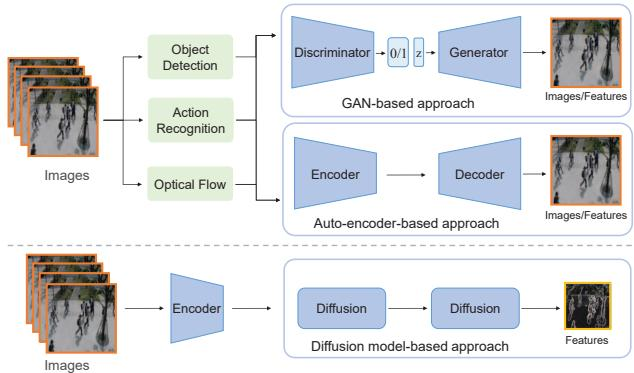  
Figure 1. Overview of three generative VAD approaches. Existing state-of-the-art GAN-based or auto-encoder-based approaches heavily rely on foreground object or action information extracted by auxiliary models, such as object detection, action recognition or optical flow network, to generate features/images for effective performance. By contrast, our proposed diffusion model-based approach does not have this reliance and can make accurate feature prediction using only simple networks as encoder to extract basic image features as input.

There have been many VAD methods [9,10,14,19,23,33, 34,39,45,46,57,62,68,71] proposed over the years to handle this issue, in which one-class learning-based methods are preferred due to the relatively accessible normal training set and their capacity to achieve better performance [44]. The one-class VAD methods assume the availability of the training data in which all samples are normal, and build different models to learn the distribution of normal data. Generative modeling is a widely-used technique in this line since the normal samples can be better generated than anomalies after training. Generative Adversarial Networks (GAN) [22, 52, 71, 72] and Auto-Encoder (AE) [24, 29, 40, 46] are two popular frameworks. Although these generative approaches achieve promising performance in VAD, there are three main challenges: (1) the GAN/AE-based methods suffer from the weak generative capacity, leading to more noise from the low-quality generated image, which reduces the performance, (2) current SOTA methods often employ some auxiliary models, e.g., object detection and action recognition models, to capture the features of the foreground object or action information, and as a result, the performance relies heavily on the representation capacity of these highlevel semantic models, and (3) the anomaly events are often characterized by the novel appearance and/or abnormal motion, which increase the difficulty of the generative models to capture the normality/abnormality in both aspects.

In very recent years, diffusion models (DMs) [26, 53], have been attracting increasing attention due to their powerful generative capacity and excellent performance in various tasks [5, 17,49, 53]. Different from GAN and AE, the diffusion models inject Gaussian noise into the training data and then learn to recover the samples from those noisy data. The DMs are featured by minor modifications and rectification of the generated samples in each step, enabling a more stable generation of more realistic samples. Therefore, the DM-based approaches outperform the GAN/AE-based approaches in many generative tasks [6, 12, 50, 63].

Motivated by the powerful generative capacity of these diffusion models, we propose a novel DM-based approach for anomaly detection. For the second and third challenges mentioned above, as shown in Fig. 1, we devise two complementary denoising DM modules to learn the distribution of normal samples. One module emphasizes learning the distribution of motion, while another module focuses on appearance learning. We employ a simple neural network as the encoder for extracting basic 2D features. Many previous studies [21, 49] have shown that many simple pre-trained networks can effectively extract basic texture information of images even if there are novel classes beyond the training data. Therefore, we adopt a basic 2D feature extractor, which is different from many existing generative methods that utilize high-level semantic models for 3D feature extraction. Based on this, our goal is to learn the distribution of normal features and predict the features of samples for anomaly detection.

In summary, there are three main contributions:

• We introduce a novel diffusion model-based method to predict the features of each sample for VAD. To the best of our knowledge, it is the first work in utilizing DMs for VAD.

• We design two types of DDIM module for respective motion and appearance learning from the normal samples to guarantee the generative quality of predicted features.

• The proposed model takes 2D images as input with no auxiliary semantic networks, while achieving a highly comparable performance to the methods utilizing highlevel 3D semantic features.

Experimental results on four publicly available video anomaly detection datasets demonstrate that our method substantially outperforms the image feature-based VAD counterparts and performs comparably well to methods using 3D semantic features.

## 2. Related work

For different application scenarios, the video anomaly detection methods can be generally classified into three categories, semi-supervised, one-class, and unsupervised VAD, according to the annotation of training samples. Since our method belongs to the one-class type, we only review one-class VAD methods.

The early one-class VAD methods are two-step approaches in which feature extraction and learning are separated. They first use hand-crafted feature descriptors to present each frame, such as 3D gradients features [38], histogram of gradient (HOG) [16], histogram optical flow (HOF) [16], bag of words (BOW) etc., then build a shallow model to learn the normal distribution, such as dictionarybased models [75], probabilistic models [13, 41], and reconstruction models [16, 38, 75]. These traditional methods suffer from the poor performance of hand-crafted features. With the development of deep learning [35,36,64–67], convolutional neural network-based methods followed close on another. The CNN integrates feature extraction and learning into an end-to-end frame [42, 43, 70]. The majority of these CNN-based methods belong to the generative approach, in which the model applies feature learning on normality and detects anomalies according to the difference between the generated and original samples. The generative adversarial network (GAN) [20,51,73] and auto-encoder-based network (AE) [25,27,56] are widely used for such normal feature learning. Based on these frameworks, memory module [24], and feature prediction module [33] are proposed to enhance the capacity of feature learning. To further improve performance, some high-level feature extraction models, e.g., object detection [23, 37], action recognition [62], and optical flow [33], are employed to obtain foreground or motion information for the learning of normality. The auxiliary models bring the benefit to these VAD methods while increasing the dependency on semantic presentations.

Recently, diffusion models have achieved state-of-theart performance on many generative tasks and become a hot research topic [5, 17, 26, 49, 53]. Many applications have already emerged in computer vision, such as image inpainting [7, 15,54], image manipulation [47], image superresolution [7, 18], and image-to-image translation [50, 76]. The state-of-the-art performance of these applications confirms that the DM-based models have remarkable generative capacity. To further expand DMs to mainstream computer vision tasks, some DM-based latent representation learning methods have been proposed, such as DiffusionDet for object detection [12], SegDiff for segmentation [2], and SBG classifier for classification [77]. These discriminative tasks usually require more powerful models that are not easy to be disturbed by background. Therefore the success of these methods on different tasks verifies the anti-noise ability of DM. The early diffusion models, such as the denoising diffusion probabilistic model (DDPM), have quite a few denoising steps required in the sampling stage due to the Markov process converting data distribution via tiny modification. To accelerate the sampling process, many speedup diffusion methods have been proposed [30, 53, 74]. The denoising diffusion implicit model (DDIM) is widely used due to its training-free property. The DDIM requires no extra training and can directly apply the advanced sampling algorithms with fewer steps and higher fidelity. Therefore DDIM-based methods are more likely to be adopted in real applications.

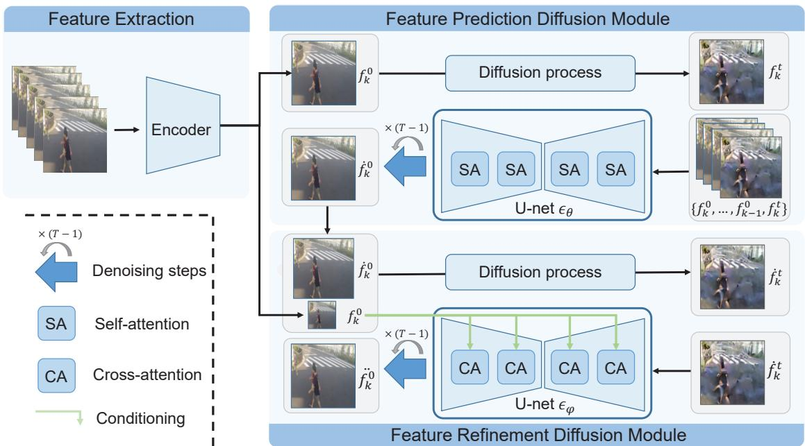  
Figure 2. The framework of the proposed method. It contains a frame-level 2D encoder and two DM-based modules, including a feature prediction diffusion module and a feature refinement diffusion module. The feature prediction diffusion module adopts consecutive k features as input, in which only the last one accept the diffusion process. With the temporal information from the consecutive frames, this module emphasizes learning the distribution of normal motion. The feature refinement diffusion module takes the sampling output of previous module as input and the k—th original features as a condition for training, which focuses on the appearance learning.

## 3. Method

Our key motivation is to design a diffusion model-based approach to well learn the distribution of normal motion and appearance without the help of 3D feature extraction networks. In the inference stage, the feature of a normal sample is more easily predicted by the optimized model than that of the abnormal one.

As shown in Fig. 2, our framework contains three parts, i.e. a frame encoder, a feature prediction diffusion module, and a feature refinement diffusion module. First, we employ an encoder to extract the feature of each frame. Any pretrained CNN can be used as the encoder. Here we adopt a slight encoder from [48] since (1) the size of output feature map is 64 times spatially smaller than that of the original image and contains only four channels, which significantly reduces the computation of the following diffusion modules, and (2) the pretraining of this encoder is unsupervised, which is more accessible. To predict the feature, we design two DDIM-based modules to predict and refine the feature of each frame. Notice that DDIM has the same training procedure as DDPM but is more efficient in the sampling stage since it adopts a jump-step implicit sampler rather than extracting noise information step by step. The feature prediction diffusion module emphasizes learning the distribution of motion, and the feature refinement diffusion module focuses on appearance distribution learning.

## 3.1. Problem Formulation

The problem aims to address is to generate a feature by giving several continuous video frames and then estimate whether this feature belongs to the learned distribution. Formally, given a video clip with k consecutive frames $X = \{ { \bf x } _ { 1 } , { \bf x } _ { 2 } , \cdot \cdot \cdot , { \bf x } _ { k } \}$ , our goal is to predict the feature of k-th frame denoted as $\ddot { f } ( { \bf x } _ { k } )$ and $\ddot { f } _ { k }$ for short. We use $\dot { f } _ { k }$ and $\ddot { f } _ { k }$ to denote the output of the feature prediction and refinement diffusion module. Since the time step is involved, we use $f _ { k } ^ { t }$ to denote the feature of k-the frame at time step t. To this end, $f _ { k } ^ { 0 }$ refers to the k-th feature at time step 0, which is equivalent to $f _ { k }$ . Compared with the original feature denoted as $f _ { k } ,$ , the anomaly score of the k-th frame can be calculated by Mean Square Error between $f _ { k }$ and $\ddot { f } _ { k }$

## 3.2. Feature prediction diffusion module

Different the previous work [33] that adopts k samples to predict the (k+1)-th sample, we take the features $\mathbf { \bar { \{ f _ { 1 } ^ { 0 } , } }  \mathbf { \bar { { f _ { 2 } ^ { 0 } , } } } \mathbf { \bar { { \cdot \cdot \cdot } } } , f _ { k - 1 } ^ { 0 } \}$ of 1 to k-1 frames and the noisy feature $f _ { k } ^ { t }$ of the k-th frame together as the input, to predict the feature $\dot { f } _ { k } ^ { 0 }$ . To this end, we build a feature prediction diffusion module to progressively remove the noise of $f _ { k } ^ { t }$ by using implicit sampling [53] to generate $\dot { f } _ { k } ^ { 0 }$

For training, the goal of our diffusion models is to learn a distribution $p _ { \theta } ( f ^ { 0 } )$ that approximates the original data distribution $q ( f ^ { 0 } )$ . In forward process, the posterior $q ( f ^ { 1 : T } | f ^ { 0 } )$ is fixed to a Markov chain:

$$
q ( f ^ { 1 : T } | f ^ { 0 } ) : = \prod _ { t = 1 } ^ { T } q ( f ^ { t } | f ^ { t - 1 } ) ,\tag{1}
$$

where $t \in [ 1 , T ]$ is the time step, and:

$$
\begin{array} { r } { q ( f ^ { t } | f ^ { t - 1 } ) : = \mathcal { N } ( f ^ { t } ; \sqrt { \alpha _ { t } } f ^ { t - 1 } , ( 1 - \alpha _ { t } ) \mathbf { I } ) , } \end{array}\tag{2}
$$

where $\alpha _ { t } \in \{ \alpha _ { t } \} _ { t = 1 } ^ { T }$ is a schedule to control the percentage of $f ^ { t - 1 } , ( 1  – \alpha _ { t } )$ controls the percentage of noise. With time step t increase, $\alpha _ { t }$ decrease. Based on these properties, the $f ^ { t }$ can be presented by the linear combination of $f ^ { 0 }$ and standard Gaussian noise € as following:

$$
f ^ { t } = \sqrt { \alpha _ { t } } f ^ { 0 } + \sqrt { 1 - \alpha _ { t } } \epsilon .\tag{3}
$$

To learn the distribution $p _ { \theta } ( f ^ { 0 } )$ , we build a U-net diffusion network $\epsilon _ { \theta } ( \cdot )$ based on the LDM [49]. To well predict the features, we modify two parts of the LDM: (1) we discard the latent condition part and modify all the crossattention layers to traditional attention layers, and (2) each input sample contains k features $\{ f _ { 1 } ^ { 0 } , \bar { f _ { 2 } ^ { 0 } } , \cdots , f _ { k } ^ { t } \}$ where only the k-th feature is applied diffusion forward process. There are two reasons for such modification: (1) we expect to learn the distribution of features from normal samples without any other latent condition involved, and (2) combined with the consecutive features of previous frames, we can provide the motion information to the $\epsilon _ { \theta } ( \cdot )$ , making this diffusion module focus on feature motion learning.

Following [26,53], the simplified version of the objective is used for training defined as:

$$
L _ { \theta } = \mathbb { E } \left[ | | \epsilon _ { \theta } ( f _ { 1 } ^ { 0 } , f _ { 2 } ^ { 0 } , \cdot \cdot \cdot , f _ { k } ^ { t } , t ) - \epsilon | | _ { 2 } ^ { 2 } \right] ,\tag{4}
$$

where t is the time step, $\epsilon _ { \theta } ( \cdot , t )$ is the prediction noise at time t. Substituting $f ^ { t }$ of Eq. (3) into Eq. (4), the parameter

θ can be optimized by given sufficient feature samples and random time step $t \in [ 1 , T ]$

For the reverse process, the features of the k-th sample at time t-1 can be generate once given $\{ f _ { 1 } ^ { 0 } , f _ { 2 } ^ { 0 } , \cdots , f _ { k } ^ { t } \}$ by the following formula:

$$
\begin{array} { r } { f _ { k } ^ { t - 1 } = \sqrt { \alpha _ { t - 1 } } ( \frac { f _ { k } ^ { t } - \sqrt { 1 - \alpha _ { t } } \epsilon _ { \theta } ( f _ { 1 } ^ { 0 } , f _ { 2 } ^ { 0 } , \cdots , f _ { k } ^ { t } , t ) } { \sqrt { \alpha t } } ) } \\ { + \sqrt { 1 - \alpha _ { t - 1 } - \sigma _ { t } ^ { 2 } } \epsilon _ { \theta } ( f _ { 1 } ^ { 0 } , f _ { 2 } ^ { 0 } , \cdots , f _ { k } ^ { t } , t ) + \sigma _ { t } \epsilon } \end{array}\tag{5}
$$

where $\sigma _ { t } \in \{ \sigma _ { t } \} _ { t = 1 } ^ { T }$ is a schedule to control the added noise for each step. At sampling stage, the (t-1)-th step takes the features $\{ f _ { 1 } ^ { 0 } , f _ { 2 } ^ { 0 } , \cdots , f _ { k } ^ { t } \}$ as input to predict $f _ { k } ^ { t - \hat { 1 } }$

The consecutive supervision on the reverse process can effectively guarantee the motion prediction while it may miss some appearance details since the non-noisy k-1 features are helpful for motion learning while having an effect on appearance learning. To this end, we create another DDIM module to refine the appearance information.

## 3.3. Feature refinement diffusion module

We build a feature refinement diffusion module next to the prediction module. This refinement model places emphasis on learning the appearance distribution of features. Similarly, we adopt the LDM-based U-net as the diffusion network for refining, in which the condition part is maintained. We take the output of the previous prediction module, i.e. the denoised feature $\dot { f } _ { k } ^ { 0 }$ as input, and use the original feature $f _ { k } ^ { 0 }$ of the k-th frame as condition, to generate the refined features denoted as $\ddot { f } _ { k } ^ { 0 }$ The condition $f _ { k } ^ { 0 }$ is used for cross-attention to guarantee the feature appearance learning. The goal of the feature refinement diffusion module is to learn a distribution $p _ { \varphi } ( \dot { f } ^ { 0 } )$ that approximates $q ( f ^ { 0 } )$

Same with the previous feature prediction module, the posterior $q ( \dot { f } ^ { 1 : T } | \dot { f } ^ { \bar { 0 } } )$ is fixed to a Markov chain, and the input $\dot { f } ^ { t }$ at time step t can be calculated according to $\operatorname { E q }$ (3) by given $\dot { f } ^ { 0 }$ and a Gaussian noise €.

To make this refinement network $\epsilon _ { \varphi } ( \cdot )$ focus on appearance learning, we augment the underlying UNet backbone with cross-attention mechanism and take the original feature $f _ { k } ^ { 0 }$ as the condition into the cross-attention layers. We flatten the feature $f _ { k } ^ { 0 }$ , then use a linear transform to obtain a d-dimensional vector, which is defined as $\widehat { f } _ { k } ^ { 0 }$ . The crossattention is implemented according to:

$$
s o f t m a x ( \frac { Q K ^ { T } } { \sqrt { d } } ) V ,\tag{6}
$$

$$
Q = W _ { q } \cdot \widehat { f } _ { k } ^ { 0 } , K = W _ { k } \cdot \phi ( \dot { f } _ { k } ^ { t } ) , V = W _ { v } \cdot \phi ( \dot { f } _ { k } ^ { t } ) ,\tag{7}
$$

where $W _ { k } , W _ { q } , W _ { v }$ are learnable projection matrices and $\phi \big ( \dot { f } _ { k } ^ { t } \big )$ is the input feature map of each cross-attention layer.

The $\widehat { f } _ { k } ^ { 0 }$ is changeless for different cross-attention layer that provides a consistent appearance supervision on feature learning. The loss function is also the simplified version of DDIM, defined as:

$$
L _ { \varphi } = \mathbb { E } \left[ | | \epsilon _ { \varphi } ( \dot { f } _ { k } ^ { t } , \widehat { f } _ { k } ^ { 0 } , t ) - \epsilon | | _ { 2 } ^ { 2 } \right] .\tag{8}
$$

For reverse process, we can obtain the feature at t-1 time step by:

$$
\begin{array} { r } { \dot { f } _ { k } ^ { t - 1 } = \sqrt { \alpha _ { t - 1 } } ( \frac { \dot { f } _ { k } ^ { t } - \sqrt { 1 - \alpha _ { t } } \epsilon _ { \varphi } ( \dot { f } _ { k } ^ { t } , \widehat { f } _ { k } ^ { 0 } , t ) } { \sqrt { \alpha t } } ) } \\ { + \sqrt { 1 - \alpha _ { t - 1 } } - \sigma _ { t } ^ { 2 } \epsilon _ { \varphi } ( \dot { f } _ { k } ^ { t } , \widehat { f } _ { k } ^ { 0 } , t ) + \sigma _ { t } \epsilon , } \end{array}\tag{9}
$$

where the parameters α and $\sigma$ are same as that of Eq. (5). With a certain time step $t ,$ the refined feature $\ddot { f } _ { k } ^ { 0 }$ can be obtained through Eq. (9).

For testing, we use MSE to calculate the anomaly score between $\ddot { f } _ { k } ^ { 0 }$ and the original feature $f _ { k } ^ { 0 }$ , defined as:

$$
S c o r e = M S E ( \ddot { f } _ { k } ^ { 0 } , f _ { k } ^ { 0 } ) .\tag{10}
$$

In the training stage, we train the two diffusion modules separately, i.e. train the refinement module after the prediction module reaching convergence. It is because the input of the refinement module is the sampling output of the prediction module, which is of low quality at the beginning of training. Joint learning has a negative impact on the performance of the refinement module (see the results of Table. 3). Therefore, we adopt separate training. The pseudo-code for training and inference is shown in Algorithm. 1.

## 4. Experiments and discussions

## 4.1. Datasets

Empirical evaluations are carried out on four video anomaly detection datasets, CUHK Avenue [38], ShanghaiTech [39], UCF-Crime datasets [31] and UBnormal [1]. The ShanghaiTech and UCF-Crime are large-scale realworld VAD datasets, and UBnormal is a generated dataset. The details are as follows:

• The CUHK Avenue (Ave) Dataset contains 16 training and 21 testing video clips. The videos are captured in CUHK campus avenue with over 30k frames. This dataset is proposed for one-class video anomaly detection with anomaly annotations provided only in the testing set, while the training split contains only normal samples.

• The ShanghaiTech (ShT) dataset is collected from ShanghaiTech campus in different monitoring angles and lighting conditions. It contains 13 scenes with over

Algorithm 1: The pseudocode for training and in  
ference   
Training:   
for S Epochs do   
Random choose t from [1, T]   
Calculate $f ^ { t }$ at time t by Eq. (3)   
Update $\epsilon _ { \theta }$ by Minimizing Eq. (4)   
end   
for S Epochs do   
Random choose t from [1, T]   
Calculate $f ^ { t }$ by at time t Eq. (3)   
Sample ${ \dot { f } } ^ { 0 }$ through Eq. (5)   
Update $\epsilon _ { \varphi }$ by Minimizing Eq. (8)   
end   
Inference:   
foreach Sample in X do   
Choose a certain t   
Calculate $f _ { k } ^ { t }$ at time t by Eq. (3)   
Sample $\dot { f } _ { k } ^ { 0 }$ through Eq. (5)   
Calculate $\dot { f } _ { k } ^ { t }$ at time t by Eq. (3)   
Sample $\ddot { f } _ { k } ^ { 0 }$ through Eq. (9)   
Calculate anomaly score by Eq. (10)   
end

270k frames in 330 training videos and 130 abnormal events covered in 13 testing videos. This dataset is also for one-class video anomaly detection with anomaly annotations provided only in the testing set.

• The UCF-Crime (UCF) dataset is collected from realworld surveillance. It is a large-scale dataset containing over 128 hours of 1,900 long and untrimmed videos with more than 10m frames. The real anomalies consist of 13 events that have a significant impact on public safety. In one-class VAD setting, the videolevel annotations are discarded.

• The UBnormal (UB) benchmark is a supervised openset dataset composed of multiple virtual scenes for video anomaly detection. It is generated by using the Cinema4D software, containing a total of 29 scenes with over 236k frames. We use the default training and testing sets for one-class VAD to evaluate our method.

## 4.2. Performance evaluation metrics

Following previous works [23, 34, 45, 46, 57], the Area Under the ROC Curve (AUC) is used as the evaluation metrics. The AUC is calculated by using ground truth and the frame-level anomaly scores. In our model, the anomaly scores are defined as the mean squared error (MSE) of each frame as in Eq. (10).

Table 1. AUC of different one-class VAD methods. OD refers to the foreground bounding box from the object detection method, while I3D, R3D and A3D refer to the 3D features from ConvNet3D, ResNext3D and action recognition networks, respectively. '(FPM)' indicates that the model also takes a Frame Prediction-based Method for VAD.
<table><tr><td rowspan=1 colspan=1>Method</td><td rowspan=1 colspan=1>Venue</td><td rowspan=1 colspan=1>Feature</td><td rowspan=1 colspan=1>Framework</td><td rowspan=1 colspan=1>Ave</td><td rowspan=1 colspan=1>ShT</td><td rowspan=1 colspan=1>UCF</td><td rowspan=1 colspan=1>UB</td></tr><tr><td rowspan=1 colspan=1>sRNN [39]</td><td rowspan=1 colspan=1>ICCV-17</td><td rowspan=1 colspan=1>Image</td><td rowspan=1 colspan=1>Encoder</td><td rowspan=1 colspan=1>81.7%</td><td rowspan=1 colspan=1>68.0%</td><td rowspan=1 colspan=1>一</td><td rowspan=1 colspan=1></td></tr><tr><td rowspan=1 colspan=1>AnoPCN [68]</td><td rowspan=1 colspan=1>ACMMM-19</td><td rowspan=1 colspan=1>Image</td><td rowspan=1 colspan=1>AE (FPM)</td><td rowspan=1 colspan=1>86.2%</td><td rowspan=1 colspan=1>73.6%</td><td rowspan=1 colspan=1></td><td rowspan=1 colspan=1></td></tr><tr><td rowspan=1 colspan=1>MemAE [24]</td><td rowspan=1 colspan=1>ICCV-19</td><td rowspan=1 colspan=1>Image</td><td rowspan=1 colspan=1>AE</td><td rowspan=1 colspan=1>83.3%</td><td rowspan=1 colspan=1>71.2%</td><td rowspan=1 colspan=1></td><td rowspan=1 colspan=1></td></tr><tr><td rowspan=1 colspan=1>Bman [32]</td><td rowspan=1 colspan=1>TIP-20</td><td rowspan=1 colspan=1>Image</td><td rowspan=1 colspan=1>AE (FPM)</td><td rowspan=1 colspan=1>90.0%</td><td rowspan=1 colspan=1>76.2%</td><td rowspan=1 colspan=1></td><td rowspan=1 colspan=1></td></tr><tr><td rowspan=1 colspan=1>STC [55]</td><td rowspan=1 colspan=1>ACMMM-20</td><td rowspan=1 colspan=1>Image</td><td rowspan=1 colspan=1>AE</td><td rowspan=1 colspan=1>80.9%</td><td rowspan=1 colspan=1>74.7%</td><td rowspan=1 colspan=1>72.7%</td><td rowspan=1 colspan=1></td></tr><tr><td rowspan=1 colspan=1>CDAE [10]</td><td rowspan=1 colspan=1>ECCV-20</td><td rowspan=1 colspan=1>Image</td><td rowspan=1 colspan=1>AE (FPM)</td><td rowspan=1 colspan=1>86.0%</td><td rowspan=1 colspan=1>73.3%</td><td rowspan=1 colspan=1></td><td rowspan=1 colspan=1></td></tr><tr><td rowspan=1 colspan=1>RUVAD [61]</td><td rowspan=1 colspan=1>TNNLS-21</td><td rowspan=1 colspan=1>Image</td><td rowspan=1 colspan=1>AE (FPM)</td><td rowspan=1 colspan=1>88.3%</td><td rowspan=1 colspan=1>76.6%</td><td rowspan=1 colspan=1></td><td rowspan=1 colspan=1></td></tr><tr><td rowspan=1 colspan=1>MemG [46]</td><td rowspan=1 colspan=1>CVPR-20</td><td rowspan=1 colspan=1>Image</td><td rowspan=1 colspan=1>AE</td><td rowspan=1 colspan=1>88.5%</td><td rowspan=1 colspan=1>70.5%</td><td rowspan=1 colspan=1></td><td rowspan=1 colspan=1></td></tr><tr><td rowspan=1 colspan=1>ITAE [14]</td><td rowspan=1 colspan=1>CVPR-20</td><td rowspan=1 colspan=1>Image</td><td rowspan=1 colspan=1>AE</td><td rowspan=1 colspan=1>88.0%</td><td rowspan=1 colspan=1>74.8%</td><td rowspan=1 colspan=1></td><td rowspan=1 colspan=1></td></tr><tr><td rowspan=1 colspan=1>OGNet [71]</td><td rowspan=1 colspan=1>CVPR-20</td><td rowspan=1 colspan=1>Image</td><td rowspan=1 colspan=1>GAN</td><td rowspan=1 colspan=1></td><td rowspan=1 colspan=1>70.5%</td><td rowspan=1 colspan=1></td><td rowspan=2 colspan=1></td></tr><tr><td rowspan=1 colspan=1>AMMC [8]</td><td rowspan=1 colspan=1>AAAI-21</td><td rowspan=1 colspan=1>Image</td><td rowspan=1 colspan=1>AE (FPM)</td><td rowspan=1 colspan=1>86.6%</td><td rowspan=1 colspan=1>73.7%</td><td rowspan=1 colspan=1></td></tr><tr><td rowspan=1 colspan=1>FFP [40]</td><td rowspan=1 colspan=1>TPAMI-21</td><td rowspan=1 colspan=1>Image</td><td rowspan=1 colspan=1>AE (FPM)</td><td rowspan=1 colspan=1>85.1%</td><td rowspan=1 colspan=1>72.8%</td><td rowspan=1 colspan=1></td><td rowspan=1 colspan=1></td></tr><tr><td rowspan=1 colspan=1>LNTR [3]</td><td rowspan=1 colspan=1>CVPR-21</td><td rowspan=1 colspan=1>Image</td><td rowspan=1 colspan=1>AE</td><td rowspan=1 colspan=1>84.9%</td><td rowspan=1 colspan=1>75.9%</td><td rowspan=1 colspan=1></td><td rowspan=1 colspan=1></td></tr><tr><td rowspan=1 colspan=1>NGOF [59]</td><td rowspan=1 colspan=1>CVPR-21</td><td rowspan=1 colspan=1>Image</td><td rowspan=1 colspan=1>AE (FPM)</td><td rowspan=1 colspan=1>88.4%</td><td rowspan=1 colspan=1>75.3%</td><td rowspan=1 colspan=1></td><td rowspan=1 colspan=1></td></tr><tr><td rowspan=3 colspan=1>CT-D2GAN [22]PB-S [4]FPDM (Ours)</td><td rowspan=1 colspan=1>ACMMM-21</td><td rowspan=1 colspan=1>Image</td><td rowspan=1 colspan=1>GAN (FPM)</td><td rowspan=1 colspan=1>85.9%</td><td rowspan=1 colspan=1>77.7%</td><td rowspan=3 colspan=1>74.7%</td><td rowspan=3 colspan=1>62.7%</td></tr><tr><td rowspan=2 colspan=1>NC-23</td><td rowspan=1 colspan=1>Image</td><td rowspan=1 colspan=1>GAN (FPM)</td><td rowspan=1 colspan=1>87.1%</td><td rowspan=2 colspan=1>73.7%78.6%</td></tr><tr><td rowspan=1 colspan=1>Image</td><td rowspan=1 colspan=1>DDIM</td><td rowspan=1 colspan=1>90.1%</td></tr><tr><td rowspan=1 colspan=1>BODS [60]</td><td rowspan=1 colspan=1>CVPR-19</td><td rowspan=1 colspan=1>I3D</td><td rowspan=1 colspan=1>AE</td><td rowspan=1 colspan=1>=</td><td rowspan=1 colspan=1>=</td><td rowspan=2 colspan=1>68.2%69.4%</td><td rowspan=2 colspan=1></td></tr><tr><td rowspan=1 colspan=1>GODS [60]</td><td rowspan=1 colspan=1>CVPR-19</td><td rowspan=1 colspan=1>I3D</td><td rowspan=1 colspan=1>AE</td><td rowspan=1 colspan=1></td><td rowspan=1 colspan=1></td></tr><tr><td rowspan=1 colspan=1>VEC [69]</td><td rowspan=1 colspan=1>ACMMM-20</td><td rowspan=1 colspan=1>OD</td><td rowspan=1 colspan=1>AE (FPM)</td><td rowspan=1 colspan=1>90.2%</td><td rowspan=1 colspan=1>74.8%</td><td rowspan=1 colspan=1></td><td rowspan=1 colspan=1></td></tr><tr><td rowspan=1 colspan=1>CAC [62]</td><td rowspan=1 colspan=1>ACMMM-20</td><td rowspan=1 colspan=1>A3D</td><td rowspan=1 colspan=1>Encoder</td><td rowspan=1 colspan=1>87.0%</td><td rowspan=1 colspan=1>79.3%</td><td rowspan=1 colspan=1></td><td rowspan=1 colspan=1></td></tr><tr><td rowspan=1 colspan=1>HF2 [37]</td><td rowspan=1 colspan=1>ICCV-21</td><td rowspan=1 colspan=1>OD</td><td rowspan=1 colspan=1>AE (FPM)</td><td rowspan=1 colspan=1>91.1%</td><td rowspan=1 colspan=1>76.2%</td><td rowspan=1 colspan=1></td><td rowspan=1 colspan=1></td></tr><tr><td rowspan=1 colspan=1>BAF [23]</td><td rowspan=1 colspan=1>TPAMI-21</td><td rowspan=1 colspan=1>OD</td><td rowspan=1 colspan=1>AE</td><td rowspan=1 colspan=1>92.3%</td><td rowspan=1 colspan=1>82.7%</td><td rowspan=1 colspan=1></td><td rowspan=1 colspan=1>59.3 %</td></tr><tr><td rowspan=1 colspan=1>BDPN [11]</td><td rowspan=1 colspan=1>AAAI-22</td><td rowspan=1 colspan=1>OD</td><td rowspan=1 colspan=1>AE (FPM)</td><td rowspan=1 colspan=1>90.0%</td><td rowspan=1 colspan=1>78.1%</td><td rowspan=1 colspan=1></td><td rowspan=1 colspan=1></td></tr><tr><td rowspan=1 colspan=1>GCL [72]</td><td rowspan=1 colspan=1>CVPR-22</td><td rowspan=1 colspan=1>R3D</td><td rowspan=1 colspan=1>GAN</td><td rowspan=1 colspan=1></td><td rowspan=1 colspan=1>79.6%</td><td rowspan=1 colspan=1>74.2%</td><td rowspan=1 colspan=1></td></tr><tr><td rowspan=1 colspan=1>SSL [58]</td><td rowspan=1 colspan=1>ECCV-22</td><td rowspan=1 colspan=1>OD</td><td rowspan=1 colspan=1>Encoder</td><td rowspan=1 colspan=1>92.2%</td><td rowspan=1 colspan=1>84.3%</td><td rowspan=1 colspan=1></td><td rowspan=1 colspan=1></td></tr><tr><td rowspan=1 colspan=1>FPDM (Ours)</td><td rowspan=1 colspan=1></td><td rowspan=1 colspan=1>Image</td><td rowspan=1 colspan=1>DDIM</td><td rowspan=1 colspan=1>90.1%</td><td rowspan=1 colspan=1>78.6%</td><td rowspan=1 colspan=1>74.7%</td><td rowspan=1 colspan=1>62.7%</td></tr></table>

## 4.3. Implementation details

Following many previous works [24, 34, 45], the input size of images is set to 256×256. Since the encoder has four $2 \times$ downsampling layers, the size of the final feature map is $3 2 \times 3 2 \times 4$ for each sample. We use four consecutive neighbor frames to predict the fifth according to the setting of the first prediction framework in video anomaly detection [33]. Specifically, we create a cube with four original features and a noised feature from the fifth feature as input for training and testing. We use the recommended settings of α and $\sigma$ in DDIM [53]. In the training stage, the number of training epochs S is set to 60, including 12 warm-up epochs at the beginning, and the time step $T$ and learning rate are set to 1k and $1 0 ^ { - 5 }$ respectively. In the inference stage, we adopt a 200 steps sampling schedule $T ^ { ' }$ according to [53], i.e. each step in $T ^ { ' }$ equals five steps in T. Moreover, we set $_ { \mathrm { t = 0 . 2 5 T } ^ { \prime } }$ for sampling because this was found to be the best in [28, 63]. Therefore, the sampling stage is 20× speed-up compared with DDPM.

## 4.4. Competing methods

We examine the performance of the proposed FPDM on all four datasets. We compare our method with 15 state-ofthe-art one-class VAD methods that use images as input, as well as another 7 methods that employ different high-level semantic features for training, $e . g .$ , foreground bounding box from object detection, 3D features from action recognition models et. al..

On all four datasets, FPDM outperforms all the competing image-based one-class methods, verifying the advanced performance of our method. Compared with the methods with 3D features, we still have the best AUC results on UCF-Crime and UBnormal datasets. Notice that the VEC,

Anomaly

Normality  
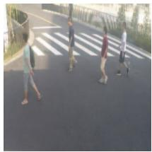

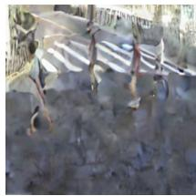

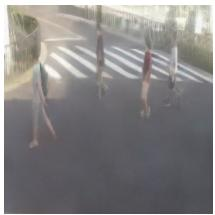

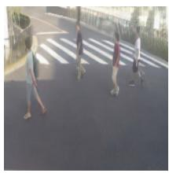

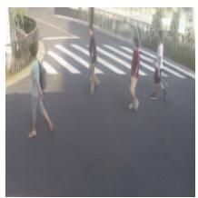

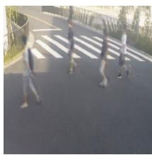

Input  
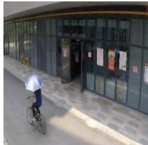

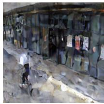  
Noised

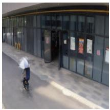  
Predicted

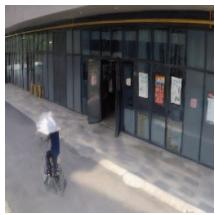  
Refined

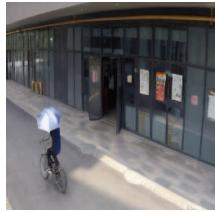  
Output

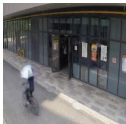  
FFP  
Figure 3. The visualization results. We use the frozen decoder from [48] to visualize the features of each module. The top and bottom lines are two examples of normal and abnormal samples. The first column is the original input, and the next four columns named Noised. Predicted, Refined and Output are the decoded images of noised feature, predicted feature, refined feature and original feature respectively. The column named FFP is the predicted frames of FFP approach [40].

HF2, and DBPN employ object detection methods to extract the foreground, which can greatly reduce the influence of various noises from the background. While our method still beats these methods, illustrating the anti-noise capability of the diffusion model.

## 4.5. Visualization results

To give a more intuitive presentation of the outputs from each proposed module, we present two series of visualization results from normal and abnormal samples. Here we employ the decoder from [48] that matches our encoder to recover an auto-encoder for feature map decoding.

The results are shown in Fig. 3, where the first column is the original input. The next four columns show the output of the decoder with four different features, including noised features after the diffusion process in the feature prediction module, the predicted features from the reverse process of the prediction module, the refined features from the reverse process of refinement module, and the features from the encoder respectively. For a more intuitive comparison, we present the predicted frames of FFP [40] in the last column.

From the results of normality one shown in the top line, we can see that the predicted features well capture the motion information and predict the position of each foreground object, but missing some detail information, such as legs and head of the person dressed in a white T-shirt, the head of the person in black clothing et. al.. These missing details are restored by the refinement module, as shown in the refined column. Comparing the last three, the quality of the refined one is significantly higher than that of the FFP and very close to that of the decoded output from the original feature. This example demonstrates that our model can accurately predict normal features.

The bottom line shows a visual example of the anomaly detection process. According to the results, the predicted feature in the third column also captures the global information of the foreground person but missing some details around this person. With the help of Refined module, the details of the bicycle, e.g., the two wheels are still blurred, illustrating the lack of refinement capacity for the bicycle. The quality of the person/bicycle in the refined column is much better/worse than that of the FFP, verifying our refinement module has greater discriminate capacity than the frame prediction auto-encoder approach The Visualization results verify that the distribution of appearance is so well learned by our model that the anomaly bicycle can't be restored.

## 4.6. Ablation study

We evaluate the importance of two key diffusion modules with six variations on ShT and UCF datasets.

First, we employ the decoder from [48] and discard the two diffusion modules. This setting is to present the performance of the feature extractor. We show the results of the original AE as well as the trained AE using our training data for auto-encoder training. As shown on the top two rows in Table. 2, the results of both original AE and trained AE are far behind the proposed FPDM, demonstrating that the improvement of our FPDM model is based on the two designed diffusion modules. We also train the AE using training data before optimizing FPDM and present the result in the third row. Comparing the result of directly optimizing FPDM, it has almost the same performance, which confirms the unnecessary process of training AE before FPDM.

Table 2. AUC of our model FPDM and its variants. PM and RM refer to our prediction module and refinement module, respectively.
<table><tr><td rowspan=1 colspan=2>FPDM and its Variants</td><td rowspan=1 colspan=1>ShT</td><td rowspan=1 colspan=1>UCF</td></tr><tr><td rowspan=1 colspan=1>AE</td><td rowspan=1 colspan=1>without training</td><td rowspan=1 colspan=1>67.5%</td><td rowspan=1 colspan=1>50.8%</td></tr><tr><td rowspan=1 colspan=1>AE</td><td rowspan=1 colspan=1>with training</td><td rowspan=1 colspan=1>69.1%</td><td rowspan=1 colspan=1>53.1%</td></tr><tr><td rowspan=1 colspan=1>FPDM</td><td rowspan=1 colspan=1>with trained AE</td><td rowspan=1 colspan=1>78.6%</td><td rowspan=1 colspan=1>74.5%</td></tr><tr><td rowspan=1 colspan=1>FPDM</td><td rowspan=1 colspan=1>with only PM</td><td rowspan=1 colspan=1>77.3%</td><td rowspan=1 colspan=1>74.2%</td></tr><tr><td rowspan=1 colspan=1>FPDM</td><td rowspan=1 colspan=1>with only RM</td><td rowspan=1 colspan=1>76.8%</td><td rowspan=1 colspan=1>72.5%</td></tr><tr><td rowspan=1 colspan=1>FPDM</td><td rowspan=1 colspan=1>with decoder</td><td rowspan=1 colspan=1>78.3%</td><td rowspan=2 colspan=1>74.1%74.7%</td></tr><tr><td rowspan=1 colspan=1>FPDM</td><td rowspan=1 colspan=1>default</td><td rowspan=1 colspan=1>78.6%</td></tr></table>

Then we keep the prediction/refinement diffusion module with the other one discarded to test the capacity of each module. From the results on the fourth and fifth rows, we can see that the performance decreases when only one module is utilized. The feature prediction module learns the motion information as well as some appearance information, helping achieve better performance than the refinement module.

Finally, we present the results of FPDM with the decoder. We also use the decoder from [48] to decode the $\ddot { f } _ { k } ^ { 0 }$ and calculate the MSE between the input and the decoded one. The declining result of FPDM with decoder shows that the information could be lost through the decoder, e.g., the details of the background (also see the fence and curb on the last column in Fig. 3), which leads to the decrease of performance. Since the specific information of background is usually not relevant to VAD, discarding the decoder is a better choice.

## 4.7. Analysis of training settings

Table 3. The results of FPDM with different training mode settings. PM, RM, J(.), S(.) refer to prediction module, refinement module, joint training, and separated training respectively.
<table><tr><td></td><td>Training Mode</td><td>ShT</td><td>UCF</td></tr><tr><td>FPDM</td><td>J(PM &amp; RM)</td><td>70.8%</td><td>68.1%</td></tr><tr><td>FPDM</td><td>S(PM&amp;RM) → J(PM&amp;RM)</td><td>78.2%</td><td>74.5%</td></tr><tr><td>FPDM</td><td>default</td><td>78.6%</td><td>74.8%</td></tr></table>

We first evaluate the performance of FPDM with different training mode settings. For the proposed two modules, we present the results of joint learning for the whole training, joint learning after separated learning, and the default setting of FPDM in Table. 3. We can see that the performance of joint learning for the whole training, i.e. J(PM & RM), is far behind that of the default setting. It may be due to the low quality of predicted features at the beginning of training, negatively impacting refinement learning. The performance of joint learning after separated learning, i.e. S(PM&RM)→J(PM&RM), falls slightly behind the default setting. The reason may be that the distribution of $\dot { f } _ { k } ^ { 0 }$ changes in the training process of the prediction module, leading to the instability of refinement learning.

Table 4. The results of FPDM with different number of neighbors on the ShanghaiTech dataset. ShT-3, ShT-11 and ShT-all refer to the 3-rd, 11-th and all scenes of ShanghaiTech dataset.
<table><tr><td></td><td># Neighbors</td><td>ShT-3</td><td>ShT-11</td><td>ShT-all</td></tr><tr><td>FPDM</td><td>12</td><td>81.7</td><td>96.6</td><td>79.0</td></tr><tr><td>FPDM</td><td>8</td><td>80.3</td><td>96.4</td><td>78.9</td></tr><tr><td>FPDM</td><td>4</td><td>79.2</td><td>96.5</td><td>78.6</td></tr><tr><td>FPDM</td><td>0</td><td>73.8</td><td>96.3</td><td>76.2</td></tr></table>

Then we evaluate the performance of FPDM with different numbers of neighbors in the prediction module. We present the results of 0, 4, 8, and 12 neighbors on two representative scenes, i.e., scene-3 and scene-11 of ShanghaiTech dataset. These two scenes are chosen because the anomalies are all action/appearance-based abnormal events. From the results, we can see that the performance increases observably on the action anomaly test set with more neighbors for training. When the number of neighbors is set to zero, the prediction module degrades to a prediction refinement module with no condition, leading to the decline of the motion learning capacity. While for the appearance-based anomalies, the number of neighbors has little influence on the performance.

## 5. Conclusions

This paper introduces the first feature prediction diffusion model for video anomaly detection. We further devise two DDIM modules, namely the feature prediction diffusion module and feature refinement diffusion module, for motion and appearance learning from the normal samples It is impressive that although our model takes images as input to predict features for anomaly detection, it achieves a competing performance compared with the methods utilizing high-level 3D semantic features. Extensive empirical results also demonstrate the superiority of our approach against the SOTA 2D image feature-based VAD models.

## References

[1] Andra Acsintoae, Andrei Florescu, Mariana-Iuliana Georgescu, Tudor Mare, Paul Sumedrea, Radu Tudor Ionescu, Fahad Shahbaz Khan, and Mubarak Shah. Ubnormal: New benchmark for supervised open-set video anomaly detection. In Proceedings of the IEEE/CVF Conference on Computer Vision and Pattern Recognition, pages 20143–20153, 2022.

[2] Tomer Amit, Eliya Nachmani, Tal Shaharbany, and Lior Wolf. Segdiff: Image segmentation with diffusion probabilistic models. arXiv preprint arXiv:2112.00390, 2021.

[3] Marcella Astrid, Muhammad Zaigham Zaheer, Jae-Yeong Lee, and Seung-Ik Lee. Learning not to reconstruct anomalies. arXiv preprint arXiv:2110.09742, 2021.

[4] Marcella Astrid, Muhammad Zaigham Zaheer, and Seung-Ik Lee. Pseudobound: Limiting the anomaly reconstruction capability of one-class classifiers using pseudo anomalies. Neurocomputing, 534:147–160, 2023.

[5] Arpit Bansal, Eitan Borgnia, Hong-Min Chu, Jie S Li, Hamid Kazemi, Furong Huang, Micah Goldblum, Jonas Geiping, and Tom Goldstein. Cold diffusion: Inverting arbitrary image transforms without noise. In International Conference on Learning Representations, 2023.

[6] Dmitry Baranchuk, Ivan Rubachev, Andrey Voynov, Valentin Khrulkov, and Artem Babenko. Label-efficient semantic segmentation with diffusion models. arXiv preprint arXiv:2112.03126, 2021.

[7] Georgios Batzolis, Jan Stanczuk, Carola-Bibiane Schönlieb, and Christian Etmann.Conditional image generation with score-based diffusion models. arXiv preprint arXiv:2111.13606, 2021.

[8] Ruichu Cai, Hao Zhang, Wen Liu, Shenghua Gao, and Zhifeng Hao. Appearance-motion memory consistency network for video anomaly detection. In Proceedings of the AAAI conference on artificial intelligence, pages 938–946, 2021.

[9] Zhaowei Cai and Nuno Vasconcelos. Cascade r-cnn: Delving into high quality object detection. In Proceedings of the Conference on Computer Vision and Pattern Recognition, pages 6154–6162, 2018.

[10] Yunpeng Chang, Zhigang Tu, Wei Xie, and Junsong Yuan. Clustering driven deep autoencoder for video anomaly detection. In Computer Vision-ECCV 2020: 16th European Conference, Glasgow, UK, August 23–28, 2020, Proceedings, Part XV 16, pages 329–345. Springer, 2020.

[11] Chengwei Chen, Yuan Xie, Shaohui Lin, Angela Yao, Guannan Jiang, Wei Zhang, Yanyun Qu, Ruizhi Qiao, Bo Ren, and Lizhuang Ma. Comprehensive regularization in a bidirectional predictive network for video anomaly detection. In Proceedings of the AAAI Conference on Artificial Intelligence, volume 36, pages 230–238, 2022.

[12] Shoufa Chen, Peize Sun, Yibing Song, and Ping Luo. Diffusiondet: Diffusion model for object detection. arXiv preprint arXiv:2211.09788, 2022.

[13] Kai-Wen Cheng, Yie-Tarng Chen, and Wen-Hsien Fang. Video anomaly detection and localization using hierarchical feature representation and gaussian process regression.

In Proceedings of the IEEE Conference on Computer Vision and Pattern Recognition, pages 2909–2917, 2015.

[14] MyeongAh Cho, Taeoh Kim, Woo Jin Kim, Suhwan Cho, and Sangyoun Lee. Unsupervised video anomaly detection via normalizing flows with implicit latent features. Pattern Recognition, 129:108703, 2022.

[15] Hyungjin Chung, Byeongsu Sim, and Jong Chul Ye. Come-closer-diffuse-faster: Accelerating conditional diffusion models for inverse problems through stochastic contraction. In Proceedings of the IEEE/CVF Conference on Computer Vision and Pattern Recognition, pages 12413–12422, 2022.

[16] Yang Cong, Junsong Yuan, and Ji Liu. Sparse reconstruction cost for abnormal event detection. In CVPR 2011, pages 3449–3456. IEEE, 2011.

[17] Guillaume Couairon, Jakob Verbeek, Holger Schwenk, and Matthieu Cord. Diffedit: Diffusion-based semantic image editing with mask guidance. In International Conference on Learning Representations, 2023.

[18] Max Daniels, Tyler Maunu, and Paul Hand. Score-based generative neural networks for large-scale optimal transport. Advances in neural information processing systems, 34:12955–12965, 2021.

[19] Allison Del Giorno, J Andrew Bagnell, and Martial Hebert. A discriminative framework for anomaly detection in large videos. In European Conference on Computer Vision, pages 334–349. Springer, 2016.

[20] Jeff Donahue, Philipp Krähenbühl, and Trevor Darrell. Adversarial feature learning. In International Conference on Learning Representations, 2017.

[21] Z. Fan, Y. Ma, Z. Li, and J. Sun. Generalized few-shot object detection without forgetting. In Proceedings of the IEEE/CVF Conference on Computer Vision and Pattern Recognition, 2021.

[22] Xinyang Feng, Dongjin Song, Yuncong Chen, Zhengzhang Chen, Jingchao Ni, and Haifeng Chen. Convolutional transformer based dual discriminator generative adversarial networks for video anomaly detection. In Proceedings of the 29th ACM International Conference on Multimedia, pages 5546–5554, 2021.

[23] Mariana Iuliana Georgescu, Radu Tudor Ionescu, Fahad Shahbaz Khan, Marius Popescu, and Mubarak Shah. A background-agnostic framework with adversarial training for abnormal event detection in video. IEEE Transactions on Pattern Analysis and Machine Intelligence, 44(9):4505– 4523, 2021.

[24] Dong Gong, Lingqiao Liu, Vuong Le, Budhaditya Saha, Moussa Reda Mansour, Svetha Venkatesh, and Anton van den Hengel. Memorizing normality to detect anomaly: Memory-augmented deep autoencoder for unsupervised anomaly detection. In Proceedings of the Conference on Computer Vision and Pattern Recognition, pages 1705- 1714, 2019.

[25] Geoffrey E Hinton and Ruslan R Salakhutdinov. Reducing the dimensionality of data with neural networks. science, 313(5786):504–507, 2006.

[26] Jonathan Ho, Ajay Jain, and Pieter Abbeel. Denoising diffusion probabilistic models. Advances in Neural Information Processing Systems, 33:6840–6851, 2020.

[27] Xinwei Jiang, Junbin Gao, Xia Hong, and Zhihua Cai. Gaussian processes autoencoder for dimensionality reduction. In Advances in Knowledge Discovery and Data Mining: 18th Pacific-Asia Conference, PAKDD 2014, Tainan, Taiwan, May 13-16, 2014. Proceedings, Part II 18, pages 62–73. Springer, 2014.

[28] Antanas Kascenas, Pedro Sanchez, Patrick Schrempf, Chaoyang Wang, William Clackett, Shadia S Mikhael, Jeremy P Voisey, Keith Goatman, Alexander Weir, Nicolas Pugeault, et al. The role of noise in denoising models for anomaly detection in medical images. arXiv preprint arXiv:2301.08330, 2023.

[29] Diederik P Kingma and Max Welling. Auto-encoding variational bayes. arXiv preprint arXiv:1312.6114, 2013.

[30] Zhifeng Kong and Wei Ping. On fast sampling of diffusion probabilistic models. arXiv preprint arXiv:2106.00132, 2021.

[31] Federico Landi, Cees GM Snoek, and Rita Cucchiara. Anomaly locality in video surveillance. arXiv preprint arXiv:1901.10364, 2019.

[32] Sangmin Lee, Hak Gu Kim, and Yong Man Ro. Bman: Bidirectional multi-scale aggregation networks for abnormal event detection. IEEE Transactions on Image Processing, 29:2395–2408, 2020.

[33] Wen Liu, Weixin Luo, Dongze Lian, and Shenghua Gao. Future frame prediction for anomaly detection-a new baseline. In Proceedings of the Conference on Computer Vision and Pattern Recognition, pages 6536–6545, 2018.

[34] Yusha Liu, Chun-Liang Li, and Barnabás Póczos. Classifier two sample test for video anomaly detections. In BMVC, page 71, 2018.

[35] Yang Liu, Lei Zhou, Xiao Bai, Yifei Huang, Lin Gu, Jun Zhou, and Tatsuya Harada. Goal-oriented gaze estimation for zero-shot learning. In Proceedings of the IEEE/CVF conference on computer vision and pattern recognition, pages 3794–3803, 2021.

[36] Yang Liu, Muzhi Zhu, Hengtao Li, Hao Chen, Xinlong Wang, and Chunhua Shen. Matcher: Segment anything with one shot using all-purpose feature matching. arXiv preprint arXiv:2305.13310, 2023.

[37] Zhian Liu, Yongwei Nie, Chengjiang Long, Qing Zhang, and Guiqing Li. A hybrid video anomaly detection framework via memory-augmented flow reconstruction and flow-guided frame prediction. In Proceedings of the IEEE/CVF International Conference on Computer Vision, pages 13588–13597, 2021.

[38] Cewu Lu, Jianping Shi, and Jiaya Jia. Abnormal event detection at 150 fps in matlab. In Proceedings of the International Conference on Computer Vision, pages 2720–2727, 2013.

[39] Weixin Luo, Wen Liu, and Shenghua Gao. A revisit of sparse coding based anomaly detection in stacked rnn framework. In Proceedings of the IEEE international conference on computer vision, pages 341–349, 2017.

[40] Weixin Luo, Wen Liu, Dongze Lian, and Shenghua Gao. Future frame prediction network for video anomaly detection.

IEEE transactions on pattern analysis and machine intelligence, 44(11):7505–7520, 2021.

[41] Vijay Mahadevan, Weixin Li, Viral Bhalodia, and Nuno Vasconcelos. Anomaly detection in crowded scenes. In 2010 IEEE computer society conference on computer vision and pattern recognition, pages 1975–1981. IEEE, 2010.

[42] Amir Markovitz, Gilad Sharir, Itamar Friedman, Lihi Zelnik-Manor, and Shai Avidan. Graph embedded pose clustering for anomaly detection. In Proceedings of the IEEE/CVF Conference on Computer Vision and Pattern Recognition, pages 10539–10547, 2020.

[43] Romero Morais, Vuong Le, Truyen Tran, Budhaditya Saha, Moussa Mansour, and Svetha Venkatesh. Learning regularity in skeleton trajectories for anomaly detection in videos. In Proceedings of the IEEE/CVF conference on computer vision and pattern recognition, pages 11996–12004, 2019.

[44] Guansong Pang, Chunhua Shen, Longbing Cao, and Anton Van Den Hengel. Deep learning for anomaly detection: A review. ACM computing surveys (CSUR), 54(2):1–38, 2021.

[45] Guansong Pang, Cheng Yan, Chunhua Shen, Anton van den Hengel, and Xiao Bai. Self-trained deep ordinal regression for end-to-end video anomaly detection. In Proceedings of the Conference on Computer Vision and Pattern Recognition, pages 12173–12182, 2020.

[46] Hyunjong Park, Jongyoun Noh, and Bumsub Ham. Learning memory-guided normality for anomaly detection. In Proceedings of the IEEE/CVF conference on computer vision and pattern recognition, pages 14372–14381, 2020.

[47] Konpat Preechakul, Nattanat Chatthee, Suttisak Wizadwongsa, and Supasorn Suwajanakorn. Diffusion autoencoders: Toward a meaningful and decodable representation. In Proceedings of the IEEE/CVF Conference on Computer Vision and Pattern Recognition, pages 10619–10629, 2022.

[48] Alec Radford, Jong Wook Kim, Chris Hallacy, Aditya Ramesh, Gabriel Goh, Sandhini Agarwal, Girish Sastry, Amanda Askell, Pamela Mishkin, Jack Clark, et al. Learning transferable visual models from natural language supervision. In International conference on machine learning, pages 8748–8763. PMLR, 2021.

[49] Robin Rombach, Andreas Blattmann, Dominik Lorenz, Patrick Esser, and Björn Ommer. High-resolution image synthesis with latent diffusion models. In Proceedings of the IEEE/CVF Conference on Computer Vision and Pattern Recognition, pages 10684–10695, 2022.

[50] Chitwan Saharia, William Chan, Huiwen Chang, Chris Lee, Jonathan Ho, Tim Salimans, David Fleet, and Mohammad Norouzi. Palette: Image-to-image diffusion models. In ACM SIGGRAPH 2022 Conference Proceedings, pages 1– 10, 2022.

[51] Thomas Schlegl, Philipp Seeböck, Sebastian M Waldstein, Georg Langs, and Ursula Schmidt-Erfurth. f-anogan: Fast unsupervised anomaly detection with generative adversarial networks. Medical image analysis, 54:30–44, 2019.

[52] Thomas Schlegl, Philipp Seeböck, Sebastian M Waldstein, Ursula Schmidt-Erfurth, and Georg Langs. Unsupervised anomaly detection with generative adversarial networks to guide marker discovery. In Information Processing in Medical Imaging: 25th International Conference, IPMI 2017,

Boone, NC, USA, June 25-30, 2017, Proceedings, pages 146–157. Springer, 2017.

[53] Jiaming Song, Chenlin Meng, and Stefano Ermon. Denoising diffusion implicit models. arXiv preprint arXiv:2010.02502, 2020.

[54] Yang Song, Jascha Sohl-Dickstein, Diederik P Kingma, Abhishek Kumar, Stefano Ermon, and Ben Poole. Score-based generative modeling through stochastic differential equations. In International Conference on Learning Representations, 2020.

[55] Che Sun, Yunde Jia, Yao Hu, and Yuwei Wu. Scene-aware context reasoning for unsupervised abnormal event detection in videos. In Proceedings of the 28th ACM International Conference on Multimedia, pages 184–192, 2020.

[56] Lucas Theis, Wenzhe Shi, Andrew Cunningham, and Ferenc Huszár. Lossy image compression with compressive autoencoders. In International Conference on Learning Representations, 2017.

[57] Radu Tudor Ionescu, Sorina Smeureanu, Bogdan Alexe, and Marius Popescu. Unmasking the abnormal events in video. In Proceedings of the International Conference on Computer Vision, pages 2895–2903, 2017.

[58] Guodong Wang, Yunhong Wang, Jie Qin, Dongming Zhang, Xiuguo Bao, and Di Huang. Video anomaly detection by solving decoupled spatio-temporal jigsaw puzzles. In European Conference on Computer Vision, pages 494–511. Springer, 2022.

[59] Hongyong Wang, Xinjian Zhang, Su Yang, and Weishan Zhang. Video anomaly detection by the duality of normalitygranted optical flow. arXiv preprint arXiv:2105.04302, 2021.

[60] Jue Wang and Anoop Cherian. Gods: Generalized one-class discriminative subspaces for anomaly detection. In Proceedings of the IEEE/CVF International Conference on Computer Vision, pages 8201–8211, 2019.

[61] Xuanzhao Wang, Zhengping Che, Bo Jiang, Ning Xiao, Ke Yang, Jian Tang, Jieping Ye, Jingyu Wang, and Qi Qi. Robust unsupervised video anomaly detection by multipath frame prediction. IEEE transactions on neural networks and learning systems, 33(6):2301–2312, 2021.

[62] Ziming Wang, Yuexian Zou, and Zeming Zhang. Cluster attention contrast for video anomaly detection. In Proceedings of the international conference on multimedia, pages 2463— 2471, 2020.

[63] Julian Wyatt, Adam Leach, Sebastian M Schmon, and Chris G Willcocks. Anoddpm: Anomaly detection with denoising diffusion probabilistic models using simplex noise. In Proceedings of the IEEE/CVF Conference on Computer Vision and Pattern Recognition, pages 650–656, 2022.

[64] Cheng Yan, Guansong Pang, Xiao Bai, Changhong Liu, Xin Ning, Lin Gu, and Jun Zhou. Beyond triplet loss: person re-identification with fine-grained difference-aware pairwise loss. IEEE Transactions on Multimedia, 24:1665–1677, 2021.

[65] Cheng Yan, Guansong Pang, Xiao Bai, Chunhua Shen, Jun Zhou, and Edwin Hancock. Deep hashing by discriminating hard examples. In Proceedings of the 27th ACM international conference on multimedia, pages 1535–1542, 2019.

[66] Cheng Yan, Guansong Pang, Jile Jiao, Xiao Bai, Xuetao Feng, and Chunhua Shen. Occluded person re-identification with single-scale global representations. In Proceedings of the IEEE/CVF international conference on computer vision, pages 11875–11884, 2021.

[67] Cheng Yan, Guansong Pang, Lei Wang, Jile Jiao, Xuetao Feng, Chunhua Shen, and Jingjing Li. Bv-person: a large-scale dataset for bird-view person re-identification. In Proceedings of the IEEE/CVF International Conference on Computer Vision, pages 10943–10952, 2021.

[68] Muchao Ye, Xiaojiang Peng, Weihao Gan, Wei Wu, and Yu Qiao. Anopcn: Video anomaly detection via deep predictive coding network. In Proceedings of the 27th ACM International Conference on Multimedia, pages 1805–1813, 2019.

[69] Guang Yu, Siqi Wang, Zhiping Cai, En Zhu, Chuanfu Xu, Jianping Yin, and Marius Kloft. Cloze test helps: Effective video anomaly detection via learning to complete video events. In Proceedings of the 28th ACM International Conference on Multimedia, pages 583–591, 2020.

[70] Jongmin Yu, Younkwan Lee, Kin Choong Yow, Moongu Jeon, and Witold Pedrycz. Abnormal event detection and localization via adversarial event prediction. IEEE transactions on neural networks and learning systems, 33(8):3572– 3586, 2021.

[71] Muhammad Zaigham Zaheer, Jin-ha Lee, Marcella Astrid, and Seung-Ik Lee. Old is gold: Redefining the adversarially learned one-class classifier training paradigm. In Proceedings of the IEEE/CVF Conference on Computer Vision and Pattern Recognition, pages 14183–14193, 2020.

[72] M Zaigham Zaheer, Arif Mahmood, M Haris Khan, Mattia Segu, Fisher Yu, and Seung-Ik Lee. Generative cooperative learning for unsupervised video anomaly detection. In Proceedings of the IEEE/CVF Conference on Computer Vision and Pattern Recognition, pages 14744–14754, 2022.

[73] Houssam Zenati, Chuan Sheng Foo, Bruno Lecouat, Gaurav Manek, and Vijay Ramaseshan Chandrasekhar. Efficient gan-based anomaly detection. arXiv preprint arXiv:1802.06222, 2018.

[74] Qinsheng Zhang and Yongxin Chen. Fast sampling of diffusion models with exponential integrator. arXiv preprint arXiv:2204.13902, 2022.

[75] Bin Zhao, Li Fei-Fei, and Eric P Xing. Online detection of unusual events in videos via dynamic sparse coding. In CVPR 2011, pages 3313–3320. IEEE, 2011.

[76] Min Zhao, Fan Bao, Chongxuan Li, and Jun Zhu. Egsde: Unpaired image-to-image translation via energyguided stochastic differential equations. arXiv preprint arXiv:2207.06635, 2022.

[77] Roland S Zimmermann, Lukas Schott, Yang Song, Benjamin A Dunn, and David A Klindt. Score-based generative classifiers. arXiv preprint arXiv:2110.00473, 2021.