# Feature Proliferation — the “Cancer” in StyleGAN and its Treatments

Shuang Song Yuanbang Liang Jing Wu Yu-Kun Lai Yipeng Qin\*

Cardiff University

{songs7,liangy32,wuj11,laiy4,qiny16}@cardiff.ac.uk

## Abstract

Despite the success of StyleGAN in image synthesis, the images it synthesizes are not always perfect and the well-known truncation trick has become a standard postprocessing techniquefor StyleGAN to synthesize high quality images. Although effective, it has long been noted that the truncation trick tends to reduce the diversity of synthesized images and unnecessarily sacrifices many distinct image features. To address this issue, in this paper, we first delve into the StyleGAN image synthesis mechanism and discover an important phenomenon, namely Feature Proliferation, which demonstrates how specific features reproduce with forward propagation. Then, we show how the occurrence ofFeature Proliferation results in StyleGAN image artifacts. As an analogy, we refer to it as the “cancer” in StyleGAN from its proliferating and malignant nature. Finally, we propose a novel feature rescaling method that identifies and modulates risky features to mitigate feature proliferation. Thanks to our discovery of Feature Proliferation, the proposed feature rescaling method is less destructive and retains more useful image features than the truncation trick, as it is more fine-grained and works in a lower-level feature space rather than a high-level latent space. Experimental results justify the validity of our claims and the effectiveness of the proposed feature rescaling method. Our code is available at https://github.com/ songc42/Feature-proliferation.

## 1. Introduction

Deep learning has entered the era of large models. For instance, the GPT-3 [7] developed by OpenAI has 175 billion parameters and can easily cost around 15 million dollars to train for a single run, let alone the GPT-3.5 underpinning the recently hyped ChatGPT1; Stability.ai trained their Stable-diffusion-v1-42 using 256 Nvidia A100 GPUs for 150,000 GPU hours; Nvidia spent 92 GPU years and

225 MWh of electricity with an in-house cluster of NVIDIA V100 GPUs to develop StyleGAN3 [15] and 4 weeks on 64 NVIDIA A100s for a “constrained” training of their recent StyleGAN-T [27]. As a result, although the performance of large models is impressive, their high costs have become a critical concern, e.g., OpenAI admitted that there was a bug in their GPT-3 model but cannot afford to retrain it due to the high cost [7]. This motivates us to do our best to avoid retraining large neural network models. In this work, we focus on the StyleGAN family [16, 17, 15, 27] as they are inherently more efficient (i.e., generating images with a single pass), allow for excellent semantic interpolation in their latent spaces, and are comparable to the quality of diffusion models [27]. For the StyleGAN series, although there were no obvious bugs in the training, the synthesized images are not always perfect. While instead of attempting to solve this problem by improving the model design which requires multiple retraining, StyleGAN follows the “no retraining” philosophy and resorts to a post-processing technique called truncation trick [20, 6]. In short, the truncation trick improves the quality of StyleGAN synthesized images by normalizing their corresponding latent codes towards their mean in the latent space. However, despite its popularity, it has long been noted that the truncation trick tends to reduce the diversity of synthesized images and unnecessarily sacrifices many distinct image features [16].

In this paper, we address the low-quality images synthesized by StyleGAN from a different perspective, i.e., its mechanism for image synthesis in thefeature space. Specifically, we delved into the architectural details of the Style-GAN generator and discovered an important phenomenon, namely Feature Proliferation, which demonstrates how specific features reproduce with forward propagation. In short, Feature Proliferation denotes the phenomenon where the ratio of the occurrence of a certain type of feature (those with abnormally large values) in a layer increases with forward propagation. Our analysis points out that such a phenomenon is a by-product of the weight modulation and demodulation techniques used in StyleGAN2/3 [17, 15] and the latest StyleGAN-T [27]. Interestingly, we observed that Feature Proliferation usually leads to artifacts in Style-

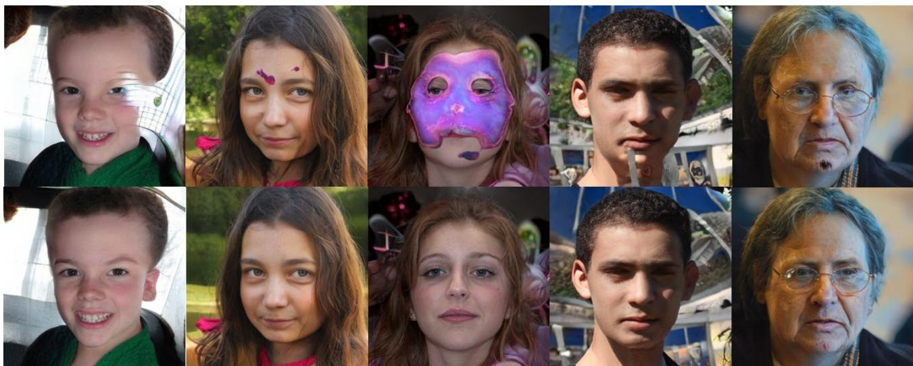  
Figure 1. Top: StyleGAN synthesized images with artifacts. Bottom: images “cured” by our method.

GAN synthesized images and these artifacts can be easily removed by a simple feature rescaling method. To minimize the unnecessary interference with useful image features, we propose a novel method to identify the risky features prone to proliferation in the earliest layers, thereby removing the least amount of them. As a result, our method significantly outperforms the truncation trick in terms of retaining useful image features while improving the quality of StyleGAN synthesized images. Experimental results justify the validity of our claims and the effectiveness of the proposed feature rescaling method. Our contributions include:

• We discover an important phenomenon, namely Feature Proliferation, which shows how specific features reproduce with forward propagation. We also show that it is a by-product of the weight modulation and demodulation techniques used in modern StyleGANs.

• We discover a strong causal relationship between the occurrence of Feature Proliferation and StyleGAN image artifacts.

• We propose a novel feature rescaling method that identifies and modulates risky features to mitigate feature proliferation, thereby achieving a better trade-off between quality and diversity of StyleGAN synthesized images than the popular truncation trick.

## 2. Related work

Since the seminal work of Goodfellow et al. [10], Generative Adversarial Networks (GANs) have become one of the most promising deep generative models that have numerous applications in computer vision and graphics. Nevertheless, GANs are known to be notoriously difficult to train and a variety of techniques have been proposed to stabilize their training from different perspectives, including architectures [25, 11], loss functions [4, 19], regularization [22, 23], and the interactions between them [24]. Thanks to the massive efforts from the community, the StyleGAN series [16, 17, 15, 27] have become one of the most influential models in the GAN family, as it can generate high-resolution and realistic images that are almost indistinguishable from real photos by human inspectors. Examples of its applications include GAN inversion and editing [1, 2, 29, 3], image-to-image translation [26], superresolution [21], 3D shape generation [32], etc. We refer interested audiences to [5] for a survey on StyleGAN and its applications. Nevertheless, despite its success, the quality of images synthesized by StyleGAN varies, and a postprocessing method known as the truncation trick [20, 6] has widely been adopted to obtain higher quality images. However, the truncation trick has long been noted as “destructive” as it unnecessarily sacrifices useful image features and tends to reduce the diversity of synthesized images. In this paper, we address this issue by investigating the StyleGAN image synthesis mechanism and propose a feature rescaling method that can precisely identify the risky features causing image artifacts, thereby improving image quality by modulating these features at the minimal cost.

## 3. Feature Proliferation in StyleGAN

In this section, we first introduce two new phenomena that we discovered in the forward propagation of deep neural networks, i.e. feature domination and proliferation. We then show that they are by-products of the weight modulation and demodulation techniques used in modern Style-GANs. Finally, we show how they affect StyleGAN and lead to artifacts in synthesized images.

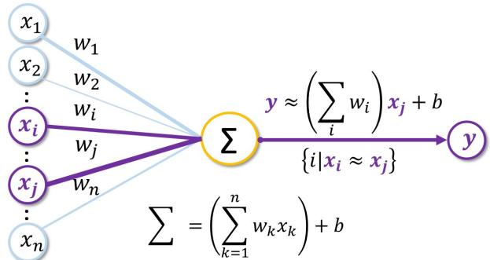  
Figure 2. Illustration of feature domination. y is dominated by $x _ { j }$ and its perturbations $x _ { i }$ ≈ $x _ { j }$

## 3.1. Feature Domination and Proliferation

Throughout the history of machine learning, the weighted sum method has been built to last from the classical linear regression, to the theoretically elegant support vector machines and the deep neural networks that are now taking both academia and industry by storm. For deep neural networks, we usually refer to the output of neurons asfeatures that are the elements to be weighted and summed. However, due to the differences among weights and input features, the output of a neuron can occasionally be dominated by one or a small amount of input features, which leads to a phenomenon we call Feature Domination.

Definition 3.1 (Feature Domination) Let $y = \mathbf { w ^ { T } } \mathbf { x } + b$ be the output ofa neuron, x and w are the input and weight vectors respectively, b denotes the bias, we define Feature Domination as the case where $\begin{array} { r } { y \approx ( \sum _ { i } w _ { i } ) x _ { j } + b } \end{array}$ is dominated by feature $x _ { j }$ and its perturbations $x _ { i }$ ≈ $x _ { j }$ , where i indicates the i-th element in w and x.

In a nutshell, the proposed Feature Domination describes the phenomenon that one or a small number of similar input features may dominate the weighted sum if their products with associated weights significantly outweigh others (Fig. 2), making y similar to $x _ { i } / x _ { j }$ . In practice, we observed that the dominant features are highly likely to be those that deviate significantly from the mean of their distributions:

## Observation 3.1 (Feature Domination in StyleGAN)

Let t be an empirically obtained threshold, and $x _ { l , j }$ be the feature map of channel j of layer l of the generator. $x _ { l , j }$ is highly likely to be dominant $i f ~ \frac { \vert \mathrm { m e a n } ( x _ { l , j } ) - \mu _ { x _ { l , j } } \vert } { \sigma _ { x _ { l , j } } } ~ > ~ t ,$ where mean $( x _ { l , j } )$ is the mean value of all elements in $x _ { l , j } ,$ $\mu _ { \boldsymbol { x } _ { l , j } }$ and $\sigma _ { x _ { l , j } }$ are the mean and standard deviation of the distribution of $x _ { l , j }$ over the training dataset.

In practice, we use Observation 3.1 to identify dominant features in StyleGANs. Furthermore, Feature Proliferation happens when the same type of Feature Domination proliferates during the forward propagation.

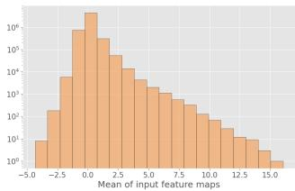  
(a) Mean of inputs

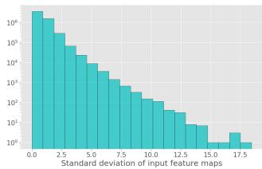  
(b) Standard deviation of inputs  
Figure 3. Histograms of mean and standard deviation of the input feature maps from 10,000 StyleGAN2 synthesized images.

Definition 3.2 (Feature Proliferation) Following Definition 3.1, let ${ \bf Y } _ { d } ( x _ { j } )$ be the set consisting of all outputs y dominated by feature $x _ { j }$ in a single neural network layer, we define Feature Proliferation as the increase of $\eta ( x _ { j } ) =$ $| \mathbf { Y } _ { d } ( x _ { j } ) | / | \mathbf { Y } |$ during forward propagation, where Y is the set of all outputs in a single neural network layer and | · | denotes the cardinality ofa set.

When Feature Proliferation happens, one or a small number of features will dominate the output of the entire network, leading to artifacts in StyleGAN synthesized images. As an analogy, we refer to it as the “cancer” in Style-GAN from its proliferating and malignant nature.

Remark. For simplicity, Definitions 3.1 and 3.2 are introduced with fully-connected layers. However, both definitions can be easily extended to other types of neural networks, e.g., convolutional neural networks (CNNs) [30], as the weighted sum operation is widely used in almost all deep neural networks due to its benefits in parallelization.

## 3.2. Root Causes of Feature Proliferation

We ascribe feature proliferation to the strong statistical assumption used in the weight modulation and demodulation of StyleGAN2/3/T [17, 15, 27], $i . e . ,$ , “the input activations are i.i.d. random variables with unit standard deviation”, rather than the statistics $( i . e . $ , mean and standard deviation) of the actual feature maps used in the AdaIN of StyleGAN1 [16].

Specifically, weight demodulation assumes that all input activations (modulated feature maps) are already normalized to be of unit standard deviation, thereby eliminating the step of feature map normalization $\frac { \mathbf { x } _ { i } - \mu ( \mathbf { x } _ { i } ) } { \sigma ( \mathbf { x } _ { i } ) }$ used in AdaIN. Since the standard deviations of output feature maps are determined by the products of those of their input feature maps (assumed to be unit ones as mentioned above) and convolutional weights, the abovementioned assumption ensures the unit standard deviations of output feature maps by only “demodulating” the convolutional weights to be of unit standard deviations [17]:

$$
w _ { i j k } ^ { \prime \prime } = { w _ { i j k } ^ { \prime } } / { \sqrt { \sum _ { i } w _ { i j k } ^ { \prime 2 } + \epsilon } } , w _ { i j k } ^ { \prime } = s _ { i } \cdot w _ { i j k }\tag{1}
$$

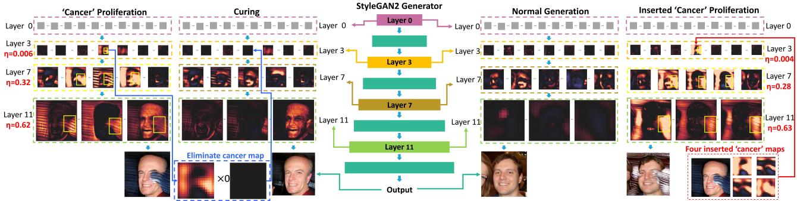  
Figure 4. Left: (’Cancer’ Proliferation) the Feature Proliferation phenomenon leads to image artifacts; (Curing) setting the visually identified proliferating feature map in Layer 3 to zero (blue arrow) mitigates feature proliferation. Right: (Normal Generation) a proper StyleGAN image synthesis process; (Inserted ’Cancer’ Proliferation) inserting the “cancer” features identified in the left part results in feature proliferation and similar image artifacts (red arrow). The yellow boxes in feature maps highlight the feature proliferation process. η in red: the ratio of dominated features in a layer.

where $s _ { i }$ is the scaling parameter corresponding to the ith input feature map, j and k enumerate the output feature maps and spatial footprint of the convolution, respectively. While in practice, the assumption of the unit standard deviation of input activations does not hold (Fig. 3). As a result, weight demodulation cannot ensure the unit standard deviations of output feature maps. Instead, the standard deviations of output feature maps are determined by those of input ones, causing feature domination and proliferation.

Remark. AdaIN explicitly normalizes each feature map according to its mean and standard deviation so the mean and standard deviation of its output are solely determined by the style parameters $\mathbf { y } = ( \mathbf { y } _ { s } , \mathbf { y } _ { b } )$ but not those of its input feature map x [16]:

$$
\operatorname { A d a I N } \left( \mathbf { x } _ { i } , \mathbf { y } \right) = \mathbf { y } _ { s , i } { \frac { \mathbf { x } _ { i } - \mu \left( \mathbf { x } _ { i } \right) } { \sigma \left( \mathbf { x } _ { i } \right) } } + \mathbf { y } _ { b , i }\tag{2}
$$

This breaks the chain of feature proliferation in forward propagation and we did not observe significant proliferation in our experiments. However, as shown in [17], AdaIN has its own problems (i.e., the “characteristic artifacts”, which is why weight demodulation is used in StyleGAN2/3) and may not be a good solution to feature proliferation.

## 3.3. Impact of Feature Proliferation on StyleGAN

As Fig. 4 shows, the synthesized images suffer from obvious artifacts when Feature Proliferation happens and we observed a strong spatial correlation between the proliferated feature maps and the artifacts in synthesized images. To justify the causality between them, we show that i) the artifacts can be “cured” by removing corresponding features before their proliferation in Fig. 4 (left) and ii) the artifacts can be added to high-quality images by inducing feature proliferation in Fig. 4 (right).

## 4. Curing the “Cancer” in StyleGAN

In this section, we first introduce how to identify the risky features for feature proliferation and then introduce a simple but effective feature rescaling method to adjust the identified features and mitigate the feature proliferation.

## 4.1. Feature Proliferation (“Cancer”) Identification

Naively, one of the most straightforward methods for feature proliferation identification is to extract all similar pairs of feature maps in the successive layers of a neural network. However, let k be the number of successive pairs of layers and n be the number of neurons per layer, the time complexity of this strategy is $O ( k n ^ { 2 } )$ per image, which is inefficient and makes it infeasible for frequent use.

Addressing this issue, we employ a heuristic stemming from Observation 3.1 that the dominant features are likely to be those that deviate significantly from the mean of their distributions. Specifically, we estimate the mean $\mu _ { l , j }$ and standard deviation $\sigma _ { l , j }$ with a large number (e.g., 3,000) of randomly sampled images and identify $x _ { l , j }$ as a high risk feature for proliferation if:

$$
r _ { l , j } = \frac { \left| \mathrm { m e a n } ( x _ { l , j } ) - \mu _ { l , j } \right| } { \operatorname* { m a x } ( \sigma _ { l , j } , c ) } > t\tag{3}
$$

where $\mathrm { m e a n } ( x _ { l , j } )$ is the mean value of all elements in $\boldsymbol { x } _ { l , j } ,$ $\boldsymbol { r } _ { l , j }$ denotes the amount of risk of feature proliferation, t is a user-defined threshold obtained empirically, $c = 0 . 1$ is a small constant introduced to avoid the mis-identification when $\sigma _ { l , j }$ is small.

## 4.2. Curing the “Cancer” by Feature Rescaling

Since the risky features identified by Eq. 3 proliferate with forward propagation, we propose a simple yet effective feature scaling method to address the proliferation in the earliest layers, thereby removing the least amount of them and minimizing the unnecessary interference with useful image features. Let $x _ { c }$ be a “cancer” feature map with risk r (Eq. 3), we have

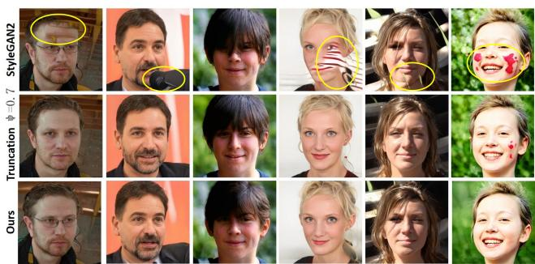  
(a) StyleGAN2 pretrained with FFHQ dataset

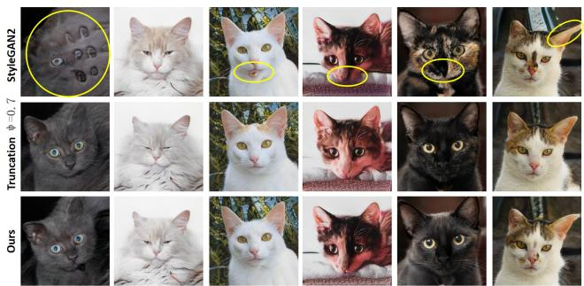

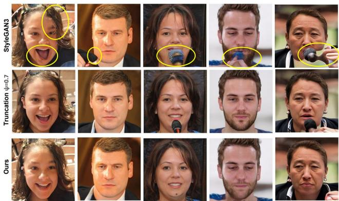  
(c) StyleGAN3 pretrained on FFHQ dataset

(b) StyleGAN2 pretrained with AFHQ-Cat dataset  
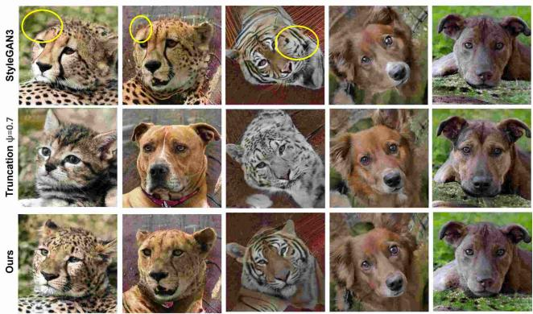  
(d) StyleGAN3 pretrained on AFHQ dataset  
Figure 5. Curated StyleGAN2/3 [17, 15] synthesized images, those processed by the truncation trick (ψ=0.7), and our method.

$$
x _ { c } ^ { m } = \frac { x _ { c } } { p \cdot r }\tag{4}
$$

where $x _ { c } ^ { m }$ denotes the modified feature map, p is the scaling hyper-parameter. By rescaling $x _ { c }$ , we reduce the values of its elements and thus prevent it from Feature Domination (Definition 3.1) and Proliferation (Definition 3.2), thereby improving the quality of StyleGAN synthesized images.

## 5. Experiments

Please see the supplement for more experiments.

## 5.1. Experimental Setup

The proposed method does not require network training. We run the proposed method with pretrained deep generative models on a workstation with an Intel(R) Core(TM) i7-10875H CPU and a GeForce RTX 3080 GPU. The pretrained StyleGAN2 [17] models (using FFHQ [16], Met-Face [14] and AFHQ-Cat [8] datasets) used in all our experiments are publicly-released on Github3. Unless specified, we use hyperparameters t = 2 and $p = 2$ for our method, and $\psi = 0 . 7$ for the truncation trick that has been suggested for the best trade-off between quality and diversity of synthesized images [16, 6].

## 5.2. Qualitative Evaluation

As Fig. 5 shows, we compare the performance of our method against the truncation trick [20, 6] on StyleGAN2 and StyleGAN3 models pretrained on FFHQ, MetFace and AFHQ-Cat datasets. In Fig. 5(a), it can be observed that: i) all the StyleGAN2 synthesized images in the top row, except the third one, contain obvious artifacts; ii) for the third column (high-quality image), our method retains useful image features better than the truncation trick; iii) for the other columns, our method not only removes the artifacts but also retains useful image features in a better way, $e . g .$ ., the truncation trick eliminates the eyeglasses in column 1 while our method retains them and other fine facial details like the beard. Similar results can be observed in Fig. 5(b), which demonstrates the versatility of our method across datasets.

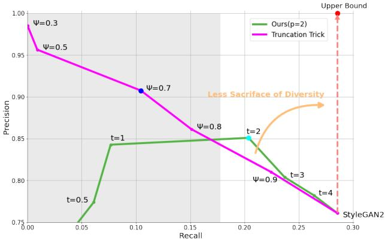  
Figure 6. Comparison of precision and recall [18] between the truncation trick [20, 6] and our method on StyleGAN2. p and t are hyperparameters of our method and ψ is the hyperparameter for the truncation trick. “StyleGAN2” (bottom-right corner): precision and recall of the original StyleGAN2; Blue (ψ = 0.7): best ψ recommended by StyleGAN2 [17]; Cyan (p = 2, t = 2): best p and t of our method; Red: the upper bound of StyleGAN “correction” methods where every error is corrected (precision=1.0) without sacrificing diversity (recall remains constant); Orange: the closer to the dashed line, the less sacrifice of diversity; Gray: region of uninterest where too much diversity has been sacrificed. Ours is closer to the dashed line in the region of interest, indicating that it strikes a better balance between precision and recall.

Table 1. Comparison with Truncation Trick (TT) [6] using PSNR, SSIM [33], LPIPS [31], ID (identity preservation using the Arc-Face [9]) and FID [12] computed with 10K images on StyleGAN2.
<table><tr><td>Dataset Method</td><td>AFHQ-Cat TT</td><td>Ours</td><td>MetFace TT</td><td>Ours</td><td>FFHQ</td><td>Ours</td></tr><tr><td>PSNR↑ SSIM↑ LPIPS↓</td><td>3.66 0.79 0.15 0.14</td><td>4.11 0.81</td><td>5.33 0.81 0.22</td><td>10.45 0.87</td><td>TT 3.80 0.74</td><td>4.28 0.68</td></tr></table>

Figs. 5(c) and 5(d) show synthesized results of the truncation trick and our method on StyleGAN3 [15] models pretrained on FFHQ and AFHQ datasets4. It can be observed that our claims still hold on StyleGAN3, which further justifies the superiority of our method.

## 5.3. Quantitative Evaluation

Precision and Recall. Fig. 6 shows the comparison of precision and recall [18] between the truncation trick [20, 6] and our method on StyleGAN2. It can be observed that our method strikes a better balance between precision and recall $( p = 2 , t = 2 )$ in the region of interest (right side, white region) while the truncation trick sacrifices too much diversity to achieve the same level of precision. Recognizing that the aims of StyleGAN correction methods are to maximize image quality (i.e., precision) without sacrificing diversity (i.e., recall), our method has made a concrete step towards the ultimate solution (red point in Fig. 6).

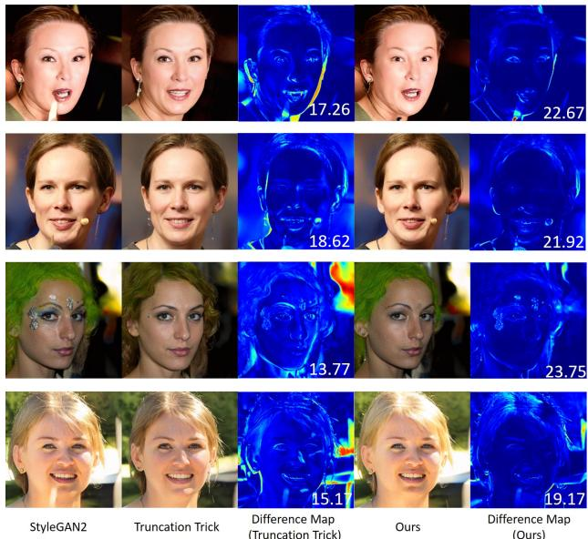  
Figure 7. Comparison of difference maps of truncation trick [20, 6] and our method. The numbers at the bottom right corner of the difference images are PSNR scores.

Table 2. Comparison with Truncation Trick (TT) [6] using PSNR, SSIM [33], LPIPS [31] and FID [12] computed with 10K images on StyleGAN3.
<table><tr><td>Dataset Method</td><td>FFHQ TT Ours</td><td>AFHQ-Cat TT</td><td>Ours</td></tr><tr><td>PSNR↑</td><td>16.23</td><td>18.07</td><td>16.03 17.72</td></tr><tr><td>SSIM↑</td><td>0.70</td><td>0.78</td><td>0.70 0.76</td></tr><tr><td>LPIPS↓</td><td>0.33</td><td>0.22 0.16</td><td>0.13</td></tr><tr><td>FID↓</td><td>22.45</td><td>14.31</td><td>24.02 17.36</td></tr></table>

Image Similarity Metrics. Although less effective in assessing the trade-off between quality and diversity, for the sake of completeness, we also quantitatively compare the extent to which image features are retained by our method and the truncation trick [20, 6]. As Table 1 shows, for Style-GAN2, it can be observed that i) for PSNR, SSIM [33] and LPIPS [31], our method outperforms the truncation trick in most cases, which demonstrates that our method better retains the useful features in the original image. However, the SSIM of our method is slightly worse than that of the truncation trick for the FFHQ dataset. We ascribe this to the superior power of our method in removing structural artifacts that are common in StyleGAN pretrained with the FFHQ dataset. ii) For ID, we used the ArcFace [9] to compute the identity similarity scores between the original and the processed images. Interestingly, we observe that although trained on human face datasets, ArcFace [9] generalizes to AFHQ-Cat [8] and MetFace [14] images and provides meaningful scores. iii) For FID [12], our method outperforms the truncation trick in all three datasets, which again demonstrates that our method better retains the useful features in the original image. We also show the difference maps in Fig. 7 to facilitate intuitive understanding. The results on StyleGAN3 [15] are shown in Table 2. It can be observed that our claims still hold on StyleGAN3, which further justifies the superiority of our method.

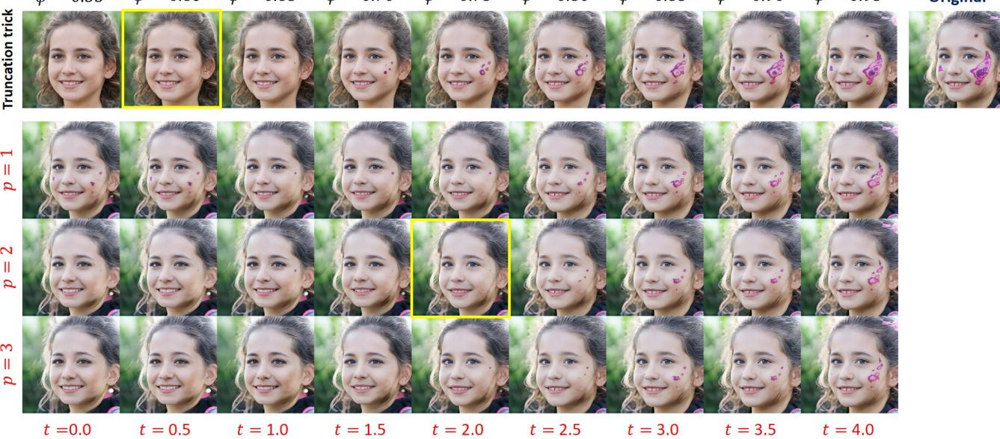  
Figure 8. Choice of hyper-parameters. Top row: images generated with truncation trick with ψ = 0.55 to 0.95. Rows 2-4: image generated with our method with t = 0.0 to 4.0, p = 1 to 3. Our method removes the artifacts while retaining almost all important feature of the original image, indicating that it achieves a better trade-off between image quality and diversity than the truncation trick.

## 5.4. Choice of Hyper-parameters

Similar to ψ in the truncation trick [20, 6], we use two hyperparameters t and p for the trade-off between quality and diversity in our method. Between them, t determines how many feature maps are identified as risky ones for feature proliferation, and p adjusts the extent to which we rescale such feature maps. In general, the more risky feature maps identified, the stronger rescaling, and the higher quality but less diversity of synthesized images.

Qualitative Justification. As Fig. 8 shows, we visualize the results generated with the truncation trick with ψ = 0.6 to 1.0 and our method with t = 0.0 to 4.0 and p = 1.0 to 3.0, and identify the best choice $( p = 2 , t = 2 )$ through visual inspection. In general, the smaller the t, the more features are identified as risky (Eq. 3) for rescaling; the larger the p, the stronger the rescaling. In this way, t and p work together to modify only the problematic features, thus achieving a better trade-off between quality and diversity than the truncation trick.

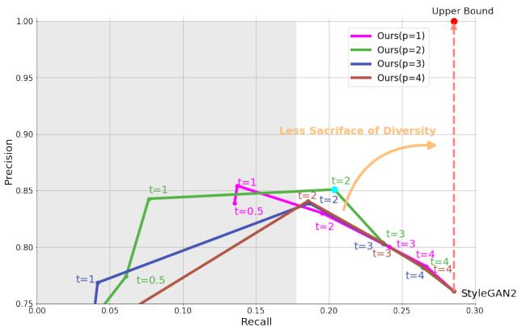  
Figure 9. Choice of Hyper-parameters (Quantitative). It can be observed that $p \ = \ 2 , t \ = \ 2$ (cyan) achieves the best trade-off between precision and recall, which is consistent with the visual inspection results in Fig. 8.

Quantitative Justification. We quantitatively justify the choice of hyper-parameters p and t by comparing their precision and recall. As Fig. 9 shows, $p = 2 , t = 2$ achieves the best trade-off between precision and recall, which is consistent with the qualitative results in Fig. 8.

## 5.5. Ablation Study

To justify the effectiveness of our channel-wise feature identification and rescaling strategy (Sec. 4), we demonstrate its superiority over its layer-wise and pixel-wise variants as follows.

Layer-wise “Cancer” Curing. As in Sec. 4, let $x _ { l , j }$ be a “cancer” feature map identified using Eq. 3, we compute the mean absolute “cancer” feature map for layer l as:

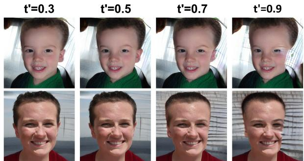  
Figure 10. Successful cases of the layer-wise variant of our method (threshold $t ^ { \prime }$ ranges from 0.3 to 0.9). It can be observed that this variant is effective in removing artifacts of background intrusion.

$$
\hat { x } _ { l } = \mathrm { m e a n } _ { j } ( | x _ { l , j } | )\tag{5}
$$

where we take the absolute value $| x _ { l , j } |$ to capture their magnitude and avoid them canceling each other out when added together. In order to make the same choice of hyperparameters applicable to all layers, we normalize $\hat { x } _ { l }$ to $\bar { x } _ { l }$ with mean $\mu = 0$ and $\sigma = 1$

$$
\bar { x } _ { l } = \frac { \hat { x } _ { l } - \mu ( \hat { x } _ { l } ) } { \sigma ( \hat { x } _ { l } ) }\tag{6}
$$

Then we measure the “correlation” between each $| x _ { l , j } |$ and its corresponding $\bar { x } _ { l }$ as:

$$
c _ { l , j } = \frac { \vert x _ { l , j } \vert * \bar { x } _ { l } } { \sum _ { \mathrm { e l e m e n t } } \vert x _ { l , j } \vert }\tag{7}
$$

where $\sum _ { \mathrm { e l e m e n t } } \left| x _ { l , j } \right|$ is the sum for all elements in $| x _ { l , j } |$ Let $t ^ { \prime }$ be a threshold hyper-parameter, if $c _ { l , j } > t ^ { \prime }$ , we mark $x _ { l , j }$ as a layer-wise “cancer” feature map and perform the same feature rescaling on it to remove image artifacts. As Fig. 10 shows, this layer-wise variant of our method is also effective for certain types of image artifacts (e.g., background intrusion). While for some other types of artifacts (e.g., alien objects), it becomes less effective (Fig. 11).

Pixel-wise “Cancer” Curing. We follow ProGAN [13] and apply its pixel-wise feature vector normalization technique, which was originally proposed to stabilize GAN training by resolving the potentially exploding magnitudes in the generator and discriminator, to pre-trained StyleGAN2. However, we observed that even the normally synthesized images become unrealistic (Fig. 12), indicating that it is not applicable to our problem.

## 5.6. Time Complexity

Table 3 shows the time costs of generating a single image for StyleGAN2, ours implemented in serial, and ours implemented in parallel on an Nvidia V100 GPU. It can be observed that the parallel implementation of our method significantly reduces the time costs from a factor of approximately 15-20 (Serial) to approximately 5 times those of the original StyleGAN2 (SG2). We leave further acceleration of our method to future work.

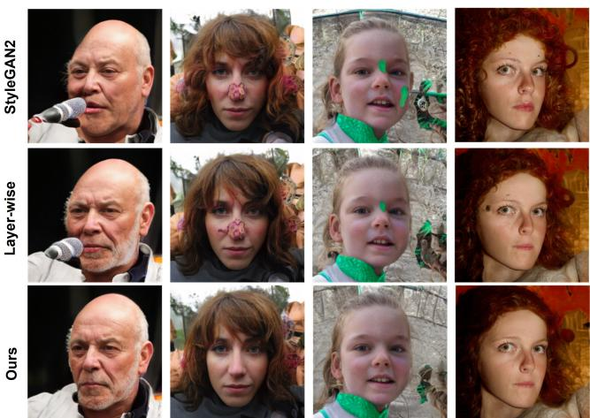

Figure 11. Failure cases of the layer-wise variant of our method (threshold $t ^ { \prime } = 0 . 5 )$ . It can be observed that this variant is ineffective in removing artifacts of alien objects (e.g., color blocks on faces) while our method can remove them effectively. Top row: low-quality images synthesized by StyleGAN2; Middle row: results of the layer-wise variant of our method; Bottom row: results of our method.  
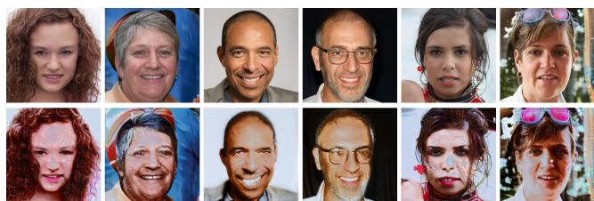  
Figure 12. Effects of pixel-wise feature vector normalization on StyleGAN2 pre-trained on FFHQ dataset. Top row: normal images synthesized by StyleGAN2. Bottom row: images after applying pixel-wise feature vector normalization, which become unrealistic.

Table 3. Time costs of generating a single image for StyleGAN2, Ours (Serial) and Ours (Parallel) on an Nvidia V100 GPU. The time is averaged over 100 runs.
<table><tr><td>Dataset</td><td>FFHQ</td><td>AFHQ</td></tr><tr><td>SG2</td><td>0.075s</td><td>0.031s</td></tr><tr><td>Ours (Serial)</td><td>0.972s</td><td>0.721s</td></tr><tr><td>Ours (Parallel)</td><td>0.409s</td><td>0.189s</td></tr></table>

## 5.7. Applications in Interpolation and Editing

Fig. 13 shows that our method can remove image artifacts while retaining smooth StyleGAN interpolations, and

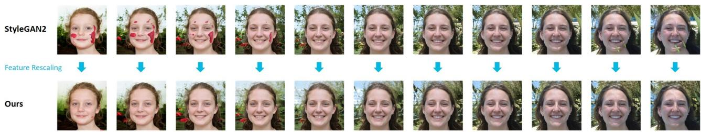  
Figure 13. Our method is compatible with StyleGAN interpolations. StyleGAN2: interpolation between defective images synthesized by StyleGAN2; Ours: images “corrected” by our feature rescaling method.

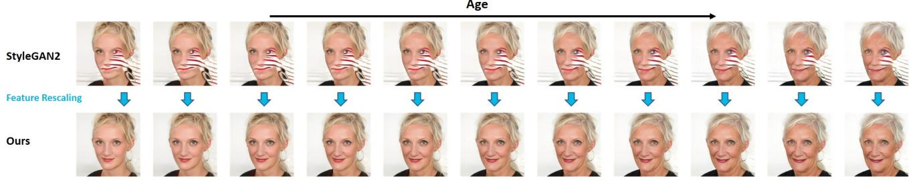  
Figure 14. Our method is compatible with StyleGAN image editing [28]. StyleGAN2: interpolation between defective images synthesized by StyleGAN2; Ours: images “corrected” by our feature rescaling method.

Fig. 14 shows similar observations for StyleGAN image editing. These suggest that our method preserves StyleGAN latent semantics and is thus compatible with various Style-GAN latent space operations.

## 6. Conclusion

In this paper, we propose a novel feature identification and rescaling method to address the artifacts in StyleGAN synthesized images. The rationale of the proposed feature rescaling method stems from the Feature Proliferation phenomenon we discovered that has a strong causal relationship with StyleGAN image artifacts. Specifically, we observed that the features that deviate significantly from the mean of their distribution are highly likely to dominate the output of a neuron and proliferate in the forward propagation. As a result, the output of the entire network will be dominated by a small number of features. We ascribe this to the strong statistical assumption used in the weight modulation and demodulation used by the StyleGAN family. Intuitively, we name Feature Proliferation as the “cancer” in StyleGANs from its proliferating and malignant nature. Experimental results demonstrate that our method achieves a better tradeoff between quality and diversity of StyleGAN synthesized images than the popular truncation trick.

Limitation and Future Work. Although effective and significantly better than the truncation trick, the proposed method is not perfect as it can still remove some useful image features and make minor changes to high-quality Style-GAN synthesized images. We plan to design more precise methods to identify and process proliferating features in future work. In addition, we believe that Feature Proliferation is not a problem exclusive to StyleGAN and may occur in other works as long as weight modulation and demodulation techniques are used (Sec. 3.2). Thus, we plan to investigate in future work whether feature proliferation is a common phenomenon in various network architectures and its consequences in different tasks.

Potential Negative Social Impact. Although our method works as a post-hoc “cure” for StyleGAN synthesized images and can save millions of dollars in training costs and energy consumption, it may also lead to potentially negative social impacts. For example, it can further improve the quality of StyleGAN synthesized images, which may facilitate the creation of fake portrait photos/videos for fake social media accounts and fake news. Nevertheless, we still believe that our work will make a positive contribution to the field and provide new insights into the mechanisms of generative models that may help identify such fake content.

## Acknowledgements

We thank the reviewers for their constructive comments that helped improve this paper. This work was partially supported by the China Scholarship Council (CSC) under Grant No. 202106150033 and the UK Engineering and Physical Sciences Research Council (EPSRC) through the Doctoral Training Partnerships (DTP) with No. EP/T517951/1 (2599521).

## References

[1] Rameen Abdal, Yipeng Qin, and Peter Wonka. Image2StyleGAN: How to embed images into the StyleGAN latent space? In Proceedings ofthe IEEE/CVF International Conference on Computer Vision, pages 4432–4441, 2019.

[2] Rameen Abdal, Yipeng Qin, and Peter Wonka. Image2StyleGAN++: How to edit the embedded images? In Proceedings of the IEEE/CVF Conference on Computer Vision and Pattern Recognition, pages 8296–8305, 2020.

[3] Yuval Alaluf, Omer Tov, Ron Mokady, Rinon Gal, and Amit Bermano. HyperStyle: StyleGAN inversion with hypernetworks for real image editing. In Proceedings of the IEEE/CVF conference on computer Vision and pattern recognition, pages 18511–18521, 2022.

[4] Martin Arjovsky, Soumith Chintala, and Leon Bottou.´ Wasserstein generative adversarial networks. In International conference on machine learning, pages 214–223. PMLR, 2017.

[5] Amit H Bermano, Rinon Gal, Yuval Alaluf, Ron Mokady, Yotam Nitzan, Omer Tov, Or Patashnik, and Daniel Cohen-Or. State-of-the-art in the architecture, methods and applications of StyleGAN. arXiv preprint arXiv:2202.14020, 2022.

[6] Andrew Brock, Jeff Donahue, and Karen Simonyan. Large scale GAN training for high fidelity natural image synthesis. arXiv preprint arXiv:1809.11096, 2018.

[7] Tom Brown, Benjamin Mann, Nick Ryder, Melanie Subbiah, Jared D Kaplan, Prafulla Dhariwal, Arvind Neelakantan, Pranav Shyam, Girish Sastry, Amanda Askell, et al. Language models are few-shot learners. Advances in neural information processing systems, 33:1877–1901, 2020.

[8] Yunjey Choi, Youngjung Uh, Jaejun Yoo, and Jung-Woo Ha. StarGAN v2: Diverse image synthesis for multiple domains. In Proceedings of the IEEE/CVF conference on computer vision and pattern recognition, pages 8188–8197, 2020.

[9] Jiankang Deng, Jia Guo, Niannan Xue, and Stefanos Zafeiriou. ArcFace: Additive angular margin loss for deep face recognition. In Proceedings of the IEEE/CVF conference on computer vision and pattern recognition, pages 4690–4699, 2019.

[10] Ian Goodfellow, Jean Pouget-Abadie, Mehdi Mirza, Bing Xu, David Warde-Farley, Sherjil Ozair, Aaron Courville, and Yoshua Bengio. Generative adversarial nets. Advances in neural information processing systems, 27, 2014.

[11] Kaiming He, Xiangyu Zhang, Shaoqing Ren, and Jian Sun. Deep residual learning for image recognition. In Proceedings of the IEEE conference on computer vision and pattern recognition, pages 770–778, 2016.

[12] Martin Heusel, Hubert Ramsauer, Thomas Unterthiner, Bernhard Nessler, and Sepp Hochreiter. GANs trained by a two time-scale update rule converge to a local Nash equilibrium. Advances in neural information processing systems, 30, 2017.

[13] Tero Karras, Timo Aila, Samuli Laine, and Jaakko Lehtinen. Progressive growing of GANs for improved quality, stability, and variation. arXiv preprint arXiv:1710.10196, 2017.

[14] Tero Karras, Miika Aittala, Janne Hellsten, Samuli Laine, Jaakko Lehtinen, and Timo Aila. Training generative ad-

versarial networks with limited data. Advances in Neural Information Processing Systems, 33:12104–12114, 2020.

[15] Tero Karras, Miika Aittala, Samuli Laine, Erik Hark¨ onen,¨ Janne Hellsten, Jaakko Lehtinen, and Timo Aila. Alias-free generative adversarial networks. Advances in Neural Information Processing Systems, 34, 2021.

[16] Tero Karras, Samuli Laine, and Timo Aila. A style-based generator architecture for generative adversarial networks. In Proceedings of the IEEE/CVF conference on computer vision and pattern recognition, pages 4401–4410, 2019.

[17] Tero Karras, Samuli Laine, Miika Aittala, Janne Hellsten, Jaakko Lehtinen, and Timo Aila. Analyzing and improving the image quality of StyleGAN. In Proceedings of the IEEE/CVF conference on computer vision and pattern recognition, pages 8110–8119, 2020.

[18] Tuomas Kynka¨anniemi, Tero Karras, Samuli Laine, Jaakko¨ Lehtinen, and Timo Aila. Improved precision and recall metric for assessing generative models. Advances in Neural Information Processing Systems, 32, 2019.

[19] Xudong Mao, Qing Li, Haoran Xie, Raymond YK Lau, Zhen Wang, and Stephen Paul Smolley. Least squares generative adversarial networks. In Proceedings of the IEEE international conference on computer vision, pages 2794–2802, 2017.

[20] Marco Marchesi. Megapixel size image creation using generative adversarial networks. arXiv preprint arXiv:1706.00082, 2017.

[21] Sachit Menon, Alexandru Damian, Shijia Hu, Nikhil Ravi, and Cynthia Rudin. PULSE: Self-supervised photo upsampling via latent space exploration of generative models. In Proceedings of the ieee/cvf conference on computer vision and pattern recognition, pages 2437–2445, 2020.

[22] Lars Mescheder, Andreas Geiger, and Sebastian Nowozin. Which training methods for GANs do actually converge? In International conference on machine learning, pages 3481– 3490. PMLR, 2018.

[23] Takeru Miyato, Toshiki Kataoka, Masanori Koyama, and Yuichi Yoshida. Spectral normalization for generative adversarial networks. arXiv preprint arXiv:1802.05957, 2018.

[24] Yipeng Qin, Niloy Mitra, and Peter Wonka. How does Lipschitz regularization influence GAN training? In European Conference on Computer Vision, pages 310–326. Springer, 2020.

[25] Alec Radford, Luke Metz, and Soumith Chintala. Unsupervised representation learning with deep convolutional generative adversarial networks. arXiv preprint arXiv:1511.06434, 2015.

[26] Elad Richardson, Yuval Alaluf, Or Patashnik, Yotam Nitzan, Yaniv Azar, Stav Shapiro, and Daniel Cohen-Or. Encoding in style: a StyleGAN encoder for image-to-image translation. In Proceedings of the IEEE/CVF Conference on Computer Vision and Pattern Recognition, pages 2287–2296, 2021.

[27] Axel Sauer, Tero Karras, Samuli Laine, Andreas Geiger, and Timo Aila. StyleGAN-T: Unlocking the power of GANs for fast large-scale text-to-image synthesis. arXiv preprint arXiv:2301.09515, 2023.

[28] Yuri Viazovetskyi, Vladimir Ivashkin, and Evgeny Kashin. Stylegan2 distillation for feed-forward image manipulation.

In Computer Vision–ECCV 2020: 16th European Conference, Glasgow, UK, August 23–28, 2020, Proceedings, Part XXII 16, pages 170–186. Springer, 2020.

[29] Tengfei Wang, Yong Zhang, Yanbo Fan, Jue Wang, and Qifeng Chen. High-fidelity GAN inversion for image attribute editing. arXiv preprint arXiv:2109.06590, 2021.

[30] Jianxin Wu. Introduction to convolutional neural networks. National Key Lab for Novel Software Technology. Nanjing University. China, 5(23):495, 2017.

[31] Richard Zhang, Phillip Isola, Alexei A Efros, Eli Shechtman, and Oliver Wang. The unreasonable effectiveness of deep features as a perceptual metric. In Proceedings of the IEEE conference on computer vision and pattern recognition, pages 586–595, 2018.

[32] X Zheng, Yang Liu, P Wang, and Xin Tong. SDF-StyleGAN: Implicit SDF-based StyleGAN for 3D shape generation. In Computer Graphics Forum, volume 41, pages 52–63. Wiley Online Library, 2022.

[33] Wang Zhou. Image quality assessment: from error measurement to structural similarity. IEEE transactions on image processing, 13:600–613, 2004.