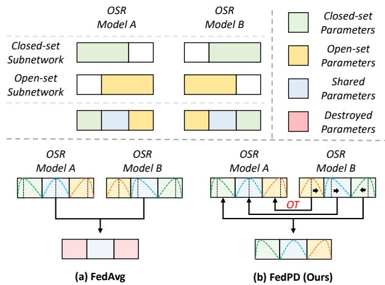
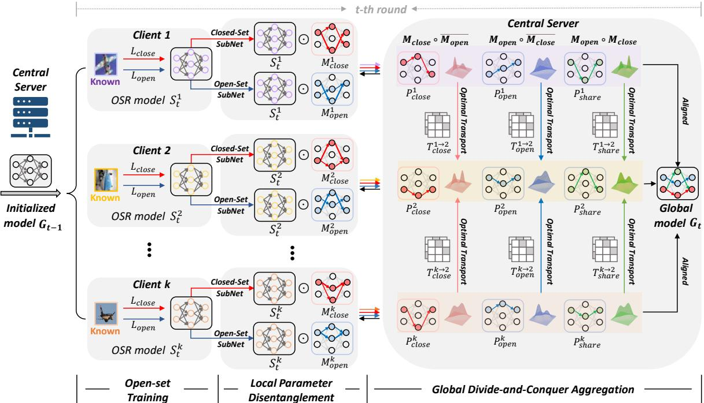
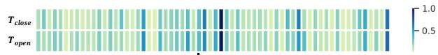
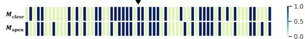
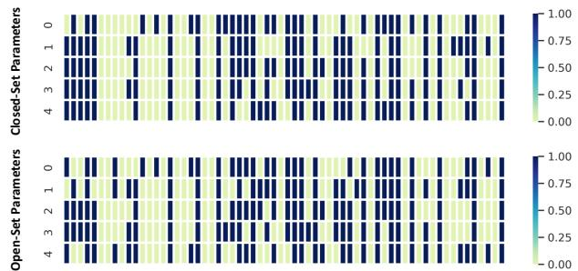
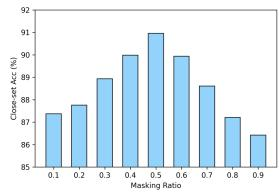
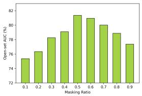
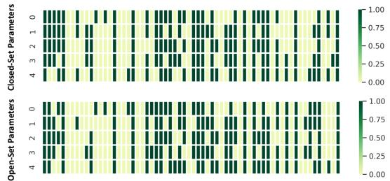

# FedPD: Federated Open Set Recognition with Parameter Disentanglement

Chen Yang1 Meilu Zhu1 Yifan Liu2 Yixuan Yuan1,2\* 1City University of Hong Kong 2The Chinese University of Hong Kong {cyang53, meiluzhu2}-c@my.cityu.edu.hk 1155195605@link.cuhk.edu.hk yxyuan@ee.cuhk.edu.hk

## Abstract

Existing federated learning (FL) approaches are deployed under the unrealistic closed-set setting, with both training and testing classes belong to the same set, which makes the global model fail to identify the unseen classes as ‘unknown’. To this end, we aim to study a novel problem of federated open-set recognition (FedOSR), which learns an open-set recognition (OSR) model under federated paradigm such that it classifies seen classes while at the same time detects unknown classes. In this work, we propose a parameter disentanglement guided federated open-set recognition (FedPD) algorithm to address two core challenges of FedOSR: cross-client inter-set interference between learning closed-set and open-set knowledge and cross-client intra-set inconsistency by data heterogeneity. The proposed FedPD framework mainly leverages two modules, i.e., local parameter disentanglement (LPD) and global divide-and-conquer aggregation (GDCA), to first disentangle client OSR model into different subnetworks, then align the corresponding parts cross clientsfor matched model aggregation. Specifically, on the client side, LPD decouples an OSR model into a closed-set subnetwork and an open-set subnetwork by the task-related importance, thus preventing inter-set interference. On the server side, GDCA first partitions the two subnetworks into specific and shared parts, and subsequently aligns the corresponding parts through optimal transport to eliminate parameter misalignment. Extensive experiments on various datasets demonstrate the superior performance ofour proposed method.

## 1. Introduction

Deep learning algorithms rely on the availability of large-scale data to achieve remarkable performance. However, in reality, data is scattered across different organizations and difficult to integrate into a centralized dataset, owing to increasing privacy and ethical concerns, especially for those sensitive data such as location-based services or health information [22]. To break this dilemma, federated learning (FL) [5, 23, 20] provides a privacy-preserving paradigm that allows local clients to collaboratively train a shared global model without data sharing.

  
Figure 1. Parameter disentanglement on FedOSR models and comparison of various aggregation strategies on FedOSR setting. (a) FedAvg simply aggregates multiple OSR models, leading to model collapse; (b) Our FedPD first aligns corresponding closespecific, open-specific and shared parts by optimal transport (OT), then aggregates aligned parameters. The curves inside the network box represent different parameter distribution of each parts.

Although FL has recently achieved promising progress, existing FL works [23, 20, 5] are generally evaluated in a closed-set scenario, where the categories of training and testing samples are identical. The closed-set setting is irrational since unknown classes may appear at the test time and would be classified into known classes. This problem seriously impedes the deployment of FL models in many realworld applications due to enormous risk, such as clinical diagnosis and autonomous driving. Current open-set recognition (OSR) methods [3, 43, 2, 6] attempt to improve the ability of models in recognizing unknown classes, but they are designed for the centralized setting. In this work, we represent the first effort to formulate a challenging and unexplored problem of Federated Open Set Recognition (FedOSR). FedOSR aims to unite multiple distributed clients to learn a global model and reduce privacy as well as security risk, which not only exactly classifies known classes but also recognizes unknown classes in the testing stage.

Directly applying existing OSR methods into the FL setting for FedOSR mainly undergoes two troublesome challenges. The first challenge lies in the cross-client interset interference between learning closed-set and open-set knowledge. According to the previous study [34], the partial parameters of a client model are in charge of learning knowledge of known classes, and the rest are related to open set. The known classes-related parameters of a client is probably polluted by the open set-related parameters from other clients after server communication, leading to the performance degradation on closed set. Similarly, open set-related parameters of a client are also affected by closed-set knowledge of other clients. In this situation, a unknown samples would be possibly misclassified into known classes. The second one is cross-client intra-set inconsistency by data heterogeneity. Even though we aggregate corresponding closed-related parameters of OSR models from different clients, these parameters are still misaligned due to the permutation invariance property of neural networks and data heterogeneity [37]. Aggregation of local client parameters directly at the server can result in inconsistent models among the clients, leading to significant divergence of client models. This inconsistency issue can cause slow and unstable convergence [19], ultimately resulting in sub-optimal performance of the entire FL system [17, 37].

To achieve FedOSR, we conquer these intractable challenges from a new perspective, i.e., parameter disentanglement. Based on the lottery ticket hypothesis [7, 11, 36], we divide parameters of a client model into a closed-set subnetwork and an open-set subnetwork. These two subnetworks have their own specific parameters, which are only related to known classes and unknown classes respectively. Meanwhile, they also share partial parameters since known and unknown samples might have some similar patterns [35]. The parameter disentanglement of client models can preserve the high performance of closed set by reducing the interference from open-set subnetworks. As shown in Fig. 1, the closed-set subnetworks and the open-set subnetworks of different client models distribute in different positions with some overlaps. Directly aggregating all client OSR models by FedAvg [23] on the server side may encounter the parameter misalignment problem and lead to model collapse as shown in Fig. 1 (a). These destroyed parameters are transmitted to clients and slow down the convergence of the federated system due to bad model initialization to the next training step. Therefore, aligning these subnetworks before model aggregation is a crucial step to solve the inconsistency problem of parameter distributions.

To tackle these challenges in FedOSR, we propose a novel parameter disentanglement guided federated OSR (FedPD) algorithm in this paper, which effectively addresses the local parameter misalignment problem occurred on the global model aggregation. Specifically, we design a local parameter disentanglement strategy (LPD) to firstly decouple an OSR model into two subnetworks: an openset subnetwork and a closed-set subnetwork by task-related metrics. To overcome the parameter misalignment caused by simply parameter averaging on whole client OSR models, we propose a global divide-and-conquer aggregation (GDCA) method to firstly divide two subnetworks into specific parts and shared parts, then align corresponding parameter components by optimal transport [13, 30] and aggregate them. As shown in Fig. 1 (b), our FedPD enables reasonable model aggregation and reliable global model to boost federated training.

The major contribution of this paper are summarized as follows:

• We address a practical FL problem, namely Federated Open-Set Recognition (FedOSR). To the best of our knowledge, this is the first work to improve the ability of detecting novel category for federated models.

• We propose a novel Parameter Disentanglement guided Federated algorithm (FedPD) to solve parameter misalignment problem in FedOSR.

• On the client side, we introduce the Local Parameter Disentanglement (LPD) approach, which leverages task-related importance on model parameters to decouple the local OSR model into a closed-set subnetwork and an open-set subnetwork.

• On the server side, we design a Global Divide-and-Conquer Aggregation (GDCA) strategy to partition the two subnetworks into specific and shared parts, align the corresponding parts via optimal transport, and subsequently fuse them to alleviate the misalignment problem in FedOSR.

## 2. Related Work

## 2.1. Federated Learning

Federated learning [23, 20, 38, 37, 19, 29, 24, 42] provides a promising privacy-preserving solution for multi-site data collaboration, which develops a global model from decentralized datasets by aggregating the parameters of each local client while keeping data locally. Representatively, McMahan [23] proposed the popular FedAvg algorithm for communication-efficient federated training of deep networks. There are two lines to improve FedAvg: improvement on local training and on global aggregation.

Regarding improving local training, FedProx [19] introduced a proximal term to the clients’ objective, which regulates the local updates to be closer to the initial global model. Meanwhile, MOON [18] proposed a model contrastive loss that corrects local updates by maximizing the agreement of the representation learned by the current local model and the global model, and minimizing the agreement of the representation learned by the current local model and the previous local model.

As for studies on improving the global aggregation phase, FedMA [37] utilizes Bayesian non-parametric methods to match and average weights in a layer-wise manner. To preserve personalization of local clients, FedBN [20] aggregates parameters except BN layers on the server side. Chen [5] proposed to aggregate client model parameters on the frequency domain. Even if these works [37, 21] try to solve parameter misalignment, they are applied to the closed-set recognition task, which can’t be directly transferred to open-set recognition due to complex parameter composition in open-set recognition.

## 2.2. Open Set Recognition

To deploy the classification models to real-world scenario with high stability, open-set recognition (OSR) [40, 41, 33, 3, 43] was proposed to classify known classes while detect unknown classes at the same time. Recent deep learning-based OSR methods can be classified into three categories: discriminative-based models, prototype-based models and generative-based models.

Discriminative model-based methods calibrate the classification logistics to detect unknown samples. Softmax scores are initially utilized to identify out-of-distribution data by argmax thresholding. OpenMax [2] improves softmax scores with an OpenMax layer and fits outputs probabilities with Weibull distributions.

Prototype-based methods [4, 3, 26] apply prototype learning to identify unknown samples on the feature space. ARPL [3] enhanced prototype learning with generated fake samples to achieve prediction-level and feature-level detection. Even if prototype-based methods show outstanding performance on open-set recognition, they are not suitable to be applied on FL since the uploaded prototype may cause leakage of privacy.

Generative model-based methods generate unknown samples using GANs [10] and autoencoders [1] to help the classifier learning the decision boundary between known and unknown distributions. OSRCI [27] utilized GAN [10] architecture to generate counterfactual examples. PROSER [43] set up the open space between class boundaries to keep classes far from each other based on manifold mixup. Generally, there are a closed-set loss based on supervision from known samples and an open-set loss by generated unknown samples or boundary constrains [9, 32].

## 3. Problem Definition

We begin with formal definition of Federated Learning (FL) and Open-Set Recognition (OSR). Then we define Federated Open-Set Recognition (FedOSR) and its challenges.

Open-Set Recognition: In the standard open-set recognition, the model is trained with a labelled closed training set $\mathcal { D } _ { t r a i n } = \{ ( x _ { i } , y _ { i } ) \} _ { i = 1 } ^ { N } \subset \mathcal { X } \times \mathcal { C } .$ , where X is the input images and C is the set of ‘known’ classes. On the testing phase, the testing set $\mathcal { D } _ { t e s t } = \{ ( x _ { i } , y _ { i } ) \} _ { i = 1 } ^ { M } \subset \mathcal { X } \times ( \mathcal { C } \cup \mathcal { U } )$ contains both seen classes C and unseen classes U. In addition to returning the distribution $p ( y | x , y \in \mathcal { C } )$ over known classes, the model also returns a score $\mathcal { O } ( y \in \mathcal { C } | x )$ to indicate whether or not the test sample belongs to any of the known classes. Since generative model-based approaches shows superior performance, we utilize these methods as our baseline. There are two loss components of generative model-based approaches: closed-set loss based on supervision from known samples and an open-set loss by generated unknown samples or boundary constrains:

$$
\mathcal { L } _ { c l s } = \mathcal { L } _ { c l o s e } + \lambda \cdot \mathcal { L } _ { o p e n } ,\tag{1}
$$

where $\mathcal { L } _ { c l o s e }$ is the cross entropy loss between model prediction and known ground truth, $\mathcal { L } _ { o p e n }$ is to constrain open space or generated unknown samples.

Federated Open-Set Recognition: We then extend conventional open-set recognition to Federated Open-Set Recognition (FedOSR). Given K local clients $\{ S ^ { l } \} _ { l = 1 } ^ { \bar { K } }$ with the same known classes C and a global central server $G ,$ for the federated round $t ,$ every client $S ^ { k }$ will receive the same global model weights $G _ { t - 1 }$ from the central server and update the model with their local data $\mathcal { D } _ { k }$ for $E$ epochs. The central server then collects the local parameters $S _ { t } ^ { k }$ from all clients and aggregates them to update the global model $G _ { t }$ . This process repeats until the global model converges. In this paper, we consider the most popular federated averaging algorithm (FedAvg) [23], which aggregates the local parameters with weights of each local dataset to update the global model $\begin{array} { r } { G = \frac { 1 } { K } \sum _ { k = 1 } ^ { K } S ^ { k } } \end{array}$

Challenges: Based on the conclusion that closedset ability is related to certain parameters of an OSR model [34], the simple merging of OSR models may result in the mixing of closed-related parameters from one client with closed-unrelated parameters from other clients, thereby rendering the related parameters ineffective. Furthermore, even if we aggregate the corresponding closedrelated parameters of different OSR models, they may still be misaligned due to the inconsistent distribution of locations. These two challenges pose difficulties in globally aggregating OSR models.

  
Figure 2. Framework of the proposed FedPD. It consists of a local parameter disentanglement strategy (LPD) and a global divide-andconquer aggregation approach (GDCA). On the client side, an OSR model is generated with closed-set loss and open-set loss on samples of known classes. Then, LPD decouples the local OSR model into a closed-set subnetwork and an open-set subnetwork by task-related parameter importance. On the server side, GDCA first extracts close-specific, open-specific and shared parameters from the uploaded subnetworks, and then align the corresponding parts by optimal transport and fuse them to generate global model.

## 4. The Proposed FedPD

The overview of our method is depicted in Fig. 2. To address the FedOSR requirements, our method solves parameter misalignment via a local parameter disentanglement (LPD) strategy (Section 4.1) and a global divide-andconquer aggregation (GDCA) approach (Section 4.2). For the federated round t, every client $S ^ { k }$ will receive the same global model weights $G _ { t - 1 }$ from the last round and update the model with their local known data $\mathcal { D } _ { k }$ by a closedset loss and an open-set loss. The LPD then decouples the updated local OSR model $S _ { t } ^ { k }$ into a closed-set subnetwork $\mathcal { M } _ { c l o s e } ^ { k }$ and an open-set subnetwork $\mathcal { M } _ { o p e n } ^ { k }$ . The local model $S ^ { k }$ together with two subnetworks $\mathcal { M } _ { c l o s e } ^ { k }$ and $\mathcal { M } _ { o p e n } ^ { k }$ are uploaded to the server for global divide-andconquer aggregation. Specifically, the central server first divides two subnetworks into specific parts $\mathcal { P } _ { c l o s e } ^ { k } , \mathcal { P } _ { o p e n } ^ { k }$ and shared part $\mathcal { P } _ { s h a r e } ^ { k }$ , then aligns corresponding parts of all clients by optimal transport. At last, the aligned models are averaged to generate the global model $G _ { t }$

## 4.1. Local Parameter Disentanglement

To address the parameter misalignment problem caused by cross-client inter-set inference, we propose a local parameter disentanglement (LPD) strategy to analyze parameter components in FedOSR and decouple an OSR model into a closed-set subnetwork and an open-set subnetwork. Specifically, motivated by the lottery ticket hypothesis [7, 11, 36] which shows that only partial parameters are significant for generalization, we find that partial parameters of an OSR model are important to closed-set classification and some parameters are significant to open-set detection.

  
Figure 3. Parameter distribution of closed-set subnetwork and open-set subnetwork on an OSR model on MNIST dataset.

The Lottery Ticket Hypothesis We first review the lottery ticket hypothesis [7, 11, 36], which generates subnetwork to achieve better generalization. For subtask t, if parameter $h _ { i }$ is essential to it, the change of loss would be large once we remove $h _ { i } ( \mathbf { i . e . , } h _ { i } = 0 )$ [25]. We define the difference value $\Omega ^ { \mathbf { t } }$ to represent the importance score of the parameter as shown in Eq. 2.

$$
\Omega ^ { \mathbf { t } } ( h _ { i } ) = | \mathcal { L } ^ { \mathbf { t } } ( H , h _ { i } = 0 ) - \mathcal { L } ^ { \mathbf { t } } ( H , h _ { i } ) | ,\tag{2}
$$

where H refers to other parameters except $h _ { i }$ . Since it’s inefficient to evaluate the importance by parameter traversal,

we approximate it with Taylor Expansion [39] and obtain:

$$
\Omega ^ { \mathbf { t } } ( h _ { i } ) = | \frac { \partial \mathcal { L } ^ { \mathbf { t } } ( H , h _ { i } ) } { \partial h _ { i } } h _ { i } | = | \nabla \mathcal { L } _ { \mathbf { t } } ( h _ { i } ) \times h _ { i } | .\tag{3}
$$

After deriving the importance score of parameters for subtask t based on input $( \mathcal { X } _ { \mathbf { t } } , \mathcal { Y } _ { \mathbf { t } } )$ , parameters with the higher score are selected as the subnetwork for t. It can be indicated by a mask $M _ { t }$ , where $M ^ { \mathbf { t } } ( h _ { i } ) = 1$ if $h _ { i }$ belongs to the subnetwork, and $M ^ { \mathbf { t } } ( h _ { i } ) = 0$ otherwise.

Parameter Disentanglement on OSR Based on the lottery ticket hypothesis, we apply parameter disentanglement to decouple an OSR model into closed-set subnetwork and open-set subnetwork. Specifically, given a local OSR model $S ^ { k }$ , we define two task-related metric $\tau _ { c l o s e }$ and $\tau _ { o p e n }$ to judge the importance of each parameter contributing to closed-set classification and open-set detection based on the Eq. 3:

$$
\mathcal { T } _ { c l o s e } ^ { k } ( i ) = | \nabla \mathcal { L } _ { c l o s e } ( \omega _ { i } ) \times \omega _ { i } | , i \in [ m _ { * } ] .\tag{4}
$$

$$
\begin{array} { r } { \mathcal { T } _ { o p e n } ^ { k } ( i ) = | \nabla \mathcal { L } _ { o p e n } ( \omega _ { i } ) \times \omega _ { i } | , i \in [ m _ { * } ] . } \end{array}\tag{5}
$$

where $m _ { * }$ is the parameter number of a module in an OSR network and $w _ { i }$ is the corresponding parameters of the module. The larger the value of T(i) is, the more this parameter contributes to the task-related loss function.

After deriving the importance score $\mathcal { T } _ { c l o s e } , \mathcal { T } _ { o p e n }$ of parameters for closed-set loss and open-set loss, we choose the top-K highest scores as most valuable weights and set them as 1 with the rest as 0 to generate closed-set subnetwork and open-set subnetwork respectively:

$$
\mathcal { M } _ { c l o s e } ^ { k } ( i ) = \left\{ \begin{array} { l l } { 1 , \mathcal { T } _ { c l o s e } ^ { k } ( i ) > \delta _ { c l o s e } } \\ { 0 , o t h e r w i s e } \end{array} \right.\tag{6}
$$

$$
\mathcal { M } _ { o p e n } ^ { k } ( i ) = \left\{ \begin{array} { l l } { 1 , \mathcal { T } _ { o p e n } ^ { k } ( i ) > \delta _ { o p e n } } \\ { 0 , o t h e r w i s e } \end{array} \right.\tag{7}
$$

where $\delta _ { c l o s e }$ and $\delta _ { o p e n }$ are the threshold to filter out redundant parameters and we choose the threshold based on ratio of parameter numbers. Here we set the masking ratio as 0.5 based on our experimental observation.

We visualize the subnetworks in the first convolution layer as illustrated in Fig. 3. It’s obvious that open-set and closed-set subnetworks hold different distribution.

Parameter Disentanglement on FedOSR Given a set of local OSR models $\{ \check { S ^ { k } } \} _ { k = 1 } ^ { K }$ , we apply parameter disentanglement on these models, and plot closed-set subnetworks $\bar { \{ \mathcal { M } _ { c l o s e } ^ { k } \} } _ { k = 1 } ^ { K }$ and open-set subnetworks $\{ \mathcal { M } _ { o p e n } ^ { k } \} _ { k = 1 } ^ { K }$ as shown in Fig. 4. It illustrates that there exists parameter misalignment in both closed-set subnetworks and open-set subnetworks among these clients. Simply aggregating the client OSR modes into one global model may ignore the complex parameter composition and lead to model collapse due to unmatched averaging. For example, the parameter averaging on a closed-set subnetwork and an open-set subnetwork on the same position may generate chaotic neuron weights. This phenomenon motivates us to develop a new model aggregation approach for FedOSR.

  
Figure 4. Parameter distribution of closed-set parameters and open-set parameters in federated framework on HDR-FL dataset. The horizontal direction of the picture represents channel numbers, and the vertical of it denotes client numbers.

## 4.2. Global Divide-and-Conquer Aggregation

During model communication on the server side, parameter misalignment problem will significantly destroy the global model, thus providing bad model initialization for local training in next step. To further remedy the aggregation catastrophe by cross-client intra-set inconsistency, we design a global divide-and-conquer aggregation (GDCA) method to first divide an OSR model into three non-overlapping parts: close-specific parameters, openspecific parameters and shared parameters, and then align and aggregate the corresponding parts respectively.

Learning to divide Based on the results of local parameter disentanglement, an OSR model can be decoupled into a closed-set subnetwork and an open-set subnetwork as shown in Fig. 4. Since there are overlaps between these two subnetworks, we further divide an OSR model into three non-overlapping parts: close-specific parameters, open-specific parameters and shared parameters.

$$
\begin{array} { r c l } { \mathcal { P } _ { c l o s e } } & { = } & { \mathcal { M } _ { c l o s e } \odot \overline { { \mathcal { M } _ { o p e n } } } , } \end{array}
$$

$$
\begin{array} { r c l } { \mathcal { P } _ { o p e n } } & { = } & { \mathcal { M } _ { o p e n } \odot \overline { { \mathcal { M } _ { c l o s e } } } , } \end{array}\tag{8}
$$

$$
\begin{array} { r c l } { \mathcal { P } _ { s h a r e } } & { = } & { \mathcal { M } _ { o p e n } \odot \mathcal { M } _ { c l o s e } , } \end{array}\tag{9}
$$

(10)

where $\overline { { \mathcal { M } } }$ is the negation of the binary mask M. Compared with two subnetworks, the three non-overlapping parts are more suitable to deal with since the overlapping parameters may cause conflicts after alignment.

Learning to conquer We disentangle the OSR model of each client into three parts and align the corresponding parts before aggregation. The neuron weights are considered as a distribution, and we use optimal transport (OT) to achieve distribution alignment as shown in Fig. 2. OT is a technique used to solve distribution matching problems by finding a minimal effort solution to transport a given mass of dirt into a given hole. It has been successfully applied to various problems such as domain adaptation and GANs. We compute the transport map layer by layer to achieve alignment between two models $W _ { A }$ and $W _ { B } .$

Taking two models $W _ { A }$ and $W _ { B }$ as an example, we align parameters of $W _ { A }$ on $W _ { B }$ by channel-wise distribution matching. Let us assume that we are at one convolution layer $\bar { W ^ { ( \ell ) } } \in ( \mathcal { C } _ { i n } ^ { \ell } , \mathcal { C } _ { o u t } ^ { \ell } , F ^ { \ell } )$ and the previous layers have already been aligned, where $\boldsymbol { F } = \boldsymbol { k } \times \boldsymbol { k }$ is the square of filter size. The transport matrix of the last convolution layer $\pmb { W } ^ { ( \ell - 1 ) } \in ( \mathcal { C } _ { i n } ^ { \ell - 1 } , \mathcal { C } _ { o u t } ^ { \ell - 1 } , F ^ { \ell - 1 } )$ is denoted as $\pmb { T } ^ { ( \ell - 1 ) }$ $\in \overset { \cdot } { ( } \mathcal { C } _ { o u t } ^ { \ell - 1 } , \mathcal { C } _ { o u t } ^ { \ell - 1 } )$ . Since the output of last layer has been permuted by $\pmb { T } ^ { ( \ell - 1 ) }$ , we conduct post-multiplying on current layer with transport map of previous layer such that the order of current layer input $\hat { C } _ { o u t } ^ { \ell - 1 }$ can match the order of $\mathcal { C } _ { i n } ^ { \ell } .$ Then the current layer can be transformed as:

$$
\widehat { \pmb { W } } _ { A } ^ { ( \ell , \ell - 1 ) }  { \pmb { W } } _ { A } ^ { ( \ell ) } \overset { \top } { \pmb { T } } ^ { ( \ell - 1 ) } ,\tag{11}
$$

where $\widehat { W } _ { A } ^ { ( \ell , \ell - 1 ) }$ is the post-processed layer, and $\pmb { W } _ { A } ^ { ( \ell ) }$ is transposed as $( \mathcal { C } _ { i n } ^ { \ell } , F ^ { \ell } , \mathcal { C } _ { o u t } ^ { \ell } )$ to achieve matrix multiplication.

With current layer permuted, we compute the optimal transport map $\pmb { T } ^ { ( \ell ) }$ between $\widehat { \mathbf { W } } _ { A } ^ { ( \ell , \ell - 1 ) } , W _ { B } ^ { ( \ell ) }$ , i.e., $\mathbf { } T ^ { ( \ell ) } , ~ d \gets \mathrm { O T } ( \widehat { W } _ { A } ^ { ( \ell , \ell - 1 ) } , W _ { B } ^ { ( \ell ) } )$ , where d denotes the obtained Wasserstein-distance. We use this transport map $\pmb { T } ^ { ( \ell ) }$ to align the neurons weights of the first model $( W _ { A } )$ with respect to the second $( W _ { B } )$

$$
\widetilde { W } _ { A } ^ { \left( \ell , \ell - 1 \right) } \gets { T ^ { \left( \ell \right) } } ^ { \top } \widehat { W } _ { A } ^ { \left( \ell , \ell - 1 \right) } ,\tag{12}
$$

where ${ \widetilde { W } } _ { A } ^ { ( \ell , \ell - 1 ) }$ is the aligned layer from model $W _ { A }$ to $W _ { B }$ . To simplify this alignment process, we define $\widetilde { W } _ { A } =$ $O T ( \mathbf { W } _ { A } , \mathbf { W } _ { B } )$ . Through the alignment of model parameters, model $W _ { A }$ will only change the orders of feature channels without affecting the model prediction.

When we align the parameters of the OSR model for all clients, we can choose any client as the target client and align other clients with the target client. For example, we use the second client as the target client as shown in Fig. 2. The alignment process can be denoted as:

$$
\begin{array} { r c l } { { \widetilde { S } _ { c l o s e } ^ { k } } } & { { = } } & { { O T ( S ^ { k } \odot \mathcal { P } _ { c l o s e } ^ { k } , S ^ { 2 } \odot \mathcal { P } _ { c l o s e } ^ { 2 } ) , } } \end{array}
$$

$$
\begin{array} { r c l } { \widetilde { S } _ { o p e n } ^ { k } } & { = } & { O T ( S ^ { k } \odot \mathcal { P } _ { o p e n } ^ { k } , S ^ { 2 } \odot \mathcal { P } _ { o p e n } ^ { 2 } ) , } \end{array}\tag{13}
$$

(14)

$$
\begin{array} { r c l } { \widetilde { S } _ { s h a r e } ^ { k } } & { = } & { O T ( S ^ { k } \odot \mathcal { P } _ { s h a r e } ^ { k } , S ^ { 2 } \odot \mathcal { P } _ { s h a r e } ^ { 2 } ) . } \end{array}\tag{15}
$$

After that, the global model G can be represented as:

$$
G = \frac { 1 } { K } ( \sum _ { k = 1 } ^ { K } \widetilde { S } _ { c l o s e } ^ { k } + \sum _ { k = 1 } ^ { K } \widetilde { S } _ { o p e n } ^ { k } + \sum _ { k = 1 } ^ { K } \widetilde { S } _ { s h a r e } ^ { k } ) .\tag{16}
$$

Algorithm 1 summarizes the FedPD algorithm.

Algorithm 1 FedPD   
SERVER OPERATIONS   
Inputs: Round number T, Set of clients K   
Output: Global OSR model G   
for $t = 0 , 1 , \ldots , T - 1$ do   
for client k ∈ K in parallel do   
$\mathcal { S } ^ { k } , \mathcal { M } _ { c l o s e } ^ { \bar { k } } , \dot { \mathcal { M } } _ { o p e n } ^ { k } \gets \mathrm { C L I E N T O P E R A T I O N S } ( G _ { t - 1 } )$   
end for   
$\mathcal { P } _ { c l o s e } ^ { k } = \mathcal { M } _ { c l o s e } ^ { k } \odot \overline { { \mathcal { M } _ { o p e n } ^ { k } } }$ \triangleright Eq. 8   
$\mathcal { P } _ { o p e n } ^ { k } = \mathcal { M } _ { o p e n } ^ { k } \odot \overline { { \mathcal { M } _ { c l o s e } ^ { k } } }$ \triangleright Eq. 9   
$\mathcal { P } _ { s h a r e } ^ { k } = \mathcal { M } _ { c l o s e } ^ { k } \odot \mathcal { M } _ { o p e } ^ { k }$ \triangleright Eq. 10   
$\widetilde { S } _ { c l o s e } ^ { k } = O T ( S ^ { k } \odot \mathcal { P } _ { c l o s e } ^ { k } , S ^ { 2 } \odot \mathcal { P } _ { c l o s e } ^ { 2 } )$ \triangleright Eq. 13   
$\widetilde { S } _ { o p e n } ^ { k } = O T ( S ^ { k } \odot \mathcal { P } _ { o p e n } ^ { k } , S ^ { 2 } \odot \mathcal { P } _ { o p e n } ^ { 2 } )$ \triangleright Eq. 14   
$\tilde { S } _ { s h a r e } ^ { k } = O T ( S ^ { k } \odot \bar { \mathcal { P } } _ { s h a r e } ^ { k } , S ^ { 2 } \odot \bar { \mathcal { P } } _ { s h a r e } ^ { 2 } )$ \triangleright Eq. 15   
$\begin{array} { r } { G _ { t }  \frac { 1 } { K } ( \sum _ { k = 1 } ^ { K } \widetilde { S } _ { c l o s e } ^ { k } + \sum _ { k = 1 } ^ { K } \widetilde { S } _ { o p e n } ^ { k } + \sum _ { k = 1 } ^ { K } \widetilde { S } _ { s h a r e } ^ { k } ) } \end{array}$   
end for   
Obtain global OSR model G   
CLIENT OPERATIONS   
Input: Model weights $G _ { t - 1 }$   
Output: Updated local OSR model weights $S _ { t } ^ { k } ,$   
closed-set subnetwork $\mathcal { M } _ { c l o s e } ^ { k } .$ , open-set subnetwork $\mathcal { M } _ { o p e n } ^ { k }$   
for epoch $e = 0 , 1 \ldots , E - 1$ do   
for batch $\{ x , y \} \in D _ { m }$ do \triangleright Local dataset $D _ { m }$   
$\mathcal { L } _ { l o c a l } = \dot { \mathcal { L } } _ { c l o s e } ( x , y ) + \mathcal { L } _ { o p e n } ( x , y )$   
$\mathcal { T } _ { c l o s e } ^ { k } = | \nabla \mathcal { L } _ { c l o s e } ( \omega ) \times \omega |$ \triangleright Eq.4   
$\mathcal { T } _ { o p e n } ^ { k } = | \nabla \mathcal { L } _ { o p e n } ( \omega ) \times \omega |$ \triangleright Eq.5   
$\dot { \mathcal { M } _ { c l o s e } ^ { k } } , \mathcal { M } _ { o p e n } ^ { k } = T o p K ( \mathcal { T } _ { c l o s e } ^ { k } , \mathcal { T } _ { o p e n } ^ { k } )$   
$\mathcal { S } _ { t } ^ { k } \gets u p d a t e ( S _ { t } ^ { k } , \mathcal { L } _ { l o c a l } )$ \triangleright Gradient descent   
end for   
end for   
Send model weights $S _ { t } ^ { k }$ and subnetworks $\mathcal { M } _ { c l o s e } ^ { k } , \mathcal { M } _ { o p e n } ^ { k }$ to the server

## 5. Experiment

## 5.1. Datasets and Evaluation

We conduct extensive experiments on both heterogeneous federated learning benchmark Handwritten digital recognition FL Dataset (HDR-FL) and homogeneous federated learning benchmark CIFAR-10. The closed-set classification and open-set detection performances are evaluated by accuracy (ACC) and AUROC (AUC) respectively.

HDR-FL: It consists of five datasets: MNIST [16], SVHN [28], USPS [12], SynthDigits [8] and MNIST-M [8]. These datasets are 10-class handwritten digital images from various scenarios. Each dataset is set as a client for Non-IID FedOSR. To achieve open-set recognition, six classes are chosen to be known and four classes are to be unknown classes. We keep the same known classes and unknown classes for all clients.

CIFAR-10: It contains 60000 images in 10 classes, with 6000 images per class [15]. We first divide 10 classes into known classes and unknown classes, then split them into five equal parts to construct homogeneous federated setting. Specifically, we try different ratio between the known and the unknown to validate our method (e.g. 4:6, 6:4 and 8:2).

Table 1. Performance comparisons between our method and other baseline methods on HDR-FL benchmark.
<table><tr><td rowspan="2">Methods</td><td colspan="5">Closed-set ACC</td><td rowspan="2">Open-set AUC</td><td colspan="6"></td></tr><tr><td>MNIST</td><td>SVHN</td><td>USPS</td><td> $\operatorname { S y n t h }$ </td><td>MNIST-M</td><td> $\mathbf { A v \mathrm { g } }$ </td><td>MNIST SVHN</td><td>USPS</td><td> $\operatorname { S y n t h }$ </td><td>MNIST-M</td><td> $\mathbf { A v } \mathbf { g }$ </td></tr><tr><td>SoftMax</td><td>96.69</td><td>76.06</td><td>97.97</td><td>83.99</td><td>83.69</td><td> $^ { 8 7 . 6 8 }$ </td><td>77.38</td><td>65.41</td><td>88.80</td><td>70.53</td><td>66.24</td><td>73.67</td></tr><tr><td> $\mathbf { O p e n M a x } [ 2 ] _ { ( C V P R ^ { \prime } 1 6 ) }$ </td><td>95.54</td><td>63.13</td><td>97.97</td><td>81.15</td><td>76.57</td><td>82.87</td><td>77.78</td><td>57.37</td><td>89.21</td><td>69.78</td><td>60.88</td><td>71.00</td></tr><tr><td> $\mathrm { R P L } [ 4 ] _ { ( E C C V ^ { \prime } 2 0 ) }$ </td><td>98.33</td><td>77.22</td><td>98.13</td><td>84.76</td><td>86.32</td><td>88.95</td><td>77.87</td><td>66.70</td><td>89.53</td><td>73.17</td><td>73.23</td><td>76.10</td></tr><tr><td> $\mathrm { P R O S E R } [ 4 3 ] _ { ( C V P R ^ { \prime } 2 1 ) }$ </td><td>98.04</td><td>75.81</td><td>97.20</td><td>86.92</td><td>84.93</td><td>88.58</td><td>83.63</td><td>65.57</td><td>90.28</td><td>71.76</td><td>69.75</td><td>76.20</td></tr><tr><td> $\mathrm { A R P L } [ 3 ] _ { ( T P A M I ^ { \prime } 2 1 ) } $ </td><td>97.17</td><td>69.83</td><td>96.44</td><td>84.64</td><td>84.22</td><td>86.46</td><td>85.65</td><td>59.79</td><td>92.53</td><td>69.70</td><td>68.17</td><td>75.16</td></tr><tr><td> $\mathrm { D I A S } [ 2 6 ] _ { ( E C C V ^ { \prime } 2 2 ) }$ </td><td>97.50</td><td>70.66</td><td>97.62</td><td>86.11</td><td>86.81</td><td>87.74</td><td>82.90</td><td>67.33</td><td>90.69</td><td>77.48</td><td>71.92</td><td>78.06</td></tr><tr><td> $\underline { { \mathrm { S S B } [ 3 5 ] } } _ { ( I C L R ^ { \prime } 2 2 ) }$ </td><td>96.41</td><td>60.12</td><td>97.46</td><td>82.82</td><td>74.86</td><td>82.33</td><td>88.53</td><td>57.68</td><td>90.45</td><td>73.40</td><td>70.01</td><td>76.01</td></tr><tr><td> $\underline { { \mathbf { F e d P D } _ { ( O u r s ) } } }$ </td><td>98.73</td><td>78.06</td><td>98.56</td><td>89.32</td><td>90.14</td><td>90.96</td><td>90.98</td><td>69.46</td><td>93.31</td><td>79.43</td><td>73.64</td><td>81.36</td></tr></table>

Table 2. Performance comparisons between our method and other baseline methods on CIFAR-10 benchmark.
<table><tr><td rowspan=2 colspan=2>Method</td><td rowspan=1 colspan=2>Known=4</td><td rowspan=1 colspan=2>Known=6</td><td rowspan=1 colspan=2>Known=8</td></tr><tr><td rowspan=1 colspan=1>Closed-set ACC</td><td rowspan=1 colspan=1>Open-set AUC</td><td rowspan=1 colspan=1>Closed-set ACC</td><td rowspan=1 colspan=1> $\scriptstyle { \overline { { \mathrm { O p e n - s e t ~ A U C } } } }$ </td><td rowspan=1 colspan=1>Closed-set ACC</td><td rowspan=1 colspan=1>Open-set AUC</td></tr><tr><td rowspan=7 colspan=2>SoftMax $\mathrm { O p e n M a x } [ 2 ] ( C V P R ^ { \prime } 1 6 )$  $\mathrm { R P L } [ 4 ] _ { ( E C C V ^ { \prime } 2 0 ) }$  $\mathrm { P R O S E R } [ \dot { 4 } 3 ] _ { ( C V P R ^ { \prime } 2 1 ) }$  $\mathrm { A R P L } [ 3 ] _ { ( T P A M I ^ { \prime } 2 1 ) }$  $\mathrm { D I A S } [ 2 6 ] _ { ( E C C V ^ { \prime } 2 2 ) }$  $\mathrm { S S B } [ 3 5 ] _ { ( I C L R ^ { \prime } 2 2 ) }$ </td><td rowspan=1 colspan=1> $\overline { { 8 3 . 2 3 \pm 0 . 2 8 } }$ </td><td rowspan=1 colspan=1> $\overline { { 6 5 . 7 0 { \pm 0 . 1 4 } } }$ </td><td rowspan=1 colspan=1> $\overline { { 8 3 . 1 4 \pm 0 . 3 8 } }$ </td><td rowspan=1 colspan=1> $\overline { { 7 2 . 0 0 { \pm } 0 . 4 4 } }$ </td><td rowspan=1 colspan=1> $\overline { { 7 2 . 1 7 \pm 0 . 4 1 } }$ </td><td rowspan=1 colspan=1>61.11±0.45</td></tr><tr><td rowspan=1 colspan=1> $8 3 . 2 4 \pm 0 . 0 8$ </td><td rowspan=1 colspan=1> $6 5 . 9 6 { \pm } 0 . 1 4$ </td><td rowspan=1 colspan=1> $8 4 . 5 6 { \pm } 0 . 2 4 $ </td><td rowspan=1 colspan=1> $8 1 . 6 9 { \pm } 0 . 5 9$ </td><td rowspan=1 colspan=1> $7 2 . 7 2 { \scriptstyle \pm 0 . 4 0 }$ </td><td rowspan=1 colspan=1> $6 1 . 5 2 { \pm } 0 . 3 8 $ </td></tr><tr><td rowspan=2 colspan=1> $8 1 . 2 3 \pm 0 . 1 1$  $8 4 . 1 5 \pm 0 . 1 3$ </td><td rowspan=2 colspan=1> $6 5 . 1 0 { \pm } 0 . 0 5$  $6 9 . 0 4 { \scriptstyle \pm 0 . 0 7 }$ </td><td rowspan=2 colspan=1> $7 8 . 7 8 { \scriptstyle \pm 0 . 4 3 }$  $8 5 . 7 7 { \scriptstyle \pm 0 . 4 8 }$ </td><td rowspan=1 colspan=1> $6 8 . 7 2 { \scriptstyle \pm 0 . 4 3 }$ </td><td rowspan=2 colspan=1>72.98±0.3370.50±0.21</td><td rowspan=1 colspan=1>61.36±0.32</td></tr><tr><td rowspan=1 colspan=1> $8 0 . 6 9 { \pm } 0 . 2 7 \ $ </td><td rowspan=1 colspan=1>60.48±0.41</td></tr><tr><td rowspan=1 colspan=1> $8 3 . 9 1 \pm 0 . 0 9$ </td><td rowspan=1 colspan=1> $6 9 . 0 2 { \pm } 0 . 1 2 $ </td><td rowspan=1 colspan=1> $8 6 . 5 4 { \pm } 0 . 5 3 $ </td><td rowspan=1 colspan=1> $7 9 . 8 3 { \pm } 0 . 6 9$ </td><td rowspan=1 colspan=1>73.63±0.37</td><td rowspan=1 colspan=1>66.78±0.64</td></tr><tr><td rowspan=1 colspan=1></td><td rowspan=1 colspan=1> $8 4 . 8 5 \pm 0 . 0 4$ </td><td rowspan=1 colspan=1> $7 0 . 3 2 { \pm } 0 . 0 9$ </td><td rowspan=1 colspan=1> $8 7 . 7 4 { \pm } 0 . 1 6$ </td><td rowspan=1 colspan=1> $8 1 . 6 6 { \pm } 0 . 2 5 $ </td><td rowspan=1 colspan=1>74.53±0.37</td><td rowspan=1 colspan=1>67.75±0.34</td></tr><tr><td rowspan=1 colspan=1> $8 4 . 2 7 { \pm } 0 . 0 6 $ </td><td rowspan=1 colspan=1> $6 8 . 8 5 { \pm } 0 . 1 1 $ </td><td rowspan=1 colspan=1> $8 6 . 0 4 { \pm } 0 . 7 0 $ </td><td rowspan=1 colspan=1> $8 2 . 4 1 { \pm } 0 . 3 3 $ </td><td rowspan=1 colspan=1> $7 5 . 5 4 { \pm } 0 . 1 8$ </td><td rowspan=1 colspan=1>67.97±0.23</td></tr><tr><td rowspan=1 colspan=2> $\mathbf { \Pi } \overline { { \mathbf { F e d P D } _ { ( O u r s ) } } }$ </td><td rowspan=1 colspan=1> $\mathbf { 8 6 . 2 8 { \scriptstyle \pm 0 . 0 7 } }$ </td><td rowspan=1 colspan=1> $\overline { { 7 1 . 5 0 { \pm } 0 . 0 7 } }$ </td><td rowspan=1 colspan=1> $\overline { { 8 9 . 4 3 \pm 0 . 2 2 } }$ </td><td rowspan=1 colspan=1> $\overline { { { \bf 8 5 . 0 7 } \pm { \bf 0 . 5 0 } } }$ </td><td rowspan=1 colspan=1> $\mathbf { 7 5 . 8 7 \pm 0 . 1 6 }$ </td><td rowspan=1 colspan=1> $\mathbf { \overline { { 6 9 . 1 2 \pm 0 . 4 5 } } }$ </td></tr></table>

## 5.2. Implementation Details

On local training, we apply PROSER [43] for open-set training with a closed-set loss and an open-set loss. On global aggregation, we utilize FedAvg [23] to average OSR models for comparison methods. For handwritten digital recognition, we apply a six-layer CNN. During the training process, we utilize the SGD optimizer [31] with learning rate $1 0 ^ { - 2 }$ for closed-set loss and $1 0 ^ { - 4 }$ for open-set loss, we set batch size to 32 and training epochs to 100. Global model is updated every epoch by FedAvg [23] aggregation. For CIFAR-10 Dataset, we use WideResNet for classification. Networks are trained by Adam optimizer [14] with batch size of 128. The learning rates of closed-set loss and open-set loss are initialized as $1 0 ^ { - 1 }$ and $1 0 ^ { - 3 }$ respectively. The communication is conducted after every $\mathrm { E } = 5$ epochs in local training until reaching $\mathrm { ~ T ~ } = 2 5 0$ epochs in total. All experiments of these two benchmarks are performed on NVIDIA 2080Ti card with Pytorch library. Detailed model architecture for both benchmarks is shown in the supplementary material.

all clients. Specifically, our method can surpass existing approaches with a promising 90.60% average closed-set ACC and 80.78 average open-set AUC, outperforming the stateof-the-art OSR method DIAS [26] with 2.76% in ACC and 2.72% in AUC. It validates that our method could enable better global model aggregation for open-set recognition, which verifies the effectiveness of our divide-and-conquer approach to address parameter misalignment in FedOSR. Moreover, some generate-based methods (e.g. SSB [26]) may encounter serious model collapse problem due to unmatched parameter of local OSR models, leading to 8.17% performance gap in average ACC.

CIFAR-10: Comparison results on CIFAR-10 benchmark are shown in Table 2. To validate the stability of our method, we conduct experiments on different ratios between known classes and unknown classes. In these three setting, our FedPD achieves the best open-set AUC of 71.70%, 85.07% and 69.12%. The consistent performance improvement over different openness demonstrate the effectiveness of our FedPD to promote the ability of detecting novel category for federated models.

## 5.3. Comparison with state-of-the-arts

We compare the performance of FedPD with the state-of-the-art OSR methods, including SoftMax, Open-Max [2], RPL [4], PROSER [43], ARPL [3], DIAS [26], SSB [35]. These comparison methods are implemented by FedAvg [23] on each client OSR models. Our FedPD utilizes the popular generative-based method PROSER [43] for local open-set training.

HDR-FL: As shown in Table 1, our FedPD outperforms existing OSR approaches with a large margin not only in closed-set classification but also in open-set detection. In addition, our FedPD achieves consistent improvements on

## 5.4. Ablation Analysis of Our Method 5.4.1 Effectiveness of LPD

Table 4. Comparison to different network splitting methods.
<table><tr><td rowspan=1 colspan=1>Splitting Method</td><td rowspan=1 colspan=1>None</td><td rowspan=1 colspan=1>Grad</td><td rowspan=1 colspan=1>Grad × Weight (Ours)</td></tr><tr><td rowspan=1 colspan=1>Closed-set ACC</td><td rowspan=1 colspan=1>85.61</td><td rowspan=1 colspan=1>89.04</td><td rowspan=1 colspan=1>90.96</td></tr><tr><td rowspan=1 colspan=1>Open-set AUC</td><td rowspan=1 colspan=1>76.19</td><td rowspan=1 colspan=1>80.95</td><td rowspan=1 colspan=1>81.36</td></tr></table>

To demonstrate the advantage of local parameter disentanglement, we compare it with no splitting and network splitting by grad as shown in Table 4. It shows that conducting network splitting according to task gradients results in large performance gain. Combining gradient and weight information makes better model decoupling, which corresponds to our theoretical analysis in Eq. 3.

Table 3. Ablation study for key components.
<table><tr><td rowspan="2">Methods</td><td colspan="6">closed-set ACC</td><td colspan="6">Open-set AUC</td></tr><tr><td>MNIST</td><td>SVHN</td><td>USPS</td><td> $\operatorname { S y n t h }$ </td><td>MNIST-M</td><td> $\mathbf { A v } \mathbf { g }$ </td><td>MNIST</td><td>SVHN</td><td>USPS</td><td>Synth</td><td>MNIST-M</td><td>Avg</td></tr><tr><td>Baseline + FedAvg</td><td>98.04</td><td>75.81</td><td>97.20</td><td>86.92</td><td>84.93</td><td>88.58</td><td>83.63</td><td>65.57</td><td>90.28</td><td>71.76</td><td>69.75</td><td>76.20</td></tr><tr><td>Baseline + FedMA</td><td>97.21</td><td>60.72</td><td>98.22</td><td>86.18</td><td>85.72</td><td>85.61</td><td>83.09</td><td>66.47</td><td>88.81</td><td>73.13</td><td>69.46</td><td>76.19</td></tr><tr><td>Baseline + FedPD (Ours)</td><td>98.73</td><td>78.06</td><td>98.56</td><td>89.32</td><td>90.14</td><td>90.96</td><td>90.98</td><td>69.46</td><td>93.31</td><td>79.43</td><td>73.64</td><td>81.36</td></tr><tr><td>Ours w/o Divide</td><td>98.39</td><td>77.60</td><td>98.22</td><td>88.65</td><td>89.66</td><td>90.50</td><td>89.56</td><td>69.91</td><td>92.72</td><td>79.05</td><td>72.67</td><td>80.78</td></tr><tr><td>Ours w/o Conquer</td><td>97.43</td><td>72.74</td><td>97.62</td><td>85.82</td><td>85.22</td><td>87.76</td><td>84.41</td><td>65.78</td><td>91.60</td><td>72.51</td><td>70.81</td><td>77.02</td></tr></table>

  
Figure 5. Ablation study for the masking ratio of the parameter disentanglement.

## 5.4.2 Effectiveness of GDCA

Learning to Divide To validate the advantage of dividing two subnetworks into specific parts and shared parts, we conduct experiments on two different aggregation strategy: align two subnetworks then average (Ours w/o Divide) and align three parts then average (Ours). Comparison results in Table 3 illustrates that aligning three parts outperforms aligning two subnetworks with performance gain of 0.46% in ACC and 0.58% in AUC. It is because that the overlapping parameters between these two subnetworks may have different distribution after alignment, thus leading to ambiguous parameters.

Learning to Conquer To validate the effectiveness of divide-and-conquer aggregation, we compare our method with traditional aggregation methods FedAvg and FedMA. Unlike obvious improvement on closed-set setting, FedMA shows inferior performance than FedAvg as shown in Table 3. It is consistent with our observation that parameter components in open-set models are more complex than those in closed-set models due to multiple optimization directions. Compared with directly averaging three parts with alignment (Ours w/o Conquer), conducting our proposed aggregation strategy brings performance boost on of 3.2% in ACC and 4.34% in AUC, demonstrating that our FedPD can alleviate parameter misalignment problem.

## 5.4.3 Effect of Masking Ratio

To investigate the effect of masking ratio to the FedOSR performance, we design ablation experiments under HDR-FL setting, as shown in Fig. 5. It is observed that small masking ratio (e.g. 0.1) may filter out too much parameters, leading to empty shared parameter. Large masking ratio (e.g. 0.9) can’t choose valuable weights for the closed-set task and the open-set task, thus leading to invalid decoupling. In this paper, we choose suitable masking ratio as 0.5 based on our experimental observation that it achieves the best closed-set ACC and open-set AUC.

  
Figure 6. Parameter distribution of closed-set subnetworks and open-set subnetworks on CIFAR-10 dataset.

## 5.5. Analysis of Parameter Misalignment

To verify the parameter misalignment problem in FedOSR, we visualize the weights distributions of closedset subnetwork and open-set subnetwork on CIFAR-10 homogeneous benchmark as shown in Fig. 6. Different clients still holds inconsistent parameter distribution on both closed-set subnetwork and open-set subnetwork. Different from results shown in Fig. 4, where parameter misalignment may come from domain shift in heterogeneous federated datasets. Fig. 6 further emphasize that the parameter misalignment in FedOSR mainly comes from gradient divergence of closed-set loss and open-set loss.

## 6. Conclusion

In this work, we propose a novel and practical problem of federated open-set recognition (FedOSR) for the first time. To alleviate the parameter misalignment problem in FedOSR, we design a novel parameter disentanglement guided federated algorithm (FedPD). Specifically, on the client side, a local parameter disentanglement is developed to decouple the local OSR models into closed-set subnetworks and open-set subnetworks. On the server side, a global divide-and-conquer aggregation strategy is proposed to divide two subnetworks into specific parts and shared parts, then align corresponding parts by optimal transport and fuse them to generate global model. Extensive experiments on both IID and Non-IID benchmark datasets demonstrate the effectiveness of FedPD.

## References

[1] Jinwon An and Sungzoon Cho. Variational autoencoder based anomaly detection using reconstruction probability. Special Lecture on IE, 2(1):1–18, 2015. 3

[2] Abhijit Bendale and Terrance E Boult. Towards open set deep networks. In CVPR, pages 1563–1572, 2016. 1, 3, 7

[3] Guangyao Chen, Peixi Peng, Xiangqian Wang, and Yonghong Tian. Adversarial reciprocal points learning for open set recognition. IEEE Trans. Pattern Anal. Mach. Intell., 2021. 1, 3, 7

[4] Guangyao Chen, Limeng Qiao, Yemin Shi, Peixi Peng, Jia Li, Tiejun Huang, Shiliang Pu, and Yonghong Tian. Learning open set network with discriminative reciprocal points. In ECCV, August 2020. 3, 7

[5] Zhen Chen, Meilu Zhu, Chen Yang, and Yixuan Yuan. Personalized retrogress-resilient framework for real-world medical federated learning. In MICCAI, pages 347–356. Springer, 2021. 1, 3

[6] Luke Ditria, Benjamin J Meyer, and Tom Drummond. Opengan: Open set generative adversarial networks. In ACCV, 2020. 1

[7] Jonathan Frankle and Michael Carbin. The lottery ticket hypothesis: Finding sparse, trainable neural networks. arXiv preprint arXiv:1803.03635, 2018. 2, 4

[8] Yaroslav Ganin and Victor Lempitsky. Unsupervised domain adaptation by backpropagation. In ICML, pages 1180–1189. PMLR, 2015. 6

[9] Chuanxing Geng, Sheng-jun Huang, and Songcan Chen. Recent advances in open set recognition: A survey. IEEE Trans. Pattern Anal. Mach. Intell., 43(10):3614–3631, 2020. 3

[10] Ian Goodfellow, Jean Pouget-Abadie, Mehdi Mirza, Bing Xu, David Warde-Farley, Sherjil Ozair, Aaron Courville, and Yoshua Bengio. Generative adversarial networks. Commun. ACM, 63(11):139–144, 2020. 3

[11] Zhongyi Han, Haoliang Sun, and Yilong Yin. Learning transferable parameters for unsupervised domain adaptation. IEEE Trans. Image Process., 2022. 2, 4

[12] Jonathan J. Hull. A database for handwritten text recognition research. IEEE Trans. Pattern Anal. Mach. Intell., 16(5):550–554, 1994. 6

[13] Leonid V Kantorovich. On the translocation of masses. J. Math. Sci., 133(4):1381–1382, 2006. 2

[14] Diederik P Kingma and Jimmy Ba. Adam: A method for stochastic optimization. In ICLR, 2015. 7

[15] Alex Krizhevsky, Geoffrey Hinton, et al. Learning multiple layers of features from tiny images. 2009. 6

[16] Yann LeCun, Leon Bottou, Yoshua Bengio, and Patrick´ Haffner. Gradient-based learning applied to document recognition. Proceedings of the IEEE, 86(11):2278–2324, 1998. 6

[17] Qinbin Li, Yiqun Diao, Quan Chen, and Bingsheng He. Federated learning on non-iid data silos: An experimental study. In ICDE, pages 965–978. IEEE, 2022. 2

[18] Qinbin Li, Bingsheng He, and Dawn Song. Modelcontrastive federated learning. In CVPR, pages 10713– 10722, 2021. 3

[19] Tian Li, Anit Kumar Sahu, Manzil Zaheer, Maziar Sanjabi, Ameet Talwalkar, and Virginia Smith. Federated optimization in heterogeneous networks. In MLSys, 2020. 2, 3

[20] Xiaoxiao Li, Meirui Jiang, Xiaofei Zhang, Michael Kamp, and Qi Dou. FedBN: Federated learning on non-IID features via local batch normalization. In ICLR, 2021. 1, 2, 3

[21] Chang Liu, Chenfei Lou, Runzhong Wang, Alan Yuhan Xi, Li Shen, and Junchi Yan. Deep neural network fusion via graph matching with applications to model ensemble and federated learning. In ICML, pages 13857–13869. PMLR, 2022. 3

[22] Lingjuan Lyu, Han Yu, and Qiang Yang. Threats to federated learning: A survey. arXiv preprint arXiv:2003.02133, 2020. 1

[23] Brendan McMahan, Eider Moore, Daniel Ramage, Seth Hampson, and Blaise Aguera y Arcas. Communicationefficient learning of deep networks from decentralized data. In AISTATS, pages 1273–1282. PMLR, 2017. 1, 2, 3, 7

[24] Matias Mendieta, Taojiannan Yang, Pu Wang, Minwoo Lee, Zhengming Ding, and Chen Chen. Local learning matters: Rethinking data heterogeneity in federated learning. In CVPR, pages 8397–8406, 2022. 2

[25] Pavlo Molchanov, Stephen Tyree, Tero Karras, Timo Aila, and Jan Kautz. Pruning convolutional neural networks for resource efficient inference. arXiv preprint arXiv:1611.06440, 2016. 4

[26] WonJun Moon, Junho Park, Hyun Seok Seong, Cheol-Ho Cho, and Jae-Pil Heo. Difficulty-aware simulator for open set recognition. arXiv preprint arXiv:2207.10024, 2022. 3, 7

[27] Lawrence Neal, Matthew Olson, Xiaoli Fern, Weng-Keen Wong, and Fuxin Li. Open set learning with counterfactual images. In ECCV, pages 613–628, 2018. 3

[28] Yuval Netzer, Tao Wang, Adam Coates, Alessandro Bissacco, Bo Wu, and Andrew Y Ng. Reading digits in natural images with unsupervised feature learning. 2011. 6

[29] Jaehoon Oh, SangMook Kim, and Se-Young Yun. Fed-BABU: Toward enhanced representation for federated image classification. In ICLR, 2022. 2

[30] Gabriel Peyre, Marco Cuturi, et al. Computational optimal´ transport: With applications to data science. Found. Trends Mach. Learn., 11(5-6):355–607, 2019. 2

[31] David E Rumelhart, Geoffrey E Hinton, and Ronald J Williams. Learning internal representations by error propagation. Technical report, California Univ San Diego La Jolla Inst for Cognitive Science, 1985. 7

[32] Mohammadreza Salehi, Hossein Mirzaei, Dan Hendrycks, Yixuan Li, Mohammad Hossein Rohban, and Mohammad Sabokrou. A unified survey on anomaly, novelty, open-set, and out-of-distribution detection: Solutions and future challenges. arXiv preprint arXiv:2110.14051, 2021. 3

[33] Walter J Scheirer, Lalit P Jain, and Terrance E Boult. Probability models for open set recognition. IEEE Trans. Pattern Anal. Mach. Intell., 36(11):2317–2324, 2014. 3

[34] Yiyou Sun and Yixuan Li. Dice: Leveraging sparsification for out-of-distribution detection. In ECCV, 2022. 2, 3

[35] Sagar Vaze, Kai Han, Andrea Vedaldi, and Andrew Zisserman. Open-set recognition: a good closed-set classifier is all you need? In ICLR, 2022. 2, 7

[36] Fan Wang, Zhongyi Han, Yongshun Gong, and Yilong Yin. Exploring domain-invariant parameters for source free domain adaptation. In CVPR, pages 7151–7160, 2022. 2, 4

[37] Hongyi Wang, Mikhail Yurochkin, Yuekai Sun, Dimitris Papailiopoulos, and Yasaman Khazaeni. Federated learning with matched averaging. In ICLR, 2020. 2, 3

[38] Jiacheng Wang, Yueming Jin, and Liansheng Wang. Personalizing federated medical image segmentation via local calibration. arXiv preprint arXiv:2207.04655, 2022. 2

[39] Runxin Xu, Fuli Luo, Baobao Chang, Songfang Huang, and Fei Huang. S4-tuning: A simple cross-lingual sub-network tuning method-tuning: A simple cross-lingual sub-network tuning method. In ACL, pages 530–537, 2022. 5

[40] Ryota Yoshihashi, Wen Shao, Rei Kawakami, Shaodi You, Makoto Iida, and Takeshi Naemura. Classificationreconstruction learning for open-set recognition. In CVPR, pages 4016–4025, 2019. 3

[41] Hongjie Zhang, Ang Li, Jie Guo, and Yanwen Guo. Hybrid models for open set recognition. In ECCV, pages 102–117. Springer, 2020. 3

[42] Michael Zhang, Karan Sapra, Sanja Fidler, Serena Yeung, and Jose M Alvarez. Personalized federated learning with first order model optimization. In ICLR, 2020. 2

[43] Da-Wei Zhou, Han-Jia Ye, and De-Chuan Zhan. Learning placeholders for open-set recognition. In CVPR, pages 4401–4410, 2021. 1, 3, 7