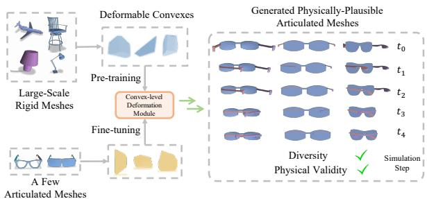
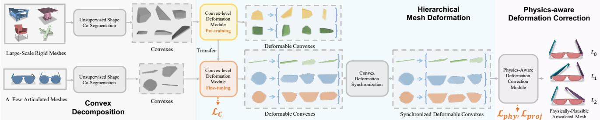
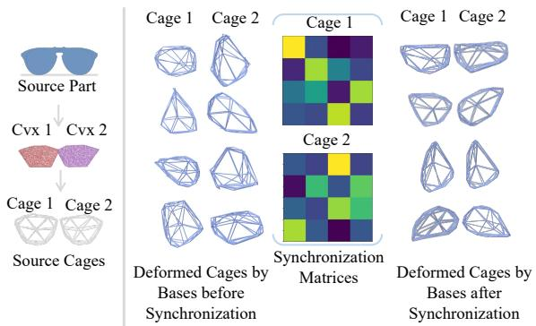
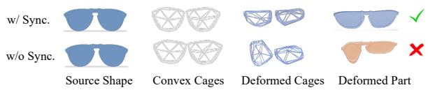
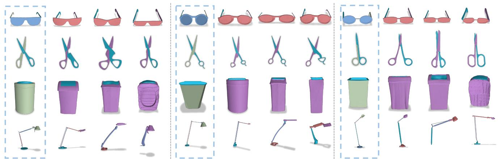
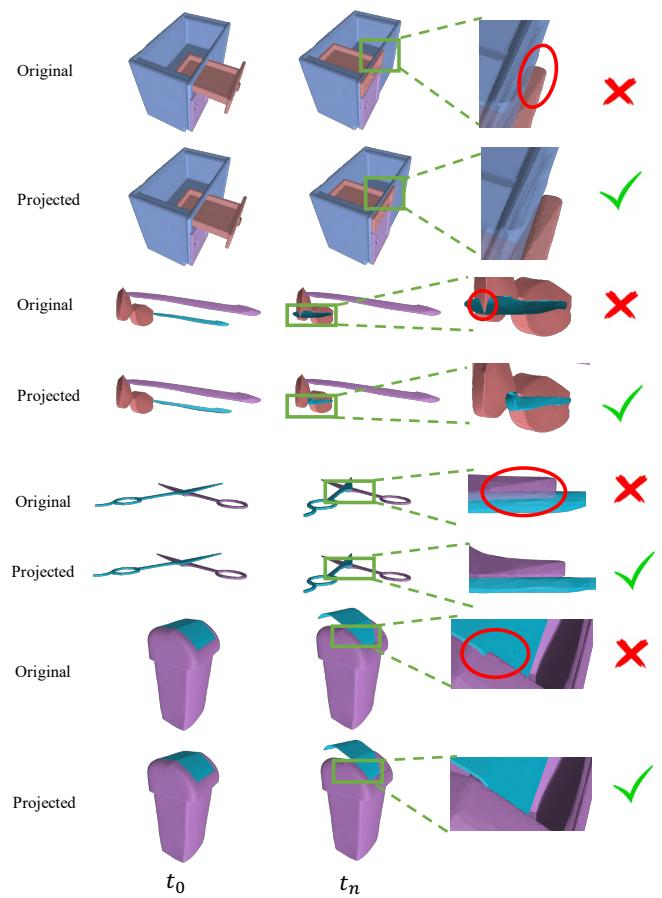
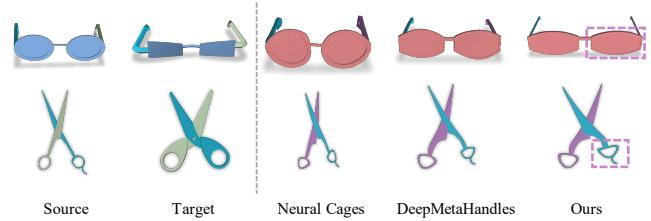
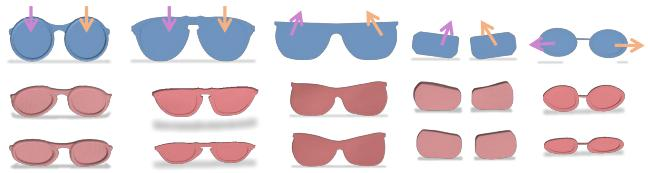

# Few-Shot Physically-Aware Articulated Mesh Generation via Hierarchical Deformation

Xueyi Liu1,5, Bin Wang2, He Wang3, Li Yi1,4,5

1Tsinghua University 2Beijing Institute for General Artificial Intelligence 3Peking University 4Shanghai Artificial Intelligence Laboratory 5Shanghai Qi Zhi Institute

## Abstract

We study the problem offew-shot physically-aware articulated mesh generation. By observing an articulated object dataset containing only a few examples, we wish to learn a model that can generate diverse meshes with high visualfidelity andphysical validity. Previous mesh generative models either have difficulties in depicting a diverse data space from only a few examples or fail to ensure physical validity of their samples. Regarding the above challenges, we propose two key innovations, including 1) a hierarchical mesh deformation-based generative model based upon the divide-and-conquer philosophy to alleviate thefew-shot challenge by borrowing transferrable deformation patterns from large scale rigid meshes and 2) a physics-aware deformation correction scheme to encourage physically plausible generations. We conduct extensive experiments on 6 articulated categories to demonstrate the superiority of our method in generating articulated meshes with better diversity, higher visual fidelity, and better physical validity over previous methods in the few-shot setting. Further, we validate solid contributions of our two innovations in the ablation study. Project page with code is available at meowuu7.github.io/few-arti-obj-gen.

## 1. Introduction

Generative models have aroused a wide spectrum of interests in recent years for their creativity and broad downstream application scenarios [29, 30, 34, 17, 8, 26]. Specific to 3D generation, a variety of techniques such as denoising diffusion [23, 42, 6, 39] have also been discussed for a while. Among them, mesh generation is indeed important since the mesh representation can support a wider range of downstream applications such as rendering and physical simulation compared to other representations such as point clouds. Existing works mainly focus on generating meshes for whole objects [8, 26, 6, 19, 30] considering without modeling object functionalities at all. Besides, they mainly rely on reconstructing meshes from other kinds of representations such as implicit fields [8, 6, 19] instead of generating meshes directly. In this work, we go one step further and consider mesh generation for articulated objects that can support physically realistic articulations. This not only helps understand the object distribution in real-world assets, but also allows an intelligent agent to learn segmenting [20, 22], tracking [36], reasoning [10] and manipulating [38] articulated objects through a simulation environment. We focus on the articulated mesh generative model that can generate object meshes with diverse geometry, high visual fidelity, and correct physics.

  
Figure 1. Overview. We present a hierarchical mesh deformationbased generative model to solve the challenging yet important few-shot physically-aware articulated mesh generation problem. It tackles the fewshot challenge by borrowing shared convex level deformation patterns from large-scale rigid meshes and incorporates a deformation correction scheme to further enhance the model’s ability to generate physically realistic meshes.

Training a generative model on publicly available articulated mesh datasets to depict a diverse physically-plausible data space not limited to training assets presents two main challenges to the methodology. First, existing articulated object datasets are usually very restricted in scale. For example, the PartNet-Mobility Dataset [37] contains an average of 51 meshes per category. This naturally requires a few-shot generative model to learn from a very limited number of meshes. Adapting previous approaches immediately without carefully considering the few-shot nature would lead to models suffering from poor generative ability. Second, we need to pursue physically plausible generation to ensure the generated meshes are not only visually appealing but also functionally sound to support correction articulation functions, i.e., attached parts without selfpenetrations in the full articulation range.

Despite recent advancements in mesh generation community such as a wide variety of models proposed in existing works [8, 41, 6, 33, 19], they are typically challenged by the following difficulties and always fail to solve our problem: 1) Lack of the ability to learn a wide data space not limited to training shapes in the few-shot setting. 2) Difficulty in modeling crucial object-level shape constraints imposed by the functionality of articulated objects. Failure to consider these requirements would result in physically unrealistic samples [8, 6, 26]. Modeling such physical constraints for articulated meshes is a non-trivial task, as it requires accounting for diverse penetration phenomena caused by different types of articulation motions. To our best knowledge, we are the first that presents a valid framework to address such two difficulties for articulated mesh generation.

Our work designs a hierarchical mesh deformation-based generative model that tackles the aforementioned challenges using two key innovations: (1) Hierarchical mesh deformation with transfer learning. We introduce an objectconvex shape hierarchy and learn the hierarchical articulated mesh generative model. The model is trained by first learning the deformation-based generative model at the leaf convex level and then synchronizing individual convexlevel deformation spaces at the root level. We identify that different categories tend to share convex-level deformation patterns and leverage this insight to learn and transfer rich deformation prior from large-scale rigid datasets to expand the model’s generative capacity. (2) Physics-aware deformation correction. To address self-penetrations of deformed articulated meshes during mesh articulation, we further introduce a deformation correction scheme. It is composed of an auxiliary loss penalizing self-penetrations during mesh articulation and a collision response-based shape optimization strategy. By integrating this scheme into the hierarchical mesh deformation model, we successfully guide the model to generate more physically realistic deformations, resulting in physically correct articulated meshes finally.

We conduct extensive experiments on 6 categories from the PartNet-Mobility dataset [37] for evaluation. As demonstrated by both the quantitative and qualitative results, we can consistently outperform all baseline methods regarding the fidelity, diversity and physical plausibility of generated meshes, e.g., an average of 10.4% higher coverage ratio, 43.7% lower minimum matching distance score, and 26.5% lower collision score. Ablation studies further validate the value of our design in deformation pattern transfer learning, the hierarchical mesh generation approach, and the effectiveness as well as the versatility of our physics-aware correction scheme.

Our key contributions are as follows: (1) We present the first solution, to our best knowledge, for the challenging yet important few-shot physically-aware articulated mesh generation problem with two effective and non-trivial technical innovations. (2) We propose a hierarchical mesh deformation-based generative model based upon the divideand-conquer philosophy. This design allows us to learn a diverse data space by borrowing shared deformation patterns from large-scale rigid object datasets. (3) We propose a physics-aware deformation correction scheme to encourage the hierarchical generative model to produce physically realistic deformations, resulting in improved physical validity of the generated samples. This scheme can also be effectively integrated into other deformation-based mesh generative models, thereby enhancing the physical validity of their samples as well.

## 2. Related Works

Mesh generative models. There have been vast and long efforts in devising 3D mesh generative models [26, 8, 41, 6, 21, 35]. Their techniques can be mainly categorized into three genres: 1) direct surface generation [26], 2) deformation-based mesh generation [21, 35], and 3) hybrid representation-based generation [8, 41]. Though methods of the first type exhibit obvious merits such as synthesizing high-quality n-gon meshes, they always suffer from limited generative ability and cannot scale for complex objects. In contrast, deformation-style mesh generation models deform source shapes for new samples which naturally spares the efforts for mesh structure generation, while restricted by poor flexibility. The third strategy separates the mesh surface structure generation problem from the content generation, which offers them with powerful generative ability. However, the quality of their samples is coupled with the power of their surface reconstruction techniques [27, 31]. In this work, we leverage mesh deformation as our generation technique for articulated mesh synthesis, taking advantages of its ability to produce high-quality samples. Instead of deforming whole objects or parts directly, we design a hierarchical deformation strategy to enhance the deformation flexibility and to enrich the data space by borrowing deformation patterns shared across categories from large scale rigid meshes.

Few-shot generation. Along with the flourishing image generative models emerged in recent years, the few-shot image generation has been widely explored as well [12, 9, 11, 13, 2]. It wishes to create more data given only a few examples from a novel category that is both diverse in content and semantically consistent with the target category. At the high level, their basic philosophy is to design proper approaches such that the model can benefit from large base datasets for generation, like local fusion [9], latent variables matching [11, 3]. adversarial delta matching [12]. In this work, we leverage transfer learning to adapt shape patterns from large-scale rigid datasets to target articulated categories. Devising methods in this way requires us to find correct intermediates on which shape patterns are crosscategory transferrable. Instead of directly using whole objects or articulated parts, we choose convexes as such intermediates. Transferring knowledge at this level presents further difficulties in fusing them together in a geometrically consistent way and in synthesizing physically realistic meshes while mainting visual diversity at the same time.

Physics-aware machine learning. Our work is also related to physics-aware machine learning [28, 10, 14, 24, 32, 25, 18], and mostly relevant to physically-aware generative models. To ensure physical validity of generated shapes, typical solutions choose either offline simulations for training data filtering [32] or online simulations leveraging the development of differentiable simulators [7, 15, 16] or by designing online simulation layers [24]. Generating physically-plausible articulated objects presents new challenges considering self-penetrations during mesh articulation that are more complex than stability issues caused by gravity for rigid objects. Our method integrates the physical supervision and a shape optimization strategy. The optimization transforms part shapes to resolve self-penetration issues. High-dimensional and complex shape deformations are involved in the process, different from linear fixing operations considered in [10].

## 3. Method

The problem we are targeting is the few-shot physicallyaware articulated mesh generation. Given a set of articulated meshes from the category of interest, we would like to learn a conditional generative model which could deform an articulated mesh from the same category into a wide variety of shapes. This conditional generation setup allows generating a large number of physically-plausible articulated meshes from a few examples while avoiding the need to generate the mesh structure. However, it leaves several challenges to address including how to accurately represent complex shape deformation spaces from a few examples and how to ensure that the generated meshes support physically-realistic articulations.

Regarding the first challenge, our idea is to learn the deformation space via borrowing knowledge from other object categories. This seemingly simple idea is not trivial to realize though since we need to figure out what knowledge is transferrable. We present a hierarchical mesh deformation strategy to allow deformation prior to transfer at a local convex segment level while still maintaining the deformation consistency at the global shape level. Regarding the second challenge, we introduce a physics-aware deformation correction scheme to avoid unwanted artifacts such as self-penetrations during mesh articulation.

In the following, we will provide a pipeline overview in Section 3.1. Then we will explain our hierarchical mesh deformation strategy and our physics-aware deformation correction scheme in Section 3.2 and Section 3.3 respectively.

## 3.1. Overview

Given a small set of articulated meshes A from a certain category of interest with the same number of parts and joints, sharing a known kinematic chain, our method wishes to learn a conditional generative model depicting a diverse and plausible articulated shape space. We adopt the divideand-conquer philosophy and develop a hierarchical deformation scheme with transfer learning to tackle the difficulty of few-shot generation. Instead of learning at the whole shape level, we structure each articulated shape into an object-convex hierarchy and solve the generation problem via two steps. We first learn a generative model depicting a diverse shape space at the lowest convex level by borrowing common shape patterns from large rigid mesh datasets, denoted as B. Convexes, with small cross-category distribution gap, serve as good intermediates for transferring common shape prior. After that, we devise a synchronization strategy that composes convex deformations consistently to form valid object shapes. Besides, a physics-aware correction scheme is developed to avoid physically-unnatural phenomena such as self-penetrations. Our overall pipeline is shown in Figure 2.

Specifically, we first decompose the conditional mesh a into approximately convex segments $\scriptstyle { { \mathcal { C } } _ { a } }$ , forming an objectconvex hierarchy. Then, on the leaf level, we learn to deform each convex $c \in \mathcal { C } _ { a }$ through a convex-level conditional generative model $g c ( \mathbf { z } _ { c } | c )$ where $\mathbf { z } _ { c }$ is the noise parameter corresponding to convex $c .$ Finally, on the root level, we synchronize the convex deformations by replacing the convex-dependent noise parameter $\mathbf { z } _ { c }$ with $S _ { c } \mathbf { z } ,$ where $S _ { c }$ is a linear transformation and z is a synchronized noise parameter shared among all convexes. This aligns the noise space of different convexes to form a coherent deformation for the whole mesh. The above hierarchical deformation strategy can be mathematically represented as $g ( \mathbf { z } | a ) = \{ g c ( S _ { c } \mathbf { z } | c ) | c \in \mathcal { C } _ { a } \}$

During the training time, we first leverage existing unsupervised shape segmentation tools BSP-Net [5] to decompose meshes in both A and B into approximately convex segments $\mathcal { C } _ { A }$ and $\mathcal { C } _ { B }$ . Since BSP-Net decomposes shapes consistently for each category, we can naturally identify corresponding convexes within $\mathcal { C } _ { A }$ or $\mathcal { C } _ { B }$ . We can then pretrain a convex-level conditional generative model $g _ { \mathcal { C } } ( \mathbf { z } _ { c } | c )$ on $\mathcal { C } _ { B }$ modeling how corresponding convexes could deform into each other among the large-scale rigid meshes. We then fine-tune the pre-trained model $g c ( \mathbf { z } _ { c } | c )$ on convexes in $\mathcal { C } _ { A }$ and at the same time estimate the noise synchronization transformation $S _ { c } .$ We further exploit an additional physics-aware deformation correction scheme to improve the physical validity of generated articulated shapes. It consists of 1) an auxiliary loss penalizing self-penetrations to provide physical supervision and 2) a collision responsebased shape optimization strategy to encourage the model to generate physically realistic meshes. The auxiliary loss is incorporated into the training pipeline. While the shape optimization scheme functions at both the training time and the test time.

  
Figure 2. Framework overview for our few-shot physically-aware articulated mesh generation. In this figure, yellow blocks represent modules with learnable weights optimized during pre-training. Orange blocks contain weights optimized during fine-tuning. Gray blocks contain no learnable weights. Convexes of the same color are of the same type. Our framework consists of a hierarchical mesh deformation scheme that learns and transfers diverse shared deformation patterns from large-scale rigid datasets at the convex level. We also propose a convex deformation synchronization strategy to combine individual convex-level deformation spaces into the object-level space. Furthermore, we introduce a physics-aware deformation correction strategy to address self-penetrations in synthesized articulated meshes.

## 3.2. Hierarchical Mesh Deformation

Given an input articulated mesh a and its corresponding approximately convex segments $\scriptstyle { { \mathcal { C } } _ { a } }$ , our hierarchical mesh deformation model $g ( \mathbf { z } | a ) \ = \ \{ g _ { \mathcal { C } } ( S _ { c } \mathbf { z } | c ) | c \ \in \ C _ { a } \}$ consists of a convex-level conditional generative model gC as well as a series of synchronization transformations $\{ S _ { c } \}$ We propose to learn the model at the lowest convex level $g _ { C }$ following a transfer learning paradigm so that convexlevel shape patterns can easily transfer across different categories. Given a reference mesh $^ { a , }$ the hierarchical deformation first synthesizes new convex shapes via $g _ { C }$ . A deformation synchronization strategy is developed to handle the resulting deformation inconsistency issue across different convexes to form a valid object shape.

Convex-level conditional generative model. We propose to leverage mesh deformation to characterize the convexlevel conditional generative model. For a convex mesh segment c containing $N _ { c }$ vertices, the conditional generative model $g c ( \mathbf { z } _ { c } | c )$ should be able to produce diverse and realistic vertex-level deformation offset $\mathbf { d } _ { c } \in \mathbb { R } ^ { N _ { c } \times 3 }$ when we sample different noise parameters $\mathbf { z } _ { c } .$

The convex deformation $\mathbf { d } _ { c }$ lies in a high-dimensional space which varies from convex to convex, prohibiting the knowledge transfer across different convexes. We therefore reparametrize $\mathbf { d } _ { c }$ using two tricks inspired by [40, 21]: 1) using cages to control per-vertex deformation; 2) using dictionaries to record the common deformation modes.

In particular, for each convex c, we use a coarse triangle mesh (a cage) t enclosing c to control the deformation of convex c [40]. The cage $t _ { c }$ usually contains much less vertices compared with the convex c so that its distribution is easier to be modeled. The deformation $\mathbf { d } _ { c }$ of the convex c can be easily computed as a linear transformation of the deformation $\mathbf { d } _ { t _ { c } }$ of cage $t _ { c } \colon { \bf d } _ { c } = \Phi _ { c } { \bf d } _ { t _ { c } }$ Here $\Phi _ { c }$ is an interpolation matrix based upon the generalized barycentric coordinates of convex c with respect to cage $t _ { c }$ . We deform a template mesh based upon the shape of each convex to form the cages which we defer the details to supp.

To further reduce the deformation parametrization, we represent the cage deformation $\mathbf { d } _ { t _ { c } }$ as a linear combination of $K$ deformation bases $B _ { c } = [ \mathbf { b } _ { c } ^ { \breve { 1 } } \mathbf { \sigma } . . . \mathbf { \sigma } \mathbf { b } _ { c } ^ { K } ]$ as ${ \bf d } _ { t _ { c } } = B _ { c } { \bf z } _ { c }$ where $\mathbf { z } _ { c }$ is a K-dimensional deformation coefficient. Here each deformation basis $\mathbf { b } _ { c }$ represents a common deformation pattern and all the bases span the deformation space of cage $t _ { c }$ and therefore convex $c .$ Representing deformation spaces via deformation bases can effectively reduce the dimension of shape space compared to other alternatively such as utilizing latent vectors.

A few-shot deformation learning paradigm. Given the above deformation reparametrizations, learning the convexlevel conditional generative model for each convex c boils down to learning the deformation bases $B _ { c }$ as well as the distribution of deformation coefficient $\mathbf { z } _ { c } .$ For deformation bases, we employ a neural network $\psi _ { \boldsymbol \theta } ( \cdot )$ to predict from convex shapes. It takes a given convex c as input and outputs its deformation bases, i.e., $B _ { c } = \psi _ { \theta } ( c )$ . We then optimize the deformation coefficient $\mathbf { z } _ { c } ^ { \hat { c } }$ for each convex $\hat { c }$ in correspondence to c from the current available dataset. The distribution of $\mathbf { z } _ { c }$ is then a mixture of Gaussian fit by the resulting deformation coefficients $\{ \mathbf { z } _ { c } ^ { \hat { c } } \}$ }. We further leverage a transfer learning approach that transfers deformation priors learned in large-scale rigid dataset to target datasets at the convex level based on the observation that the convexlevel deformations usually show similar patterns across categories, $e . g .$ , a slab gets thicker or a strip gets enlongated. Therefore we can learn a diverse deformation space from a few examples.

We pre-train $g c ( \mathbf { z } _ { c } | c )$ on the large-scale rigid mesh dataset B and fine-tune it on each target articulated dataset ${ \mathcal { A } } .$ In particular, at the pre-training time, given a set of rigid meshes B from large-scale online repositories as well as the corresponding convexes $\mathcal { C } _ { B }$ , we first identify pairs of convexes in correspondence $\{ ( c , \hat { c } ) | c , \hat { c } \in \mathcal { C } _ { B } \}$ from the same-category shapes, $e . g .$ , the noses of two different airplanes. These correspondences come as a result of some off-the-shelf unsupervised co-segmentation algorithms [5]. We then optimize $g c ( \mathbf { z } _ { c } | c )$ by alternatively optimizing the deformation coefficient set $\{ \mathbf { z } _ { c } ^ { \hat { c } } | c , \hat { c } \in \mathcal { C } _ { B } \}$ , and the neural network $\psi _ { \boldsymbol \theta } ( \cdot )$ . To optimize $\{ \mathbf { z } _ { c } ^ { \hat { c } } \}$ , we fix $\{ B _ { c } \}$ and optimize each $\mathbf { z } _ { c } ^ { \hat { c } }$ by minimizing the Chamfer Distance (CD), also denoted as $d _ { \mathrm { C D } } ( \cdot , \cdot )$ , between the deformed convex c and the target cˆ. Then we optimize $\{ B _ { c } \}$ by fixing deformation coefficients $\{ \mathbf { z } _ { c } ^ { \hat { c } } \}$ and minimizing average CD between deformed c and the target cˆ for each pair $( c , \hat { c } )$ , which leads to the convex deformation loss $\mathcal { L } _ { C }$ at the training time:

$$
\mathcal { L } _ { C } = \frac { 1 } { | \mathcal { C } _ { B } | } \sum _ { c , \hat { c } \in \mathcal { C } _ { B } } d _ { \mathrm { C D } } \mathopen { } \mathclose \bgroup \left( g _ { C } \mathopen { } \mathclose \bgroup \left( \mathbf { z } _ { c } \aftergroup \egroup | c , \mathbf { z } _ { c } = \mathbf { z } _ { c } ^ { \hat { c } } \aftergroup \egroup \right) , \hat { c } \aftergroup \egroup \right) .\tag{1}
$$

After the above alternative optimization, the distribution of $\mathbf { z } _ { c }$ for each convex c is modeled by a mixture of Gaussian distribution fit to the final coefficient set $\{ z _ { c } ^ { \hat { c } } | \hat { c } \in \mathcal { C } _ { B } \}$ . At the fine-tuning time, $g c ( \mathbf { z } | c )$ is further optimized via the same procedure by the convex correspondence set $\mathcal { C } _ { A }$ of the target dataset A.

  
Figure 3. Synchronization Process. The left part illustrates the decomposed convexes and source cages of the input eyeglass frame. The right part visualize synchronization matrices (a 4 × 4 matrix here for each cage), cages deformed by bases before synchronization (left two columns), and cages deformed by synchronized bases (right two columns).

Convex deformation synchronization. After learning the conditional generative model for each convex c, the next step is to compose all the deformation spaces for the whole mesh a. Since for each convex $c , g _ { \mathcal { C } } ( \mathbf { z } _ { c } | c )$ exploits a separate set of deformation bases $\boldsymbol { B } _ { c } ,$ the noise parameter $\mathbf { z } _ { c }$ varies its meaning from convex to convex. $\mathbf { A } \mathbf { s }$ a result, if we draw independent noise parameters for each convex, the outcoming deformations could easily contradict with each other, failing the whole mesh-level deformation. To tackle this issue, we synchronize different deformation bases $B _ { c }$ with linear transformations $S _ { c }$ so that a single noise parameter z can be shared across all convexes.

Formally speaking, given a set of articulated object meshes A from a certain category and an articulated mesh $a \in A ,$ , assuming the mesh is segmented into M convexes $\lbrace c _ { m } \rbrace _ { m = 1 } ^ { M }$ and each convex is equipped with a deformation model $g _ { C } ( \mathbf { z } _ { c _ { m } } | c _ { m } )$ , our goal is to replace $\mathbf { z } _ { c _ { m } }$ with $S _ { c _ { m } }$ z so that sampling the shared noise parameter z results in a globally consistent mesh deformation. To compute the synchronization transformation $S _ { c _ { m } }$ , we consider the deformation from a to other articulated meshes $a ^ { i } \in { \mathcal { A } }$ . In particular, for each $a ^ { i } ,$ , we optimize for a set of deformation coefficients $\{ \mathbf { y } _ { m } ^ { i } \}$ so that each convex $c _ { m }$ in mesh a could deform into the corresponding convex $c _ { m } ^ { i }$ in mesh $a ^ { i }$ following the deformation model $g c ( \mathbf { z } _ { c _ { m } } | c _ { m } , \mathbf { z } _ { c _ { m } } = \mathbf { y } _ { m } ^ { i } )$ . We can then estimate the synchronization transformations $\{ S _ { c _ { m } } \}$ by solving the following optimization problem:

$$
\underset { \{ S _ { c _ { m } } \} , \{ \mathbf { z } ^ { i } \} } { \operatorname* { m i n i m i z e } } \sum _ { i = 1 } ^ { | \mathcal { A } | } \sum _ { m = 1 } ^ { M } \| B _ { c _ { m } } S _ { c _ { m } } \mathbf { z } ^ { i } - B _ { c _ { m } } \mathbf { y } _ { m } ^ { i } \| _ { 2 } ,\tag{2}
$$

where $B _ { c _ { m } }$ is the deformation bases of convex $c _ { m }$ and $\mathbf { z } ^ { i }$ is a global deformation coefficient from mesh a to $a ^ { i }$ shared across all convexes. We solve the above optimization problem via alternatively optimizing the synchronization transformations $\{ S _ { c _ { m } } \}$ and the global deformation coefficients $\{ \mathbf { z } ^ { i } \}$

• Fix $\{ S _ { c _ { m } } \}$ , optimize each global deformation coefficient zi from a to $a ^ { i }$ via Algorithm 2. It takes the convex deformation bases $\{ B _ { c _ { m } } \}$ , current synchronization transformations $\{ S _ { c _ { m } } \}$ , convex deformation coefficients $\{ \mathbf { y } _ { m } ^ { i } \}$ as input, and outputs the optimized $\mathbf { z } ^ { i }$ • Fix $\{ \mathbf { z } ^ { i } \}$ , optimize each synchronization transformation $S _ { c _ { m } }$ for each convex $c _ { m }$ via Algorithm 1. It takes the convex deformation bases $\{ B _ { c _ { m } } \}$ , current global deformation coefficients $\{ \mathbf { z } ^ { i } \}$ , convex deformation coefficients $\{ \mathbf { y } _ { m } ^ { i } \}$ as input, and outputs the optimized $S _ { c _ { m } }$

  
Figure 4. Synchronization’s Effectiveness. The synchronized deformation bases can consistently transform each convex for a valid part shape (upper row), while those before the synchronization fail (bottom row).

Algorithm 1 Synchronization transformation matrices   
optimization.   
Input: Deformation bases for each convex $\{ B _ { c _ { m } } \}$ . Global deformation   
coefficients $\{ \mathbf { z } ^ { i } \}$ from a to other articulated meshes $\{ a ^ { i } \}$ . Deforma  
tion coefficients $\{ \mathbf { y } _ { m } ^ { i } \}$ from each convex $c _ { m }$ to the corresponding   
convex of the articulated mesh $a ^ { i } .$   
Output: Synchronization transformation matrix $S _ { c _ { m } }$ of the convex $c _ { m }$   
1: $\mathbf { \dot { Z } }  \dot { \operatorname { S t a c k } } ( \{ \mathbf { z } ^ { i } \} ) .$   
2: $\mathbf Y _ { m } \gets \mathrm { S t a c k } ( \{ \tilde { \mathbf y } _ { m } ^ { i } \} )$   
3: $[ \mathbf { U } , \pmb { \Sigma } , \mathbf { V } ^ { T } ] \longleftarrow \mathbf { S } \mathbf { V } \mathbf { D } ( \mathbf { Z } )$   
4: $[ \mathbf { U } _ { m } , \pmb { \Sigma } _ { m } , \mathbf { \dot { V } } _ { m } ^ { T } ] \gets \dot { \mathbf { S } } \mathbf { V } \mathbf { D } ( \mathbf { Y } _ { m } )$   
5: $\mathbf { \ddot { } } S _ { c _ { m } } \gets \mathbf { U } _ { m } \pmb { \dot { \Sigma } } _ { m } \mathbf { V } _ { m } ^ { T } \mathbf { V } \pmb { \Sigma } ^ { + } \mathbf { U } ^ { \hat { T } }$   
6: return $S _ { c _ { m } }$

Algorithm 2 Global deformation coefficients optimiza  
tion. $^ { 6 6 } \mathrm { l s q } ^ { \mathrm { , 9 } }$ denotes the least square solver.   
Input: Deformation bases for each convex $\{ B _ { c _ { m } } \} .$ Synchronization   
transformations $\{ S _ { c _ { m } } \}$ . Deformation coefficients $\mathbf { y } _ { m } ^ { i }$ from each con  
vex $c _ { m }$ to the corresponding convex of the articulated mesh $a ^ { i }$   
Output: Global deformation coefficients $\mathbf { z } ^ { i }$ from a to $a ^ { i } .$   
1: $S _ { \mathbf { z } ^ { i } }  \emptyset$   
2: for $m = 1$ to M do   
3: $\hat { \mathbf { z } } _ { m } ^ { i } \gets \mathrm { l s q } ( S _ { c _ { m } } , \mathbf { z } _ { m } ^ { i } )$   
4: ${ \ddot { S _ { \mathbf { z } ^ { i } } } } \gets S _ { \mathbf { z } ^ { i } } \cup \{ { \hat { \mathbf { z } } } _ { m } ^ { i } \}$   
5: $\mathbf { z } ^ { i } = \mathrm { A v e r a g e } ( S _ { \mathbf { z } ^ { i } } )$   
6: return zi

As an intuitive illustration of the synchronization process, we select the example of synchronizing the eyeglass frame’s convex deformations (with 2 convexes and 4 deformation bases for each convex) and visualize the process (detailed to the cage level) in Figure 3. The synchronized deformation bases can transform two convexes more consistently and symmetrically than those before synchronization (an example on deformed part shapes is shown in Figure 4).

After deformation synchronization, the distribution of the shared noise parameter z can be simply set as a mixture of Gaussian fit to the optimized global deformation coefficients $\{ \mathbf { z } ^ { i } \}$

## 3.3. Physics-Aware Deformation Correction

Based upon the above design, our hierarchical deformation model can then synthesize a deformed mesh a via the noise parameter z by taking a source articulated mesh as input. However, we may frequently observe physically unnatural self-penetrations when articulating a. To encourage the model to produce physically valid articulated meshes, we further propose a physics-aware deformation correction scheme, which serves two purposes: 1) to optimize the weights of the generative model to produce deformations that are more physically realistic and 2) to optimize the shape a to improve its physical validity. To accomplish this, we draw inspiration from previous works on stable rigid object generation [24, 25] and develop an online articulation simulation process that places a into K different articulation states sequentially, denoted as $\mathrm { S i m } ( a ) = \{ a _ { k } \} _ { k = 1 } ^ { K }$ . The articulation state sequence is designed by hand particularly for each category. We then utilize the physical supervision and a shape optimization strategy to guide the network to generate physically realistic articulated meshes. We will elaborate them in the following text.

Physical supervision. To provide physical supervision for articulated mesh generative models requires us to design stability signals to measure physically unstable phenomena, for which we mainly consider self-penetrations during mesh articulation. We therefore devise a metric named average penetration depth (APD) measuring the magnitude of each vertex penetrating through other parts during the articulation simulation process. It is also referred as $\mathcal { L } _ { p h y }$ when we treat it as a loss. Formally, $\begin{array} { r } { \mathcal { L } _ { p h y } = \frac { 1 } { K } \sum _ { k = 1 } ^ { K } } \end{array}$ PeneD(ak), where $\mathrm { P e n e D } ( a _ { k } )$ measures self-penetrations in a single articulation state. We defer details of $\mathcal { L } _ { p h y }$ to the supp.

One way to provide physical guidance for the network is to utilize the physical stability signal $\mathcal { L } _ { p h y }$ as an auxiliary loss to supervise the network training. However, physically unnatural phenomena of articulated meshes during mesh articulation are more diverse and complex than that of rigid objects caused by diverse part geometric appearance and wide articulation variations. Directly exploring physical supervision to guide the network optimization is not sufficient to regularize the network to produce physically realistic deformations. Therefore we further develop a collision response-based shape optimization strategy to improve the physical realism of the generated mesh a. Then we first optimize a for several times to reduce self-penetrations and then use it to calculate $\mathcal { L } _ { p h y }$ for network optimization.

Collision response-based shape optimization. To realize the vision of resolving self-penetrations via optimizing shapes, we draw inspirations from collision response strategies and devise a heuristic penetration resolving strategy that projects penetrated vertices onto the surface of the mesh. To guide such projection, we devise an algorithm that calculates ProjD(a) whose gradient over each penetrated vertex in a informs how to project it to resolve penetrations. Then averaging the $\mathrm { P r o j D } ( a _ { k } )$ over each articulation state $\{ a _ { k } \}$ yields the projection loss, $i . e . , \mathcal { L } _ { p r o j } =$ $\textstyle { \frac { 1 } { K } } \sum _ { k = 1 } ^ { K }$ Proj $\mathrm { D } ( \sin _ { k } ( a ) )$ ). By iteratively using $\mathcal { L } _ { p r o j }$ to update the global deformation coefficient z of the mesh, we can optimize the shape a to mitigate self-penetrations. At the training time, $\mathcal { L } _ { p r o j }$ is used to optimize deformation coefficients z for several iterations at first (i.e., 5 iterations), followed by leveraging $\mathcal { L } _ { p h y }$ calculated on the optimized shape to update network weights. Test-Time Adaptation (TTA). During the test time, only $\mathcal { L } _ { p r o j }$ is iteratively applied to refine the result $( i . e . ,$ , for 10 iterations).

  
Figure 5. Qualitative evaluation on few-shot articulated mesh generation. For every four shapes, the leftmost one (highlighted by blue rectangles) is the reference shape from the training dataset, while the remaining three are conditionally generated samples. Object categories from top to down are Eyeglasses, Scissors, TrashCan, and Lamp respectively.

  
Figure 6. Visual evaluation on the effectiveness of the physics-aware projection strategy. For every two lines, the upper line draws shapes without such correction while the second line draws corrected shapes.

## 4. Experiments

We evaluate our model on 6 articulated object categories to test its few-shot generation ability for articulated objects.

Datasets. We evaluate our method on 6 categories selected from PartNet-Mobility [37] dataset following previous standard [20], namely Storage Furniture, Eyeglasses, Scissors, Oven, Lamp, and TrashCan. We select 9947 instances from ShapeNet [4] dataset, covering four categories: Table, Chair, Lamp, and Airplane for convex-level deformation pre-training. For each test category, we split it into a few-shot training set with 5 instances and a test set containing the remaining instances. For more details, please refer to the supplementary material.

Figure 7. Visual comparison on model’s target-driven deformation ability.  
  
Figure 8. Visual evaluation on synchronized convex-level deformation bases. The first line draws the template shape with deformation directions of synchronized deformation bases, while the following two lines are deformed shapes by their corresponding bases. Arrows are drawn to highlight the deformation direction.

Baselines. We compare our method to PolyGen [26], an auto-regressive style mesh generative model and Deep-MetaHandles [21], a deformation-based mesh generative model. To further adapt them for articulated object generation, we design a part-by-part generation approach for each of them and we defer details to the supp.

Metrics. We employ two kinds of metrics for evaluation: 1) metrics for mesh generative models following previsou literature [21, 23, 1], that is the minimum matching distance (MMD), coverage (COV), 1-NN classifier accuracy (1-NNA), and Jenson-Shannon divergence (JSD) [39]; and 2) average penetration depth (APD) for physical validity evaluation. The MMD score evaluates the fidelity of the generated samples and COV detects mode collapse and measures the diversity of generated samples. The 1-NNA score is computed by testing the generated samples and the reference instances by a 1-NN classifier. We introduce it following [23]. The classifier is not a network but classifies shapes into “reference” or “training” class based on the Nearest Neighbour. The JSD score computes the similarity between generated samples and reference samples. The APD score calculates the per-vertex average penetration depth averaged over all articulation simulation steps. We defer its details to the supp.

Experimental settings. The number of projections are set to 5 and 10 at the training time and the test time respectively. The number of decomposed convexes may vary across categories and is detailed in the supp.

Quantitative experimental evaluation: Few-shot articulated mesh generation. We summarize the quantitative evaluation results and comparisons to baseline methods on each articulated object category in Table 1. We can make the following observations: 1) We can achieve better average performance on every metric than the baseline models. It demonstrates the power of our model to generate samples with better diversity, higher visual fidelity, and better physical validity than previous models from a small number of examples. 2) On relatively rich categories (containing more than 30 instances) such as Scissors and Eyeglasses, our model can always outperform baseline methods by a large margin. It indicates that our model can cover a wider distribution space than baseline methods by only training on a few examples. 3) Our method can produce shapes with higher visual fidelity and better physical validity but not as a trade for diversity. By contrast, PolyGen generate samples that are more physically correct but exhibits very limited generative ability, i.e., poor COV and MMD scores.

Qualitative evaluation: Free deformation. In the free deformation setting, our model generates articulated meshes by deforming an input reference shape. It draw samples from the optimized object-level deformation coefficient distribution to deform input shapes. We draw deformed shapes from four representative categories, including Eyeglasses, Scissors, TrashCan, and Lamp in Figure 5. It demonstrates the ability of our model to create diverse variations by deforming input reference shapes. Compared with previous mesh deformation literature where the model always struggles to depict large geometry variations in the learned deformation space, our model mitigates this issue and is able to encode such deformations as observed in deformations of TrachCan bodies (line 3 of Figure 5). It mainly credits to our deformation coefficient distribution parameterization strategy, which is fit by discrete deformation coefficients, other than the uniform range adopted in [21].

Qualitative results: Target-driven deformation. We also conduct the target-driven experiments to demonstrate the superiority of our hierarchical deformation strategy over previous deformation literature, i.e., DeepMetaHandles [21], and Neural Cages [40]. As shown in Figure 7, our model can deform shapes to be more similar to their corresponding target shapes. It demonstrates the enhanced flexibility of our deformation strategy.

Convex deformation synchronization. We visualize the effectiveness of our convex deformation synchronization design by showing how synchronized deformation bases change shapes to produce plausible global mesh-level deformations in Figure 8. Besides, though not imposed directly, we do observe cross-instance similar deformation patterns, as also observed in [21].

Physics-aware projection. We compare objects synthesized by the network directly without and with physicsaware shape optimization in Figure 6. Our shape optimization design can improve the physical validity of sampled shapes by resolving penetrations caused by either part translation (example 1 in Figure 6) or revolution (example 2,3,4), in either the body part (example 1,2) or around the joint (example 3,4).

## 5. Ablation Study

Transfer learning and fine-tuning for the convex-level deformation module. In the few-shot generation design, the transfer learning technique plays an important role in enriching deformation space of the target category. Meanwhile, the fine-tuning process benefits the quality and diversity by learning category-specific deformation patterns. Our further analysis demonstrates that 1) The transfer learning’s power can be boosted by increasing the amount of source data and is related to the affinity between source and target categories; 2) The fine-tuning process is crucial for us to maintain high quality while achieving high diversity. We create three ablated models by ablating the transferring learning (“Ours w/o Transfer”), using half amount of the original data for transferring (“Ours w/ Transfer (Half Data)”), and ablating the fine-tuning process (“Ours w/o Fine-tuning”) and test their performance. Observations in Table 2 can validate the importance of the transfer learning and the fine-tuning process.

Hierarchical mesh deformation. We adopt the divide-andconquer philosophy and design a hierarchical mesh deformation strategy to learn a diverse mesh deformation space. To demonstrate its superiority over simple part-level deformation and composition, we ablate such design and treat parts as the leaf deformation units (denoted as “Ours w/o Hier.”). As shown in Table 2, this way we observe immediate dropping of the performance on all metrics measuring the generative ability. This further evidence the value of our fine-grained decomposition and the hierarchical deformation space learning.

Table 1. Quantitative evaluation. Comparison between our method and baseline models on the few-shot articulated mesh generation task. MMD is multiplied by 103 and APD is multiplied by 102. Bold numbers for best values. “Avg.” means “Average Performance”.
<table><tr><td rowspan=1 colspan=3></td><td rowspan=1 colspan=1>Method</td><td rowspan=1 colspan=1>StorageFurniture</td><td rowspan=1 colspan=1>Scissors</td><td rowspan=1 colspan=1>Eyeglasses</td><td rowspan=1 colspan=1>Oven</td><td rowspan=1 colspan=1>Lamp</td><td rowspan=1 colspan=1>TrashCan</td><td rowspan=1 colspan=1> $\operatorname { A v g } .$ </td></tr><tr><td rowspan=3 colspan=3>MMD (↓)</td><td rowspan=1 colspan=1>PolyGen [26]</td><td rowspan=1 colspan=1>4.447</td><td rowspan=1 colspan=1>3.020</td><td rowspan=1 colspan=1>8.426</td><td rowspan=1 colspan=1>7.477</td><td rowspan=1 colspan=1>12.478</td><td rowspan=1 colspan=1>9.817</td><td rowspan=1 colspan=1>7.611</td></tr><tr><td rowspan=1 colspan=1>DeepMetaHandles [21]</td><td rowspan=1 colspan=1>1.031</td><td rowspan=1 colspan=1>1.854</td><td rowspan=1 colspan=1>6.414</td><td rowspan=1 colspan=1>7.730</td><td rowspan=1 colspan=1>8.560</td><td rowspan=1 colspan=1>9.213</td><td rowspan=1 colspan=1>5.800</td></tr><tr><td rowspan=1 colspan=1>Ours</td><td rowspan=1 colspan=1>1.058</td><td rowspan=1 colspan=1>1.495</td><td rowspan=1 colspan=1>6.062</td><td rowspan=1 colspan=1>7.009</td><td rowspan=1 colspan=1>7.133</td><td rowspan=1 colspan=1>8.430</td><td rowspan=1 colspan=1>5.198</td></tr><tr><td rowspan=3 colspan=3>COV (%, ↑)</td><td rowspan=1 colspan=1>PolyGen [26]</td><td rowspan=1 colspan=1>19.23</td><td rowspan=1 colspan=1>9.76</td><td rowspan=1 colspan=1>8.33</td><td rowspan=1 colspan=1>60.00</td><td rowspan=1 colspan=1>37.50</td><td rowspan=1 colspan=1>14.29</td><td rowspan=1 colspan=1>24.85</td></tr><tr><td rowspan=1 colspan=1>DeepMetaHandles [21]</td><td rowspan=1 colspan=1>43.93</td><td rowspan=1 colspan=1>24.63</td><td rowspan=1 colspan=1>15.00</td><td rowspan=1 colspan=1>60.00</td><td rowspan=1 colspan=1>50.00</td><td rowspan=1 colspan=1>17.14</td><td rowspan=1 colspan=1>35.12</td></tr><tr><td rowspan=1 colspan=1>Ours</td><td rowspan=1 colspan=1>75.33</td><td rowspan=1 colspan=1>57.89</td><td rowspan=1 colspan=1>29.82</td><td rowspan=1 colspan=1>60.00</td><td rowspan=1 colspan=1>62.50</td><td rowspan=1 colspan=1>17.14</td><td rowspan=1 colspan=1>50.45</td></tr><tr><td rowspan=2 colspan=3>1-NNA (%, ↓)</td><td rowspan=1 colspan=1>PolyGen [26]</td><td rowspan=1 colspan=1>99.46</td><td rowspan=1 colspan=1>98.28</td><td rowspan=1 colspan=1>98.71</td><td rowspan=1 colspan=1>98.04</td><td rowspan=1 colspan=1>99.22</td><td rowspan=1 colspan=1>92.68</td><td rowspan=1 colspan=1>97.73</td></tr><tr><td rowspan=1 colspan=2>6, ↓)</td><td rowspan=1 colspan=1>DeepMetaHandles [21]</td><td rowspan=1 colspan=1>97.72</td><td rowspan=1 colspan=1>98.07</td><td rowspan=1 colspan=1>98.33</td><td rowspan=1 colspan=1>98.50</td><td rowspan=1 colspan=1>94.65</td><td rowspan=1 colspan=1>86.05</td><td rowspan=1 colspan=1>95.55</td></tr><tr><td rowspan=1 colspan=2></td><td rowspan=1 colspan=1></td><td rowspan=1 colspan=1>Ours</td><td rowspan=1 colspan=1>97.76</td><td rowspan=1 colspan=1>97.02</td><td rowspan=1 colspan=1>98.26</td><td rowspan=1 colspan=1>96.59</td><td rowspan=1 colspan=1>92.44</td><td rowspan=1 colspan=1>72.09</td><td rowspan=1 colspan=1>92.36</td></tr><tr><td rowspan=3 colspan=3>JSD (↓)</td><td rowspan=1 colspan=1></td><td rowspan=1 colspan=2>PolyGen [26]</td><td rowspan=1 colspan=1>0.0791</td><td rowspan=1 colspan=1>0.2317</td><td rowspan=1 colspan=1>0.1350</td><td rowspan=1 colspan=1>0.2044</td><td rowspan=1 colspan=1>0.2761</td></tr><tr><td rowspan=1 colspan=1>DeepMetaHandles [21]</td><td rowspan=1 colspan=1>0.0697</td><td rowspan=1 colspan=1>0.2277</td><td rowspan=1 colspan=1>0.0960</td><td rowspan=1 colspan=1>0.1768</td><td rowspan=1 colspan=1>0.2172</td><td rowspan=1 colspan=1>0.1881</td><td rowspan=1 colspan=1>0.1626</td></tr><tr><td rowspan=1 colspan=1>Ours</td><td rowspan=1 colspan=1>0.0290</td><td rowspan=1 colspan=1>0.1274</td><td rowspan=1 colspan=1>0.0681</td><td rowspan=1 colspan=1>0.1597</td><td rowspan=1 colspan=1>0.1874</td><td rowspan=1 colspan=1>0.0994</td><td rowspan=1 colspan=1>0.1118</td></tr><tr><td rowspan=2 colspan=3>APD (↓)</td><td rowspan=1 colspan=1>PolyGen [26]</td><td rowspan=1 colspan=1>0.1305</td><td rowspan=1 colspan=1>0.2592</td><td rowspan=1 colspan=1>0.0479</td><td rowspan=1 colspan=1>0.2548</td><td rowspan=1 colspan=1>5.323</td><td rowspan=1 colspan=1>0.0256</td><td rowspan=1 colspan=1>1.0068</td></tr><tr><td rowspan=1 colspan=1>DeepMetaHandles [21]</td><td rowspan=1 colspan=1>0.2990</td><td rowspan=1 colspan=1>1.6670</td><td rowspan=1 colspan=1>0.3682</td><td rowspan=1 colspan=1>0.4408</td><td rowspan=1 colspan=1>6.3020</td><td rowspan=1 colspan=1>1.6961</td><td rowspan=1 colspan=1>1.7955</td></tr><tr><td rowspan=1 colspan=3></td><td rowspan=1 colspan=1>Ours</td><td rowspan=1 colspan=1>0.1700</td><td rowspan=1 colspan=1>1.3520</td><td rowspan=1 colspan=1>0.1707</td><td rowspan=1 colspan=1>0.1602</td><td rowspan=1 colspan=1>5.993</td><td rowspan=1 colspan=1>0.0693</td><td rowspan=1 colspan=1>1.3192</td></tr></table>

Table 2. Ablation study w.r.t. convex-level deformation transfer learning, hierarchical mesh generation, and physics-aware deformation correction. For metrics of each ablated version, we report their average value over all categories. MMD is multiplied by $1 0 ^ { 3 }$ and APD is multiplied by $1 0 ^ { 2 }$ . Bold numbers for best values. Italics numbers for the second-best one.
<table><tr><td rowspan=1 colspan=1>Ablation Type</td><td rowspan=1 colspan=1>Method</td><td rowspan=1 colspan=1>MMD (↓)</td><td rowspan=1 colspan=1>COV (%, ↑)</td><td rowspan=1 colspan=1>1-NNA (%, ↓)</td><td rowspan=1 colspan=1>JSD (↓)</td><td rowspan=1 colspan=1>APD (↓)</td></tr><tr><td rowspan=1 colspan=1>Hierarchical deformation</td><td rowspan=1 colspan=1>Ours w/o Hier.</td><td rowspan=1 colspan=1>7.170</td><td rowspan=1 colspan=1>36.41</td><td rowspan=1 colspan=1>95.43</td><td rowspan=1 colspan=1>0.1492</td><td rowspan=1 colspan=1>1.4964</td></tr><tr><td rowspan=3 colspan=1>Transfer learning &amp;Fine-tuning</td><td rowspan=1 colspan=1>Ours w/o Transfer</td><td rowspan=1 colspan=1>5.424</td><td rowspan=1 colspan=1>46.64</td><td rowspan=1 colspan=1>93.01</td><td rowspan=1 colspan=1>0.1159</td><td rowspan=1 colspan=1>1.3822</td></tr><tr><td rowspan=1 colspan=1>Ours w/ Transfer (Half Data)</td><td rowspan=1 colspan=1>5.201</td><td rowspan=1 colspan=1>49.43</td><td rowspan=1 colspan=1>92.81</td><td rowspan=1 colspan=1>0.1130</td><td rowspan=1 colspan=1>1.3365</td></tr><tr><td rowspan=1 colspan=1>Ours w/o Fine-tuning</td><td rowspan=1 colspan=1>6.538</td><td rowspan=1 colspan=1>43.20</td><td rowspan=1 colspan=1>94.70</td><td rowspan=1 colspan=1>0.1437</td><td rowspan=1 colspan=1>1.4530</td></tr><tr><td rowspan=3 colspan=1>Physics-awaredeformation correction</td><td rowspan=1 colspan=1>DeepMetaHandles w/ Phy.</td><td rowspan=1 colspan=1>6.980</td><td rowspan=1 colspan=1>37.20</td><td rowspan=1 colspan=1>95.69</td><td rowspan=1 colspan=1>0.1587</td><td rowspan=1 colspan=1>1.5705</td></tr><tr><td rowspan=1 colspan=1>Ours w/o Phy.</td><td rowspan=1 colspan=1>5.211</td><td rowspan=1 colspan=1>50.83</td><td rowspan=1 colspan=1>92.57</td><td rowspan=1 colspan=1>0.1060</td><td rowspan=1 colspan=1>1.8079</td></tr><tr><td rowspan=1 colspan=1>Ours w/o TTA</td><td rowspan=1 colspan=1>5.214</td><td rowspan=1 colspan=1>50.71</td><td rowspan=1 colspan=1>92.31</td><td rowspan=1 colspan=1>0.0992</td><td rowspan=1 colspan=1>1.6443</td></tr><tr><td rowspan=1 colspan=1>N/A</td><td rowspan=1 colspan=1>Ours</td><td rowspan=1 colspan=1>5.198</td><td rowspan=1 colspan=1>50.45</td><td rowspan=1 colspan=1>92.36</td><td rowspan=1 colspan=1>0.1118</td><td rowspan=1 colspan=1>1.3192</td></tr></table>

Physics-aware deformation correction. We design $\mathcal { L } _ { p h y }$ and $\mathcal { L } _ { p r o j }$ to provide physical supervision and perform collision response-based shape optimization respectively. This way we are able to improve the physical validity of shapes deformed by our framework. To further validate them as solid contributions and versatile strategies not only work for our method, we create the following variants and test their performance: 1) “Ours w/o Phy.” by ablating both the shape optimization and the physical supervision, 2) “Ours w/o TTA” by only ablating the shape optimization strategy at the test time, and 3) “DeepMeta-Handles w/ Phy” by integrating such two designs into the baseline DeepMetaHandles’s framework. From Table 2, we can make the following observations: 1) Our physicsaware correction strategy is a versatile design that can be easily integrated into another deformation-based mesh generative model, improving its performance effectively; 2)

Only training-time physics-aware corrections can improve physical-related performance by guiding the convex-level deformation module stably and effectively; 3) Further imposing test time optimizations is important for us to arrive at high-quality samples finally.

## 6. Conclusion and Limitations

We tackle the few-shot articulated mesh generation problem with 1) a hierarchical deformation model with transfer learning; and 2) a deformation correction scheme.

Limitations. Currently, our work is limited to a categorylevel setting with the articulation chain and the range of articulation states assumed known. Developing a generation method without such assumption would increase its practical value and is an interesting future research direction. Besides, the deformation correction scheme relies on handcrafted chain of articulation states to detect self-penetrations and optimize shapes based on that. A natural alternative can be detecting articulation states from real-world images. Moreover, the quality of our generated results are restricted by that of the training data. A smart self-correction strategy, beyond mitigating self-penetrations only, may be designed to improve the validity.

## References

[1] Panos Achlioptas, Olga Diamanti, Ioannis Mitliagkas, and Leonidas Guibas. Learning representations and generative models for 3d point clouds. In International conference on machine learning, pages 40–49. PMLR, 2018. 7

[2] Antreas Antoniou, Amos Storkey, and Harrison Edwards. Data augmentation generative adversarial networks. arXiv preprint arXiv:1711.04340, 2017. 2

[3] Sergey Bartunov and Dmitry Vetrov. Few-shot generative modelling with generative matching networks. In International Conference on Artificial Intelligence and Statistics, pages 670–678. PMLR, 2018. 3

[4] Angel X Chang, Thomas Funkhouser, Leonidas Guibas, Pat Hanrahan, Qixing Huang, Zimo Li, Silvio Savarese, Manolis Savva, Shuran Song, Hao Su, et al. Shapenet: An information-rich 3d model repository. arXiv preprint arXiv:1512.03012, 2015. 7

[5] Zhiqin Chen, Andrea Tagliasacchi, and Hao Zhang. Bsp-net: Generating compact meshes via binary space partitioning. In Proceedings of the IEEE/CVF Conference on Computer Vision and Pattern Recognition, pages 45–54, 2020. 3, 5

[6] Gene Chou, Yuval Bahat, and Felix Heide. Diffusionsdf: Conditional generative modeling of signed distance functions. arXiv preprint arXiv:2211.13757, 2022. 1, 2

[7] Filipe de Avila Belbute-Peres, Kevin Smith, Kelsey Allen, Josh Tenenbaum, and J Zico Kolter. End-to-end differentiable physics for learning and control. Advances in neural information processing systems, 31, 2018. 3

[8] Jun Gao, Tianchang Shen, Zian Wang, Wenzheng Chen, Kangxue Yin, Daiqing Li, Or Litany, Zan Gojcic, and Sanja Fidler. Get3d: A generative model of high quality 3d textured shapes learned from images. arXiv preprint arXiv:2209.11163, 2022. 1, 2

[9] Zheng Gu, Wenbin Li, Jing Huo, Lei Wang, and Yang Gao. Lofgan: Fusing local representations for few-shot image generation. In Proceedings of the IEEE/CVF International Conference on Computer Vision, pages 8463–8471, 2021. 2

[10] Yining Hong, Kaichun Mo, Li Yi, Leonidas J Guibas, Antonio Torralba, Joshua B Tenenbaum, and Chuang Gan. Fixing malfunctional objects with learned physical simulation and functional prediction. In Proceedings ofthe IEEE/CVF Conference on Computer Vision and Pattern Recognition, pages 1413–1423, 2022. 1, 3

[11] Yan Hong, Li Niu, Jianfu Zhang, and Liqing Zhang. Matchinggan: Matching-based few-shot image generation. In 2020 IEEE International Conference on Multimedia and Expo (ICME), pages 1–6. IEEE, 2020. 2, 3

[12] Yan Hong, Li Niu, Jianfu Zhang, and Liqing Zhang. Deltagan: Towards diverse few-shot image generation with sample-specific delta. In European Conference on Computer Vision, pages 259–276. Springer, 2022. 2, 3

[13] Yan Hong, Li Niu, Jianfu Zhang, Weijie Zhao, Chen Fu, and Liqing Zhang. F2gan: Fusing-and-filling gan for few-shot image generation. In Proceedings of the 28th ACM international conference on multimedia, pages 2535–2543, 2020. 2

[14] Haoyu Hu, Xinyu Yi, Hao Zhang, Jun-Hai Yong, and Feng Xu. Physical interaction: Reconstructing hand-object interactions with physics. In SIGGRAPH Asia 2022 Conference Papers. ACM, nov 2022. 3

[15] Yuanming Hu, Luke Anderson, Tzu-Mao Li, Qi Sun, Nathan Carr, Jonathan Ragan-Kelley, and Fredo Durand. Difftaichi:´ Differentiable programming for physical simulation. arXiv preprint arXiv:1910.00935, 2019. 3

[16] Yuanming Hu, Jiancheng Liu, Andrew Spielberg, Joshua B Tenenbaum, William T Freeman, Jiajun Wu, Daniela Rus, and Wojciech Matusik. Chainqueen: A real-time differentiable physical simulator for soft robotics. In 2019 International conference on robotics and automation (ICRA), pages 6265–6271. IEEE, 2019. 3

[17] Ke Lan. Dream fusion in octahedral spherical hohlraum. Matter and Radiation at Extremes, 7(5):055701, 2022. 1

[18] Jun Li, Kai Xu, Siddhartha Chaudhuri, Ersin Yumer, Hao Zhang, and Leonidas Guibas. Grass: Generative recursive autoencoders for shape structures. ACM Transactions on Graphics (TOG), 36(4):1–14, 2017. 3

[19] Muheng Li, Yueqi Duan, Jie Zhou, and Jiwen Lu. Diffusionsdf: Text-to-shape via voxelized diffusion. arXiv preprint arXiv:2212.03293, 2022. 1, 2

[20] Xiaolong Li, He Wang, Li Yi, Leonidas J Guibas, A Lynn Abbott, and Shuran Song. Category-level articulated object pose estimation. In Proceedings of the IEEE/CVF conference on computer vision and pattern recognition, pages 3706–3715, 2020. 1, 7

[21] Minghua Liu, Minhyuk Sung, Radomir Mech, and Hao Su. Deepmetahandles: Learning deformation meta-handles of 3d meshes with biharmonic coordinates. arXiv preprint arXiv:2102.09105, 2021. 2, 4, 7, 8, 9

[22] Xueyi Liu, Ji Zhang, Ruizhen Hu, Haibin Huang, He Wang, and Li Yi. Self-supervised category-level articulated object pose estimation with part-level se (3) equivariance. In The Eleventh International Conference on Learning Representations, 2023. 1

[23] Shitong Luo and Wei Hu. Diffusion probabilistic models for 3d point cloud generation. In Proceedings ofthe IEEE/CVF Conference on Computer Vision and Pattern Recognition, pages 2837–2845, 2021. 1, 7, 8

[24] Mariem Mezghanni, Theo Bodrito, Malika Boulkenafed, and´ Maks Ovsjanikov. Physical simulation layer for accurate 3d modeling. In Proceedings of the IEEE/CVF Conference on Computer Vision and Pattern Recognition, pages 13514– 13523, 2022. 3, 6

[25] Mariem Mezghanni, Malika Boulkenafed, Andre Lieutier, and Maks Ovsjanikov. Physically-aware generative network for 3d shape modeling. In Proceedings of the IEEE/CVF Conference on Computer Vision and Pattern Recognition, pages 9330–9341, 2021. 3, 6

[26] Charlie Nash, Yaroslav Ganin, SM Ali Eslami, and Peter Battaglia. Polygen: An autoregressive generative model of 3d meshes. In International conference on machine learning, pages 7220–7229. PMLR, 2020. 1, 2, 7, 9

[27] Songyou Peng, Chiyu Jiang, Yiyi Liao, Michael Niemeyer, Marc Pollefeys, and Andreas Geiger. Shape as points: A dif-

ferentiable poisson solver. Advances in Neural Information Processing Systems, 34:13032–13044, 2021. 2

[28] Jiawei Ren, Cunjun Yu, Siwei Chen, Xiao Ma, Liang Pan, and Ziwei Liu. Diffmimic: Efficient motion mimicking with differentiable physics. 2023. 3

[29] Robin Rombach, Andreas Blattmann, Dominik Lorenz, Patrick Esser, and Bjorn Ommer. High-resolution image¨ synthesis with latent diffusion models. In Proceedings of the IEEE/CVF Conference on Computer Vision and Pattern Recognition, pages 10684–10695, 2022. 1

[30] Chitwan Saharia, William Chan, Saurabh Saxena, Lala Li, Jay Whang, Emily Denton, Seyed Kamyar Seyed Ghasemipour, Burcu Karagol Ayan, S Sara Mahdavi, Rapha Gontijo Lopes, et al. Photorealistic text-to-image diffusion models with deep language understanding. arXiv preprint arXiv:2205.11487, 2022. 1

[31] Tianchang Shen, Jun Gao, Kangxue Yin, Ming-Yu Liu, and Sanja Fidler. Deep marching tetrahedra: a hybrid representation for high-resolution 3d shape synthesis. Advances in Neural Information Processing Systems, 34:6087–6101, 2021. 2

[32] Dule Shu, James Cunningham, Gary Stump, Simon W Miller, Michael A Yukish, Timothy W Simpson, and Conrad S Tucker. 3d design using generative adversarial networks and physics-based validation. Journal of Mechanical Design, 142(7):071701, 2020. 3

[33] J Ryan Shue, Eric Ryan Chan, Ryan Po, Zachary Ankner, Jiajun Wu, and Gordon Wetzstein. 3d neural field generation using triplane diffusion. arXiv preprint arXiv:2211.16677, 2022. 2

[34] Uriel Singer, Adam Polyak, Thomas Hayes, Xi Yin, Jie An, Songyang Zhang, Qiyuan Hu, Harry Yang, Oron Ashual, Oran Gafni, et al. Make-a-video: Text-to-video generation without text-video data. arXiv preprint arXiv:2209.14792, 2022. 1

[35] Chao Wen, Yinda Zhang, Zhuwen Li, and Yanwei Fu. Pixel2mesh++: Multi-view 3d mesh generation via deformation. In Proceedings of the IEEE/CVF international conference on computer vision, pages 1042–1051, 2019. 2

[36] Yijia Weng, He Wang, Qiang Zhou, Yuzhe Qin, Yueqi Duan, Qingnan Fan, Baoquan Chen, Hao Su, and Leonidas J Guibas. Captra: Category-level pose tracking for rigid and articulated objects from point clouds. In Proceedings of the IEEE/CVF International Conference on Computer Vision, pages 13209–13218, 2021. 1

[37] Fanbo Xiang, Yuzhe Qin, Kaichun Mo, Yikuan Xia, Hao Zhu, Fangchen Liu, Minghua Liu, Hanxiao Jiang, Yifu Yuan, He Wang, et al. Sapien: A simulated part-based interactive environment. In Proceedings of the IEEE/CVF Conference on Computer Vision and Pattern Recognition, pages 11097– 11107, 2020. 1, 2, 7

[38] Zhenjia Xu, Zhanpeng He, and Shuran Song. Umpnet: Universal manipulation policy network for articulated objects. arXiv preprint arXiv:2109.05668, 2021. 1

[39] Guandao Yang, Xun Huang, Zekun Hao, Ming-Yu Liu, Serge Belongie, and Bharath Hariharan. Pointflow: 3d point cloud generation with continuous normalizing flows. In Proceed-

ings of the IEEE/CVF International Conference on Computer Vision, pages 4541–4550, 2019. 1, 8

[40] Wang Yifan, Noam Aigerman, Vladimir G Kim, Siddhartha Chaudhuri, and Olga Sorkine-Hornung. Neural cages for detail-preserving 3d deformations. In Proceedings of the IEEE/CVF Conference on Computer Vision and Pattern Recognition, pages 75–83, 2020. 4, 8

[41] Xiaohui Zeng, Arash Vahdat, Francis Williams, Zan Gojcic, Or Litany, Sanja Fidler, and Karsten Kreis. Lion: Latent point diffusion models for 3d shape generation. arXiv preprint arXiv:2210.06978, 2022. 2

[42] Linqi Zhou, Yilun Du, and Jiajun Wu. 3d shape generation and completion through point-voxel diffusion. In Proceedings of the IEEE/CVF International Conference on Computer Vision, pages 5826–5835, 2021. 1